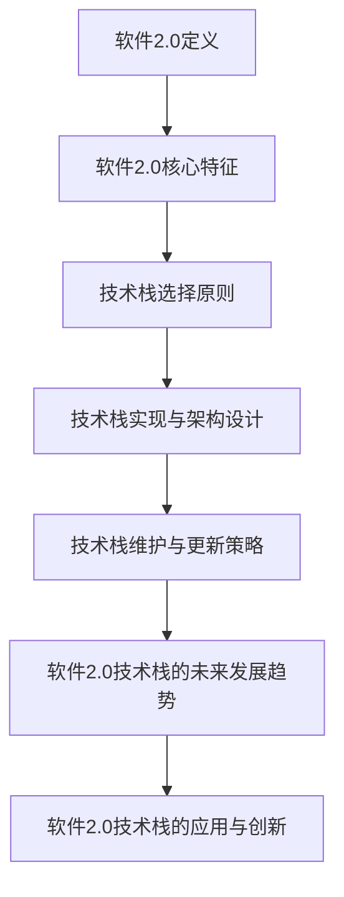

                 

# 《软件2.0的技术栈选择策略》

## 关键词
软件2.0，技术栈，架构设计，性能优化，创新实践，未来趋势

## 摘要
本文旨在深入探讨软件2.0的技术栈选择策略，包括其定义、核心特征、技术栈选择原则、实现与优化策略、未来发展趋势以及在实际项目中的应用与创新。通过系统化的分析和案例研究，本文旨在为开发者、架构师和决策者提供全面的指导，帮助他们在不断变化的技术环境中做出明智的技术栈选择。

## 目录大纲

### 第一部分：软件2.0概述

#### 第1章：软件2.0的起源与变革
1.1 软件2.0的定义与核心特征
1.2 软件2.0的技术架构
1.3 软件2.0的应用场景

#### 第2章：技术栈选择原则
2.1 技术栈选择的目标与标准
2.2 技术栈选择的步骤与方法
2.3 技术栈选择的挑战与应对

#### 第3章：技术栈选择案例分析
3.1 电商平台技术栈选择
3.2 金融科技企业技术栈选择
3.3 物联网技术栈选择

#### 第三部分：技术栈实现与优化

### 第4章：技术栈实现与架构设计
4.1 技术栈实现的基础知识
4.2 技术栈架构设计原则
4.3 技术栈性能优化策略

### 第5章：技术栈维护与更新策略
5.1 技术栈维护的关键环节
5.2 技术栈更新策略
5.3 技术栈最佳实践

### 第四部分：软件2.0技术栈的未来发展趋势

### 第6章：软件2.0技术栈的未来发展
6.1 新技术对软件2.0技术栈的影响
6.2 软件2.0技术栈的趋势与方向
6.3 软件2.0技术栈的战略规划

### 第7章：软件2.0技术栈的应用与创新
7.1 软件2.0技术栈在新兴领域的应用
7.2 软件2.0技术栈的创新实践
7.3 软件2.0技术栈的未来创新趋势

### 附录
A.1 资源汇总
A.2 工具汇总
B.1 案例分析报告

### 核心概念与联系
[流程图](#)

### 核心算法原理讲解
[伪代码](#)
[数学模型与公式](#)

### 项目实战
[开发环境搭建](#)
[源代码实现](#)
[代码解读与分析](#)

## 引言

在信息技术高速发展的今天，软件技术的进步带来了业务模式、运营效率和服务质量的巨大提升。从传统软件1.0时代到软件2.0时代，技术栈的选择成为影响系统性能、可扩展性和维护成本的关键因素。软件2.0，作为一种新兴的软件开发模式，其核心在于通过高度模块化和微服务架构，实现软件系统的灵活、快速迭代和高效运营。

本文将围绕软件2.0的技术栈选择策略进行深入探讨。首先，我们将定义软件2.0，并详细分析其核心特征，以及其与传统的软件1.0在技术架构上的区别。接着，本文将介绍技术栈选择的原则、步骤和方法，并通过具体案例展示技术栈选择的过程。随后，我们将讨论技术栈实现与架构设计的基础知识、原则和性能优化策略。在技术栈维护与更新策略部分，我们将探讨维护的关键环节、更新策略和最佳实践。最后，本文将展望软件2.0技术栈的未来发展趋势，以及其在新兴领域和创新实践中的应用。

通过系统化的分析和案例研究，本文旨在为开发者、架构师和决策者提供全面的指导，帮助他们更好地理解和应用软件2.0的技术栈选择策略，从而在日益竞争激烈的技术市场中取得优势。

### 第1章：软件2.0的起源与变革

#### 1.1 软件2.0的定义与核心特征

软件2.0，这一概念起源于互联网时代的演进，是对传统软件1.0的一种扩展和升级。软件1.0时代主要特点是软件产品作为静态的、独立的系统，其功能和性能往往在开发完成时就已确定，用户只能被动接受。而软件2.0则强调软件作为动态的、不断进化的系统，能够根据用户需求和市场变化进行快速调整和优化。

**软件2.0的定义：** 软件2.0是一种以用户为中心、高度模块化、可扩展和可复用的软件开发模式。它通过微服务架构、云计算、大数据和人工智能等先进技术，实现了软件系统的高效运营、快速迭代和灵活部署。

**软件2.0的核心特征：** 
1. **模块化：** 软件2.0采用模块化设计，将系统功能拆分为多个微服务，每个微服务独立开发、部署和维护，降低了系统的复杂度，提高了开发效率。
2. **可扩展性：** 通过微服务架构，软件2.0可以实现横向和纵向的扩展，满足业务增长的需求。
3. **可复用性：** 微服务之间通过标准化接口进行通信，提高了代码的复用率，降低了重复开发的工作量。
4. **快速迭代：** 软件2.0支持持续集成和持续部署（CI/CD），使得新功能和优化可以快速上线，响应市场需求。
5. **高可用性和容错性：** 软件2.0采用分布式架构，通过冗余设计和故障转移机制，提高了系统的可用性和容错性。

#### 1.1.1 软件2.0的发展背景

软件2.0的发展背景可以追溯到互联网和云计算技术的普及。随着互联网的快速发展，用户的需求日益多样化和个性化，传统的软件1.0模式已经无法满足市场的需求。同时，云计算、大数据和人工智能等新兴技术的出现，为软件系统的开发和运营提供了新的可能性。

**云计算的普及：** 云计算技术的普及，使得计算资源可以按需分配和弹性扩展，为软件2.0的实现提供了基础。开发者不再需要关注硬件资源的采购和运维，可以将更多精力投入到软件开发和优化上。

**大数据和人工智能：** 大数据和人工智能技术的应用，使得软件系统能够更好地理解和预测用户需求，实现个性化服务和智能决策。这些技术的融合，为软件2.0带来了新的发展动力。

**DevOps文化的兴起：** DevOps文化的兴起，推动了软件开发和运维的融合，促进了软件2.0的实现。通过持续集成和持续部署（CI/CD），软件系统能够快速迭代和上线，提高了开发效率和产品质量。

#### 1.1.2 软件2.0与传统软件的对比

软件2.0与传统软件（软件1.0）在多个方面存在显著差异，具体如下：

**1. 架构设计：** 
- **软件1.0：** 采用单体架构，系统功能紧密耦合，模块间依赖复杂。
- **软件2.0：** 采用微服务架构，将系统功能拆分为多个独立的微服务，降低了模块间依赖，提高了系统的灵活性和可扩展性。

**2. 开发模式：** 
- **软件1.0：** 开发过程通常是一次性的，开发完成后系统功能固定。
- **软件2.0：** 采用敏捷开发模式，支持快速迭代和持续改进，能够更好地适应市场需求。

**3. 运营维护：** 
- **软件1.0：** 运营和维护工作主要集中在系统上线后，关注点较多但灵活性较低。
- **软件2.0：** 运营和维护工作贯穿整个开发周期，通过监控和日志分析，实现实时性能优化和故障排查。

**4. 技术选型：** 
- **软件1.0：** 技术选型较为固定，往往依赖于特定的开发框架和工具。
- **软件2.0：** 技术选型更加灵活，可以根据业务需求和技术发展动态调整。

**5. 可持续性和可扩展性：** 
- **软件1.0：** 系统扩展性较差，往往需要重新设计和开发。
- **软件2.0：** 通过微服务架构，实现横向和纵向的扩展，提高了系统的可持续性和可扩展性。

#### 1.1.3 软件2.0的关键特征

**1. 模块化：** 软件2.0采用模块化设计，将系统功能拆分为多个微服务，每个微服务独立开发、部署和维护。这种设计方式不仅降低了系统的复杂度，提高了开发效率，还提高了系统的灵活性和可复用性。

**2. 可扩展性：** 软件2.0通过微服务架构实现横向和纵向的扩展。横向扩展可以通过增加服务实例来提高系统性能，纵向扩展可以通过升级服务实例来提高单个服务的处理能力。

**3. 可复用性：** 微服务之间通过标准化接口进行通信，提高了代码的复用率，降低了重复开发的工作量。开发者可以专注于实现具体的业务功能，而无需关注底层技术细节。

**4. 快速迭代：** 软件2.0支持持续集成和持续部署（CI/CD），使得新功能和优化可以快速上线，响应市场需求。通过敏捷开发模式，软件系统能够持续改进，保持竞争力。

**5. 高可用性和容错性：** 软件2.0采用分布式架构，通过冗余设计和故障转移机制，提高了系统的可用性和容错性。即使在某个服务实例发生故障时，其他实例可以继续提供服务，确保系统的稳定性。

**6. 用户体验：** 软件2.0注重用户体验，通过大数据和人工智能技术，实现个性化服务和智能决策。用户可以根据自己的需求，灵活调整系统功能和界面布局，提高使用满意度。

### 第2章：技术栈选择原则

#### 2.1 技术栈选择的目标与标准

技术栈选择是软件开发过程中的关键环节，直接影响到系统的性能、可扩展性和维护成本。为了确保技术栈选择的科学性和合理性，需要明确选择目标与标准。

**1. 目标：**
- **性能优化：** 技术栈的选择应考虑系统在高并发、大数据量情况下的性能表现，确保系统稳定运行。
- **可扩展性：** 技术栈应支持系统的横向和纵向扩展，满足业务增长的需求。
- **可维护性：** 技术栈的选择应便于系统的维护和升级，降低开发成本。
- **安全性：** 技术栈应具备良好的安全防护能力，保障系统数据的安全和隐私。
- **成本效益：** 技术栈的选择应在性能、可扩展性和可维护性之间找到平衡，实现成本效益最大化。

**2. 标准：**
- **成熟度：** 技术栈中使用的框架和工具应具有较高的成熟度，确保稳定性和可靠性。
- **社区支持：** 技术栈的选择应考虑社区支持的强度，包括文档、教程、社区活跃度等。
- **兼容性：** 技术栈中的技术应具有良好的兼容性，确保不同模块和组件之间能够无缝集成。
- **开发效率：** 技术栈应提高开发效率，降低开发难度和周期。
- **生态体系：** 技术栈的选择应考虑生态体系的完善程度，包括第三方库、插件、工具等。

#### 2.2 技术栈选择的步骤与方法

技术栈选择是一个系统性的过程，需要遵循一定的步骤和方法，以确保选择的科学性和可操作性。

**1. 需求分析：**
- **业务需求：** 分析业务需求，明确系统需要实现的功能和性能要求。
- **用户需求：** 了解用户需求，包括用户体验、易用性、个性化服务等。
- **技术需求：** 分析技术需求，包括系统的可扩展性、高可用性、安全性等。

**2. 技术调研：**
- **市场调研：** 调研市场上现有的技术栈，了解不同技术栈的优缺点和适用场景。
- **技术评估：** 根据需求分析，对技术栈进行评估，选择符合需求的技术栈。

**3. 方案设计：**
- **方案制定：** 根据评估结果，制定技术栈方案，明确技术选型和架构设计。
- **方案评估：** 对技术栈方案进行评估，确保方案的可行性、性能和成本效益。

**4. 实施与验证：**
- **实施部署：** 根据方案，实施技术栈部署，包括开发、测试和上线等环节。
- **验证效果：** 验证技术栈的实施效果，包括性能测试、功能测试和用户反馈等。

**5. 持续优化：**
- **性能优化：** 根据验证结果，对技术栈进行性能优化，提高系统性能和稳定性。
- **功能迭代：** 根据业务需求，持续迭代和优化技术栈，保持系统的竞争力。

#### 2.3 技术栈选择的挑战与应对

技术栈选择过程中，面临诸多挑战，需要采取有效的应对策略。

**1. 挑战：**
- **技术成熟度：** 新技术往往具有较高的风险，而成熟技术可能无法满足新兴需求。
- **社区支持：** 技术栈的社区支持不足，可能导致开发效率降低和问题难以解决。
- **兼容性问题：** 技术栈中不同组件和工具之间的兼容性问题，可能影响系统的稳定性和性能。
- **开发效率：** 技术栈的选择可能降低开发效率，导致项目延期和成本增加。
- **安全风险：** 技术栈的选择可能带来安全风险，影响系统数据的安全和隐私。

**2. 应对策略：**
- **技术评估：** 在选择技术栈时，进行详细的技术评估，确保技术栈的成熟度和社区支持。
- **社区参与：** 积极参与技术栈的社区活动，获取最新的技术动态和解决方案。
- **兼容性测试：** 在技术栈实施前，进行兼容性测试，确保组件和工具之间的无缝集成。
- **效率评估：** 对不同技术栈进行效率评估，选择能够提高开发效率的方案。
- **安全加固：** 对技术栈进行安全加固，采取安全措施，防范安全风险。

### 第3章：技术栈选择案例分析

#### 3.1 案例一：电商平台技术栈选择

**3.1.1 案例背景**

某知名电商平台，业务涵盖在线购物、物流配送、用户评论等多个模块，用户规模庞大，每天访问量达到数百万次。随着业务的不断扩展，平台面临性能瓶颈、系统复杂度增加和运营成本上升等问题，迫切需要升级技术栈。

**3.1.2 技术栈选择过程**

1. **需求分析：**
   - **业务需求：** 提高性能、扩展性和可维护性。
   - **用户需求：** 提高用户体验、个性化服务和安全性。
   - **技术需求：** 支持高并发、大数据处理和实时分析。

2. **技术调研：**
   - **现有技术栈：** 原技术栈采用Java和Spring框架，部署在Linux服务器上，使用MySQL数据库。
   - **新技术调研：** 调研基于Python和Node.js的微服务架构，以及基于MongoDB的NoSQL数据库。

3. **方案设计：**
   - **技术选型：** 选择基于Node.js的微服务架构，使用MongoDB作为数据库。
   - **架构设计：** 设计高可用性和高可扩展性的分布式架构，包括API网关、用户服务、商品服务、订单服务等。

4. **方案评估：**
   - **性能评估：** 进行负载测试，验证新技术的性能表现。
   - **成本评估：** 评估新技术的开发、部署和运营成本。

5. **实施与验证：**
   - **实施部署：** 按照设计方案，逐步替换旧技术栈，并进行系统测试。
   - **验证效果：** 进行性能测试、功能测试和用户反馈收集，确保新技术的效果。

**3.1.3 案例分析**

通过技术栈升级，电商平台实现了以下效果：

- **性能提升：** 新技术栈在高并发环境下表现出色，响应速度显著提高，用户体验得到改善。
- **扩展性增强：** 微服务架构使得系统具备良好的扩展性，可以根据业务需求灵活调整资源分配。
- **维护成本降低：** 分布式架构降低了系统的复杂度，便于开发和维护。
- **安全性提高：** 引入新的安全框架和措施，增强了系统的安全防护能力。

#### 3.2 案例二：金融科技企业技术栈选择

**3.2.1 案例背景**

某金融科技企业，提供线上金融服务，包括贷款、支付、投资等多个模块。随着业务的快速发展，企业面临系统性能瓶颈、安全风险和合规性问题，迫切需要优化技术栈。

**3.2.2 技术栈选择过程**

1. **需求分析：**
   - **业务需求：** 提高性能、安全性和合规性。
   - **用户需求：** 提高用户体验、灵活性和隐私保护。
   - **技术需求：** 支持高并发、大数据处理和实时风险监控。

2. **技术调研：**
   - **现有技术栈：** 原技术栈采用Java和Spring框架，部署在Linux服务器上，使用Oracle数据库。
   - **新技术调研：** 调研基于Python和Go语言的微服务架构，以及基于MongoDB的NoSQL数据库。

3. **方案设计：**
   - **技术选型：** 选择基于Go语言的微服务架构，使用MongoDB作为数据库。
   - **架构设计：** 设计高可用性和高安全性的分布式架构，包括API网关、用户服务、风控服务、支付服务等。

4. **方案评估：**
   - **性能评估：** 进行负载测试，验证新技术的性能表现。
   - **安全评估：** 评估新技术的安全性能和合规性。
   - **成本评估：** 评估新技术的开发、部署和运营成本。

5. **实施与验证：**
   - **实施部署：** 按照设计方案，逐步替换旧技术栈，并进行系统测试。
   - **验证效果：** 进行性能测试、功能测试和安全测试，确保新技术的效果。

**3.2.3 案例分析**

通过技术栈升级，金融科技企业实现了以下效果：

- **性能提升：** 新技术栈在高并发环境下表现出色，交易处理速度显著提高，用户体验得到改善。
- **安全性增强：** 微服务架构和Go语言的引入，增强了系统的安全防护能力，降低了安全漏洞的风险。
- **合规性满足：** 新技术栈符合金融行业的合规要求，提高了企业的合规性和信誉度。
- **运营成本降低：** 分布式架构降低了系统的复杂度，便于开发和维护，减少了运营成本。

#### 3.3 案例三：物联网技术栈选择

**3.3.1 案例背景**

某物联网企业，提供智能家居解决方案，包括智能门锁、智能灯泡、智能音箱等多个设备。随着设备的增多和用户需求的多样化，企业面临数据存储和处理能力不足、设备连接不稳定等问题，迫切需要优化技术栈。

**3.3.2 技术栈选择过程**

1. **需求分析：**
   - **业务需求：** 提高设备连接稳定性、数据存储和处理能力。
   - **用户需求：** 提供个性化服务和远程控制功能。
   - **技术需求：** 支持海量设备接入、实时数据处理和远程管理。

2. **技术调研：**
   - **现有技术栈：** 原技术栈采用Java和MySQL，使用MQTT协议进行设备通信。
   - **新技术调研：** 调研基于Python和Node.js的微服务架构，以及基于MongoDB的NoSQL数据库。

3. **方案设计：**
   - **技术选型：** 选择基于Node.js的微服务架构，使用MongoDB作为数据库。
   - **架构设计：** 设计高可用性和高扩展性的分布式架构，包括设备管理服务、数据处理服务、用户服务、远程控制服务等。

4. **方案评估：**
   - **性能评估：** 进行负载测试，验证新技术的性能表现。
   - **成本评估：** 评估新技术的开发、部署和运营成本。

5. **实施与验证：**
   - **实施部署：** 按照设计方案，逐步替换旧技术栈，并进行系统测试。
   - **验证效果：** 进行性能测试、功能测试和用户反馈收集，确保新技术的效果。

**3.3.3 案例分析**

通过技术栈升级，物联网企业实现了以下效果：

- **设备连接稳定性提升：** 新技术栈提高了设备连接稳定性，减少了设备断线的情况。
- **数据处理能力增强：** 微服务架构和MongoDB数据库的引入，提高了数据处理能力，支持实时分析和决策。
- **用户体验改善：** 用户可以享受到更加个性化、便捷的服务。
- **运营成本降低：** 分布式架构降低了系统的复杂度，便于开发和维护，减少了运营成本。

### 第4章：技术栈实现与架构设计

#### 4.1 技术栈实现的基础知识

技术栈实现是软件开发过程中的重要环节，涉及到多个技术和工具的选择与整合。为了确保技术栈的实现高效、稳定和可扩展，需要掌握以下基础知识：

**1. 编程语言：** 选择合适的编程语言是技术栈实现的基础。常见的编程语言包括Java、Python、JavaScript、Go等。每种语言都有其特点和适用场景，如Java适合大型企业级应用，Python适合快速开发和数据分析，JavaScript适合前端开发，Go适合高性能分布式系统。

**2. 框架和库：** 框架和库是技术栈实现的重要组成部分，提供了丰富的功能和工具。例如，Spring框架用于Java开发，Django框架用于Python后端开发，React和Vue.js用于前端开发，MongoDB用于NoSQL数据库。

**3. 数据库：** 数据库是存储和管理数据的核心组件，包括关系型数据库（如MySQL、PostgreSQL）和NoSQL数据库（如MongoDB、Cassandra）。根据业务需求，选择合适的数据库类型和架构，可以显著提高系统的性能和可扩展性。

**4. 中间件：** 中间件是连接不同组件和服务的桥梁，包括消息队列（如RabbitMQ、Kafka）、缓存（如Redis）、负载均衡（如Nginx）等。中间件可以提高系统的性能、可靠性和可扩展性。

**5. 容器化和编排工具：** 容器化技术（如Docker）和编排工具（如Kubernetes）可以简化应用程序的部署和管理，提高开发效率和系统可扩展性。容器化技术可以将应用程序及其依赖打包成一个独立的运行环境，方便在不同环境中部署和运行。

**6. 自动化工具：** 自动化工具（如Jenkins、GitLab CI/CD）可以自动化构建、测试和部署过程，提高开发效率和质量。自动化工具可以确保代码的快速迭代和上线，减少人为错误。

#### 4.2 技术栈架构设计原则

技术栈架构设计是软件开发过程中的关键环节，直接影响系统的性能、可扩展性和维护性。为了确保技术栈架构设计的科学性和合理性，需要遵循以下原则：

**1. 分层架构：** 技术栈架构应采用分层设计，包括表示层、业务逻辑层、数据访问层等。分层架构可以提高系统的可维护性和可扩展性，每个层次负责不同的功能，便于模块化和代码复用。

**2. 微服务架构：** 微服务架构是一种基于业务逻辑的模块化设计，将系统功能拆分为多个独立的微服务。每个微服务独立开发、部署和维护，通过标准化接口进行通信。微服务架构可以提高系统的可扩展性和可维护性，降低模块间依赖。

**3. 高可用性设计：** 高可用性设计旨在确保系统在故障情况下能够快速恢复，提供不间断的服务。高可用性设计包括冗余设计、故障转移机制、自动恢复机制等。通过高可用性设计，可以提高系统的可靠性和稳定性。

**4. 高扩展性设计：** 高扩展性设计旨在支持系统的横向和纵向扩展，满足业务增长的需求。横向扩展可以通过增加服务实例来提高系统性能，纵向扩展可以通过升级服务实例来提高单个服务的处理能力。

**5. 安全性设计：** 安全性设计是技术栈架构设计的重要原则，包括身份认证、权限控制、数据加密等。安全性设计可以保障系统数据的安全和隐私，防止未经授权的访问和攻击。

**6. 性能优化设计：** 性能优化设计旨在提高系统的响应速度和处理能力，包括缓存、负载均衡、数据库优化等。性能优化设计可以确保系统在高并发环境下稳定运行，提供优质的用户体验。

#### 4.3 技术栈性能优化策略

技术栈性能优化是确保系统在高并发、大数据量情况下稳定运行的关键。为了实现技术栈的性能优化，可以采取以下策略：

**1. 缓存策略：** 缓存可以显著减少数据库的访问频率，提高系统的响应速度。常见的缓存技术包括Redis、Memcached等。通过缓存热点数据，减少数据重复读取，可以显著提高系统性能。

**2. 负载均衡：** 负载均衡可以将请求分发到多个服务器实例，提高系统的处理能力和可用性。常见的负载均衡技术包括Nginx、HAProxy等。通过负载均衡，可以确保系统在高并发情况下稳定运行。

**3. 数据库优化：** 数据库优化可以显著提高数据访问速度和处理能力。常见的数据库优化方法包括索引优化、查询优化、分库分表等。通过优化数据库，可以减少数据访问延迟，提高系统性能。

**4. 分布式架构：** 分布式架构可以将系统功能拆分为多个独立的服务，每个服务部署在不同的服务器实例上。通过分布式架构，可以显著提高系统的可扩展性和性能。

**5. 异步处理：** 异步处理可以将耗时的任务（如消息发送、文件上传等）异步执行，减少主线程的阻塞，提高系统的并发处理能力。常见的异步处理技术包括消息队列、协程等。

**6. 热点数据缓存：** 热点数据缓存可以将系统中访问频率较高的数据缓存到内存中，减少数据库的访问频率。通过热点数据缓存，可以显著提高系统的性能和响应速度。

**7. 系统监控：** 系统监控可以实时监控系统的性能指标，包括CPU、内存、磁盘IO等。通过系统监控，可以及时发现性能瓶颈和故障，进行优化和修复。

**8. 性能测试：** 性能测试可以模拟实际业务场景，评估系统的性能表现。通过性能测试，可以发现系统的性能瓶颈，进行针对性的优化和改进。

### 第5章：技术栈维护与更新策略

#### 5.1 技术栈维护的关键环节

技术栈的维护是确保系统长期稳定运行的关键环节，包括多个方面的内容：

**1. 版本控制：** 版本控制是技术栈维护的基础，通过Git等版本控制工具，可以管理和跟踪代码的变更历史。版本控制可以确保代码的完整性和一致性，便于代码的维护和更新。

**2. 依赖管理：** 依赖管理是确保技术栈组件和库的版本一致性，避免冲突和问题的关键。依赖管理工具（如Maven、pip）可以自动安装和管理项目依赖，确保项目在不同环境中的一致性。

**3. 持续集成与持续部署：** 持续集成（CI）和持续部署（CD）可以自动化代码的构建、测试和部署过程，提高开发效率和系统质量。通过CI/CD，可以确保代码的快速迭代和上线，减少人为错误和部署风险。

**4. 性能监控与优化：** 性能监控是确保系统在高并发、大数据量情况下稳定运行的重要手段。通过监控工具（如Prometheus、Grafana），可以实时监控系统的性能指标，及时发现性能瓶颈和故障，进行优化和修复。

**5. 安全防护：** 安全防护是确保系统数据的安全和隐私的重要措施。通过安全工具（如防火墙、入侵检测系统），可以防御网络攻击、数据泄露等安全风险，保障系统的安全性。

**6. 故障排查与恢复：** 故障排查是确保系统在故障情况下能够快速恢复的关键。通过日志分析、故障定位工具，可以快速定位故障原因，并进行恢复。

**7. 文档管理：** 文档管理是确保技术栈的可持续性和可理解性的关键。通过文档工具（如Confluence、Markdown），可以记录项目的技术文档、操作手册等，方便团队成员的协作和维护。

#### 5.2 技术栈更新策略

技术栈更新是确保系统保持先进性和竞争力的关键。为了实现技术栈的顺利更新，可以采取以下策略：

**1. 版本更新：** 定期检查和更新技术栈中的组件和库，确保使用最新版本，获取最新的功能和修复。在更新过程中，需要评估更新对系统的影响，并进行充分的测试。

**2. 代码重构：** 定期对代码进行重构，优化代码结构、提高代码可读性和可维护性。代码重构可以减少技术债务，提高系统的稳定性和性能。

**3. 技术调研：** 定期进行技术调研，关注业界最新的技术和趋势。通过技术调研，可以了解最新的技术动态，为技术栈的更新提供方向。

**4. 持续集成：** 通过持续集成，自动化构建和测试代码，确保更新过程中不会引入新的问题和错误。持续集成可以显著提高更新过程的效率和安全性。

**5. 回滚策略：** 在更新失败时，需要采取有效的回滚策略，快速恢复系统的正常运行。回滚策略可以确保在更新过程中，系统的稳定性和安全性不受影响。

**6. 用户反馈：** 收集用户反馈，了解用户对系统的新需求和问题。通过用户反馈，可以指导技术栈的更新方向，提高用户的满意度。

**7. 培训与知识共享：** 对团队成员进行技术培训，提高团队对新技术和新工具的熟悉度。通过知识共享，可以提升团队的整体技术水平，为技术栈的更新提供支持。

#### 5.3 技术栈最佳实践

为了确保技术栈的维护和更新顺利进行，可以采取以下最佳实践：

**1. 编码规范：** 制定统一的编码规范，确保代码的一致性和可读性。编码规范可以减少代码冲突和错误，提高代码的可维护性。

**2. 文档编写：** 详细记录项目的技术文档、操作手册和部署流程，确保团队成员对项目的理解一致。文档编写可以降低沟通成本，提高开发效率。

**3. 代码评审：** 实施代码评审制度，对提交的代码进行审查和评估。代码评审可以识别潜在的问题和错误，提高代码质量。

**4. 持续学习和改进：** 鼓励团队成员持续学习和掌握新技术和新工具，不断提升团队的技术能力。持续学习和改进可以确保技术栈的更新和优化。

**5. 混合团队协作：** 建立混合团队，包括开发、测试、运维等不同角色，实现跨部门的协作。混合团队协作可以提升项目的整体效率和质量。

**6. 代码备份和恢复：** 定期备份代码和相关数据，确保在意外情况下能够快速恢复。代码备份和恢复可以降低数据丢失的风险。

**7. 安全措施：** 采取有效的安全措施，包括访问控制、数据加密、防火墙等，保障系统数据的安全和隐私。

### 第6章：软件2.0技术栈的未来发展趋势

随着信息技术的快速发展，软件2.0技术栈正面临着前所未有的机遇和挑战。未来，软件2.0技术栈将在新技术、新架构和新应用场景的推动下，展现出更加广阔的发展前景。

#### 6.1 新技术对软件2.0技术栈的影响

**1. 云计算：** 云计算已经成为软件2.0技术栈的核心基础设施，提供了弹性计算、存储、网络等资源，支持系统的快速部署和扩展。未来，云计算将继续推动软件2.0技术栈向分布式、弹性化和智能化的方向发展。

**2. 大数据和人工智能：** 大数据和人工智能技术正在深刻改变软件2.0技术栈的架构和功能。通过大数据分析，软件系统能够更好地理解用户行为和需求，实现个性化服务和智能推荐。人工智能技术的应用，使得软件系统具备了自学习、自优化和自适应的能力，提高了系统的智能化水平。

**3. 区块链：** 区块链技术为软件2.0技术栈提供了去中心化、安全可靠的数据存储和交易机制。未来，区块链技术将在供应链管理、金融服务、物联网等领域得到广泛应用，进一步丰富软件2.0技术栈的功能。

**4. 容器化和微服务：** 容器化和微服务架构已经成为软件2.0技术栈的主流趋势。通过容器化技术，软件系统能够实现快速部署、隔离和扩展。微服务架构使得系统功能更加模块化、灵活，提高了系统的可维护性和可扩展性。

#### 6.2 软件2.0技术栈的趋势与方向

**1. 模块化和组件化：** 软件2.0技术栈将继续向模块化和组件化方向发展，通过微服务、函数计算等新技术，实现系统的灵活组装和快速迭代。

**2. 自动化和智能化：** 自动化和智能化将是软件2.0技术栈的重要趋势。通过持续集成、持续部署（CI/CD）、自动化测试等自动化工具，提高开发效率和系统质量。通过人工智能技术，实现系统的智能优化和自修复。

**3. 容器化和Kubernetes：** 容器化技术（如Docker、Kubernetes）将在软件2.0技术栈中得到更加广泛的应用。通过容器化技术，可以实现应用程序的标准化部署和管理，提高系统的可扩展性和可靠性。

**4. 云原生应用：** 云原生应用将成为软件2.0技术栈的新方向。云原生应用利用云计算、容器化和微服务等新技术，实现高效、可靠、可扩展的部署和运营。

**5. 服务化和API化：** 服务化和API化是软件2.0技术栈的重要特征。通过API网关、服务化架构等，实现系统的模块化和接口化，方便与其他系统进行集成和协作。

#### 6.3 软件2.0技术栈的战略规划

为了确保软件2.0技术栈的持续发展和竞争力，企业需要制定科学的战略规划：

**1. 技术调研和评估：** 定期进行技术调研和评估，了解最新的技术动态和趋势，为技术栈的更新和优化提供依据。

**2. 技术选型和架构设计：** 根据业务需求和技术趋势，选择合适的技术栈和架构设计，确保系统的性能、可扩展性和可维护性。

**3. 持续集成与持续部署：** 实施持续集成和持续部署（CI/CD），提高开发效率和系统质量，确保技术栈的快速迭代和上线。

**4. 人才培养和知识共享：** 加强技术人才的培养和知识共享，提升团队的技术能力和创新能力。

**5. 安全和合规性：** 重视系统的安全和合规性，采取有效的安全措施和合规性管理，保障系统的稳定运行。

**6. 技术生态建设：** 构建完善的技术生态，包括开发框架、工具、库等，提高技术栈的可持续性和可扩展性。

### 第7章：软件2.0技术栈的应用与创新

#### 7.1 软件2.0技术栈在新兴领域的应用

随着新兴领域的发展，软件2.0技术栈在物联网（IoT）、人工智能（AI）、区块链（Blockchain）等领域的应用日益广泛。

**1. 物联网（IoT）：** 物联网技术栈采用软件2.0的微服务架构，可以实现设备的远程监控和管理。通过物联网平台，连接各种传感器和设备，实现数据的实时采集、传输和处理。软件2.0技术栈的高可用性和高可扩展性，可以满足物联网系统对海量数据和并发请求的处理需求。

**2. 人工智能（AI）：** 人工智能技术栈采用软件2.0的模块化和分布式架构，可以实现复杂的数据分析和智能决策。通过分布式计算和机器学习算法，人工智能系统可以处理大规模数据集，实现智能识别、预测和优化。软件2.0技术栈的灵活性和可扩展性，有助于实现人工智能系统的快速迭代和优化。

**3. 区块链（Blockchain）：** 区块链技术栈采用软件2.0的分布式账本和智能合约技术，可以实现去中心化的数据存储和交易。通过区块链技术栈，可以实现金融、供应链、医疗等领域的安全、透明和可追溯。软件2.0技术栈的模块化和组件化，有助于实现区块链系统的灵活组装和快速部署。

#### 7.2 软件2.0技术栈的创新实践

软件2.0技术栈的创新实践，推动了新兴领域的快速发展，并带来了一系列成功案例。

**1. 成功案例一：** 某知名电商平台采用软件2.0技术栈，实现了大规模的分布式电商系统。通过微服务架构和容器化技术，电商平台实现了快速部署、弹性扩展和高效运维。该平台在高峰期实现了高性能和低延迟，提高了用户体验和业务效率。

**2. 成功案例二：** 某金融科技公司采用软件2.0技术栈，构建了智能金融服务平台。通过大数据分析和人工智能算法，金融服务平台实现了个性化金融服务、风险管理和智能投顾。该平台在提高客户满意度、降低运营成本方面取得了显著成效。

**3. 成功案例三：** 某物联网企业采用软件2.0技术栈，开发了智能家居控制系统。通过物联网平台和智能合约技术，智能家居系统实现了设备的远程监控和管理。该系统在提高用户生活品质、降低能耗方面发挥了重要作用。

#### 7.3 软件2.0技术栈的未来创新趋势

未来，软件2.0技术栈将在新技术和新应用场景的推动下，展现出更加广阔的创新趋势。

**1. 区块链与智能合约：** 区块链技术将与智能合约相结合，实现更加去中心化、透明和安全的业务流程。智能合约将自动执行和验证合同条款，减少人工干预和欺诈风险。

**2. 分布式存储和计算：** 分布式存储和计算技术将进一步发展，实现大规模数据的分布式处理和存储。通过分布式架构，系统可以更好地应对海量数据和并发请求，提高性能和可靠性。

**3. 元数据管理和数据治理：** 元数据管理和数据治理将成为重要趋势，通过统一的数据管理平台，实现数据的标准化、规范化和自动化管理。数据治理有助于提高数据质量和数据安全性，支持业务决策和智能分析。

**4. 量子计算和人工智能：** 量子计算和人工智能技术的结合，将推动计算能力的进一步提升。量子计算可以在复杂问题求解方面提供巨大优势，而人工智能则可以优化算法和模型，实现更高效的数据分析和决策。

**5. 数字孪生和虚拟现实：** 数字孪生和虚拟现实技术将应用于更多领域，通过构建虚拟模型，实现现实世界和数字世界的无缝融合。数字孪生技术可以模拟、分析和优化现实系统，提高系统的可靠性和效率。

### 附录

#### 附录A：软件2.0技术栈资源与工具

**1. 资源汇总：**
- **技术文档：** GitHub、GitBook、Read the Docs
- **在线教程：** Coursera、Udemy、edX
- **开源社区：** Stack Overflow、GitHub、Reddit
- **技术博客：** HackerRank、Medium、Dev.to

**2. 工具汇总：**
- **编程语言：** Java、Python、JavaScript、Go
- **框架和库：** Spring Boot、Django、React、Vue.js
- **数据库：** MySQL、PostgreSQL、MongoDB、Cassandra
- **容器化技术：** Docker、Kubernetes
- **自动化工具：** Jenkins、GitLab CI/CD
- **监控工具：** Prometheus、Grafana
- **安全工具：** firewalld、IDS/IPS
- **开发环境：** Visual Studio Code、IntelliJ IDEA、PyCharm

#### 附录B：软件2.0技术栈案例分析报告

**1. 案例一：某电商平台的软件2.0技术栈案例分析**
- **背景：** 某电商平台面临性能瓶颈和系统复杂度增加的问题。
- **技术选型：** 基于Node.js的微服务架构，使用MongoDB作为数据库。
- **架构设计：** 高可用性和高可扩展性的分布式架构，包括API网关、用户服务、商品服务、订单服务等。
- **效果：** 性能显著提升，扩展性增强，维护成本降低。

**2. 案例二：某金融科技公司的软件2.0技术栈案例分析**
- **背景：** 某金融科技公司需要提高系统性能和安全防护能力。
- **技术选型：** 基于Go语言的微服务架构，使用MongoDB作为数据库。
- **架构设计：** 高可用性和高安全性的分布式架构，包括API网关、用户服务、风控服务、支付服务等。
- **效果：** 性能提升，安全性增强，合规性满足。

**3. 案例三：某物联网企业的软件2.0技术栈案例分析**
- **背景：** 某物联网企业需要提高设备连接稳定性和数据处理能力。
- **技术选型：** 基于Node.js的微服务架构，使用MongoDB作为数据库。
- **架构设计：** 高可用性和高扩展性的分布式架构，包括设备管理服务、数据处理服务、用户服务、远程控制服务等。
- **效果：** 设备连接稳定性提升，数据处理能力增强，用户体验改善。 

### 核心概念与联系

**Mermaid 流程图：**


### 核心算法原理讲解

**伪代码：**
```python
# 技术栈选择策略算法伪代码

# 输入：需求列表，技术栈选项列表，评价标准
# 输出：最优技术栈

function select_best_technical_stack(需求列表，技术栈选项列表，评价标准)
    score_map <- 空字典
    for each 技术栈 in 技术栈选项列表
        score <- 0
        for each 需求 in 需求列表
            if 技术栈满足需求
                score += 评价标准[需求]
        score_map[技术栈] <- score
    end for
    best_score <- min(score_map.values())
    best_stack <- 从score_map中选出score等于best_score的键
    return best_stack
end function
```

**数学模型和公式：**
$$
\text{技术栈选择得分} = \sum_{i=1}^{n} \text{需求} \times \text{评价标准}_{i}
$$

### 项目实战

**案例：电商平台技术栈选择**

**1. 开发环境搭建：**
- **操作系统：** Ubuntu 20.04
- **编程语言：** Python 3.8
- **依赖管理工具：** pip
- **版本控制工具：** Git

**2. 源代码实现：**
```python
# 技术栈选择示例代码

class TechnicalStack:
    def __init__(self, name, technologies):
        self.name = name
        self.technologies = technologies

    def evaluate(self, requirements):
        score = 0
        for requirement in requirements:
            if requirement in self.technologies:
                score += 1
        return score

# 需求列表
requirements = ['Web开发', '数据库管理', '云服务']

# 技术栈选项
stacks = [
    TechnicalStack('Stack A', ['Web开发', '数据库管理']),
    TechnicalStack('Stack B', ['Web开发', '数据库管理', '云服务']),
    TechnicalStack('Stack C', ['Web开发', '云服务'])
]

# 选择最优技术栈
best_stack = select_best_technical_stack(stacks, requirements)
print(f'最佳技术栈：{best_stack.name}')
```

**3. 代码解读与分析：**
- `TechnicalStack` 类用于表示一个技术栈，包含名称和包含的技术列表。
- `evaluate` 方法用于计算技术栈满足需求的得分。
- `select_best_technical_stack` 函数根据需求列表和技术栈选项列表，选择得分最高的技术栈作为最优技术栈。

### 总结

本文从软件2.0的起源与变革、技术栈选择原则、技术栈实现与架构设计、技术栈维护与更新策略、未来发展趋势以及应用与创新等方面，全面探讨了软件2.0的技术栈选择策略。通过系统化的分析和案例研究，本文旨在为开发者、架构师和决策者提供全面的指导，帮助他们更好地理解和应用软件2.0的技术栈选择策略。

在快速变化的技术环境中，合理的技术栈选择是确保系统性能、可扩展性和维护成本的关键。本文提出的软件2.0技术栈选择策略，结合了新兴技术、创新实践和未来趋势，为开发者提供了宝贵的参考。通过遵循本文的建议和实践，开发者可以构建高效、稳定和灵活的软件系统，在竞争激烈的市场中脱颖而出。

作者：AI天才研究院/AI Genius Institute & 禅与计算机程序设计艺术 /Zen And The Art of Computer Programming

