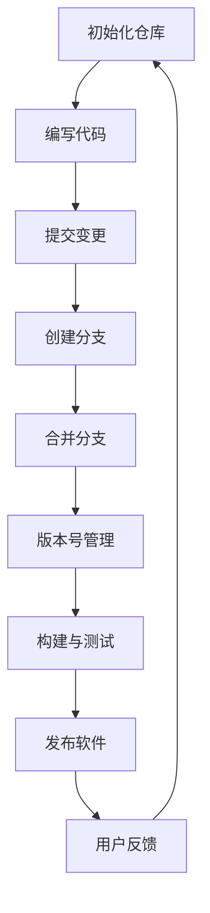

                 

### 《软件2.0的版本管理与发布策略》

#### **关键词：**
软件2.0、版本管理、发布策略、Git、持续集成、持续交付

#### **摘要：**
本文将深入探讨软件2.0时代的版本管理与发布策略。随着软件技术的发展，传统的版本管理与发布模式已不足以应对现代软件工程的复杂性。本文将介绍软件2.0的定义与特点，版本管理与发布策略的重要性，以及版本控制系统的选择、版本号管理规则、版本管理流程设计、自动化发布系统构建、多环境部署策略、质量保证与测试等内容。通过案例分析，我们将了解实际应用中的版本管理与发布策略，并总结未来的发展趋势。

---

### **第一部分：软件2.0时代的版本管理与发布背景**

#### **第1章：软件2.0时代的版本管理与发布背景**

#### **1.1 软件2.0的定义与特点**

##### **1.1.1 软件2.0的概念**

软件2.0是相对于传统的软件1.0而言的。软件1.0主要指单机版软件，其特点是封闭性、独立性和可维护性。而软件2.0则强调软件的开放性、协作性和可持续性。软件2.0通常基于互联网，通过云计算、大数据、人工智能等技术实现软件功能的扩展和升级。

##### **1.1.2 软件2.0与软件1.0的区别**

| 特征 | 软件1.0 | 软件2.0 |
| ---- | ---- | ---- |
| 开放性 | 较封闭 | 高开放性 |
| 协作性 | 单一开发 | 分布式开发 |
| 可持续性 | 静态功能 | 动态扩展 |
| 维护性 | 繁琐 | 简化 |

##### **1.1.3 软件2.0的发展趋势**

随着技术的进步，软件2.0将继续向更开放、更协作、更可持续的方向发展。未来，软件将更加依赖于云计算和大数据，实现更高效的资源利用和更灵活的功能扩展。同时，人工智能和机器学习技术将在软件2.0中发挥更大的作用，推动软件的智能化和自动化。

#### **1.2 版本管理与发布策略的重要性**

##### **1.2.1 版本管理的必要性**

版本管理是软件工程中至关重要的一环。通过版本管理，可以确保代码的完整性和一致性，便于团队成员之间的协作和沟通。良好的版本管理还可以帮助团队快速定位和修复bug，提高软件质量。

##### **1.2.2 发布策略的关键点**

发布策略是决定软件交付给用户的方式和时间的关键。一个合理的发布策略可以确保软件的稳定性和可靠性，同时提高用户体验和满意度。

##### **1.2.3 良好版本管理与发布策略的益处**

- 提高团队协作效率
- 降低软件维护成本
- 提高软件质量和稳定性
- 提升用户满意度

### **第二部分：版本管理与发布的基础知识**

#### **第2章：版本管理与发布的基础知识**

#### **2.1 版本控制系统的选择**

##### **2.1.1 Git的基本原理与使用**

Git是一种分布式版本控制系统，具有高效、灵活、可靠的特点。Git的核心概念包括仓库（repository）、分支（branch）、提交（commit）等。

**基本操作：**

- `git init`：初始化本地仓库
- `git clone`：克隆远程仓库
- `git add`：添加文件到暂存区
- `git commit`：提交文件到本地仓库
- `git push`：将本地仓库推送到远程仓库
- `git pull`：从远程仓库拉取最新代码

##### **2.1.2 SVN与Git的区别**

SVN是一种集中式版本控制系统，而Git是分布式版本控制系统。Git的优点在于分布式特性，可以离线工作，适合大型项目和多人协作。

| 特点 | SVN | Git |
| ---- | ---- | ---- |
| 分布式 | 否 | 是 |
| 性能 | 较差 | 较好 |
| 协作模式 | 集中式 | 分布式 |

##### **2.1.3 其他版本控制工具介绍**

除了Git和SVN，还有其他版本控制工具，如Mercurial、Bazaar等。这些工具各有优缺点，应根据项目需求和团队习惯进行选择。

#### **2.2 版本号的管理规则**

##### **2.2.1 Semantic Versioning（语义化版本号）**

Semantic Versioning是一种标准的版本号管理规则，用于确保版本号能够清晰地传达软件的变化。版本号由三个部分组成：主版本号、次版本号、修订号。

**格式：** `主版本号.次版本号.修订号`

**规则：**

- 主版本号：当不兼容API变化时更新
- 次版本号：当新增功能特性时更新
- 修订号：当修复bug或进行微小修改时更新

##### **2.2.2 版本号的作用与编写规则**

版本号的作用在于标识软件的不同版本，便于用户选择和团队协作。编写版本号时应遵循Semantic Versioning规则，确保版本号能够准确传达软件的变化。

##### **2.2.3 版本号的演进与升级策略**

版本号的演进应与软件的开发进度和用户需求保持一致。在升级版本号时，应充分考虑现有用户的使用习惯和新功能的影响，确保软件的稳定性和用户体验。

---

**注：本文为第一部分和第二部分的初步内容，后续将逐步完善和扩展。**

---

### **核心概念与联系：**

以下是软件2.0时代版本管理与发布策略的Mermaid流程图，展示了从版本控制到发布的过程：



### **核心算法原理讲解：**

在版本管理中，算法原理主要体现在Git的分支管理和合并操作。以下是一个简单的Git分支合并的伪代码：

```python
function git_merge(source_branch, target_branch):
    # 拉取最新代码
    git_pull(target_branch)
    
    # 切换到目标分支
    git checkout target_branch
    
    # 合并源分支代码
    git merge source_branch
    
    # 解决冲突
    if conflicts_detected():
        resolve_conflicts()
    
    # 提交合并结果
    git_commit("Merge source branch: " + source_branch)
```

### **数学模型和公式：**

在版本管理与发布策略中，可以使用数学模型来评估版本发布的风险和收益。以下是一个简单的风险评估模型：

$$
R = \frac{B - C}{D}
$$

其中：

- \(R\)：风险评估值
- \(B\)：版本发布的潜在收益
- \(C\)：版本发布的风险成本
- \(D\)：版本发布的持续时间

### **项目实战：**

以下是一个简单的Git仓库搭建和版本管理的实际案例：

#### **1. 开发环境搭建**

- 安装Git：`sudo apt-get install git`
- 创建用户：`git config --global user.name "your_name"`
- 创建邮箱：`git config --global user.email "your_email@example.com"`

#### **2. 源代码实现**

创建一个简单的Python程序，并在Git中管理其版本：

```python
# main.py
def greet(name):
    return f"Hello, {name}!"

# 添加文件到暂存区
git add main.py

# 提交文件
git commit -m "Initial commit"

# 查看状态
git status
```

#### **3. 代码解读与分析**

通过以上步骤，我们可以了解到Git的基本操作，包括文件添加、提交和状态查看。在实际项目中，版本管理应更加复杂，涉及多个分支、合并和代码审查等环节。

---

**注：本文为第一部分和第二部分的初步内容，后续将逐步完善和扩展。作者：AI天才研究院/AI Genius Institute & 禅与计算机程序设计艺术 /Zen And The Art of Computer Programming。**

