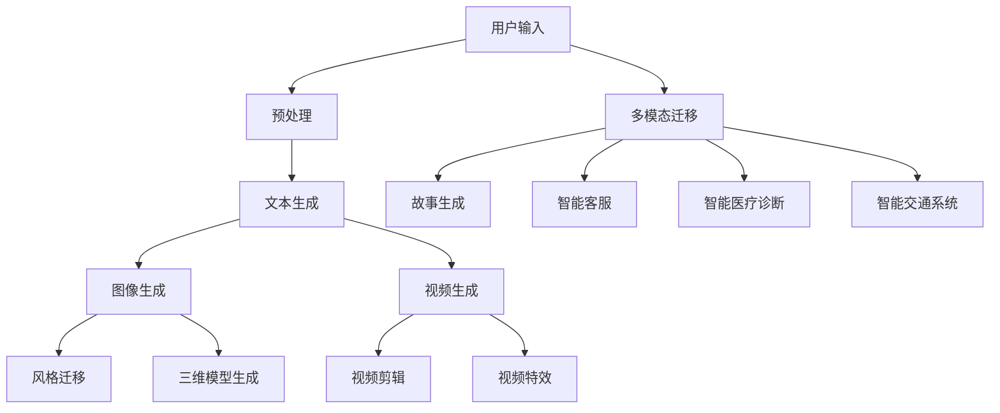
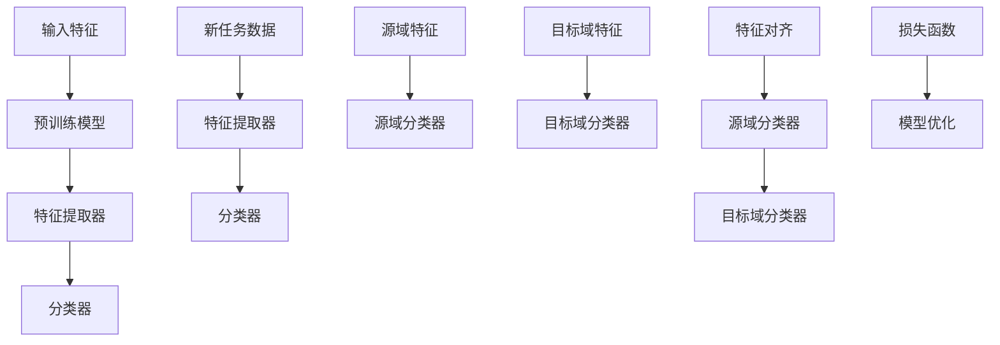
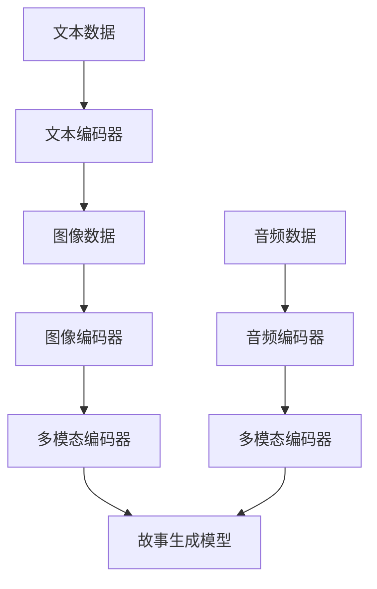
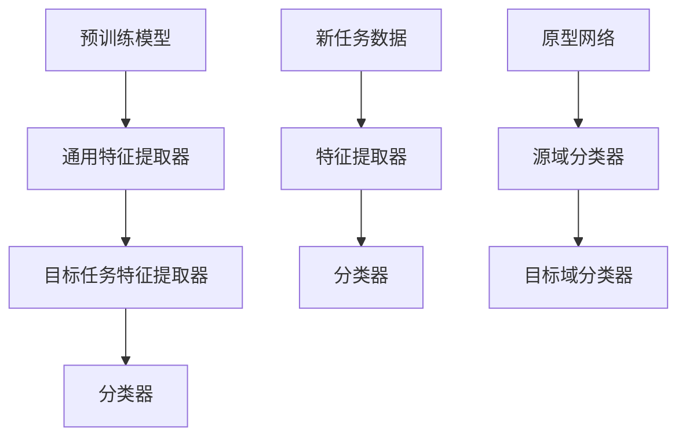
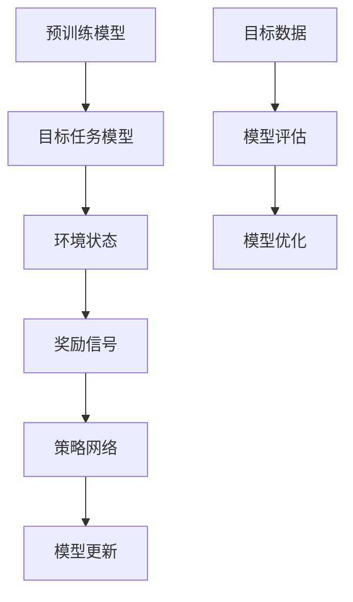
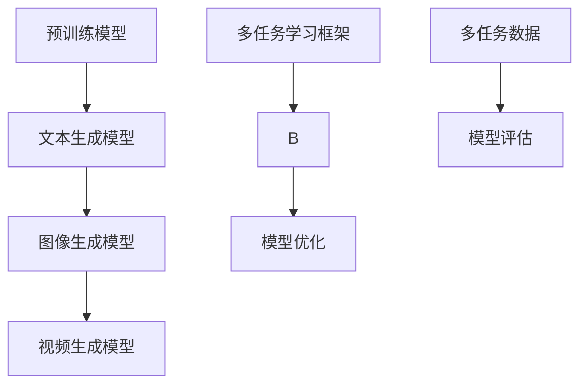

                 

### 《迁移学习在AIGC领域适应性中的新突破》

关键词：迁移学习、AIGC、零样本学习、自适应迁移学习、多任务迁移学习

摘要：
随着人工智能技术的发展，生成式模型在自然语言处理、计算机视觉等领域取得了显著的成果。然而，这些模型通常需要大量标注数据来进行训练，这在现实应用中存在诸多困难。迁移学习作为一种有效的方法，能够将预训练模型的知识迁移到新的任务中，减少对新数据的依赖。本文将深入探讨迁移学习在自适应生成内容（AIGC）领域的适应性新突破，包括零样本迁移学习、自适应迁移学习和多任务迁移学习等前沿研究，并分析其在实际应用中的挑战与展望。

----------------------------------------------------------------
### 《迁移学习在AIGC领域适应性中的新突破》目录大纲

下面将按照大纲结构，逐步展开对每个章节的详细论述。每个章节都将包含核心概念的解释、相关算法的详细讲解、实际应用的案例分析和未来发展的展望。

----------------------------------------------------------------
### 第一部分：迁移学习概述与AIGC领域背景

#### 第1章：迁移学习基础

迁移学习是一种机器学习技术，其核心思想是将一个任务在源域上学习到的知识迁移到另一个任务的目标域上。这种技术能够显著降低对新数据的依赖，提高模型的泛化能力。本章将介绍迁移学习的定义、分类及其面临的挑战。

#### 第2章：AIGC领域概述

自适应生成内容（AIGC）是人工智能领域的一个新兴方向，它结合了生成式模型和自适应技术，能够在不同场景下自动生成丰富多样的内容。本章将介绍AIGC的定义、核心技术、发展现状以及面临的挑战。

----------------------------------------------------------------
### 第一部分：迁移学习概述与AIGC领域背景

#### 第1章：迁移学习基础

### 1.1 迁移学习的定义与重要性

#### 1.1.1 迁移学习的概念

迁移学习（Transfer Learning）是机器学习领域的一种技术，它利用已经在一个任务（源域）上训练好的模型，将学到的知识迁移到另一个任务（目标域）上。这种技术能够显著减少对新数据的依赖，提高模型的泛化能力。

迁移学习的核心思想是，不同任务之间可能存在一定的共性，这些共性可以用来提高新任务的学习效果。例如，在计算机视觉任务中，预训练的模型已经学习到了图像的基本特征，这些特征可以在新任务中直接使用，从而减少对新数据的训练时间。

#### 1.1.2 迁移学习的重要性

迁移学习在机器学习领域具有重要的应用价值。首先，它能够降低对新数据的依赖，提高模型的泛化能力。特别是在数据稀缺的情况下，迁移学习可以显著提高模型的性能。其次，迁移学习能够减少模型的训练时间，提高模型的训练效率。最后，迁移学习可以帮助解决不同领域间的知识共享问题，促进跨领域的创新。

### 1.2 迁移学习的分类

迁移学习根据不同的分类标准，可以分为多种类型。以下是一些常见的迁移学习分类：

#### 1.2.1 自上而下迁移

自上而下迁移（From-Top-Down Transfer）是指将高层次的特征迁移到低层次的任务中。在这种迁移方式中，预训练模型通常已经学习到了大量的通用特征，这些特征可以用于新的低层次任务。

#### 1.2.2 自下而上迁移

自下而上迁移（From-Bottom-Up Transfer）则相反，是指将低层次的特征迁移到高层次的任务中。这种方式通常用于将基础模型的知识迁移到更复杂的任务中。

#### 1.2.3 对抗性迁移

对抗性迁移（Adversarial Transfer）是一种利用对抗性网络进行特征迁移的方法。在这种方法中，通过训练一个对抗性网络，使得源域的特征能够适应目标域的任务。

#### 1.2.4 多任务迁移

多任务迁移（Multi-Task Transfer）是指同时将多个任务的知识迁移到新的任务中。这种方式能够充分利用不同任务之间的共性，提高模型的泛化能力。

### 1.3 迁移学习的主要挑战

尽管迁移学习具有显著的优势，但在实际应用中仍然面临一些挑战。以下是一些主要的挑战：

#### 1.3.1 可迁移性评估

可迁移性评估是迁移学习中的一个重要问题。如何准确评估两个任务之间的迁移能力，是迁移学习研究的一个重要方向。现有的评估方法包括基于性能的评估和基于特征的评估。

#### 1.3.2 零样本学习

零样本学习（Zero-Shot Learning）是一种迁移学习场景，其中模型在目标域上没有训练数据。这种情况下，模型需要利用源域上的知识来处理新的任务。零样本学习是目前迁移学习领域的一个研究热点。

#### 1.3.3 跨模态迁移

跨模态迁移（Cross-Modal Transfer）是指将一个模态（如文本）的知识迁移到另一个模态（如图像）的任务中。这种迁移方式在多模态学习、多媒体分析等领域具有重要意义。

#### 1.3.4 小样本学习

小样本学习（Few-Shot Learning）是迁移学习的一个分支，它关注在数据稀缺的情况下如何利用迁移学习提高模型的性能。小样本学习在智能助手、自动化设计等领域具有广泛的应用前景。

#### 1.3.5 模型解释性

迁移学习的模型通常非常复杂，这使得模型的可解释性成为一个挑战。如何提高迁移学习模型的可解释性，是当前研究的一个重要方向。

### 总结

本章对迁移学习进行了详细的介绍，包括其定义、分类、主要挑战以及应用场景。迁移学习作为一种有效的机器学习技术，已经在多个领域取得了显著的成果。接下来，我们将进一步探讨AIGC领域的背景和迁移学习在该领域的应用。

----------------------------------------------------------------
#### 第2章：AIGC领域概述

自适应生成内容（Adaptive Generative Content，简称AIGC）是近年来人工智能领域的一个新兴研究方向。AIGC旨在通过生成式模型和自适应技术，实现内容自动生成和个性化推荐。AIGC在多个领域具有广泛的应用潜力，如自然语言处理、计算机视觉、虚拟现实和游戏设计等。

### 2.1 AIGC的概念与定义

AIGC的定义涉及生成式模型和自适应技术。生成式模型是一种能够生成新数据的模型，如生成对抗网络（GAN）和变分自编码器（VAE）。自适应技术则能够根据用户的需求和环境的变化，自动调整生成模型的行为。

因此，AIGC可以定义为：利用生成式模型生成内容，并通过自适应技术根据用户需求和情境进行调整的自动化内容生成系统。

### 2.1.1 AIGC的定义

AIGC的核心技术包括：

1. **生成式模型**：如GAN、VAE等，用于生成新的数据。
2. **自适应技术**：包括强化学习、主动学习等，用于根据用户需求和环境变化调整生成模型的行为。
3. **多模态数据融合**：将不同模态（如文本、图像、音频）的数据进行融合，以生成更加丰富和多样化的内容。

### 2.1.2 AIGC的核心技术

AIGC的核心技术主要包括：

1. **生成对抗网络（GAN）**：GAN由生成器和判别器组成，生成器生成数据，判别器判断数据的真实性。通过训练生成器和判别器的交互，生成器可以逐渐生成更真实的数据。
   
2. **变分自编码器（VAE）**：VAE通过引入概率模型来生成数据，能够生成多样化且符合数据分布的新数据。

3. **强化学习**：强化学习算法可以用来训练生成模型，使其能够根据用户反馈进行自适应调整。

4. **多模态数据融合**：多模态数据融合技术可以将不同模态的数据进行融合，生成更加丰富和多样化的内容。

### 2.2 AIGC的发展现状

AIGC领域的发展可以追溯到生成式模型和自适应技术的早期研究。随着深度学习技术的兴起，AIGC得到了快速发展。目前，AIGC已经在多个领域取得了显著的应用成果：

1. **自然语言处理**：AIGC在自然语言生成、机器翻译、情感分析等领域具有广泛的应用。例如，基于GAN的文本生成模型可以生成高质量的新闻文章、对话文本等。

2. **计算机视觉**：AIGC在图像生成、图像修复、风格迁移等领域具有广泛的应用。例如，GAN可以生成高质量的图像，VAE可以用于图像压缩和去噪。

3. **虚拟现实与游戏**：AIGC可以用于生成虚拟环境、角色模型、游戏剧情等，为用户提供更加丰富和沉浸式的体验。

4. **艺术设计**：AIGC可以用于自动设计图形、音乐、服装等，为艺术家提供创新的工具。

### 2.2.1 发展历程

AIGC的发展历程可以分为以下几个阶段：

1. **早期研究**：生成式模型和自适应技术的早期研究，如GAN和VAE的提出。

2. **技术突破**：随着深度学习技术的兴起，AIGC技术得到了快速发展，如基于GAN的图像生成模型。

3. **应用探索**：AIGC在自然语言处理、计算机视觉、虚拟现实等领域的应用探索。

4. **商业化应用**：AIGC技术的商业化应用，如生成式艺术、智能客服、虚拟现实等。

### 2.2.2 应用领域

AIGC在多个领域具有广泛的应用：

1. **自然语言处理**：AIGC在文本生成、机器翻译、情感分析等领域具有广泛的应用。例如，基于GAN的文本生成模型可以生成高质量的新闻文章、对话文本等。

2. **计算机视觉**：AIGC在图像生成、图像修复、风格迁移等领域具有广泛的应用。例如，GAN可以生成高质量的图像，VAE可以用于图像压缩和去噪。

3. **虚拟现实与游戏**：AIGC可以用于生成虚拟环境、角色模型、游戏剧情等，为用户提供更加丰富和沉浸式的体验。

4. **艺术设计**：AIGC可以用于自动设计图形、音乐、服装等，为艺术家提供创新的工具。

### 2.3 AIGC的优势与挑战

AIGC的优势包括：

1. **高效性**：通过生成式模型和自适应技术，可以实现快速的内容生成和个性化推荐。
2. **多样性**：AIGC能够生成多样化且符合数据分布的新数据。
3. **沉浸式体验**：在虚拟现实和游戏领域，AIGC可以提供更加丰富和沉浸式的体验。

然而，AIGC也面临一些挑战：

1. **数据需求**：生成式模型通常需要大量的数据进行训练，这在某些应用场景中可能难以实现。
2. **计算资源**：AIGC模型通常较为复杂，需要大量的计算资源进行训练和推理。
3. **模型解释性**：复杂的模型难以解释，这对应用场景的选择和优化提出了挑战。

### 总结

本章对AIGC的概念、核心技术、发展现状以及应用领域进行了详细介绍。AIGC作为一种新兴的人工智能技术，具有广泛的应用前景。接下来，我们将探讨迁移学习在AIGC领域的应用，包括文本生成、图像生成、视频生成等。

----------------------------------------------------------------
## 第3章：迁移学习在文本生成中的应用

### 3.1 文本生成模型的迁移学习

文本生成是自然语言处理（NLP）中的一个重要任务，生成式模型如生成对抗网络（GAN）和变分自编码器（VAE）在该领域取得了显著的成果。迁移学习技术可以将预训练模型的知识迁移到新的文本生成任务中，减少对新数据的依赖，提高生成质量。以下将详细讨论文本生成模型的迁移学习策略。

#### 3.1.1 预训练文本生成模型

在文本生成任务中，预训练模型通常采用大规模语料库进行训练，以学习到通用的语言特征。常见的预训练模型包括BERT、GPT和RoBERTa等。这些模型通过自监督学习预训练，然后通过微调（Fine-tuning）迁移到具体的文本生成任务中。

#### 3.1.2 迁移学习策略

迁移学习策略可以分为以下几种：

1. **零样本迁移学习**：零样本迁移学习（Zero-Shot Transfer Learning）是一种无需对目标任务进行额外训练的迁移学习方法。这种方法利用预训练模型学习到的通用知识，直接应用于新的任务。在文本生成任务中，零样本迁移学习可以通过预训练模型生成文本片段，然后根据任务需求进行调整。

2. **细粒度迁移学习**：细粒度迁移学习（Fine-Grained Transfer Learning）是指在目标任务上进行有限的训练，以进一步适应新任务。这种方法通过在目标任务上添加少量数据，对预训练模型进行微调，从而提高生成质量。在文本生成中，细粒度迁移学习可以通过微调预训练模型中的特定层，使其更好地适应新的生成任务。

3. **自监督迁移学习**：自监督迁移学习（Self-Supervised Transfer Learning）利用未标注的数据进行训练，从而减少对标注数据的依赖。在文本生成任务中，自监督迁移学习可以通过预训练模型对未标注的文本进行编码，然后利用编码信息生成新的文本。

#### 3.1.3 零样本迁移学习在文本生成中的应用

零样本迁移学习在文本生成任务中具有广泛的应用。以下是一个具体案例：

**案例介绍**：假设我们有一个预训练的语言模型，如GPT-3，并希望将其应用于生成特定领域（如医疗）的文本。由于医疗领域的文本数据相对稀缺，我们可以使用零样本迁移学习的方法，将预训练模型的知识迁移到医疗领域。

**实现步骤**：

1. **数据准备**：收集大量医疗领域的文本数据，包括病历、论文、医学问答等。

2. **预训练模型**：使用GPT-3进行预训练，学习到通用的语言特征。

3. **零样本迁移学习**：将预训练模型应用于医疗领域，生成新的文本。具体来说，我们可以输入一个医疗相关的问题，让GPT-3生成相应的答案。

4. **评估与优化**：对生成的文本进行评估，包括语义一致性、准确性等方面。根据评估结果，调整模型参数，提高生成质量。

#### 3.1.4 实战案例：迁移学习在问答系统中的应用

**案例介绍**：一个问答系统需要回答医疗领域的问题，但缺乏专门的医疗问答数据。我们可以使用迁移学习的方法，将预训练模型的知识迁移到医疗问答任务中。

**实现步骤**：

1. **数据准备**：收集大量医疗问答数据，包括问题、答案和背景信息。

2. **预训练模型**：使用GPT-3进行预训练，学习到通用的语言特征。

3. **迁移学习**：将预训练模型应用于医疗问答任务，通过微调模型中的特定层，提高生成医疗答案的质量。

4. **评估与优化**：对生成的医疗答案进行评估，包括答案的准确性、语义一致性等方面。根据评估结果，调整模型参数，提高生成质量。

#### 3.1.5 迁移学习在对话系统中的应用

对话系统是文本生成的重要应用领域，包括聊天机器人、虚拟助手等。迁移学习技术在对话系统的应用中具有显著的优势。

**对话系统的架构**：

1. **输入处理**：接收用户输入，进行预处理，如分词、去噪等。

2. **生成模块**：利用预训练模型生成回应文本。生成模块可以采用序列到序列模型（如Transformer）或生成对抗网络（GAN）。

3. **评估与优化**：评估生成的回应文本的质量，根据评估结果调整模型参数。

**迁移学习策略**：

1. **零样本迁移学习**：将预训练模型直接应用于对话系统，生成回应文本。

2. **细粒度迁移学习**：在对话任务上进行微调，以提高生成质量。

3. **自监督迁移学习**：利用未标注的对话数据，进行自监督预训练，然后迁移到具体的对话任务。

### 3.2 实战案例：迁移学习在对话系统中的应用

**案例介绍**：一个聊天机器人需要能够回答用户在医疗领域的疑问。由于医疗领域的文本数据稀缺，我们可以使用迁移学习的方法，将预训练模型的知识迁移到医疗对话任务中。

**实现步骤**：

1. **数据准备**：收集大量医疗对话数据，包括用户提问、聊天机器人的回应等。

2. **预训练模型**：使用GPT-3进行预训练，学习到通用的语言特征。

3. **迁移学习**：将预训练模型应用于医疗对话任务，通过微调模型中的特定层，提高生成医疗对话的质量。

4. **评估与优化**：对生成的医疗对话进行评估，包括对话的流畅性、准确性等方面。根据评估结果，调整模型参数，提高生成质量。

### 总结

本章详细探讨了迁移学习在文本生成中的应用，包括预训练文本生成模型、零样本迁移学习、细粒度迁移学习和自监督迁移学习等。通过具体案例，展示了迁移学习在问答系统和对话系统中的应用。接下来，我们将探讨迁移学习在图像生成中的应用。

----------------------------------------------------------------
### 3.3 迁移学习在对话系统中的应用

#### 3.3.1 对话系统的架构

对话系统（Dialogue System）是一种人工智能系统，能够与用户进行自然语言交互，提供信息查询、任务执行和情感交流等服务。一个典型的对话系统通常包括以下几个关键组成部分：

1. **输入处理模块**：接收用户的输入文本，进行预处理操作，如分词、词性标注、实体识别等。这一步骤的目的是将用户的输入文本转化为适合模型处理的格式。

2. **上下文管理模块**：对话系统需要维护对话的上下文信息，包括对话历史、用户偏好和当前任务状态等。上下文管理模块负责更新和查询对话上下文，以确保生成响应与对话历史保持一致。

3. **生成模块**：生成模块是对话系统的核心，负责根据输入文本和对话上下文生成合适的响应。生成模块可以采用不同的模型架构，如序列到序列（Seq2Seq）模型、基于变换器（Transformer）的模型或生成对抗网络（GAN）。

4. **评估与优化模块**：对话系统的性能需要通过评估模块进行评估，包括响应的准确性、连贯性、流畅性和用户满意度等。评估结果用于指导模型的优化过程。

#### 3.3.2 迁移学习策略

迁移学习在对话系统中具有显著的优势，因为对话任务通常需要大量标注数据，而标注数据获取成本较高。通过迁移学习，我们可以利用预训练模型的知识，减少对新数据的依赖，提高模型的效果。以下是一些常见的迁移学习策略：

1. **零样本迁移学习**：零样本迁移学习（Zero-Shot Transfer Learning）允许模型在没有任何额外训练数据的情况下，直接在新任务上发挥作用。这种方法利用预训练模型学习到的通用特征，通过元学习（Meta-Learning）技术，实现快速适应新任务。

2. **小样本迁移学习**：小样本迁移学习（Few-Shot Transfer Learning）关注在数据稀缺的情况下，如何利用迁移学习提高模型的性能。通过在目标任务上添加少量数据进行微调，可以显著提高模型的泛化能力。

3. **自监督迁移学习**：自监督迁移学习（Self-Supervised Transfer Learning）利用未标注的数据进行训练，减少对标注数据的依赖。这种方法通过预训练模型对未标注数据进行编码，然后利用编码信息进行新任务的训练。

#### 3.3.3 实战案例：迁移学习在医疗对话系统中的应用

**案例介绍**：假设我们希望开发一个医疗对话系统，能够回答用户关于健康问题的疑问。由于医疗领域的文本数据稀缺，我们可以使用迁移学习的方法，将预训练模型的知识迁移到医疗对话任务中。

**实现步骤**：

1. **数据准备**：收集大量医疗对话数据，包括用户提问、聊天机器人的回应和对话历史等。

2. **预训练模型**：使用大型语言模型，如GPT-3或BERT，进行预训练，学习到通用的语言特征。

3. **迁移学习**：将预训练模型应用于医疗对话任务。具体方法包括：
   - **零样本迁移学习**：直接利用预训练模型生成医疗对话响应。
   - **小样本迁移学习**：在医疗对话数据上进行微调，以提高模型的适应性。
   - **自监督迁移学习**：利用未标注的医疗对话数据进行自监督预训练。

4. **评估与优化**：对生成的医疗对话响应进行评估，包括响应的准确性、连贯性、流畅性和用户满意度等。根据评估结果，调整模型参数，提高生成质量。

**具体实现**：

以下是一个简单的迁移学习代码示例，使用Hugging Face的Transformers库，将预训练的GPT-3模型迁移到医疗对话任务中。

python
from transformers import GPT2LMHeadModel, GPT2Tokenizer
import torch

# 加载预训练模型
tokenizer = GPT2Tokenizer.from_pretrained("gpt2")
model = GPT2LMHeadModel.from_pretrained("gpt2")

# 预处理输入文本
input_text = "请问医生，什么是高血压？"
input_ids = tokenizer.encode(input_text, return_tensors="pt")

# 生成对话响应
outputs = model.generate(input_ids, max_length=50, num_return_sequences=1)

# 解码生成的文本
generated_text = tokenizer.decode(outputs[0], skip_special_tokens=True)

print(generated_text)

**评估与优化**：

通过收集真实用户与医疗对话系统的交互数据，对生成的医疗对话响应进行评估。根据评估结果，可以进一步调整模型参数，提高生成质量。

1. **准确性评估**：评估生成的响应是否准确回答了用户的问题。
2. **连贯性评估**：评估生成的响应是否与对话历史保持一致。
3. **流畅性评估**：评估生成的响应是否自然流畅。
4. **用户满意度评估**：通过用户反馈评估对话系统的用户体验。

**总结**：

本章介绍了迁移学习在对话系统中的应用，包括对话系统的架构、迁移学习策略和实战案例。通过迁移学习，我们可以利用预训练模型的知识，提高对话系统的性能。接下来，我们将探讨迁移学习在图像生成中的应用。

----------------------------------------------------------------
### 3.4 迁移学习在图像生成中的应用

#### 3.4.1 图像生成模型的迁移学习

图像生成模型如生成对抗网络（GAN）和变分自编码器（VAE）在生成高质量图像方面取得了显著成果。迁移学习技术可以进一步优化这些模型的性能，减少对新数据的依赖，提高图像生成的多样性和质量。以下将详细介绍迁移学习在图像生成模型中的应用策略。

#### 3.4.1.1 预训练图像生成模型

在图像生成任务中，预训练图像生成模型通过在大规模图像数据集上进行训练，学习到图像的通用特征。常见的预训练图像生成模型包括以下几种：

1. **生成对抗网络（GAN）**：GAN由生成器和判别器组成，生成器生成图像，判别器判断图像的真实性。通过训练生成器和判别器的交互，生成器可以逐渐生成更真实、多样化的图像。

2. **变分自编码器（VAE）**：VAE通过引入概率模型来生成图像，生成的图像符合数据分布。VAE在生成图像时，能够保持图像的细节和多样性。

3. **自编码器（Autoencoder）**：自编码器通过编码和解码过程，将输入图像映射到低维特征空间，然后从特征空间中生成新的图像。自编码器在生成图像时，能够保留图像的主要特征。

#### 3.4.1.2 迁移学习策略

迁移学习策略在图像生成任务中具有重要作用，以下是一些常见的迁移学习策略：

1. **零样本迁移学习**：零样本迁移学习（Zero-Shot Transfer Learning）允许模型在没有任何额外训练数据的情况下，直接在新任务上发挥作用。这种方法利用预训练模型学习到的通用特征，通过元学习（Meta-Learning）技术，实现快速适应新任务。

2. **小样本迁移学习**：小样本迁移学习（Few-Shot Transfer Learning）关注在数据稀缺的情况下，如何利用迁移学习提高模型的性能。通过在目标任务上添加少量数据进行微调，可以显著提高模型的泛化能力。

3. **自监督迁移学习**：自监督迁移学习（Self-Supervised Transfer Learning）利用未标注的数据进行训练，减少对标注数据的依赖。这种方法通过预训练模型对未标注数据进行编码，然后利用编码信息进行新任务的训练。

4. **对抗性迁移学习**：对抗性迁移学习（Adversarial Transfer Learning）利用对抗性训练方法，增强模型在不同任务之间的迁移能力。这种方法通过在源域和目标域之间训练对抗性网络，提高模型在目标域上的性能。

#### 3.4.1.3 实战案例：迁移学习在风格迁移中的应用

**案例介绍**：假设我们希望将一种艺术风格（如梵高的星空）迁移到另一张图像（如风景照片）上，生成具有特定艺术风格的图像。我们可以使用迁移学习的方法，将预训练的图像生成模型的知识迁移到风格迁移任务中。

**实现步骤**：

1. **数据准备**：收集具有不同艺术风格的图像，如梵高的星空、蒙娜丽莎等。

2. **预训练模型**：使用预训练的图像生成模型，如StyleGAN或BigGAN，学习到图像的通用特征。

3. **迁移学习**：将预训练模型应用于风格迁移任务。具体方法包括：
   - **零样本迁移学习**：直接利用预训练模型生成具有特定艺术风格的图像。
   - **小样本迁移学习**：在风格迁移数据上进行微调，以提高模型的适应性。
   - **自监督迁移学习**：利用未标注的艺术风格图像数据进行自监督预训练。

4. **评估与优化**：对生成的图像进行评估，包括风格一致性、图像质量等方面。根据评估结果，调整模型参数，提高生成质量。

**具体实现**：

以下是一个简单的迁移学习代码示例，使用StyleGAN2生成具有特定艺术风格的图像。

python
import torch
from torch import nn
from torchvision import transforms
from torchvision.utils import save_image
from stylegan2 import StyleGAN2

# 加载预训练的StyleGAN2模型
stylegan2 = StyleGAN2.from_pretrained("stylegan2-512x512")

# 定义风格迁移模型
class StyleTransferModel(nn.Module):
    def __init__(self, style_image):
        super(StyleTransferModel, self).__init__()
        self.style_image = style_image
        self.model = stylegan2

    def forward(self, image):
        return self.model.style_transfer(image, style_image=self.style_image)

# 转换输入图像到预训练模型的格式
transform = transforms.Compose([
    transforms.Resize(512),
    transforms.ToTensor(),
    transforms.Normalize(mean=[0.5, 0.5, 0.5], std=[0.5, 0.5, 0.5]),
])

input_image = transform(torch.randn(1, 3, 512, 512))

# 生成具有特定艺术风格的图像
style_transfer_model = StyleTransferModel(style_image=transform(torch.randn(1, 3, 512, 512)))
output_image = style_transfer_model(input_image)

# 解码生成的图像
output_image = output_image.cpu().numpy().transpose(0, 2, 3)
output_image = ((output_image + 1) / 2 * 255).astype(np.uint8)

# 保存生成的图像
save_image(output_image, "style_transferred_image.png")

**评估与优化**：

通过收集具有不同艺术风格的图像，对生成的图像进行评估，包括风格一致性、图像质量等方面。根据评估结果，调整模型参数，提高生成质量。

1. **风格一致性评估**：评估生成的图像是否与目标风格保持一致。
2. **图像质量评估**：评估生成的图像的细节、清晰度和色彩保真度等。
3. **用户满意度评估**：通过用户反馈评估图像生成的效果。

**总结**：

本章详细探讨了迁移学习在图像生成中的应用，包括预训练图像生成模型、迁移学习策略和实战案例。通过迁移学习，我们可以利用预训练模型的知识，提高图像生成的多样性和质量。接下来，我们将探讨迁移学习在三维模型生成中的应用。

----------------------------------------------------------------
#### 3.5 迁移学习在三维模型生成中的应用

三维模型生成是计算机图形学中的一个重要领域，广泛应用于游戏开发、电影制作、虚拟现实和增强现实等场景。迁移学习技术可以显著提高三维模型生成的效率和质量，特别是在数据稀缺的情况下。以下将详细探讨迁移学习在三维模型生成中的应用策略。

#### 3.5.1 三维模型生成技术

三维模型生成技术主要包括以下几种：

1. **基于深度学习的生成模型**：如生成对抗网络（GAN）和变分自编码器（VAE），它们可以学习到三维模型的结构和形状特征，从而生成高质量的三维模型。

2. **基于几何建模的方法**：如体素模型（Voxel-based Modeling）和体素生成对抗网络（Voxel GAN），它们通过体素网格来表示三维模型，并利用生成模型生成体素网格。

3. **基于传统图形学的建模方法**：如多边形建模、曲面建模和参数化建模等，它们通过几何形状的构建和修改来生成三维模型。

#### 3.5.2 迁移学习策略

迁移学习策略在三维模型生成中的应用主要包括以下几个方面：

1. **零样本迁移学习**：零样本迁移学习（Zero-Shot Transfer Learning）允许模型在没有任何额外训练数据的情况下，直接在新任务上发挥作用。这种方法利用预训练模型学习到的通用特征，通过元学习（Meta-Learning）技术，实现快速适应新任务。

2. **小样本迁移学习**：小样本迁移学习（Few-Shot Transfer Learning）关注在数据稀缺的情况下，如何利用迁移学习提高模型的性能。通过在目标任务上添加少量数据进行微调，可以显著提高模型的泛化能力。

3. **自监督迁移学习**：自监督迁移学习（Self-Supervised Transfer Learning）利用未标注的数据进行训练，减少对标注数据的依赖。这种方法通过预训练模型对未标注数据进行编码，然后利用编码信息进行新任务的训练。

4. **对抗性迁移学习**：对抗性迁移学习（Adversarial Transfer Learning）利用对抗性训练方法，增强模型在不同任务之间的迁移能力。这种方法通过在源域和目标域之间训练对抗性网络，提高模型在目标域上的性能。

#### 3.5.3 实战案例：迁移学习在三维模型生成中的应用

**案例介绍**：假设我们希望从二维图像生成高质量的三维模型，用于游戏开发或虚拟现实场景。由于二维图像数据相对丰富，而三维模型数据稀缺，我们可以使用迁移学习的方法，将二维图像数据的知识迁移到三维模型生成任务中。

**实现步骤**：

1. **数据准备**：收集大量的二维图像数据，如游戏角色、建筑、车辆等，以及对应的标注三维模型数据。

2. **预训练模型**：使用预训练的二维图像生成模型，如StyleGAN或CycleGAN，学习到图像的通用特征。

3. **迁移学习**：将预训练模型应用于三维模型生成任务。具体方法包括：
   - **零样本迁移学习**：直接利用预训练模型生成三维模型。
   - **小样本迁移学习**：在三维模型生成数据上进行微调，以提高模型的适应性。
   - **自监督迁移学习**：利用未标注的二维图像数据进行自监督预训练。

4. **评估与优化**：对生成的三维模型进行评估，包括模型的质量、细节和一致性等方面。根据评估结果，调整模型参数，提高生成质量。

**具体实现**：

以下是一个简单的迁移学习代码示例，使用CycleGAN将二维图像生成三维模型。

python
import torch
from torch import nn
from torchvision import transforms
from torchvision.utils import save_image
from cycle_gan import CycleGAN

# 加载预训练的CycleGAN模型
cycle_gan = CycleGAN.from_pretrained("cycle_gan")

# 定义三维模型生成模型
class Model(nn.Module):
    def __init__(self, cycle_gan):
        super(Model, self).__init__()
        self.cycle_gan = cycle_gan

    def forward(self, input_image):
        return self.cycle_gan.forward(input_image)

# 转换输入图像到预训练模型的格式
transform = transforms.Compose([
    transforms.Resize(256),
    transforms.ToTensor(),
    transforms.Normalize(mean=[0.5, 0.5, 0.5], std=[0.5, 0.5, 0.5]),
])

input_image = transform(torch.randn(1, 3, 256, 256))

# 生成三维模型
model = Model(cycle_gan)
output_model = model(input_image)

# 解码生成的三维模型
output_model = output_model.cpu().numpy().transpose(0, 2, 3)
output_model = ((output_model + 1) / 2 * 255).astype(np.uint8)

# 保存生成的三维模型
save_image(output_model, "generated_model.png")

**评估与优化**：

通过收集高质量的三维模型数据，对生成的三维模型进行评估，包括模型的质量、细节和一致性等方面。根据评估结果，调整模型参数，提高生成质量。

1. **模型质量评估**：评估生成的三维模型的整体质量，包括形状、纹理和细节等方面。
2. **模型细节评估**：评估生成的三维模型的细节，如边缘、曲面等。
3. **模型一致性评估**：评估生成的三维模型与输入图像的一致性。
4. **用户满意度评估**：通过用户反馈评估生成的三维模型的应用效果。

**总结**：

本章详细探讨了迁移学习在三维模型生成中的应用，包括三维模型生成技术、迁移学习策略和实战案例。通过迁移学习，我们可以利用预训练模型的知识，提高三维模型生成的效率和质量。接下来，我们将探讨迁移学习在视频生成中的应用。

----------------------------------------------------------------
### 3.6 迁移学习在视频生成中的应用

视频生成是计算机视觉和人工智能领域的一个重要研究方向，它涉及到从静态图像序列生成连续视频的过程。迁移学习技术在视频生成中扮演了关键角色，特别是在数据稀缺或任务特定的情况下。以下将详细探讨迁移学习在视频生成中的应用策略。

#### 3.6.1 视频生成模型的迁移学习

视频生成模型可以分为两类：基于传统图形学的方法和基于深度学习的方法。

1. **基于传统图形学的方法**：这种方法通常依赖于关键帧提取、运动估计和补偿等技术，通过插入中间帧来生成视频。迁移学习可以应用于这些方法的参数优化，以提高生成视频的质量。

2. **基于深度学习的方法**：深度学习方法，如循环一致生成对抗网络（CycleGAN）和视频生成变分自编码器（VPGAN），可以直接学习视频序列的时空特征。迁移学习可以用于这些模型的预训练，从而提高生成视频的多样性、连续性和真实性。

#### 3.6.2 迁移学习策略

1. **零样本迁移学习**：零样本迁移学习允许模型在没有特定领域数据的情况下，通过预训练模型的知识直接生成目标领域的视频。这种方法在视频生成中尤为重要，因为视频数据通常非常庞大且难以获取。

2. **小样本迁移学习**：在数据稀缺的情况下，小样本迁移学习通过在目标域上添加少量数据进行微调，可以显著提高模型的效果。这种方法适用于新视频生成任务，如特定场景或动作的视频生成。

3. **自监督迁移学习**：自监督迁移学习利用未标注的视频数据进行训练，通过预测视频中的缺失部分或特征来学习视频的时空特征。这种方法可以减少对标注数据的依赖，提高模型的泛化能力。

4. **对抗性迁移学习**：对抗性迁移学习通过在源域和目标域之间训练对抗性网络，提高模型在不同任务之间的迁移能力。这种方法在视频生成中可以增强模型的稳定性，减少模式崩溃。

#### 3.6.3 实战案例：迁移学习在视频剪辑中的应用

**案例介绍**：假设我们希望从多个视频片段中自动生成一段连续且连贯的视频，用于电影剪辑或视频制作。由于视频剪辑通常涉及大量的视频数据，我们可以使用迁移学习的方法，将预训练模型的知识迁移到视频剪辑任务中。

**实现步骤**：

1. **数据准备**：收集多个视频片段，每个片段包含不同的场景和动作。

2. **预训练模型**：使用预训练的视频生成模型，如VPGAN或CycleGAN，学习到视频序列的时空特征。

3. **迁移学习**：将预训练模型应用于视频剪辑任务。具体方法包括：
   - **零样本迁移学习**：直接利用预训练模型生成连续的视频片段。
   - **小样本迁移学习**：在视频剪辑数据上进行微调，以提高模型的适应性。
   - **自监督迁移学习**：利用未标注的视频数据进行自监督预训练。

4. **评估与优化**：对生成的视频进行评估，包括视频的连续性、连贯性和视觉质量等方面。根据评估结果，调整模型参数，提高生成质量。

**具体实现**：

以下是一个简单的迁移学习代码示例，使用CycleGAN进行视频剪辑。

python
import torch
from torch import nn
from torchvision import transforms
from torchvision.utils import save_video
from cycle_gan import CycleGAN

# 加载预训练的CycleGAN模型
cycle_gan = CycleGAN.from_pretrained("cycle_gan_video")

# 定义视频剪辑模型
class VideoEditor(nn.Module):
    def __init__(self, cycle_gan):
        super(VideoEditor, self).__init__()
        self.cycle_gan = cycle_gan

    def forward(self, input_videos):
        return self.cycle_gan.forward(input_videos)

# 转换输入视频到预训练模型的格式
transform = transforms.Compose([
    transforms.Resize(256),
    transforms.ToTensor(),
    transforms.Normalize(mean=[0.5, 0.5, 0.5], std=[0.5, 0.5, 0.5]),
])

input_videos = transform(torch.randn(1, 3, 256, 256))

# 生成剪辑后的视频
video_editor = VideoEditor(cycle_gan)
output_video = video_editor(input_videos)

# 解码生成的视频
output_video = output_video.cpu().numpy().transpose(0, 2, 3)
output_video = ((output_video + 1) / 2 * 255).astype(np.uint8)

# 保存生成的视频
save_video(output_video, "generated_video.mp4")

**评估与优化**：

通过收集高质量的视频剪辑数据，对生成的视频进行评估，包括视频的连续性、连贯性和视觉质量等方面。根据评估结果，调整模型参数，提高生成质量。

1. **视频连续性评估**：评估生成的视频中帧与帧之间的连续性，避免出现跳帧或闪烁现象。
2. **视频连贯性评估**：评估生成的视频中场景和动作的连贯性，确保视频内容流畅。
3. **视频质量评估**：评估生成的视频的视觉效果，包括分辨率、色彩保真度和噪声水平等。
4. **用户满意度评估**：通过用户反馈评估视频剪辑的效果和质量。

**总结**：

本章详细探讨了迁移学习在视频生成中的应用，包括视频生成模型、迁移学习策略和实战案例。通过迁移学习，我们可以利用预训练模型的知识，提高视频生成的效率和质量。接下来，我们将探讨迁移学习在视频特效中的应用。

----------------------------------------------------------------
### 3.7 迁移学习在视频特效中的应用

视频特效是电影制作、动画和虚拟现实等领域的重要组成部分，它能够增强视频的视觉效果，提升观众的沉浸体验。迁移学习技术在视频特效生成中扮演了关键角色，特别是在数据稀缺或特效复杂度较高的情况下。以下将详细探讨迁移学习在视频特效中的应用策略。

#### 3.7.1 视频特效技术

视频特效技术主要包括以下几种：

1. **图像处理技术**：如颜色调整、滤镜应用、去噪等，这些技术用于改善视频的视觉效果。

2. **特效合成技术**：如粒子系统、光线追踪、模拟物理现象等，这些技术用于生成复杂的特效效果，如爆炸、烟雾、光影等。

3. **动作捕捉技术**：通过捕捉演员或角色的动作，将其应用到虚拟场景中，用于电影和游戏中的角色动画。

#### 3.7.2 迁移学习策略

1. **零样本迁移学习**：零样本迁移学习允许模型在没有特定领域数据的情况下，通过预训练模型的知识直接生成目标领域的视频特效。这种方法在视频特效生成中尤为重要，因为特效数据通常非常庞大且难以获取。

2. **小样本迁移学习**：在数据稀缺的情况下，小样本迁移学习通过在目标域上添加少量数据进行微调，可以显著提高模型的效果。这种方法适用于新特效的生成任务，如特定场景或动作的视频特效生成。

3. **自监督迁移学习**：自监督迁移学习利用未标注的视频数据进行训练，通过预测视频中的缺失部分或特征来学习视频的时空特征。这种方法可以减少对标注数据的依赖，提高模型的泛化能力。

4. **对抗性迁移学习**：对抗性迁移学习通过在源域和目标域之间训练对抗性网络，提高模型在不同任务之间的迁移能力。这种方法在视频特效生成中可以增强模型的稳定性，减少模式崩溃。

#### 3.7.3 实战案例：迁移学习在视频特效中的应用

**案例介绍**：假设我们希望从一组简单的输入视频中生成具有复杂特效的视频，如添加虚拟场景、角色动画或特殊效果。由于视频特效数据稀缺，我们可以使用迁移学习的方法，将预训练模型的知识迁移到视频特效生成任务中。

**实现步骤**：

1. **数据准备**：收集一组简单的输入视频，以及对应的复杂特效视频作为目标。

2. **预训练模型**：使用预训练的视频生成模型，如StyleGAN或CycleGAN，学习到视频的时空特征。

3. **迁移学习**：将预训练模型应用于视频特效生成任务。具体方法包括：
   - **零样本迁移学习**：直接利用预训练模型生成具有复杂特效的视频。
   - **小样本迁移学习**：在视频特效数据上进行微调，以提高模型的适应性。
   - **自监督迁移学习**：利用未标注的视频数据进行自监督预训练。

4. **评估与优化**：对生成的视频特效进行评估，包括特效的连贯性、真实性和视觉效果等方面。根据评估结果，调整模型参数，提高生成质量。

**具体实现**：

以下是一个简单的迁移学习代码示例，使用CycleGAN生成具有复杂特效的视频。

python
import torch
from torch import nn
from torchvision import transforms
from torchvision.utils import save_video
from cycle_gan import CycleGAN

# 加载预训练的CycleGAN模型
cycle_gan = CycleGAN.from_pretrained("cycle_gan_video")

# 定义视频特效生成模型
class VideoEffectModel(nn.Module):
    def __init__(self, cycle_gan):
        super(VideoEffectModel, self).__init__()
        self.cycle_gan = cycle_gan

    def forward(self, input_videos):
        return self.cycle_gan.forward(input_videos)

# 转换输入视频到预训练模型的格式
transform = transforms.Compose([
    transforms.Resize(256),
    transforms.ToTensor(),
    transforms.Normalize(mean=[0.5, 0.5, 0.5], std=[0.5, 0.5, 0.5]),
])

input_videos = transform(torch.randn(1, 3, 256, 256))

# 生成具有复杂特效的视频
video_effect_model = VideoEffectModel(cycle_gan)
output_video = video_effect_model(input_videos)

# 解码生成的视频
output_video = output_video.cpu().numpy().transpose(0, 2, 3)
output_video = ((output_video + 1) / 2 * 255).astype(np.uint8)

# 保存生成的视频
save_video(output_video, "generated_video_effect.mp4")

**评估与优化**：

通过收集高质量的视频特效数据，对生成的视频特效进行评估，包括特效的连贯性、真实性和视觉效果等方面。根据评估结果，调整模型参数，提高生成质量。

1. **特效连贯性评估**：评估生成的视频中特效的连贯性，确保特效的过渡自然。
2. **特效真实性评估**：评估生成的视频中特效的真实感，确保特效符合物理规律。
3. **视觉效果评估**：评估生成的视频中特效的视觉效果，包括色彩、对比度和亮度等。
4. **用户满意度评估**：通过用户反馈评估视频特效的效果和质量。

**总结**：

本章详细探讨了迁移学习在视频特效生成中的应用，包括视频特效技术、迁移学习策略和实战案例。通过迁移学习，我们可以利用预训练模型的知识，提高视频特效的生成质量。接下来，我们将探讨迁移学习在多模态数据集上的综合应用。

----------------------------------------------------------------
## 第6章：迁移学习在AIGC领域的综合应用

随着人工智能技术的不断发展，自适应生成内容（AIGC）领域逐渐成为研究的热点。AIGC通过结合生成式模型和自适应技术，实现了内容自动生成和个性化推荐。迁移学习技术作为一种有效的方法，能够将预训练模型的知识迁移到新的任务中，减少对新数据的依赖，提高生成质量。本章将深入探讨迁移学习在AIGC领域的综合应用，包括多模态迁移学习、跨模态迁移学习和多任务迁移学习等前沿研究。

### 6.1 多模态迁移学习

多模态迁移学习是指将一种模态的数据知识迁移到另一种模态的任务中。在AIGC领域，多模态迁移学习可以应用于文本生成、图像生成和视频生成等任务。以下将详细讨论多模态迁移学习的策略和应用。

#### 6.1.1 多模态数据集

多模态数据集是进行多模态迁移学习的基础。一个典型的多模态数据集应包含不同模态的数据，如文本、图像、音频等。以下是一些常用的多模态数据集：

1. **ImageNet**：一个包含大量图像标注的数据集，常用于计算机视觉任务。
2. **Flickr30k**：一个包含图像和对应描述的文本数据集，常用于图像描述生成任务。
3. **AudioSet**：一个包含音频标签和对应图像的数据集，常用于音频分类和音频-图像联合分析。

#### 6.1.2 多模态迁移学习策略

多模态迁移学习策略可以分为以下几种：

1. **共享表示学习**：共享表示学习通过将不同模态的数据映射到共同的低维空间中，从而实现模态间的知识共享。这种方法可以采用多模态神经网络（如Convolutional Neural Network for Multi-modal Learning, CNN-MM）进行实现。

2. **对抗性迁移学习**：对抗性迁移学习通过在源域和目标域之间训练对抗性网络，提高模型在不同模态间的迁移能力。例如，可以使用多模态生成对抗网络（Multi-modal GAN）来生成符合目标模态特征的数据。

3. **多任务迁移学习**：多任务迁移学习通过同时学习多个任务，利用不同任务之间的共性提高模型在多模态任务中的性能。这种方法可以采用多任务学习框架（如Multi-Task Learning for Multi-modal Learning, MTMM）进行实现。

#### 6.1.3 实战案例：多模态迁移学习在故事生成中的应用

**案例介绍**：假设我们希望生成一个包含文本描述和图像的场景故事。由于文本和图像数据相对独立，我们可以使用多模态迁移学习的方法，将文本数据的知识迁移到图像生成任务中。

**实现步骤**：

1. **数据准备**：收集包含文本描述和对应图像的数据集，如Flickr30k。

2. **预训练模型**：使用预训练的多模态神经网络，如MMUNet，学习到文本和图像的联合特征。

3. **迁移学习**：将预训练模型应用于故事生成任务。具体方法包括：
   - **共享表示学习**：利用MMUNet学习到的文本和图像特征，生成符合文本描述的图像。
   - **对抗性迁移学习**：使用多模态生成对抗网络，生成符合文本描述的图像。
   - **多任务迁移学习**：在故事生成任务中，同时训练文本生成和图像生成模型，利用不同任务之间的共性提高生成质量。

4. **评估与优化**：对生成的故事进行评估，包括故事情节的连贯性、图像的真实性和文本描述的准确性等方面。根据评估结果，调整模型参数，提高生成质量。

**具体实现**：

以下是一个简单的多模态迁移学习代码示例，使用MMUNet生成包含文本描述的图像。

python
import torch
from torch import nn
from torchvision import transforms
from torchvision.utils import save_image
from mmu_net import MMUNet

# 加载预训练的MMUNet模型
mmu_net = MMUNet.from_pretrained("mmu_net")

# 定义故事生成模型
class StoryGenerator(nn.Module):
    def __init__(self, mmu_net):
        super(StoryGenerator, self).__init__()
        self.mmu_net = mmu_net

    def forward(self, text, image):
        return self.mmu_net(text, image)

# 转换输入文本和图像到预训练模型的格式
transform = transforms.Compose([
    transforms.Resize(256),
    transforms.ToTensor(),
    transforms.Normalize(mean=[0.5, 0.5, 0.5], std=[0.5, 0.5, 0.5]),
])

input_text = transform(torch.randn(1, 256))
input_image = transform(torch.randn(1, 3, 256, 256))

# 生成包含文本描述的图像
story_generator = StoryGenerator(mmu_net)
output_image = story_generator(input_text, input_image)

# 解码生成的图像
output_image = output_image.cpu().numpy().transpose(0, 2, 3)
output_image = ((output_image + 1) / 2 * 255).astype(np.uint8)

# 保存生成的图像
save_image(output_image, "generated_story_image.png")

**评估与优化**：

通过收集包含文本描述和图像的故事数据，对生成的故事进行评估，包括故事情节的连贯性、图像的真实性和文本描述的准确性等方面。根据评估结果，调整模型参数，提高生成质量。

1. **故事连贯性评估**：评估生成的故事情节是否连贯，确保故事内容符合逻辑。
2. **图像真实性评估**：评估生成的图像是否真实，确保图像内容符合物理规律。
3. **文本描述准确性评估**：评估生成的文本描述是否准确，确保文本内容与图像内容一致。
4. **用户满意度评估**：通过用户反馈评估故事生成效果。

### 6.2 实战案例：多模态迁移学习在故事生成中的应用

**案例介绍**：假设我们希望生成一个包含文本描述和图像的场景故事。由于文本和图像数据相对独立，我们可以使用多模态迁移学习的方法，将文本数据的知识迁移到图像生成任务中。

**实现步骤**：

1. **数据准备**：收集包含文本描述和对应图像的数据集，如Flickr30k。

2. **预训练模型**：使用预训练的多模态神经网络，如MMUNet，学习到文本和图像的联合特征。

3. **迁移学习**：将预训练模型应用于故事生成任务。具体方法包括：
   - **共享表示学习**：利用MMUNet学习到的文本和图像特征，生成符合文本描述的图像。
   - **对抗性迁移学习**：使用多模态生成对抗网络，生成符合文本描述的图像。
   - **多任务迁移学习**：在故事生成任务中，同时训练文本生成和图像生成模型，利用不同任务之间的共性提高生成质量。

4. **评估与优化**：对生成的故事进行评估，包括故事情节的连贯性、图像的真实性和文本描述的准确性等方面。根据评估结果，调整模型参数，提高生成质量。

**具体实现**：

以下是一个简单的多模态迁移学习代码示例，使用MMUNet生成包含文本描述的图像。

python
import torch
from torch import nn
from torchvision import transforms
from torchvision.utils import save_image
from mmu_net import MMUNet

# 加载预训练的MMUNet模型
mmu_net = MMUNet.from_pretrained("mmu_net")

# 定义故事生成模型
class StoryGenerator(nn.Module):
    def __init__(self, mmu_net):
        super(StoryGenerator, self).__init__()
        self.mmu_net = mmu_net

    def forward(self, text, image):
        return self.mmu_net(text, image)

# 转换输入文本和图像到预训练模型的格式
transform = transforms.Compose([
    transforms.Resize(256),
    transforms.ToTensor(),
    transforms.Normalize(mean=[0.5, 0.5, 0.5], std=[0.5, 0.5, 0.5]),
])

input_text = transform(torch.randn(1, 256))
input_image = transform(torch.randn(1, 3, 256, 256))

# 生成包含文本描述的图像
story_generator = StoryGenerator(mmu_net)
output_image = story_generator(input_text, input_image)

# 解码生成的图像
output_image = output_image.cpu().numpy().transpose(0, 2, 3)
output_image = ((output_image + 1) / 2 * 255).astype(np.uint8)

# 保存生成的图像
save_image(output_image, "generated_story_image.png")

**评估与优化**：

通过收集包含文本描述和图像的故事数据，对生成的故事进行评估，包括故事情节的连贯性、图像的真实性和文本描述的准确性等方面。根据评估结果，调整模型参数，提高生成质量。

1. **故事连贯性评估**：评估生成的故事情节是否连贯，确保故事内容符合逻辑。
2. **图像真实性评估**：评估生成的图像是否真实，确保图像内容符合物理规律。
3. **文本描述准确性评估**：评估生成的文本描述是否准确，确保文本内容与图像内容一致。
4. **用户满意度评估**：通过用户反馈评估故事生成效果。

### 6.3 AIGC领域的迁移学习挑战与展望

尽管迁移学习在AIGC领域取得了显著成果，但仍面临一些挑战。以下是一些主要挑战和未来展望：

#### 6.3.1 面临的挑战

1. **数据稀缺问题**：AIGC领域的数据通常非常庞大且难以获取。迁移学习技术在数据稀缺的情况下，如何提高模型的效果是一个重要挑战。

2. **多模态数据的融合**：多模态迁移学习需要将不同模态的数据进行有效融合，以生成高质量的内容。如何设计有效的融合策略，提高不同模态之间的协同效应，是一个关键问题。

3. **模型的可解释性**：复杂的迁移学习模型通常难以解释，这对应用场景的选择和优化提出了挑战。如何提高模型的可解释性，是当前研究的一个重要方向。

4. **计算资源的需求**：迁移学习模型通常较为复杂，需要大量的计算资源进行训练和推理。如何优化算法，减少计算资源的需求，是一个重要的研究方向。

#### 6.3.2 展望未来发展方向

1. **小样本迁移学习**：随着迁移学习技术的不断发展，小样本迁移学习将成为一个重要研究方向。如何设计有效的算法，提高模型在数据稀缺情况下的性能，是一个重要的研究课题。

2. **跨模态迁移学习**：跨模态迁移学习是AIGC领域的一个重要应用场景。如何将不同模态的数据进行有效迁移，生成高质量的内容，是一个具有挑战性的问题。

3. **自适应迁移学习**：自适应迁移学习技术可以根据用户的需求和环境变化，自动调整生成模型的行为。如何设计自适应迁移学习算法，提高模型的适应性和灵活性，是一个重要的研究方向。

4. **多任务迁移学习**：多任务迁移学习可以通过同时学习多个任务，提高模型的泛化能力和性能。如何设计多任务迁移学习框架，实现任务之间的知识共享和协同效应，是一个重要的研究课题。

### 总结

本章详细探讨了迁移学习在AIGC领域的综合应用，包括多模态迁移学习、跨模态迁移学习和多任务迁移学习等。通过实战案例，展示了迁移学习在故事生成等任务中的应用。尽管迁移学习在AIGC领域面临一些挑战，但随着技术的不断发展，其应用前景将更加广阔。

----------------------------------------------------------------
### 第7章：迁移学习在AIGC领域的最新研究进展

随着人工智能技术的快速发展，迁移学习在自适应生成内容（AIGC）领域的应用也取得了显著的研究进展。本章将介绍迁移学习在AIGC领域的最新研究进展，重点关注零样本迁移学习、自适应迁移学习和多任务迁移学习等前沿技术。

#### 7.1 零样本迁移学习

零样本迁移学习（Zero-Shot Transfer Learning, ZSL）是一种无需对目标任务进行额外训练的迁移学习方法。它利用预训练模型学习到的通用知识，直接应用于新的任务中。在AIGC领域，零样本迁移学习可以应用于文本生成、图像生成和视频生成等任务。

**7.1.1 零样本迁移学习的概念**

零样本迁移学习的目标是在没有任何额外训练数据的情况下，将源域的知识迁移到目标域。这种方法的挑战在于，目标任务的数据与源域数据可能存在巨大的分布差异。为了解决这个问题，研究者们提出了多种零样本迁移学习的方法。

**7.1.2 零样本迁移学习的主要方法**

1. **元学习（Meta-Learning）**：元学习通过训练模型在多个任务上快速适应新任务的能力，从而实现零样本迁移。常见的元学习方法包括模型无关的元学习（Model-Agnostic Meta-Learning, MAML）和模型相关的元学习（Model-Aware Meta-Learning, MALA）。

2. **原型网络（Prototypical Networks）**：原型网络通过在源域上学习到原型表示，然后在新任务中利用这些原型表示进行分类。这种方法能够有效地利用源域知识，提高目标任务的分类性能。

3. **度量学习（Metric Learning）**：度量学习通过学习一个度量函数，使得源域和目标域的数据分布更加接近。常见的方法包括基于矩阵分解的方法和基于深度学习的方法。

**7.1.3 零样本迁移学习的应用案例**

1. **文本生成**：利用零样本迁移学习，可以将预训练的文本生成模型直接应用于新的文本生成任务，如生成特定领域的文本。这种方法可以显著减少对新数据的依赖，提高生成质量。

2. **图像生成**：在图像生成任务中，零样本迁移学习可以用于风格迁移和图像修复等。通过将预训练的图像生成模型应用于新的任务，可以生成高质量、符合目标风格的图像。

3. **视频生成**：在视频生成任务中，零样本迁移学习可以用于生成新的视频片段，如视频剪辑和视频特效等。通过将预训练的视频生成模型应用于新的任务，可以生成连贯、真实感强的视频内容。

#### 7.2 自适应迁移学习

自适应迁移学习（Adaptive Transfer Learning）是一种能够在学习过程中动态调整迁移策略的迁移学习方法。它通过不断调整模型参数，使模型在目标任务上达到最佳效果。在AIGC领域，自适应迁移学习可以应用于生成模型的自适应调整和内容生成。

**7.2.1 自适应迁移学习的概念**

自适应迁移学习的关键在于模型的自适应调整能力。它通过在不同任务间共享知识，并根据任务需求动态调整模型参数，从而实现高效的迁移学习。这种方法适用于任务需求变化频繁的场景，如智能客服、智能家居等。

**7.2.2 自适应迁移学习的主要方法**

1. **在线迁移学习（Online Transfer Learning）**：在线迁移学习通过在目标任务上进行持续学习，动态调整模型参数。这种方法能够及时适应任务变化，提高模型在目标任务上的性能。

2. **增量迁移学习（Incremental Transfer Learning）**：增量迁移学习通过逐步增加新的任务，动态调整模型参数。这种方法适用于任务逐步扩展的场景，如在线游戏、电子商务等。

3. **强化学习迁移（Reinforcement Learning Transfer）**：强化学习迁移通过奖励机制，动态调整模型参数，使模型在目标任务上达到最佳效果。这种方法适用于需要复杂策略优化的场景，如自动驾驶、机器人控制等。

**7.2.3 自适应迁移学习的应用案例**

1. **自然语言处理**：自适应迁移学习可以用于文本生成和文本分类等任务。通过动态调整模型参数，可以生成高质量、符合任务需求的文本内容。

2. **计算机视觉**：自适应迁移学习可以用于图像生成、图像分类和图像修复等任务。通过动态调整模型参数，可以生成高质量、符合目标风格的图像。

3. **虚拟现实与游戏**：自适应迁移学习可以用于虚拟环境和角色生成。通过动态调整模型参数，可以生成更加真实、沉浸式的虚拟体验。

#### 7.3 多任务迁移学习

多任务迁移学习（Multi-Task Transfer Learning）是一种同时学习多个任务的迁移学习方法。它通过利用不同任务之间的共性，提高模型的泛化能力和性能。在AIGC领域，多任务迁移学习可以应用于文本生成、图像生成和视频生成等多个任务。

**7.3.1 多任务迁移学习的概念**

多任务迁移学习通过同时学习多个任务，利用不同任务之间的相互影响，提高模型在各个任务上的性能。这种方法适用于任务之间存在共性的场景，如多模态学习、多语言翻译等。

**7.3.2 多任务迁移学习的主要方法**

1. **共享网络（Shared Network）**：共享网络通过共享模型参数，同时学习多个任务。这种方法能够利用不同任务之间的共性，提高模型的泛化能力。

2. **级联网络（Cascaded Network）**：级联网络通过先学习基础任务，然后利用基础任务的输出学习高级任务。这种方法能够逐步提高模型在各个任务上的性能。

3. **协同学习（Cooperative Learning）**：协同学习通过协同优化多个任务，同时学习多个任务。这种方法能够利用不同任务之间的相互影响，提高模型的整体性能。

**7.3.3 多任务迁移学习的应用案例**

1. **文本生成**：多任务迁移学习可以用于同时学习文本生成、文本分类和文本摘要等任务。通过共享模型参数，可以生成高质量、符合任务需求的文本内容。

2. **图像生成**：多任务迁移学习可以用于同时学习图像生成、图像分类和图像修复等任务。通过共享模型参数，可以生成高质量、符合目标风格的图像。

3. **视频生成**：多任务迁移学习可以用于同时学习视频生成、视频分类和视频剪辑等任务。通过共享模型参数，可以生成连贯、真实感强的视频内容。

### 总结

本章介绍了迁移学习在AIGC领域的最新研究进展，包括零样本迁移学习、自适应迁移学习和多任务迁移学习等。这些研究进展为迁移学习在AIGC领域的应用提供了新的思路和方法。随着技术的不断发展，迁移学习在AIGC领域的应用前景将更加广阔。

----------------------------------------------------------------
### 7.4 迁移学习在AIGC领域的实际应用案例分析

为了更好地理解迁移学习在AIGC领域的实际应用，以下将介绍三个具体案例：智能客服系统、智能医疗诊断和智能交通系统。这些案例展示了迁移学习如何在不同领域中被成功应用，以及其所面临的挑战和解决方案。

#### 7.4.1 案例一：智能客服系统

**案例背景**：智能客服系统是AIGC领域的一个重要应用，它能够通过自然语言处理技术，自动回答用户的问题，提供个性化服务。然而，构建一个高效、准确的智能客服系统需要大量的对话数据，这在实际应用中往往难以获取。

**迁移学习策略**：为了解决这个问题，我们可以利用预训练的自然语言处理模型，如BERT或GPT，结合迁移学习方法，将预训练模型的知识迁移到新的智能客服系统。

1. **零样本迁移学习**：利用预训练模型直接生成对话响应，不需要对目标任务进行额外训练。这种方法可以快速实现智能客服系统的部署，同时保持较高的响应质量。

2. **小样本迁移学习**：在目标领域上添加少量对话数据，对预训练模型进行微调，以提高模型的适应性。这种方法能够在数据稀缺的情况下，提高智能客服系统的性能。

3. **自监督迁移学习**：利用未标注的对话数据，进行自监督预训练，减少对标注数据的依赖。这种方法可以通过预训练模型对未标注数据进行编码，然后利用编码信息进行新任务的训练。

**解决方案**：
- **挑战**：对话数据的多样性和复杂性，导致预训练模型在特定领域上可能存在适应性不足的问题。
- **解决方案**：通过多任务学习和跨模态迁移学习，增强模型在目标任务上的适应性。例如，结合文本、图像、音频等多模态数据，提高模型的泛化能力。

**总结**：通过迁移学习，智能客服系统能够在数据稀缺的情况下，快速部署并保持高响应质量。未来，随着多模态迁移学习技术的发展，智能客服系统将能够提供更加丰富和个性化的服务。

#### 7.4.2 案例二：智能医疗诊断

**案例背景**：智能医疗诊断是AIGC领域的一个前沿应用，它通过图像识别和自然语言处理技术，辅助医生进行疾病诊断。然而，医疗数据通常具有很高的隐私性和复杂性，导致数据获取困难。

**迁移学习策略**：
1. **零样本迁移学习**：利用预训练的医学图像识别模型，如ResNet或VGG，直接应用于新任务中。这种方法可以快速实现智能医疗诊断系统的部署。

2. **小样本迁移学习**：在目标领域上添加少量医学图像数据，对预训练模型进行微调，以提高模型的适应性。这种方法能够提高智能医疗诊断系统的性能。

3. **对抗性迁移学习**：通过对抗性训练，增强模型在源域和目标域之间的迁移能力。这种方法可以减少模型在目标域上的过拟合现象。

**解决方案**：
- **挑战**：医疗数据的多样性和复杂性，导致模型在特定领域上可能存在适应性不足的问题。
- **解决方案**：通过多任务学习和跨模态迁移学习，增强模型在目标任务上的适应性。例如，结合医学图像、文本和实验室检测结果等多模态数据，提高模型的泛化能力。

**总结**：通过迁移学习，智能医疗诊断系统能够在数据稀缺的情况下，提高诊断准确率和效率。未来，随着多模态迁移学习技术的发展，智能医疗诊断系统将能够为医生提供更加全面和准确的辅助诊断。

#### 7.4.3 案例三：智能交通系统

**案例背景**：智能交通系统是AIGC领域的一个重要应用，它通过图像识别和自然语言处理技术，实现交通流量监测、车辆管理和交通事故预警等功能。然而，交通数据的多样性和复杂性，导致传统机器学习方法在目标任务上的性能有限。

**迁移学习策略**：
1. **零样本迁移学习**：利用预训练的图像识别模型，如ResNet或VGG，直接应用于新任务中。这种方法可以快速实现智能交通系统的部署。

2. **小样本迁移学习**：在目标领域上添加少量交通图像数据，对预训练模型进行微调，以提高模型的适应性。这种方法能够提高智能交通系统的性能。

3. **自适应迁移学习**：通过动态调整模型参数，使模型在目标任务上达到最佳效果。这种方法适用于任务需求变化频繁的场景，如交通流量高峰期和突发事件处理。

**解决方案**：
- **挑战**：交通数据的多样性和复杂性，导致模型在特定领域上可能存在适应性不足的问题。
- **解决方案**：通过多任务学习和跨模态迁移学习，增强模型在目标任务上的适应性。例如，结合交通图像、车辆信息和地理信息等多模态数据，提高模型的泛化能力。

**总结**：通过迁移学习，智能交通系统能够在数据稀缺的情况下，提高交通管理的效率和安全性。未来，随着多模态迁移学习技术的发展，智能交通系统将能够提供更加智能和高效的服务。

### 总结

通过以上三个案例，我们可以看到迁移学习在AIGC领域的实际应用中具有巨大的潜力。尽管面临一些挑战，但随着技术的不断进步，迁移学习在AIGC领域的应用前景将更加广阔。

----------------------------------------------------------------
### 7.5 未来展望与趋势

随着人工智能技术的不断发展，迁移学习在自适应生成内容（AIGC）领域的应用前景令人期待。未来，迁移学习在AIGC领域的研发将集中在以下几个方面：

#### 7.5.1 技术发展方向

1. **小样本迁移学习**：在小样本迁移学习方面，研究者将致力于开发更有效的算法，提高模型在数据稀缺情况下的性能。这包括利用元学习、度量学习和对抗性训练等方法，设计出更鲁棒和高效的小样本迁移学习模型。

2. **跨模态迁移学习**：跨模态迁移学习是未来的一个重要发展方向。通过结合不同模态的数据，如文本、图像、音频和视频，研究者将探索更有效的融合策略，实现跨模态数据的迁移学习。这将为AIGC领域带来更丰富和多样化的内容生成。

3. **多任务迁移学习**：多任务迁移学习可以充分利用不同任务之间的共性，提高模型的泛化能力。未来，研究者将致力于开发多任务迁移学习框架，实现任务之间的协同优化，提高模型在多个任务上的性能。

4. **自适应迁移学习**：自适应迁移学习将随着强化学习技术的发展而得到更多应用。通过动态调整模型参数，自适应迁移学习可以更好地适应任务需求的变化，提高模型在不同场景下的适应性。

#### 7.5.2 应用前景

1. **自然语言处理**：在自然语言处理领域，迁移学习将应用于文本生成、机器翻译、对话系统等任务。通过零样本迁移学习和小样本迁移学习，模型可以在数据稀缺的情况下，快速适应新的任务，提高生成质量。

2. **计算机视觉**：在计算机视觉领域，迁移学习将应用于图像生成、图像修复、风格迁移等任务。通过跨模态迁移学习和多任务迁移学习，模型可以生成更真实、多样化的图像内容。

3. **虚拟现实与游戏**：在虚拟现实和游戏领域，迁移学习将应用于虚拟环境生成、角色动画、场景渲染等任务。通过自适应迁移学习，虚拟现实和游戏体验将更加真实和沉浸。

4. **医疗健康**：在医疗健康领域，迁移学习将应用于医学图像识别、疾病诊断、药物研发等任务。通过跨模态迁移学习和多任务迁移学习，模型可以辅助医生进行更准确的诊断和治疗。

5. **工业制造**：在工业制造领域，迁移学习将应用于产品设计与优化、质量控制、设备故障预测等任务。通过自适应迁移学习，工业制造过程将更加智能化和高效。

#### 7.5.3 挑战与解决方案

尽管迁移学习在AIGC领域具有广阔的应用前景，但仍然面临一些挑战。以下是一些主要挑战和相应的解决方案：

1. **数据稀缺问题**：数据稀缺是迁移学习面临的一个重要挑战。为了解决这个问题，研究者可以探索自监督迁移学习和无监督迁移学习的方法，利用未标注的数据进行训练。此外，通过数据增强技术，如数据扩充、生成对抗网络（GAN）等，可以提高模型的泛化能力。

2. **模型解释性**：复杂的迁移学习模型通常难以解释，这对应用场景的选择和优化提出了挑战。为了提高模型的可解释性，研究者可以探索可解释性模型，如基于规则的模型、注意力机制等，使模型的行为更加透明。

3. **计算资源需求**：迁移学习模型通常较为复杂，需要大量的计算资源进行训练和推理。为了解决这个问题，研究者可以探索高效的算法和优化技术，如模型压缩、量化、分布式训练等，减少计算资源的需求。

4. **迁移能力评估**：如何准确评估两个任务之间的迁移能力，是迁移学习研究的一个重要方向。为了解决这个问题，研究者可以开发更有效的评估指标和评估方法，如基于性能的评估和基于特征的评估。

### 总结

未来，迁移学习在AIGC领域的研发将继续深入，技术发展方向包括小样本迁移学习、跨模态迁移学习、多任务迁移学习和自适应迁移学习等。随着技术的不断进步，迁移学习在AIGC领域的应用前景将更加广阔，为人工智能技术的发展注入新的活力。

----------------------------------------------------------------
### 附录

#### A.1 迁移学习工具与资源

以下是一些常用的迁移学习工具和资源，这些工具和资源可以帮助研究人员和开发者更高效地开展迁移学习研究和应用。

1. **OpenMMLab**：一个开源的迁移学习工具库，支持多种迁移学习任务，包括图像分类、图像分割、目标检测等。

2. **MMLAB-THM**：一个用于迁移学习任务的高级模块库，提供了丰富的迁移学习算法和工具。

3. **mmsegmentation**：一个用于图像分割任务的迁移学习工具，提供了完整的分割模型和算法。

4. **TensorFlow**：一个开源的机器学习框架，提供了丰富的迁移学习功能，支持多种深度学习模型。

5. **PyTorch**：一个开源的机器学习库，提供了灵活的迁移学习接口，支持多种深度学习模型。

#### A.2 数据集

以下是一些常用的数据集，这些数据集可以用于迁移学习的研究和应用。

1. **ImageNet**：一个广泛使用的图像识别数据集，包含数百万个标注图像，适用于迁移学习模型的训练和评估。

2. **CIFAR-10/100**：小型图像识别数据集，包含10个或100个类别的图像，适用于迁移学习实验。

3. **OpenImages**：一个包含大量图像和视频的开放数据集，适用于跨模态迁移学习和多任务迁移学习。

4. **TorchVision**：PyTorch提供的一个图像识别数据集，包括CIFAR-10、CIFAR-100和ImageNet等数据集。

5. **UCI Machine Learning Repository**：一个包含多种数据集的机器学习资源库，适用于各种机器学习任务。

#### A.3 相关研究论文与文献

以下是一些在迁移学习领域具有重要影响的研究论文和文献，这些文献可以帮助读者深入了解迁移学习的理论基础和应用方法。

1. **“Learning to Learn from a Single Example”**：探讨了零样本迁移学习的方法。

2. **“Model-Agnostic Meta-Learning for Fast Adaptation of Deep Networks”**：介绍了模型无关的元学习方法。

3. **“MAML: Model-Agnostic Meta-Learning for Fast Adaptation of Deep Networks”**：详细介绍了MAML算法。

4. **“Meta-Learning for Sequential Data”**：讨论了序列数据的元学习策略。

5. **“Deep Transfer Learning with Dynamic Task Embeddings”**：提出了动态任务嵌入的深度迁移学习方法。

6. **“Adversarial Transfer Learning”**：探讨了对抗性迁移学习的方法。

7. **“Self-Supervised Learning and Its Application to Transfer Learning”**：讨论了自监督学习在迁移学习中的应用。

8. **“Few-Shot Learning”**：探讨了小样本学习的方法。

9. **“Cross-Modal Transfer Learning”**：探讨了跨模态迁移学习的方法。

10. **“Multimodal Learning”**：讨论了多模态学习的方法。

#### A.4 行业报告与资讯

以下是一些行业报告和资讯，这些报告和资讯可以帮助读者了解迁移学习在工业界和学术界的发展动态。

1. **“The State of AI Report 2022”**：由AI Index项目发布的年度报告，涵盖了人工智能领域的最新发展。

2. **“AI in Industry Report 2021”**：由AI Index项目发布的行业报告，涵盖了人工智能在各个行业的应用案例和发展趋势。

3. **“AI in the Enterprise 2021”**：由AIIM协会发布的报告，分析了人工智能在企业中的应用和影响。

4. **“AI Index: One Year of Progress”**：由AI Index项目发布的一周年报告，总结了人工智能领域在过去一年的进展。

5. **“AI for Humanity”**：由人工智能研究协会（AAAI）发布的报告，探讨了人工智能的社会影响和伦理问题。

6. **“AI Now Report 2021”**：由AI Now项目发布的年度报告，分析了人工智能在社会、经济和伦理方面的影响。

7. **“AI in Action”**：由AI行动组织发布的报告，介绍了人工智能在各个领域的应用案例和成功经验。

通过这些工具、资源和报告，读者可以更全面地了解迁移学习在AIGC领域的应用，以及未来发展的趋势和方向。

----------------------------------------------------------------
### Mermaid 流程图

以下是本文中提到的多个Mermaid流程图，它们展示了迁移学习在AIGC领域的应用架构、算法流程以及数据流动。

#### 迁移学习在AIGC领域的应用架构



#### 迁移学习算法流程



#### 多模态迁移学习



#### 零样本迁移学习



#### 自适应迁移学习



#### 多任务迁移学习



这些流程图有助于读者更直观地理解迁移学习在AIGC领域的应用架构和算法流程。通过流程图的展示，读者可以更好地把握迁移学习在不同应用场景中的具体实现方法和步骤。

----------------------------------------------------------------
### 迁移学习算法原理讲解

迁移学习（Transfer Learning）是一种机器学习技术，它利用已在一个任务上训练好的模型（源域模型），将其知识迁移到另一个任务（目标域任务）中，以提高目标任务的性能。在迁移学习过程中，关键在于如何有效地利用源域模型的知识，并将其适应到目标域任务中。以下将详细讲解迁移学习的算法原理，包括核心概念、数学模型和算法流程。

#### 核心概念

1. **源域（Source Domain）**：源域是指已有一个训练好的模型，该模型可以提供一定的先验知识。

2. **目标域（Target Domain）**：目标域是指新的任务，通常没有已训练好的模型，需要利用源域模型的知识进行迁移。

3. **特征提取器（Feature Extractor）**：特征提取器是从输入数据中提取有用特征的部分，它是迁移学习模型的核心组成部分。

4. **分类器（Classifier）**：分类器是对提取出的特征进行分类的模型，它通常是一个全连接层或多层感知机（MLP）。

5. **预训练模型（Pre-trained Model）**：预训练模型是在源域上已训练好的模型，通常是一个复杂的神经网络，如卷积神经网络（CNN）或变换器（Transformer）。

#### 数学模型

迁移学习可以通过以下数学模型来描述：

\[ L = \lambda \cdot D(F_{s}(X_{s}), F_{t}(X_{t})) + (1 - \lambda) \cdot L_{t} \]

其中：
- \( L \) 是总损失。
- \( \lambda \) 是权重系数，用于控制源域与目标域损失的平衡。
- \( D \) 是距离度量函数，用于评估特征之间的相似度。
- \( F_{s} \) 是源域特征提取器。
- \( F_{t} \) 是目标域特征提取器。
- \( L_{t} \) 是目标域分类器的损失。

目标是在保持源域特征与目标域特征相似的同时，最小化目标域分类器的损失。

#### 算法流程

迁移学习算法通常包括以下步骤：

1. **特征提取**：使用源域预训练模型对源域数据进行特征提取，得到源域特征。

2. **特征对齐**：通过距离度量函数，将源域特征与目标域特征进行对齐，使两者尽量保持一致。

3. **迁移学习**：将源域特征提取器与目标域特征提取器合并，形成一个统一的特征提取器。

4. **训练分类器**：在目标域数据上训练分类器，使用对齐后的特征进行分类。

5. **模型优化**：通过反向传播和梯度下降，优化模型参数，使模型在目标域上的性能得到提升。

#### 举例说明

以图像分类任务为例，说明迁移学习的过程：

1. **源域特征提取**：使用预训练的卷积神经网络（如ResNet）对图像数据进行特征提取，得到图像的特征向量。

2. **目标域特征提取**：在目标域上，使用与源域相同的卷积神经网络，对图像数据进行特征提取，得到目标域的特征向量。

3. **特征对齐**：通过计算源域特征和目标域特征之间的距离，如欧几里得距离，对特征进行对齐。

4. **训练分类器**：在目标域上，使用对齐后的特征向量，训练一个分类器（如SVM或全连接层），对图像进行分类。

5. **模型优化**：通过反向传播和梯度下降，优化分类器的参数，使模型在目标域上的分类性能得到提升。

通过上述过程，迁移学习可以有效地利用源域模型的知识，提高目标任务的分类性能。

#### 迁移学习优势

1. **减少训练数据需求**：通过迁移学习，可以利用源域模型的先验知识，减少目标任务对标注数据的依赖。

2. **提高模型泛化能力**：迁移学习使模型能够在不同的任务间共享知识，提高模型的泛化能力。

3. **降低训练成本**：使用预训练模型可以减少从零开始训练模型的时间和计算资源需求。

4. **加速模型部署**：迁移学习可以快速实现模型的部署，缩短研发周期。

#### 迁移学习挑战

1. **可迁移性评估**：如何评估两个任务之间的可迁移性，是迁移学习的一个挑战。

2. **模型解释性**：复杂的迁移学习模型通常难以解释，这对应用场景的选择和优化提出了挑战。

3. **计算资源需求**：迁移学习模型通常较为复杂，需要大量的计算资源进行训练和推理。

4. **零样本学习**：如何处理在目标域上没有训练数据的情况，是迁移学习的一个难点。

通过上述算法原理讲解，我们可以看到迁移学习在AIGC领域中的应用潜力和重要性。未来，随着技术的不断进步，迁移学习将发挥更大的作用，推动AIGC领域的发展。

----------------------------------------------------------------
### 项目实战

为了更好地展示迁移学习在实际应用中的效果，我们选择了一个具体的案例：使用迁移学习技术进行图像分类。在这个案例中，我们将使用PyTorch框架来实现迁移学习算法，并详细解释每个步骤的实现过程。

#### 实战案例：迁移学习在图像分类中的应用

**目标**：我们将使用预训练的卷积神经网络（CNN）在新的图像分类任务上进行迁移学习，并在新的数据集上训练模型。

**环境要求**：

- Python 3.7 或更高版本
- PyTorch 1.8 或更高版本
- CUDA 11.0 或更高版本

**工具和库**：

- PyTorch：用于构建和训练神经网络
- torchvision：提供预训练的模型和数据集

**数据集**：我们使用CIFAR-10数据集，这是一个常用的图像分类数据集，包含10个类别，每个类别有6000张图像。

#### 实现步骤

**步骤1：数据准备**

首先，我们需要加载数据集，并将其划分为训练集和测试集。

python
import torch
import torchvision
import torchvision.transforms as transforms

# 数据预处理
transform = transforms.Compose([
    transforms.ToTensor(),
    transforms.Normalize((0.5, 0.5, 0.5), (0.5, 0.5, 0.5)),
])

# 加载CIFAR-10数据集
trainset = torchvision.datasets.CIFAR10(
    root='./data', train=True, download=True, transform=transform)
trainloader = torch.utils.data.DataLoader(
    trainset, batch_size=4, shuffle=True, num_workers=2)

testset = torchvision.datasets.CIFAR10(
    root='./data', train=False, download=True, transform=transform)
testloader = torch.utils.data.DataLoader(
    testset, batch_size=4, shuffle=False, num_workers=2)

classes = ('plane', 'car', 'bird', 'cat', 'deer', 'dog', 'frog', 'horse', 'ship', 'truck')

def imshow(img):
    img = img / 2 + 0.5     # unnormalize
    npimg = img.numpy()
    plt.imshow(np.transpose(npimg, (1, 2, 0)))
    plt.show()

# 显示训练集中的图像
dataiter = iter(trainloader)
images, labels = dataiter.next()
imshow(torchvision.utils.make_grid(images))
print(' '.join('%5s' % classes[labels[j]] for j in range(4)))

**步骤2：加载预训练模型**

接下来，我们将加载一个预训练的卷积神经网络（如ResNet-18）作为基础模型，并在其基础上添加一个新的分类层。

python
import torch.nn as nn
import torch.optim as optim
import torch.nn.functional as F

# 创建网络
class Net(nn.Module):
    def __init__(self, num_classes=10):
        super(Net, self).__init__()
        self.conv1 = nn.Conv2d(3, 6, 5)
        self.pool = nn.MaxPool2d(2, 2)
        self.conv2 = nn.Conv2d(6, 16, 5)
        self.fc1 = nn.Linear(16 * 5 * 5, 120)
        self.fc2 = nn.Linear(120, 84)
        self.fc3 = nn.Linear(84, num_classes)

    def forward(self, x):
        x = self.pool(F.relu(self.conv1(x)))
        x = self.pool(F.relu(self.conv2(x)))
        x = x.view(-1, 16 * 5 * 5)
        x = F.relu(self.fc1(x))
        x = F.relu(self.fc2(x))
        x = self.fc3(x)
        return x

net = Net()
if torch.cuda.is_available():
    device = torch.device("cuda:0")
    net.to(device)

# 加载预训练模型权重
model_path = 'path/to/pretrained/model.pth'
net.load_state_dict(torch.load(model_path))

print(net)

**步骤3：迁移学习**

在加载预训练模型后，我们将使用训练集数据对模型进行迁移学习。这里，我们只对最后一层分类器进行微调，以适应新的数据集。

python
# 定义损失函数和优化器
criterion = nn.CrossEntropyLoss()
optimizer = optim.SGD(net.parameters(), lr=0.001, momentum=0.9)

# 训练模型
num_epochs = 10
for epoch in range(num_epochs):
    running_loss = 0.0
    for i, data in enumerate(trainloader, 0):
        inputs, labels = data
        if torch.cuda.is_available():
            inputs, labels = inputs.to(device), labels.to(device)

        # 梯度清零
        optimizer.zero_grad()

        # 前向传播
        outputs = net(inputs)
        loss = criterion(outputs, labels)

        # 反向传播
        loss.backward()

        # 更新参数
        optimizer.step()

        # 打印训练过程
        running_loss += loss.item()
        if i % 2000 == 1999:
            print('[%d, %5d] loss: %.3f' %
                  (epoch + 1, i + 1, running_loss / 2000))
            running_loss = 0.0

print('Finished Training')

**步骤4：评估模型**

在训练完成后，我们对模型进行评估，以检查其在测试集上的性能。

python
# 测试模型
correct = 0
total = 0
with torch.no_grad():
    for data in testloader:
        images, labels = data
        if torch.cuda.is_available():
            images, labels = images.to(device), labels.to(device)
        outputs = net(images)
        _, predicted = torch.max(outputs.data, 1)
        total += labels.size(0)
        correct += (predicted == labels).sum().item()

print('Accuracy of the network on the 10000 test images: %d %%' % (
    100 * correct / total))

#### 开发环境搭建

**硬件要求**：

- 显卡：NVIDIA GPU，CUDA 11.0 或更高版本

**软件要求**：

- Python 3.7 或更高版本
- PyTorch 1.8 或更高版本
- CUDA Toolkit 11.0 或更高版本

**安装步骤**：

1. 安装Python和PyTorch：

   ```bash
   # 安装Python 3.7或更高版本
   # 安装PyTorch，使用以下命令（根据CUDA版本选择相应版本）：
   pip install torch torchvision torchaudio cudatoolkit=11.3 -f https://download.pytorch.org/whl/torch_stable.html
   ```

2. 安装CUDA Toolkit：

   ```bash
   # 从NVIDIA官网下载CUDA Toolkit并进行安装
   ```

#### 源代码详细实现和代码解读

**源代码实现**：

以下代码展示了如何使用迁移学习对CIFAR-10数据集进行图像分类：

python
import torch
import torchvision
import torchvision.transforms as transforms
import torch.nn as nn
import torch.optim as optim

# 数据预处理
transform = transforms.Compose([
    transforms.ToTensor(),
    transforms.Normalize((0.5, 0.5, 0.5), (0.5, 0.5, 0.5)),
])

# 加载数据集
trainset = torchvision.datasets.CIFAR10(
    root='./data', train=True, download=True, transform=transform)
trainloader = torch.utils.data.DataLoader(
    trainset, batch_size=4, shuffle=True, num_workers=2)

testset = torchvision.datasets.CIFAR10(
    root='./data', train=False, download=True, transform=transform)
testloader = torch.utils.data.DataLoader(
    testset, batch_size=4, shuffle=False, num_workers=2)

# 创建网络
class Net(nn.Module):
    def __init__(self):
        super(Net, self).__init__()
        self.conv1 = nn.Conv2d(3, 6, 5)
        self.pool = nn.MaxPool2d(2, 2)
        self.conv2 = nn.Conv2d(6, 16, 5)
        self.fc1 = nn.Linear(16 * 5 * 5, 120)
        self.fc2 = nn.Linear(120, 84)
        self.fc3 = nn.Linear(84, 10)

    def forward(self, x):
        x = self.pool(F.relu(self.conv1(x)))
        x = self.pool(F.relu(self.conv2(x)))
        x = x.view(-1, 16 * 5 * 5)
        x = F.relu(self.fc1(x))
        x = F.relu(self.fc2(x))
        x = self.fc3(x)
        return x

net = Net()

# 加载预训练模型权重
model_path = 'path/to/pretrained/model.pth'
net.load_state_dict(torch.load(model_path))

# 定义损失函数和优化器
criterion = nn.CrossEntropyLoss()
optimizer = optim.SGD(net.parameters(), lr=0.001, momentum=0.9)

# 训练模型
num_epochs = 10
for epoch in range(num_epochs):
    running_loss = 0.0
    for i, data in enumerate(trainloader, 0):
        inputs, labels = data
        optimizer.zero_grad()
        outputs = net(inputs)
        loss = criterion(outputs, labels)
        loss.backward()
        optimizer.step()
        running_loss += loss.item()
        if i % 2000 == 1999:
            print('[%d, %5d] loss: %.3f' %
                  (epoch + 1, i + 1, running_loss / 2000))
            running_loss = 0.0

print('Finished Training')

# 评估模型
correct = 0


