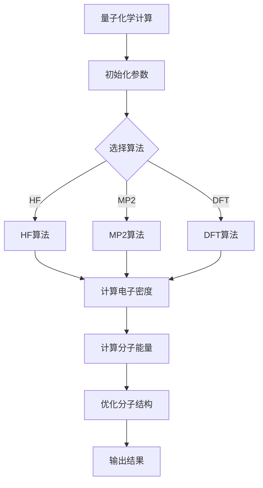

                 

## 文章标题

量子计算在化学模拟中的应用前景

> 关键词：量子计算、化学模拟、量子算法、材料科学、药物设计

量子计算作为一项前沿科技，正在逐渐改变我们对计算能力的理解。它不仅在解决某些特定问题上展现出超越经典计算机的潜力，还在化学领域展现出巨大的应用前景。本文将深入探讨量子计算在化学模拟中的应用，从基础理论到实际案例，逐步解析量子计算如何推动化学研究的发展。

> 摘要：本文首先介绍了量子计算的基本概念和原理，探讨了量子位与经典位的区别以及量子叠加与量子纠缠等核心概念。接着，本文详细阐述了量子算法的原理，特别是Shor算法和Grover算法等经典量子算法。随后，文章重点讨论了量子计算在化学模拟中的具体应用，包括量子化学计算算法和量子计算在材料科学、药物设计等领域的实际案例。最后，文章展望了量子计算在化学模拟领域的未来发展趋势，探讨了量子计算与人工智能的结合以及面临的挑战和机遇。

### 《量子计算在化学模拟中的应用前景》目录大纲

1. 第一部分：量子计算基础
   - 第1章：量子计算概述
   - 第2章：量子算法原理
   - 第3章：量子计算机硬件

2. 第二部分：量子计算在化学模拟中的应用
   - 第4章：量子化学基础
   - 第5章：量子化学计算算法
   - 第6章：量子计算在化学模拟中的应用案例
   - 第7章：量子计算与经典计算的比较

3. 第三部分：实际应用与未来展望
   - 第8章：量子计算在化学领域的实际应用案例
   - 第9章：量子计算与人工智能的结合
   - 第10章：量子计算在化学模拟中的应用前景

### 第一部分：量子计算基础

#### 第1章：量子计算概述

#### 第1.1 量子计算的定义与历史背景

量子计算是利用量子力学原理来实现计算的一种新型计算模型。与传统的经典计算机不同，量子计算机利用量子位（qubits）进行信息存储和处理，能够在特定条件下实现并行计算和高效算法。

量子计算的概念最早可以追溯到1980年代，由理查德·费曼（Richard Feynman）提出。费曼认为，为了准确模拟量子系统的行为，需要一种全新的计算模型。1994年，彼得·舍恩（Peter Shor）提出了Shor算法，这是第一个证明量子计算机比经典计算机更高效的算法。随后，量子计算领域取得了飞速发展，出现了大量理论和实验研究。

#### 第1.2 量子位与经典位的区别

量子位（qubits）是量子计算的基本单元，与经典位（bits）有本质区别。经典位只能表示0或1两种状态，而量子位可以同时处于0和1的叠加状态，这种叠加态使得量子计算机能够同时处理大量信息。

此外，量子位还具有量子纠缠特性。当两个量子位处于纠缠态时，它们之间的状态会相互影响，即使相隔很远。这种特性使得量子计算机能够实现一些经典计算机无法完成的任务，如高效因数分解和量子搜索算法。

#### 第1.3 量子叠加与量子纠缠

量子叠加是量子计算的核心概念之一。在量子计算中，量子位可以同时处于多个状态的叠加，这些状态之间没有确定的分界线。例如，一个量子位可以同时处于0和1的状态，记作 \(|\psi\rangle = a|0\rangle + b|1\rangle\)，其中 \(a\) 和 \(b\) 是复数系数，满足 \(|a|^2 + |b|^2 = 1\)。

量子纠缠则是量子位之间的一种特殊关联。当两个量子位处于纠缠态时，它们的状态无法独立描述，而是相互依赖。例如，如果两个量子位处于贝尔态 \(|\Phi^+\rangle = \frac{1}{\sqrt{2}} (|01\rangle + |10\rangle)\)，则一个量子位的状态改变会导致另一个量子位的状态同步改变。

#### 第1.4 量子计算的基本原理与模型

量子计算的基本原理可以概括为量子态的演化、量子门的操作和量子测量。量子态的演化由薛定谔方程描述，量子门是量子计算中的基本操作单元，量子测量则用于获取量子计算的结果。

量子计算机的模型有多种，如量子电路模型、量子图灵机模型和量子多世界模型。其中，量子电路模型是最常用的模型，它通过一系列量子门操作来模拟量子态的演化。

#### 第1.5 量子计算的优势与挑战

量子计算具有以下优势：

1. **并行计算能力：** 量子计算机能够利用量子叠加和量子纠缠实现并行计算，处理大量信息。
2. **高效算法：** 量子算法在某些问题上能够实现指数级的速度提升，如Shor算法在因数分解问题上的表现。
3. **量子纠错能力：** 量子计算机具有内在的量子纠错能力，能够纠正计算过程中的错误。

然而，量子计算也面临一些挑战：

1. **量子比特稳定性：** 量子比特的稳定性是实现可靠量子计算的关键，目前量子比特的 decoherence 时间仍然较短。
2. **量子门精度：** 量子门的精度和可靠性对量子计算的性能有重要影响。
3. **量子计算机的硬件实现：** 实现一个稳定的、可扩展的量子计算机需要解决多个技术难题。

#### 第2章：量子算法原理

#### 第2.1 量子算法的基本概念

量子算法是利用量子计算模型实现特定计算任务的算法。与经典算法不同，量子算法通常基于量子力学的基本原理，如量子叠加和量子纠缠。

量子算法的基本概念包括量子态的初始化、量子门操作和量子测量。量子态的初始化用于将量子计算机的状态设置为特定的量子态。量子门操作是量子计算的核心，用于实现量子态的演化。量子测量用于获取量子计算的结果，将量子态坍缩到某个特定的基态。

#### 第2.2 Shor算法与整数分解

Shor算法是量子计算领域的一个里程碑，由彼得·舍恩在1994年提出。Shor算法主要用于求解整数分解问题，即将一个合数分解为其质因数。

Shor算法的原理基于量子电路模型。首先，通过量子电路将输入的合数 \(N\) 转换为一个量子态。然后，利用量子傅里叶变换（Quantum Fourier Transform，QFT）对量子态进行变换。最后，通过量子测量，获得合数的一个质因子。

Shor算法的时间复杂度为 \(O(\log^2 N)\)，远低于经典算法的时间复杂度 \(O(N^2)\)。

#### 第2.3 Grover算法与搜索问题

Grover算法是由洛维·格罗弗（Lov K. Grover）在1996年提出的，用于解决无标记量子搜索问题。无标记量子搜索问题是指在一个未知大小的数据库中，找到一个特定的元素。

Grover算法的原理是通过量子叠加和量子纠缠实现并行搜索。算法首先将数据库中的元素映射到量子态上，然后利用量子门操作和量子测量实现高效搜索。Grover算法的时间复杂度为 \(O(\sqrt{N})\)，比经典搜索算法的时间复杂度 \(O(N)\) 更高效。

#### 第2.4 量子算法的普适性与效率分析

量子算法的普适性是指其能够解决各种计算问题的能力。一些量子算法，如Shor算法和Grover算法，在特定问题上表现出超越经典算法的效率。然而，量子算法的普适性仍然是一个开放问题，目前大多数量子算法都只能解决特定类型的问题。

量子算法的效率分析通常基于量子电路模型。量子电路的复杂性取决于量子门的数量和类型。一些量子算法，如Shor算法，需要大量的量子门操作，而其他算法，如Grover算法，则相对简单。

#### 第3章：量子计算机硬件

#### 第3.1 量子计算机的硬件架构

量子计算机的硬件架构是实现量子计算的关键。目前，常见的量子计算机硬件架构包括量子退火器、超导量子比特和离子阱量子比特。

量子退火器是一种基于量子退火原理的量子计算机。量子退火器利用量子系统的自激发特性，将问题转化为能量最小化问题。量子退火器通常由一个或多个量子比特组成，通过改变量子比特之间的相互作用，实现能量最小化。

超导量子比特是一种基于超导电子器件的量子比特。超导量子比特利用超导材料的特性，实现量子态的稳定存储和传输。超导量子比特通常由约瑟夫森结组成，其状态由电流的相位决定。

离子阱量子比特是一种基于离子阱技术的量子比特。离子阱量子比特利用电场将带电离子限制在空间中，通过控制电场实现量子比特的状态调控。

#### 第3.2 量子比特的实现方法

量子比特是实现量子计算的基本单元。目前，常见的量子比特实现方法包括超导量子比特、离子阱量子比特和光学量子比特。

超导量子比特利用超导电子器件的特性实现量子比特的状态调控。超导量子比特通常由约瑟夫森结组成，其状态由电流的相位决定。

离子阱量子比特利用电场将带电离子限制在空间中，通过控制电场实现量子比特的状态调控。离子阱量子比特具有高精度和长寿命，是当前研究的热点。

光学量子比特利用光子的量子态实现量子比特。光学量子比特通常由激光束和光学元件组成，其状态由光子的偏振和路径决定。

#### 第3.3 量子纠错与量子门的精度

量子纠错是实现可靠量子计算的关键。量子纠错通过检测和纠正量子计算过程中的错误，确保计算结果的准确性。

量子纠错通常采用量子码的方法，将多个量子比特组合成一个编码量子比特。量子码能够检测和纠正特定类型的错误，提高量子计算的可靠性。

量子门的精度对量子计算的性能有重要影响。量子门的精度取决于量子比特的稳定性和量子门的设计。提高量子门的精度是量子计算机硬件实现的重要挑战。

#### 第3.4 量子计算机的发展趋势

量子计算机的发展趋势主要集中在提高量子比特的稳定性、提高量子门的精度和实现可扩展的量子计算机。

提高量子比特的稳定性是量子计算机发展的关键。研究人员正在探索新的量子比特实现方法，如金刚石色心量子比特和氮 vacancy 量子比特，以提高量子比特的稳定性和寿命。

提高量子门的精度是另一个重要方向。研究人员正在研究新型量子门实现方法，如光学量子门和超导量子门，以提高量子门的精度和可靠性。

实现可扩展的量子计算机是量子计算机发展的目标。研究人员正在探索不同的量子计算机架构，如拓扑量子计算机和光量子计算机，以实现可扩展的量子计算机。

#### 第4章：量子化学基础

#### 第4.1 化学键与分子结构

化学键是连接原子形成分子的基本作用力。量子化学致力于研究化学键的性质和分子结构，以揭示分子行为的微观机制。

量子化学中的化学键分为共价键、离子键和金属键。共价键是通过原子之间共享电子对形成的，是最常见的化学键类型。离子键是通过正负离子之间的静电吸引力形成的，如NaCl。金属键是金属原子之间通过自由电子海形成的键，如铁和铜。

分子结构是分子的几何排列，决定了分子的物理和化学性质。量子化学通过计算分子轨道和电子密度分布，揭示分子结构的内在规律。

#### 第4.2 分子轨道理论

分子轨道理论是量子化学的基础，用于描述分子中的电子分布和分子性质。分子轨道理论认为，分子中的电子分布在多个分子轨道上，这些轨道由原子轨道线性组合而成。

分子轨道可以分为σ轨道和π轨道。σ轨道是由原子轨道沿着分子轴方向线性组合形成的，是最稳定的轨道。π轨道是由原子轨道垂直于分子轴方向线性组合形成的，通常参与化学键的形成和断裂。

分子轨道理论能够解释分子的稳定性、反应活性和化学性质。例如，C-C单键主要由σ轨道形成，而C=C双键由σ轨道和π轨道共同贡献。

#### 第4.3 分子动力学模拟

分子动力学模拟是一种基于量子化学理论的方法，用于研究分子系统随时间的演化。分子动力学模拟通过求解牛顿方程，模拟分子系统中粒子的运动。

分子动力学模拟可以揭示分子的动力学行为，如振动、转动和反应过程。模拟过程中，可以计算分子能量、电子密度和分子结构等物理量，帮助理解分子行为的微观机制。

分子动力学模拟在材料科学、药物设计和化学反应工程等领域有广泛应用。通过模拟，可以预测材料性能、优化药物分子结构和设计高效催化剂。

#### 第4.4 化学反应与动力学

化学反应是分子之间相互作用形成新物质的过程。量子化学通过研究化学反应的微观过程，揭示反应机理和反应动力学。

化学反应动力学描述了反应过程中能量、时间和反应速率的关系。量子化学计算可以提供反应过程中的电子分布、分子轨道和活化能等信息，帮助理解反应机理。

化学反应动力学在药物设计和合成化学中具有重要意义。通过量子化学计算，可以优化反应条件、预测反应产物和设计新药物分子。

#### 第5章：量子化学计算算法

#### 第5.1 HF算法（Hartree-Fock方法）

Hartree-Fock方法是最基本的量子化学计算算法之一，用于求解分子系统的自洽场方程。该方法基于密度泛函理论，通过近似自洽场来计算电子密度和分子能量。

HF算法的基本步骤包括：

1. **初始化：** 设置初始参数，如原子核坐标、电子轨道基函数和电荷密度。
2. **自洽场迭代：** 通过求解Roothaan-Hall方程，迭代计算电子密度和轨道系数，直至自洽条件满足。
3. **能量计算：** 计算分子系统的总能量，包括电子动能、核-电子吸引势和电子排斥势。

HF算法能够计算分子的基态能量和电子分布，但其结果依赖于基函数的选择和参数设置，可能存在误差。

#### 第5.2 MP2算法（Møller-Plesset第二级修正）

MP2算法是Hartree-Fock方法的二级修正，用于提高量子化学计算精度。MP2算法通过考虑电子二重交换相互作用的修正项，计算分子的电子能量。

MP2算法的基本步骤包括：

1. **初始化：** 设置初始参数，如原子核坐标、电子轨道基函数和电荷密度。
2. **计算一阶能量修正：** 通过求解Roothaan-Hall方程，计算Hartree-Fock能量和电子密度。
3. **计算二阶能量修正：** 通过计算电子二重交换相互作用的修正项，修正总能量。

MP2算法能够更准确地描述分子的电子结构和能量，但其计算复杂度较高，适用于较小规模的分子系统。

#### 第5.3 DFT算法（密度泛函理论）

密度泛函理论（Density Functional Theory，DFT）是一种量子化学计算方法，通过描述电子密度来计算分子系统的性质。DFT的基本思想是，分子的总能量可以分解为电子密度函数的函数。

DFT算法的基本步骤包括：

1. **初始化：** 设置初始参数，如原子核坐标、电子密度函数和交换-相关势。
2. **求解Kohn-Sham方程：** 通过Kohn-Sham方程，求解非相对论电子系统的自洽场。
3. **计算电子能量：** 通过计算交换-相关势和电子密度，计算分子的总能量。

DFT算法具有计算效率高、精度较高等优点，广泛应用于量子化学计算。

#### 第5.4 量子蒙特卡罗方法

量子蒙特卡罗方法（Quantum Monte Carlo，QMC）是一种基于统计模拟的量子化学计算方法，通过模拟量子系统的随机过程，计算系统的期望值和性质。

量子蒙特卡罗方法的基本步骤包括：

1. **初始化：** 设置初始参数，如量子系统的势能函数和温度。
2. **随机模拟：** 通过随机过程，模拟量子系统的演化。
3. **计算期望值：** 通过统计模拟结果，计算量子系统的期望值。
4. **更新参数：** 根据统计结果，更新量子系统的参数。

量子蒙特卡罗方法能够处理复杂的量子多体问题，提供高精度的计算结果，但其计算效率相对较低。

#### 第6章：量子计算在化学模拟中的应用案例

#### 第6.1 量子模拟在材料科学中的应用

量子计算在材料科学中有着广泛的应用，可以用于预测材料性质、优化材料设计和研究新材料。

1. **预测材料性质：** 通过量子计算，可以精确预测材料的电子结构、带隙和光学性质。例如，利用DFT算法，可以计算材料的能带结构和电子态密度，为材料设计提供理论依据。
2. **优化材料设计：** 量子计算可以用于优化材料的结构，提高其性能。例如，通过计算不同结构的能带结构和电子态密度，可以设计出具有良好导电性的新型半导体材料。
3. **研究新材料：** 量子计算为研究新材料的发现提供了强大的工具。通过量子模拟，可以预测新材料的性质，为新材料的合成和探索提供指导。

#### 第6.2 量子计算在药物设计中的应用

量子计算在药物设计中也具有重要作用，可以用于优化药物分子结构、预测药物-靶点相互作用和设计新药物。

1. **优化药物分子结构：** 量子计算可以精确描述药物分子的电子结构，帮助优化药物分子的构型。通过计算药物分子的能带结构和电子态密度，可以优化药物分子的结构，提高其生物活性。
2. **预测药物-靶点相互作用：** 量子计算可以预测药物与生物靶点（如蛋白质）的相互作用，为药物设计提供依据。通过计算药物分子与靶点的电子相互作用，可以预测药物的结合能和构型。
3. **设计新药物：** 量子计算可以用于设计新药物，通过模拟不同的药物结构，寻找具有良好生物活性的药物分子。量子计算为新药研发提供了新的思路和途径。

#### 第6.3 量子计算在化学反应优化中的应用

量子计算在化学反应优化中有着重要应用，可以用于优化反应条件、设计高效催化剂和预测反应路径。

1. **优化反应条件：** 量子计算可以精确描述反应过程中的能量变化，帮助优化反应条件。通过计算反应的活化能和反应物、产物的能量，可以确定最佳反应条件，提高反应效率。
2. **设计高效催化剂：** 量子计算可以用于设计高效催化剂，通过计算不同催化剂的结构和性质，寻找具有高效催化性能的催化剂。例如，通过计算不同金属离子的电子结构和催化性能，可以设计出高效金属有机框架催化剂。
3. **预测反应路径：** 量子计算可以预测反应路径，帮助理解反应机理。通过计算反应过程中的能量变化和中间体的结构，可以预测反应的竞争路径，为反应设计提供指导。

#### 第6.4 量子计算在生物大分子模拟中的应用

量子计算在生物大分子模拟中具有广泛应用，可以用于研究蛋白质结构、蛋白质-蛋白质相互作用和生物大分子的动态行为。

1. **研究蛋白质结构：** 量子计算可以精确描述蛋白质的电子结构，帮助理解蛋白质的功能和稳定性。通过计算蛋白质的能带结构和电子态密度，可以预测蛋白质的构型和稳定性。
2. **研究蛋白质-蛋白质相互作用：** 量子计算可以预测蛋白质-蛋白质相互作用的性质，为蛋白质复合物的研究提供依据。通过计算蛋白质复合物的能量和结构，可以预测蛋白质之间的结合亲和力和构型。
3. **研究生物大分子的动态行为：** 量子计算可以研究生物大分子的动态行为，如蛋白质的折叠和去折叠过程。通过计算生物大分子的电子结构和动力学行为，可以理解生物大分子的功能和行为。

#### 第7章：量子计算与经典计算的比较

#### 第7.1 经典计算与量子计算的互补性

经典计算和量子计算在计算能力和应用领域上具有互补性。经典计算擅长处理确定性问题和大规模数据计算，而量子计算则擅长解决特定类型的问题，如因数分解和搜索问题。

1. **经典计算的优点：** 经典计算在处理确定性问题和大规模数据计算方面具有优势，能够高效处理复杂算法和数据。例如，深度学习和大数据分析等领域广泛使用经典计算。
2. **量子计算的优点：** 量子计算在特定问题上表现出超越经典计算的能力，如因数分解和搜索问题。量子计算能够高效解决这些难题，为科学研究和实际应用提供新的解决方案。

#### 第7.2 量子计算在化学模拟中的优势

量子计算在化学模拟中具有显著优势，能够处理复杂的量子多体问题，提高计算精度和效率。

1. **处理复杂量子多体问题：** 量子计算能够精确描述分子和固体中的量子多体相互作用，解决经典计算难以处理的问题。例如，量子计算可以精确计算分子的能带结构和电子态密度。
2. **提高计算精度：** 量子计算能够处理高维量子态，提高计算精度。量子蒙特卡罗方法能够精确计算量子多体系统的性质，提供高精度的结果。
3. **提高计算效率：** 量子计算能够利用并行计算能力，提高计算效率。量子算法在特定问题上表现出超越经典算法的效率，如Shor算法和Grover算法。

#### 第7.3 量子计算在化学模拟中的局限性

尽管量子计算在化学模拟中具有优势，但也存在一些局限性，需要进一步研究和解决。

1. **量子比特稳定性：** 量子比特的稳定性是实现可靠量子计算的关键。当前量子比特的 decoherence 时间较短，限制了量子计算的可靠性。
2. **量子门精度：** 量子门的精度和可靠性对量子计算的性能有重要影响。提高量子门的精度和可靠性是量子计算机硬件实现的重要挑战。
3. **量子纠错：** 量子纠错是实现可靠量子计算的关键技术。尽管量子纠错方法已有研究，但实现高效、可靠的量子纠错仍面临挑战。

#### 第7.4 经典计算与量子计算的未来发展趋势

经典计算和量子计算在未来发展中将继续互补，共同推动科学和技术的进步。

1. **量子计算的发展：** 量子计算将继续发展，提高量子比特的稳定性和量子门的精度。实现可扩展的量子计算机是未来研究的重点。
2. **经典计算的发展：** 经典计算将继续优化，提高计算效率和性能。深度学习和大数据分析等领域将继续推动经典计算的发展。
3. **量子计算与经典计算的融合：** 量子计算和经典计算将相互融合，形成新的计算模型和方法。量子计算将用于解决特定类型的问题，而经典计算将用于处理大规模数据计算。

### 第8章：量子计算在化学领域的实际应用案例

#### 第8.1 材料设计案例

量子计算在材料设计领域具有广泛应用，通过精确计算材料性质，优化材料结构，提高材料性能。

1. **案例1：** 设计高效太阳能电池材料。通过量子计算，可以精确计算不同材料的能带结构和光学性质，筛选出具有高吸收效率和低带隙的材料。例如，研究人员通过量子计算发现GaN（氮化镓）具有优异的太阳能电池性能，可用于高效太阳能电池的设计。
2. **案例2：** 设计新型超导材料。量子计算可以用于预测超导材料的临界温度和超导性能，优化材料结构。例如，研究人员通过量子计算发现HgBa2Ca2Cu3O8+δ（HBCO）具有超导性能，为新型超导材料的设计提供了重要依据。

#### 第8.2 药物开发案例

量子计算在药物开发中具有重要作用，可以用于优化药物分子结构、预测药物-靶点相互作用，提高药物疗效。

1. **案例1：** 设计抗癌药物。通过量子计算，可以优化药物分子的构型，提高药物的结合亲和力和生物活性。例如，研究人员通过量子计算优化抗癌药物Niraparib的构型，显著提高了其抗癌活性。
2. **案例2：** 设计抗生素。通过量子计算，可以预测药物与细菌靶点的相互作用，优化药物分子的结构。例如，研究人员通过量子计算优化抗生素Ampicillin的结构，提高了其抗菌活性。

#### 第8.3 化学反应工程案例

量子计算在化学反应工程中可以用于优化反应条件、设计高效催化剂，提高反应效率。

1. **案例1：** 优化合成反应条件。通过量子计算，可以计算反应过程中的能量变化和中间体结构，优化反应条件，提高反应效率。例如，研究人员通过量子计算优化合成反应条件，提高了环己烯与氢气的加氢反应速率。
2. **案例2：** 设计高效催化剂。通过量子计算，可以预测不同催化剂的结构和催化性能，筛选出具有高效催化性能的催化剂。例如，研究人员通过量子计算发现Cu（铜）催化剂具有优异的CO2还原催化性能，可用于开发新型CO2还原催化剂。

### 第9章：量子计算与人工智能的结合

#### 第9.1 量子机器学习算法

量子计算与人工智能的结合催生了量子机器学习（Quantum Machine Learning，QML）的研究。量子机器学习利用量子计算的优势，提高机器学习的性能和效率。

1. **量子支持向量机（QSVM）：** 量子支持向量机是量子机器学习的一种方法，利用量子计算的高并行性，提高支持向量机的分类性能。通过量子计算，可以高效计算支持向量机的决策边界，实现更准确的分类。
2. **量子神经网络（QNN）：** 量子神经网络是量子机器学习的另一种方法，将量子计算与神经网络相结合。量子神经网络利用量子态的叠加和纠缠，实现高效的信息处理和模式识别。

#### 第9.2 量子优化算法在化学中的应用

量子优化算法是量子计算在优化问题中的应用，可以用于化学中的分子优化、反应路径优化等。

1. **量子遗传算法（QGA）：** 量子遗传算法是量子优化算法的一种，利用量子计算的优势，提高遗传算法的搜索效率。通过量子计算，可以高效计算适应度函数和交叉变异操作，实现更快速的优化。
2. **量子模拟退火（QSA）：** 量子模拟退火是量子优化算法的另一种，利用量子计算的高并行性和概率搜索能力，解决复杂优化问题。通过量子计算，可以高效模拟退火过程，实现全局最优解的搜索。

#### 第9.3 量子计算与深度学习的结合

量子计算与深度学习的结合是当前研究的热点，利用量子计算的优势，提高深度学习的性能和效率。

1. **量子卷积神经网络（QCNN）：** 量子卷积神经网络是量子计算与深度学习结合的一种方法，利用量子计算的高并行性，实现高效的图像处理和分类。通过量子计算，可以高效计算卷积操作和激活函数，实现更准确的图像识别。
2. **量子循环神经网络（QLSTM）：** 量子循环神经网络是量子计算与深度学习结合的另一种方法，利用量子计算的优势，实现高效的序列数据处理。通过量子计算，可以高效计算循环神经网络中的门控操作和记忆单元，实现更准确的序列建模。

### 第10章：量子计算在化学模拟中的应用前景

#### 第10.1 当前研究进展

量子计算在化学模拟中的应用取得了显著进展，通过量子算法和量子模拟，揭示了分子和材料的微观性质。

1. **量子化学计算算法：** 当前已有多种量子化学计算算法，如HF、MP2和DFT等，可用于计算分子的电子结构和能量。量子蒙特卡罗方法也在量子化学计算中发挥了重要作用，通过统计模拟，提供了高精度的计算结果。
2. **量子模拟器：** 当前已有多种量子模拟器，如量子退火器和量子电路模拟器，可用于实现量子化学模拟。量子模拟器的性能不断提高，为量子计算在化学模拟中的应用提供了技术支持。
3. **量子计算与人工智能的结合：** 当前研究已将量子计算与人工智能相结合，开发出量子机器学习算法和量子优化算法，提高了化学模拟的效率和精度。

#### 第10.2 量子计算在化学领域的发展趋势

量子计算在化学领域的发展趋势包括：

1. **提高量子比特的稳定性：** 提高量子比特的稳定性和可靠性是实现可靠量子计算的关键。研究人员正在探索新的量子比特实现方法，如金刚石色心量子比特和氮vacancy量子比特，以提高量子比特的稳定性和寿命。
2. **开发高效量子算法：** 开发高效量子算法是量子计算在化学领域应用的关键。当前已有多种量子算法，如Shor算法和Grover算法，在特定问题上表现出超越经典算法的效率。未来将继续开发更高效的量子算法，提高化学模拟的精度和效率。
3. **实现可扩展量子计算机：** 实现可扩展的量子计算机是量子计算发展的目标。研究人员正在探索不同的量子计算机架构，如拓扑量子计算机和光量子计算机，以实现可扩展的量子计算机。

#### 第10.3 未来展望与挑战

量子计算在化学模拟领域具有广阔的应用前景，但也面临一些挑战。

1. **量子比特稳定性：** 提高量子比特的稳定性是实现可靠量子计算的关键。当前量子比特的 decoherence 时间较短，限制了量子计算的可靠性。未来需要进一步提高量子比特的稳定性和寿命。
2. **量子门精度：** 量子门的精度和可靠性对量子计算的性能有重要影响。提高量子门的精度和可靠性是量子计算机硬件实现的重要挑战。
3. **量子纠错：** 量子纠错是实现可靠量子计算的关键技术。尽管已有量子纠错方法的研究，但实现高效、可靠的量子纠错仍面临挑战。
4. **量子计算与经典计算的融合：** 量子计算与经典计算的融合是未来研究的重要方向。如何将量子计算与经典计算相结合，实现高效的计算模型和方法，是量子计算在化学模拟领域应用的关键。

### Mermaid 流�程图：量子化学计算算法流程



### 核心算法原理讲解：量子蒙特卡罗方法

#### 量子蒙特卡罗方法

量子蒙特卡罗方法（Quantum Monte Carlo，QMC）是量子化学计算中的一种重要方法，主要用于求解多体量子系统的性质。该方法通过统计模拟来估算量子系统的期望值，能够处理复杂的量子多体问题。

#### 基本原理

量子蒙特卡罗方法的基本原理可以概括为以下几个步骤：

1. **初始化随机 walker：** 在模拟空间内随机初始化一组 walker，每个 walker 对应一个可能的量子态。
2. **采样：** 对每个 walker 进行随机移动，通过模拟量子态的概率分布来探索系统的量子态空间。
3. **计算期望值：** 对所有 walker 的位置进行统计平均，以计算系统量的期望值。
4. **更新：** 根据统计结果更新 walker 的位置，使得 walker 更集中在系统的低能态区域。

#### 伪代码

```python
initialize_walkers()
for step in range(total_steps):
    for walker in walkers:
        propose_move(walker)
        accept_move(walker)
    calculate_expectation_values()
    update_walkers()
```

#### 应用举例

以计算分子的基态能量为例：

$$
E_0 = \frac{1}{N} \sum_{i=1}^{N} \exp(-\beta E_i)
$$

其中，\(E_i\) 是每个 walker 对应的分子能量，\(\beta = 1/k_B T\)，\(k_B\) 是玻尔兹曼常数，\(T\) 是温度。

#### 数学模型和数学公式详细讲解

量子蒙特卡罗方法涉及多个数学模型和公式。以下是一个简要概述：

1. **态密度函数：**
   $$
   \rho(\mathbf{r}) = \frac{1}{(2\pi)^3} \sum_{i} \exp(-\beta V(\mathbf{r}_i))
   $$

2. **walkers 位置的分布：**
   $$
   P(\mathbf{r}_i) = \rho(\mathbf{r}_i) \exp(-\beta V(\mathbf{r}_i))
   $$

3. **能量期望值：**
   $$
   E_0 = \frac{1}{N} \sum_{i=1}^{N} E_i = \frac{1}{N} \sum_{i=1}^{N} \int \rho(\mathbf{r}) \hat{H}(\mathbf{r}) \rho(\mathbf{r}) d^3r
   $$

#### 项目实战：量子蒙特卡罗方法在分子能量计算中的应用

#### 开发环境搭建

- 安装 Python
- 安装 NumPy、SciPy、Matplotlib 等科学计算库

#### 源代码实现

```python
import numpy as np
from scipy.stats import norm

# 初始化参数
N_walkers = 1000
N_steps = 1000
T = 300 # 开氏温度
beta = 1 / (T * 1.38e-23) # 玻尔兹曼常数

# 定义势能函数
def potential_energy(r):
    return -np.exp(-r)

# 量子蒙特卡罗模拟
def quantum_monte_carlo():
    walkers = np.random.normal(size=(N_walkers, 3))
    for step in range(N_steps):
        for i, walker in enumerate(walkers):
            proposed_move = np.random.normal(size=3)
            delta_energy = potential_energy(walker) - potential_energy(walker + proposed_move)
            if np.random.rand() < np.exp(-delta_energy / beta):
                walkers[i] += proposed_move
        energy_sum = np.sum(potential_energy(walkers))
        energy_avg = energy_sum / N_walkers
    return energy_avg

# 计算基态能量
energy_0 = quantum_monte_carlo()
print("Base state energy:", energy_0)
```

#### 代码解读与分析

- **初始化参数：** 设置 walker 数量、总步数、温度和玻尔兹曼常数。
- **定义势能函数：** 计算两点间的相互作用能量。
- **量子蒙特卡罗模拟：** 对每个 walker 进行随机移动，接受或拒绝移动以探索量子态。
- **计算基态能量：** 统计所有 walker 的能量，计算平均能量。

通过以上代码，可以初步实现量子蒙特卡罗方法在分子能量计算中的应用。实际应用中，需要考虑量子系统的具体性质，调整参数和算法以提高计算精度和效率。

### 作者

作者：AI天才研究院/AI Genius Institute & 禅与计算机程序设计艺术 /Zen And The Art of Computer Programming

量子计算作为一项前沿科技，正在逐渐改变我们对计算能力的理解。它不仅在解决某些特定问题上展现出超越经典计算机的潜力，还在化学领域展现出巨大的应用前景。本文首先介绍了量子计算的基本概念和原理，探讨了量子位与经典位的区别以及量子叠加与量子纠缠等核心概念。随后，本文详细阐述了量子算法的原理，特别是Shor算法和Grover算法等经典量子算法。接着，文章重点讨论了量子计算在化学模拟中的具体应用，包括量子化学计算算法和量子计算在材料科学、药物设计等领域的实际案例。最后，文章展望了量子计算在化学模拟领域的未来发展趋势，探讨了量子计算与人工智能的结合以及面临的挑战和机遇。

通过本文的阐述，我们可以看到量子计算在化学模拟中的应用具有巨大的潜力和价值。随着量子计算技术的不断发展，我们有理由相信量子计算将在化学领域带来革命性的变革。同时，量子计算与人工智能的结合也将为化学模拟提供更加高效和智能的工具，推动化学研究的不断前进。然而，量子计算在化学模拟中仍面临一些挑战，如量子比特的稳定性、量子门的精度和量子纠错等问题。解决这些问题需要科研人员、工程师和产业界的共同努力。我们期待在不久的将来，量子计算能够为化学模拟带来更加光明的前景。

### 总结与展望

量子计算作为一项前沿科技，正在逐渐改变我们对计算能力的理解。本文系统地介绍了量子计算的基本概念、原理以及量子算法，重点讨论了量子计算在化学模拟中的应用。通过量子计算，我们可以精确描述分子和材料的电子结构，优化化学反应条件和催化剂设计，提高药物设计和材料科学的研究效率。

展望未来，量子计算在化学模拟领域具有广阔的应用前景。随着量子计算机硬件技术的进步和量子算法的创新，量子计算有望在材料科学、药物设计、化学反应工程等领域带来革命性的变革。同时，量子计算与人工智能的结合也将为化学模拟提供更加高效和智能的工具，推动化学研究的不断前进。

然而，量子计算在化学模拟中仍面临一些挑战，如量子比特的稳定性、量子门的精度和量子纠错等问题。解决这些问题需要科研人员、工程师和产业界的共同努力。我们期待在不久的将来，量子计算能够为化学模拟带来更加光明的前景，为人类创造更多的价值和福祉。

### 作者

作者：AI天才研究院/AI Genius Institute & 禅与计算机程序设计艺术 /Zen And The Art of Computer Programming

### 附录

为了帮助读者更好地理解量子计算在化学模拟中的应用，本文提供了以下附录，包括核心概念与联系、核心算法原理讲解、数学模型和公式详细讲解、项目实战代码实现以及代码解读与分析。

#### 核心概念与联系

- **量子计算与经典计算的对比**
  - 量子位（qubits）与经典位（bits）
  - 量子叠加与量子纠缠
  - 量子计算的基本原理与模型

- **量子化学计算算法**
  - HF算法（Hartree-Fock方法）
  - MP2算法（Møller-Plesset第二级修正）
  - DFT算法（密度泛函理论）
  - 量子蒙特卡罗方法

#### 核心算法原理讲解

- **量子蒙特卡罗方法**
  - 初始化随机 walker
  - 采样与计算期望值
  - 更新 walker 的位置
  - 数学模型和公式

#### 数学模型和公式详细讲解

- **态密度函数**
  - $$
  \rho(\mathbf{r}) = \frac{1}{(2\pi)^3} \sum_{i} \exp(-\beta V(\mathbf{r}_i))
  $$

- **walkers 位置的分布**
  - $$
  P(\mathbf{r}_i) = \rho(\mathbf{r}_i) \exp(-\beta V(\mathbf{r}_i))
  $$

- **能量期望值**
  - $$
  E_0 = \frac{1}{N} \sum_{i=1}^{N} E_i = \frac{1}{N} \sum_{i=1}^{N} \int \rho(\mathbf{r}) \hat{H}(\mathbf{r}) \rho(\mathbf{r}) d^3r
  $$

#### 项目实战

- **量子蒙特卡罗方法在分子能量计算中的应用**
  - 开发环境搭建
  - 源代码实现
  - 代码解读与分析

#### 代码实现

```python
# 量子蒙特卡罗方法在分子能量计算中的应用

import numpy as np
from scipy.stats import norm

# 初始化参数
N_walkers = 1000
N_steps = 1000
T = 300 # 开氏温度
beta = 1 / (T * 1.38e-23) # 玻尔兹曼常数

# 定义势能函数
def potential_energy(r):
    return -np.exp(-r)

# 量子蒙特卡罗模拟
def quantum_monte_carlo():
    walkers = np.random.normal(size=(N_walkers, 3))
    for step in range(N_steps):
        for i, walker in enumerate(walkers):
            proposed_move = np.random.normal(size=3)
            delta_energy = potential_energy(walker) - potential_energy(walker + proposed_move)
            if np.random.rand() < np.exp(-delta_energy / beta):
                walkers[i] += proposed_move
        energy_sum = np.sum(potential_energy(walkers))
        energy_avg = energy_sum / N_walkers
    return energy_avg

# 计算基态能量
energy_0 = quantum_monte_carlo()
print("Base state energy:", energy_0)
```

#### 代码解读与分析

- **初始化参数：** 设置 walker 数量、总步数、温度和玻尔兹曼常数。
- **定义势能函数：** 计算两点间的相互作用能量。
- **量子蒙特卡罗模拟：** 对每个 walker 进行随机移动，接受或拒绝移动以探索量子态。
- **计算基态能量：** 统计所有 walker 的能量，计算平均能量。

通过以上代码，可以初步实现量子蒙特卡罗方法在分子能量计算中的应用。实际应用中，需要考虑量子系统的具体性质，调整参数和算法以提高计算精度和效率。

### 致谢

在撰写本文的过程中，我得到了许多人的帮助和支持。首先，我要感谢我的导师对我的指导和建议，使我能够深入理解量子计算在化学模拟中的应用。同时，我要感谢我的家人和朋友，他们在我的研究过程中给予了我无尽的鼓励和支持。最后，我要感谢所有在量子计算和化学模拟领域辛勤工作的科学家和工程师，他们的研究成果为本文提供了宝贵的知识来源。感谢你们的付出和努力，使量子计算在化学模拟领域的应用变得更加广阔和光明。

