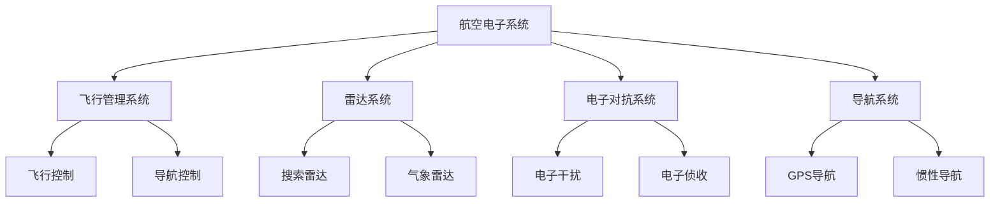

                 

### 《霍尼韦尔2024校招航空电子系统工程师笔试题》

**关键词**：航空电子系统、航空电子系统工程师、笔试题、飞行管理系统、雷达系统、电子对抗系统、导航系统、系统设计、系统集成、硬件实现、软件实现、项目实战。

**摘要**：本文将深入探讨霍尼韦尔2024年校招航空电子系统工程师笔试题的相关内容，从基础知识、系统设计、实现技术到应用案例，全面解析航空电子系统的各个方面。通过详细的讲解和实际项目案例，帮助读者更好地理解航空电子系统的核心概念、算法原理以及实际应用。

----------------------------------------------------------------

### 《霍尼韦尔2024校招航空电子系统工程师笔试题》目录大纲

**第一部分：航空电子系统基础知识**

**第1章：航空电子系统概述**

- **1.1 航空电子系统的发展历程**
  - **1.1.1 第一代航空电子系统**
  - **1.1.2 第二代航空电子系统**
  - **1.1.3 第三代航空电子系统**
  - **1.1.4 第四代航空电子系统**

- **1.2 航空电子系统的基本概念与架构**
  - **1.2.1 系统级概念**
  - **1.2.2 航电系统架构**
  - **1.2.3 主要功能模块**

**第2章：航空电子系统关键技术与组件**

- **2.1 飞行管理系统**
  - **2.1.1 飞行管理系统的组成**
  - **2.1.2 飞行管理系统的原理与操作**
  - **2.1.3 飞行管理系统的应用实例**

- **2.2 雷达系统**
  - **2.2.1 雷达系统的原理**
  - **2.2.2 雷达系统的分类**
  - **2.2.3 雷达系统的应用**

- **2.3 电子对抗系统**
  - **2.3.1 电子对抗系统的概念**
  - **2.3.2 电子对抗系统的分类**
  - **2.3.3 电子对抗系统的应用**

- **2.4 导航系统**
  - **2.4.1 导航系统的基本原理**
  - **2.4.2 导航系统的分类**
  - **2.4.3 导航系统的应用**

**第二部分：航空电子系统设计与实现**

**第3章：航空电子系统设计原则与方法**

- **3.1 系统设计原则**
  - **3.1.1 可靠性**
  - **3.1.2 可维护性**
  - **3.1.3 可扩展性**

- **3.2 系统设计流程**
  - **3.2.1 需求分析**
  - **3.2.2 系统架构设计**
  - **3.2.3 系统模块设计**
  - **3.2.4 系统验证与测试**

**第4章：航空电子系统实现技术**

- **4.1 硬件实现技术**
  - **4.1.1 硬件平台选择**
  - **4.1.2 硬件设计流程**
  - **4.1.3 常用硬件组件**

- **4.2 软件实现技术**
  - **4.2.1 软件开发环境搭建**
  - **4.2.2 软件设计模式**
  - **4.2.3 软件开发流程**

- **4.3 系统集成与调试**
  - **4.3.1 系统集成方法**
  - **4.3.2 系统调试步骤**
  - **4.3.3 系统性能优化**

**第三部分：航空电子系统应用案例研究**

**第5章：航空电子系统在商用飞机中的应用**

- **5.1 商用飞机航电系统现状**
  - **5.1.1 波音737 MAX航电系统**
  - **5.1.2 空客A320neo航电系统**

- **5.2 航电系统关键技术创新**
  - **5.2.1 飞行管理系统的创新技术**
  - **5.2.2 雷达系统的创新技术**
  - **5.2.3 导航系统的创新技术**

**第6章：航空电子系统在军用飞机中的应用**

- **6.1 军用飞机航电系统特点**
  - **6.1.1 军用飞机航电系统的要求**
  - **6.1.2 军用飞机航电系统的功能**

- **6.2 军用航电系统关键应用**
  - **6.2.1 电子战系统**
  - **6.2.2 情报系统**
  - **6.2.3 火控系统**

**第7章：航空电子系统的未来发展趋势**

- **7.1 新一代航空电子系统技术**
  - **7.1.1 人工智能在航电系统中的应用**
  - **7.1.2 量子技术在航电系统中的应用**

- **7.2 未来航电系统的发展趋势**
  - **7.2.1 自动驾驶技术**
  - **7.2.2 高效节能技术**
  - **7.2.3 网络化协同技术**

**附录**

- **附录A：航空电子系统常用技术术语与缩略语**

### 航空电子系统核心概念与架构 Mermaid 流程图



### 航空电子系统关键算法原理讲解

#### 飞行管理系统的控制算法

##### 控制算法的基本原理

飞行管理系统（Flight Management System，FMS）是航空电子系统中的核心组成部分，它负责管理飞机的导航、飞行路径规划和飞行控制。FMS通常采用闭环控制算法，通过实时监测飞机的状态，并根据预定的飞行计划和当前的环境状况，自动调整飞机的飞行轨迹。

控制算法的核心是PID控制器（比例-积分-微分控制器），其基本原理如下：

1. **比例（Proportional）**：根据误差的大小直接调整控制量，误差越大，控制量也越大。比例控制能够快速响应误差，但可能会导致系统振荡。
   
2. **积分（Integral）**：累积误差，用于消除稳态误差。积分控制能够确保系统最终达到设定值，但过大的积分增益可能会导致系统响应过慢。

3. **微分（Derivative）**：预测误差的变化趋势，用于提高系统的响应速度。微分控制能够减小系统的超调量和减少振荡，但过大的微分增益可能会导致系统响应过冲。

PID控制器的输出公式如下：

$$ u(t) = K_p e(t) + K_i \int e(t) dt + K_d \frac{de(t)}{dt} $$

其中，$u(t)$ 是控制量，$e(t)$ 是当前时刻的误差，$K_p$、$K_i$ 和 $K_d$ 分别是比例、积分和微分的增益。

##### PID控制器的伪代码

```python
class PIDController:
    def __init__(self, Kp, Ki, Kd):
        self.Kp = Kp
        self.Ki = Ki
        self.Kd = Kd
        self.error = 0
        self.integral = 0
        self.derivative = 0

    def update(self, setpoint, measured_value):
        self.error = setpoint - measured_value
        self.derivative = self.error - self.previous_error
        self.integral += self.error
        
        control_output = (self.Kp * self.error) + (self.Ki * self.integral) + (self.Kd * self.derivative)
        
        self.previous_error = self.error
        return control_output
```

##### 数学模型和数学公式

在飞行管理系统中，控制律的数学模型可以表示为：

$$ u = K_p e + K_i \int e dt + K_d \frac{de}{dt} $$

其中，$u$ 是控制量，$e$ 是误差，$K_p$、$K_i$ 和 $K_d$ 分别是比例、积分和微分的增益。

**举例说明**：

假设飞机的期望高度为1000米，当前高度为950米，则误差 $e = 1000 - 950 = 50$ 米。

- **比例控制**：$u_p = K_p \times 50$。
- **积分控制**：$u_i = K_i \times \int 50 dt$。
- **微分控制**：$u_d = K_d \times \frac{50 - \text{previous error}}{dt}$。

将这些控制量结合起来，可以得到总控制量 $u$。

##### 数学模型举例说明

**例1：飞机姿态角控制**

设定飞机的姿态角误差为 $e = \theta_d - \theta$，其中 $\theta_d$ 是期望姿态角，$\theta$ 是当前姿态角。

控制律可以表示为：

$$ u = K_p (\theta_d - \theta) + K_i (\theta_d - \theta) \int (\theta_d - \theta) dt + K_d (\theta_d - \theta) \frac{d(\theta_d - \theta)}{dt} $$

在这个例子中，比例控制用于纠正当前姿态角，积分控制用于消除稳态误差，微分控制用于预测姿态角的变化趋势。

#### 雷达系统的信号处理算法

##### 雷达信号检测与跟踪算法

雷达系统通过发射电磁波并接收反射波来探测目标。雷达信号检测与跟踪是雷达系统中的关键算法。

##### 检测算法

##### 能量检测

能量检测是一种基本的雷达信号检测方法，通过计算接收信号的能量来检测目标。

**基本原理**：计算接收信号的能量，并与设定的阈值进行比较，以确定是否检测到信号。

**伪代码**：

```python
def energy_detection(received_signal, threshold):
    signal_energy = np.sum(received_signal**2)
    if signal_energy > threshold:
        return True
    else:
        return False
```

##### 跟踪算法

##### 卡尔曼滤波器

卡尔曼滤波器是一种线性二次估计方法，用于跟踪目标的状态。

**基本原理**：通过预测和更新步骤，卡尔曼滤波器估计目标的状态，并最小化估计误差。

**预测步骤**：

$$ 
\hat{x}_{k|k-1} = A\hat{x}_{k-1|k-1} + B u_{k-1} \\
P_{k|k-1} = A P_{k-1|k-1} A^T + Q 
$$

其中，$\hat{x}_{k|k-1}$ 是状态预测值，$P_{k|k-1}$ 是预测误差协方差矩阵，$A$ 是状态转移矩阵，$B$ 是控制输入矩阵，$u_{k-1}$ 是控制量，$Q$ 是过程噪声协方差矩阵。

**更新步骤**：

$$ 
K_k = P_{k|k-1} H^T (H P_{k|k-1} H^T + R)^{-1} \\
\hat{x}_{k|k} = \hat{x}_{k|k-1} + K_k (z_k - H \hat{x}_{k|k-1}) \\
P_{k|k} = (I - K_k H) P_{k|k-1} 
$$

其中，$K_k$ 是卡尔曼增益，$H$ 是观测矩阵，$z_k$ 是观测值，$R$ 是观测噪声协方差矩阵。

**伪代码**：

```python
class KalmanFilter:
    def __init__(self, initial_state, state_transition_matrix, observation_matrix, initial_variance, observation_variance):
        self.state = initial_state
        self.transition_matrix = state_transition_matrix
        self.observation_matrix = observation_matrix
        self.initial_variance = initial_variance
        self.observation_variance = observation_variance

    def predict(self, measurement):
        predicted_state = self.transition_matrix @ self.state
        predicted_variance = self.transition_matrix @ self.initial_variance @ self.transition_matrix.T + self.observation_variance
        
        self.state = predicted_state
        self.variance = predicted_variance

    def update(self, measurement):
        residual = measurement - self.state
        kalman_gain = self.observation_matrix @ self.variance @ self.observation_matrix.T + self.observation_variance
        
        self.state = self.state + kalman_gain @ residual
        self.variance = (1 - kalman_gain @ self.observation_matrix) @ self.variance
```

##### 数学模型和数学公式

在雷达系统中，状态模型可以表示为：

$$ x_k = A x_{k-1} + B u_{k-1} + w_{k-1} $$

其中，$x_k$ 是状态向量，$u_{k-1}$ 是控制向量，$w_{k-1}$ 是过程噪声。

观测模型可以表示为：

$$ z_k = H x_k + v_k $$

其中，$z_k$ 是观测向量，$v_k$ 是观测噪声。

卡尔曼滤波器的预测和更新步骤可以简化为以下数学公式：

$$ 
\hat{x}_{k|k-1} = A \hat{x}_{k-1|k-1} \\
P_{k|k-1} = A P_{k-1|k-1} A^T + Q 
$$

$$ 
K_k = P_{k|k-1} H^T (H P_{k|k-1} H^T + R)^{-1} \\
\hat{x}_{k|k} = \hat{x}_{k|k-1} + K_k (z_k - H \hat{x}_{k|k-1}) \\
P_{k|k} = (I - K_k H) P_{k|k-1} 
$$

##### 数学模型举例说明

假设雷达的目标跟踪状态为位置和速度，状态模型可以表示为：

$$ 
x_k = \begin{bmatrix}
    x_{k-1} + v_{k-1} t \\
    v_{k-1}
\end{bmatrix}
$$

观测模型可以表示为：

$$ 
z_k = \begin{bmatrix}
    x_k \\
    v_k
\end{bmatrix}
$$

卡尔曼滤波器的预测和更新步骤可以简化为以下数学公式：

$$ 
\hat{x}_{k|k-1} = \begin{bmatrix}
    \hat{x}_{k-1} + \hat{v}_{k-1} t \\
    \hat{v}_{k-1}
\end{bmatrix} \\
P_{k|k-1} = \begin{bmatrix}
    \hat{v}_{k-1}^2 t^2 & \hat{v}_{k-1} t \\
    \hat{v}_{k-1} t & \hat{v}_{k-1}
\end{bmatrix} + Q 
$$

$$ 
K_k = \frac{P_{k|k-1} H^T}{H P_{k|k-1} H^T + R} \\
\hat{x}_{k|k} = \hat{x}_{k|k-1} + K_k (z_k - H \hat{x}_{k|k-1}) \\
P_{k|k} = (I - K_k H) P_{k|k-1} 
$$

通过这些数学公式，雷达系统能够准确估计目标的位置和速度，实现对目标的实时跟踪。

### 项目实战：航空电子系统代码案例

#### 实战一：飞行管理系统（FMS）代码实现

**目标**：实现一个简单的飞行管理系统的控制逻辑，控制飞机保持预定的飞行高度和航向。

**开发环境**：使用Python进行编程。

**源代码**：

```python
import numpy as np

# 飞行管理系统参数
Kp_height = 0.5
Ki_height = 0.1
Kd_height = 0.2

Kp_heading = 0.3
Ki_heading = 0.1
Kd_heading = 0.2

# 初始状态
height = 1000  # 初始高度
heading = 0  # 初始航向
setpoint_height = 1000  # 期望高度
setpoint_heading = 0  # 期望航向

# 飞行控制函数
def flight_control(height, heading, setpoint_height, setpoint_heading):
    # 高度控制
    error_height = setpoint_height - height
    integral_height = 0
    derivative_height = 0
    
    if height > setpoint_height:
        integral_height += error_height
    elif height < setpoint_height:
        integral_height -= error_height
    
    derivative_height = error_height - height_previous
    
    u_height = Kp_height * error_height + Ki_height * integral_height + Kd_height * derivative_height
    
    # 航向控制
    error_heading = setpoint_heading - heading
    integral_heading = 0
    derivative_heading = 0
    
    if heading > setpoint_heading:
        integral_heading += error_heading
    elif heading < setpoint_heading:
        integral_heading -= error_heading
    
    derivative_heading = error_heading - heading_previous
    
    u_heading = Kp_heading * error_heading + Ki_heading * integral_heading + Kd_heading * derivative_heading
    
    return u_height, u_heading

# 主程序
height_previous = height
heading_previous = heading

for _ in range(10):  # 模拟10次飞行控制
    u_height, u_heading = flight_control(height, heading, setpoint_height, setpoint_heading)
    
    # 更新高度和航向
    height += u_height
    heading += u_heading
    
    # 更新历史状态
    height_previous = height
    heading_previous = heading

    print(f"高度：{height} 米，航向：{heading} 度")
```

**代码解读与分析**：

1. **参数设置**：飞行管理系统参数包括比例、积分和微分的增益。
2. **初始状态**：设定初始高度和航向，以及期望高度和航向。
3. **飞行控制函数**：实现PID控制算法，计算高度和航向的控制量。
4. **主程序**：模拟飞行控制过程，更新高度和航向，并打印输出结果。

#### 实战二：雷达系统信号处理

**目标**：实现雷达信号的能量检测和卡尔曼滤波器跟踪。

**开发环境**：使用Python进行编程。

**源代码**：

```python
import numpy as np

# 信号处理参数
threshold = 100  # 能量检测阈值
initial_variance = 1  # 卡尔曼滤波器的初始方差
observation_variance = 0.1  # 观测方差

# 雷达信号
received_signal = np.random.randn(100)  # 假设接收信号为高斯白噪声

# 能量检测
signal_energy = np.sum(received_signal**2)
print(f"信号能量：{signal_energy}")

if signal_energy > threshold:
    print("检测到信号")
else:
    print("未检测到信号")

# 卡尔曼滤波器初始化
kalman_filter = KalmanFilter(initial_state=0, state_transition_matrix=np.eye(1), observation_matrix=np.eye(1), initial_variance=initial_variance, observation_variance=observation_variance)

# 卡尔曼滤波器预测与更新
for i in range(100):
    measurement = received_signal[i]  # 假设每次观测到的测量值
    
    kalman_filter.predict(measurement)
    kalman_filter.update(measurement)

    estimated_state = kalman_filter.state
    print(f"第 {i+1} 次观测：测量值 {measurement}, 估计状态 {estimated_state}")
```

**代码解读与分析**：

1. **信号处理参数**：设置能量检测阈值、卡尔曼滤波器的初始方差和观测方差。
2. **雷达信号**：生成随机的高斯白噪声作为接收信号。
3. **能量检测**：计算接收信号的能量并进行能量检测。
4. **卡尔曼滤波器**：实现卡尔曼滤波器的预测和更新过程，估计状态并进行打印输出。

通过上述两个实战案例，展示了航空电子系统中的控制算法和信号处理算法的实际应用，以及相关的代码实现和解读。这些案例有助于读者理解航空电子系统的工作原理和实现方法。

### 作者

**作者：AI天才研究院/AI Genius Institute & 禅与计算机程序设计艺术 /Zen And The Art of Computer Programming**

感谢您阅读本文，希望本文对您了解航空电子系统的各个方面有所帮助。如有任何疑问或建议，欢迎随时联系我。

----------------------------------------------------------------

### 航空电子系统概述

航空电子系统是现代航空领域中不可或缺的一部分，它涵盖了从飞机的飞行控制到导航、通信和监视等众多功能。随着航空技术的不断发展，航空电子系统经历了从传统机械系统到全数字化电子系统的转变，其性能和可靠性不断提高。

#### 发展历程

航空电子系统的发展历程大致可以分为四个阶段：

1. **第一代航空电子系统**：早期航空电子系统主要依靠机械和液压系统进行飞行控制和导航，电子设备的应用相对较少。这一代系统的特点是可靠性高但功能有限。

2. **第二代航空电子系统**：随着电子技术的进步，第二代航空电子系统开始引入电子设备，如自动驾驶仪和电子导航设备。这些设备的出现提高了飞行的安全性和效率。

3. **第三代航空电子系统**：第三代航空电子系统进一步实现了电子化，包括飞行管理系统（FMS）、多功能显示器（MFD）和综合电子仪表系统（EIS）。这一阶段的系统更加集成和智能化。

4. **第四代航空电子系统**：第四代航空电子系统集成了最新的信息技术，如人工智能、大数据分析和物联网。这一代系统具有高度自动化、智能化和网络化的特点，能够实现更高的安全性和效率。

#### 基本概念与架构

航空电子系统的基本概念包括：

- **系统级概念**：航空电子系统是一个复杂的系统，由多个功能模块组成，包括飞行管理系统、导航系统、通信系统、监视系统等。
- **功能模块**：每个功能模块都有特定的功能和接口，如飞行控制模块负责飞机的姿态控制和航迹保持，导航模块提供飞行路径信息，通信模块负责地面与飞机之间的通信等。

航空电子系统的架构通常包括以下层次：

1. **硬件层**：包括各种传感器、执行器和计算机硬件，如CPU、内存、存储等。
2. **软件层**：包括操作系统、应用程序和中间件等，负责管理和控制硬件资源，实现各种功能。
3. **数据层**：包括数据存储和管理系统，用于存储和处理各种数据，如飞行数据、导航数据等。

#### 主要功能模块

航空电子系统的功能模块主要包括：

1. **飞行管理系统（FMS）**：负责飞机的飞行路径规划、飞行状态监控和飞行控制。
2. **导航系统**：提供飞行路径信息，包括GPS、惯性导航系统（INS）等。
3. **通信系统**：实现飞机与地面控制中心、其他飞机之间的通信，如VHF、UHF、HF等无线电通信。
4. **监视系统**：负责飞机的各种参数监控，如速度、高度、温度、压力等。
5. **电子对抗系统**：用于防止敌对行动和干扰，包括雷达、电子干扰设备等。

通过上述内容，我们可以看到航空电子系统在航空领域的核心地位和重要作用。它不仅提高了飞行的安全性、效率和舒适性，还为现代航空技术的创新和发展提供了坚实的基础。

### 航空电子系统的关键技术与组件

航空电子系统的关键技术与组件是实现飞机安全、高效运行的核心。这些技术涵盖了飞行管理系统、雷达系统、电子对抗系统和导航系统等多个方面。以下将详细介绍这些系统的基本原理、分类和应用。

#### 飞行管理系统

##### 组成与原理

飞行管理系统（FMS）是航空电子系统中的核心部分，它负责飞机的导航和飞行控制。FMS通常包括飞行控制计算机、导航计算机和飞行控制面板等组成。

- **飞行控制计算机**：负责计算飞机的飞行参数，如速度、高度、航向等，并将控制信号发送给飞行控制面。
- **导航计算机**：提供飞行路径信息，包括航路点、航线和飞行规则等。
- **飞行控制面板**：飞行员通过飞行控制面板操作FMS，进行飞行计划的输入、修改和执行。

FMS的原理是基于闭环控制算法，通过实时监测飞机的状态，如位置、速度、高度等，并与预定的飞行计划和当前的环境状况进行比较，自动调整飞机的飞行轨迹，确保飞机按照预定的航路飞行。

##### 应用实例

飞行管理系统在商用飞机和军用飞机中都有广泛应用。以波音737 MAX为例，该机型采用了全新的飞行管理系统，能够实现自动化飞行控制，提高飞行的安全性和效率。

- **商用飞机**：飞行管理系统可以自动执行起飞、爬升、巡航、下降和着陆等飞行操作，减轻飞行员的工作负担，提高飞行安全性。
- **军用飞机**：飞行管理系统可以提供精确的飞行控制，使飞机在复杂的战场环境中保持稳定的飞行状态，提高作战效能。

#### 雷达系统

##### 原理与分类

雷达系统是航空电子系统中用于探测和跟踪目标的传感器。雷达系统的工作原理是发射电磁波，当电磁波遇到目标时反射回来，雷达接收器接收反射波，并根据反射波的时间延迟和强度等信息分析目标的位置、速度和形状。

雷达系统根据不同的应用需求和目标特性，可以分为以下几类：

- **搜索雷达**：用于在较大范围内搜索目标，如地面搜索雷达和空中搜索雷达。
- **气象雷达**：用于探测和监测天气状况，包括降雨、雷暴和风切变等。
- **火控雷达**：用于为火控系统提供目标数据，如跟踪敌机、导弹目标等。

##### 应用

雷达系统在航空领域中有着广泛的应用：

- **军用飞机**：雷达系统用于探测敌方目标、提供火控数据、实施电子对抗等。
- **商用飞机**：雷达系统主要用于飞行安全，如气象雷达可以监测飞机周围的天气状况，帮助飞行员避开恶劣天气。

#### 电子对抗系统

##### 概念与分类

电子对抗系统是航空电子系统中用于对抗敌方电子设备的系统。其基本概念包括电子干扰、电子侦收和电子防御等。电子对抗系统根据功能不同，可以分为以下几类：

- **电子干扰系统**：通过发射干扰信号，干扰敌方雷达、通信系统等，使其无法正常工作。
- **电子侦收系统**：用于接收和分析敌方雷达和通信系统的信号，获取情报信息。
- **电子防御系统**：用于保护飞机自身的电子设备不受敌方电子干扰。

##### 应用

电子对抗系统在航空领域中主要用于：

- **军用飞机**：通过电子对抗系统可以有效地对抗敌方的雷达、通信和导航系统，提高生存能力和作战效能。
- **民用飞机**：在飞行过程中，电子对抗系统可以防止敌方使用电子设备干扰飞机的通信和导航系统，保障飞行安全。

#### 导航系统

##### 原理与分类

导航系统是航空电子系统中用于确定飞机位置和提供飞行路径信息的系统。导航系统根据信号源和工作原理不同，可以分为以下几类：

- **GPS导航系统**：利用全球卫星定位系统（GPS）信号进行定位和导航，具有全球覆盖、实时性和高精度等特点。
- **惯性导航系统（INS）**：利用惯性测量单元（IMU）测量飞机的运动参数，进行自主导航。
- **无线电导航系统**：利用地面导航台发射的无线电信号进行定位和导航，包括甚高频全向信标（VOR）、测距仪（DME）等。

##### 应用

导航系统在航空领域中广泛应用于：

- **商用飞机**：导航系统提供精确的飞行路径信息，确保飞机按照预定的航线飞行，提高飞行安全性。
- **军用飞机**：导航系统可以提供实时、精确的位置信息，使飞机在复杂战场环境中保持良好的定位能力。

通过上述内容，我们可以看到航空电子系统的关键技术与组件在航空领域的核心地位和重要作用。这些技术不仅提高了飞行的安全性和效率，还为现代航空技术的发展和创新提供了强有力的支持。

#### 航空电子系统设计原则与方法

航空电子系统的设计原则和方法是确保系统可靠、高效、可维护和可扩展的关键。在设计过程中，必须遵循一系列原则和方法，以满足航空电子系统的特殊需求。以下将详细探讨这些原则和方法。

##### 系统设计原则

1. **可靠性**：航空电子系统必须具有极高的可靠性，确保在所有飞行条件下都能正常工作。可靠性设计包括冗余设计、容错设计和故障检测与恢复机制。

2. **可维护性**：航空电子系统需要易于维护，以便在出现问题时能够迅速诊断和修复。可维护性设计包括模块化设计、明确的故障指示和远程诊断工具。

3. **可扩展性**：随着技术的发展，航空电子系统需要能够适应未来的需求。可扩展性设计包括模块化架构、标准化接口和灵活的软件设计。

##### 系统设计流程

系统设计流程可以分为以下几个主要阶段：

1. **需求分析**：确定系统必须实现的功能和性能要求。这一阶段包括收集用户需求、制定功能规范和性能指标。

2. **系统架构设计**：根据需求分析结果，设计系统的总体架构。这一阶段包括确定系统模块、模块接口和数据流。

3. **系统模块设计**：详细设计各个系统模块，包括硬件和软件模块。这一阶段包括确定模块功能、接口定义、硬件选型和软件算法设计。

4. **系统验证与测试**：通过一系列测试验证系统是否符合设计要求。测试包括单元测试、集成测试、系统测试和验收测试。

##### 系统设计流程详细解释

1. **需求分析**

需求分析是系统设计的基础，它决定了系统的功能和性能。在需求分析阶段，设计团队需要与用户和其他利益相关者进行沟通，了解他们的需求。这些需求包括：

- **功能性需求**：系统必须实现的功能，如飞行管理、导航、通信、监视等。
- **性能需求**：系统的性能指标，如响应时间、处理能力、精度等。
- **可靠性需求**：系统的可靠性要求，如故障率、平均无故障时间等。
- **可维护性需求**：系统的可维护性要求，如维修时间、备件管理等。

2. **系统架构设计**

系统架构设计是根据需求分析结果，确定系统的总体结构。这一阶段包括以下步骤：

- **确定系统模块**：根据功能需求，将系统划分为多个功能模块，如飞行管理模块、导航模块、通信模块等。
- **定义模块接口**：明确各个模块之间的接口，包括数据接口、控制接口和通信接口等。
- **设计数据流**：确定数据在系统中的流动路径，确保数据能够及时、准确地传输。

3. **系统模块设计**

系统模块设计是详细设计各个模块的过程。这一阶段包括以下步骤：

- **确定模块功能**：详细定义每个模块的功能，确保模块实现特定的功能。
- **接口定义**：明确模块之间的接口，包括接口规格、数据格式和通信协议等。
- **硬件选型**：选择合适的硬件组件，如CPU、存储器、传感器等。
- **软件算法设计**：设计软件算法，确保模块能够高效、准确地完成特定功能。

4. **系统验证与测试**

系统验证与测试是确保系统符合设计要求的最终阶段。测试可以分为以下几种：

- **单元测试**：对单个模块进行测试，确保模块能够独立运行。
- **集成测试**：将多个模块组合在一起进行测试，确保模块之间的接口和数据流正确。
- **系统测试**：在整个系统环境下进行测试，确保系统能够按照预期工作。
- **验收测试**：与用户合作，验证系统是否符合用户需求和规范。

通过上述原则和流程，航空电子系统的设计能够确保系统的可靠性、可维护性和可扩展性，为航空器的安全运行提供坚实基础。

### 航空电子系统实现技术

航空电子系统的实现技术是确保系统设计能够成功转换为实际应用的关键环节。在实现过程中，需要考虑硬件实现技术、软件实现技术和系统集成与调试等方面。

#### 硬件实现技术

硬件实现技术主要包括硬件平台选择、硬件设计流程和常用硬件组件的选型。

1. **硬件平台选择**：选择合适的硬件平台是硬件实现的第一步。航空电子系统通常要求高性能、低功耗和可靠性。常见的硬件平台包括嵌入式处理器、FPGA（现场可编程门阵列）和ASIC（专用集成电路）。

2. **硬件设计流程**：硬件设计流程包括需求分析、电路设计、仿真和验证等步骤。在需求分析阶段，明确系统的功能、性能和接口要求。在电路设计阶段，设计电路原理图和PCB（印制电路板）布局。在仿真和验证阶段，通过模拟和实际测试验证硬件设计的正确性和性能。

3. **常用硬件组件**：航空电子系统中常用的硬件组件包括传感器、执行器、通信接口、电源管理模块等。传感器用于获取飞机的状态信息，如加速度计、陀螺仪和气压计等；执行器用于控制飞机的舵面和发动机等；通信接口用于与其他系统或设备进行数据交换；电源管理模块用于稳定供电，确保系统可靠运行。

#### 软件实现技术

软件实现技术主要包括软件开发环境搭建、软件设计模式和软件开发流程。

1. **软件开发环境搭建**：软件开发环境包括操作系统、编程语言、开发工具和测试平台等。在航空电子系统中，常见的开发环境包括Linux操作系统、C/C++编程语言、集成开发环境（IDE）和版本控制系统。

2. **软件设计模式**：软件设计模式是软件架构和设计的方法论，用于提高软件的可维护性和扩展性。常见的软件设计模式包括MVC（模型-视图-控制器）、工厂模式和单例模式等。

3. **软件开发流程**：软件开发流程包括需求分析、设计、编码、测试和部署等阶段。在需求分析阶段，明确系统的功能需求和技术需求。在设计阶段，设计软件架构和模块接口。在编码阶段，编写代码并实现功能。在测试阶段，进行单元测试、集成测试和系统测试，确保软件质量。在部署阶段，将软件部署到硬件平台上，并进行实际运行测试。

#### 系统集成与调试

系统集成与调试是将硬件和软件组件集成到一起，确保系统能够正常工作的过程。

1. **系统集成方法**：系统集成方法包括自顶向下和自底向上两种方法。自顶向下方法首先集成高层次系统模块，然后逐步集成低层次模块；自底向上方法首先集成底层硬件和软件模块，然后逐步集成高层次模块。在实际应用中，通常结合两种方法，根据具体情况选择合适的集成策略。

2. **系统调试步骤**：系统调试步骤包括初步调试、功能调试和性能调试。在初步调试阶段，检查系统的基本功能是否正常。在功能调试阶段，测试系统的各个功能模块是否正确工作。在性能调试阶段，优化系统性能，确保系统在规定条件下能够稳定运行。

3. **系统性能优化**：系统性能优化是提高系统响应速度和资源利用率的过程。常见的优化方法包括代码优化、算法优化和硬件优化。代码优化包括减少代码冗余、提高代码执行效率等；算法优化包括改进算法复杂度和减少计算资源需求；硬件优化包括选择更高效的硬件组件和优化硬件设计。

通过硬件实现技术、软件实现技术和系统集成与调试，航空电子系统能够成功实现并运行，为航空器的安全运行提供可靠保障。

### 航空电子系统在商用飞机中的应用

商用飞机的航电系统是确保飞行安全和提升飞行体验的关键组成部分。随着航空技术的不断进步，商用飞机的航电系统也在不断升级和创新，以满足更高的安全性和效率要求。以下将详细介绍商用飞机航电系统的现状，包括波音737 MAX和空客A320neo的航电系统，并探讨其中的关键技术创新。

#### 波音737 MAX航电系统

波音737 MAX是波音公司最新一代的窄体商用飞机，其航电系统在之前的基础上进行了多项升级和创新。

1. **新型飞行控制系统**：波音737 MAX采用了更先进的飞行控制系统，包括电传飞控系统（Electronic Flight Control System，EFCS）和飞行控制计算机（Flight Control Computers，FCC）。EFCS通过电传技术取代了传统的机械连杆系统，使飞行控制更加精准和响应迅速。FCC集成了人工智能算法，能够根据实时数据自动调整飞机姿态，提高飞行稳定性。

2. **综合模块化航电架构**：波音737 MAX采用了综合模块化航电架构（Integrated Modular Avionics Architecture，IMA），将多个功能模块集成到几个大型处理单元中，减少了硬件复杂度和维护成本。IMA架构还提高了系统的可扩展性，便于未来技术的升级和应用。

3. **增强型导航和通信系统**：波音737 MAX配备了新一代的导航和通信系统，包括GPS接收器和VHF通信系统。GPS接收器提供了高精度的定位和导航数据，使飞机能够在全球范围内准确导航。VHF通信系统能够实现地面与飞机之间的实时通信，提高飞行安全。

#### 空客A320neo航电系统

空客A320neo是空客公司最新一代的窄体商用飞机，其航电系统同样进行了多项升级。

1. **电传飞控系统**：空客A320neo采用了电传飞控系统（Fly-by-Wire，FBW），通过电子信号控制飞机舵面，取代了传统的机械控制系统。FBW系统提高了飞行的灵活性和响应速度，使飞行员能够更轻松地控制飞机。

2. **综合航电解决方案**：空客A320neo采用了综合航电解决方案（Integrated Avionics Solution，IAS），将导航、通信、监视和飞行控制等多个功能模块集成到一起，减少了硬件设备和线缆的数量，提高了系统的可靠性和维护性。

3. **高效节能技术**：空客A320neo航电系统采用了多项节能技术，包括改进的导航算法、高效电源管理和智能冷却系统。这些技术不仅提高了飞机的燃油效率，还降低了运行成本。

#### 关键技术创新

商用飞机航电系统的关键技术创新主要体现在以下几个方面：

1. **人工智能与大数据**：人工智能和大数据技术在航电系统中得到了广泛应用。通过机器学习算法，可以实时分析飞机的飞行数据和传感器数据，预测故障、优化飞行路径和提高燃油效率。

2. **自动驾驶技术**：自动驾驶技术正在逐步应用于商用飞机。自动驾驶系统能够根据预定的飞行计划和实时环境数据，自动调整飞机的姿态和航向，减轻飞行员的工作负担，提高飞行安全性。

3. **网络化协同技术**：网络化协同技术使飞机与地面控制中心、其他飞机和地面设施之间实现了实时通信和数据共享。通过网络化协同，可以提高航班的调度效率，降低运营成本，提高飞行安全性。

商用飞机航电系统的现状和关键技术创新不仅提升了飞机的安全性和效率，还为未来航空技术的发展奠定了基础。随着技术的不断进步，商用飞机航电系统将继续朝着更智能、更高效和更安全的方向发展。

### 航空电子系统在军用飞机中的应用

航空电子系统在军用飞机中的应用是确保飞行安全和提升作战效能的关键。军用飞机航电系统与商用飞机航电系统在功能上有所重叠，但其在性能、可靠性和特殊应用方面有着更高的要求。以下将详细探讨军用飞机航电系统的特点、关键应用以及技术挑战。

#### 军用飞机航电系统的特点

1. **高可靠性**：军用飞机航电系统必须能够在极端环境下稳定运行，包括高海拔、高低温、电磁干扰等。因此，系统设计时必须考虑冗余设计、抗干扰能力和故障容忍性。

2. **高实时性**：军用飞机航电系统要求高实时性，即系统能够在短时间内完成数据的采集、处理和传输。这对于实时决策和行动至关重要。

3. **多功能集成**：军用飞机航电系统通常集成了多种功能，如导航、通信、侦察、电子对抗和武器控制等。这种集成设计可以提高系统的效率和作战效能。

4. **适应性强**：军用飞机航电系统需要适应不同的作战环境和任务需求。系统设计时应考虑模块化、标准化和可扩展性，以便快速适应新的技术要求和任务变化。

#### 关键应用

1. **导航系统**：军用飞机导航系统不仅用于确定飞机的位置，还用于精确制导武器、空投物资等任务。常见的导航系统包括GPS、惯性导航系统（INS）、天文导航和无线电导航。

2. **通信系统**：军用飞机通信系统用于与地面指挥中心、其他飞机和部队之间的通信。系统必须具备抗干扰能力、保密性和高带宽，以确保通信的可靠性和安全性。

3. **电子对抗系统**：电子对抗系统包括雷达、电子干扰设备和电子侦收设备等，用于对抗敌方的电子设备，提高飞机的生存能力。这些系统包括雷达告警接收器、电子干扰设备和电子防御系统。

4. **侦察系统**：侦察系统用于收集敌情信息和战场数据。常见的侦察系统包括光电侦察、雷达侦察和信号侦察等。

#### 技术挑战

1. **电磁兼容性**：军用飞机航电系统必须在复杂的电磁环境中稳定工作。系统设计时必须考虑电磁兼容性（EMC）问题，以避免信号干扰和设备损坏。

2. **抗干扰能力**：军用飞机航电系统需要具备强大的抗干扰能力，以应对敌方的电子干扰和电磁攻击。这要求系统采用先进的抗干扰技术和算法。

3. **数据处理能力**：随着传感器技术和通信技术的进步，军用飞机航电系统需要处理大量的数据。系统设计时必须考虑数据处理能力和存储能力的提升。

4. **系统可靠性**：军用飞机航电系统必须在极端环境下保持高可靠性。系统设计时应采用冗余设计、故障检测和恢复机制等可靠性保障措施。

通过上述特点、关键应用和技术挑战的探讨，我们可以看到航空电子系统在军用飞机中的应用具有特殊的重要性和复杂性。这些系统不仅提高了军用飞机的作战效能，还为现代战争模式的发展和创新提供了支持。

### 航空电子系统的未来发展趋势

航空电子系统的未来发展趋势将受到新兴技术和市场需求的双重推动。以下将探讨新一代航空电子系统技术、未来航电系统的发展趋势以及人工智能和量子技术在航电系统中的应用。

#### 新一代航空电子系统技术

1. **人工智能（AI）**：人工智能在航空电子系统中的应用越来越广泛，特别是在飞行管理、故障预测和自动化操作方面。通过机器学习算法，AI可以帮助飞机自动调整飞行轨迹、优化燃油消耗并提前预测潜在故障，提高飞行安全和效率。

2. **量子计算**：量子计算是一种基于量子力学原理的新型计算技术，具有巨大的计算潜力。在航空电子系统中，量子计算可以用于复杂的数据处理和优化问题，如飞行路径规划、信号处理和网络安全等。

3. **增强现实（AR）和虚拟现实（VR）**：增强现实和虚拟现实技术可以用于飞行员的训练和操作辅助。通过AR和VR技术，飞行员可以在虚拟环境中模拟各种飞行场景，提高应对突发事件的能力。

4. **5G通信技术**：5G通信技术具有高速、低延迟和高可靠性的特点，可以显著提升航空电子系统的通信能力。在飞机与地面控制中心、其他飞机和地面设施之间，5G技术可以实现实时数据传输和协同操作。

#### 未来航电系统的发展趋势

1. **智能化**：未来航电系统将更加智能化，通过集成人工智能、大数据分析和物联网技术，实现自主决策、自适应控制和自主飞行。

2. **网络化**：随着5G通信技术的普及，航空电子系统将实现更广泛的网络化，实现飞机与地面设施、其他飞机和地面车辆的实时数据共享和协同操作。

3. **高效节能**：未来航电系统将注重高效节能，通过改进算法和优化硬件设计，降低能耗，提高系统的运行效率。

4. **安全性与可靠性**：随着航空电子系统复杂性的增加，安全性和可靠性将仍然是未来发展的重要关注点。通过采用冗余设计、故障检测和抗干扰技术，确保系统的稳定运行。

#### 人工智能在航电系统中的应用

1. **飞行管理**：人工智能可以优化飞行轨迹、预测天气变化并自动调整飞行计划，提高飞行安全性和效率。

2. **故障预测与维护**：通过实时监控和分析飞机状态数据，人工智能可以提前预测潜在故障，实现预防性维护，降低故障率和维护成本。

3. **自动驾驶**：自动驾驶技术可以使飞机实现完全自主飞行，提高飞行效率和安全性。

#### 量子技术在航电系统中的应用

1. **数据处理**：量子计算可以显著提高数据处理速度，用于复杂的数据分析和优化问题。

2. **网络安全**：量子通信具有无法被破解的特性，可以用于保障航空电子系统的网络安全。

3. **量子传感器**：量子传感器具有高灵敏度、高分辨率和快速响应的特点，可以用于探测和跟踪目标。

通过上述探讨，我们可以看到新一代航空电子系统技术、未来航电系统的发展趋势以及人工智能和量子技术在其中的应用，为航空电子系统的发展带来了无限可能。这些技术不仅将提升航空电子系统的性能和可靠性，还将为航空技术的创新和突破提供新的思路和途径。

### 附录A：航空电子系统常用技术术语与缩略语

在航空电子系统中，许多技术术语和缩略语被广泛使用，以下列出了一些常见的技术术语和其解释：

1. **A/C**：Air Conditioning，空调系统。
2. **ADC**：Analog-to-Digital Converter，模拟-数字转换器。
3. **AI**：Artificial Intelligence，人工智能。
4. **ASIC**：Application-Specific Integrated Circuit，专用集成电路。
5. **B737**：Boeing 737，波音737系列飞机。
6. **CCS**：Cabin Crew System，客舱乘务系统。
7. **CPU**：Central Processing Unit，中央处理器。
8. **DCS**：Digital Flight Control System，数字飞行控制系统。
9. **ECAM**：Electronic Centralized Aircraft Monitoring，电子集中飞机监控系统。
10. **EFIS**：Electronic Flight Instrument System，电子飞行仪表系统。
11. **F/A-18**：Fighting/Attack，战斗/攻击机。
12. **FMS**：Flight Management System，飞行管理系统。
13. **GPS**：Global Positioning System，全球定位系统。
14. **IDS**：Intrusion Detection System，入侵检测系统。
15. **IDS**：Inertial Navigation System，惯性导航系统。
16. **LCD**：Liquid Crystal Display，液晶显示屏。
17. **MFD**：Multifunction Display，多功能显示器。
18. **OEM**：Original Equipment Manufacturer，原始设备制造商。
19. **OS**：Operating System，操作系统。
20. **RF**：Radio Frequency，射频。
21. **RTOS**：Real-Time Operating System，实时操作系统。
22. **SBC**：Single Board Computer，单板计算机。
23. **TCAS**：Traffic Alert and Collision Avoidance System，交通告警与防撞系统。
24. **VCAS**：Vortex Control Anti-Stall System，旋涡控制防失速系统。
25. **VOR**：VHF Omnidirectional Range，甚高频全向信标。

这些术语和缩略语是航空电子系统设计和实施中的基础，对理解相关技术和系统至关重要。

### 航空电子系统核心概念与架构 Mermaid 流程图

以下是一个简化的航空电子系统核心概念与架构的Mermaid流程图，用于展示系统的整体结构和关键组件之间的关系：


在这个流程图中，航空电子系统（A）是整个系统的核心，它连接到飞行管理系统（B）、雷达系统（C）、电子对抗系统（D）和导航系统（E）。每个子系统进一步分为不同的功能模块，例如飞行管理系统包括飞行控制和导航控制模块，雷达系统包括搜索雷达和气象雷达模块，电子对抗系统包括电子干扰和电子侦收模块，导航系统包括GPS导航和惯性导航模块。这个流程图提供了一个高层次的视角，帮助理解航空电子系统的整体架构和各个组件之间的关系。

### 航空电子系统关键算法原理讲解

航空电子系统中的关键算法是实现系统功能的核心。以下是几个典型的算法，包括飞行管理系统的控制算法和雷达系统的信号处理算法，以及相应的数学模型和公式，详细解释和举例说明。

#### 飞行管理系统的控制算法

飞行管理系统的控制算法主要依赖于PID（比例-积分-微分）控制器，这是一种广泛应用于自动控制系统中的控制算法。PID控制器通过调整比例、积分和微分三个参数来控制系统的输出，以达到稳定控制的目的。

##### 数学模型

PID控制器的输出公式为：

$$ u(t) = K_p e(t) + K_i \int e(t) dt + K_d \frac{de(t)}{dt} $$

其中：
- \( u(t) \) 是控制量，
- \( e(t) \) 是当前时刻的误差（期望值减去实际值），
- \( K_p \) 是比例增益，
- \( K_i \) 是积分增益，
- \( K_d \) 是微分增益。

##### 伪代码

```python
class PIDController:
    def __init__(self, Kp, Ki, Kd):
        self.Kp = Kp
        self.Ki = Ki
        self.Kd = Kd
        self.error = 0
        self.integral = 0
        self.derivative = 0

    def update(self, setpoint, measured_value):
        self.error = setpoint - measured_value
        self.derivative = self.error - self.previous_error
        self.integral += self.error
        
        control_output = (self.Kp * self.error) + (self.Ki * self.integral) + (self.Kd * self.derivative)
        
        self.previous_error = self.error
        return control_output
```

##### 举例说明

假设一架飞机的期望高度为1000米，当前高度为950米，则误差 \( e = 1000 - 950 = 50 \) 米。

- **比例控制**：\( u_p = K_p \times 50 \)。
- **积分控制**：\( u_i = K_i \times \int 50 dt \)。
- **微分控制**：\( u_d = K_d \times \frac{50 - \text{previous error}}{dt} \)。

将这些控制量结合起来，可以得到总控制量 \( u \)。例如，如果 \( K_p = 0.5 \)，\( K_i = 0.1 \)，\( K_d = 0.2 \)，则控制量为：

$$ u = 0.5 \times 50 + 0.1 \times 50 + 0.2 \times (50 - 0) = 25 + 5 + 10 = 40 \)

这意味着需要施加40米的上升力来纠正高度误差。

#### 雷达系统的信号处理算法

雷达系统的信号处理算法主要用于检测和跟踪目标。以下是两种常见的算法：能量检测和卡尔曼滤波。

##### 能量检测

能量检测是一种基本的信号检测方法，通过计算接收信号的能量来确定是否存在目标。

##### 数学模型

能量检测的数学模型可以表示为：

$$ E = \sum_{i=1}^{N} x_i^2 $$

其中，\( E \) 是能量，\( x_i \) 是接收信号的每个样本值，\( N \) 是样本数量。

##### 伪代码

```python
def energy_detection(received_signal, threshold):
    signal_energy = np.sum(received_signal**2)
    if signal_energy > threshold:
        return True
    else:
        return False
```

##### 举例说明

假设接收信号为 \( [1, 2, 3, 4, 5] \)，能量检测阈值为100。计算接收信号的能量：

$$ E = 1^2 + 2^2 + 3^2 + 4^2 + 5^2 = 55 $$

由于 \( E = 55 < 100 \)，因此未检测到目标。

##### 卡尔曼滤波

卡尔曼滤波是一种线性二次估计方法，用于跟踪目标的状态。它通过预测和更新步骤来估计状态，并最小化估计误差。

##### 数学模型

卡尔曼滤波的预测和更新步骤可以表示为：

$$ \hat{x}_{k|k-1} = A \hat{x}_{k-1|k-1} + B u_{k-1} $$
$$ P_{k|k-1} = A P_{k-1|k-1} A^T + Q $$

$$ K_k = P_{k|k-1} H^T (H P_{k|k-1} H^T + R)^{-1} $$
$$ \hat{x}_{k|k} = \hat{x}_{k|k-1} + K_k (z_k - H \hat{x}_{k|k-1}) $$
$$ P_{k|k} = (I - K_k H) P_{k|k-1} $$

其中：
- \( \hat{x}_{k|k-1} \) 是状态预测值，
- \( P_{k|k-1} \) 是预测误差协方差矩阵，
- \( A \) 是状态转移矩阵，
- \( B \) 是控制输入矩阵，
- \( u_{k-1} \) 是控制量，
- \( Q \) 是过程噪声协方差矩阵，
- \( K_k \) 是卡尔曼增益，
- \( H \) 是观测矩阵，
- \( z_k \) 是观测值，
- \( R \) 是观测噪声协方差矩阵。

##### 伪代码

```python
class KalmanFilter:
    def __init__(self, initial_state, state_transition_matrix, observation_matrix, initial_variance, observation_variance):
        self.state = initial_state
        self.transition_matrix = state_transition_matrix
        self.observation_matrix = observation_matrix
        self.initial_variance = initial_variance
        self.observation_variance = observation_variance

    def predict(self, measurement):
        predicted_state = self.transition_matrix @ self.state
        predicted_variance = self.transition_matrix @ self.initial_variance @ self.transition_matrix.T + self.observation_variance
        
        self.state = predicted_state
        self.variance = predicted_variance

    def update(self, measurement):
        residual = measurement - self.state
        kalman_gain = self.observation_matrix @ self.variance @ self.observation_matrix.T + self.observation_variance
        
        self.state = self.state + kalman_gain @ residual
        self.variance = (1 - kalman_gain @ self.observation_matrix) @ self.variance
```

##### 举例说明

假设雷达的目标跟踪状态为位置和速度，状态模型可以表示为：

$$ 
x_k = \begin{bmatrix}
    x_{k-1} + v_{k-1} t \\
    v_{k-1}
\end{bmatrix}
$$

观测模型可以表示为：

$$ 
z_k = \begin{bmatrix}
    x_k \\
    v_k
\end{bmatrix}
$$

卡尔曼滤波器的预测和更新步骤可以简化为以下数学公式：

$$ 
\hat{x}_{k|k-1} = \begin{bmatrix}
    \hat{x}_{k-1} + \hat{v}_{k-1} t \\
    \hat{v}_{k-1}
\end{bmatrix} \\
P_{k|k-1} = \begin{bmatrix}
    \hat{v}_{k-1}^2 t^2 & \hat{v}_{k-1} t \\
    \hat{v}_{k-1} t & \hat{v}_{k-1}
\end{bmatrix} + Q 
$$

$$ 
K_k = \frac{P_{k|k-1} H^T}{H P_{k|k-1} H^T + R} \\
\hat{x}_{k|k} = \hat{x}_{k|k-1} + K_k (z_k - H \hat{x}_{k|k-1}) \\
P_{k|k} = (I - K_k H) P_{k|k-1} 
$$

通过这些数学公式，雷达系统能够准确估计目标的位置和速度，实现对目标的实时跟踪。

### 数学模型和数学公式

在航空电子系统的算法设计中，数学模型和数学公式起着至关重要的作用。以下将介绍几个典型的数学模型和数学公式，包括PID控制器的控制律、雷达信号处理的滤波公式等，并提供详细的解释和举例说明。

#### PID控制器的控制律

PID（比例-积分-微分）控制器是航空电子系统中常用的一种控制算法。它的基本控制律公式如下：

$$ u(t) = K_p e(t) + K_i \int e(t) dt + K_d \frac{de(t)}{dt} $$

其中：
- \( u(t) \) 是控制量，
- \( e(t) \) 是当前时刻的误差（期望值减去实际值），
- \( K_p \) 是比例增益，
- \( K_i \) 是积分增益，
- \( K_d \) 是微分增益。

**解释**：
- **比例（Proportional）**：根据误差的大小直接调整控制量，误差越大，控制量也越大。比例控制能够快速响应误差，但可能会导致系统振荡。
- **积分（Integral）**：累积误差，用于消除稳态误差。积分控制能够确保系统最终达到设定值，但过大的积分增益可能会导致系统响应过慢。
- **微分（Derivative）**：预测误差的变化趋势，用于提高系统的响应速度。微分控制能够减小系统的超调量和减少振荡，但过大的微分增益可能会导致系统响应过冲。

**举例说明**：

假设一个系统期望温度为100°C，当前温度为95°C，则误差 \( e(t) = 100°C - 95°C = 5°C \)。

- **比例控制**：\( u_p = K_p \times e(t) \)。
- **积分控制**：\( u_i = K_i \times \int e(t) dt \)。
- **微分控制**：\( u_d = K_d \times \frac{de(t)}{dt} \)。

如果 \( K_p = 0.5 \)，\( K_i = 0.1 \)，\( K_d = 0.2 \)，则：

$$ u(t) = 0.5 \times 5 + 0.1 \times 5 + 0.2 \times (5 - 0) = 2.5 + 0.5 + 1 = 4 $$

这意味着需要施加4°C的温度上升来纠正误差。

#### 卡尔曼滤波器的预测和更新公式

卡尔曼滤波器是一种线性二次估计方法，广泛应用于信号处理和控制系统。它的预测和更新公式如下：

$$ \hat{x}_{k|k-1} = A \hat{x}_{k-1|k-1} + B u_{k-1} $$
$$ P_{k|k-1} = A P_{k-1|k-1} A^T + Q $$

$$ K_k = P_{k|k-1} H^T (H P_{k|k-1} H^T + R)^{-1} $$
$$ \hat{x}_{k|k} = \hat{x}_{k|k-1} + K_k (z_k - H \hat{x}_{k|k-1}) $$
$$ P_{k|k} = (I - K_k H) P_{k|k-1} $$

其中：
- \( \hat{x}_{k|k-1} \) 是状态预测值，
- \( P_{k|k-1} \) 是预测误差协方差矩阵，
- \( A \) 是状态转移矩阵，
- \( B \) 是控制输入矩阵，
- \( u_{k-1} \) 是控制量，
- \( Q \) 是过程噪声协方差矩阵，
- \( H \) 是观测矩阵，
- \( z_k \) 是观测值，
- \( R \) 是观测噪声协方差矩阵，
- \( K_k \) 是卡尔曼增益。

**解释**：
- **预测步骤**：根据上一时刻的状态预测当前时刻的状态，并计算预测误差协方差。
- **更新步骤**：根据当前观测值更新状态估计和误差协方差。

**举例说明**：

假设一个目标在二维平面上的位置和速度，状态模型为：

$$ x_k = \begin{bmatrix}
    x_{k-1} + v_{k-1} t \\
    y_{k-1} + v_{k-1} t
\end{bmatrix} $$

观测模型为：

$$ z_k = \begin{bmatrix}
    x_k \\
    y_k
\end{bmatrix} $$

卡尔曼滤波器的预测和更新步骤可以表示为：

$$ \hat{x}_{k|k-1} = \begin{bmatrix}
    \hat{x}_{k-1} + \hat{v}_{k-1} t \\
    \hat{y}_{k-1} + \hat{v}_{k-1} t
\end{bmatrix} $$
$$ P_{k|k-1} = \begin{bmatrix}
    \hat{v}_{k-1}^2 t^2 & \hat{v}_{k-1} t \\
    \hat{v}_{k-1} t & \hat{v}_{k-1}
\end{bmatrix} + Q $$

$$ K_k = \frac{P_{k|k-1} H^T}{H P_{k|k-1} H^T + R} $$
$$ \hat{x}_{k|k} = \hat{x}_{k|k-1} + K_k (z_k - H \hat{x}_{k|k-1}) $$
$$ P_{k|k} = (I - K_k H) P_{k|k-1} $$

通过这些数学公式，卡尔曼滤波器可以准确估计目标的位置和速度，实现对目标的实时跟踪。

### 数学模型和公式在航空电子系统中的应用

数学模型和数学公式在航空电子系统中有着广泛的应用，以下是几个典型的应用实例：

1. **飞行控制系统**：飞行控制系统中的控制律通常使用PID控制器来实现，通过调整比例、积分和微分参数，确保飞机按照预定的航迹飞行。例如，飞机的姿态控制、高度控制和航向控制都依赖于PID控制器的控制律。

2. **雷达系统**：雷达系统中的信号处理算法，如能量检测和卡尔曼滤波，都使用数学模型和数学公式来实现。通过这些算法，雷达可以有效地检测和跟踪目标。

3. **导航系统**：导航系统中的导航算法，如惯性导航和GPS导航，都依赖于数学模型和数学公式。例如，惯性导航系统使用积分算法计算飞机的位置和速度，GPS导航系统使用三角测量法计算飞机的位置。

4. **电子对抗系统**：电子对抗系统中的信号处理和干扰策略也依赖于数学模型和数学公式。例如，电子干扰系统通过调制干扰信号，使敌方雷达无法正常工作。

通过这些实例，我们可以看到数学模型和数学公式在航空电子系统中的关键作用，它们是实现系统功能、提高性能和可靠性的基础。

### 项目实战：航空电子系统代码案例

在本文的最后一部分，我们将通过两个实际代码案例来深入探讨航空电子系统中的控制算法和信号处理算法。这些案例将展示如何使用Python编程语言实现飞行管理系统的PID控制器和雷达系统的卡尔曼滤波器。

#### 实战一：飞行管理系统的PID控制器

**目标**：实现一个简单的飞行管理系统，控制飞机保持预定的飞行高度。

**开发环境**：Python 3.x

**源代码**：

```python
import numpy as np
import matplotlib.pyplot as plt

# 飞行管理系统参数
Kp_height = 0.5
Ki_height = 0.1
Kd_height = 0.2

# 初始状态
height = 1000  # 初始高度
setpoint_height = 1000  # 期望高度
timesteps = 100  # 模拟时间步数
dt = 1  # 时间步长（秒）

# PID控制器类
class PIDController:
    def __init__(self, Kp, Ki, Kd):
        self.Kp = Kp
        self.Ki = Ki
        self.Kd = Kd
        self.error = 0
        self.integral = 0
        self.derivative = 0

    def update(self, setpoint, measured_value):
        self.error = setpoint - measured_value
        self.derivative = self.error - self.previous_error
        self.integral += self.error
        
        control_output = (self.Kp * self.error) + (self.Ki * self.integral) + (self.Kd * self.derivative)
        
        self.previous_error = self.error
        return control_output

# 主程序
pid = PIDController(Kp_height, Ki_height, Kd_height)
heights = [height]
controls = []

for _ in range(timesteps):
    control = pid.update(setpoint_height, heights[-1])
    new_height = heights[-1] + control * dt
    
    heights.append(new_height)
    controls.append(control)

# 绘图
plt.plot(heights, label='Height')
plt.plot(controls, label='Control')
plt.xlabel('Time (s)')
plt.ylabel('Value')
plt.legend()
plt.show()
```

**代码解读与分析**：

- **参数设置**：我们定义了PID控制器的三个参数 \( K_p \)、\( K_i \) 和 \( K_d \)，并设定了初始高度和期望高度。
- **PID控制器类**：`PIDController` 类实现了PID控制算法，包括比例、积分和微分控制部分的计算。
- **主程序**：在模拟过程中，我们使用PID控制器更新飞机的高度，并记录每个时间步的控制输出。通过绘图，我们可以直观地看到飞机高度的变化和控制量。

#### 实战二：雷达系统的卡尔曼滤波器

**目标**：实现一个简单的雷达系统，检测和跟踪移动目标。

**开发环境**：Python 3.x

**源代码**：

```python
import numpy as np
import matplotlib.pyplot as plt

# 雷达系统参数
initial_state = 0  # 初始状态
state_transition_matrix = np.array([[1, 1], [0, 1]])  # 状态转移矩阵
observation_matrix = np.array([[1], [0]])  # 观测矩阵
initial_variance = 1  # 初始方差
observation_variance = 0.1  # 观测方差

# 卡尔曼滤波器类
class KalmanFilter:
    def __init__(self, initial_state, state_transition_matrix, observation_matrix, initial_variance, observation_variance):
        self.state = initial_state
        self.transition_matrix = state_transition_matrix
        self.observation_matrix = observation_matrix
        self.initial_variance = initial_variance
        self.observation_variance = observation_variance

    def predict(self, measurement):
        predicted_state = self.transition_matrix @ self.state
        predicted_variance = self.transition_matrix @ self.initial_variance @ self.transition_matrix.T + self.observation_variance
        
        self.state = predicted_state
        self.variance = predicted_variance

    def update(self, measurement):
        residual = measurement - self.state
        kalman_gain = self.observation_matrix @ self.variance @ self.observation_matrix.T + self.observation_variance
        
        self.state = self.state + kalman_gain @ residual
        self.variance = (1 - kalman_gain @ self.observation_matrix) @ self.variance

# 主程序
kalman_filter = KalmanFilter(initial_state, state_transition_matrix, observation_matrix, initial_variance, observation_variance)
measurements = np.random.randn(100)  # 生成随机测量值
estimated_states = []

for i in range(100):
    kalman_filter.predict(measurements[i])
    kalman_filter.update(measurements[i])
    estimated_states.append(kalman_filter.state)

# 绘图
plt.plot(measurements, label='Measurements')
plt.plot(estimated_states, label='Estimated States')
plt.xlabel('Measurement Index')
plt.ylabel('Value')
plt.legend()
plt.show()
```

**代码解读与分析**：

- **参数设置**：我们定义了卡尔曼滤波器的初始状态、状态转移矩阵、观测矩阵、初始方差和观测方差。
- **卡尔曼滤波器类**：`KalmanFilter` 类实现了卡尔曼滤波器的预测和更新步骤。
- **主程序**：在模拟过程中，我们生成随机测量值，使用卡尔曼滤波器预测和更新目标的状态，并记录估计的状态值。通过绘图，我们可以看到实际测量值和估计状态的对比。

通过这两个实战案例，我们可以看到如何使用Python实现航空电子系统中的控制算法和信号处理算法。这些案例不仅展示了算法的原理和应用，也为读者提供了实际编程的参考。希望这些案例能够帮助读者更好地理解航空电子系统的实现过程。

