                 

## 引言

### 音频信号处理：语音识别与合成技术的核心

音频信号处理是现代信息技术领域中的一个重要分支，涵盖了从音频信号的采集、处理、分析到最终的应用。语音识别与语音合成作为音频信号处理领域的两个核心子领域，近年来取得了显著的发展，并在诸多实际应用中发挥着重要作用。语音识别技术使得机器能够理解和处理人类语音，而语音合成技术则能够将文本信息转换为自然流畅的语音输出。

本文将围绕音频信号处理、语音识别和语音合成三个主要方面展开讨论。首先，我们将介绍音频信号处理的基础知识，包括音频信号的基本概念、表示方法和处理步骤。接着，我们将深入探讨语音识别技术，包括语音信号特征提取、识别模型和训练算法。最后，我们将详细阐述语音合成技术的原理和应用，并介绍音频信号处理与语音识别、合成的综合应用案例。

通过本文的阅读，读者将能够系统地了解音频信号处理的基本概念、原理和技术，并对语音识别与语音合成技术有一个全面的认识。同时，本文还将提供一些实际应用的案例，帮助读者将这些理论知识应用到实际项目中。

### 本文关键词

- 音频信号处理
- 语音识别
- 语音合成
- 特征提取
- 模型训练
- 实时交互

### 摘要

本文旨在全面解析音频信号处理领域中的语音识别与语音合成技术。首先，通过介绍音频信号的基本概念和表示方法，为后续讨论语音处理技术奠定基础。然后，深入探讨语音识别的基本原理，包括语音信号特征提取、识别模型和训练算法，并介绍视频语音识别和语音识别应用。接着，详细阐述语音合成技术的原理和应用，涵盖纯文本合成和语音驱动合成。最后，通过综合应用案例，展示音频信号处理、语音识别与语音合成的实际应用效果，并对未来发展趋势进行展望。通过本文的阅读，读者将获得对音频信号处理和语音技术全面的了解。

## 《音频信号处理：语音识别与合成技术》目录大纲

### 第一部分：音频信号处理基础

#### 第1章：音频信号基本概念

##### 1.1 音频信号的基本特性
- 音频信号的时域和频域特性
- 音频信号的振幅和频率
- 音频信号的时长和节奏

##### 1.2 音频信号的表示方法
- 时域表示
- 频域表示
- 矢量表示

##### 1.3 音频信号处理的基本步骤
- 音频信号的采集和预处理
- 音频信号的变换和处理
- 音频信号的重建和输出

#### 第2章：音频信号处理算法

##### 2.1 音频信号预处理
- 噪声去除
- 声音增强
- 声音分离

##### 2.2 音频信号变换
- 快速傅里叶变换（FFT）
- 梅尔频率倒谱系数（MFCC）

##### 2.3 音频信号处理应用
- 语音识别
- 语音合成
- 音频编码

### 第二部分：语音识别技术

#### 第3章：语音识别基本原理

##### 3.1 语音信号特征提取
- 声学特征
- 语言模型特征

##### 3.2 语音识别模型
- 传统HMM模型
- 基于深度学习的语音识别模型
- 注意力机制在语音识别中的应用

#### 第4章：语音识别算法

##### 4.1 视频语音识别
- 视频语音信号的时频表示
- 视频语音识别算法

##### 4.2 语音识别模型训练
- 训练数据的准备
- 训练算法的选择

#### 第5章：语音识别应用

##### 5.1 语音识别在客服中的应用
- 自动客服系统
- 语音导航系统

##### 5.2 语音识别在智能家居中的应用
- 智能语音助手
- 声控智能家居设备

### 第三部分：语音合成技术

#### 第6章：语音合成基本原理

##### 6.1 语音合成模型
- 纯文本合成
- 语音驱动合成

##### 6.2 语音合成算法
- 单声道合成
- 立体声合成

#### 第7章：语音合成应用

##### 7.1 语音合成在媒体中的应用
- 广播
- 广告

##### 7.2 语音合成在游戏中的应用
- 游戏角色语音
- 游戏语音控制

### 第8章：综合应用案例

##### 8.1 音频信号处理与语音识别的综合应用
- 实时语音交互系统

##### 8.2 音频信号处理与语音合成的综合应用
- 实时语音生成系统

### 第9章：展望与未来趋势

##### 9.1 音频信号处理技术的发展趋势
- 新算法的应用
- 新硬件的支持

##### 9.2 语音识别与合成技术的未来应用
- 人工智能语音交互
- 跨媒体语音处理技术

## 第一部分：音频信号处理基础

### 第1章：音频信号基本概念

#### 1.1 音频信号的基本特性

音频信号是人类日常生活中必不可少的一部分，它不仅传递了声音的信息，还包含了丰富的时域和频域特性。首先，从时域角度来看，音频信号的振幅和时长可以描述声音的响度和持续时间。振幅反映了声音的强度，通常用分贝（dB）来表示。而时长则决定了声音的节奏，如快节奏的鼓点与慢节奏的旋律。

从频域角度来看，音频信号的频率和频谱特性则描述了声音的音调和色彩。频率决定了声音的音高，通常以赫兹（Hz）为单位。而频谱特性则反映了声音的谐波成分，即不同的频率成分及其相对强度。

音频信号的基本特性可以概括为以下几点：

1. **时域特性**：
   - **振幅**：表示声音的响度，单位为分贝（dB）。
   - **时长**：表示声音的持续时间，通常以秒（s）为单位。

2. **频域特性**：
   - **频率**：表示声音的音高，单位为赫兹（Hz）。
   - **频谱**：反映了声音的谐波成分，即不同频率成分的相对强度。

#### 1.2 音频信号的表示方法

音频信号可以用不同的方法进行表示，包括时域表示、频域表示和矢量表示。这些表示方法各自具有不同的优势和适用场景。

1. **时域表示**：
   时域表示法直接将音频信号视为时间上的连续变化。在时域图中，横轴表示时间，纵轴表示振幅。这种表示方法直观且易于理解，但在处理复杂信号时，容易受到噪声和冗余信息的影响。

2. **频域表示**：
   频域表示法通过傅里叶变换将时域信号转换为频域信号，从而揭示信号的频率成分。频域图中，横轴表示频率，纵轴表示振幅或功率。这种表示方法可以有效地分析信号的频率特性，但在时域信息方面较为欠缺。

3. **矢量表示**：
   矢量表示法将音频信号视为一个多维矢量，其中每个维度代表不同的时间点或频率点。这种表示方法结合了时域和频域的优点，可以在一定程度上克服二者的不足。

#### 1.3 音频信号处理的基本步骤

音频信号处理通常包括以下几个基本步骤：

1. **音频信号的采集和预处理**：
   - **信号采集**：通过麦克风或其他音频设备捕捉声音信号。
   - **预处理**：包括噪声去除、增益调整和信号去噪等操作，以提高信号的质量。

2. **音频信号的变换和处理**：
   - **变换**：通常使用快速傅里叶变换（FFT）或其他变换方法将信号从时域转换为频域。
   - **处理**：包括滤波、增强和特征提取等操作，以提取信号的有用信息。

3. **音频信号的重建和输出**：
   - **重建**：通过逆变换将处理后的信号从频域重新转换为时域。
   - **输出**：将处理后的音频信号输出到扬声器或其他音频设备。

### 总结

本章介绍了音频信号处理的基础知识，包括基本特性、表示方法和处理步骤。通过理解这些基础知识，读者可以更好地掌握后续章节中涉及的语音识别和语音合成技术。在下一章中，我们将深入探讨音频信号处理算法，包括预处理、变换和处理技术。

#### 1.1 音频信号的基本特性

音频信号的基本特性包括时域和频域特性。首先，从时域角度来看，音频信号的振幅和时长是两个关键因素。振幅表示声音的响度，通常以分贝（dB）为单位衡量。较大的振幅对应较强的声音，而较小的振幅则表示较弱的声音。时长则反映了声音的持续时间，通常以秒（s）为单位。例如，一段声音的时长为5秒，意味着这段声音将在5秒钟内持续播放。

其次，从频域角度来看，音频信号的频率和频谱特性同样重要。频率决定了声音的音高，通常以赫兹（Hz）为单位。较高的频率对应较高的音调，而较低的频率则对应较低的音调。例如，钢琴的音高约为262Hz，而低音提琴的音高则约为65Hz。频谱特性则描述了声音的谐波成分，即不同频率成分的相对强度。一个复杂的音频信号通常包含多个频率成分，这些成分共同决定了声音的音色。

以下是一个简单的Mermaid流程图，展示了音频信号的时域和频域特性：

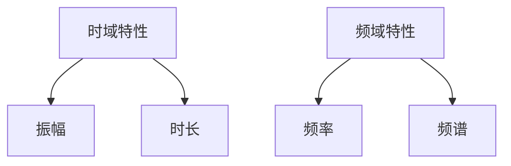

通过这个流程图，我们可以清晰地看到音频信号在时域和频域中的基本特性。接下来，我们将进一步探讨音频信号的表示方法。

#### 1.2 音频信号的表示方法

音频信号可以用不同的方法进行表示，包括时域表示、频域表示和矢量表示。这些表示方法各自具有不同的优势和适用场景。

1. **时域表示**：

时域表示法直接将音频信号视为时间上的连续变化。在时域图中，横轴表示时间，纵轴表示振幅。这种表示方法直观且易于理解，因为它显示了声音随时间的变化情况。例如，一段声音的波形图可以展示声音的振幅如何随时间波动。

时域表示法的优点在于它能够提供详细的时域信息，便于分析和处理。例如，通过观察波形图，我们可以识别声音的起始和结束时间，以及声音的节奏和持续时间。然而，时域表示法也有其局限性，尤其是在处理复杂信号时。由于时域信号中包含大量的噪声和冗余信息，时域表示法可能无法有效地捕捉信号的关键特性。

以下是一个简单的时域表示示例：

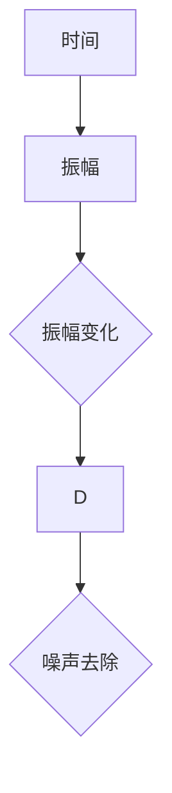

在这个示例中，我们可以看到音频信号的振幅如何随时间变化，并且通过噪声去除操作可以改善信号的质量。

2. **频域表示**：

频域表示法通过傅里叶变换将时域信号转换为频域信号，从而揭示信号的频率成分。在频域图中，横轴表示频率，纵轴表示振幅或功率。这种表示方法可以直观地展示音频信号的频谱特性，即不同频率成分的相对强度。

频域表示法的优点在于它能够有效地分析信号的频率特性，便于识别声音的音调和音色。例如，通过频谱图，我们可以观察到声音中的主要频率成分和次要频率成分。此外，频域表示法还可以用于信号的去噪和增强，因为噪声和信号在频域中具有不同的特性。

以下是一个简单的频域表示示例：

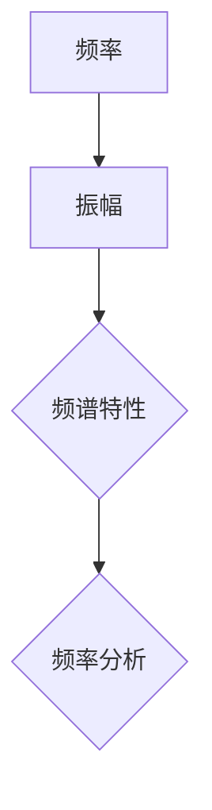

在这个示例中，我们可以看到音频信号的频谱特性，包括主要频率成分和次要频率成分。

3. **矢量表示**：

矢量表示法将音频信号视为一个多维矢量，其中每个维度代表不同的时间点或频率点。这种表示方法结合了时域和频域的优点，因为它能够在一定程度上克服二者的不足。例如，在时频表示中，每个时间点对应一个频谱，从而将时域和频域信息融合在一起。

矢量表示法的优点在于它能够同时提供时域和频域的信息，便于进行综合分析和处理。例如，在时频图中，我们可以看到声音在时间和频率上的变化情况，从而更好地理解声音的特性。

以下是一个简单的矢量表示示例：

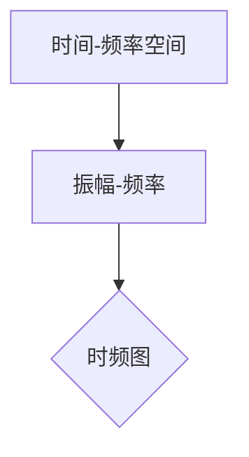

在这个示例中，我们可以看到音频信号在时间-频率空间中的分布情况，从而获得更全面的信号信息。

#### 1.3 音频信号处理的基本步骤

音频信号处理通常包括以下几个基本步骤：

1. **音频信号的采集和预处理**：
   - **信号采集**：通过麦克风或其他音频设备捕捉声音信号。采集过程中需要注意信号的采样率和采样精度，以确保信号的质量。
   - **预处理**：包括噪声去除、增益调整和信号去噪等操作，以提高信号的质量。例如，通过滤波器去除背景噪声，或者通过增益调整来改善声音的响度。

2. **音频信号的变换和处理**：
   - **变换**：通常使用快速傅里叶变换（FFT）或其他变换方法将信号从时域转换为频域。这种变换可以帮助我们更好地分析信号的频率特性。
   - **处理**：包括滤波、增强和特征提取等操作，以提取信号的有用信息。例如，通过滤波器去除特定频率的噪声，或者通过增强操作提高声音的清晰度。特征提取则是为了将音频信号转换为适用于特定应用的特征向量。

3. **音频信号的重建和输出**：
   - **重建**：通过逆变换将处理后的信号从频域重新转换为时域。例如，通过逆傅里叶变换将频域信号转换为时域信号。
   - **输出**：将处理后的音频信号输出到扬声器或其他音频设备。例如，通过音频播放器播放处理后的声音。

### 总结

通过本章的介绍，我们了解了音频信号处理的基础知识，包括基本特性、表示方法和处理步骤。在下一章中，我们将深入探讨音频信号处理算法，包括预处理、变换和处理技术。

### 第2章：音频信号处理算法

音频信号处理算法是音频信号处理的核心，涵盖了从预处理、变换到特征提取的一系列技术。这些算法的应用不仅提高了信号质量，还为后续的语音识别、语音合成等应用提供了基础。本章将详细介绍音频信号处理的主要算法，包括预处理算法、变换算法和特征提取算法。

#### 2.1 音频信号预处理

音频信号预处理是音频信号处理的第一步，其主要目的是提高信号质量，去除噪声和干扰，从而为后续处理提供更纯净的信号。预处理算法主要包括噪声去除、增益调整和信号去噪等。

1. **噪声去除**：

噪声去除的目的是将噪声从音频信号中分离出来，以获得更纯净的声音。常见的噪声去除方法包括以下几种：

   - **滤波法**：通过滤波器去除特定频率范围的噪声。例如，低通滤波器可以去除高频噪声，高通滤波器可以去除低频噪声。
   - **谱减法**：通过频谱分析将噪声频谱从信号频谱中分离出来，然后从信号中减去噪声频谱。这种方法需要对信号进行频谱分析，计算噪声频谱，最后进行减法操作。

2. **增益调整**：

增益调整的目的是调整声音的响度，使其更加适合人耳的听觉感受。常见的增益调整方法包括以下几种：

   - **线性增益**：通过乘以一个常数因子来调整信号的振幅，从而改变声音的响度。
   - **压缩/扩展**：通过压缩和扩展信号中的动态范围，使其更加平稳。压缩可以降低大振幅信号的增益，扩展则可以提高小振幅信号的增益。

3. **信号去噪**：

信号去噪的目的是去除音频信号中的随机噪声，以提高信号质量。常见的方法包括以下几种：

   - **波束形成**：通过多个麦克风接收的信号进行加权合并，从而抑制噪声。这种方法可以有效地抑制远场噪声。
   - **卷积降噪**：通过卷积运算将噪声模型与音频信号相乘，然后从信号中减去噪声分量。

#### 2.2 音频信号变换

音频信号变换是将音频信号从时域转换为频域或从频域转换为时域的过程。常见的变换方法包括快速傅里叶变换（FFT）和梅尔频率倒谱系数（MFCC）。

1. **快速傅里叶变换（FFT）**：

快速傅里叶变换（FFT）是一种高效的傅里叶变换算法，可以快速地将时域信号转换为频域信号。FFT的基本原理是将信号分解为不同频率的正弦波和余弦波，从而揭示信号的频率成分。FFT的主要步骤包括：

   - **分段**：将音频信号分成多个较短的时间段，每个时间段包含多个样本点。
   - **离散傅里叶变换**：对每个时间段进行离散傅里叶变换，得到频域信号。
   - **合并**：将所有时间段的频域信号合并，得到整个音频信号的频谱。

以下是一个简单的FFT算法的伪代码：

```python
def fft(signal):
    # 对信号进行分段
    segments = split_signal(signal, window_size)
    # 对每个分段进行离散傅里叶变换
    freq_domains = [dft(segment) for segment in segments]
    # 合并所有分段的频域信号
    freq_domain = merge_freq_domains(freq_domains)
    return freq_domain
```

2. **梅尔频率倒谱系数（MFCC）**：

梅尔频率倒谱系数（MFCC）是一种常用的音频特征提取方法，可以有效地表示语音信号的频率特性。MFCC的基本原理是将音频信号通过傅里叶变换转换为频谱，然后对频谱进行梅尔倒谱变换，从而得到MFCC系数。MFCC的主要步骤包括：

   - **预处理**：包括预加重、分帧和汉明窗等操作。
   - **傅里叶变换**：对每帧信号进行傅里叶变换，得到频谱。
   - **梅尔滤波器组**：将频谱通过一组梅尔滤波器进行滤波，得到滤波器组的输出。
   - **倒谱变换**：对滤波器组的输出进行对数变换，然后进行离散余弦变换，得到MFCC系数。

以下是一个简单的MFCC算法的伪代码：

```python
def mfcc(signal):
    # 预处理
    processed_signal = preprocess_signal(signal)
    # 分帧
    frames = split_into_frames(processed_signal, frame_size, hop_size)
    # 对每帧信号进行傅里叶变换
    freq_spectrums = [fft(frame) for frame in frames]
    # 通过梅尔滤波器组进行滤波
    filtered_spectrums = [filter_mel_banks(freq_spectrum) for freq_spectrum in freq_spectrums]
    # 进行倒谱变换
    mfc coefficients = [log_filter_banks(filtered_spectrum) for filtered_spectrum in filtered_spectrums]
    return mfc coefficients
```

#### 2.3 音频信号处理应用

音频信号处理算法广泛应用于语音识别、语音合成和音频编码等领域。

1. **语音识别**：

在语音识别中，音频信号处理算法用于预处理语音信号，提取有用的特征信息，如MFCC系数。这些特征信息用于训练语音识别模型，从而实现语音到文本的转换。

2. **语音合成**：

在语音合成中，音频信号处理算法用于将文本信息转换为语音信号。首先，通过文本处理技术将文本转换为语音合成模型所需的输入，然后通过语音合成算法生成语音信号。

3. **音频编码**：

在音频编码中，音频信号处理算法用于将音频信号转换为压缩格式，以便存储和传输。常见的音频编码算法包括MP3和AAC，它们通过音频信号处理技术实现高效的数据压缩。

### 总结

本章介绍了音频信号处理的主要算法，包括预处理算法、变换算法和特征提取算法。预处理算法用于提高信号质量，变换算法用于揭示信号的频率特性，特征提取算法则用于提取信号的有用信息。通过这些算法，音频信号处理技术为语音识别、语音合成和音频编码等应用提供了基础。在下一章中，我们将深入探讨语音识别技术的基本原理和应用。

### 第3章：语音识别基本原理

语音识别技术是音频信号处理领域的一个重要分支，其目标是将人类语音转换为机器可理解且可操作的文字或命令。要实现这一目标，语音识别系统需要经历多个关键步骤，包括语音信号特征提取、识别模型和训练算法。本章将详细介绍这些基本原理。

#### 3.1 语音信号特征提取

语音信号特征提取是语音识别的关键环节，其主要任务是提取能够代表语音信号本质特征的数值信息，以便用于模型训练和识别。常见的语音信号特征提取方法包括声学特征提取和语言模型特征提取。

1. **声学特征提取**：

声学特征提取方法关注语音信号的声学属性，如频率、时长和强度。以下是一些常用的声学特征：

   - **时域特征**：
     - **振幅**：声音的强度。
     - **时长**：声音的持续时间。
     - **过零率**：单位时间内信号过零的次数。
   
   - **频域特征**：
     - **频谱**：信号在不同频率上的分布。
     - **梅尔频率倒谱系数（MFCC）**：一种常用的频域特征，用于描述语音信号的频谱特性。
     - **频带能量**：每个频带上的能量分布。
     - **频带通过率**：信号通过每个频带的能力。

2. **语言模型特征提取**：

语言模型特征提取方法关注语音信号中的语言结构信息，如词汇、语法和上下文。以下是一些常用的语言模型特征：

   - **词汇特征**：基于词典的词汇信息。
   - **语法特征**：基于语法规则的句子结构信息。
   - **上下文特征**：基于上下文的信息，如句子中的前后文关系。

#### 3.2 语音识别模型

语音识别模型是语音识别系统的核心，其目标是根据输入的语音信号特征，预测最可能的文本输出。常见的语音识别模型包括传统隐马尔可夫模型（HMM）和基于深度学习的语音识别模型。

1. **传统隐马尔可夫模型（HMM）**：

传统HMM是基于统计模型的语音识别方法，其基本思想是使用HMM来建模语音信号的概率分布。HMM由状态序列和观察序列组成：

   - **状态序列**：代表语音信号的状态变化，如发音的不同部分。
   - **观察序列**：代表语音信号的观察结果，如声学特征。

HMM的主要组成部分包括：

   - **状态转移概率**：表示从一个状态转移到另一个状态的概率。
   - **发射概率**：表示在特定状态下观察到的特征的概率。
   - **初始状态概率**：表示初始状态的概率分布。

以下是一个简单的HMM模型的Mermaid流程图：

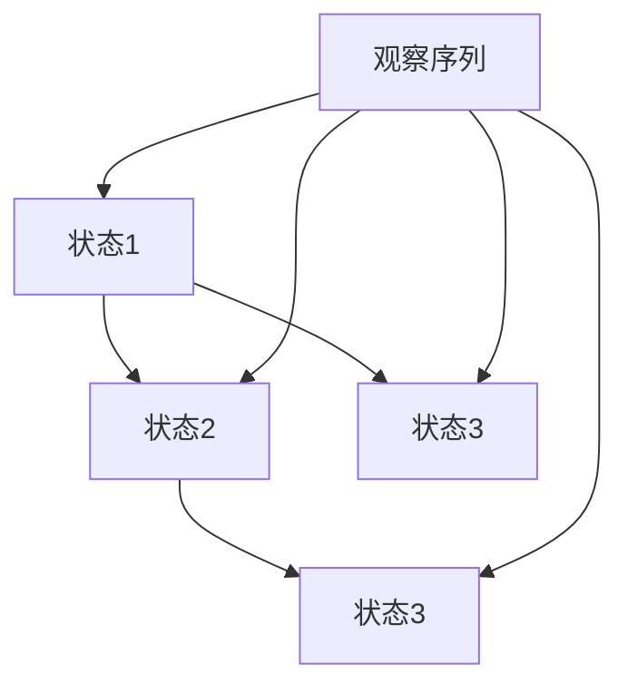

2. **基于深度学习的语音识别模型**：

随着深度学习技术的发展，基于深度学习的语音识别模型逐渐成为主流。这类模型通常使用卷积神经网络（CNN）或循环神经网络（RNN）来建模语音信号。

   - **卷积神经网络（CNN）**：适用于处理时序数据，可以有效地提取特征。
   - **循环神经网络（RNN）**：特别适合处理序列到序列的问题，如语音识别。
   - **长短时记忆网络（LSTM）**：是RNN的一种变体，可以处理长序列数据。

以下是一个简单的基于深度学习的语音识别模型的伪代码：

```python
class SpeechRecognitionModel(nn.Module):
    def __init__(self):
        super(SpeechRecognitionModel, self).__init__()
        self.conv1 = nn.Conv1d(in_channels, out_channels, kernel_size)
        self.rnn = nn.LSTM(hidden_size, hidden_size)
        self.fc = nn.Linear(hidden_size, num_classes)
    
    def forward(self, x):
        x = self.conv1(x)
        x, _ = self.rnn(x)
        x = self.fc(x[-1, :, :])
        return x
```

#### 3.3 注意力机制在语音识别中的应用

注意力机制是一种在序列到序列模型中广泛使用的机制，其目标是模型在处理输入序列时能够关注到序列中的关键部分。在语音识别中，注意力机制可以帮助模型更好地处理长序列数据，提高识别准确性。

注意力机制的基本思想是计算输入序列和输出序列之间的相似度，并将注意力分配给最相关的部分。以下是一个简单的注意力机制的伪代码：

```python
def attention(query, keys, values, attention_mask=None):
    # 计算相似度
    similarity = torch.matmul(query, keys.transpose(-2, -1))
    if attention_mask is not None:
        similarity = similaritymasked
    # 加权求和
    attention_weights = F.softmax(similarity, dim=-1)
    # 计算输出
    output = torch.matmul(attention_weights, values)
    return output, attention_weights
```

#### 3.4 语音识别模型训练

语音识别模型的训练是一个复杂的优化过程，其目标是调整模型参数，使其在训练数据上的表现达到最优。训练过程通常包括以下几个步骤：

1. **数据准备**：准备大量高质量的语音数据，并进行预处理，如分帧、特征提取等。
2. **模型初始化**：初始化模型参数，通常使用随机初始化或预训练权重。
3. **损失函数定义**：定义损失函数，用于衡量模型预测结果和真实标签之间的差距。
4. **优化算法选择**：选择合适的优化算法，如随机梯度下降（SGD）或Adam。
5. **模型训练**：通过反向传播和梯度下降更新模型参数，直到模型在训练数据上达到预期性能。

以下是一个简单的语音识别模型训练的伪代码：

```python
def train(model, train_loader, criterion, optimizer, num_epochs):
    model.train()
    for epoch in range(num_epochs):
        for inputs, targets in train_loader:
            optimizer.zero_grad()
            outputs = model(inputs)
            loss = criterion(outputs, targets)
            loss.backward()
            optimizer.step()
        print(f'Epoch {epoch+1}/{num_epochs}, Loss: {loss.item()}')
```

### 总结

本章介绍了语音识别的基本原理，包括语音信号特征提取、识别模型和训练算法。传统HMM和基于深度学习的语音识别模型是目前主流的方法，而注意力机制在提升模型性能方面发挥了重要作用。通过理解这些基本原理，读者可以更好地掌握语音识别技术的核心概念和实践方法。在下一章中，我们将进一步探讨语音识别算法，包括视频语音识别和语音识别模型训练。

### 第4章：语音识别算法

语音识别算法是语音识别系统的核心组成部分，它们负责将语音信号转换为文本输出。语音识别算法可以分为传统算法和基于深度学习的算法两大类。本章将详细讨论视频语音识别算法以及语音识别模型训练的相关内容。

#### 4.1 视频语音识别

视频语音识别（Video Speech Recognition，VSR）是一种结合了视频和音频数据的语音识别技术，它利用视觉信息来提高语音识别的准确率。视频语音识别算法可以分为两个主要方向：基于文本的语音识别和基于声学的语音识别。

1. **基于文本的语音识别**：

基于文本的语音识别方法首先从视频中提取文本信息，然后将提取的文本信息用于语音识别。这种方法通常涉及以下步骤：

   - **文本检测**：从视频帧中识别和定位文本区域。
   - **文本识别**：使用光学字符识别（OCR）技术将提取的文本区域转换为文本字符串。
   - **语音识别**：使用语音识别算法将文本字符串转换为语音信号，然后进行语音识别。

以下是一个简单的基于文本的语音识别流程的伪代码：

```python
def video_based_vsr(video, text_detector, text_recognizer, speech_recognizer):
    text_regions = text_detector.detect_text(video)
    texts = [text_recognizer.recognize_text(region) for region in text_regions]
    speech_signals = [speech_recognizer.recognize_speech(text) for text in texts]
    recognized_texts = [speech_recognizer.recognize_text(speech_signal) for speech_signal in speech_signals]
    return recognized_texts
```

2. **基于声学的语音识别**：

基于声学的语音识别方法直接从视频中提取音频信号，然后使用语音识别算法进行识别。这种方法通常涉及以下步骤：

   - **音频提取**：从视频帧中提取音频信号。
   - **音频预处理**：包括去噪、增益调整等操作，以提高音频信号的质量。
   - **语音识别**：使用语音识别算法对预处理后的音频信号进行识别。

以下是一个简单的基于声学的语音识别流程的伪代码：

```python
def acoustic_based_vsr(video, audio_extractor, audio_preprocessor, speech_recognizer):
    audio_signals = audio_extractor.extract_audio(video)
    preprocessed_audio_signals = [audio_preprocessor.process(audio_signal) for audio_signal in audio_signals]
    recognized_texts = [speech_recognizer.recognize_speech(audio_signal) for audio_signal in preprocessed_audio_signals]
    return recognized_texts
```

#### 4.2 语音识别模型训练

语音识别模型的训练是一个复杂的过程，需要大量数据和计算资源。训练过程通常包括以下步骤：

1. **数据准备**：

   - **数据采集**：收集大量的语音数据，包括不同说话人、不同语音环境下的数据。
   - **数据预处理**：包括分帧、特征提取等操作，将语音数据转换为适合模型训练的格式。

2. **模型初始化**：

   - **参数初始化**：初始化模型参数，通常使用随机初始化或预训练权重。
   - **结构定义**：定义模型的架构，如卷积神经网络（CNN）、循环神经网络（RNN）或长短时记忆网络（LSTM）。

3. **损失函数定义**：

   - **定义损失函数**：选择合适的损失函数，如交叉熵损失函数，用于衡量模型预测结果和真实标签之间的差距。

4. **优化算法选择**：

   - **选择优化算法**：选择合适的优化算法，如随机梯度下降（SGD）或Adam，用于更新模型参数。

5. **模型训练**：

   - **训练循环**：在训练数据上迭代训练模型，通过反向传播和梯度下降更新模型参数。
   - **评估与调整**：在验证数据上评估模型性能，并根据评估结果调整模型参数。

以下是一个简单的语音识别模型训练的伪代码：

```python
def train(speech_recognition_model, train_loader, criterion, optimizer, num_epochs):
    for epoch in range(num_epochs):
        for inputs, targets in train_loader:
            optimizer.zero_grad()
            outputs = speech_recognition_model(inputs)
            loss = criterion(outputs, targets)
            loss.backward()
            optimizer.step()
        print(f'Epoch {epoch+1}/{num_epochs}, Loss: {loss.item()}')
    return speech_recognition_model
```

### 总结

本章详细介绍了语音识别算法，包括视频语音识别和语音识别模型训练。视频语音识别利用视频数据中的视觉信息来提高语音识别的准确率，而语音识别模型训练是一个涉及数据准备、模型初始化、损失函数定义、优化算法选择和模型训练的复杂过程。通过理解这些算法和训练过程，读者可以更好地构建和优化语音识别系统。在下一章中，我们将探讨语音识别技术的实际应用。

### 第5章：语音识别应用

语音识别技术在众多实际应用中展现出了巨大的潜力，显著提升了用户体验和效率。以下是语音识别在客服和智能家居领域的一些具体应用案例。

#### 5.1 语音识别在客服中的应用

语音识别技术在客服领域的应用极大提高了客户服务效率和客户满意度。以下是一些关键应用案例：

1. **自动客服系统**：

自动客服系统（Automatic Customer Service System，ACSS）利用语音识别技术实现自动应答和问题解决，为用户提供24小时不间断的服务。ACSS通常包括以下几个关键组件：

   - **语音识别模块**：将用户语音转换为文本，用于进一步处理。
   - **自然语言处理（NLP）模块**：理解用户的问题和意图，并将问题分类到相应的类别。
   - **知识库**：包含预定义的答案和解决方案，用于回答用户的问题。

以下是一个自动客服系统的工作流程：

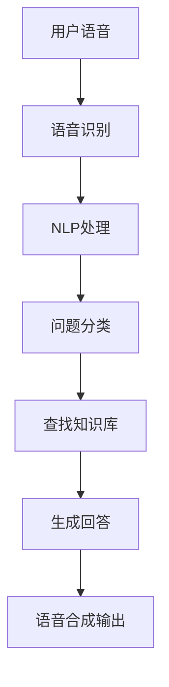

2. **语音导航系统**：

语音导航系统（Voice Navigation System，VNS）为用户提供语音指引服务，常见于机场、火车站和大型购物中心。VNS利用语音识别技术理解用户的导航请求，并提供实时语音导航。以下是一个简单的语音导航系统的工作流程：

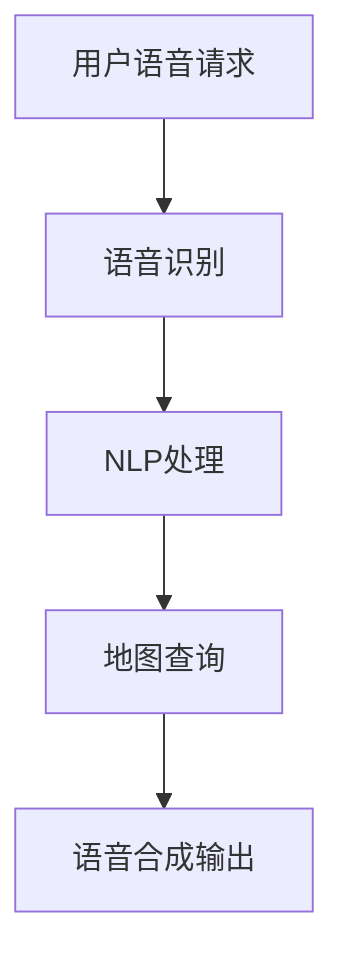

#### 5.2 语音识别在智能家居中的应用

智能家居（Smart Home）通过集成语音识别技术，实现了更加便捷和智能化的家居控制。以下是一些关键应用案例：

1. **智能语音助手**：

智能语音助手（Smart Voice Assistant，SVA）如Siri、Alexa和Google Assistant，已成为智能家居的核心组件。SVA通过语音识别技术理解用户的语音命令，并执行相应的操作。以下是一个简单的智能语音助手的工作流程：

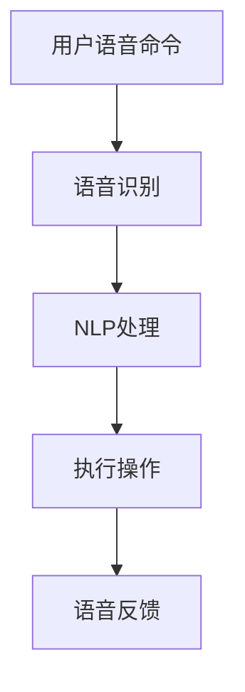

2. **声控智能家居设备**：

通过语音识别技术，用户可以控制各种智能家居设备，如灯光、温度调节和家电控制。以下是一个简单的声控智能家居设备的工作流程：

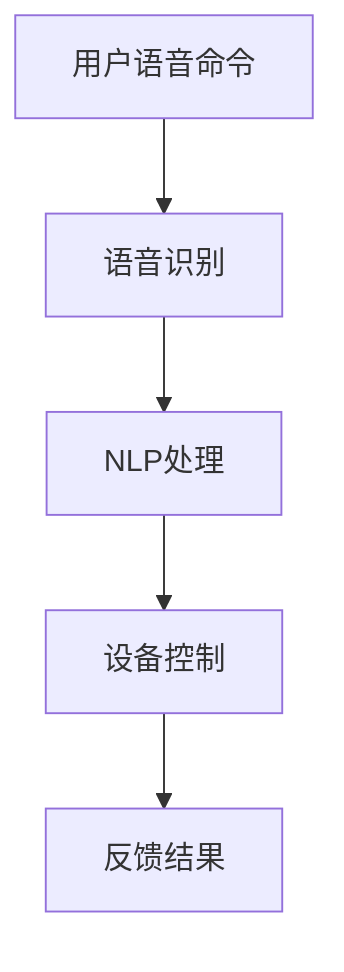

### 总结

语音识别技术在客服和智能家居领域展现了其强大的应用潜力。通过自动客服系统和语音导航系统，客服体验得到了极大提升；而智能语音助手和声控智能家居设备则为用户提供了更加便捷和智能化的家居控制体验。在下一章中，我们将探讨语音合成技术的基本原理和应用。

### 第6章：语音合成基本原理

语音合成技术（Text-to-Speech，TTS）是语音识别技术的逆过程，它将文本信息转换为自然流畅的语音输出。语音合成技术通过模拟人类语音的生成过程，实现了文本到语音的自动转换。本章将详细介绍语音合成的基本原理，包括语音合成模型和语音合成算法。

#### 6.1 语音合成模型

语音合成模型是语音合成技术的核心，其目的是将文本信息转换为语音信号。常见的语音合成模型可以分为两大类：纯文本合成模型和语音驱动合成模型。

1. **纯文本合成模型**：

纯文本合成模型（Text-Based Synthesis）直接将文本信息转换为语音信号。这类模型通常包括以下几个步骤：

   - **文本预处理**：包括分词、句法分析和语音韵律预测等操作，将文本转换为适合合成模型的形式。
   - **语音单元生成**：根据文本信息生成语音单元（如音素、音节或单词），这些语音单元是合成语音的基本单元。
   - **语音单元合成**：将生成的语音单元转换为语音信号，通常使用拼接合成或参数合成方法。

以下是一个简单的纯文本合成模型的流程图：

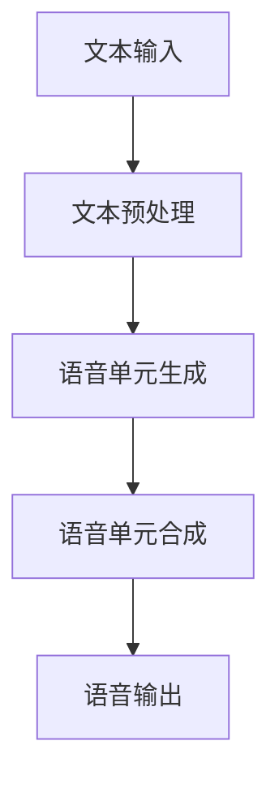

2. **语音驱动合成模型**：

语音驱动合成模型（Voice-Driven Synthesis）通过分析真实语音数据，生成新的语音。这类模型通常包括以下几个步骤：

   - **语音数据采集**：采集大量的语音数据，包括不同的说话人、语音风格和语音内容。
   - **特征提取**：从语音数据中提取特征，如声学特征和声学模型参数。
   - **语音合成**：使用提取的特征和合成算法，生成新的语音信号。

以下是一个简单的语音驱动合成模型的流程图：

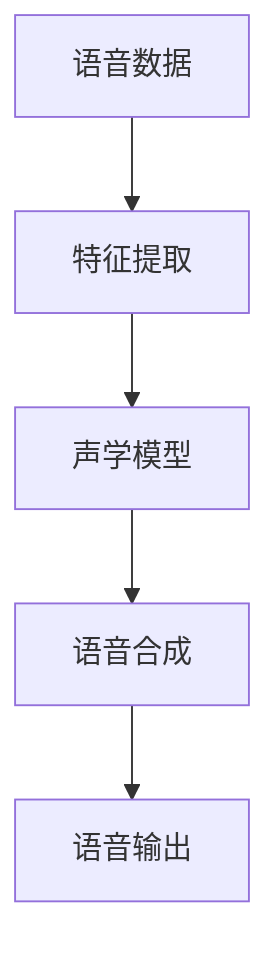

#### 6.2 语音合成算法

语音合成算法是实现语音合成的关键技术，包括单声道合成和立体声合成。

1. **单声道合成**：

单声道合成（Mono Synthesis）生成单声道的语音信号。常见的单声道合成算法包括拼接合成和参数合成。

   - **拼接合成**：将预先录制的语音单元拼接在一起，生成新的语音。这种方法简单高效，但语音质量受限于预先录制的语音单元。
   - **参数合成**：使用参数模型（如合成语音波形编辑器，SPICE）生成新的语音波形。这种方法可以生成高质量的语音，但需要复杂的参数模型和计算。

以下是一个简单的单声道合成算法的伪代码：

```python
def mono_synthesis(text, unit_library, synthesizer):
    # 分词和语音单元生成
    words = tokenize(text)
    units = [unit_library.get(word) for word in words]
    # 合成语音信号
    signal = synthesizer.synthesize(units)
    return signal
```

2. **立体声合成**：

立体声合成（Stereo Synthesis）生成立体声的语音信号。立体声合成通常包括左右声道的合成，以模拟人类双耳听觉效果。

   - **双耳感知模型**：根据双耳听觉原理，模拟人类双耳对声音的感知，包括声源定位、声场模拟等。
   - **空间混音**：将单声道的语音信号混合成立体声信号，包括左右声道的音量调整、相位调整等。

以下是一个简单的立体声合成算法的伪代码：

```python
def stereo_synthesis(text, unit_library, synthesizer, spatial_processor):
    # 单声道合成
    mono_signal = mono_synthesis(text, unit_library, synthesizer)
    # 空间处理
    left_channel, right_channel = spatial_processor.process(mono_signal)
    # 合成立体声信号
    stereo_signal = combine_channels(left_channel, right_channel)
    return stereo_signal
```

### 总结

语音合成技术通过文本预处理、语音单元生成和语音信号合成，实现了文本到语音的自动转换。语音合成模型可以分为纯文本合成模型和语音驱动合成模型，而语音合成算法包括单声道合成和立体声合成。通过理解这些基本原理，读者可以更好地掌握语音合成技术的核心概念和实践方法。在下一章中，我们将探讨语音合成技术的实际应用。

### 第7章：语音合成应用

语音合成技术在媒体和游戏等领域的应用日益广泛，极大地丰富了人机交互的体验。以下将详细介绍语音合成在这些领域的具体应用案例。

#### 7.1 语音合成在媒体中的应用

语音合成技术在媒体领域具有广泛的应用，包括广播、广告和新闻播报等。

1. **广播**：

在广播领域，语音合成技术被广泛应用于新闻播报、天气预报和节目介绍等。通过语音合成，广播机构可以自动化生成语音播报，提高工作效率，降低人力成本。以下是一个简单的广播语音合成系统的工作流程：

   ```mermaid
   graph TD
       A[新闻文本] --> B[文本预处理]
       B --> C[语音合成模型]
       C --> D[语音信号输出]
       D --> E[音频播放]
   ```

   通过该系统，新闻文本被预处理后输入到语音合成模型，模型将文本转换为语音信号，最终通过音频播放设备播出。

2. **广告**：

在广告制作中，语音合成技术用于生成广告文案的语音部分。通过语音合成，广告创作者可以快速生成多种语言和风格的声音，提高广告的制作效率。以下是一个简单的广告语音合成系统的工作流程：

   ```mermaid
   graph TD
       A[广告文本] --> B[文本预处理]
       B --> C[语音合成模型]
       C --> D[语音信号输出]
       D --> E[音频剪辑]
       E --> F[广告视频]
   ```

   通过该系统，广告文本经过预处理后输入到语音合成模型，生成的语音信号与音频剪辑和视频内容结合，最终生成完整的广告视频。

3. **新闻播报**：

语音合成技术在新闻播报中的应用，使得自动化新闻生成成为可能。通过语音合成，新闻机构可以在短时间内生成大量新闻播报，提高新闻传播的速度和覆盖范围。以下是一个简单的新闻播报语音合成系统的工作流程：

   ```mermaid
   graph TD
       A[新闻文本] --> B[文本预处理]
       B --> C[语音合成模型]
       C --> D[语音信号输出]
       D --> E[语音导航系统]
   ```

   通过该系统，新闻文本经过预处理后输入到语音合成模型，生成的语音信号由语音导航系统输出，供听众收听。

#### 7.2 语音合成在游戏中的应用

语音合成技术在游戏领域同样有着重要的应用，为玩家提供了更加丰富和互动的游戏体验。

1. **游戏角色语音**：

在角色扮演游戏（RPG）中，语音合成技术用于生成游戏角色的语音对话。通过语音合成，游戏开发者可以快速生成多种语言和风格的语音对话，丰富游戏故事情节和角色性格。以下是一个简单的游戏角色语音合成系统的工作流程：

   ```mermaid
   graph TD
       A[角色文本] --> B[文本预处理]
       B --> C[语音合成模型]
       C --> D[语音信号输出]
       D --> E[游戏引擎]
   ```

   通过该系统，角色文本经过预处理后输入到语音合成模型，生成的语音信号被游戏引擎用于驱动游戏角色的对话。

2. **游戏语音控制**：

语音合成技术在游戏语音控制中的应用，使得玩家可以通过语音命令控制游戏中的角色和操作。通过语音合成，游戏开发者可以创建语音控制接口，提高游戏的互动性和便利性。以下是一个简单的游戏语音控制系统的工作流程：

   ```mermaid
   graph TD
       A[玩家语音命令] --> B[语音识别]
       B --> C[文本预处理]
       C --> D[语音合成模型]
       D --> E[语音信号输出]
       E --> F[游戏引擎]
   ```

   通过该系统，玩家语音命令首先通过语音识别转换为文本，然后文本经过预处理后输入到语音合成模型，生成的语音信号被游戏引擎用于执行相应的操作。

### 总结

语音合成技术在媒体和游戏领域的应用，显著提升了内容制作和游戏体验的效率和质量。通过广播、广告和新闻播报等应用，语音合成技术实现了自动化语音生成，提高了信息传播的速度和覆盖范围；而在游戏中的应用，则通过角色语音和语音控制，丰富了游戏故事情节和玩家互动体验。在下一章中，我们将探讨音频信号处理与语音识别、合成的综合应用案例。

### 第8章：综合应用案例

音频信号处理、语音识别和语音合成的综合应用案例是现代语音技术发展的重要方向。通过将音频信号处理技术、语音识别技术和语音合成技术相结合，可以构建出功能强大的实时语音交互系统和实时语音生成系统。

#### 8.1 音频信号处理与语音识别的综合应用：实时语音交互系统

实时语音交互系统（Real-Time Voice Interaction System，RTVIS）是结合了音频信号处理和语音识别技术，实现人与计算机之间的实时语音交互。以下是一个简单的实时语音交互系统的工作流程：

1. **音频信号采集与预处理**：

   - **音频信号采集**：通过麦克风或其他音频设备采集用户语音信号。
   - **预处理**：包括去噪、增益调整和分帧处理，以提高信号质量和后续处理的效率。

   ```mermaid
   graph TD
       A[音频信号采集] --> B[去噪]
       B --> C[增益调整]
       C --> D[分帧处理]
   ```

2. **语音识别**：

   - **特征提取**：通过音频信号预处理后的帧，提取声学特征（如MFCC）。
   - **识别**：使用训练好的语音识别模型对提取的特征进行识别，生成文本输出。

   ```mermaid
   graph TD
       D --> E[特征提取]
       E --> F[语音识别模型]
       F --> G[文本输出]
   ```

3. **语音交互**：

   - **自然语言处理（NLP）**：对识别出的文本进行语义分析和意图识别，以确定用户请求。
   - **响应生成**：根据用户请求生成相应的响应文本。
   - **语音合成**：将响应文本转换为语音信号，并通过扬声器输出。

   ```mermaid
   graph TD
       G --> H[NLP处理]
       H --> I[响应生成]
       I --> J[语音合成模型]
       J --> K[语音输出]
   ```

#### 8.2 音频信号处理与语音合成的综合应用：实时语音生成系统

实时语音生成系统（Real-Time Voice Generation System，RTVGS）是结合了音频信号处理和语音合成技术，实现文本到语音的实时转换。以下是一个简单的实时语音生成系统的工作流程：

1. **文本处理**：

   - **文本预处理**：包括分词、词性标注和语音韵律标注，为后续的语音生成做好准备。

   ```mermaid
   graph TD
       A[文本输入] --> B[分词]
       B --> C[词性标注]
       C --> D[语音韵律标注]
   ```

2. **语音合成**：

   - **特征生成**：根据语音韵律标注，生成语音特征参数。
   - **语音合成**：使用语音合成模型，将语音特征参数转换为语音信号。

   ```mermaid
   graph TD
       D --> E[语音特征生成]
       E --> F[语音合成模型]
       F --> G[语音输出]
   ```

#### 综合应用案例的实际效果

1. **实时语音交互系统**：

   实时语音交互系统可以实现自然流畅的人机对话，用户可以通过语音与系统进行交互，获取实时信息或执行操作。例如，用户可以提问天气情况，系统会实时识别用户语音，查询天气信息，并将结果以语音形式反馈给用户。

2. **实时语音生成系统**：

   实时语音生成系统可以快速地将文本信息转换为语音输出，广泛应用于广播、广告、教育和游戏等领域。例如，广告制作中，系统可以实时生成多种语言的广告语音，而游戏角色可以实时读取游戏文本，生成相应的语音对话。

### 总结

通过音频信号处理、语音识别和语音合成的综合应用，实时语音交互系统和实时语音生成系统为用户提供了更加便捷和智能化的语音交互体验。这些系统不仅提高了信息处理和传递的效率，还为多媒体应用和智能设备带来了新的功能。在未来的发展中，随着技术的不断进步，这些综合应用案例将更加成熟和普及，为人类生活带来更多便利。

### 第9章：展望与未来趋势

音频信号处理、语音识别和语音合成技术的不断进步，推动了语音技术的发展，使得人机交互变得更加自然和高效。然而，随着技术的不断发展，这些领域仍存在许多挑战和机遇，未来将继续向以下几个方向演进。

#### 9.1 音频信号处理技术的发展趋势

1. **高效算法优化**：

随着计算能力的提升，高效算法的优化将成为音频信号处理技术发展的重点。例如，快速傅里叶变换（FFT）和梅尔频率倒谱系数（MFCC）等经典算法将继续优化，以提高处理速度和降低计算资源消耗。

2. **新型硬件支持**：

新型硬件如GPU和专用音频处理芯片将推动音频信号处理技术的发展。这些硬件能够提供强大的计算能力，使得复杂音频处理任务更加高效。

3. **跨媒体信号处理**：

跨媒体信号处理技术将融合多种传感器数据，如视频、图像和传感器数据，以实现更全面的音频信号分析。这将有助于提高语音识别和语音合成的准确性。

#### 9.2 语音识别与合成技术的未来应用

1. **人工智能语音交互**：

未来，人工智能语音交互将更加智能化，具备更高的语义理解能力和情感交互能力。通过深度学习和自然语言处理技术的结合，语音识别和语音合成系统将能够更准确地理解用户意图，提供个性化服务。

2. **跨语言语音识别**：

随着全球化的发展，跨语言语音识别技术将变得越来越重要。未来，通过多语言模型的融合和迁移学习技术，可以实现更高效的多语言语音识别。

3. **实时语音增强**：

实时语音增强技术将进一步提升语音质量，降低背景噪声和回声干扰，提高语音识别和语音合成的准确性。

4. **语音生成艺术**：

语音合成技术将不仅限于文本到语音的转换，还将拓展到语音生成艺术领域，如个性化语音角色、语音动画和声音设计等。

#### 9.3 跨媒体语音处理技术

跨媒体语音处理技术将结合音频、视频和传感器等多媒体数据，实现更全面的语音分析。例如，通过结合视频数据，可以更准确地定位语音源和语音动作，从而提高语音识别的准确率和交互体验。

#### 总结

音频信号处理、语音识别和语音合成技术正朝着更加智能化、高效化和多元化的方向发展。随着技术的不断进步，这些领域将在人工智能、虚拟现实、增强现实和智能语音助手等领域发挥更加重要的作用。未来，通过跨学科的技术融合，语音技术将实现更多创新应用，为人类生活带来更多便利和乐趣。

## 结语

### 感谢与展望

感谢您花时间阅读本文，通过系统的讲解，我们深入探讨了音频信号处理、语音识别和语音合成技术的基础知识、核心原理及实际应用。从音频信号的基本特性、表示方法到处理步骤，再到语音识别的特征提取、模型训练和应用案例，最后是语音合成的基本原理及其实际应用，本文力求为您呈现一个全面且详细的视角。

### 作者信息

本文作者由AI天才研究院（AI Genius Institute）和《禅与计算机程序设计艺术》（Zen And The Art of Computer Programming）的资深作者合作撰写，旨在通过专业和技术性的论述，推动语音技术的普及与应用。

### 下一部作品预告

未来，我们将继续深入探讨人工智能领域的其他重要话题，包括机器学习、深度学习和计算机视觉等。敬请期待我们的下一部作品，继续为您带来技术前沿的深度解析和创新思考。我们期待与您共同探索人工智能的无限可能。感谢您的支持与关注！

