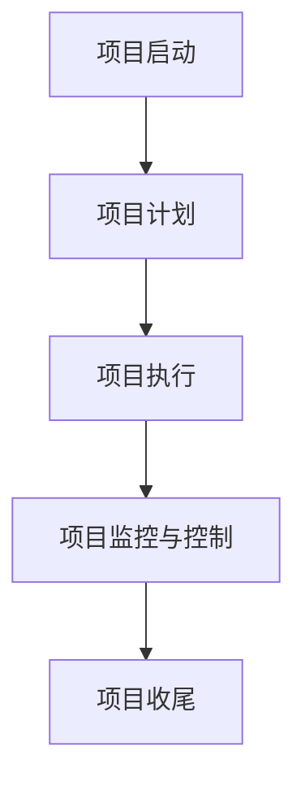

                 

# 项目管理技巧：确保团队按时完成目标

> 关键词：项目管理、团队协作、进度控制、成本管理、风险管理

> 摘要：本文将探讨项目管理中的关键技巧，帮助团队确保按时完成目标。我们将从项目管理概述开始，逐步深入到项目管理的核心概念、团队管理、项目计划与控制、沟通管理、团队协作与激励，以及项目成功案例分析等多个方面。通过本文的阅读，您将获得全面的项目管理知识和实践经验，为您的项目成功奠定基础。

## 第一部分：项目管理概述

### 1.1 什么是项目管理

项目管理是一种规划和执行任务以实现特定目标的过程。它涉及多个方面的协调和管理，包括时间、成本、质量、风险和资源等。以下是项目管理的主要概念和要素：

**项目定义**：项目是一个临时性、一次性的工作，旨在创建一个独特的产品、服务或成果。它通常具有明确的目标和范围。

**项目目标**：项目目标是指通过项目实现的具体目标和期望成果。这些目标可以是定量或定性的，例如，按时交付产品或提高客户满意度。

**项目管理的重要性**：

- 提高项目成功率：有效的项目管理可以提高项目成功的可能性，确保项目按时、按预算和按质量要求完成。
- 资源优化：项目管理确保资源（人力、时间、资金等）得到合理利用，避免资源浪费。
- 风险管理：项目管理通过识别和评估潜在风险，制定应对措施，降低项目风险。
- 提高团队协作：项目管理促进团队成员之间的沟通和协作，提高团队效率和绩效。

#### 项目管理过程

项目管理过程是一个循环往复的过程，包括以下几个阶段：

1. **项目启动**：确定项目目标、范围、时间表和预算，组建项目团队。
2. **项目计划**：制定详细的项目计划，包括进度计划、成本预算、资源分配、风险管理计划等。
3. **项目执行**：执行项目计划，实施项目工作，监控项目进度和质量。
4. **项目监控与控制**：监控项目进度、成本和质量，与项目计划进行比较，及时进行调整和纠正。
5. **项目收尾**：完成项目工作，进行项目总结和评估，确保项目目标的实现。

#### 项目管理知识体系

项目管理知识体系是一个全面的框架，涵盖了项目管理的各个方面。PMBOK指南（项目管理知识体系指南）是项目管理领域的权威指南，提供了项目管理过程、知识领域和项目管理专业能力的详细描述。

PMBOK指南主要包括以下知识领域：

1. **项目整合管理**：确保项目各要素之间的协调和整合，实现项目目标。
2. **项目范围管理**：定义项目范围、创建工作分解结构（WBS）、管理项目范围变更。
3. **项目时间管理**：规划、管理、控制和优化项目进度。
4. **项目成本管理**：估算、预算、控制项目成本。
5. **项目质量管理**：规划、管理和控制项目质量，确保项目成果符合质量标准。
6. **项目沟通管理**：规划、管理和控制项目沟通，确保项目信息及时、准确地传递。
7. **项目风险管理**：识别、评估、规划和应对项目风险。
8. **项目采购管理**：规划、管理和控制项目采购活动。
9. **项目资源管理**：规划、管理和控制项目团队和物理资源。
10. **项目相关方管理**：识别、分析和管理项目相关方的需求和期望。

### 1.2 项目管理过程

项目管理过程是一个循环往复的过程，包括以下几个阶段：

1. **项目启动**：在项目启动阶段，项目团队确定项目的目标、范围、时间表和预算。此阶段的主要任务包括：

   - **项目章程**：项目章程是项目启动的正式文件，定义了项目的目标、范围、关键里程碑、预算和高层级风险。
   - **项目团队组建**：组建项目团队，明确团队成员的角色和职责。
   - **项目初步计划**：制定初步的项目计划，包括项目范围、时间表、成本和资源分配。

2. **项目计划**：在项目计划阶段，项目团队制定详细的项目计划，包括项目进度计划、成本预算、资源分配、风险管理计划等。此阶段的主要任务包括：

   - **项目范围管理计划**：明确项目范围、定义项目工作内容。
   - **项目进度管理计划**：制定项目进度计划，确定项目关键路径。
   - **项目成本管理计划**：制定项目成本预算，分配资源。
   - **项目质量管理计划**：制定项目质量标准，确保项目成果符合质量要求。
   - **项目沟通管理计划**：制定项目沟通计划，确保项目信息传递及时、准确。
   - **项目风险管理计划**：识别项目风险，制定风险应对策略。
   - **项目采购管理计划**：制定项目采购计划，明确采购流程。

3. **项目执行**：在项目执行阶段，项目团队按照项目计划实施项目工作。此阶段的主要任务包括：

   - **项目进度管理**：监控项目进度，确保项目按计划进行。
   - **项目质量管理**：确保项目成果符合质量标准，进行质量检查和验收。
   - **项目沟通管理**：保持与项目相关方的沟通，及时传递项目信息。
   - **项目风险管理**：监控项目风险，采取风险应对措施。

4. **项目监控与控制**：在项目监控与控制阶段，项目团队持续监控项目进度、成本和质量，与项目计划进行比较，及时进行调整和纠正。此阶段的主要任务包括：

   - **项目进度控制**：监控项目进度，分析进度偏差，采取调整措施。
   - **项目成本控制**：监控项目成本，分析成本偏差，采取调整措施。
   - **项目质量控制**：监控项目质量，分析质量偏差，采取纠正措施。
   - **项目变更管理**：识别项目变更，评估变更影响，批准或拒绝变更。

5. **项目收尾**：在项目收尾阶段，项目团队完成项目工作，进行项目总结和评估，确保项目目标的实现。此阶段的主要任务包括：

   - **项目验收**：确认项目成果是否符合项目目标和质量要求，进行项目验收。
   - **项目总结**：总结项目经验，评估项目绩效，识别项目教训。
   - **项目文件归档**：归档项目文档和资料，确保项目记录完整。

### 1.3 项目管理知识体系

项目管理知识体系是一个全面的框架，涵盖了项目管理的各个方面。PMBOK指南是项目管理领域的权威指南，提供了项目管理过程、知识领域和项目管理专业能力的详细描述。

PMBOK指南主要包括以下知识领域：

1. **项目整合管理**：项目整合管理是项目管理中最核心的领域，旨在确保项目各要素之间的协调和整合，实现项目目标。项目整合管理涉及以下过程：

   - **项目启动**：确定项目目标、范围、时间表和预算，组建项目团队。
   - **项目计划**：制定详细的项目计划，包括进度计划、成本预算、资源分配、风险管理计划等。
   - **项目执行**：执行项目计划，实施项目工作，监控项目进度和质量。
   - **项目监控与控制**：监控项目进度、成本和质量，与项目计划进行比较，及时进行调整和纠正。
   - **项目收尾**：完成项目工作，进行项目总结和评估，确保项目目标的实现。

2. **项目范围管理**：项目范围管理旨在确保项目团队对项目的范围有共同的理解，明确项目的工作内容，并管理项目范围的变更。项目范围管理涉及以下过程：

   - **项目范围规划**：制定项目范围管理计划，定义项目范围、创建工作分解结构（WBS）。
   - **项目范围定义**：明确项目范围、定义项目工作内容。
   - **创建工作分解结构（WBS）**：将项目范围分解为可管理的任务。
   - **项目范围验证**：确认项目成果是否符合项目目标和质量要求。
   - **项目范围控制**：管理项目范围的变更，确保项目范围得到有效控制。

3. **项目时间管理**：项目时间管理旨在规划、管理和控制项目进度，确保项目按时完成。项目时间管理涉及以下过程：

   - **项目进度管理计划**：制定项目进度管理计划，确定项目进度计划。
   - **项目进度计划**：制定项目进度计划，确定项目的关键路径。
   - **项目进度控制**：监控项目进度，分析进度偏差，采取调整措施。
   - **项目进度更新**：更新项目进度信息，确保项目进度数据的准确性。

4. **项目成本管理**：项目成本管理旨在估算、预算、控制项目成本，确保项目在预算范围内完成。项目成本管理涉及以下过程：

   - **项目成本管理计划**：制定项目成本管理计划，确定成本估算和预算的方法。
   - **项目成本估算**：估算项目成本，确定项目成本预算。
   - **项目成本预算**：制定项目成本预算，分配项目资源。
   - **项目成本控制**：监控项目成本，分析成本偏差，采取调整措施。

5. **项目质量管理**：项目质量管理旨在确保项目成果符合质量标准，满足客户需求。项目质量管理涉及以下过程：

   - **项目质量管理计划**：制定项目质量管理计划，确定质量标准和质量控制方法。
   - **质量规划**：制定质量计划，确定项目质量目标和质量标准。
   - **质量保证**：实施质量保证活动，确保项目过程符合质量标准。
   - **质量控制**：监控项目成果质量，分析质量偏差，采取纠正措施。

6. **项目沟通管理**：项目沟通管理旨在规划、管理和控制项目沟通，确保项目信息及时、准确地传递。项目沟通管理涉及以下过程：

   - **项目沟通管理计划**：制定项目沟通管理计划，确定沟通需求、沟通方式和沟通渠道。
   - **信息分发**：制定信息分发计划，确保项目信息及时、准确地传递。
   - **项目沟通**：进行项目沟通，确保项目团队成员和相关方了解项目进展。
   - **沟通反馈**：收集项目沟通反馈，改进项目沟通效果。

7. **项目风险管理**：项目风险管理旨在识别、评估、规划和应对项目风险，降低项目风险对项目目标的影响。项目风险管理涉及以下过程：

   - **项目风险管理计划**：制定项目风险管理计划，确定风险管理方法和工具。
   - **风险识别**：识别项目风险，分析风险的性质和可能性。
   - **风险分析**：评估项目风险的影响和优先级。
   - **风险应对策略**：制定风险应对策略，制定应对措施。
   - **风险监控与跟踪**：监控项目风险，更新风险管理计划。

8. **项目采购管理**：项目采购管理旨在规划、管理和控制项目采购活动，确保项目采购的顺利进行。项目采购管理涉及以下过程：

   - **项目采购管理计划**：制定项目采购管理计划，确定采购需求和采购流程。
   - **采购**：实施采购活动，选择合适的供应商。
   - **合同管理**：管理项目采购合同，确保合同履行。

9. **项目资源管理**：项目资源管理旨在规划、管理和控制项目团队和物理资源，确保项目资源得到有效利用。项目资源管理涉及以下过程：

   - **项目资源管理计划**：制定项目资源管理计划，确定资源需求和资源分配。
   - **资源获取**：获取项目所需资源，包括人力、设备、材料等。
   - **资源管理**：管理项目资源的使用，确保资源合理分配和利用。

10. **项目相关方管理**：项目相关方管理旨在识别、分析和管理项目相关方的需求和期望，确保项目相关方对项目有积极的参与和支持。项目相关方管理涉及以下过程：

    - **项目相关方管理计划**：制定项目相关方管理计划，确定相关方需求和沟通方式。
    - **相关方识别**：识别项目相关方，分析相关方的利益和影响力。
    - **相关方分析**：分析相关方的需求和期望，制定相关方参与策略。
    - **相关方沟通**：进行相关方沟通，确保相关方了解项目进展和项目目标。
    - **相关方参与**：促进相关方参与项目，确保项目相关方对项目的支持和协作。

### 1.4 项目管理核心概念

在项目管理中，有几个核心概念对于理解和管理项目至关重要。以下是这些核心概念及其简要解释：

#### 项目范围

项目范围是指项目团队需要完成的全部工作，包括项目目标、可交付成果、任务和活动等。项目范围定义了项目的边界，有助于明确项目的工作内容和责任。

#### 工作分解结构（WBS）

工作分解结构（WBS）是一种层次化的项目分解方法，将项目范围分解为可管理的任务和工作包。WBS有助于项目团队理解项目的工作内容，明确任务和责任的分配。

#### 项目进度计划

项目进度计划是项目时间管理的重要组成部分，它定义了项目的关键路径、任务顺序、时间估算和里程碑。项目进度计划有助于项目团队监控项目进度，确保项目按时完成。

#### 关键路径法

关键路径法是一种项目进度管理方法，用于确定项目进度中的关键任务序列，这些任务直接影响到项目的总持续时间。关键路径上的任何延误都会导致整个项目的延误。

#### 成本估算

成本估算是项目成本管理的关键步骤，它涉及对项目成本进行预测和估算。成本估算包括直接成本（如人力、材料、设备等）和间接成本（如管理费用、设施费用等）。

#### 成本预算

成本预算是在成本估算的基础上，根据项目计划分配资源，确定项目的总预算。成本预算有助于项目团队监控项目成本，确保项目在预算范围内完成。

#### 成本控制

成本控制是项目成本管理的关键环节，它涉及监控项目成本支出，分析成本偏差，采取纠正措施。成本控制有助于确保项目在预算范围内完成。

#### 质量管理

质量管理是确保项目成果符合质量标准的过程。质量管理包括质量规划、质量保证和质量控制。质量规划确定项目质量目标和质量标准，质量保证确保项目过程符合质量要求，质量控制监控项目成果质量。

#### 项目风险管理

项目风险管理是识别、评估和规划项目风险，以及采取应对措施的过程。项目风险管理有助于降低项目风险对项目目标的影响。

#### 风险识别

风险识别是项目风险管理的重要步骤，它涉及识别项目可能面临的各种风险。风险识别有助于项目团队提前准备应对措施。

#### 风险评估

风险评估是对识别出的风险进行分析和评估，确定风险的可能性和影响。风险评估有助于项目团队优先处理高风险。

#### 风险应对策略

风险应对策略是针对评估出的风险制定的具体应对措施。风险应对策略包括风险规避、减轻、转移和接受等。

### 1.5 项目管理工具与方法

项目管理工具和方法是项目管理实践中的重要组成部分，它们有助于项目团队更有效地规划、执行和监控项目。以下是一些常见的管理工具和方法：

#### Gantt图

Gantt图是一种常用的项目进度管理工具，它以图形方式展示项目的任务和时间安排。Gantt图可以帮助项目团队清晰地了解项目进度和任务依赖关系。

#### 关键路径法（CPM）

关键路径法是一种项目进度管理方法，用于确定项目的关键路径和关键任务。关键路径上的任务直接影响到项目的总持续时间。

#### 网络图

网络图是一种用于展示项目任务顺序和依赖关系的图形工具。网络图可以帮助项目团队理解和优化项目进度计划。

#### PERT图

PERT图是一种基于概率分析的项目进度管理工具，它考虑了任务完成时间的不确定性。PERT图有助于项目团队制定更现实的项目进度计划。

#### 资源平衡

资源平衡是一种资源管理方法，用于优化项目资源分配，确保项目在不同时间段内资源使用平衡。资源平衡有助于减少资源冲突和项目延误。

#### 成本效益分析

成本效益分析是一种项目评估方法，用于比较项目成本和预期收益，确定项目的经济可行性。成本效益分析有助于项目团队和管理层做出明智的决策。

#### 威胁分析和机会分析

威胁分析和机会分析是项目风险管理的方法，用于识别项目可能面临的威胁和机会，制定相应的应对策略。这些分析有助于项目团队降低风险并抓住机遇。

#### SWOT分析

SWOT分析是一种战略规划工具，用于评估项目的优势、劣势、机会和威胁。SWOT分析有助于项目团队制定符合实际情况的战略。

#### 甘特图

甘特图是一种直观的项目进度管理工具，它通过条形图展示项目任务的开始和结束时间。甘特图可以帮助项目团队监控项目进度和任务状态。

#### 技术评审

技术评审是一种质量控制方法，用于评估项目成果的质量。技术评审有助于项目团队识别和纠正质量问题。

#### 验收测试

验收测试是一种项目交付后的测试方法，用于确认项目成果是否符合客户需求和项目标准。验收测试有助于确保项目成果的质量。

#### 团队协作工具

团队协作工具如Trello、Asana和Slack等，可以帮助项目团队更好地协调和沟通，提高工作效率。这些工具通常提供任务管理、日程安排和沟通功能。

### 1.6 项目管理流程图

以下是一个简化的项目管理流程图，展示了项目管理的各个阶段和关键过程：



### 1.7 项目管理核心概念流程图

以下是一个使用Mermaid绘制的项目管理核心概念流程图：

```mermaid
graph TD
A[项目范围管理] --> B{工作分解结构(WBS)}
B --> C{项目范围定义}
C --> D{项目范围验证}
D --> E{项目范围控制}

F[项目时间管理] --> G{项目进度计划}
G --> H{项目进度控制}
H --> I{项目进度更新}

J[项目成本管理] --> K{项目成本估算}
K --> L{项目成本预算}
L --> M{项目成本控制}

N[项目质量管理] --> O{质量规划}
O --> P{质量保证}
P --> Q{质量控制}

R[项目沟通管理] --> S{项目沟通计划}
S --> T{信息分发}
T --> U{沟通反馈}

V[项目风险管理] --> W{项目风险管理计划}
W --> X{风险识别}
X --> Y{风险评估}
Y --> Z{风险应对策略}

AA[项目采购管理] --> BB{项目采购计划}
BB --> CC{采购}
CC --> DD{合同管理}

EE[项目资源管理] --> FF{项目资源管理计划}
FF --> GG{资源获取}
GG --> HH{资源管理}

II[项目相关方管理] --> JJ{项目相关方管理计划}
JJ --> KK{相关方识别}
KK --> LL{相关方分析}
LL --> MM{相关方沟通}
MM --> NN{相关方参与}
```

### 1.8 核心算法原理讲解

在项目管理中，核心算法通常用于优化项目进度、成本和资源分配。以下是几个常见算法及其原理：

#### 资源平衡算法

资源平衡算法用于优化项目资源分配，确保项目在不同时间段内资源使用平衡。以下是资源平衡算法的伪代码：

```plaintext
输入：项目任务列表，任务持续时间，资源需求
输出：资源平衡后的任务安排

1. 对任务列表进行排序，按照持续时间递增
2. 初始化当前时间t为0
3. 初始化资源使用情况为初始资源需求
4. 遍历任务列表：
   a. 如果当前时间加上任务持续时间小于或等于项目截止时间：
      i. 执行任务
      ii. 更新当前时间t为当前时间加上任务持续时间
      iii. 更新资源使用情况
   b. 否则：
      i. 暂时挂起任务
      ii. 寻找下一个可执行任务
      iii. 重复步骤4
```

#### 关键路径算法

关键路径算法用于确定项目进度中的关键任务序列，这些任务直接影响到项目的总持续时间。以下是关键路径算法的伪代码：

```plaintext
输入：项目任务列表，任务持续时间，任务依赖关系
输出：关键路径任务序列

1. 初始化任务最早开始时间（ES）和最早完成时间（EF）
2. 从项目起点任务开始，按顺序计算每个任务的ES和EF：
   a. ES = 前驱任务的EF值之和
   b. EF = ES + 任务持续时间
3. 初始化任务最迟开始时间（LS）和最迟完成时间（LF）
4. 从项目终点任务开始，逆向计算每个任务的LS和LF：
   a. LF = 前驱任务的LF值之和
   b. LS = LF - 任务持续时间
5. 计算每个任务的浮动时间（FT）：
   a. FT = LS - ES 或 LF - EF
6. 关键路径任务序列为所有FT为0的任务
```

#### 成本估算算法

成本估算算法用于预测项目成本，通常基于历史数据和项目特性。以下是成本估算算法的伪代码：

```plaintext
输入：历史项目数据，项目特性
输出：项目成本估算

1. 初始化总成本为0
2. 对每个历史项目数据：
   a. 计算项目成本
   b. 如果项目特性与当前项目匹配：
      i. 将历史项目成本乘以匹配度权重
      ii. 加到总成本
3. 返回总成本
```

#### 质量控制算法

质量控制算法用于确保项目成果符合质量标准。以下是质量控制算法的伪代码：

```plaintext
输入：项目成果，质量标准
输出：质量评估结果

1. 初始化质量评估结果为“合格”
2. 对每个质量标准：
   a. 检查项目成果是否符合质量标准
   b. 如果项目成果不符合质量标准：
      i. 重新评估项目成果
      ii. 更新质量评估结果为“不合格”
3. 返回质量评估结果
```

### 1.9 数学模型和数学公式

在项目管理中，数学模型和数学公式用于分析和优化项目进度、成本和资源。以下是几个常见的数学模型和数学公式：

#### 线性规划模型

线性规划模型用于优化项目成本和资源分配。以下是一个简单的线性规划模型：

```latex
\begin{align*}
\text{minimize} \quad Z &= c^T \cdot x \\
\text{subject to} \quad Ax &\leq b \\
\text{and} \quad x &\geq 0
\end{align*}
```

其中，\( c \) 是目标函数系数向量，\( x \) 是变量向量，\( A \) 是约束条件系数矩阵，\( b \) 是约束条件常数向量。

#### 关键路径模型

关键路径模型用于计算项目持续时间。以下是一个关键路径模型的数学公式：

```latex
\begin{align*}
C &= \sum_{i=1}^{n} d_i \\
d_i &= \min \{ \max(d_j + t_{ij}) : j \in \text{前驱任务集} \}
\end{align*}
```

其中，\( C \) 是项目持续时间，\( d_i \) 是第 \( i \) 个任务的最早开始时间，\( t_{ij} \) 是第 \( i \) 个任务与第 \( j \) 个任务的持续时间。

#### 成本估算模型

成本估算模型用于预测项目成本。以下是一个简单的成本估算模型：

```latex
C = \sum_{i=1}^{n} w_i \cdot c_i
```

其中，\( C \) 是项目成本，\( w_i \) 是第 \( i \) 个任务的权重，\( c_i \) 是第 \( i \) 个任务的成本。

#### 质量控制模型

质量控制模型用于评估项目成果的质量。以下是一个简单的质量控制模型：

```latex
\text{质量评估} = \begin{cases}
\text{合格} & \text{如果项目成果符合所有质量标准} \\
\text{不合格} & \text{如果项目成果不符合任何质量标准}
\end{cases}
```

### 1.10 核心算法应用实例

为了更好地理解核心算法的应用，我们将通过一个实际案例来演示关键路径算法和成本估算算法。

#### 案例背景

假设我们正在管理一个软件开发项目，该项目包含以下任务：

1. 需求分析
2. 设计
3. 编码
4. 测试
5. 交付

每个任务的持续时间如下：

- 需求分析：3天
- 设计：5天
- 编码：8天
- 测试：4天
- 交付：1天

任务之间的依赖关系如下：

- 设计依赖于需求分析
- 编码依赖于设计
- 测试依赖于编码
- 交付依赖于测试

#### 关键路径算法应用

我们将使用关键路径算法来确定项目的关键路径和持续时间。

1. 初始化任务最早开始时间（ES）和最早完成时间（EF）：

   - ES[1] = 0（需求分析）
   - ES[2] = 3（设计）
   - ES[3] = 8（编码）
   - ES[4] = 16（测试）
   - ES[5] = 20（交付）

2. 计算每个任务的最早完成时间（EF）：

   - EF[1] = ES[1] + 持续时间[1] = 0 + 3 = 3
   - EF[2] = ES[2] + 持续时间[2] = 3 + 5 = 8
   - EF[3] = ES[3] + 持续时间[3] = 8 + 8 = 16
   - EF[4] = ES[4] + 持续时间[4] = 16 + 4 = 20
   - EF[5] = ES[5] + 持续时间[5] = 20 + 1 = 21

3. 计算每个任务的最迟开始时间（LS）和最迟完成时间（LF）：

   - LF[5] = EF[5] = 21
   - LS[5] = LF[5] - 持续时间[5] = 21 - 1 = 20
   - LF[4] = min(LS[5], LF[5]) = 20
   - LS[4] = LF[4] - 持续时间[4] = 20 - 4 = 16
   - LF[3] = min(LS[4], LF[4]) = 16
   - LS[3] = LF[3] - 持续时间[3] = 16 - 8 = 8
   - LF[2] = min(LS[3], LF[3]) = 8
   - LS[2] = LF[2] - 持续时间[2] = 8 - 5 = 3
   - LF[1] = min(LS[2], LF[2]) = 3
   - LS[1] = LF[1] - 持续时间[1] = 3 - 3 = 0

4. 计算每个任务的浮动时间（FT）：

   - FT[1] = LS[1] - ES[1] = 0 - 0 = 0
   - FT[2] = LS[2] - ES[2] = 3 - 3 = 0
   - FT[3] = LS[3] - ES[3] = 8 - 8 = 0
   - FT[4] = LS[4] - ES[4] = 16 - 16 = 0
   - FT[5] = LS[5] - ES[5] = 20 - 20 = 0

关键路径任务为所有浮动时间（FT）为0的任务，即需求分析、设计、编码、测试和交付。

项目总持续时间为关键路径上任务持续时间的总和，即 \( 0 + 3 + 8 + 16 + 1 = 28 \) 天。

#### 成本估算算法应用

假设我们有一个历史项目数据，其中包含5个类似当前项目的成本记录。以下是历史项目的成本和持续时间：

| 项目编号 | 成本（万元） | 持续时间（天） |
| :----: | :------: | :------: |
|   1   |   100   |   30    |
|   2   |   150   |   45    |
|   3   |   120   |   35    |
|   4   |   130   |   40    |
|   5   |   140   |   35    |

当前项目的持续时间与历史项目的持续时间之间的匹配度如下：

| 项目编号 | 持续时间匹配度 |
| :----: | :------: |
|   1   |   70%    |
|   2   |   60%    |
|   3   |   100%   |
|   4   |   80%    |
|   5   |   90%    |

根据成本估算算法，我们可以计算当前项目的成本估算：

```plaintext
总成本 = (100 * 0.7) + (150 * 0.6) + (120 * 1) + (130 * 0.8) + (140 * 0.9)
       = 70 + 90 + 120 + 104 + 126
       = 520 万元
```

因此，当前项目的成本估算为520万元。

### 1.11 小结

在本章节中，我们介绍了项目管理的核心概念和流程，包括项目管理过程、项目管理知识体系、项目管理核心概念、项目管理工具与方法、项目管理流程图、核心算法原理讲解以及核心算法应用实例。通过这些内容，我们为后续章节的详细探讨奠定了基础。在接下来的章节中，我们将深入探讨项目管理中的各个关键领域，帮助团队更有效地管理项目，确保项目按时完成目标。

## 第二部分：项目管理核心概念

### 2.1 项目范围管理

项目范围管理是项目管理中至关重要的一环，它涉及项目范围的定义、规划、验证和控制。项目范围管理确保项目团队对项目的工作内容有清晰的理解，并防止项目范围的不当扩大或缩小。

#### 项目范围定义

项目范围定义是项目范围管理的第一步，它涉及明确项目的边界和内容。项目范围定义包括以下几个方面：

- **产品范围**：描述项目最终产品或服务应具备的功能和性能特征。
- **项目范围**：描述为了完成项目所需完成的所有工作。
- **排除事项**：明确不属于项目范围的事项，以防止项目范围的不当扩大。

**工作分解结构（WBS）**

工作分解结构（WBS）是一种层次化的项目分解方法，它将项目范围分解为可管理的任务和工作包。WBS有助于项目团队理解项目的工作内容，明确任务和责任的分配。

以下是一个简单的WBS示例：

```plaintext
项目范围
|
|-- 需求分析
|   |-- 用户访谈
|   |-- 需求收集
|   |-- 需求文档编写
|
|-- 设计
|   |-- UI设计
|   |-- UX设计
|   |-- 技术设计
|
|-- 编码
|   |-- 前端开发
|   |-- 后端开发
|   |-- API开发
|
|-- 测试
|   |-- 单元测试
|   |-- 集成测试
|   |-- 系统测试
|
|-- 部署
|   |-- 环境搭建
|   |-- 应用部署
|   |-- 故障排除
```

#### 项目范围控制

项目范围控制是确保项目团队按照预定的范围完成项目的过程。项目范围控制包括以下几个方面：

- **变更管理**：管理项目范围的变更，确保变更得到适当的评估和批准。
- **项目范围验证**：确认项目成果是否符合项目范围和客户需求。
- **项目范围变更控制**：监控项目范围变更的影响，采取必要的纠正措施。

### 2.2 项目时间管理

项目时间管理是确保项目按时完成的过程。项目时间管理包括以下几个方面：

#### 项目进度计划

项目进度计划是项目时间管理的核心，它定义了项目的关键路径、任务顺序、时间估算和里程碑。项目进度计划有助于项目团队监控项目进度，确保项目按时完成。

**关键路径法（CPM）**

关键路径法（CPM）是一种用于确定项目进度中的关键任务序列的方法。关键路径上的任务直接影响到项目的总持续时间。

以下是一个关键路径法的示例：

```plaintext
任务    持续时间   依赖关系
A        3天         无
B        5天         A
C        4天         B
D        6天         C
E        2天         D
F        3天         E
```

在这个示例中，关键路径为 A → B → C → D → E → F，总持续时间为 3 + 5 + 4 + 6 + 2 + 3 = 23天。

#### 项目进度控制

项目进度控制是监控项目进度，与项目计划进行比较，及时进行调整和纠正的过程。项目进度控制包括以下几个方面：

- **进度监控**：定期检查项目进度，与项目计划进行比较。
- **进度报告**：生成进度报告，向项目相关方传达项目进度信息。
- **进度偏差分析**：分析进度偏差的原因，采取调整措施。

### 2.3 项目成本管理

项目成本管理是确保项目在预算范围内完成的过程。项目成本管理包括以下几个方面：

#### 成本估算

成本估算是项目成本管理的第一步，它涉及对项目成本进行预测和估算。成本估算包括直接成本（如人力、材料、设备等）和间接成本（如管理费用、设施费用等）。

以下是一个简单的成本估算示例：

```plaintext
任务          持续时间   人均成本（元/天）   总成本（元）
需求分析      3天         5000             15000
设计          5天         5000             25000
编码          8天         5000             40000
测试          4天         5000             20000
部署          1天         5000             5000
总成本       21天         -                115000
```

#### 成本预算

成本预算是在成本估算的基础上，根据项目计划分配资源，确定项目的总预算。成本预算有助于项目团队监控项目成本，确保项目在预算范围内完成。

以下是一个简单的成本预算示例：

```plaintext
预算项目        预算金额（元）
人力资源成本      80000
设备成本          20000
其他费用          15000
总预算          115000
```

#### 成本控制

成本控制是项目成本管理的关键环节，它涉及监控项目成本支出，分析成本偏差，采取纠正措施。以下是一个简单的成本控制示例：

```plaintext
实际支出
需求分析      16000
设计          21000
编码          38000
测试          12000
部署          6000
总计         97000

预算支出
需求分析      15000
设计          25000
编码          40000
测试          20000
部署          5000
总计         115000

成本偏差
需求分析      -1000
设计          -4000
编码          -2000
测试          -8000
部署          -500
总计         -10700
```

在成本控制过程中，如果发现成本偏差，项目团队应分析原因，并采取相应的纠正措施。

### 2.4 项目质量管理

项目质量管理是确保项目成果符合质量标准的过程。项目质量管理包括以下几个方面：

#### 质量规划

质量规划是项目质量管理的基础，它涉及制定项目质量目标和质量标准。以下是一个简单的质量规划示例：

```plaintext
质量目标
- 提供高质量的用户体验
- 确保软件功能符合需求
- 确保软件具有良好的性能和稳定性

质量标准
- UI设计符合现代设计规范
- 功能测试覆盖率≥90%
- 性能测试响应时间≤2秒
- 系统稳定性测试≥24小时无故障
```

#### 质量保证

质量保证是确保项目过程符合质量标准的过程。以下是一个简单的质量保证示例：

```plaintext
过程
- 编码规范审查
- 单元测试
- 集成测试
- 系统测试
- 用户验收测试

工具
- SonarQube（代码质量分析工具）
- JUnit（单元测试工具）
- Selenium（自动化测试工具）
- JMeter（性能测试工具）
```

#### 质量控制

质量控制是监控项目成果质量，确保项目成果符合质量标准的过程。以下是一个简单的质量控制示例：

```plaintext
测试结果
- UI设计符合现代设计规范：是
- 功能测试覆盖率≥90%：是
- 性能测试响应时间≤2秒：是
- 系统稳定性测试≥24小时无故障：是

质量评估
- 项目成果符合质量标准：是
- 需要进一步优化：否
```

### 2.5 项目沟通管理

项目沟通管理是确保项目信息及时、准确地传递的过程。项目沟通管理包括以下几个方面：

#### 沟通计划

沟通计划是项目沟通管理的基础，它涉及确定沟通需求、沟通方式和沟通渠道。以下是一个简单的沟通计划示例：

```plaintext
沟通需求
- 项目启动会议
- 项目进度报告
- 项目变更通知
- 项目收尾总结

沟通方式
- 面对面会议
- 电子邮件
- 电话会议
- 项目管理工具（如Trello、Asana）

沟通渠道
- 项目经理
- 项目团队
- 项目相关方
```

#### 信息分发

信息分发是确保项目信息及时、准确地传递给项目相关方的过程。以下是一个简单的信息分发示例：

```plaintext
项目启动会议
- 会议议程
- 项目计划
- 项目团队成员介绍

项目进度报告
- 项目进度图表
- 项目任务状态
- 项目风险信息

项目变更通知
- 变更请求
- 变更影响评估
- 变更批准决策

项目收尾总结
- 项目成果
- 项目经验教训
- 项目改进建议
```

### 2.6 项目风险管理

项目风险管理是识别、评估和规划项目风险，以及采取应对措施的过程。项目风险管理有助于降低项目风险对项目目标的影响。

#### 风险识别

风险识别是项目风险管理的第一步，它涉及识别项目可能面临的各种风险。以下是一个简单的风险识别示例：

```plaintext
风险类型
- 技术风险
- 时间风险
- 成本风险
- 沟通风险

具体风险
- 技术风险：关键技术实现失败
- 时间风险：项目延期
- 成本风险：超出预算
- 沟通风险：信息传递不及时或不准确
```

#### 风险评估

风险评估是对识别出的风险进行分析和评估，确定风险的可能性和影响。以下是一个简单的风险评估示例：

```plaintext
风险
- 技术风险

可能性
- 低：技术难度不大，已有相关经验

影响
- 高：项目无法按时交付，影响客户满意度

评估
- 技术风险：可能性低，但影响高，需重点关注
```

#### 风险应对策略

风险应对策略是针对评估出的风险制定的具体应对措施。以下是一个简单的风险应对策略示例：

```plaintext
风险
- 技术风险

应对策略
- 风险规避：采用成熟的框架和工具，降低技术风险
- 风险减轻：提前进行技术调研和预研，降低技术实现难度
- 风险转移：与客户协商，明确风险责任
- 风险接受：制定应对计划，确保项目能按时交付
```

### 2.7 项目采购管理

项目采购管理是规划、管理和控制项目采购活动的过程。项目采购管理确保项目所需物资和服务按时、按质量要求采购。

#### 采购计划

采购计划是项目采购管理的基础，它涉及确定采购需求、采购流程和采购标准。以下是一个简单的采购计划示例：

```plaintext
采购需求
- 服务器
- 数据库
- 软件开发工具

采购流程
1. 编制采购计划
2. 审核采购计划
3. 发布采购需求
4. 供应商招标
5. 供应商评审
6. 签订采购合同

采购标准
- 性能：满足项目需求
- 质量保证：提供完善的售后服务
- 价格：合理
```

#### 供应商管理

供应商管理是确保供应商按时、按质量要求交付物资和服务的过程。以下是一个简单的供应商管理示例：

```plaintext
供应商
- 供应商A
- 供应商B
- 供应商C

管理措施
1. 供应商评估：根据采购标准对供应商进行评估
2. 供应商培训：提供必要的培训，确保供应商了解项目需求和标准
3. 供应商监督：定期检查供应商的交付情况和质量
4. 供应商激励：对表现优秀的供应商给予奖励，提高供应商合作意愿
```

#### 合同管理

合同管理是确保项目采购合同得到有效执行的过程。以下是一个简单的合同管理示例：

```plaintext
合同内容
- 采购物资和服务
- 交付时间和地点
- 质量标准和验收标准
- 价格和支付方式
- 供应商责任和违约责任

合同执行
1. 确认合同内容
2. 签订合同
3. 监督合同执行
4. 合同验收
5. 合同结算
```

### 2.8 小结

在本章节中，我们详细介绍了项目管理的核心概念，包括项目范围管理、项目时间管理、项目成本管理、项目质量管理、项目沟通管理、项目风险管理、项目采购管理。这些核心概念是项目管理的基础，确保项目团队能够有效地规划、执行和控制项目。在下一章节中，我们将进一步探讨项目团队管理，帮助团队更高效地协作和沟通。

## 第三部分：项目团队管理

### 3.1 团队组建

项目团队是项目成功的关键因素，因此组建一个高效的项目团队至关重要。团队组建涉及以下关键步骤：

#### 团队角色定义

在团队组建过程中，明确每个团队成员的角色和职责是至关重要的。以下是常见团队角色及其职责：

- **项目经理**：负责项目的整体规划、执行、监控和收尾。
- **技术负责人**：负责技术方向的选择和关键技术问题的解决。
- **开发人员**：负责编写代码和实现项目功能。
- **测试人员**：负责测试和验证项目功能，确保项目质量。
- **产品经理**：负责产品需求的分析和梳理，确保项目开发符合用户需求。
- **设计师**：负责项目的UI和UX设计，提升用户体验。
- **运维人员**：负责项目的部署和维护，确保项目稳定运行。
- **业务分析师**：负责分析业务需求和用户反馈，协助开发人员实现业务功能。

#### 团队成员选择

选择合适的团队成员是团队组建的关键。以下是一些建议：

- **技能匹配**：确保团队成员的技能与项目需求相匹配。
- **经验丰富**：优先选择有相关项目经验的人选。
- **沟通能力**：团队协作需要良好的沟通能力，确保团队成员能够有效沟通。
- **适应能力**：团队成员应具备良好的适应能力，以应对项目中的变化和挑战。
- **团队合作精神**：团队成员应具备团队合作精神，共同为项目目标努力。

#### 团队结构设计

团队结构设计涉及团队的组织形式和汇报关系。以下是一些常见的团队结构：

- **职能型结构**：团队成员按职能分组，例如开发、测试、设计等。
- **项目型结构**：团队成员按项目分组，每个项目都有一个项目经理负责。
- **矩阵型结构**：团队成员既有职能分工，又有项目分工，项目经理和职能经理共同负责。
- **虚拟团队**：团队成员分布在不同地点，通过远程协作工具进行沟通和合作。

#### 团队组建案例分析

以下是一个团队组建的实际案例：

**项目背景**：某公司计划开发一款在线教育平台，需要组建一个开发团队。

**团队成员选择**：

- **项目经理**：张伟，有丰富的项目管理经验，熟悉敏捷开发方法。
- **技术负责人**：李明，具有多年的后端开发经验，熟悉Java和Spring框架。
- **开发人员**：王强（前端开发）、赵丽（后端开发）、孙丽（前端开发）、李娜（前端开发）。
- **测试人员**：刘敏，有丰富的测试经验，熟悉自动化测试工具。
- **产品经理**：陈曦，有丰富的产品管理经验，熟悉用户需求分析。
- **设计师**：吴婷，有丰富的UI和UX设计经验。

**团队结构设计**：采用矩阵型结构，项目经理张伟负责整体项目规划和协调，技术负责人李明负责技术方向的选择和关键技术问题的解决，其他成员按项目需求进行分工。

### 3.2 团队协作与沟通

团队协作与沟通是项目成功的关键，良好的团队协作与沟通能够提高项目效率和质量。以下是一些团队协作与沟通的关键技巧：

#### 团队协作工具

选择合适的团队协作工具能够提高团队协作效率。以下是一些常用的团队协作工具：

- **Trello**：一个简单直观的任务管理工具，适合小团队使用。
- **Asana**：一个功能强大的任务管理工具，适合大团队使用。
- **Slack**：一个即时通讯工具，用于团队成员之间的实时沟通。
- **Google Workspace**：包括Google Docs、Google Sheets等在线办公工具，方便团队成员协作编辑文档。

#### 沟通技巧

良好的沟通技巧能够确保团队成员之间信息传递准确、及时。以下是一些建议：

- **明确沟通目标**：在每次沟通前明确沟通目标和期望结果。
- **主动倾听**：倾听他人的意见和需求，确保理解对方的观点。
- **清晰表达**：用简洁明了的语言表达自己的观点和需求。
- **积极反馈**：及时给予反馈，确认对方是否理解自己的观点。
- **避免误解**：避免使用模糊不清的词语和表达方式，确保信息传递准确。

#### 沟通案例分析

以下是一个团队沟通的实际案例：

**项目背景**：某团队在开发一款在线购物平台，由于团队成员分布在不同的城市，需要远程协作。

**沟通策略**：

- **使用协作工具**：团队成员使用Trello进行任务管理，确保任务分配和进度清晰。
- **定期视频会议**：每周进行一次视频会议，讨论项目进展和问题，确保团队成员之间信息同步。
- **即时通讯**：使用Slack进行即时沟通，解决紧急问题和日常沟通。
- **文档共享**：使用Google Docs共享项目文档，方便团队成员协作编辑。

通过这些沟通策略，团队在远程协作中保持了良好的沟通和协作，项目进展顺利。

### 3.3 冲突解决

在项目团队中，冲突是不可避免的现象。有效的冲突解决能够确保项目顺利进行。以下是一些冲突解决的方法：

#### 冲突类型

项目团队中的冲突通常分为以下几种类型：

- **目标冲突**：团队成员对项目目标有不同的理解或看法。
- **资源冲突**：团队成员争夺有限的资源，如人力、时间、预算等。
- **沟通冲突**：团队成员之间的沟通不畅，导致误解和矛盾。
- **个性冲突**：团队成员之间的个性差异，导致合作困难。

#### 冲突解决策略

以下是一些常见的冲突解决策略：

- **沟通解决**：通过有效的沟通，明确各方观点和需求，寻找共同点，达成共识。
- **妥协解决**：在双方都有所让步的情况下，找到一个双方都能接受的解决方案。
- **强制解决**：当冲突无法通过协商解决时，采取强制措施，如上级领导介入或采取强制决策。
- **撤退解决**：当冲突无法解决时，选择撤退，避免进一步恶化。

#### 冲突解决案例分析

以下是一个冲突解决的实际案例：

**项目背景**：某团队在开发一款移动应用，由于团队成员对技术方案有不同意见，导致项目进展缓慢。

**冲突解决**：

- **沟通解决**：项目经理组织团队成员进行讨论，明确各方观点，通过沟通找到共同点。
- **妥协解决**：在讨论中，团队达成妥协，选择一个双方都能接受的方案。
- **撤退解决**：在讨论过程中，有部分团队成员对方案持不同意见，项目经理决定暂时搁置争议，先推进项目其他方面的工作，待后续再解决技术方案问题。

通过这些策略，团队成功解决了冲突，项目得以继续推进。

### 3.4 团队激励与绩效评估

团队激励和绩效评估是确保团队成员积极性和工作效率的关键。以下是一些团队激励与绩效评估的方法：

#### 团队激励策略

- **目标激励**：设定明确的团队目标，激发团队成员的积极性和动力。
- **奖励激励**：对达成目标的团队成员给予奖励，如奖金、晋升等。
- **荣誉激励**：对表现突出的团队成员给予荣誉，如最佳员工、优秀团队等。
- **培训激励**：为团队成员提供培训和学习机会，提高个人能力和团队整体素质。

#### 绩效评估方法

- **360度评估**：通过团队成员、上级领导、客户等多方反馈，对团队成员进行综合评估。
- **关键绩效指标（KPI）**：根据团队目标和任务，设定关键绩效指标，对团队成员进行评估。
- **绩效改进计划**：对表现不佳的团队成员，制定绩效改进计划，帮助其提高工作表现。

#### 绩效评估案例分析

以下是一个团队激励与绩效评估的实际案例：

**项目背景**：某团队在开发一款智能家居系统，项目进展顺利，团队成员表现优秀。

**团队激励**：

- **目标激励**：设定明确的项目目标，鼓励团队成员积极参与。
- **奖励激励**：对在项目中表现突出的团队成员给予奖金奖励。
- **荣誉激励**：在项目总结会上，为表现突出的团队成员颁发优秀员工奖。
- **培训激励**：组织团队成员参加相关技术培训，提高团队整体技术能力。

**绩效评估**：

- **360度评估**：通过团队成员、上级领导、客户等多方反馈，对团队成员进行综合评估。
- **关键绩效指标（KPI）**：根据项目目标，设定关键绩效指标，如项目进度、代码质量、客户满意度等。
- **绩效改进计划**：对表现不佳的团队成员，制定绩效改进计划，如加强技术培训、提高沟通能力等。

通过这些激励和评估方法，团队保持了较高的积极性和工作效率，项目成功按时交付。

### 3.5 小结

在本章节中，我们详细探讨了项目团队管理的关键环节，包括团队组建、团队协作与沟通、冲突解决、团队激励与绩效评估。这些内容为项目团队的成功运作提供了有力支持。在下一章节中，我们将进一步探讨项目计划与控制，帮助团队更有效地管理项目进度、成本和质量。

## 第四部分：项目计划与控制

### 4.1 项目计划编制

项目计划编制是项目管理中的关键环节，它为项目团队提供了明确的目标和详细的执行路径。一个有效的项目计划能够确保项目按时、按预算和按质量要求完成。

#### 项目计划编制流程

项目计划编制流程通常包括以下几个步骤：

1. **项目需求分析**：明确项目目标和需求，了解项目背景和目标。
2. **工作分解**：将项目范围分解为具体的工作任务，创建工作分解结构（WBS）。
3. **任务分配**：根据团队成员的技能和职责，将任务分配给相应的成员。
4. **时间估算**：对每个任务的持续时间进行估算，确定任务依赖关系。
5. **制定进度计划**：根据时间估算和任务依赖关系，制定项目的进度计划。
6. **成本估算**：根据任务和时间估算，估算项目的总成本。
7. **资源分配**：根据成本估算和任务需求，分配项目所需资源。
8. **风险评估**：识别项目风险，制定风险应对策略。
9. **沟通计划**：确定项目沟通需求和沟通渠道。

#### 项目计划内容

一个完整的项目计划通常包括以下内容：

1. **项目概述**：简要介绍项目背景、目标和范围。
2. **工作分解结构（WBS）**：详细列出项目的任务和工作包。
3. **进度计划**：展示项目任务的时间安排和关键路径。
4. **成本预算**：详细列出项目的总成本和资源分配。
5. **资源计划**：展示项目所需的资源类型、数量和分配情况。
6. **风险管理计划**：识别项目风险，制定风险应对策略。
7. **沟通计划**：确定项目沟通需求和沟通渠道。
8. **变更管理计划**：描述项目变更的流程和管理措施。

### 4.2 项目进度控制

项目进度控制是确保项目按计划进行的过程。通过监控项目进度，及时发现并纠正偏差，项目团队能够确保项目按时完成。

#### 进度监控方法

项目进度监控方法包括以下几种：

1. **进度报告**：定期生成项目进度报告，展示项目任务的完成情况。
2. **进度评审**：定期组织项目进度评审会议，评估项目进展和问题。
3. **进度比较**：将实际进度与计划进度进行比较，分析进度偏差。
4. **关键路径监控**：重点关注关键路径上的任务，确保关键路径上的任务按时完成。

#### 进度偏差分析

进度偏差分析是识别项目进度偏差原因的过程。以下是一些常见的进度偏差原因：

1. **任务延迟**：某个任务由于各种原因未能按时完成。
2. **资源不足**：项目资源不足或分配不合理，导致任务无法按时完成。
3. **任务依赖**：某个任务的依赖关系导致其延迟。
4. **变更请求**：项目变更导致原有计划无法继续。

#### 进度调整策略

针对进度偏差，项目团队可以采取以下调整策略：

1. **增加资源**：为关键任务分配更多的资源，以缩短任务持续时间。
2. **调整任务顺序**：重新安排任务顺序，以优化项目进度。
3. **延长项目时间**：如果无法在原定时间内完成任务，可以考虑延长项目时间。
4. **变更请求**：根据变更请求的影响，调整项目计划和进度。

### 4.3 项目成本控制

项目成本控制是确保项目在预算范围内完成的过程。通过监控项目成本，及时发现并纠正成本偏差，项目团队能够确保项目在预算内完成。

#### 成本监控方法

项目成本监控方法包括以下几种：

1. **成本报告**：定期生成项目成本报告，展示项目成本的支出情况。
2. **成本比较**：将实际成本与预算成本进行比较，分析成本偏差。
3. **成本偏差分析**：识别成本偏差原因，采取纠正措施。
4. **资源利用率分析**：分析资源的使用情况，优化资源分配。

#### 成本偏差分析

成本偏差分析是识别项目成本偏差原因的过程。以下是一些常见的成本偏差原因：

1. **预算不足**：项目预算不足，导致项目无法在预算内完成。
2. **成本超支**：实际成本超过预算，导致项目成本增加。
3. **变更请求**：项目变更导致成本增加。
4. **资源浪费**：项目资源浪费，导致成本增加。

#### 成本调整策略

针对成本偏差，项目团队可以采取以下调整策略：

1. **削减非必要支出**：减少非必要的项目支出，以降低成本。
2. **调整预算**：根据项目进展情况，调整项目预算。
3. **优化资源分配**：优化资源分配，提高资源利用率。
4. **变更请求**：根据变更请求的影响，调整项目计划和成本。

### 4.4 项目质量管理

项目质量管理是确保项目成果符合质量标准的过程。通过有效的质量管理，项目团队能够确保项目成果满足客户需求和项目目标。

#### 质量控制流程

项目质量控制流程包括以下步骤：

1. **质量计划**：制定项目质量计划，确定项目质量目标和质量标准。
2. **质量保证**：实施质量保证活动，确保项目过程符合质量标准。
3. **质量控制**：监控项目成果质量，分析质量偏差，采取纠正措施。
4. **质量审核**：定期进行质量审核，评估项目质量水平。

#### 质量管理工具与技术

以下是一些常见的质量管理工具和技术：

1. **质量功能展开（QFD）**：用于确定项目质量目标和需求。
2. **统计过程控制（SPC）**：用于监控和改进项目过程质量。
3. **过程质量图（PQG）**：用于展示项目过程的质量状态。
4. **六西格玛（Six Sigma）**：一种用于改进项目过程质量的方法。

#### 质量改进措施

项目团队可以采取以下质量改进措施：

1. **过程优化**：优化项目过程，减少缺陷和错误。
2. **培训**：为团队成员提供培训，提高其质量意识和技能。
3. **质量反馈**：收集项目相关方的质量反馈，不断改进项目质量。
4. **持续改进**：建立持续改进机制，不断优化项目质量。

### 4.5 项目变更管理

项目变更管理是确保项目变更得到有效控制和管理的流程。项目变更可能影响项目进度、成本和质量，因此需要严格管理。

#### 变更请求处理流程

变更请求处理流程包括以下步骤：

1. **变更请求提交**：项目相关方提交变更请求。
2. **变更评估**：评估变更请求的影响，包括进度、成本和质量。
3. **变更批准**：根据变更评估结果，决定是否批准变更。
4. **变更实施**：在批准变更后，实施变更并更新项目计划和文档。
5. **变更验证**：验证变更是否达到预期效果。

#### 变更控制流程

变更控制流程包括以下步骤：

1. **变更日志**：记录所有变更请求和变更实施情况。
2. **变更跟踪**：跟踪变更实施进度和效果。
3. **变更审批**：对变更请求进行审批，确保变更得到有效控制。
4. **变更文档更新**：更新项目计划和文档，反映变更情况。

#### 变更影响评估

变更影响评估是评估变更请求对项目的影响，包括进度、成本和质量。以下是一些常见的评估方法：

1. **成本影响分析**：评估变更对项目成本的影响。
2. **进度影响分析**：评估变更对项目进度的影响。
3. **质量影响分析**：评估变更对项目质量的影响。
4. **风险影响分析**：评估变更对项目风险的影响。

### 4.6 小结

在本章节中，我们详细探讨了项目计划与控制的关键环节，包括项目计划编制、项目进度控制、项目成本控制、项目质量管理、项目变更管理。通过这些内容，项目团队能够更有效地管理项目进度、成本和质量，确保项目成功交付。在下一章节中，我们将进一步探讨项目风险管理，帮助项目团队应对潜在风险。

## 第五部分：项目风险管理

### 5.1 风险识别与评估

项目风险管理是确保项目成功的关键环节。在项目生命周期中，风险识别与评估是第一步，它有助于项目团队提前识别潜在风险，制定有效的应对策略。

#### 风险识别

风险识别是项目风险管理的起点，旨在识别项目可能面临的各种风险。以下是一些常见的方法和工具：

1. **头脑风暴**：项目团队成员集中讨论，列出可能的风险。
2. **历史数据分析**：分析过去类似项目的风险，从中获取经验教训。
3. **专家咨询**：咨询行业专家或经验丰富的项目经理，获取他们的见解。
4. **文档审查**：审查项目文档，如项目章程、范围说明书等，识别潜在风险。
5. **核对表**：使用预先准备好的核对表，列出常见风险。

#### 风险评估

风险评估是对识别出的风险进行分析和评估，确定风险的可能性和影响。以下是一些常见的评估方法和工具：

1. **风险矩阵**：使用风险矩阵，将风险的可能性和影响进行量化，以便于优先处理。
2. **概率影响分析**：分析风险发生的概率及其对项目的影响。
3. **蒙特卡洛模拟**：通过模拟不同的风险场景，评估风险对项目的影响。
4. **敏感性分析**：分析单个风险对项目目标的影响程度。
5. **定量评估**：使用数学模型和统计数据，对风险进行定量评估。

#### 风险优先级排序

在识别和评估风险后，项目团队需要对风险进行优先级排序，以便优先处理高风险。以下是一些常见的排序方法：

1. **风险矩阵排序**：根据风险的可能性和影响，将风险排序。
2. **概率影响排序**：根据风险发生的概率和影响，将风险排序。
3. **敏感性排序**：根据风险的敏感性，即风险对项目目标的影响程度，将风险排序。
4. **成本效益分析**：根据风险处理的成本和效益，将风险排序。

### 5.2 风险应对策略

风险应对策略是针对评估出的风险制定的具体应对措施。根据风险的可能性和影响，项目团队可以选择以下策略：

1. **风险规避**：通过改变项目计划或采取其他措施，完全避免风险。
2. **风险减轻**：采取措施降低风险的可能性和影响。
3. **风险转移**：通过保险或其他方式，将风险转移给第三方。
4. **风险接受**：对于无法规避或减轻的风险，项目团队接受风险，并制定应对计划。

以下是一个简单的风险应对策略示例：

| 风险                 | 应对策略          | 说明                                                         |
| -------------------- | ----------------- | ------------------------------------------------------------ |
| 技术风险             | 风险规避          | 采用成熟的技术框架和工具，避免使用新技术。                     |
| 时间风险             | 风险减轻          | 增加资源投入，加快项目进度。                                  |
| 成本风险             | 风险转移          | 购买项目保险，将成本风险转移给保险公司。                      |
| 沟通风险             | 风险接受          | 建立有效的沟通机制，确保项目信息传递及时准确。                 |

### 5.3 风险监控与跟踪

风险监控与跟踪是确保风险应对策略有效实施的过程。以下是一些常见的风险监控与跟踪方法：

1. **风险日志**：记录所有识别出的风险，以及对应的应对策略和监控措施。
2. **定期评估**：定期对风险进行评估，更新风险日志，确保风险信息的准确性。
3. **风险预警**：在风险达到特定阈值时，及时发出预警，采取相应措施。
4. **沟通与协调**：确保项目团队成员和相关方了解风险状况，共同应对风险。

#### 风险监控与跟踪案例分析

以下是一个风险监控与跟踪的实际案例：

**项目背景**：某公司计划开发一款智能家居系统，项目周期为6个月。

**风险识别**：

- **技术风险**：智能家居系统涉及多种技术，如物联网、人工智能等，新技术可能带来风险。
- **时间风险**：项目周期较短，可能存在时间压力。
- **成本风险**：智能家居系统成本较高，可能超预算。
- **沟通风险**：团队成员分布在不同的城市，沟通可能存在障碍。

**风险评估**：

- **技术风险**：可能性高，影响大。
- **时间风险**：可能性中，影响中。
- **成本风险**：可能性中，影响大。
- **沟通风险**：可能性中，影响小。

**风险应对策略**：

- **技术风险**：采用成熟的技术框架和工具，邀请外部专家进行技术指导。
- **时间风险**：增加资源投入，加快项目进度。
- **成本风险**：购买项目保险，将成本风险转移给保险公司。
- **沟通风险**：建立有效的沟通机制，定期视频会议，确保信息传递及时准确。

**风险监控与跟踪**：

- **风险日志**：记录所有识别出的风险，以及对应的应对策略和监控措施。
- **定期评估**：每月对风险进行评估，更新风险日志，确保风险信息的准确性。
- **风险预警**：在风险达到特定阈值时，及时发出预警，采取相应措施。
- **沟通与协调**：确保项目团队成员和相关方了解风险状况，共同应对风险。

通过有效的风险监控与跟踪，项目团队成功应对了潜在风险，项目顺利完成。

### 5.4 风险管理经验总结

在项目风险管理过程中，项目团队积累了丰富的经验，以下是一些经验总结：

1. **提前识别风险**：在项目初期，项目团队应充分识别潜在风险，提前制定应对策略。
2. **沟通与协作**：项目团队和相关方应保持良好的沟通与协作，共同应对风险。
3. **持续监控与评估**：项目团队应定期对风险进行监控与评估，确保风险信息的准确性。
4. **灵活调整策略**：在项目过程中，根据实际情况，灵活调整风险应对策略。
5. **持续改进**：项目团队应不断总结风险管理经验，持续改进风险管理方法。

### 5.5 小结

在本章节中，我们详细探讨了项目风险管理的核心内容，包括风险识别与评估、风险应对策略、风险监控与跟踪，以及风险管理经验总结。通过有效的项目风险管理，项目团队能够应对潜在风险，确保项目成功交付。在下一章节中，我们将进一步探讨项目沟通管理，帮助项目团队更有效地传递项目信息。

## 第六部分：项目沟通管理

### 6.1 沟通计划编制

沟通计划编制是项目沟通管理的第一步，它涉及确定项目沟通的需求、目标、方法和渠道。一个有效的沟通计划能够确保项目信息在整个项目生命周期中得到及时、准确地传递。

#### 沟通需求分析

沟通需求分析是确定项目沟通需求的过程。以下是一些关键步骤：

1. **识别项目相关方**：识别项目的所有相关方，包括团队成员、客户、供应商、利益相关者等。
2. **分析沟通需求**：分析每个相关方的信息需求，包括需要哪些信息、信息的频率和形式。
3. **确定关键沟通点**：确定项目的重要里程碑、决策点、变更点等关键沟通点。

#### 沟通计划内容

沟通计划应包括以下内容：

1. **沟通目标**：明确项目沟通的目标，例如确保项目进度、质量、成本等方面的信息得到及时传递。
2. **沟通方法**：确定项目沟通的方法，例如会议、报告、邮件、即时通讯等。
3. **沟通渠道**：确定项目沟通的渠道，例如正式的会议、非正式的交流、在线讨论等。
4. **沟通频率**：确定项目沟通的频率，例如每日、每周、每月等。
5. **沟通责任人**：明确每个沟通环节的责任人，确保沟通的顺利进行。

#### 沟通计划评审

沟通计划评审是确保沟通计划合理性和可行性的过程。以下是一些关键步骤：

1. **内部评审**：项目团队对沟通计划进行内部评审，确保计划内容全面、合理。
2. **外部评审**：邀请项目相关方对沟通计划进行评审，收集他们的反馈和建议。
3. **调整与优化**：根据评审结果，对沟通计划进行调整和优化，确保计划的有效性。

### 6.2 沟通工具与技巧

有效的沟通工具和技巧能够提高项目沟通的效率和质量。以下是一些常用的沟通工具和技巧：

#### 沟通工具

1. **即时通讯工具**：例如Slack、WhatsApp等，用于日常沟通和协作。
2. **电子邮件**：用于正式的沟通和文件传输。
3. **项目管理工具**：例如Trello、Asana、JIRA等，用于任务分配、进度跟踪和项目文档管理。
4. **视频会议工具**：例如Zoom、Microsoft Teams等，用于远程会议和面对面交流。
5. **文档共享平台**：例如Google Drive、OneDrive等，用于共享和协作编辑文档。

#### 沟通技巧

1. **清晰表达**：确保沟通内容简洁明了，避免使用模糊的词汇和表达方式。
2. **主动倾听**：倾听他人的意见和需求，确保理解对方的观点。
3. **积极反馈**：及时给予反馈，确认对方是否理解自己的观点。
4. **避免误解**：避免使用可能导致误解的词语和表达方式。
5. **适度沟通**：避免过度沟通，确保沟通内容聚焦于关键信息。

#### 沟通效果评估

沟通效果评估是确保项目沟通有效性的过程。以下是一些关键步骤：

1. **沟通反馈**：收集项目相关方的沟通反馈，了解沟通的效果和存在的问题。
2. **沟通效率评估**：评估沟通的效率，包括沟通的频率、速度和效果。
3. **沟通质量评估**：评估沟通的质量，包括沟通的准确性、清晰度和充分性。
4. **持续改进**：根据沟通效果评估的结果，对沟通计划和方法进行调整和优化。

### 6.3 沟通案例分析

以下是一个项目沟通的实际案例：

#### 项目背景

某公司计划开发一款企业级应用，项目周期为6个月，团队成员分布在不同的城市。

#### 沟通需求分析

1. **识别项目相关方**：项目经理、开发人员、测试人员、产品经理、客户等。
2. **分析沟通需求**：项目经理需要与团队沟通项目进度、任务分配和变更请求；开发人员需要与产品经理和测试人员沟通需求和技术实现；客户需要了解项目进展和功能更新。

#### 沟通计划内容

1. **沟通目标**：确保项目信息得到及时、准确地传递，确保项目进度、质量和客户满意度。
2. **沟通方法**：使用即时通讯工具（如Slack）进行日常沟通；使用电子邮件和项目管理工具（如JIRA）进行正式的沟通和文档管理；定期使用视频会议工具（如Zoom）进行面对面会议。
3. **沟通渠道**：项目团队内部使用Slack进行日常沟通；与客户使用邮件和视频会议进行沟通。
4. **沟通频率**：每日进行进度更新；每周进行项目会议；每月进行项目回顾和计划。

#### 沟通效果评估

1. **沟通反馈**：定期收集团队成员和客户的反馈，了解沟通的效果和存在的问题。
2. **沟通效率评估**：评估沟通的效率，包括沟通的频率、速度和效果。通过减少不必要的沟通，提高沟通效率。
3. **沟通质量评估**：评估沟通的质量，包括沟通的准确性、清晰度和充分性。通过清晰的沟通和及时的反馈，提高沟通质量。
4. **持续改进**：根据沟通效果评估的结果，对沟通计划和方法进行调整和优化。例如，增加面对面会议的频率，以提高沟通效果。

通过有效的沟通计划和管理，项目团队成功实现了项目目标，项目按时交付，客户满意度高。

### 6.4 小结

在本章节中，我们详细探讨了项目沟通管理的核心内容，包括沟通计划编制、沟通工具与技巧、沟通效果评估。通过有效的项目沟通管理，项目团队能够确保项目信息得到及时、准确地传递，提高项目效率和质量。在下一章节中，我们将进一步探讨项目团队协作与激励，帮助项目团队更高效地协作和保持动力。

## 第七部分：项目团队协作与激励

### 7.1 团队协作工具应用

在现代项目管理中，团队协作工具的应用至关重要，它们能够提高团队效率、促进信息共享和协作。以下是一些常用的团队协作工具及其应用：

#### Trello

**用途**：任务管理、进度跟踪。

**应用场景**：Trello 是一个基于看板（Kanban）原理的任务管理工具，适合小到中型的团队进行任务分配和进度跟踪。团队成员可以将任务卡片拖拽到不同的列中，以便直观地了解任务状态。

**操作步骤**：

1. 创建一个新项目或选择现有项目。
2. 创建列表（如“待办”、“进行中”、“已完成”）。
3. 将任务卡片添加到相应的列表中。
4. 为每个任务卡片分配负责人、截止日期和描述。

#### Asana

**用途**：项目管理、团队协作。

**应用场景**：Asana 是一款功能强大的项目管理工具，适合大型团队进行复杂项目的规划和管理。它提供了任务分配、进度跟踪、时间表和协作功能。

**操作步骤**：

1. 创建一个新项目或选择现有项目。
2. 创建任务，并将任务分配给团队成员。
3. 为任务设置截止日期和优先级。
4. 添加子任务、依赖关系和备注。
5. 通过“看板”视图或“日历”视图查看项目进度。

#### Slack

**用途**：即时通讯、协作。

**应用场景**：Slack 是一款流行的即时通讯工具，适合团队内部以及与外部合作伙伴的实时沟通。它可以整合多种第三方服务，如Trello、Google Drive、GitHub等，实现一键操作和消息通知。

**操作步骤**：

1. 注册并登录 Slack。
2. 加入或创建一个团队。
3. 创建频道（如“项目讨论”、“技术支持”）。
4. 发送消息、文件和链接。
5. 集成第三方服务，实现自动消息通知和操作。

#### Microsoft Teams

**用途**：视频会议、协作。

**应用场景**：Microsoft Teams 是一款集视频会议、即时通讯、文档共享于一体的团队协作平台，适合在远程办公环境下使用。

**操作步骤**：

1. 注册并登录 Microsoft Teams。
2. 加入或创建一个团队。
3. 创建频道（如“项目讨论”、“技术支持”）。
4. 通过视频会议、聊天、消息进行实时沟通。
5. 分享和协作编辑文档。

### 7.2 团队协作技巧

有效的团队协作技巧能够提高团队效率和工作满意度。以下是一些实用的团队协作技巧：

#### 1. 明确目标和职责

确保每个团队成员都清楚项目的目标和自己的职责。定期进行目标回顾和职责分配，确保团队成员始终保持方向一致。

#### 2. 建立良好的沟通机制

确保团队成员之间能够有效地沟通，包括会议、即时通讯、邮件等。建立一个透明的沟通渠道，确保信息能够及时、准确地传递。

#### 3. 培养团队合作精神

鼓励团队成员之间的合作和互助，培养团队合作精神。通过团队建设活动，如团队拓展训练、团队建设会议等，增强团队凝聚力。

#### 4. 分享知识和经验

鼓励团队成员分享知识和经验，通过知识共享会、技术分享会等形式，提升团队整体能力。

#### 5. 灵活应对变化

在项目执行过程中，不可避免地会遇到各种变化。团队成员需要具备灵活应对变化的能力，及时调整计划和策略，确保项目顺利进行。

#### 6. 奖励和认可

对团队成员的表现进行奖励和认可，激励团队成员保持积极性和创造力。奖励可以是物质奖励（如奖金、礼品）或精神奖励（如公开表扬、荣誉称号）。

### 7.3 冲突解决

在团队协作过程中，冲突是不可避免的。有效的冲突解决技巧能够帮助团队保持和谐的工作氛围。以下是一些常见的冲突解决方法：

#### 1. 倾听和理解

在冲突发生时，首先要保持冷静，倾听对方的意见和需求，尝试理解对方的立场。

#### 2. 诚实和透明

在沟通时，要诚实和透明地表达自己的观点和需求，避免隐藏或误解。

#### 3. 寻求共识

通过讨论和协商，寻求双方的共识和解决方案。确保解决方案既符合双方的利益，也符合项目的目标。

#### 4. 寻求第三方协助

如果双方无法达成共识，可以寻求第三方（如项目经理或人力资源部门）的协助，以公正、客观的态度解决冲突。

### 7.4 团队激励策略

有效的团队激励策略能够提高团队成员的积极性、创造力和工作效率。以下是一些常见的团队激励策略：

#### 1. 绩效奖励

根据团队成员的工作绩效，给予相应的奖励，如奖金、晋升、荣誉称号等。

#### 2. 培训和发展

为团队成员提供培训和学习机会，帮助他们提升技能和职业素养，增强职业发展。

#### 3. 工作环境

提供良好的工作环境，如舒适的办公设施、灵活的工作时间、丰富的团队活动等，提高团队成员的工作满意度。

#### 4. 责任和授权

赋予团队成员更多的责任和授权，让他们参与到项目的重要决策中，增强他们的归属感和成就感。

#### 5. 公平和公正

确保团队内部的公平和公正，避免偏见和不公平现象，建立良好的团队氛围。

### 7.5 小结

在本章节中，我们详细探讨了项目团队协作与激励的关键内容，包括团队协作工具的应用、团队协作技巧、冲突解决、团队激励策略。通过有效的团队协作与激励，项目团队能够保持高效的工作状态，提高项目成功率。在下一章节中，我们将进一步探讨项目成功案例分享与经验总结，从实际案例中学习项目管理的最佳实践。

## 第八部分：项目成功案例分享与经验总结

### 8.1 成功案例分享

在项目管理实践中，许多项目团队通过有效的项目管理方法取得了成功。以下是一些典型的项目成功案例，以及从这些案例中提炼出的经验教训。

#### 案例一：敏捷开发方法在金融科技项目中的应用

**项目背景**：某金融科技公司计划开发一款面向客户的金融管理应用，项目周期为6个月。

**成功经验**：

1. **敏捷开发**：项目团队采用了敏捷开发方法，将整个项目分为多个迭代，每个迭代为期两周。通过迭代开发，项目团队能够快速响应市场需求和变更。
2. **用户故事**：项目团队使用用户故事来定义项目需求，确保开发工作始终围绕用户需求展开。
3. **持续集成**：通过持续集成，项目团队能够及时发现和修复代码中的问题，确保项目质量。
4. **跨职能团队**：项目团队由多个职能领域的成员组成，包括开发、测试、设计等，确保项目能够在不同阶段无缝协作。

**经验教训**：敏捷开发方法能够提高项目响应速度和灵活性，但需要团队成员具备较高的沟通能力和协作精神。

#### 案例二：大数据处理平台在医疗行业的应用

**项目背景**：某医疗科技公司计划开发一款大数据处理平台，用于分析患者数据，提高医疗诊断的准确性。

**成功经验**：

1. **需求分析**：项目团队进行了详细的需求分析，确保项目开发工作符合实际业务需求。
2. **数据治理**：项目团队建立了完善的数据治理机制，确保数据的质量和安全性。
3. **云计算平台**：项目团队选择了云计算平台，以降低硬件成本和运维复杂度。
4. **持续监控**：项目团队建立了持续的监控系统，实时监控数据处理平台的性能和稳定性。

**经验教训**：在涉及大数据处理的项目中，数据治理和安全性至关重要。同时，云计算平台能够提高项目开发效率和可扩展性。

#### 案例三：电子商务平台的国际化扩展

**项目背景**：某电子商务平台计划拓展国际市场，开发多语言版本的应用。

**成功经验**：

1. **国际化设计**：项目团队在设计阶段就考虑了国际化需求，确保应用界面和功能能够适应不同语言和文化。
2. **本地化团队**：项目团队组建了专门的本地化团队，负责应用的多语言版本和本地化内容。
3. **测试与反馈**：项目团队进行了多轮国际化测试，收集用户反馈，不断优化应用体验。
4. **合作伙伴**：项目团队与国际化合作伙伴紧密合作，借鉴他们的经验和建议。

**经验教训**：国际化扩展需要充分了解目标市场的文化和需求，建立专业的本地化团队，并持续优化用户体验。

### 8.2 项目管理经验总结

通过对以上成功案例的分析，我们可以总结出以下项目管理经验：

1. **需求驱动**：项目成功的关键在于紧密围绕用户需求进行开发，确保项目能够满足实际业务需求。
2. **敏捷开发**：敏捷开发方法能够提高项目的灵活性和响应速度，但需要团队成员具备较高的协作能力和沟通技巧。
3. **数据治理**：对于涉及数据处理的项目，数据治理和安全性是关键，确保数据的质量和安全。
4. **持续监控**：持续监控系统性能和稳定性，及时发现和解决问题。
5. **国际化考虑**：国际化扩展需要充分了解目标市场的文化和需求，建立专业的本地化团队。
6. **合作伙伴**：与合作伙伴紧密合作，借鉴他们的经验和建议，提高项目成功率。
7. **人才培养**：注重团队成员的培训和发展，提高整体团队的技能和素质。
8. **团队协作**：建立良好的团队协作机制，促进团队成员之间的沟通和合作。

### 8.3 启示与反思

1. **项目管理方法的应用**：在实际项目中，应根据项目特点和需求选择合适的项目管理方法，如敏捷开发、瀑布模型、看板等。
2. **团队协作与沟通**：团队协作和沟通是项目成功的关键，建立有效的沟通机制和团队协作工具，提高团队效率。
3. **风险管理**：项目风险管理是确保项目成功的必要环节，通过识别、评估和应对风险，降低项目风险。
4. **持续改进**：项目管理是一个不断改进的过程，通过项目总结和反馈，不断优化项目管理方法和团队协作流程。

### 8.4 未来展望

随着技术的不断进步和项目管理方法的不断完善，项目管理领域将继续发展。以下是一些未来项目管理的发展趋势：

1. **数字化转型**：数字化转型已成为各行业的趋势，项目管理也将更加依赖于数字化工具和方法。
2. **智能化管理**：人工智能和大数据分析将在项目管理中发挥越来越重要的作用，提高项目预测和决策能力。
3. **跨领域合作**：随着全球化的加速，跨领域合作将成为项目管理的重要趋势，促进不同领域的技术和经验的融合。
4. **人才培养**：随着项目管理方法和技术的发展，对项目管理人才的需求也将增加，人才培养将成为项目管理的重点。

总之，项目管理是一个不断发展的领域，项目团队应紧跟时代潮流，持续学习新的管理方法和工具，提高项目成功率。

## 第九部分：项目管理工具与应用

### 9.1 项目管理工具概述

项目管理工具是项目管理过程中不可或缺的一部分，它们能够帮助项目团队更高效地规划、执行和监控项目。以下是一些常用的项目管理工具及其特点：

#### Gantt图工具

**特点**：Gantt图工具用于展示项目任务的进度和时间安排，以图形化的方式直观地显示任务的开始和结束时间。

**使用方法**：

1. **创建项目计划**：在Gantt图工具中创建项目计划，添加任务和任务依赖关系。
2. **设置任务时间**：为每个任务设置开始和结束时间，确定任务的时间安排。
3. **调整任务顺序**：根据任务依赖关系，调整任务顺序，确保项目进度合理。
4. **生成Gantt图**：生成Gantt图，展示项目进度和时间安排。

**示例**：Microsoft Project、GanttPRO、Smartsheet。

#### 任务管理工具

**特点**：任务管理工具用于分配任务、跟踪任务进度和监控任务状态。

**使用方法**：

1. **创建任务**：在任务管理工具中创建任务，并分配给团队成员。
2. **跟踪任务进度**：监控任务进度，确保任务按时完成。
3. **更新任务状态**：团队成员可以实时更新任务状态，项目管理者可以查看任务进展。
4. **任务通知**：设置任务提醒和通知，确保任务按时完成。

**示例**：Trello、Asana、JIRA。

#### 项目协作工具

**特点**：项目协作工具用于团队成员之间的沟通和协作，提高团队工作效率。

**使用方法**：

1. **创建团队空间**：在项目协作工具中创建团队空间，方便团队成员交流和协作。
2. **共享文件和文档**：上传和共享项目文件和文档，确保团队成员能够轻松访问和编辑。
3. **讨论和聊天**：通过讨论区和聊天功能，团队成员可以实时交流和讨论。
4. **任务分配和协作**：分配任务给团队成员，并跟踪任务的协作进度。

**示例**：Slack、Microsoft Teams、Confluence。

#### 项目风险管理工具

**特点**：项目风险管理工具用于识别、评估和监控项目风险，帮助项目团队提前应对潜在风险。

**使用方法**：

1. **风险识别**：在工具中记录项目风险，并分析风险的可能性及其影响。
2. **风险评估**：评估风险的概率和影响，确定风险优先级。
3. **风险应对策略**：制定风险应对策略，并为每个风险分配责任人和应对措施。
4. **风险监控**：监控风险状态，及时更新和跟踪风险处理进度。

**示例**：Risk Register、RiskyProject、Microsoft Project。

### 9.2 项目管理工具实战

以下是一个项目管理工具实战案例，展示了如何使用项目管理工具实现项目管理的各个环节。

#### 项目背景

某软件开发公司计划开发一款企业级应用，项目周期为6个月，团队成员分布在不同的城市。

#### 工具选择

为了确保项目高效管理，项目团队选择了以下项目管理工具：

1. **Gantt图工具**：使用GanttPRO，用于展示项目进度和时间安排。
2. **任务管理工具**：使用Asana，用于分配任务、跟踪任务进度和监控任务状态。
3. **项目协作工具**：使用Slack，用于团队成员之间的沟通和协作。
4. **风险管理工具**：使用RiskyProject，用于识别、评估和监控项目风险。

#### 工具应用步骤

1. **项目启动阶段**：

   - **GanttPRO**：在GanttPRO中创建项目计划，定义项目任务和时间安排。
   - **Asana**：在Asana中创建项目任务，将任务分配给团队成员。
   - **Slack**：在Slack中创建项目频道，方便团队成员实时沟通和协作。
   - **RiskyProject**：在RiskyProject中记录项目风险，并评估风险优先级。

2. **项目执行阶段**：

   - **GanttPRO**：定期更新Gantt图，展示项目进度和任务状态。
   - **Asana**：团队成员在Asana中更新任务进度，项目管理者监控任务进展。
   - **Slack**：在Slack中讨论项目问题、分享资源和

