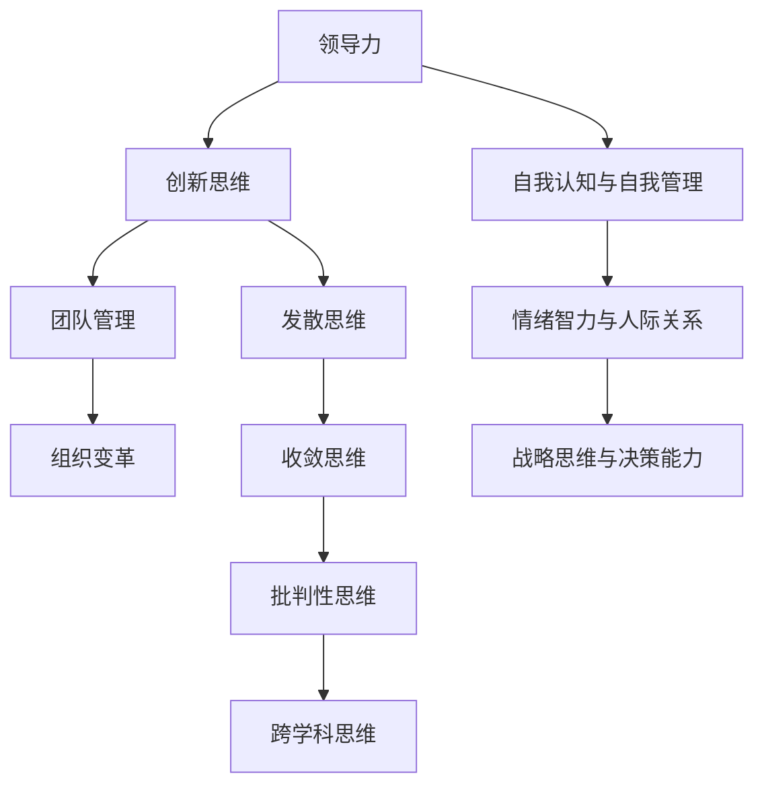

                 

### 《领导力与创新：引领团队破局的思维方式》

> **关键词：领导力、创新思维、团队管理、组织变革、项目管理**

**摘要：**
在快速变化的科技时代，领导力和创新思维已成为推动团队和组织成功的关键因素。本文以《领导力与创新：引领团队破局的思维方式》为题，探讨了领导力与创新思维的基本概念、核心要素以及它们在实际应用中的综合运用。文章首先分析了领导力的本质与重要性，随后深入探讨了创新思维的基本要素及其培养方法，并结合实际项目案例，展示了领导力与创新思维在团队管理和组织变革中的应用。通过系统化的阐述和案例分析，本文旨在为领导者提供实用的思维工具和实践指南，以引领团队破局，实现持续创新和卓越发展。

## 《领导力与创新：引领团队破局的思维方式》目录大纲

### 第一部分：领导力基础

#### 第1章：领导力的定义与重要性

##### 1.1.1 领导力的本质与内涵

##### 1.1.2 领导力在团队中的重要性

##### 1.1.3 领导力的三个层次

#### 第2章：领导力的核心要素

##### 2.1.1 自我认知与自我管理

##### 2.1.2 情绪智力与人际关系

##### 2.1.3 战略思维与决策能力

#### 第3章：领导力的培养与实践

##### 3.1.1 领导力的发展路径

##### 3.1.2 领导力培养的方法与技巧

##### 3.1.3 领导力实践中的常见问题及解决策略

### 第二部分：创新思维

#### 第4章：创新思维概述

##### 4.1.1 创新思维的内涵与特征

##### 4.1.2 创新思维的价值与应用

##### 4.1.3 创新思维与传统思维的对比

#### 第5章：创新思维的培养

##### 5.1.1 创新思维的基本要素

##### 5.1.2 创新思维的训练方法

##### 5.1.3 创新思维的激发技巧

#### 第6章：创新思维的实践

##### 6.1.1 创新项目的启动与规划

##### 6.1.2 创新过程中的团队协作

##### 6.1.3 创新成果的评价与推广

### 第三部分：领导力与创新的综合应用

#### 第7章：领导力与创新在团队管理中的应用

##### 7.1.1 领导力与创新在团队建设中的角色

##### 7.1.2 领导力与创新在项目管理中的实践

##### 7.1.3 领导力与创新在团队沟通与协作中的运用

#### 第8章：领导力与创新在组织变革中的应用

##### 8.1.1 组织变革的领导力挑战

##### 8.1.2 创新思维在组织变革中的应用

##### 8.1.3 领导力与创新在组织文化建设中的角色

#### 第9章：领导力与创新案例研究

##### 9.1.1 案例一：苹果公司的创新之路

##### 9.1.2 案例二：谷歌的领导力与创新实践

##### 9.1.3 案例三：中国高铁的领导力与创新应用

### 第四部分：总结与展望

#### 第10章：领导力与创新的未来发展

##### 10.1.1 领导力与创新的趋势分析

##### 10.1.2 领导力与创新的未来挑战

##### 10.1.3 领导力与创新的未来发展方向

#### 附录：领导力与创新工具与资源推荐

##### A.1 领导力与创新相关书籍推荐

##### A.2 领导力与创新在线课程推荐

##### A.3 领导力与创新实践案例库推荐

### 核心概念与联系

下面是一个用于描述本文核心概念的 Mermaid 流程图：



### 核心算法原理讲解

下面我们通过一个简单的算法来解释创新思维的基本要素。

#### 创新思维的基本要素

创新思维通常包括以下四个基本要素：

1. **发散思维**：指在思考问题时，能够从多个角度、多个方向进行思考，寻找多种可能的解决方案。
2. **收敛思维**：指在发散思维的基础上，通过对各个方案的分析和比较，最终找到一个最优的解决方案。
3. **批判性思维**：指在思考和解决问题时，能够保持怀疑和批判的态度，对现有的观点和解决方案进行评估和检验。
4. **跨学科思维**：指能够跨越不同的学科领域，将不同领域的知识和方法进行综合运用，寻找创新的解决方案。

#### 算法描述

以下是一个简单的算法，用于模拟创新思维的过程：

```pseudo
函数 创新思维(问题)
    初始方案 = []
    方案列表 = []

    // 步骤1：发散思维
    for 每个角度 in 可能的角度
        新方案 = 想象可能的解决方案(问题, 角度)
        初始方案.append(新方案)

    // 步骤2：收敛思维
    for 每个方案 in 初始方案
        评估结果 = 评估解决方案(方案)
        方案列表.append(评估结果)

    // 步骤3：批判性思维
    最佳方案 = 批判性选择(方案列表)

    // 步骤4：跨学科思维
    最终方案 = 跨学科整合(最佳方案)

    return 最终方案
```

#### 数学模型和公式详细讲解

在创新思维的过程中，我们经常会用到一些数学模型和公式来帮助我们分析和评估不同的方案。下面我们将详细介绍一个常用的数学模型——线性回归模型。

#### 线性回归模型

线性回归模型是一种用于分析因变量与自变量之间线性关系的统计模型。其基本形式可以表示为：

$$
Y = \beta_0 + \beta_1X + \varepsilon
$$

其中，$Y$ 是因变量，$X$ 是自变量，$\beta_0$ 是截距，$\beta_1$ 是斜率，$\varepsilon$ 是误差项。

线性回归模型的目的是通过已有的数据，估计出模型参数 $\beta_0$ 和 $\beta_1$，从而建立一个数学模型来预测因变量 $Y$。

#### 最小二乘法

为了估计线性回归模型的参数，我们通常使用最小二乘法。最小二乘法的核心思想是使得预测值与实际观测值之间的误差平方和最小。

具体来说，我们可以使用以下公式来求解线性回归模型的参数：

$$
\beta_0 = \frac{\sum_{i=1}^{n} Y_i - \beta_1X_i}{n}
$$

$$
\beta_1 = \frac{n\sum_{i=1}^{n} X_iY_i - \sum_{i=1}^{n} X_i\sum_{i=1}^{n} Y_i}{n\sum_{i=1}^{n} X_i^2 - (\sum_{i=1}^{n} X_i)^2}
$$

其中，$n$ 是数据点的个数，$X_i$ 和 $Y_i$ 分别是第 $i$ 个数据点的自变量和因变量的值。

通过求解上述方程组，我们可以得到线性回归模型的参数估计值 $\beta_0$ 和 $\beta_1$。

#### 线性回归模型的应用

线性回归模型广泛应用于各种领域，如经济学、金融学、社会学等。它可以帮助我们预测未来的趋势，评估不同因素对结果的影响，进行数据分析和决策支持。

#### 数学公式的应用举例

假设我们有一个关于房价的数据集，其中包含房子的面积和房价。我们希望通过线性回归模型来预测房价。

首先，我们需要收集数据，并计算出各个参数的值。假设我们有以下数据：

| 面积（平方米） | 房价（万元） |
|----------------|--------------|
| 80             | 100          |
| 90             | 110          |
| 100            | 130          |
| 110            | 150          |

根据上述数据，我们可以计算出线性回归模型的参数：

$$
\beta_0 = \frac{100 + 110 + 130 + 150 - 4 \times 110}{4} = 90
$$

$$
\beta_1 = \frac{4 \times (80 \times 100 + 90 \times 110 + 100 \times 130 + 110 \times 150) - (80 + 90 + 100 + 110) \times (100 + 110 + 130 + 150)}{4 \times (80^2 + 90^2 + 100^2 + 110^2) - (80 + 90 + 100 + 110)^2} = 1.2
$$

根据计算结果，我们可以建立线性回归模型：

$$
房价 = 90 + 1.2 \times 面积
$$

使用这个模型，我们可以预测一个面积为 120 平方米的房子的房价。将面积代入模型，我们得到：

$$
房价 = 90 + 1.2 \times 120 = 150
$$

因此，预测的房价为 150 万元。

#### 项目实战

### 项目实战：创新思维训练实践

#### 项目背景

在一个新兴的科技公司中，为了提升团队的创新能力和领导力，公司决定开展一项创新思维训练实践项目。

#### 项目目标

1. 提升团队成员的发散思维和收敛思维能力。
2. 培养团队成员的跨学科思维。
3. 提高团队成员的批判性思维。

#### 项目实施步骤

1. **准备阶段**

   - 收集相关的创新思维训练资料。
   - 设计创新思维训练的流程和活动。

2. **执行阶段**

   - **发散思维训练**：通过头脑风暴、思维导图等方式，引导团队成员从不同角度思考问题。
   - **收敛思维训练**：通过案例分析、模拟演练等方式，帮助团队成员从多个方案中筛选出最佳方案。
   - **跨学科思维训练**：通过跨部门协作项目、创新竞赛等方式，培养团队成员的跨学科合作能力。
   - **批判性思维训练**：通过辩论、讨论等方式，培养团队成员的批判性思维。

3. **评估阶段**

   - 对团队成员的创新思维进行评估，包括发散思维、收敛思维、跨学科思维和批判性思维的评估。
   - 收集反馈，对训练效果进行评估和改进。

#### 代码实现（示例）

以下是一个简单的 Python 脚本，用于记录团队成员的创新思维训练过程：

```python
import pandas as pd

# 创建一个 DataFrame，用于记录训练过程
training_log = pd.DataFrame(columns=['member', 'activity', 'date'])

# 记录一次发散思维训练
training_log = training_log.append({'member': '张三', 'activity': '头脑风暴', 'date': '2023-10-01'}, ignore_index=True)

# 记录一次收敛思维训练
training_log = training_log.append({'member': '李四', 'activity': '案例分析', 'date': '2023-10-02'}, ignore_index=True)

# 打印训练记录
print(training_log)
```

#### 代码解读与分析

- **DataFrame 的创建**：使用 Pandas 库创建一个 DataFrame，用于记录团队成员的训练活动。
- **append 方法**：使用 DataFrame 的 append 方法添加新的训练记录。
- **打印记录**：使用 print 函数打印训练记录，以便于查看和评估。

通过这个项目实战，团队成员可以更好地理解创新思维训练的过程，并能够在实际工作中加以应用。

### 第一部分：领导力基础

#### 第1章：领导力的定义与重要性

##### 1.1.1 领导力的本质与内涵

领导力是一种引领和激励他人达成目标的能力。它不仅仅是职位赋予的权威，更是一种影响力，能够影响他人的思想、行为和决策。领导力的本质在于通过建立信任、激发潜能、营造环境，使团队成员能够为实现共同目标而努力。

在团队中，领导力的重要性体现在以下几个方面：

1. **目标设定**：领导者能够明确团队的目标，并制定实现目标的战略和计划。
2. **资源整合**：领导者能够有效地整合团队内外部的资源，确保团队目标的实现。
3. **团队协作**：领导者能够促进团队成员之间的协作，激发团队成员的积极性和创造力。
4. **决策能力**：领导者能够做出明智的决策，并在决策过程中充分听取团队成员的意见。
5. **变革推动**：领导者能够引领团队适应变化，推动团队不断创新和进步。

##### 1.1.2 领导力在团队中的重要性

领导力对于团队的成功至关重要。以下是领导力在团队中的几个重要作用：

1. **明确方向**：领导者能够为团队设定清晰的目标和方向，使团队成员知道他们的工作对团队目标的重要性。
2. **激发潜能**：领导者能够发现和挖掘团队成员的潜力，激励他们发挥最大的能力。
3. **提高效率**：领导者能够优化团队的工作流程，提高团队的效率和生产力。
4. **团队凝聚力**：领导者能够建立团队的凝聚力，使团队成员团结一致，共同面对挑战。
5. **解决冲突**：领导者能够有效地解决团队内部的冲突，维护团队的和谐与稳定。

##### 1.1.3 领导力的三个层次

领导力可以分为三个层次：技术领导力、人际领导力和战略领导力。

1. **技术领导力**：技术领导力是指领导者具备的专业知识和技能，能够引领团队在技术领域取得突破。这种领导力主要依赖于领导者的技术背景和经验。
2. **人际领导力**：人际领导力是指领导者的人际交往能力和影响力，能够与团队成员建立信任和合作关系。这种领导力主要依赖于领导者的沟通技巧、情感智力和人际交往能力。
3. **战略领导力**：战略领导力是指领导者具备的制定战略、把握方向和推动变革的能力。这种领导力主要依赖于领导者的远见卓识、决策能力和创新思维。

在团队中，领导者需要根据不同的情况和需求，灵活运用不同层次的领导力，以实现团队的目标和提升团队的绩效。

#### 第2章：领导力的核心要素

##### 2.1.1 自我认知与自我管理

自我认知与自我管理是领导力的核心要素之一。领导者需要深入了解自己的价值观、性格特点、优势和劣势，以便更好地发挥自己的潜力。

自我认知的过程包括以下几个方面：

1. **反思与自我评估**：领导者需要定期反思自己的行为和决策，评估自己的表现，找出改进的空间。
2. **自我反思**：领导者需要培养自我反思的习惯，从失败和成功中汲取经验教训。
3. **寻求反馈**：领导者需要主动寻求他人的反馈，了解自己的优点和不足，以便进行针对性的改进。

自我管理的核心在于如何有效地管理自己的情绪、时间和精力。

1. **情绪管理**：领导者需要学会控制自己的情绪，避免在压力下做出冲动的决策。
2. **时间管理**：领导者需要合理安排时间，确保重要事项得到充分的关注和处理。
3. **精力管理**：领导者需要保持良好的身体健康和心理状态，确保自己能够持续地投入到工作中。

##### 2.1.2 情绪智力与人际关系

情绪智力是指领导者识别、理解、管理和运用情绪的能力。情绪智力在领导力中扮演着重要的角色，它影响着领导者与团队成员的沟通、合作和决策。

情绪智力的关键要素包括：

1. **自我意识**：领导者需要意识到自己的情绪，并了解情绪对自己行为的影响。
2. **自我调节**：领导者需要学会控制自己的情绪，避免情绪失控。
3. **同理心**：领导者需要具备同理心，能够理解他人的情绪和需求。
4. **社交技能**：领导者需要具备良好的社交技能，能够有效地与他人沟通和协作。

人际关系是指领导者与团队成员、其他部门和管理者之间的关系。良好的人际关系有助于建立团队的凝聚力，提升团队的绩效。

建立良好人际关系的策略包括：

1. **沟通**：领导者需要保持开放的沟通渠道，倾听团队成员的意见和需求。
2. **信任**：领导者需要建立信任，与团队成员建立良好的合作关系。
3. **尊重**：领导者需要尊重团队成员的差异，关注团队成员的感受和需求。
4. **支持**：领导者需要提供支持和帮助，关心团队成员的成长和发展。

##### 2.1.3 战略思维与决策能力

战略思维是指领导者从全局出发，考虑长远发展，制定战略规划和决策的能力。战略思维是领导力的核心要素之一，它决定了领导者的决策是否具有前瞻性和可持续性。

战略思维的关键要素包括：

1. **洞察力**：领导者需要具备敏锐的洞察力，能够准确把握市场趋势和行业动态。
2. **判断力**：领导者需要具备良好的判断力，能够从复杂的信息中识别关键问题和机会。
3. **决策能力**：领导者需要具备快速决策和调整决策的能力，确保团队能够及时应对变化。

战略思维在领导力中的作用主要体现在以下几个方面：

1. **明确方向**：领导者需要通过战略思维，为团队设定清晰的目标和方向。
2. **资源分配**：领导者需要通过战略思维，合理分配团队资源，确保团队能够有效地实现目标。
3. **风险管理**：领导者需要通过战略思维，识别和应对潜在的风险，确保团队的安全和稳定。
4. **创新推动**：领导者需要通过战略思维，推动团队不断创新，保持竞争优势。

#### 第3章：领导力的培养与实践

##### 3.1.1 领导力的发展路径

领导力的发展是一个持续的过程，它需要领导者不断地学习和实践。以下是领导力发展的几个关键阶段：

1. **自我认知**：领导者需要深入了解自己的价值观、性格特点、优势和劣势，以便更好地发挥自己的潜力。
2. **技能提升**：领导者需要不断学习新的知识和技能，提升自己的专业水平和领导能力。
3. **实践经验**：领导者需要通过实际工作经验，不断积累领导力，提高自己的领导能力。
4. **反思与总结**：领导者需要定期反思自己的行为和决策，总结经验教训，不断完善自己的领导风格。

##### 3.1.2 领导力培养的方法与技巧

领导力的培养需要结合多种方法和技巧，以下是一些常用的方法：

1. **自我反思**：领导者需要定期进行自我反思，思考自己的行为和决策，找出改进的空间。
2. **学习与实践**：领导者需要通过阅读、培训、实践等方式，不断学习和提升自己的领导能力。
3. **模拟训练**：领导者可以通过模拟训练，提高自己在压力环境下的决策能力和应变能力。
4. **导师指导**：领导者可以寻找导师，从导师的经验和智慧中汲取营养，提升自己的领导能力。

##### 3.1.3 领导力实践中的常见问题及解决策略

在领导力实践中，领导者可能会遇到以下一些问题：

1. **沟通障碍**：领导者需要加强与团队成员的沟通，确保信息的传递畅通无阻。
2. **冲突管理**：领导者需要学会有效管理冲突，避免冲突对团队造成负面影响。
3. **时间管理**：领导者需要合理安排时间，确保重要事项得到充分的关注和处理。
4. **情绪管理**：领导者需要学会控制自己的情绪，避免在压力下做出冲动的决策。

针对这些问题，以下是一些解决策略：

1. **建立良好的沟通机制**：领导者可以通过定期会议、一对一沟通等方式，建立良好的沟通机制，确保团队成员之间的信息畅通。
2. **建立冲突解决机制**：领导者可以制定冲突解决策略，帮助团队成员在出现冲突时进行有效沟通和解决。
3. **学会时间管理**：领导者可以通过制定日程表、设置优先级等方式，提高自己的时间管理能力。
4. **情绪管理培训**：领导者可以参加情绪管理培训，学习情绪管理技巧，提高自己的情绪管理能力。

### 第二部分：创新思维

#### 第4章：创新思维概述

##### 4.1.1 创新思维的内涵与特征

创新思维是指通过独特、新颖的方法来解决问题的思维方式。它不同于传统的线性思维，强调多角度、多层次的思考，以及对未知领域的探索。

创新思维的特征包括：

1. **发散性**：创新思维鼓励从多个角度和方向思考问题，寻找多种可能的解决方案。
2. **系统性**：创新思维强调系统的思考，将问题置于更大的背景下进行分析。
3. **灵活性**：创新思维强调灵活性，能够根据情况的变化灵活调整思考方向。
4. **创造性**：创新思维鼓励创造性和想象力，敢于尝试新的思路和方法。

##### 4.1.2 创新思维的价值与应用

创新思维对于团队和组织的发展具有重要价值，它能够带来以下几方面的收益：

1. **提升竞争力**：创新思维能够帮助团队和组织在激烈的市场竞争中脱颖而出。
2. **促进成长**：创新思维能够激发团队和组织的创造力，推动持续成长。
3. **解决问题**：创新思维能够帮助团队和组织从不同的角度看待问题，找到更有效的解决方案。
4. **优化流程**：创新思维能够帮助团队和组织优化现有流程，提高效率和生产力。

创新思维的应用范围广泛，包括但不限于以下几个方面：

1. **产品开发**：通过创新思维，团队可以开发出更具竞争力的新产品。
2. **服务设计**：通过创新思维，团队可以设计出更符合用户需求的服务。
3. **市场营销**：通过创新思维，团队可以制定出更有效的市场营销策略。
4. **流程优化**：通过创新思维，团队可以优化现有流程，提高工作效率。

##### 4.1.3 创新思维与传统思维的对比

创新思维与传统思维有以下几点不同：

1. **思维方式**：创新思维强调多角度、多层次的思考，而传统思维往往局限于固定的思维模式。
2. **解决问题**：创新思维倾向于寻找全新的解决方案，而传统思维则更多地依赖于现有的经验和知识。
3. **风险承受**：创新思维鼓励冒险和尝试，而传统思维则更保守，倾向于规避风险。
4. **时间观念**：创新思维注重长期收益，而传统思维则更注重短期效果。

通过对比可以看出，创新思维相较于传统思维具有更大的灵活性和创造性，能够帮助团队和组织实现突破性的发展。

#### 第5章：创新思维的培养

##### 5.1.1 创新思维的基本要素

创新思维的基本要素包括以下几个方面：

1. **知识积累**：创新思维需要建立在丰富的知识储备基础上，领导者需要不断学习新知识，扩大自己的知识面。
2. **思维方式**：创新思维需要跳出传统思维模式的限制，领导者需要培养多角度、多层次的思维方式。
3. **问题意识**：创新思维源于对问题的敏锐感知，领导者需要具备强烈的问题意识，善于发现问题和挑战。
4. **创造力**：创新思维强调创造力和想象力，领导者需要勇于尝试新的想法和方法。
5. **团队合作**：创新思维往往需要团队协作，领导者需要建立良好的团队合作氛围，激发团队的创造力。

##### 5.1.2 创新思维的训练方法

为了培养创新思维，领导者可以采用以下几种训练方法：

1. **头脑风暴**：头脑风暴是一种有效的创新思维训练方法，通过集体讨论和创意碰撞，激发团队成员的创新思维。
2. **思维导图**：思维导图可以帮助领导者整理思路，从不同角度思考问题，促进创新思维的培养。
3. **案例分析**：通过分析成功和失败的创新案例，领导者可以从中学习到创新的思路和方法。
4. **模拟训练**：通过模拟真实的工作场景，领导者可以在实践中锻炼自己的创新思维。
5. **跨学科学习**：跨学科学习可以帮助领导者开拓视野，将不同领域的知识和方法进行综合运用，提高创新思维能力。

##### 5.1.3 创新思维的激发技巧

为了激发创新思维，领导者可以采用以下几种技巧：

1. **挑战现状**：领导者需要不断挑战现状，鼓励团队成员质疑现有的做法，寻找改进的机会。
2. **鼓励多样性**：领导者需要鼓励团队成员提出不同的观点和想法，尊重多样性，激发创新思维。
3. **提供资源**：领导者需要为团队成员提供必要的资源和支持，如时间、资金和技术等，为创新思维的实现创造条件。
4. **奖励创新**：领导者需要建立激励机制，对创新思维和成果给予认可和奖励，激发团队成员的创新动力。
5. **营造氛围**：领导者需要营造一个开放、包容和创新的工作氛围，鼓励团队成员勇于尝试和探索。

#### 第6章：创新思维的实践

##### 6.1.1 创新项目的启动与规划

创新项目的启动与规划是创新思维实践的重要环节。以下是创新项目启动和规划的几个关键步骤：

1. **项目立项**：确定创新项目的目标和方向，明确项目的范围和预期成果。
2. **团队组建**：组建一个具有多元化背景和技能的团队，确保团队具备实现项目目标的能力。
3. **资源分配**：根据项目需求，合理分配人力、物力和财力资源，确保项目能够顺利进行。
4. **规划路线**：制定详细的项目计划，包括项目目标、任务分配、时间进度和风险评估等。
5. **沟通协调**：建立有效的沟通机制，确保团队成员之间的信息畅通，及时解决问题。

##### 6.1.2 创新过程中的团队协作

创新过程需要团队成员的紧密协作，以下是创新过程中团队协作的几个关键点：

1. **明确分工**：根据团队成员的专长和兴趣，明确各自的任务和责任，确保项目的顺利进行。
2. **协同合作**：鼓励团队成员之间的协同合作，建立良好的团队合作氛围，提高工作效率。
3. **信息共享**：建立信息共享平台，确保团队成员能够及时获取项目相关信息，促进团队协作。
4. **反馈与调整**：定期收集团队成员的反馈，及时调整项目计划，确保项目按照预期进度进行。
5. **激励与支持**：建立激励机制，对表现优秀的团队成员给予认可和奖励，激发团队的积极性和创造力。

##### 6.1.3 创新成果的评价与推广

创新成果的评价与推广是创新思维实践的重要环节。以下是创新成果评价和推广的几个关键步骤：

1. **成果评估**：对创新成果进行客观评估，包括技术可行性、市场潜力、经济效益等方面。
2. **反馈与改进**：根据评估结果，对创新成果进行改进和完善，提升其质量和价值。
3. **推广策略**：制定推广策略，包括市场推广、合作伙伴关系建立、品牌宣传等方面。
4. **知识产权保护**：对创新成果进行知识产权保护，确保团队的合法权益。
5. **持续优化**：持续关注市场动态和用户需求，对创新成果进行优化和迭代，保持其竞争力和市场地位。

### 第三部分：领导力与创新的综合应用

#### 第7章：领导力与创新在团队管理中的应用

##### 7.1.1 领导力与创新在团队建设中的角色

领导力与创新在团队建设中扮演着重要角色。以下是领导力与创新在团队建设中的几个关键方面：

1. **明确目标**：领导者需要明确团队的目标和愿景，激发团队成员的积极性，确保团队朝着共同的目标努力。
2. **培养团队文化**：领导者需要建立积极向上的团队文化，鼓励创新和合作，营造良好的团队氛围。
3. **激发团队潜能**：领导者需要挖掘团队成员的潜力，提供培训和发展机会，激发团队成员的创造力和创新精神。
4. **构建团队结构**：领导者需要根据团队的特点和需求，构建合理的团队结构，确保团队的高效运作。

##### 7.1.2 领导力与创新在项目管理中的实践

领导力与创新在项目管理中具有重要作用。以下是领导力与创新在项目管理中的几个关键方面：

1. **项目规划**：领导者需要制定详细的项目规划，明确项目目标、任务分配、时间进度和资源需求。
2. **团队协作**：领导者需要建立高效的团队协作机制，确保团队成员之间的沟通畅通，信息共享，协同合作。
3. **风险管理**：领导者需要识别和评估项目风险，制定相应的风险应对策略，确保项目按计划进行。
4. **创新驱动**：领导者需要鼓励团队成员创新思维，推动项目过程中持续创新，提高项目质量和效率。
5. **项目评估**：领导者需要定期对项目进行评估，总结项目经验，不断改进项目管理方法。

##### 7.1.3 领导力与创新在团队沟通与协作中的运用

领导力与创新在团队沟通与协作中具有重要作用。以下是领导力与创新在团队沟通与协作中的几个关键方面：

1. **建立沟通渠道**：领导者需要建立有效的沟通渠道，确保团队成员之间的信息畅通，减少信息传递的障碍。
2. **促进信息共享**：领导者需要鼓励团队成员分享信息和经验，促进团队内部的知识共享，提高团队的整体智慧。
3. **培养协作精神**：领导者需要培养团队成员的协作精神，鼓励团队合作，提高团队的凝聚力和协作效率。
4. **创新沟通方式**：领导者需要尝试新的沟通方式，如虚拟团队会议、在线协作工具等，提高沟通效率和效果。
5. **解决冲突**：领导者需要学会解决团队内部的冲突，维护团队的和谐与稳定，确保团队的正常运作。

#### 第8章：领导力与创新在组织变革中的应用

##### 8.1.1 组织变革的领导力挑战

组织变革是推动组织发展的重要手段，但同时也面临着一系列领导力挑战。以下是组织变革中领导力面临的几个关键挑战：

1. **变革推动力**：领导者需要具备足够的变革推动力，能够激励和引导团队成员接受变革，积极参与变革过程。
2. **变革管理能力**：领导者需要具备有效的变革管理能力，能够制定合理的变革计划，识别和应对变革中的风险和挑战。
3. **团队凝聚力**：领导者需要保持团队的凝聚力，确保团队成员在变革过程中保持团结一致，共同应对变革的挑战。
4. **员工激励**：领导者需要有效激励员工，提高员工对变革的积极性和参与度，确保变革能够顺利实施。

##### 8.1.2 创新思维在组织变革中的应用

创新思维在组织变革中具有重要作用。以下是创新思维在组织变革中的应用：

1. **挑战传统观念**：领导者需要运用创新思维，挑战传统的观念和做法，寻找新的变革路径和方法。
2. **多元化思考**：领导者需要鼓励团队成员运用多元化思考，从不同角度和层面分析问题，寻找变革的突破口。
3. **探索创新模式**：领导者需要积极探索创新的变革模式，如敏捷变革、迭代变革等，提高变革的灵活性和适应性。
4. **培养创新文化**：领导者需要培养创新文化，鼓励团队成员敢于尝试、勇于创新，为组织变革提供持续的动力。

##### 8.1.3 领导力与创新在组织文化建设中的角色

领导力与创新在组织文化建设中扮演着重要角色。以下是领导力与创新在组织文化建设中的几个关键方面：

1. **价值观引导**：领导者需要通过树立正确的价值观，引导团队成员认同组织的使命和愿景，形成共同的价值观念。
2. **文化传承**：领导者需要传承和弘扬组织文化，确保组织文化的延续性和稳定性，提高组织的凝聚力和向心力。
3. **创新文化**：领导者需要培养创新文化，鼓励团队成员勇于创新、敢于尝试，为组织注入新的活力和动力。
4. **团队协作**：领导者需要通过团队协作，激发团队成员的创造力和创新精神，形成良好的组织文化氛围。

#### 第9章：领导力与创新案例研究

##### 9.1.1 案例一：苹果公司的创新之路

苹果公司是一家全球知名的科技公司，其成功的背后离不开领导力与创新的紧密结合。以下是苹果公司创新之路的几个关键点：

1. **领导力引领**：苹果公司的创始人史蒂夫·乔布斯具备卓越的领导力，他能够激发团队的创造力，推动公司不断创新。
2. **创新思维**：苹果公司注重创新思维，鼓励团队成员从不同的角度思考问题，寻找突破性的解决方案。
3. **产品设计**：苹果公司以其独特的产品设计，引领了全球科技潮流，其产品创新成为公司成功的关键因素。
4. **用户体验**：苹果公司注重用户体验，通过创新的交互设计和人性化的产品功能，提升用户满意度。

##### 9.1.2 案例二：谷歌的领导力与创新实践

谷歌是一家全球领先的互联网科技公司，其领导力和创新实践为业界所称道。以下是谷歌领导力与创新实践的几个关键点：

1. **领导力文化**：谷歌公司倡导开放、包容和创新的企业文化，鼓励员工勇于尝试、勇于创新。
2. **创新激励机制**：谷歌公司建立完善的创新激励机制，对创新成果给予认可和奖励，激发员工的创新动力。
3. **多元化团队**：谷歌公司注重多元化团队的建设，鼓励团队成员来自不同的背景和领域，促进创新思维的碰撞。
4. **持续学习**：谷歌公司鼓励员工持续学习，提供丰富的学习资源和机会，提高员工的创新能力。

##### 9.1.3 案例三：中国高铁的领导力与创新应用

中国高铁是中国科技创新的典范，其领导力和创新应用在国内外产生了广泛的影响。以下是中国高铁的领导力与创新应用的几个关键点：

1. **领导力引领**：中国高铁的领导者具备卓越的战略眼光和领导力，他们能够准确把握市场趋势，推动高铁技术的发展。
2. **技术创新**：中国高铁公司注重技术创新，不断研发和引进先进技术，提升高铁的性能和安全性。
3. **系统集成**：中国高铁公司通过系统集成，将不同领域的技术进行融合，实现高铁系统的智能化和高效化。
4. **国际合作**：中国高铁公司积极开展国际合作，引进国外先进技术和管理经验，提升自身的技术水平和竞争力。

### 第四部分：总结与展望

#### 第10章：领导力与创新的未来发展

##### 10.1.1 领导力与创新的趋势分析

随着科技的迅猛发展和社会的快速变化，领导力与创新也在不断演变。以下是领导力与创新的发展趋势：

1. **数字化领导力**：随着数字化转型的深入推进，领导者需要具备数字化思维和技能，引领团队适应数字化的变革。
2. **跨界领导力**：跨界领导力强调领导者具备跨学科、跨领域的视野和知识，能够整合不同领域的资源和优势。
3. **生态领导力**：生态领导力关注领导者在构建生态体系中的作用，强调多方协作、共同发展。
4. **创新驱动**：创新将成为领导力的重要驱动力，领导者需要具备创新思维和能力，推动团队和组织实现持续创新。

##### 10.1.2 领导力与创新的未来挑战

领导力与创新在未来的发展过程中将面临一系列挑战：

1. **技术变革**：技术的快速发展给领导力与创新带来了新的挑战，领导者需要不断学习和适应新技术。
2. **人才竞争**：人才竞争日益激烈，领导者需要吸引、培养和保留优秀的人才，以保持团队的竞争力。
3. **环境变化**：社会和环境的变化对领导力与创新提出了新的要求，领导者需要具备应对复杂环境和变化的能力。
4. **文化多样性**：全球化进程加快，领导者需要应对文化多样性的挑战，建立包容性的团队文化。

##### 10.1.3 领导力与创新的未来发展方向

未来，领导力与创新将在以下几个方面继续发展：

1. **数字化转型**：领导力与创新将更加注重数字化转型，推动团队和组织实现数字化转型升级。
2. **创新生态系统**：领导力与创新将致力于构建创新生态系统，促进资源整合、协同创新。
3. **可持续发展**：领导力与创新将关注可持续发展，推动团队和组织实现经济、社会和环境的协调发展。
4. **全球化视野**：领导力与创新将拓展全球化视野，推动团队和组织在全球范围内的合作与发展。

### 附录：领导力与创新工具与资源推荐

#### A.1 领导力与创新相关书籍推荐

1. **《领导力五要素》**：作者：约翰·麦斯威尔（John C. Maxwell）
2. **《创新者的窘境》**：作者：克莱顿·克里斯坦森（Clayton M. Christensen）
3. **《变革之舞》**：作者：约翰·肯尼思·加布里埃尔（John Kenneth Galbraith）
4. **《创新者的思考方式》**：作者：史蒂芬·霍金（Stephen Hawking）

#### A.2 领导力与创新在线课程推荐

1. **《领导力基础课程》**：课程平台：网易云课堂
2. **《创新思维与设计》**：课程平台：网易云课堂
3. **《组织变革管理》**：课程平台：网易云课堂
4. **《人工智能与未来》**：课程平台：网易云课堂

#### A.3 领导力与创新实践案例库推荐

1. **《世界500强企业领导力案例库》**：来源：北京大学领导力研究中心
2. **《创新案例库》**：来源：清华大学创新研究中心
3. **《组织变革案例库》**：来源：中国人民大学组织行为学研究中心
4. **《领导力实践案例库》**：来源：华为公司领导力发展中心

---

**作者：AI天才研究院/AI Genius Institute & 禅与计算机程序设计艺术 /Zen And The Art of Computer Programming**

