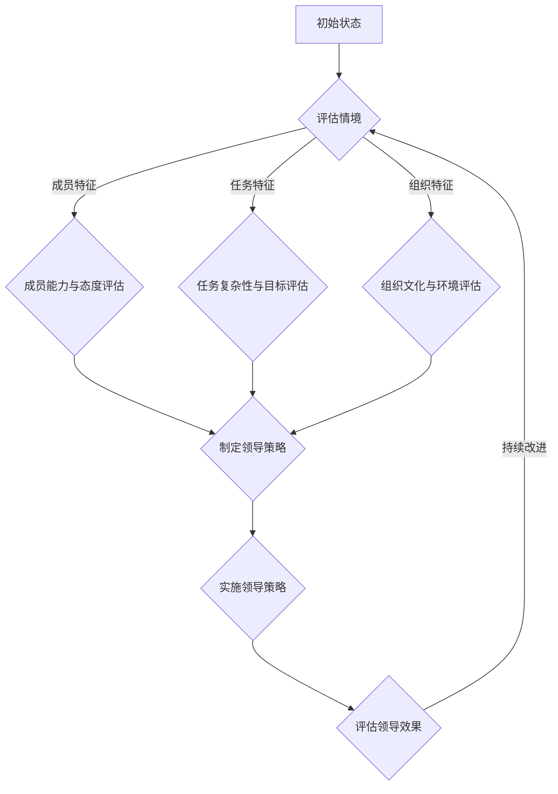

                 

# 领导力与情境管理：因地制宜的领导方式

## 关键词：
领导力、情境管理、因地制宜、领导方式、成员特征、任务特征、组织特征、互动策略、实施与评估、应用案例

## 摘要：
本文深入探讨了领导力与情境管理之间的关系，强调了因地制宜的领导方式在领导实践中的重要性。文章首先从领导力基本概念出发，介绍了领导力的定义、类型及其与管理的关系。接着，我们探讨了情境管理的理论框架，阐述了情境管理的定义、原理、关键要素和实际应用。在实践部分，我们详细分析了领导者与成员互动策略、组织特征的情境分析，并介绍了情境管理的实施与评估方法。最后，通过实际案例展示了情境管理在不同领域的应用，提供了可借鉴的经验和教训。本文旨在为领导者在实际工作中提供有益的指导和参考。

### 第一部分：领导力基础理论

#### 第1章：领导力基本概念与类型

##### 1.1 领导力的定义与内涵

领导力是一种影响力和激励能力，它能够引导和激励他人为实现共同目标而努力。领导力不仅仅是职位赋予的权力，更是一种影响力，包括个人魅力、专业知识、沟通能力和决策能力等。领导力的内涵丰富，可以从多个角度进行理解。

首先，从历史演变的角度来看，领导力经历了从传统领导到现代领导的转变。传统领导强调的是权威和控制，而现代领导则更注重沟通、协作和激励。例如，在工业革命时期，领导者主要是通过制定规章制度来管理员工，而现代领导则更关注员工的成长和自我实现。

其次，从关键要素的角度来看，领导力包括以下几个方面：

1. **影响力**：领导者能够影响他人的行为和思维，让他们愿意追随和信任自己。
2. **沟通能力**：领导者需要具备良好的沟通能力，能够清晰地表达自己的想法，并理解他人的需求和期望。
3. **决策能力**：领导者需要在复杂和不确定的环境中做出明智的决策，并承担相应的责任。
4. **团队合作**：领导者需要能够建立和维护一个高效的团队，激发团队成员的积极性和创造力。

##### 1.1.1 领导力的历史演变

领导力的概念并非一成不变，它随着时代的发展而不断演进。在古代，领导力主要依赖于家族血统和封建制度。例如，在中国古代，君主的权力来源于世袭制度，领导者依靠血缘关系来维持自己的地位。

随着工业革命的到来，领导力开始发生重大变化。工业革命带来了大规模的工厂生产和劳动分工，领导者需要通过制定规章制度来管理员工，确保生产效率和产品质量。这一时期的领导力强调的是权威和控制。

进入20世纪，领导力进一步发展。随着企业管理理论的兴起，领导者开始关注员工的成长和自我实现。例如，行为科学学派强调领导者需要关注员工的需求和动机，通过激励和激励来提高员工的工作满意度。

在当今信息时代，领导力再次发生变革。领导不再仅仅是管理者和决策者，更是创新者和变革推动者。领导者需要具备跨学科的知识和技能，能够应对复杂多变的环境，并引领团队实现持续的创新和发展。

##### 1.1.2 领导力的关键要素

领导力的关键要素包括个人魅力、专业知识、沟通能力和决策能力。个人魅力是指领导者具备的吸引力和影响力，能够激发团队成员的积极性和创造力。专业知识是指领导者需要具备丰富的行业知识和专业能力，能够为团队提供有效的指导和支持。

沟通能力是指领导者需要具备良好的沟通技巧，能够清晰地表达自己的想法，并理解他人的需求和期望。决策能力是指领导者需要在复杂和不确定的环境中做出明智的决策，并承担相应的责任。

此外，领导力还涉及团队合作和领导风格。团队合作是指领导者需要能够建立和维护一个高效的团队，激发团队成员的积极性和创造力。领导风格是指领导者根据团队和组织的特点，选择合适的领导方式。

##### 1.2 领导力的类型

领导力可以分为传统领导力和现代领导力。传统领导力主要依赖于权威和控制，领导者通过职位赋予的权力来管理员工。而现代领导力则更注重沟通、协作和激励，领导者通过激发员工的内在动力来推动团队的发展。

除了传统领导力和现代领导力，还有一些新兴的领导力类型，如变革型领导力和参与型领导力。变革型领导力强调领导者需要具备创新精神和变革意识，能够引领团队实现持续的创新和发展。参与型领导力则强调领导者需要与团队成员进行充分的沟通和协商，共同制定决策和规划。

##### 1.3 领导力与管理的区别

领导力与管理的区别主要体现在以下几个方面：

1. **目标**：领导力的目标是影响和激励他人，实现共同的目标。而管理的目标是确保组织目标的实现，通过规划和执行来提高组织的效率。

2. **方式**：领导力强调的是人际关系和影响力，通过沟通、协作和激励来推动团队的发展。而管理则强调的是规章制度和流程，通过规划和控制来确保组织目标的实现。

3. **重点**：领导力更关注长远的发展和战略规划，而管理则更关注短期的执行和运营。

尽管领导力与管理的目标、方式和重点有所不同，但二者并非截然分开。实际上，领导力和管理是相辅相成的，领导者和管理者需要共同合作，才能实现组织的目标。

##### 1.3.1 管理的定义与功能

管理是指通过计划、组织、领导和控制等手段，确保组织资源得到有效利用，以实现组织目标的过程。管理的功能包括以下几个方面：

1. **计划**：管理者需要根据组织的战略目标，制定具体的行动计划，明确组织的任务和目标。

2. **组织**：管理者需要建立合理的组织结构，分配资源和职责，确保组织内部各个部门和岗位的协调和配合。

3. **领导**：管理者需要通过沟通、激励和指导，激发员工的积极性和创造力，推动团队的发展。

4. **控制**：管理者需要通过监控和评估，确保组织目标的实现，及时发现和解决问题。

##### 1.3.2 领导力与管理的联系与区别

领导力与管理的联系主要体现在以下几个方面：

1. **目标一致性**：领导力和管理都是实现组织目标的手段，二者需要相互配合，共同推动组织的发展。

2. **角色互补**：领导力强调人际关系和影响力，而管理则强调规章制度和流程，二者相辅相成，共同推动组织的运营和发展。

3. **共同责任**：领导者和管理者都需要对组织的目标和运营负责，二者需要共同承担责任，共同面对挑战。

尽管领导力与管理的目标、方式和重点有所不同，但二者并非截然分开。在实际工作中，领导力和管理是相辅相成的，领导者和管理者需要相互理解和支持，共同推动组织的发展。

#### 第2章：情境管理的理论框架

##### 2.1 情境管理的定义与原理

情境管理（Situational Management）是一种基于领导者对情境敏感性的领导方法，它强调领导者需要根据具体情境来调整自己的领导风格和策略。情境管理的核心思想是，没有一种单一的领导风格适用于所有情境，领导者需要根据成员特征、任务特征和组织特征等因素，灵活调整自己的领导方式。

##### 2.1.1 情境管理的起源与发展

情境管理的概念最早可以追溯到20世纪50年代，当时行为科学家开始关注领导行为与组织绩效之间的关系。在随后的几十年中，许多学者对情境管理进行了深入的研究和探讨，提出了各种情境管理的理论和模型。

其中，最著名的情境管理理论是由保罗·赫塞（Paul Hersey）和肯尼斯·布兰查德（Kenneth Blanchard）提出的“情境领导理论”（Situational Leadership Theory）。该理论认为，领导者的领导方式应该根据下属的成熟度来调整，成熟度越高的下属需要更多的自主性和支持，而成熟度较低的下属则需要更多的指导和监督。

##### 2.1.2 情境管理的基本理念

情境管理的基本理念可以概括为以下几点：

1. **情境适应性**：领导者需要具备对情境的敏感性和适应性，能够根据不同的情境调整自己的领导风格和策略。

2. **下属中心**：领导者应该以下属的需求和成长为中心，关注下属的成熟度和发展需求，提供相应的支持和指导。

3. **灵活调整**：领导者需要具备灵活调整领导风格和策略的能力，能够根据情境的变化及时做出调整。

4. **系统思考**：领导者需要具备系统思考的能力，能够从整体角度看待组织和团队，理解不同情境对组织绩效的影响。

##### 2.2 情境管理的关键要素

情境管理的关键要素包括成员特征、任务特征和组织特征。这些要素共同决定了领导者的领导方式和策略。

1. **成员特征**：成员特征包括能力、态度、个性、经验和价值观等。领导者需要根据成员的特征，选择合适的领导风格和策略，以激发成员的积极性和创造力。

2. **任务特征**：任务特征包括任务的复杂性、紧急性、目标明确度等。领导者需要根据任务的特性，制定相应的计划和策略，确保任务的顺利完成。

3. **组织特征**：组织特征包括组织文化、组织结构、资源和支持等。领导者需要根据组织的特征，调整自己的领导方式和策略，以促进组织的整体发展。

##### 2.2.1 成员特征与情境匹配

成员特征与情境匹配是情境管理的一个重要方面。领导者需要根据成员的能力、态度和个性等特征，选择合适的领导风格和策略。

1. **能力匹配**：领导者需要根据成员的能力水平，选择合适的任务和挑战，以激发成员的潜力和积极性。

2. **态度匹配**：领导者需要关注成员的态度和动机，了解成员的价值观和期望，提供相应的支持和激励。

3. **个性匹配**：领导者需要根据成员的个性和行为特点，选择合适的沟通方式和领导风格，以建立良好的团队合作氛围。

##### 2.2.2 任务特征与情境匹配

任务特征与情境匹配是情境管理的另一个关键要素。领导者需要根据任务的特征，制定相应的计划和策略，确保任务的顺利完成。

1. **复杂性匹配**：领导者需要根据任务的复杂性，提供必要的指导和支持，确保团队成员能够理解和执行任务。

2. **紧急性匹配**：领导者需要根据任务的紧急性，合理安排时间和资源，确保任务的按时完成。

3. **目标明确度匹配**：领导者需要确保任务的目标明确，并提供具体的指导和支持，确保团队成员能够明确任务的目标和期望。

##### 2.2.3 组织特征与情境匹配

组织特征与情境匹配是情境管理的最后一个关键要素。领导者需要根据组织的特征，调整自己的领导方式和策略，以促进组织的整体发展。

1. **组织文化匹配**：领导者需要与组织的文化相适应，弘扬组织的核心价值观，促进组织内部的团结和协作。

2. **组织结构匹配**：领导者需要根据组织的结构，调整自己的领导方式和策略，确保组织内部各个部门和岗位的协调和配合。

3. **资源匹配**：领导者需要合理配置组织的资源，确保团队成员能够充分获取所需的资源和支持，提高组织的整体效率和绩效。

##### 2.3 情境管理的实践应用

情境管理在多个领域都有广泛的应用，以下是几个典型的应用案例：

1. **企业管理**：在企业管理中，领导者需要根据员工的能力、态度和个性等特征，选择合适的领导风格和策略，以提高员工的工作满意度和绩效。

2. **项目管理**：在项目管理中，领导者需要根据项目的复杂性、紧急性和目标明确度等特征，制定相应的计划和策略，确保项目的顺利完成。

3. **教育领域**：在教育领域，教师需要根据学生的能力、态度和个性等特征，选择合适的教学方法和学习资源，以提高学生的学习效果。

4. **医疗领域**：在医疗领域，医生需要根据患者的病情、心理状态和需求等特征，制定个性化的治疗方案和护理计划，以提高患者的治疗效果和生活质量。

##### 2.3.1 情境管理的应用领域

情境管理在多个领域都有广泛的应用，以下是几个典型的应用领域：

1. **企业管理**：在企业管理中，领导者需要根据员工的能力、态度和个性等特征，选择合适的领导风格和策略，以提高员工的工作满意度和绩效。

2. **项目管理**：在项目管理中，领导者需要根据项目的复杂性、紧急性和目标明确度等特征，制定相应的计划和策略，确保项目的顺利完成。

3. **教育领域**：在教育领域，教师需要根据学生的能力、态度和个性等特征，选择合适的教学方法和学习资源，以提高学生的学习效果。

4. **医疗领域**：在医疗领域，医生需要根据患者的病情、心理状态和需求等特征，制定个性化的治疗方案和护理计划，以提高患者的治疗效果和生活质量。

##### 2.3.2 情境管理的优势与挑战

情境管理的优势在于其灵活性和适应性，领导者可以根据不同的情境选择最合适的领导方式，提高团队的工作效率和绩效。以下是情境管理的几个优势：

1. **提高团队绩效**：情境管理能够根据成员的特征和任务的需求，选择最合适的领导方式，从而提高团队的工作效率和绩效。

2. **激发员工潜力**：情境管理能够根据成员的能力和个性，提供相应的挑战和支持，激发员工的潜力和创造力。

3. **增强团队凝聚力**：情境管理强调下属中心，关注成员的需求和成长，从而增强团队的凝聚力和合作精神。

然而，情境管理也面临一些挑战：

1. **时间成本**：情境管理需要领导者花费大量时间来了解成员的特征和任务的需求，这可能导致时间成本的增加。

2. **复杂性**：情境管理要求领导者具备较高的情境敏感性和判断力，这可能导致管理的复杂性增加。

3. **变革阻力**：在组织变革过程中，情境管理可能面临变革阻力和文化冲突，需要领导者具备较强的沟通和协调能力。

#### 第二部分：情境管理实践

##### 第3章：领导者与成员互动策略

情境管理强调领导者需要根据不同的情境，选择合适的领导策略，与成员进行有效的互动。领导者与成员的互动策略主要包括指导型领导、支持型领导和参与型领导。

##### 3.1 成员特征的情境分析

成员特征的情境分析是情境管理的基础。领导者需要根据成员的能力、态度和个性等特征，选择合适的领导策略。

1. **能力分析**：领导者需要评估成员的能力水平，包括专业技能、解决问题的能力等。根据成员的能力，领导者可以设定适当的任务和挑战，激发成员的潜力和积极性。

2. **态度分析**：领导者需要关注成员的工作态度，包括工作积极性、责任心等。根据成员的态度，领导者可以提供相应的激励和支持，增强成员的积极性和工作满意度。

3. **个性分析**：领导者需要了解成员的个性特点，包括性格类型、沟通方式等。根据成员的个性，领导者可以调整自己的沟通方式和领导风格，建立良好的团队合作氛围。

##### 3.1.1 成员能力与态度的评估

为了进行有效的成员能力与态度评估，领导者可以采用以下方法：

1. **绩效考核**：通过定期的绩效考核，领导者可以评估成员的工作能力和态度。绩效考核可以包括定量和定性的指标，如工作完成情况、团队合作表现等。

2. **360度反馈**：通过360度反馈，领导者可以收集来自团队成员、上级和其他相关方的反馈，全面了解成员的能力和态度。

3. **工作记录分析**：通过分析成员的工作记录，如项目报告、工作日志等，领导者可以了解成员的工作能力和态度。

##### 3.1.2 成员个人差异的应对策略

针对成员个人差异，领导者可以采取以下应对策略：

1. **个性化培训**：根据成员的能力和需求，提供个性化的培训和发展机会，帮助成员提升技能和知识。

2. **灵活的工作安排**：根据成员的工作习惯和偏好，灵活安排工作时间和工作内容，提高成员的工作满意度。

3. **情感支持**：领导者需要关注成员的情感需求，提供必要的情感支持和鼓励，帮助成员克服困难和挑战。

##### 3.2 任务特征的情境分析

任务特征的情境分析是情境管理的另一个重要方面。领导者需要根据任务的特征，选择合适的领导策略。

1. **复杂性分析**：领导者需要评估任务的复杂性，包括任务的难度、所需的技能和知识等。根据任务的复杂性，领导者可以提供适当的指导和支持。

2. **紧急性分析**：领导者需要评估任务的紧急性，包括任务的完成时间和任务的优先级。根据任务的紧急性，领导者可以调整资源分配和工作进度。

3. **目标明确度分析**：领导者需要确保任务的目标明确，并提供具体的指导和支持，确保团队成员能够明确任务的目标和期望。

##### 3.2.1 任务复杂性与情境管理

任务复杂性与情境管理密切相关。在复杂任务中，领导者需要提供更多的指导和监督，确保团队成员能够理解和执行任务。以下是几种常见的情境管理策略：

1. **指导型领导**：在复杂任务中，领导者可以采取指导型领导，提供具体的指导和建议，帮助团队成员解决问题。

2. **支持型领导**：在复杂任务中，领导者可以采取支持型领导，提供必要的资源和支持，帮助团队成员克服困难。

3. **参与型领导**：在复杂任务中，领导者可以采取参与型领导，与团队成员共同讨论和解决问题，提高团队的合作效率。

##### 3.2.2 任务目标与情境管理

任务目标与情境管理密切相关。领导者需要根据任务的目标，制定相应的计划和策略，确保任务的顺利完成。以下是几种常见的情境管理策略：

1. **明确任务目标**：领导者需要确保任务的目标明确，并提供具体的指导和支持，确保团队成员能够明确任务的目标和期望。

2. **制定行动计划**：领导者需要制定详细的行动计划，明确任务的执行步骤和责任人，确保任务能够按时完成。

3. **监控任务进度**：领导者需要定期监控任务的进度，及时发现和解决问题，确保任务能够按计划进行。

##### 3.3 领导者与成员的互动策略

领导者与成员的互动策略是情境管理的重要组成部分。领导者需要根据成员特征和任务特征，选择合适的互动策略。

1. **指导型领导**：在成员能力和任务复杂性较高的情况下，领导者可以采取指导型领导，提供具体的指导和建议，帮助团队成员解决问题。

2. **支持型领导**：在成员能力和任务复杂性较低的情况下，领导者可以采取支持型领导，提供必要的资源和支持，帮助团队成员克服困难。

3. **参与型领导**：在成员能力和任务复杂性适中时，领导者可以采取参与型领导，与团队成员共同讨论和解决问题，提高团队的合作效率。

##### 3.3.1 指导型领导

指导型领导是情境管理中的一种常见领导风格。指导型领导强调领导者通过提供具体的指导和建议，帮助团队成员完成任务。

1. **具体指导**：领导者需要为团队成员提供具体的指导和建议，明确任务的目标和要求。

2. **及时反馈**：领导者需要及时对团队成员的工作进行反馈，帮助团队成员发现和解决问题。

3. **监督执行**：领导者需要监督团队成员的执行情况，确保任务能够按计划进行。

##### 3.3.2 支持型领导

支持型领导是情境管理中的一种常见领导风格。支持型领导强调领导者通过提供必要的资源和支持，帮助团队成员克服困难。

1. **提供资源**：领导者需要为团队成员提供必要的资源和支持，确保团队成员能够顺利完成任务。

2. **鼓励与激励**：领导者需要鼓励团队成员，提供正面的激励和反馈，提高团队成员的积极性和工作效率。

3. **解决冲突**：领导者需要解决团队成员之间的冲突，确保团队的和谐和稳定。

##### 3.3.3 参与型领导

参与型领导是情境管理中的一种常见领导风格。参与型领导强调领导者与团队成员共同参与决策和解决问题，提高团队的合作效率。

1. **共同决策**：领导者需要与团队成员共同参与决策，尊重团队成员的意见和建议。

2. **鼓励参与**：领导者需要鼓励团队成员积极参与决策和问题解决，提高团队成员的参与度和归属感。

3. **反馈与沟通**：领导者需要保持与团队成员的沟通，及时反馈团队成员的工作情况，促进团队的协作和合作。

##### 第4章：组织特征的情境分析

组织特征的情境分析是情境管理的重要组成部分。领导者需要根据组织的特征，选择合适的领导方式和策略，以促进组织的整体发展。

##### 4.1 组织文化与情境管理

组织文化是组织的灵魂和核心，它对组织的行为和绩效产生深远影响。情境管理强调领导者需要与组织文化相适应，弘扬组织的核心价值观，促进组织的整体发展。

1. **理解组织文化**：领导者需要深入理解组织的文化，包括组织的核心价值观、行为规范和组织氛围等。

2. **弘扬组织文化**：领导者需要通过言行一致，弘扬组织的核心价值观，提高员工的认同感和归属感。

3. **适应组织文化**：领导者需要根据组织文化的特点，调整自己的领导风格和策略，确保领导行为与组织文化相适应。

##### 4.1.1 组织文化的类型与特点

组织文化可以分为以下几种类型：

1. **权力文化**：权力文化强调权威和等级制度，领导者拥有绝对的权力和决策权。

2. **市场文化**：市场文化强调竞争和业绩，领导者通过市场竞争来推动组织的发展。

3. **人本文化**：人本文化强调员工的成长和自我实现，领导者关注员工的培养和发展。

4. **学习文化**：学习文化强调持续学习和创新，领导者鼓励员工不断学习和成长。

不同类型的组织文化具有不同的特点，领导者需要根据组织文化的特点，选择合适的领导方式和策略。

##### 4.1.2 组织文化与情境管理的关系

组织文化与情境管理密切相关。良好的组织文化可以为领导者提供有力的支持，帮助领导者实现情境管理。以下是组织文化与情境管理的关系：

1. **提高领导效能**：良好的组织文化可以提高领导效能，促进领导者与团队成员之间的沟通和协作。

2. **增强团队凝聚力**：良好的组织文化可以增强团队的凝聚力，促进团队成员之间的信任和合作。

3. **促进创新与发展**：良好的组织文化可以鼓励创新和发展，激发团队成员的创造力和积极性。

##### 4.2 组织结构的情境适应性

组织结构是组织的基本框架，它对组织的运作和发展产生重要影响。情境管理强调领导者需要根据组织结构的特点，调整自己的领导方式和策略，提高组织的适应性。

1. **理解组织结构**：领导者需要深入理解组织结构，包括组织结构的类型、特点和功能等。

2. **优化组织结构**：领导者需要根据组织的特点和需求，优化组织结构，提高组织的效率和灵活性。

3. **适应组织结构**：领导者需要根据组织结构的特点，调整自己的领导方式和策略，确保领导行为与组织结构相适应。

##### 4.2.1 组织结构的类型与特征

组织结构可以分为以下几种类型：

1. **职能式结构**：职能式结构按照职能划分部门，各部门由职能经理负责。

2. **事业部式结构**：事业部式结构按照业务领域划分部门，各部门独立运作，享有较大的自主权。

3. **矩阵式结构**：矩阵式结构结合了职能式和事业部式结构的特点，既按照职能划分部门，又按照业务领域划分部门。

4. **网络式结构**：网络式结构是一种灵活的组织形式，通过外部合作伙伴和资源来实现组织目标。

不同类型的组织结构具有不同的特征，领导者需要根据组织结构的特点，选择合适的领导方式和策略。

##### 4.2.2 组织结构与情境管理的关系

组织结构与情境管理密切相关。良好的组织结构可以提高组织的适应性和灵活性，为领导者实施情境管理提供有力支持。以下是组织结构与情境管理的关系：

1. **提高决策效率**：良好的组织结构可以提高决策效率，减少决策的时间和成本。

2. **促进信息流动**：良好的组织结构可以促进信息流动，提高团队成员之间的沟通和协作。

3. **增强组织灵活性**：良好的组织结构可以增强组织的灵活性，适应外部环境的变化。

##### 4.3 领导者在组织中的角色与责任

领导者在组织中扮演着重要角色，他们需要承担一系列的责任和义务，以推动组织的整体发展。

1. **制定战略规划**：领导者需要制定组织的战略规划，明确组织的目标和发展方向。

2. **建立组织文化**：领导者需要建立组织的文化，弘扬组织的核心价值观，提高员工的认同感和归属感。

3. **优化组织结构**：领导者需要优化组织结构，提高组织的效率和灵活性。

4. **管理人力资源**：领导者需要管理人力资源，包括招聘、培训、绩效评估和激励等。

5. **协调内外部关系**：领导者需要协调组织内外部的关系，确保组织的正常运行。

##### 第5章：情境管理的实施与评估

情境管理的实施与评估是确保领导力有效性的关键环节。领导者需要制定明确的实施步骤，进行全面的评估和反馈，以持续改进情境管理的实践。

##### 5.1 情境管理的实施步骤

情境管理的实施可以分为以下几个步骤：

1. **明确目标与原则**：领导者需要明确情境管理的目标，制定具体的原则和标准，确保情境管理实践有明确的方向和依据。

2. **收集与分析信息**：领导者需要收集与情境管理相关的信息，包括成员特征、任务特征和组织特征等，通过分析这些信息，了解当前的情境。

3. **制定行动计划**：根据收集和分析的信息，领导者需要制定具体的行动计划，包括领导策略、资源分配和时间安排等，确保情境管理的有效实施。

4. **实施领导策略**：领导者需要根据制定的行动计划，实施相应的领导策略，与成员进行互动，确保任务的顺利完成。

5. **监控与调整**：在实施过程中，领导者需要定期监控情境的变化和任务的进展，及时发现和解决问题，根据实际情况进行必要的调整。

##### 5.1.1 明确目标与原则

明确目标与原则是情境管理的第一步。领导者需要明确情境管理的目标，包括提高团队绩效、增强团队凝聚力、促进成员发展等。同时，领导者需要制定具体的原则和标准，确保情境管理实践有明确的方向和依据。以下是一些常见的目标和原则：

1. **提高团队绩效**：领导者需要明确团队的整体目标，制定具体的绩效指标，确保团队成员能够共同努力，实现团队的绩效目标。

2. **增强团队凝聚力**：领导者需要关注团队的凝聚力和合作精神，通过团队建设活动和沟通，增强团队成员之间的信任和协作。

3. **促进成员发展**：领导者需要关注成员的个人成长和职业发展，提供培训和发展机会，帮助成员提升技能和知识。

4. **灵活调整领导风格**：领导者需要根据成员和任务的特征，灵活调整领导风格和策略，确保领导行为与情境相适应。

5. **建立反馈机制**：领导者需要建立有效的反馈机制，及时收集团队成员的意见和建议，并根据反馈进行改进。

##### 5.1.2 收集与分析信息

收集与分析信息是情境管理的关键步骤。领导者需要全面收集与情境管理相关的信息，包括成员特征、任务特征和组织特征等。以下是一些常用的收集和分析方法：

1. **问卷调查**：通过问卷调查，收集成员的能力、态度和个性等特征，以及任务的目标、复杂性和紧急性等特征。

2. **访谈与观察**：通过访谈和观察，深入了解成员的工作情况、任务执行情况以及组织文化等。

3. **数据分析**：通过数据分析，评估成员的绩效表现、任务的完成情况和组织的运营状况等。

4. **情境模拟**：通过情境模拟，模拟不同的情境，评估领导策略的有效性和团队成员的反应。

通过收集和分析信息，领导者可以全面了解当前的情境，为情境管理的实施提供依据。

##### 5.1.3 制定行动计划

制定行动计划是情境管理的重要环节。领导者需要根据收集和分析的信息，制定具体的行动计划，包括领导策略、资源分配和时间安排等。以下是一些制定行动计划的方法：

1. **确定领导策略**：根据成员特征、任务特征和组织特征，选择合适的领导策略，如指导型领导、支持型领导和参与型领导。

2. **分配资源**：根据任务的复杂性和紧急性，合理分配资源，包括人力资源、物力和财力等。

3. **设定时间安排**：根据任务的完成时间和进度要求，设定具体的时间安排，确保任务的按时完成。

4. **制定详细计划**：将行动计划分解为具体的任务和活动，明确责任人、执行步骤和时间节点。

5. **沟通与确认**：与团队成员沟通行动计划，确保团队成员对计划的理解和认同，并根据实际情况进行必要的调整。

通过制定明确的行动计划，领导者可以确保情境管理的有效实施。

##### 5.1.4 实施领导策略

实施领导策略是情境管理的核心环节。领导者需要根据制定的行动计划，实施相应的领导策略，与成员进行互动，确保任务的顺利完成。以下是一些实施领导策略的方法：

1. **指导型领导**：在任务复杂性和紧急性较高的情况下，领导者可以采取指导型领导，提供具体的指导和建议，帮助团队成员解决问题。

2. **支持型领导**：在任务复杂性和紧急性较低的情况下，领导者可以采取支持型领导，提供必要的资源和支持，帮助团队成员克服困难。

3. **参与型领导**：在任务复杂性和紧急性适中时，领导者可以采取参与型领导，与团队成员共同讨论和解决问题，提高团队的合作效率。

4. **沟通与反馈**：领导者需要保持与团队成员的沟通，及时反馈团队成员的工作情况，鼓励团队成员积极表达意见和反馈。

5. **监控与调整**：领导者需要定期监控任务的进度和情境的变化，及时发现和解决问题，根据实际情况进行必要的调整。

通过实施领导策略，领导者可以确保情境管理的有效实施，提高团队的工作效率和绩效。

##### 5.1.5 监控与调整

在情境管理的实施过程中，领导者需要定期监控任务的进度和情境的变化，及时发现和解决问题，根据实际情况进行必要的调整。以下是一些监控与调整的方法：

1. **定期检查**：领导者需要定期检查任务的执行情况，评估任务的进度和质量，确保任务按计划进行。

2. **反馈机制**：领导者需要建立有效的反馈机制，及时收集团队成员的意见和建议，并根据反馈进行改进。

3. **风险评估**：领导者需要对任务和情境进行风险评估，识别潜在的风险和问题，并制定相应的应对措施。

4. **调整计划**：根据监控和评估的结果，领导者需要及时调整行动计划，确保情境管理的实施效果。

5. **持续改进**：领导者需要持续关注情境管理的实施效果，不断学习和改进，提高情境管理的质量和效能。

通过监控与调整，领导者可以确保情境管理的持续改进和有效实施。

##### 5.2 情境管理的评估方法

情境管理的评估是确保领导力有效性的关键环节。领导者需要选择合适的评估方法，全面评估情境管理的实施效果，为后续改进提供依据。以下是一些常见的评估方法：

1. **绩效考核**：通过绩效考核，评估成员的工作绩效和贡献，了解情境管理对团队绩效的影响。

2. **360度反馈**：通过360度反馈，收集来自团队成员、上级和其他相关方的反馈，全面了解情境管理的实施效果。

3. **问卷调查**：通过问卷调查，收集成员的意见和建议，了解情境管理对团队成员工作满意度的影响。

4. **关键绩效指标（KPI）**：通过关键绩效指标，评估情境管理的实施效果，包括团队绩效、成员绩效和任务完成情况等。

5. **案例研究**：通过案例研究，分析情境管理在特定情境下的实施效果，总结经验和教训。

通过多种评估方法的综合运用，领导者可以全面了解情境管理的实施效果，为后续改进提供依据。

##### 5.2.1 评估指标的选择

评估指标的选择是情境管理评估的关键步骤。领导者需要根据情境管理的目标和实施过程，选择合适的评估指标。以下是一些常见的评估指标：

1. **团队绩效**：评估团队的整体绩效，包括任务的完成情况、团队的协作和沟通等。

2. **成员绩效**：评估成员的个人绩效，包括成员的工作质量、工作效率和团队贡献等。

3. **任务完成情况**：评估任务的完成情况，包括任务的进度、质量和成本等。

4. **工作满意度**：评估团队成员的工作满意度，了解情境管理对团队成员工作满意度的提升。

5. **团队凝聚力**：评估团队的凝聚力，包括团队成员之间的信任、合作和归属感等。

通过选择合适的评估指标，领导者可以全面评估情境管理的实施效果，为后续改进提供依据。

##### 5.2.2 评估方法的运用

在情境管理评估过程中，领导者需要运用多种评估方法，全面收集和分析评估数据，确保评估结果的准确性和可靠性。以下是一些常见的评估方法的运用：

1. **定量评估**：通过定量方法，如绩效考核和关键绩效指标，对情境管理的实施效果进行量化评估。

2. **定性评估**：通过定性方法，如问卷调查和访谈，收集团队成员的意见和建议，了解情境管理的实际效果。

3. **综合评估**：将定量评估和定性评估相结合，从多个角度全面评估情境管理的实施效果。

4. **对比评估**：通过对比不同情境下的评估结果，分析情境管理在不同情境下的效果，为后续改进提供依据。

通过多种评估方法的综合运用，领导者可以全面了解情境管理的实施效果，为后续改进提供依据。

##### 5.2.3 评估结果的处理与反馈

评估结果的处理与反馈是情境管理评估的最后一个环节。领导者需要将评估结果进行整理和分析，制定改进措施，并将反馈传递给团队成员。以下是一些处理与反馈的方法：

1. **总结评估结果**：将评估结果进行整理和分析，形成详细的评估报告，包括评估指标、评估方法和评估结果等。

2. **制定改进措施**：根据评估结果，制定具体的改进措施，包括领导策略的调整、资源分配的优化、团队成员的培养等。

3. **反馈评估结果**：将评估结果和改进措施反馈给团队成员，确保团队成员了解评估结果和改进方向。

4. **跟踪改进效果**：定期跟踪改进措施的实施效果，评估改进措施的成效，并根据实际情况进行调整。

通过评估结果的处理与反馈，领导者可以确保情境管理的持续改进和有效实施。

##### 5.3 情境管理的持续改进

情境管理的持续改进是确保领导力有效性的关键。领导者需要根据评估结果，不断调整和优化情境管理的实践，以提高团队的工作效率和绩效。以下是一些持续改进的方法：

1. **学习与培训**：领导者需要不断学习和培训，提升自身的领导能力和情境管理技能。

2. **经验分享**：鼓励团队成员分享经验和教训，相互学习和借鉴，提高情境管理的水平。

3. **创新与探索**：领导者需要鼓励团队成员进行创新和探索，不断尝试新的领导策略和方法，提高情境管理的灵活性和适应性。

4. **反馈与调整**：领导者需要建立有效的反馈机制，及时收集团队成员的意见和建议，并根据反馈进行改进。

通过持续改进，领导者可以不断提高情境管理的质量和效能，推动团队的发展。

##### 5.3.1 适应环境变化

环境变化是情境管理面临的挑战之一。领导者需要具备快速适应环境变化的能力，以确保情境管理的有效实施。以下是一些适应环境变化的方法：

1. **及时调整**：领导者需要根据环境变化，及时调整情境管理的策略和方法，确保领导行为与情境相适应。

2. **建立预警机制**：领导者需要建立预警机制，及时发现环境变化，提前采取应对措施。

3. **培养团队适应能力**：领导者需要培养团队的适应能力，提高团队成员对环境变化的敏感性和应对能力。

4. **持续学习与成长**：领导者需要持续学习和成长，提高自身的应变能力和领导水平。

通过适应环境变化，领导者可以确保情境管理的有效实施，提高团队的工作效率和绩效。

##### 5.3.2 学习与分享经验

学习与分享经验是情境管理的重要组成部分。领导者需要鼓励团队成员学习新知识、新技能，并将学习成果分享给团队成员。以下是一些学习与分享经验的方法：

1. **培训与研讨**：组织定期的培训与研讨活动，提高团队成员的专业知识和技能。

2. **经验交流**：鼓励团队成员相互交流经验，分享成功和失败的经验教训。

3. **建立知识库**：建立知识库，记录团队成员的学习成果和实践经验，便于分享和传播。

4. **跨部门合作**：促进跨部门合作，实现知识和经验的共享，提高团队的协作能力。

通过学习与分享经验，领导者可以不断提高团队的素质和绩效，推动情境管理的持续改进。

##### 5.3.3 创新与发展

创新与发展是情境管理的重要目标之一。领导者需要鼓励团队成员进行创新，推动团队的创新与发展。以下是一些创新与发展的方法：

1. **创新文化**：建立创新文化，鼓励团队成员勇于尝试和创新，为创新提供良好的环境和氛围。

2. **创新激励**：制定创新激励机制，鼓励团队成员提出创新建议，并给予相应的奖励和认可。

3. **创新培训**：组织创新培训，提高团队成员的创新思维和创新能力。

4. **创新实践**：鼓励团队成员进行创新实践，将创新想法转化为实际成果。

5. **持续改进**：将创新与发展作为持续改进的目标，不断推动团队的进步和发展。

通过创新与发展，领导者可以不断提高团队的工作效率和绩效，推动组织的持续发展。

##### 第三部分：情境管理的应用案例

#### 第6章：情境管理在企业管理中的应用

情境管理在企业管理中具有广泛的应用，它可以帮助企业领导者更好地应对复杂多变的市场环境，提高团队的工作效率和绩效。以下是一些情境管理在企业管理中的应用案例：

##### 6.1 情境管理在人力资源管理中的应用

在人力资源管理中，情境管理可以帮助企业领导者更好地进行员工招聘、培训、绩效评估和激励等工作。

1. **员工招聘**：在招聘过程中，领导者需要根据职位要求和候选人的能力、态度和个性等特征，选择合适的候选人。例如，对于需要高度专业技能的职位，领导者可以采用指导型领导，为候选人提供详细的职位信息和要求，以确保候选人能够理解和胜任职位。

2. **员工培训**：在培训过程中，领导者需要根据员工的技能水平和培训需求，选择合适的培训方式和内容。例如，对于技能较为熟练的员工，领导者可以采用参与型领导，鼓励员工参与培训课程的设计和决策，提高员工的学习兴趣和效果。

3. **绩效评估**：在绩效评估过程中，领导者需要根据员工的实际表现和任务特征，选择合适的评估方法和指标。例如，对于复杂任务和高压力环境，领导者可以采用支持型领导，为员工提供必要的资源和支持，帮助员工顺利完成任务。

4. **员工激励**：在员工激励过程中，领导者需要根据员工的工作表现、能力和个性等特征，选择合适的激励方式。例如，对于工作积极性较高的员工，领导者可以采用参与型领导，鼓励员工参与决策和项目，提高员工的参与感和成就感。

##### 6.2 情境管理在项目管理中的应用

在项目管理中，情境管理可以帮助项目经理更好地进行项目计划、项目执行和项目监控等工作。

1. **项目计划**：在项目计划过程中，项目经理需要根据项目的复杂性、紧急性和目标明确度等特征，制定合适的项目计划。例如，对于复杂且紧急的项目，项目经理可以采用指导型领导，为团队成员提供详细的任务分配和进度要求，确保项目能够按时完成。

2. **项目执行**：在项目执行过程中，项目经理需要根据团队成员的能力、态度和任务特征，选择合适的领导风格。例如，对于技术性较强且团队成员具备较高能力的项目，项目经理可以采用参与型领导，鼓励团队成员参与决策和问题解决，提高项目的执行效率。

3. **项目监控**：在项目监控过程中，项目经理需要根据项目的进展情况，及时调整项目计划和领导策略。例如，如果项目进度出现偏差，项目经理可以采用支持型领导，为团队成员提供必要的资源和支持，确保项目能够回到正轨。

##### 6.3 情境管理在组织变革中的应用

在组织变革中，情境管理可以帮助企业领导者更好地应对变革过程中的挑战，提高变革的成功率。

1. **变革准备**：在变革准备阶段，领导者需要根据组织的特点和变革的需求，制定合适的变革计划和策略。例如，对于需要较大变革的组织，领导者可以采用指导型领导，为员工提供详细的变革信息和指导，帮助员工理解变革的必要性和目标。

2. **变革实施**：在变革实施过程中，领导者需要根据员工的态度和行为，选择合适的领导风格。例如，对于对变革持保守态度的员工，领导者可以采用支持型领导，为员工提供必要的心理支持和资源，帮助员工适应变革。

3. **变革后评估**：在变革后评估阶段，领导者需要根据变革的效果和员工的反馈，进行评估和总结。例如，如果变革取得了显著成效，领导者可以采用参与型领导，鼓励员工继续参与变革的后续工作，推动组织的持续发展。

#### 第7章：情境管理在组织变革中的应用

组织变革是企业管理中的一项重要任务，它旨在通过调整组织结构、流程和文化，实现组织的持续发展和竞争优势。情境管理在组织变革中的应用，可以帮助企业领导者更有效地应对变革过程中的复杂情境，提高变革的成功率。

##### 7.1 情境管理与组织变革的关系

情境管理与组织变革密切相关。组织变革过程中的情境复杂多变，领导者需要根据不同阶段的特征和挑战，灵活调整领导方式和策略。以下是情境管理与组织变革关系的几个方面：

1. **适应性**：情境管理强调领导者需要具备对情境的敏感性，能够根据组织变革的实际情况，灵活调整领导风格和策略，提高变革的适应性和灵活性。

2. **员工参与**：情境管理鼓励领导者与员工进行充分沟通和协商，让员工参与到变革过程中，增强员工的认同感和参与度，提高变革的成功率。

3. **变革推动**：情境管理强调领导者需要具备变革推动者的角色，通过激励和引导，推动员工接受和适应变革，实现组织目标的转变。

4. **持续改进**：情境管理强调领导者需要持续关注变革的进展和效果，及时调整和优化变革策略，确保变革的顺利进行和目标的达成。

##### 7.2 情境管理在组织变革中的实施策略

在组织变革过程中，领导者需要根据不同的阶段和情境，采取相应的实施策略。以下是情境管理在组织变革中的一些实施策略：

1. **初始阶段：变革准备**  
   在变革的初始阶段，领导者需要制定详细的变革计划和策略，明确变革的目标、范围和实施步骤。同时，领导者需要通过沟通和培训，让员工了解变革的必要性和目标，提高员工的认同感和参与度。

2. **实施阶段：变革推进**  
   在变革的实施阶段，领导者需要根据组织的特点和员工的反馈，灵活调整领导风格和策略。例如，对于对变革持保守态度的员工，领导者可以采用支持型领导，提供心理支持和资源，帮助员工适应变革。对于需要较高技能和知识的变革任务，领导者可以采用指导型领导，提供详细的指导和培训。

3. **过渡阶段：变革巩固**  
   在变革的过渡阶段，领导者需要关注变革的进展和效果，及时调整和优化变革策略。同时，领导者需要建立有效的反馈机制，收集员工的意见和建议，促进变革的持续改进和优化。

4. **后评估阶段：变革总结**  
   在变革的后评估阶段，领导者需要根据变革的结果和员工的反馈，进行总结和评估。通过评估，领导者可以了解变革的效果和不足，制定相应的改进措施，为组织的持续发展奠定基础。

##### 7.2.1 变革前的准备

在组织变革前，领导者需要做好充分的准备工作，以确保变革的顺利进行。以下是变革前的一些准备工作：

1. **明确变革目标**：领导者需要明确变革的目标和预期成果，确保变革的方向和目标清晰明确。

2. **制定变革计划**：领导者需要制定详细的变革计划，包括变革的范围、时间表、责任分工和实施步骤等。

3. **沟通与培训**：领导者需要与员工进行充分的沟通和培训，让员工了解变革的必要性和目标，提高员工的认同感和参与度。

4. **资源准备**：领导者需要准备足够的资源，包括人力资源、财务资源和信息资源等，确保变革的顺利实施。

5. **风险评估**：领导者需要对变革进行风险评估，识别潜在的风险和问题，并制定相应的应对措施。

##### 7.2.2 变革过程中的领导

在组织变革过程中，领导者需要根据不同的情境和员工的特点，采取灵活的领导方式，推动变革的顺利进行。以下是变革过程中的几种领导方式：

1. **指导型领导**：在变革过程中，对于需要高度专业知识和技能的任务，领导者可以采取指导型领导，为员工提供详细的指导和培训，确保员工能够理解和执行变革任务。

2. **支持型领导**：在变革过程中，对于需要心理支持和资源保障的员工，领导者可以采取支持型领导，为员工提供必要的心理支持和资源，帮助员工克服变革过程中的困难和挑战。

3. **参与型领导**：在变革过程中，领导者可以采取参与型领导，鼓励员工参与变革的决策和实施过程，提高员工的参与度和责任感。

4. **变革推动型领导**：在变革过程中，领导者需要发挥变革推动者的角色，通过激励和引导，推动员工接受和适应变革，实现组织目标的转变。

##### 7.2.3 变革后的调整与优化

在组织变革后，领导者需要关注变革的后续效果，进行必要的调整和优化，确保变革的持续改进和成功。以下是变革后的一些调整与优化措施：

1. **评估变革效果**：领导者需要对变革的效果进行评估，包括变革目标的实现程度、员工的适应度和组织的绩效等。

2. **收集员工反馈**：领导者需要收集员工的意见和建议，了解员工对变革的满意度和认同感，为后续的调整和优化提供依据。

3. **持续改进**：根据评估结果和员工反馈，领导者需要持续改进变革策略和流程，确保变革的顺利进行和目标的达成。

4. **建立反馈机制**：领导者需要建立有效的反馈机制，定期收集员工的意见和建议，促进变革的持续改进和优化。

5. **培养变革文化**：领导者需要培养变革文化，鼓励员工积极参与变革，提高组织的创新能力和适应性。

##### 7.3 情境管理在组织变革中的应用案例

以下是一个组织变革中的应用案例，展示了情境管理在组织变革中的具体应用和实施效果。

**案例背景**：某家企业面临着市场竞争激烈、内部管理混乱、员工积极性不高等问题，决定进行组织变革，以提高企业的竞争力和员工的工作满意度。

**情境分析**：
1. **成员特征**：员工普遍对变革持有疑虑和抵触情绪，部分员工对变革的必要性和目标缺乏了解。
2. **任务特征**：变革涉及多个部门和岗位，需要重新调整组织结构、优化业务流程、提升员工技能等。
3. **组织特征**：企业内部存在较为保守的文化氛围，员工对变革的适应能力较低。

**情境管理实施策略**：

1. **初始阶段**：领导者通过沟通和培训，明确变革的目标和预期成果，提高员工的认同感和参与度。采用支持型领导，为员工提供心理支持和资源，帮助员工克服变革过程中的困难和挑战。

2. **实施阶段**：领导者根据员工的实际情况，灵活调整领导风格和策略。对于需要高度专业知识和技能的任务，采用指导型领导，为员工提供详细的指导和培训。对于需要心理支持和资源保障的员工，采用支持型领导，为员工提供必要的心理支持和资源。

3. **过渡阶段**：领导者关注变革的进展和效果，及时调整和优化变革策略。建立反馈机制，收集员工的意见和建议，促进变革的持续改进和优化。

4. **后评估阶段**：领导者对变革的效果进行评估，包括变革目标的实现程度、员工的适应度和组织的绩效等。根据评估结果和员工反馈，持续改进变革策略和流程，确保变革的顺利进行和目标的达成。

**案例结果**：

通过情境管理的实施，企业成功完成了组织变革，实现了组织结构优化、业务流程改进、员工积极性提升等目标。员工对变革的认同感和满意度明显提高，企业的竞争力和市场地位得到了显著提升。

**经验教训**：

1. **充分沟通与培训**：在变革过程中，领导者需要与员工进行充分的沟通和培训，提高员工的认同感和参与度。
2. **灵活调整领导风格**：领导者需要根据员工的实际情况和任务特征，灵活调整领导风格和策略，确保变革的顺利进行。
3. **持续改进与优化**：领导者需要关注变革的后续效果，及时调整和优化变革策略和流程，确保变革的持续改进和成功。

#### 附录

##### 附录A：情境管理常用工具与方法

情境管理中常用的一些工具和方法，可以帮助领导者更好地进行情境分析和领导策略的制定。以下是几种常见的工具和方法：

1. **SWOT分析法**：SWOT分析法是一种常用的战略规划工具，用于评估组织的优势（Strengths）、劣势（Weaknesses）、机会（Opportunities）和威胁（Threats）。通过SWOT分析，领导者可以全面了解组织的内外部环境，制定相应的策略。

2. **PEST分析法**：PEST分析法是一种用于评估组织外部环境的工具，包括政治（Political）、经济（Economic）、社会（Social）和技术（Technological）因素。通过PEST分析，领导者可以了解外部环境的变化趋势，为组织的发展制定相应的策略。

3. **五力模型分析**：五力模型分析是一种用于评估市场竞争环境的工具，包括行业竞争者、潜在进入者、供应商、客户和替代品。通过五力模型分析，领导者可以了解市场竞争的激烈程度，制定相应的竞争策略。

##### 附录B：领导力评估问卷

领导力评估问卷是一种用于评估领导者领导能力的方法，以下是一个简单的领导力评估问卷，包含一些常见的评估指标：

1. **领导风格评估问卷**：
   - 我觉得我的领导风格：
     - 指导型
     - 支持型
     - 参与型
   - 我能够：
     - 清晰地表达自己的想法
     - 理解他人的需求和期望
     - 做出明智的决策

2. **领导效能评估问卷**：
   - 我的团队在以下方面的表现：
     - 工作效率
     - 团队合作
     - 创新能力
     - 激情和动力

3. **成员满意度评估问卷**：
   - 我对以下方面的满意度：
     - 领导者的沟通和反馈
     - 领导者提供的支持和资源
     - 领导者的激励和认可

通过这些评估问卷，领导者可以了解自己的领导能力，识别需要改进的方面，并为后续的领导力发展提供方向。

### 作者

作者：AI天才研究院/AI Genius Institute & 禅与计算机程序设计艺术 /Zen And The Art of Computer Programming

---

**Mermaid 流程图示例：**



**核心算法原理讲解（伪代码）：**

```python
# 伪代码：情境评估与领导策略制定

def assess_context(member, task, organization):
    member_score = evaluate_member(member)
    task_score = evaluate_task(task)
    organization_score = evaluate_organization(organization)
    return determine_leader_strategy(member_score, task_score, organization_score)

def evaluate_member(member):
    # 成员能力与态度评估
    # 返回成员评分
    pass

def evaluate_task(task):
    # 任务复杂性与目标评估
    # 返回任务评分
    pass

def evaluate_organization(organization):
    # 组织文化与环境评估
    # 返回组织评分
    pass

def determine_leader_strategy(member_score, task_score, organization_score):
    # 根据评估结果制定领导策略
    # 返回领导策略类型（如指导型、支持型、参与型）
    pass
```

**数学模型与数学公式讲解：**

$$
\text{情境评分} = \alpha \times \text{成员特征评分} + \beta \times \text{任务特征评分} + \gamma \times \text{组织特征评分}
$$

其中，$\alpha$, $\beta$, $\gamma$ 分别为权重系数。

**项目实战案例：**

```python
# 假设某个项目团队的成员特征、任务特征和组织特征分别为：
member = {'能力': 0.8, '态度': 0.7}
task = {'复杂性': 0.9, '目标明确度': 0.8}
organization = {'文化适应性': 0.75, '支持力度': 0.85}

# 进行情境评估
context_score = assess_context(member, task, organization)

# 根据评估结果制定领导策略
strategy = determine_leader_strategy(member, task, organization)

# 实施领导策略
implement_strategy(strategy, member, task, organization)

# 评估领导效果
evaluate_effect(strategy, member, task, organization)
```

**代码解读与分析：**

该代码首先对成员特征、任务特征和组织特征进行评估，然后根据评估结果制定相应的领导策略。具体地，评估过程通过定义评估函数和策略决策函数实现，其中权重系数可以通过历史数据分析进行调整。领导策略的实施和效果评估则需要结合具体场景进行详细设计和实现。代码中的参数和函数调用需要根据实际需求进行修改和扩展。通过这样的代码实现，领导者在实际情境下能够更科学、灵活地进行领导。

