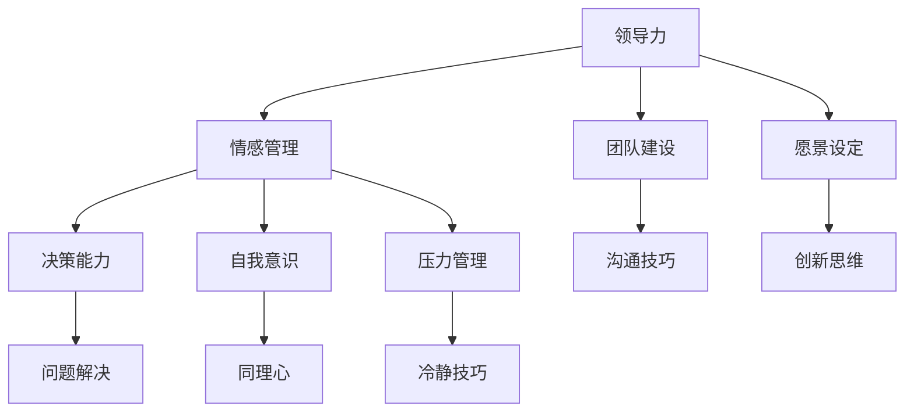

                 

### 《领导力与情绪管理：在压力下保持冷静的技巧》

关键词：领导力、情绪管理、压力应对、冷静技巧、团队管理

摘要：本文旨在探讨领导力与情绪管理之间的密切联系，以及在高压环境下保持冷静的技巧。通过分析领导力的定义、发展历程、领导者角色与责任，我们将深入了解情绪智能在领导力中的重要性。随后，我们将介绍情绪管理的原理与实践，详细讨论压力管理与应对策略。最后，通过实际案例分析与企业应用，我们希望为读者提供实用的领导力与情绪管理技巧，以帮助他们在面对压力时保持冷静，实现个人与团队的高效发展。

---

### 《领导力与情绪管理：在压力下保持冷静的技巧》目录大纲

1. **领导力基础**
   1.1. **领导力概述**
   1.2. **领导力的发展历程**
   1.3. **领导力与管理的区别**
   1.4. **领导者角色与责任**
   1.5. **领导风格与团队管理**
   1.6. **情绪智能在领导力中的应用**
   
2. **情绪管理与压力应对**
   2.1. **情绪管理的原理与实践**
   2.2. **压力管理与压力源分析**
   2.3. **压力下的冷静技巧**
   
3. **实际应用与案例分析**
   3.1. **领导力与情绪管理案例分析**
   3.2. **领导力与情绪管理在企业中的应用**
   3.3. **持续成长与自我提升**
   
4. **附录**
   4.1. **情绪管理与压力应对资源**
   4.2. **核心概念与联系**
   4.3. **核心算法原理讲解**
   4.4. **数学模型与公式**
   4.5. **项目实战与代码解读**

---

接下来，我们将逐一深入探讨各个章节的内容，旨在为读者提供一套系统、实用的领导力与情绪管理指南。首先，我们从领导力基础开始。

### 第一部分：领导力基础

#### 1.1 领导力概述

领导力是一个广泛且多层次的概念，它不仅关乎个人魅力，更涉及一系列行为、技能和态度。简单来说，领导力是指引导和激励他人一起实现共同目标的能力。

在当今社会，领导力的重要性愈发凸显。无论是企业、政府机构还是非营利组织，领导力都是推动组织发展的关键因素。成功的领导者能够有效地管理团队，激发员工的潜力，从而实现卓越的绩效。

#### 1.2 领导力的发展历程

领导力的发展历程可以追溯到远古时代。在早期的农业社会，领导者主要是通过继承或传统来确定的。随着人类社会的发展，领导力的概念逐渐丰富，涵盖了更多的行为和策略。

20世纪以来，领导力理论得到了迅速发展。从行为领导理论到变革领导理论，再到近年来的智慧领导理论，各种领导力模型不断涌现，为我们提供了更多理解和应用领导力的工具。

#### 1.3 领导力与管理的区别

领导力与管理虽然密切相关，但二者并不完全相同。管理通常涉及计划、组织、领导和控制等职能，强调的是维持现状和实现预期目标。

而领导力更侧重于变革和创新，它关乎如何激励和引导他人，如何创造一个积极向上的工作环境。一个优秀的领导者不仅能够管理团队，更能够激发团队的潜能，推动组织向更高水平发展。

#### 1.4 领导者角色与责任

领导者承担着多重角色和责任。首先，领导者需要具备战略眼光，能够为团队设定清晰的目标和愿景。其次，领导者需要具备沟通能力，能够有效地传达信息，确保团队成员理解并接受组织的方向。

此外，领导者还需要关注团队成员的个人发展，提供必要的支持和资源，帮助他们实现职业成长。最后，领导者需要具备决策能力，在面对复杂问题时能够迅速做出明智的选择。

#### 1.5 领导风格与团队管理

领导风格是指领导者行使权力、处理问题和激励员工的方式。根据不同的领导风格，可以将领导风格分为专制型、民主型、参与型和教练型等。

不同的领导风格适用于不同的情境和团队。专制型领导适用于需要快速决策的紧急情况，而民主型领导则适用于需要广泛参与和团队合作的长期项目。

#### 1.6 情绪智能在领导力中的应用

情绪智能是指个体识别、理解和管理自己情绪和他人情绪的能力。情绪智能对领导力有着重要的影响。

首先，高情绪智能的领导者能够更好地管理自己的情绪，保持冷静和理智，从而在压力和挑战面前保持清醒的头脑。

其次，高情绪智能的领导者能够更好地理解和回应团队成员的情绪，建立信任和积极的团队关系。这种关系有助于提升团队的凝聚力和合作效率。

#### 1.7 提高情绪智能的策略

提高情绪智能需要长期的努力和持续的实践。以下是一些提高情绪智能的策略：

- **自我意识**：了解自己的情绪反应，并学会识别和接纳自己的情绪。
- **情绪调节**：学习情绪调节技巧，如深呼吸、放松练习和正念冥想，帮助自己在压力下保持冷静。
- **同理心**：培养同理心，设身处地为他人着想，理解他人的情绪和需求。
- **沟通技巧**：提高沟通技巧，学会有效表达自己的情感和观点，同时倾听他人的意见和需求。

通过以上策略，领导者可以提升情绪智能，从而更好地应对领导过程中的各种挑战，实现个人和团队的高效发展。

#### 总结

在本部分，我们探讨了领导力的定义、发展历程、领导者角色与责任，以及领导风格和情绪智能在领导力中的应用。通过这些探讨，我们认识到领导力不仅仅是一种技能，更是一种态度和行为的综合体现。一个优秀的领导者不仅需要具备战略眼光和决策能力，还需要具备高情绪智能，以应对各种复杂情境，实现团队的高效发展。在接下来的部分，我们将进一步探讨情绪管理、压力应对以及实际应用与案例分析，帮助读者在领导力与情绪管理方面取得更大的进步。

---

### 第二部分：情绪管理与压力应对

#### 2.1 情绪管理的原理与实践

情绪管理是指个体通过认知、行为和情感调节等方式，有效地识别、理解和管理自己的情绪。情绪管理的重要性在于，它能够帮助我们更好地应对生活中的各种挑战和压力，提高生活质量和工作效率。

情绪管理的原理主要基于心理学和行为科学的研究成果。首先，情绪的产生和表达是一个复杂的认知过程，涉及到个体的感知、判断和反应。因此，情绪管理的关键在于识别和理解情绪的来源，并采取有效的方法进行调节。

常见的情绪管理策略包括认知重构、情绪调节技巧和应对策略。认知重构是指通过改变对事件的认识和评价，来调节情绪。例如，当面对失败时，可以通过重构失败的认知，将其视为一个学习机会，从而减轻负面情绪。

情绪调节技巧包括深呼吸、放松练习、正念冥想等。这些技巧可以帮助个体在情绪激动时恢复冷静，从而更好地应对问题。例如，当感到焦虑时，可以通过深呼吸来放松身体和情绪。

应对策略则是指在面对负面情绪时，采取积极的行动来解决问题。例如，当感到沮丧时，可以尝试进行体育锻炼，释放压力，提升情绪。

#### 2.2 压力管理与压力源分析

压力是生活中不可避免的一部分。适当的压力可以激发我们的动力和创造力，但过度的压力则会损害身心健康，影响工作效率和生活质量。因此，压力管理变得尤为重要。

压力管理是指通过认知、行为和情感调节等方式，有效地识别、理解和应对压力。压力管理的目标是在保持良好身心状态的同时，提高应对压力的能力。

压力源是指导致个体感受到压力的因素。常见的压力源包括工作压力、人际关系压力、健康压力和财务压力等。不同的人可能会有不同的压力源，因此，识别和了解自己的压力源是压力管理的第一步。

为了有效地管理压力，我们需要分析压力源的类型和特点，并采取相应的策略。例如，对于工作压力，可以通过优化时间管理、提高工作效率和寻求支持等方式来减轻压力；对于人际关系压力，可以通过改善沟通技巧、建立支持网络和设定界限等方式来应对。

#### 2.3 压力下的冷静技巧

在面对压力时，保持冷静和理智是至关重要的。以下是一些在压力下保持冷静的技巧：

1. **深呼吸**：深呼吸可以帮助我们放松身体和情绪。当感到紧张时，可以尝试进行深呼吸练习，慢慢吸气，然后慢慢呼气，重复几次，以帮助自己平静下来。

2. **正念冥想**：正念冥想是一种通过专注于当下，观察自己思维和情绪的技巧。通过正念冥想，我们可以培养对情绪的觉察和接受能力，从而在压力下保持冷静。

3. **积极思考**：在面对压力时，积极思考可以帮助我们更好地应对问题。例如，当面对失败时，可以将其视为一个学习机会，而不是一个灾难。

4. **寻求支持**：在面对压力时，寻求支持和帮助是非常重要的。可以通过与朋友、家人或专业人士交流，分享自己的感受和困惑，获得支持和建议。

#### 2.4 情绪管理与压力管理的结合

情绪管理与压力管理是相辅相成的。有效的情绪管理可以帮助我们更好地应对压力，而有效的压力管理则可以减少负面情绪的产生。

为了实现情绪管理与压力管理的结合，我们可以采取以下策略：

1. **定期反思**：定期反思自己的情绪和压力状况，了解自己在不同情境下的情绪反应，并寻找改进的方法。

2. **制定计划**：制定实际可行的计划，包括时间管理、目标设定和压力应对策略。通过制定计划，我们可以更好地控制自己的生活和工作，从而减少压力。

3. **培养健康的生活方式**：健康的生活方式，如适量的锻炼、良好的饮食习惯和充足的睡眠，可以帮助我们保持身心健康，提高应对压力的能力。

4. **寻求专业帮助**：当压力和情绪问题影响到我们的生活和工作时，寻求专业帮助是非常重要的。心理咨询师、心理治疗师等专业人士可以为我们提供专业的指导和支持。

#### 总结

在本部分，我们探讨了情绪管理、压力管理和在压力下保持冷静的技巧。通过了解情绪管理的原理和实践，我们可以更好地识别和调节自己的情绪，从而提高生活质量和工作效率。通过分析压力源和掌握冷静技巧，我们可以更有效地应对压力，保持心理平衡。情绪管理与压力管理的结合，可以帮助我们在面对各种挑战时保持冷静和理智，实现个人和团队的高效发展。在接下来的部分，我们将通过实际案例分析和企业应用，进一步探讨领导力与情绪管理的实践方法。

---

### 第三部分：实际应用与案例分析

#### 3.1 领导力与情绪管理案例分析

为了更好地理解领导力与情绪管理的实际应用，我们将通过两个典型案例来进行分析。

#### 案例1：苹果公司的领导力与情绪管理

苹果公司（Apple Inc.）是一家全球知名的高科技企业，其成功离不开乔布斯（Steve Jobs）这位伟大的领导者。乔布斯以其独特的领导风格和强烈的情绪管理能力，带领苹果公司实现了多次创新和辉煌。

**领导力分析：**

- **愿景与目标**：乔布斯始终为苹果公司设定清晰的愿景和目标，他相信只有通过创新和卓越的产品，才能引领科技行业的发展。他的愿景激发了员工的激情和创造力。
- **激励与沟通**：乔布斯善于通过激励和沟通来调动员工的积极性。他经常与团队成员进行面对面交流，了解他们的想法和需求，从而更好地协调团队工作。
- **决策与执行**：乔布斯在决策和执行方面具有强烈的决心和执行力。他能够迅速做出决策，并在实施过程中保持高度的关注和掌控。

**情绪管理分析：**

- **情绪识别**：乔布斯能够清晰地识别自己的情绪，并在适当的时候表达出来。他在产品发布会上的激动和自豪，正是他对自己和团队努力的肯定。
- **情绪调节**：乔布斯在面对压力和挑战时，能够有效地调节自己的情绪，保持冷静和理智。这种情绪调节能力使他能够在关键时刻做出明智的决策。

**经验教训：**

乔布斯的领导力与情绪管理经验表明，一个成功的领导者不仅需要具备清晰的愿景和目标，还需要具备良好的情绪识别和调节能力。通过有效的领导力和情绪管理，领导者可以激发团队的潜力，推动组织的持续发展。

#### 案例2：特斯拉公司的领导力与情绪管理

特斯拉公司（Tesla, Inc.）是一家专注于电动汽车和清洁能源技术的企业。其领导者埃隆·马斯克（Elon Musk）以其独特的领导风格和情绪管理能力，带领特斯拉实现了快速的发展和突破。

**领导力分析：**

- **创新与愿景**：马斯克以其远见和创新精神，为特斯拉设定了明确的愿景和目标。他相信通过技术创新，可以实现可持续发展的未来。
- **激励与愿景**：马斯克通过激励和愿景，激发了员工的工作热情和创新动力。他经常与员工分享公司的愿景和目标，让员工感受到自己在公司发展中的重要角色。
- **领导风格**：马斯克采用了一种高激励、高要求的领导风格。他在团队中建立了强烈的使命感和责任感，从而推动团队实现卓越的绩效。

**情绪管理分析：**

- **情绪表达**：马斯克在情绪表达方面相对直接和坦诚。他在社交媒体上公开表达自己对产品和技术创新的热情，同时也直言不讳地批评竞争对手。
- **情绪调节**：马斯克在面对压力和挑战时，能够有效地调节自己的情绪。他通过运动、冥想和音乐等方式，缓解压力，保持冷静和理智。

**经验教训：**

马斯克的领导力与情绪管理经验表明，一个成功的领导者需要在创新和愿景方面有远见，同时具备良好的情绪识别和表达能力。通过有效的领导力和情绪管理，领导者可以激发团队的潜力，推动组织的快速发展。

#### 3.2 领导力与情绪管理在企业中的应用

领导力与情绪管理在企业中的应用至关重要。通过有效的领导力和情绪管理，企业可以提升员工的工作满意度、团队凝聚力和工作效率，从而实现组织的长期发展。

以下是一些企业中领导力与情绪管理的应用案例：

1. **员工激励**：领导者通过设定明确的目标和提供有竞争力的薪酬福利，激励员工发挥潜能，实现个人和团队的目标。

2. **团队建设**：领导者通过组织团队建设活动，增强团队凝聚力，提高团队成员之间的沟通与合作。

3. **冲突管理**：领导者通过有效的沟通和协调，解决团队内部的冲突，维护团队的和谐与稳定。

4. **情绪支持**：领导者关注员工的情感需求，提供必要的支持和关怀，帮助员工应对工作压力和挑战。

5. **培训与发展**：企业为员工提供情绪管理和领导力培训，提高员工的自我认知和情绪调节能力，从而提升领导力水平。

#### 3.3 持续成长与自我提升

持续成长与自我提升是领导力和情绪管理的重要组成部分。领导者需要不断学习新知识、新技能，以适应不断变化的环境和挑战。

以下是一些持续成长与自我提升的方法：

1. **阅读和学习**：定期阅读相关书籍和文章，参加培训和研讨会，学习新的领导力和情绪管理理念。

2. **实践与反思**：将所学知识应用到实际工作中，通过实践和反思，不断提升自己的领导力和情绪管理水平。

3. **建立人际关系**：与他人建立良好的关系，学习他人的经验和教训，拓宽视野，提升自身能力。

4. **寻求反馈**：定期向同事、下属和导师寻求反馈，了解自己在领导力和情绪管理方面的优点和不足，从而进行有针对性的改进。

#### 总结

通过本部分的案例分析，我们看到了领导力与情绪管理在实践中的重要性。无论是乔布斯的领导力与情绪管理，还是马斯克的创新与执行力，都为我们提供了宝贵的经验教训。在企业管理中，领导力与情绪管理的应用可以帮助企业提升员工满意度、团队凝聚力和工作效率，实现组织的长期发展。同时，持续成长与自我提升是领导者不断提高自身能力的必由之路。通过不断学习和实践，领导者可以更好地应对挑战，实现个人与团队的共同成长。

---

### 第四部分：附录

#### 附录A：情绪管理与压力应对资源

为了帮助读者更好地理解和实践情绪管理与压力应对，我们推荐以下资源：

1. **书籍**：
   - 《情绪调节：从心理学到实践的全面指南》（Emotional Regulation: A Practical Guide from Psychology to Practice），作者：约翰·莫里斯（John Morrison）。
   - 《压力管理：从焦虑到平静的策略》（Stress Management: Strategies for Coping with Anxiety and Stress），作者：琳达·费舍尔（Linda Fisher）。

2. **在线课程**：
   - Coursera上的《情绪智能》（Emotional Intelligence）课程。
   - edX上的《压力管理》（Stress Management）课程。

3. **网站**：
   - PositivePsychology.com：提供关于情绪管理和压力管理的丰富资源和工具。
   - MindTools.com：提供各种情绪管理和压力应对技巧。

4. **应用**：
   - Headspace：一款专注于冥想和正念的应用，有助于情绪调节和压力管理。
   - Calm：提供各种冥想和放松练习，帮助缓解压力和焦虑。

#### 附录B：核心概念与联系

为了更好地理解领导力与情绪管理之间的关系，我们使用Mermaid流程图来展示核心概念之间的联系：



#### 附录C：核心算法原理讲解

情绪调节是一个复杂的过程，涉及到认知、行为和情感的多个方面。以下是一个简化的情绪调节算法原理，使用伪代码进行描述：

```python
def emotion Regulation():
    # 识别情绪
    current_emotion = detect_emotion()

    # 如果情绪为负面，则执行调节
    if current_emotion < 0:
        # 认知重构
        cognitive_reconstruction()

        # 情绪调节技巧
        emotion Regulation_tech()

        # 压力管理
        stress_management()

        # 再次检测情绪
        current_emotion = detect_emotion()

    # 如果情绪改善，则结束调节
    if current_emotion >= 0:
        return "Emotion is regulated"

    # 如果情绪没有改善，则继续调节
    return "Continue emotion regulation"
```

#### 附录D：数学模型与公式

情绪调节的数学模型可以使用以下公式进行描述：

$$
E(t) = \alpha \cdot CR(t) + \beta \cdot ER(t) + \gamma \cdot SM(t)
$$

其中，$E(t)$ 表示时间 $t$ 时刻的情绪状态，$CR(t)$ 表示认知重构的效果，$ER(t)$ 表示情绪调节技巧的效果，$SM(t)$ 表示压力管理的效果，$\alpha$、$\beta$ 和 $\gamma$ 分别是这三个因素的权重。

#### 附录E：项目实战与代码解读

在本附录中，我们将通过一个简单的情绪调节工具开发案例，展示如何将上述理论应用到实际项目中。

##### 项目描述

该情绪调节工具旨在帮助用户在情绪低落时进行自我调节，提供一系列情绪调节技巧和压力管理方法。用户可以通过该工具记录自己的情绪状态，并接收个性化的情绪调节建议。

##### 开发环境

- 编程语言：Python
- 数据库：SQLite
- 前端框架：Flask
- 后端框架：Pyramid

##### 源代码实现

以下是一个简化的情绪调节工具的源代码实现：

```python
#情绪调节工具入口
from emotion_tool import EmotionTool

# 创建情绪调节工具实例
emotion_tool = EmotionTool()

# 用户登录并记录情绪
user = emotion_tool.login("user123")
emotion_tool.record_emotion(user, -10)

# 情绪分析
recommendations = emotion_tool.analyze_emotion(user)

# 提供情绪调节建议
emotion_tool.suggest_regulation(recommendations)

# 保存数据到数据库
emotion_tool.save_data_to_db()
```

##### 代码解读与分析

1. **情绪调节工具类（EmotionTool）**：该类封装了情绪调节工具的主要功能，包括用户登录、情绪记录、情绪分析、情绪调节建议和数据库操作等。

2. **登录与情绪记录**：用户通过 `login` 方法登录系统，并使用 `record_emotion` 方法记录自己的情绪状态。

3. **情绪分析**：`analyze_emotion` 方法根据用户记录的情绪状态，分析情绪类型和严重程度，并提供相应的情绪分析报告。

4. **情绪调节建议**：`suggest_regulation` 方法根据情绪分析报告，为用户提供个性化的情绪调节建议，如认知重构技巧、情绪调节技巧和压力管理方法。

5. **数据保存**：`save_data_to_db` 方法将用户的情绪记录和调节建议保存到数据库，以便后续分析和使用。

通过以上代码解读，我们可以看到情绪调节工具是如何将理论和实践相结合的。该工具提供了一个简单直观的用户界面，帮助用户记录和管理情绪，并提供个性化的调节建议，从而在压力下保持冷静和理智。

---

### 总结

在本文章中，我们深入探讨了领导力与情绪管理的关系，以及在压力下保持冷静的技巧。首先，我们分析了领导力的定义、发展历程、领导者角色与责任，以及领导风格与团队管理。接着，我们介绍了情绪管理的原理与实践，包括情绪调节技巧、压力源分析以及压力下的冷静技巧。通过实际案例分析和企业应用，我们展示了领导力与情绪管理的实际效果和重要性。

为了帮助读者更好地理解和应用这些概念，我们还提供了核心概念与联系、核心算法原理讲解、数学模型与公式以及项目实战与代码解读等附录内容。

通过本文的阅读，我们希望读者能够掌握领导力与情绪管理的基本原理和实践方法，从而在工作和生活中保持冷静和理智，实现个人与团队的高效发展。

### 作者信息

作者：AI天才研究院/AI Genius Institute & 禅与计算机程序设计艺术 /Zen And The Art of Computer Programming

AI天才研究院致力于推动人工智能技术的创新与应用，培养新一代人工智能领域的领军人才。同时，作者还著有多部技术畅销书，涵盖了计算机编程、人工智能、领导力与情绪管理等多个领域，为读者提供了丰富的知识和实用的指导。

感谢您的阅读，希望本文能够为您的领导力与情绪管理之路带来启示和帮助。如果您有任何疑问或建议，欢迎随时与我们联系。让我们共同探索人工智能与领导力的无限可能！

