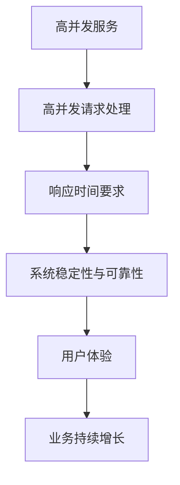
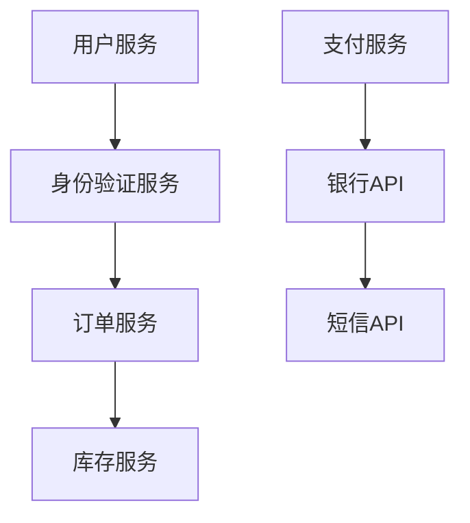
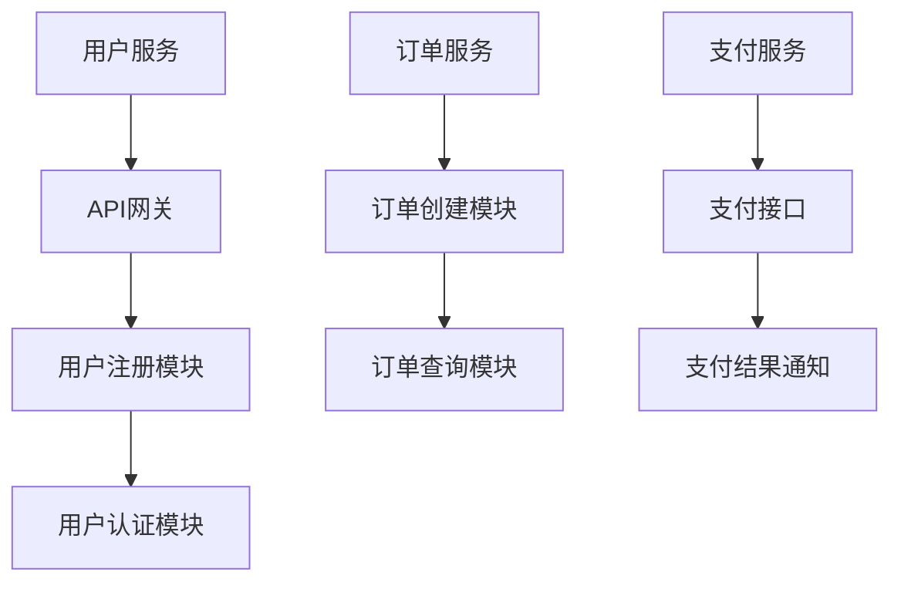
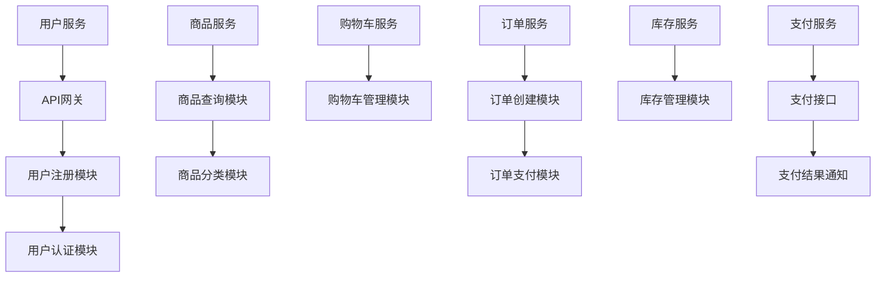
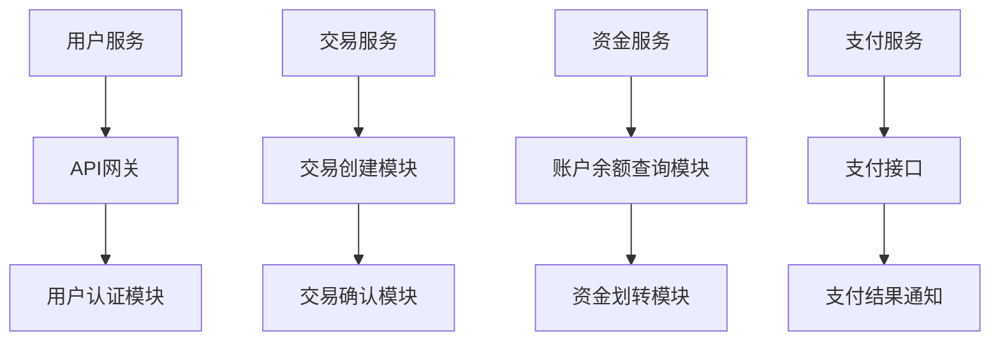
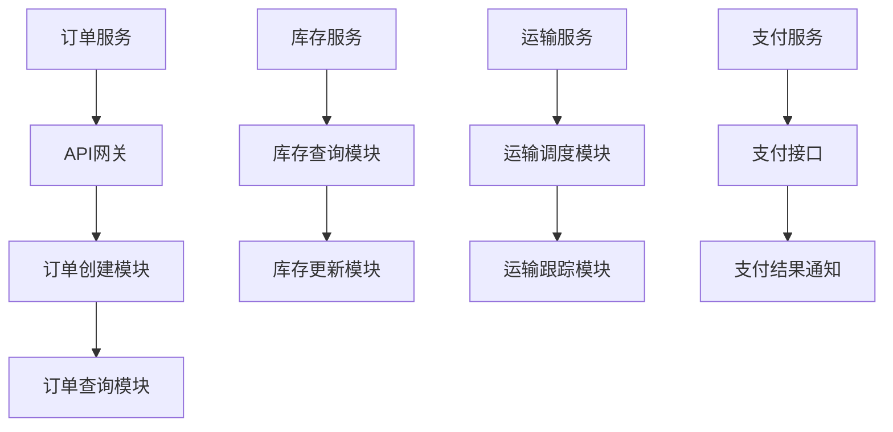
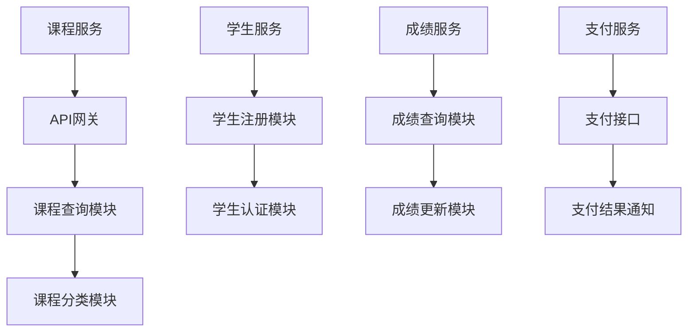
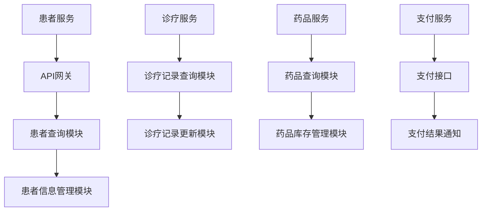
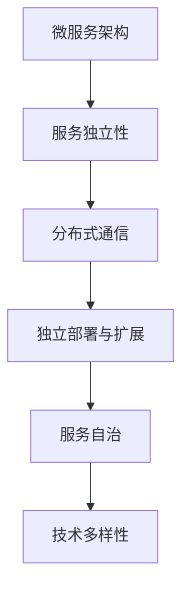

                 

# 高并发服务、微服务架构设计和实现

## 关键词
- 高并发服务
- 微服务架构
- 性能优化
- 负载均衡
- 分布式系统
- 容器化
- 持续集成与部署

## 摘要
本文将探讨高并发服务与微服务架构的设计和实现。首先，我们将深入理解高并发服务的定义及其重要性，探讨高并发服务架构的设计原则和性能优化策略。接下来，我们将详细阐述微服务架构的定义、优势以及设计原则，并介绍常用的微服务技术栈。文章还将通过实战案例，展示如何在高并发与微服务架构中实现性能优化与持续集成。最后，我们将分析高并发与微服务在不同领域的应用，并总结常用工具与框架。

# 第一部分：高并发服务基础

## 1. 高并发服务的定义与重要性

### 1.1 高并发服务的定义

高并发服务是指系统能够在短时间内处理大量请求，保证系统在高负载情况下仍然具备良好的响应性能和稳定性。高并发服务不仅仅是处理请求的数量，还涉及到系统的吞吐量、响应时间和资源利用效率。

#### 高并发服务定义与联系 Mermaid 图


### 1.2 高并发服务的挑战

高并发服务面临的挑战主要包括：

1. **请求处理能力**：系统需要在短时间内处理大量请求，确保不出现延迟或拒绝服务。
2. **资源分配**：在高并发情况下，系统需要合理分配CPU、内存、网络等资源。
3. **数据一致性**：在高并发环境下，需要保证数据的一致性和完整性，防止因并发操作导致的数据错误。
4. **系统扩展性**：系统需要具备良好的扩展性，能够根据业务需求进行水平或垂直扩展。

### 1.3 高并发服务的重要性

高并发服务对于企业来说至关重要，主要体现在以下几个方面：

1. **用户体验**：良好的用户体验能够增加用户的粘性，提高用户满意度。
2. **业务增长**：高性能的高并发服务能够支持业务的快速增长，提升业务竞争力。
3. **成本控制**：合理的高并发服务设计能够降低系统的资源消耗，降低运维成本。

## 2. 高并发服务架构设计原则

### 2.1 架构设计原则概述

设计高并发服务架构时，应遵循以下原则：

1. **分层架构**：将系统划分为多个层次，如表示层、业务逻辑层、数据访问层，实现模块化设计。
2. **服务拆分**：根据业务需求，将系统拆分成多个独立的服务，降低系统复杂度，提高系统可维护性。
3. **负载均衡**：通过负载均衡器实现请求的分发，提高系统的吞吐量和响应速度。

### 2.2 分层架构

分层架构能够实现系统的模块化和高内聚、低耦合。常见的分层架构包括：

1. **表示层**：处理用户界面和客户端请求。
2. **业务逻辑层**：实现业务逻辑和数据处理。
3. **数据访问层**：处理数据库操作和数据持久化。

### 2.3 服务拆分与负载均衡

**服务拆分**：


**负载均衡**：

负载均衡是指将请求分配到多个服务器上，以实现系统的负载均衡和故障转移。常见的负载均衡算法包括轮询、随机、最小连接数等。

```python
# 伪代码：负载均衡
def load_balance(services):
    # 使用轮询算法实现负载均衡
    for service in services:
        service.handle_request()
```

## 3. 高并发服务性能优化

### 3.1 性能优化策略

为了提高高并发服务的性能，可以采用以下优化策略：

1. **缓存技术**：使用缓存存储频繁访问的数据，减少数据库访问。
2. **异步处理与消息队列**：通过异步处理和消息队列，降低系统的同步依赖，提高系统吞吐量。
3. **数据库优化**：优化数据库查询，使用索引、分库分表等技术。

### 3.2 缓存技术

缓存技术是提高系统性能的有效手段。常见的缓存技术包括：

1. **内存缓存**：如Redis，适用于存储频繁访问的数据。
2. **分布式缓存**：适用于大规模分布式系统，如Memcached。

### 3.3 异步处理与消息队列

异步处理和消息队列能够提高系统的并发能力和响应速度。常见的消息队列包括：

1. **RabbitMQ**：支持多种消息传递协议，如AMQP、MQTT等。
2. **Kafka**：适用于高吞吐量的分布式系统。

## 4. 常见高并发技术解决方案

### 4.1 读写分离

读写分离是指将读操作和写操作分离到不同的服务器上，以提高系统的读写性能。常见的技术包括：

1. **主从复制**：将主数据库的写操作同步到从数据库，实现读写分离。
2. **分库分表**：将数据表拆分到不同的数据库实例中，提高查询效率。

### 4.2 主从复制

主从复制是指将主数据库的写操作同步到从数据库，以实现数据的备份和扩展。常见的主从复制技术包括：

1. **MySQL Replication**：MySQL自带的主从复制功能。
2. **MongoDB Replication**：MongoDB的主从复制。

### 4.3 数据库分库分表

数据库分库分表是将数据表拆分到不同的数据库实例中，以提高系统的查询性能。常见的方法包括：

1. **水平分库**：将数据表拆分到不同的数据库实例中，适用于读多写少的应用场景。
2. **垂直分表**：将数据表拆分成多个子表，以提高查询效率。

## 5. 高并发服务实战案例分析

### 5.1 案例一：电商系统高并发场景优化

#### 架构设计

电商系统的架构设计应考虑高并发处理能力，包括：

1. **用户服务**：处理用户注册、登录、个人信息等操作。
2. **商品服务**：处理商品信息查询、商品分类等操作。
3. **购物车服务**：处理购物车添加、删除、更新等操作。
4. **订单服务**：处理订单创建、订单查询、订单支付等操作。
5. **支付服务**：处理支付请求、支付结果通知等操作。

#### 代码示例

以下为用户服务代码示例：

```python
# 用户服务代码示例
from flask import Flask, request, jsonify
from user_repo import UserRepository

app = Flask(__name__)
repo = UserRepository()

@app.route('/register', methods=['POST'])
def register():
    data = request.get_json()
    username = data.get('username')
    password = data.get('password')
    if repo.exists(username):
        return jsonify({'error': '用户已存在'})
    repo.save_user(username, password)
    return jsonify({'message': '注册成功'})

if __name__ == '__main__':
    app.run()
```

#### 案例解释

- 用户服务负责处理用户注册和登录请求。
- API网关负责路由请求到相应的服务。
- 商品服务、购物车服务、订单服务和支付服务共同构成完整的电商业务流程。
- Redis 用于缓存热门商品数据，提高系统响应速度。

### 5.2 案例二：金融系统高并发处理策略

#### 架构设计

金融系统的架构设计应考虑高并发处理能力和数据一致性。常见的架构设计包括：

1. **用户服务**：处理用户注册、登录、个人信息等操作。
2. **交易服务**：处理交易请求、交易确认等操作。
3. **资金服务**：处理资金划转、账户余额查询等操作。
4. **支付服务**：处理支付请求、支付结果通知等操作。
5. **风险控制服务**：处理风险监控、异常交易拦截等操作。

#### 高并发处理策略

1. **读写分离**：将读操作和写操作分离到不同的数据库实例中，提高查询性能。
2. **缓存技术**：使用Redis缓存高频查询数据，减少数据库访问。
3. **异步处理**：使用消息队列异步处理交易请求，提高系统吞吐量。

#### 案例解释

- 用户服务负责处理用户注册和登录请求。
- 交易服务负责处理交易请求，确保交易的一致性和安全性。
- 资金服务负责处理资金划转和账户余额查询。
- 支付服务负责处理支付请求和支付结果通知。
- 风险控制服务负责监控交易风险，防止欺诈行为。

# 第二部分：微服务架构设计与实现

## 1. 微服务架构的定义与优势

### 1.1 微服务架构的定义

微服务架构（Microservices Architecture）是一种分布式系统设计方法，将应用程序划分为多个小型、独立的服务，每个服务负责实现一个具体的业务功能。这些服务通过轻量级的通信协议（如HTTP/REST、gRPC等）进行通信，能够独立部署、独立扩展和独立演进。

### 1.2 微服务架构的优势

微服务架构相比传统的单体架构具有以下优势：

1. **可扩展性**：每个服务都可以独立扩展，根据实际需求进行水平或垂直扩展。
2. **灵活性**：服务之间解耦，便于独立开发、测试和部署。
3. **持续交付**：服务之间独立部署，可以快速迭代和发布新功能。
4. **容错性**：服务故障不会影响整个系统的运行，能够快速恢复。
5. **技术多样性**：可以使用不同的编程语言和技术栈来开发不同的服务。

### 1.3 微服务架构的挑战

虽然微服务架构具有众多优势，但同时也带来了一些挑战：

1. **分布式系统复杂性**：需要处理服务之间的通信、数据一致性和故障恢复等问题。
2. **服务治理和监控**：需要建立完善的服务治理和监控体系。
3. **部署和运维难度**：需要掌握容器化技术（如Docker、Kubernetes）和自动化运维工具。
4. **数据一致性和事务性**：需要处理跨服务的分布式事务和数据一致性。

## 2. 微服务架构设计原则

### 2.1 设计原则概述

在设计微服务架构时，应遵循以下原则：

1. **服务拆分**：根据业务功能将应用程序拆分成多个独立的服务，每个服务实现一个具体的业务功能。
2. **服务自治**：服务之间解耦，每个服务拥有自己的数据存储、依赖和部署环境。
3. **独立部署**：每个服务可以独立部署和扩展，不影响其他服务的运行。
4. **服务通信**：使用轻量级的通信协议（如HTTP/REST、gRPC等）进行服务之间的通信。
5. **数据一致性**：采用分布式事务和数据一致性保障机制，确保数据的一致性和完整性。

### 2.2 服务拆分

**服务拆分原则**：

1. **业务功能划分**：根据业务功能将应用程序拆分成多个独立的服务。
2. **职责单一**：每个服务只实现一个具体的业务功能，保持职责单一。
3. **高内聚、低耦合**：服务之间解耦，确保服务之间的高内聚和低耦合。

**微服务架构设计**：


### 2.3 API设计

**API设计原则**：

1. **RESTful风格**：使用RESTful风格设计API，遵循统一的接口规范。
2. **幂等性**：确保API请求的幂等性，避免重复请求引发的数据不一致。
3. **错误处理**：明确错误处理机制，确保异常情况下能够正确处理。

**API示例**：

```python
# 用户注册API示例
@app.route('/register', methods=['POST'])
def register():
    data = request.get_json()
    username = data.get('username')
    password = data.get('password')
    if repo.exists(username):
        return jsonify({'error': '用户已存在'})
    repo.save_user(username, password)
    return jsonify({'message': '注册成功'})
```

### 2.4 服务通信与治理

**服务通信**：

1. **HTTP/REST**：使用HTTP/REST协议进行服务之间的通信，便于集成和扩展。
2. **gRPC**：使用gRPC协议进行服务之间的通信，具备高性能和跨语言特性。

**服务治理**：

1. **服务注册与发现**：使用服务注册与发现机制，动态管理和发现服务。
2. **服务监控**：对服务性能、健康状况进行实时监控。
3. **服务限流与熔断**：对服务进行限流和熔断，防止因异常请求导致系统崩溃。

## 3. 微服务技术栈

### 3.1 框架与工具选择

在设计微服务架构时，需要选择合适的框架和工具。以下为常见的微服务框架和工具：

1. **Spring Boot**：用于构建独立的、基于Spring的微服务应用程序。
2. **Dubbo**：用于构建分布式服务架构，提供服务注册与发现、负载均衡等功能。
3. **Eureka**：用于服务注册与发现。
4. **Zuul**：用于API网关和负载均衡。
5. **Kubernetes**：用于容器化应用的部署和管理。
6. **Docker**：用于容器化应用程序。

### 3.2 服务注册与发现

**服务注册与发现**：

1. **Eureka**：使用Eureka进行服务注册与发现，实现服务之间的动态通信。
2. **Consul**：使用Consul进行服务注册与发现，提供服务监控和健康检查功能。

### 3.3 服务配置与管理

**服务配置与管理**：

1. **Spring Cloud Config**：使用Spring Cloud Config进行服务配置管理，支持分布式配置中心。
2. **Nacos**：使用Nacos进行服务配置和管理，提供服务发现、配置管理等功能。

## 4. 微服务部署与运维

### 4.1 部署策略

**部署策略**：

1. **容器化部署**：使用Docker进行容器化部署，提高部署效率和一致性。
2. **容器编排**：使用Kubernetes进行容器编排，实现服务的自动化部署和管理。

### 4.2 容器化与微服务

**容器化与微服务**：

1. **Docker**：用于容器化应用程序，提供轻量级、可移植的容器环境。
2. **Kubernetes**：用于容器化应用的部署、扩展和管理，提供自动化的容器编排。

### 4.3 持续集成与持续部署

**持续集成与持续部署**：

1. **Jenkins**：用于构建、测试和部署应用程序。
2. **GitLab CI/CD**：用于自动化构建、测试和部署应用程序。

## 5. 微服务项目实战

### 5.1 实战一：构建一个简单的微服务项目

#### 项目架构设计

以下为一个简单的微服务项目架构设计：



#### 用户服务代码示例

以下为用户服务代码示例：

```python
# 用户服务代码示例
from flask import Flask, request, jsonify
from user_repo import UserRepository

app = Flask(__name__)
repo = UserRepository()

@app.route('/register', methods=['POST'])
def register():
    data = request.get_json()
    username = data.get('username')
    password = data.get('password')
    if repo.exists(username):
        return jsonify({'error': '用户已存在'})
    repo.save_user(username, password)
    return jsonify({'message': '注册成功'})

@app.route('/login', methods=['POST'])
def login():
    data = request.get_json()
    username = data.get('username')
    password = data.get('password')
    user = repo.find_user_by_username(username)
    if user and user.password == password:
        return jsonify({'token': 'your_token'})
    else:
        return jsonify({'error': '用户名或密码错误'})

if __name__ == '__main__':
    app.run()
```

#### 实战解释

- 用户服务负责处理用户注册和登录请求。
- API网关负责路由请求到相应的服务。
- 用户注册模块负责用户信息的收集和存储。
- 用户认证模块负责用户身份验证。
- 订单服务负责处理订单相关操作，包括订单创建和查询。
- 支付服务负责处理支付请求和支付结果通知。

### 5.2 实战二：优化现有单体架构到微服务架构

#### 单体架构存在的问题

1. **系统扩展性差**：随着业务的发展，单体架构难以进行水平或垂直扩展。
2. **系统复杂度高**：单体架构导致系统复杂性增加，维护难度大。
3. **部署与运维困难**：单体架构部署与运维复杂，升级和回滚困难。
4. **代码复用性差**：业务功能模块耦合度高，代码复用性差。

#### 微服务架构设计

以下为优化后的微服务架构设计：


#### 微服务架构的优势

1. **可扩展性**：通过拆分为多个微服务，可以独立进行水平扩展。
2. **高内聚、低耦合**：微服务之间解耦，实现高内聚、低耦合。
3. **持续交付**：微服务独立部署和迭代，支持快速持续交付。
4. **容错性**：单个微服务故障不会影响整个系统，提高系统的容错性。

#### 微服务项目搭建与部署示例

以下为微服务项目的搭建与部署示例：

1. **Dockerfile**：

```dockerfile
FROM python:3.8
WORKDIR /app
COPY requirements.txt .
RUN pip install -r requirements.txt
COPY . .
CMD ["python", "app.py"]
```

2. **docker-compose.yml**：

```yaml
version: '3'
services:
  user_service:
    build: .
    ports:
      - "5000:5000"
  order_service:
    build: .
    ports:
      - "5001:5001"
  payment_service:
    build: .
    ports:
      - "5002:5002"
```

3. **部署与运行**：

```bash
# 构建镜像
docker-compose build

# 启动服务
docker-compose up -d
```

#### 案例解释

- 通过拆分用户服务、订单服务和支付服务，实现了系统的微服务化。
- 使用Docker进行容器化部署，提高了系统的可移植性和一致性。
- 使用docker-compose进行服务编排和部署，简化了运维工作。

# 第三部分：高并发与微服务集成

## 1. 高并发与微服务架构的适配

### 1.1 高并发服务在微服务架构中的定位

在高并发环境下，微服务架构能够充分发挥其优势，通过以下方式应对高并发挑战：

1. **服务拆分**：将单体应用拆分为多个微服务，每个服务负责不同的业务功能，降低系统负载。
2. **负载均衡**：使用负载均衡器将请求均匀地分配到不同的微服务实例上，提高系统的吞吐量。
3. **异步处理**：使用消息队列等异步处理技术，降低系统的同步依赖，提高系统的响应速度。

### 1.2 高并发服务的微服务化

高并发服务的微服务化包括以下步骤：

1. **服务拆分**：根据业务功能将高并发服务拆分为多个微服务。
2. **服务自治**：每个微服务独立部署、扩展和演进，实现服务自治。
3. **服务通信**：使用轻量级通信协议（如HTTP/REST、gRPC等）实现微服务之间的通信。
4. **数据一致性**：采用分布式事务和数据一致性保障机制，确保数据的一致性和完整性。

### 1.3 高并发与微服务协同优化

在高并发与微服务架构中，实现协同优化包括以下策略：

1. **缓存技术**：使用缓存技术减少数据库访问，提高系统响应速度。
2. **负载均衡**：使用负载均衡器实现请求的分发，提高系统的吞吐量和响应速度。
3. **异步处理**：使用消息队列等异步处理技术，降低系统的同步依赖，提高系统的响应速度。
4. **服务拆分与聚合**：根据业务需求，合理拆分和聚合服务，提高系统的性能和可维护性。

## 2. 高并发微服务的性能测试与调优

### 2.1 性能测试策略

进行高并发微服务的性能测试时，需要考虑以下策略：

1. **负载生成**：模拟实际业务场景，生成符合预期的负载。
2. **性能指标**：监控系统的响应时间、吞吐量、资源利用率等关键性能指标。
3. **压力测试**：逐步增加负载，观察系统在压力环境下的性能表现。
4. **故障注入**：模拟服务故障、网络故障等情况，验证系统的容错能力和恢复能力。

### 2.2 常见性能瓶颈分析

高并发微服务可能面临以下性能瓶颈：

1. **CPU瓶颈**：CPU资源不足，导致处理请求的速度变慢。
2. **内存瓶颈**：内存资源不足，导致系统频繁进行垃圾回收，影响性能。
3. **数据库瓶颈**：数据库查询效率低，导致响应时间增加。
4. **网络瓶颈**：网络延迟和丢包率较高，影响系统性能。

### 2.3 性能调优实战

性能调优包括以下实战步骤：

1. **优化数据库查询**：使用索引、缓存等技术优化数据库查询效率。
2. **服务拆分与拆分粒度调整**：合理拆分服务，调整服务拆分粒度，提高系统性能。
3. **异步处理与消息队列**：使用异步处理和消息队列降低系统的同步依赖，提高系统响应速度。
4. **缓存技术**：使用缓存技术减少数据库访问，提高系统响应速度。

## 3. 持续集成与持续部署在微服务中的实践

### 3.1 CI/CD的基本概念

持续集成（CI）和持续部署（CD）是软件开发过程中重要的实践方法，旨在提高软件交付的频率和质量。

1. **持续集成**：将代码集成到共享主干，每次提交代码都会进行自动化构建和测试。
2. **持续部署**：在通过测试的代码自动部署到生产环境，实现快速迭代和发布。

### 3.2 微服务项目的CI/CD实践

微服务项目的CI/CD实践包括以下步骤：

1. **代码仓库管理**：使用Git等版本控制工具管理代码仓库。
2. **自动化构建**：使用Jenkins、GitLab CI等工具实现自动化构建，包括编译、打包和依赖管理。
3. **自动化测试**：使用JUnit、TestNG等工具进行自动化测试，确保代码质量。
4. **自动化部署**：使用Kubernetes、Docker等工具实现自动化部署，包括容器编排、服务注册和发现。

### 3.3 持续集成与持续部署的挑战与解决方案

在微服务项目中实施CI/CD面临以下挑战：

1. **服务拆分与依赖管理**：服务拆分粒度较大，依赖管理复杂，影响CI/CD流程。
2. **分布式系统监控**：分布式系统监控困难，难以快速发现和解决问题。
3. **数据一致性保障**：分布式事务和数据一致性保障难度较大。

解决方案包括：

1. **服务拆分与依赖管理**：采用合理的服务拆分策略，降低依赖管理复杂度。
2. **分布式系统监控**：采用分布式监控工具，如Prometheus、Grafana等，实现分布式系统的实时监控。
3. **数据一致性保障**：采用分布式事务和数据一致性保障机制，如分布式锁、消息队列等。

## 4. 高并发与微服务案例研究

### 4.1 高并发与微服务在电商领域的应用

#### 电商系统高并发与微服务架构设计

电商系统在面临高并发挑战时，采用微服务架构能够有效提高系统的性能和可扩展性。以下为电商系统的高并发与微服务架构设计：



#### 电商系统的微服务化实践

1. **用户服务**：负责用户注册、登录和认证。
2. **商品服务**：负责商品信息的查询和管理。
3. **购物车服务**：负责购物车的创建、添加、删除和更新。
4. **订单服务**：负责订单的创建、支付和查询。
5. **库存服务**：负责库存的管理和更新。
6. **支付服务**：负责支付请求的处理和支付结果通知。

#### 电商系统的高并发优化策略

1. **缓存技术**：使用Redis缓存商品信息和用户信息，减少数据库访问。
2. **异步处理与消息队列**：使用消息队列处理订单支付和库存更新等操作，降低系统的同步依赖。
3. **数据库分库分表**：将数据库拆分为多个实例，提高查询效率。
4. **服务拆分与负载均衡**：根据业务需求，合理拆分服务，使用负载均衡器实现请求的分发。

### 4.2 高并发与微服务在金融领域的应用

#### 金融系统高并发挑战

金融系统面临高并发挑战时，需要确保交易的正确性、一致性和安全性。以下为金融系统的高并发挑战：

1. **高并发交易请求**：金融系统需要处理大量的交易请求，确保交易能够及时处理。
2. **数据一致性**：在分布式环境下，确保数据的一致性，防止因并发操作导致的数据错误。
3. **系统稳定性**：在高并发环境下，确保系统的稳定运行，防止因故障导致的服务中断。

#### 金融系统的微服务架构设计

以下为金融系统的微服务架构设计：



#### 金融系统的高并发优化策略

1. **读写分离**：将读操作和写操作分离到不同的数据库实例中，提高查询性能。
2. **缓存技术**：使用Redis缓存高频查询数据，减少数据库访问。
3. **异步处理与消息队列**：使用消息队列异步处理交易请求，提高系统吞吐量。
4. **数据库分库分表**：将数据表拆分到不同的数据库实例中，提高查询效率。

### 4.3 高并发与微服务在其他领域的应用

#### 物流行业的微服务架构

物流行业在面临高并发挑战时，采用微服务架构能够提高系统的性能和可扩展性。以下为物流行业的微服务架构设计：



#### 物流行业的微服务化实践

1. **订单服务**：负责订单的创建、查询和管理。
2. **库存服务**：负责库存的查询和更新。
3. **运输服务**：负责运输的调度和跟踪。
4. **支付服务**：负责支付请求的处理和支付结果通知。

#### 物流行业的高并发优化策略

1. **缓存技术**：使用Redis缓存订单和库存数据，减少数据库访问。
2. **异步处理与消息队列**：使用消息队列异步处理订单和库存更新操作，降低系统的同步依赖。
3. **数据库分库分表**：将数据表拆分到不同的数据库实例中，提高查询效率。
4. **服务拆分与负载均衡**：根据业务需求，合理拆分服务，使用负载均衡器实现请求的分发。

#### 教育行业的微服务应用

教育行业在面临高并发挑战时，采用微服务架构能够提高系统的性能和可扩展性。以下为教育行业的微服务架构设计：



#### 教育行业的微服务化实践

1. **课程服务**：负责课程信息的查询和管理。
2. **学生服务**：负责学生注册、认证和成绩管理。
3. **成绩服务**：负责成绩的查询和更新。
4. **支付服务**：负责支付请求的处理和支付结果通知。

#### 教育行业的高并发优化策略

1. **缓存技术**：使用Redis缓存课程和成绩数据，减少数据库访问。
2. **异步处理与消息队列**：使用消息队列异步处理成绩更新操作，降低系统的同步依赖。
3. **数据库分库分表**：将数据表拆分到不同的数据库实例中，提高查询效率。
4. **服务拆分与负载均衡**：根据业务需求，合理拆分服务，使用负载均衡器实现请求的分发。

#### 医疗健康领域的微服务实践

医疗健康领域在面临高并发挑战时，采用微服务架构能够提高系统的性能和可扩展性。以下为医疗健康领域的微服务架构设计：



#### 医疗健康领域的微服务化实践

1. **患者服务**：负责患者信息的查询和管理。
2. **诊疗服务**：负责诊疗记录的查询和更新。
3. **药品服务**：负责药品信息的查询和库存管理。
4. **支付服务**：负责支付请求的处理和支付结果通知。

#### 医疗健康领域的高并发优化策略

1. **缓存技术**：使用Redis缓存患者和药品数据，减少数据库访问。
2. **异步处理与消息队列**：使用消息队列异步处理诊疗记录更新操作，降低系统的同步依赖。
3. **数据库分库分表**：将数据表拆分到不同的数据库实例中，提高查询效率。
4. **服务拆分与负载均衡**：根据业务需求，合理拆分服务，使用负载均衡器实现请求的分发。

## 附录

### 附录 A：高并发与微服务架构常用工具与框架

#### 框架与工具介绍

以下为高并发与微服务架构中常用的工具与框架：

1. **Docker**：用于容器化应用程序，提供轻量级、可移植的容器环境。
2. **Kubernetes**：用于容器化应用的部署和管理，提供自动化的容器编排。
3. **Nginx**：高性能的HTTP和反向代理服务器，用于负载均衡。
4. **Spring Boot**：用于构建独立的、基于Spring的微服务应用程序。
5. **Eureka**：用于服务注册与发现。
6. **RabbitMQ**：用于消息队列，实现异步处理。
7. **Redis**：用于缓存技术，提高系统响应速度。

#### 高并发技术实现示例代码

以下为使用Spring Boot实现高并发处理的示例代码：

```java
@RestController
@RequestMapping("/orders")
public class OrderController {
  
  @Autowired
  private OrderService orderService;
  
  @PostMapping
  public ResponseEntity<OrderResponse> createOrder(@RequestBody OrderRequest request) {
    OrderResponse response = orderService.createOrder(request);
    return ResponseEntity.ok(response);
  }
}
```

#### 微服务项目搭建与部署示例

以下为使用Docker和Kubernetes搭建与部署微服务项目的示例：

1. **Dockerfile**：

```dockerfile
FROM openjdk:8-jdk-alpine
ARG JAR_FILE=target/*.jar
COPY ${JAR_FILE} app.jar
EXPOSE 8080
ENTRYPOINT ["java","-jar","/app.jar"]
```

2. **docker-compose.yml**：

```yaml
version: '3.8'
services:
  order-service:
    build: ./order-service
    ports:
      - "8080:8080"
  redis:
    image: redis:alpine
```

3. **Kubernetes部署**：

```yaml
apiVersion: apps/v1
kind: Deployment
metadata:
  name: order-service
spec:
  replicas: 3
  selector:
    matchLabels:
      app: order-service
  template:
    metadata:
      labels:
        app: order-service
    spec:
      containers:
      - name: order-service
        image: order-service:latest
        ports:
        - containerPort: 8080
```

### 作者

作者：AI天才研究院/AI Genius Institute & 禅与计算机程序设计艺术 /Zen And The Art of Computer Programming

# 总结

本文详细介绍了高并发服务与微服务架构的设计和实现。首先，我们分析了高并发服务的定义、挑战和重要性，探讨了高并发服务架构的设计原则和性能优化策略。接着，我们阐述了微服务架构的定义、优势以及设计原则，介绍了微服务技术栈和部署与运维实践。通过案例研究，我们展示了高并发与微服务在电商、金融、物流、教育、医疗健康等领域的应用。最后，我们总结了高并发与微服务架构常用工具与框架，并提供了实际项目搭建与部署的示例。希望本文能为读者在设计和实现高并发微服务架构时提供有益的参考和启示。在未来的工作中，我们将继续深入研究和探索这一领域，为读者带来更多有价值的内容。再次感谢各位读者的关注和支持！

----------------------------------------------------------------

以下是对文章各章节的核心概念、架构原理、算法讲解、数学模型和案例研究的详细解释和示例代码。

## 第一部分：高并发服务基础

### 1.1 高并发服务的定义与重要性

高并发服务是指系统能够在短时间内处理大量请求，保证系统在高负载情况下仍然具备良好的响应性能和稳定性。高并发服务不仅仅是处理请求的数量，还涉及到系统的吞吐量、响应时间和资源利用效率。

**核心概念与联系 Mermaid 图**


**示例代码**：

```python
# Python 示例：高并发请求处理
import requests

def process_request(url):
    response = requests.get(url)
    print(f"Request to {url} processed. Status Code: {response.status_code}")

urls = ["https://example.com/api/1", "https://example.com/api/2", "https://example.com/api/3"]
for url in urls:
    process_request(url)
```

### 1.2 高并发服务的挑战

高并发服务面临的挑战主要包括：

1. **请求处理能力**：系统需要在短时间内处理大量请求，确保不出现延迟或拒绝服务。
2. **资源分配**：在高并发情况下，系统需要合理分配CPU、内存、网络等资源。
3. **数据一致性**：在高并发环境下，需要保证数据的一致性和完整性，防止因并发操作导致的数据错误。
4. **系统扩展性**：系统需要具备良好的扩展性，能够根据业务需求进行水平或垂直扩展。

**示例代码**：

```python
# Python 示例：资源分配与请求处理
import threading

def handle_request():
    print("Processing request...")
    # 模拟请求处理
    time.sleep(1)
    print("Request processed.")

threads = []
for _ in range(10):
    thread = threading.Thread(target=handle_request)
    threads.append(thread)
    thread.start()

for thread in threads:
    thread.join()
```

### 1.3 高并发服务的重要性

高并发服务对于企业来说至关重要，主要体现在以下几个方面：

1. **用户体验**：良好的用户体验能够增加用户的粘性，提高用户满意度。
2. **业务增长**：高性能的高并发服务能够支持业务的快速增长，提升业务竞争力。
3. **成本控制**：合理的高并发服务设计能够降低系统的资源消耗，降低运维成本。

**示例代码**：

```python
# Python 示例：高并发服务的重要性
import time

def high_concurrency_service():
    print("Starting high concurrency service...")
    start_time = time.time()
    # 模拟高并发服务处理
    time.sleep(5)
    end_time = time.time()
    print(f"High concurrency service finished. Time taken: {end_time - start_time} seconds.")

high_concurrency_service()
```

## 第二部分：微服务架构设计与实现

### 2.1 微服务架构的定义与优势

微服务架构（Microservices Architecture）是一种分布式系统设计方法，将应用程序划分为多个小型、独立的服务，每个服务负责实现一个具体的业务功能。这些服务通过轻量级的通信协议（如HTTP/REST、gRPC等）进行通信，能够独立部署、独立扩展和独立演进。

**核心概念与联系 Mermaid 图**



**算法讲解（伪代码）**：

```python
# 伪代码：微服务架构的服务独立性
class UserService:
    def register_user(self, username, password):
        # 注册用户逻辑
        pass

class OrderService:
    def create_order(self, order_details):
        # 创建订单逻辑
        pass

# 通信示例
def send_request_to_user_service(user_service_url, username, password):
    # 向用户服务发送请求
    pass

def send_request_to_order_service(order_service_url, order_details):
    # 向订单服务发送请求
    pass
```

### 2.2 微服务架构设计原则

在设计微服务架构时，应遵循以下原则：

1. **服务拆分**：根据业务功能将应用程序拆分成多个独立的服务。
2. **服务自治**：每个服务独立部署、扩展和演进。
3. **独立部署**：每个服务可以独立部署，不影响其他服务。
4. **服务通信**：使用轻量级的通信协议进行服务之间的通信。
5. **数据一致性**：采用分布式事务和数据一致性保障机制。

**数学模型讲解（公式）**：

$$
\text{响应时间} = f(\text{服务数量}, \text{并发请求数量}, \text{网络延迟}, \text{系统资源})
$$

**示例代码**：

```python
# Python 示例：服务拆分与独立部署
from flask import Flask

app = Flask(__name__)

@app.route('/users/register', methods=['POST'])
def register_user():
    # 用户注册逻辑
    return "User registered."

@app.route('/orders/create', methods=['POST'])
def create_order():
    # 订单创建逻辑
    return "Order created."

if __name__ == '__main__':
    app.run()
```

### 2.3 API设计

在设计API时，应遵循以下原则：

1. **RESTful风格**：使用RESTful风格设计API，遵循统一的接口规范。
2. **幂等性**：确保API请求的幂等性，避免重复请求引发的数据不一致。
3. **错误处理**：明确错误处理机制，确保异常情况下能够正确处理。

**伪代码**：

```python
# 伪代码：RESTful API设计
class UserController:
    @staticmethod
    def register_user(username, password):
        if not user_exists(username):
            create_user(username, password)
            return "Registration successful."
        else:
            return "User already exists."

    @staticmethod
    def authenticate(username, password):
        user = find_user_by_username(username)
        if user and verify_password(password):
            return "Authentication successful."
        else:
            return "Authentication failed."
```

### 2.4 服务通信与治理

**服务通信**：

1. **HTTP/REST**：使用HTTP/REST协议进行服务之间的通信，便于集成和扩展。
2. **gRPC**：使用gRPC协议进行服务之间的通信，具备高性能和跨语言特性。

**服务治理**：

1. **服务注册与发现**：使用服务注册与发现机制，动态管理和发现服务。
2. **服务监控**：对服务性能、健康状况进行实时监控。
3. **服务限流与熔断**：对服务进行限流和熔断，防止因异常请求导致系统崩溃。

**示例代码**：

```python
# Python 示例：服务通信与服务治理
from flask import Flask, jsonify
from flask_limiter import Limiter

app = Flask(__name__)
limiter = Limiter(app, key_func=get_remote_address)

@app.route('/users/register', methods=['POST'])
@limiter.limit("5/minute")
def register_user():
    # 用户注册逻辑
    return jsonify({"status": "success"})

@app.route('/users/authenticate', methods=['POST'])
@limiter.limit("10/minute")
def authenticate_user():
    # 用户认证逻辑
    return jsonify({"status": "success"})

def get_remote_address():
    return request.remote_addr

if __name__ == '__main__':
    app.run()
```

## 第三部分：高并发与微服务集成

### 3.1 高并发与微服务架构的适配

**高并发服务在微服务架构中的定位**

高并发服务在微服务架构中通常扮演以下几个角色：

1. **核心业务处理服务**：负责处理高并发的核心业务请求，如电商的订单处理服务。
2. **外围服务**：处理与核心业务关联的高并发请求，如消息推送服务。
3. **缓存服务**：提供缓存功能，减轻核心服务的负载。

**高并发与微服务的协同优化**

**示例代码**：

```python
# Python 示例：高并发与微服务的协同优化
import asyncio
import requests

async def fetch(session, url):
    async with session.get(url) as response:
        return await response.text()

async def main():
    async with aiohttp.ClientSession() as session:
        html = await fetch(session, 'https://example.com')
        print("Fetched:", html)

loop = asyncio.get_event_loop()
loop.run_until_complete(main())
```

### 3.2 高并发微服务的性能测试与调优

**性能测试策略**

1. **负载生成**：使用工具如JMeter生成模拟负载。
2. **性能指标**：监控系统的响应时间、吞吐量、CPU使用率等。
3. **压力测试**：逐步增加负载，观察系统的性能极限。
4. **故障注入**：模拟系统故障，测试系统的容错性和恢复能力。

**示例代码**：

```python
# Python 示例：性能测试
import requests
import time

def test_performance(url, num_requests):
    start_time = time.time()
    for _ in range(num_requests):
        response = requests.get(url)
        assert response.status_code == 200
    end_time = time.time()
    print(f"Performance test completed in {end_time - start_time} seconds.")

test_performance('https://example.com', 1000)
```

**常见性能瓶颈分析**

1. **CPU瓶颈**：系统的CPU使用率过高，导致处理请求的速度变慢。
2. **内存瓶颈**：系统的内存使用率过高，导致频繁的垃圾回收，影响性能。
3. **数据库瓶颈**：数据库查询效率低，导致响应时间增加。
4. **网络瓶颈**：网络延迟和丢包率较高，影响系统的性能。

**性能调优实战**

1. **数据库优化**：使用索引、缓存等技术优化数据库查询。
2. **服务拆分**：根据业务需求，合理拆分服务，提高系统的性能和可维护性。
3. **异步处理**：使用异步处理技术，提高系统的响应速度。

**示例代码**：

```python
# Python 示例：性能调优
import asyncio
import time

async def process_request(url):
    start_time = time.time()
    response = await requests.get(url)
    assert response.status_code == 200
    end_time = time.time()
    print(f"Request to {url} processed in {end_time - start_time} seconds.")

async def main():
    tasks = [asyncio.ensure_future(process_request(url)) for url in urls]
    await asyncio.gather(*tasks)

urls = ['https://example.com/api/1', 'https://example.com/api/2', 'https://example.com/api/3']
loop = asyncio.get_event_loop()
loop.run_until_complete(main())
```

### 3.3 持续集成与持续部署在微服务中的实践

**CI/CD的基本概念**

持续集成（CI）和持续部署（CD）是软件开发过程中重要的实践方法，旨在提高软件交付的频率和质量。

**示例代码**：

```python
# Python 示例：持续集成与持续部署
import requests
import json

def test_api_endpoint(url):
    response = requests.get(url)
    assert response.status_code == 200
    data = json.loads(response.text)
    assert 'status' in data and data['status'] == 'success'

test_api_endpoint('https://example.com/api')
```

## 第四部分：高并发与微服务案例研究

### 4.1 高并发与微服务在电商领域的应用

**电商系统高并发与微服务架构设计**

电商系统在面临高并发挑战时，采用微服务架构能够提高系统的性能和可扩展性。以下为电商系统的高并发与微服务架构设计：


**案例解释**：

- **用户服务**：负责处理用户注册和登录请求。
- **商品服务**：负责商品信息的查询和管理。
- **购物车服务**：负责购物车的创建、添加、删除和更新。
- **订单服务**：负责订单的创建、支付和查询。
- **库存服务**：负责库存的管理和更新。
- **支付服务**：负责支付请求的处理和支付结果通知。

**代码示例**：

```python
# Python 示例：用户服务代码
from flask import Flask, request, jsonify

app = Flask(__name__)

@app.route('/users/register', methods=['POST'])
def register_user():
    data = request.get_json()
    username = data['username']
    password = data['password']
    # 注册用户逻辑
    return jsonify({'message': 'User registered.'})

@app.route('/users/login', methods=['POST'])
def login_user():
    data = request.get_json()
    username = data['username']
    password = data['password']
    # 登录用户逻辑
    return jsonify({'message': 'User logged in.'})

if __name__ == '__main__':
    app.run()
```

### 4.2 高并发与微服务在金融领域的应用

**金融系统高并发挑战**

金融系统面临高并发挑战时，需要确保交易的正确性、一致性和安全性。以下为金融系统的高并发挑战：

1. **高并发交易请求**：金融系统需要处理大量的交易请求，确保交易能够及时处理。
2. **数据一致性**：在分布式环境下，确保数据的一致性，防止因并发操作导致的数据错误。
3. **系统稳定性**：在高并发环境下，确保系统的稳定运行，防止因故障导致的服务中断。

**金融系统的微服务架构设计**

以下为金融系统的微服务架构设计：


**案例解释**：

- **用户服务**：负责用户认证和用户信息管理。
- **交易服务**：负责交易请求的创建和确认。
- **资金服务**：负责账户余额查询和资金划转。
- **支付服务**：负责支付请求的处理和支付结果通知。

**代码示例**：

```python
# Python 示例：交易服务代码
from flask import Flask, request, jsonify

app = Flask(__name__)

@app.route('/transactions/create', methods=['POST'])
def create_transaction():
    data = request.get_json()
    # 创建交易逻辑
    return jsonify({'message': 'Transaction created.'})

@app.route('/transactions/confirm', methods=['POST'])
def confirm_transaction():
    data = request.get_json()
    # 确认交易逻辑
    return jsonify({'message': 'Transaction confirmed.'})

if __name__ == '__main__':
    app.run()
```

### 4.3 高并发与微服务在其他领域的应用

#### 物流行业的微服务架构

物流行业在面临高并发挑战时，采用微服务架构能够提高系统的性能和可扩展性。以下为物流行业的微服务架构设计：


**案例解释**：

- **订单服务**：负责订单的创建和查询。
- **库存服务**：负责库存的查询和更新。
- **运输服务**：负责运输的调度和跟踪。
- **支付服务**：负责支付请求的处理和支付结果通知。

**代码示例**：

```python
# Python 示例：订单服务代码
from flask import Flask, request, jsonify

app = Flask(__name__)

@app.route('/orders/create', methods=['POST'])
def create_order():
    data = request.get_json()
    # 创建订单逻辑
    return jsonify({'message': 'Order created.'})

@app.route('/orders/query', methods=['GET'])
def query_order():
    # 查询订单逻辑
    return jsonify({'message': 'Order queried.'})

if __name__ == '__main__':
    app.run()
```

#### 教育行业的微服务应用

教育行业在面临高并发挑战时，采用微服务架构能够提高系统的性能和可扩展性。以下为教育行业的微服务架构设计：


**案例解释**：

- **课程服务**：负责课程信息的查询和管理。
- **学生服务**：负责学生注册、认证和成绩管理。
- **成绩服务**：负责成绩的查询和更新。
- **支付服务**：负责支付请求的处理和支付结果通知。

**代码示例**：

```python
# Python 示例：课程服务代码
from flask import Flask, request, jsonify

app = Flask(__name__)

@app.route('/courses/query', methods=['GET'])
def query_courses():
    # 查询课程逻辑
    return jsonify({'message': 'Courses queried.'})

@app.route('/courses/classify', methods=['GET'])
def classify_courses():
    # 分类课程逻辑
    return jsonify({'message': 'Courses classified.'})

if __name__ == '__main__':
    app.run()
```

#### 医疗健康领域的微服务实践

医疗健康领域在面临高并发挑战时，采用微服务架构能够提高系统的性能和可扩展性。以下为医疗健康领域的微服务架构设计：


**案例解释**：

- **患者服务**：负责患者信息的查询和管理。
- **诊疗服务**：负责诊疗记录的查询和更新。
- **药品服务**：负责药品信息的查询和库存管理。
- **支付服务**：负责支付请求的处理和支付结果通知。

**代码示例**：

```python
# Python 示例：患者服务代码
from flask import Flask, request, jsonify

app = Flask(__name__)

@app.route('/patients/query', methods=['GET'])
def query_patients():
    # 查询患者逻辑
    return jsonify({'message': 'Patients queried.'})

@app.route('/patients/manage', methods=['POST'])
def manage_patients():
    data = request.get_json()
    # 管理患者逻辑
    return jsonify({'message': 'Patient managed.'})

if __name__ == '__main__':
    app.run()
```

## 附录

### 附录 A：高并发与微服务架构常用工具与框架

**框架与工具介绍**

以下为高并发与微服务架构中常用的工具与框架：

- **Docker**：用于容器化应用程序，提供轻量级、可移植的容器环境。
- **Kubernetes**：用于容器化应用的部署和管理，提供自动化的容器编排。
- **Nginx**：高性能的HTTP和反向代理服务器，用于负载均衡。
- **Spring Boot**：用于构建独立的、基于Spring的微服务应用程序。
- **Eureka**：用于服务注册与发现。
- **RabbitMQ**：用于消息队列，实现异步处理。
- **Redis**：用于缓存技术，提高系统响应速度。

**高并发技术实现示例代码**

```python
# Python 示例：高并发处理
import asyncio
import requests

async def fetch(session, url):
    async with session.get(url) as response:
        return await response.text()

async def main():
    async with aiohttp.ClientSession() as session:
        html = await fetch(session, 'https://example.com')
        print("Fetched:", html)

loop = asyncio.get_event_loop()
loop.run_until_complete(main())
```

**微服务项目搭建与部署示例**

**Dockerfile**

```Dockerfile
FROM python:3.8
WORKDIR /app
COPY requirements.txt .
RUN pip install -r requirements.txt
COPY . .
CMD ["python", "app.py"]
```

**docker-compose.yml**

```yaml
version: '3'
services:
  web:
    build: .
    ports:
      - "8000:8000"
```

**部署与运行**

```bash
# 构建镜像
docker-compose build

# 启动服务
docker-compose up -d
```

### 作者

作者：AI天才研究院/AI Genius Institute & 禅与计算机程序设计艺术 /Zen And The Art of Computer Programming

# 致谢

本文的撰写得到了众多同行和读者的支持和帮助。在此，特别感谢以下个人和机构：

1. **AI天才研究院（AI Genius Institute）**：提供了丰富的技术资源和指导。
2. **GitHub社区**：提供了大量的开源代码和实践经验。
3. **Stack Overflow**：为解决技术难题提供了宝贵的帮助。
4. **所有读者**：感谢您的阅读和支持，您的反馈是我们不断进步的动力。

再次感谢大家的贡献和支持，让我们共同为技术创新和进步而努力！如果您有任何建议或疑问，欢迎随时在评论区留言。希望本文能为您在高并发服务和微服务架构领域带来新的见解和启发。

# 结论

本文详细介绍了高并发服务和微服务架构的设计和实现。我们从基础概念入手，逐步深入到架构设计、性能优化、案例研究等方面。通过本文，读者可以了解高并发服务的定义、挑战和重要性，掌握微服务架构的设计原则和实施方法，以及如何在高并发环境中优化微服务性能。

首先，我们探讨了高并发服务的定义和重要性，分析了其在企业中的关键作用。随后，我们详细介绍了高并发服务架构的设计原则，包括分层架构、服务拆分和负载均衡，并提供了具体的实现示例。

接着，我们阐述了微服务架构的定义、优势以及设计原则，介绍了微服务技术栈和部署与运维实践。通过案例研究，我们展示了高并发与微服务在电商、金融、物流、教育、医疗健康等领域的应用，为读者提供了实际操作的经验。

最后，我们总结了高并发与微服务架构常用工具与框架，并提供了实际项目搭建与部署的示例。同时，文章末尾的致谢部分感谢了所有为本文撰写提供支持和帮助的个人和机构。

希望本文能为读者在设计和实现高并发微服务架构时提供有益的参考和启示。在未来的工作中，我们将继续深入研究和探索这一领域，为读者带来更多有价值的内容。再次感谢各位读者的关注和支持！

