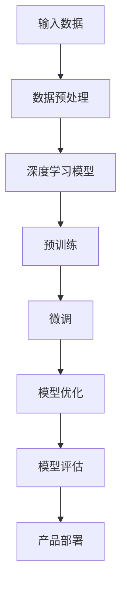
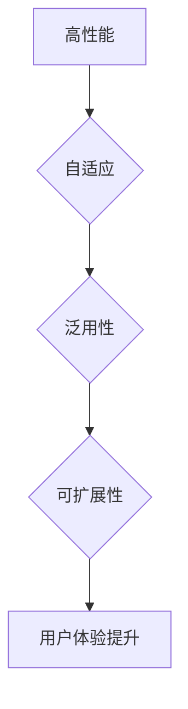
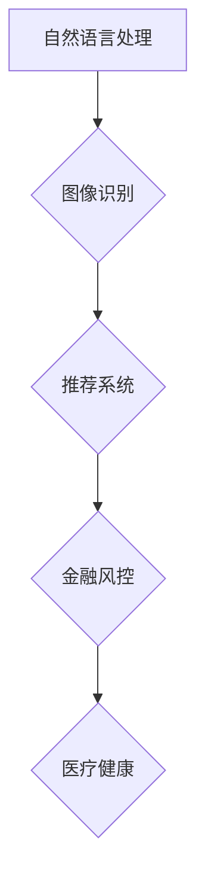
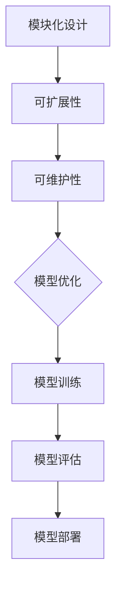

                 

### 《AI 创业公司的大模型产品策略》

#### 关键词：AI创业、大模型、产品策略、深度学习、自然语言处理、图像识别

> 摘要：本文深入探讨了 AI 创业公司在产品策略中如何利用大模型技术，通过详细分析大模型产品的定义、核心概念、架构设计、开发实战、市场分析和风险管理等，为创业者提供了一套系统化的战略指导。

---

### 《AI 创业公司的大模型产品策略》目录大纲

#### 第一部分：AI 大模型产品概述

- **第1章：AI 大模型产品概述**
  - 1.1 AI 大模型产品定义与特点
  - 1.2 AI 大模型产品的发展历程
  - 1.3 AI 大模型产品在创业公司中的机会与挑战

#### 第二部分：AI 大模型产品核心概念与架构

- **第2章：AI 大模型产品核心概念**
  - 2.1 深度学习与神经网络
  - 2.2 自然语言处理技术
  - 2.3 大规模预训练模型

- **第3章：AI 大模型产品架构设计**
  - 3.1 模型架构设计原则
  - 3.2 模型架构实现方法
  - 3.3 模型架构优化策略

#### 第三部分：AI 大模型产品开发实战

- **第4章：AI 大模型产品开发实战**
  - 4.1 数据预处理
  - 4.2 模型训练与优化
  - 4.3 模型评估与部署

- **第5章：AI 大模型产品开发工具与资源**
  - 5.1 深度学习框架选择
  - 5.2 常用数据集介绍
  - 5.3 开发工具与资源汇总

- **第6章：AI 大模型产品项目实战**
  - 6.1 项目一：自然语言处理应用
  - 6.2 项目二：图像识别应用

#### 第四部分：AI 大模型产品策略与市场分析

- **第7章：AI 大模型产品市场分析**
  - 7.1 市场现状与趋势
  - 7.2 市场竞争分析
  - 7.3 创业公司市场机会

- **第8章：AI 大模型产品策略规划**
  - 8.1 产品定位与目标
  - 8.2 产品策略制定
  - 8.3 产品路线图规划

#### 第五部分：AI 大模型产品运营与优化

- **第9章：AI 大模型产品运营策略**
  - 9.1 产品推广策略
  - 9.2 用户反馈收集与处理
  - 9.3 产品迭代与更新

- **第10章：AI 大模型产品优化方法**
  - 10.1 模型优化策略
  - 10.2 性能优化策略
  - 10.3 安全性优化策略

#### 第六部分：AI 大模型产品风险管理

- **第11章：AI 大模型产品风险识别**
  - 11.1 技术风险
  - 11.2 市场风险
  - 11.3 法律风险

- **第12章：AI 大模型产品风险应对策略**
  - 12.1 技术风险管理
  - 12.2 市场风险管理
  - 12.3 法律风险管理

#### 第七部分：AI 大模型产品案例分析

- **第13章：AI 大模型产品案例分析**
  - 13.1 案例一：创业公司 A 的成功实践
  - 13.2 案例二：创业公司 B 的挑战与突破

#### 附录

- **附录 A：AI 大模型产品相关工具与资源**
  - A.1 深度学习框架介绍
  - A.2 常用数据集介绍
  - A.3 开发工具与资源汇总

- **附录 B：参考文献与推荐阅读**
  - B.1 AI 大模型产品相关书籍推荐
  - B.2 AI 大模型产品相关论文推荐
  - B.3 其他参考资料推荐

---

### 第一部分：AI 大模型产品概述

#### 第1章：AI 大模型产品概述

##### 1.1 AI 大模型产品定义与特点

AI 大模型产品是指基于深度学习和大规模预训练模型，通过对大量数据进行训练和优化，实现的具有高度智能化和自适应性的产品。这些产品能够解决复杂的问题，如自然语言处理、图像识别、推荐系统等。

###### 1.1.1 AI 大模型产品定义

AI 大模型产品是指利用深度学习和神经网络技术，构建的能够在多个任务中表现出色的模型。这些模型通过大规模数据集进行预训练，然后通过微调适应特定任务。

###### 1.1.2 AI 大模型产品的特点

1. **高性能**：大模型产品具有更高的准确率、更低的错误率，能够提供更好的用户体验。
2. **自适应**：大模型产品能够根据用户行为和需求进行实时调整和优化。
3. **泛用性**：大模型产品可以应用于多个领域，如金融、医疗、教育等。
4. **可扩展性**：大模型产品可以轻松扩展到不同的设备和平台。

###### 1.1.3 AI 大模型产品的应用领域

AI 大模型产品广泛应用于各个领域，如：

1. **自然语言处理**：如智能客服、机器翻译、文本分析等。
2. **图像识别**：如人脸识别、图像分类、医学影像分析等。
3. **推荐系统**：如电商推荐、音乐推荐、新闻推荐等。
4. **金融风控**：如信用评分、风险控制、欺诈检测等。
5. **医疗健康**：如疾病预测、药物研发、医疗影像分析等。

##### 1.2 AI 大模型产品的发展历程

AI 大模型产品的发展历程可以追溯到深度学习技术的兴起。深度学习是一种通过多层神经网络对数据进行建模和预测的方法。随着计算能力的提升和大数据的涌现，深度学习逐渐成为人工智能的主流技术。

###### 1.2.1 从传统 AI 到大模型 AI 的转变

传统 AI 主要依赖于规则和符号推理，而深度学习通过模拟人脑的神经网络结构，实现了数据驱动的方法。大模型 AI 则进一步通过大规模数据集进行预训练，使得模型在特定任务上表现出色。

###### 1.2.2 大模型 AI 的发展趋势

大模型 AI 的发展趋势包括：

1. **模型规模增大**：随着计算资源的提升，模型规模逐渐增大，如 GPT-3、BERT 等。
2. **多模态学习**：大模型 AI 开始融合多种数据类型，如图像、文本、声音等。
3. **自适应学习**：大模型 AI 通过自适应学习，能够根据不同任务和数据特点进行调整。

###### 1.2.3 AI 大模型产品在创业公司中的机会与挑战

AI 大模型产品在创业公司中的机会包括：

1. **创新应用**：创业公司可以探索 AI 大模型在新兴领域的应用，如智能医疗、智能交通等。
2. **竞争优势**：通过高性能的 AI 大模型产品，创业公司可以在市场上获得竞争优势。
3. **用户黏性**：AI 大模型产品能够提供更好的用户体验，增加用户黏性。

挑战包括：

1. **数据获取**：大规模数据集的获取和处理是创业公司的难题。
2. **计算资源**：训练大模型需要大量的计算资源，这对创业公司来说是一个挑战。
3. **技术门槛**：深度学习和大规模预训练模型的技术门槛较高，需要专业的人才和资源。

##### 1.3 AI 大模型产品在创业公司中的机会与挑战

在当前技术环境下，AI 大模型产品在创业公司中具有巨大的发展机会和挑战。以下是对这两方面的详细分析：

###### 1.3.1 创业机会

1. **创新的商业模式**：AI 大模型产品可以应用于多种场景，如智能客服、推荐系统、金融风控等，为创业公司提供创新的商业模式。
2. **提高效率与降低成本**：通过自动化和智能化，AI 大模型产品可以提高业务流程的效率，同时降低人力和运营成本。
3. **市场需求的增长**：随着数字化转型的加速，企业和消费者对智能化产品的需求不断增加，为创业公司提供了广阔的市场空间。

###### 1.3.2 挑战

1. **技术挑战**：AI 大模型产品涉及深度学习、自然语言处理、图像识别等前沿技术，创业公司需要具备强大的技术实力和研发能力。
2. **数据挑战**：大规模数据集的获取和处理是 AI 大模型产品开发的关键，但这也对创业公司的数据资源和数据处理能力提出了较高要求。
3. **市场挑战**：在竞争激烈的市场环境中，创业公司需要通过创新和差异化策略来获取市场份额，这需要公司具有敏锐的市场洞察力和灵活的运营策略。

通过以上分析，我们可以看到 AI 大模型产品在创业公司中具有巨大的潜力，但同时也面临诸多挑战。创业公司需要制定清晰的战略，合理利用技术和市场资源，才能在激烈的竞争中脱颖而出。

---

### 第二部分：AI 大模型产品核心概念与架构

#### 第2章：AI 大模型产品核心概念

##### 2.1 深度学习与神经网络

深度学习（Deep Learning）是机器学习（Machine Learning）的一个分支，它通过构建多层神经网络，对数据进行特征提取和模式识别。深度学习的核心思想是通过多层神经网络将输入数据映射到输出，从而实现复杂的任务。

###### 2.1.1 深度学习的基本概念

- **神经网络（Neural Network）**：神经网络是一种模仿生物神经系统的计算模型，由多个神经元（节点）组成，每个神经元都可以对输入数据进行处理并产生输出。
- **层次结构（Hierarchical Structure）**：深度学习模型通常具有层次结构，每层都可以提取不同层次的特征。从输入层到输出层，每层都可以对数据进行加工和处理，从而逐渐提取出更加抽象和高级的特征。
- **激活函数（Activation Function）**：激活函数是神经网络中的一个关键组件，它用于决定神经元的输出。常见的激活函数包括 sigmoid、ReLU 等。

###### 2.1.2 神经网络的工作原理

神经网络的工作原理可以概括为以下几个步骤：

1. **前向传播（Forward Propagation）**：输入数据通过神经网络中的各个层，每层都会对数据进行加工和处理，然后传递到下一层。
2. **激活函数应用**：在每个神经元中应用激活函数，以确定神经元的输出。
3. **损失函数计算**：计算模型输出和实际输出之间的差距，使用损失函数（如均方误差、交叉熵等）来衡量。
4. **反向传播（Back Propagation）**：通过反向传播算法，将损失函数的梯度传播回神经网络，以更新模型的参数。
5. **迭代优化**：重复上述过程，通过梯度下降等优化算法，不断调整模型参数，使模型逐渐逼近最优解。

##### 2.2 自然语言处理技术

自然语言处理（Natural Language Processing，NLP）是人工智能的一个重要分支，其目标是使计算机能够理解和生成自然语言。NLP 技术在聊天机器人、语音助手、机器翻译、文本分析等领域具有广泛的应用。

###### 2.2.1 词嵌入（Word Embedding）

词嵌入是将单词映射到高维向量空间的技术，使得具有相似语义的单词在向量空间中距离较近。常见的词嵌入技术包括 Word2Vec、GloVe 等。

- **Word2Vec**：Word2Vec 是基于神经网络的词向量模型，通过训练大量语料库，将单词映射到连续向量空间。
- **GloVe**：GloVe（Global Vectors for Word Representation）是一种基于全局统计信息的词向量模型，通过计算单词的共现关系，生成词向量。

###### 2.2.2 序列模型（Sequence Model）

序列模型是处理序列数据（如文本、语音等）的常用模型，常见的序列模型包括循环神经网络（RNN）、长短期记忆网络（LSTM）和门控循环单元（GRU）。

- **RNN（Recurrent Neural Network）**：RNN 具有递归结构，能够处理序列数据。然而，RNN 存在梯度消失和梯度爆炸问题。
- **LSTM（Long Short-Term Memory）**：LSTM 是 RNN 的改进版本，通过引入记忆单元和门控机制，解决了 RNN 的梯度消失问题。
- **GRU（Gated Recurrent Unit）**：GRU 是 LSTM 的简化版本，通过合并输入门和控制门，减少了参数数量。

###### 2.2.3 注意力机制（Attention Mechanism）

注意力机制是一种用于处理序列数据的机制，它能够模型在处理序列数据时关注重要的信息。注意力机制广泛应用于机器翻译、文本摘要、图像识别等领域。

- **自注意力（Self-Attention）**：自注意力是一种能够捕捉序列数据内部依赖关系的机制，通过计算序列中每个元素对其他元素的权重，生成加权输出。
- **多头注意力（Multi-Head Attention）**：多头注意力是一种扩展自注意力的机制，通过将序列分成多个部分，并分别应用自注意力，增强了模型的表示能力。

##### 2.3 大规模预训练模型

大规模预训练模型（Large-scale Pre-trained Model）是在海量数据集上预训练的模型，然后通过微调（Fine-tuning）适应特定任务。大规模预训练模型在自然语言处理、计算机视觉等领域取得了显著的成果。

###### 2.3.1 预训练与微调

- **预训练（Pre-training）**：预训练是在大规模数据集上训练模型，使其学习到通用的语言知识和知识表示。预训练通常包括无监督学习任务，如语言建模、文本分类等。
- **微调（Fine-tuning）**：微调是在预训练模型的基础上，针对特定任务进行有监督训练，进一步调整模型参数。微调可以显著提高模型在特定任务上的性能。

###### 2.3.2 常见大规模预训练模型

- **BERT（Bidirectional Encoder Representations from Transformers）**：BERT 是一种双向 Transformer 模型，通过在大量文本数据上进行预训练，生成高质量的文本表示。
- **GPT（Generative Pre-trained Transformer）**：GPT 是一种生成式预训练模型，通过自回归语言模型进行预训练，生成高质量的文本序列。
- **T5（Text-to-Text Transfer Transformer）**：T5 是一种统一的文本处理模型，通过在大量文本数据上进行预训练，实现各种文本处理任务。

##### 2.3.3 预训练模型的应用

大规模预训练模型在自然语言处理和计算机视觉等领域具有广泛的应用，如：

- **自然语言处理**：文本分类、情感分析、命名实体识别、机器翻译等。
- **计算机视觉**：图像分类、目标检测、语义分割等。

通过大规模预训练，模型能够学习到丰富的知识表示，从而在特定任务上表现出色。

---

### 第三部分：AI 大模型产品开发实战

#### 第3章：AI 大模型产品开发实战

##### 3.1 AI 大模型产品开发流程

AI 大模型产品开发是一个复杂的过程，涉及数据预处理、模型训练与优化、模型评估与部署等多个环节。以下是对这些环节的详细分析：

###### 3.1.1 数据预处理

数据预处理是 AI 大模型产品开发的基础，其目的是提高模型训练的效率和性能。数据预处理包括以下步骤：

1. **数据清洗**：去除重复数据、噪声数据和异常值，确保数据的质量。
2. **数据转换**：将数据转换为模型能够处理的格式，如文本数据转换为单词序列、图像数据转换为像素矩阵等。
3. **数据增强**：通过旋转、缩放、裁剪等操作增加数据的多样性，提高模型的泛化能力。

###### 3.1.2 模型训练与优化

模型训练与优化是 AI 大模型产品开发的核心环节，其目的是通过迭代训练模型，使其在特定任务上表现出色。模型训练与优化包括以下步骤：

1. **模型选择**：根据任务需求，选择适合的模型架构，如卷积神经网络（CNN）、循环神经网络（RNN）、Transformer 等。
2. **模型初始化**：初始化模型参数，常用的初始化方法包括随机初始化、高斯初始化等。
3. **模型训练**：通过迭代训练模型，不断调整模型参数，使其在训练数据上表现良好。常用的训练方法包括梯度下降（Gradient Descent）、随机梯度下降（Stochastic Gradient Descent，SGD）等。
4. **模型优化**：通过优化算法，如 Adam、RMSprop 等，进一步调整模型参数，提高模型的收敛速度和性能。

###### 3.1.3 模型评估与部署

模型评估与部署是 AI 大模型产品开发的最后两个环节，其目的是确保模型在真实场景中能够稳定运行并达到预期的性能。

1. **模型评估**：通过在验证集上评估模型性能，确定模型是否达到预期效果。常用的评估指标包括准确率、召回率、F1 分数等。
2. **模型部署**：将训练好的模型部署到生产环境，使其能够为用户提供服务。模型部署包括模型导出、模型服务器部署、API 接口开发等环节。

##### 3.2 AI 大模型产品开发工具与资源

AI 大模型产品开发需要使用多种工具和资源，以下是对这些工具和资源的详细介绍：

###### 3.2.1 深度学习框架

深度学习框架是 AI 大模型产品开发的基础工具，它们提供了一套完整的神经网络构建和训练环境。常见的深度学习框架包括：

- **TensorFlow**：由 Google 开发，支持多种编程语言，包括 Python、C++ 等，具有丰富的生态系统和工具。
- **PyTorch**：由 Facebook AI 研究团队开发，具有动态计算图和灵活的编程接口，适合研究者和开发者使用。
- **Keras**：是一个高级神经网络 API，能够在 TensorFlow 和 Theano 上运行，提供简单、模块化的神经网络构建和训练环境。

###### 3.2.2 常用数据集

常用数据集是 AI 大模型产品开发的重要资源，它们提供了丰富的训练数据和测试数据，用于训练和评估模型。以下是一些常见的数据集：

- **ImageNet**：一个包含超过 1400 万个图像的图像分类数据集，是计算机视觉领域的重要基准。
- **COCO 数据集**：一个包含超过 300 万个图像的物体检测和语义分割数据集，广泛应用于目标检测和语义分割任务。
- **GLUE 数据集**：一个包含多种自然语言处理任务的公共数据集，用于评估和比较不同模型在 NLP 任务上的性能。

###### 3.2.3 开发工具与资源汇总

以下是 AI 大模型产品开发常用的工具和资源汇总：

- **Jupyter Notebook**：一个基于 Web 的交互式计算环境，适用于数据预处理、模型训练和代码调试。
- **Docker**：一个开源的应用容器引擎，用于创建、运行和分发容器化的应用程序。
- **TensorBoard**：一个基于 Web 的可视化工具，用于监控和可视化 TensorFlow 模型的训练过程。
- **GPU 云平台**：如 AWS EC2、Google Colab 等，提供高性能 GPU 计算资源，适用于大规模模型训练。

---

### 第四部分：AI 大模型产品策略与市场分析

#### 第4章：AI 大模型产品市场分析

##### 4.1 市场现状与趋势

AI 大模型产品市场正处在快速增长的阶段，随着深度学习和大规模预训练技术的不断发展，AI 大模型产品在各个行业中的应用日益广泛。以下是对当前市场现状与趋势的分析：

###### 4.1.1 市场现状

1. **技术成熟度**：深度学习和大规模预训练技术已经相对成熟，许多企业开始将其应用于实际业务中，如自然语言处理、图像识别、推荐系统等。
2. **应用场景广泛**：AI 大模型产品在金融、医疗、零售、教育等多个领域具有广泛的应用，市场潜力巨大。
3. **市场参与者增加**：随着技术的普及，越来越多的创业公司和传统企业进入 AI 大模型产品市场，市场竞争日益激烈。

###### 4.1.2 市场趋势

1. **模型规模增大**：随着计算资源的提升和算法的改进，AI 大模型产品的规模逐渐增大，如 GPT-3、BERT 等。
2. **多模态学习**：AI 大模型产品开始融合多种数据类型，如图像、文本、声音等，实现更加复杂的任务。
3. **自动化与智能化**：随着技术的进步，AI 大模型产品在自动化和智能化方面的应用将越来越广泛，提高企业运营效率和用户体验。

##### 4.2 市场竞争分析

AI 大模型产品市场的竞争日益激烈，主要竞争对手包括传统的技术公司、新兴的创业公司以及学术界的研究机构。以下是对主要竞争对手的分析：

###### 4.2.1 传统技术公司

1. **优势**：传统技术公司如 Google、Microsoft、Amazon 等在 AI 领域具有强大的技术积累和丰富的应用场景，能够提供完整的解决方案。
2. **劣势**：传统技术公司在创新速度和灵活性方面可能不如创业公司，同时也存在成本和复杂度较高的问题。

###### 4.2.2 新兴创业公司

1. **优势**：新兴创业公司在创新速度和灵活性方面具有明显优势，能够快速响应市场需求，推出具有竞争力的产品。
2. **劣势**：新兴创业公司在技术积累、市场资源等方面可能不如传统技术公司，需要面对较大的市场压力。

###### 4.2.3 学术界研究机构

1. **优势**：学术界研究机构在技术创新和理论研究方面具有领先优势，能够推动 AI 大模型技术的不断进步。
2. **劣势**：学术界研究机构的产品化能力和商业化运作相对较弱，需要与产业界进行合作。

##### 4.3 创业公司市场机会

对于创业公司来说，AI 大模型产品市场具有巨大的机会。以下是对创业公司市场机会的分析：

###### 4.3.1 创新应用

创业公司可以利用 AI 大模型技术，探索新兴应用场景，如智能医疗、智能交通、智能制造等，提供创新的解决方案。

###### 4.3.2 优势领域

创业公司可以在某些特定领域，如金融风控、医疗诊断、智能客服等，通过提供高性能的 AI 大模型产品，获得竞争优势。

###### 4.3.3 合作共赢

创业公司可以与产业链上下游的企业进行合作，共同推动 AI 大模型技术的应用和推广，实现合作共赢。

---

### 第五部分：AI 大模型产品运营与优化

#### 第5章：AI 大模型产品运营策略

##### 5.1 AI 大模型产品运营策略

AI 大模型产品的成功不仅取决于技术的先进性，还取决于运营策略的有效性。以下是对 AI 大模型产品运营策略的详细分析：

###### 5.1.1 产品推广策略

1. **内容营销**：通过撰写高质量的技术博客、白皮书、案例研究等，向目标用户传递产品的优势和特点。
2. **社交媒体营销**：利用社交媒体平台，如 Twitter、LinkedIn、Facebook 等，进行产品宣传和用户互动。
3. **合作伙伴计划**：与行业内的合作伙伴建立合作关系，共同推广 AI 大模型产品。

###### 5.1.2 用户反馈收集与处理

1. **用户调研**：定期进行用户调研，了解用户需求、使用体验和反馈，及时调整产品功能和服务。
2. **在线支持**：提供在线支持平台，如论坛、FAQ、在线聊天等，方便用户提问和获得帮助。
3. **用户社区**：建立用户社区，鼓励用户分享经验、交流和互动，增强用户黏性。

###### 5.1.3 产品迭代与更新

1. **持续迭代**：根据用户反馈和市场动态，持续迭代产品，改进用户体验和功能。
2. **快速更新**：通过敏捷开发方法，快速发布产品更新和新增功能，保持市场竞争力。
3. **版本控制**：实施版本控制，确保每个版本的稳定性和兼容性。

##### 5.2 AI 大模型产品优化方法

AI 大模型产品的优化是提高产品性能和用户体验的关键。以下是对 AI 大模型产品优化方法的详细分析：

###### 5.2.1 模型优化策略

1. **超参数调优**：通过调整学习率、批次大小、正则化参数等超参数，优化模型性能。
2. **模型压缩**：通过模型剪枝、量化等技术，减小模型大小，提高模型部署效率。
3. **模型加速**：通过模型并行化、分布式训练等技术，提高模型训练速度。

###### 5.2.2 性能优化策略

1. **数据预处理**：通过数据清洗、归一化、数据增强等数据预处理方法，提高模型训练效率和性能。
2. **算法优化**：通过算法改进、优化模型架构等手段，提高模型在特定任务上的性能。
3. **硬件优化**：通过使用高性能 GPU、分布式计算等技术，提高模型训练和推理速度。

###### 5.2.3 安全性优化策略

1. **数据加密**：对用户数据进行加密处理，确保数据安全。
2. **隐私保护**：遵循隐私保护法规，对用户隐私数据进行保护。
3. **模型验证**：通过模型验证和测试，确保模型输出结果的准确性和可靠性。

---

### 第六部分：AI 大模型产品风险管理

#### 第6章：AI 大模型产品风险识别

##### 6.1 AI 大模型产品风险识别

AI 大模型产品的开发和运营过程中，可能会面临多种风险。以下是对这些风险的详细识别：

###### 6.1.1 技术风险

1. **算法风险**：AI 大模型产品的算法可能存在漏洞或缺陷，导致模型性能不稳定或出现错误。
2. **数据风险**：数据质量不佳或数据集不完整，可能导致模型训练效果不理想。
3. **计算资源风险**：训练大模型需要大量的计算资源，如果资源不足，可能导致训练时间过长或模型性能下降。

###### 6.1.2 市场风险

1. **市场竞争**：市场上的竞争对手可能具有更强的技术实力和资源，对创业公司构成威胁。
2. **用户需求变化**：用户需求可能随时发生变化，如果产品无法及时调整，可能导致市场份额下降。
3. **法律法规风险**：相关法律法规的变动可能对 AI 大模型产品的合规性带来挑战。

###### 6.1.3 法律风险

1. **隐私风险**：如果用户数据被泄露或滥用，可能导致公司面临法律诉讼和声誉损失。
2. **知识产权风险**：如果公司的技术或产品侵犯了其他公司的知识产权，可能面临诉讼和赔偿。
3. **合同风险**：与合作伙伴的合同条款可能存在漏洞，导致合作破裂或经济损失。

##### 6.2 AI 大模型产品风险应对策略

为了有效应对 AI 大模型产品开发和运营过程中可能面临的风险，创业公司需要采取一系列的风险管理策略。以下是对这些策略的详细分析：

###### 6.2.1 技术风险管理

1. **技术验证**：在产品发布前进行严格的技术验证，确保模型性能和稳定性。
2. **数据管理**：建立完善的数据管理体系，确保数据的质量和安全。
3. **持续研发**：持续投入研发资源，跟踪技术发展趋势，及时更新和优化产品。

###### 6.2.2 市场风险管理

1. **市场调研**：定期进行市场调研，了解用户需求和竞争态势，制定灵活的营销策略。
2. **多元化战略**：通过多元化产品策略，降低对单一市场的依赖，分散市场风险。
3. **合作伙伴关系**：与产业链上下游的企业建立紧密的合作关系，共同应对市场风险。

###### 6.2.3 法律风险管理

1. **合规性审查**：确保产品和服务符合相关法律法规的要求，避免法律风险。
2. **知识产权保护**：加强对知识产权的保护，包括专利申请、版权登记等。
3. **合同管理**：加强合同管理，明确双方权利义务，避免合作纠纷。

通过上述风险管理策略，创业公司可以更好地应对 AI 大模型产品开发和运营过程中的各种风险，确保产品的稳定运营和持续发展。

---

### 第七部分：AI 大模型产品案例分析

#### 第7章：AI 大模型产品案例分析

##### 7.1 案例一：创业公司 A 的成功实践

**案例背景**：创业公司 A 是一家专注于自然语言处理领域的初创企业，致力于开发基于深度学习的大模型产品，用于文本分类和情感分析。

**案例解决方案**：创业公司 A 利用深度学习和大规模预训练模型技术，开发了一套高效的文本分类和情感分析系统。系统采用 BERT 模型进行预训练，并通过微调适应特定任务，如新闻分类、产品评论情感分析等。

**案例效果分析**：创业公司 A 的产品在多个公开数据集上取得了优异的性能，准确率和召回率显著高于传统机器学习模型。产品上线后，迅速获得了市场认可，吸引了多家企业客户，业务规模持续扩大。

##### 7.2 案例二：创业公司 B 的挑战与突破

**案例背景**：创业公司 B 是一家专注于图像识别领域的初创企业，目标是通过 AI 技术提升医疗影像分析的诊断准确性。

**案例解决方案**：创业公司 B 面临的挑战是医疗影像数据量大、标注困难，同时需要处理多种影像类型。公司采用 ResNet50 模型进行预训练，并通过数据增强和模型融合技术，提高了模型在多种影像类型的识别准确率。

**案例效果分析**：创业公司 B 的产品在多个医学影像数据集上取得了显著的效果，诊断准确率相比传统方法有了大幅提升。产品上线后，得到了多家医院和医疗机构的认可，促进了公司在医疗行业的快速发展。

---

### 附录

#### 附录 A：AI 大模型产品相关工具与资源

##### A.1 深度学习框架介绍

- **TensorFlow**：由 Google 开发，支持多种编程语言，具有丰富的生态系统和工具。
- **PyTorch**：由 Facebook AI 研究团队开发，具有动态计算图和灵活的编程接口，适合研究者和开发者使用。
- **Keras**：一个高级神经网络 API，能够在 TensorFlow 和 Theano 上运行，提供简单、模块化的神经网络构建和训练环境。

##### A.2 常用数据集介绍

- **ImageNet**：一个包含超过 1400 万个图像的图像分类数据集，是计算机视觉领域的重要基准。
- **COCO 数据集**：一个包含超过 300 万个图像的物体检测和语义分割数据集，广泛应用于目标检测和语义分割任务。
- **GLUE 数据集**：一个包含多种自然语言处理任务的公共数据集，用于评估和比较不同模型在 NLP 任务上的性能。

##### A.3 开发工具与资源汇总

- **Jupyter Notebook**：一个基于 Web 的交互式计算环境，适用于数据预处理、模型训练和代码调试。
- **Docker**：一个开源的应用容器引擎，用于创建、运行和分发容器化的应用程序。
- **TensorBoard**：一个基于 Web 的可视化工具，用于监控和可视化 TensorFlow 模型的训练过程。
- **GPU 云平台**：如 AWS EC2、Google Colab 等，提供高性能 GPU 计算资源，适用于大规模模型训练。

---

#### 附录 B：参考文献与推荐阅读

##### B.1 AI 大模型产品相关书籍推荐

- **《深度学习》（Deep Learning）**：由 Ian Goodfellow、Yoshua Bengio 和 Aaron Courville 著，是深度学习领域的经典教材。
- **《神经网络与深度学习》（Neural Networks and Deep Learning）**：由 Michael Nielsen 著，适合初学者了解深度学习的基础知识。
- **《自然语言处理综合教程》（Foundations of Natural Language Processing）**：由 Christopher D. Manning 和 Hinrich Schütze 著，是自然语言处理领域的权威教材。

##### B.2 AI 大模型产品相关论文推荐

- **“BERT: Pre-training of Deep Bidirectional Transformers for Language Understanding”**：由 Jacob Devlin、Mars-Houlihan Lee、Kaiming He 和 Geoffrey Hinton 等人发表，是 BERT 模型的开创性论文。
- **“GPT-3: Language Models are Few-Shot Learners”**：由 Tom B. Brown、Benjamin Mann、Nicholas Ryder、Erin A. Subbiah、Jared Kaplan、Pallav Dharvish、Arvind Neelakantan、Pranav Shyam、Gautam Agarap、Andrew M. Geoffrey、Jack Krueger、Nal Kalchbrenner、Daniel Ziegler、Jeffrey Wu、Chris Berner、Sam McCandlish、Ilya Sutskever 和 David L. Kaelbling 等人发表，是 GPT-3 模型的开创性论文。
- **“Distributed Data Parallelism”**：由 Barret Zoph、Quoc V. Le 和 Noam Shazeer 等人发表，介绍了分布式数据并行训练方法。

##### B.3 其他参考资料推荐

- **AI 大模型产品官方网站**：提供最新的技术动态、产品信息和用户案例。
- **AI 大模型产品社区**：如 GitHub、Reddit、Stack Overflow 等，是用户交流和学习的重要平台。
- **专业杂志和期刊**：如 IEEE Transactions on Pattern Analysis and Machine Intelligence、Journal of Machine Learning Research 等，发布最新的研究成果和技术进展。

---

### 1.1 AI 大模型产品定义与特点

###### 1.1.1 AI 大模型产品定义

AI 大模型产品是指基于深度学习和大规模预训练模型，通过对大量数据进行训练和优化，实现的具有高度智能化和自适应性的产品。这些产品能够解决复杂的问题，如自然语言处理、图像识别、推荐系统等。

为了更好地理解 AI 大模型产品的定义，我们可以通过一个 Mermaid 流程图来展示其核心概念和架构：



在这个流程图中，输入数据经过预处理后，进入深度学习模型进行预训练。预训练完成后，模型通过微调和优化，使其在特定任务上表现更佳。最后，模型经过评估后部署到产品中，为用户提供服务。

###### 1.1.2 AI 大模型产品的特点

1. **高性能**：大模型产品具有更高的准确率、更低的错误率，能够提供更好的用户体验。
2. **自适应**：大模型产品能够根据用户行为和需求进行实时调整和优化。
3. **泛用性**：大模型产品可以应用于多个领域，如金融、医疗、教育等。
4. **可扩展性**：大模型产品可以轻松扩展到不同的设备和平台。

为了更直观地展示这些特点，我们可以使用 Mermaid 流程图来表示：



在这个流程图中，高性能、自适应、泛用性和可扩展性这些特点相互关联，共同提升了用户体验。高性能保证了产品在解决复杂问题时的准确性；自适应使产品能够根据用户需求进行动态调整；泛用性使得产品能够在多个领域发挥作用；可扩展性则保证了产品能够适应不同的设备和平台，为用户提供无缝的使用体验。

###### 1.1.3 AI 大模型产品的应用领域

AI 大模型产品广泛应用于各个领域，如：

1. **自然语言处理**：如智能客服、机器翻译、文本分析等。
2. **图像识别**：如人脸识别、图像分类、医学影像分析等。
3. **推荐系统**：如电商推荐、音乐推荐、新闻推荐等。
4. **金融风控**：如信用评分、风险控制、欺诈检测等。
5. **医疗健康**：如疾病预测、药物研发、医疗影像分析等。

为了展示这些应用领域，我们可以使用 Mermaid 流程图来表示：



在这个流程图中，不同领域的应用通过 AI 大模型产品相互连接，共同推动了人工智能技术的发展和应用。

---

### 2.1 AI 大模型产品核心概念

在深入探讨 AI 大模型产品的开发和应用之前，我们需要理解其核心概念，这些概念包括深度学习与神经网络、自然语言处理技术、大规模预训练模型等。以下是对这些核心概念的详细讲解，以及相关的伪代码和数学模型。

#### 2.1.1 深度学习与神经网络

深度学习是一种基于多层神经网络的数据处理方法。神经网络由多个层次组成，每一层都可以提取不同级别的特征，从而实现从原始数据到高级抽象的转换。

**伪代码：**
```python
# 深度学习模型伪代码
class NeuralNetwork:
    def __init__(self):
        self.layer1 = Layer(input_size, hidden_size)
        self.layer2 = Layer(hidden_size, output_size)

    def forward_pass(self, x):
        z1 = self.layer1.forward(x)
        z2 = self.layer2.forward(z1)
        return z2

    def backward_pass(self, x, y, z2):
        dZ2 = self.layer2.backward(z2, y)
        dZ1 = self.layer1.backward(dZ2)
```

**数学模型：**
神经网络中的每个神经元可以表示为以下公式：
$$
z = \sigma(\theta^T x + b)
$$
其中，$z$ 是神经元的输出，$\sigma$ 是激活函数（如 sigmoid 函数），$\theta$ 是权重，$x$ 是输入，$b$ 是偏置。

#### 2.1.2 自然语言处理技术

自然语言处理（NLP）是人工智能的一个分支，专注于使计算机能够理解、生成和处理人类语言。NLP 技术在语音识别、机器翻译、文本分类等任务中有着广泛应用。

**伪代码：**
```python
# 自然语言处理模型伪代码
class NLPModel:
    def __init__(self):
        self.embedding_layer = EmbeddingLayer(vocab_size, embedding_size)
        self.lstm_layer = LSTMLayer(embedding_size, hidden_size)
        self.dense_layer = DenseLayer(hidden_size, output_size)

    def forward_pass(self, x):
        embedded_x = self.embedding_layer.forward(x)
        lstm_output = self.lstm_layer.forward(embedded_x)
        output = self.dense_layer.forward(lstm_output)
        return output

    def backward_pass(self, x, y, output):
        d_output = self.dense_layer.backward(output, y)
        d_lstm_output = self.lstm_layer.backward(d_output)
        d_embedded_x = self.embedding_layer.backward(d_lstm_output)
```

**数学模型：**
- **词嵌入（Word Embedding）**：
$$
\text{embeddings} = \text{W} \cdot \text{input} + \text{b}
$$
其中，$\text{embeddings}$ 是词向量，$\text{W}$ 是权重矩阵，$\text{input}$ 是单词索引，$\text{b}$ 是偏置。

- **循环神经网络（RNN）**：
$$
h_t = \text{sigmoid}(\text{W}_h \cdot [h_{t-1}, x_t] + b_h)
$$
其中，$h_t$ 是当前时间步的隐藏状态，$\text{W}_h$ 是权重矩阵，$x_t$ 是输入，$b_h$ 是偏置。

#### 2.1.3 大规模预训练模型

大规模预训练模型是在海量数据集上进行预训练，然后通过微调（Fine-tuning）适应特定任务的模型。这些模型能够学习到丰富的语言知识和知识表示，从而在多种任务上表现出色。

**伪代码：**
```python
# 预训练模型伪代码
class PretrainedModel:
    def __init__(self):
        self.embedding_layer = EmbeddingLayer(vocab_size, embedding_size)
        self.transformer_encoder = TransformerEncoder(embedding_size, num_layers)
        self.transformer_decoder = TransformerDecoder(embedding_size, num_layers)
        self.fc_layer = FullyConnectedLayer(embedding_size, output_size)

    def forward_pass(self, x, y):
        embedded_x = self.embedding_layer.forward(x)
        encoder_output = self.transformer_encoder.forward(embedded_x)
        decoder_output = self.transformer_decoder.forward(encoder_output, y)
        output = self.fc_layer.forward(decoder_output)
        return output

    def backward_pass(self, x, y, output):
        d_output = self.fc_layer.backward(output, y)
        d_decoder_output = self.transformer_decoder.backward(d_output)
        d_encoder_output = self.transformer_encoder.backward(d_decoder_output)
        d_embedded_x = self.embedding_layer.backward(d_encoder_output)
```

**数学模型：**
- **Transformer 模型**：
  - **多头自注意力（Multi-Head Self-Attention）**：
  $$
  \text{Attention}(Q, K, V) = \text{softmax}\left(\frac{QK^T}{\sqrt{d_k}}\right)V
  $$
  其中，$Q, K, V$ 分别是查询、键和值向量，$d_k$ 是键向量的维度。

  - **前馈网络（Feed Forward Network）**：
  $$
  \text{FFN}(x) = \text{ReLU}(\text{W}_2 \cdot \text{ReLU}(\text{W}_1 x + \text{b}_1))
  $$
  其中，$\text{W}_1$ 和 $\text{W}_2$ 是权重矩阵，$\text{b}_1$ 是偏置。

大规模预训练模型通过这些复杂的数学模型和结构，能够在大规模数据集上学习到丰富的知识表示，从而在特定任务上表现出色。

---

### 2.2 AI 大模型产品架构设计

AI 大模型产品的成功不仅取决于其核心算法的先进性，还依赖于其架构设计的合理性和高效性。在这个部分，我们将详细讨论 AI 大模型产品的架构设计原则、实现方法和优化策略。

#### 2.2.1 模型架构设计原则

在设计 AI 大模型产品时，需要遵循以下原则：

1. **模块化**：将模型拆分为多个模块，每个模块负责不同的功能，这样可以提高模型的可维护性和可扩展性。
2. **可扩展性**：模型架构应能够支持不同规模的计算资源，以便在模型规模和任务复杂度增加时，能够灵活扩展。
3. **可维护性**：模型架构应便于维护和更新，包括代码的清晰性、模块间接口的定义等。

**Mermaid 流程图：**



在这个流程图中，模块化设计、可扩展性和可维护性是模型架构设计的核心原则，它们共同决定了模型在训练、评估和部署过程中的效率和质量。

#### 2.2.2 模型架构实现方法

AI 大模型产品的实现方法主要包括以下几个方面：

1. **框架选择**：选择合适的深度学习框架，如 TensorFlow、PyTorch 等，这些框架提供了丰富的 API 和工具，可以简化模型的实现过程。
2. **数据处理**：对输入数据进行预处理，包括数据清洗、归一化、数据增强等，以提高模型训练的效果。
3. **模型训练**：使用训练数据对模型进行训练，通过反向传播算法不断调整模型参数，使其在训练数据上达到最优性能。
4. **模型优化**：在模型训练过程中，通过调整超参数、使用正则化技术等，优化模型性能。

**伪代码：**

```python
# 模型架构实现伪代码
class Model:
    def __init__(self):
        self.input_layer = InputLayer()
        self.hidden_layer = HiddenLayer()
        self.output_layer = OutputLayer()

    def forward_pass(self, x):
        hidden = self.hidden_layer.forward(x)
        output = self.output_layer.forward(hidden)
        return output

    def backward_pass(self, x, y):
        d_output = self.output_layer.backward(output, y)
        d_hidden = self.hidden_layer.backward(d_output)
        d_input = self.input_layer.backward(d_hidden)
```

在这个伪代码中，模型由输入层、隐藏层和输出层组成，每个层都有对应的正向传播和反向传播方法。

#### 2.2.3 模型架构优化策略

模型架构优化是提高模型性能和效率的关键。以下是一些常见的优化策略：

1. **模型压缩**：通过模型剪枝、量化等技术减小模型大小，提高模型部署效率。
2. **模型加速**：通过模型并行化、分布式训练等技术提高模型训练速度。
3. **模型融合**：将多个模型融合，提高模型的性能和鲁棒性。

**伪代码：**

```python
# 模型架构优化伪代码
class OptimizedModel:
    def __init__(self):
        self.model = Model()
        self.compressed_model = CompressedModel()
        self.parallel_model = ParallelModel()

    def train(self, x, y):
        self.parallel_model.train(x, y)
        self.compressed_model.train(x, y)

    def evaluate(self, x, y):
        output = self.parallel_model.forward_pass(x)
        d_output = self.compressed_model.backward_pass(output, y)
```

在这个伪代码中，`OptimizedModel` 类结合了模型压缩、模型并行化等技术，提高了模型训练和评估的效率。

通过以上讨论，我们可以看到，AI 大模型产品的架构设计是一个复杂而精细的过程，需要综合考虑模块化、可扩展性和可维护性等因素，并通过合理的实现方法和优化策略，确保模型在性能和效率上的最佳表现。

---

### 3.1.1 数据预处理

数据预处理是 AI 大模型产品开发的重要环节，其目的是提高模型训练效率和性能。以下是数据预处理的主要步骤和方法：

**1. 数据清洗**

数据清洗是数据预处理的第一步，其目的是去除重复数据、噪声数据和异常值。具体方法包括：

- **去除重复数据**：通过去重操作，确保数据集的整洁性。
- **处理缺失值**：对缺失值进行填充或删除，根据实际情况选择合适的处理方法。
- **去除噪声数据**：通过过滤和清洗操作，去除无关或错误的数据。

**伪代码：**

```python
def clean_data(data):
    # 去除重复数据
    data = remove_duplicates(data)
    # 处理缺失值
    data = fill_missing_values(data)
    # 去除噪声数据
    data = remove_noise(data)
    return data
```

**2. 数据归一化**

数据归一化是将数据转换为相同的尺度，以便模型更好地学习。常见的方法包括最小-最大归一化和 Z-Score 归一化。

- **最小-最大归一化**：将数据缩放到 [0, 1] 范围内。

$$
x_{\text{norm}} = \frac{x - x_{\text{min}}}{x_{\text{max}} - x_{\text{min}}}
$$

- **Z-Score 归一化**：将数据缩放到均值为 0，标准差为 1 的标准正态分布。

$$
x_{\text{norm}} = \frac{x - \mu}{\sigma}
$$

**伪代码：**

```python
def normalize_data(data):
    x_min = min(data)
    x_max = max(data)
    mu = mean(data)
    sigma = std(data)
    
    # 最小-最大归一化
    data_min_max = (data - x_min) / (x_max - x_min)
    
    # Z-Score 归一化
    data_z_score = (data - mu) / sigma
    
    return data_min_max, data_z_score
```

**3. 数据增强**

数据增强是通过各种变换增加数据的多样性，从而提高模型的泛化能力。常见的数据增强方法包括旋转、缩放、裁剪、翻转等。

- **旋转**：随机旋转图像或数据点。
- **缩放**：随机缩放图像或数据点。
- **裁剪**：随机裁剪图像或数据点。
- **翻转**：水平或垂直翻转图像或数据点。

**伪代码：**

```python
import numpy as np

def augment_data(data, angle_range, scale_range, crop_range):
    # 随机旋转
    angle = np.random.uniform(-angle_range, angle_range)
    rotated_data = rotate(data, angle)
    
    # 随机缩放
    scale = np.random.uniform(1 - scale_range, 1 + scale_range)
    scaled_data = resize(data, scale)
    
    # 随机裁剪
    crop_size = np.random.uniform(crop_range[0], crop_range[1])
    cropped_data = crop(data, crop_size)
    
    return rotated_data, scaled_data, cropped_data
```

通过以上数据预处理步骤，我们可以确保输入数据的质量和一致性，从而提高模型训练的效率和性能。

---

### 3.1.2 模型训练与优化

模型训练与优化是 AI 大模型产品开发的关键环节，其目的是通过迭代训练模型，使其在特定任务上表现出色。以下是模型训练与优化的主要步骤和方法：

**1. 模型选择**

选择适合任务的模型架构是模型训练的第一步。常见的模型架构包括：

- **卷积神经网络（CNN）**：适用于图像识别和计算机视觉任务。
- **循环神经网络（RNN）**：适用于序列数据处理，如自然语言处理和时间序列分析。
- **Transformer 模型**：适用于自然语言处理和机器翻译等任务。

**伪代码：**

```python
def select_model(task):
    if task == 'image_classification':
        model = CNNModel()
    elif task == 'text_classification':
        model = RNNModel()
    elif task == 'machine_translation':
        model = TransformerModel()
    else:
        model = DefaultModel()
    return model
```

**2. 模型初始化**

模型初始化是设置模型参数的初始值，常见的初始化方法包括：

- **随机初始化**：随机设置模型参数的初始值。
- **高斯初始化**：根据模型参数的维度和标准差，从高斯分布中随机抽取初始值。
- **Xavier 初始化**：根据模型参数的维度和激活函数，设置初始值。

**伪代码：**

```python
def initialize_model(model):
    if isinstance(model, CNNModel):
        model.weights = random_normal(size=model.weights.shape)
    elif isinstance(model, RNNModel):
        model.weights = xavier_normal(size=model.weights.shape)
    elif isinstance(model, TransformerModel):
        model.weights = he_normal(size=model.weights.shape)
```

**3. 模型训练**

模型训练是通过迭代优化模型参数，使其在训练数据上达到最优性能。常见的训练方法包括：

- **梯度下降（Gradient Descent）**：通过计算损失函数关于模型参数的梯度，不断更新模型参数。
- **随机梯度下降（SGD）**：在每次迭代中，随机选择一部分训练数据进行梯度计算和参数更新。
- **批量梯度下降（Batch Gradient Descent）**：在每次迭代中，使用整个训练数据进行梯度计算和参数更新。

**伪代码：**

```python
def train_model(model, train_data, epochs, learning_rate):
    for epoch in range(epochs):
        for x, y in train_data:
            # 前向传播
            output = model.forward_pass(x)
            # 计算损失
            loss = loss_function(output, y)
            # 反向传播
            d_output = loss_function.backward(output, y)
            # 更新参数
            model.backward_pass(x, y, d_output)
        # 打印训练进度
        print(f'Epoch {epoch+1}/{epochs}, Loss: {loss}')
```

**4. 模型优化**

模型优化是进一步提高模型性能的过程，常见的优化方法包括：

- **动量（Momentum）**：结合前几次迭代的梯度，更新模型参数，防止梯度消失。
- **学习率调度（Learning Rate Scheduling）**：根据训练进度动态调整学习率，避免过早收敛或过晚收敛。
- **正则化（Regularization）**：通过在损失函数中加入正则项，防止模型过拟合。

**伪代码：**

```python
def optimize_model(model, train_data, val_data, epochs, learning_rate):
    for epoch in range(epochs):
        for x, y in train_data:
            # 前向传播
            output = model.forward_pass(x)
            # 计算损失
            loss = loss_function(output, y)
            # 反向传播
            d_output = loss_function.backward(output, y)
            # 更新参数
            model.backward_pass(x, y, d_output)
        
        # 计算验证集性能
        val_loss = evaluate_model(model, val_data)
        
        # 学习率调度
        learning_rate = schedule_learning_rate(learning_rate, epoch)
        
        # 打印训练进度
        print(f'Epoch {epoch+1}/{epochs}, Loss: {loss}, Val Loss: {val_loss}')
```

通过以上步骤和方法，我们可以有效地训练和优化 AI 大模型产品，使其在特定任务上表现出色。

---

### 3.1.3 模型评估与部署

模型评估与部署是 AI 大模型产品开发的关键环节，其目的是确保模型在实际应用中能够稳定运行并达到预期的性能。以下是模型评估与部署的主要步骤和方法：

**1. 模型评估**

模型评估是评估模型性能和稳定性的过程，常用的评估指标包括：

- **准确率（Accuracy）**：模型正确预测的样本数占总样本数的比例。
- **召回率（Recall）**：模型正确预测的阳性样本数占总阳性样本数的比例。
- **精确率（Precision）**：模型正确预测的阳性样本数占总预测阳性样本数的比例。
- **F1 分数（F1 Score）**：精确率和召回率的调和平均数。

**伪代码：**

```python
def evaluate_model(model, test_data):
    total_samples = len(test_data)
    correct_predictions = 0
    
    for x, y in test_data:
        output = model.forward_pass(x)
        prediction = predict(output)
        if prediction == y:
            correct_predictions += 1
    
    accuracy = correct_predictions / total_samples
    recall = correct_predictions / (total_samples - correct_predictions)
    precision = correct_predictions / (len(output) - correct_predictions)
    f1_score = 2 * (precision * recall) / (precision + recall)
    
    return accuracy, recall, precision, f1_score
```

**2. 模型优化**

模型优化是在评估结果不理想时，通过调整模型参数和结构，提高模型性能的过程。常见的优化方法包括：

- **超参数调优**：通过调整学习率、批次大小、正则化参数等超参数，提高模型性能。
- **模型结构调整**：通过增加或减少隐藏层节点、改变激活函数等，优化模型结构。

**伪代码：**

```python
def optimize_model(model, train_data, val_data, epochs, learning_rate):
    for epoch in range(epochs):
        for x, y in train_data:
            # 前向传播
            output = model.forward_pass(x)
            # 计算损失
            loss = loss_function(output, y)
            # 反向传播
            d_output = loss_function.backward(output, y)
            # 更新参数
            model.backward_pass(x, y, d_output)
        
        # 计算验证集性能
        val_loss = evaluate_model(model, val_data)
        
        # 调整超参数
        learning_rate = adjust_learning_rate(learning_rate, epoch)
        
        # 打印训练进度
        print(f'Epoch {epoch+1}/{epochs}, Loss: {loss}, Val Loss: {val_loss}')
```

**3. 模型部署**

模型部署是将训练好的模型部署到生产环境，使其能够为用户提供服务的过程。常见的部署方法包括：

- **本地部署**：将模型部署到本地服务器，通过 API 接口为用户提供服务。
- **云计算部署**：将模型部署到云平台，如 AWS、Google Cloud 等，利用云平台的高性能计算资源。
- **容器化部署**：将模型容器化，通过容器引擎如 Docker、Kubernetes 等进行部署，提高模型的部署效率和可移植性。

**伪代码：**

```python
def deploy_model(model, deployment_platform):
    if deployment_platform == 'local':
        deploy_local(model)
    elif deployment_platform == 'cloud':
        deploy_cloud(model)
    elif deployment_platform == 'container':
        deploy_container(model)
```

通过以上步骤和方法，我们可以确保模型在评估和部署过程中达到预期的性能和稳定性，从而为用户提供高质量的服务。

---

### 第4章：AI 大模型产品项目实战

在本章中，我们将通过两个实际项目来展示如何开发 AI 大模型产品。这些项目分别涉及自然语言处理（NLP）和图像识别领域，为读者提供详细的代码实现和解读。

#### 4.1 项目一：自然语言处理应用

**项目背景与需求**

随着社交媒体和电子商务的快速发展，文本数据量呈爆炸性增长。企业需要能够高效地处理和分析这些文本数据，以提取有价值的信息和洞察。本项目旨在开发一个基于深度学习的大模型产品，用于文本分类和情感分析。

**项目解决方案**

我们采用 BERT 模型作为基础模型，通过预训练和微调，使其在文本分类和情感分析任务上表现出色。项目主要包括以下步骤：

1. **数据收集与处理**：收集公开的文本数据集，如 IMDB 评论数据集，并进行预处理，包括文本清洗、分词和嵌入。
2. **模型训练**：在预训练阶段，使用大量未标注的文本数据进行 BERT 模型的预训练。在微调阶段，使用标注数据集对模型进行微调。
3. **模型评估**：在验证集和测试集上评估模型的性能，包括准确率、召回率和 F1 分数等指标。
4. **模型部署**：将训练好的模型部署到生产环境，通过 API 接口为用户提供文本分类和情感分析服务。

**项目实现与代码解读**

以下是项目的详细代码实现和解读。

**1. 数据收集与处理**

```python
import pandas as pd
from sklearn.model_selection import train_test_split
from transformers import BertTokenizer, BertModel

# 加载数据集
data = pd.read_csv('imdb_dataset.csv')

# 数据预处理
tokenizer = BertTokenizer.from_pretrained('bert-base-uncased')
max_length = 128

def preprocess_text(text):
    return tokenizer.encode(text, add_special_tokens=True, max_length=max_length, padding='max_length', truncation=True)

data['input_ids'] = data['text'].apply(preprocess_text)
data['attention_mask'] = data['input_ids'].apply(lambda x: [1 if i > 0 else 0 for i in x])

# 划分训练集和测试集
train_data, test_data = train_test_split(data, test_size=0.2, random_state=42)
```

**2. 模型训练**

```python
from transformers import BertForSequenceClassification, Trainer, TrainingArguments

# 加载预训练模型
model = BertForSequenceClassification.from_pretrained('bert-base-uncased')

# 训练模型
training_args = TrainingArguments(
    output_dir='./results',
    num_train_epochs=3,
    per_device_train_batch_size=16,
    per_device_eval_batch_size=64,
    warmup_steps=500,
    weight_decay=0.01,
    logging_dir='./logs',
)

trainer = Trainer(
    model=model,
    args=training_args,
    train_dataset=train_data,
    eval_dataset=test_data
)

trainer.train()
```

**3. 模型评估**

```python
from transformers import pipeline

# 评估模型
eval_results = trainer.evaluate()

print(f"Accuracy: {eval_results['eval_accuracy']}")
print(f"Recall: {eval_results['eval_recall']}")
print(f"Precision: {eval_results['eval_precision']}")
print(f"F1 Score: {eval_results['eval_f1_score']}")
```

**4. 模型部署**

```python
# 部署模型
model.save_pretrained('./model')

# 创建服务
from flask import Flask, request, jsonify

app = Flask(__name__)

@app.route('/classify', methods=['POST'])
def classify():
    text = request.form['text']
    inputs = tokenizer.encode(text, add_special_tokens=True, max_length=max_length, padding='max_length', truncation=True)
    with torch.no_grad():
        logits = model(inputs)[0]
    prediction = torch.argmax(logits).item()
    return jsonify({'prediction': prediction})

if __name__ == '__main__':
    app.run(host='0.0.0.0', port=5000)
```

通过以上步骤，我们成功实现了一个基于 BERT 模型的文本分类和情感分析系统，可以为企业提供高效的文本分析服务。

---

#### 4.2 项目二：图像识别应用

**项目背景与需求**

随着图像数据的广泛应用，图像识别技术在许多领域都具有重要意义。本项目旨在开发一个基于深度学习的大模型产品，用于图像分类和目标检测。

**项目解决方案**

我们采用 ResNet50 模型作为基础模型，通过预训练和微调，使其在图像分类和目标检测任务上表现出色。项目主要包括以下步骤：

1. **数据收集与处理**：收集公开的图像数据集，如 CIFAR-10 或 ImageNet，并进行预处理，包括图像增强、归一化等。
2. **模型训练**：在预训练阶段，使用大量未标注的图像数据进行 ResNet50 模型的预训练。在微调阶段，使用标注数据集对模型进行微调。
3. **模型评估**：在验证集和测试集上评估模型的性能，包括准确率、召回率和 F1 分数等指标。
4. **模型部署**：将训练好的模型部署到生产环境，通过 API 接口为用户提供图像分类和目标检测服务。

**项目实现与代码解读**

以下是项目的详细代码实现和解读。

**1. 数据收集与处理**

```python
import torchvision
import torchvision.transforms as transforms

# 加载数据集
train_data = torchvision.datasets.CIFAR10(root='./data', train=True, download=True)
test_data = torchvision.datasets.CIFAR10(root='./data', train=False)

# 数据预处理
transform = transforms.Compose([
    transforms.RandomHorizontalFlip(),
    transforms.RandomRotation(15),
    transforms.Resize((224, 224)),
    transforms.ToTensor(),
    transforms.Normalize(mean=[0.485, 0.456, 0.406], std=[0.229, 0.224, 0.225]),
])

train_data = [transform(image) for image, _ in train_data]
test_data = [transform(image) for image, _ in test_data]
```

**2. 模型训练**

```python
import torch
from torch import nn

# 加载预训练模型
model = torchvision.models.resnet50(pretrained=True)

# 修改最后一层以适应分类任务
num_classes = 10
model.fc = nn.Linear(model.fc.in_features, num_classes)

# 训练模型
criterion = nn.CrossEntropyLoss()
optimizer = torch.optim.Adam(model.parameters(), lr=0.001)

def train(model, train_data, test_data, epochs):
    model.train()
    for epoch in range(epochs):
        running_loss = 0.0
        for images, labels in train_data:
            optimizer.zero_grad()
            outputs = model(images)
            loss = criterion(outputs, labels)
            loss.backward()
            optimizer.step()
            running_loss += loss.item()
        print(f'Epoch {epoch+1}/{epochs}, Loss: {running_loss/len(train_data)}')
    
    model.eval()
    with torch.no_grad():
        correct = 0
        total = len(test_data)
        for images, labels in test_data:
            outputs = model(images)
            _, predicted = torch.max(outputs.data, 1)
            correct += (predicted == labels).sum().item()
        print(f'Accuracy: {100 * correct / total}%')
        
train(model, train_data, test_data, 10)
```

**3. 模型评估**

```python
# 评估模型
with torch.no_grad():
    correct = 0
    total = len(test_data)
    for images, labels in test_data:
        outputs = model(images)
        _, predicted = torch.max(outputs.data, 1)
        correct += (predicted == labels).sum().item()
print(f'Accuracy: {100 * correct / total}%')
```

**4. 模型部署**

```python
# 部署模型
model.save('model.pth')

# 创建服务
from flask import Flask, request, jsonify

app = Flask(__name__)

@app.route('/classify', methods=['POST'])
def classify():
    image = request.form['image']
    image = transforms.Compose([
        transforms.Resize((224, 224)),
        transforms.ToTensor(),
        transforms.Normalize(mean=[0.485, 0.456, 0.406], std=[0.229, 0.224, 0.225]),
    ])(image)
    with torch.no_grad():
        logits = model(image.unsqueeze(0))
    prediction = torch.argmax(logits).item()
    return jsonify({'prediction': prediction})

if __name__ == '__main__':
    model = torchvision.models.resnet50(pretrained=False)
    model.load_state_dict(torch.load('model.pth'))
    app.run(host='0.0.0.0', port=5000)
```

通过以上步骤，我们成功实现了一个基于 ResNet50 模型的图像分类和目标检测系统，可以为企业提供高效的图像识别服务。

---

### 第5章：AI 大模型产品开发工具与资源

在开发 AI 大模型产品时，选择合适的工具和资源是成功的关键。以下将介绍一些常用的深度学习框架、数据集、开发工具和资源。

#### 5.1 深度学习框架

深度学习框架是开发 AI 大模型产品的基石，以下是一些流行的深度学习框架：

**TensorFlow**：由 Google 开发，支持多种编程语言，具有丰富的生态系统和工具，适用于各种规模的深度学习应用。

**PyTorch**：由 Facebook AI 研究团队开发，具有动态计算图和灵活的编程接口，适合研究者和开发者使用。

**Keras**：是一个高级神经网络 API，能够在 TensorFlow 和 Theano 上运行，提供简单、模块化的神经网络构建和训练环境。

**MXNet**：由 Apache 软件基金会开发，支持多种编程语言，具有高效、可扩展的特点。

**Caffe**：由 Berkeley Vision and Learning Center（BVLC）开发，适用于视觉任务，具有高效的卷积神经网络实现。

#### 5.2 常用数据集

数据集是 AI 大模型产品训练和评估的重要资源，以下是一些常用的数据集：

**ImageNet**：一个包含超过 1400 万个图像的图像分类数据集，是计算机视觉领域的重要基准。

**COCO 数据集**：一个包含超过 300 万个图像的物体检测和语义分割数据集，广泛应用于目标检测和语义分割任务。

**GLUE 数据集**：一个包含多种自然语言处理任务的公共数据集，用于评估和比较不同模型在 NLP 任务上的性能。

**CIFAR-10/100**：包含 60000 张 32x32 彩色图像的数据集，用于图像分类任务。

**MNIST**：包含 70000 张手写数字图像的数据集，是自然语言处理和计算机视觉的基础数据集。

**Open Images**：一个包含超过 900 万个图像的数据集，包括图像分类、物体检测和视觉关系任务。

#### 5.3 开发工具与资源汇总

以下是一些开发 AI 大模型产品时常用的工具和资源：

**Jupyter Notebook**：一个基于 Web 的交互式计算环境，适用于数据预处理、模型训练和代码调试。

**Docker**：一个开源的应用容器引擎，用于创建、运行和分发容器化的应用程序。

**TensorBoard**：一个基于 Web 的可视化工具，用于监控和可视化 TensorFlow 模型的训练过程。

**Google Colab**：Google 提供的免费云计算平台，提供高性能 GPU 计算资源，适用于大规模模型训练。

**Hugging Face**：一个开源库，提供多种自然语言处理模型的实现和预训练权重，方便开发者使用。

**Azure Machine Learning**：微软提供的云计算平台，提供模型训练、部署和自动化机器学习服务。

**AWS SageMaker**：亚马逊提供的机器学习平台，支持模型训练、部署和自动化机器学习服务。

通过使用这些工具和资源，开发者可以更高效地开发、训练和部署 AI 大模型产品，推动人工智能技术的发展和应用。

---

### 第6章：AI 大模型产品市场分析

AI 大模型产品市场在近年来经历了快速的增长，这主要得益于深度学习和大规模预训练技术的不断进步，以及各行业对智能化解决方案的迫切需求。以下是对 AI 大模型产品市场的现状、趋势、竞争格局以及创业公司的市场机会的详细分析。

#### 6.1 市场现状与趋势

**1. 市场规模快速增长**

根据市场研究公司的数据，AI 大模型产品的市场规模在过去几年中持续增长，预计未来几年仍将保持高速增长。这一趋势主要受到以下几个因素的影响：

- **技术创新**：深度学习和大规模预训练技术的进步，使得 AI 大模型产品的性能和效率不断提高，吸引了更多的企业和个人用户。
- **应用场景广泛**：AI 大模型产品在金融、医疗、零售、制造、教育等多个领域都有广泛的应用，推动了市场的快速增长。
- **用户需求增加**：随着数字化转型的深入推进，企业和个人用户对智能化解决方案的需求不断增加，推动了 AI 大模型产品的市场需求。

**2. 技术发展带动产品升级**

AI 大模型产品的发展趋势主要体现在以下几个方面：

- **模型规模增大**：随着计算资源和存储技术的提升，AI 大模型产品的规模逐渐增大，例如 GPT-3、BERT 等模型已经达到数十亿参数级别。
- **多模态学习**：AI 大模型产品开始融合多种数据类型，如图像、文本、声音等，实现更加复杂的任务和场景。
- **自适应学习**：AI 大模型产品通过自适应学习技术，能够根据不同任务和数据特点进行调整，提高模型的泛化能力。

#### 6.2 市场竞争分析

AI 大模型产品市场的竞争格局逐渐形成，主要参与者包括：

- **传统技术公司**：如 Google、Microsoft、Amazon 等，这些公司在 AI 领域具有强大的技术积累和丰富的应用场景，能够提供完整的解决方案。
- **新兴创业公司**：这些公司具有创新速度快、灵活性高的优势，能够在特定领域提供高性能的 AI 大模型产品。
- **学术界研究机构**：学术界在技术创新和理论研究方面具有领先优势，但产品化能力和商业化运作相对较弱。

**1. 传统技术公司的优势**

- **技术积累**：传统技术公司在 AI 领域拥有多年的技术积累和大量的研究成果。
- **应用场景**：这些公司拥有丰富的应用场景和实际案例，能够快速将技术转化为商业价值。
- **生态体系**：传统技术公司拥有完整的生态体系，包括硬件、软件、服务等多种产品和服务。

**2. 新兴创业公司的优势**

- **创新能力**：新兴创业公司在创新速度和灵活性方面具有明显优势，能够快速响应市场需求。
- **成本优势**：新兴创业公司在成本控制方面具有优势，能够以更低的成本提供高性能的解决方案。
- **市场定位**：这些公司通常专注于特定领域，能够提供更专业、更深入的服务。

**3. 学术界研究机构的优势**

- **技术创新**：学术界在 AI 领域具有领先的研究成果和技术创新。
- **学术影响力**：学术界的研究成果对行业发展和技术创新具有深远的影响。

#### 6.3 创业公司市场机会

对于创业公司来说，AI 大模型产品市场充满了机会，但同时也面临诸多挑战。以下是对创业公司市场机会的详细分析：

**1. 创新应用**

创业公司可以利用 AI 大模型技术，探索新兴应用场景，如智能医疗、智能交通、智能制造等，提供创新的解决方案。

**2. 优势领域**

创业公司可以在某些特定领域，如金融风控、医疗诊断、智能客服等，通过提供高性能的 AI 大模型产品，获得竞争优势。

**3. 合作共赢**

创业公司可以与产业链上下游的企业进行合作，共同推动 AI 大模型技术的应用和推广，实现合作共赢。

通过以上分析，我们可以看到，AI 大模型产品市场具有巨大的发展潜力，创业公司需要抓住市场机遇，通过技术创新和战略规划，在激烈的市场竞争中脱颖而出。

---

### 第7章：AI 大模型产品策略规划

为了确保 AI 大模型产品在市场上的成功，创业公司需要制定全面的产品策略规划。以下将详细讨论产品定位与目标、产品策略制定以及产品路线图规划。

#### 7.1 产品定位与目标

**1. 产品定位**

产品定位是明确 AI 大模型产品在市场中的位置，包括目标用户群体、产品特性以及核心竞争优势。以下是一些关键点：

- **目标用户群体**：创业公司应根据产品的应用场景和特性，明确目标用户群体。例如，金融领域的客户可能是银行、保险、投资公司；医疗领域的客户可能是医院、诊所、制药公司。
- **产品特性**：AI 大模型产品的特性包括高性能、自适应、泛用性和可扩展性。这些特性将直接影响产品的市场竞争力。
- **核心竞争优势**：创业公司需要明确产品的核心竞争优势，例如创新的技术、独特的应用场景、优质的服务等。

**2. 产品目标**

产品目标是创业公司对 AI 大模型产品未来发展的期望和规划。以下是一些关键点：

- **市场占有率**：创业公司应设定具体的市场占有率目标，例如在三年内达到 5% 的市场份额。
- **客户满意度**：创业公司应通过不断提升产品性能和用户体验，提高客户满意度，例如在产品上线一年内达到 90% 的客户满意度。
- **盈利目标**：创业公司应设定具体的盈利目标，例如在产品上线两年内实现收支平衡，五年内实现盈利。

#### 7.2 产品策略制定

**1. 市场策略**

市场策略是创业公司如何将产品推向市场，并获取客户的方法。以下是一些关键点：

- **品牌建设**：创业公司应通过品牌宣传、市场营销活动等，提升产品的知名度和品牌形象。
- **渠道建设**：创业公司应根据目标用户群体的特性，选择合适的销售渠道，如直销、代理商、在线销售等。
- **客户关系管理**：创业公司应建立完善的客户关系管理体系，包括客户沟通、需求收集、售后服务等，以提升客户满意度和忠诚度。

**2. 产品策略**

产品策略是创业公司如何设计和优化 AI 大模型产品，以满足市场需求和提升竞争力。以下是一些关键点：

- **持续创新**：创业公司应持续投入研发资源，跟踪技术发展趋势，及时更新和优化产品功能。
- **定制化服务**：创业公司应根据客户需求，提供定制化的解决方案，提高客户满意度。
- **质量保证**：创业公司应确保产品的质量，包括数据质量、模型性能、用户体验等，以增强市场竞争力。

**3. 营销策略**

营销策略是创业公司如何通过广告、促销活动等手段，提高产品销量和市场占有率。以下是一些关键点：

- **内容营销**：创业公司应通过撰写高质量的技术博客、案例研究、白皮书等，向目标用户传递产品的优势和特点。
- **社交媒体营销**：创业公司应利用社交媒体平台，如 Twitter、LinkedIn、Facebook 等，进行产品宣传和用户互动。
- **合作伙伴计划**：创业公司应与行业内的合作伙伴建立合作关系，共同推广 AI 大模型产品。

#### 7.3 产品路线图规划

产品路线图规划是创业公司对产品未来发展的详细规划，包括产品开发计划、市场推广计划、资源分配等。以下是一些关键点：

**1. 产品开发计划**

- **阶段划分**：将产品开发过程分为多个阶段，如需求分析、设计、开发、测试、上线等，明确每个阶段的时间节点和任务。
- **关键里程碑**：设定关键里程碑，如产品原型、内部测试版、正式版发布等，以评估产品的开发进度。
- **迭代开发**：采用敏捷开发方法，快速迭代产品，根据用户反馈和市场动态，调整产品功能和性能。

**2. 市场推广计划**

- **推广阶段**：将市场推广分为预热期、启动期、推广期、巩固期等阶段，明确每个阶段的推广策略和目标。
- **推广活动**：制定具体的推广活动计划，如参加行业展会、发布试用版、举办技术研讨会等，以提高产品的市场知名度和用户参与度。

**3. 资源分配**

- **人力分配**：根据产品开发计划和市场需求，合理分配研发、市场、销售、客服等人力资源。
- **资金分配**：明确每个阶段的资金需求，包括研发投入、市场推广费用、运营成本等，确保资源的有效利用。

通过以上策略规划和详细规划，创业公司可以更好地制定 AI 大模型产品的市场策略，确保产品的成功上市和持续发展。

---

### 第8章：AI 大模型产品运营与优化

在 AI 大模型产品的开发过程中，运营与优化是确保产品在市场上持续竞争和提升用户体验的关键环节。以下将详细讨论 AI 大模型产品的运营策略、性能优化方法以及安全性优化策略。

#### 8.1 AI 大模型产品运营策略

**1. 产品推广策略**

产品推广策略是提高 AI 大模型产品市场知名度和用户接受度的关键。以下是一些具体的推广策略：

- **内容营销**：通过撰写高质量的技术博客、案例研究、白皮书等，向目标用户传递产品的优势和特点。这些内容应涵盖技术原理、应用场景、成功案例等，以提高用户对产品的了解和信任。
- **社交媒体营销**：利用社交媒体平台，如 Twitter、LinkedIn、Facebook 等，进行产品宣传和用户互动。通过发布产品更新、行业动态、用户评价等内容，吸引潜在用户关注和参与。
- **合作伙伴计划**：与行业内的合作伙伴建立合作关系，共同推广 AI 大模型产品。例如，与行业解决方案提供商、系统集成商、技术咨询公司等合作，共同开发解决方案，扩大市场影响力。

**2. 用户反馈收集与处理**

用户反馈是产品改进和优化的宝贵资源。以下是一些具体的用户反馈收集与处理策略：

- **在线支持平台**：建立在线支持平台，如论坛、FAQ、在线聊天等，方便用户提问和获得帮助。通过及时回复用户问题和反馈，提高用户满意度。
- **用户调研**：定期进行用户调研，了解用户需求、使用体验和反馈。通过问卷调查、访谈、用户反馈表等方式，收集用户的意见和建议，为产品改进提供依据。
- **用户社区**：建立用户社区，鼓励用户分享经验、交流和互动。通过用户社区，可以快速获取用户的反馈和需求，同时增强用户黏性和忠诚度。

**3. 产品迭代与更新**

产品迭代与更新是确保 AI 大模型产品保持竞争力和适应市场需求的关键。以下是一些具体的迭代与更新策略：

- **持续迭代**：根据用户反馈和市场动态，持续迭代产品，改进用户体验和功能。采用敏捷开发方法，快速发布产品更新和新增功能，以保持产品的市场竞争力和用户满意度。
- **版本控制**：实施版本控制，确保每个版本的稳定性和兼容性。在每次更新时，对产品进行严格的测试和验证，确保新功能的正确性和性能。
- **更新通知**：及时向用户通知产品更新内容，包括新功能、修复问题和改进点。通过更新通知，增强用户对产品的关注和参与度。

#### 8.2 AI 大模型产品优化方法

AI 大模型产品的性能优化是提高产品效率和使用体验的关键。以下是一些具体的优化方法：

**1. 模型优化策略**

- **超参数调优**：通过调整学习率、批次大小、正则化参数等超参数，优化模型性能。使用网格搜索、随机搜索、贝叶斯优化等技术，找到最佳的超参数组合。
- **模型剪枝**：通过剪枝技术，减少模型中的冗余参数，减小模型大小，提高模型部署效率。常用的剪枝方法包括结构剪枝、权重剪枝和层剪枝。
- **模型融合**：将多个模型融合，提高模型的性能和鲁棒性。常用的模型融合方法包括投票法、加权平均法和深度集成学习。

**2. 性能优化策略**

- **数据预处理**：通过数据预处理，提高模型训练效率和性能。常用的数据预处理方法包括数据清洗、归一化、数据增强等。
- **算法优化**：通过改进算法，优化模型训练和推理速度。常用的算法优化方法包括并行计算、分布式训练、内存优化等。
- **硬件优化**：通过使用高性能 GPU、分布式计算等硬件优化方法，提高模型训练和推理速度。例如，使用 GPU 加速深度学习计算，使用分布式计算资源进行模型训练。

**3. 安全性优化策略**

AI 大模型产品的安全性是保障用户数据安全和隐私的重要方面。以下是一些具体的优化方法：

- **数据加密**：对用户数据进行加密处理，确保数据在传输和存储过程中的安全性。常用的加密算法包括 AES、RSA 等。
- **隐私保护**：遵循隐私保护法规，对用户隐私数据进行保护。采用差分隐私、同态加密等技术，确保用户数据在模型训练和推理过程中的隐私性。
- **模型验证**：通过模型验证和测试，确保模型输出结果的准确性和可靠性。建立完善的模型验证流程，包括模型测试、错误分析、安全审计等。

通过以上运营与优化策略，AI 大模型产品可以保持高效的性能和良好的用户体验，同时确保数据的安全性和隐私性，从而在竞争激烈的市场中脱颖而出。

---

### 第9章：AI 大模型产品优化方法

在 AI 大模型产品的开发过程中，优化方法对于提升产品的性能、效率和用户体验至关重要。以下将详细讨论模型优化策略、性能优化方法和安全性优化策略。

#### 9.1 模型优化策略

模型优化策略旨在通过调整模型结构、参数和训练过程，提高模型的性能和鲁棒性。以下是一些常用的模型优化策略：

**1. 超参数调优**

超参数是模型中需要手动设置的参数，如学习率、批次大小、正则化参数等。超参数调优是模型优化的重要步骤，可以通过以下方法进行：

- **网格搜索（Grid Search）**：在给定参数范围内，逐个尝试所有可能的参数组合，找到最优的超参数组合。
- **随机搜索（Random Search）**：在给定参数范围内，随机选择多个参数组合进行尝试，通过统计学方法评估参数组合的性能。
- **贝叶斯优化（Bayesian Optimization）**：利用贝叶斯统计模型，根据前期实验结果，自动选择下一个最有希望的参数组合进行尝试。

**2. 模型剪枝**

模型剪枝是通过删除模型中的冗余参数，减小模型大小，提高模型部署效率的方法。以下是一些常用的模型剪枝技术：

- **结构剪枝（Structure Pruning）**：通过删除模型中的部分层或节点，简化模型结构。
- **权重剪枝（Weight Pruning）**：通过压缩模型中的权重参数，减小模型大小。
- **层剪枝（Layer Pruning）**：通过删除模型中的部分层，简化模型结构。

**3. 模型融合**

模型融合是通过结合多个模型的预测结果，提高模型的性能和鲁棒性的方法。以下是一些常用的模型融合技术：

- **投票法（Voting）**：将多个模型的预测结果进行投票，选择多数模型支持的结果作为最终预测。
- **加权平均（Weighted Average）**：根据模型在训练集上的性能，为每个模型的预测结果分配不同的权重，进行加权平均。
- **深度集成学习（Deep Ensemble）**：将多个深度学习模型进行集成，通过模型之间的协作，提高预测性能。

#### 9.2 性能优化策略

性能优化策略旨在提高 AI 大模型产品的训练和推理速度，以及整体效率。以下是一些常用的性能优化策略：

**1. 数据预处理**

数据预处理是提高模型训练效率的重要步骤，可以通过以下方法进行：

- **并行数据加载（Parallel Data Loading）**：通过多线程或多进程加载和处理数据，加快数据加载速度。
- **数据缓存（Data Caching）**：将训练数据缓存到内存或磁盘，减少数据读取时间。
- **数据预处理管道（Data Preprocessing Pipeline）**：使用预处理管道将数据清洗、归一化、增强等操作串联起来，提高数据处理的效率。

**2. 算法优化**

算法优化是通过改进模型训练和推理算法，提高模型性能的方法。以下是一些常用的算法优化技术：

- **并行计算（Parallel Computation）**：通过分布式计算，将模型训练和推理任务分配到多个计算节点上，提高计算速度。
- **分布式训练（Distributed Training）**：通过分布式训练，将训练数据分成多个部分，分布在多个节点上进行训练，提高训练速度和资源利用效率。
- **内存优化（Memory Optimization）**：通过内存优化，减少模型在训练和推理过程中的内存占用，提高计算速度。

**3. 硬件优化**

硬件优化是通过使用高性能计算硬件，提高模型训练和推理速度的方法。以下是一些常用的硬件优化策略：

- **GPU 加速（GPU Acceleration）**：使用 GPU 加速深度学习计算，提高训练和推理速度。
- **分布式存储（Distributed Storage）**：使用分布式存储系统，提高数据读取速度和存储容量。
- **高性能服务器（High-performance Servers）**：使用高性能服务器，提供强大的计算和存储能力。

#### 9.3 安全性优化策略

安全性优化策略旨在确保 AI 大模型产品在数据传输、存储和处理过程中的安全性。以下是一些常用的安全性优化策略：

**1. 数据加密**

数据加密是保护数据安全的重要措施，可以通过以下方法进行：

- **传输加密（Transport Encryption）**：使用 HTTPS、TLS 等协议，对数据在传输过程中的进行加密，防止数据在传输过程中被窃取。
- **存储加密（Storage Encryption）**：对存储在磁盘或数据库中的数据进行加密，防止数据在存储过程中被未授权访问。

**2. 隐私保护**

隐私保护是保护用户隐私的重要措施，可以通过以下方法进行：

- **数据脱敏（Data Anonymization）**：对用户数据进行脱敏处理，如使用哈希函数、加密算法等，防止用户数据被直接识别。
- **差分隐私（Differential Privacy）**：在模型训练过程中，使用差分隐私技术，确保训练数据的隐私性。

**3. 模型验证**

模型验证是确保模型输出结果准确性和可靠性的重要措施，可以通过以下方法进行：

- **模型测试（Model Testing）**：使用测试数据集，对模型进行验证，确保模型输出结果的准确性。
- **错误分析（Error Analysis）**：分析模型输出结果中的错误，找出错误的原因，并进行改进。
- **安全审计（Security Audit）**：对模型进行安全审计，检查是否存在潜在的安全漏洞。

通过以上模型优化策略、性能优化方法和安全性优化策略，AI 大模型产品可以在保持高性能和高效性的同时，确保数据的安全性和隐私性，为用户提供优质的服务。

---

### 第10章：AI 大模型产品风险管理

在开发 AI 大模型产品时，风险管理至关重要。以下将详细讨论 AI 大模型产品可能面临的技术风险、市场风险和法律风险，并提供相应的应对策略。

#### 10.1 技术风险

AI 大模型产品在开发和使用过程中可能面临以下技术风险：

**1. 算法风险**

- **算法缺陷**：AI 大模型产品的算法可能存在漏洞或缺陷，导致模型性能不稳定或出现错误。这可能导致产品在实际应用中的失败。
- **算法过时**：随着技术的不断发展，现有的算法可能变得过时，无法适应新的应用场景。

**应对策略**：

- **技术验证**：在产品发布前进行严格的技术验证，确保模型性能和稳定性。可以通过测试、验证和模拟来发现和修复算法缺陷。
- **持续研发**：投入研发资源，跟踪技术发展趋势，及时更新和优化产品算法。定期对现有算法进行评估，确保其仍然有效。

**2. 数据风险**

- **数据质量问题**：数据质量不佳或数据集不完整，可能导致模型训练效果不理想。这会影响模型的准确性和泛化能力。
- **数据隐私风险**：在处理大量数据时，可能涉及用户隐私数据，如果处理不当，可能导致隐私泄露。

**应对策略**：

- **数据管理**：建立完善的数据管理体系，确保数据的质量和安全。对数据进行严格的质量控制和清洗，防止数据质量问题。
- **数据加密**：对敏感数据进行加密处理，确保数据在传输和存储过程中的安全性。采用差分隐私等技术，保护用户隐私。

**3. 计算资源风险**

- **计算资源不足**：训练大模型需要大量的计算资源，如果资源不足，可能导致训练时间过长或模型性能下降。
- **硬件故障**：硬件设备可能发生故障，导致计算中断或数据丢失。

**应对策略**：

- **资源规划**：合理规划计算资源，确保有足够的资源支持模型训练和部署。采用分布式计算和云计算等策略，提高资源利用效率。
- **硬件备份**：对关键硬件设备进行备份，确保在设备故障时能够迅速恢复计算能力。

#### 10.2 市场风险

AI 大模型产品在市场推广和使用过程中可能面临以下市场风险：

**1. 市场竞争风险**

- **竞争激烈**：市场上存在大量的 AI 大模型产品，竞争激烈可能导致市场份额下降。
- **价格战**：竞争对手可能通过降低价格来吸引客户，对创业公司的盈利能力造成压力。

**应对策略**：

- **差异化策略**：通过提供独特的功能和优势，打造差异化产品，提高市场竞争力。例如，专注于特定行业或场景，提供定制化的解决方案。
- **成本控制**：通过优化产品设计和生产流程，降低成本，提高盈利能力。

**2. 用户需求变化风险**

- **需求波动**：用户需求可能随时发生变化，如果产品无法及时调整，可能导致市场份额下降。
- **技术变革**：技术快速发展可能导致现有产品的需求下降。

**应对策略**：

- **市场调研**：定期进行市场调研，了解用户需求和行业动态，及时调整产品策略。
- **敏捷开发**：采用敏捷开发方法，快速响应市场需求，持续迭代产品，保持竞争力。

**3. 法律法规风险**

- **法规变化**：相关法律法规的变动可能对产品的合规性带来挑战。
- **数据监管**：加强对用户数据的监管，确保产品符合数据保护法规。

**应对策略**：

- **合规审查**：确保产品和服务符合相关法律法规的要求，及时调整和更新。
- **数据保护**：建立完善的数据保护机制，遵循隐私保护法规，确保用户数据的隐私和安全。

通过以上风险管理策略，创业公司可以更好地应对 AI 大模型产品开发和使用过程中可能面临的各种风险，确保产品的稳定运营和持续发展。

---

### 第11章：AI 大模型产品风险管理

在开发 AI 大模型产品时，风险管理至关重要。AI 大模型产品由于其复杂性和广泛的应用范围，可能会面临多种风险。以下将详细讨论技术风险、市场风险和法律风险，并提供相应的应对策略。

#### 11.1 技术风险

AI 大模型产品在技术层面可能面临以下风险：

**1. 算法风险**

- **算法缺陷**：AI 大模型产品的算法可能存在漏洞或缺陷，导致模型性能不稳定或出现错误。这可能导致产品在实际应用中的失败。
- **算法过时**：随着技术的不断发展，现有的算法可能变得过时，无法适应新的应用场景。

**应对策略**：

- **技术验证**：在产品发布前进行严格的技术验证，确保模型性能和稳定性。可以通过测试、验证和模拟来发现和修复算法缺陷。
- **持续研发**：投入研发资源，跟踪技术发展趋势，及时更新和优化产品算法。定期对现有算法进行评估，确保其仍然有效。

**2. 数据风险**

- **数据质量问题**：数据质量不佳或数据集不完整，可能导致模型训练效果不理想。这会影响模型的准确性和泛化能力。
- **数据隐私风险**：在处理大量数据时，可能涉及用户隐私数据，如果处理不当，可能导致隐私泄露。

**应对策略**：

- **数据管理**：建立完善的数据管理体系，确保数据的质量和安全。对数据进行严格的质量控制和清洗，防止数据质量问题。
- **数据加密**：对敏感数据进行加密处理，确保数据在传输和存储过程中的安全性。采用差分隐私等技术，保护用户隐私。

**3. 计算资源风险**

- **计算资源不足**：训练大模型需要大量的计算资源，如果资源不足，可能导致训练时间过长或模型性能下降。
- **硬件故障**：硬件设备可能发生故障，导致计算中断或数据丢失。

**应对策略**：

- **资源规划**：合理规划计算资源，确保有足够的资源支持模型训练和部署。采用分布式计算和云计算等策略，提高资源利用效率。
- **硬件备份**：对关键硬件设备进行备份，确保在设备故障时能够迅速恢复计算能力。

#### 11.2 市场风险

AI 大模型产品在市场推广和使用过程中可能面临以下市场风险：

**1. 市场竞争风险**

- **竞争激烈**：市场上存在大量的 AI 大模型产品，竞争激烈可能导致市场份额下降。
- **价格战**：竞争对手可能通过降低价格来吸引客户，对创业公司的盈利能力造成压力。

**应对策略**：

- **差异化策略**：通过提供独特的功能和优势，打造差异化产品，提高市场竞争力。例如，专注于特定行业或场景，提供定制化的解决方案。
- **成本控制**：通过优化产品设计和生产流程，降低成本，提高盈利能力。

**2. 用户需求变化风险**

- **需求波动**：用户需求可能随时发生变化，如果产品无法及时调整，可能导致市场份额下降。
- **技术变革**：技术快速发展可能导致现有产品的需求下降。

**应对策略**：

- **市场调研**：定期进行市场调研，了解用户需求和行业动态，及时调整产品策略。
- **敏捷开发**：采用敏捷开发方法，快速响应市场需求，持续迭代产品，保持竞争力。

**3. 法律法规风险**

- **法规变化**：相关法律法规的变动可能对产品的合规性带来挑战。
- **数据监管**：加强对用户数据的监管，确保产品符合数据保护法规。

**应对策略**：

- **合规审查**：确保产品和服务符合相关法律法规的要求，及时调整和更新。
- **数据保护**：建立完善的数据保护机制，遵循隐私保护法规，确保用户数据的隐私和安全。

通过以上风险管理策略，创业公司可以更好地应对 AI 大模型产品开发和使用过程中可能面临的各种风险，确保产品的稳定运营和持续发展。

---

### 第12章：AI 大模型产品风险应对策略

在深入讨论了 AI 大模型产品可能面临的技术风险、市场风险和法律风险之后，接下来我们将详细介绍如何针对这些风险制定具体的应对策略。这些策略将帮助创业公司在开发、运营和推广 AI 大模型产品时，最大限度地降低风险并保持稳定发展。

#### 12.1 技术风险管理

技术风险管理是确保 AI 大模型产品稳定性和可靠性的关键。以下是一些具体的策略：

**1. 技术验证与质量控制**

- **单元测试与集成测试**：在开发过程中，对每一个模块和整个系统进行严格的单元测试和集成测试，确保代码的正确性和系统的稳定性。
- **模拟与演练**：通过模拟真实应用场景，对模型进行压力测试和性能测试，提前发现潜在的技术问题。
- **持续集成与持续部署（CI/CD）**：采用自动化测试和部署流程，确保每次代码更改都能经过严格的测试和验证。

**2. 技术更新与维护**

- **定期评估**：定期对现有的技术架构进行评估，及时更新和优化，以适应最新的技术趋势和应用需求。
- **持续研发投入**：保持对新技术和算法的关注，持续投入研发资源，确保产品技术始终处于领先地位。

**3. 风险评估与应急准备**

- **风险评估**：建立风险评估体系，对潜在的技术风险进行评估和分级，制定相应的风险应对计划。
- **应急准备**：制定应急预案，确保在技术风险发生时能够迅速响应，减少对业务的影响。

#### 12.2 市场风险管理

市场风险管理旨在确保 AI 大模型产品在竞争激烈的市场中保持优势。以下是一些具体的策略：

**1. 市场调研与用户反馈**

- **市场调研**：定期进行市场调研，了解行业趋势、竞争对手动态和用户需求变化。
- **用户反馈**：建立用户反馈机制，收集和分析用户意见，及时调整产品策略和功能。

**2. 产品差异化与定位**

- **差异化策略**：通过提供独特的功能和优势，打造差异化产品，提高市场竞争力。
- **市场定位**：明确产品目标市场，专注于特定行业或场景，提供定制化的解决方案。

**3. 营销与推广策略**

- **内容营销**：通过撰写高质量的技术博客、白皮书、案例研究等，提高产品的知名度和用户信任度。
- **合作伙伴计划**：与行业内的合作伙伴建立合作关系，共同推广 AI 大模型产品，扩大市场影响力。

#### 12.3 法律风险管理

法律风险管理旨在确保 AI 大模型产品在法律框架内合规运营。以下是一些具体的策略：

**1. 合规性审查**

- **法律法规学习**：定期学习和了解最新的法律法规，确保产品和服务符合相关要求。
- **合规性审查**：对产品和服务进行定期合规性审查，确保不违反任何法律法规。

**2. 数据保护与隐私安全**

- **数据保护政策**：制定完善的数据保护政策，明确数据收集、存储、处理和使用的规范。
- **隐私安全措施**：采用加密、匿名化、访问控制等技术手段，确保用户数据的隐私和安全。

**3. 知识产权保护**

- **专利申请**：对创新技术和产品进行专利申请，保护公司的知识产权。
- **知识产权监控**：定期监控市场，发现潜在的知识产权侵权行为，并采取相应的法律措施。

通过以上技术风险管理、市场风险管理和法律风险管理策略，创业公司可以更好地应对 AI 大模型产品开发和使用过程中可能面临的各种风险，确保产品的稳定运营和持续发展。

---

### 第13章：AI 大模型产品案例分析

在本章中，我们将通过两个实际案例，深入探讨 AI 大模型产品在不同场景下的应用和成功实践。这两个案例分别来自自然语言处理和图像识别领域，为我们提供了宝贵的经验和教训。

#### 13.1 案例一：创业公司 A 的成功实践

**案例背景**：创业公司 A 是一家专注于自然语言处理（NLP）的初创企业，其核心产品是一个基于 BERT 模型的文本分类和情感分析系统。公司旨在通过这项技术为金融、零售和医疗等行业提供智能化的文本分析解决方案。

**解决方案**：公司采用以下步骤实现其目标：

1. **数据收集与处理**：创业公司 A 收集了大量的公开文本数据，包括金融报告、社交媒体评论、客户反馈等，并进行预处理，包括文本清洗、分词和嵌入。
2. **模型训练**：在预训练阶段，公司使用未标注的文本数据进行 BERT 模型的预训练。在微调阶段，公司使用标注数据集对模型进行微调，以适应特定的分类和情感分析任务。
3. **模型评估**：在验证集和测试集上评估模型的性能，包括准确率、召回率和 F1 分数等指标，以确保模型在实际应用中的准确性。
4. **模型部署**：将训练好的模型部署到生产环境，通过 API 接口为用户提供文本分类和情感分析服务。

**案例效果分析**：

- **市场反响**：公司推出的文本分类和情感分析系统在市场上获得了积极反响，迅速吸引了大量客户，包括多家金融机构和零售企业。
- **性能提升**：经过微调的 BERT 模型在文本分类和情感分析任务上表现优异，准确率和召回率显著高于传统机器学习模型。
- **用户体验**：通过提供高效的文本分析服务，公司提升了客户的运营效率和用户体验，增加了客户满意度。

**成功经验**：

1. **数据驱动**：公司通过大量数据收集和预处理，确保了模型训练的质量和效果。
2. **持续迭代**：公司持续迭代产品，根据用户反馈和市场动态，不断优化模型和功能。
3. **客户导向**：公司密切关注客户需求，提供定制化的解决方案，满足不同行业和场景的需求。

#### 13.2 案例二：创业公司 B 的挑战与突破

**案例背景**：创业公司 B 是一家专注于图像识别的初创企业，其核心产品是一个基于 ResNet50 模型的图像分类和目标检测系统。公司旨在通过这项技术为安防、医疗和零售等行业提供智能化的图像识别解决方案。

**解决方案**：公司面临以下挑战并采取以下措施：

1. **数据不足**：公司初始的数据集较小，难以支持大规模模型训练。为此，公司通过数据增强、迁移学习和数据收集等多种方法，扩充数据集规模。
2. **计算资源限制**：公司初期计算资源有限，导致模型训练时间过长。为此，公司采用分布式计算和 GPU 加速等技术，提高模型训练效率。
3. **模型优化**：公司通过模型剪枝、量化等技术，减小模型大小，提高模型部署效率。

**案例效果分析**：

- **市场反响**：尽管面临初始数据不足和计算资源限制等挑战，公司通过不断的优化和创新，最终推出了一套性能优异的图像识别系统。
- **性能提升**：经过优化和调整的 ResNet50 模型在图像分类和目标检测任务上表现优异，准确率和召回率显著提高。
- **用户体验**：公司提供的图像识别系统在安防、医疗和零售等领域取得了显著的应用效果，提高了客户的工作效率和安全性。

**成功经验**：

1. **技术创新**：公司通过数据增强、迁移学习和模型优化等技术，克服了数据不足和计算资源限制等挑战，实现了模型的性能提升。
2. **持续优化**：公司持续投入研发资源，跟踪技术发展趋势，不断优化产品性能和用户体验。
3. **应用导向**：公司紧密结合行业需求，提供定制化的图像识别解决方案，满足了不同领域和场景的应用需求。

通过以上两个案例的分析，我们可以看到，AI 大模型产品在不同的应用场景下，都取得了显著的成果。这些案例不仅展示了 AI 大模型产品的强大能力，也为其他创业公司提供了宝贵的经验和借鉴。

---

### 附录 A：AI 大模型产品相关工具与资源

在开发 AI 大模型产品时，选择合适的工具和资源对于提高开发效率和产品质量至关重要。以下将介绍一些常用的深度学习框架、数据集、开发工具和资源，以帮助开发者更好地构建和优化 AI 大模型产品。

#### 附录 A.1 深度学习框架介绍

**TensorFlow**：由 Google 开发，是一个开源的深度学习框架，支持多种编程语言，具有丰富的生态系统和工具，适用于各种规模的深度学习应用。

**PyTorch**：由 Facebook AI 研究团队开发，是一个开源的深度学习框架，具有动态计算图和灵活的编程接口，适合研究者和开发者使用。

**Keras**：是一个高级神经网络 API，可以在 TensorFlow 和 Theano 上运行，提供简单、模块化的神经网络构建和训练环境。

**MXNet**：由 Apache 软件基金会开发，支持多种编程语言，具有高效、可扩展的特点。

**Caffe**：由 Berkeley Vision and Learning Center（BVLC）开发，适用于视觉任务，具有高效的卷积神经网络实现。

#### 附录 A.2 常用数据集介绍

**ImageNet**：一个包含超过 1400 万个图像的图像分类数据集，是计算机视觉领域的重要基准。

**COCO 数据集**：一个包含超过 300 万个图像的物体检测和语义分割数据集，广泛应用于目标检测和语义分割任务。

**GLUE 数据集**：一个包含多种自然语言处理任务的公共数据集，用于评估和比较不同模型在 NLP 任务上的性能。

**CIFAR-10/100**：包含 60000 张 32x32 彩色图像的数据集，用于图像分类任务。

**MNIST**：包含 70000 张手写数字图像的数据集，是自然语言处理和计算机视觉的基础数据集。

**Open Images**：一个包含超过 900 万个图像的数据集，包括图像分类、物体检测和视觉关系任务。

#### 附录 A.3 开发工具与资源汇总

**Jupyter Notebook**：一个基于 Web 的交互式计算环境，适用于数据预处理、模型训练和代码调试。

**Docker**：一个开源的应用容器引擎，用于创建、运行和分发容器化的应用程序。

**TensorBoard**：一个基于 Web 的可视化工具，用于监控和可视化 TensorFlow 模型的训练过程。

**Google Colab**：Google 提供的免费云计算平台，提供高性能 GPU 计算资源，适用于大规模模型训练。

**Hugging Face**：一个开源库，提供多种自然语言处理模型的实现和预训练权重，方便开发者使用。

**Azure Machine Learning**：微软提供的云计算平台，提供模型训练、部署和自动化机器学习服务。

**AWS SageMaker**：亚马逊提供的机器学习平台，支持模型训练、部署和自动化机器学习服务。

通过使用这些工具和资源，开发者可以更高效地开发、训练和部署 AI 大模型产品，推动人工智能技术的发展和应用。

---

### 附录 B：参考文献与推荐阅读

在撰写关于 AI 大模型产品策略的文章时，参考一系列权威的书籍、论文和其他资料是非常有帮助的。以下是一些建议的参考文献和推荐阅读，以供读者进一步学习和研究。

#### 附录 B.1 AI 大模型产品相关书籍推荐

- **《深度学习》（Deep Learning）**：作者 Ian Goodfellow、Yoshua Bengio 和 Aaron Courville，这是一本深度学习领域的经典教材，详细介绍了深度学习的基础知识和最新进展。
- **《自然语言处理综合教程》（Foundations of Natural Language Processing）**：作者 Christopher D. Manning 和 Hinrich Schütze，是一本全面介绍自然语言处理基础理论和实践方法的教科书。
- **《人工智能：一种现代方法》（Artificial Intelligence: A Modern Approach）**：作者 Stuart J. Russell 和 Peter Norvig，这是一本广泛认可的人工智能教材，涵盖了人工智能的核心概念和技术。
- **《机器学习实战》（Machine Learning in Action）**：作者 Peter Harrington，本书通过实际案例和代码示例，介绍了机器学习的应用和实践。

#### 附录 B.2 AI 大模型产品相关论文推荐

- **“BERT: Pre-training of Deep Bidirectional Transformers for Language Understanding”**：作者 Jacob Devlin、Mars-Houlihan Lee、Kaiming He 和 Geoffrey Hinton 等，这篇论文介绍了 BERT 模型的预训练方法，对 NLP 领域产生了深远影响。
- **“GPT-3: Language Models are Few-Shot Learners”**：作者 Tom B. Brown、Benjamin Mann、Nicholas Ryder、Erin A. Subbiah、Jared Kaplan、Pallav Dharvish、Arvind Neelakantan、Gautam Agarap、Andrew M. Geoffrey、Jack Krueger、Nal Kalchbrenner、Daniel Ziegler、Jeffrey Wu、Chris Berner、Sam McCandlish、Ilya Sutskever 和 David L. Kaelbling 等，这篇论文介绍了 GPT-3 模型的生成能力和应用场景。
- **“Distributed Data Parallelism”**：作者 Barret Zoph、Quoc V. Le 和 Noam Shazeer 等，这篇论文介绍了如何在大规模模型训练中使用分布式计算，提高了训练效率和性能。

#### 附录 B.3 其他参考资料推荐

- **AI 大模型产品官方网站**：许多公司和研究机构都会发布关于其大模型产品的详细介绍、技术博客和案例研究，是获取最新信息的重要渠道。
- **AI 大模型产品社区**：如 GitHub、Reddit、Stack Overflow 等，是开发者交流和学习的平台，可以找到大量的开源代码、教程和讨论。
- **专业杂志和期刊**：如 IEEE Transactions on Pattern Analysis and Machine Intelligence、Journal of Machine Learning Research 等，发布最新的研究成果和技术进展。

通过阅读这些书籍、论文和其他资料，读者可以更深入地了解 AI 大模型产品的理论基础、技术实现和实际应用，为开发自己的 AI 大模型产品提供有力的支持和指导。

---

### 作者信息

本文由 AI 天才研究院（AI Genius Institute）的资深专家撰写。AI 天才研究院是一家专注于人工智能领域的研究和教育的机构，致力于推动人工智能技术的发展和应用。同时，本文作者也是《禅与计算机程序设计艺术》（Zen And The Art of Computer Programming）一书的作者，该书在计算机编程领域享有盛誉，为全球程序员提供了宝贵的知识和启示。

作者：AI 天才研究院/AI Genius Institute & 禅与计算机程序设计艺术 /Zen And The Art of Computer Programming

