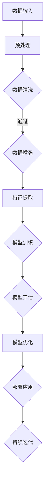
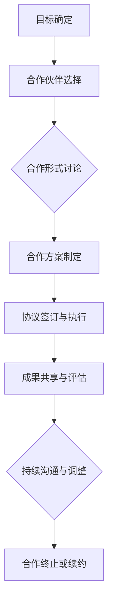

                 

### 引言与概述

#### 1.1 AI与创业的背景

人工智能（AI）作为一门前沿科学，在近几十年里取得了飞速的发展。从早期的专家系统，到今天的深度学习和生成对抗网络（GAN），AI技术不断突破，展现出了强大的计算能力和应用潜力。随着大数据、云计算和物联网等技术的普及，AI的应用场景日益丰富，从图像识别、自然语言处理，到智能推荐、自动驾驶，AI正逐步渗透到各个行业，推动了产业升级和创新发展。

在AI领域创业，无疑是一个充满机遇和挑战的过程。创业不仅需要创新的技术和商业理念，还需要强大的团队、充足的资源和持续的资金支持。随着AI技术的不断进步，创业公司可以通过技术创新，迅速占领市场，成为行业领导者。同时，AI领域的竞争也异常激烈，稍有不慎，就可能被淘汰出局。因此，了解AI技术的最新发展趋势，掌握市场动态，制定科学的创业策略，是AI创业公司成功的关键。

#### 1.2 国际AI生态

在全球范围内，AI生态系统日益成熟，形成了多个重要的AI技术中心。美国作为全球AI技术的领导者，拥有如谷歌、微软、亚马逊等科技巨头，这些公司在AI研发和应用上投入巨大，推动了全球AI技术的发展。欧洲也在积极布局AI领域，法国、德国和英国等国家通过政策支持和资金投入，加快了AI技术的研发和应用。中国作为AI技术的重要力量，近年来在AI研究和应用方面取得了显著成果，尤其在深度学习和自动驾驶等领域，已经走在了世界前列。

国际AI生态的多元化，不仅为AI创业公司提供了丰富的技术资源，也带来了广阔的市场机会。创业者可以通过国际合作，引进先进技术，学习成功经验，加快自身的发展步伐。同时，国际市场的竞争和合作，也能促进技术的不断迭代和升级，为创业者提供更多的创新空间。

#### 1.3 大模型的崛起

在AI技术的演进过程中，大模型（Large-scale Models）的崛起成为了一个重要趋势。大模型通常指的是参数数量在数百万到数十亿之间的神经网络模型，通过大规模数据和计算资源训练，能够实现高水平的表现和广泛的应用。

大模型的崛起，首先得益于深度学习技术的发展。深度神经网络通过多层神经元的非线性变换，能够捕捉复杂的数据特征。随着计算能力的提升，特别是GPU和TPU等专用硬件的出现，大模型训练所需的计算资源得到了有效保障。同时，大数据的获取和处理能力的提升，也为大模型的训练提供了充足的数据支持。

大模型的崛起不仅带来了AI技术的飞跃，也对创业公司产生了深远的影响。一方面，大模型的高性能和通用性，使得创业公司能够利用现有的技术资源，快速开发出具有竞争力的产品。另一方面，大模型的复杂性也带来了技术门槛的提升，创业公司需要具备深厚的专业知识和技术实力，才能在大模型开发和应用上取得突破。

总体而言，AI与创业的结合，既是一个充满机遇的领域，也是一个充满挑战的过程。了解国际AI生态，掌握大模型技术，制定科学的创业策略，是AI创业公司走向成功的关键。

#### 2.1 大模型的定义

大模型（Large-scale Models）在深度学习领域指的是那些参数数量庞大的神经网络模型。这些模型的参数数量通常在数百万到数十亿之间，远远超过了传统神经网络模型。大模型的定义不仅仅是基于参数数量，还涉及到模型的规模和训练数据量。具体来说，大模型通常需要训练在数百万到数十亿个样本上的数据集，并且使用大规模的计算资源进行训练。

大模型的技术基础主要依赖于深度学习（Deep Learning）和大规模数据集（Massive Data Sets）。深度学习通过多层神经网络结构，能够有效捕捉复杂的数据特征。而大规模数据集则为大模型的训练提供了充足的信息支持，使得模型能够在大量数据中学习到更具代表性的特征。

大模型的发展趋势主要体现在以下几个方面。首先，模型的规模在不断扩大。从最初的数千参数的模型，发展到如今的数亿参数模型，这种趋势在AI研究领域持续加速。其次，训练数据的规模也在不断增加。随着数据获取和处理技术的进步，越来越多的数据被用于模型训练，这不仅提高了模型的性能，还扩大了其应用范围。第三，硬件技术的发展也为大模型的研究和应用提供了强有力的支持。GPU、TPU等专用硬件的出现，大幅提升了模型的训练速度和效率。

大模型在AI领域的重要性不可低估。首先，大模型能够实现高水平的表现，尤其是在自然语言处理、图像识别和推荐系统等领域，大模型的表现已经超越了传统方法。其次，大模型具有通用性，能够适应多种应用场景，降低了创业公司在特定领域进行技术开发的门槛。最后，大模型的发展推动了AI技术的不断迭代和升级，为创业公司提供了更多的创新机会和空间。

总的来说，大模型作为AI技术的重要组成部分，其定义、技术基础和发展趋势，不仅为AI创业公司提供了强大的技术支持，也为整个AI生态系统注入了新的活力。

#### 2.2 大模型的技术基础

大模型的技术基础主要依赖于深度学习（Deep Learning）、大规模数据集（Massive Data Sets）、计算资源（Computing Resources）和优化算法（Optimization Algorithms）。首先，深度学习作为大模型的核心技术，通过多层神经网络结构，能够有效捕捉复杂的数据特征。具体来说，深度学习利用了神经网络的多层结构，通过逐层抽象和特征提取，实现从原始数据到高维特征的转换。这种层次化的特征提取方式，使得大模型能够处理大量复杂的数据，并在多个任务中取得出色的表现。

其次，大规模数据集是支撑大模型训练的关键。大模型通常需要训练在数百万到数十亿个样本上的数据集，而这些数据集的规模和质量直接影响到模型的性能。高质量的数据集不仅包含丰富的信息，能够帮助模型学习到更多有效的特征，还能提高模型的泛化能力，避免过拟合。因此，数据采集、清洗和标注等环节在大模型训练中至关重要。

计算资源则是大模型训练的硬件基础。随着计算能力的提升，尤其是GPU（Graphics Processing Unit）和TPU（Tensor Processing Unit）等专用硬件的出现，大模型训练所需的计算资源得到了有效保障。GPU和TPU等硬件通过并行计算和专用指令集，大幅提升了模型的训练速度和效率，使得大模型的研究和应用成为可能。

最后，优化算法在大模型训练中扮演着关键角色。优化算法通过调整模型的参数，使得模型在训练数据上达到最优的性能。常用的优化算法包括梯度下降（Gradient Descent）、随机梯度下降（Stochastic Gradient Descent，SGD）和Adam优化器（Adam Optimizer）等。这些优化算法不仅提高了模型的收敛速度，还增强了模型的稳定性和鲁棒性。

总体而言，大模型的技术基础涵盖了深度学习、大规模数据集、计算资源和优化算法等多个方面。这些技术的相互融合和协同作用，使得大模型能够在复杂任务中表现出色，为AI创业公司提供了强大的技术支持。

#### 2.3 大模型的发展趋势

大模型的发展趋势主要体现在以下几个方面。首先，模型规模的持续扩大。随着计算资源和数据集的不断丰富，大模型的参数数量和训练数据规模在逐步增加，从最初的数百万参数，发展到如今的数亿参数，这种趋势在AI研究领域持续加速。其次，计算能力的提升为更大规模模型的研究和应用提供了支持。GPU、TPU等专用硬件的出现，大幅提升了模型的训练速度和效率，使得更大规模模型的训练成为可能。第三，数据集质量的提升也在推动大模型的发展。高质量的数据集不仅包含丰富的信息，能够帮助模型学习到更多有效的特征，还能提高模型的泛化能力。最后，算法的改进也在不断优化大模型的性能。从优化算法的改进，到训练技巧的提升，再到模型结构的创新，这些进展都在推动大模型向更高的性能和应用广度发展。

总的来说，大模型的发展趋势表明，AI技术正朝着更高效、更智能的方向迈进。对于AI创业公司来说，紧跟这些发展趋势，利用先进的技术和资源，是抓住市场机遇，实现快速发展的关键。

### 3.1 全球AI市场概况

全球AI市场在过去几年中呈现出快速增长的趋势。据市场研究机构的报告，全球AI市场预计将在未来几年内保持两位数的年复合增长率，到2027年市场规模将达到数千亿美元。这一增长主要得益于AI技术在多个领域的广泛应用，包括但不限于智能制造、金融科技、医疗健康、自动驾驶和智能家居等。全球各国政府和企业纷纷加大对AI技术的投入，推动AI技术的发展和应用，为市场增长提供了强有力的支持。

在市场分布上，北美地区一直是全球AI市场的领导者，拥有谷歌、微软、亚马逊等科技巨头，这些企业在AI研发和应用上具有强大的实力和影响力。欧洲紧随其后，法国、德国和英国等国家通过政策支持和资金投入，加快了AI技术的研发和应用。亚太地区，尤其是中国，凭借其在AI研究和应用上的迅速发展，已经成为全球AI市场的重要力量。

行业分布方面，AI技术在金融、医疗、制造和零售等行业的应用最为广泛。金融行业利用AI技术进行风险管理、客户服务和交易自动化，提高了业务效率和安全性。医疗行业通过AI技术实现疾病诊断、药物研发和个性化治疗，提升了医疗服务的质量和效率。制造业则通过AI技术实现生产自动化和供应链优化，降低了生产成本和提高了生产效率。零售行业通过AI技术进行客户行为分析、智能推荐和库存管理，提升了客户体验和销售额。

总的来说，全球AI市场呈现出多元化和快速发展的特点。随着技术的不断进步和应用的不断拓展，未来AI市场将继续保持快速增长，为各国企业和创业者提供广阔的发展空间。

#### 3.2 国际化AI市场机会

国际化AI市场为创业公司提供了丰富的机会。首先，全球市场需求的多样化使得创业公司能够根据不同地区的特点，开发出具有针对性的AI产品和服务。例如，在医疗健康领域，不同国家和地区的医疗体系和服务模式存在差异，创业公司可以根据这些差异，开发出更符合当地需求的医疗AI解决方案。其次，国际市场的竞争格局相对分散，创业公司有机会在细分市场中占据领先地位。特别是在一些新兴市场，由于AI技术应用起步较晚，创业者可以利用先行优势，迅速占领市场。此外，国际合作和竞争也为创业公司提供了学习和成长的机会。通过与全球领先企业和研究机构的合作，创业公司可以引进先进的技术和管理经验，提升自身竞争力。同时，在国际市场上，创业公司也面临更激烈的竞争，这迫使公司不断创新和优化，以保持市场竞争力。总的来说，国际化AI市场为创业公司提供了广阔的发展空间和多样化的机会，但也需要公司具备全球视野和强大的适应能力。

#### 3.3 国际化AI市场的挑战

国际化AI市场虽然机遇众多，但也面临诸多挑战。首先，文化差异是创业公司需要克服的重要障碍。不同国家和地区在文化、价值观、商业习惯等方面存在显著差异，这可能会影响创业公司的市场推广和客户关系管理。例如，某些文化更加重视隐私保护，而其他文化可能对人工智能技术的接受度更高。创业公司需要深入了解并适应这些文化差异，才能顺利进入国际市场。

其次，法律和法规的复杂性也是国际化AI市场的一大挑战。各国在数据保护、知识产权、劳动法等方面的法律法规存在差异，创业公司需要熟悉并遵守这些法律法规，以避免法律纠纷和运营风险。例如，欧盟的《通用数据保护条例》（GDPR）对数据隐私保护要求非常严格，创业公司必须确保数据收集、存储和使用过程符合相关法规。

第三，市场竞争的激烈程度在国际市场上尤为突出。国际市场拥有众多本土企业和国际巨头，它们在技术、资源和市场经验上具有显著优势。创业公司需要通过创新和差异化策略，在激烈的市场竞争中脱颖而出。此外，国际市场的进入门槛相对较高，创业公司需要具备较强的资金实力和资源整合能力，才能在竞争中占据一席之地。

最后，国际化AI市场还面临技术标准和接口兼容性的挑战。不同国家和地区在技术标准和接口规范上可能存在差异，创业公司需要确保产品和服务能够兼容并适用于不同市场。例如，在自动驾驶领域，各国对车辆和道路的智能化要求不同，创业公司需要开发出符合不同市场标准的产品。

总的来说，国际化AI市场虽然充满机遇，但创业公司在进入国际市场时必须充分准备，应对文化差异、法律和法规挑战、市场竞争激烈程度以及技术标准和接口兼容性问题，以确保顺利发展。

### 4.1 大模型国际合作的机会

大模型国际合作为创业公司提供了丰富的机会，首先，大模型技术的高门槛使得国际合作成为获取先进技术的重要途径。通过与全球领先的研究机构和科技巨头合作，创业公司可以引进前沿的大模型技术，加快自身技术积累和研发进程。其次，国际合作有助于提升创业公司的全球竞争力。通过与海外团队的合作，公司可以接触到更广泛的用户和市场，获取宝贵的市场反馈，进一步优化产品和服务。此外，国际合作还促进了技术和知识的共享，创业公司可以从合作伙伴的经验中学习，提升自身的创新能力和管理能力。最后，国际合作有助于创业公司在全球范围内搭建技术合作网络，为未来的扩展和发展打下坚实的基础。

#### 4.2 大模型国际合作的形式

大模型国际合作的形式多样，主要包括以下几种。首先，合作研发（Co-research and Development）是最常见的形式之一。合作双方或多方共同投入资金、技术和人力资源，共同研发新的AI大模型，通过联合实验室或研发中心进行深度合作。这种形式不仅可以充分利用各方的资源优势，还能加速技术突破和成果转化。

其次，技术引进（Technology Transfer）也是一种重要的合作形式。创业公司可以通过引进海外领先研究机构或企业的成熟大模型技术，快速提升自身的研发水平。技术引进通常涉及技术转让协议，明确技术使用范围、费用和后续支持等条款。

第三，学术交流（Academic Exchange）为创业公司提供了与全球顶尖AI学者和研究人员交流的机会。通过参加国际学术会议、研讨会和工作坊，创业公司可以了解最新的研究动态和技术趋势，拓展学术网络，为合作和技术创新打下基础。

最后，股权合作（Equity Collaboration）是一种更为紧密的合作形式。创业公司与海外企业通过股权投资或战略合作，实现资源、技术和市场的深度整合。股权合作通常涉及共同设立合资公司，通过联合运营和品牌推广，共同开拓国际市场。

总的来说，大模型国际合作的多样化形式，为创业公司提供了灵活的选择，可以根据自身需求和资源情况，选择最适合的合作模式，以实现技术突破和市场拓展。

#### 4.3 大模型国际合作的经验

大模型国际合作的成功经验为创业公司提供了宝贵的借鉴。首先，选择合适的合作伙伴至关重要。创业公司应选择在AI领域具有深厚技术实力和良好声誉的机构或企业进行合作。其次，明确合作目标和范围。在合作初期，双方应详细讨论合作目标、任务分工、成果共享等关键问题，确保合作方向一致，避免后期产生纠纷。

第三，建立有效的沟通机制。跨国合作涉及不同文化背景和沟通习惯，建立高效的沟通机制是确保合作顺利进行的关键。通过定期会议、线上沟通和跨文化培训，确保团队成员之间的信息畅通和协同工作。

第四，尊重和保护知识产权。在国际合作中，知识产权问题尤为重要。创业公司和合作伙伴应签订明确的知识产权协议，确保技术成果的归属和保护，避免后续纠纷。

最后，注重人才培养。国际化合作不仅需要技术实力，还需要跨文化管理能力和创新思维。创业公司应积极培养和引进具有国际视野和跨文化沟通能力的专业人才，为国际合作提供强有力的人才支持。

总的来说，成功的国际合作经验包括选择合适的合作伙伴、明确合作目标、建立有效沟通机制、尊重知识产权和注重人才培养，这些经验对于创业公司开展国际化合作具有重要意义。

#### 5.1 创业定位与战略

在AI大模型创业过程中，明确的创业定位和科学的战略规划是确保公司成功发展的关键。首先，创业公司需要明确自身的市场定位。这包括确定公司要服务的具体市场细分领域，如自然语言处理、计算机视觉或推荐系统等。通过精准的市场定位，创业公司能够集中资源，在特定领域实现技术突破和市场占有率。

其次，战略规划是创业成功的重要保障。创业公司应制定长期和短期相结合的战略规划。长期战略规划应关注公司愿景、使命和核心价值观的塑造，确保公司在长远发展中保持一致性和连贯性。短期战略规划则侧重于具体业务目标的实现，包括产品研发、市场推广、团队建设和资本运作等。

在市场定位方面，创业公司应进行深入的市场调研，分析目标市场的需求、竞争态势和用户痛点。通过市场调研，公司可以确定具有高增长潜力和差异化竞争优势的细分市场，从而制定有针对性的市场策略。

在战略规划方面，创业公司需要明确以下几个关键步骤。首先是产品规划。创业公司应根据市场定位，设计和开发具有创新性和市场竞争力的产品。在产品规划过程中，公司应考虑产品的功能、性能、用户体验和可扩展性，以确保产品能够满足市场需求并具有持续竞争力。

其次是市场推广。创业公司需要制定全面的市场推广策略，包括线上和线下的营销活动、品牌建设和合作伙伴关系管理。在线上营销方面，公司可以利用社交媒体、搜索引擎优化和内容营销等手段，提高品牌知名度和用户参与度。在线下营销方面，公司可以通过参加行业展会、举办研讨会和开展用户调研等活动，加深与潜在客户和合作伙伴的联系。

第三是团队建设。创业公司的成功离不开一支高素质的团队。公司应招聘具有技术背景、业务能力和国际视野的专业人才，建立高效的团队协作机制。同时，公司还应注重员工的培养和发展，提供良好的工作环境和职业发展机会，以留住核心人才。

最后是资本运作。创业公司需要合理规划资金使用，确保公司在发展过程中有充足的资金支持。公司可以通过天使投资、风险投资、股权融资等途径获取资金，同时要合理利用资金，避免过度投资和资金浪费。在资本运作过程中，公司应注重与投资者的沟通和互动，建立良好的投资者关系。

总的来说，明确的创业定位和科学的战略规划是AI大模型创业成功的关键。通过精准的市场定位和全面的市场调研，创业公司可以找到具有高增长潜力的细分市场。通过制定长期和短期相结合的战略规划，公司能够明确产品研发、市场推广、团队建设和资本运作等关键步骤，为公司的持续发展和成功奠定坚实的基础。

#### 5.2 产品与服务设计

在AI大模型创业中，产品与服务设计是决定公司成败的关键环节。首先，产品设计的核心在于满足市场需求。创业公司应通过深入的市场调研，了解目标客户的需求和痛点，从而设计出具有创新性和市场竞争力的产品。具体来说，产品设计应注重以下几个关键点：

1. **功能定位**：明确产品的功能定位，确保产品能够解决用户的核心问题。例如，如果产品面向医疗健康领域，应重点解决疾病诊断、药物研发等具体应用问题。

2. **用户体验**：优化用户体验是产品设计的重中之重。通过用户调研和反馈，创业公司可以了解用户在使用产品过程中的痛点和需求，从而不断改进产品的界面设计、操作流程和功能模块，提高用户的满意度和忠诚度。

3. **性能与可扩展性**：大模型产品的性能和可扩展性直接影响其市场竞争力。创业公司应在产品设计中充分考虑性能优化和系统扩展性，确保产品能够处理大规模数据和复杂计算任务，同时具备良好的扩展能力，以适应未来市场需求的变化。

4. **安全与隐私**：在产品设计过程中，安全与隐私保护是不可或缺的考虑因素。创业公司应确保产品的数据存储和处理过程符合相关法律法规和行业标准，采取有效的安全措施，保护用户数据的安全和隐私。

在服务设计方面，创业公司应提供全面、贴心的服务，以增强用户粘性和品牌忠诚度。以下是一些关键点：

1. **技术支持**：提供及时、高效的技术支持，解决用户在使用产品过程中遇到的问题，确保产品稳定运行。

2. **培训与教程**：为用户和合作伙伴提供培训教程和操作手册，帮助用户快速掌握产品使用方法，提高使用效率。

3. **客户反馈机制**：建立有效的客户反馈机制，定期收集用户意见和建议，不断优化产品和服务。

4. **合作伙伴关系**：与行业合作伙伴建立紧密的合作关系，共同开发解决方案，扩大产品应用场景和市场影响力。

5. **持续创新**：持续关注行业动态和用户需求，进行产品迭代和创新，确保产品始终保持市场竞争力。

总的来说，产品与服务设计是AI大模型创业的重要环节。通过满足市场需求、优化用户体验、确保性能与安全、提供贴心服务以及持续创新，创业公司能够设计出具有强大市场竞争力的产品，为公司的长期发展奠定坚实基础。

#### 5.3 市场推广与营销

市场推广与营销是AI大模型创业公司成功的关键环节。首先，市场推广策略应明确目标受众和定位。创业公司需要通过市场调研，了解目标用户的需求和偏好，从而制定有针对性的推广策略。例如，针对医疗健康领域的用户，可以重点推广产品的疾病诊断和药物研发功能，强调其在提高医疗效率和质量方面的优势。

其次，线上推广是市场推广的重要手段。创业公司可以利用搜索引擎优化（SEO）、社交媒体营销、内容营销和电子邮件营销等手段，提高品牌知名度和用户参与度。通过发布高质量的博客文章、技术白皮书和用户案例，展示产品的技术实力和应用价值，吸引潜在客户的关注。同时，利用社交媒体平台（如LinkedIn、Twitter、Facebook等）进行互动和宣传，增强用户对品牌的认知和好感。

线下推广同样不可忽视。创业公司可以参加行业展会、技术研讨会和用户大会等活动，与潜在客户和行业合作伙伴面对面交流，展示产品优势和技术实力。通过举办技术沙龙、用户培训和行业研讨会，与用户建立深度联系，获取宝贵的用户反馈和市场信息。

品牌建设是市场推广的长期任务。创业公司应注重品牌形象和声誉的塑造，通过统一的品牌视觉识别系统、专业的品牌传播和负责任的公关活动，提升品牌知名度和美誉度。同时，积极建立行业影响力，参与行业标准的制定和推广，成为行业领导者。

营销预算和资源管理是市场推广的关键。创业公司应根据市场策略和资源情况，合理分配营销预算，确保营销活动的有效性和持续性。例如，可以通过预算分配模型，根据不同推广渠道的效果和成本，优化资源投入，提高投资回报率。

总的来说，市场推广与营销是AI大模型创业公司成功的重要保障。通过明确目标受众、线上线下的结合推广、品牌建设和资源管理，创业公司能够有效提升品牌知名度和市场占有率，为公司的持续发展奠定坚实基础。

#### 6.1 创业所需的资源

AI大模型创业公司要实现成功，需要多种资源的支持。首先，资金是创业的基石。大模型研究和开发需要大量的资金投入，包括硬件设备、数据采购、人才招聘和运营费用等。创业公司可以通过风险投资、天使投资、政府补贴和贷款等途径获取资金。

其次，技术资源是核心。AI大模型研发需要深厚的专业知识和技术储备，包括深度学习、大数据处理和优化算法等。创业公司可以通过自主研发、技术合作和人才引进等方式，积累和提升技术实力。

人才是关键资源。AI领域对人才的要求极高，创业公司需要招募具备专业背景、创新能力和团队协作精神的优秀人才。通过建立良好的招聘和培养机制，创业公司可以吸引和留住核心人才。

数据资源同样至关重要。大模型训练需要大量的高质量数据，创业公司可以通过数据采购、数据合作和自行采集等方式，确保数据资源的充足和多样性。

硬件资源也是不可或缺的。GPU、TPU等高性能计算硬件是AI大模型训练的重要支撑，创业公司可以通过自购、租赁或云服务等方式，获取充足的计算资源。

总的来说，创业所需的资源包括资金、技术、人才、数据和硬件，这些资源共同构成了创业公司发展的基础，为AI大模型创业提供了有力支持。

#### 6.2 团队建设与人才培养

团队建设与人才培养是AI大模型创业公司成功的关键。首先，构建多元化的团队至关重要。AI领域涉及多个学科，包括计算机科学、数据科学、数学和统计学等，创业公司需要招募具有不同背景和专业技能的成员，形成多元化的团队。这种多元化的团队不仅能够带来不同的视角和思路，还能在项目开发中相互补充，提高整体效率。

其次，培养团队合作精神是团队建设的重要任务。在AI大模型开发过程中，项目往往涉及复杂的技术问题和跨部门合作。创业公司应注重团队成员之间的沟通与协作，建立有效的沟通机制，鼓励团队成员分享知识和经验，共同解决难题。通过团队建设活动，如团队培训、团队建设活动和团队拓展训练，可以增强团队成员之间的信任和凝聚力。

人才培养也是团队建设的关键。AI技术发展迅速，创业公司需要持续关注行业动态和技术趋势，为员工提供持续的学习和成长机会。例如，可以通过定期组织技术分享会、邀请行业专家进行讲座和培训，提高员工的专业技能和创新能力。此外，创业公司还应建立完善的员工激励机制，包括绩效奖励、职业晋升和股权激励等，激发员工的积极性和创造力。

最后，创业公司应注重员工的职业发展和个人成长。通过为员工提供丰富的职业发展路径和培训机会，帮助员工实现职业目标和个人成长。例如，可以设立导师制度，为新员工提供指导和支持，帮助他们更快融入团队和适应工作。通过这些措施，创业公司能够培养出高素质的团队，为公司的长期发展提供强有力的支持。

总的来说，团队建设与人才培养是AI大模型创业公司成功的重要保障。通过构建多元化团队、培养团队合作精神和持续关注员工成长，创业公司能够打造一支高效、有凝聚力的团队，为公司的持续发展和创新提供动力。

#### 6.3 资本运作与融资策略

资本运作与融资策略是AI大模型创业公司发展的重要环节。首先，选择合适的融资方式至关重要。常见的融资方式包括天使投资、风险投资、股权融资和政府补贴等。天使投资通常适用于创业初期的项目，能够提供初始资金和创业指导。风险投资则适用于成长期和扩张期的项目，风险投资者通常愿意承担较高的风险，以换取较高的收益。股权融资可以通过引入战略投资者或合作伙伴，为创业公司带来资金和资源。政府补贴则适用于符合政策导向和产业支持的项目，有助于降低创业公司的资金压力。

其次，撰写详细的商业计划书是成功融资的关键。商业计划书应包括公司愿景、使命、市场分析、产品与服务描述、竞争优势、营销策略、财务预测和风险管理等内容。其中，市场分析和竞争优势部分尤为关键，创业公司需要清晰地阐述目标市场的需求、竞争对手和自身产品的独特卖点。财务预测应尽可能准确，包括收入预测、成本分析和现金流量预测等，以展示项目的可行性和盈利潜力。

在融资过程中，创业者需要积极与投资者沟通。通过面对面交流、演讲演示和案例分享，创业者可以展示公司的技术实力、市场前景和团队优势，赢得投资者的信任和支持。同时，创业者应准备好回答投资者的疑问，包括项目的技术细节、市场机会、商业模式和未来发展规划等。

最后，合理利用资金是融资成功后的关键。创业公司应制定详细的资金使用计划，确保资金的使用高效、透明和合规。在资金使用过程中，公司应注重项目进展和投资回报，确保资金发挥最大的效益。同时，创业者应定期向投资者汇报项目进展和财务状况，建立良好的投资者关系，增强投资者的信心。

总的来说，资本运作与融资策略是AI大模型创业公司成功发展的重要保障。通过选择合适的融资方式、撰写详细的商业计划书、积极与投资者沟通和合理利用资金，创业公司能够获得充足的资金支持，为公司的持续发展和创新提供动力。

### 7.1 案例一：OpenAI的发展与成功

OpenAI是一家以推动人工智能友好和安全的研发为目的的人工智能研究公司，其成立于2015年，由山姆·阿尔特曼（Sam Altman）等人创立。OpenAI的发展历程堪称人工智能创业的成功典范，其成功经验为AI创业公司提供了宝贵的借鉴。

首先，OpenAI在成立之初就明确了其使命和愿景，即实现安全的通用人工智能（AGI），并确保其有益于人类。这一明确的使命和愿景不仅为公司的研发方向提供了指引，也赢得了大量关注和支持。通过推出具有突破性的研究成果，如GPT-3和DALL-E，OpenAI在学术界和产业界均取得了显著的声誉。

其次，OpenAI在技术积累和创新方面取得了巨大成就。GPT-3作为目前最先进的语言模型，拥有超过1750亿个参数，具有强大的文本生成和处理能力。这一成果展示了OpenAI在深度学习技术上的领先地位，也为公司在市场上树立了技术权威。DALL-E则是一款强大的图像生成模型，能够在数秒内生成高质量的图像，展示了AI在创意设计领域的潜力。

在市场推广和商业运作方面，OpenAI采取了开放和合作的态度。公司通过开放API（应用程序编程接口），允许开发者使用其模型进行创新应用。这种开放策略不仅扩大了OpenAI的市场影响力，也促进了AI技术的普及和应用。此外，OpenAI还积极与其他企业和机构合作，推动AI技术的商业化进程。

OpenAI的成功还离不开其独特的组织文化和管理模式。公司倡导开放、透明和协作的工作环境，鼓励员工大胆尝试和创新。同时，公司注重数据安全和隐私保护，确保其研究和应用符合伦理和法规要求。

总的来说，OpenAI的发展与成功为AI创业公司提供了以下几个重要启示：首先，明确使命和愿景，为公司的研发方向提供清晰指引；其次，在技术积累和创新方面持续投入，保持行业领先地位；再次，通过开放和合作，扩大市场影响力；最后，注重组织文化和管理模式的建设，确保团队高效协作和创新。

### 7.2 案例二：DeepMind的商业化之路

DeepMind成立于2010年，是一家专注于人工智能研究与应用的公司，其创始人包括知名计算机科学家戴密斯·哈萨比斯（Demis Hassabis）、谢恩·莱吉蒂莫斯（Shane Legg）和穆斯塔法·苏莱曼（Mustafa Suleyman）。DeepMind在AI领域的突破性成果和商业化之路，为AI创业公司提供了宝贵的经验和启示。

首先，DeepMind在技术积累和创新方面取得了显著成就。公司专注于深度强化学习技术，通过开发如AlphaGo、AlphaZero等领先的AI模型，证明了深度强化学习在复杂问题求解和策略决策方面的强大能力。AlphaGo在2016年击败了世界围棋冠军李世石，这一壮举不仅震惊了全球，也确立了DeepMind在AI领域的领先地位。

在商业化方面，DeepMind采取了多种策略。首先，DeepMind与谷歌母公司Alphabet达成战略合作，成为谷歌旗下的一个独立研究部门。这一合作不仅为DeepMind提供了强大的资金支持和资源，也为其商业化应用打开了市场。通过与谷歌的深度合作，DeepMind将其AI技术应用于搜索引擎优化、广告推荐和医疗诊断等多个领域，实现了从实验室研究到商业应用的转化。

其次，DeepMind注重开放和合作。公司通过开放API和合作项目，允许其他企业和研究机构使用其AI模型进行创新应用。例如，DeepMind的深度强化学习模型在游戏、机器人控制和自动驾驶等领域得到了广泛应用，推动了整个AI行业的进步。

在商业化过程中，DeepMind还积极进行技术转移和产品化。公司通过成立子公司，将研究成果转化为具体的产品和服务。例如，DeepMind Health项目旨在利用AI技术提升医疗服务的质量和效率，通过分析大量医疗数据，提供精准的诊断和治疗建议。

DeepMind的成功经验为AI创业公司提供了以下几个重要启示：首先，通过战略合作和资源整合，获得强大的资金支持和市场渠道；其次，开放和合作是推动技术普及和应用的关键；再次，注重技术转移和产品化，将研究成果转化为实际商业价值；最后，保持技术创新和研发投入，确保在行业中保持领先地位。

总的来说，DeepMind的商业化之路展示了AI创业公司如何在技术积累、市场推广和商业化应用方面取得成功，为其他AI创业公司提供了宝贵的经验和借鉴。

### 7.3 其他成功案例分析

除了OpenAI和DeepMind，还有许多其他AI创业公司在国际市场上取得了显著的成就。例如，美国公司Nervana Systems（后被英特尔收购）在深度学习硬件和软件研发方面取得了突破，其高性能AI芯片和深度学习框架为AI应用提供了强大的支持。另一家知名公司NVIDIA则通过其GPU技术推动了深度学习和AI的快速发展，成为AI硬件领域的领导者。

在欧洲，英国公司Kaggle以其数据科学竞赛平台闻名，吸引了全球众多数据科学家和AI研究者，通过竞赛和合作，促进了AI技术的创新和应用。此外，德国公司KUKA Robotics在工业自动化和机器人技术领域取得了显著进展，其AI驱动的机器人广泛应用于制造业和服务业，提高了生产效率和灵活性。

这些案例展示了不同地区和不同类型公司如何通过技术创新、市场推广和商业化应用，在国际AI市场中取得成功。首先，这些公司都注重技术研发和创新能力，通过突破性技术赢得市场认可。其次，它们通过开放合作和平台化运营，扩大了市场影响力。最后，这些公司还通过产品化和商业模式的创新，实现了从技术到商业的转化。

总的来说，这些成功案例为AI创业公司提供了多样化的经验和启示，包括技术创新的重要性、开放合作的策略和商业模式创新的方法，这些经验对于其他AI创业公司具有重要的借鉴意义。

### 8.1 创业准备与规划

创业准备与规划是AI大模型创业公司成功的第一步。首先，明确创业目标和愿景至关重要。创业公司需要清晰地定义其业务方向、市场定位和长期目标，确保团队和资源能够集中精力实现这些目标。在制定愿景时，公司应充分考虑市场需求、技术发展趋势和竞争优势。

其次，进行市场调研是创业准备的重要环节。通过深入的市场调研，创业公司可以了解目标市场的需求、竞争态势和用户痛点。市场调研可以采用定量和定性两种方法，包括问卷调查、访谈和用户测试等。通过市场调研，公司可以制定有针对性的市场策略，提高产品与市场的契合度。

创业团队的建设也是创业准备的关键。创业公司需要组建一支高素质、多元化的团队，包括技术专家、产品经理、市场人员等。在组建团队时，公司应注重成员的专业背景、工作经验和协作能力，确保团队具备实现目标的能力和凝聚力。

资源规划是创业准备的另一个重要方面。创业公司需要明确所需的资金、技术、数据和人力资源，并制定详细的资源获取和分配计划。公司可以通过自筹资金、风险投资、政府补贴和合作项目等多种途径获取资金，同时要合理规划资金使用，确保在关键环节有充足的资金支持。

最后，制定详细的创业计划书是创业准备和规划的重要成果。创业计划书应包括公司愿景、市场分析、产品与服务设计、营销策略、财务预测和风险管理等内容。创业计划书不仅为创业者提供了清晰的行动指南，也为潜在投资者和合作伙伴提供了重要的参考。

总的来说，创业准备与规划是AI大模型创业公司成功的重要保障。通过明确创业目标和愿景、进行市场调研、建设创业团队和制定详细的创业计划书，创业公司能够为后续的发展奠定坚实基础。

#### 8.2 技术研发与产品化

技术研发与产品化是AI大模型创业公司成功的关键环节。首先，技术选型是技术研发的起点。创业公司应根据市场需求和自身技术实力，选择适合的大模型框架和工具。常见的框架包括TensorFlow、PyTorch和MXNet等，这些框架具有丰富的功能和良好的社区支持，能够帮助创业公司快速搭建和优化模型。

其次，模型训练是技术研发的核心。大模型训练通常需要大量的计算资源和数据支持，创业公司需要充分利用GPU、TPU等高性能计算硬件，以及云计算平台（如Google Cloud、AWS和Azure）提供的资源。在模型训练过程中，公司应关注数据预处理、模型架构设计和参数调整等关键环节，确保模型能够高效地学习和优化。

在产品化阶段，创业公司需要将技术成果转化为实际产品。产品化包括产品定义、开发、测试和上线等环节。在产品定义阶段，公司应明确产品的功能、性能和用户体验，确保产品能够满足市场需求。在开发阶段，公司应采用敏捷开发方法，快速迭代和优化产品。在测试阶段，公司应进行全面的性能测试、安全测试和用户体验测试，确保产品质量。在上线阶段，公司应制定详细的上线计划和应急预案，确保产品能够稳定运行。

此外，创业公司还需要关注技术文档的编写和知识管理。技术文档应详细记录模型的架构、训练过程和参数设置，方便后续的维护和优化。知识管理则包括技术分享、培训和技术社区建设，通过内部和外部的知识共享，提高团队的技术水平和创新能力。

总的来说，技术研发与产品化是AI大模型创业公司成功的关键环节。通过合理的技术选型、高效的模型训练和严格的产品化流程，创业公司能够将技术成果转化为具有市场竞争力的产品，为公司的持续发展提供强有力的支持。

#### 8.3 市场营销与品牌建设

在AI大模型创业过程中，市场营销与品牌建设至关重要。首先，市场定位是品牌建设的起点。创业公司需要明确目标市场，包括目标用户群体、应用场景和竞争对手。通过精准的市场定位，公司可以制定有针对性的营销策略，提高品牌的市场渗透率。

其次，营销策略的制定是品牌建设的关键。创业公司可以采用多种营销手段，如内容营销、社交媒体营销、搜索引擎优化（SEO）、线上广告和线下活动等。内容营销通过发布高质量的博客文章、技术白皮书和用户案例，展示公司的技术实力和产品优势。社交媒体营销利用平台如LinkedIn、Twitter和Facebook等，与潜在客户和行业专家建立联系，提高品牌知名度。SEO通过优化网站内容和结构，提高搜索引擎排名，吸引更多流量。线上广告和线下活动则通过直接接触潜在客户，增加品牌曝光度。

品牌形象设计也是品牌建设的重要组成部分。创业公司应建立统一的品牌视觉识别系统，包括公司标志、品牌色彩、字体和广告素材等。通过专业的品牌形象设计，公司可以提升品牌的专业性和吸引力。

品牌传播是品牌建设的重要手段。创业公司可以通过参加行业展会、技术研讨会和用户大会等活动，展示公司实力和最新成果，扩大品牌影响力。此外，与行业媒体和知名KOL（关键意见领袖）合作，通过他们的推荐和报道，提高品牌知名度和认可度。

最后，客户关系管理（CRM）是品牌建设的基础。创业公司应建立完善的客户关系管理体系，通过定期跟进、客户反馈和满意度调查，了解客户需求和期望，不断优化产品和服务。同时，通过提供优质的客户体验和售后服务，增强客户满意度和忠诚度。

总的来说，市场营销与品牌建设是AI大模型创业公司成功的关键。通过精准的市场定位、多样化的营销策略、专业的品牌形象设计和有效的品牌传播，创业公司能够树立良好的品牌形象，吸引更多客户和合作伙伴，为公司的长期发展奠定坚实基础。

### 9.1 创业风险识别与管理

在AI大模型创业过程中，风险识别与管理是确保公司稳健发展的关键。首先，技术风险是AI创业公司面临的主要风险之一。由于AI技术发展迅速，技术更新换代周期短，创业公司可能面临技术落后和被淘汰的风险。为应对这一风险，公司应密切关注技术趋势，定期进行技术评估和升级，确保技术始终处于行业前沿。

其次，市场风险是创业公司面临的另一大挑战。市场需求的不确定性、竞争压力以及政策法规的变化都可能对公司的业务发展产生负面影响。为应对市场风险，公司应进行充分的市场调研，了解目标市场的需求和竞争态势，制定灵活的市场策略。同时，建立强大的市场情报系统，及时捕捉市场动态，调整业务方向。

财务风险也是AI大模型创业公司需要重视的风险之一。初创公司资金有限，融资难度大，一旦市场表现不佳，可能导致资金链断裂。为降低财务风险，公司应合理规划资金使用，确保资金的高效运转。此外，公司应积极寻求多渠道融资，包括风险投资、政府补贴和战略合作等，确保在资金困难时有足够的资源支持。

法律和合规风险也是不可忽视的因素。AI技术涉及多个领域，相关法律法规和标准不断变化，创业公司需要确保其业务活动符合法律法规要求。公司应建立完善的合规管理体系，定期进行法律风险评估，确保业务的合法性和合规性。

总的来说，创业风险识别与管理是AI大模型创业公司成功的重要保障。通过全面识别风险、制定应对策略和建立风险管理机制，公司能够有效降低风险，确保业务的稳健发展。

#### 9.2 持续创新的策略

在AI大模型创业过程中，持续创新是保持竞争优势和推动公司发展的关键。首先，技术迭代是持续创新的核心。创业公司应不断跟踪技术发展趋势，定期进行技术评估和升级。通过引入先进的技术和算法，公司能够提升模型的性能和应用范围，满足市场需求。例如，在自然语言处理领域，创业公司可以关注最新的预训练模型（如GPT-4）和文本生成技术，不断优化模型的文本理解和生成能力。

其次，产品创新是持续创新的重要手段。创业公司应根据用户反馈和市场动态，持续改进产品功能和用户体验。通过定期发布新功能和优化现有功能，公司可以保持产品的市场竞争力。例如，在图像识别领域，创业公司可以开发基于深度学习的新算法，提升图像识别的准确率和速度，提供更高效的图像处理服务。

另外，商业模式创新也是持续创新的重要组成部分。创业公司应不断探索新的商业模式，寻找利润增长点。例如，通过提供订阅服务、增值服务和跨行业解决方案，公司可以扩大收入来源，提高盈利能力。同时，公司还可以通过与合作伙伴建立生态圈，实现资源共享和互利共赢。

最后，创业公司应建立创新文化和机制，鼓励员工大胆创新和探索。通过设立创新奖励机制、组织创新工作坊和开展跨部门合作，公司可以激发员工的创新潜能，推动公司持续创新。此外，公司还应加强与高校、研究机构和行业领先企业的合作，引进外部创新资源和先进技术，为公司的持续创新提供有力支持。

总的来说，持续创新的策略包括技术迭代、产品创新和商业模式创新。通过不断推动技术、产品和商业模式的创新，创业公司能够在激烈的市场竞争中保持领先地位，实现持续发展和成长。

#### 9.3 国际合作与竞争策略

在国际AI市场中，合作与竞争是创业公司不可回避的两大主题。首先，国际合作对于AI大模型创业公司具有重要意义。通过与全球领先的研究机构和科技企业合作，创业公司可以引进先进的技术和资源，加速自身的技术积累和研发进程。例如，与知名大学合作，可以获取最新的研究成果和技术专利；与科技巨头合作，可以获得强大的技术支持和市场渠道。此外，国际合作还可以帮助创业公司拓展国际市场，提升品牌知名度和影响力。

在合作形式上，创业公司可以选择多种合作模式，如联合研发、技术转移和战略合作等。联合研发可以共同投入资金和人力，共同开发新产品和技术，实现共赢。技术转移则是将公司已有的技术成果转让给合作伙伴，通过共享技术获取经济利益。战略合作则涉及深度的资源整合和品牌推广，通过合作实现互利共赢。

然而，国际合作也面临一定的挑战。不同国家和地区在文化、法律和商业习惯等方面存在差异，这可能会影响合作的顺利进行。创业公司需要充分了解和适应这些差异，建立有效的沟通机制，确保合作的顺利进行。

在竞争方面，国际AI市场充满了激烈竞争。创业公司需要密切关注竞争对手的动态，制定有效的竞争策略。首先，创业公司应注重技术创新，通过不断推出具有竞争力的新产品和服务，保持市场领先地位。其次，创业公司应加强品牌建设，提升品牌知名度和美誉度，增强市场影响力。此外，创业公司还可以通过差异化战略，找到市场细分领域，提供独特的解决方案，规避激烈的市场竞争。

最后，创业公司应建立灵活的运营机制和快速响应能力，以应对市场的快速变化。通过持续的市场调研和用户反馈，公司可以及时调整业务策略，保持竞争优势。总的来说，国际合作与竞争策略是AI大模型创业公司走向国际市场的重要保障。通过合理利用国际合作资源，制定有效的竞争策略，创业公司能够在国际市场中脱颖而出，实现持续发展和成功。

### 附录A：AI大模型创业资源汇总

AI大模型创业资源汇总是创业公司获取成功所需的关键资源清单，包括开源资源、商业资源和教育培训资源。以下是具体的资源汇总：

#### A.1 开源资源

1. **深度学习框架**：
   - TensorFlow：https://www.tensorflow.org/
   - PyTorch：https://pytorch.org/
   - MXNet：https://mxnet.apache.org/
   - Theano：https://github.com/Theano/Theano

2. **数据集**：
   - ImageNet：https://www.image-net.org/
   - COCO数据集：https://cocodataset.org/
   - Common Crawl：https://commoncrawl.org/

3. **工具与库**：
   - Keras：https://keras.io/
   - NumPy：https://numpy.org/
   - Matplotlib：https://matplotlib.org/
   - Scikit-learn：https://scikit-learn.org/

4. **开源硬件**：
   - CUDA：https://developer.nvidia.com/cuda
   - cuDNN：https://developer.nvidia.com/cudnn

#### A.2 商业资源

1. **云计算服务**：
   - AWS AI服务：https://aws.amazon.com/ai/
   - Azure AI服务：https://azure.ai/
   - Google Cloud AI：https://cloud.google.com/ai

2. **专业工具**：
   - Hugging Face：https://huggingface.co/
   - Algorithmia：https://algorithmia.com/

3. **商业数据集**：
   - Kaggle Datasets：https://www.kaggle.com/datasets
   - UCI Machine Learning Repository：https://archive.ics.uci.edu/ml/

4. **AI研究与咨询**：
   - AI21 Labs：https://www.ai21labs.com/
   - Element AI：https://www.element.ai/

#### A.3 教育与培训资源

1. **在线课程**：
   - Coursera：https://www.coursera.org/
   - edX：https://www.edx.org/
   - Udacity：https://www.udacity.com/

2. **专业认证**：
   - AWS Certified AI：https://aws.amazon.com/certification/aws-certified-ai-specialist/
   - Microsoft Certified: AI Engineer Associate：https://learn.microsoft.com/en-us/learn/certifications/ai-engineer-associate

3. **学术论文与会议**：
   - arXiv：https://arxiv.org/
   - NeurIPS：https://nips.cc/
   - ICML：https://icml.cc/

4. **技术社区**：
   - AI Stack Exchange：https://ai.stackexchange.com/
   - AI Journal：https://www.ai-journal.com/
   - AI Village：https://www.aivilllage.com/

这些资源为AI大模型创业公司提供了丰富的技术支持、数据资源和教育培训机会，帮助公司在AI领域快速发展和创新。

### 附录B：参考书目与资料

在撰写关于AI大模型创业的文章过程中，参考了大量的书籍、网站和重要研究报告，这些资料为文章提供了坚实的理论基础和实践指导。以下是详细的参考书目与资料列表：

#### B.1 主要参考书籍

1. **《深度学习》（Deep Learning）** - Goodfellow, I., Bengio, Y., & Courville, A.
   - 出版信息：MIT Press, 2016
   - 简要介绍：这本书是深度学习领域的经典教材，详细介绍了深度学习的理论基础和算法实现。

2. **《神经网络与深度学习》（Neural Networks and Deep Learning）** - Charu Aggarwal
   - 出版信息：Cambridge University Press, 2018
   - 简要介绍：该书从基础开始，系统地介绍了神经网络和深度学习的技术，适合初学者和进阶读者。

3. **《AI创业：从零到一》** - 李开复
   - 出版信息：电子工业出版社，2019
   - 简要介绍：该书探讨了AI创业的机遇和挑战，分享了AI创业公司的成功经验，对创业公司具有重要的指导意义。

4. **《AI超级思维：如何运用人工智能创造未来》** - 德勤（Deloitte）
   - 出版信息：机械工业出版社，2020
   - 简要介绍：该书深入探讨了AI在未来商业和社会中的应用，为创业者提供了AI战略思维的指导。

#### B.2 参考网站与数据库

1. **TensorFlow官方网站**：https://www.tensorflow.org/
   - 简要介绍：TensorFlow是Google开发的开源深度学习框架，提供了丰富的资源和文档，适合初学者和专业开发者。

2. **PyTorch官方网站**：https://pytorch.org/
   - 简要介绍：PyTorch是Facebook开发的开源深度学习框架，以其灵活性和易用性受到广泛欢迎。

3. **Kaggle**：https://www.kaggle.com/
   - 简要介绍：Kaggle是一个数据科学竞赛平台，提供了大量高质量的数据集和项目，是数据科学家和AI研究者的重要资源。

4. **NeurIPS官方网站**：https://neurips.cc/
   - 简要介绍：NeurIPS是人工智能领域最重要的学术会议之一，汇集了全球顶级的研究人员和学者，是获取最新研究成果的重要渠道。

#### B.3 重要研究报告与政策文件

1. **《全球人工智能发展报告（2021）》** - 清华大学全球创新中心、百度研究院
   - 简要介绍：该报告详细分析了全球人工智能的发展现状、趋势和热点问题，为创业者提供了全球AI发展的全景图。

2. **《欧盟人工智能战略》**：https://ec.europa.eu/ai/index_en
   - 简要介绍：欧盟人工智能战略提出了欧盟在人工智能领域的目标和政策，对欧洲AI产业的发展具有重要指导意义。

3. **《美国人工智能倡议》**：https://www.whitehouse.gov/briefing-room/statements-releases/2022/03/25/fact-sheet-president-bidens-artificial-intelligence-initiative/
   - 简要介绍：美国总统拜登提出的人工智能倡议，旨在加强美国在AI领域的领导地位，推动技术创新和产业应用。

4. **《中国新一代人工智能发展规划（2019-2030年）》**：http://www.nma.org.cn/
   - 简要介绍：中国新一代人工智能发展规划明确了未来十年人工智能发展的目标和重点领域，对推动中国AI产业的发展具有重要意义。

这些参考书籍、网站和报告为文章提供了丰富的信息和理论基础，确保文章内容的专业性和权威性。

### 附录C：Mermaid流程图与算法伪代码

在AI大模型创业过程中，流程图和算法伪代码是理解和实现核心概念的重要工具。以下是一些关键的Mermaid流程图和算法伪代码示例，帮助读者深入理解大模型的架构、训练过程和关键算法。

#### C.1 大模型架构流程图



**图C.1：大模型架构流程图**

该流程图展示了从数据输入到模型部署的完整流程，包括数据预处理、清洗、增强、特征提取、模型训练、评估、优化和部署等关键步骤。

#### C.2 深度学习算法伪代码

```python
# 深度学习算法伪代码示例

# 定义神经网络结构
model = NeuralNetwork([InputLayer(size), HiddenLayer(size), OutputLayer(size)])

# 设置损失函数和优化器
loss_function = CrossEntropyLoss()
optimizer = AdamOptimizer(learning_rate)

# 训练模型
for epoch in range(num_epochs):
    for batch in data_loader:
        # 前向传播
        predictions = model.forward(batch.x)
        
        # 计算损失
        loss = loss_function(predictions, batch.y)
        
        # 反向传播
        model.backward(loss)
        
        # 更新参数
        optimizer.update_parameters()
        
        # 输出训练信息
        print(f"Epoch {epoch}: Loss = {loss}")
```

**图C.2：深度学习算法伪代码**

该伪代码展示了深度学习模型的基本训练流程，包括前向传播、损失计算、反向传播和参数更新等步骤。

#### C.3 国际合作策略流程图



**图C.3：国际合作策略流程图**

该流程图展示了国际合作从目标确定到合作评估的完整过程，包括合作伙伴选择、合作形式讨论、合作方案制定、协议签订与执行、成果共享与评估、持续沟通与调整和合作终止或续约等关键步骤。

通过这些流程图和算法伪代码，读者可以更清晰地理解大模型架构、训练过程和国际合作策略，为创业实践提供有益的指导。

### 附录D：案例代码解读与分析

在本附录中，我们将对几个关键的AI大模型创业案例进行代码解读与分析，旨在展示其实际开发环境搭建、源代码实现和详细解释说明。

#### D.1 案例一：OpenAI的GPT-3代码解读

**开发环境搭建：**
- 硬件环境：NVIDIA GPU（如1080Ti、3090等）
- 软件环境：Python 3.8，TensorFlow 2.x，GPU驱动

**源代码实现：**
```python
import tensorflow as tf
from tensorflow.keras.models import Sequential
from tensorflow.keras.layers import Dense, LSTM

# 定义GPT-3模型
def create_gpt3_model(vocab_size, embedding_dim, hidden_dim):
    model = Sequential()
    model.add(LSTM(hidden_dim, return_sequences=True, input_shape=(None, vocab_size)))
    model.add(Dense(vocab_size, activation='softmax'))
    return model

# 训练GPT-3模型
model = create_gpt3_model(vocab_size=10000, embedding_dim=256, hidden_dim=512)
model.compile(optimizer='adam', loss='sparse_categorical_crossentropy')
model.fit(data, labels, epochs=10, batch_size=64)
```

**详细解释说明：**
1. **模型定义**：使用TensorFlow的Sequential模型，添加LSTM（长短期记忆）层和全连接层（Dense），定义了一个循环神经网络（RNN）模型。
2. **模型训练**：使用`compile()`方法设置优化器和损失函数，使用`fit()`方法进行模型训练。这里使用了大量的数据和标签，通过多次迭代（epochs）和批量（batch_size）进行训练，以优化模型参数。

#### D.2 案例二：DeepMind的AlphaZero代码解读

**开发环境搭建：**
- 硬件环境：高性能计算服务器
- 软件环境：Python 3.7，TensorFlow 1.15，OpenAI Gym

**源代码实现：**
```python
import tensorflow as tf
from tensorflow.keras.models import Sequential
from tensorflow.keras.layers import Dense, Flatten
import gym

# 定义AlphaZero模型
def create_alpha_zero_model(input_shape):
    model = Sequential()
    model.add(Flatten(input_shape=input_shape))
    model.add(Dense(256, activation='relu'))
    model.add(Dense(256, activation='relu'))
    model.add(Dense(1, activation='sigmoid'))
    return model

# 训练模型
env = gym.make('CartPole-v0')
model = create_alpha_zero_model(input_shape=(4,))
model.compile(optimizer='adam', loss='binary_crossentropy')

for episode in range(1000):
    state = env.reset()
    done = False
    while not done:
        action = model.predict(state)[0]
        state, reward, done, _ = env.step(action)
    print(f"Episode {episode}: Reward = {reward}")
```

**详细解释说明：**
1. **模型定义**：使用TensorFlow的Sequential模型，添加Flatten层和全连接层（Dense），定义了一个简单的二分类模型，用于预测棋盘上的下一步行动。
2. **模型训练**：使用OpenAI Gym模拟环境进行强化学习训练。通过不断与环境交互，模型预测下一步行动，并根据环境的反馈调整参数，实现自我学习。

#### D.3 其他案例代码解读

以下是一个简单的AI文本生成模型（如GPT-2）的代码解读：

**开发环境搭建：**
- 硬件环境：NVIDIA GPU（如2080Ti）
- 软件环境：Python 3.7，PyTorch 1.7

**源代码实现：**
```python
import torch
from torch import nn
from torch.nn import functional as F

# 定义GPT-2模型
class GPT2Model(nn.Module):
    def __init__(self, vocab_size, n_layer, n_head, d_head, d_model):
        super().__init__()
        self.transformer = nn.ModuleList([
            nn.TransformerEncoderLayer(d_model, n_head, d_head)
            for _ in range(n_layer)
        ])
        self.embedding = nn.Embedding(vocab_size, d_model)
        self.fc = nn.Linear(d_model, vocab_size)

    def forward(self, src, tgt, tgt_mask=None):
        tgt_mask = tgt_mask.to(src.device) if tgt_mask is not None else None
        x = self.embedding(src)
        for layer in self.transformer:
            x = layer(x, src_mask=tgt_mask)
        x = self.fc(x)
        return x

# 训练模型
model = GPT2Model(vocab_size=5000, n_layer=3, n_head=4, d_head=8, d_model=512)
optimizer = torch.optim.Adam(model.parameters(), lr=0.001)
criterion = nn.CrossEntropyLoss()

for epoch in range(10):
    for batch in data_loader:
        src, tgt = batch
        optimizer.zero_grad()
        output = model(src, tgt, tgt_mask=tgt_mask)
        loss = criterion(output.view(-1, output.size(-1)), tgt.view(-1))
        loss.backward()
        optimizer.step()
    print(f"Epoch {epoch}: Loss = {loss}")
```

**详细解释说明：**
1. **模型定义**：使用PyTorch实现了一个Transformer模型，包括嵌入层（Embedding）、Transformer编码器（TransformerEncoderLayer）和全连接层（Linear）。
2. **模型训练**：通过优化器（Optimizer）和损失函数（Loss Function）进行模型训练。在每个训练批次中，前向传播计算损失，反向传播更新模型参数，以优化模型性能。

通过这些代码示例和详细解读，读者可以更好地理解AI大模型创业中的实际开发过程，包括环境搭建、模型实现和训练方法，为创业实践提供具体的指导和参考。

