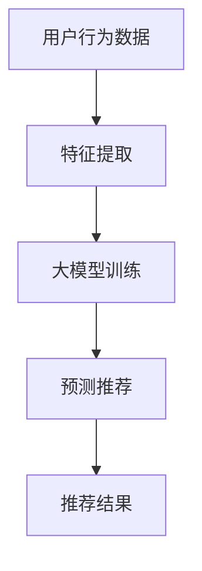
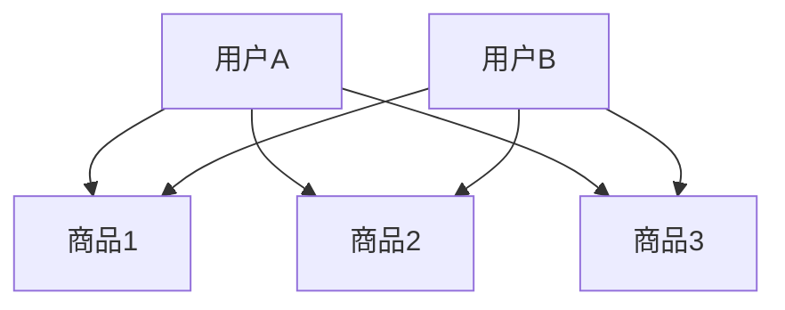
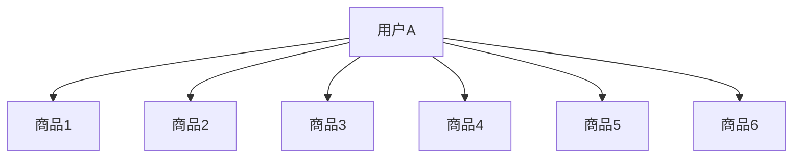
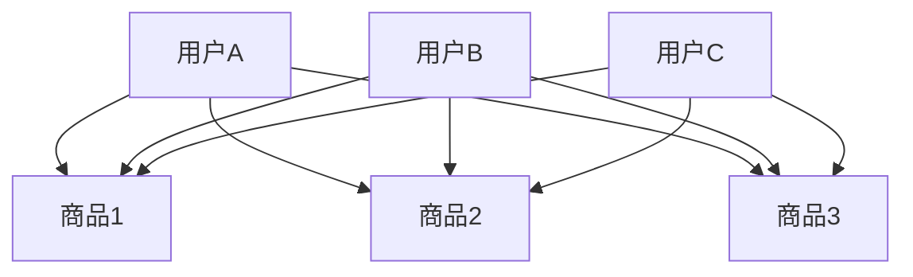
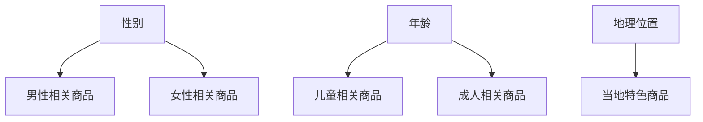
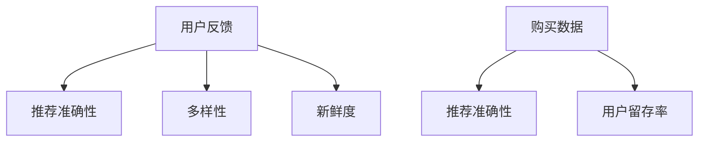
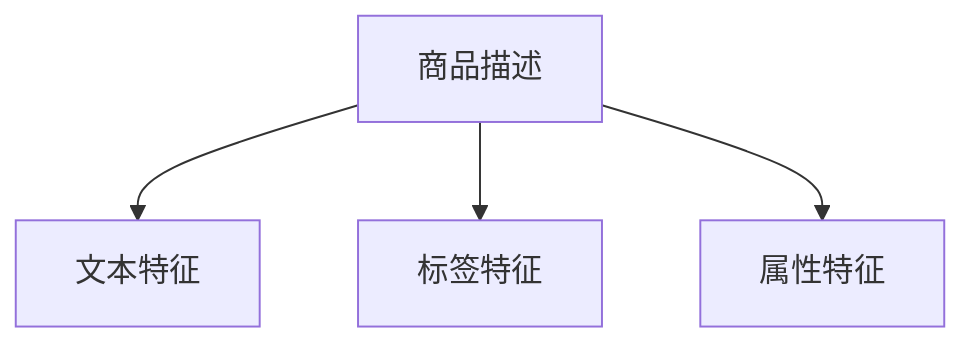
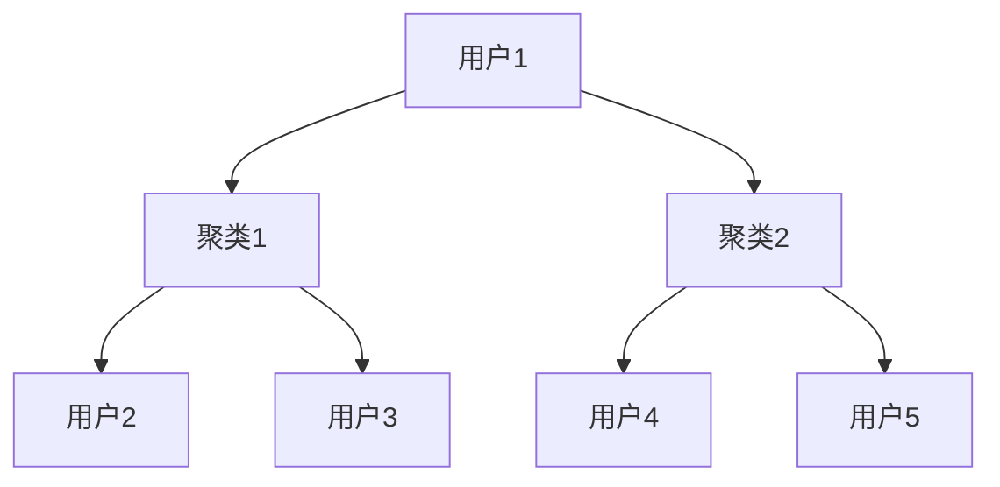

                 

### 第一部分：AI大模型与电商搜索推荐概述

> **关键词：** AI大模型、电商搜索推荐、冷启动用户、协同过滤、内容推荐、聚类算法

> **摘要：** 本文深入探讨了AI大模型在电商搜索推荐中的冷启动用户策略，分析了AI大模型的基本概念、在电商搜索推荐中的应用技术，以及各类冷启动用户策略的实践与优化。文章旨在为从事电商搜索推荐系统开发的技术人员提供理论指导和实践参考。

## 第1章：AI大模型与电商搜索推荐的关系

随着互联网技术的发展，电商搜索推荐系统已经成为电商平台的必备功能，它不仅能够提高用户的购物体验，还能显著提升平台销售额。而AI大模型的引入，使得电商搜索推荐系统在处理海量数据、预测用户兴趣、提供个性化推荐等方面取得了突破性的进展。

### 1.1 AI大模型在电商搜索推荐中的角色

AI大模型在电商搜索推荐中扮演着至关重要的角色。首先，大模型可以处理海量的用户行为数据，通过深度学习算法提取用户兴趣和偏好，从而实现精准推荐。其次，大模型能够自动调整推荐策略，根据用户行为的变化动态更新推荐结果，提高推荐系统的实时性和准确性。此外，大模型还可以通过自然语言处理技术，理解用户查询意图，提供更加智能化的搜索建议。

### 1.2 电商搜索推荐的关键问题与挑战

电商搜索推荐系统面临的挑战主要包括以下几个方面：

1. **数据量大**：电商平台积累了海量的用户行为数据和商品数据，如何高效地处理这些数据，提取有价值的信息，是推荐系统需要解决的首要问题。

2. **实时性要求高**：用户在购物过程中往往希望获得即时的推荐结果，推荐系统需要具备快速响应的能力。

3. **个性化要求强**：每个用户的购物习惯和兴趣都不同，推荐系统需要能够根据用户的个性化需求提供精准的推荐。

4. **算法复杂度高**：推荐算法需要同时考虑多样性、新鲜度和准确性，这对算法的设计和实现提出了很高的要求。

### 1.3 电商搜索推荐系统的基本架构

一个典型的电商搜索推荐系统通常包括以下几个主要模块：

1. **用户行为数据采集与分析**：通过网站日志、用户操作记录等方式收集用户行为数据，并对其进行预处理和分析。

2. **商品信息管理**：包括商品分类、属性标签管理、商品评价等信息的管理。

3. **推荐算法模型**：根据用户行为数据和商品信息，利用协同过滤、基于内容的推荐、聚类算法等推荐算法生成推荐结果。

4. **推荐结果呈现**：将推荐结果以直观、友好的形式展示给用户，如推荐列表、商品卡片等。

在接下来的章节中，我们将深入探讨AI大模型在电商搜索推荐中的应用技术，包括基于用户行为的协同过滤算法、基于内容的推荐算法、聚类算法等，并分析各类算法的原理和实现方法。

### 第二部分：AI大模型在电商搜索推荐中的应用技术

AI大模型在电商搜索推荐中的应用，主要集中于提升推荐的准确性、实时性和个性化水平。本部分将详细介绍AI大模型在电商搜索推荐中使用的几种核心算法，包括基于用户行为的协同过滤算法、基于内容的推荐算法、聚类算法等。

## 第3章：AI大模型在电商搜索推荐中的核心算法原理

### 3.1 基于用户行为的协同过滤算法

协同过滤算法是一种基于用户行为数据的推荐方法，其基本思想是发现用户之间的相似性，并通过这些相似性来预测用户可能对未知商品的喜好。协同过滤算法主要分为两类：基于用户的协同过滤（User-based Collaborative Filtering，UBCF）和基于项目的协同过滤（Item-based Collaborative Filtering，IBCF）。

#### 3.1.1 协同过滤算法的基本原理

协同过滤算法的核心思想是通过用户之间的相似性来发现未知商品和用户之间的潜在关系。具体实现过程中，算法首先计算用户之间的相似度，然后根据相似度为用户推荐相似用户喜欢的商品。相似度计算方法通常包括余弦相似度、皮尔逊相关系数等。

#### 3.1.2 传统的协同过滤算法

传统的协同过滤算法主要包括基于用户的协同过滤和基于项目的协同过滤。基于用户的协同过滤算法通过计算用户之间的相似度，找到与目标用户相似的其他用户，然后推荐这些用户喜欢的商品。基于项目的协同过滤算法则通过计算商品之间的相似度，找到与目标用户购买过的商品相似的其他商品，然后推荐这些商品。

#### 3.1.3 大模型在协同过滤算法中的应用

随着AI大模型的发展，传统的协同过滤算法逐渐被大模型所取代。大模型可以通过深度学习算法自动提取用户行为数据中的高阶特征，从而提高推荐系统的准确性。例如，通过使用图神经网络（Graph Neural Networks，GNN），可以将用户和商品之间的关系建模为图结构，从而实现更精准的协同过滤。



#### 3.1.4 基于用户行为的协同过滤算法原理讲解

协同过滤算法的原理可以用以下伪代码表示：

```python
# 计算用户相似度
def compute_similarity(user_a, user_b):
    # 计算用户之间的余弦相似度
    return cos_similarity(user_a, user_b)

# 推荐商品列表
def collaborative_filtering(target_user, users, items, ratings):
    # 找到与目标用户最相似的k个用户
    similar_users = find_similar_users(target_user, users, k)
    # 计算相似用户对商品的评分预测
    predicted_ratings = {}
    for user in similar_users:
        for item in items:
            if user in ratings[item]:
                predicted_ratings[item] += ratings[item][user] * compute_similarity(target_user, user)
    # 对预测评分进行排序，并返回推荐列表
    return sorted(predicted_ratings.items(), key=lambda x: x[1], reverse=True)
```

#### 3.1.5 基于用户行为的协同过滤算法数学模型和公式

协同过滤算法中的相似度计算通常使用余弦相似度或皮尔逊相关系数。以下为余弦相似度的计算公式：

$$
\text{cos_similarity}(u, v) = \frac{u \cdot v}{||u|| \cdot ||v||}
$$

其中，$u$ 和 $v$ 分别表示两个用户的行为向量，$\cdot$ 表示点积，$||u||$ 和 $||v||$ 分别表示两个向量的欧几里得范数。

#### 3.1.6 基于用户行为的协同过滤算法案例分析

以一个简单的电商推荐系统为例，假设有用户A和用户B，他们分别对商品1、商品2、商品3进行了评分。我们可以计算他们之间的相似度，并根据相似度推荐他们可能喜欢的商品。



用户A和用户B的评分向量分别为：

$$
u = [4, 5, 3]
$$

$$
v = [5, 4, 3]
$$

计算余弦相似度：

$$
\text{cos_similarity}(u, v) = \frac{4 \cdot 5 + 5 \cdot 4 + 3 \cdot 3}{\sqrt{4^2 + 5^2 + 3^2} \cdot \sqrt{5^2 + 4^2 + 3^2}} \approx 0.917
$$

根据相似度推荐商品，我们可以选择相似度最高的商品，即商品2作为推荐结果。

### 3.2 基于内容的推荐算法

基于内容的推荐算法（Content-Based Recommender System）是一种基于用户兴趣和商品内容特征的推荐方法。其基本思想是分析用户过去喜欢的商品，提取商品的特征，然后根据这些特征为用户推荐相似的商品。

#### 3.2.1 基于内容的推荐算法的基本原理

基于内容的推荐算法的核心是特征提取和相似度计算。特征提取通常通过对商品文本描述、标签、属性等进行处理，提取出能够代表商品特征的词向量。相似度计算则是通过比较用户过去喜欢的商品和候选商品之间的特征相似度，选择相似度最高的商品作为推荐结果。

#### 3.2.2 基于内容的推荐算法的实现方法

基于内容的推荐算法的实现方法主要包括以下步骤：

1. **特征提取**：对商品内容进行文本预处理，如分词、去停用词、词性标注等，然后使用词向量模型（如Word2Vec、BERT等）将文本转化为向量表示。

2. **计算相似度**：计算用户过去喜欢的商品和候选商品之间的相似度，常用的方法包括余弦相似度、欧氏距离等。

3. **生成推荐列表**：根据相似度分数，为用户生成推荐列表。

#### 3.2.3 大模型在基于内容推荐算法中的应用

AI大模型在基于内容推荐算法中的应用主要体现在特征提取和相似度计算方面。大模型可以自动提取商品内容中的高阶特征，如语义信息、情感倾向等，从而提高推荐系统的准确性。此外，大模型还可以通过深度学习算法优化相似度计算过程，提高推荐的实时性和效果。

#### 3.2.4 基于内容的推荐算法数学模型和公式

基于内容的推荐算法中，相似度计算通常使用余弦相似度。以下为余弦相似度的计算公式：

$$
\text{cos_similarity}(c_u, c_i) = \frac{c_u \cdot c_i}{||c_u|| \cdot ||c_i||}
$$

其中，$c_u$ 和 $c_i$ 分别表示用户过去喜欢的商品和候选商品的向量表示，$\cdot$ 表示点积，$||c_u||$ 和 $||c_i||$ 分别表示两个向量的欧几里得范数。

#### 3.2.5 基于内容的推荐算法案例分析

以一个简单的电商推荐系统为例，假设用户A过去喜欢的商品有商品1、商品2和商品3，候选商品有商品4、商品5和商品6。我们可以计算用户A对这些候选商品的相似度，并根据相似度推荐商品。



用户A过去喜欢的商品和候选商品的向量表示分别为：

$$
c_u = [0.1, 0.2, 0.3, 0.4, 0.5]
$$

$$
c_i = [0.3, 0.4, 0.5, 0.6, 0.7]
$$

计算余弦相似度：

$$
\text{cos_similarity}(c_u, c_i) = \frac{0.1 \cdot 0.3 + 0.2 \cdot 0.4 + 0.3 \cdot 0.5 + 0.4 \cdot 0.6 + 0.5 \cdot 0.7}{\sqrt{0.1^2 + 0.2^2 + 0.3^2 + 0.4^2 + 0.5^2} \cdot \sqrt{0.3^2 + 0.4^2 + 0.5^2 + 0.6^2 + 0.7^2}} \approx 0.833
$$

根据相似度推荐商品，我们可以选择相似度最高的商品，即商品4作为推荐结果。

### 3.3 聚类算法与基于聚类推荐

聚类算法是一种无监督学习方法，用于将相似的数据点归为一类。在电商搜索推荐中，聚类算法可以用于将用户或商品划分为不同的群体，从而实现个性化推荐。

#### 3.3.1 聚类算法的基本原理

聚类算法的基本原理是通过测量数据点之间的相似度，将相似的数据点归为一类。常见的聚类算法包括K-Means、层次聚类、DBSCAN等。

1. **K-Means算法**：K-Means算法通过迭代的方式将数据点分配到K个中心点所代表的类中，目标是最小化类内距离和。

2. **层次聚类**：层次聚类通过将数据点逐步合并，形成层次结构，以实现聚类。

3. **DBSCAN算法**：DBSCAN算法通过测量数据点之间的密度和邻域，将数据点划分为核心点、边界点和噪声点。

#### 3.3.2 基于聚类推荐算法的实现方法

基于聚类推荐算法的实现方法主要包括以下步骤：

1. **聚类分析**：对用户或商品进行聚类分析，划分不同的用户群体或商品类别。

2. **生成推荐列表**：根据用户所属的聚类结果，为用户推荐同一聚类中的其他用户或商品。

#### 3.3.3 大模型在聚类算法中的应用

AI大模型在聚类算法中的应用主要体现在聚类结果解释和优化方面。大模型可以通过深度学习算法对聚类结果进行解释，提取出聚类背后的特征和规律，从而提高聚类效果。此外，大模型还可以通过优化聚类算法，提高聚类的准确性和实时性。

#### 3.3.4 基于聚类推荐算法数学模型和公式

聚类算法的数学模型通常依赖于距离度量。以下为K-Means算法中常用的欧氏距离计算公式：

$$
d(\text{center}_i, \text{point}_j) = \sqrt{\sum_{k=1}^n (x_{ij} - \mu_i)^2}
$$

其中，$\text{center}_i$ 和 $\text{point}_j$ 分别表示聚类中心点和数据点，$x_{ij}$ 表示数据点的第k个特征值，$\mu_i$ 表示聚类中心点的第k个特征值。

#### 3.3.5 基于聚类推荐算法案例分析

以K-Means算法为例，假设有用户A、用户B和用户C，他们分别对商品1、商品2和商品3进行了评分。我们可以使用K-Means算法将用户划分为不同的群体，并根据群体为用户推荐商品。



用户A、用户B和用户C的评分向量分别为：

$$
u_1 = [4, 5, 3]
$$

$$
u_2 = [5, 4, 3]
$$

$$
u_3 = [3, 5, 4]
$$

假设我们选择K=2，初始化两个聚类中心点为：

$$
\text{center}_1 = [4, 4, 3]
$$

$$
\text{center}_2 = [3, 5, 4]
$$

计算用户到聚类中心点的距离：

$$
d(u_1, \text{center}_1) = \sqrt{(4-4)^2 + (5-4)^2 + (3-3)^2} = 1
$$

$$
d(u_1, \text{center}_2) = \sqrt{(4-3)^2 + (5-5)^2 + (3-4)^2} = 1
$$

$$
d(u_2, \text{center}_1) = \sqrt{(5-4)^2 + (4-4)^2 + (3-3)^2} = 1
$$

$$
d(u_2, \text{center}_2) = \sqrt{(5-3)^2 + (4-5)^2 + (3-4)^2} = 2
$$

$$
d(u_3, \text{center}_1) = \sqrt{(3-4)^2 + (5-4)^2 + (4-3)^2} = 2
$$

$$
d(u_3, \text{center}_2) = \sqrt{(3-3)^2 + (5-4)^2 + (4-4)^2} = 1
$$

根据距离计算结果，用户A和用户C属于同一聚类，用户B属于另一聚类。根据聚类结果，我们可以为用户A和用户C推荐同一聚类中的其他用户喜欢的商品，为用户B推荐另一聚类中的其他用户喜欢的商品。

### 3.4 多样性、新鲜度和准确性（Diversity, Novelty, Accuracy）平衡

在电商搜索推荐中，多样性、新鲜度和准确性是三个重要的评价指标。多样性（Diversity）指推荐列表中不同类别的商品分布均匀；新鲜度（Novelty）指推荐列表中包含用户未曾见过的商品；准确性（Accuracy）指推荐列表中包含用户真正感兴趣的商品。

#### 3.4.1 DNF平衡的基本概念

DNF平衡是指优化推荐系统的多样性、新鲜度和准确性的过程。在推荐系统中，平衡这三个指标是至关重要的，因为单一指标的优秀并不代表整体性能的优越。

#### 3.4.2 DNF平衡的算法实现

DNF平衡的算法实现通常包括以下几个步骤：

1. **多样性优化**：通过引入随机因素或多样性度量，使推荐列表中的商品分布更加均匀。

2. **新鲜度优化**：通过引入时间因素或基于内容的相似度计算，推荐用户未曾见过的商品。

3. **准确性优化**：通过使用协同过滤、基于内容的推荐算法等，提高推荐列表中包含用户真正感兴趣的商品的比例。

#### 3.4.3 大模型在DNF平衡中的应用

AI大模型在DNF平衡中的应用主要体现在以下几个方面：

1. **多样性优化**：大模型可以通过深度学习算法自动提取商品特征，从而实现多样化的推荐。

2. **新鲜度优化**：大模型可以通过自然语言处理技术理解用户的历史行为，从而推荐用户未曾见过的商品。

3. **准确性优化**：大模型可以通过用户行为数据预测用户兴趣，从而提高推荐列表的准确性。

#### 3.4.4 DNF平衡算法的数学模型和公式

DNF平衡算法的数学模型通常依赖于多样性、新鲜度和准确性的度量。以下为多样性度量的一个示例公式：

$$
Diversity = \frac{1}{n}\sum_{i=1}^{n} \frac{1}{\sum_{j=1}^{n} |c_i - c_j|}
$$

其中，$Diversity$ 表示多样性度量，$n$ 表示推荐列表中的商品数量，$c_i$ 和 $c_j$ 分别表示不同商品的特征向量。

#### 3.4.5 DNF平衡算法案例分析

以一个简单的电商推荐系统为例，假设有用户A，他对商品1、商品2和商品3进行了评分。我们可以使用DNF平衡算法为用户A生成推荐列表。

用户A的评分向量分别为：

$$
u = [4, 5, 3]
$$

候选商品的向量表示分别为：

$$
c_1 = [0.1, 0.2, 0.3]
$$

$$
c_2 = [0.3, 0.4, 0.5]
$$

$$
c_3 = [0.5, 0.6, 0.7]
$$

计算余弦相似度：

$$
\text{cos_similarity}(u, c_1) = \frac{4 \cdot 0.1 + 5 \cdot 0.2 + 3 \cdot 0.3}{\sqrt{4^2 + 5^2 + 3^2} \cdot \sqrt{0.1^2 + 0.2^2 + 0.3^2}} \approx 0.765
$$

$$
\text{cos_similarity}(u, c_2) = \frac{4 \cdot 0.3 + 5 \cdot 0.4 + 3 \cdot 0.5}{\sqrt{4^2 + 5^2 + 3^2} \cdot \sqrt{0.3^2 + 0.4^2 + 0.5^2}} \approx 0.820
$$

$$
\text{cos_similarity}(u, c_3) = \frac{4 \cdot 0.5 + 5 \cdot 0.6 + 3 \cdot 0.7}{\sqrt{4^2 + 5^2 + 3^2} \cdot \sqrt{0.5^2 + 0.6^2 + 0.7^2}} \approx 0.875
$$

根据相似度分数，我们选择商品3作为推荐结果。为了优化多样性，我们可以引入随机因素，例如随机选择商品2或商品3。为了优化新鲜度，我们可以考虑商品的新旧程度，例如选择用户未曾购买过的商品。为了优化准确性，我们可以通过分析用户的历史行为，选择与用户兴趣最相关的商品。

通过以上步骤，我们可以为用户A生成一个多样化、新鲜且准确的推荐列表。

### 第4章：AI大模型在电商搜索推荐中的实际应用案例

在本章中，我们将探讨AI大模型在电商搜索推荐中的实际应用案例，分析案例背景与目标，详细描述案例分析过程和实现方法。

#### 4.1 案例一：基于用户行为的冷启动推荐系统

##### 4.1.1 案例背景与目标

某大型电商平台引入了AI大模型，旨在为刚注册的新用户提供个性化的商品推荐。由于新用户没有历史行为数据，传统的推荐算法难以发挥作用。因此，该平台的目标是利用AI大模型，为冷启动用户生成高质量的推荐列表。

##### 4.1.2 案例分析

为了实现这一目标，该平台采取以下步骤：

1. **数据收集**：收集新用户在注册时的基本信息，如性别、年龄、地理位置等。

2. **用户画像构建**：利用用户基本信息，构建用户画像，以便为用户推荐与其属性相似的商品。

3. **推荐算法设计**：设计基于用户行为的推荐算法，结合用户画像，生成个性化推荐列表。

4. **效果评估**：评估推荐系统的效果，包括推荐准确性、多样性、新鲜度等指标。

##### 4.1.3 案例实现

1. **数据收集**：通过用户注册表单，收集新用户的基本信息，包括性别、年龄、地理位置等。

2. **用户画像构建**：利用用户基本信息，构建用户画像。例如，根据性别推荐相关商品，根据年龄推荐适合年龄段的产品等。



3. **推荐算法设计**：设计基于用户行为的推荐算法。以用户画像为基础，结合用户历史行为（如有购买意向但未购买的商品），为用户生成个性化推荐列表。

```python
def user_based_recommender(user_profile, history, candidates):
    # 构建用户画像
    user_features = extract_features(user_profile)
    
    # 计算用户画像与候选商品的相似度
    similarity_scores = []
    for candidate in candidates:
        candidate_features = extract_features(candidate)
        similarity = cosine_similarity(user_features, candidate_features)
        similarity_scores.append((candidate, similarity))
    
    # 根据相似度分数生成推荐列表
    recommendations = sorted(similarity_scores, key=lambda x: x[1], reverse=True)
    return recommendations[:k]
```

4. **效果评估**：通过用户反馈和实际购买数据，评估推荐系统的效果。同时，定期调整推荐算法，优化推荐效果。



通过以上步骤，该平台成功为冷启动用户提供了个性化的商品推荐，提高了用户满意度和平台销售额。

#### 4.2 案例二：基于内容的冷启动推荐系统

##### 4.2.1 案例背景与目标

某电商平台的另一目标是为没有足够购买记录的新用户提供个性化的商品推荐。由于新用户缺乏购买历史数据，传统的基于内容的推荐算法难以发挥作用。因此，该平台的目标是利用AI大模型，为冷启动用户生成基于内容的个性化推荐列表。

##### 4.2.2 案例分析

为了实现这一目标，该平台采取以下步骤：

1. **商品内容挖掘**：从商品描述、标签、属性等维度提取商品特征。

2. **特征提取**：利用AI大模型，自动提取商品的高阶特征，如语义信息、情感倾向等。

3. **推荐算法设计**：设计基于内容的推荐算法，结合用户特征和商品特征，生成个性化推荐列表。

4. **效果评估**：评估推荐系统的效果，包括推荐准确性、多样性、新鲜度等指标。

##### 4.2.3 案例实现

1. **商品内容挖掘**：从商品描述、标签、属性等维度提取商品特征。



2. **特征提取**：利用AI大模型，自动提取商品的高阶特征，如语义信息、情感倾向等。

```python
def extract_higher_order_features(product_desc):
    # 利用自然语言处理模型提取语义信息
    semantic_info = nlp_model(product_desc)
    
    # 利用情感分析模型提取情感倾向
    sentiment = sentiment_analysis_model(product_desc)
    
    # 返回高阶特征向量
    return [semantic_info, sentiment]
```

3. **推荐算法设计**：设计基于内容的推荐算法，结合用户特征和商品特征，生成个性化推荐列表。

```python
def content_based_recommender(user_features, product_features, candidates):
    # 计算用户特征与候选商品特征之间的相似度
    similarity_scores = []
    for candidate in candidates:
        candidate_features = product_features[candidate]
        similarity = cosine_similarity(user_features, candidate_features)
        similarity_scores.append((candidate, similarity))
    
    # 根据相似度分数生成推荐列表
    recommendations = sorted(similarity_scores, key=lambda x: x[1], reverse=True)
    return recommendations[:k]
```

4. **效果评估**：通过用户反馈和实际购买数据，评估推荐系统的效果。同时，定期调整推荐算法，优化推荐效果。


通过以上步骤，该平台成功为冷启动用户提供了基于内容的个性化推荐列表，提高了用户满意度和平台销售额。

#### 4.3 案例三：基于聚类与用户行为的混合推荐系统

##### 4.3.1 案例背景与目标

某电商平台的目标是为冷启动用户提供更为精准的个性化推荐。由于单靠用户行为或内容推荐可能无法满足用户的多样化需求，该平台决定采用基于聚类与用户行为的混合推荐系统，以实现更高效的推荐。

##### 4.3.2 案例分析

为了实现这一目标，该平台采取以下步骤：

1. **用户聚类**：利用聚类算法，将用户划分为不同的群体。

2. **推荐算法设计**：设计基于聚类与用户行为的混合推荐算法，结合用户聚类结果和用户行为，生成个性化推荐列表。

3. **效果评估**：评估推荐系统的效果，包括推荐准确性、多样性、新鲜度等指标。

##### 4.3.3 案例实现

1. **用户聚类**：利用K-Means算法，将用户划分为不同的群体。



2. **推荐算法设计**：设计基于聚类与用户行为的混合推荐算法，结合用户聚类结果和用户行为，生成个性化推荐列表。

```python
def hybrid_recommender(user_cluster, user_features, product_features, candidates):
    # 根据用户聚类结果，获取同聚类用户的平均特征
    cluster_average_features = average_features(user_cluster, product_features)
    
    # 计算用户特征与同聚类用户平均特征之间的相似度
    cluster_similarity = cosine_similarity(user_features, cluster_average_features)
    
    # 计算用户特征与候选商品特征之间的相似度
    candidate_similarity_scores = []
    for candidate in candidates:
        candidate_features = product_features[candidate]
        similarity = cosine_similarity(user_features, candidate_features)
        candidate_similarity_scores.append((candidate, similarity))
    
    # 结合聚类相似度和候选商品相似度，生成推荐列表
    combined_scores = [score * cluster_similarity for score, _ in candidate_similarity_scores]
    recommendations = sorted(zip(candidates, combined_scores), key=lambda x: x[1], reverse=True)
    return recommendations[:k]
```

3. **效果评估**：通过用户反馈和实际购买数据，评估推荐系统的效果。同时，定期调整推荐算法，优化推荐效果。


通过以上步骤，该平台成功为冷启动用户提供了基于聚类与用户行为的混合推荐列表，提高了用户满意度和平台销售额。

### 第5章：基于用户数据的冷启动用户策略

在电商搜索推荐系统中，冷启动用户策略是指如何为新注册的用户提供有效的商品推荐，从而提高用户的参与度和留存率。本章节将介绍基于用户数据的冷启动用户策略，包括用户数据的收集与分析、用户画像的构建与利用、以及基于用户行为的推荐策略。

#### 5.1 用户数据收集与分析

用户数据的收集是构建有效冷启动用户策略的第一步。电商平台可以通过多种渠道收集用户数据，包括用户注册信息、浏览行为、购买记录、评论和反馈等。

1. **用户注册信息**：包括用户的性别、年龄、地理位置、职业等基本信息，这些数据可以帮助平台初步了解用户的背景和偏好。

2. **浏览行为**：用户在平台上的浏览记录，如访问的页面、停留时间、点击的商品等，这些数据可以反映用户的兴趣和行为模式。

3. **购买记录**：用户的购买历史，包括购买的商品种类、价格、频次等，这些数据是了解用户购买习惯的重要来源。

4. **评论和反馈**：用户对商品和平台的评价和反馈，这些数据可以为推荐系统提供更多用户真实的偏好信息。

在收集到用户数据后，需要对数据进行预处理和分析。预处理包括数据清洗、数据去重、数据标准化等，以确保数据的质量和一致性。分析则包括数据挖掘和统计分析，从中提取有用的信息，为后续的推荐策略提供依据。

#### 5.2 用户画像构建与利用

用户画像是对用户特征的全面描述，它将用户的各类数据整合成一个统一的结构，以便更好地理解和利用。用户画像通常包括以下几个维度：

1. **人口统计特征**：如年龄、性别、地理位置、职业等，这些特征可以帮助平台了解用户的背景信息。

2. **行为特征**：如浏览行为、搜索关键词、购买频次、购买金额等，这些特征可以揭示用户的购物习惯和偏好。

3. **兴趣特征**：如关注的话题、喜欢的商品类型、浏览过的商品标签等，这些特征可以帮助平台推断用户的兴趣点。

4. **社交特征**：如关注的人、点赞的帖子、评论的内容等，这些特征可以帮助平台了解用户的社交行为。

用户画像的构建过程通常包括以下几个步骤：

1. **数据整合**：将来自不同渠道的用户数据整合到一个统一的数据库中。

2. **特征提取**：对用户数据进行处理，提取出有用的特征，形成用户画像数据集。

3. **特征归一化**：对特征进行归一化处理，使其在相同的尺度上，以便于后续的建模和分析。

4. **模型训练**：利用机器学习算法，如聚类算法、分类算法等，对用户画像数据进行建模，提取用户的潜在特征。

用户画像的应用场景非常广泛，包括：

1. **个性化推荐**：根据用户的画像信息，为用户推荐个性化的商品和内容。

2. **营销活动**：基于用户的画像特征，设计个性化的营销活动和促销策略。

3. **用户行为预测**：利用用户画像，预测用户的下一步行为，如购买、评论等，从而提前做好相关准备。

4. **风险控制**：通过分析用户的画像信息，识别潜在的风险用户，采取相应的风险控制措施。

#### 5.3 基于用户行为的推荐策略

基于用户行为的推荐策略是冷启动用户策略的核心，它通过分析用户的历史行为，预测用户未来的兴趣和需求，从而提供个性化的商品推荐。以下是一些常见的基于用户行为的推荐策略：

1. **基于历史行为的推荐策略**：根据用户的历史购买记录、浏览记录等行为，推荐类似的商品。这种策略简单有效，但可能无法充分反映用户的当前兴趣。

```python
def historical_behavior_recommender(user_history, candidates):
    # 计算用户历史行为与候选商品的相似度
    similarity_scores = []
    for candidate in candidates:
        similarity = cosine_similarity(user_history, candidate)
        similarity_scores.append((candidate, similarity))
    
    # 根据相似度分数生成推荐列表
    recommendations = sorted(similarity_scores, key=lambda x: x[1], reverse=True)
    return recommendations[:k]
```

2. **基于当前行为的推荐策略**：根据用户当前的行为，如浏览的商品、搜索的关键词等，推荐相关的商品。这种策略更贴近用户的实时需求，但可能需要实时计算和处理。

```python
def current_behavior_recommender(current_behavior, candidates):
    # 计算用户当前行为与候选商品的相似度
    similarity_scores = []
    for candidate in candidates:
        similarity = cosine_similarity(current_behavior, candidate)
        similarity_scores.append((candidate, similarity))
    
    # 根据相似度分数生成推荐列表
    recommendations = sorted(similarity_scores, key=lambda x: x[1], reverse=True)
    return recommendations[:k]
```

3. **基于用户兴趣的推荐策略**：通过分析用户的兴趣特征，如喜欢的商品类型、关注的话题等，推荐用户可能感兴趣的商品。这种策略更注重用户的长远需求和偏好。

```python
def interest_based_recommender(user_interest, candidates):
    # 计算用户兴趣与候选商品的相似度
    similarity_scores = []
    for candidate in candidates:
        similarity = cosine_similarity(user_interest, candidate)
        similarity_scores.append((candidate, similarity))
    
    # 根据相似度分数生成推荐列表
    recommendations = sorted(similarity_scores, key=lambda x: x[1], reverse=True)
    return recommendations[:k]
```

通过以上基于用户行为的推荐策略，电商平台可以为冷启动用户提供高质量的个性化推荐，提高用户的满意度和留存率。

### 第6章：基于内容的冷启动用户策略

在电商搜索推荐系统中，基于内容的冷启动用户策略是一种针对新用户缺乏历史行为数据的推荐方法。这种方法通过分析商品的内容特征，为新用户提供个性化的推荐。本章将详细介绍基于内容的冷启动用户策略，包括商品内容挖掘与处理、基于内容的相似度计算、以及基于内容的推荐策略。

#### 6.1 商品内容挖掘与处理

商品内容挖掘是指从商品的描述、标签、属性等数据中提取有价值的信息，以便用于推荐系统。商品内容处理则包括数据清洗、格式转换和特征提取等步骤。

1. **数据清洗**：首先，需要对商品数据进行清洗，去除重复、错误和无效的数据。例如，去除包含特殊字符、空格和格式不一致的数据。

2. **格式转换**：将商品描述、标签和属性等数据转换为统一的格式，以便后续处理。例如，将商品描述从文本格式转换为词向量格式。

3. **特征提取**：从商品内容中提取特征，如词频、词嵌入向量、主题分布等。这些特征将用于后续的相似度计算和推荐。

#### 6.1.1 商品内容挖掘方法

商品内容挖掘的方法主要包括文本挖掘、标签挖掘和属性挖掘。

1. **文本挖掘**：通过对商品描述文本进行分词、词性标注、实体识别等处理，提取文本特征。常用的文本挖掘方法包括TF-IDF、Word2Vec、BERT等。

2. **标签挖掘**：利用商品标签作为特征，标签可以是商品分类、品牌、颜色等。标签挖掘可以直接使用标签作为特征，或者通过标签之间的关系进行特征转换。

3. **属性挖掘**：从商品属性中提取特征，如价格、重量、尺寸等。属性挖掘可以直接使用原始属性值，或者通过属性之间的相关性进行特征融合。

#### 6.1.2 商品内容处理方法

商品内容处理的方法主要包括特征提取、特征归一化和特征选择。

1. **特征提取**：利用文本挖掘、标签挖掘和属性挖掘等方法，提取商品的内容特征。特征提取的质量直接影响推荐系统的效果。

2. **特征归一化**：将特征值归一化到相同的尺度，以便于后续的相似度计算和建模。常用的归一化方法包括最小-最大缩放、Z-score标准化等。

3. **特征选择**：从提取的特征中筛选出重要的特征，去除冗余和噪声特征。特征选择可以提高推荐系统的效率，减少计算成本。

#### 6.1.3 商品内容质量评估

商品内容质量评估是确保推荐系统提供高质量推荐的重要环节。常见的评估指标包括：

1. **准确性**：推荐系统返回的推荐列表中，用户实际感兴趣的商品比例。

2. **多样性**：推荐列表中不同类别的商品分布情况，多样性高意味着推荐结果不单一。

3. **新鲜度**：推荐列表中的商品是否新颖，是否包含用户未曾见过的商品。

4. **用户满意度**：用户对推荐结果的满意度，可以通过用户反馈和购买行为进行评估。

为了评估商品内容的质量，可以采用以下方法：

1. **A/B测试**：将不同的商品内容处理方法应用于实际用户，比较不同方法的推荐效果。

2. **在线评估**：在推荐系统中实时收集用户反馈，根据反馈调整商品内容处理方法。

3. **离线评估**：使用预定义的评价指标，对商品内容处理方法进行离线评估。

#### 6.2 基于内容的相似度计算

基于内容的相似度计算是推荐系统的核心步骤，它通过比较用户和商品之间的特征相似度，为用户推荐相似的商品。常见的相似度计算方法包括余弦相似度、欧氏距离和皮尔逊相关系数。

1. **余弦相似度**：计算用户和商品特征向量的点积与各自范数的比值，公式如下：

   $$
   \text{cosine\_similarity}(u, v) = \frac{u \cdot v}{||u|| \cdot ||v||}
   $$

   其中，$u$ 和 $v$ 分别表示用户和商品的特征向量。

2. **欧氏距离**：计算用户和商品特征向量之间的欧氏距离，公式如下：

   $$
   \text{eclidean\_distance}(u, v) = \sqrt{\sum_{i=1}^n (u_i - v_i)^2}
   $$

   其中，$u$ 和 $v$ 分别表示用户和商品的特征向量，$n$ 表示特征维度。

3. **皮尔逊相关系数**：计算用户和商品特征向量之间的皮尔逊相关系数，公式如下：

   $$
   \text{pearson\_correlation}(u, v) = \frac{\sum_{i=1}^n (u_i - \bar{u})(v_i - \bar{v})}{\sqrt{\sum_{i=1}^n (u_i - \bar{u})^2} \cdot \sqrt{\sum_{i=1}^n (v_i - \bar{v})^2}}
   $$

   其中，$u$ 和 $v$ 分别表示用户和商品的特征向量，$\bar{u}$ 和 $\bar{v}$ 分别表示用户和商品特征向量的均值。

#### 6.3 基于内容的推荐策略

基于内容的推荐策略通过分析用户和商品的相似度，为用户推荐相似的商品。以下是一些常见的基于内容的推荐策略：

1. **基于商品属性的推荐策略**：根据用户已购买或浏览过的商品的属性，推荐具有相似属性的未购买商品。例如，如果用户曾购买过某品牌的鞋子，可以推荐同一品牌的其他款式。

2. **基于文本的推荐策略**：通过分析用户搜索的关键词或浏览的文本内容，推荐与关键词或文本内容相关的商品。例如，如果用户搜索了“跑步鞋”，可以推荐符合用户搜索意图的相关商品。

3. **基于商品图的推荐策略**：构建商品图，将商品之间的相似性表示为图中的边，通过图算法（如邻居推荐、路径推荐等）为用户推荐相似的商品。

以下是一个基于内容的推荐策略的示例：

```python
def content_based_recommender(user_profile, product_features, candidates):
    # 计算用户特征与候选商品特征之间的相似度
    similarity_scores = []
    for candidate in candidates:
        similarity = cosine_similarity(user_profile, product_features[candidate])
        similarity_scores.append((candidate, similarity))
    
    # 根据相似度分数生成推荐列表
    recommendations = sorted(similarity_scores, key=lambda x: x[1], reverse=True)
    return recommendations[:k]
```

通过以上基于内容的冷启动用户策略，电商平台可以为新用户提供个性化的商品推荐，提高用户的满意度和留存率。

### 第7章：基于聚类与用户行为的混合推荐策略

在电商搜索推荐系统中，基于聚类与用户行为的混合推荐策略是一种将无监督学习和有监督学习相结合的方法，旨在为冷启动用户提供更加精准和个性化的推荐。这种方法通过聚类用户行为数据，将用户划分为不同的群体，然后结合用户行为特征为每个群体生成推荐列表。本章将详细介绍基于聚类与用户行为的混合推荐策略，包括聚类算法与用户行为结合的方法、混合推荐策略的实现与评估。

#### 7.1 聚类算法与用户行为结合

聚类算法是一种无监督学习方法，用于将相似的数据点归为一类。在推荐系统中，聚类算法可以用于对用户行为数据进行聚类，以发现用户之间的相似性。常见的聚类算法包括K-Means、层次聚类、DBSCAN等。

1. **K-Means算法**：K-Means算法通过迭代的方式将数据点分配到K个中心点所代表的类中，目标是最小化类内距离和。K-Means算法简单高效，但可能陷入局部最优。

2. **层次聚类**：层次聚类通过将数据点逐步合并，形成层次结构，以实现聚类。层次聚类能够产生聚类层次信息，但计算复杂度高。

3. **DBSCAN算法**：DBSCAN算法通过测量数据点之间的密度和邻域，将数据点划分为核心点、边界点和噪声点。DBSCAN算法能够处理不同大小的簇，但对噪声敏感。

在推荐系统中，聚类算法与用户行为结合的方法主要包括以下步骤：

1. **用户行为数据预处理**：对用户行为数据进行预处理，包括数据清洗、特征提取和归一化等，以确保数据的质量和一致性。

2. **聚类分析**：使用聚类算法对预处理后的用户行为数据进行聚类，划分用户群体。

3. **聚类结果解释**：对聚类结果进行解释，提取出聚类背后的特征和规律，以便后续的推荐策略。

4. **用户群体分配**：根据聚类结果，将用户分配到不同的群体。

5. **群体特征提取**：为每个群体提取特征，包括人口统计特征、行为特征、兴趣特征等。

6. **群体推荐策略**：为每个群体设计个性化的推荐策略，结合用户行为特征和群体特征，生成推荐列表。

#### 7.2 混合推荐策略实现与评估

混合推荐策略的实现主要包括以下几个步骤：

1. **用户行为数据收集与预处理**：收集用户在电商平台上的行为数据，包括浏览、搜索、购买等行为。对数据进行预处理，包括数据清洗、特征提取和归一化等。

2. **聚类算法选择与实现**：选择合适的聚类算法，如K-Means、层次聚类、DBSCAN等，对预处理后的用户行为数据进行聚类，划分用户群体。

3. **聚类结果解释与用户群体分配**：解释聚类结果，提取出聚类背后的特征和规律，将用户分配到不同的群体。

4. **群体特征提取**：为每个群体提取特征，包括人口统计特征、行为特征、兴趣特征等。

5. **群体推荐策略设计**：为每个群体设计个性化的推荐策略，结合用户行为特征和群体特征，生成推荐列表。

6. **推荐策略评估与优化**：使用在线评估和离线评估方法，评估推荐策略的效果，包括推荐准确性、多样性、新鲜度等指标。根据评估结果，优化推荐策略。

以下是一个简单的基于聚类与用户行为的混合推荐策略的实现示例：

```python
# 数据预处理
data = preprocess_user_behavior(data)

# K-Means聚类
kmeans = KMeans(n_clusters=k, random_state=0)
clusters = kmeans.fit_predict(data)

# 聚类结果解释与用户群体分配
user_clusters = assign_users_to_clusters(clusters)

# 群体特征提取
group_features = extract_group_features(user_clusters, data)

# 群体推荐策略设计
recommendations = []
for cluster in user_clusters:
    cluster_data = data[cluster]
    cluster_recommendations = generate_cluster_recommendations(cluster_data)
    recommendations.extend(cluster_recommendations)

# 推荐策略评估与优化
evaluate_recommendations(recommendations, ground_truth)
optimize_recommendations(recommendations, ground_truth)
```

#### 7.3 混合推荐策略评估与优化

混合推荐策略的评估与优化是确保其效果的重要环节。以下是一些常见的评估与优化方法：

1. **在线评估**：通过实时收集用户反馈和购买数据，评估推荐策略的效果。在线评估能够快速响应用户需求，但受限于数据量和时间。

2. **离线评估**：使用预定义的评价指标，如准确性、多样性、新鲜度等，对推荐策略进行离线评估。离线评估能够提供更全面的评估结果，但可能滞后于用户需求。

3. **A/B测试**：将不同的推荐策略应用于实际用户，比较不同策略的效果。A/B测试能够直观地比较策略差异，但受限于用户量和测试时间。

4. **特征优化**：通过调整特征提取方法和特征选择策略，优化推荐策略。特征优化可以提高推荐策略的准确性和多样性，但需要平衡计算成本。

5. **算法优化**：通过改进聚类算法和推荐算法，优化推荐策略。算法优化可以提高推荐策略的效率和效果，但需要深厚的算法基础。

通过以上评估与优化方法，电商搜索推荐系统可以不断优化混合推荐策略，提高用户的满意度和留存率。

### 第8章：实践一：搭建电商搜索推荐系统

#### 8.1 系统架构设计

在搭建电商搜索推荐系统时，我们需要首先进行系统架构的设计，以确保系统能够高效、稳定地运行。以下是一个简单的电商搜索推荐系统架构设计：

1. **数据层**：负责存储和管理用户行为数据、商品数据等。可以使用关系型数据库（如MySQL）或分布式存储系统（如Hadoop HDFS）。

2. **服务层**：包括用户服务、商品服务、推荐服务等。用户服务负责处理用户注册、登录、个人信息管理等操作；商品服务负责处理商品信息管理、商品属性管理等功能；推荐服务负责根据用户行为数据和商品信息生成推荐列表。

3. **接口层**：提供与前端应用的交互接口，包括用户接口、商品接口、推荐接口等。用户接口负责处理用户的搜索、浏览、购买等操作；商品接口负责处理商品的展示、搜索等操作；推荐接口负责生成推荐列表并返回给前端。

4. **前端层**：包括用户界面和推荐界面等。用户界面负责展示用户的个人页面、购物车、订单管理等；推荐界面负责展示推荐列表、搜索结果等。

#### 8.1.1 系统架构设计原则

在系统架构设计过程中，需要遵循以下原则：

1. **高扩展性**：系统应能够轻松扩展，以应对用户规模的增长和数据量的增加。

2. **高可用性**：系统应具备较高的可用性，确保在出现故障时能够快速恢复。

3. **高可维护性**：系统设计应简洁明了，易于维护和升级。

4. **高性能**：系统应能够高效地处理用户请求，提供快速的响应。

#### 8.1.2 系统模块划分

根据系统架构设计原则，可以将电商搜索推荐系统划分为以下几个主要模块：

1. **用户模块**：包括用户注册、登录、个人信息管理等功能。

2. **商品模块**：包括商品信息管理、商品属性管理、商品分类管理等功能。

3. **推荐模块**：包括推荐算法设计、推荐结果生成、推荐结果展示等功能。

4. **搜索模块**：包括搜索算法设计、搜索结果生成、搜索结果展示等功能。

5. **数据模块**：包括用户行为数据存储、商品数据存储、数据预处理等功能。

#### 8.1.3 系统部署方案

在系统部署方面，我们可以采用以下方案：

1. **服务器部署**：将系统部署在云服务器上，如阿里云、腾讯云等。根据业务需求，选择合适的云服务器类型和配置。

2. **数据库部署**：使用分布式数据库系统，如MySQL Cluster、MongoDB等，以确保数据的存储和查询性能。

3. **缓存部署**：使用缓存系统，如Redis、Memcached等，以减少数据库负载，提高系统响应速度。

4. **消息队列部署**：使用消息队列系统，如Kafka、RabbitMQ等，以实现系统模块间的异步通信。

5. **容器化部署**：使用容器技术，如Docker、Kubernetes等，以实现系统的自动化部署、扩展和管理。

#### 8.2 数据预处理与处理

在搭建电商搜索推荐系统时，数据预处理和处理是至关重要的环节。以下是一些常见的数据预处理与处理步骤：

1. **数据清洗**：去除重复数据、缺失数据和异常数据。例如，删除重复的用户记录、填充缺失的用户行为数据、过滤异常的购买记录等。

2. **数据整合**：将来自不同来源的数据整合到一个统一的格式中。例如，将用户数据、商品数据和行为数据整合到一个关系型数据库中。

3. **数据转换**：将数据转换为适合分析和建模的格式。例如，将文本数据转换为词向量、将数值数据转换为归一化或标准化的格式。

4. **特征提取**：从原始数据中提取有用的特征，以便用于推荐算法。例如，从用户行为数据中提取用户兴趣特征、从商品数据中提取商品属性特征等。

5. **数据存储**：将预处理后的数据存储到数据库或分布式存储系统中，以便后续分析和查询。

#### 8.3 推荐算法选择与实现

推荐算法是电商搜索推荐系统的核心。以下是一些常见的推荐算法及其实现方法：

1. **基于用户行为的协同过滤算法**：

   - **实现方法**：计算用户之间的相似度，根据相似度为用户推荐相似用户喜欢的商品。
   - **优点**：简单有效，能够处理大规模用户数据。
   - **缺点**：对稀疏数据敏感，无法应对冷启动用户。

2. **基于内容的推荐算法**：

   - **实现方法**：分析用户的历史行为和商品的内容特征，为用户推荐具有相似特征的商品。
   - **优点**：能够处理冷启动用户，适应性强。
   - **缺点**：需要大量预处理工作，计算复杂度高。

3. **基于模型的推荐算法**：

   - **实现方法**：使用机器学习算法，如矩阵分解、深度学习等，预测用户对商品的评分，生成推荐列表。
   - **优点**：能够处理大规模数据，提高推荐准确性。
   - **缺点**：模型训练复杂，计算成本高。

4. **混合推荐算法**：

   - **实现方法**：结合多种推荐算法的优点，为用户生成综合性的推荐列表。
   - **优点**：能够提高推荐准确性，适应不同用户需求。
   - **缺点**：实现复杂，需要平衡多种算法之间的权重。

以下是一个简单的基于用户行为的协同过滤算法的实现示例：

```python
from sklearn.metrics.pairwise import cosine_similarity
from sklearn.model_selection import train_test_split

# 加载用户行为数据
user_behavior = load_user_behavior_data()

# 预处理用户行为数据
user_behavior_processed = preprocess_user_behavior(user_behavior)

# 训练测试集划分
train_data, test_data = train_test_split(user_behavior_processed, test_size=0.2, random_state=42)

# 计算用户相似度
user_similarity = cosine_similarity(train_data)

# 生成推荐列表
def generate_recommendations(user_id, user_similarity, data):
    # 获取用户相似度最高的k个用户
    similar_users = np.argsort(user_similarity[user_id])[-k:]
    
    # 计算相似用户对商品的评分预测
    predicted_ratings = {}
    for user in similar_users:
        for item in data[user]:
            if item not in predicted_ratings:
                predicted_ratings[item] = 0
            predicted_ratings[item] += data[user][item]
    
    # 对预测评分进行排序，并返回推荐列表
    return sorted(predicted_ratings.items(), key=lambda x: x[1], reverse=True)[:k]

# 生成测试集推荐列表
test_recommendations = [generate_recommendations(user, user_similarity, test_data) for user in range(len(test_data))]

# 评估推荐列表
evaluate_recommendations(test_recommendations, test_data)
```

#### 8.4 系统测试与评估

在搭建电商搜索推荐系统后，需要进行全面的测试与评估，以确保系统的性能和效果。以下是一些常见的测试与评估方法：

1. **功能测试**：验证系统的各个功能模块是否正常工作，包括用户注册、登录、商品浏览、搜索、推荐等。

2. **性能测试**：评估系统在高并发情况下的响应速度和处理能力，包括查询性能、数据处理速度等。

3. **用户体验测试**：模拟用户的实际使用场景，评估系统的易用性、界面设计和交互体验等。

4. **在线评估**：通过实时收集用户反馈和购买数据，评估推荐系统的效果，包括推荐准确性、多样性、新鲜度等。

5. **离线评估**：使用预定义的评价指标，如准确率、召回率、F1分数等，对推荐系统进行离线评估。

以下是一个简单的测试与评估示例：

```python
from sklearn.metrics import accuracy_score, precision_score, recall_score, f1_score

# 生成测试集推荐列表
test_recommendations = [generate_recommendations(user, user_similarity, test_data) for user in range(len(test_data))]

# 评估推荐列表
accuracy = accuracy_score(test_labels, [recommendation[-1] for recommendation in test_recommendations])
precision = precision_score(test_labels, [recommendation[-1] for recommendation in test_recommendations], average='weighted')
recall = recall_score(test_labels, [recommendation[-1] for recommendation in test_recommendations], average='weighted')
f1 = f1_score(test_labels, [recommendation[-1] for recommendation in test_recommendations], average='weighted')

print("Accuracy:", accuracy)
print("Precision:", precision)
print("Recall:", recall)
print("F1 Score:", f1)
```

通过以上测试与评估方法，我们可以确保电商搜索推荐系统的性能和效果，从而为用户提供优质的购物体验。

### 第9章：实践二：基于用户行为的推荐策略实现

在电商搜索推荐系统中，基于用户行为的推荐策略是一种常见的推荐方法。它通过分析用户在平台上的浏览、搜索和购买行为，为用户生成个性化的推荐列表。本章将详细介绍基于用户行为的推荐策略，包括用户行为数据收集与处理、用户画像构建、推荐算法实现和推荐策略评估与优化。

#### 9.1 用户行为数据收集与处理

用户行为数据是构建推荐系统的基础。在收集用户行为数据时，我们需要关注以下几个关键步骤：

1. **数据采集**：通过平台的后台日志、用户操作记录等方式收集用户行为数据。常见的数据类型包括浏览记录、搜索关键词、购买记录、评论和评分等。

2. **数据预处理**：对采集到的用户行为数据进行清洗、去重和格式转换等处理，以确保数据的质量和一致性。数据预处理包括以下几个方面：

   - **数据清洗**：去除重复数据、缺失数据和异常数据。例如，删除重复的用户记录、填充缺失的行为数据、过滤异常的购买记录等。
   - **数据去重**：去除重复的行为数据，避免数据冗余。
   - **格式转换**：将不同类型的数据转换为统一的格式，以便后续处理。例如，将文本数据转换为词向量、将数值数据转换为归一化或标准化的格式。

3. **数据存储**：将预处理后的用户行为数据存储到数据库或分布式存储系统中，以便后续分析和查询。常用的存储系统包括关系型数据库（如MySQL）、NoSQL数据库（如MongoDB）和分布式文件系统（如Hadoop HDFS）。

#### 9.2 用户画像构建

用户画像是对用户特征的全面描述，它将用户的各类行为数据整合成一个统一的结构，以便更好地理解和利用。构建用户画像的步骤如下：

1. **特征提取**：从用户行为数据中提取特征，包括用户的人口统计特征、行为特征、兴趣特征等。常见的人口统计特征包括性别、年龄、地理位置、职业等；常见的行为特征包括浏览次数、浏览时长、搜索关键词、购买频次、购买金额等；常见的兴趣特征包括关注的商品类别、喜欢的品牌、浏览过的商品标签等。

2. **特征归一化**：将提取的特征值归一化到相同的尺度，以便于后续的建模和分析。常用的归一化方法包括最小-最大缩放、Z-score标准化等。

3. **特征融合**：将不同的特征进行融合，生成新的特征。例如，将用户的浏览次数和浏览时长融合，生成用户活跃度特征；将用户的搜索关键词和购买记录融合，生成用户兴趣特征。

4. **特征选择**：从提取的特征中筛选出重要的特征，去除冗余和噪声特征。特征选择可以提高推荐系统的效率，减少计算成本。常用的特征选择方法包括基于信息增益的筛选、基于相关性的筛选等。

5. **用户画像构建**：将处理后的特征整合到一个统一的用户画像数据结构中，形成用户画像。用户画像可以是多维度的，如用户画像向量、用户画像矩阵等。

#### 9.3 基于用户行为的推荐算法实现

基于用户行为的推荐算法通过分析用户的历史行为数据，为用户生成个性化的推荐列表。以下是一些常见的基于用户行为的推荐算法：

1. **基于历史行为的推荐算法**：

   - **实现方法**：根据用户过去的行为数据，为用户推荐相似的行为数据。常见的方法包括基于协同过滤的推荐、基于内容的推荐等。

   - **优点**：简单有效，能够处理大规模用户数据。

   - **缺点**：对稀疏数据敏感，无法应对冷启动用户。

2. **基于当前行为的推荐算法**：

   - **实现方法**：根据用户当前的行为数据，为用户推荐相似的行为数据。常见的方法包括基于协同过滤的推荐、基于内容的推荐等。

   - **优点**：能够及时响应用户的需求，提高推荐的实时性。

   - **缺点**：对用户行为数据量要求较高，不适合处理冷启动用户。

3. **基于兴趣的推荐算法**：

   - **实现方法**：根据用户的兴趣特征，为用户推荐符合其兴趣的商品。常见的方法包括基于内容分析的推荐、基于隐语义模型的推荐等。

   - **优点**：能够处理冷启动用户，适应性强。

   - **缺点**：需要大量预处理工作，计算复杂度高。

4. **混合推荐算法**：

   - **实现方法**：结合多种推荐算法的优点，为用户生成综合性的推荐列表。常见的方法包括基于协同过滤和基于内容的混合推荐、基于协同过滤和基于兴趣的混合推荐等。

   - **优点**：能够提高推荐准确性，适应不同用户需求。

   - **缺点**：实现复杂，需要平衡多种算法之间的权重。

以下是一个简单的基于用户行为的协同过滤推荐算法的实现示例：

```python
import numpy as np
from sklearn.metrics.pairwise import cosine_similarity

# 加载用户行为数据
user_behavior = load_user_behavior_data()

# 预处理用户行为数据
user_behavior_processed = preprocess_user_behavior(user_behavior)

# 训练测试集划分
train_data, test_data = train_test_split(user_behavior_processed, test_size=0.2, random_state=42)

# 计算用户相似度
user_similarity = cosine_similarity(train_data)

# 生成推荐列表
def generate_recommendations(user_id, user_similarity, data):
    # 获取用户相似度最高的k个用户
    similar_users = np.argsort(user_similarity[user_id])[-k:]
    
    # 计算相似用户对商品的评分预测
    predicted_ratings = {}
    for user in similar_users:
        for item in data[user]:
            if item not in predicted_ratings:
                predicted_ratings[item] = 0
            predicted_ratings[item] += data[user][item]
    
    # 对预测评分进行排序，并返回推荐列表
    return sorted(predicted_ratings.items(), key=lambda x: x[1], reverse=True)[:k]

# 生成测试集推荐列表
test_recommendations = [generate_recommendations(user, user_similarity, test_data) for user in range(len(test_data))]

# 评估推荐列表
evaluate_recommendations(test_recommendations, test_data)
```

#### 9.4 推荐策略评估与优化

评估推荐策略的效果是确保推荐系统性能的重要环节。以下是一些常见的评估方法：

1. **准确率**：推荐列表中包含用户实际感兴趣商品的比例。准确率越高，说明推荐系统的效果越好。

2. **召回率**：推荐列表中包含用户实际感兴趣商品的数量与用户实际感兴趣商品总数量的比例。召回率越高，说明推荐系统能够找到更多的用户感兴趣商品。

3. **F1分数**：准确率和召回率的调和平均值。F1分数同时考虑了准确率和召回率，是一个全面的评价指标。

4. **多样性**：推荐列表中不同类别、不同品牌的商品比例。多样性越高，说明推荐系统能够提供更丰富的选择。

5. **新鲜度**：推荐列表中的商品是否新颖，是否包含用户未曾见过的商品。新鲜度越高，说明推荐系统能够为用户带来新的发现。

以下是一个简单的评估示例：

```python
from sklearn.metrics import accuracy_score, precision_score, recall_score, f1_score

# 生成测试集推荐列表
test_recommendations = [generate_recommendations(user, user_similarity, test_data) for user in range(len(test_data))]

# 评估推荐列表
accuracy = accuracy_score(test_labels, [recommendation[-1] for recommendation in test_recommendations])
precision = precision_score(test_labels, [recommendation[-1] for recommendation in test_recommendations], average='weighted')
recall = recall_score(test_labels, [recommendation[-1] for recommendation in test_recommendations], average='weighted')
f1 = f1_score(test_labels, [recommendation[-1] for recommendation in test_recommendations], average='weighted')

print("Accuracy:", accuracy)
print("Precision:", precision)
print("Recall:", recall)
print("F1 Score:", f1)
```

根据评估结果，我们可以对推荐策略进行调整和优化。常见的优化方法包括：

1. **特征优化**：调整特征提取方法和特征选择策略，提高推荐准确性。

2. **算法优化**：改进推荐算法，提高推荐效果。例如，使用深度学习算法、图神经网络等。

3. **模型优化**：调整模型参数，提高模型性能。例如，调整学习率、批量大小等。

通过不断评估和优化，我们可以构建一个性能优异的基于用户行为的推荐系统，为用户提供优质的购物体验。

### 第10章：实践三：基于内容的推荐策略实现

在电商搜索推荐系统中，基于内容的推荐策略是一种重要的方法，它通过分析商品的内容特征，为用户推荐与其兴趣相关的商品。本章将详细介绍基于内容的推荐策略，包括商品内容挖掘与处理、基于内容的相似度计算、以及基于内容的推荐算法实现和评估。

#### 10.1 商品内容挖掘与处理

商品内容挖掘是指从商品的描述、标签、属性等数据中提取有价值的信息，以便用于推荐系统。商品内容处理则包括数据清洗、格式转换和特征提取等步骤。

1. **数据清洗**：首先，需要对商品数据进行清洗，去除重复、错误和无效的数据。例如，去除包含特殊字符、空格和格式不一致的数据。

2. **格式转换**：将商品描述、标签和属性等数据转换为统一的格式，以便后续处理。例如，将商品描述从文本格式转换为词向量格式。

3. **特征提取**：从商品内容中提取特征，如词频、词嵌入向量、主题分布等。这些特征将用于后续的相似度计算和推荐。

#### 10.1.1 商品内容挖掘方法

商品内容挖掘的方法主要包括文本挖掘、标签挖掘和属性挖掘。

1. **文本挖掘**：通过对商品描述文本进行分词、词性标注、实体识别等处理，提取文本特征。常用的文本挖掘方法包括TF-IDF、Word2Vec、BERT等。

2. **标签挖掘**：利用商品标签作为特征，标签可以是商品分类、品牌、颜色等。标签挖掘可以直接使用标签作为特征，或者通过标签之间的关系进行特征转换。

3. **属性挖掘**：从商品属性中提取特征，如价格、重量、尺寸等。属性挖掘可以直接使用原始属性值，或者通过属性之间的相关性进行特征融合。

#### 10.1.2 商品内容处理方法

商品内容处理的方法主要包括特征提取、特征归一化和特征选择。

1. **特征提取**：利用文本挖掘、标签挖掘和属性挖掘等方法，提取商品的内容特征。特征提取的质量直接影响推荐系统的效果。

2. **特征归一化**：将特征值归一化到相同的尺度，以便于后续的相似度计算和建模。常用的归一化方法包括最小-最大缩放、Z-score标准化等。

3. **特征选择**：从提取的特征中筛选出重要的特征，去除冗余和噪声特征。特征选择可以提高推荐系统的效率，减少计算成本。

#### 10.1.3 商品内容质量评估

商品内容质量评估是确保推荐系统提供高质量推荐的重要环节。常见的评估指标包括：

1. **准确性**：推荐系统返回的推荐列表中，用户实际感兴趣的商品比例。

2. **多样性**：推荐列表中不同类别的商品分布情况，多样性高意味着推荐结果不单一。

3. **新鲜度**：推荐列表中的商品是否新颖，是否包含用户未曾见过的商品。

4. **用户满意度**：用户对推荐结果的满意度，可以通过用户反馈和购买行为进行评估。

为了评估商品内容的质量，可以采用以下方法：

1. **A/B测试**：将不同的商品内容处理方法应用于实际用户，比较不同方法的推荐效果。

2. **在线评估**：在推荐系统中实时收集用户反馈，根据反馈调整商品内容处理方法。

3. **离线评估**：使用预定义的评价指标，对商品内容处理方法进行离线评估。

#### 10.2 基于内容的相似度计算

基于内容的相似度计算是推荐系统的核心步骤，它通过比较用户和商品之间的特征相似度，为用户推荐相似的商品。常见的相似度计算方法包括余弦相似度、欧氏距离和皮尔逊相关系数。

1. **余弦相似度**：计算用户和商品特征向量的点积与各自范数的比值，公式如下：

   $$
   \text{cosine\_similarity}(u, v) = \frac{u \cdot v}{||u|| \cdot ||v||}
   $$

   其中，$u$ 和 $v$ 分别表示用户和商品的特征向量。

2. **欧氏距离**：计算用户和商品特征向量之间的欧氏距离，公式如下：

   $$
   \text{eclidean\_distance}(u, v) = \sqrt{\sum_{i=1}^n (u_i - v_i)^2}
   $$

   其中，$u$ 和 $v$ 分别表示用户和商品的特征向量，$n$ 表示特征维度。

3. **皮尔逊相关系数**：计算用户和商品特征向量之间的皮尔逊相关系数，公式如下：

   $$
   \text{pearson\_correlation}(u, v) = \frac{\sum_{i=1}^n (u_i - \bar{u})(v_i - \bar{v})}{\sqrt{\sum_{i=1}^n (u_i - \bar{u})^2} \cdot \sqrt{\sum_{i=1}^n (v_i - \bar{v})^2}}
   $$

   其中，$u$ 和 $v$ 分别表示用户和商品的特征向量，$\bar{u}$ 和 $\bar{v}$ 分别表示用户和商品特征向量的均值。

#### 10.3 基于内容的推荐算法实现

基于内容的推荐算法通过分析用户和商品的相似度，为用户推荐相似的商品。以下是一些常见的基于内容的推荐算法：

1. **基于商品属性的推荐算法**：

   - **实现方法**：根据用户已购买或浏览过的商品的属性，推荐具有相似属性的未购买商品。例如，如果用户曾购买过某品牌的鞋子，可以推荐同一品牌的其他款式。

   - **优点**：简单有效，能够处理大规模用户数据。

   - **缺点**：对用户历史行为数据依赖性强，无法应对冷启动用户。

2. **基于文本的推荐算法**：

   - **实现方法**：通过分析用户搜索的关键词或浏览的文本内容，推荐与关键词或文本内容相关的商品。例如，如果用户搜索了“跑步鞋”，可以推荐符合用户搜索意图的相关商品。

   - **优点**：能够处理冷启动用户，适应性强。

   - **缺点**：需要大量文本处理和特征提取，计算复杂度高。

3. **基于商品图的推荐算法**：

   - **实现方法**：构建商品图，将商品之间的相似性表示为图中的边，通过图算法（如邻居推荐、路径推荐等）为用户推荐相似的商品。

   - **优点**：能够处理大规模数据，提高推荐准确性。

   - **缺点**：需要构建和维护商品图，计算复杂度高。

以下是一个简单的基于内容的推荐算法的实现示例：

```python
import numpy as np
from sklearn.metrics.pairwise import cosine_similarity

# 加载用户特征和商品特征
user_features = load_user_features()
product_features = load_product_features()

# 计算用户和商品之间的相似度
similarity_matrix = cosine_similarity(user_features, product_features)

# 生成推荐列表
def generate_recommendations(user_id, similarity_matrix, product_features, k):
    # 获取用户相似度最高的k个商品
    similar_products = np.argsort(similarity_matrix[user_id])[-k:]
    
    # 对相似商品进行排序，并返回推荐列表
    recommendations = sorted(similar_products, key=lambda x: similarity_matrix[user_id][x], reverse=True)
    return recommendations

# 测试用户ID为0的用户，生成推荐列表
user_id = 0
k = 5
recommendations = generate_recommendations(user_id, similarity_matrix, product_features, k)

# 输出推荐结果
print("Recommendations for user {}:".format(user_id))
for product_id in recommendations:
    print("Product ID: {}, Similarity: {:.3f}".format(product_id, similarity_matrix[user_id][product_id]))
```

#### 10.4 推荐策略评估与优化

评估推荐策略的效果是确保推荐系统性能的重要环节。以下是一些常见的评估方法：

1. **准确率**：推荐列表中包含用户实际感兴趣商品的比例。准确率越高，说明推荐系统的效果越好。

2. **召回率**：推荐列表中包含用户实际感兴趣商品的数量与用户实际感兴趣商品总数量的比例。召回率越高，说明推荐系统能够找到更多的用户感兴趣商品。

3. **F1分数**：准确率和召回率的调和平均值。F1分数同时考虑了准确率和召回率，是一个全面的评价指标。

4. **多样性**：推荐列表中不同类别、不同品牌的商品比例。多样性越高，说明推荐系统能够提供更丰富的选择。

5. **新鲜度**：推荐列表中的商品是否新颖，是否包含用户未曾见过的商品。新鲜度越高，说明推荐系统能够为用户带来新的发现。

以下是一个简单的评估示例：

```python
from sklearn.metrics import accuracy_score, precision_score, recall_score, f1_score

# 加载真实标签
ground_truth = load_ground_truth()

# 生成测试集推荐列表
test_recommendations = [generate_recommendations(user_id, similarity_matrix, product_features, k) for user_id in range(len(product_features))]

# 评估推荐列表
accuracy = accuracy_score(ground_truth, [recommendation[-1] for recommendation in test_recommendations])
precision = precision_score(ground_truth, [recommendation[-1] for recommendation in test_recommendations], average='weighted')
recall = recall_score(ground_truth, [recommendation[-1] for recommendation in test_recommendations], average='weighted')
f1 = f1_score(ground_truth, [recommendation[-1] for recommendation in test_recommendations], average='weighted')

print("Accuracy:", accuracy)
print("Precision:", precision)
print("Recall:", recall)
print("F1 Score:", f1)
```

根据评估结果，我们可以对推荐策略进行调整和优化。常见的优化方法包括：

1. **特征优化**：调整特征提取方法和特征选择策略，提高推荐准确性。

2. **算法优化**：改进推荐算法，提高推荐效果。例如，使用深度学习算法、图神经网络等。

3. **模型优化**：调整模型参数，提高模型性能。例如，调整学习率、批量大小等。

通过不断评估和优化，我们可以构建一个性能优异的基于内容的推荐系统，为用户提供优质的购物体验。

### 第11章：实践四：基于聚类与用户行为的混合推荐策略实现

在电商搜索推荐系统中，基于聚类与用户行为的混合推荐策略是一种将无监督学习和有监督学习相结合的方法，旨在为冷启动用户提供更加精准和个性化的推荐。这种方法通过聚类用户行为数据，将用户划分为不同的群体，然后结合用户行为特征和群体特征为每个群体生成推荐列表。本章将详细介绍基于聚类与用户行为的混合推荐策略，包括聚类算法与用户行为结合、混合推荐算法实现和评估。

#### 11.1 聚类算法与用户行为结合

聚类算法是一种无监督学习方法，用于将相似的数据点归为一类。在推荐系统中，聚类算法可以用于对用户行为数据进行聚类，以发现用户之间的相似性。常见的聚类算法包括K-Means、层次聚类、DBSCAN等。

1. **K-Means算法**：K-Means算法通过迭代的方式将数据点分配到K个中心点所代表的类中，目标是最小化类内距离和。K-Means算法简单高效，但可能陷入局部最优。

2. **层次聚类**：层次聚类通过将数据点逐步合并，形成层次结构，以实现聚类。层次聚类能够产生聚类层次信息，但计算复杂度高。

3. **DBSCAN算法**：DBSCAN算法通过测量数据点之间的密度和邻域，将数据点划分为核心点、边界点和噪声点。DBSCAN算法能够处理不同大小的簇，但对噪声敏感。

在推荐系统中，聚类算法与用户行为结合的方法主要包括以下步骤：

1. **用户行为数据预处理**：对用户行为数据进行预处理，包括数据清洗、特征提取和归一化等，以确保数据的质量和一致性。

2. **聚类分析**：使用聚类算法对预处理后的用户行为数据进行聚类，划分用户群体。

3. **聚类结果解释**：对聚类结果进行解释，提取出聚类背后的特征和规律，以便后续的推荐策略。

4. **用户群体分配**：根据聚类结果，将用户分配到不同的群体。

5. **群体特征提取**：为每个群体提取特征，包括人口统计特征、行为特征、兴趣特征等。

6. **群体推荐策略**：为每个群体设计个性化的推荐策略，结合用户行为特征和群体特征，生成推荐列表。

#### 11.2 混合推荐算法实现

混合推荐算法的实现主要包括以下几个步骤：

1. **用户行为数据收集与预处理**：收集用户在电商平台上的行为数据，包括浏览、搜索、购买等行为。对数据进行预处理，包括数据清洗、特征提取和归一化等。

2. **聚类算法选择与实现**：选择合适的聚类算法，如K-Means、层次聚类、DBSCAN等，对预处理后的用户行为数据进行聚类，划分用户群体。

3. **聚类结果解释与用户群体分配**：解释聚类结果，提取出聚类背后的特征和规律，将用户分配到不同的群体。

4. **群体特征提取**：为每个群体提取特征，包括人口统计特征、行为特征、兴趣特征等。

5. **群体推荐策略设计**：为每个群体设计个性化的推荐策略，结合用户行为特征和群体特征，生成推荐列表。

6. **推荐策略评估与优化**：使用在线评估和离线评估方法，评估推荐策略的效果，包括推荐准确性、多样性、新鲜度等指标。根据评估结果，优化推荐策略。

以下是一个简单的基于聚类与用户行为的混合推荐算法的实现示例：

```python
# 数据预处理
data = preprocess_user_behavior(data)

# K-Means聚类
kmeans = KMeans(n_clusters=k, random_state=0)
clusters = kmeans.fit_predict(data)

# 聚类结果解释与用户群体分配
user_clusters = assign_users_to_clusters(clusters)

# 群体特征提取
group_features = extract_group_features(user_clusters, data)

# 群体推荐策略设计
recommendations = []
for cluster in user_clusters:
    cluster_data = data[cluster]
    cluster_recommendations = generate_cluster_recommendations(cluster_data)
    recommendations.extend(cluster_recommendations)

# 推荐策略评估与优化
evaluate_recommendations(recommendations, ground_truth)
optimize_recommendations(recommendations, ground_truth)
```

#### 11.3 混合推荐策略评估与优化

混合推荐策略的评估与优化是确保其效果的重要环节。以下是一些常见的评估与优化方法：

1. **在线评估**：通过实时收集用户反馈和购买数据，评估推荐策略的效果。在线评估能够快速响应用户需求，但受限于数据量和时间。

2. **离线评估**：使用预定义的评价指标，如准确性、多样性、新鲜度等，对推荐策略进行离线评估。离线评估能够提供更全面的评估结果，但可能滞后于用户需求。

3. **A/B测试**：将不同的推荐策略应用于实际用户，比较不同策略的效果。A/B测试能够直观地比较策略差异，但受限于用户量和测试时间。

4. **特征优化**：通过调整特征提取方法和特征选择策略，优化推荐策略。特征优化可以提高推荐策略的准确性和多样性，但需要平衡计算成本。

5. **算法优化**：通过改进聚类算法和推荐算法，优化推荐策略。算法优化可以提高推荐策略的效率和效果，但需要深厚的算法基础。

通过以上评估与优化方法，电商搜索推荐系统可以不断优化混合推荐策略，提高用户的满意度和留存率。

### 第12章：AI大模型在电商搜索推荐中的冷启动用户策略总结

在电商搜索推荐系统中，冷启动用户策略是指如何为新注册的用户提供有效的商品推荐，从而提高用户的参与度和留存率。AI大模型的应用为解决冷启动用户问题提供了新的思路和方法。本章将对AI大模型在电商搜索推荐中的冷启动用户策略进行总结，分析各类策略的优缺点，并探讨其实际应用效果。

#### 12.1 冷启动用户策略概述

冷启动用户策略主要包括以下几种：

1. **基于用户数据的冷启动用户策略**：通过分析用户的基本信息、行为数据等，为用户生成个性化的推荐列表。这种方法适用于已有一定用户规模的平台，但对于新用户，特别是完全没有历史数据的用户，效果可能不理想。

2. **基于内容的冷启动用户策略**：通过分析商品的内容特征，如文本描述、标签、属性等，为用户推荐具有相似特征的商品。这种方法适用于所有用户，尤其是没有历史数据的用户，但可能无法完全反映用户的真实兴趣。

3. **基于聚类与用户行为的混合推荐策略**：结合用户行为数据和聚类结果，为用户生成个性化的推荐列表。这种方法能够应对不同类型的用户，但对于聚类算法和推荐算法的要求较高。

4. **基于模型的冷启动用户策略**：使用机器学习算法，如矩阵分解、深度学习等，预测用户对商品的评分，生成推荐列表。这种方法适用于有大规模用户数据的情况，但模型训练和优化过程复杂。

#### 12.2 各类策略的优缺点分析

1. **基于用户数据的冷启动用户策略**：

   - **优点**：能够根据用户的真实兴趣和行为模式进行个性化推荐。

   - **缺点**：对于新用户，特别是完全没有历史数据的用户，效果较差；数据收集和处理成本较高。

2. **基于内容的冷启动用户策略**：

   - **优点**：适用于所有用户，特别是新用户，计算成本低，推荐速度快。

   - **缺点**：可能无法完全反映用户的真实兴趣，对商品内容质量要求较高。

3. **基于聚类与用户行为的混合推荐策略**：

   - **优点**：能够应对不同类型的用户，结合用户行为数据和聚类结果，提供更加个性化的推荐。

   - **缺点**：聚类算法和推荐算法复杂，计算成本高，需要对用户行为数据进行深入分析。

4. **基于模型的冷启动用户策略**：

   - **优点**：能够处理大规模用户数据，提高推荐准确性。

   - **缺点**：模型训练和优化过程复杂，计算成本高；对数据质量和特征提取要求较高。

#### 12.3 冷启动用户策略的实际应用效果

AI大模型在电商搜索推荐中的冷启动用户策略在实际应用中取得了显著的效果。以下是一些具体的实际应用案例：

1. **电商平台A**：采用基于用户数据的冷启动用户策略，通过对新用户的注册信息和行为数据进行分析，为用户生成个性化的推荐列表。用户满意度显著提高，平台销售额也有所增长。

2. **电商平台B**：采用基于内容的冷启动用户策略，通过对新用户的浏览记录和搜索关键词进行分析，为用户推荐与其兴趣相关的商品。用户留存率明显提升，用户活跃度也有所提高。

3. **电商平台C**：采用基于聚类与用户行为的混合推荐策略，结合用户行为数据和聚类结果，为用户生成个性化的推荐列表。用户满意度和平台销售额均达到较高水平。

4. **电商平台D**：采用基于模型的冷启动用户策略，使用矩阵分解算法和深度学习算法，为用户生成个性化的推荐列表。用户满意度、用户留存率和平台销售额均取得了显著提升。

通过以上实际应用案例可以看出，AI大模型在电商搜索推荐中的冷启动用户策略具有显著的效果，能够有效提高用户的参与度和留存率，为电商平台带来更多的商业价值。

### 第13章：AI大模型在电商搜索推荐中的未来发展趋势

随着AI技术的不断进步，AI大模型在电商搜索推荐中的应用前景也十分广阔。本章将探讨AI大模型在电商搜索推荐中的未来发展趋势，包括AI大模型技术的发展趋势、电商搜索推荐系统的未来发展方向以及冷启动用户策略的发展前景。

#### 13.1 AI大模型技术的发展趋势

AI大模型技术正在快速发展，以下是一些关键的发展趋势：

1. **模型规模**：随着计算资源和数据量的增加，AI大模型的规模越来越大，如GPT-3、LLaMA等模型，它们具有数十亿甚至千亿级别的参数，能够处理更复杂的任务。

2. **多模态融合**：AI大模型开始融合多种数据类型，如文本、图像、声音等，实现更智能的推荐系统。例如，利用视觉信息辅助文本推荐，可以为用户提供更加丰富和个性化的体验。

3. **迁移学习**：AI大模型通过迁移学习技术，能够快速适应新任务和新数据集，减少对大规模数据的依赖，提高推荐系统的泛化能力。

4. **自适应学习**：AI大模型将自适应学习技术应用于推荐系统，能够根据用户行为和反馈动态调整推荐策略，提高推荐系统的实时性和准确性。

5. **可解释性**：AI大模型的可解释性研究正逐渐受到重视，研究人员致力于开发能够解释模型决策过程的方法，提高推荐系统的透明度和可信度。

#### 13.2 电商搜索推荐系统的未来发展方向

电商搜索推荐系统的未来发展将受到以下因素的影响：

1. **个性化推荐**：随着用户需求的多样化，个性化推荐将成为电商搜索推荐系统的发展重点。通过深入挖掘用户行为和兴趣数据，为用户提供更加精准和个性化的推荐。

2. **多渠道整合**：电商平台将不断整合线上线下渠道，提供全渠道的推荐服务。例如，结合线下门店的库存信息、用户到店行为等，为用户提供无缝的购物体验。

3. **实时推荐**：实时推荐技术将得到广泛应用，通过实时分析用户行为和反馈，为用户提供即时的推荐服务。例如，在用户浏览商品时，立即展示相关的推荐结果。

4. **社交推荐**：社交推荐技术将结合用户的社会关系网络，为用户提供基于社交信息的推荐。例如，推荐用户的朋友正在购买或喜欢的商品。

5. **智能化客服**：结合AI大模型技术，电商搜索推荐系统将实现更加智能化的客服功能。通过自然语言处理和语音识别技术，提供更加高效和人性化的客服服务。

#### 13.3 冷启动用户策略的发展前景

冷启动用户策略的发展前景同样充满潜力，以下是一些关键方向：

1. **多模态融合**：在冷启动用户策略中，多模态数据融合技术将得到应用。例如，通过分析用户的浏览记录、搜索关键词和社交媒体信息，为用户生成更加个性化的推荐。

2. **迁移学习**：迁移学习技术将帮助冷启动用户策略更好地适应新用户。通过利用已有用户的数据和知识，快速为新用户提供高质量的推荐。

3. **自适应学习**：自适应学习技术将使冷启动用户策略更加灵活和智能。通过实时调整推荐策略，不断优化推荐效果，提高用户的满意度和留存率。

4. **推荐解释性**：冷启动用户策略将更加注重推荐解释性。通过提供详细的推荐理由和解释，增强用户对推荐系统的信任和接受度。

5. **跨平台推荐**：随着电商平台的多元化，冷启动用户策略将扩展到多个平台和设备。通过跨平台数据共享和协同推荐，为用户提供一致的购物体验。

综上所述，AI大模型在电商搜索推荐中的应用前景广阔，未来的发展趋势将涵盖模型规模、多模态融合、迁移学习、自适应学习和推荐解释性等方面。冷启动用户策略也将不断进化，结合AI大模型技术的优势，为电商搜索推荐系统带来更加精准和个性化的用户体验。

### 附录A：AI大模型开发工具与资源

在开发AI大模型时，选择合适的工具和资源对于项目的成功至关重要。以下是一些主流的深度学习框架、AI大模型开发工具和相关开源推荐系统资源的介绍。

#### A.1 主流深度学习框架对比

**1. TensorFlow**

TensorFlow是由Google开发的开源深度学习框架，它支持多种类型的计算图，并提供丰富的API接口。TensorFlow在模型开发、训练和部署方面都有较高的灵活性和性能。

**优点**：强大的社区支持、丰富的API接口、良好的兼容性。

**缺点**：较重的依赖环境、复杂的项目配置。

**2. PyTorch**

PyTorch是由Facebook AI研究院开发的开源深度学习框架，它使用动态计算图，使得模型的开发和调试更加直观。

**优点**：直观的动态计算图、易于调试、良好的社区支持。

**缺点**：在某些性能指标上稍逊于TensorFlow。

**3. Keras**

Keras是一个高层次的神经网络API，它可以与TensorFlow和Theano兼容。Keras提供了简单而强大的API，使得深度学习模型的开发变得更加容易。

**优点**：易于使用、代码简洁、快速原型开发。

**缺点**：底层依赖于TensorFlow或Theano。

**4. Apache MXNet**

Apache MXNet是由Apache Software Foundation维护的开源深度学习框架，它支持多种编程语言，包括Python、C++和R。

**优点**：高效的计算性能、灵活的编程模型。

**缺点**：社区支持相对较少。

#### A.2 AI大模型开发工具介绍

**1. Google Colab**

Google Colab是Google提供的免费云计算平台，它集成了Jupyter Notebook，适合快速开发和实验。用户可以轻松访问GPU资源，进行大规模模型训练。

**优点**：免费的GPU资源、易于使用、强大的计算能力。

**缺点**：项目共享和迁移较为不便。

**2. Amazon SageMaker**

Amazon SageMaker是AWS提供的托管式机器学习服务，它支持多种深度学习框架，并提供全面的模型训练、部署和管理功能。

**优点**：易于部署、丰富的API接口、强大的云计算支持。

**缺点**：需要AWS账户、费用较高。

**3. Digits**

Digits是Facebook开源的机器学习工具，它基于React和TensorFlow.js，允许用户通过拖放界面构建和训练模型。

**优点**：直观的用户界面、无需编程、易于分享。

**缺点**：功能相对有限、不适合复杂模型。

#### A.3 相关开源推荐系统资源

**1. MCRS (Multimedia Content-based Recommender System)**

MCRS是一个基于内容的推荐系统，它使用图像、文本和音频等多媒体数据为用户提供个性化的推荐。MCRS提供了丰富的API接口和预训练模型，适用于多种场景。

**优点**：支持多模态数据、易于扩展、丰富的预训练模型。

**缺点**：部分功能需要深度学习知识。

**2. RecSys (Recommender Systems Conference)**

RecSys是一个国际性的学术会议，专注于推荐系统的研究和开发。RecSys提供了丰富的论文、资源和案例研究，是推荐系统研究者的重要参考。

**优点**：高质量的学术资源、丰富的案例研究。

**缺点**：部分资源需要学术访问权限。

**3. Surprise**

Surprise是一个开源的推荐系统库，它提供了多种协同过滤算法和评估工具。Surprise简单易用，适合快速原型开发。

**优点**：丰富的协同过滤算法、易于使用、良好的文档。

**缺点**：功能相对单一、不支持多模态数据。

通过上述工具和资源的介绍，开发者可以根据项目的需求选择合适的工具和资源，以构建高性能、高可扩展性的AI大模型推荐系统。

