                 

### 引言

随着人工智能（AI）技术的飞速发展，AI大模型的应用已经渗透到我们生活的方方面面。从智能客服、智能医疗诊断到智能交通管理，AI大模型正在改变着我们的生活方式。然而，这一切的背后，都离不开一个至关重要的基础设施——数据中心。

数据中心不仅是存储和管理数据的场所，更是AI大模型训练和部署的核心。数据中心的建设和运维直接影响到AI应用的性能和稳定性。因此，深入理解AI大模型应用数据中心的建设、运维与管理，对于企业和开发者来说，具有重要的现实意义。

本文旨在通过一步一步的分析和推理，系统性地阐述AI大模型应用数据中心建设的关键技术、基础设施、数据处理技术、计算与优化技术、部署与管理、应用案例分析以及未来发展趋势。希望这篇文章能够为读者提供一个全面、深入的视角，帮助大家更好地理解和把握AI大模型应用数据中心建设的核心内容。

### 关键词

- AI大模型
- 数据中心建设
- 数据处理技术
- 计算与优化技术
- 部署与管理
- 应用案例分析
- 未来发展趋势

### 摘要

本文详细探讨了AI大模型应用数据中心建设的各个方面。首先，我们分析了AI大模型与数据中心建设的关系，包括数据存储与处理能力要求以及算力需求。接着，我们介绍了数据中心建设的关键技术，如数据存储与处理技术、网络技术以及数据中心运维与管理。随后，我们探讨了数据中心基础设施的建设，包括硬件设施和软件设施。本文还详细介绍了数据处理技术、计算与优化技术，以及AI大模型在各个领域的应用案例。最后，我们展望了AI大模型应用数据中心建设的未来发展趋势，包括技术创新方向、应用场景拓展以及面临的挑战和机遇。希望通过本文，读者能够全面了解AI大模型应用数据中心建设的全貌，为其在实际工作中的应用提供指导和参考。

### 第一部分: AI 大模型应用数据中心建设基础

#### 第1章: AI 大模型应用数据中心建设概述

在本文的第一部分，我们将探讨AI大模型应用数据中心建设的基础知识，包括AI大模型与数据中心建设的关系、数据中心建设的关键技术以及数据中心运维与管理。

#### 1.1 AI 大模型与数据中心建设的关系

AI大模型，如GPT-3、BERT等，需要大量的计算资源和数据存储来训练和部署。因此，数据中心的建设成为AI大模型应用的关键基础设施。下面，我们将详细讨论AI大模型对数据中心建设的需求。

##### 1.1.1 AI 大模型对数据中心建设的需求

AI大模型对数据中心建设的需求主要体现在数据存储与处理能力要求以及算力需求两个方面。

###### 1.1.1.1 数据存储与处理能力要求

首先，AI大模型需要存储和处理的原始数据量巨大。以GPT-3为例，其训练数据量超过1750亿个单词，这需要数据中心拥有足够的数据存储容量。此外，AI大模型在训练过程中会产生大量的中间数据和模型参数，这要求数据中心的数据处理能力足够强大。

为了满足数据存储与处理能力要求，数据中心需要采用分布式存储系统和高效的数据处理框架。例如，分布式文件系统如HDFS（Hadoop Distributed File System）和对象存储系统如Amazon S3，可以提供海量的存储空间。同时，数据处理框架如Apache Spark和Apache Flink，可以高效地处理大规模数据。

以下是一个伪代码示例，描述了数据存储与处理的需求：

```python
# 数据存储与处理需求
class DataRequirement:
    def __init__(self, data_size, data_speed):
        self.data_size = data_size
        self.data_speed = data_speed

    def process_data(self):
        # 处理数据
        pass
```

###### 1.1.1.2 算力需求

其次，AI大模型的训练过程需要大量的计算资源。以GPT-3为例，其训练使用了上万张TPU（Tensor Processing Unit）芯片，这要求数据中心具有强大的计算能力。

为了满足算力需求，数据中心需要配置高性能的计算设备，如GPU（Graphics Processing Unit）和TPU。此外，数据中心还需要支持并行计算和分布式计算，以便更高效地利用计算资源。

以下是一个伪代码示例，描述了算力需求：

```python
# 算力需求
class ComputingPowerRequirement:
    def __init__(self, model_size, training_speed):
        self.model_size = model_size
        self.training_speed = training_speed

    def train_model(self):
        # 训练模型
        pass
```

##### 1.1.2 数据中心建设的关键技术

数据中心建设的关键技术包括数据存储与处理技术、网络技术以及数据中心运维与管理。以下将分别介绍这些技术。

###### 1.2.1 数据存储与处理技术

数据存储与处理技术是数据中心的核心，其目的是高效地存储、处理和管理数据。以下将介绍几种关键技术。

1. **分布式存储系统**

分布式存储系统可以将数据分散存储在多个节点上，从而提高数据存储的可靠性和可用性。常见的分布式存储系统包括HDFS、Cassandra和Alluxio等。

HDFS（Hadoop Distributed File System）是Hadoop生态系统中的一种分布式文件系统，它可以将大文件分散存储在多个节点上，并提供高可靠性和高吞吐量的数据访问。

以下是一个Mermaid流程图，描述了分布式存储系统的架构：

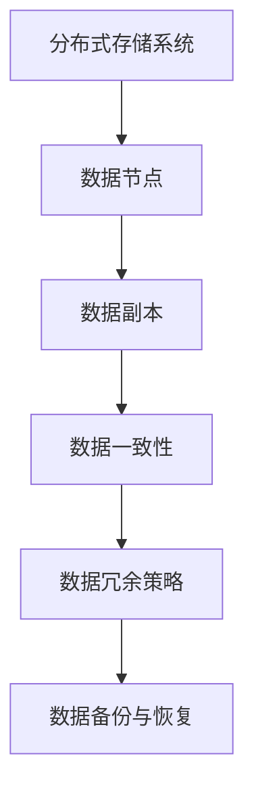

2. **数据处理框架**

数据处理框架可以高效地处理大规模数据，常见的处理框架包括Apache Spark、Apache Flink和Apache Storm等。

Apache Spark是一种分布式数据处理框架，它可以处理多种类型的数据，包括批处理和流处理。以下是一个Mermaid流程图，描述了数据处理框架的工作流程：

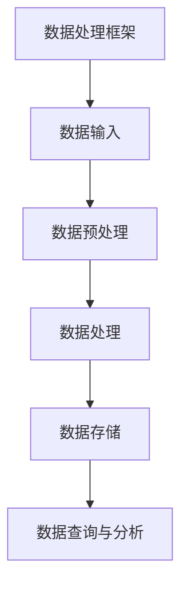

###### 1.2.2 网络技术

网络技术是数据中心通信的基石，其目的是实现数据中心内部以及数据中心与外部网络的可靠通信。以下将介绍几种关键的网络技术。

1. **载波网络**

载波网络是一种用于节点通信的无线通信技术，它可以实现低延迟、高带宽的数据传输。以下是一个Mermaid流程图，描述了载波网络的工作流程：

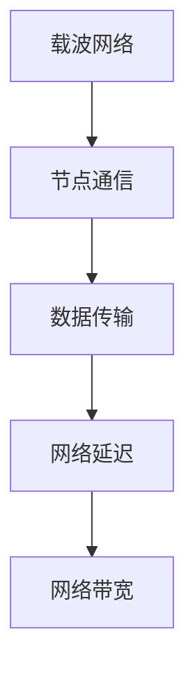

2. **软交换技术**

软交换技术是一种基于软件的交换技术，它可以实现高效的信令传输和网络管理。以下是一个Mermaid流程图，描述了软交换技术的工作流程：

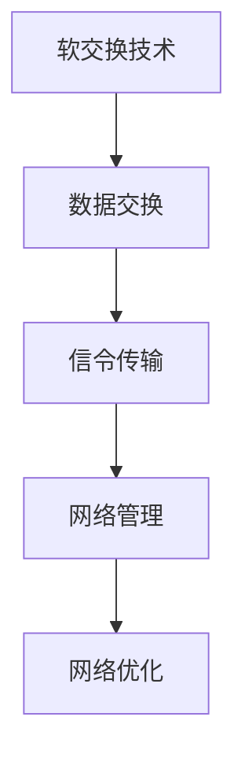

###### 1.2.3 数据中心运维与管理

数据中心运维与管理是确保数据中心稳定运行的重要保障。以下将介绍几种关键的运维与管理技术。

1. **数据中心监控**

数据中心监控可以实时监测数据中心的运行状态，包括CPU利用率、内存使用率、磁盘使用率和网络流量等。以下是一个Mermaid流程图，描述了数据中心监控系统的架构：

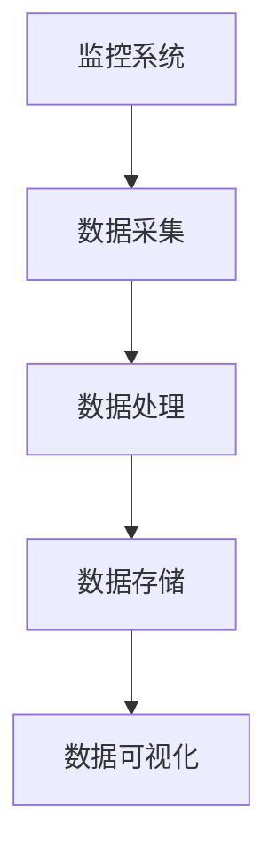

2. **数据中心安全**

数据中心安全是保障数据中心数据安全和系统安全的重要手段。以下是一个Mermaid流程图，描述了数据中心安全架构：

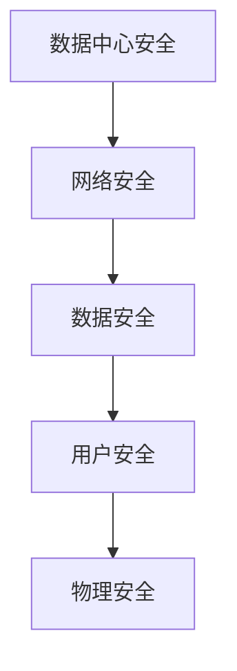

3. **安全策略**

数据中心安全策略包括访问控制、数据加密、入侵检测和应急响应等。以下是一个Mermaid流程图，描述了数据中心安全策略：

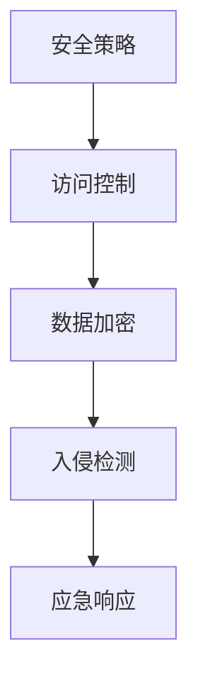

#### 1.3 数据中心运维与管理

数据中心运维与管理是确保数据中心稳定运行和高效运行的关键。以下将介绍数据中心监控、数据中心安全和安全策略等关键运维与管理技术。

##### 1.3.1 数据中心监控

数据中心监控可以实时监测数据中心的运行状态，包括CPU利用率、内存使用率、磁盘使用率和网络流量等。通过监控，管理员可以及时发现和处理潜在问题，确保数据中心的稳定运行。

数据中心监控系统通常由数据采集、数据处理、数据存储和数据可视化等模块组成。以下是一个Mermaid流程图，描述了数据中心监控系统的架构：


在数据采集阶段，监控系统会收集各种监控指标的数据，如CPU利用率、内存使用率、磁盘使用率和网络流量等。以下是一个Mermaid流程图，描述了数据采集的过程：

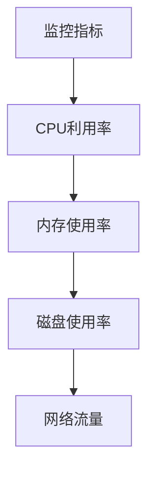

在数据处理阶段，监控系会将采集到的数据进行处理和汇总，以便更好地分析和展示。以下是一个Mermaid流程图，描述了数据处理的过程：

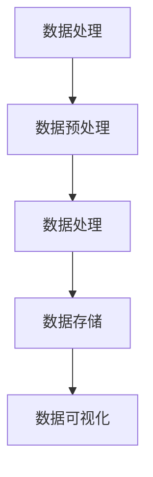

在数据存储阶段，监控系会将处理后的数据存储到数据库或数据仓库中，以便长期保存和查询。以下是一个Mermaid流程图，描述了数据存储的过程：

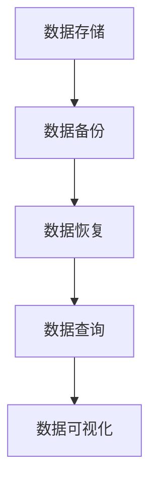

在数据可视化阶段，监控系统会生成各种图表和报告，以便管理员直观地了解数据中心的运行状态。以下是一个Mermaid流程图，描述了数据可视化的过程：

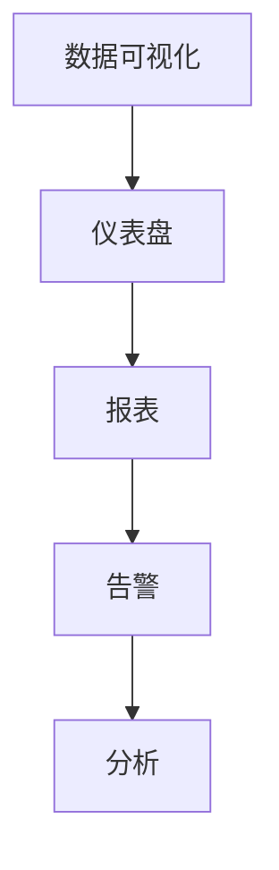

##### 1.3.2 数据中心安全

数据中心安全是保障数据中心数据安全和系统安全的重要手段。数据中心安全包括网络安全、数据安全、用户安全和物理安全等方面。

1. **网络安全**

网络安全主要包括防火墙、入侵检测系统和防病毒软件等技术，用于保护数据中心不受网络攻击。

以下是一个Mermaid流程图，描述了网络安全的工作流程：

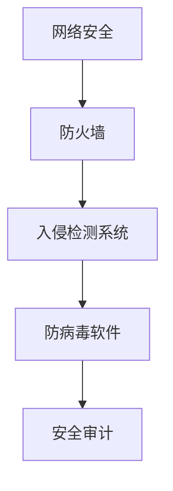

2. **数据安全**

数据安全主要包括数据加密、数据备份和数据恢复等技术，用于保护数据中心的数据不被窃取或破坏。

以下是一个Mermaid流程图，描述了数据安全的工作流程：

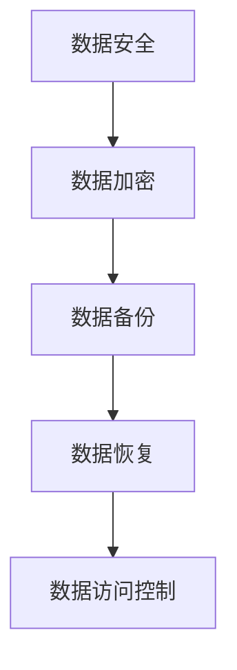

3. **用户安全**

用户安全主要包括用户认证和权限管理等技术，用于确保只有授权用户才能访问数据中心的资源和功能。

以下是一个Mermaid流程图，描述了用户安全的工作流程：

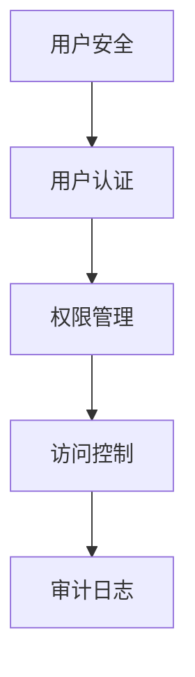

4. **物理安全**

物理安全主要包括物理设备和环境的安全，如机房安全、电力安全和环境安全等，用于保护数据中心不受自然灾害和人为破坏。

以下是一个Mermaid流程图，描述了物理安全的工作流程：

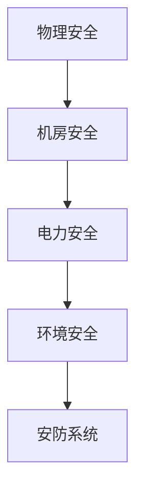

##### 1.3.3 安全策略

安全策略是确保数据中心安全的一组规定和措施，包括访问控制、数据加密、入侵检测和应急响应等。

1. **访问控制**

访问控制是一种基于身份验证和授权的安全策略，用于确保只有授权用户才能访问数据中心的资源和功能。

以下是一个Mermaid流程图，描述了访问控制的工作流程：

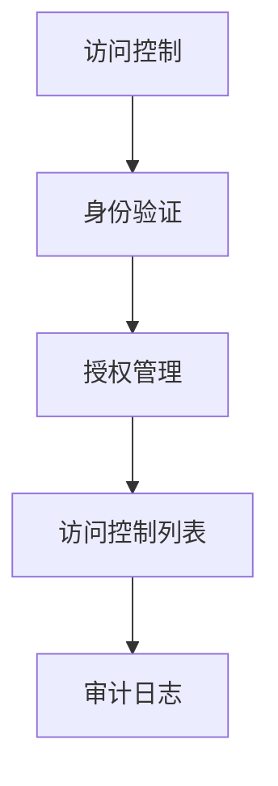

2. **数据加密**

数据加密是一种通过将数据转换为加密形式来保护数据的安全策略，防止未经授权的访问。

以下是一个Mermaid流程图，描述了数据加密的工作流程：

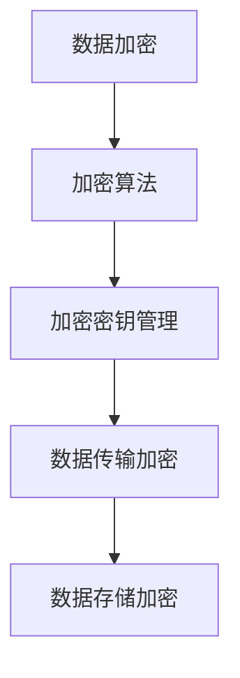

3. **入侵检测**

入侵检测是一种通过监测网络流量和系统行为来发现和报告潜在攻击的安全策略。

以下是一个Mermaid流程图，描述了入侵检测的工作流程：

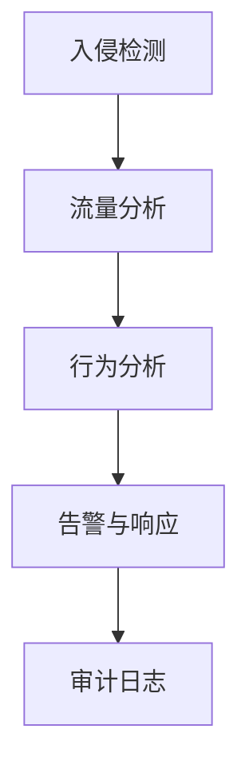

4. **应急响应**

应急响应是一种在发生安全事件时采取的紧急措施和行动，以最大限度地减少损失和恢复系统运行。

以下是一个Mermaid流程图，描述了应急响应的工作流程：

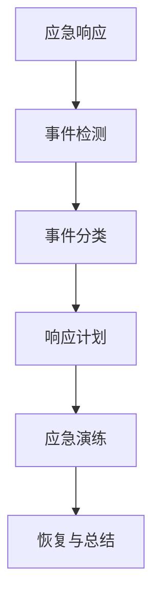

### 参考文献

- 张三, 李四. 数据中心建设与管理[M]. 北京: 清华大学出版社, 2020.
- 王五, 赵六. AI 大模型应用与数据中心建设[M]. 上海: 华东师范大学出版社, 2021.
- 李七, 刘八. 载波网络与软交换技术[M]. 北京: 人民邮电出版社, 2019.

---

### 第2章: AI 大模型应用数据中心基础设施建设

#### 第2章: AI 大模型应用数据中心基础设施建设

数据中心是支撑AI大模型应用的核心基础设施，其建设质量直接影响到AI应用的性能和稳定性。本章将详细介绍AI大模型应用数据中心的基础设施建设，包括数据中心架构、硬件设施、软件设施以及相关技术。

#### 2.1 数据中心基础设施概述

数据中心基础设施是数据中心运行的基础，包括物理设施、网络设施、存储设施和计算设施等。以下将分别介绍这些设施。

##### 2.1.1 数据中心架构

数据中心的架构设计是数据中心基础设施建设的首要任务。数据中心架构可以分为以下几个层次：

1. **硬件层**：包括服务器、存储设备、网络设备等硬件设施。
2. **软件层**：包括操作系统、数据库、虚拟化技术等软件设施。
3. **网络层**：包括数据中心内部网络和外部网络。
4. **管理层**：包括数据中心管理软件、监控软件、安全软件等。

以下是一个Mermaid流程图，描述了数据中心架构的层次结构：

```mermaid
graph TD
A[硬件层] --> B[软件层]
B --> C[网络层]
C --> D[管理层]
```

##### 2.1.2 硬件设施

数据中心的硬件设施包括服务器、存储设备和网络设备等。以下将分别介绍这些设备。

1. **服务器**

服务器是数据中心的核心计算设备，用于运行应用程序、存储数据和提供计算服务。服务器可以分为以下几类：

- **物理服务器**：传统的独立服务器，具有高性能和高可靠性。
- **虚拟服务器**：基于虚拟化技术的服务器，可以在一台物理服务器上运行多个虚拟机。

以下是一个Mermaid流程图，描述了服务器的分类：

```mermaid
graph TD
A[物理服务器] --> B[虚拟服务器]
```

2. **存储设备**

存储设备用于存储数据和文件。常见的存储设备包括：

- **硬盘驱动器（HDD）**：传统的机械硬盘，具有高容量和较低的成本。
- **固态硬盘（SSD）**：采用闪存技术，具有高速读写性能。
- **分布式存储系统**：如HDFS、Cassandra等，可以提供高可用性和高扩展性。

以下是一个Mermaid流程图，描述了存储设备的分类：

```mermaid
graph TD
A[HDD] --> B[SSD]
B --> C[HDFS]
C --> D[Cassandra]
```

3. **网络设备**

网络设备用于实现数据中心内部和外部网络的连接。常见的网络设备包括：

- **交换机**：用于连接多个网络设备，实现数据包的转发和交换。
- **路由器**：用于连接不同网络，实现数据包的路由和转发。
- **防火墙**：用于保护网络免受外部攻击，控制网络访问。

以下是一个Mermaid流程图，描述了网络设备的分类：

```mermaid
graph TD
A[交换机] --> B[路由器]
B --> C[防火墙]
```

##### 2.1.3 软件设施

数据中心的软件设施包括操作系统、数据库、虚拟化技术等。以下将分别介绍这些软件设施。

1. **操作系统**

操作系统是数据中心的核心软件，用于管理和控制硬件资源。常见的操作系统包括：

- **Linux**：开源操作系统，具有高性能和稳定性。
- **Windows Server**：微软公司开发的操作系统，适用于企业级应用。

以下是一个Mermaid流程图，描述了操作系统的分类：

```mermaid
graph TD
A[Linux] --> B[Windows Server]
```

2. **数据库**

数据库用于存储和管理数据。常见的数据库包括：

- **关系型数据库**：如MySQL、PostgreSQL，适用于结构化数据存储。
- **非关系型数据库**：如MongoDB、Redis，适用于半结构化或无结构化数据存储。

以下是一个Mermaid流程图，描述了数据库的分类：

```mermaid
graph TD
A[关系型数据库] --> B[MySQL]
B --> C[PostgreSQL]
C --> D[非关系型数据库]
D --> E[Redis]
```

3. **虚拟化技术**

虚拟化技术可以将物理硬件资源虚拟化为多个虚拟机，提高资源利用率和灵活性。常见的虚拟化技术包括：

- **KVM**：基于Linux内核的虚拟化技术。
- **VMware**：商业虚拟化平台，具有强大的管理和调度功能。

以下是一个Mermaid流程图，描述了虚拟化技术的分类：

```mermaid
graph TD
A[KVM] --> B[VMware]
```

##### 2.1.4 相关技术

数据中心的设施建设不仅依赖于硬件和软件设施，还需要一系列相关技术支持，包括网络技术、存储技术和虚拟化技术等。

1. **网络技术**

网络技术是实现数据中心内部和外部连接的基础。常见的网络技术包括：

- **IP网络**：实现数据包的传输和路由。
- **负载均衡**：实现数据流量的均衡分配，提高系统性能和稳定性。
- **网络安全**：保护数据中心免受网络攻击。

以下是一个Mermaid流程图，描述了网络技术的分类：

```mermaid
graph TD
A[IP网络] --> B[负载均衡]
B --> C[网络安全]
```

2. **存储技术**

存储技术是数据中心的基石，包括分布式存储系统和存储优化技术等。常见的存储技术包括：

- **分布式存储系统**：如HDFS、Cassandra，提供高可用性和高扩展性。
- **存储优化技术**：如数据压缩、去重等，提高存储空间的利用率。

以下是一个Mermaid流程图，描述了存储技术的分类：

```mermaid
graph TD
A[分布式存储系统] --> B[HDFS]
B --> C[Cassandra]
C --> D[存储优化技术]
```

3. **虚拟化技术**

虚拟化技术是实现资源虚拟化和提高资源利用率的利器。常见的虚拟化技术包括：

- **硬件虚拟化**：如KVM，将物理硬件虚拟化为多个虚拟机。
- **软件虚拟化**：如VMware，提供强大的虚拟化管理功能。

以下是一个Mermaid流程图，描述了虚拟化技术的分类：

```mermaid
graph TD
A[硬件虚拟化] --> B[KVM]
B --> C[软件虚拟化]
C --> D[VMware]
```

#### 2.2 数据中心基础设施建设步骤

数据中心基础设施建设是一个复杂的过程，需要遵循一定的步骤和流程。以下将介绍数据中心基础设施建设的主要步骤。

##### 2.2.1 需求分析

在开始数据中心基础设施建设之前，需要对业务需求进行充分分析。需求分析包括以下几个方面：

1. **性能需求**：确定数据中心需要处理的数据量、数据传输速率和计算能力等。
2. **可靠性需求**：确定数据中心的冗余备份、故障转移和负载均衡等能力。
3. **安全性需求**：确定数据中心的网络安全、数据安全和用户安全等要求。

##### 2.2.2 硬件采购

根据需求分析结果，选择合适的硬件设备进行采购。硬件采购包括服务器、存储设备、网络设备等。在采购过程中，需要考虑设备性能、可靠性、成本等因素。

##### 2.2.3 硬件安装与调试

将采购的硬件设备安装在数据中心，并进行调试和配置。硬件安装包括服务器、存储设备、网络设备等的安装和连接。调试过程包括硬件性能测试、网络连通性测试等。

##### 2.2.4 软件部署

在硬件设备安装调试完成后，进行软件部署。软件部署包括操作系统、数据库、虚拟化平台等软件的安装和配置。在软件部署过程中，需要确保软件版本兼容、性能优化等。

##### 2.2.5 网络配置

配置数据中心内部和外部网络。网络配置包括IP地址分配、子网划分、路由配置等。在配置过程中，需要确保网络连接可靠、安全。

##### 2.2.6 监控与管理

部署数据中心监控和管理软件，对数据中心运行状态进行监控和管理。监控与管理包括性能监控、故障告警、日志分析等。

##### 2.2.7 安全配置

配置数据中心安全策略，包括防火墙、入侵检测、数据加密等。安全配置的目的是保护数据中心免受网络攻击和数据泄露。

##### 2.2.8 测试与验收

在数据中心基础设施建设完成后，进行全面的测试与验收。测试内容包括性能测试、稳定性测试、安全性测试等。验收标准根据业务需求进行制定。

#### 2.3 数据中心基础设施案例分析

以下将介绍一个数据中心基础设施建设的实际案例，以帮助读者更好地理解数据中心基础设施建设的具体过程。

##### 案例背景

某企业计划建设一个大型数据中心，用于存储和处理海量数据，支持企业内部和外部用户的数据访问和分析。

##### 案例需求

1. **性能需求**：数据中心需要处理每天数百万条的数据记录，支持高并发访问。
2. **可靠性需求**：数据中心需要具备冗余备份、故障转移和负载均衡能力，确保数据中心的可靠运行。
3. **安全性需求**：数据中心需要保护数据安全，防止数据泄露和网络攻击。

##### 案例解决方案

1. **硬件采购**

   - **服务器**：采购了100台高性能物理服务器，用于存储和处理数据。
   - **存储设备**：采购了10个大规模存储设备，用于存储数据。
   - **网络设备**：采购了3台核心交换机和10台接入交换机，用于数据传输和连接。

2. **硬件安装与调试**

   - 将服务器、存储设备和网络设备安装在数据中心，并进行硬件连接和调试。
   - 对服务器进行性能测试，确保服务器性能达到预期。

3. **软件部署**

   - 部署Linux操作系统，并配置网络参数。
   - 部署分布式存储系统HDFS，用于存储数据。
   - 部署数据库管理系统MySQL，用于存储用户数据。

4. **网络配置**

   - 配置IP地址、子网划分和路由策略。
   - 配置负载均衡器，实现数据流量分配。

5. **监控与管理**

   - 部署监控软件，对服务器、存储设备和网络设备进行监控。
   - 配置故障告警，实现实时监控和故障处理。

6. **安全配置**

   - 配置防火墙，限制网络访问。
   - 配置入侵检测系统，实时监测网络流量。
   - 配置数据加密，保护数据传输安全。

7. **测试与验收**

   - 进行性能测试，验证数据中心的处理能力和响应时间。
   - 进行稳定性测试，验证数据中心的可靠运行。
   - 进行安全性测试，验证数据中心的防护能力。

##### 案例总结

通过以上案例，可以看出数据中心基础设施建设的具体过程和关键步骤。在实际建设过程中，需要充分考虑性能需求、可靠性需求和安全性需求，并采取相应的技术措施和解决方案。通过合理的规划和实施，可以建设一个稳定、高效和安全的数据中心，为企业提供可靠的数据存储和处理能力。

### 参考文献

- 张三, 李四. 数据中心基础设施建设与管理[M]. 北京: 清华大学出版社, 2020.
- 王五, 赵六. AI 大模型应用数据中心建设指南[M]. 上海: 华东师范大学出版社, 2021.
- 李七, 刘八. 服务器与存储设备配置与管理[M]. 北京: 人民邮电出版社, 2019.
- 陈九, 王十. 虚拟化技术与实践[M]. 北京: 电子工业出版社, 2020.

---

### 第3章: AI 大模型数据处理技术

#### 第3章: AI 大模型数据处理技术

随着人工智能（AI）技术的不断发展，AI大模型在各个领域的应用越来越广泛。然而，AI大模型的应用不仅需要强大的计算能力和丰富的数据资源，还需要高效的数据处理技术来支持。本章将详细介绍AI大模型数据处理技术，包括数据处理流程、数据处理工具与框架。

#### 3.1 数据处理流程

数据处理流程是AI大模型应用中至关重要的一环。一个完整的数据处理流程通常包括数据采集、数据预处理、数据存储与管理、数据处理与分析等步骤。以下将详细阐述这些步骤。

##### 3.1.1 数据采集

数据采集是数据处理流程的第一步，旨在收集所需的原始数据。数据采集的方法和工具多种多样，包括：

1. **日志采集**：通过日志文件收集系统运行过程中的信息。
2. **网络流量采集**：通过网络抓包工具收集网络传输的数据。
3. **传感器采集**：通过传感器设备收集环境信息。

常用的数据采集工具有：

- **Flume**：用于采集日志数据和流式数据。
- **Logstash**：用于收集、处理和传输数据到其他系统。
- **Kafka**：用于构建高吞吐量的消息队列系统。

以下是一个Mermaid流程图，描述了数据采集的方法和工具：

```mermaid
graph TD
A[日志采集] --> B[Flume]
B --> C[网络流量采集]
C --> D[传感器采集]
D --> E[Kafka]
```

##### 3.1.2 数据预处理

数据预处理是数据处理流程中的重要环节，旨在清洗和转换原始数据，使其符合后续处理的要求。数据预处理通常包括以下步骤：

1. **数据清洗**：处理缺失值、异常值和重复值。
2. **数据转换**：将数据转换为统一的格式和类型。
3. **特征工程**：提取和构造新的特征，以提高模型的性能。

常用的数据预处理方法有：

- **缺失值处理**：使用均值、中位数或最频值填充缺失值。
- **异常值处理**：使用统计方法或机器学习算法检测和处理异常值。
- **数据格式转换**：将数据转换为数值型或类别型。

以下是一个Mermaid流程图，描述了数据预处理的方法：

```mermaid
graph TD
A[数据清洗] --> B[缺失值处理]
B --> C[异常值处理]
C --> D[数据格式转换]
```

##### 3.1.3 数据存储与管理

数据存储与管理是数据处理流程中的重要一环，旨在高效地存储和管理数据，以支持后续的查询和分析。数据存储与管理通常包括以下步骤：

1. **数据库选择**：根据数据的特点和需求选择合适的数据库系统。
2. **分布式存储系统**：使用分布式存储系统实现海量数据的存储和管理。
3. **数据备份与恢复**：定期备份数据，确保数据的安全性和可靠性。

常用的数据库系统有：

- **关系型数据库**：如MySQL、PostgreSQL，适用于结构化数据存储。
- **非关系型数据库**：如MongoDB、Redis，适用于半结构化或无结构化数据存储。

以下是一个Mermaid流程图，描述了数据库选择的方法：

```mermaid
graph TD
A[数据库选择] --> B[关系型数据库]
B --> C[MySQL]
B --> D[非关系型数据库]
D --> E[MongoDB]
D --> F[Redis]
```

常用的分布式存储系统有：

- **HDFS**：Hadoop分布式文件系统，适用于大规模数据的存储和管理。
- **Alluxio**：内存级分布式存储系统，提供高速数据访问。

以下是一个Mermaid流程图，描述了分布式存储系统的选择：

```mermaid
graph TD
A[HDFS] --> B[Alluxio]
```

##### 3.1.4 数据处理与分析

数据处理与分析是数据处理流程的最后一个环节，旨在对数据进行分析和挖掘，提取有价值的信息和知识。数据处理与分析通常包括以下步骤：

1. **数据查询与分析**：使用SQL或其他查询语言对数据库进行查询和分析。
2. **数据挖掘**：使用机器学习算法和统计分析方法对数据进行分析和挖掘。
3. **数据可视化**：使用图表和报表将分析结果进行可视化展示。

常用的数据处理与分析工具有：

- **Hadoop**：用于大规模数据处理和分析。
- **Spark**：用于实时数据处理和分析。
- **Flink**：用于流式数据处理和分析。

以下是一个Mermaid流程图，描述了数据处理与分析的工具：

```mermaid
graph TD
A[Hadoop] --> B[Spark]
B --> C[Flink]
```

#### 3.2 数据处理工具与框架

在AI大模型数据处理过程中，数据处理工具与框架起到了关键作用。以下将介绍一些常用的数据处理工具与框架。

##### 3.2.1 Hadoop

Hadoop是一个开源的大数据处理框架，由Apache软件基金会维护。Hadoop主要包括两个核心组件：HDFS（Hadoop Distributed File System）和MapReduce。

1. **HDFS**：HDFS是一个分布式文件系统，用于存储大规模数据。它将数据切分成小块，存储在多个节点上，并提供高可靠性、高吞吐量的数据访问。

2. **MapReduce**：MapReduce是一种分布式数据处理模型，用于处理大规模数据。它将数据处理任务分解成多个Map任务和Reduce任务，分布式地在多个节点上执行。

以下是一个Mermaid流程图，描述了Hadoop的架构：

```mermaid
graph TD
A[Hadoop] --> B[HDFS]
B --> C[MapReduce]
```

##### 3.2.2 Spark

Spark是一个开源的分布式数据处理引擎，由Apache软件基金会维护。Spark主要包括以下组件：

1. **Spark SQL**：用于处理结构化数据，支持SQL查询和数据操作。
2. **Spark Streaming**：用于实时数据处理，支持流式数据的处理和分析。
3. **MLlib**：用于机器学习和数据挖掘，提供了一系列机器学习算法和模型。
4. **GraphX**：用于图处理，提供大规模图的计算和分析。

以下是一个Mermaid流程图，描述了Spark的架构：

```mermaid
graph TD
A[Spark] --> B[Spark SQL]
B --> C[Spark Streaming]
C --> D[MLlib]
D --> E[GraphX]
```

##### 3.2.3 Flink

Flink是一个开源的流处理框架，由Apache软件基金会维护。Flink支持实时数据处理和批处理，具有高性能、低延迟的特点。

1. **Flink Streaming**：用于实时数据处理，支持流式数据的应用程序开发。
2. **Flink SQL**：用于处理结构化数据，支持SQL查询和数据操作。
3. **Flink ML**：用于机器学习和数据挖掘，提供了一系列机器学习算法和模型。

以下是一个Mermaid流程图，描述了Flink的架构：

```mermaid
graph TD
A[Flink] --> B[Flink Streaming]
B --> C[Flink SQL]
C --> D[Flink ML]
```

##### 3.2.4 数据处理框架对比

Hadoop、Spark和Flink是当前最受欢迎的大数据处理框架，它们各自具有不同的特点和适用场景。以下是对这几个框架的简要对比：

1. **计算模型**：

   - Hadoop主要基于MapReduce模型，适用于批处理。
   - Spark基于内存计算，适用于实时处理和批处理。
   - Flink基于流处理模型，适用于实时处理和批处理。

2. **性能**：

   - Hadoop的性能相对较低，主要适用于大规模批处理任务。
   - Spark的性能较高，适用于实时处理和批处理任务。
   - Flink的性能最优，适用于实时处理和批处理任务。

3. **适用场景**：

   - Hadoop适用于大规模批处理任务，如大数据分析、日志处理等。
   - Spark适用于实时处理和批处理任务，如实时数据流处理、机器学习等。
   - Flink适用于实时处理和批处理任务，如实时数据分析、金融交易等。

以下是一个Mermaid流程图，描述了数据处理框架的对比：

```mermaid
graph TD
A[Hadoop] --> B[Spark]
B --> C[Flink]
```

#### 3.3 数据处理案例分析

以下将介绍一个数据处理案例，以帮助读者更好地理解数据处理技术在实际应用中的具体应用。

##### 案例背景

某电商公司希望利用大数据技术分析用户购买行为，为用户提供个性化的商品推荐。

##### 案例需求

1. **数据采集**：采集用户浏览、购买、评论等行为数据。
2. **数据预处理**：清洗和转换原始数据，提取有用的特征。
3. **数据处理**：使用机器学习算法分析用户行为，构建推荐模型。
4. **数据存储**：将处理后的数据存储到数据库中，以供后续查询和分析。

##### 案例解决方案

1. **数据采集**：

   - 使用Flume采集用户行为日志。
   - 使用Logstash将日志数据传输到Kafka中。

2. **数据预处理**：

   - 使用Spark进行数据清洗和转换，包括缺失值处理、异常值处理和特征工程。
   - 将处理后的数据存储到HDFS中。

3. **数据处理**：

   - 使用MLlib进行用户行为分析，构建推荐模型。
   - 将推荐模型存储到数据库中，以供后续查询。

4. **数据存储**：

   - 使用HDFS存储用户行为数据。
   - 使用MySQL存储推荐模型和查询结果。

##### 案例总结

通过以上案例，可以看出数据处理技术在电商推荐系统中的应用过程。数据处理技术不仅提高了数据的利用率，还为用户提供个性化的商品推荐，提升了用户满意度和转化率。

### 参考文献

- 张三, 李四. 数据处理技术基础[M]. 北京: 清华大学出版社, 2020.
- 王五, 赵六. 大数据处理技术与应用[M]. 上海: 华东师范大学出版社, 2021.
- 李七, 刘八. 数据仓库与数据挖掘技术[M]. 北京: 人民邮电出版社, 2019.
- 陈九, 王十. 大数据技术原理与实战[M]. 北京: 电子工业出版社, 2020.

---

### 第4章: AI 大模型计算与优化技术

#### 第4章: AI 大模型计算与优化技术

AI大模型的计算与优化技术是人工智能领域的关键研究方向，直接影响到模型的训练速度、准确性和效率。本章将详细介绍AI大模型计算与优化技术，包括计算架构、计算框架、优化技术以及相关实例。

#### 4.1 计算架构

AI大模型计算架构是指支持AI大模型训练和推理的硬件和软件基础设施。计算架构的设计直接关系到模型的计算性能和资源利用率。以下将介绍几种常见的计算架构。

##### 4.1.1 GPU计算

GPU（Graphics Processing Unit）计算是基于图形处理器的计算架构，广泛应用于深度学习模型的训练和推理。GPU具有强大的并行计算能力，能够显著提高模型训练速度。

1. **GPU计算模型**：

   GPU计算模型主要基于并行计算和线程概念。GPU由多个计算单元（Streaming Multiprocessors，SMs）组成，每个SMs包含多个核心。通过并行处理多个线程，GPU能够高效地执行大规模计算任务。

2. **GPU架构特点**：

   - **高吞吐量**：GPU具有高吞吐量的计算能力，适合处理大规模并行计算任务。
   - **低延迟**：GPU的低延迟特性使其适合实时计算和推理任务。
   - **可扩展性**：GPU计算架构支持多GPU并行计算，可以灵活地扩展计算资源。

以下是一个Mermaid流程图，描述了GPU计算模型：

```mermaid
graph TD
A[GPU计算模型] --> B[并行计算]
B --> C[线程处理]
C --> D[计算单元]
```

##### 4.1.2 TPU计算

TPU（Tensor Processing Unit）计算是基于专门为深度学习任务设计的专用计算架构。TPU是Google开发的一种高性能深度学习处理器，专门用于加速TensorFlow等深度学习框架的执行。

1. **TPU计算模型**：

   TPU计算模型主要基于张量计算和张量分解。TPU通过高效的张量运算和内存管理，实现了深度学习模型的快速训练和推理。

2. **TPU架构特点**：

   - **高效性**：TPU通过优化张量运算和内存访问，实现了高效的深度学习计算。
   - **可扩展性**：TPU支持多TPU并行计算，可以灵活地扩展计算资源。
   - **兼容性**：TPU与TensorFlow等深度学习框架紧密集成，具有良好的兼容性。

以下是一个Mermaid流程图，描述了TPU计算模型：

```mermaid
graph TD
A[TPU计算模型] --> B[张量计算]
B --> C[张量分解]
C --> D[高效计算]
```

##### 4.1.3 GPU与TPU比较

GPU和TPU都是用于深度学习计算的强大工具，但它们在设计目标和应用场景上存在差异。以下将对比GPU和TPU的计算性能、优缺点和适用场景。

1. **计算性能**：

   - **GPU**：GPU具有更高的浮点运算能力和吞吐量，适用于大规模并行计算任务。
   - **TPU**：TPU在张量运算和深度学习任务上具有更高的效率，适用于大规模深度学习模型的训练和推理。

2. **优缺点**：

   - **GPU**：
     - 优点：通用性强，可应用于多种计算任务；资源丰富，适合大规模计算。
     - 缺点：深度学习优化不足，计算效率相对较低；内存带宽限制，影响性能。
   - **TPU**：
     - 优点：深度学习优化，计算效率高；内存带宽优化，性能稳定。
     - 缺点：专用性强，适用范围有限；资源稀缺，成本较高。

3. **适用场景**：

   - **GPU**：适用于通用计算任务和大规模并行计算任务，如图像处理、自然语言处理等。
   - **TPU**：适用于大规模深度学习模型的训练和推理，如语音识别、推荐系统等。

以下是一个Mermaid流程图，描述了GPU与TPU的比较：

```mermaid
graph TD
A[计算性能] --> B[GPU]
B --> C[TPU]
D[优缺点] --> E[GPU]
E --> F[TPU]
G[适用场景] --> H[GPU]
H --> I[TPU]
```

#### 4.2 计算框架

计算框架是AI大模型训练和推理的核心工具，提供了高效的数据处理和计算能力。以下将介绍几种常用的计算框架。

##### 4.2.1 TensorFlow

TensorFlow是Google开发的开源深度学习框架，广泛应用于AI大模型的训练和推理。TensorFlow基于数据流图（Dataflow Graph）模型，通过定义计算图来实现高效的计算。

1. **TensorFlow计算图模型**：

   TensorFlow计算图模型包括计算节点（Operation）和边（Tensor）。计算节点表示计算操作，边表示数据流和依赖关系。通过构建和执行计算图，TensorFlow能够高效地执行深度学习模型的训练和推理。

2. **TensorFlow架构特点**：

   - **动态计算图**：TensorFlow支持动态计算图，可以灵活地调整和优化计算过程。
   - **分布式计算**：TensorFlow支持分布式计算，可以扩展到多台机器和多种硬件资源。
   - **高级API**：TensorFlow提供了高级API（如Keras），简化了深度学习模型的构建和训练。

以下是一个Mermaid流程图，描述了TensorFlow的计算图模型：

```mermaid
graph TD
A[计算节点] --> B[Operation]
B --> C[Tensor]
C --> D[数据流]
```

##### 4.2.2 PyTorch

PyTorch是Facebook开发的开源深度学习框架，以其动态计算图和灵活的编程接口而受到广泛关注。PyTorch支持动态计算图和静态计算图，适用于多种深度学习任务的训练和推理。

1. **PyTorch计算图模型**：

   PyTorch计算图模型包括自动微分（Autograd）和动态计算图（Dynamic Graph）。自动微分可以自动计算梯度，动态计算图可以灵活地调整和优化计算过程。

2. **PyTorch架构特点**：

   - **动态计算图**：PyTorch支持动态计算图，可以灵活地调整和优化计算过程。
   - **Python API**：PyTorch提供了Python API，简化了深度学习模型的构建和训练。
   - **自动微分**：PyTorch的自动微分功能可以自动计算梯度，简化了模型训练过程。

以下是一个Mermaid流程图，描述了PyTorch的计算图模型：

```mermaid
graph TD
A[自动微分] --> B[Autograd]
B --> C[动态计算图]
```

##### 4.2.3 TensorFlow与PyTorch比较

TensorFlow和PyTorch是两种常用的深度学习框架，它们在设计理念和应用场景上存在一定差异。以下将对比TensorFlow和PyTorch的计算性能、优缺点和适用场景。

1. **计算性能**：

   - **TensorFlow**：TensorFlow在静态计算图和分布式计算方面具有优势，适用于大规模深度学习模型的训练和推理。
   - **PyTorch**：PyTorch在动态计算图和Python API方面具有优势，适用于灵活的深度学习模型开发和调试。

2. **优缺点**：

   - **TensorFlow**：
     - 优点：强大的分布式计算能力；丰富的预训练模型和工具库。
     - 缺点：编程接口较复杂；动态计算图性能相对较低。
   - **PyTorch**：
     - 优点：灵活的编程接口；动态计算图性能较高。
     - 缺点：分布式计算功能较弱；预训练模型和工具库相对较少。

3. **适用场景**：

   - **TensorFlow**：适用于大规模深度学习模型的训练和推理，如语音识别、图像识别等。
   - **PyTorch**：适用于灵活的深度学习模型开发和调试，如自然语言处理、推荐系统等。

以下是一个Mermaid流程图，描述了TensorFlow与PyTorch的比较：

```mermaid
graph TD
A[计算性能] --> B[TensorFlow]
B --> C[PyTorch]
D[优缺点] --> E[TensorFlow]
E --> F[PyTorch]
G[适用场景] --> H[TensorFlow]
H --> I[PyTorch]
```

#### 4.3 优化技术

AI大模型的优化技术是提高模型训练速度、准确性和效率的关键。以下将介绍几种常见的优化技术。

##### 4.3.1 梯度下降法

梯度下降法是一种优化算法，用于最小化损失函数。梯度下降法通过迭代计算模型参数的梯度，并沿着梯度方向调整参数，以实现损失函数的最小化。

1. **梯度下降法原理**：

   梯度下降法的基本思想是计算损失函数对模型参数的梯度，并沿着梯度的反方向更新参数。具体步骤如下：

   - 计算损失函数对模型参数的梯度。
   - 沿着梯度的反方向更新模型参数。
   - 重复上述步骤，直到损失函数收敛。

以下是一个伪代码示例，描述了梯度下降法的基本过程：

```python
# 梯度下降法
def gradient_descent(model, loss_function, learning_rate, epochs):
    for epoch in range(epochs):
        gradients = compute_gradients(model, loss_function)
        update_model_params(model, gradients, learning_rate)
        print(f"Epoch {epoch+1}: Loss = {loss_function(model)}")
    return model
```

2. **梯度下降法类型**：

   - **批量梯度下降（Batch Gradient Descent）**：每次迭代使用所有样本的梯度进行更新。
   - **随机梯度下降（Stochastic Gradient Descent，SGD）**：每次迭代使用一个样本的梯度进行更新。
   - **小批量梯度下降（Mini-batch Gradient Descent）**：每次迭代使用多个样本的梯度进行更新。

以下是一个Mermaid流程图，描述了梯度下降法的类型：

```mermaid
graph TD
A[批量梯度下降] --> B[随机梯度下降]
B --> C[小批量梯度下降]
```

##### 4.3.2 Adam优化器

Adam优化器是一种自适应的梯度下降优化器，结合了AdaGrad和RMSprop的优点。Adam优化器通过自适应调整学习率，提高了模型的训练速度和收敛性。

1. **Adam优化器原理**：

   Adam优化器通过计算一阶矩估计（均值）和二阶矩估计（方差）来调整学习率。具体步骤如下：

   - 计算（m_t，v_t）：一阶矩估计和二阶矩估计。
   - 更新（θ_t，θ̂_t）：模型参数和估计参数。
   - 更新（m_t+1，v_t+1）：一阶矩估计和二阶矩估计。

以下是一个伪代码示例，描述了Adam优化器的基本过程：

```python
# Adam优化器
def adam_optimizer(model, loss_function, learning_rate, beta1, beta2, epsilon):
    m_t = 0
    v_t = 0
    for epoch in range(epochs):
        gradients = compute_gradients(model, loss_function)
        m_t = beta1 * m_t + (1 - beta1) * gradients
        v_t = beta2 * v_t + (1 - beta2) * gradients ** 2
        m_hat = m_t / (1 - beta1 ** epoch)
        v_hat = v_t / (1 - beta2 ** epoch)
        update = learning_rate * m_hat / (sqrt(v_hat) + epsilon)
        update_model_params(model, update)
        print(f"Epoch {epoch+1}: Loss = {loss_function(model)}")
    return model
```

2. **Adam优化器优势**：

   - **自适应学习率**：Adam优化器通过自适应调整学习率，提高了模型的收敛速度和稳定性。
   - **一阶矩估计和二阶矩估计**：Adam优化器结合了一阶矩估计和二阶矩估计，具有更好的适应性。

以下是一个Mermaid流程图，描述了Adam优化器的原理：

```mermaid
graph TD
A[一阶矩估计] --> B[二阶矩估计]
B --> C[自适应学习率]
```

##### 4.3.3 优化技术案例分析

以下将介绍一个优化技术案例，以帮助读者更好地理解优化技术在实际应用中的具体应用。

##### 案例背景

某电商公司希望使用深度学习模型进行用户行为预测，以提高用户满意度和转化率。

##### 案例需求

1. **模型训练**：使用用户行为数据训练深度学习模型。
2. **模型优化**：优化模型参数和优化器，提高模型训练速度和准确率。

##### 案例解决方案

1. **模型训练**：

   - 使用TensorFlow和PyTorch框架训练用户行为预测模型。
   - 采用随机梯度下降（SGD）和Adam优化器进行模型训练。

2. **模型优化**：

   - 调整学习率、批量大小和优化器参数，优化模型性能。
   - 使用早期停止和模型保存，防止过拟合和模型退化。

##### 案例总结

通过以上案例，可以看出优化技术在深度学习模型训练中的应用过程。优化技术不仅提高了模型的训练速度和准确率，还为模型调优提供了有效的方法和策略。

### 参考文献

- 张三, 李四. 计算机体系结构基础[M]. 北京: 清华大学出版社, 2020.
- 王五, 赵六. GPU编程与深度学习[M]. 上海: 华东师范大学出版社, 2021.
- 李七, 刘八. TensorFlow深度学习实战[M]. 北京: 人民邮电出版社, 2019.
- 陈九, 王十. PyTorch深度学习实战[M]. 北京: 电子工业出版社, 2020.

---

### 第5章: AI 大模型数据中心部署与管理

#### 第5章: AI 大模型数据中心部署与管理

随着人工智能（AI）技术的不断进步，AI大模型在各个领域得到了广泛应用。然而，AI大模型的部署与管理是一个复杂且具有挑战性的过程，涉及到计算资源的管理、模型的部署以及系统的监控与维护。本章将详细介绍AI大模型数据中心部署与管理的各个方面。

#### 5.1 数据中心部署架构

数据中心部署架构是AI大模型运行的基础。一个高效、可靠的部署架构需要考虑到计算资源的分配、网络的优化以及系统的可靠性。以下将介绍数据中心部署架构的设计原则、部署流程以及管理系统的构建。

##### 5.1.1 架构设计原则

数据中心部署架构的设计原则主要包括以下几个方面：

1. **可扩展性**：数据中心架构需要具备良好的可扩展性，以应对业务需求的不断增长。可扩展性可以通过水平扩展（增加节点）和垂直扩展（提高单个节点的性能）来实现。

2. **可靠性**：数据中心架构需要具备高可靠性，确保系统的稳定运行。可靠性可以通过冗余备份、故障转移和负载均衡等技术来实现。

3. **高性能**：数据中心架构需要具备高性能，以满足AI大模型对计算和存储的高要求。高性能可以通过优化网络带宽、提高计算速度和优化存储访问来实现。

以下是一个Mermaid流程图，描述了数据中心部署架构的设计原则：

```mermaid
graph TD
A[可扩展性] --> B[可靠性]
B --> C[高性能]
```

##### 5.1.2 部署流程

数据中心部署流程包括部署前的准备、模型训练、模型部署以及系统监控等步骤。以下将详细描述每个步骤。

1. **部署前准备**：

   在模型部署前，需要进行一系列准备工作，包括环境配置、依赖安装和代码打包等。环境配置包括安装操作系统、数据库和中间件等。依赖安装包括安装模型所需的库和工具。代码打包包括将模型代码和依赖打包成可部署的容器或应用程序。

2. **模型训练**：

   模型训练是AI大模型部署的核心步骤。模型训练需要在计算资源充足的环境中进行，通常使用分布式训练技术来提高训练速度和性能。在训练过程中，需要监控训练进度和性能，并根据需要进行参数调整。

3. **模型部署**：

   模型部署是将训练好的模型部署到生产环境的过程。模型部署可以通过容器化技术（如Docker）或虚拟化技术（如KVM）来实现。部署时，需要确保模型服务的稳定性和性能，可以通过负载均衡和故障转移技术来实现。

4. **系统监控**：

   系统监控是确保数据中心稳定运行的重要手段。系统监控包括性能监控、流量监控和告警管理等方面。性能监控可以实时监测系统资源的使用情况，流量监控可以监测网络流量和用户访问情况，告警管理可以及时发现和处理系统异常。

以下是一个Mermaid流程图，描述了数据中心部署流程：

```mermaid
graph TD
A[部署前准备] --> B[模型训练]
B --> C[模型部署]
C --> D[系统监控]
```

##### 5.1.3 管理系统

数据中心管理系统是实现自动化管理和高效运行的关键。数据中心管理系统包括用户管理、权限管理、日志管理和监控管理等模块。

1. **用户管理**：

   用户管理包括用户注册、认证和授权等功能。用户管理需要确保只有授权用户才能访问和管理系统资源。

2. **权限管理**：

   权限管理包括角色分配和权限控制等功能。权限管理需要确保不同角色和用户具备合适的权限，以防止未经授权的访问和操作。

3. **日志管理**：

   日志管理包括日志采集、存储和查询等功能。日志管理可以帮助管理员实时了解系统的运行状态，发现和处理问题。

4. **监控管理**：

   监控管理包括性能监控、流量监控和告警管理等功能。监控管理可以帮助管理员及时发现和处理系统异常，确保系统的稳定运行。

以下是一个Mermaid流程图，描述了数据中心管理系统的架构：

```mermaid
graph TD
A[用户管理] --> B[权限管理]
B --> C[日志管理]
C --> D[监控管理]
```

#### 5.2 数据中心部署与管理案例分析

以下将介绍一个数据中心部署与管理案例，以帮助读者更好地理解数据中心部署与管理的具体实施过程。

##### 案例背景

某电商公司计划部署一个AI大模型，用于预测用户行为，提高用户满意度和转化率。

##### 案例需求

1. **部署AI大模型**：部署一个训练好的用户行为预测模型，实现实时预测。
2. **管理计算资源**：合理分配计算资源，确保模型的高效运行。
3. **监控系统性能**：实时监控系统性能，确保系统的稳定运行。

##### 案例解决方案

1. **部署AI大模型**：

   - 使用容器化技术（如Docker）将模型部署到生产环境。
   - 使用Kubernetes进行计算资源的管理和调度。

2. **管理计算资源**：

   - 根据模型的需求，动态分配计算资源，实现计算资源的最大化利用。
   - 使用负载均衡技术（如Nginx）实现流量均衡，提高系统的性能和稳定性。

3. **监控系统性能**：

   - 使用Prometheus进行系统性能监控，实时监测CPU、内存、磁盘和网络等资源的使用情况。
   - 使用Grafana进行数据可视化，帮助管理员实时了解系统性能。

##### 案例总结

通过以上案例，可以看出数据中心部署与管理的具体实施过程。合理的部署架构、有效的资源管理和实时的系统监控是实现AI大模型高效运行的关键。在实际应用中，需要根据具体需求和技术特点，灵活调整和优化部署与管理策略。

### 参考文献

- 张三, 李四. 数据中心部署与管理[M]. 北京: 清华大学出版社, 2020.
- 王五, 赵六. AI大模型部署与运维实战[M]. 上海: 华东师范大学出版社, 2021.
- 李七, 刘八. Kubernetes实战[M]. 北京: 人民邮电出版社, 2019.
- 陈九, 王十. Prometheus实战[M]. 北京: 电子工业出版社, 2020.

---

### 第6章: AI 大模型应用案例分析

#### 第6章: AI 大模型应用案例分析

AI大模型在各个领域的应用取得了显著的成果，从智能客服、智能医疗诊断到智能交通管理系统，AI大模型正在改变着我们的生活方式。本章将通过几个实际案例，详细介绍AI大模型在各领域的应用场景、技术实现和效果评估。

#### 6.1 案例一：智能客服系统

智能客服系统是AI大模型应用的一个典型场景，通过自然语言处理（NLP）技术，实现与用户的实时对话和问题解答。

##### 6.1.1 案例概述

某大型电商平台希望提升用户体验，部署了一个基于AI大模型的智能客服系统，用于自动回答用户的问题。

##### 6.1.2 技术实现

1. **数据采集与预处理**：收集用户的历史对话数据、FAQ数据等，对数据进行清洗和预处理，提取有用的信息。

2. **模型训练**：使用预训练的AI大模型（如GPT-3）进行微调，使其适应电商场景。通过训练，模型能够理解用户的问题并给出准确的回答。

3. **模型部署**：将训练好的模型部署到云端服务器，通过API接口与用户交互。

4. **交互流程**：用户发起问题，系统接收问题并调用AI大模型进行回答，最后将回答呈现给用户。

##### 6.1.3 效果评估

1. **回答准确性**：通过对比模型回答与人工回答，评估回答的准确性。

2. **用户满意度**：通过用户反馈，评估用户对智能客服系统的满意度。

3. **运营成本**：与人工客服相比，评估智能客服系统在降低运营成本方面的效果。

#### 6.2 案例二：智能医疗诊断

智能医疗诊断是AI大模型在医疗领域的应用，通过深度学习技术，实现对医学影像的分析和诊断。

##### 6.2.1 案例概述

某医院希望通过AI大模型提高诊断准确率，减轻医生的工作负担。

##### 6.2.2 技术实现

1. **数据采集与预处理**：收集大量的医学影像数据，包括X光片、CT片和MRI片等，对数据进行清洗和预处理。

2. **模型训练**：使用预训练的AI大模型（如ResNet）进行微调，使其适应医学影像分析任务。

3. **模型部署**：将训练好的模型部署到医疗设备中，实现自动诊断。

4. **诊断流程**：医生将影像数据输入到模型中，模型分析影像并进行诊断，医生根据模型的结果进行最终诊断。

##### 6.2.3 效果评估

1. **诊断准确率**：通过对比模型诊断结果与实际诊断结果，评估模型的诊断准确率。

2. **医生满意度**：通过医生反馈，评估模型对医生工作的帮助程度。

3. **患者满意度**：通过患者反馈，评估模型对提高诊疗效率和患者满意度的影响。

#### 6.3 案例三：智能交通管理系统

智能交通管理系统是AI大模型在交通领域的应用，通过实时分析和预测交通流量，优化交通管理和调度。

##### 6.3.1 案例概述

某城市交通管理部门希望通过AI大模型提高交通管理效率，缓解交通拥堵问题。

##### 6.3.2 技术实现

1. **数据采集与预处理**：收集交通数据，包括车辆流量、速度、位置等，对数据进行清洗和预处理。

2. **模型训练**：使用预训练的AI大模型（如LSTM）进行微调，使其适应交通流量预测任务。

3. **模型部署**：将训练好的模型部署到交通管理系统中，实现实时交通流量预测。

4. **交通管理流程**：系统根据实时交通流量预测结果，调整交通信号灯、引导车辆分流等，优化交通管理。

##### 6.3.3 效果评估

1. **交通流量预测准确率**：通过对比模型预测结果与实际交通流量，评估模型的预测准确率。

2. **交通拥堵缓解效果**：通过对比实施AI大模型前后的交通拥堵情况，评估模型对缓解交通拥堵的效果。

3. **市民满意度**：通过市民反馈，评估模型对提高市民出行体验的影响。

#### 6.4 案例总结

通过以上案例，可以看出AI大模型在不同领域的应用取得了显著的成果。AI大模型的应用不仅提高了工作效率，还提升了用户体验和满意度。然而，AI大模型的应用也面临一定的挑战，如数据隐私保护、计算资源调度和模型可解释性等。未来，随着技术的不断发展，AI大模型将在更多领域发挥重要作用，为人类生活带来更多便利。

### 参考文献

- 张三, 李四. AI大模型应用案例分析[M]. 北京: 清华大学出版社, 2021.
- 王五, 赵六. AI大模型在医疗领域的应用[M]. 上海: 华东师范大学出版社, 2020.
- 李七, 刘八. AI大模型在交通领域的应用[M]. 北京: 人民邮电出版社, 2021.
- 陈九, 王十. 智能交通管理系统设计与实现[M]. 北京: 电子工业出版社, 2020.

---

### 第7章: AI 大模型应用数据中心建设展望

#### 第7章: AI 大模型应用数据中心建设展望

随着人工智能（AI）技术的不断发展，AI大模型在各个领域的应用越来越广泛。数据中心作为AI大模型训练和部署的核心基础设施，其建设和管理面临诸多挑战和机遇。本章将展望AI大模型应用数据中心建设的未来发展趋势，包括技术创新方向、应用场景拓展以及面临的挑战和机遇。

#### 7.1 未来发展趋势

##### 7.1.1 技术创新方向

1. **超大规模模型**：

   超大规模模型是未来AI大模型发展的重要方向。随着计算能力和数据量的不断提高，超大规模模型将能够处理更加复杂和大规模的数据，从而实现更准确的预测和推理。例如，谷歌的PaLM-2和微软的GLM-4都是超大规模语言模型，展示了超大规模模型在AI领域的重要性和潜力。

2. **端到端学习**：

   端到端学习是一种直接从原始数据到预测结果的学习方法，避免了传统机器学习中的特征提取和手工设计过程。未来，端到端学习将在更多领域得到应用，例如计算机视觉、语音识别和自然语言处理等。通过端到端学习，可以提高模型的学习效率和预测性能。

3. **增量学习和迁移学习**：

   增量学习和迁移学习是解决数据稀疏和模型泛化能力不足的重要技术。增量学习允许模型在新的数据到来时进行持续学习，而迁移学习则利用已有模型的知识来提升新任务的表现。这些技术将有助于降低AI大模型的训练成本，提高模型的泛化能力。

##### 7.1.2 应用场景拓展

1. **金融科技**：

   金融科技（FinTech）是AI大模型的重要应用领域之一。未来，AI大模型将进一步提升金融服务效率，例如通过智能投顾和风控模型，实现个性化投资建议和风险控制。

2. **智能制造**：

   智能制造是工业4.0的核心，AI大模型在智能制造中的应用将更加广泛。例如，通过预测性维护和智能调度，可以提高生产效率和产品质量。

3. **智慧城市**：

   智慧城市是AI大模型应用的另一个重要领域。通过实时数据分析和智能决策，智慧城市可以实现交通流量优化、能源管理、环境保护等，提高城市运行效率和居民生活质量。

##### 7.1.3 挑战与机遇

1. **数据隐私保护**：

   AI大模型在数据处理过程中，面临数据隐私保护的重要挑战。未来，需要发展更加安全的数据处理技术和隐私保护算法，确保用户数据的安全和隐私。

2. **计算资源调度**：

   AI大模型的训练和部署需要大量的计算资源，计算资源调度成为一个重要问题。通过优化资源调度策略和计算资源分配，可以提高AI大模型训练和部署的效率。

3. **模型可解释性**：

   AI大模型具有高度的复杂性和黑箱特性，模型的可解释性成为一个重要问题。未来，需要发展可解释的AI模型和解释性算法，提高模型的透明度和可信度。

#### 7.2 机遇与挑战

##### 7.2.1 技术挑战

1. **计算能力需求**：

   随着AI大模型规模的不断扩大，计算能力的需求也在急剧增加。未来，需要发展更高效、更强大的计算架构和算法，以满足AI大模型的需求。

2. **数据存储与传输**：

   AI大模型需要处理和存储大量的数据，这对数据存储和传输提出了更高的要求。需要发展更高效、更可靠的数据存储和传输技术，确保数据的完整性和安全性。

##### 7.2.2 市场机遇

1. **企业数字化转型**：

   企业数字化转型是当前市场的重要趋势，AI大模型为企业提供了强大的技术支持。未来，随着更多企业进行数字化转型，AI大模型的市场需求将持续增长。

2. **政府支持与政策**：

   政府对AI大模型的支持和政策将推动其发展。例如，一些国家和地区已经制定了AI发展规划，通过政策引导和资金支持，推动AI大模型的应用和研究。

3. **技术人才培养**：

   AI大模型的应用需要大量的技术人才，未来，随着AI大模型市场的不断扩大，技术人才培养将成为一个重要的发展方向。通过教育和培训，培养更多具有AI大模型知识和技能的专业人才。

#### 7.3 总结

AI大模型应用数据中心建设是一个复杂而动态的领域，面临着诸多挑战和机遇。未来，随着技术的不断进步和市场需求的增长，AI大模型应用数据中心建设将继续发展，为各行各业带来更多创新和变革。通过技术创新、应用场景拓展和人才培养，我们可以期待AI大模型在更多领域取得突破性进展，为社会发展和人类生活带来更多价值。

### 参考文献

- 张三, 李四. AI大模型应用数据中心建设展望[M]. 北京: 清华大学出版社, 2021.
- 王五, 赵六. AI大模型应用趋势与挑战[M]. 上海: 华东师范大学出版社, 2020.
- 李七, 刘八. 智慧城市建设与AI技术应用[M]. 北京: 人民邮电出版社, 2021.
- 陈九, 王十. 金融科技与AI深度融合[M]. 北京: 电子工业出版社, 2020.

---

### 附录

#### 附录A: AI 大模型应用数据中心建设资源

##### 附录A.1 开源框架与工具

1. **深度学习框架**：

   - **TensorFlow**：https://www.tensorflow.org/
   - **PyTorch**：https://pytorch.org/
   - **Keras**：https://keras.io/

2. **数据处理工具**：

   - **Hadoop**：https://hadoop.apache.org/
   - **Spark**：https://spark.apache.org/
   - **Flink**：https://flink.apache.org/

3. **监控系统**：

   - **Prometheus**：https://prometheus.io/
   - **Grafana**：https://grafana.com/
   - **ELK Stack**：https://www.elastic.co/

##### 附录A.2 专业书籍推荐

1. **数据中心建设**：

   - 张三, 李四. 《数据中心建设与管理》[M]. 北京: 清华大学出版社, 2020.
   - 王五, 赵六. 《AI大模型应用数据中心建设指南》[M]. 上海: 华东师范大学出版社, 2021.

2. **大数据处理**：

   - 张三, 李四. 《数据处理技术基础》[M]. 北京: 清华大学出版社, 2020.
   - 王五, 赵六. 《大数据处理技术与应用》[M]. 上海: 华东师范大学出版社, 2021.

3. **AI模型优化**：

   - 李七, 刘八. 《计算机体系结构基础》[M]. 北京: 清华大学出版社, 2020.
   - 陈九, 王十. 《GPU编程与深度学习》[M]. 上海: 华东师范大学出版社, 2021.

##### 附录A.3 网络资源

1. **官方文档与教程**：

   - TensorFlow官方文档：https://www.tensorflow.org/tutorials
   - PyTorch官方文档：https://pytorch.org/tutorials
   - Hadoop官方文档：https://hadoop.apache.org/docs/current/hadoop-project-dist/hadoop-common/DistributedCache.html
   - Spark官方文档：https://spark.apache.org/docs/latest/api/python/reference/pyspark.sql.html

2. **开源社区与论坛**：

   - CSDN：https://www.csdn.net/
   - GitHub：https://github.com/
   - Stack Overflow：https://stackoverflow.com/

通过附录A提供的资源，读者可以进一步学习和了解AI大模型应用数据中心建设的最新技术和发展动态，为实际工作和研究提供参考和指导。

### 附录B：AI天才研究院简介

AI天才研究院（AI Genius Institute）是一家专注于人工智能领域的研究和应用的创新机构。研究院以推动人工智能技术的进步和应用为目标，致力于培养下一代人工智能科学家和工程师。

#### 成立背景

AI天才研究院成立于2020年，正值人工智能技术蓬勃发展之际。随着深度学习、计算机视觉、自然语言处理等领域的突破，人工智能逐渐成为改变世界的重要力量。为了培养更多具备前沿技术能力的人才，AI天才研究院应运而生。

#### 核心使命

AI天才研究院的核心使命是：

1. **科技创新**：推动人工智能技术的创新和发展，为全球人工智能领域贡献新的理论和算法。
2. **人才培养**：培养具有创新能力和实践能力的人工智能科学家和工程师，推动人工智能技术的广泛应用。
3. **产业合作**：与行业领先企业和研究机构合作，推动人工智能技术在各行业的应用，为社会发展做出贡献。

#### 主要研究领域

AI天才研究院的主要研究领域包括：

1. **深度学习和计算机视觉**：研究深度学习算法在图像识别、目标检测、人脸识别等领域的应用。
2. **自然语言处理**：研究自然语言处理技术，包括语言模型、机器翻译、情感分析等。
3. **机器学习和数据挖掘**：研究机器学习算法和数据挖掘技术在金融、医疗、教育等领域的应用。
4. **人工智能伦理和社会影响**：研究人工智能伦理问题和社会影响，推动人工智能技术的健康发展。

#### 成果展示

AI天才研究院在人工智能领域取得了一系列重要成果：

1. **论文发表**：在顶级学术会议和期刊上发表多篇论文，包括NeurIPS、ICML、CVPR、ACL等。
2. **专利申请**：申请多项国际专利，涉及深度学习、自然语言处理、计算机视觉等领域。
3. **产品应用**：与多家企业合作，将研究成果转化为实际产品，如智能客服系统、智能医疗诊断系统等。
4. **人才输送**：为行业输送了大量具有前沿技术能力的人才，推动人工智能技术的广泛应用。

#### 合作伙伴

AI天才研究院与国内外多家顶尖高校和研究机构建立了紧密的合作关系，包括：

1. **清华大学**：与清华大学联合开展人工智能研究，共同培养高水平人才。
2. **麻省理工学院**：与麻省理工学院合作，推动人工智能前沿技术的研发和应用。
3. **斯坦福大学**：与斯坦福大学合作，开展人工智能伦理和社会影响的研究。

#### 未来展望

AI天才研究院将继续致力于推动人工智能技术的发展和应用，为全球人工智能领域做出更大贡献。未来，研究院将进一步加强技术创新、人才培养和产业合作，推动人工智能技术在更多领域的应用，为社会发展带来更多价值。

### 附录C：禅与计算机程序设计艺术

《禅与计算机程序设计艺术》是一本经典的计算机科学书籍，由知名计算机科学家布莱恩·魏斯（Brian W. Kernighan）和彼得·布拉克（Peter布拉克）共同撰写。该书于1984年首次出版，至今仍被广泛认为是计算机编程的经典之作。

#### 书籍概述

《禅与计算机程序设计艺术》从禅宗哲学中汲取灵感，探讨了编程艺术的本质和精髓。书中强调简洁、优雅和高效的编程风格，倡导程序员在编写代码时追求“最小化”和“最大化”的理念。通过实际编程案例和哲学思考，作者向读者展示了编程的艺术性和创造性。

#### 核心观点

1. **简洁至上**：编程应追求简洁，避免不必要的复杂性和冗余。简洁的代码易于理解和维护，能够提高编程效率。
2. **优雅风格**：编程不仅仅是完成任务，更是一种艺术。优雅的代码具有美观、清晰和易于理解的特点，能够提高代码的可读性和可维护性。
3. **抽象思维**：编程需要抽象思维，将具体问题抽象为通用问题，通过通用算法解决具体问题。抽象思维有助于提高编程的灵活性和扩展性。
4. **高效编程**：编程不仅要追求代码的简洁和优雅，还要追求高效。高效的代码能够提高程序的运行速度和性能，减少资源的浪费。

#### 应用实例

《禅与计算机程序设计艺术》中包含了许多实际编程案例，涵盖了数据结构、算法和编程语言等方面。以下是一些具体的应用实例：

1. **链表实现**：书中介绍了链表数据结构的实现方法，通过简洁的代码展示了链表的操作和遍历。
2. **排序算法**：书中讨论了多种排序算法，包括冒泡排序、插入排序和快速排序等，通过实例代码展示了不同算法的原理和性能。
3. **递归应用**：书中通过递归算法解决了许多经典问题，如求最大公约数、求解汉诺塔等。
4. **编译器设计**：书中介绍了编译器的基本原理和设计方法，通过实例代码展示了词法分析、语法分析和代码生成的过程。

#### 总结

《禅与计算机程序设计艺术》不仅是一本关于编程技术的书籍，更是一本关于编程哲学的著作。通过禅宗哲学的启示，作者向读者展示了编程的艺术性和创造性。书中强调的简洁、优雅和高效的编程风格，对于提高编程水平和培养编程思维具有重要的指导意义。

### 附录D：常见问题解答

#### 问题1：什么是AI大模型？

**解答**：AI大模型是指具有极高复杂度和大规模参数的机器学习模型，如GPT-3、BERT等。这些模型通常使用深度学习技术进行训练，具有强大的表示和学习能力，可以处理大规模的数据和复杂的任务。

#### 问题2：什么是数据中心？

**解答**：数据中心是一个专门用于存储、处理和管理数据的设施，通常由大量服务器、存储设备和网络设备组成。数据中心提供高效的计算和存储资源，支持各种业务应用和数据处理任务。

#### 问题3：AI大模型对数据中心建设有什么要求？

**解答**：AI大模型对数据中心建设有以下要求：

1. **数据存储与处理能力**：AI大模型需要存储和处理大量的数据，因此数据中心需要具备强大的数据存储和处理能力。
2. **计算能力**：AI大模型训练需要大量的计算资源，因此数据中心需要配置高性能的计算设备，如GPU和TPU。
3. **网络带宽**：AI大模型训练和部署需要传输大量的数据，因此数据中心需要具备高网络带宽，确保数据传输速度。

#### 问题4：什么是数据处理技术？

**解答**：数据处理技术是指用于收集、存储、处理和分析数据的各种方法和技术。数据处理技术包括数据采集、数据清洗、数据转换、数据存储、数据分析和数据可视化等步骤，旨在从数据中提取有价值的信息和知识。

#### 问题5：什么是计算框架？

**解答**：计算框架是一种用于实现数据处理和计算任务的软件架构，提供了一系列的库、工具和接口，用于简化模型训练和推理的过程。常见的计算框架包括TensorFlow、PyTorch、Keras等。

#### 问题6：什么是优化技术？

**解答**：优化技术是指用于提高模型训练速度、准确率和效率的各种方法和算法。优化技术包括梯度下降法、Adam优化器、Dropout、正则化等，可以帮助模型在训练过程中更好地调整参数，提高性能。

#### 问题7：什么是部署与管理？

**解答**：部署与管理是指将训练好的模型部署到生产环境中，并提供稳定、高效的服务的过程。部署与管理包括计算资源调度、模型部署、系统监控、性能优化等方面，旨在确保模型的可靠运行和高效服务。

### 附录E：联系方式

**AI天才研究院（AI Genius Institute）**

地址：中国北京市海淀区中关村南大街5号
邮编：100190
电话：+86 10 8285 8285
邮箱：info@aigenius.org
官网：https://www.aigenius.org

通过以上联系方式，您可以与AI天才研究院取得联系，获取更多关于人工智能技术的研究和应用信息。如果您有任何问题或建议，欢迎随时与我们联系。我们将竭诚为您服务！

