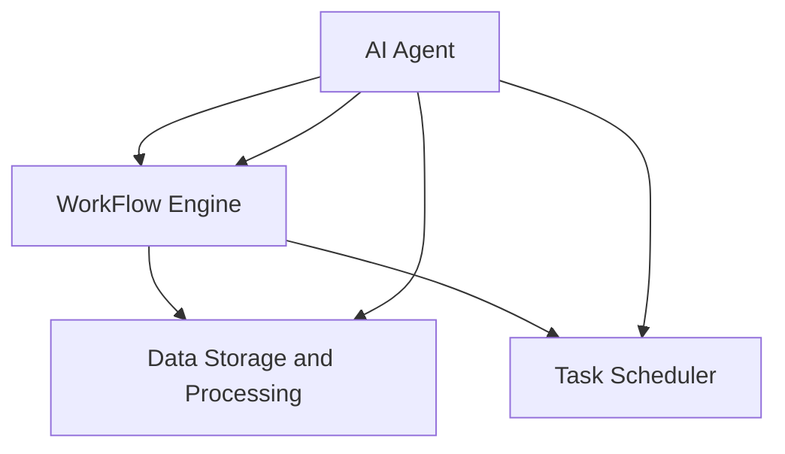

                 

## 第一部分: AI Agent 工作流概述

在当今的数字时代，人工智能（AI）已经成为推动技术进步和产业变革的重要力量。AI Agent，作为人工智能的一种表现形式，正逐渐成为自动化和智能化工作流程的核心驱动因素。本部分将深入探讨AI Agent及其工作流的基本概念、架构和应用场景，为后续章节的内容奠定基础。

### 1. AI Agent 与工作流简介

AI Agent，也称为智能代理，是一种具有自主决策和执行能力的软件系统。它能够通过学习和适应环境，自主地完成任务，并与外部系统进行交互。AI Agent 具有自主性、协作性、适应性和智能化的特点，可以在各种场景中发挥作用，例如自动化流程优化、决策支持和异常检测。

工作流是一种业务流程的自动化表示，它定义了一系列任务和活动，按照一定的顺序执行，以完成特定的业务目标。工作流的重要性在于，它能够提高工作效率、优化资源分配，并确保任务的一致性和准确性。在引入AI Agent之后，工作流变得更加智能化和高效，AI Agent可以自动执行任务，识别和处理异常情况，甚至可以根据业务需求进行自我调整。

### 2. AI Agent 工作流的基本架构

AI Agent 工作流的基本架构通常包括以下几个核心组件：

- **AI Agent**: 作为工作流的核心执行单元，AI Agent 具有决策和执行能力。它可以通过机器学习算法学习环境中的规律，并自主地做出决策。

- **工作流引擎**: 负责管理任务的调度、执行和监控。工作流引擎可以定义任务的执行顺序、依赖关系，并确保任务的正确执行。

- **数据存储与处理**: 用于存储任务数据和模型数据，并提供数据处理功能。数据存储与处理模块确保数据的安全性和可用性，为AI Agent 提供必要的信息支持。

### 3. 元学习在 AI Agent 工作流中的应用

元学习（Meta-Learning）是一种使模型能够快速适应新任务的学习方法。在 AI Agent 工作流中，元学习可以用于优化任务分配、调度和执行监控。通过元学习，AI Agent 可以从多个任务中学习到通用的策略和模式，从而提高整体工作流的效率和适应性。

**Mermaid 流程图：**

在上述流程图中，AI Agent 与工作流引擎、数据存储与处理模块以及任务调度器紧密协作，共同实现智能化工作流。

### 小结

通过本部分的内容，我们了解了 AI Agent 和工作流的基本概念、架构以及元学习在其工作流中的应用。接下来，我们将进一步深入探讨 AI Agent 工作流的细节，包括其核心组件的功能、元学习的具体实现，以及在实际应用中的优化和评估方法。

---

**下一节将详细介绍 AI Agent 的定义与特点，敬请期待。**

