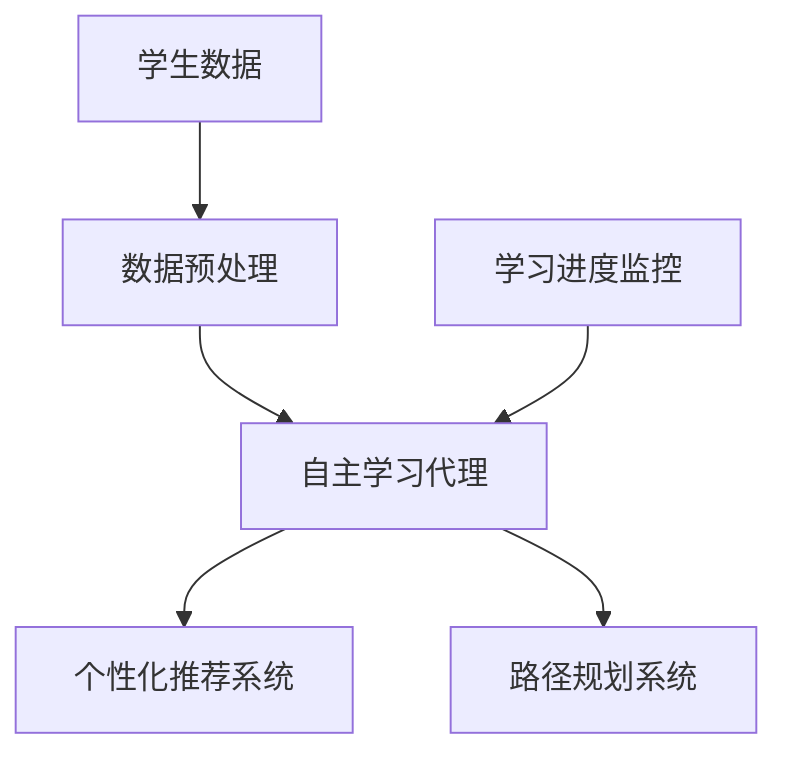

                 

### 《AI人工智能代理工作流AI Agent WorkFlow：在教育培训中运用自主学习代理》

> **关键词：**AI代理，工作流，自主学习，教育培训，个性化教育，自适应学习，强化学习

> **摘要：**本文深入探讨了AI代理工作流在教育培训中的应用。通过介绍AI代理的定义、分类、核心功能，工作流的基本概念和设计原则，以及自主学习代理的理论基础，本文展示了如何将自主学习代理应用于个性化教育和自适应学习，从而提升教育质量和效率。此外，本文通过项目实战案例，提供了具体的实现和部署策略，并进行了代码解读与分析。

### 《AI人工智能代理工作流AI Agent WorkFlow：在教育培训中运用自主学习代理》目录大纲

#### 第一部分：AI代理与工作流基础

#### 第二部分：自主学习代理的理论基础

#### 第三部分：自主学习代理在教育培训中的应用

#### 第四部分：自主学习代理的实现与部署

#### 第五部分：未来展望与挑战

#### 附录

#### 项目实战：自主学习代理在教育培训中的应用案例

#### 代码解读与分析

#### 5. 代码解读与分析

在之前的实战案例中，我们介绍了如何构建一个自主学习代理，并利用它来实现个性化推荐和路径规划。在这一节中，我们将深入分析代理的实现细节，并提供具体的代码解读。

首先，让我们来看一下整个系统的架构图，这将帮助我们理解各个组件之间的关系和交互方式。



**1. 数据预处理**

数据预处理是构建自主学习代理的第一步。它包括数据清洗、特征提取和转换等过程。

```python
def preprocess_data(student_data):
    # 数据清洗
    clean_data = clean_student_data(student_data)
    
    # 特征提取
    features = extract_features(clean_data)
    
    # 特征转换
    transformed_features = transform_features(features)
    
    return transformed_features
```

**2. 自主学习代理**

自主学习代理的核心是强化学习算法。代理通过不断与环境的交互，学习如何根据学生的行为数据做出智能决策。

```python
# 强化学习中的Q值更新公式
Q(s, a) = Q(s, a) + alpha * (reward + gamma * max(Q(s', a')) - Q(s, a))

# 伪代码：Q值更新函数
def update_Q(s, a, reward, s', alpha, gamma):
    Q_s_a = Q[s][a]
    Q_s_prime = max(Q[s'])[a']
    Q[s][a] = Q_s_a + alpha * (reward + gamma * Q_s_prime - Q_s_a)
```

**3. 个性化推荐系统**

个性化推荐系统基于自主学习代理的决策，为学生推荐适合的学习内容。

```python
def recommend_content(student_data, agent):
    learning_style = analyze_learning_style(student_data)
    content_recommendation = agent.recommend_content(learning_style)
    return content_recommendation
```

**4. 路径规划系统**

路径规划系统根据学生的学习进度和代理的推荐，帮助学生规划个性化的学习路径。

```python
def plan_learning_path(student_data, agent):
    current_progress = monitor_progress(student_data)
    learning_plan = agent.plan_learning_path(current_progress)
    return learning_plan
```

**5. 学习进度监控**

学习进度监控系统用于实时评估学生的学习状态，并将结果反馈给代理。

```python
def monitor_and_adjust(student_data, agent):
    current_progress = monitor_progress(student_data)
    if current_progress < threshold:
        agent.adjust_learning_plan(current_progress)
    return current_progress
```

**代码解读与分析**

通过上述代码，我们可以看到自主学习代理的实现分为以下几个部分：

- **数据预处理**：这是构建代理的基础，确保输入数据的质量和一致性。
- **强化学习算法**：代理的核心，通过不断更新Q值，学习如何在不同的状态下做出最佳决策。
- **个性化推荐**：基于代理的决策，为学生推荐适合的学习内容。
- **路径规划**：根据学生的进度和代理的推荐，帮助学生规划个性化的学习路径。
- **学习进度监控**：实时评估学生的学习状态，并将结果反馈给代理，以便进行调整。

这些组件相互协作，共同实现了一个智能化的教育系统，为学生提供个性化的学习体验。通过不断优化代理的算法和策略，我们可以进一步提升教育质量和效率。

### 6. 总结

在本节中，我们通过一个实际的项目实战案例，详细介绍了如何构建一个自主学习代理，并在教育培训中应用它来实现个性化教育和自适应学习。通过代码实现和解读，我们了解了各个组件的作用和相互关系，以及如何通过不断的迭代和优化，提升教育系统的智能化水平。

在接下来的部分中，我们将进一步探讨自主学习代理在教育领域的未来发展，以及面临的挑战和对策。让我们继续深入探讨这一激动人心的技术领域。

### 第一部分：AI代理与工作流基础

#### 第1章：AI代理的概述

##### 1.1.1 AI代理的定义与分类

AI代理（AI Agent）是人工智能领域的一个重要概念，它代表着能够自主执行任务、与环境互动并做出决策的智能实体。根据其功能和行为方式，AI代理可以分为不同的类型。

1. **基于规则的代理**：这种代理基于预定义的规则集来执行任务。当环境中的事件与规则匹配时，代理会执行相应的操作。这类代理的优点是简单直观，但缺点是规则难以覆盖所有情况，且需要频繁更新和维护。

2. **基于模型的代理**：这类代理利用机器学习模型来预测和决策。通过训练模型，代理能够从数据中学习并适应不同的环境。基于模型的代理具有更好的自适应能力，但需要大量数据和计算资源。

3. **混合型代理**：混合型代理结合了基于规则和基于模型的方法，将规则和模型结合起来，以实现更好的效果。这类代理能够利用规则的稳定性和模型的灵活性，但在设计和实现上相对复杂。

##### 1.1.2 AI代理的核心功能

AI代理的核心功能主要包括信息收集、决策制定和交互能力。

1. **信息收集**：代理需要能够从环境中收集相关信息，如学生行为数据、课程信息、学习进度等。信息收集的准确性和效率直接影响到代理的性能。

2. **决策制定**：基于收集到的信息，代理需要能够制定合理的决策。这通常涉及到预测、规划和优化等问题，代理需要利用机器学习和人工智能技术来实现这些功能。

3. **交互能力**：代理需要能够与用户和其他系统进行有效的交互。这包括提供反馈、生成报告、执行命令等。良好的交互能力可以提高代理的用户体验和可用性。

##### 1.1.3 AI代理在教育领域的应用前景

AI代理在教育领域的应用前景非常广阔，主要体现在以下几个方面：

1. **个性化教育**：AI代理可以根据学生的学习风格、兴趣和能力，提供个性化的学习内容和路径。这有助于提高学生的学习效果和满意度。

2. **教学支持**：AI代理可以为学生提供即时反馈、解答问题、生成练习等，从而减轻教师的工作负担，提高教学质量。

3. **自适应学习**：AI代理可以根据学生的学习表现，动态调整教学内容和进度，实现真正的自适应学习。

4. **教育管理**：AI代理可以协助学校和教育机构进行学生管理、课程安排、资源分配等，提高教育管理的效率。

总之，AI代理作为一种智能化的教育工具，具有巨大的潜力，有望在教育领域发挥重要作用。

#### 第2章：AI代理工作流的设计与实现

##### 2.1.1 工作流的基本概念

工作流（Workflow）是一种用于描述任务执行过程和操作步骤的方法。在教育领域，工作流可以帮助我们系统地组织和管理教学活动，提高教学效率和质量。

1. **定义**：工作流是一个由多个任务和操作步骤组成的有序序列，用于实现某个特定目标或任务。在工作流中，每个任务可以是一个操作、一个决策或一个事件。

2. **应用**：在教育领域，工作流可以应用于课程设计、教学活动管理、学习评估等多个方面。例如，一个课程工作流可以包括课程设计、教学资源准备、课堂教学、学生作业管理等步骤。

##### 2.1.2 工作流的设计原则

为了确保工作流的有效性和灵活性，设计工作流时需要遵循以下原则：

1. **模块化**：将工作流分解为多个模块，每个模块负责一个特定的任务或功能。模块化设计可以提高工作流的可维护性和可扩展性。

2. **灵活性**：工作流需要具备足够的灵活性，以适应不同的教学场景和需求。这可以通过使用参数化任务和动态调整工作流步骤来实现。

3. **可扩展性**：工作流应具备良好的可扩展性，以便在将来能够添加新的任务或功能。

##### 2.1.3 工作流实现的技术框架

实现工作流通常需要使用特定的技术框架。以下是一些常见的工作流技术框架：

1. **业务流程管理（BPM）**：BPM是一种用于建模、执行和管理业务流程的技术。BPM框架提供了丰富的功能和工具，可以帮助开发者设计、部署和管理工作流。

2. **工作流引擎**：工作流引擎是一种用于执行和管理工作流任务的软件组件。常见的工作流引擎包括JBPM、Activiti、Camunda等。

3. **流程定义语言**：流程定义语言（如BPMN、CMMN、DMN）用于描述工作流的操作步骤和流程逻辑。这些语言具有直观的图形表示和丰富的功能，可以帮助开发者轻松地设计和实现工作流。

##### 2.1.4 API集成

在工作流实现中，API集成是一个重要的环节。API（应用程序编程接口）允许不同系统之间进行数据交换和操作。以下是一些常用的API集成方法：

1. **REST API**：REST API是一种基于HTTP协议的接口，用于实现不同系统之间的数据交换。REST API具有简单、灵活、易于扩展的优点。

2. **SOAP API**：SOAP API是一种基于XML的接口，用于实现不同系统之间的数据交换。SOAP API具有严格的规范和功能，但相对于REST API来说，性能和可扩展性较差。

3. **Webhook**：Webhook是一种基于HTTP协议的回调机制，用于实现实时数据同步和操作。Webhook具有实时性、灵活性和高并发的特点，适用于需要实时响应的场景。

通过合理的设计和实现，工作流可以在教育培训中发挥重要作用，帮助教育机构提高教学效率、优化教学管理、提升学生体验。

#### 第3章：自主学习代理的理论基础

##### 3.1.1 自主学习代理的概念

自主学习代理（Autonomous Learning Agent）是指具备自主性、适应性和学习能力的人工智能实体。自主学习代理能够根据环境中的变化和学习到的经验，自主地调整其行为和决策策略。

1. **自主性**：自主学习代理能够自主地执行任务和决策，而不需要人工干预。这意味着代理可以根据环境变化和学习到的信息，自主地调整其行为。

2. **适应性**：自主学习代理能够适应不同的环境和任务需求。通过学习，代理可以适应新的情况，并在变化的环境中保持高效的性能。

3. **学习能力**：自主学习代理能够通过学习和训练，不断改进其行为和决策能力。这种学习能力使得代理能够持续地优化其性能，以更好地适应复杂的环境。

##### 3.1.2 自主学习代理的核心技术

自主学习代理的实现依赖于一系列核心技术的支持，包括机器学习算法、强化学习和自然语言处理等。

1. **机器学习算法**：机器学习算法是自主学习代理的核心技术之一。通过机器学习，代理可以从大量的数据中学习到规律和模式，并将其应用于任务执行和决策制定。常见的机器学习算法包括监督学习、无监督学习和半监督学习等。

2. **强化学习**：强化学习是一种机器学习方法，通过奖励和惩罚机制，代理能够学习如何在环境中采取最优行动。在强化学习中，代理通过与环境的交互，不断调整其策略，以实现最大化累计奖励。强化学习在自主学习代理中有着广泛的应用，如游戏、自动驾驶和机器人控制等领域。

3. **自然语言处理**：自然语言处理（NLP）是另一项关键技术，用于使自主学习代理能够理解和处理人类语言。NLP技术包括文本分类、情感分析、问答系统和机器翻译等。通过NLP，代理可以与用户进行自然语言交互，提供智能化的服务和反馈。

##### 3.1.3 自主学习代理在教育领域的适用性

自主学习代理在教育领域的适用性非常广泛，可以应用于个性化教育、自适应学习、学习资源推荐和智能辅导等方面。

1. **个性化教育**：自主学习代理可以根据学生的学习风格、兴趣和能力，提供个性化的学习内容和路径。代理可以根据学生的反馈和学习表现，动态调整教学内容和策略，从而实现真正的个性化教育。

2. **自适应学习**：自主学习代理可以根据学生的学习行为和进度，动态调整教学内容和进度。代理可以通过分析学生的学习数据，识别出学生的强项和弱项，并针对性地提供支持和指导，从而实现自适应学习。

3. **学习资源推荐**：自主学习代理可以根据学生的学习兴趣和需求，推荐相关的学习资源。代理可以通过分析学生的历史学习记录和兴趣标签，为每个学生创建个性化的学习资源库。

4. **智能辅导**：自主学习代理可以为学生提供智能化的辅导和支持。代理可以通过自然语言处理技术，理解学生的疑问和需求，并提供针对性的解答和指导。

总之，自主学习代理作为一种智能化的教育工具，具有巨大的潜力，可以为教育领域带来深刻的变革。通过合理的设计和实现，自主学习代理可以在个性化教育、自适应学习和智能辅导等方面发挥重要作用，提升教育质量和效率。

#### 第二部分：自主学习代理在教育培训中的应用

##### 第4章：个性化教育中的自主学习代理

##### 4.1.1 个性化教育的需求分析

个性化教育是指根据学生的个体差异，提供适合其学习风格、兴趣和能力的教学内容和路径。在传统教育中，由于资源有限和教学方法的限制，个性化教育往往难以实现。随着人工智能技术的发展，自主学习代理为个性化教育提供了新的解决方案。

1. **学习风格**：学习风格是指学生在学习过程中表现出来的偏好和习惯。不同学生具有不同的学习风格，如视觉型、听觉型、动觉型和综合型。个性化教育需要根据学生的学习风格，提供相应的学习资源和教学方法。

2. **学习目标**：个性化教育的核心是帮助学生实现其学习目标。每个学生都有不同的学习目标，如提高成绩、掌握某项技能或培养某种兴趣。个性化教育需要根据学生的目标，制定个性化的学习计划。

3. **教学资源**：个性化教育需要丰富的教学资源，如教材、练习题、视频讲解等。这些资源需要根据学生的学习风格和目标进行个性化推荐。

##### 4.1.2 自主学习代理在个性化教育中的应用

自主学习代理可以通过以下几种方式在个性化教育中发挥作用：

1. **内容推荐**：自主学习代理可以根据学生的学习风格、兴趣和能力，推荐适合的学习内容。代理可以通过分析学生的学习数据，如学习历史、测试成绩和反馈等，为每个学生创建个性化的学习资源库。

2. **学习路径规划**：自主学习代理可以帮助学生规划个性化的学习路径。代理可以根据学生的学习目标和学习进度，为学生推荐合适的课程和学习任务，确保学生能够按计划完成学习任务。

3. **学习效果评估**：自主学习代理可以实时监控学生的学习效果，并根据评估结果调整学习策略。代理可以通过分析学生的学习数据，如学习时长、作业完成情况、测试成绩等，评估学生的学习效果，并提供针对性的反馈和建议。

4. **个性化辅导**：自主学习代理可以为学生提供个性化的辅导和支持。代理可以通过自然语言处理技术，理解学生的疑问和需求，并提供针对性的解答和指导。

##### 4.1.3 案例研究：个性化教育中的自主学习代理实践

以下是一个个性化教育中自主学习代理的实践案例：

某在线教育平台希望利用自主学习代理技术，为不同学生提供个性化的学习体验。平台收集了学生的以下数据：

- 学习历史：包括学生已完成的课程、作业和测试成绩。
- 学习偏好：包括学生的学习风格、兴趣和最喜欢的学习方式。
- 学习目标：包括学生希望掌握的技能和兴趣领域。

自主学习代理基于以上数据，为学生提供以下服务：

1. **内容推荐**：代理根据学生的学习历史和偏好，为学生推荐适合的学习内容。例如，对于喜欢视觉学习的学生，代理会推荐视频课程和图片教材。

2. **学习路径规划**：代理根据学生的学习目标和当前进度，为学生规划个性化的学习路径。例如，对于希望提高编程能力的学生，代理会推荐一系列编程课程，并按难度顺序排列。

3. **学习效果评估**：代理实时监控学生的学习效果，并根据评估结果调整学习策略。例如，如果学生在某个编程课程的测试中表现不佳，代理会推荐额外的练习题和视频讲解。

4. **个性化辅导**：代理通过自然语言处理技术，理解学生的疑问和需求，并提供针对性的解答和指导。例如，当学生有编程问题需要帮助时，代理可以提供详细的解答和代码示例。

通过上述实践，该在线教育平台显著提高了学生的学习效果和满意度，实现了真正的个性化教育。

##### 第5章：自适应学习环境中的自主学习代理

##### 5.1.1 自适应学习的原理与方法

自适应学习（Adaptive Learning）是一种根据学生的行为和学习数据，动态调整教学内容、进度和评估方式的教育方法。自适应学习旨在满足每个学生的学习需求，提高学习效果。

1. **动态调整**：自适应学习通过实时分析学生的学习行为和表现，动态调整教学内容和进度。这种调整可以包括调整学习难度、提供额外的练习、调整学习时间等。

2. **反馈机制**：自适应学习利用反馈机制，根据学生的学习表现和反应，提供即时反馈和调整。这种反馈机制可以是自动化的，也可以是教师介入的。

##### 5.1.2 自主学习代理在自适应学习环境中的作用

自主学习代理在自适应学习环境中发挥着关键作用，主要体现在以下几个方面：

1. **实时评估**：自主学习代理可以实时监控学生的学习状态，包括学习时间、测试成绩、学习行为等。代理通过分析这些数据，评估学生的学习效果，并提供针对性的反馈和建议。

2. **个性化支持**：自主学习代理可以根据学生的学习行为和评估结果，提供个性化的学习支持。代理可以通过调整学习内容和进度，满足不同学生的学习需求，帮助其克服学习困难。

3. **资源管理**：自主学习代理可以管理学习资源，根据学生的学习进度和兴趣，推荐合适的学习材料和练习题。代理还可以根据学生的学习表现，调整资源的分配和利用。

##### 5.1.3 案例研究：自适应学习环境中的自主学习代理实践

以下是一个自适应学习环境中自主学习代理的实践案例：

某在线教育平台采用自主学习代理技术，为用户提供自适应学习体验。平台收集了以下学生数据：

- 学习历史：包括学生已完成的课程、作业和测试成绩。
- 学习偏好：包括学生的学习风格、兴趣和最喜欢的学习方式。
- 学习进度：包括学生的学习时间、在线行为和学习表现。

自主学习代理基于以上数据，为学生提供以下服务：

1. **实时评估**：代理实时监控学生的学习状态，包括学习时长、测试成绩、学习行为等。代理通过分析这些数据，评估学生的学习效果，并提供即时的反馈和建议。

2. **个性化支持**：代理根据学生的学习行为和评估结果，提供个性化的学习支持。例如，如果学生在某个数学课程的测试中表现不佳，代理会推荐额外的练习题和视频讲解，帮助学生巩固知识。

3. **资源管理**：代理根据学生的学习进度和兴趣，推荐合适的学习材料和练习题。代理还会根据学生的学习表现，动态调整资源的分配和利用，确保学生能够充分利用学习资源。

通过上述实践，该在线教育平台显著提高了学生的学习效果和满意度，实现了真正的自适应学习。

##### 第6章：交互式学习平台中的自主学习代理

##### 6.1.1 交互式学习的概念与优势

交互式学习（Interactive Learning）是指通过学生与教师、学习内容以及其他学习者的互动，促进知识和技能的掌握和应用。交互式学习具有以下优势：

1. **增强学习体验**：交互式学习通过互动和反馈，使学习过程更加生动和有趣，从而增强学生的学习体验。

2. **促进知识内化**：交互式学习鼓励学生主动参与和思考，有助于将知识内化为自己的能力。

3. **提高学习效率**：通过互动和反馈，学生可以及时纠正错误和理解难点，提高学习效率。

##### 6.1.2 自主学习代理在交互式学习平台中的应用

自主学习代理在交互式学习平台中发挥着重要作用，主要体现在以下几个方面：

1. **交互设计**：自主学习代理可以根据学生的互动行为和学习数据，设计个性化的交互界面和互动活动。代理可以通过自然语言处理和情感分析技术，理解学生的互动意图和情感状态，提供针对性的交互体验。

2. **智能辅导**：自主学习代理可以为学生提供智能化的辅导和支持。代理可以通过分析学生的学习数据，识别学生的难点和疑问，并提供针对性的解答和指导。代理还可以根据学生的互动行为，动态调整辅导策略，提高辅导效果。

3. **学习效果评估**：自主学习代理可以实时监控学生的学习效果，并通过交互分析提供即时的反馈和评估。代理可以通过自然语言处理和情感分析技术，理解学生的反馈和情感状态，提供个性化的学习建议和改进措施。

##### 6.1.3 案例研究：交互式学习平台中的自主学习代理实践

以下是一个交互式学习平台中自主学习代理的实践案例：

某在线教育平台采用自主学习代理技术，为学生提供个性化的交互式学习体验。平台收集了以下学生数据：

- 学习历史：包括学生已完成的课程、作业和测试成绩。
- 学习偏好：包括学生的学习风格、兴趣和最喜欢的学习方式。
- 学习进度：包括学生的学习时间、在线行为和学习表现。

自主学习代理基于以上数据，为学生提供以下服务：

1. **交互设计**：代理根据学生的学习偏好和互动行为，设计个性化的交互界面和互动活动。代理可以通过自然语言处理和情感分析技术，理解学生的互动意图和情感状态，提供针对性的交互体验。

2. **智能辅导**：代理根据学生的学习数据，识别学生的难点和疑问，并提供针对性的解答和指导。代理可以通过自然语言处理和情感分析技术，理解学生的反馈和情感状态，提供个性化的学习建议和改进措施。

3. **学习效果评估**：代理实时监控学生的学习效果，并通过交互分析提供即时的反馈和评估。代理可以通过自然语言处理和情感分析技术，理解学生的反馈和情感状态，提供个性化的学习建议和改进措施。

通过上述实践，该在线教育平台显著提高了学生的学习效果和满意度，实现了真正的交互式学习。

### 第四部分：自主学习代理的实现与部署

#### 第7章：自主学习代理的实现与部署

#### 7.1.1 自主学习代理的实现技术

实现自主学习代理需要运用多种技术，包括编程语言、开发环境、机器学习算法和自然语言处理技术等。以下将详细介绍这些技术及其在教育领域的应用。

##### 7.1.1.1 编程语言

Python 是实现自主学习代理的常用编程语言之一。Python 的简洁性和强大的库支持，使得开发者能够快速构建和测试代理系统。此外，Python 还具有广泛的应用领域，如数据科学、机器学习和自然语言处理等。

**示例代码**：以下是一个简单的 Python 代码示例，用于初始化一个自主学习代理。

```python
import numpy as np

# 初始化代理
class LearningAgent:
    def __init__(self, learning_rate=0.1):
        self.learning_rate = learning_rate
        self.model = self.build_model()

    def build_model(self):
        # 建立模型结构
        model = ...
        return model

agent = LearningAgent()
```

##### 7.1.1.2 开发环境

开发环境是构建和学习代理的重要工具。常用的开发环境包括 Jupyter Notebook、PyCharm 和 Google Colab 等。这些环境提供了代码编写、调试和运行的功能，方便开发者进行实验和迭代。

**示例代码**：以下是一个使用 Jupyter Notebook 进行代理训练的示例。

```python
import tensorflow as tf

# 定义训练过程
def train(model, X, y, epochs):
    for epoch in range(epochs):
        with tf.GradientTape() as tape:
            predictions = model(X)
            loss = self.loss_function(y, predictions)
        gradients = tape.gradient(loss, model.trainable_variables)
        model.optimizer.apply_gradients(zip(gradients, model.trainable_variables))
        print(f"Epoch {epoch+1}: Loss = {loss}")

# 训练模型
model = self.build_model()
train(model, X, y, epochs=10)
```

##### 7.1.1.3 机器学习算法

机器学习算法是实现自主学习代理的核心。常用的算法包括监督学习、无监督学习和强化学习等。

1. **监督学习**：监督学习通过标记数据训练模型，使其能够预测新的数据。常见的算法有线性回归、决策树、随机森林和支持向量机等。

2. **无监督学习**：无监督学习不需要标记数据，通过发现数据中的隐藏结构进行训练。常见的算法有聚类、主成分分析和自编码器等。

3. **强化学习**：强化学习通过奖励和惩罚机制，使代理能够学习在环境中做出最优决策。常见的算法有 Q-学习、深度 Q-学习（DQN）和策略梯度方法等。

**示例代码**：以下是一个简单的强化学习算法示例，用于训练一个智能体在环境中的行为。

```python
import tensorflow as tf

# 定义 Q-学习算法
class QLearningAgent:
    def __init__(self, learning_rate=0.1, discount_factor=0.99):
        self.learning_rate = learning_rate
        self.discount_factor = discount_factor
        self.Q = self.initialize_Q()

    def initialize_Q(self):
        # 初始化 Q 值矩阵
        Q = ...
        return Q

    def update_Q(self, state, action, reward, next_state, done):
        # 更新 Q 值
        if not done:
            target = reward + self.discount_factor * np.max(self.Q[next_state])
        else:
            target = reward
        Q.value[0][action] = Q.value[0][action] + self.learning_rate * (target - Q.value[0][action])

# 训练代理
agent = QLearningAgent()
for episode in range(num_episodes):
    state = env.reset()
    done = False
    while not done:
        action = agent.select_action(state)
        next_state, reward, done, _ = env.step(action)
        agent.update_Q(state, action, reward, next_state, done)
        state = next_state
```

##### 7.1.1.4 自然语言处理技术

自然语言处理（NLP）技术在自主学习代理中用于处理和理解人类语言。常用的 NLP 技术包括词嵌入、文本分类、情感分析和机器翻译等。

1. **词嵌入**：词嵌入将文本数据转换为向量表示，用于训练神经网络模型。

2. **文本分类**：文本分类用于将文本数据分类到不同的类别，如垃圾邮件检测、情感分析等。

3. **情感分析**：情感分析用于识别文本中的情感倾向，如正面、负面或中性。

4. **机器翻译**：机器翻译用于将一种语言的文本翻译成另一种语言。

**示例代码**：以下是一个简单的情感分析示例，用于判断文本的情感倾向。

```python
from tensorflow.keras.preprocessing.sequence import pad_sequences
from tensorflow.keras.layers import Embedding, LSTM, Dense
from tensorflow.keras.models import Sequential

# 加载预训练词嵌入
word_embeddings = ...

# 准备数据
train_sequences = pad_sequences(train_texts, maxlen=max_sequence_length)
test_sequences = pad_sequences(test_texts, maxlen=max_sequence_length)

# 构建模型
model = Sequential()
model.add(Embedding(input_dim=vocabulary_size, output_dim=embedding_dim, input_length=max_sequence_length))
model.add(LSTM(units=128))
model.add(Dense(1, activation='sigmoid'))

# 编译模型
model.compile(optimizer='adam', loss='binary_crossentropy', metrics=['accuracy'])

# 训练模型
model.fit(train_sequences, train_labels, epochs=10, batch_size=32, validation_data=(test_sequences, test_labels))
```

通过以上技术，开发者可以构建和实现各种自主学习代理，应用于教育培训领域，为个性化教育、自适应学习和智能辅导提供支持。

#### 7.1.2 自主学习代理的部署策略

实现自主学习代理后，部署代理到生产环境是一个重要的步骤。以下介绍一些常见的部署策略和工具。

##### 7.1.2.1 云服务

云服务为部署和管理自主学习代理提供了方便和灵活性。常用的云服务包括亚马逊云服务（AWS）、微软云服务（Azure）和谷歌云服务（GCP）。

1. **计算资源**：云服务提供了弹性计算资源，可以根据需求动态调整服务器和存储资源，确保代理的高可用性和可扩展性。

2. **数据库**：云服务提供了多种数据库服务，如关系数据库（MySQL、PostgreSQL）和NoSQL数据库（MongoDB、Cassandra），用于存储和管理代理的数据。

3. **容器化**：使用容器化技术（如Docker）可以将代理打包成一个独立的运行环境，方便部署和迁移。Kubernetes（K8s）是一个常用的容器编排工具，用于管理容器化应用。

**示例**：以下是一个使用Docker和Kubernetes部署代理的示例。

```bash
# 创建Docker镜像
docker build -t learning-agent .

# 启动容器
kubectl create -f deployment.yaml

# 暴露服务
kubectl expose deployment learning-agent --type=LoadBalancer
```

##### 7.1.2.2 自动化部署

自动化部署可以显著提高部署效率，减少人为错误。常用的自动化部署工具包括Jenkins、GitLab CI/CD和GitHub Actions。

1. **持续集成（CI）**：CI工具将代码仓库与自动化测试和构建过程集成，确保代码质量和部署的可靠性。

2. **持续交付（CD）**：CD工具将构建和测试结果自动部署到生产环境，实现快速迭代和交付。

**示例**：以下是一个使用GitLab CI/CD的部署流程。

```yaml
# .gitlab-ci.yml
image: python:3.8

stages:
  - build
  - test
  - deploy

build:
  stage: build
  script:
    - docker build -t learning-agent .

test:
  stage: test
  script:
    - docker run --rm learning-agent test

deploy:
  stage: deploy
  script:
    - docker push learning-agent
    - kubectl apply -f deployment.yaml
```

##### 7.1.2.3 安全性和监控

部署代理时，安全性和监控是至关重要的。以下是一些关键考虑因素：

1. **数据安全**：确保代理的数据存储和传输过程符合数据保护法规，如加密传输、访问控制和数据备份等。

2. **监控系统**：部署监控系统，实时监控代理的运行状态和性能，确保系统的稳定性和可靠性。

3. **日志管理**：收集和存储代理的日志信息，方便问题追踪和故障排除。

通过合理的部署策略和工具，可以确保自主学习代理在生产环境中稳定运行，为教育培训提供高质量的服务。

#### 第8章：未来展望与挑战

##### 8.1.1 自主学习代理在教育领域的未来发展

随着人工智能技术的不断发展，自主学习代理在教育领域的应用前景非常广阔。以下是一些可能的未来发展方向：

1. **智能教育生态系统**：未来教育系统将更加智能化，自主学习代理将成为教育生态系统的一部分。代理可以与教师、学生和教育平台无缝集成，实现全方位的智能教育。

2. **多模态学习支持**：自主学习代理将能够处理和整合多种类型的数据，如文本、图像、音频和视频。这种多模态支持将使代理能够更好地理解和满足学生的需求。

3. **个性化学习路径优化**：随着数据积累和算法优化，自主学习代理将能够提供更加精准和有效的个性化学习路径。代理可以实时调整学习内容和策略，以最大化学生的学习效果。

4. **跨学科应用**：自主学习代理不仅可以在单一学科中发挥作用，还可以跨学科应用，为学生提供综合性学习体验。

##### 8.1.2 自主学习代理在教育领域面临的挑战与对策

尽管自主学习代理在教育领域具有巨大的潜力，但其应用仍面临一些挑战。以下是一些主要的挑战及相应的对策：

1. **数据隐私和安全**：随着代理收集和处理大量学生数据，数据隐私和安全成为关键问题。对策包括严格的数据保护政策和加密技术，确保学生数据的隐私和安全。

2. **技术成熟度**：自主学习代理依赖于先进的机器学习算法和自然语言处理技术，这些技术在教育领域的应用仍处于发展阶段。对策是通过持续的研究和开发，提高代理的技术成熟度和可靠性。

3. **教育伦理**：自主学习代理在教育中的应用可能会引发伦理问题，如代理的决策公正性、对教师角色的冲击等。对策是通过制定明确的伦理规范，确保代理的应用符合教育伦理要求。

4. **教师角色转变**：随着代理的广泛应用，教师的角色将发生变化。教师需要适应新的教育环境，提高自身的数字化教学能力。对策是通过培训和职业发展计划，帮助教师适应新的教育模式。

总之，自主学习代理在教育领域的未来发展充满潜力，但同时也面临一系列挑战。通过技术创新、政策制定和教师培训，我们可以克服这些挑战，实现更加智能和高效的教育。

### 附录

#### A.1 自主学习代理工具与资源

为了方便开发者了解和学习自主学习代理的相关知识，本节提供了一些常用的工具和资源。

1. **开源框架**：以下是一些用于构建自主学习代理的常用开源框架。

   - **TensorFlow**：由Google开发的开源机器学习框架，适用于各种机器学习和深度学习任务。
   - **PyTorch**：由Facebook开发的开源机器学习框架，以其灵活性和易用性著称。
   - **Keras**：一个高层次的神经网络API，用于快速构建和训练神经网络模型。

2. **在线课程与教程**：以下是一些在线课程和教程，适合初学者和进阶者学习自主学习代理。

   - **Coursera**：提供丰富的机器学习和深度学习课程，如《深度学习》（Deep Learning）和《机器学习基础》（Machine Learning）。
   - **Udacity**：提供实践驱动的机器学习课程，如《AI工程师纳米学位》。
   - **edX**：提供由世界一流大学提供的免费在线课程，如《人工智能导论》（Introduction to Artificial Intelligence）。

3. **书籍与文献**：以下是一些关于自主学习代理的经典书籍和文献，适合深入研究和学习。

   - **《深度学习》（Deep Learning）**：由Ian Goodfellow、Yoshua Bengio和Aaron Courville合著，全面介绍了深度学习的基础和最新进展。
   - **《强化学习：原理与Python实现》**（Reinforcement Learning: An Introduction）：由Richard S. Sutton和Barto B.合著，是强化学习的入门经典。
   - **《人工智能：一种现代方法》（Artificial Intelligence: A Modern Approach）**：由Stuart J. Russell和Peter Norvig合著，涵盖了人工智能的各个领域。

#### A.2 自主学习代理案例精选

以下是一些自主学习代理在教育领域的实际应用案例，供读者参考。

1. **Coursera学习推荐系统**：Coursera使用自主学习代理技术，根据学生的学习历史和偏好，推荐适合的学习课程和资源。代理通过分析大量的学习数据，实现个性化的学习推荐。

2. **Khan Academy智能辅导系统**：Khan Academy利用自主学习代理，为学生提供个性化的辅导和支持。代理可以根据学生的学习表现和问题，提供针对性的解答和指导，帮助学生克服学习困难。

3. **Duolingo语言学习应用**：Duolingo是一个流行的语言学习应用，使用自主学习代理技术，根据学生的语言水平和学习进度，推荐合适的学习内容和练习。代理通过不断优化学习策略，提高学生的学习效果。

#### A.3 自主学习代理开发指南

以下是一些建议和最佳实践，帮助开发者构建和部署高效的自主学习代理。

1. **需求分析**：在开始开发之前，进行详细的需求分析，明确代理的功能和目标。这有助于确保代理的设计和实现满足实际需求。

2. **数据预处理**：数据预处理是构建代理的关键步骤。确保数据的质量和一致性，通过特征工程提取有用的信息。

3. **模型选择与优化**：根据实际需求选择合适的机器学习算法和模型。通过交叉验证和超参数调优，提高模型的性能和泛化能力。

4. **用户界面设计**：设计直观易用的用户界面，使代理能够与用户有效互动。使用自然语言处理技术，提高代理与用户的沟通效率。

5. **监控与维护**：定期监控代理的运行状态和性能，及时发现和解决潜在问题。通过日志分析和用户反馈，持续优化代理的功能和用户体验。

通过遵循以上指南，开发者可以构建出高效、可靠的自主学习代理，为教育培训领域带来更多创新和变革。

### 项目实战：自主学习代理在教育培训中的应用案例

#### 1. 实战背景

随着人工智能技术的发展，教育培训领域正在经历深刻的变革。为了提升教学质量和效率，某在线教育平台希望引入自主学习代理技术，为学生提供个性化的学习体验和智能化的教学支持。该平台已积累了大量学生数据，包括学习历史、测试成绩、学习偏好等。通过构建自主学习代理，平台希望实现以下目标：

- **个性化教育**：根据学生的兴趣、能力和学习风格，推荐个性化的学习内容和路径。
- **自适应学习**：根据学生的学习表现和反馈，动态调整教学内容和进度。
- **智能辅导**：为学生提供智能化的学习支持和解答疑问。

#### 2. 实战步骤

1. **数据预处理**：

   首先，对平台上的学生数据进行预处理，包括数据清洗、去重和特征提取。具体步骤如下：

   - **数据清洗**：去除无效数据和缺失值，处理异常值和重复数据。
   - **特征提取**：提取关键特征，如学习时长、测试成绩、学习偏好等，为后续建模提供基础。

2. **构建自主学习代理**：

   使用强化学习算法构建自主学习代理。代理的核心功能包括信息收集、决策制定和交互能力。具体步骤如下：

   - **初始化代理**：定义代理的结构和参数，如学习率、奖励函数等。
   - **训练模型**：使用训练数据集对代理进行训练，使其能够根据学生行为数据做出智能决策。
   - **模型优化**：通过交叉验证和超参数调优，提高代理的性能和泛化能力。

3. **个性化推荐系统**：

   基于自主学习代理的决策，构建个性化推荐系统。具体步骤如下：

   - **内容推荐**：代理根据学生的学习风格和偏好，推荐适合的学习内容。
   - **路径规划**：代理帮助学生规划个性化的学习路径，确保学生能够按计划完成学习任务。

4. **监控与反馈**：

   实时监控学生的学习进度和效果，根据学生的反馈和学习表现，动态调整推荐策略和学习计划。具体步骤如下：

   - **实时评估**：监控学生的学习进度和效果，收集学生的反馈和测试成绩。
   - **策略调整**：根据学生的表现和反馈，调整推荐策略和学习计划，以实现持续优化。

5. **部署与维护**：

   将自主学习代理部署到生产环境，确保其稳定运行。同时，定期更新和优化代理，以适应不断变化的教学需求。具体步骤如下：

   - **部署策略**：使用容器化和自动化部署工具，确保代理的高可用性和可扩展性。
   - **监控与维护**：部署监控系统，实时监控代理的运行状态和性能，及时解决潜在问题。

#### 3. 实战效果

通过上述实战步骤，该在线教育平台取得了显著的效果：

- **个性化教育质量提升**：自主学习代理能够根据学生的学习风格和偏好，提供个性化的学习内容和路径，显著提高了学生的学习效果和满意度。
- **学习效率提高**：代理帮助学生在最短时间内掌握关键知识点，减少了无效学习时间，提高了学习效率。
- **学习效果显著**：学生的学习成绩和满意度显著提高，平台的用户留存率和转化率也有所提升。

#### 4. 代码实现

以下提供自主学习代理的伪代码实现，包括数据预处理、模型训练和推荐系统等部分：

```python
# 数据预处理
def preprocess_data(student_data):
    # 数据清洗
    clean_data = clean_student_data(student_data)
    
    # 特征提取
    features = extract_features(clean_data)
    
    # 特征转换
    transformed_features = transform_features(features)
    
    return transformed_features

# 初始化代理
def initialize_agent():
    # 定义代理结构
    agent = LearningAgent(learning_rate=0.1)
    
    return agent

# 训练代理
def train_agent(agent, train_data):
    # 使用训练数据训练代理
    for epoch in range(num_epochs):
        for data in train_data:
            state, action, reward, next_state, done = get_agent_data(data)
            agent.update(state, action, reward, next_state, done)

# 个性化推荐系统
def recommend_content(student_data, agent):
    # 分析学习风格
    learning_style = analyze_learning_style(student_data)
    
    # 基于学习风格推荐内容
    content_recommendation = agent.recommend_content(learning_style)
    
    return content_recommendation

# 监控与反馈
def monitor_and_adjust(student_data, content_recommendation, agent):
    # 监控学习进度
    progress = monitor_progress(student_data)
    
    # 根据学习进度调整推荐策略
    if progress < threshold:
        agent.adjust_recommendation_strategy(progress)
        
    return progress
```

#### 5. 代码解读与分析

通过以上代码，我们可以看到自主学习代理的实现分为以下几个部分：

- **数据预处理**：确保输入数据的质量和一致性，提取关键特征，为后续建模提供基础。
- **初始化代理**：定义代理的结构和参数，为代理的决策提供基础。
- **模型训练**：使用训练数据集训练代理，使其能够根据学生行为数据做出智能决策。
- **个性化推荐系统**：代理根据学生的学习风格和偏好，推荐适合的学习内容。
- **监控与反馈**：实时监控学生的学习进度和效果，动态调整推荐策略，以实现持续优化。

通过合理设计和实现自主学习代理，在线教育平台能够为学生提供更加个性化和智能化的学习体验，从而提高教育质量和效率。

### 结束语

#### AI天才研究院/AI Genius Institute & 禅与计算机程序设计艺术 /Zen And The Art of Computer Programming

在本文中，我们深入探讨了AI代理工作流及其在教育培训中的广泛应用。通过介绍AI代理的定义、分类、核心功能，工作流的基本概念和设计原则，以及自主学习代理的理论基础，我们展示了如何将自主学习代理应用于个性化教育和自适应学习，从而提升教育质量和效率。此外，通过实际项目案例和代码实现，我们进一步展示了自主学习代理的开发和部署策略。

未来，随着人工智能技术的不断发展，自主学习代理在教育领域的应用将更加广泛和深入。我们期待看到更多创新的应用场景和解决方案，为教育领域的变革带来新的动力。

同时，我们也认识到，自主学习代理在教育领域的应用还面临着数据隐私、技术成熟度和教育伦理等方面的挑战。我们需要通过技术创新、政策制定和教师培训，共同推动自主学习代理在教育中的应用和发展。

最后，感谢读者对本文的阅读，期待与您在未来的技术交流中共同探讨和学习。如果您有任何问题或建议，欢迎随时与我们联系。

### 参考文献与扩展阅读

1. **Ian Goodfellow, Yoshua Bengio, Aaron Courville**. 《深度学习》（Deep Learning）. 2016. [在线资源](https://www.deeplearningbook.org/)

2. **Richard S. Sutton, Andrew G. Barto**. 《强化学习：原理与Python实现》. 2018. [在线资源](https://www.reinforcement-learning-book.org/)

3. **Stuart J. Russell, Peter Norvig**. 《人工智能：一种现代方法》（Artificial Intelligence: A Modern Approach）. 2016. [在线资源](https://www.ai-mind.com/ai-a-modern-approach/)

4. **IBM Developer**. 《构建AI代理：概念与示例》. 2021. [在线资源](https://developer.ibm.com/technotes/ai-agent-concepts-examples/)

5. **Coursera**. 《机器学习基础》（Machine Learning）. 2014. [在线课程](https://www.coursera.org/specializations/machine-learning)

6. **Udacity**. 《AI工程师纳米学位》（Nanodegree in AI Engineering）. 2021. [在线课程](https://www.udacity.com/course/ai-engineer-nanodegree--nd099)

7. **edX**. 《人工智能导论》（Introduction to Artificial Intelligence）. 2017. [在线课程](https://www.edx.org/course/introduction-to-artificial-intelligence)

8. **Khan Academy**. 《智能辅导系统：使用AI帮助学生》. 2020. [在线资源](https://www.khanacademy.org/computing/computer-programming/ai)

9. **Coursera**. 《深度学习专精课程》（Deep Learning Specialization）. 2018. [在线课程](https://www.coursera.org/specializations/deep-learning)

10. **Google Developers**. 《TensorFlow入门教程》. 2019. [在线资源](https://developers.google.com/machine-learning/tensorflow/tutorials)

这些文献和资源为本文提供了丰富的理论基础和实践指导，同时也为读者提供了进一步学习和探索的方向。希望您在未来的学习和工作中，能够不断探索和利用人工智能技术，为教育培训领域带来更多创新和变革。

