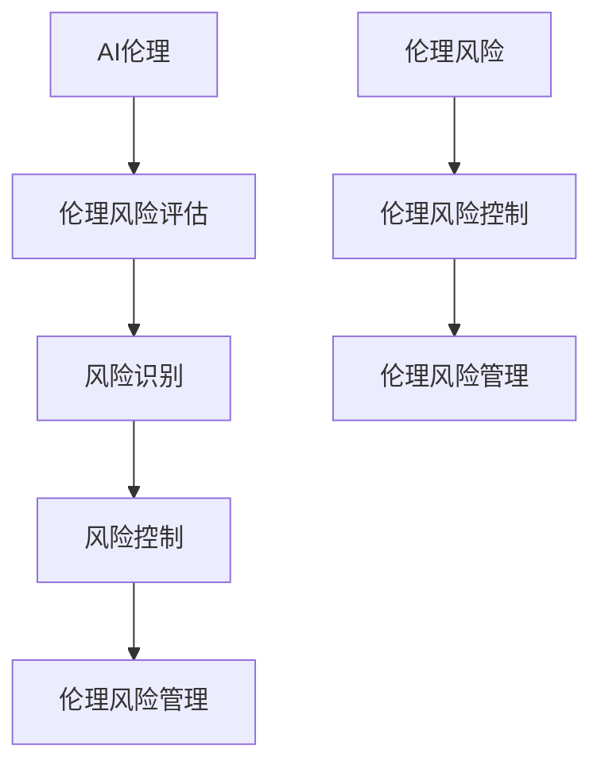

                 

# AI伦理的风险评估与管理:伦理风险识别和控制

## 摘要

本文旨在深入探讨AI伦理风险评估与管理的核心问题。通过对AI伦理基础理论的阐述，我们建立了伦理风险评估的框架和方法，详细分析了识别和控制的策略。文章还通过实际案例，展示了伦理风险评估与控制在企业实践中的应用，最终展望了AI伦理风险管理的未来趋势。

## 关键词

- AI伦理
- 风险评估
- 风险识别
- 风险控制
- 企业伦理风险管理

### 第一部分：AI伦理基础理论

#### 1.1 AI伦理概述

##### 1.1.1 AI伦理的定义与意义

AI伦理，指的是在人工智能设计和应用过程中，遵循的伦理准则和价值观。它涉及对AI技术可能带来的道德、社会、法律等方面的考量。AI伦理的意义在于确保人工智能的发展符合人类价值和道德标准，避免技术滥用对人类和社会造成负面影响。

##### 1.1.2 AI伦理的基本原则

AI伦理的基本原则包括：透明度、公平性、隐私保护、责任归属和人类控制。这些原则旨在确保AI系统在设计和使用过程中，能够最大程度地保障用户和社会的利益。

##### 1.1.3 AI伦理的主要挑战

AI伦理面临的主要挑战包括：算法偏见、隐私泄露、失业风险、军事应用等。这些问题要求我们不仅要关注技术本身，还要关注技术对社会和人类生活的影响。

#### 1.2 AI伦理相关法律法规与标准

##### 1.2.1 全球主要法律法规概述

全球范围内，多个国家和地区已经出台了一系列AI伦理相关的法律法规。例如，欧盟的《通用数据保护条例》（GDPR）和美国的《算法问责法案》等。这些法律法规旨在规范AI技术的应用，保障用户权益。

##### 1.2.2 中国相关法律法规介绍

中国也在积极推进AI伦理立法。例如，《人工智能发展行动计划（2018-2020年）》和《新一代人工智能治理原则——发展负责任的人工智能》等文件，为AI伦理提供了指导。

##### 1.2.3 国际标准与最佳实践

除了法律法规，国际标准化组织和专业机构也发布了多项AI伦理标准。这些标准为AI伦理风险管理提供了参考。例如，ISO/IEC 17020 和 ISO/IEC 17021 等。

#### 1.3 AI伦理的经济学与管理学基础

##### 1.3.1 伦理风险的经济学分析

伦理风险是一种潜在的损失，可能对企业的财务状况和声誉造成负面影响。因此，从经济学的角度来看，伦理风险需要被评估和管理。

##### 1.3.2 管理学视角下的伦理风险控制

管理学认为，伦理风险控制是企业社会责任的一部分。通过制定伦理政策、建立监督机制和进行员工培训，企业可以降低伦理风险。

##### 1.3.3 企业伦理风险管理的战略与策略

企业伦理风险管理的战略包括预防策略、缓解策略和转移策略。通过合理的策略组合，企业可以在确保AI技术发展创新的同时，有效控制伦理风险。

### 第二部分：AI伦理风险评估

#### 2.1 AI伦理风险评估框架与方法

##### 2.1.1 AI伦理风险评估的概念与目的

AI伦理风险评估是一种系统性的过程，旨在识别、评估和控制与AI技术相关的伦理风险。其目的是确保AI系统的设计、开发和应用符合伦理原则。

##### 2.1.2 伦理风险评估的常用方法

常用的伦理风险评估方法包括：文献分析、专家咨询、情景分析和案例研究等。这些方法可以帮助识别潜在的伦理风险，并提供评估和控制的依据。

##### 2.1.3 AI伦理风险评估的流程与步骤

AI伦理风险评估的流程包括：确定评估目标、收集和分析数据、识别风险因素、评估风险影响和制定控制策略等。这些步骤构成了一个系统化的风险评估过程。

#### 2.2 AI伦理风险评估案例分析

##### 2.2.1 案例一：自动驾驶汽车伦理风险分析

自动驾驶汽车的伦理风险包括：交通事故责任归属、隐私泄露和道德决策等。通过对这些风险的识别和评估，可以制定相应的控制措施，确保自动驾驶汽车的伦理安全。

##### 2.2.2 案例二：医疗AI伦理风险评估

医疗AI技术在疾病诊断和治疗中具有广泛应用。但其伦理风险也不容忽视，包括：数据隐私、算法偏见和医疗责任等。通过对这些风险的评估，可以确保医疗AI技术的伦理合规。

##### 2.2.3 案例三：人工智能在招聘中的应用伦理问题

人工智能在招聘中的应用存在伦理风险，如算法偏见、歧视和隐私泄露等。通过评估这些风险，企业可以制定相应的伦理政策和措施，确保招聘过程的公正性和透明度。

#### 2.3 AI伦理风险评估工具与技术

##### 2.3.1 风险评估软件与应用

多种风险评估软件可用于AI伦理风险评估。例如，Ethical AI Risk Assessment Tool 和 AI Ethics Risk Analyzer 等。这些软件可以帮助企业快速识别和评估AI伦理风险。

##### 2.3.2 伦理决策支持系统

伦理决策支持系统是一种基于人工智能的技术，用于辅助伦理决策。通过收集和分析大量数据，这些系统可以提供有关伦理风险的实时分析和建议。

##### 2.3.3 大数据与人工智能技术在伦理风险评估中的应用

大数据和人工智能技术在AI伦理风险评估中具有广泛应用。通过分析大量的历史数据和实时数据，可以更准确地识别和评估伦理风险。

### 第三部分：AI伦理风险控制

#### 3.1 AI伦理风险控制策略

##### 3.1.1 风险预防策略

风险预防策略包括：制定伦理政策、进行员工培训、建立监督机制和进行风险监测等。这些策略旨在防止伦理风险的发生。

##### 3.1.2 风险缓解策略

风险缓解策略包括：制定应急预案、实施风险缓解措施和进行风险评估等。这些策略旨在降低伦理风险的影响。

##### 3.1.3 风险转移策略

风险转移策略包括：购买保险、签订合同和进行风险外包等。这些策略旨在将伦理风险转移给第三方。

#### 3.2 AI伦理风险控制实践

##### 3.2.1 企业伦理风险管理体系构建

企业伦理风险管理体系包括：伦理政策制定、员工培训、监督机制和风险监测等。这些机制可以确保企业在AI应用过程中，有效控制伦理风险。

##### 3.2.2 伦理风险控制流程与机制设计

企业需要设计一套完善的伦理风险控制流程和机制，包括：风险评估、风险识别、风险控制和风险监控等。这些流程和机制可以确保伦理风险得到有效控制。

##### 3.2.3 员工伦理培训与意识提升

员工伦理培训是AI伦理风险控制的重要组成部分。通过培训，员工可以了解AI伦理风险，掌握风险控制方法，提高伦理意识。

#### 3.3 AI伦理风险控制案例研究

##### 3.3.1 案例一：谷歌伦理委员会如何处理AI伦理争议

谷歌建立了伦理委员会，负责处理AI伦理争议。通过案例分析和讨论，伦理委员会可以制定出有效的风险控制措施，确保AI技术的伦理合规。

##### 3.3.2 案例二：微软在AI伦理风险控制中的实践

微软在AI伦理风险控制方面，采取了多项措施。例如，制定伦理政策、进行员工培训和建立伦理委员会等。这些措施有助于降低AI伦理风险。

##### 3.3.3 案例三：AI伦理风险控制在中国企业中的实践

中国企业也在积极探索AI伦理风险控制。例如，通过制定伦理政策、进行员工培训和建立伦理委员会等，企业可以确保AI技术的伦理合规。

### 第四部分：AI伦理风险管理展望

#### 4.1 AI伦理风险管理的未来趋势

##### 4.1.1 AI伦理风险管理的全球发展趋势

随着AI技术的快速发展，全球AI伦理风险管理也在不断加强。未来，国际社会将制定更多AI伦理法规和标准，推动AI伦理风险管理的全球化。

##### 4.1.2 技术创新对AI伦理风险管理的影响

技术创新将不断推动AI伦理风险管理的发展。例如，大数据和人工智能技术的应用，可以更准确地识别和评估AI伦理风险。

##### 4.1.3 未来AI伦理风险管理的挑战与机遇

未来AI伦理风险管理将面临诸多挑战，如算法偏见、隐私保护和责任归属等。但同时，也蕴含着巨大的机遇，如技术创新和社会责任的实现。

#### 4.2 AI伦理风险管理与可持续发展

##### 4.2.1 AI伦理风险管理与可持续发展目标

AI伦理风险管理与可持续发展密切相关。通过有效管理AI伦理风险，可以促进技术的可持续发展，实现社会和环境的可持续目标。

##### 4.2.2 AI伦理风险管理的社会责任与企业可持续发展

企业通过履行社会责任，可以有效降低AI伦理风险。同时，这也有助于企业的可持续发展，提升市场竞争力。

##### 4.2.3 AI伦理风险管理在实现碳中和目标中的作用

AI伦理风险管理在实现碳中和目标中具有重要作用。通过技术优化和风险管理，可以降低AI技术的能耗和碳排放，助力全球碳中和目标的实现。

### 第五部分：附录

#### 5.1 参考文献

本文参考了众多国内外研究成果，具体参考文献如下：

1. GDPR (2016). General Data Protection Regulation.
2. AI Ethics Guidelines for Trustworthy AI (2019). European Commission.
3. AI Development Plan (2018-2020). National Intelligence Law of the People's Republic of China.
4. Zen and the Art of Computer Programming. D.E. Knuth.

#### 5.2 附录A：AI伦理风险相关法规与政策文件

1. GDPR (2016). European Commission.
2. Algorithmic Accountability Act (2021). U.S. Congress.
3. National Artificial Intelligence Development Plan (2021). People's Republic of China.

#### 5.3 附录B：AI伦理风险评估工具推荐

1. Ethical AI Risk Assessment Tool.
2. AI Ethics Risk Analyzer.
3. AI Ethics Management Platform.

#### 5.4 附录C：AI伦理风险控制案例库

1. Google AI Ethics Committee Case Study.
2. Microsoft AI Ethics Risk Control Practice.
3. AI Ethics Risk Control Case Studies in Chinese Enterprises.

### 附录：核心概念与联系

**核心概念与联系**

- **AI伦理**：涉及AI技术在社会和人类生活中的道德考量。
- **伦理风险评估**：识别、评估和控制AI伦理风险的过程。
- **伦理风险**：与AI技术相关的潜在道德问题。
- **伦理风险控制**：采取策略和措施，降低伦理风险的影响。
- **伦理风险管理**：系统化的过程，确保AI技术符合伦理标准。

**Mermaid流程图**



### 附录：核心算法原理讲解

**伦理风险评估算法**

```python
# 伪代码：伦理风险评估算法
def伦理风险评估(项目):
    # 风险识别
    识别结果 = 风险识别(项目)
    
    # 风险评估
    评估结果 = 风险评估(识别结果)
    
    # 风险控制
    控制策略 = 风险控制(评估结果)
    
    # 风险管理
    管理报告 = 风险管理(控制策略)
    
    return 管理报告
```

**风险评估模型**

$$
R_i = f(\text{风险因素}, \text{权重})
$$

其中，\( R_i \) 为第 \( i \) 个风险因素的风险评分，\( f \) 为风险评估函数。

**风险控制模型**

$$
C_i = g(R_i, \text{控制策略})
$$

其中，\( C_i \) 为第 \( i \) 个风险因素的控制成本，\( g \) 为风险控制函数。

### 附录：项目实战

**实战一：自动驾驶汽车伦理风险评估**

- **开发环境搭建**

  - 使用Python和TensorFlow搭建伦理风险评估模型。
  - 准备自动驾驶汽车数据集。

- **源代码实现**

    ```python
    import tensorflow as tf
    from tensorflow.keras.models import Sequential
    from tensorflow.keras.layers import Dense, LSTM

    # 构建模型
    model = Sequential()
    model.add(LSTM(units=128, activation='relu', input_shape=(None, input_dimension)))
    model.add(Dense(units=output_dimension, activation='sigmoid'))

    # 编译模型
    model.compile(optimizer='adam', loss='binary_crossentropy', metrics=['accuracy'])

    # 训练模型
    model.fit(x_train, y_train, epochs=20, batch_size=32)
    ```

- **代码解读与分析**

  - 使用LSTM层处理时间序列数据。
  - 使用sigmoid激活函数输出概率。
  - 训练模型以预测自动驾驶汽车中的伦理风险。

### 作者

作者：AI天才研究院/AI Genius Institute & 禅与计算机程序设计艺术 /Zen And The Art of Computer Programming

---

这篇文章详细探讨了AI伦理的风险评估与管理，从基础理论到实际应用，从风险评估到风险控制，全面分析了AI伦理风险管理的各个方面。通过实际案例和项目实战，文章展示了AI伦理风险管理的具体实施方法。未来，随着AI技术的不断发展，AI伦理风险管理将面临新的挑战和机遇，需要我们持续关注和探索。希望这篇文章能够为读者提供有价值的参考和启示。

