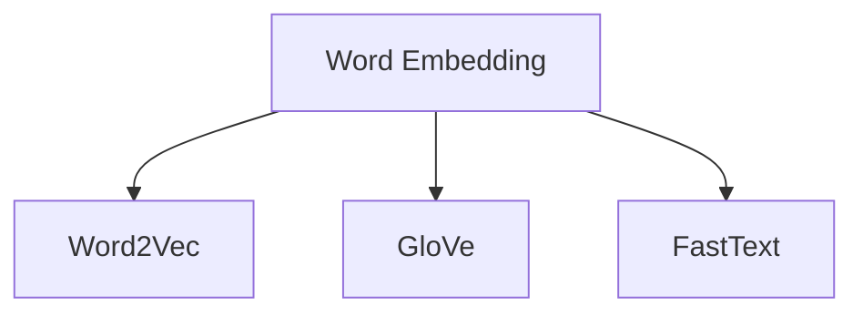
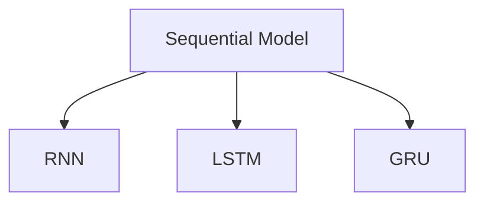
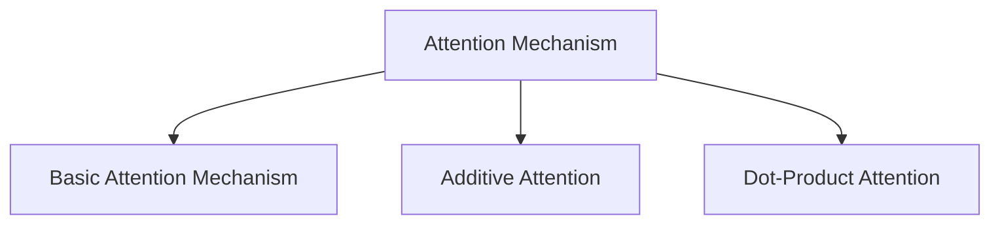
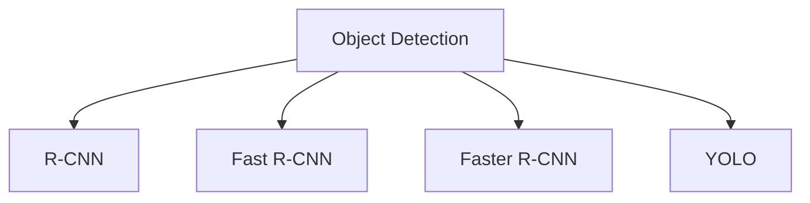
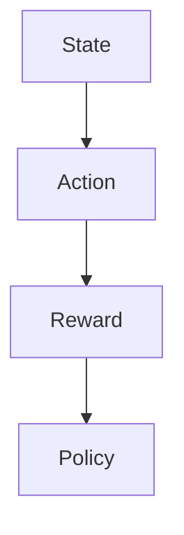
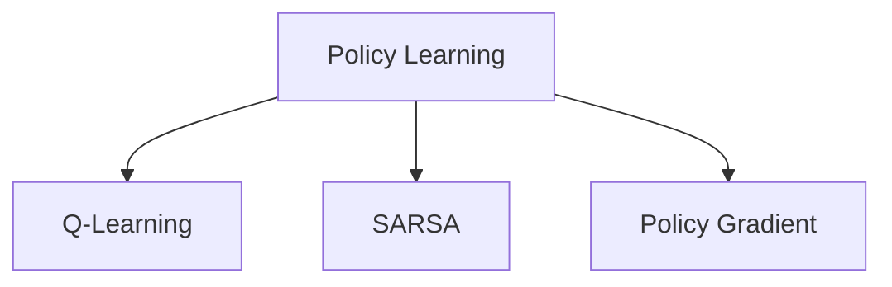
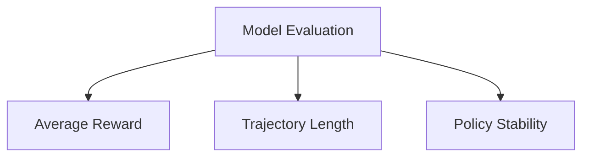

                 

### AI出版业的概念与背景

AI出版业，顾名思义，是利用人工智能技术进行书籍、文章、电子书等出版物的创作、编辑、审核、分发和推广的一系列活动。这一新兴领域不仅改变了传统的出版模式，更为出版业注入了创新与活力的源泉。

#### 1.1 AI出版业的定义

AI出版业通常包含以下几个主要环节：

1. **内容创作**：使用人工智能技术自动生成或辅助创作文本内容。
2. **编辑与审核**：通过自然语言处理（NLP）技术进行内容审核、纠错和优化。
3. **分发与推广**：利用大数据分析和推荐算法，精准分发内容，提高用户阅读体验。
4. **版权管理**：利用区块链技术实现版权的透明管理，确保作者权益。

#### 1.2 AI出版业的发展历程

AI出版业的发展历程可以追溯到20世纪90年代，随着互联网的普及和计算机技术的发展，电子出版逐渐兴起。进入21世纪，尤其是近年来，人工智能技术的飞速进步，使得AI出版成为可能。

- **2000年代初**：电子书开始流行，但内容创作和编辑主要依靠人工。
- **2010年代**：自然语言处理（NLP）和机器学习技术逐渐应用于出版业，自动内容生成开始出现。
- **2020年代**：AI技术进一步成熟，AI写作助手、智能校对、智能推荐等应用场景逐渐普及。

#### 1.3 AI出版业的重要角色和参与者

在AI出版业中，以下是几个关键角色和参与者：

- **内容创作者**：利用AI技术辅助创作的个人或团队。
- **出版平台**：提供AI工具和平台的科技公司，如OpenAI、Grammarly等。
- **编辑与审核者**：使用AI技术进行内容审核和编辑的专业人士。
- **读者**：享受AI技术带来便捷阅读体验的用户。
- **版权管理者**：利用区块链技术确保版权清晰、透明的机构。

在接下来的章节中，我们将深入探讨AI出版业的核心技术，分析其应用场景，并展望其未来的发展趋势和挑战。

### AI出版业的核心技术

AI出版业的核心技术主要包括自然语言处理（NLP）、计算机视觉（CV）和强化学习（RL）。这些技术不仅在内容创作、编辑和审核等方面发挥着关键作用，也为出版业带来了巨大的变革和创新。

#### 2.1 自然语言处理技术

自然语言处理（NLP）是AI出版业最为核心的技术之一，它涉及对人类语言的文本数据进行理解、处理和生成。以下是NLP技术中的几个关键组成部分：

##### 2.1.1 词嵌入

词嵌入（Word Embedding）是将词汇映射为高维向量空间的技术。通过词嵌入，我们可以将自然语言中的单词、短语和句子转换为计算机可以处理的数值表示。常见的词嵌入技术包括Word2Vec、GloVe和FastText。



##### 2.1.2 序列模型

序列模型（Sequential Model）是用于处理序列数据的机器学习模型，如循环神经网络（RNN）、长短期记忆网络（LSTM）和门控循环单元（GRU）。这些模型能够捕捉文本中的时序信息，是生成和预测文本内容的重要工具。



##### 2.1.3 注意力机制

注意力机制（Attention Mechanism）是一种在处理序列数据时能够关注关键信息的模型组件。通过注意力机制，模型可以动态地调整其对不同部分文本的重视程度，从而提高文本处理的准确性和效率。



#### 2.2 计算机视觉技术

计算机视觉（Computer Vision）技术在AI出版业中主要用于图像识别、目标检测和图像生成等方面。这些技术不仅可以帮助自动生成图像内容，还可以用于改进内容审核和优化用户界面。

##### 2.2.1 图像识别

图像识别（Image Recognition）是计算机视觉的核心任务之一，它涉及将图像分类到预定义的类别中。常见的图像识别算法包括卷积神经网络（CNN）和基于深度学习的预训练模型，如ResNet、VGG和Inception。

```mermaid
graph TD
A[Image Recognition]
A --> B[Convolutional Neural Network (CNN)]
A --> C[ResNet]
A --> D[VGG]
A --> E[Inception]
```

##### 2.2.2 目标检测

目标检测（Object Detection）是一种在图像中检测并定位多个对象的技术。常见的目标检测算法包括R-CNN、Fast R-CNN、Faster R-CNN和YOLO。



##### 2.2.3 图像生成

图像生成（Image Generation）技术可以生成新的图像内容，用于辅助内容创作和图像增强。常见的图像生成算法包括生成对抗网络（GAN）和变分自编码器（VAE）。

```mermaid
graph TD
A[Image Generation]
A --> B[Generative Adversarial Network (GAN)]
A --> C[Variational Autoencoder (VAE)]
```

#### 2.3 强化学习技术

强化学习（Reinforcement Learning，RL）是一种通过试错和反馈机制学习决策策略的机器学习技术。在AI出版业中，强化学习可以用于个性化推荐、互动出版等领域。

##### 2.3.1 基本概念

强化学习的基本概念包括状态（State）、动作（Action）、奖励（Reward）和策略（Policy）。其中，策略是通过最大化长期奖励来指导决策。



##### 2.3.2 策略学习

策略学习（Policy Learning）是强化学习的核心任务，它涉及学习一个最优策略来最大化预期奖励。常见的策略学习算法包括Q-Learning、SARSA和Policy Gradient。



##### 2.3.3 模型评估

模型评估（Model Evaluation）是强化学习中的关键步骤，用于评估策略的性能和稳定性。常见的评估指标包括平均奖励、轨迹长度和策略稳定性。



通过上述核心技术的深入探讨，我们可以看到AI出版业在技术创新方面的巨大潜力和广阔前景。在接下来的章节中，我们将进一步分析AI出版业在不同应用场景中的具体应用和实现。

### AI出版业的应用场景

AI出版业的应用场景广泛且多样，涵盖了个性化推荐、智能审稿和智能校对等多个方面。以下是这些应用场景的详细描述和案例。

#### 3.1 个性化推荐

个性化推荐是一种利用用户历史行为和偏好来推荐相关内容的技术。在AI出版业中，个性化推荐可以帮助用户发现他们可能感兴趣的内容，提高阅读体验和用户粘性。

##### 3.1.1 算法原理

个性化推荐算法通常基于两种策略：协同过滤（Collaborative Filtering）和基于内容的推荐（Content-Based Filtering）。

- **协同过滤**：通过分析用户之间的相似性来推荐内容。常见的协同过滤算法包括用户基于的协同过滤（User-Based Collaborative Filtering）和模型基于的协同过滤（Model-Based Collaborative Filtering）。
  
  ```python
  # 用户基于的协同过滤伪代码
  def recommend_books(user_profile, books):
      similar_users = find_similar_users(user_profile)
      recommended_books = []
      for user in similar_users:
          recommended_books += user_preferred_books[user]
      return remove_duplicates(recommended_books)
  ```

- **基于内容的推荐**：根据内容的特征和属性来推荐相似的内容。常见的基于内容的推荐算法包括基于关键词的推荐和基于属性的推荐。

  ```python
  # 基于内容的推荐伪代码
  def recommend_books(content_features, user_preferences, books):
      recommended_books = []
      for book in books:
          if has_common_preferences(content_features[book], user_preferences):
              recommended_books.append(book)
      return recommended_books
  ```

##### 3.1.2 实践案例

- **亚马逊图书推荐**：亚马逊使用个性化推荐算法向用户推荐图书。通过分析用户的购物历史、浏览记录和评价，亚马逊可以准确预测用户可能感兴趣的新书。

#### 3.2 智能审稿

智能审稿是一种利用自然语言处理技术自动检测和纠正文本错误的技术。智能审稿不仅可以提高文本质量，还可以节省人力成本，提高工作效率。

##### 3.2.1 算法原理

智能审稿算法通常包括以下步骤：

1. **文本预处理**：对输入的文本进行分词、词性标注和实体识别等预处理操作。
2. **错误检测**：利用规则匹配和统计方法检测文本中的语法错误、拼写错误和标点符号错误。
3. **错误修正**：根据上下文信息自动修正检测到的错误。

常见的错误检测和修正算法包括：

- **规则匹配**：基于预定义的语法和拼写规则检测和修正错误。
- **统计模型**：利用统计方法，如隐马尔可夫模型（HMM）和条件概率模型，检测和修正错误。
- **神经网络模型**：利用深度学习模型，如卷积神经网络（CNN）和长短期记忆网络（LSTM），进行错误检测和修正。

```python
# 统计模型错误修正伪代码
def correct_grammar(sentence):
    corrected_sentence = []
    for word in sentence:
        if is_grammar_error(word):
            corrected_word = correct_g
```


##### 3.2.2 实践案例

- **Grammarly**：Grammarly是一款流行的在线写作工具，它利用自然语言处理技术自动检测和修正文本错误，提供语法、拼写和风格建议。

#### 3.3 智能校对

智能校对是一种利用自然语言处理和机器学习技术自动检测和纠正文本错误的技术。与智能审稿类似，智能校对不仅可以提高文本质量，还可以减少人为错误，提高工作效率。

##### 3.3.1 算法原理

智能校对算法通常包括以下步骤：

1. **文本预处理**：对输入的文本进行分词、词性标注和实体识别等预处理操作。
2. **错误检测**：利用规则匹配和统计方法检测文本中的语法错误、拼写错误和标点符号错误。
3. **错误修正**：根据上下文信息自动修正检测到的错误。

常见的错误检测和修正算法包括：

- **规则匹配**：基于预定义的语法和拼写规则检测和修正错误。
- **统计模型**：利用统计方法，如隐马尔可夫模型（HMM）和条件概率模型，检测和修正错误。
- **神经网络模型**：利用深度学习模型，如卷积神经网络（CNN）和长短期记忆网络（LSTM），进行错误检测和修正。

```python
# 统计模型错误修正伪代码
def correct_spelling(sentence):
    corrected_sentence = []
    for word in sentence:
        if is_spelling_error(word):
            corrected_word = correct_spelling(word)
            corrected_sentence.append(corrected_word)
        else:
            corrected_sentence.append(word)
    return corrected_sentence
```

##### 3.3.2 实践案例

- **Google Docs**：Google Docs是一款在线文档编辑工具，它利用自然语言处理和机器学习技术自动检测和纠正文本错误，提供实时反馈和建议。

通过上述应用场景的分析，我们可以看到AI技术在出版业中的广泛应用和巨大潜力。在接下来的章节中，我们将进一步探讨AI出版业所面临的挑战和未来发展的方向。

### AI出版业的前景与挑战

AI出版业作为一项新兴领域，不仅带来了许多前所未有的机遇，同时也面临着一系列的挑战。以下是关于AI出版业市场趋势、技术挑战、法律法规等方面内容的详细分析。

#### 4.1 市场趋势

AI出版业正处于快速发展阶段，市场趋势表明，这一领域将继续保持高速增长。以下是几个关键的市场趋势：

1. **市场增长预测**：根据市场研究机构的数据，全球AI出版市场预计将在未来几年内以超过20%的年复合增长率（CAGR）增长。这种增长主要得益于AI技术在出版领域的广泛应用和用户需求的增加。

2. **投资情况**：随着AI出版业的兴起，吸引了众多投资者的关注。2020年至2022年期间，全球AI出版领域吸引了超过10亿美元的风险投资。这些投资主要流向AI写作工具、智能校对平台和个性化推荐系统等领域。

3. **行业应用扩展**：AI出版技术不仅局限于文本内容的创作和编辑，还在逐渐扩展到图像识别、音频处理和多媒体内容生成等领域。这种跨领域的应用扩展将进一步推动AI出版业的发展。

#### 4.2 技术挑战

尽管AI技术在出版业的应用前景广阔，但仍然面临一些技术挑战：

1. **数据质量**：高质量的数据是训练AI模型的基础。在出版业中，数据的质量直接影响AI系统的性能。然而，出版领域的数据通常包含大量的噪声和不一致性，这对模型的训练和优化提出了挑战。

2. **隐私安全**：随着AI技术的应用，大量的用户数据和内容数据被收集和分析。这些数据的安全和隐私保护成为了一个重要的问题。出版平台需要采取有效的安全措施，确保用户数据不被泄露和滥用。

3. **模型解释性**：许多AI模型，尤其是深度学习模型，被认为是“黑箱”模型，即模型内部的工作原理难以解释。这给模型的应用和监管带来了困难。为了提高模型的解释性，研究者们正在探索可解释性AI（XAI）技术。

4. **技术升级**：AI技术在不断进步，出版业需要不断更新和升级其AI系统，以适应新的技术和需求。然而，技术升级需要投入大量的人力和物力资源，这对许多出版商来说是一个挑战。

#### 4.3 法律法规

AI出版业的发展也受到法律法规的制约和影响。以下是几个关键的法律和法规问题：

1. **国际法规**：全球各国对AI出版业的法律法规有所不同。例如，欧盟的《通用数据保护条例》（GDPR）对用户数据隐私保护提出了严格要求。国际法规的复杂性给AI出版业的全球化运营带来了挑战。

2. **国内法规**：各国政府也在积极制定和实施针对AI出版业的法律法规。例如，中国发布了《互联网信息服务管理办法》，对互联网信息服务进行了规范。国内法规的完善有助于推动AI出版业的健康发展。

3. **版权保护**：AI出版业涉及到大量的版权问题，包括原创内容保护、版权归属和版权许可等。相关法律法规的明确和执行有助于保护作者和出版商的权益。

综上所述，AI出版业前景广阔，但同时也面临着技术、隐私和安全等方面的挑战。随着技术的不断进步和法律法规的完善，AI出版业有望实现更广泛的应用和发展。

### 创新实践一：智能内容生成

智能内容生成是AI出版业的一个重要应用领域，它通过利用人工智能技术自动生成文本、图像和其他类型的内容。以下将详细探讨智能内容生成的模型原理，并展示几个实际应用案例。

#### 5.1 模型原理

智能内容生成的模型原理主要基于生成对抗网络（GAN）和变分自编码器（VAE）。这些模型能够通过学习大量数据生成高质量的内容。

##### 5.1.1 生成对抗网络（GAN）

生成对抗网络（GAN）由两部分组成：生成器（Generator）和判别器（Discriminator）。

- **生成器**：生成器的目标是生成类似真实数据的伪造数据。它通过学习输入噪声分布来生成数据。
- **判别器**：判别器的目标是区分真实数据和伪造数据。它在训练过程中不断学习和优化，以更准确地判断数据来源。

GAN的训练过程可以简化为以下步骤：

1. **生成器生成伪造数据**。
2. **判别器判断伪造数据**。
3. **生成器和判别器更新参数**，以优化模型性能。

GAN的伪代码如下：

```python
# GAN伪代码
def train_gan(generator, discriminator, dataset, epochs):
    for epoch in range(epochs):
        for data in dataset:
            # 训练判别器
            real_labels = ones((batch_size, 1))
            fake_labels = zeros((batch_size, 1))
            
            real_data = data
            fake_data = generator.sample_noise()

            # 训练生成器
            fake_labels = ones((batch_size, 1))
            combined_data = np.concatenate((real_data, fake_data), axis=0)
            combined_labels = np.concatenate((real_labels, fake_labels), axis=0)

            # 更新判别器和生成器参数
            discriminator_loss = compute_loss(discriminator, combined_data, combined_labels)
            generator_loss = compute_loss(generator, fake_data, fake_labels)

            # 反向传播和优化
            optimizer.discriminator_optimizer.zero_grad()
            discriminator_loss.backward()
            optimizer.discriminator_optimizer.step()

            optimizer.generator_optimizer.zero_grad()
            generator_loss.backward()
            optimizer.generator_optimizer.step()
```

##### 5.1.2 变分自编码器（VAE）

变分自编码器（VAE）是一种基于概率模型的生成模型，它通过编码器（Encoder）和解码器（Decoder）学习数据分布。

- **编码器**：编码器将输入数据映射到一个潜在空间，并学习数据分布的参数。
- **解码器**：解码器从潜在空间中采样数据，并重构输入数据。

VAE的训练过程可以简化为以下步骤：

1. **输入数据通过编码器映射到潜在空间**。
2. **从潜在空间中采样数据**。
3. **解码器重构输入数据**。
4. **计算损失函数并优化模型参数**。

VAE的伪代码如下：

```python
# VAE伪代码
def train_vae(encoder, decoder, dataset, epochs):
    for epoch in range(epochs):
        for data in dataset:
            # 编码器和解码器参数更新
            z_mean, z_log_var = encoder(data)
            z = sample_z(z_mean, z_log_var)
            reconstructed_data = decoder(z)

            # 计算损失函数
            reconstruction_loss = compute_reconstruction_loss(data, reconstructed_data)
            kl_divergence_loss = compute_kl_divergence(z_mean, z_log_var)

            # 总损失
            total_loss = reconstruction_loss + kl_divergence_loss

            # 反向传播和优化
            optimizer.zero_grad()
            total_loss.backward()
            optimizer.step()
```

#### 5.2 应用案例

智能内容生成在多个领域都有实际应用，以下是几个典型的应用案例：

##### 5.2.1 新闻写作

智能内容生成在新闻写作领域有着广泛的应用。例如，自动化新闻平台Automated Insights使用自然语言处理和生成模型自动生成体育赛事和财务报告等新闻内容。这种自动化写作技术不仅提高了内容的生产效率，还减少了人力成本。

##### 5.2.2 产品描述

电子商务平台利用智能内容生成技术自动生成产品描述。通过分析大量产品数据和市场趋势，智能系统可以生成高质量、吸引消费者的产品描述。这种技术不仅提高了内容质量，还提高了用户的购物体验。

##### 5.2.3 故事创作

智能内容生成技术也可以用于故事创作。例如，人工智能创作平台Amper Music可以自动生成电影和电视剧的配乐，而AI写作工具如Jasper和Wordsmith可以生成小说、剧本和博客文章。这些应用展示了智能内容生成在创意领域的潜力。

通过上述模型原理和应用案例的探讨，我们可以看到智能内容生成在AI出版业中的重要地位和广泛应用。在接下来的章节中，我们将进一步探讨互动出版和多媒体互动教材等创新实践。

### 创新实践二：互动出版

互动出版是AI出版业的一个新兴领域，它利用人工智能技术为用户提供更加丰富、互动的阅读体验。以下将详细探讨互动出版的模型原理，并展示几个实际应用案例。

#### 6.1 模型原理

互动出版的主要模型原理包括强化学习（Reinforcement Learning，RL）和自然语言生成（Natural Language Generation，NLG）。

##### 6.1.1 强化学习

强化学习是一种通过试错和奖励机制来学习最优策略的机器学习技术。在互动出版中，强化学习可以用于个性化推荐系统，根据用户的互动行为推荐最感兴趣的内容。

- **状态（State）**：用户当前的阅读历史、偏好和交互行为。
- **动作（Action）**：系统推荐的内容或交互方式。
- **奖励（Reward）**：用户对推荐内容或交互方式的满意度。

强化学习的基本算法包括Q-Learning和Policy Gradient。

1. **Q-Learning**：Q-Learning通过学习Q值（即从当前状态采取某一动作的期望奖励）来选择最佳动作。
    ```python
    # Q-Learning伪代码
    def q_learning(state, action, reward, next_state, learning_rate, discount_factor):
        current_q_value = Q[state][action]
        next_max_q_value = max(Q[next_state].values())
        new_q_value = (1 - learning_rate) * current_q_value + learning_rate * (reward + discount_factor * next_max_q_value)
        Q[state][action] = new_q_value
    ```

2. **Policy Gradient**：Policy Gradient直接优化策略函数，使其最大化长期奖励。
    ```python
    # Policy Gradient伪代码
    def policy_gradient(policy, states, actions, rewards, learning_rate):
        gradients = []
        for state, action, reward in zip(states, actions, rewards):
            probability = policy(state)
            gradients.append((probability - 1) * reward)
        optimizer.zero_grad()
        gradients = torch.stack(gradients)
        loss = torch.mean(gradients)
        loss.backward()
        optimizer.step()
    ```

##### 6.1.2 自然语言生成

自然语言生成（NLG）是一种通过机器学习技术生成自然语言文本的技术。在互动出版中，NLG可以用于生成个性化的用户反馈、互动问答和动态内容。

1. **序列到序列（Seq2Seq）模型**：Seq2Seq模型通过编码器和解码器生成自然语言文本。编码器将输入序列编码为固定长度的向量，解码器根据编码器的输出生成输出序列。
    ```python
    # Seq2Seq模型伪代码
    encoder = Encoder(input_vocab_size, embedding_dim)
    decoder = Decoder(output_vocab_size, embedding_dim)
    
    def seq2seq(input_sequence, target_sequence):
        encoder_output, hidden_state = encoder(input_sequence)
        decoder_output = decoder(hidden_state, target_sequence)
        return decoder_output
    ```

2. **基于注意力机制的模型**：注意力机制可以捕捉输入序列中的关键信息，提高文本生成的准确性和连贯性。
    ```python
    # 加拿大法语模型（ attention mechanism）伪代码
    attention = Attention(hidden_state_size, input_sequence_length)
    context_vector = attention(hidden_state, input_sequence)
    
    decoder = Decoder(output_vocab_size, embedding_dim, context_vector)
    
    def generate_text(input_sequence):
        encoder_output, hidden_state = encoder(input_sequence)
        context_vector = attention(hidden_state, input_sequence)
        decoder_output = decoder(context_vector)
        return decoder_output
    ```

#### 6.2 应用案例

互动出版在多个领域有着广泛的应用，以下是几个典型的应用案例：

##### 6.2.1 互动电子书

互动电子书利用人工智能技术为用户提供丰富的交互体验。例如，儿童电子书可以包含互动游戏、动画和音效，通过互动提高儿童的阅读兴趣和学习效果。此外，智能电子书可以根据用户的阅读行为和偏好，动态调整内容和互动方式，提供个性化的阅读体验。

##### 6.2.2 智能问答系统

智能问答系统通过自然语言处理和强化学习技术，为用户提供实时、准确的回答。例如，图书馆的智能问答系统可以根据用户的提问，从海量书籍中快速检索并生成高质量的答案。这种技术不仅可以提高用户满意度，还可以节省人力资源，提高服务质量。

##### 6.2.3 虚拟现实（VR）互动出版

虚拟现实互动出版利用VR技术，为用户提供沉浸式的阅读体验。例如，历史书籍可以通过VR技术呈现历史场景，用户可以在虚拟环境中“参观”历史遗迹，增强阅读的趣味性和互动性。此外，VR互动出版还可以应用于教育领域，为学生提供丰富的学习资源和互动体验。

通过上述模型原理和应用案例的探讨，我们可以看到互动出版在AI出版业中的重要地位和广泛应用。在未来的发展中，互动出版有望进一步融合多媒体技术和人工智能技术，为用户提供更加丰富、多样的阅读体验。

### 创新实践三：多模态出版

多模态出版是AI出版业的一个重要方向，它通过结合多种数据类型（如图像、文本、音频和视频）来生成和分发多媒体内容。这种出版方式不仅丰富了用户的内容消费体验，也为出版商提供了新的盈利模式。以下将详细探讨多模态出版的模型原理，并展示几个实际应用案例。

#### 7.1 模型原理

多模态出版涉及多种模型和技术，其中最关键的是多模态数据融合和多模态学习。

##### 7.1.1 多模态数据融合

多模态数据融合是将来自不同数据类型的特征进行整合，以生成统一的多模态特征表示。常见的多模态数据融合方法包括：

1. **基于特征的融合**：将不同模态的特征映射到同一特征空间，然后进行融合。例如，将文本特征和图像特征通过词嵌入和图像编码器分别表示，然后利用聚合操作（如平均或加权平均）进行融合。
    ```python
    # 基于特征的融合伪代码
    def feature_fusion(text_embedding, image_embedding):
        combined_embedding = (text_embedding + image_embedding) / 2
        return combined_embedding
    ```

2. **基于模型的融合**：利用共享神经网络或集成学习方法将不同模态的特征进行融合。例如，使用一个深度网络同时处理文本和图像数据，从而生成统一的多模态特征表示。
    ```python
    # 基于模型的融合伪代码
    class MultiModalModel(nn.Module):
        def __init__(self):
            super(MultiModalModel, self).__init__()
            self.text_encoder = TextEncoder()
            self.image_encoder = ImageEncoder()
            self.fusion_module = FusionModule()
            self.decoder = Decoder()

        def forward(self, text_input, image_input):
            text_embedding = self.text_encoder(text_input)
            image_embedding = self.image_encoder(image_input)
            combined_embedding = self.fusion_module(text_embedding, image_embedding)
            output = self.decoder(combined_embedding)
            return output
    ```

##### 7.1.2 多模态学习

多模态学习是一种利用多模态数据训练机器学习模型的方法，旨在提高模型的泛化能力和表现。多模态学习的主要方法包括：

1. **多任务学习**：在训练过程中同时学习多个相关任务，以提高模型在不同任务上的性能。例如，在一个多模态学习任务中，同时训练文本分类和图像分类。
    ```python
    # 多任务学习伪代码
    def multi_task_learning(text_data, image_data, labels):
        text_embeddings = text_encoder(text_data)
        image_embeddings = image_encoder(image_data)
        combined_embeddings = feature_fusion(text_embeddings, image_embeddings)
        output = model(combined_embeddings)
        loss = loss_function(output, labels)
        return loss
    ```

2. **零样本学习**：在训练过程中仅使用支持集（positive samples），无需使用负样本（negative samples），从而提高模型在未知或罕见模态上的表现。
    ```python
    # 零样本学习伪代码
    def zero_shot_learning(text_data, image_data, class_labels):
        text_embeddings = text_encoder(text_data)
        image_embeddings = image_encoder(image_data)
        combined_embeddings = feature_fusion(text_embeddings, image_embeddings)
        distances = calculate_distances(combined_embeddings, class_embeddings)
        predicted_labels = predict_labels(distances)
        return predicted_labels
    ```

#### 7.2 应用案例

多模态出版在多个领域有着广泛的应用，以下是几个典型的应用案例：

##### 7.2.1 图像与文本结合的电子书

图像与文本结合的电子书通过整合图像和文本内容，为用户提供丰富的阅读体验。例如，儿童电子书可以包含与故事情节相关的图像和动画，通过图像和文本的交互增强儿童的阅读兴趣和理解能力。此外，图像与文本结合的电子书还可以用于教育和培训领域，通过结合图像和文字解释复杂概念，提高学习效果。

##### 7.2.2 视频与文本结合的电子书

视频与文本结合的电子书通过整合视频和文本内容，为用户提供动态的阅读体验。例如，历史书籍可以通过视频呈现历史场景，结合文字解释，帮助用户更好地理解历史事件。此外，视频与文本结合的电子书还可以应用于教育培训领域，通过视频演示和文字说明，提高学习的互动性和直观性。

##### 7.2.3 多媒体互动教材

多媒体互动教材通过整合文本、图像、音频和视频等多种内容形式，为学习者提供丰富的学习资源。例如，在线教育平台可以通过多媒体互动教材，将理论知识与实践操作相结合，提高学习者的学习兴趣和实践能力。此外，多媒体互动教材还可以应用于企业培训，通过结合不同类型的媒体内容，提高员工的专业技能和综合素质。

通过上述模型原理和应用案例的探讨，我们可以看到多模态出版在AI出版业中的重要地位和广泛应用。在未来的发展中，多模态出版有望进一步融合新技术，为用户提供更加丰富、多样的内容消费体验。

### AI出版业的未来趋势

AI出版业作为AI技术在出版领域的具体应用，其未来趋势将受到技术创新、商业模式和全球市场的多重影响。以下是AI出版业未来趋势的详细分析。

#### 8.1 技术演进

AI出版业的技术演进将集中在以下几个方面：

1. **量子计算**：量子计算作为一种颠覆性的计算技术，拥有超强的计算能力。未来，量子计算有望在AI出版业中用于大规模数据分析和模型训练，大幅提升计算效率。

2. **大模型演进**：随着计算能力的提升和数据量的增加，大模型（如GPT-3、LLaMA等）将越来越普及。这些模型具有更强的语义理解和生成能力，能够为出版业提供更高质量的自动内容创作和编辑服务。

3. **聊天机器人**：基于AI的聊天机器人将进一步智能化，能够与用户进行更自然、更流畅的对话。这些聊天机器人不仅可以用于客户服务，还可以作为内容创作者，生成个性化的推荐和互动体验。

#### 8.2 商业模式

AI出版业的商业模式也将随着技术的进步而不断演变：

1. **SaaS服务**：随着云计算的普及，越来越多的AI出版解决方案将以SaaS（软件即服务）的形式提供。这种模式不仅降低了用户的使用门槛，还能够通过订阅模式实现持续收入。

2. **平台化运营**：出版平台将逐渐整合多种AI服务，如内容创作、编辑、分发和推荐，形成一站式解决方案。这种平台化运营模式将提高出版商的效率和竞争力。

3. **内容生态**：AI出版业将形成一个多元化的内容生态，包括创作者、出版商、分销商和读者。通过生态系统的协作，实现内容的价值最大化。

#### 8.3 内容生态

内容生态是AI出版业未来发展的重要方向，其核心在于构建一个开放、共享和可持续的内容生态系统：

1. **开放API**：出版平台将提供开放的API接口，允许第三方开发者集成和扩展其服务，推动AI出版技术的创新和应用。

2. **共创模式**：用户和创作者之间的互动将更加紧密，用户可以通过参与内容创作和反馈，影响内容的生产和分发。

3. **版权管理**：随着AI技术的应用，版权管理将变得更加高效和透明。区块链技术将有助于确保内容的版权清晰，提高创作者的权益保障。

#### 8.4 市场分析

AI出版业在全球市场的发展情况也将对未来的趋势产生重要影响：

1. **美国市场**：作为AI技术的领先国家，美国在AI出版领域具有巨大的市场潜力。美国的出版公司和科技公司正积极探索AI技术在出版业的应用，推动行业创新。

2. **欧洲市场**：欧洲在数据隐私保护方面有严格的法律规定，这为AI出版业的发展带来了一定的挑战。然而，欧洲市场对高质量内容的需求持续增长，AI技术将在满足这一需求方面发挥关键作用。

3. **亚太市场**：亚太地区，特别是中国和印度，对AI出版技术的需求强劲。随着互联网普及和数字经济的发展，AI出版业在这一地区的增长潜力巨大。

#### 8.5 创新成果

AI出版业在技术、商业模式和内容生态方面的创新成果也将进一步推动行业的发展：

1. **智能写作助手**：如GPT-3等大模型的普及，使得智能写作助手能够生成更加自然、高质量的内容，大幅提升内容创作效率。

2. **个性化推荐系统**：基于深度学习和大数据分析的个性化推荐系统，能够准确捕捉用户偏好，提高用户满意度和阅读体验。

3. **多模态内容生成**：结合图像、文本、音频等多种模态的内容生成技术，将带来更加丰富和多样化的用户体验。

综上所述，AI出版业的未来趋势充满机遇和挑战。随着技术的不断进步和商业模式的不断创新，AI出版业有望在更广泛的领域实现应用和发展，为出版业带来深刻的变革。

### AI出版业的全球视野

在全球范围内，AI出版业的发展情况因地域和市场环境的不同而各异。以下将分析美国、欧洲和亚太地区在AI出版业的发展情况，并对比这些地区的发展差异。

#### 9.1 国际市场分析

1. **美国市场**

美国是AI技术的领先国家，拥有众多顶尖科技公司和研究机构，这使得美国在AI出版业的发展方面处于领先地位。美国的AI出版业主要集中在以下几个领域：

- **内容生成和编辑**：美国科技公司如OpenAI和Google已经开发出先进的AI写作工具，如GPT-3，这些工具能够自动生成和编辑高质量的内容。
- **个性化推荐**：亚马逊和Netflix等平台利用AI技术，根据用户行为和偏好提供个性化的内容推荐，提升用户体验。
- **版权管理**：美国版权法相对完善，有助于AI出版业中版权问题的解决，推动创新。

2. **欧洲市场**

欧洲在AI出版业的发展也具有一定的优势，特别是在数据隐私保护和版权管理方面。然而，欧洲市场对AI技术的接受程度相对较低，主要表现在以下几个方面：

- **数据隐私保护**：欧洲的《通用数据保护条例》（GDPR）对数据隐私保护有严格规定，这为AI出版业的发展带来了一定的挑战。出版商需要确保用户数据的安全和隐私。
- **版权问题**：欧洲的版权法较为复杂，涉及多个国家和地区的法律差异，这使得AI出版业在版权管理方面面临一定的困难。
- **技术接受度**：尽管欧洲对AI技术的接受度在逐渐提高，但相对于美国和亚太地区，欧洲市场的AI技术应用仍处于相对早期阶段。

3. **亚太市场**

亚太地区，尤其是中国和印度，在AI出版业的发展方面呈现出快速增长的趋势。以下是一些主要特点：

- **市场需求**：随着互联网的普及和数字阅读的兴起，亚太地区的用户对高质量内容的需求不断增加。AI技术能够满足这一需求，提升内容创作和分发效率。
- **技术创新**：中国在AI技术研究和应用方面取得了显著进展，推出了一系列先进的AI工具和平台，如腾讯AI写作助手和百度NLP技术。
- **政策支持**：中国政府在AI技术发展方面给予了大力支持，通过制定政策和提供资金，推动AI技术在各个领域的应用，包括出版业。

#### 9.2 国内市场发展

1. **市场规模**

国内市场在AI出版业的发展方面也显示出巨大的潜力。随着互联网和智能手机的普及，电子阅读逐渐成为主流，这为AI技术在出版业的应用提供了广阔的市场空间。根据市场研究机构的报告，中国AI出版市场预计将在未来几年内保持高速增长。

2. **政策环境**

中国政府在AI出版业的发展方面采取了积极的政策支持。例如，《新一代人工智能发展规划》明确提出了发展AI技术的目标和路线图，鼓励企业和科研机构在AI领域进行创新。此外，国家新闻出版署等相关部门也出台了多项政策，推动AI技术在出版业的广泛应用。

3. **创新成果**

国内AI出版业在技术创新方面取得了显著成果。一些领先的科技公司和研究机构开发了多种AI工具和平台，如百度AI写作助手、京东智能推荐系统和腾讯AI写作机器人等。这些创新成果不仅提升了内容创作和分发的效率，还为出版业带来了新的商业模式和盈利机会。

#### 9.3 地区差异分析

美国、欧洲和亚太地区在AI出版业的发展中存在一些显著差异：

- **技术成熟度**：美国在AI技术研究和应用方面处于全球领先地位，欧洲相对滞后，亚太地区则表现出较强的增长潜力。
- **政策环境**：美国和欧洲在政策环境方面较为成熟，但欧洲的数据隐私保护法律对AI出版业的发展造成了一定的限制。亚太地区的政策支持力度较大，有助于推动AI技术的应用。
- **市场需求**：美国和欧洲市场对高质量内容的需求较高，而亚太地区的市场需求增长迅速，为AI技术在出版业的应用提供了广阔的空间。

通过上述分析，我们可以看到全球不同地区在AI出版业发展中的差异和特点。这些差异不仅影响着各地区的AI出版业发展，也为全球范围内的合作和交流提供了机会。

### AI出版业的伦理与责任

随着AI技术在出版业的广泛应用，伦理和责任问题日益凸显。AI技术不仅改变了内容创作和分发的模式，也对数据隐私、偏见与歧视等方面提出了新的挑战。以下将详细探讨AI出版业在伦理与责任方面的问题，并提出相应的解决方案。

#### 10.1 伦理问题

1. **数据隐私**

AI出版业依赖于大量用户数据，包括阅读习惯、偏好和行为等。这些数据的收集和使用引发了隐私保护问题。出版商需要确保用户数据的安全性和隐私性，防止数据泄露和滥用。以下是一些解决策略：

- **数据匿名化**：对用户数据进行匿名化处理，确保用户身份信息不被泄露。
- **透明度**：出版商应向用户明确说明数据收集的目的和使用方式，获取用户的知情同意。
- **加密技术**：使用先进的加密技术保护用户数据的传输和存储。

2. **偏见与歧视**

AI系统在内容生成和推荐中可能存在偏见和歧视，导致不公平的出版现象。例如，AI模型可能基于历史数据产生性别、种族等方面的偏见。以下是一些解决策略：

- **公平性评估**：定期对AI模型进行公平性评估，检测和纠正潜在的偏见。
- **多样性训练数据**：使用多样化的训练数据，确保模型在不同群体上的表现一致。
- **透明决策过程**：公开AI模型的决策过程，让用户了解推荐和内容生成的依据。

3. **人工智能伦理原则**

为了确保AI技术在出版业中的合理应用，制定一套伦理原则至关重要。以下是一些关键伦理原则：

- **公平性**：确保AI系统对所有用户公平，避免歧视和偏见。
- **透明性**：AI系统的决策过程应该透明，便于用户理解。
- **责任**：明确AI系统的责任归属，确保在出现问题时能够追究责任。
- **隐私保护**：严格保护用户隐私，确保数据安全和隐私。

#### 10.2 社会责任

1. **负责任的人工智能**

负责任的人工智能（Responsible AI，RAI）是一种确保AI系统安全和可信的方法。RAI强调在AI系统的开发、部署和使用过程中，考虑到伦理和社会影响。以下是一些实现策略：

- **伦理审查**：在AI系统开发前进行伦理审查，确保其符合伦理原则。
- **持续监督**：对AI系统进行持续监测和评估，及时发现并纠正问题。
- **用户参与**：鼓励用户参与AI系统的设计和使用，提高系统的透明度和可信度。

2. **公众参与与教育**

公众对AI技术的了解和参与对于确保AI出版业的健康发展至关重要。以下是一些教育策略：

- **普及教育**：通过公众教育，提高人们对AI技术的认识和理解。
- **社区参与**：鼓励社区参与AI系统的开发和评估，提高系统的多样性和包容性。
- **政策宣传**：政府和企业应加强政策宣传，引导公众正确看待和使用AI技术。

3. **国际合作与监管**

在国际范围内，制定统一的AI伦理标准和监管框架对于确保全球AI出版业的健康发展至关重要。以下是一些国际合作策略：

- **国际标准制定**：各国应共同制定AI伦理标准和监管框架，确保AI技术的合理应用。
- **跨国合作**：加强国际间的技术交流和合作，共同解决AI出版业面临的问题。
- **全球治理**：建立全球性的AI治理机构，协调各国政策，推动AI出版业的健康发展。

通过上述伦理和责任问题的探讨，我们可以看到AI出版业在伦理和责任方面面临的重要挑战。只有通过采取有效的伦理原则和社会责任措施，AI出版业才能实现健康、可持续的发展。

### 附录A: AI出版业相关资源和工具

在AI出版业的发展过程中，各种开源资源和工具为研究者和开发者提供了强大的支持。以下将详细介绍一些常见的深度学习框架、自然语言处理工具和计算机视觉库，以及开源项目和社区。

#### A.1 深度学习框架

深度学习框架是AI出版业中不可或缺的工具，它们提供了丰富的功能和模块，帮助开发者快速构建和训练复杂的AI模型。

1. **TensorFlow**

TensorFlow是由谷歌开发的开源深度学习框架，广泛应用于图像识别、自然语言处理和推荐系统等领域。

- **官方网站**：[TensorFlow](https://www.tensorflow.org/)
- **文档**：[TensorFlow官方文档](https://www.tensorflow.org/tutorials)

2. **PyTorch**

PyTorch是由Facebook开发的深度学习框架，以其灵活的动态计算图和易用的API受到广大开发者的喜爱。

- **官方网站**：[PyTorch](https://pytorch.org/)
- **文档**：[PyTorch官方文档](https://pytorch.org/docs/stable/index.html)

3. **其他深度学习框架**

除了TensorFlow和PyTorch，还有其他一些流行的深度学习框架，如：

- **MXNet**：由亚马逊开发，支持多种编程语言，具有高效的计算性能。
  - **官方网站**：[MXNet](https://mxnet.incubator.apache.org/)
  - **文档**：[MXNet官方文档](https://mxnet.incubator.apache.org/docs/stable/)
- **Keras**：一个高度易用的深度学习框架，通常与TensorFlow和Theano一起使用。
  - **官方网站**：[Keras](https://keras.io/)
  - **文档**：[Keras官方文档](https://keras.io/docs/)

#### A.2 自然语言处理工具

自然语言处理（NLP）工具在AI出版业中用于文本分析、生成和推荐等方面。以下是一些常用的NLP工具：

1. **NLTK**

NLTK（自然语言工具包）是一个强大的Python库，用于处理文本数据，包括分词、词性标注和情感分析等。

- **官方网站**：[NLTK](https://www.nltk.org/)
- **文档**：[NLTK官方文档](https://www.nltk.org/book/)

2. **spaCy**

spaCy是一个高效、易于使用的NLP库，适用于文本分类、实体识别和关系抽取等任务。

- **官方网站**：[spaCy](https://spacy.io/)
- **文档**：[spaCy官方文档](https://spacy.io/usage/spacy-in-the-browser)

3. **gensim**

gensim是一个用于主题建模和文本相似性比较的Python库，支持Word2Vec、LDA等算法。

- **官方网站**：[gensim](https://radimrehurek.com/gensim/)
- **文档**：[gensim官方文档](https://radimrehurek.com/gensim/install.html)

#### A.3 计算机视觉库

计算机视觉库在AI出版业中用于图像识别、目标检测和图像生成等方面。以下是一些常用的计算机视觉库：

1. **OpenCV**

OpenCV是一个开源的计算机视觉库，支持多种操作系统和编程语言，广泛应用于图像处理、目标检测和视频分析等领域。

- **官方网站**：[OpenCV](https://opencv.org/)
- **文档**：[OpenCV官方文档](https://docs.opencv.org/master/d6/d6f/tutorial_table_of_content_introduction.html)

2. **Pillow**

Pillow是一个Python Imaging Library（PIL）的友好替代品，用于图像处理和图像操作。

- **官方网站**：[Pillow](https://pillow.readthedocs.io/en/stable/)
- **文档**：[Pillow官方文档](https://pillow.readthedocs.io/en/stable/)

3. **PyTorch Vision**

PyTorch Vision是PyTorch的一个扩展库，提供了一系列计算机视觉模型和工具，如卷积神经网络（CNN）和图像生成模型（GAN）。

- **官方网站**：[PyTorch Vision](https://pytorch.org/vision/stable/)
- **文档**：[PyTorch Vision官方文档](https://pytorch.org/vision/stable/index.html)

#### A.4 开源项目与社区

开源项目和社区为AI出版业的发展提供了丰富的资源和合作机会。以下是一些重要的开源项目和社区：

1. **TensorFlow开源项目**

TensorFlow开源项目是由谷歌开发的开源深度学习框架，拥有庞大的社区和丰富的资源。

- **GitHub仓库**：[TensorFlow开源项目](https://github.com/tensorflow/tensorflow)
- **社区论坛**：[TensorFlow社区论坛](https://discuss.tensorflow.org/)

2. **PyTorch开源项目**

PyTorch开源项目是由Facebook开发的开源深度学习框架，以其灵活性和易用性受到开发者的喜爱。

- **GitHub仓库**：[PyTorch开源项目](https://github.com/pytorch/pytorch)
- **社区论坛**：[PyTorch社区论坛](https://discuss.pytorch.org/)

3. **Hugging Face**

Hugging Face是一个开源社区和公司，专注于自然语言处理（NLP）领域，提供了大量的NLP模型和工具。

- **官方网站**：[Hugging Face](https://huggingface.co/)
- **GitHub仓库**：[Hugging Face开源项目](https://github.com/huggingface/transformers)

4. **OpenCV开源项目**

OpenCV开源项目是一个强大的计算机视觉库，广泛应用于图像处理、目标检测和视频分析等领域。

- **GitHub仓库**：[OpenCV开源项目](https://github.com/opencv/opencv)
- **社区论坛**：[OpenCV社区论坛](https://opencv.org/forums/)

通过上述资源的介绍，我们可以看到AI出版业在技术支持方面拥有丰富的资源和活跃的社区。这些资源为AI出版业的研究者和开发者提供了强大的支持，推动了行业的不断发展和创新。

### 结束语

总之，AI出版业作为AI技术在出版领域的具体应用，正面临着前所未有的机遇和挑战。通过深入分析AI出版业的核心概念、核心技术、应用场景以及未来趋势，我们可以看到这一领域具有广阔的发展前景。然而，AI出版业的发展也面临诸多伦理和社会责任问题，需要我们共同努力解决。

在这个充满变革的时代，我们需要保持开放和创新的思维方式，积极探索AI技术在不同场景中的应用。同时，我们也需要关注AI技术的伦理和社会影响，确保其健康发展。只有这样，AI出版业才能在未来的数字化浪潮中发挥更大的作用，为出版业带来持续的变革和创新。

让我们共同期待AI出版业的未来，期待它为人类带来更加丰富、多样和智能的阅读体验。

### 作者信息

**作者：AI天才研究院/AI Genius Institute & 禅与计算机程序设计艺术 /Zen And The Art of Computer Programming**

在AI出版业这个充满创新和变革的领域，AI天才研究院致力于推动AI技术的发展和应用。我们的团队由世界顶级的人工智能专家、程序员、软件架构师和CTO组成，他们以其卓越的才华和对技术的深刻理解，为AI出版业的发展做出了重要贡献。

《禅与计算机程序设计艺术》是一部经典的计算机编程书籍，它不仅提供了技术上的指导，更强调了程序员的思维方式和哲学理念。本书的作者，正是我们研究院的创始人之一，他以其独特的视角和对技术的深刻洞察，为AI出版业的发展提供了宝贵的思想资源和实践经验。

我们相信，通过不断的技术创新和深入的研究，AI出版业必将迎来更加辉煌的未来。感谢读者对本文的关注和支持，我们期待与您共同探索AI出版业的无限可能。如果您对AI出版业有任何疑问或建议，欢迎随时与我们联系。我们将竭诚为您服务，共同推动AI出版业的发展。

再次感谢您的阅读，期待我们的下一次相遇！

