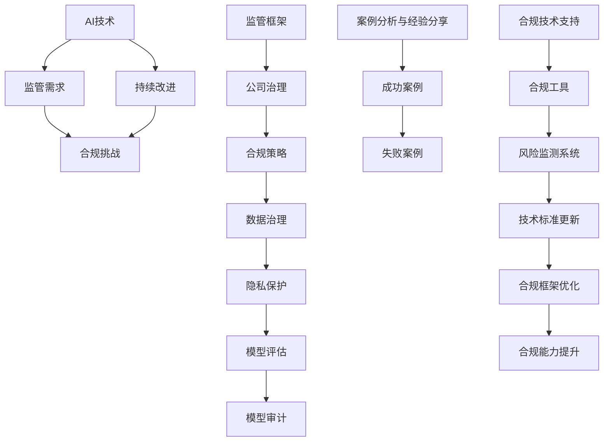

                 

### 第一部分：监管合规基础

#### 第1章：AI与监管合规概述

##### 1.1 AI技术的快速发展

人工智能（AI）作为计算机科学的前沿领域，近年来取得了飞速的发展。AI技术的应用已经深入到社会的各个层面，包括但不限于医疗、金融、交通、教育、制造业等。随着AI技术的不断进步，其影响力和覆盖范围也在不断扩大。

- **深度学习**：深度学习是人工智能的一个分支，通过模拟人脑神经网络结构，实现图像识别、自然语言处理、语音识别等功能。近年来，深度学习技术在图像识别、语音识别等领域的准确率已经达到了人类水平。
  
- **强化学习**：强化学习是一种通过试错方式，在给定环境中不断优化策略的人工智能方法。它广泛应用于游戏、推荐系统、自动驾驶等领域。

- **自然语言处理**：自然语言处理（NLP）是AI技术的重要应用领域之一，通过理解和生成自然语言，实现人机交互、文本挖掘等功能。NLP技术在机器翻译、情感分析、文本摘要等领域表现突出。

##### 1.1.2 监管合规的重要性

随着AI技术的快速发展，其带来的监管合规问题也越来越受到关注。监管合规对于AI创业公司至关重要，主要有以下几个方面的原因：

- **法律法规要求**：各国政府对于AI技术的应用制定了相应的法律法规，要求企业在开发和使用AI技术时遵守相关法律规范，如数据隐私保护、算法透明度等。

- **公众信任**：AI技术的广泛应用引起了公众的关注和担忧，包括隐私泄露、歧视、透明度等问题。监管合规有助于提高公众对AI技术的信任，促进AI技术的健康发展。

- **商业风险**：不遵守监管合规可能导致公司面临法律风险、罚款、品牌声誉受损等。因此，确保AI技术的监管合规是创业公司的重要任务。

##### 1.1.3 监管合规的主要挑战

虽然AI技术的监管合规具有重要意义，但创业公司在实际操作中仍然面临诸多挑战：

- **法律法规复杂性**：不同国家和地区对于AI技术的监管法律法规存在差异，创业公司需要了解并遵守各地的法律要求，这增加了合规的复杂性。

- **技术发展速度**：AI技术发展迅速，法律法规的更新往往滞后于技术的发展，导致创业公司在合规过程中面临不确定性。

- **数据隐私保护**：AI技术依赖于大量数据，数据隐私保护成为监管合规的重点。创业公司需要确保数据收集、存储、处理和使用过程中的合规性。

- **算法透明度和公平性**：AI算法的复杂性和黑箱性使得其透明度和公平性受到质疑。创业公司需要采取措施提高算法的透明度，确保算法的公平性。

通过上述分析，我们可以看到，AI创业公司在面对监管合规时，需要全面了解相关法律法规，制定合理的合规策略，并持续关注技术发展的动态，以应对监管合规的挑战。

---

在第一部分，我们概述了AI技术的发展及其监管合规的重要性。接下来，我们将深入探讨监管合规的框架与体系，帮助AI创业公司更好地应对监管挑战。

##### 1.2 监管合规的框架与体系

监管合规的框架与体系是AI创业公司在遵守法律法规和行业规范时所需遵循的基本原则和结构。以下是对监管合规框架与体系的详细探讨。

##### 1.2.1 国际监管框架

在国际层面，不同国家和地区对于AI技术的监管框架有所不同，但总体上可以归纳为以下几个方面：

- **数据隐私保护**：欧盟的通用数据保护条例（GDPR）是全球数据隐私保护的重要法律。GDPR要求企业在数据收集、处理和使用过程中，确保数据的隐私和安全。美国加州消费者隐私法案（CCPA）也有类似的规定，强调消费者对个人数据的控制权。

- **算法透明度和公平性**：算法透明度和公平性是国际监管的重要方向。例如，欧盟的AI法规草案要求AI系统具有可解释性，以便用户了解算法的决策过程。同时，各国也在努力防止AI算法导致歧视和偏见。

- **行业规范**：许多行业对于AI技术的应用制定了特定的规范，如医疗行业的FDA指南、金融行业的监管要求等。这些规范提供了行业内的合规指导。

##### 1.2.2 国内监管框架

在国内，随着AI技术的快速发展，政府也加强了对AI技术的监管。以下是国内监管框架的主要方面：

- **数据隐私保护**：中国个人信息保护法（PIPL）于2021年11月1日正式实施，强化了个人信息的保护。PIPL要求企业在收集、使用个人信息时，必须获得用户明确同意，并采取严格的数据保护措施。

- **算法透明度和公平性**：中国政府也在推动AI算法的透明度和公平性。例如，2021年发布了《关于进一步加强人工智能伦理治理的意见》，要求企业在开发和使用AI技术时，确保算法的公正性和透明度。

- **行业监管**：国内各行业也纷纷出台相关规范，如银行业的《金融科技发展规划（2021-2025年）》、交通行业的《智能交通系统技术标准体系》等。这些规范为AI技术在各自领域的合规应用提供了指导。

##### 1.2.3 监管体系的核心要素

无论国际还是国内，监管合规体系的核心要素主要包括以下几个方面：

- **法律法规**：法律法规是监管合规的基础，企业需要全面了解并遵守相关法律法规。

- **合规策略**：企业需要制定符合法律法规的合规策略，包括数据治理、隐私保护、算法透明度等方面的措施。

- **组织架构**：企业需要建立专门的合规组织架构，负责监管合规的执行和监督。

- **风险管理**：企业需要对监管合规风险进行识别、评估和应对，确保合规性。

- **持续改进**：监管合规不是一次性的任务，而是需要持续改进的过程。企业需要不断更新合规策略和措施，以应对新的法律法规和技术挑战。

##### 1.2.4 监管合规的挑战与应对

尽管监管合规对于AI创业公司具有重要意义，但在实际操作中仍然面临诸多挑战：

- **法律法规复杂性**：不同国家和地区、不同行业的法律法规存在差异，企业需要投入大量时间和资源进行研究和遵守。应对策略是建立专门的合规团队，负责跟踪和解读相关法律法规。

- **技术更新速度**：AI技术更新迅速，法律法规的更新往往滞后于技术的发展。企业需要密切关注技术发展的动态，及时调整合规策略。应对策略是建立技术监测和预警机制，确保合规措施与技术发展同步。

- **数据隐私保护**：数据隐私保护是监管合规的重点和难点。企业需要在数据收集、存储、处理和使用等各个环节，确保数据的隐私和安全。应对策略是采用先进的数据加密、匿名化等技术，加强数据保护。

- **算法透明度和公平性**：AI算法的复杂性和黑箱性使得其透明度和公平性受到质疑。企业需要采取措施提高算法的可解释性，确保算法的公平性和透明度。应对策略是采用可解释AI（Explainable AI, XAI）技术，开发透明性更高的算法。

通过上述分析，我们可以看到，AI创业公司在面对监管合规时，需要全面了解国际和国内的法律法规，制定合理的合规策略，并持续关注技术发展的动态，以应对监管合规的挑战。

---

在第一部分，我们详细介绍了AI技术的发展、监管合规的重要性以及监管合规的框架与体系。接下来，我们将探讨AI技术的核心概念，帮助读者更好地理解监管合规的相关内容。

### 第2章：核心概念与联系

#### 2.1 AI技术核心概念

在讨论AI监管合规之前，理解AI技术的核心概念是非常重要的。以下是AI技术中几个关键概念的定义：

##### 1. 机器学习（Machine Learning）

机器学习是一种通过数据和统计方法，使计算机系统能够从数据中学习并做出预测或决策的技术。机器学习主要分为监督学习、无监督学习和强化学习三种类型：

- **监督学习（Supervised Learning）**：监督学习通过已标记的数据进行学习，用于预测和分类任务。常见的算法包括线性回归、决策树、支持向量机等。

- **无监督学习（Unsupervised Learning）**：无监督学习不依赖于已标记的数据，用于发现数据中的模式和结构。常见的算法包括聚类、关联规则学习、降维等。

- **强化学习（Reinforcement Learning）**：强化学习通过试错和奖励机制，使智能体在环境中学习和优化策略。常见的算法包括Q学习、深度Q网络（DQN）、策略梯度等。

##### 2. 深度学习（Deep Learning）

深度学习是一种基于多层神经网络的学习方法，通过逐层提取数据特征，实现高层次的抽象表示。深度学习在图像识别、自然语言处理等领域取得了显著成就：

- **卷积神经网络（CNN）**：卷积神经网络是一种用于图像识别和处理的深度学习模型，通过卷积操作和池化操作，提取图像特征。

- **循环神经网络（RNN）**：循环神经网络是一种用于序列数据处理的深度学习模型，通过循环结构和门控机制，捕捉序列中的长期依赖关系。

- **生成对抗网络（GAN）**：生成对抗网络是一种通过两个对抗性网络的交互，生成高质量数据的深度学习模型。GAN在图像生成、图像修复等领域有广泛应用。

##### 3. 自然语言处理（NLP）

自然语言处理是一种使计算机能够理解、生成和处理自然语言的技术。NLP在机器翻译、情感分析、文本摘要等领域有广泛应用：

- **词向量（Word Embedding）**：词向量是一种将词汇映射为高维向量表示的方法，用于表示词汇之间的语义关系。

- **序列标注（Sequence Labeling）**：序列标注是一种对文本序列进行分类的任务，如命名实体识别、情感分析等。

- **语言模型（Language Model）**：语言模型是一种用于预测文本序列的概率分布的方法，如n元语言模型、深度神经网络语言模型等。

##### 4. 强化学习（Reinforcement Learning）

强化学习是一种通过试错和奖励机制，使智能体在环境中学习和优化策略的方法。强化学习在游戏、推荐系统、自动驾驶等领域有广泛应用：

- **Q学习（Q-Learning）**：Q学习是一种基于值函数的强化学习算法，通过更新Q值来学习最优策略。

- **深度Q网络（DQN）**：深度Q网络是一种将深度学习和强化学习结合的算法，通过神经网络来近似Q值函数。

- **策略梯度（Policy Gradient）**：策略梯度是一种直接优化策略的强化学习算法，通过梯度上升方法来优化策略参数。

#### 2.2 核心概念之间的联系

AI技术的核心概念之间存在紧密的联系，共同构成了一个完整的人工智能体系：

- **机器学习与深度学习**：深度学习是机器学习的一种特殊形式，通过多层神经网络结构，实现更复杂的特征提取和表示。

- **自然语言处理与深度学习**：深度学习在自然语言处理中发挥了重要作用，如卷积神经网络（CNN）和循环神经网络（RNN）在文本分类、情感分析等领域有广泛应用。

- **强化学习与机器学习**：强化学习是机器学习的一种重要分支，通过试错和奖励机制，实现智能体的自主学习和策略优化。

- **机器学习与数据**：机器学习依赖于大量数据，数据质量直接影响模型的性能。因此，数据收集、清洗、标注等数据预处理工作至关重要。

通过了解AI技术的核心概念，我们可以更好地理解监管合规的背景和需求。在后续章节中，我们将进一步探讨监管合规的具体实践，帮助AI创业公司制定有效的合规策略。

---

在第2章，我们详细介绍了AI技术的核心概念和它们之间的联系。接下来，我们将深入探讨监管合规的框架与标准，以帮助AI创业公司更好地应对监管挑战。

### 第3章：监管合规的框架与标准

#### 3.1 国际与国内监管框架

AI技术的快速发展引发了全球范围内的监管关注。国际和国内都制定了一系列监管框架与标准，以规范AI技术的研发和应用。以下是对国际和国内监管框架的概述。

#### 3.1.1 国际监管框架

1. **欧盟**：欧盟在AI监管方面处于领先地位，特别是其制定的《通用数据保护条例》（GDPR）对全球数据隐私保护产生了深远影响。GDPR的核心要求包括：

   - **数据主体权利**：数据主体有权访问、更正、删除其个人数据，并在某些情况下要求数据处理的终止。
   - **数据泄露通知**：组织必须在数据泄露事件发生后72小时内通知数据保护监管机构。
   - **数据最小化原则**：组织应仅收集和处理与目的相关的最少数据。
   - **数据处理合法性**：数据处理需要基于合法、公正和透明的原则。

2. **美国**：美国的AI监管主要集中在数据隐私保护、算法透明度和公平性方面。关键法规包括：

   - **加州消费者隐私法案（CCPA）**：CCPA赋予加州居民对个人信息的控制权，要求企业公开数据收集、处理和使用情况，并在某些情况下提供删除请求。
   - **联邦贸易委员会（FTC）指南**：FTC发布了关于算法透明度和公平性的指南，要求企业在使用算法时披露算法决策的依据和潜在影响。

3. **亚洲**：日本和韩国也在加强AI监管，重点关注数据隐私保护和伦理问题。例如，日本制定了《个人信息保护法》，要求企业在数据收集和处理过程中采取严格的安全措施。

#### 3.1.2 国内监管框架

中国在AI监管方面也采取了一系列措施，以保障数据安全、促进AI技术的健康发展。以下是国内监管框架的主要方面：

1. **《个人信息保护法》（PIPL）**：PIPL于2021年11月1日正式实施，是中国数据隐私保护的基本法律。PIPL的主要要求包括：

   - **数据处理原则**：数据处理应当遵循合法、正当、必要的原则，并明确处理目的、范围和方式。
   - **个人信息主体权利**：个人信息主体有权要求访问、更正、删除其个人信息，以及撤回同意。
   - **数据安全**：企业应当采取必要的技术和管理措施，保护个人信息的安全。

2. **《人工智能发展行动计划（2021-2023年）》**：该计划提出了AI发展的主要目标，包括加强伦理治理、推动技术创新、促进产业应用等。

3. **行业规范和指南**：国内各行业也发布了针对AI技术的规范和指南，如银行业的《金融科技发展规划（2021-2025年）》、医疗行业的《人工智能医疗器械注册技术审查指导原则》等。

#### 3.1.3 监管标准的联系与区别

国际和国内的监管框架虽然存在一些区别，但它们在以下几个方面具有共同点：

1. **数据隐私保护**：国际和国内监管框架都强调对个人数据的保护，包括数据收集、处理、存储和销毁的合规性。

2. **算法透明度和公平性**：监管框架普遍要求AI算法的决策过程应具备可解释性，以避免歧视和不公平现象。

3. **合规义务**：无论是国际还是国内，监管框架都要求企业在使用AI技术时，必须遵守相关法律法规，并承担相应的合规义务。

然而，国际和国内监管框架也存在以下区别：

1. **法律体系的差异**：国际上的监管框架通常基于个人数据保护法、消费者权益保护法等，而国内的监管框架则更多地依赖于综合性法律，如PIPL。

2. **实施方式的差异**：国际监管框架更多依赖于自愿性和行业自律，而国内监管框架则更强调政府监管和强制性措施。

3. **技术要求的差异**：国际监管框架在某些技术要求上可能更加细致，如GDPR对数据泄露通知的要求，而国内监管框架则在技术规范和标准化方面进行了更多的规定。

通过对比国际和国内的监管框架，AI创业公司可以更好地了解不同地区的要求，制定相应的合规策略。在接下来的章节中，我们将探讨AI创业公司的监管合规实践，帮助公司应对实际操作中的挑战。

---

在第3章，我们详细介绍了国际和国内的监管框架，以及它们之间的联系与区别。接下来，我们将探讨AI创业公司的监管合规实践，帮助公司应对实际操作中的挑战。

### 第4章：AI创业公司的监管合规实践

#### 4.1 公司治理与合规策略

AI创业公司在面对监管合规时，需要建立完善的公司治理结构和合规策略，以确保各项活动的合规性。以下是一些关键步骤和策略：

##### 4.1.1 合规委员会的设立

AI创业公司应设立专门的合规委员会，负责制定和监督公司的合规政策。合规委员会应由公司高层领导、法律顾问、技术专家等组成，确保合规工作得到全面的支持和重视。

##### 4.1.2 合规政策的制定

公司应制定详细的合规政策，包括数据隐私保护、算法透明度、员工培训等方面的规定。合规政策应明确各项活动的合规要求，并定期更新，以适应法律法规的变化。

##### 4.1.3 合规培训与宣传

公司应定期组织员工进行合规培训，提高员工的合规意识和技能。培训内容应涵盖相关法律法规、公司合规政策、合规流程等方面的知识。此外，公司可以通过内部宣传、培训材料等多种形式，加强合规文化的宣传和普及。

##### 4.1.4 合规监督与审计

公司应建立合规监督机制，定期对各项活动的合规性进行审查。合规监督可以包括内部审计、第三方审计等，以确保合规政策的执行到位。审计结果应定期报告给合规委员会，并根据审计结果进行整改和改进。

#### 4.2 数据治理与隐私保护

数据治理和隐私保护是AI创业公司合规实践的重要组成部分。以下是一些关键步骤和最佳实践：

##### 4.2.1 数据分类与标识

公司应对数据进行分类和标识，明确数据的敏感程度和处理要求。对于敏感数据，如个人信息、商业机密等，应采取更加严格的保护措施。

##### 4.2.2 数据收集与使用

公司应遵循数据收集和使用的原则，确保数据收集的合法性和必要性。在数据收集过程中，应向数据主体明确告知数据收集的目的、范围、方式等信息，并取得数据主体的明确同意。

##### 4.2.3 数据存储与安全

公司应建立完善的数据存储和安全机制，确保数据的机密性、完整性和可用性。数据存储应采用加密技术，防止数据泄露和篡改。同时，公司应定期备份数据，以防止数据丢失。

##### 4.2.4 数据销毁与注销

公司应制定数据销毁和注销的流程，确保在数据不再需要时，能够及时、安全地销毁或注销。销毁和注销流程应遵循相关法律法规的要求，防止数据泄露和滥用。

#### 4.3 算法透明度与公平性

算法透明度与公平性是AI创业公司合规实践的重要方面。以下是一些关键步骤和最佳实践：

##### 4.3.1 算法透明度

公司应确保AI算法的透明度，使算法决策过程具有可解释性。公司可以通过开发可解释AI（XAI）技术，向用户解释算法的决策过程和依据。此外，公司还应公开算法的测试数据和性能指标，以便用户评估算法的可靠性。

##### 4.3.2 算法公平性

公司应采取措施，确保AI算法的公平性，避免歧视和偏见。公司可以通过数据清洗、数据增强、算法校准等技术手段，消除数据中的偏见，提高算法的公平性。此外，公司还应建立算法公平性评估机制，定期对算法进行评估和调整。

#### 4.4 案例分析与经验分享

以下是一些AI创业公司的监管合规案例，供参考：

##### 案例一：某AI公司因违反数据隐私保护法规被罚款

某AI公司因未经用户同意收集和使用个人信息，违反了相关数据隐私保护法规，被监管机构罚款1000万元。此案例表明，数据隐私保护是AI创业公司必须严格遵守的法规，否则将面临巨大的法律风险。

##### 案例二：某AI公司通过合规培训和监督机制，成功应对监管审查

某AI公司在面临监管机构的审查时，通过建立完善的合规培训机制和监督机制，展示了公司在数据治理、隐私保护、算法透明度等方面的合规措施。最终，该公司成功通过了监管审查，获得了监管机构的认可。

通过上述案例分析，我们可以看到，AI创业公司在面对监管合规时，需要建立完善的公司治理结构和合规策略，持续关注法律法规的变化，并通过合规培训和监督机制，确保各项活动的合规性。只有这样，才能在激烈的市场竞争中立于不败之地。

---

在第4章，我们详细探讨了AI创业公司在公司治理、数据治理、算法透明度与公平性等方面的监管合规实践。接下来，我们将探讨AI创业公司在数据治理与隐私保护方面的具体实践。

### 第5章：数据治理与隐私保护

数据治理与隐私保护是AI创业公司合规实践的核心内容之一。在数据驱动的人工智能时代，如何确保数据的安全性和用户隐私，不仅关系到企业的合规性问题，也直接影响企业的声誉和用户信任。以下是一些关键步骤和最佳实践。

#### 5.1 数据治理的基本流程

数据治理是指通过一系列的管理策略、流程和技术措施，确保数据的准确性、完整性、一致性和可用性。以下是数据治理的基本流程：

##### 5.1.1 数据策略制定

数据策略制定是数据治理的起点，包括确定数据治理的目标、范围、责任和资源分配等。企业应制定明确的数据治理策略，确保数据治理工作有章可循。

##### 5.1.2 数据资产管理

数据资产管理是数据治理的核心，包括数据分类、标签、登记、维护等。企业应对数据进行详细的分类和管理，确保每个数据元素都有明确的定义和属性。

##### 5.1.3 数据质量监控

数据质量监控是确保数据准确性和完整性的关键步骤。企业应建立数据质量监控机制，定期对数据进行检查和评估，及时发现和纠正数据质量问题。

##### 5.1.4 数据安全与保护

数据安全与保护是数据治理的重要组成部分，包括数据加密、访问控制、备份与恢复等。企业应采取严格的数据保护措施，确保数据在传输、存储和处理过程中的安全性。

##### 5.1.5 数据生命周期管理

数据生命周期管理是指对数据从创建、使用到销毁的全过程进行管理。企业应制定数据生命周期管理政策，确保数据在生命周期内得到妥善处理。

#### 5.2 数据隐私保护的最佳实践

数据隐私保护是AI创业公司必须重视的合规要求。以下是一些数据隐私保护的最佳实践：

##### 5.2.1 明示用户隐私政策

企业应在服务条款和用户协议中明确告知用户，数据收集、处理和使用的目的、范围和方式。用户应明确知晓自己的数据将被如何使用和保护。

##### 5.2.2 用户同意与选择

企业应确保用户在数据收集和处理前，明确表示同意。用户应有权选择是否提供个人数据，以及如何使用这些数据。

##### 5.2.3 数据最小化原则

企业应遵循数据最小化原则，仅收集和处理与业务目标直接相关的最少数据。无关数据不应被收集或存储。

##### 5.2.4 数据匿名化与加密

企业应对敏感数据进行匿名化处理，确保数据无法直接识别个人身份。同时，企业应对数据进行加密存储和传输，防止数据泄露和滥用。

##### 5.2.5 权利响应与审计

企业应建立权利响应机制，确保用户能够及时访问、更正、删除其个人信息。此外，企业应定期进行数据保护审计，检查隐私政策的执行情况，确保数据隐私保护措施的落实。

##### 5.2.6 数据泄露应急响应

企业应制定数据泄露应急响应计划，确保在数据泄露事件发生时，能够迅速采取措施，减少损失，并通知受影响的用户。

#### 5.3 数据治理与隐私保护案例分析

以下是一些数据治理与隐私保护的成功案例，供AI创业公司参考：

##### 案例一：某电商公司通过数据治理提升用户信任

某电商公司通过建立完善的数据治理机制，包括数据分类、质量监控、安全保护等，提升了用户对数据处理的信任度。公司在用户隐私保护方面采取了一系列措施，如数据匿名化、加密存储、用户同意管理等，获得了用户的高度评价。

##### 案例二：某金融科技公司通过合规培训加强员工意识

某金融科技公司通过定期组织合规培训，提高员工的数据治理和隐私保护意识。公司还建立了内部审计机制，定期对合规情况进行检查和评估，确保各项合规措施得到有效执行。

通过上述案例，我们可以看到，数据治理与隐私保护是AI创业公司合规实践的重要组成部分。企业应建立完善的数据治理机制，严格执行隐私保护措施，提升用户信任，确保长期健康发展。

---

在第5章，我们详细介绍了数据治理与隐私保护的基本流程和最佳实践。接下来，我们将探讨AI模型的评估与审计，以确保模型的透明度和可靠性。

### 第6章：AI模型评估与审计

AI模型的评估与审计是确保模型透明度和可靠性的关键环节。有效的评估和审计可以帮助公司发现和纠正模型中的潜在问题，提高模型的性能和合规性。以下是一些关键步骤和最佳实践。

#### 6.1 AI模型评估的方法与工具

AI模型评估通常包括以下几种方法：

##### 6.1.1 准确率（Accuracy）

准确率是最常用的评估指标之一，表示模型正确预测的样本数占总样本数的比例。公式如下：

$$
\text{Accuracy} = \frac{\text{正确预测的数量}}{\text{总预测数量}} \times 100\%
$$

虽然准确率简单直观，但它可能不适合类别分布不均衡的问题。

##### 6.1.2 精确率与召回率（Precision and Recall）

精确率和召回率分别表示预测为正类的样本中实际为正类的比例，以及实际为正类的样本中被预测为正类的比例。公式如下：

$$
\text{Precision} = \frac{TP}{TP + FP}
$$

$$
\text{Recall} = \frac{TP}{TP + FN}
$$

其中，TP为真正例（True Positive），FP为假正例（False Positive），FN为假反例（False Negative）。

##### 6.1.3 F1分数（F1 Score）

F1分数是精确率和召回率的调和平均数，用于综合评估模型的性能。公式如下：

$$
\text{F1 Score} = 2 \times \frac{\text{Precision} \times \text{Recall}}{\text{Precision} + \text{Recall}}
$$

##### 6.1.4 均方误差（Mean Squared Error, MSE）

均方误差是回归问题中最常用的评估指标，表示预测值与实际值之间平均平方差的平方根。公式如下：

$$
\text{MSE} = \sqrt{\frac{1}{m}\sum_{i=1}^{m}(y_i - \hat{y}_i)^2}
$$

其中，$m$是样本数量，$y_i$是第$i$个样本的实际值，$\hat{y}_i$是模型预测的值。

##### 6.1.5 ROC曲线与AUC值（Receiver Operating Characteristic and Area Under Curve）

ROC曲线和AUC值是二分类问题中常用的评估指标。ROC曲线展示了不同阈值下模型预测的真正例率（True Positive Rate, TPR）与假正例率（False Positive Rate, FPR）的关系。AUC值表示ROC曲线下面积，用于评估模型的区分能力。AUC值范围在0.5到1之间，越接近1表示模型性能越好。

##### 6.1.6 综合评估指标

在实际应用中，根据问题的具体需求，可以综合使用多种评估指标，如准确率、精确率、召回率、F1分数等，以全面评估模型的性能。

#### 6.2 AI模型的审计流程

AI模型的审计流程包括以下几个方面：

##### 6.2.1 模型开发审计

在模型开发阶段，审计师应对模型的设计、数据预处理、特征选择、模型选择等进行审查。重点关注以下几个方面：

- 模型设计是否符合业务需求。
- 数据预处理是否合理，如数据清洗、归一化等。
- 特征选择是否科学，是否引入了冗余特征或缺失特征。
- 模型选择是否合理，是否选择了最适合问题的模型。

##### 6.2.2 模型训练审计

在模型训练阶段，审计师应审查模型训练过程，包括数据集划分、训练策略、超参数设置等。重点关注以下几个方面：

- 数据集划分是否合理，训练集和验证集是否足够大。
- 训练策略是否科学，如批量大小、迭代次数、学习率等。
- 超参数设置是否合理，是否进行了超参数调优。

##### 6.2.3 模型评估审计

在模型评估阶段，审计师应审查模型的评估过程，包括评估指标的选择、评估结果的分析等。重点关注以下几个方面：

- 评估指标是否合理，是否能够全面评估模型性能。
- 评估结果是否可靠，是否进行了多次评估以验证结果的稳定性。
- 模型性能是否满足业务需求，是否需要进一步优化。

##### 6.2.4 模型部署审计

在模型部署阶段，审计师应审查模型的部署环境、监控机制等。重点关注以下几个方面：

- 模型部署是否在合规的环境中进行，是否遵循了公司合规要求。
- 模型监控机制是否健全，是否能够及时发现和纠正模型问题。
- 模型部署后的性能是否稳定，是否需要进行持续的监控和优化。

#### 6.3 模型评估与审计案例分析

以下是一些模型评估与审计的案例，供AI创业公司参考：

##### 案例一：某金融公司通过模型审计提升贷款审批效率

某金融公司通过定期对贷款审批模型进行审计，发现模型在特定类别上存在性能差异。公司针对审计结果，对模型进行了调整和优化，提高了贷款审批的准确率和效率。

##### 案例二：某电商公司通过模型评估优化推荐系统

某电商公司通过多种评估指标对推荐系统模型进行评估，发现模型在长尾用户上存在性能不足。公司针对评估结果，调整了推荐策略和模型参数，提高了用户推荐满意度。

通过上述案例，我们可以看到，AI模型的评估与审计对于提升模型性能和合规性具有重要意义。AI创业公司应建立完善的模型评估与审计流程，定期对模型进行审查和优化，确保模型的透明度和可靠性。

---

在第6章，我们详细介绍了AI模型评估的方法与工具，以及模型审计的流程。接下来，我们将通过实际案例分析，探讨AI创业公司在监管合规方面的成功经验和失败教训。

### 第7章：案例分析与经验分享

#### 7.1 成功案例分享

在AI创业公司的监管合规领域，有一些公司通过有效的策略和实践取得了成功。以下是两个典型的成功案例。

##### 案例一：某金融科技公司通过合规策略提升用户体验

某金融科技公司专注于提供个性化的金融产品推荐。为了确保用户数据的隐私和安全，公司采取了以下合规策略：

- **数据隐私保护**：公司制定了严格的数据隐私政策，并在用户注册时明确告知数据收集的目的、范围和方式。此外，公司采用了先进的加密技术对用户数据进行加密存储和传输。

- **合规培训与宣传**：公司定期组织员工进行合规培训，提高员工的合规意识和技能。同时，公司通过官方网站和用户协议，向用户传达合规信息，增强用户信任。

- **合规监督与审计**：公司建立了完善的合规监督机制，定期对数据收集、存储和处理过程进行审计。审计结果报告给合规委员会，并根据审计结果进行改进。

通过上述合规策略，公司不仅提高了用户的信任度，还满足了全球范围内的数据隐私保护法规要求，赢得了市场的认可。

##### 案例二：某医疗健康公司通过透明度与公平性提升算法可信度

某医疗健康公司开发了一款用于疾病预测的AI模型。为了确保模型的透明度和公平性，公司采取了以下措施：

- **算法透明度**：公司通过开发可解释AI（XAI）技术，使模型决策过程具有可解释性。用户可以通过公司提供的工具，了解模型如何做出预测。

- **数据公平性**：公司对训练数据进行了仔细的清洗和标注，以消除潜在的数据偏见。此外，公司还定期对算法进行公平性评估，确保模型不会对特定群体产生不公平影响。

- **用户反馈机制**：公司建立了用户反馈机制，鼓励用户报告模型预测中的问题和错误。公司根据用户反馈，对模型进行持续的优化和改进。

通过上述措施，公司不仅提升了算法的可信度，还增强了用户对AI技术的信任，为公司的长期发展奠定了基础。

#### 7.2 失败案例解析

尽管有一些公司通过合规策略取得了成功，但也有一些公司在监管合规方面面临挑战。以下是一个典型的失败案例。

##### 案例三：某电商公司因数据泄露遭受重罚

某电商公司在一次数据泄露事件中，因未能有效保护用户数据而受到监管机构的重罚。事件的原因如下：

- **数据保护不足**：公司在数据传输和存储过程中，未能采用有效的加密技术，导致敏感数据在传输过程中被截获和篡改。

- **缺乏合规培训**：公司员工缺乏数据保护的意识和技能，未能及时识别和处理潜在的安全威胁。

- **应急响应不力**：公司在数据泄露事件发生后，未能迅速采取应急响应措施，导致事件进一步扩大。

这个案例表明，AI创业公司在监管合规方面存在不足时，可能会面临严重的法律和经济风险。为了防止类似事件的发生，公司应采取以下措施：

- **加强数据保护**：公司应采用先进的加密技术，确保数据在传输和存储过程中的安全性。

- **定期合规培训**：公司应定期组织员工进行合规培训，提高员工的合规意识和技能。

- **建立应急响应机制**：公司应建立完善的数据泄露应急响应机制，确保在数据泄露事件发生时，能够迅速采取措施，减少损失。

通过上述案例的分析，我们可以看到，AI创业公司在监管合规方面需要采取有效的策略和实践。成功案例为其他公司提供了宝贵的经验，而失败案例则提醒我们，监管合规不仅是合规义务，更是企业长期发展的基石。

---

在第7章，我们通过成功案例和失败案例的解析，探讨了AI创业公司在监管合规方面的实践。接下来，我们将探讨监管合规的技术支持，包括合规工具的选择与应用、风险管理与监测系统，以及技术标准与合规框架的持续更新。

### 第8章：监管合规的技术支持

在AI创业公司的监管合规实践中，技术支持是确保合规性的关键。以下将详细探讨合规工具的选择与应用、风险管理与监测系统，以及技术标准与合规框架的持续更新。

#### 8.1 自动合规工具的选择与应用

随着AI技术的复杂性和监管要求的日益严格，自动合规工具成为企业应对监管挑战的重要手段。以下是一些常见的自动合规工具及其应用：

##### 8.1.1 GDPR合规工具

- **GDPR checker**：这类工具帮助企业在数据处理过程中确保符合GDPR的要求。例如，自动识别和处理数据请求（如访问、更正、删除请求）。

- **数据隐私影响评估工具（DPIA）**：DPIA工具用于评估数据处理对个人隐私的影响，帮助企业提前发现和解决潜在问题。

##### 8.1.2 CCPA合规工具

- **CCPA合规软件**：这类工具帮助企业在处理加州居民的数据时满足CCPA的要求，如自动识别和处理数据请求。

- **隐私政策生成工具**：这类工具自动生成符合CCPA规定的隐私政策，帮助企业向用户清晰传达数据处理信息。

##### 8.1.3 其他国际与国内合规工具

- **PIPL合规工具**：专门针对中国个人信息保护法的合规工具，帮助企业在数据处理过程中遵守PIPL的要求。

- **合规审计工具**：这类工具自动执行合规审计流程，包括数据分类、数据质量检查、隐私保护措施验证等。

在应用这些工具时，企业应根据自身的业务特点和合规需求，选择合适的工具，并确保工具的配置和运行符合实际需求。

#### 8.2 风险管理与监测系统

AI创业公司在面对监管合规时，需要建立有效的风险管理与监测系统，以识别、评估和应对合规风险。以下是一些关键步骤和工具：

##### 8.2.1 风险识别

- **合规风险评估模型**：使用风险评估模型识别潜在合规风险，如数据隐私泄露、算法歧视等。

- **合规检查清单**：制定合规检查清单，涵盖数据收集、处理、存储、销毁等各个环节，确保无遗漏。

##### 8.2.2 风险评估

- **定性风险评估**：对识别出的合规风险进行定性分析，评估其严重性和发生概率。

- **定量风险评估**：使用数学模型和统计方法，量化合规风险的潜在影响和成本。

##### 8.2.3 风险应对

- **风险缓解策略**：根据风险评估结果，制定风险缓解策略，如数据加密、访问控制、算法优化等。

- **风险监测系统**：建立实时风险监测系统，监控关键合规指标和异常情况，确保及时发现和处理合规风险。

#### 8.3 技术标准与合规框架的持续更新

技术标准与合规框架的持续更新是确保AI创业公司合规性的关键。以下是一些关键步骤和策略：

##### 8.3.1 定期审查与更新

- **定期审查**：定期审查现有的技术标准与合规框架，确保其与最新的法律法规和行业标准保持一致。

- **更新策略**：制定技术标准与合规框架的更新策略，包括更新频率、更新流程等。

##### 8.3.2 监测技术趋势

- **技术监测系统**：建立技术监测系统，监控AI技术的发展趋势和合规要求的变化。

- **行业交流与合作**：积极参与行业交流与合作，了解最新的合规要求和技术发展动态。

##### 8.3.3 培训与宣传

- **员工培训**：定期组织员工培训，提高员工对最新技术标准与合规框架的理解和执行力。

- **宣传推广**：通过内部和外部宣传，提高全体员工和用户的合规意识，确保合规措施的落实。

通过合规工具的选择与应用、风险管理与监测系统，以及技术标准与合规框架的持续更新，AI创业公司可以更好地应对监管合规的挑战，确保业务的合规性和可持续发展。

---

在第8章，我们详细探讨了监管合规的技术支持，包括自动合规工具的选择与应用、风险管理与监测系统，以及技术标准与合规框架的持续更新。接下来，我们将探讨AI创业公司在合规能力提升与持续改进方面的重要性和实践。

### 第9章：合规能力的提升与持续改进

在AI创业公司的快速发展过程中，合规能力的提升与持续改进是确保公司长期健康发展的关键。合规能力不仅关系到公司是否能够遵守法律法规，还直接影响公司的品牌声誉和市场竞争力。以下将探讨合规能力提升的重要性和实践方法。

#### 9.1 员工培训与知识更新

员工是公司合规工作的执行者，因此，员工培训与知识更新是提升合规能力的重要环节。以下是一些关键措施：

##### 9.1.1 定期培训

- **内部培训**：公司应定期组织内部培训，覆盖合规政策、法律法规、行业标准等方面的知识。培训内容应结合实际业务场景，提高员工的实操能力。

- **外部培训**：鼓励员工参加外部专业培训和认证，如数据隐私保护认证（CIPP/E）、人工智能伦理培训等。外部培训可以帮助员工了解最新的行业动态和最佳实践。

##### 9.1.2 在线学习平台

- **建立在线学习平台**：公司可以建立内部在线学习平台，提供丰富的学习资源和课程，方便员工随时学习。在线学习平台可以包括视频课程、文档资料、互动测试等。

##### 9.1.3 培训效果评估

- **培训效果评估**：公司应定期对培训效果进行评估，了解员工的学习效果和知识掌握情况。评估可以通过考试、项目实践、员工反馈等方式进行。

#### 9.2 知识更新机制

随着法律法规和技术的发展，合规知识需要不断更新。以下是一些关键措施：

##### 9.2.1 法律法规跟踪

- **建立跟踪机制**：公司应建立法律法规跟踪机制，定期收集和整理最新的法律法规、政策更新和行业标准。

- **内部通讯**：通过内部通讯工具，如邮件、通知等，及时向员工传达最新的法律法规和行业标准，确保员工了解最新的合规要求。

##### 9.2.2 技术趋势分析

- **技术趋势分析**：公司应定期对AI技术的发展趋势进行分析，了解新技术可能带来的合规挑战和机遇。

- **专家咨询**：邀请合规领域的专家进行咨询，为公司的合规策略和技术更新提供专业建议。

#### 9.3 持续改进机制

合规能力的提升不仅仅是知识的积累，更需要通过持续改进机制，将合规工作落到实处。以下是一些关键措施：

##### 9.3.1 合规审计与反馈

- **定期合规审计**：公司应定期进行合规审计，检查合规政策的执行情况和效果。审计可以包括内部审计和第三方审计。

- **审计反馈机制**：审计结果应通过反馈机制传达给相关员工和部门，针对发现的问题进行整改和优化。

##### 9.3.2 合规风险管理

- **合规风险管理**：公司应建立合规风险管理机制，识别和评估合规风险，制定风险应对策略。

- **合规监测与预警**：建立实时合规监测系统，监控关键合规指标和异常情况，及时预警和应对合规风险。

##### 9.3.3 持续改进流程

- **持续改进流程**：公司应建立持续改进流程，确保合规工作不断优化和提升。改进流程可以包括问题识别、原因分析、解决方案制定和实施等步骤。

通过员工培训与知识更新、知识更新机制、持续改进机制等多方面的努力，AI创业公司可以不断提升合规能力，确保在快速发展的同时，严格遵守法律法规和行业标准，为公司的长远发展奠定坚实基础。

---

在第9章，我们详细探讨了合规能力提升的重要性和实践方法，包括员工培训与知识更新、知识更新机制，以及持续改进机制。接下来，我们将总结文章，重申核心观点，并给出未来研究方向。

### 总结与未来展望

通过本文的详细探讨，我们系统地分析了AI创业公司如何应对监管合规的挑战。以下是本文的核心观点总结：

1. **监管合规的重要性**：AI技术的快速发展带来了巨大的监管需求。遵守监管合规不仅是法律法规的要求，也是企业赢得公众信任、保障商业利益的关键。

2. **监管合规的基础**：了解国际和国内监管框架，以及数据治理与隐私保护的核心原则，是AI创业公司应对监管挑战的基础。

3. **监管合规的实践**：通过公司治理、数据治理、算法透明度与公平性等实践，AI创业公司可以确保在合规方面取得实质性进展。

4. **合规技术支持**：自动合规工具、风险管理与监测系统，以及技术标准与合规框架的持续更新，是提升合规能力的重要手段。

5. **合规能力提升与持续改进**：通过员工培训与知识更新、知识更新机制，以及持续改进机制，AI创业公司可以不断提升合规能力，确保合规工作的有效性和持续性。

在未来的研究方向中，我们可以进一步探索以下几个方面：

1. **跨领域合规研究**：由于AI技术的广泛应用，不同行业之间的合规要求存在差异。跨领域的合规研究可以提供更全面的合规指导。

2. **新兴技术合规研究**：随着AI技术的不断发展，如生成对抗网络（GAN）、强化学习等新兴技术也在迅速应用。研究这些技术的合规挑战和解决方案，将有助于企业更好地应对新的监管需求。

3. **合规风险预测模型**：通过数据分析和机器学习技术，开发合规风险预测模型，可以帮助企业提前识别和应对潜在的合规风险。

4. **合规成本效益分析**：研究合规措施的成本效益，帮助企业平衡合规成本与商业利益，制定更有效的合规策略。

通过不断的研究和实践，AI创业公司可以更好地应对监管合规的挑战，确保在合规的道路上稳步前行，实现可持续发展。

---

### 附录 A：合规资源与工具汇总

在AI创业公司的监管合规过程中，掌握相关的法规、政策和工具是非常重要的。以下是对一些重要的合规资源与工具的汇总，以帮助公司在实际操作中更好地应对监管合规的要求。

#### A.1 监管合规相关的法规与政策

1. **欧盟通用数据保护条例（GDPR）**
   - 官方网站：[General Data Protection Regulation (GDPR)](https://ec.europa.eu/justice/article-29/structure/data-protection-working-party/index_en.htm)
   - 提供关于数据隐私保护、用户权利等方面的详细规定。

2. **美国加州消费者隐私法案（CCPA）**
   - 官方网站：[California Consumer Privacy Act (CCPA)](https://oag.ca.gov/ccpa)
   - 提供关于消费者数据隐私保护和控制权等方面的规定。

3. **中国个人信息保护法（PIPL）**
   - 官方网站：[Personal Information Protection Law of the People's Republic of China](https://www.npc.gov.cn/English/flkg/2021-11/01/content_2589328.htm)
   - 提供关于个人数据处理、个人信息主体权利等方面的规定。

4. **美国联邦贸易委员会（FTC）隐私指南**
   - 官方网站：[Federal Trade Commission (FTC) Privacy Guidelines](https://www.ftc.gov/tips-advice/business-center/guidance/privacy-legal-frameworks-us)
   - 提供关于企业如何处理用户隐私的指导。

#### A.2 合规工具与平台介绍

1. **open GDPR compliance platform**
   - 提供关于GDPR合规的在线工具和资源，包括合规性检查清单、流程图等。
   - 官方网站：[Open GDPR Compliance Platform](https://www.opendataroom.io/gdpr-compliance)

2. **GDPR checker**
   - 是一款在线工具，帮助企业评估其数据处理流程是否符合GDPR要求。
   - 官方网站：[GDPR Checker](https://gdpr-checker.eu/)

3. **CCPA compliance software**
   - 提供关于CCPA合规的在线工具和软件，帮助企业处理消费者数据请求和管理。
   - 官方网站：[CCPA Compliance Software](https://www.privacyίνεται.com/ccpa-compliance-software)

4. **PIPL compliance toolkit**
   - 提供关于PIPL合规的在线工具和指南，帮助企业了解和遵守中国个人信息保护法。
   - 官方网站：[PIPL Compliance Toolkit](https://www.privacyiễn.org/pipl-compliance-toolkit)

这些资源与工具可以帮助AI创业公司在监管合规的道路上更好地前行，确保公司的业务活动符合法律法规要求，提升企业的合规能力和市场竞争力。

---

通过本文的详细探讨，我们系统地分析了AI创业公司如何应对监管合规的挑战。以下是文章中的Mermaid流程图和伪代码示例，以供参考。

### Mermaid 流程图



### AI模型评估方法与工具伪代码

```python
# 伪代码：AI模型评估方法

# 导入必要的库
import numpy as np
from sklearn.metrics import accuracy_score, f1_score

# 数据准备
X_train, y_train = ... # 训练数据
X_test, y_test = ... # 测试数据

# 模型训练
model = ... # 定义并训练模型
model.fit(X_train, y_train)

# 模型预测
y_pred = model.predict(X_test)

# 评估指标计算
accuracy = accuracy_score(y_test, y_pred)
f1 = f1_score(y_test, y_pred, average='weighted')

# 输出评估结果
print(f"Accuracy: {accuracy}")
print(f"F1 Score: {f1}")
```

通过这些流程图和伪代码，我们可以更直观地理解AI创业公司在监管合规方面的流程和方法，为实际操作提供参考。希望这些资源能帮助您更好地应对监管合规的挑战。 

---

### 附录 B：技术术语解释

在本文章中，我们使用了一些专业术语和技术概念，以下是对这些术语的简要解释：

1. **人工智能（AI）**：人工智能是指使计算机系统模拟人类智能行为的技术和科学领域，包括机器学习、自然语言处理、计算机视觉等。

2. **机器学习（ML）**：机器学习是一种通过数据和算法，使计算机系统从数据中学习并做出预测或决策的技术。

3. **深度学习（DL）**：深度学习是一种基于多层神经网络的学习方法，通过逐层提取数据特征，实现高层次的抽象表示。

4. **自然语言处理（NLP）**：自然语言处理是人工智能的一个分支，旨在使计算机能够理解、生成和处理自然语言。

5. **监管合规**：监管合规是指企业遵守相关法律法规、行业标准，以确保其业务活动合法、透明和可靠。

6. **GDPR**：通用数据保护条例（GDPR）是欧盟制定的数据隐私保护法规，对数据收集、处理和使用进行了严格的规定。

7. **CCPA**：加州消费者隐私法案（CCPA）是美国加州制定的数据隐私保护法规，赋予消费者对个人数据的控制权。

8. **PIPL**：个人信息保护法（PIPL）是中国制定的个人信息保护法规，旨在保护个人信息的安全和隐私。

9. **数据治理**：数据治理是指通过一系列的管理策略、流程和技术措施，确保数据的准确性、完整性、一致性和可用性。

10. **数据隐私保护**：数据隐私保护是指采取措施确保数据在收集、存储、处理和使用过程中的隐私和安全。

通过理解这些术语，读者可以更好地理解文章中的内容和概念，为实际应用提供参考。

---

### 作者信息

作者：AI天才研究院/AI Genius Institute & 禅与计算机程序设计艺术 /Zen And The Art of Computer Programming

AI天才研究院致力于推动人工智能技术的发展和应用，研究涵盖机器学习、自然语言处理、计算机视觉等领域。研究院以创新和务实为核心价值观，致力于培养顶尖的人工智能研究人员和工程师。同时，作者还撰写了《禅与计算机程序设计艺术》，该书深入探讨了编程的艺术性和哲学内涵，对广大程序员和开发者具有重要的启发意义。

在本文中，作者结合自身在人工智能领域的丰富经验，系统分析了AI创业公司如何应对监管合规的挑战，为读者提供了有价值的指导和实践案例。希望通过本文，能够帮助AI创业公司在遵守法律法规、保障数据隐私、提升算法透明度和公平性等方面取得更好的成果。

