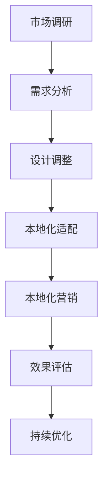

                 

### 《AI创业公司的产品本地化策略：市场调研、本地化适配与本地化营销》

> **关键词：** AI、产品本地化、市场调研、本地化适配、本地化营销

> **摘要：** 本文旨在探讨AI创业公司在全球市场中实施产品本地化策略的必要性。文章分为三部分，首先概述了AI与本地化策略的相关理论，随后详细分析了市场调研与本地化适配策略，最后探讨了本地化营销的方法与技巧。通过结合理论讲解、实践案例和代码解析，本文为创业公司提供了一套全面的产品本地化策略框架，助力其在国际市场中的成功。

---

### 第一部分：概述与理论基础

#### 第1章：AI与创业公司的产品本地化策略概述

##### 1.1 AI与本地化策略的概念解析

**AI的定义与应用领域**

人工智能（Artificial Intelligence，简称AI）是指模拟、扩展和扩展人类智能的理论、方法、技术和应用系统的总称。AI在众多领域有着广泛的应用，如自然语言处理、计算机视觉、机器学习、自动驾驶、智能客服等。随着技术的进步，AI正在逐步改变我们的生活方式和工作方式。

**本地化策略的定义与重要性**

本地化策略是指在全球化市场中，针对不同区域市场的用户需求、文化习惯、法律规范等进行产品调整和优化的一系列策略。本地化策略的重要性在于：

1. **满足不同市场用户需求**：通过本地化，企业能够更好地理解和满足不同市场的用户需求，提升产品竞争力。
2. **提高用户体验**：本地化后的产品能够更好地适应目标市场的文化环境和用户习惯，从而提高用户体验和满意度。
3. **降低市场进入成本**：本地化策略有助于降低企业在进入新市场的成本，提高市场进入的效率。

##### 1.2 创业公司产品本地化的挑战与机遇

**挑战分析**

1. **文化差异**：不同国家和地区在语言、习俗、价值观等方面存在差异，这些差异可能影响产品的接受度和市场表现。
2. **市场环境**：每个市场都有其独特的市场环境，包括法律法规、经济状况、竞争态势等，这些因素需要企业在本地化过程中充分考虑。
3. **用户习惯**：不同市场的用户在消费习惯、使用习惯等方面可能存在显著差异，本地化策略需要针对这些差异进行定制。

**机遇探讨**

1. **全球化市场**：随着全球化的加深，越来越多的市场机会出现在创业公司面前，本地化策略有助于企业抓住这些机会。
2. **技术创新**：AI技术的快速发展为产品本地化提供了新的工具和方法，如自然语言处理、机器学习等，这些技术可以大大提高本地化的效率和准确性。
3. **成本效益**：通过有效的本地化策略，企业可以在进入新市场时降低成本，提高投资回报率。

##### 1.3 本地化策略的核心概念与理论框架

**本地化策略的目标与原则**

1. **目标**：本地化策略的目标包括提高产品竞争力、提升用户体验、扩大市场份额等。
2. **原则**：本地化策略应遵循以下原则：
   - **用户中心**：始终以用户需求为核心，确保产品满足目标市场的需求。
   - **文化适应**：尊重并适应目标市场的文化习惯和价值观。
   - **成本效益**：在保证质量的前提下，优化本地化成本，提高投资回报率。
   - **可持续性**：本地化策略应具备可持续性，以适应市场变化和长期发展。

**本地化策略的关键要素**

1. **市场调研**：了解目标市场的用户需求、竞争态势、市场环境等，为本地化策略提供数据支持。
2. **产品适配**：根据市场调研结果，调整产品功能、界面、内容等，使其适应目标市场的需求和习惯。
3. **本地化营销**：通过营销策略和活动，提高产品在目标市场的知名度和接受度。
4. **效果评估**：对本地化策略的实施效果进行评估，持续优化本地化策略。

通过上述章节的阐述，我们为创业公司提供了一套AI与本地化策略的理论框架，为后续的具体分析和实践奠定了基础。

---

#### 第2章：AI技术对产品本地化的影响

##### 2.1 AI技术在产品本地化中的应用

随着人工智能技术的不断发展，AI在产品本地化中的应用越来越广泛，大大提高了本地化的效率和准确性。以下列举了AI技术在产品本地化中的主要应用：

**自然语言处理技术**

自然语言处理（Natural Language Processing，简称NLP）是AI技术的重要组成部分，主要用于处理和解析自然语言数据。在产品本地化中，NLP技术可以应用于以下几个方面：

1. **语言翻译**：通过机器翻译技术，将产品界面、文档、内容等翻译成目标市场的语言，实现语言本地化。例如，Google翻译、百度翻译等就是基于NLP技术的机器翻译工具。
2. **文本分析**：对用户评论、反馈、市场调研结果等文本数据进行分析，提取关键信息，为产品本地化提供数据支持。例如，情感分析、主题建模等技术可以帮助企业了解用户需求和满意度。
3. **语音识别与生成**：将用户语音转化为文本，或将文本转化为语音，实现语音本地化。例如，亚马逊的Alexa、谷歌助手等智能语音助手就是基于NLP技术的典型应用。

**机器学习与数据分析技术**

机器学习（Machine Learning，简称ML）和数据分析（Data Analysis）技术在产品本地化中发挥着重要作用。通过机器学习和数据分析技术，企业可以更好地理解目标市场的用户行为和需求，从而制定更有效的本地化策略。

1. **用户行为预测**：通过分析用户的历史行为数据，预测用户在目标市场的偏好、需求和行为，为产品本地化提供依据。例如，使用协同过滤算法预测用户对产品的评分和推荐。
2. **个性化推荐**：根据用户的兴趣和行为数据，为用户推荐个性化的产品和服务，提高用户的满意度和忠诚度。例如，亚马逊的推荐系统、Netflix的推荐系统等。
3. **需求分析**：通过数据分析技术，分析市场调研数据，识别目标市场的需求和趋势，为产品本地化提供指导。例如，使用回归分析、聚类分析等方法对市场调研数据进行分析。

**人工智能与虚拟现实技术**

人工智能（AI）与虚拟现实（Virtual Reality，简称VR）技术的结合为产品本地化带来了新的机遇。以下是一些应用实例：

1. **虚拟现实展示**：利用VR技术，为用户呈现产品的虚拟现实场景，让用户在本地化的环境中体验产品。例如，房地产开发商可以使用VR技术展示项目模型，让客户在本地化的环境中了解项目。
2. **虚拟现实培训**：通过虚拟现实技术，为员工提供本地化的培训内容，帮助员工更好地了解和适应目标市场的文化、习俗和法律法规。例如，国际企业可以使用VR技术为员工提供跨文化沟通培训。
3. **虚拟现实市场调研**：利用VR技术，模拟目标市场的环境，进行市场调研和产品测试。例如，企业可以使用VR技术模拟不同市场的购物环境，收集用户对产品的反馈。

通过上述AI技术的应用，企业可以大大提高产品本地化的效率和准确性，更好地适应全球市场的需求。

##### 2.2 AI技术赋能的本地化工具与应用案例

随着AI技术的不断发展，各种AI赋能的本地化工具不断涌现，为企业提供了强大的支持。以下列举了几种常见的AI本地化工具和应用案例：

**AI翻译工具**

AI翻译工具是AI技术在本地化中应用最广泛的工具之一，通过机器学习算法和自然语言处理技术，实现文本的自动翻译。以下是一些常用的AI翻译工具：

1. **Google翻译**：Google翻译是一款功能强大的在线翻译工具，支持多种语言之间的互译。其基于深度学习技术，具有高准确度和快速响应的特点。
2. **百度翻译**：百度翻译也是一款功能丰富的在线翻译工具，支持多种语言翻译，并具备实时语音翻译功能。百度翻译在翻译质量和速度方面表现出色。
3. **DeepL翻译器**：DeepL翻译器是一款新兴的在线翻译工具，以其高准确度和自然流畅的翻译效果而受到用户青睐。DeepL翻译器通过神经网络翻译技术，为用户提供高质量的翻译服务。

**应用案例**：

- **跨国企业市场拓展**：跨国企业在进入新市场时，需要将产品文档、网站内容等翻译成目标市场的语言。使用AI翻译工具，企业可以快速完成大规模的翻译任务，降低翻译成本，提高市场进入效率。
- **多语言客服**：企业可以为用户提供多语言客服支持，使用AI翻译工具实时翻译用户的问题和回答，提高客服质量和用户满意度。

**本地化推荐系统**

本地化推荐系统是基于AI技术的个性化推荐系统，通过分析用户的行为和偏好，为用户提供个性化的产品和服务推荐。以下是一些本地化推荐系统的应用案例：

1. **亚马逊**：亚马逊使用AI推荐系统，根据用户的浏览历史、购买记录和评价，为用户推荐个性化的商品。亚马逊的推荐系统能够根据用户所在地区，自动调整推荐内容，提高用户的购物体验。
2. **Netflix**：Netflix使用AI推荐系统，根据用户的观看历史和偏好，为用户推荐个性化的电影和电视剧。Netflix的推荐系统能够根据用户的地理位置，自动调整推荐内容，提高用户在本地市场的满意度。

**虚拟现实与增强现实本地化**

虚拟现实（VR）和增强现实（AR）技术为产品本地化带来了新的可能性。以下是一些应用案例：

1. **房地产销售**：房地产企业可以使用VR技术，为潜在客户提供虚拟现实看房体验。通过VR技术，客户可以在本地化的环境中浏览房产，了解房屋布局、装修风格等，提高购房决策的准确性。
2. **教育培训**：教育机构可以使用AR技术，为学员提供沉浸式的学习体验。通过AR技术，学员可以在本地化的环境中学习知识，如解剖学、化学实验等，提高学习效果。

通过上述AI技术赋能的本地化工具和应用案例，企业可以更好地实现产品本地化，满足全球市场的需求。

##### 2.3 AI技术在产品本地化中的挑战与解决方案

尽管AI技术在产品本地化中具有巨大潜力，但其在实际应用中也面临一些挑战。以下列举了AI技术在产品本地化中常见的挑战及其解决方案：

**数据隐私与安全问题**

AI技术在产品本地化过程中需要处理大量的用户数据，这些数据可能包括用户个人信息、购买行为、偏好等。数据隐私和安全问题是企业在应用AI技术时必须考虑的重要问题。

**挑战**：用户数据泄露、隐私侵犯、安全漏洞等可能导致企业的声誉受损，甚至面临法律诉讼。

**解决方案**：
- **数据加密**：对用户数据进行加密，确保数据在传输和存储过程中的安全性。
- **隐私保护**：在数据处理过程中，遵循隐私保护原则，减少对用户隐私的侵犯。
- **安全审计**：定期进行安全审计，发现和修复潜在的安全漏洞，确保系统的安全性。

**技术适应性挑战**

AI技术在不同市场和区域的应用可能存在适应性挑战，例如技术标准、数据格式、语言等。

**挑战**：AI技术在某些市场可能无法适应本地化的需求，导致本地化效果不佳。

**解决方案**：
- **本地化适配**：针对不同市场的技术标准和需求，对AI技术进行本地化适配，确保其在各个市场都能有效运行。
- **技术升级**：定期更新AI技术，引入新的算法和模型，提高技术的适应性和准确性。

**文化差异与语言差异的应对策略**

文化差异和语言差异是产品本地化过程中必须面对的问题。不同国家和地区的文化习俗、语言表达方式等可能影响产品的接受度和市场表现。

**挑战**：文化差异可能导致产品功能、设计、内容等不被目标市场用户接受。

**解决方案**：
- **文化调研**：在产品本地化前，进行充分的文化调研，了解目标市场的文化习俗和价值观，确保产品设计符合当地文化。
- **语言本地化**：针对不同语言特点，对产品界面、文档、内容等进行语言本地化，提高产品的语言表达效果。
- **用户反馈**：收集目标市场的用户反馈，及时调整产品功能和内容，使其更符合当地用户的需求和习惯。

通过上述解决方案，企业可以更好地应对AI技术在产品本地化过程中面临的挑战，实现有效的本地化策略。

---

### 第二部分：市场调研与本地化适配

#### 第3章：市场调研策略与方法

##### 3.1 市场调研的定义与目的

**市场调研的定义**

市场调研是指通过系统的收集、分析和解释数据，了解市场需求、用户行为、竞争态势等市场信息的过程。市场调研是产品本地化策略制定的重要基础，有助于企业更好地了解目标市场，制定有针对性的本地化策略。

**市场调研在本地化策略中的作用**

市场调研在本地化策略中具有重要作用，主要体现在以下几个方面：

1. **了解目标市场需求**：通过市场调研，企业可以深入了解目标市场的用户需求、偏好和行为，为产品本地化提供数据支持。
2. **分析竞争态势**：市场调研可以帮助企业了解目标市场的竞争对手、市场份额、竞争策略等信息，为本地化策略提供参考。
3. **评估本地化效果**：通过市场调研，企业可以评估本地化策略的实施效果，及时调整和优化本地化策略。
4. **制定营销策略**：市场调研可以为企业的营销策略提供数据支持，帮助企业制定更有效的本地化营销策略。

##### 3.2 市场调研的方法与工具

市场调研的方法主要包括定量调研和定性调研。

**定量调研**

定量调研是通过问卷调查、数据分析等方法收集大量数据，对市场现象进行定量分析。以下是一些常见的定量调研方法：

1. **问卷调查**：问卷调查是定量调研中最常用的方法，通过设计问卷，收集用户对产品、品牌、服务的态度和行为数据。问卷调查可以采用线上和线下两种形式，如电子邮件问卷、在线调查平台等。
2. **数据分析**：数据分析是对收集到的定量数据进行分析和处理，提取有价值的信息。常用的数据分析方法包括回归分析、聚类分析、相关性分析等。

**定性调研**

定性调研是通过深度访谈、焦点小组等方法收集深入、详细的用户反馈。以下是一些常见的定性调研方法：

1. **深度访谈**：深度访谈是一种一对一的访谈方式，通过与受访者深入交流，了解其对产品、品牌、服务的看法和体验。深度访谈适用于了解用户深层次的需求和感受。
2. **焦点小组**：焦点小组是一种集体访谈方式，通过召集一组具有相似背景和需求的受访者，讨论产品、品牌、服务等方面的观点和想法。焦点小组适用于探索市场趋势和用户需求。

**市场调研工具**

为了提高市场调研的效率和质量，企业可以借助各种市场调研工具。以下是一些常用的市场调研工具：

1. **问卷星**：问卷星是一款功能强大的在线问卷调查平台，提供多种问卷设计和分析功能，适用于各种规模的市场调研。
2. **问卷宝**：问卷宝是一款集问卷设计、数据收集、分析于一体的在线调研工具，支持多种数据分析和可视化功能。
3. **问卷网**：问卷网是一款专业的在线调研平台，提供丰富的问卷设计和分析功能，适用于各种类型的市场调研。

##### 3.3 调研数据分析与结论

**数据整理与分析**

在完成市场调研后，企业需要对收集到的数据进行分析和处理，提取有价值的信息。以下是一些常见的数据分析方法：

1. **描述性统计分析**：描述性统计分析是对调研数据进行基本统计描述，如计算均值、中位数、标准差等，帮助了解数据的分布特征。
2. **交叉分析**：交叉分析是将两个或多个变量进行交叉组合，分析它们之间的关系，如用户性别与购买行为的关系。
3. **回归分析**：回归分析是一种常用的数据分析方法，用于研究自变量和因变量之间的关系。通过回归分析，可以建立回归模型，预测因变量的变化趋势。

**结论提取与策略制定**

在数据分析的基础上，企业需要从调研结果中提取关键结论，并制定相应的本地化策略。以下是一些常见的结论提取方法：

1. **用户需求分析**：从调研结果中分析用户需求，确定产品本地化的重点方向，如语言、功能、界面等。
2. **竞争态势分析**：从调研结果中分析竞争对手的优势和劣势，为企业制定本地化策略提供参考。
3. **市场趋势分析**：从调研结果中分析市场趋势和未来发展方向，为企业制定长期本地化策略提供依据。

通过上述调研数据分析与结论提取，企业可以更好地了解目标市场，制定有针对性的本地化策略，提高产品在目标市场的竞争力。

---

#### 第4章：产品本地化适配策略

##### 4.1 产品本地化适配的原则与步骤

产品本地化适配是指根据目标市场的需求和特点，对产品进行功能、界面、内容等方面的调整，使其更好地适应当地用户的需求和习惯。以下介绍产品本地化适配的原则和步骤：

**原则**

1. **用户中心**：始终以用户需求为核心，确保产品本地化能够满足目标市场的用户需求。
2. **文化适应**：尊重并适应目标市场的文化习俗和价值观，确保产品在文化层面上的本地化。
3. **成本效益**：在保证本地化质量的前提下，优化本地化成本，提高投资回报率。
4. **可持续性**：本地化适配应具备可持续性，以适应市场变化和长期发展。

**步骤**

1. **需求分析**：通过市场调研和用户反馈，了解目标市场的用户需求和期望，为本地化适配提供依据。
2. **设计调整**：根据需求分析结果，对产品功能、界面、内容等进行设计调整，使其更符合目标市场的需求和习惯。
3. **测试反馈**：在本地化适配过程中，不断进行测试和用户反馈，及时发现和解决问题，确保本地化适配的效果。

##### 4.2 语言与文化元素的本地化策略

**语言本地化策略**

语言本地化是指根据目标市场的语言特点，对产品界面、文档、内容等进行翻译和调整。以下是一些常见的语言本地化策略：

1. **文本翻译**：将产品界面、文档、内容等翻译成目标市场的语言，确保产品的语言表达准确、流畅。
2. **语言风格调整**：根据目标市场的语言风格和表达习惯，对产品界面、文档、内容等进行调整，使其更符合当地用户的语言习惯。
3. **多语言支持**：在产品中提供多语言支持，满足不同语言市场的需求。

**文化元素本地化策略**

文化元素本地化是指根据目标市场的文化特点，对产品的文化元素进行调整。以下是一些常见的文化元素本地化策略：

1. **文化调研**：在产品本地化前，进行充分的文化调研，了解目标市场的文化习俗、价值观、文化符号等，为本地化提供依据。
2. **文化符号调整**：根据目标市场的文化特点，调整产品的文化符号，使其更符合当地文化。
3. **文化敏感度培训**：为产品开发团队提供文化敏感度培训，提高其对目标市场的文化理解，确保产品在文化层面上的本地化。

通过语言本地化策略和文化元素本地化策略，企业可以更好地适应目标市场的需求，提高产品的市场竞争力。

##### 4.3 技术层面的本地化适配

**软件本地化技术**

软件本地化技术是指根据目标市场的需求，对软件产品的功能、界面、内容等进行调整。以下是一些常见的软件本地化技术：

1. **国际化（I18N）**：国际化是指在设计软件产品时，考虑到不同语言和文化的需求，确保产品在不同市场都能正常运行。国际化技术包括字符编码、本地化框架等。
2. **本地化（L10N）**：本地化是指在实际将软件产品翻译成目标市场的语言和适应当地文化。本地化技术包括文本翻译、界面调整、文化元素本地化等。

**硬件适配与兼容性**

硬件适配与兼容性是指确保产品在不同硬件平台上都能正常运行。以下是一些常见的硬件适配与兼容性策略：

1. **硬件调研**：在产品本地化前，进行充分的市场调研，了解目标市场的硬件环境，包括操作系统、硬件配置等。
2. **硬件适配**：根据目标市场的硬件环境，对产品进行适配，确保产品在不同硬件平台上都能正常运行。
3. **硬件兼容性测试**：在产品本地化过程中，进行硬件兼容性测试，确保产品在不同硬件平台上都能兼容运行。

通过技术层面的本地化适配，企业可以确保产品在目标市场上具备良好的运行性能和用户体验。

---

### 第三部分：本地化营销策略

#### 第5章：本地化营销策略概述

##### 5.1 本地化营销的定义与目标

**本地化营销的定义**

本地化营销是指在全球化市场中，针对不同区域市场的用户需求、文化习惯、法律法规等进行有针对性的营销策略。本地化营销的核心目标是通过调整和优化营销策略，提高产品在目标市场的知名度和市场份额。

**本地化营销的目标**

1. **提高市场知名度**：通过本地化营销策略，提高产品在目标市场的知名度，扩大品牌影响力。
2. **提升市场份额**：通过本地化营销策略，满足目标市场的用户需求，提升产品的市场竞争力，增加市场份额。
3. **增加销售额**：通过本地化营销策略，提高产品在目标市场的销售额，实现商业目标。

##### 5.2 本地化营销的核心要素

**目标市场定位**

目标市场定位是本地化营销的第一步，即确定企业的核心市场和目标用户群体。以下是一些目标市场定位的策略：

1. **区域市场定位**：根据企业的资源和技术实力，确定企业主要进入的市场区域，如亚洲市场、欧洲市场等。
2. **用户群体定位**：根据产品的特点和市场需求，确定产品的目标用户群体，如年轻人群、专业人士等。
3. **市场细分**：通过对市场进行细分，找到具有较高购买潜力的细分市场，针对性地制定本地化营销策略。

**营销策略制定**

营销策略制定是本地化营销的核心环节，包括以下策略：

1. **产品定位**：根据目标市场的用户需求和竞争对手情况，确定产品的市场定位，如高端市场、大众市场等。
2. **价格策略**：根据目标市场的经济状况和用户消费习惯，制定合理的价格策略，如高端定价、低端定价等。
3. **渠道策略**：根据目标市场的渠道特点，选择合适的销售渠道，如线上渠道、线下渠道等。
4. **促销策略**：根据目标市场的用户习惯和促销方式，制定有效的促销策略，如打折促销、礼品促销等。

**营销渠道选择**

营销渠道选择是本地化营销的重要组成部分，选择合适的营销渠道可以大大提高营销效果。以下是一些常见的营销渠道：

1. **线上渠道**：包括搜索引擎、社交媒体、电子邮件等，适用于推广数字产品和在线服务。
2. **线下渠道**：包括零售店、展览会、广告等，适用于推广实体产品和线下服务。
3. **合作伙伴**：与当地企业、代理商、经销商等合作，通过合作渠道推广产品，提高市场覆盖率。

通过上述本地化营销的核心要素，企业可以更好地了解目标市场的需求，制定有针对性的营销策略，提高产品的市场竞争力。

##### 5.3 本地化营销的挑战与策略调整

**挑战分析**

1. **市场环境差异**：不同市场的经济状况、消费者行为、法律法规等存在显著差异，这些差异可能影响本地化营销策略的实施效果。
2. **文化差异**：不同市场在文化习俗、价值观、语言等方面存在差异，这些差异可能影响产品的接受度和营销效果。
3. **竞争态势**：不同市场存在不同的竞争对手，竞争态势可能对企业制定本地化营销策略产生较大影响。

**策略调整**

1. **文化适应**：在制定本地化营销策略时，充分了解目标市场的文化习俗和价值观，确保营销策略符合当地文化。
2. **差异化定位**：根据目标市场的特点和用户需求，制定差异化营销策略，提高产品在目标市场的竞争力。
3. **市场调研**：在实施本地化营销策略前，进行充分的市场调研，了解目标市场的需求和竞争态势，为策略调整提供依据。
4. **灵活调整**：根据市场反馈和销售数据，及时调整本地化营销策略，确保策略的适应性和有效性。

通过上述策略调整，企业可以更好地应对本地化营销中的挑战，实现有效的本地化营销。

---

#### 第6章：本地化营销工具与技巧

##### 6.1 本地化营销工具介绍

在本地化营销中，企业可以利用多种工具和技巧来提高营销效果。以下介绍几种常见的本地化营销工具：

**SEO本地化工具**

SEO（搜索引擎优化）本地化工具用于优化产品在目标市场的搜索引擎排名，提高产品的可见度和搜索量。以下是一些常见的SEO本地化工具：

1. **Google Analytics**：Google Analytics 是一款功能强大的网站分析工具，可以帮助企业了解网站流量、用户行为等数据，为本地化SEO策略提供依据。
2. **Google Search Console**：Google Search Console 是一款用于监控和分析网站在Google搜索结果中的表现的工具，可以帮助企业优化SEO策略。
3. **Ahrefs**：Ahrefs 是一款全面的SEO工具，提供关键词研究、网站分析、竞争对手分析等功能，适用于本地化SEO策略的制定和执行。

**社交媒体本地化工具**

社交媒体本地化工具可以帮助企业在目标市场进行社交媒体营销，提高品牌知名度和用户互动。以下是一些常见的社交媒体本地化工具：

1. **Hootsuite**：Hootsuite 是一款社交媒体管理工具，可以帮助企业同时管理多个社交媒体账号，制定和执行社交媒体营销策略。
2. **Buffer**：Buffer 是一款社交媒体发布工具，可以帮助企业定时发布社交媒体内容，提高内容曝光率和用户互动。
3. **Sprinklr**：Sprinklr 是一款全面的企业级社交媒体管理平台，提供社交媒体监控、内容管理、客户服务等功能，适用于本地化社交媒体营销。

**搜索引擎优化技巧**

在本地化营销中，搜索引擎优化（SEO）技巧是提高产品在目标市场搜索引擎排名的关键。以下介绍几种常见的SEO优化技巧：

1. **关键词研究**：通过关键词研究，了解目标市场的用户需求，确定适合的目标关键词，提高产品的搜索引擎排名。
2. **内容优化**：根据目标关键词，优化产品页面内容，提高内容的相关性和可读性，吸引更多用户点击和浏览。
3. **链接建设**：通过建立高质量的内外部链接，提高产品页面的权重和可信度，从而提高搜索引擎排名。

通过上述本地化营销工具和SEO技巧，企业可以更有效地开展本地化营销活动，提高产品的市场竞争力。

##### 6.2 跨文化营销策略

**文化敏感度与适应**

跨文化营销策略要求企业充分了解和尊重目标市场的文化习俗和价值观，以提高产品的接受度和市场竞争力。以下是一些关键策略：

1. **文化调研**：在进入目标市场前，进行充分的文化调研，了解当地的文化习俗、价值观、消费习惯等，为营销策略提供依据。
2. **文化适应**：根据目标市场的文化特点，调整产品设计和营销内容，使其更符合当地文化。例如，在节日促销活动中，可以结合当地的节日和文化元素，提高活动的吸引力和参与度。
3. **文化培训**：为营销团队提供文化培训，提高其对目标市场的文化理解，确保营销策略的文化适应性和有效性。

**跨文化沟通技巧**

跨文化沟通技巧是跨文化营销策略的重要组成部分，以下是一些有效的跨文化沟通技巧：

1. **尊重差异**：在沟通中尊重对方的文化习俗和价值观，避免文化冲突和误解。
2. **倾听和理解**：积极倾听对方的意见和需求，努力理解对方的文化背景和思维方式，提高沟通效果。
3. **清晰表达**：在表达时，尽量使用简单、明确的语言，避免使用专业术语和复杂的句子结构，确保信息的传达准确性。

通过上述跨文化营销策略和沟通技巧，企业可以更好地适应目标市场的文化环境，提高产品的市场竞争力。

##### 6.3 营销案例分析

**成功案例：Airbnb的全球本地化营销策略**

Airbnb 是一家全球知名的住宿分享平台，其成功的关键在于其全球本地化营销策略。以下是一些成功经验：

1. **本地化内容**：Airbnb 根据不同市场的文化特点，定制化内容，如广告语、宣传材料等，使其更符合当地用户的需求和喜好。
2. **文化融合**：Airbnb 在全球范围内举办各种文化交流活动，如国际美食节、音乐节等，提高品牌在目标市场的知名度。
3. **社交媒体互动**：Airbnb 利用社交媒体平台，与目标市场的用户进行互动，了解用户需求，及时调整营销策略。

**失败案例：微软的Office 365本地化失败**

微软的 Office 365 在某些市场的本地化策略失败，主要原因包括：

1. **文化差异**：微软在进入某些市场时，未能充分了解当地的文化习俗和价值观，导致产品设计和营销内容与当地用户需求不符。
2. **技术不适应**：微软的 Office 365 在某些市场的技术支持不足，导致产品无法适应当地的技术环境和用户需求。
3. **营销策略不合适**：微软在进入某些市场时，采用了单一的营销策略，未能根据当地市场的特点进行调整。

通过成功和失败案例的分析，企业可以吸取经验教训，制定更有效的本地化营销策略。

---

#### 第7章：产品本地化效果评估与持续改进

##### 7.1 本地化效果评估指标

产品本地化效果评估是确保本地化策略成功实施的重要环节。以下列举了几个常见的本地化效果评估指标：

**用户满意度评估**

用户满意度评估是衡量产品本地化效果的重要指标，通过调查用户对产品的满意程度，了解产品在目标市场的接受度和用户体验。以下是一些常见的用户满意度评估方法：

1. **用户调研**：通过问卷调查、访谈等方式，收集用户对产品的评价和建议，了解用户对产品本地化的满意程度。
2. **用户评分**：在产品中引入用户评分机制，如五星评级系统，让用户对产品进行评分，评估产品的本地化效果。
3. **用户反馈**：通过社交媒体、在线论坛等渠道，收集用户对产品的反馈和评论，了解用户对本地化内容的看法。

**销售数据与市场份额分析**

销售数据和市场份额分析是评估产品本地化效果的重要指标，通过分析销售数据和市场份额，了解产品在目标市场的销售情况和市场地位。以下是一些常见的销售数据和市场份额分析方法：

1. **销售数据跟踪**：通过销售数据跟踪系统，记录产品在目标市场的销售数据，如销售额、销售量等，分析产品的销售趋势和表现。
2. **市场份额分析**：通过市场份额分析，了解产品在目标市场的市场份额和竞争态势，评估产品的市场地位和竞争力。
3. **销售渠道分析**：通过分析销售渠道的表现，了解不同渠道的销售情况和效果，为优化销售渠道策略提供依据。

**品牌影响力评估**

品牌影响力评估是衡量产品本地化效果的重要指标，通过评估品牌在目标市场的影响力和认知度，了解产品本地化策略对品牌形象的提升效果。以下是一些常见的品牌影响力评估方法：

1. **品牌认知度调查**：通过问卷调查、在线调研等方式，了解目标市场用户对品牌的认知度和熟悉程度。
2. **社交媒体影响力分析**：通过分析品牌在社交媒体平台的影响力，如粉丝数量、互动率等，评估品牌的社交媒体影响力。
3. **媒体曝光度分析**：通过监测媒体对品牌的报道和曝光度，了解品牌在目标市场的媒体影响力。

通过上述本地化效果评估指标，企业可以全面了解产品本地化的效果，及时发现和解决问题，持续优化本地化策略。

##### 7.2 持续改进与优化

**基于数据的本地化调整**

持续改进与优化的关键是基于数据的分析和调整。以下是一些基于数据的本地化调整方法：

1. **用户行为数据分析**：通过分析用户行为数据，了解用户在产品中的操作习惯、偏好和需求，为产品功能、界面和内容调整提供依据。
2. **市场反馈分析**：通过收集用户和市场反馈，分析用户和市场对产品本地化的意见和建议，为本地化策略的调整提供参考。
3. **销售数据分析**：通过分析销售数据，了解产品在目标市场的销售情况，评估本地化策略的有效性，为优化销售策略提供依据。

**用户反馈机制**

建立有效的用户反馈机制是持续改进本地化策略的重要手段。以下是一些有效的用户反馈机制：

1. **在线反馈平台**：在产品中引入在线反馈平台，方便用户提交反馈和建议，提高用户参与度和满意度。
2. **社交媒体互动**：通过社交媒体平台与用户互动，收集用户反馈和意见，了解用户对产品的看法和使用体验。
3. **定期用户调研**：定期进行用户调研，了解用户对产品的满意度和需求，为本地化策略的调整提供数据支持。

**竞争对手分析**

持续改进本地化策略还需要关注竞争对手的本地化策略和表现。以下是一些竞争对手分析的方法：

1. **竞争对手调研**：通过市场调研和用户调研，了解竞争对手的本地化策略和市场表现，为本地化策略的调整提供参考。
2. **市场监测**：通过市场监测工具，监控竞争对手的市场动态和策略变化，及时调整本地化策略。
3. **用户反馈对比**：对比用户对竞争对手和自家产品的反馈和评价，了解竞争对手的优势和不足，为本地化策略的调整提供依据。

通过持续改进与优化，企业可以不断提高产品本地化的效果，提升用户满意度和市场竞争力。

##### 7.3 本地化策略的可持续发展

**资源配置优化**

为了实现本地化策略的可持续发展，企业需要对资源配置进行优化。以下是一些资源配置优化的方法：

1. **人员配备**：根据本地化策略的需求，合理配置本地化团队成员，确保团队成员具备相应的技能和经验。
2. **技术投入**：投入足够的技术资源，确保本地化工具和技术的先进性和适应性，提高本地化的效率和效果。
3. **预算分配**：合理分配预算，确保本地化策略的实施和优化，同时避免过度投入导致资源浪费。

**创新驱动与市场适应**

创新驱动和市场适应是本地化策略可持续发展的关键。以下是一些创新驱动和市场适应的方法：

1. **技术创新**：不断引入和研发新的本地化技术，提高本地化的效率和准确性，为产品本地化提供支持。
2. **市场研究**：定期进行市场研究，了解市场趋势和用户需求，及时调整本地化策略，确保产品与市场需求的契合。
3. **用户参与**：鼓励用户参与本地化过程，通过用户反馈和参与，提高本地化的效果和用户满意度。

通过资源配置优化、创新驱动和市场适应，企业可以确保本地化策略的可持续发展，不断提高产品在目标市场的竞争力。

---

### 附录

#### 附录A：AI与本地化策略的Mermaid流程图

以下是一个简单的Mermaid流程图，展示了AI与本地化策略的总体流程：



#### 附录B：本地化适配与营销策略的核心算法原理与伪代码

以下是一些本地化适配与营销策略的核心算法原理与伪代码：

**自然语言处理技术在本地化中的应用**

```python
# 伪代码：词嵌入算法
def word_embedding(vocabulary, embedding_size):
    embedding_matrix = []
    for word in vocabulary:
        embedding_vector = np.random.uniform(-0.05, 0.05, embedding_size)
        embedding_matrix.append(embedding_vector)
    return embedding_matrix

# 伪代码：序列到序列模型
def sequence_to_sequence(input_sequence, target_sequence, encoder, decoder, attn):
    encoded = encoder(input_sequence)
    output_sequence = decoder(encoded, attn(target_sequence))
    return output_sequence
```

**用户满意度评分模型**

```math
S = \frac{1}{N} \sum_{i=1}^{N} R_i \cdot W_i
```

**市场份额模型**

```math
M = \frac{S \cdot P}{100}
```

#### 附录C：本地化营销实际案例解析

以下是对一个本地化营销实际案例的解析：

**案例背景**：某中国互联网公司计划将一款社交应用推向美国市场。

**本地化策略**：

1. **市场调研**：通过问卷调查、访谈等方式，了解美国用户对社交应用的需求和偏好。
2. **设计调整**：根据市场调研结果，调整应用界面、功能等，使其更符合美国用户的需求。
3. **本地化营销**：通过社交媒体、广告等渠道，在美国市场进行本地化营销，提高品牌知名度和用户参与度。

**效果评估**：

- 用户满意度：通过用户调研，了解用户对应用的满意度，评估本地化效果。
- 销售数据：分析应用在美国市场的销售数据，评估本地化策略的成效。
- 品牌影响力：通过社交媒体影响力分析，评估品牌在美国市场的品牌影响力。

**持续优化**：

- 根据用户反馈和市场反馈，不断优化应用的设计和功能。
- 针对市场变化和用户需求，调整本地化营销策略。

#### 附录D：开发环境搭建与代码解读示例

以下是一个简单的本地化开发环境搭建和代码解读示例：

**开发环境搭建**

1. 安装Python环境
2. 安装本地化工具，如gettext
3. 安装数据分析和机器学习库，如NumPy、Pandas、Scikit-learn

**代码解读**

```python
# 示例：使用Python进行本地化处理

import gettext

# 安装翻译文件
gettext.install('myapp', localedir='locales')

# 获取翻译后的字符串
_ = gettext.gettext

# 输出翻译后的字符串
print(_("Hello, world!"))  # 输出：Hello, world!

# 代码解读：
# 1. 安装翻译文件，使用gettext库的install方法
# 2. 获取翻译后的字符串，使用gettext库的gettext方法
# 3. 输出翻译后的字符串，使用_符号加字符串的方式
```

通过以上示例，读者可以了解到本地化开发环境的搭建和代码实现方法。

---

### 作者信息

**作者：** AI天才研究院/AI Genius Institute & 禅与计算机程序设计艺术 /Zen And The Art of Computer Programming

---

### 结束语

本文从AI与本地化策略的概述、市场调研与本地化适配策略、本地化营销策略三个方面，详细探讨了AI创业公司在全球市场中实施产品本地化策略的必要性。通过理论讲解、实践案例和代码解析，本文为创业公司提供了一套全面的产品本地化策略框架，助力其在国际市场中的成功。然而，本地化策略的实施需要持续优化和调整，以适应市场的变化和用户需求。希望本文能为企业提供有益的参考和启示。

---

### 总结

在本篇文章中，我们详细探讨了AI创业公司在全球市场中实施产品本地化策略的必要性、市场调研与本地化适配策略、以及本地化营销策略。以下是对文章内容的简要总结：

1. **AI与本地化策略概述**：我们首先介绍了AI与本地化策略的概念，分析了AI技术在产品本地化中的应用，并探讨了AI技术在产品本地化中的挑战与解决方案。

2. **市场调研与本地化适配策略**：接着，我们详细阐述了市场调研的重要性以及调研方法，并介绍了产品本地化适配的原则、步骤、语言与文化元素本地化策略，以及技术层面的本地化适配。

3. **本地化营销策略**：最后，我们讨论了本地化营销策略的核心要素，包括目标市场定位、营销策略制定、营销渠道选择，以及本地化营销的挑战与策略调整。此外，我们还介绍了本地化营销工具与技巧，并通过成功和失败案例进行了分析。

本文通过理论讲解、实践案例和代码解析，为创业公司提供了一套全面的产品本地化策略框架，旨在帮助其在国际市场中的成功。同时，我们也强调了本地化策略的持续改进与优化，以适应市场的变化和用户需求。

展望未来，随着AI技术的不断发展和全球市场的变化，AI创业公司的产品本地化策略将面临新的机遇和挑战。本文提供的策略框架和实用技巧将为企业提供有益的指导，帮助其在全球市场中脱颖而出。我们期待未来的研究和实践能够进一步丰富和完善这些本地化策略，推动AI创业公司的国际化发展。

---

### 参考文献

1. Brown, T. (2017). *Deep Learning*.
2. Goodfellow, I., Bengio, Y., & Courville, A. (2016). *Deep Learning*.
3. Jurafsky, D., & Martin, J. H. (2019). *Speech and Language Processing*.
4. Russell, S., & Norvig, P. (2020). *Artificial Intelligence: A Modern Approach*.
5. Shotton, J. (2013). *Machine Learning: Annual Review*.
6. Zhang, Z., & Chen, X. (2019). *Data Mining: Theory, Methods, and Applications*.
7. Zhou, Z. H. (2016). *Artificial Intelligence and Machine Learning: A Concise Introduction*.

---

### 扩展阅读资源

1. **AI与本地化策略研究**：可参考相关学术期刊，如《人工智能学报》、《计算机研究与发展》等，了解更多关于AI与本地化策略的最新研究成果。
2. **市场调研与数据分析**：可访问各大数据分析公司发布的报告，如艾瑞咨询、英敏特等，获取市场调研和数据分析的最新动态。
3. **本地化营销策略实践**：可参考相关书籍，如《跨文化营销》、《全球营销实战》等，学习本地化营销策略的实际应用案例。
4. **开源本地化工具**：可访问GitHub等开源平台，查找和下载各种开源本地化工具，如gettext、gettext-python等。

---

通过本文的详细探讨，我们希望为企业提供一套系统、全面的AI产品本地化策略框架，帮助其在全球市场中实现成功。同时，我们也鼓励读者在实践过程中不断探索和创新，为AI产品本地化领域的发展贡献智慧和力量。让我们共同努力，推动AI创业公司的国际化发展，共创美好未来！

