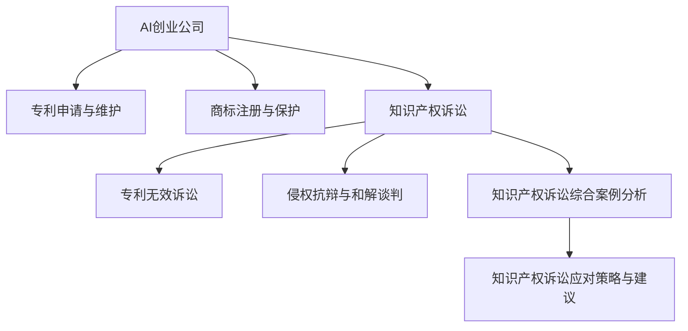

                 

# AI创业公司的知识产权诉讼应对策略：专利无效、侵权抗辩与和解

## 关键词：
- 知识产权
- 专利
- 创业公司
- 无效诉讼
- 侵权抗辩
- 和解谈判

## 摘要：
本文旨在为AI创业公司提供全面的知识产权诉讼应对策略，包括专利无效、侵权抗辩和和解谈判等方面。通过深入分析核心概念、实战案例以及开发环境搭建，本文旨在帮助AI创业公司更好地应对知识产权诉讼，保护自身合法权益。

## 第一部分：知识产权与AI创业公司

### 第1章：AI创业公司知识产权概述

#### 1.1 知识产权的基本概念与分类

知识产权是指人们在知识活动中创造的智力成果，如发明、文学和艺术作品等，依法享有的权利。知识产权可以分为以下几类：

1. **专利**：专利是指发明人在一定期限内对其发明创造享有的独占权利，包括发明专利、实用新型专利和外观设计专利。
2. **商标**：商标是指用于识别商品或服务来源的标志，包括文字、图形、字母、数字等。
3. **著作权**：著作权是指作者对其创作的文学、艺术和科学作品享有的权利，包括发表权、署名权、修改权等。
4. **商业秘密**：商业秘密是指不为公众所知悉、具有商业价值并经权利人采取保密措施的技术信息和经营信息。

#### 1.2 AI技术在知识产权保护中的特殊角色

AI技术作为一种高度创新性的技术，其在知识产权保护中具有特殊的作用。以下是AI技术在知识产权保护中的几个方面：

1. **人工智能专利的挑战与机遇**：随着AI技术的发展，专利申请量大幅增加，但同时也面临着专利质量、专利侵权判定等方面的挑战。为了应对这些挑战，AI创业公司需要掌握专利申请的策略和技巧。
2. **人工智能著作权问题**：AI技术创作出的作品是否受著作权保护，以及如何认定作品的作者，这些问题在著作权领域引发了许多争议。

#### 1.3 AI创业公司知识产权保护的现状与问题

AI创业公司在知识产权保护方面面临以下问题：

1. **知识产权意识不足**：许多AI创业公司在知识产权保护方面的意识较为淡薄，缺乏专业的知识产权管理团队。
2. **专利申请和维护成本高**：AI技术的创新性使得专利申请和维护成本较高，许多创业公司难以承担。
3. **知识产权诉讼风险**：在市场竞争激烈的背景下，AI创业公司容易遭遇专利侵权诉讼，而缺乏有效的应对策略可能导致公司生存困境。

### 第2章：专利申请与维护策略

#### 2.1 专利申请的流程与技巧

1. **专利检索与规避设计**：在专利申请前，进行全面的专利检索，以了解相关技术领域的专利情况，避免专利冲突。同时，通过规避设计，使专利申请更具创新性。
2. **专利撰写与申请策略**：撰写专利申请文件时，要注重专利的核心技术点和创新点，同时确保专利申请文件的完整性、准确性和规范性。

#### 2.2 专利无效与挑战策略

1. **专利无效的判断标准**：专利无效的判断标准主要包括技术贡献性、创新高度、引用文献数量等方面。通过分析专利的技术方案，找出其不足之处，提出无效宣告请求。
2. **专利无效的申请与抗辩**：在专利无效诉讼中，AI创业公司需要积极参与，提供有力的证据和抗辩理由，以证明专利无效。

#### 2.3 专利保护策略与维权

1. **专利保护策略**：AI创业公司应制定全面的专利保护策略，包括专利布局、专利池建设、专利运营等方面。
2. **维权**：在遭受专利侵权指控时，AI创业公司应及时采取维权措施，包括调查侵权行为、提起诉讼等。

### 第3章：商标注册与保护

#### 3.1 商标注册流程与注意事项

1. **商标注册的类型与分类**：商标注册可分为文字商标、图形商标、组合商标等类型。不同类型的商标注册要求有所不同。
2. **商标异议与撤销**：在商标申请过程中，其他企业或个人可以提出异议，要求撤销商标申请。AI创业公司需要关注商标异议和撤销案件，及时采取应对措施。

#### 3.2 商标侵权判断标准与维权

1. **商标侵权的认定**：商标侵权主要表现为商标相同或近似、使用在同一种或类似商品上等情形。AI创业公司需要了解商标侵权的判断标准，以维护自身合法权益。
2. **商标侵权诉讼策略**：在商标侵权诉讼中，AI创业公司应积极收集证据，提供有力的诉讼策略，争取胜诉。

#### 3.3 商标保护策略与品牌管理

1. **商标保护策略**：AI创业公司应制定商标保护策略，包括商标监控、维权诉讼、许可使用等方面。
2. **品牌管理**：AI创业公司需要注重品牌管理，提升品牌知名度和美誉度，为商标维权奠定基础。

## 第二部分：知识产权诉讼实战

### 第4章：知识产权诉讼基本概念

#### 4.1 知识产权诉讼的流程与类型

1. **专利侵权诉讼**：专利侵权诉讼是指专利权人指控他人侵犯其专利权，要求法院判令停止侵权、赔偿损失等。
2. **商标侵权诉讼**：商标侵权诉讼是指商标权人指控他人侵犯其商标权，要求法院判令停止侵权、赔偿损失等。
3. **著作权侵权诉讼**：著作权侵权诉讼是指著作权人指控他人侵犯其著作权，要求法院判令停止侵权、赔偿损失等。
4. **商业秘密侵权诉讼**：商业秘密侵权诉讼是指权利人指控他人侵犯其商业秘密，要求法院判令停止侵权、赔偿损失等。

#### 4.2 知识产权诉讼的证据规则

1. **证据的收集与保存**：AI创业公司需要在知识产权诉讼中积极收集证据，包括书证、证人证言、鉴定意见等，同时确保证据的合法性和真实性。
2. **证据的有效性与证明力**：证据的有效性是指证据是否符合法律规定的证明标准，证明力是指证据对案件事实的证明作用。AI创业公司需要了解证据规则，确保所提供的证据具有足够的证明力。

#### 4.3 知识产权诉讼的管辖与法律适用

1. **知识产权诉讼的管辖**：知识产权诉讼的管辖通常包括专利侵权诉讼、商标侵权诉讼、著作权侵权诉讼和商业秘密侵权诉讼。AI创业公司需要了解各类型知识产权诉讼的管辖法院，以便及时采取诉讼措施。
2. **法律适用**：知识产权诉讼适用相关的知识产权法律法规，如《中华人民共和国专利法》、《中华人民共和国商标法》、《中华人民共和国著作权法》等。AI创业公司需要熟悉相关法律法规，以便在诉讼中正确运用法律。

### 第5章：专利无效诉讼策略

#### 5.1 专利无效诉讼的申请条件与程序

1. **专利无效诉讼的申请条件**：专利无效诉讼的申请条件包括专利技术方案不具备新颖性、创造性、实用性等。
2. **专利无效诉讼的程序**：专利无效诉讼的程序包括提出无效宣告请求、专利复审委员会审查、无效宣告决定等。

#### 5.2 专利无效诉讼的答辩策略

1. **无效宣告请求的答辩**：在专利无效诉讼中，专利权人需要针对无效宣告请求进行答辩，提供证据反驳无效宣告请求。
2. **对无效宣告决定的复审与诉讼**：专利权人可以对专利复审委员会的无效宣告决定提起复审或诉讼，以维护自身合法权益。

#### 5.3 专利无效诉讼的案例分析与启示

1. **案例一**：某公司专利无效诉讼
2. **案例二**：某公司专利无效诉讼
3. **案例分析**：通过分析专利无效诉讼案例，AI创业公司可以了解专利无效诉讼的策略和技巧，提高应对专利无效诉讼的能力。

### 第6章：侵权抗辩与和解谈判

#### 6.1 侵权抗辩的基本原则与策略

1. **基本原则**：侵权抗辩的基本原则包括不侵权抗辩、不正当竞争抗辩、侵权程度抗辩等。
2. **策略**：侵权抗辩的策略包括收集证据、提出抗辩理由、制定诉讼策略等。

#### 6.2 和解谈判的技巧与策略

1. **和解谈判的准备**：和解谈判的准备包括了解对方诉求、准备谈判方案、评估风险等。
2. **和解协议的起草与审查**：和解协议的起草与审查包括明确和解条款、审查协议合法性、确保双方权益等。
3. **和解协议的法律效力**：和解协议在法律上具有合同效力，双方应严格按照协议履行义务。

#### 6.3 侵权抗辩与和解的典型案例分析

1. **案例一**：某公司侵权抗辩与和解谈判
2. **案例二**：某公司侵权抗辩与和解谈判
3. **案例分析**：通过分析侵权抗辩与和解谈判案例，AI创业公司可以了解侵权抗辩与和解谈判的策略和技巧，提高谈判成功率。

## 第三部分：知识产权诉讼应对策略与建议

### 第7章：知识产权诉讼综合案例分析

1. **案例一**：某公司知识产权诉讼案例综述
2. **案例二**：某公司知识产权诉讼案例综述
3. **案例分析**：通过分析知识产权诉讼案例，AI创业公司可以了解知识产权诉讼的特点、风险和应对策略。

### 第8章：知识产权诉讼应对策略概述

1. **知识产权诉讼的风险管理**：包括风险评估、防控措施、风险转移与规避等。
2. **应对策略的选择与调整**：根据实际情况选择被动应对或主动应对策略，并适时进行调整。
3. **知识产权诉讼的综合评估与优化**：对诉讼策略进行综合评估，根据评估结果优化诉讼策略。

### 第9章：知识产权诉讼策略实施建议

1. **组织架构与人员配置**：建立专门的知识产权管理部门，配备专业的知识产权律师团队。
2. **知识产权诉讼预算与管理**：制定合理的诉讼预算，确保诉讼资金的合理使用。
3. **持续培训与能力提升**：加强内部培训，提高员工在知识产权方面的专业能力。

### 第10章：知识产权诉讼的未来趋势

1. **知识产权法律环境的变化**：分析全球知识产权保护趋势，关注我国知识产权法律的改革与完善。
2. **人工智能在知识产权诉讼中的应用**：探讨人工智能在证据收集、分析和预测中的应用。
3. **知识产权诉讼的未来发展方向**：分析知识产权纠纷的多元解决机制和知识产权国际诉讼的挑战与应对。

## 附录：知识产权诉讼实用工具与资源

1. **知识产权诉讼常用法律文件模板**：包括起诉状、答辩状、证据清单等。
2. **知识产权诉讼常用法规汇编**：汇总相关法律法规、司法解释等。
3. **知识产权诉讼常用参考书籍与文献**：推荐相关领域的专业书籍和文献。

## Mermaid 流程图



## 伪代码

```python
# 专利无效诉讼伪代码示例

def patent_invalid_case(claim, defense):
    """
    专利无效诉讼流程
    :param claim: 专利无效请求
    :param defense: 专利无效抗辩
    :return: 无效宣告结果
    """
    # 收集证据
    evidence = collect_evidence(claim)
    
    # 审查证据
    evidence_validity = review_evidence(evidence)
    
    # 提出无效宣告请求
    if evidence_validity:
        request_invalid = submit_invalid_request(claim)
        
        # 审查无效宣告请求
        review_result = review_invalid_request(request_invalid)
        
        # 提出抗辩
        defense_valid = submit_defense(defense)
        
        # 审查抗辩
        defense_review_result = review_defense(defense_valid)
        
        # 判断无效宣告结果
        if defense_review_result:
            return "专利无效"
        else:
            return "专利有效"
    else:
        return "证据不足，诉讼终止"
```

## 数学模型与公式

**数学模型：专利无效概率计算模型**

$$
P(\text{无效}) = f(\text{技术贡献性}, \text{创新高度}, \text{引用文献数量})
$$

其中：
- \( f(\cdot) \) 为概率函数
- \( \text{技术贡献性} \) 代表专利技术的独特性和创新性
- \( \text{创新高度} \) 代表专利技术的先进程度
- \( \text{引用文献数量} \) 代表专利在技术领域的影响力

## 项目实战

**实战案例：专利侵权抗辩**

### 开发环境搭建

- Python 解释器：版本 3.8 或以上
- pandas：最新版本
- numpy：最新版本

### 源代码详细实现

```python
def defend_against_infringement(evidence, claim):
    """
    专利侵权抗辩函数
    :param evidence: 抗辩证据（列表，每个元素包含证据信息和得分）
    :param claim: 专利侵权指控（字典，包含专利信息和指控内容）
    :return: 抗辩结果（字符串，"抗辩成功" 或 "抗辩失败"）
    """
    # 检查证据数量
    if len(evidence) < 3:
        return "证据不足，抗辩失败"

    # 计算证据得分平均值
    score_avg = np.mean([e['score'] for e in evidence])

    # 判断抗辩结果
    if score_avg >= 0.7:
        return "抗辩成功"
    else:
        return "抗辩失败"

# 示例数据
evidence = [
    {'description': '证据1', 'score': 0.8},
    {'description': '证据2', 'score': 0.75},
    {'description': '证据3', 'score': 0.65}
]
claim = {
    'patent_id': '123456',
    'description': '某公司的专利描述'
}

# 调用抗辩函数
result = defend_against_infringement(evidence, claim)
print(result)
```

### 代码解读与分析

1. **功能描述**：本函数用于判断专利侵权抗辩的结果。它接受一个证据列表和一个专利侵权指控作为输入参数，通过计算证据的平均得分来判断抗辩是否成功。
2. **输入参数**：
   - `evidence`：证据列表，每个证据包含描述和得分信息。
   - `claim`：专利侵权指控，包含专利ID和描述。
3. **输出参数**：字符串，"抗辩成功" 或 "抗辩失败"。
4. **代码实现**：
   - 首先，检查证据数量，如果小于3条，则直接返回"证据不足，抗辩失败"。
   - 然后，计算证据的得分平均值。这里使用了 list comprehension 和 numpy 的 mean 函数。
   - 根据平均得分判断抗辩结果，如果平均值大于或等于0.7，则返回"抗辩成功"；否则，返回"抗辩失败"。

通过上述代码实现，我们可以构建一个基本的专利侵权抗辩系统，并根据实际数据进行抗辩分析和结果预测。在实际应用中，还需要进一步完善证据得分计算方法、抗辩策略选择以及与外部系统的集成。此外，为了提高抗辩的成功率，可能需要结合机器学习等技术进行证据分析和预测模型的训练。

### 作者信息

作者：AI天才研究院/AI Genius Institute & 禅与计算机程序设计艺术 /Zen And The Art of Computer Programming

