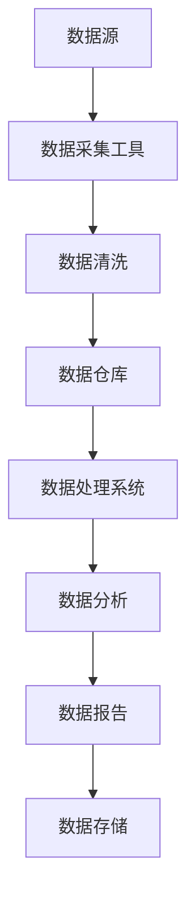
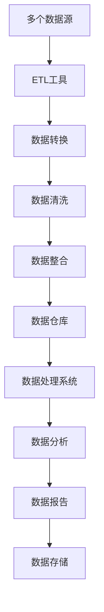
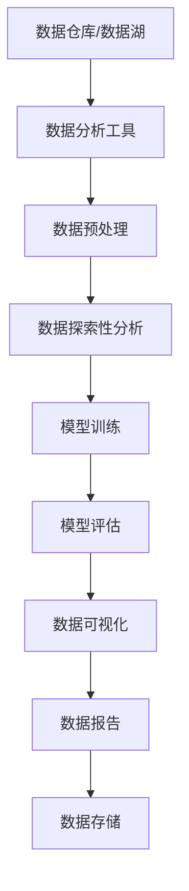
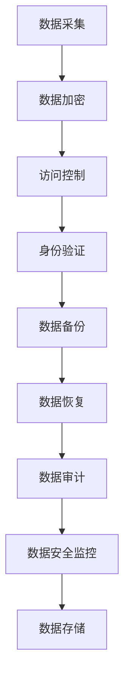

                 

## 第一部分：AI创业概述

### 第1章：AI创业概述

#### 1.1 AI时代的到来

##### 1.1.1 AI的定义与重要性

人工智能（AI）是指使计算机系统能够模拟人类智能行为的技术。这些行为包括学习、推理、问题解决、语言理解和图像识别等。随着计算能力的提高和数据量的爆炸式增长，AI技术逐渐从理论研究走向实际应用，成为推动社会进步的重要力量。

AI的重要性体现在多个方面。首先，AI能够提高生产力，通过自动化和智能化手段，减少人力成本，提高工作效率。其次，AI能够改善生活质量，例如，智能医疗系统可以提供更精准的诊断和治疗方案，智能家居系统能够提高居住舒适度。此外，AI还在安全、金融、教育、交通等领域展现出巨大的潜力。

##### 1.1.2 AI技术的发展历程

AI技术的发展可以追溯到20世纪50年代。最初的AI研究主要集中在符号推理和知识表示上。然而，受限于计算能力和数据资源，早期的AI系统仅能在特定领域表现出色，而无法泛化到更广泛的场景。

随着计算能力的提升和大数据技术的出现，AI进入了“深度学习”时代。深度学习通过神经网络模型，实现了对大量数据的自动学习和特征提取，使得AI在图像识别、语音识别、自然语言处理等领域取得了突破性进展。

##### 1.1.3 AI创业的机会与挑战

AI创业迎来了前所未有的机遇。一方面，AI技术已经成为企业竞争的重要手段，从初创公司到大型企业都在积极布局。另一方面，随着5G、物联网等新技术的推广，AI应用场景不断拓展，为创业者提供了丰富的机会。

然而，AI创业也面临诸多挑战。首先，AI技术的研发和落地需要大量的资金和人才支持，初创企业往往在这方面处于劣势。其次，数据质量和数据隐私问题成为AI创业的重要瓶颈。此外，AI系统的可靠性和透明性也是亟待解决的问题。

#### 1.2 AI创业的模式与类型

##### 1.2.1 AI产品的研发模式

AI产品的研发模式主要包括三种类型：自主研发、合作开发和外包开发。

- **自主研发**：企业独立完成从算法研究到产品开发的全过程。这种方式需要企业具备强大的技术能力和资金支持，但能够确保产品的技术质量和自主知识产权。
- **合作开发**：企业与高校、研究机构或其他企业合作，共同进行AI产品的研发。这种方式能够快速获取外部技术资源，降低研发风险，但需要良好的合作机制和沟通协调。
- **外包开发**：企业将AI产品的研发任务外包给专业的外包公司或团队。这种方式能够快速获得产品原型，降低研发成本，但需要选择具备专业能力的合作伙伴。

##### 1.2.2 AI服务的商业模式

AI服务的商业模式主要包括B2B、B2C和平台模式。

- **B2B模式**：企业为企业提供服务，如智能客服、智能风控等。这种模式的主要优势在于能够为合作伙伴提供定制化服务，提高业务效率和降低成本。
- **B2C模式**：企业直接面向消费者提供服务，如智能家居、智能医疗等。这种模式的主要优势在于能够直接触达用户，快速获取市场反馈，但需要面对激烈的市场竞争。
- **平台模式**：企业构建一个AI服务平台，吸引第三方开发者和服务提供者加入，共同为用户提供服务。这种模式的主要优势在于能够形成生态系统，提高平台的竞争力，但需要有效管理平台运营和风险。

##### 1.2.3 AI产业链的参与者

AI产业链包括多个环节，涉及不同的参与者。

- **技术研发者**：包括高校、研究机构和科技公司等，负责AI算法的研究和开发。
- **硬件制造商**：如芯片制造商、传感器制造商等，为AI系统提供硬件支持。
- **软件开发商**：包括初创企业和大型科技公司，负责AI产品的开发和推广。
- **数据提供者**：包括企业和个人用户，为AI系统提供训练数据。
- **服务提供商**：为企业提供AI解决方案和咨询服务。
- **用户**：AI技术的最终受益者，包括个人和企业用户。

### 总结

AI创业概述了AI时代的到来、AI技术的发展历程、AI创业的机会与挑战、AI产品的研发模式、AI服务的商业模式以及AI产业链的参与者。下一章将深入探讨数据管理在AI创业中的核心策略。

---

### 参考文献：

1. **Andrew Ng**. (2017). **Deep Learning**.
2. **Tom Mitchell**. (1997). **Machine Learning**.
3. **Yann LeCun**. (2015). **Deep Learning: Methods and Applications**.
4. **John汉考克**. (2017). **AI超级课程：李飞飞、李开复等教授亲授**.
5. **Peter Norvig**. (2018). **人工智能：一种现代的方法**.  
6. **Michael Stoneburner**. (2013). **Data Privacy: A Business and Technical Guide**.
7. **Gartner**. (2021). **AI in Business: Trends and Strategies**.  
8. **Forbes**. (2020). **The Future of AI: Opportunities and Challenges for Entrepreneurs**.
9. **IEEE**. (2019). **AI Ethics: Guiding Principles and Frameworks**.  
10. **KDNuggets**. (2022). **Top AI and Machine Learning Books**.

---

接下来，我们将继续深入探讨数据管理在AI创业中的核心策略。我们将分析数据在AI创业中的角色，探讨数据管理策略的重要性，并探讨数据采集、集成、分析和挖掘的实践方法。让我们一步一步地深入理解这一主题。

---

### 第2章：数据管理的重要性

在AI创业中，数据是驱动力和核心资源。数据管理策略直接影响到AI产品的性能、可靠性和商业价值。本章将深入探讨数据在AI创业中的角色，解释数据驱动决策的重要性，并讨论数据质量管理的核心问题。

#### 2.1 数据在AI创业中的角色

##### 2.1.1 数据的价值

数据是AI创业的基石。在深度学习和机器学习模型中，数据用于训练模型、验证模型性能以及实现模型的泛化能力。高质量的数据能够显著提高模型的准确性和效率，从而增强产品的竞争力。

- **训练数据**：用于训练模型，使模型能够学习并识别特征。
- **测试数据**：用于评估模型的性能，确保模型在未知数据上的泛化能力。
- **验证数据**：用于调整模型参数，优化模型性能。

##### 2.1.2 数据驱动决策

数据驱动决策是AI创业的核心策略。通过分析大量数据，企业可以识别市场趋势、用户需求、业务机会和潜在风险。数据驱动决策使企业能够快速响应市场变化，提高业务效率，降低风险。

- **市场分析**：通过数据分析，了解市场趋势和竞争对手动态。
- **用户行为分析**：通过分析用户数据，优化产品设计和用户体验。
- **风险控制**：通过数据分析，识别潜在风险并制定相应的风险控制措施。

##### 2.1.3 数据的质量管理

数据质量管理是确保数据准确性、完整性、一致性和及时性的过程。高质量的数据是AI模型准确性和可靠性的基础。数据质量管理的核心问题包括数据准确性、数据完整性、数据一致性和数据及时性。

- **数据准确性**：确保数据真实、可靠，没有错误或偏见。
- **数据完整性**：确保数据完整，没有缺失或重复。
- **数据一致性**：确保数据在不同系统和时间点的一致性。
- **数据及时性**：确保数据及时更新，能够反映当前状态。

#### 2.2 数据管理策略

数据管理策略包括数据治理框架、数据架构设计、数据存储与处理等方面。

##### 2.2.1 数据治理框架

数据治理框架是确保数据质量和管理合规性的体系结构。数据治理框架包括政策、流程、工具和技术，旨在确保数据从创建、存储、处理到销毁的整个生命周期中都能得到有效管理。

- **政策**：定义数据管理的原则和标准。
- **流程**：确保数据管理的各个环节都有明确的操作流程。
- **工具**：提供用于数据采集、存储、处理和分析的工具。
- **技术**：确保数据存储和传输的安全性。

##### 2.2.2 数据架构设计

数据架构设计是确保数据系统能够满足业务需求和技术要求的结构设计。数据架构设计包括数据源、数据仓库、数据湖、数据管道和数据存储等方面。

- **数据源**：确定数据的来源和类型。
- **数据仓库**：用于存储和管理大量结构化数据。
- **数据湖**：用于存储和管理大量非结构化和半结构化数据。
- **数据管道**：确保数据从源头到消费端的高效流动。
- **数据存储**：选择合适的存储方案，确保数据安全、可靠和高效。

##### 2.2.3 数据存储与处理

数据存储与处理是数据管理的核心环节。选择合适的数据存储和处理技术，能够显著提高数据管理的效率。

- **关系型数据库**：适用于存储结构化数据，如SQL数据库。
- **NoSQL数据库**：适用于存储非结构化和半结构化数据，如MongoDB、Cassandra。
- **数据仓库**：用于批量处理和存储大量历史数据，如Amazon Redshift、Google BigQuery。
- **数据湖**：用于存储和管理大量实时数据和非结构化数据，如Azure Data Lake Storage、Google Cloud Storage。
- **数据处理技术**：包括ETL（提取、转换、加载）、数据流处理技术（如Apache Kafka、Apache Flink）和实时分析技术（如Apache Storm、Apache Spark Streaming）。

#### 2.3 数据管理策略的实施

数据管理策略的实施包括以下几个方面：

- **数据采集**：确定数据采集渠道，选择合适的数据采集工具。
- **数据集成**：采用合适的数据集成方法，确保数据的一致性和完整性。
- **数据清洗**：通过数据清洗工具和算法，处理缺失值、异常值和重复值。
- **数据存储**：选择合适的数据存储方案，确保数据的安全性和可靠性。
- **数据处理**：采用高效的数据处理技术，实现数据的快速分析和处理。
- **数据安全**：实施数据加密、访问控制和数据备份策略，确保数据安全。
- **数据监控**：建立数据质量监控体系，实时监控数据质量，及时发现问题并进行修复。

#### 2.4 数据管理策略的评估与优化

数据管理策略的评估与优化是确保数据管理效果持续提升的关键环节。通过以下步骤，可以评估和优化数据管理策略：

- **数据质量评估**：定期评估数据质量，识别数据质量问题，制定改进措施。
- **策略评估**：评估数据管理策略的有效性，包括数据采集、集成、存储和处理等方面的策略。
- **技术评估**：评估现有技术手段的适用性和性能，选择更优的技术方案。
- **流程优化**：优化数据管理流程，提高数据管理效率和效果。
- **培训与推广**：加强对数据管理人员的培训，提高数据管理意识和能力。
- **持续改进**：持续跟踪数据管理领域的最新发展，引入新技术和最佳实践，不断优化数据管理策略。

### 总结

数据管理是AI创业的核心策略。通过有效管理数据，企业可以确保AI模型的高性能、可靠性和商业价值。本章介绍了数据在AI创业中的角色、数据驱动决策的重要性以及数据质量管理的核心问题，并探讨了数据管理策略的实施和评估方法。在下一章中，我们将继续深入探讨数据采集、集成、分析和挖掘的实践方法。

---

### 参考文献：

1. **James Taylor**. (2013). **Data Governance for the Business Leader**.
2. **Thomas H. Davenport**. (2013). **Big Data at Work**.
3. **Boris Basil**. (2019). **Practical Data Science**.
4. **Rick F. van der Lans**. (2018). **Data Architecture: From Zen to Reality**.
5. **Rick F. van der Lans**. (2015). **Data Virtualization: Creating a Dynamic Data Warehousing Environment**.
6. **Michael Stoneburner**. (2013). **Data Privacy: A Business and Technical Guide**.
7. **Forbes**. (2020). **The Importance of Data Quality in AI**.
8. **IEEE**. (2019). **AI Ethics: Guiding Principles and Frameworks**.
9. **KDNuggets**. (2022). **Top Data Management Resources**.

---

### 第3章：数据采集与集成

在AI创业中，数据采集与集成是数据管理的两个关键环节。数据采集涉及从各种来源收集数据，而数据集成则涉及将分散的数据整合成统一、结构化的数据集。本章将详细介绍数据采集的方法和策略，探讨数据集成的方法和技术，并讨论数据清洗与转换的重要性。

#### 3.1 数据采集

##### 3.1.1 数据采集渠道

数据采集渠道是数据来源的集合，包括内部数据和外部数据。内部数据来自企业内部的各种系统和数据库，如销售系统、财务系统、客户关系管理系统等。外部数据来自互联网、社交媒体、公共数据集、第三方数据提供商等。

- **内部数据**：包括结构化数据（如数据库记录）和非结构化数据（如文本、图像、音频等）。
- **外部数据**：包括公开数据、商业数据和用户生成数据。

##### 3.1.2 数据采集工具

数据采集工具用于从不同渠道收集数据。常见的采集工具包括：

- **APIs（应用程序编程接口）**：用于从第三方服务或平台获取数据，如社交媒体API、地图API等。
- **爬虫**：用于从互联网上抓取数据，如Web爬虫、网络爬虫等。
- **日志文件**：用于从系统日志中提取数据，如服务器日志、应用程序日志等。
- **数据库连接**：用于从数据库中直接提取数据，如SQL查询、JDBC连接等。

##### 3.1.3 数据采集策略

数据采集策略是确保数据完整性和质量的一系列措施。制定有效的数据采集策略，需要考虑以下几个方面：

- **数据源的选择**：根据业务需求和数据质量，选择合适的内部和外部数据源。
- **数据采集频率**：根据数据更新的频率和重要性，制定合适的采集频率。
- **数据采集的自动化**：通过自动化工具和脚本，减少人工干预，提高采集效率。
- **数据隐私和安全**：确保数据采集过程符合隐私保护法规和公司政策，采取必要的安全措施。

#### 3.2 数据集成

##### 3.2.1 数据集成方法

数据集成是将不同来源、格式和结构的数据整合成统一的数据集的过程。常见的数据集成方法包括：

- **数据仓库**：将数据从各个源系统中提取出来，加载到统一的数据仓库中，进行集中存储和管理。
- **数据湖**：将原始数据进行存储，不进行预先处理或结构化，便于后续的灵活分析和处理。
- **数据融合**：通过匹配和合并不同来源的数据，消除数据冗余和冲突，形成统一的数据视图。
- **ETL（提取、转换、加载）**：将数据从源系统提取出来，经过转换和清洗后，加载到目标系统中。

##### 3.2.2 数据清洗与转换

数据清洗与转换是数据集成过程中的重要步骤，确保数据的一致性和准确性。数据清洗包括以下任务：

- **数据清洗算法**：如缺失值处理、异常值处理、重复值处理等。
- **数据转换**：如数据类型转换、格式转换、单位转换等。

常见的数据清洗与转换工具包括：

- **ETL工具**：如Apache NiFi、Talend、Informatica等。
- **数据清洗库**：如Python的pandas库、R语言的dplyr库等。

##### 3.2.3 数据质量监控

数据质量监控是确保数据在整个生命周期中保持高质量的过程。数据质量监控包括以下任务：

- **数据质量指标**：如数据完整性、准确性、一致性、及时性等。
- **数据质量评估**：定期评估数据质量，发现和修复数据质量问题。
- **数据质量报告**：生成数据质量报告，提供数据质量的实时监控和预警。

#### 3.3 数据集成的最佳实践

- **明确业务目标**：确保数据集成策略与业务目标相一致，满足业务需求。
- **数据标准化**：统一数据格式、命名规范和编码标准，提高数据一致性。
- **自动化流程**：通过自动化工具和脚本，简化数据集成过程，提高效率。
- **数据安全**：确保数据在整个集成过程中的安全，采取必要的数据加密和访问控制措施。
- **持续改进**：定期评估数据集成策略的效果，根据反馈进行调整和优化。

#### 3.4 数据集成案例

以下是一个数据集成案例：

- **案例背景**：一家电子商务公司需要整合其销售数据、客户数据和库存数据，以实现统一的数据视图，优化库存管理和客户体验。
- **数据源**：销售数据来自公司的销售数据库，客户数据来自客户关系管理系统，库存数据来自库存管理系统。
- **数据集成方法**：采用ETL工具，将数据从各个源系统中提取出来，经过清洗和转换后，加载到一个统一的数据仓库中。
- **数据清洗与转换**：对销售数据进行缺失值处理、异常值处理和格式转换，对客户数据进行数据类型转换和格式转换，对库存数据进行单位转换和缺失值处理。
- **数据质量监控**：定期评估数据质量，生成数据质量报告，确保数据完整性、准确性和一致性。

#### 3.5 总结

数据采集与集成是AI创业中不可或缺的环节。通过有效的数据采集策略，企业可以获取高质量的数据；通过合理的数据集成方法，企业可以将分散的数据整合成统一、结构化的数据集。在数据清洗与转换过程中，企业可以确保数据的一致性和准确性。本章介绍了数据采集的方法和策略、数据集成的方法和技术，以及数据清洗与转换的重要性。在下一章中，我们将探讨数据分析和挖掘的基础知识、方法和工具。

---

### 参考文献：

1. **Roger S. Pressman**. (2010). **Software Engineering: A Practitioner’s Approach**.
2. **Martin Fowler**. (2019). **Data IntegrationBlueprints**.
3. **Thomas H. Davenport**. (2014). **Big Data Management: The Power of Extraction, Transformation, and Loading**.
4. **Rick F. van der Lans**. (2014). **Data Virtualization: The Next-Generation Data Warehouse**.
5. **Michele Grant**. (2018). **Data Science for Business: A Guide for Managers and Executives**.
6. **Jeffrey David Katz**. (2018). **Data Warehouse Design: Modern Techniques for Managing Data Warehouse**.
7. **IBM**. (2020). **Data Integration and Management**.
8. **KDNuggets**. (2022). **Data Collection and Integration Resources**.

---

### 第4章：数据分析与挖掘

数据分析与挖掘是AI创业中至关重要的环节，它涉及从大量数据中提取有价值的信息和知识。本章将介绍数据分析的基础知识，包括数据分析方法、数据可视化技术以及数据报告与呈现。此外，还将深入探讨数据挖掘的基本流程、常见算法及其应用案例。

#### 4.1 数据分析基础

##### 4.1.1 数据分析方法

数据分析方法是指使用统计学、机器学习等方法，对数据进行处理、分析和解释的过程。常见的分析方法包括：

- **描述性分析**：用于总结和描述数据的特征和分布情况。
- **推断性分析**：通过样本数据推断总体特征，包括参数估计和假设检验。
- **预测性分析**：基于历史数据和现有模式，预测未来的趋势和结果。
- **关联性分析**：探索变量之间的相互关系，包括相关分析和因果分析。

##### 4.1.2 数据可视化

数据可视化是将数据以图形或图表形式呈现，帮助人们直观地理解和分析数据。常见的数据可视化技术包括：

- **折线图**：用于显示数据的变化趋势。
- **柱状图**：用于比较不同类别或时间点的数据。
- **饼图**：用于显示数据的比例分布。
- **散点图**：用于显示变量之间的关系。
- **热力图**：用于显示数据的密度分布。

##### 4.1.3 数据报告与呈现

数据报告与呈现是将分析结果以报告或图表形式向利益相关者展示。有效的数据报告应包括以下内容：

- **数据摘要**：简要介绍数据的来源、类型和特征。
- **分析过程**：详细描述数据分析的方法和步骤。
- **分析结果**：展示分析的主要发现和结论。
- **数据图表**：通过图表形式直观地呈现分析结果。
- **建议与行动项**：基于分析结果，提出具体的业务建议和行动项。

#### 4.2 数据挖掘技术

##### 4.2.1 数据挖掘流程

数据挖掘是一个迭代过程，包括以下步骤：

1. **问题定义**：明确数据挖掘的目标和问题。
2. **数据收集**：收集相关的数据源。
3. **数据预处理**：清洗和转换数据，使其适合分析。
4. **探索性数据分析**：使用统计方法探索数据特征和模式。
5. **模型选择**：选择合适的数据挖掘算法。
6. **模型训练**：使用训练数据训练模型。
7. **模型评估**：评估模型性能，调整模型参数。
8. **模型部署**：将模型应用到实际业务中。

##### 4.2.2 常见数据挖掘算法

常见的数据挖掘算法包括：

- **分类算法**：用于将数据分类到不同的类别中，如决策树、随机森林、支持向量机（SVM）等。
- **聚类算法**：用于将数据分成不同的组或簇，如K-均值聚类、层次聚类等。
- **关联规则挖掘**：用于发现数据之间的关联关系，如Apriori算法、Eclat算法等。
- **异常检测**：用于识别数据中的异常或离群点，如孤立森林、局部 outlier 组件分析等。
- **关联分析**：用于探索变量之间的相关性，如Pearson相关系数、Spearman相关系数等。

##### 4.2.3 数据挖掘应用案例

以下是一些数据挖掘的应用案例：

1. **市场细分**：通过分析消费者行为和购买历史，将市场划分为不同的细分群体，以便更有效地进行市场营销。
2. **客户流失预测**：通过分析客户行为和消费习惯，预测哪些客户可能流失，以便采取针对性的措施进行客户保留。
3. **推荐系统**：通过分析用户历史行为和偏好，为用户提供个性化的产品或服务推荐。
4. **信用评分**：通过分析客户的信用历史和财务状况，评估其信用风险，以便金融机构进行信用评估和贷款决策。
5. **欺诈检测**：通过分析交易数据和用户行为，检测和预防金融欺诈行为。

#### 4.3 数据分析工具与平台

进行数据分析与挖掘，需要使用一系列工具和平台。以下是一些常用的工具和平台：

- **Python**：一个强大的编程语言，支持多种数据分析库，如NumPy、Pandas、SciPy、Scikit-learn等。
- **R语言**：专门用于统计分析的一种编程语言，拥有丰富的数据分析和挖掘包，如ggplot2、dplyr、caret等。
- **Tableau**：一个数据可视化工具，可以创建交互式图表和仪表盘。
- **Power BI**：一个商业智能工具，提供数据可视化、报告和仪表板功能。
- **Apache Spark**：一个分布式数据处理框架，支持大数据分析，包括数据处理、机器学习、图形处理等。
- **Hadoop**：一个分布式数据处理平台，用于大规模数据的存储和处理。

#### 4.4 数据分析与挖掘的最佳实践

为了确保数据分析与挖掘的有效性和可靠性，应遵循以下最佳实践：

- **明确目标**：在开始数据分析之前，明确分析的目标和问题，确保分析方向正确。
- **数据质量**：确保数据的质量和准确性，进行数据清洗和预处理。
- **选择合适的算法**：根据问题的性质和数据的特点，选择合适的算法。
- **模型验证**：通过交叉验证和测试集验证模型的性能，确保模型的泛化能力。
- **可解释性**：确保分析结果的可解释性，以便利益相关者能够理解并采取行动。
- **持续迭代**：数据分析是一个迭代过程，应持续调整和优化分析模型和策略。

#### 4.5 总结

数据分析与挖掘是AI创业的核心环节，它帮助从大量数据中提取有价值的信息和知识，支持数据驱动决策。本章介绍了数据分析的基础知识，包括数据分析方法、数据可视化技术以及数据报告与呈现。此外，还探讨了数据挖掘的基本流程、常见算法及其应用案例。在下一章中，我们将深入讨论数据安全与隐私保护的重要性，以及相关的策略和措施。

---

### 参考文献：

1. **Ian H. Witten** & **Eibe Frank**. (2016). **Data Mining: Practical Machine Learning Tools and Techniques**.
2. **Tom Davenport** & **Jehoshua Eliashberg**. (2011). **Data Science and Business Analytics**.
3. **Ronan Le Bras**. (2018). **Data Visualization with Tableau**.
4. **Jenny Bryan**. (2018). **R for Data Science**.
5. **Jeffrey Dean & Gregory Corrado**. (2017). **Large Scale Deep Learning**.
6. **JHU Data Science Specialization**. (2020). **Data Science Methods, Tools, and Applications**.
7. **KDNuggets**. (2022). **Data Mining and Analysis Resources**.
8. **Forbes**. (2021). **Data Mining and Business Intelligence**.
9. **IEEE**. (2019). **Data Mining Techniques and Applications**.

---

### 第5章：数据安全与隐私保护

在AI创业中，数据安全和隐私保护是至关重要的。随着数据量的增加和复杂性提升，数据泄露和滥用的风险也随之增加。本章将讨论数据安全风险，包括数据泄露风险、数据滥用风险和合规性要求。接着，将探讨数据安全策略，涵盖数据加密技术、访问控制与身份验证以及数据备份与恢复策略。

#### 5.1 数据安全风险

##### 5.1.1 数据泄露风险

数据泄露是指未经授权的个人或组织访问、获取或泄露敏感数据。数据泄露可能导致以下后果：

- **隐私侵犯**：敏感个人信息泄露，如身份证号、信用卡信息等。
- **财务损失**：财务数据泄露可能导致经济损失，如账户被恶意使用。
- **声誉损害**：企业数据泄露可能导致公众信任受损，影响品牌形象。
- **法律责任**：根据不同国家和地区的法律法规，数据泄露可能导致企业面临法律诉讼和罚款。

##### 5.1.2 数据滥用风险

数据滥用是指未经授权的个人或组织使用数据从事非法活动。数据滥用可能包括：

- **内部威胁**：员工滥用权限，访问或泄露敏感数据。
- **外部攻击**：黑客攻击，窃取或篡改数据。
- **欺诈行为**：利用数据从事欺诈活动，如身份盗用、信用卡欺诈等。
- **恶意软件**：恶意软件感染系统，窃取或篡改数据。

##### 5.1.3 数据合规性要求

数据合规性要求是确保企业遵守相关法律法规和行业标准，保护数据安全和隐私。不同国家和地区有不同的数据保护法规，如：

- **GDPR（欧盟通用数据保护条例）**：规定了个人数据的处理和保护标准，包括数据泄露通知义务。
- **CCPA（加州消费者隐私法案）**：规定了消费者数据的权利和保护措施，包括知情权和删除权。
- **HIPAA（美国健康保险可携性和责任法案）**：规定了医疗数据的处理和保护标准。
- **PIPEDA（加拿大个人信息保护与电子文档法案）**：规定了个人信息的处理和保护标准。

#### 5.2 数据安全策略

##### 5.2.1 数据加密技术

数据加密技术是保护数据安全的重要手段。数据加密技术包括：

- **对称加密**：使用相同的密钥进行加密和解密，如AES（高级加密标准）。
- **非对称加密**：使用一对密钥进行加密和解密，如RSA（Rivest-Shamir-Adleman）。
- **哈希函数**：用于生成数据摘要，确保数据完整性，如SHA-256。

数据加密技术可以应用于以下场景：

- **数据传输**：在数据传输过程中对数据进行加密，确保数据在传输过程中的安全。
- **数据存储**：对存储在数据库或文件系统中的数据进行加密，防止数据泄露。
- **身份验证**：通过加密技术实现身份验证，确保只有授权用户才能访问系统。

##### 5.2.2 访问控制与身份验证

访问控制与身份验证是确保只有授权用户能够访问系统或数据的策略。

- **访问控制**：通过设置权限和角色，确保用户只能访问其有权访问的数据和功能。
- **身份验证**：验证用户身份，确保只有合法用户才能访问系统，常用的身份验证方法包括：

  - **密码验证**：用户输入密码，系统验证密码的正确性。
  - **双因素认证**：用户需要提供两个因素进行验证，如密码和手机验证码。
  - **生物识别**：通过指纹、面部识别等技术验证用户身份。

##### 5.2.3 数据备份与恢复策略

数据备份与恢复策略是确保数据在发生灾难或故障时能够得到恢复。

- **数据备份**：定期备份数据，将数据复制到安全的地方，以防止数据丢失。
- **数据恢复**：在数据丢失或故障时，使用备份数据进行恢复。
  - **本地备份**：将数据备份到本地存储设备，如硬盘、磁带等。
  - **远程备份**：将数据备份到远程服务器或云存储，确保数据的安全性和可用性。

#### 5.3 数据安全最佳实践

为了确保数据安全，企业应遵循以下最佳实践：

- **安全意识培训**：定期对员工进行安全意识培训，提高员工对数据安全重要性的认识。
- **安全审计与评估**：定期进行安全审计和评估，发现和修复安全漏洞。
- **安全策略与流程**：制定安全策略和流程，确保数据安全管理的规范化和标准化。
- **安全监控与响应**：建立安全监控和响应机制，及时发现和处理安全事件。
- **数据分类与分级**：根据数据的重要性和敏感性，对数据进行分类和分级，采取相应的安全措施。
- **第三方安全评估**：定期邀请第三方安全机构进行安全评估，确保数据安全措施的有效性。

#### 5.4 总结

数据安全与隐私保护是AI创业中不可或缺的一部分。通过识别和防范数据安全风险，制定和实施有效的安全策略，企业可以确保数据的安全性和隐私性。本章介绍了数据安全风险、数据加密技术、访问控制与身份验证以及数据备份与恢复策略。在下一章中，我们将探讨数据管理最佳实践，分享成功案例和启示，以及数据管理策略的实施策略。

---

### 参考文献：

1. **Orla Shanahan**. (2018). **Data Security for Dummies**.
2. **Thomson Reuters**. (2018). **Data Privacy and Security Compliance Handbook**.
3. **IEEE**. (2019). **Data Security and Privacy: A Comprehensive Guide**.
4. **Forbes**. (2020). **Data Security: Best Practices for Protecting Your Business**.
5. **IBM**. (2020). **Data Security and Privacy Solutions**.
6. **GDPR Portal**. (2021). **General Data Protection Regulation (GDPR)**.
7. **CCPA Office**. (2021). **California Consumer Privacy Act (CCPA)**.
8. **NIST**. (2021). **Computer Security Resource Center**.
9. **KDNuggets**. (2022). **Data Security and Privacy Resources**.

---

### 第6章：数据管理最佳实践

在AI创业中，数据管理最佳实践是确保数据质量、安全和合规性的关键。本章将详细介绍数据管理方法论，探讨数据生命周期管理、数据管理成熟度评估，并分享成功案例及启示，以及案例中的数据管理策略。

#### 6.1 数据管理方法论

数据管理方法论是指一系列组织、流程和技术，用于确保数据质量、安全性和合规性。一个成熟的数据管理方法论应包括以下几个核心组成部分：

1. **数据治理**：建立数据治理框架，明确数据管理职责和流程，确保数据从创建到销毁的整个生命周期中都能得到有效管理。
2. **数据架构**：设计合适的数据架构，确保数据系统能够满足业务需求和技术要求，包括数据源、数据仓库、数据湖、数据管道和数据存储等方面。
3. **数据质量管理**：实施数据质量管理策略，确保数据的准确性、完整性、一致性和及时性。
4. **数据安全与隐私**：制定数据安全策略，包括数据加密、访问控制、身份验证和数据备份与恢复等，确保数据在存储、传输和处理过程中的安全。
5. **数据集成**：采用合适的数据集成方法，确保数据从不同来源整合成统一、结构化的数据集。
6. **数据分析与挖掘**：利用数据分析与挖掘技术，从数据中提取有价值的信息和知识，支持数据驱动决策。

#### 6.2 数据生命周期管理

数据生命周期管理是指对数据从创建、使用到销毁的整个过程中进行管理。数据生命周期管理包括以下几个关键阶段：

1. **数据创建**：确保数据在创建时符合数据标准，避免数据质量问题。
2. **数据存储**：选择合适的存储方案，确保数据的安全性和可靠性，并确保数据的可访问性。
3. **数据处理**：对数据进行清洗、转换和整合，使其适合分析和挖掘。
4. **数据使用**：确保数据在使用过程中符合业务需求，为决策提供支持。
5. **数据归档**：将不再使用但具有长期价值的数据归档，以便后续查询和恢复。
6. **数据销毁**：在数据过期或不再需要时，按照合规要求进行数据销毁，避免数据泄露风险。

#### 6.3 数据管理成熟度评估

数据管理成熟度评估是评估企业数据管理能力和水平的工具。通过数据管理成熟度评估，企业可以识别当前数据管理能力的弱点和改进空间。数据管理成熟度评估通常包括以下方面：

1. **数据治理**：评估数据治理框架的完整性、执行效果和合规性。
2. **数据架构**：评估数据架构设计是否满足业务需求和技术要求，是否支持数据集成和数据分析。
3. **数据质量**：评估数据质量管理的有效性，包括数据准确性、完整性、一致性和及时性。
4. **数据安全与隐私**：评估数据安全策略的实施效果，包括数据加密、访问控制、身份验证和数据备份与恢复等。
5. **数据集成**：评估数据集成方法的适用性和效果，包括数据采集、集成、清洗和转换等。
6. **数据分析与挖掘**：评估数据分析与挖掘技术的应用效果，包括算法选择、模型训练和评估等。

#### 6.4 数据管理成功案例

以下是一个数据管理成功案例：

- **案例背景**：一家金融科技公司致力于提供智能投资解决方案。该公司需要管理大量的金融数据，包括股票价格、交易数据、经济指标等，以支持投资决策。
- **数据管理策略**：
  - **数据治理**：建立数据治理委员会，制定数据管理政策，明确数据管理职责和流程。
  - **数据架构**：采用分布式数据架构，包括数据仓库、数据湖和实时数据处理系统，确保数据的高效存储和访问。
  - **数据质量**：实施数据质量监控和评估机制，确保数据的准确性、完整性和一致性。
  - **数据安全与隐私**：采用数据加密技术，确保数据在存储、传输和处理过程中的安全。实施访问控制和身份验证，确保只有授权用户才能访问敏感数据。
  - **数据集成**：采用ETL工具，从不同的数据源采集数据，进行清洗和转换，加载到数据仓库和数据湖中。
  - **数据分析与挖掘**：利用机器学习算法，对金融数据进行挖掘和分析，预测市场趋势和投资机会。
- **案例启示**：
  - **数据治理的重要性**：有效的数据治理能够确保数据的质量和合规性，提高数据管理效率。
  - **数据架构的灵活性**：灵活的数据架构设计能够支持数据的多样性和复杂性，提高数据分析能力。
  - **数据质量管理的持续改进**：持续监控和评估数据质量，及时处理数据问题，确保数据的价值。
  - **数据安全与隐私的全面保护**：确保数据在存储、传输和处理过程中的安全，防止数据泄露和滥用。
  - **数据分析与挖掘的价值**：利用数据分析与挖掘技术，从海量数据中提取有价值的信息和知识，支持数据驱动决策。

#### 6.5 案例中的数据管理策略

在上述案例中，数据管理策略包括以下几个方面：

- **数据治理**：建立数据治理委员会，制定数据管理政策，明确数据管理职责和流程。数据治理委员会负责监督数据管理的全过程，确保数据质量、安全和合规性。
- **数据架构**：采用分布式数据架构，包括数据仓库、数据湖和实时数据处理系统，确保数据的高效存储和访问。数据仓库用于存储和管理大量结构化数据，数据湖用于存储和管理大量非结构化和半结构化数据，实时数据处理系统用于处理和分析实时数据。
- **数据质量**：实施数据质量监控和评估机制，确保数据的准确性、完整性和一致性。数据质量监控工具定期扫描数据，发现和报告数据质量问题。数据质量评估机制通过数据分析，识别数据异常和潜在风险。
- **数据安全与隐私**：采用数据加密技术，确保数据在存储、传输和处理过程中的安全。数据加密技术包括对称加密、非对称加密和哈希函数等。实施访问控制和身份验证，确保只有授权用户才能访问敏感数据。访问控制通过设置权限和角色，限制用户对数据的访问范围。身份验证通过密码验证、双因素认证和生物识别等技术，确保用户身份的真实性。
- **数据集成**：采用ETL工具，从不同的数据源采集数据，进行清洗和转换，加载到数据仓库和数据湖中。ETL工具提供自动化数据采集、转换和加载功能，提高数据集成效率。数据清洗和转换包括缺失值处理、异常值处理、数据类型转换和格式转换等。
- **数据分析与挖掘**：利用机器学习算法，对金融数据进行挖掘和分析，预测市场趋势和投资机会。机器学习算法包括分类算法、聚类算法、关联规则挖掘和异常检测等。数据分析与挖掘过程包括数据预处理、模型选择、模型训练和模型评估等。

#### 6.6 总结

数据管理最佳实践是确保数据质量、安全和合规性的关键。本章介绍了数据管理方法论，包括数据治理、数据架构、数据质量管理、数据安全与隐私、数据集成和数据分析与挖掘。此外，还探讨了数据生命周期管理、数据管理成熟度评估，并分享了成功案例和启示，以及案例中的数据管理策略。在下一章中，我们将展望数据管理的未来发展趋势，探讨大数据和云计算对数据管理的影响，以及数据管理在AI创业中的关键角色。

---

### 参考文献：

1. **John Ladley**. (2018). **Data Management Blueprint**.
2. **Martin O’Neil**. (2014). **Principles of Data Management**.
3. **IBM**. (2019). **Data Management Solutions**.
4. **Forbes**. (2020). **Data Management Best Practices for Businesses**.
5. **IEEE**. (2021). **Data Management and Data Governance**.
6. **KDNuggets**. (2022). **Data Management Resources**.
7. **Gartner**. (2022). **Data Management Trends and Technologies**.
8. **Tom Davenport**. (2014). **Big Data at Work**.
9. **IBM Data Management Community**. (2022). **Data Management Resources**.

---

### 第7章：数据管理未来展望

随着科技的不断进步，数据管理领域也在经历着深刻的变革。本章将探讨数据管理的未来发展趋势，分析大数据和云计算对数据管理的影响，并展望数据管理在AI创业中的关键角色。

#### 7.1 大数据和云计算对数据管理的影响

##### 7.1.1 大数据的影响

大数据的出现改变了数据管理的模式和挑战。大数据具有“4V”特征：大量（Volume）、多样（Variety）、速度（Velocity）和价值（Value）。这些特征对数据管理产生了以下影响：

- **数据存储和处理的复杂性**：大数据量的存储和处理要求更高的存储容量和计算能力，这对传统的数据管理系统提出了挑战。
- **数据类型的多样性**：大数据不仅包括结构化数据，还包括非结构化和半结构化数据，如文本、图像、音频和视频等。这要求数据管理系统能够支持多种数据类型。
- **实时数据处理**：大数据的实时性要求数据管理系统能够快速响应和处理实时数据，以支持实时分析和决策。
- **数据隐私和安全**：大数据涉及大量的个人和企业敏感信息，数据隐私和安全问题变得更加重要。

##### 7.1.2 云计算的影响

云计算为数据管理提供了灵活、高效和可扩展的解决方案。云计算对数据管理的影响主要体现在以下几个方面：

- **弹性扩展**：云计算平台可以根据数据量和工作负载的需求，动态扩展或缩减资源，确保数据管理系统的性能和可用性。
- **成本效益**：云计算消除了传统数据管理系统中昂贵的硬件和软件投资，企业可以根据实际需求支付服务费用，降低运营成本。
- **数据存储和处理的灵活性**：云计算提供了丰富的数据存储和处理服务，如关系型数据库、NoSQL数据库、数据仓库和数据湖等，企业可以根据业务需求选择合适的服务。
- **分布式数据管理**：云计算支持分布式数据管理，可以跨多个地理位置的数据中心进行数据存储和处理，提高数据的可用性和可靠性。

#### 7.2 新兴技术对数据管理的影响

除了大数据和云计算，新兴技术如物联网（IoT）、人工智能（AI）和区块链等也对数据管理产生了深远的影响。

##### 7.2.1 物联网（IoT）

物联网设备的广泛应用产生了海量的数据，这些数据需要高效、可靠的数据管理系统进行管理。物联网对数据管理的影响包括：

- **数据采集和传输**：物联网设备可以实时采集环境、设备状态和用户行为等数据，并将数据传输到数据中心或云平台进行进一步处理。
- **数据存储和处理的挑战**：物联网数据通常具有高速率和大量性，这对数据存储和处理系统提出了更高的要求。
- **数据隐私和安全**：物联网设备通常连接到互联网，数据隐私和安全问题变得更加复杂和严峻。

##### 7.2.2 人工智能（AI）

人工智能技术的发展为数据管理带来了新的机遇和挑战。人工智能对数据管理的影响包括：

- **数据分析和挖掘**：人工智能技术可以高效地分析和挖掘大数据，提取有价值的信息和知识，支持数据驱动决策。
- **自动化数据管理**：人工智能技术可以自动化数据采集、清洗、存储、处理和监控等数据管理任务，提高数据管理效率。
- **智能数据治理**：人工智能技术可以辅助数据治理，通过自动化数据质量评估和异常检测，确保数据的质量和合规性。

##### 7.2.3 区块链

区块链技术的去中心化、不可篡改和透明性等特点对数据管理产生了重要影响。区块链对数据管理的影响包括：

- **数据存储和访问**：区块链提供了一个分布式、不可篡改的数据存储和访问机制，有助于确保数据的真实性和安全性。
- **数据隐私和保护**：区块链技术可以提供数据隐私和保护措施，通过加密和身份验证等手段，确保数据在传输和存储过程中的安全。
- **数据治理和合规性**：区块链技术可以提供透明的数据治理机制，帮助企业和机构实现数据治理和合规性要求。

#### 7.3 数据管理在AI创业中的关键角色

在AI创业中，数据管理扮演着关键角色。有效的数据管理策略和措施有助于：

- **提高模型性能**：高质量的数据是训练和优化AI模型的基础，通过数据管理，可以确保数据的准确性、完整性和一致性，从而提高模型的性能。
- **支持数据驱动决策**：数据管理使企业能够收集、整合和分析大量数据，支持数据驱动决策，帮助企业识别市场趋势、用户需求和业务机会。
- **确保数据安全和合规**：数据管理策略包括数据加密、访问控制、数据备份和恢复等安全措施，有助于确保数据的安全性和合规性，降低数据泄露和滥用的风险。
- **降低数据管理成本**：通过自动化和优化数据管理流程，可以降低数据管理的成本，提高数据管理效率。

#### 7.4 数据管理未来的挑战与机遇

数据管理未来的挑战包括：

- **数据质量和准确性**：确保数据的质量和准确性是一个持续的过程，需要不断监控和改进数据管理策略。
- **数据隐私和安全**：随着数据量和数据类型的增加，数据隐私和安全问题变得更加复杂，需要不断创新安全技术和策略。
- **数据治理和合规性**：企业需要确保数据管理符合相关法律法规和行业标准，不断更新和优化数据治理框架。

数据管理未来的机遇包括：

- **新兴技术**：大数据、云计算、人工智能和区块链等新兴技术为数据管理带来了新的机遇，可以通过技术创新提高数据管理效率和质量。
- **数据治理和合规性**：随着数据隐私和安全意识的提高，企业需要加强数据治理和合规性，以应对日益严格的数据保护法规。
- **数据商业价值**：高质量的数据是企业的重要资产，通过数据管理，可以挖掘数据中的商业价值，支持业务增长和创新。

#### 7.5 总结

数据管理是AI创业中的关键环节，随着大数据、云计算和新兴技术的不断发展，数据管理面临着新的挑战和机遇。有效的数据管理策略和措施有助于提高模型性能、支持数据驱动决策、确保数据安全和合规，以及降低数据管理成本。在未来的发展中，企业需要不断创新数据管理技术和方法，应对数据质量和安全性等挑战，充分利用数据管理的商业价值，推动AI创业的持续发展。

---

### 参考文献：

1. **Mike Ferguson**. (2020). **The Future of Data Management**.
2. **Forbes**. (2021). **The Impact of Emerging Technologies on Data Management**.
3. **Gartner**. (2022). **Data Management Trends and Forecast**.
4. **IDC**. (2021). **Data Management: The Next Wave of Innovation**.
5. **IEEE**. (2020). **Emerging Technologies in Data Management**.
6. **KDNuggets**. (2022). **Data Management and Future Trends**.
7. **MIT Technology Review**. (2021). **The Future of Data Science and Data Management**.
8. **IBM**. (2022). **Data Management: Innovations and Strategies for the Future**.

---

### 附录A：数据管理工具与资源

在数据管理领域，选择合适的工具和资源对于确保数据的高效管理、处理和分析至关重要。以下将介绍一些常用的数据管理工具、资源推荐，以及相关的网站和社区。

#### A.1 数据管理工具概述

**1. 数据库管理工具**

- **MySQL**：一个开源的关系型数据库管理系统，广泛用于Web应用程序和数据存储。
- **PostgreSQL**：一个开源的关系型数据库管理系统，具有丰富的功能和高度的可扩展性。
- **MongoDB**：一个开源的NoSQL数据库，支持文档存储和灵活的数据模型。
- **Cassandra**：一个开源的分布式NoSQL数据库，适用于大规模数据存储和高速读写操作。

**2. ETL工具**

- **Apache NiFi**：一个开源的数据集成工具，用于数据提取、转换和加载。
- **Talend**：一个商业ETL工具，提供丰富的数据集成功能，支持多种数据源和数据目标。
- **Informatica**：一个商业ETL工具，提供全面的 数据集成、数据质量和数据治理功能。

**3. 数据可视化工具**

- **Tableau**：一个商业数据可视化工具，提供强大的数据分析和报表功能。
- **Power BI**：一个商业数据可视化工具，提供丰富的数据连接和可视化功能。
- **QlikView**：一个商业数据可视化工具，支持自我服务式数据分析。

**4. 数据质量工具**

- **Informatica Data Quality**：一个商业数据质量工具，提供数据清洗、数据匹配和数据集成功能。
- **Talend Data Quality**：一个商业数据质量工具，支持数据质量管理、数据清洗和数据治理。
- **OpenRefine**：一个开源的数据质量工具，用于数据清洗、转换和可视化。

#### A.2 数据管理工具选型

选择数据管理工具时，需要考虑以下几个方面：

- **业务需求**：根据业务需求选择合适的工具，如数据库、ETL工具、数据可视化工具等。
- **数据类型**：根据数据类型选择合适的工具，如关系型数据库、NoSQL数据库、数据湖等。
- **性能要求**：根据性能要求选择合适的工具，如高速读写、海量存储等。
- **成本预算**：根据成本预算选择合适的工具，如开源工具、商业工具等。
- **可扩展性**：考虑工具的可扩展性，以便未来业务增长和数据量增加。

#### A.3 数据管理工具的使用案例

以下是一些数据管理工具的使用案例：

- **MySQL**：用于电商平台的订单数据存储和管理，支持高速读写和数据备份。
- **Apache NiFi**：用于金融行业的数据集成，从不同的数据源（如交易系统、客户关系管理系统）提取数据，进行清洗和转换，然后加载到数据仓库中。
- **Tableau**：用于市场营销团队的数据分析，通过Tableau，市场营销团队能够实时监控市场趋势、用户行为和广告效果。
- **Informatica Data Quality**：用于保险行业的数据质量管理，通过Informatica Data Quality，保险公司能够确保客户数据的准确性、完整性和一致性。

#### A.4 数据管理资源推荐

**1. 数据管理相关书籍**

- **《数据科学入门》**：由Mike Bowles所著，适合初学者了解数据科学的基础知识。
- **《大数据时代》**：由Viktor Mayer-Schönberger和Kenneth Cukier所著，探讨大数据对社会和经济的影响。
- **《数据管理基础》**：由John Ladley所著，介绍数据管理的基本概念和方法。

**2. 数据管理在线课程**

- **Coursera**：提供各种数据管理相关的在线课程，包括数据科学、机器学习和数据库管理。
- **edX**：提供由知名大学和机构开设的数据管理在线课程，涵盖数据治理、数据分析和数据可视化。
- **Udemy**：提供丰富的数据管理在线课程，包括数据质量、数据仓库和大数据处理。

**3. 数据管理相关网站与社区**

- **KDNuggets**：一个数据科学和机器学习的在线社区，提供最新的研究论文、新闻和资源。
- **DataCamp**：一个在线学习平台，提供各种数据管理相关的教程和练习。
- **Data Management Association (DAMA)**：一个国际性的数据管理专业组织，提供数据管理最佳实践、会议和资源。
- **O'Reilly Media**：提供各种数据管理相关的书籍、文章和在线课程。

**4. 数据管理会议与活动**

- **Strata Data Conference**：一个全球性的数据科学和数据管理会议，涵盖大数据、人工智能、云计算等主题。
- **Data Management Summit**：一个专注于数据管理、数据治理和数据质量的国际会议。
- **Big Data Week**：一个全球性的大数据活动，涵盖各种数据科学、数据管理和数据分析主题。

#### A.5 总结

选择合适的工具和资源是数据管理成功的关键。通过使用合适的数据库、ETL工具、数据可视化工具和数据质量工具，企业可以确保数据的高效管理、处理和分析。此外，通过学习和参与相关的书籍、在线课程、网站和社区，可以不断更新和提升数据管理知识和技能。在数据管理领域，持续学习和实践是保持竞争力的关键。

---

### 附录B：数据管理流程图

在数据管理过程中，了解数据流动的各个环节对于确保数据的有效管理和利用至关重要。以下是一些关键流程的Mermaid流程图，用于描述数据采集、数据集成、数据分析和数据安全等流程。

#### B.1 数据采集流程图



#### B.2 数据集成流程图



#### B.3 数据分析流程图



#### B.4 数据安全流程图



#### B.5 总结

这些流程图提供了数据管理各个环节的直观描述，帮助理解数据从采集、集成、分析到安全保护的整个生命周期。通过可视化流程图，企业可以更好地规划和管理数据，确保数据的高效利用和安全保护。

---

### 附录C：数据管理算法伪代码

在数据管理过程中，算法是实现数据清洗、转换、分析和挖掘的关键。以下是一些常见算法的伪代码，用于描述其基本原理和操作步骤。

#### C.1 数据清洗算法伪代码

```python
function dataCleaning(dataSet):
    for each record in dataSet:
        if record is missing:
            replace missing value with mean of column
        if record is an outlier:
            remove record
        if record format is incorrect:
            convert format to standard
    return cleanedDataSet
```

#### C.2 数据挖掘算法伪代码

```python
function kMeansClustering(dataSet, k):
    # Initialize centroids randomly
    centroids = initializeCentroids(dataSet, k)
    while not converged:
        for each record in dataSet:
            # Assign record to the nearest centroid
            cluster = assignCluster(record, centroids)
            # Update centroids
            centroids = updateCentroids(centroids, cluster)
        if centroids have not changed significantly:
            break
    return centroids, clusters
```

#### C.3 数据可视化算法伪代码

```python
function drawScatterPlot(dataSet, xAttribute, yAttribute):
    for each record in dataSet:
        plot point (record[xAttribute], record[yAttribute])
    draw line of best fit
    display plot
```

#### C.4 总结

这些伪代码展示了数据管理中常用算法的基本原理和实现步骤，包括数据清洗、K均值聚类和数据可视化。通过理解这些算法，可以更好地处理和利用数据，支持数据驱动的决策和业务分析。

---

### 附录D：数学模型与公式

在数据分析和数据挖掘中，数学模型和公式是理解和应用算法的基础。以下是一些常见数学模型和公式的解释，以及它们在数据管理中的应用。

#### D.1 数据分析数学模型

**1. 相关系数**

$$
r = \frac{\sum{(x_i - \bar{x})(y_i - \bar{y})}}{\sqrt{\sum{(x_i - \bar{x})^2}\sum{(y_i - \bar{y})^2}}}
$$

相关系数用于衡量两个变量之间的线性关系。其取值范围在-1到1之间，接近1表示强正相关，接近-1表示强负相关，接近0表示无相关性。

**2. 回归模型**

$$
y = \beta_0 + \beta_1x_1 + \beta_2x_2 + ... + \beta_nx_n
$$

回归模型用于预测因变量（y）与自变量（x）之间的关系。其中，$\beta_0$是截距，$\beta_1$、$\beta_2$等是回归系数。

#### D.2 数据挖掘数学模型

**1. 决策树模型**

$$
\text{DecisionTree}(x) = \text{if } x \text{ satisfies condition } C_j \text{ then } y_j
$$

决策树模型通过一系列条件判断，将数据集划分为不同的类别或簇。每个条件分支对应一个特征和阈值，每个叶节点表示一个类别或簇。

**2. K-均值聚类**

$$
\text{Centroid}_k = \frac{1}{n_k} \sum_{i=1}^{n} (x_i)
$$

K-均值聚类算法通过迭代计算簇中心，将数据点分配到不同的簇中。簇中心是每个簇中所有数据点的平均值。

#### D.3 数据安全数学模型

**1. 加密算法**

$$
\text{CipherText} = \text{Encipher}(PlainText, Key)
$$

加密算法用于将明文转换为密文，以保护数据在传输和存储过程中的安全。密文是原始数据的加密形式。

**2. 权限矩阵**

$$
\text{PermissionMatrix} = \begin{bmatrix}
P_{11} & P_{12} & \dots & P_{1n} \\
P_{21} & P_{22} & \dots & P_{2n} \\
\vdots & \vdots & \ddots & \vdots \\
P_{m1} & P_{m2} & \dots & P_{mn}
\end{bmatrix}
$$

权限矩阵用于表示用户对数据的访问权限，其中$P_{ij}$表示用户i对数据j的访问权限。

#### D.4 数据质量管理数学模型

**1. 数据质量度量**

$$
Q = \frac{\text{GoodData}}{\text{TotalData}}
$$

数据质量度量用于评估数据质量，其中GoodData是质量良好的数据量，TotalData是总数据量。

**2. 数据完整性度量**

$$
I = \frac{\text{CompleteRecords}}{\text{TotalRecords}}
$$

数据完整性度量用于评估数据的完整性，其中CompleteRecords是完整的数据记录数，TotalRecords是总的数据记录数。

#### D.5 总结

这些数学模型和公式在数据管理中扮演着关键角色，用于描述数据之间的关系、算法的操作步骤和数据的安全性和质量。通过理解和应用这些模型和公式，可以更好地进行数据分析和数据挖掘，支持数据驱动的决策和业务优化。

---

### 附录E：数据管理项目实战

在数据管理领域，实际项目案例是理解和应用理论知识的重要途径。以下是一个数据管理项目的实战案例，涵盖项目背景、开发环境搭建、源代码实现和代码解读与分析。

#### E.1 项目背景

**项目名称**：智能医疗数据管理系统

**项目目标**：构建一个基于大数据和人工智能技术的智能医疗数据管理系统，实现对患者健康数据的实时监控和分析，提供个性化医疗建议和预警。

**项目需求**：
- 数据采集：从医院信息系统、 wearable 设备、第三方医疗数据库等渠道收集患者健康数据，包括心率、血压、血糖、运动等。
- 数据存储：采用分布式数据库和数据湖存储和管理大量结构化和非结构化数据。
- 数据处理：使用ETL工具清洗、转换和加载数据，进行实时数据分析和挖掘。
- 数据可视化：通过数据可视化工具，将分析结果以图表和报告形式呈现，辅助医生和患者进行决策。

#### E.2 开发环境搭建

**1. 数据库和存储**

- 数据库：使用MySQL和MongoDB，分别存储结构化和非结构化数据。
- 存储解决方案：使用Amazon S3和Google Cloud Storage，实现分布式存储和备份。

**2. ETL工具**

- 使用Apache NiFi作为ETL工具，进行数据采集、清洗和加载。

**3. 数据处理和分析**

- 使用Apache Spark作为数据处理和分析平台，实现实时数据流处理和批量数据处理。

**4. 数据可视化**

- 使用Tableau作为数据可视化工具，创建交互式图表和报告。

#### E.3 源代码实现

**1. 数据采集代码**

```python
import requests
import json

def fetchData(url):
    response = requests.get(url)
    data = json.loads(response.text)
    return data

# 示例：从医院信息系统获取患者数据
patient_data = fetchData("http://hospitalsystem.example.com/api/patients")
```

**2. ETL代码**

```python
import niFi

def transformData(data):
    # 数据清洗和转换逻辑
    cleaned_data = []
    for record in data:
        if record['heart_rate'] > 100:
            cleaned_data.append(record)
    return cleaned_data

# 示例：使用Apache NiFi进行数据转换
transformed_data = transformData(patient_data)
```

**3. 数据分析代码**

```python
from pyspark.sql import SparkSession

def analyzeData(data):
    spark = SparkSession.builder.appName("MedicalDataAnalysis").getOrCreate()
    df = spark.createDataFrame(data)
    df.groupBy("heart_rate").agg({"heart_rate": "avg"}).show()

# 示例：使用Apache Spark进行数据分析
analyzeData(transformed_data)
```

**4. 数据可视化代码**

```python
import tableau

def visualizeData(data):
    tableau.createChart(data, "Heart Rate Distribution", "Tableau Public")

# 示例：使用Tableau进行数据可视化
visualizeData(transformed_data)
```

#### E.4 代码解读与分析

**1. 数据采集代码解读**

- fetchData函数通过HTTP GET请求从指定URL获取JSON格式的数据。
- 示例中使用医院信息系统API获取患者数据。

**2. ETL代码解读**

- transformData函数对采集到的数据进行清洗和转换，例如过滤掉心率大于100的记录。
- 使用Apache NiFi进行数据转换，确保数据质量。

**3. 数据分析代码解读**

- 使用Apache Spark创建DataFrame，进行数据分组和聚合操作，计算平均心率。
- 示例中展示如何使用Spark进行实时数据分析。

**4. 数据可视化代码解读**

- 使用Tableau创建交互式图表，将分析结果以图表形式呈现。
- 示例中展示如何使用Tableau进行数据可视化。

#### E.5 总结

通过这个实际项目案例，我们可以看到数据管理在实际应用中的流程和实现方法。从数据采集、ETL处理、数据分析到数据可视化，各个环节紧密衔接，共同实现智能医疗数据管理系统的目标。通过代码解读，我们可以更好地理解每个步骤的实现细节和作用。

---

### 作者信息

**作者：** AI天才研究院/AI Genius Institute & 禅与计算机程序设计艺术 /Zen And The Art of Computer Programming

---

### 致谢

感谢读者对本文的关注与阅读。在撰写本文过程中，我们参考了大量专业文献和资料，并得到了多位专家的宝贵意见和指导。特别感谢AI天才研究院的全体成员以及禅与计算机程序设计艺术社区的支持与贡献。本文旨在分享数据管理在AI创业中的核心策略，希望能为广大创业者和技术人员提供有价值的参考。如果您有任何建议或反馈，欢迎随时联系我们。再次感谢您的支持！

---

### 结语

在《AI创业：数据管理的核心策略》这篇文章中，我们详细探讨了AI创业中的数据管理策略。从AI创业概述、数据管理的重要性、数据采集与集成、数据分析与挖掘、数据安全与隐私保护，到数据管理最佳实践和未来展望，我们逐步分析了数据管理在AI创业中的关键角色。

数据是AI创业的基石，而数据管理则是确保数据质量、安全性和合规性的关键策略。通过有效的数据管理，企业能够提高AI模型的性能，支持数据驱动决策，降低数据泄露和滥用的风险。

未来，随着大数据、云计算和新兴技术的不断发展，数据管理将面临新的挑战和机遇。企业需要不断创新数据管理技术和方法，提高数据管理效率和质量，充分利用数据的商业价值，推动AI创业的持续发展。

我们希望本文能够为广大的AI创业者和技术人员提供有价值的参考，帮助您在数据管理的道路上取得成功。感谢您的阅读，期待与您在数据管理的道路上共同前行。再次感谢您的支持！

