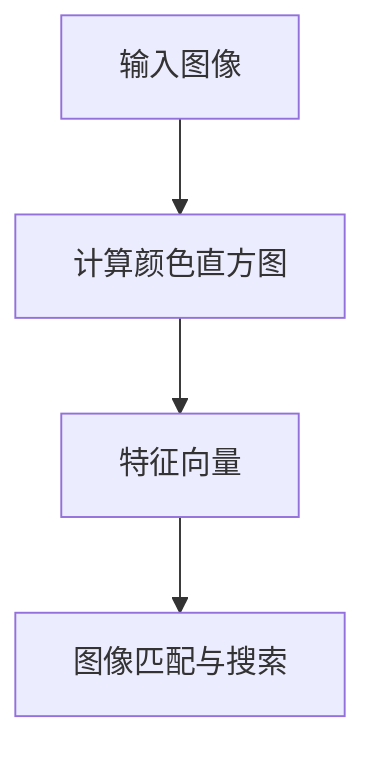
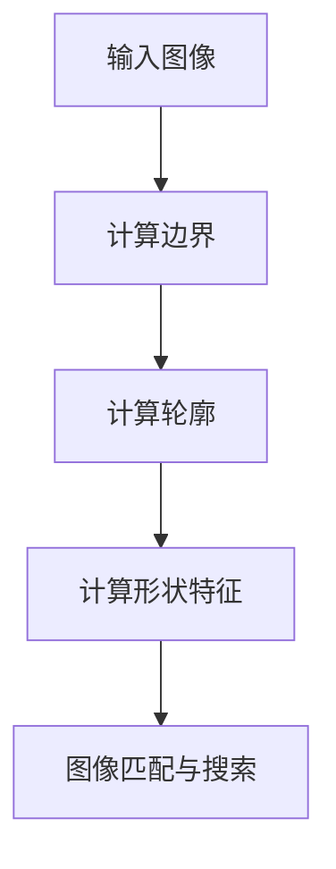
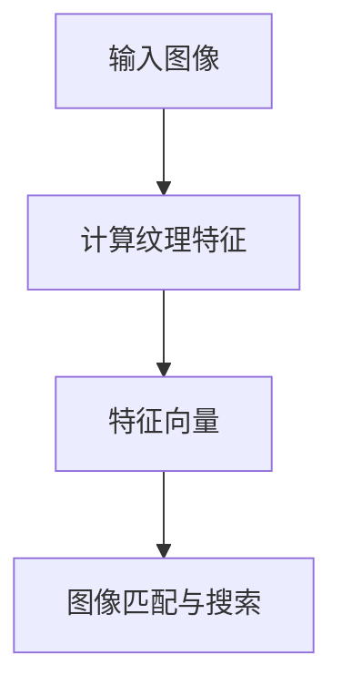
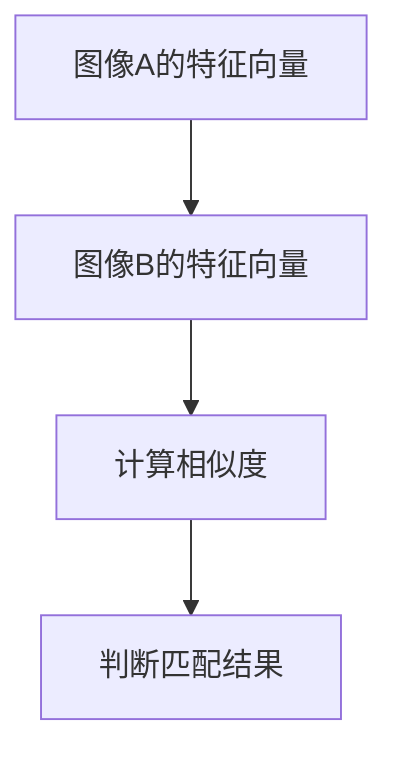

                 

# 《AI图像搜索技术应用案例》

> **关键词：AI图像搜索，图像特征提取，图像匹配，图像搜索应用场景，图像搜索系统搭建**

> **摘要：本文将从AI图像搜索技术的基础、核心算法、应用场景、实战案例等多个方面，详细解析AI图像搜索技术的原理、实现和应用，帮助读者深入理解这一前沿技术。**

### 目录

1. **AI图像搜索技术基础**  
   1.1 AI图像搜索技术概述  
   1.2 图像特征提取技术  
   1.3 图像匹配与搜索技术  
   1.4 AI图像搜索应用场景

2. **AI图像搜索技术实战**  
   2.1 AI图像搜索系统的搭建  
   2.2 图像特征提取与匹配实战  
   2.3 AI图像搜索项目的优化与评估

3. **未来发展趋势与挑战**  
   3.1 未来发展趋势  
   3.2 技术挑战与解决方案

4. **附录：相关工具与资源**

---

## 第一部分：AI图像搜索技术基础

### 第1章：AI图像搜索技术概述

AI图像搜索技术是指利用人工智能技术对图像进行搜索和分析的技术。其核心思想是通过学习大量的图像数据，提取图像的特征，然后利用这些特征进行图像的匹配和搜索。

### 第2章：图像特征提取技术

图像特征提取是AI图像搜索技术中的关键环节。其主要任务是从图像中提取具有区分性的特征，以帮助图像匹配和搜索。常见的图像特征提取方法包括基于颜色、形状和纹理的特征提取。

#### 第2.1节：基于颜色的特征提取

基于颜色的特征提取是通过计算图像的颜色直方图来进行特征提取的。这种方法简单有效，适用于一些颜色信息丰富的图像，如风景图片。

#### 第2.2节：基于形状的特征提取

基于形状的特征提取主要是通过计算图像的边界、轮廓和形状来进行特征提取的。这种方法适用于一些形状特征明显的图像，如人脸识别。

#### 第2.3节：基于纹理的特征提取

基于纹理的特征提取是通过分析图像的纹理信息来进行特征提取的。这种方法适用于一些纹理特征明显的图像，如图案识别。

### 第3章：图像匹配与搜索技术

图像匹配与搜索技术是AI图像搜索技术的核心。其主要任务是利用图像特征进行图像的匹配和搜索。

#### 第3.1节：图像匹配的基本原理

图像匹配的基本原理是通过计算两个图像特征向量的相似度来进行匹配的。常用的相似度计算方法包括欧氏距离、余弦相似度和马氏距离等。

#### 第3.2节：常见的图像匹配算法

常见的图像匹配算法包括最近邻算法、K最近邻算法、SIFT算法和SURF算法等。每种算法都有其优缺点和适用场景。

#### 第3.3节：图像搜索的优化策略

图像搜索的优化策略主要包括过滤策略、索引策略和并行搜索策略等。这些策略可以有效提高图像搜索的效率和准确性。

---

## 第二部分：AI图像搜索技术实战

### 第4章：AI图像搜索应用场景

AI图像搜索技术在多个领域都有广泛的应用，如在线零售、社交媒体、安防监控和医疗影像诊断等。

#### 第4.1节：在线零售行业的应用

在线零售行业利用AI图像搜索技术，可以实现对商品图片的智能搜索和推荐，提高用户购物体验。

---

## 附录：相关工具与资源

本文涉及的图像处理工具和资源包括OpenCV、TensorFlow和PyTorch等。同时，推荐阅读相关论文和书籍，如《计算机视觉：算法与应用》和《深度学习：简介与案例》等。

---

## 结语

AI图像搜索技术作为人工智能领域的一个重要分支，具有广泛的应用前景。通过本文的详细解析，希望读者能对AI图像搜索技术有更深入的理解和认识。

### 作者

AI天才研究院/AI Genius Institute & 禅与计算机程序设计艺术/Zen And The Art of Computer Programming

---

以上是文章正文部分的初步撰写，接下来将详细扩展每个章节的内容。由于篇幅限制，这里仅提供了一个大纲和部分章节的初步内容。接下来的部分将逐步完善每个章节，包括核心概念与联系、核心算法原理讲解、项目实战以及优化与评估等。敬请期待。

