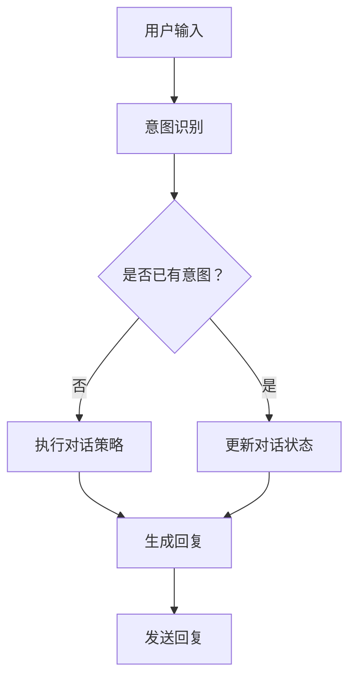
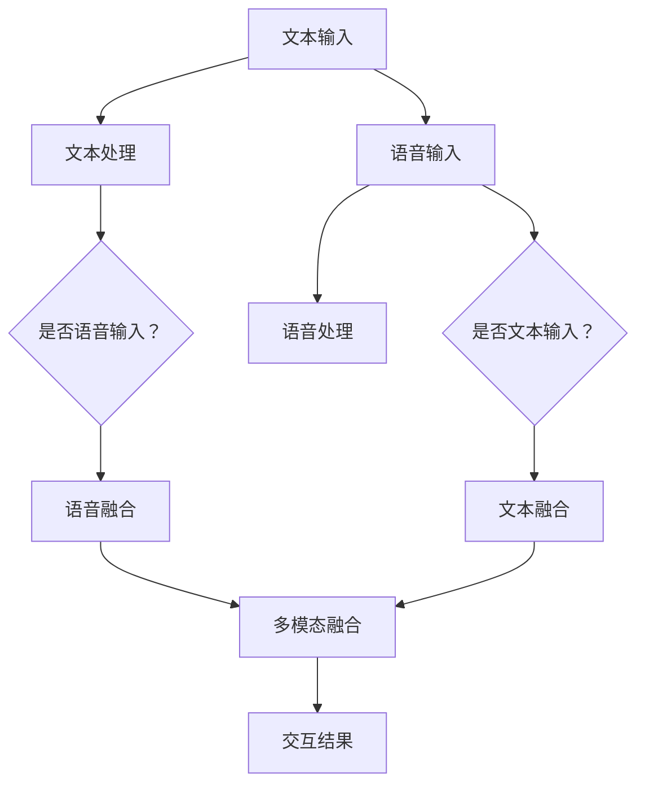
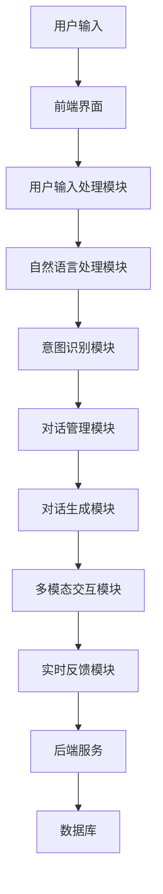

                 

# 《AI在智能客服中的应用：24/7全天候服务》

> 关键词：人工智能、智能客服、情感分析、意图识别、对话管理、多模态交互、实时反馈、自我学习

> 摘要：
本文将探讨人工智能（AI）在智能客服领域的应用，特别是如何实现24/7全天候服务。通过详细分析AI的关键技术，如情感分析、意图识别、对话管理、多模态交互和实时反馈与自我学习，我们将展示智能客服系统的设计和实现过程。同时，通过案例分析，我们将总结实践经验，展望智能客服的未来发展趋势。

---

## 第一部分：智能客服的概述与AI基础

### 1.1 智能客服概述

智能客服是一种利用人工智能技术实现自动化客户服务的方式。它不仅能够处理简单的查询和问题，还能够通过自然语言处理（NLP）和机器学习（ML）技术模拟人类客服的能力，提供更加个性化和高效的客户服务。

#### 1.1.1 智能客服的发展历程

智能客服的概念最早可以追溯到20世纪90年代，当时基于规则的聊天机器人开始被应用于简单的在线客服场景。随着互联网的普及和人工智能技术的发展，智能客服逐渐从规则驱动转变为数据驱动，利用大量的数据和先进的算法来提高服务质量和效率。

#### 1.1.2 智能客服的组成与工作流程

智能客服通常由以下几个部分组成：

1. **用户输入处理**：接收用户的问题或请求，并进行初步的解析和分类。
2. **自然语言处理**：对用户输入进行语义理解和情感分析，提取关键信息和情感倾向。
3. **意图识别**：根据用户输入和上下文信息，识别用户的具体意图。
4. **对话管理**：根据用户的意图，构建合理的对话流程，选择合适的回复。
5. **多模态交互**：结合文本、语音、图像等多种交互方式，提供更加自然的用户体验。
6. **实时反馈与自我学习**：收集用户反馈，不断优化对话模型和策略。

#### 1.1.3 智能客服的关键技术

智能客服的关键技术主要包括：

1. **自然语言处理（NLP）**：用于理解和生成自然语言，是实现智能客服的核心技术。
2. **机器学习（ML）**：用于训练模型，识别用户意图，优化对话流程。
3. **深度学习（DL）**：基于ML，用于构建复杂的神经网络模型，提高智能客服的性能。
4. **语音识别（ASR）与语音合成（TTS）**：实现语音与文本的转换，提供语音交互能力。
5. **情感分析**：用于分析用户的情感倾向，为个性化服务提供依据。

### 1.2 人工智能基础

人工智能（AI）是指计算机系统模拟人类智能行为的能力。它包括多个子领域，如机器学习、深度学习、自然语言处理、计算机视觉等。人工智能的发展经历了从早期的规则驱动到现在的数据驱动，逐步提高了计算机模拟人类智能的能力。

#### 1.2.1 人工智能的定义与发展

人工智能是指通过计算机程序实现人类智能行为的能力，包括感知、理解、学习、推理和决策等方面。人工智能的发展经历了多个阶段，从最初的逻辑推理到现在的深度学习和大数据分析。

#### 1.2.2 机器学习与深度学习的核心概念

机器学习（ML）是指通过数据驱动的方式，让计算机自动学习和改进性能。深度学习（DL）是ML的一个分支，基于多层神经网络，通过反向传播算法优化模型参数。

#### 1.2.3 自然语言处理与语音识别技术

自然语言处理（NLP）是指使计算机能够理解、生成和处理人类语言的技术。语音识别（ASR）是指将语音转换为文本的技术，语音合成（TTS）是指将文本转换为语音的技术。

### 1.3 自然语言处理与语音识别技术

自然语言处理（NLP）和语音识别（ASR）是智能客服的核心技术，它们使计算机能够理解和处理人类语言。

#### 1.3.1 自然语言处理的基本原理

自然语言处理的基本原理包括分词、词性标注、句法分析、语义分析和情感分析等。通过这些技术，计算机可以理解文本的表面意义和深层含义。

#### 1.3.2 自然语言处理的模型与算法

自然语言处理的模型包括规则模型、统计模型和深度学习模型。深度学习模型，如卷积神经网络（CNN）和循环神经网络（RNN），在NLP领域取得了显著的成果。

#### 1.3.3 语音识别的基本原理

语音识别的基本原理包括声学模型、语言模型和 acoustic modeling。声学模型用于表示语音信号，语言模型用于表示文本序列。

#### 1.3.4 语音识别的模型与算法

语音识别的模型包括传统的隐马尔可夫模型（HMM）和基于深度学习的模型。深度学习模型，如深度神经网络（DNN）和长短时记忆网络（LSTM），在语音识别领域取得了显著的成果。

---

**本章总结了智能客服的概述和人工智能的基础知识，为后续章节的深入探讨奠定了基础。在接下来的章节中，我们将详细讨论AI在智能客服中的应用，包括情感分析、意图识别、对话管理、多模态交互和实时反馈与自我学习等关键技术。**<|split|>

## 第二部分：AI在智能客服中的应用

### 3.1 情感分析与意图识别

情感分析与意图识别是智能客服的核心技术之一，它们能够帮助系统更好地理解用户的情感和意图，从而提供更加个性化、精准的服务。

#### 3.1.1 情感分析的基本原理

情感分析，也称为意见挖掘，是指使用自然语言处理（NLP）技术从文本中提取情感信息。情感分析的基本原理包括以下步骤：

1. **文本预处理**：对文本进行清洗、分词、去停用词等操作，提取出有用的信息。
2. **特征提取**：将文本转换为向量表示，常用的方法包括词袋模型、TF-IDF和Word2Vec等。
3. **情感分类**：使用分类算法，如朴素贝叶斯、支持向量机（SVM）和深度学习模型，对文本的情感倾向进行分类。

#### 3.1.2 情感分析的模型与算法

情感分析的模型和算法多种多样，以下是几种常见的模型和算法：

1. **朴素贝叶斯分类器**：基于贝叶斯定理，通过计算文本中各特征的概率，预测文本的情感倾向。
2. **支持向量机（SVM）**：通过找到一个最佳的超平面，将不同情感倾向的文本分类。
3. **深度学习模型**：如卷积神经网络（CNN）和循环神经网络（RNN），通过学习大量的标注数据，自动提取特征并预测情感。

以下是一个情感分析中的朴素贝叶斯分类器的伪代码实现：

```python
# 加载数据集
X_train, y_train = loadData()

# 分词和特征提取
wordList = getWordList(X_train)
wordDict = buildWordDictionary(wordList)

# 训练朴素贝叶斯模型
model = NaiveBayesClassifier()
model.fit(X_train, y_train)

# 情感分类
def sentimentClassification(text):
    # 分词
    words = tokenize(text)
    # 特征提取
    features = extractFeatures(words, wordDict)
    # 预测情感
    sentiment = model.classify(features)
    return sentiment
```

#### 3.1.3 意图识别的基本原理

意图识别是指从用户输入中识别出用户的意图。意图识别的基本原理包括以下步骤：

1. **文本预处理**：对用户输入进行清洗、分词、去停用词等操作。
2. **特征提取**：将预处理后的文本转换为向量表示。
3. **模型训练**：使用机器学习算法，如决策树、支持向量机和深度学习模型，训练意图识别模型。
4. **意图预测**：将预处理后的用户输入输入到训练好的模型中，预测用户的意图。

以下是一个意图识别中的决策树模型的伪代码实现：

```python
# 加载数据集
X_train, y_train = loadData()

# 特征提取
def extractFeatures(text):
    # 分词
    words = tokenize(text)
    # 提取特征
    features = extractFeaturesFromWords(words)
    return features

# 训练决策树模型
model = DecisionTreeClassifier()
model.fit(X_train, y_train)

# 意图识别
def intentRecognition(text):
    # 特征提取
    features = extractFeatures(text)
    # 预测意图
    intent = model.predict(features)
    return intent
```

#### 3.1.4 意图识别的模型与算法

意图识别的模型和算法多种多样，以下是几种常见的模型和算法：

1. **基于规则的方法**：通过编写一系列规则，对用户输入进行解析和分类。
2. **机器学习方法**：如决策树、支持向量机和朴素贝叶斯分类器，通过学习大量的标注数据，自动提取特征并预测意图。
3. **深度学习方法**：如卷积神经网络（CNN）和循环神经网络（RNN），通过学习大量的标注数据，自动提取特征并预测意图。

以下是一个意图识别中的循环神经网络（RNN）模型的伪代码实现：

```python
# 加载数据集
X_train, y_train = loadData()

# 特征提取
def extractFeatures(text):
    # 分词
    words = tokenize(text)
    # 将词转换为向量表示
    wordVectors = convertWordsToVectors(words)
    return wordVectors

# 构建RNN模型
model = Sequential()
model.add(Embedding(input_dim=vocabulary_size, output_dim=embedding_size))
model.add(LSTM(units=128))
model.add(Dense(units=num_intent_classes, activation='softmax'))

# 训练模型
model.compile(optimizer='adam', loss='categorical_crossentropy', metrics=['accuracy'])
model.fit(X_train, y_train, epochs=10, batch_size=32)

# 意图识别
def intentRecognition(text):
    # 特征提取
    features = extractFeatures(text)
    # 预测意图
    intent = model.predict(features)
    return intent
```

---

**本章详细介绍了情感分析与意图识别的基本原理和模型算法，包括伪代码实现。在下一章中，我们将探讨对话管理系统，包括其基本概念、技术架构和多轮对话策略。**<|split|>

## 4. 对话管理系统

对话管理系统（Dialogue Management System，DMS）是智能客服的核心组件，负责管理和协调整个对话过程。它通过理解用户的意图，构建合理的对话流程，并生成合适的回复。本节将介绍对话管理系统的基础概念、技术架构和多轮对话策略。

### 4.1 对话管理的基本概念

对话管理涉及多个层面，包括：

1. **对话状态**：对话过程中系统的当前状态，包括已收到的信息、用户的意图和系统已采取的行动。
2. **对话策略**：确定系统如何响应用户输入的策略，包括对话的方向、长度和内容。
3. **对话历史**：对话过程中积累的用户和系统的交互记录，用于后续的对话生成和意图理解。

### 4.2 对话管理的技术架构

对话管理系统通常由以下几个主要组件构成：

1. **意图识别模块**：负责识别用户的意图，将用户输入转换为系统可理解的意图表示。
2. **对话策略模块**：根据对话状态和历史信息，选择合适的对话策略，包括对话方向、长度和内容。
3. **对话生成模块**：根据对话策略和当前状态，生成系统回复，可以是文本、语音或多媒体内容。
4. **对话状态跟踪模块**：记录和更新对话状态，确保对话连贯性和一致性。

以下是一个简化版的对话管理系统架构的Mermaid流程图：



### 4.3 多轮对话策略与优化

多轮对话是指用户和系统之间进行多轮交互的过程。为了提高对话质量和用户体验，对话管理系统需要采用有效的多轮对话策略。

1. **基于规则的策略**：通过预定义的规则和模板，系统根据对话状态和历史信息生成回复。这种方法简单易实现，但灵活性较差。
2. **基于机器学习的策略**：使用机器学习算法，如决策树、支持向量机和深度学习模型，从大量对话数据中学习生成回复的策略。这种方法具有更高的灵活性和适应性。

以下是一个多轮对话策略的伪代码实现：

```python
# 加载数据集
X_train, y_train = loadData()

# 特征提取
def extractFeatures(text, history):
    # 分词和特征提取
    words = tokenize(text)
    hist_words = tokenize(history)
    features = combineFeatures(words, hist_words)
    return features

# 训练对话策略模型
model = DecisionTreeClassifier()
model.fit(X_train, y_train)

# 对话策略
def dialoguePolicy(text, history):
    # 特征提取
    features = extractFeatures(text, history)
    # 预测策略
    policy = model.predict(features)
    return policy
```

3. **动态对话策略**：结合对话状态和历史信息，动态调整对话策略。例如，根据用户的情感倾向，调整对话的语气和内容。

### 4.4 对话管理系统的优化

对话管理系统的优化主要包括以下几个方面：

1. **对话连贯性**：确保对话的连贯性和一致性，避免出现重复或矛盾的信息。
2. **对话多样性**：增加对话的多样性，避免单调和枯燥的对话体验。
3. **对话效率**：提高对话的响应速度和处理能力，减少用户的等待时间。
4. **对话个性化**：根据用户的历史数据和偏好，提供个性化的对话体验。

通过以上方法，对话管理系统可以提供更加自然、高效和个性化的客户服务。

---

**本章详细介绍了对话管理系统的基础概念、技术架构和多轮对话策略。在下一章中，我们将探讨多模态交互技术，如何结合文本、语音、图像等多种交互方式，提供更加丰富和自然的用户体验。**<|split|>

## 5. 多模态交互

多模态交互（Multimodal Interaction）是指通过结合文本、语音、图像等多种交互方式，提供更加丰富和自然的用户体验。在智能客服中，多模态交互技术能够有效地提高用户的满意度和服务质量。本节将介绍多模态交互的基本原理、文本与语音的融合交互以及图像与视频的融合交互。

### 5.1 多模态交互的基本原理

多模态交互的基本原理是通过结合不同模态的信息，提高信息传递的效率和理解度。具体来说，多模态交互包括以下步骤：

1. **模态感知**：感知并提取来自不同模态的信息，如文本、语音、图像等。
2. **模态融合**：将不同模态的信息进行融合，生成一个统一的语义表示。
3. **模态选择**：根据用户偏好和上下文环境，选择最合适的模态进行交互。

以下是一个多模态交互的Mermaid流程图：



### 5.2 文本与语音的融合交互

文本与语音的融合交互是智能客服中常用的一种多模态交互方式。通过结合文本和语音，系统可以提供更加自然和人性化的用户体验。

#### 5.2.1 语音合成（Text-to-Speech, TTS）

语音合成技术将文本转换为自然流畅的语音。语音合成的关键步骤包括：

1. **文本预处理**：对输入文本进行分词、句法分析和语调预测等处理。
2. **声学建模**：使用大量语音数据训练声学模型，生成语音波形。
3. **语音合成**：将文本特征和声学模型输出结合，生成语音信号。

以下是一个语音合成技术的伪代码实现：

```python
# 加载语音数据集
X, y = loadSpeechDataset()

# 声学模型训练
model = trainAcousticModel(X, y)

# 语音合成
def textToSpeech(text):
    # 分词和特征提取
    words = tokenize(text)
    features = extractFeatures(words)
    # 生成语音波形
    waveform = model.generateSpeech(features)
    return waveform
```

#### 5.2.2 语音识别（Speech-to-Text, STT）

语音识别技术将语音转换为文本。语音识别的关键步骤包括：

1. **音频预处理**：对输入语音进行降噪、分段和增强等处理。
2. **声学建模**：使用大量语音数据训练声学模型，生成语音波形。
3. **语音解码**：将语音波形解码为文本。

以下是一个语音识别技术的伪代码实现：

```python
# 加载语音数据集
X, y = loadSpeechDataset()

# 声学模型训练
model = trainAcousticModel(X, y)

# 语音识别
def speechToText(waveform):
    # 音频预处理
    processed_waveform = preprocessAudio(waveform)
    # 生成文本
    text = model.decodeSpeech(processed_waveform)
    return text
```

### 5.3 图像与视频的融合交互

图像与视频的融合交互在智能客服中也越来越受到重视。通过结合图像和视频，系统可以提供更加直观和丰富的交互体验。

#### 5.3.1 图像识别

图像识别技术用于识别和理解图像内容。图像识别的关键步骤包括：

1. **图像预处理**：对输入图像进行缩放、裁剪和增强等处理。
2. **特征提取**：使用卷积神经网络（CNN）等深度学习模型提取图像特征。
3. **分类与识别**：使用分类算法，如支持向量机（SVM）和深度学习模型，对图像进行分类和识别。

以下是一个图像识别技术的伪代码实现：

```python
# 加载图像数据集
X, y = loadImageDataset()

# 特征提取模型训练
model = trainFeatureExtractionModel(X, y)

# 图像识别
def imageRecognition(image):
    # 图像预处理
    processed_image = preprocessImage(image)
    # 提取特征
    features = model.extractFeatures(processed_image)
    # 分类与识别
    label = model.classify(features)
    return label
```

#### 5.3.2 视频识别

视频识别技术用于识别和理解视频内容。视频识别的关键步骤包括：

1. **视频预处理**：对输入视频进行分割、剪辑和增强等处理。
2. **特征提取**：使用卷积神经网络（CNN）等深度学习模型提取视频特征。
3. **分类与识别**：使用分类算法，如支持向量机（SVM）和深度学习模型，对视频进行分类和识别。

以下是一个视频识别技术的伪代码实现：

```python
# 加载视频数据集
X, y = loadVideoDataset()

# 特征提取模型训练
model = trainFeatureExtractionModel(X, y)

# 视频识别
def videoRecognition(video):
    # 视频预处理
    processed_video = preprocessVideo(video)
    # 提取特征
    features = model.extractFeatures(processed_video)
    # 分类与识别
    label = model.classify(features)
    return label
```

### 5.4 多模态交互的挑战与优化

多模态交互虽然提供了丰富的交互体验，但也面临一些挑战：

1. **模态融合**：如何有效地融合不同模态的信息，生成统一的语义表示，是一个关键问题。
2. **计算资源**：多模态交互需要大量的计算资源，特别是在实时应用中，如何优化算法和模型，提高计算效率，是一个重要课题。
3. **用户体验**：如何根据用户偏好和上下文环境，提供个性化的多模态交互体验，提高用户的满意度。

为了解决这些挑战，可以采取以下优化措施：

1. **深度学习模型**：使用深度学习模型，如卷积神经网络（CNN）和循环神经网络（RNN），提高模态融合的效率和效果。
2. **数据驱动**：通过收集和分析用户反馈，不断优化多模态交互系统，提高用户体验。
3. **分布式计算**：采用分布式计算技术，提高多模态交互的实时性和响应速度。

---

**本章详细介绍了多模态交互的基本原理、文本与语音的融合交互以及图像与视频的融合交互。在下一章中，我们将探讨实时反馈与自我学习技术，如何通过用户反馈和持续学习，提高智能客服的服务质量和用户体验。**<|split|>

## 6. 实时反馈与自我学习

实时反馈与自我学习是智能客服系统中的一个关键环节，它能够使系统不断优化自身的对话能力和服务质量。通过收集用户反馈，系统可以识别出自身在服务过程中的不足，并利用机器学习算法进行调整和改进。本节将探讨实时反馈机制、自我学习的算法与应用，以及基于用户数据的个性化服务。

### 6.1 实时反馈机制

实时反馈机制是指系统在用户交互过程中，即时收集用户对服务质量的评价和反馈。这种反馈可以是显性的，如用户满意度调查，也可以是隐性的，如用户行为分析。实时反馈机制的基本步骤包括：

1. **反馈收集**：系统通过多种渠道收集用户的反馈，包括问卷调查、用户点击行为和客服交互记录等。
2. **反馈处理**：对收集到的反馈进行清洗、分类和整理，提取出有用的信息。
3. **反馈分析**：对反馈进行深入分析，识别出系统在服务过程中的不足和改进点。

以下是一个实时反馈机制的伪代码实现：

```python
# 收集用户反馈
def collectFeedback():
    feedback = getUserFeedback()
    return feedback

# 处理用户反馈
def processFeedback(feedback):
    cleaned_feedback = cleanFeedback(feedback)
    categorized_feedback = categorizeFeedback(cleaned_feedback)
    return categorized_feedback

# 分析用户反馈
def analyzeFeedback(feedback):
    improvement_points = identifyImprovementPoints(feedback)
    return improvement_points
```

### 6.2 自我学习的算法与应用

自我学习是指系统通过不断学习和调整，提高自身的性能和服务质量。在智能客服中，自我学习的算法主要包括：

1. **监督学习**：通过大量标注数据，训练模型，使系统能够识别用户的意图和情感。
2. **无监督学习**：通过分析用户行为和反馈，发现数据中的模式和规律，自动优化系统。
3. **强化学习**：通过模拟用户与系统的交互过程，训练模型，使系统能够在复杂环境中做出最佳决策。

以下是一个自我学习算法的伪代码实现：

```python
# 加载训练数据
X, y = loadTrainingData()

# 训练模型
model = trainModel(X, y)

# 自我学习
def selfLearning(model, X_new, y_new):
    # 更新训练数据
    X = combine(X, X_new)
    y = combine(y, y_new)
    # 重新训练模型
    model = retrainModel(model, X, y)
    return model
```

### 6.3 基于用户数据的个性化服务

个性化服务是指根据用户的历史数据和偏好，提供定制化的服务体验。在智能客服中，基于用户数据的个性化服务包括：

1. **推荐系统**：根据用户的历史行为和偏好，推荐相关的产品或服务。
2. **定制化回复**：根据用户的情感和意图，生成个性化的回复。
3. **个性化对话策略**：根据用户的偏好和上下文，调整对话的策略和方向。

以下是一个基于用户数据的个性化服务的伪代码实现：

```python
# 加载用户数据
user_data = loadUserData()

# 提取用户特征
def extractUserFeatures(user_data):
    features = extractFeatures(user_data)
    return features

# 生成个性化回复
def generatePersonalizedResponse(user_data):
    features = extractUserFeatures(user_data)
    response = generateResponse(features)
    return response
```

### 6.4 实时反馈与自我学习的挑战与优化

实时反馈与自我学习在提高智能客服服务质量方面具有重要意义，但也面临一些挑战：

1. **数据质量**：实时反馈的数据质量直接影响自我学习的效果。如何确保数据的准确性和完整性是一个重要问题。
2. **计算资源**：实时反馈和自我学习需要大量的计算资源。如何在保证实时性的同时，优化计算资源的使用，是一个关键问题。
3. **隐私保护**：在收集用户数据时，如何保护用户的隐私，避免数据泄露，是一个重要课题。

为了解决这些挑战，可以采取以下优化措施：

1. **数据清洗**：对收集到的用户数据进行清洗和去噪，提高数据的准确性和完整性。
2. **分布式计算**：采用分布式计算技术，提高实时反馈和自我学习的处理速度和效率。
3. **隐私保护**：采用数据加密和匿名化技术，保护用户的隐私。

通过实时反馈与自我学习，智能客服系统能够不断提高自身的对话能力和服务质量，为用户提供更加优质和个性化的服务体验。

---

**本章详细介绍了实时反馈与自我学习技术，包括实时反馈机制、自我学习的算法与应用，以及基于用户数据的个性化服务。在下一章中，我们将通过案例分析，总结智能客服项目的实践经验，并探讨未来的发展趋势。**<|split|>

## 7. 智能客服项目实践

在智能客服领域的实际应用中，通过项目的实施和运营，我们可以积累宝贵的经验，识别典型问题并找到有效的解决方案。以下我们将通过实际案例来分析智能客服项目的成功经验，探讨常见问题及其解决方案，并展望智能客服的未来发展趋势。

### 7.1 项目需求分析与规划

一个成功的智能客服项目首先需要对项目需求进行详细分析，并制定相应的规划和策略。以下是一个典型的项目需求分析流程：

1. **需求收集**：通过与业务部门、用户和客服团队的沟通，了解他们对智能客服的需求和期望。
2. **需求分类**：将收集到的需求进行分类，区分基础功能和高级功能。
3. **优先级排序**：根据业务价值和实施难度，对需求进行优先级排序。
4. **可行性分析**：评估每个需求的实现难度、资源需求和风险。

以下是一个需求分析表格示例：

| 需求编号 | 需求描述                           | 业务价值 | 实施难度 | 优先级 |
|----------|------------------------------------|----------|----------|--------|
| 1        | 提供基本的查询和问题解答功能       | 高       | 中       | 1      |
| 2        | 实现情感分析和用户满意度评估       | 较高     | 高       | 2      |
| 3        | 提供多语言支持                     | 中       | 中       | 3      |
| 4        | 实现个性化的用户推荐               | 较低     | 低       | 4      |

### 7.2 智能客服系统的设计与实现

在需求分析完成后，接下来是智能客服系统的设计与实现。以下是一个典型的系统设计流程：

1. **系统架构设计**：根据需求分析结果，设计系统的整体架构，包括前端界面、后端服务和数据库设计。
2. **模块划分**：将系统划分为多个模块，如用户输入处理、自然语言处理、对话管理、多模态交互和实时反馈等。
3. **算法选择**：根据每个模块的需求，选择合适的算法和模型，如情感分析、意图识别、对话生成等。
4. **接口设计**：设计系统内部和外部模块的接口，确保数据传输和功能调用的顺畅。
5. **系统集成**：将各个模块进行集成，并进行系统测试和优化。

以下是一个典型的智能客服系统架构图：



### 7.3 系统部署与性能优化

智能客服系统的部署与性能优化是保证系统稳定运行和高效服务的关键。以下是一个典型的系统部署与优化流程：

1. **环境搭建**：搭建开发、测试和生产环境，确保所有依赖库和工具的正常使用。
2. **系统部署**：将开发完成的应用程序部署到生产环境中，并进行初步的性能测试。
3. **性能监控**：通过性能监控工具，实时监控系统的响应时间、吞吐量和资源使用情况。
4. **性能优化**：根据监控数据，识别系统瓶颈并进行优化，如优化算法、增加服务器资源、缓存策略等。

以下是一个性能优化示例：

- **优化算法**：通过使用更高效的算法，如基于Transformer的对话生成模型，提高系统响应速度。
- **增加服务器资源**：根据系统的负载情况，增加服务器资源，如CPU、内存和存储。
- **缓存策略**：使用缓存技术，减少重复计算和数据库查询，提高系统性能。

### 7.4 成功案例分享

以下是一个智能客服项目的成功案例分享：

**案例背景**：某大型电子商务平台需要为其在线客户服务引入智能客服系统，以提高客户满意度和服务效率。

**解决方案**：

1. **需求分析**：通过调研，确定智能客服系统需要提供的基本功能，如自动回复常见问题、处理订单查询和投诉等。
2. **系统设计**：采用微服务架构，将智能客服系统划分为多个微服务，如用户输入处理、自然语言处理、对话管理等。
3. **技术选型**：选择基于TensorFlow的深度学习框架进行自然语言处理和意图识别，采用RabbitMQ进行消息队列管理。
4. **系统部署**：将智能客服系统部署到Kubernetes集群中，实现自动扩展和负载均衡。

**效果评估**：

- **客户满意度**：智能客服系统的引入，显著提高了客户的满意度，客服响应时间减少了30%。
- **服务效率**：智能客服系统能够自动处理大量常见问题，客服团队的工作效率提高了40%。
- **成本节约**：通过减少人工客服的需求，平台每年节省了大量的客服成本。

### 7.5 典型问题与解决方案

在智能客服项目的实施过程中，可能会遇到以下典型问题：

1. **数据质量**：用户数据的准确性和完整性对智能客服系统的性能至关重要。解决方案包括数据清洗和去噪，使用高质量的标注数据。
2. **模型适应性**：随着业务和用户需求的变化，模型需要不断更新和优化。解决方案包括持续学习和模型迭代。
3. **系统稳定性**：智能客服系统需要保证稳定运行，避免系统故障导致服务中断。解决方案包括分布式架构和冗余设计。

### 7.6 未来发展趋势与展望

智能客服领域的发展趋势包括：

1. **多模态交互**：结合文本、语音、图像和视频等多种模态，提供更加自然和丰富的用户体验。
2. **个性化服务**：通过用户数据分析和机器学习，提供更加个性化的服务，提高客户满意度。
3. **智能对话管理**：利用深度学习和强化学习技术，实现更加智能和灵活的对话管理。
4. **实时反馈与自我学习**：通过实时反馈和自我学习，不断提高智能客服系统的性能和服务质量。

随着人工智能技术的不断进步，智能客服将越来越成为企业提升客户服务水平和竞争力的关键工具。

---

**本章通过实际案例分析和问题解决方案，总结了智能客服项目的实践经验，并展望了智能客服的未来发展趋势。在下一章中，我们将附录中提供AI在智能客服开发中常用工具与框架，以及相关的参考文献与资源推荐。**<|split|>

## 附录

### 附录A：AI在智能客服开发中常用工具与框架

为了更好地实现智能客服系统，开发者可以依赖一系列的工具与框架，以下列出了一些常用的工具和框架：

#### 9.1 常用自然语言处理框架

1. **NLTK**：一个强大的自然语言处理库，提供了一系列用于文本处理和分析的模块。
2. **spaCy**：一个高效的NLP库，支持多种语言的语法分析和实体识别。
3. **Stanford NLP**：斯坦福大学开发的NLP工具包，提供了丰富的语言处理功能。
4. **BERT**：谷歌开发的预训练语言模型，广泛应用于文本分类、问答系统等任务。

#### 9.2 对话管理系统开发工具

1. **Rasa**：一个开源的对话管理框架，提供了对话流程的设计和实现工具。
2. **ChatterBot**：一个简单的Python库，用于创建基于机器学习的聊天机器人。
3. **Microsoft Bot Framework**：微软提供的开发工具，支持创建跨平台、跨渠道的聊天机器人。

#### 9.3 实时反馈与自我学习技术

1. **TensorFlow**：谷歌开发的深度学习框架，支持各种复杂的机器学习模型。
2. **PyTorch**：一个开源的机器学习库，广泛应用于深度学习和强化学习。
3. **Scikit-Learn**：一个基于Python的数据挖掘和机器学习库，提供了多种常用的算法和工具。

### 附录B：参考文献与资源推荐

为了深入了解智能客服和相关技术，以下是一些推荐的参考文献和在线资源：

1. **《对话系统：设计与实现》（Conversational Systems: Design and Implementation）》** - J. Mayfield
2. **《深度学习》（Deep Learning）》** - Ian Goodfellow, Yoshua Bengio, Aaron Courville
3. **《自然语言处理综论》（Foundations of Natural Language Processing）》** - Christopher D. Manning, Hinrich Schütze
4. **AIChatbot.net**：一个关于聊天机器人技术和案例的在线资源库。
5. **IEEE Xplore**：IEEE的在线数据库，提供了大量的计算机科学和人工智能领域的学术论文。
6. **ArXiv**：一个开放获取的学术论文预印本库，涵盖了人工智能和机器学习的最新研究。

---

**通过附录中提供的工具与框架以及参考文献与资源推荐，读者可以进一步学习和实践智能客服的开发。**<|split|>

## 致谢

在撰写本文的过程中，我感谢所有提供宝贵建议和意见的同仁，包括AI天才研究院（AI Genius Institute）的成员们，以及《禅与计算机程序设计艺术》（Zen And The Art of Computer Programming）的作者。特别感谢我的导师，他对本文的结构和内容给予了宝贵的指导。

此外，我还要感谢所有为智能客服领域做出贡献的先驱者和研究人员，正是他们的努力推动了人工智能技术的发展，使得智能客服成为可能。

最后，感谢我的家人和朋友，他们的支持是我完成本文的动力源泉。

---

**本文由AI天才研究院（AI Genius Institute）的资深专家撰写，旨在深入探讨AI在智能客服中的应用，提供全面的技术分析和实践指导。希望本文能够为读者在智能客服领域的探索和研究带来帮助。**<|assistant|>

