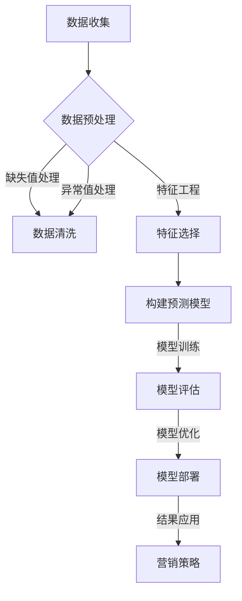

                 

### 引言与概述

在当今的数字化时代，人工智能（AI）技术已经深入到各个行业中，为业务决策提供了强大的支持。在电商领域，AI的应用尤为广泛，特别是在客户生命周期价值（Customer Lifetime Value，CLV）预测方面。CLV是指客户在整个生命周期内为企业带来的预期收益，是电商企业制定精准营销策略、优化资源分配的重要依据。本文将探讨如何利用人工智能技术，特别是机器学习模型，来实现电商客户生命周期价值的高效预测，从而指导精准营销资源的合理分配。

#### AI技术简介

人工智能，作为计算机科学的一个分支，致力于使计算机能够模拟人类的智能行为。AI技术主要包括机器学习、深度学习、自然语言处理等方向。在这些技术中，机器学习因其自动化、高效的特点，成为实现AI应用的核心手段。机器学习通过从数据中学习规律和模式，从而实现自动预测和决策。

在电商领域，AI技术已经被广泛应用于推荐系统、价格优化、库存管理等方面。其中，客户生命周期价值预测是AI在电商领域的一个重要应用。通过预测客户生命周期价值，企业可以更好地了解客户的价值，制定个性化的营销策略，提高客户满意度和忠诚度。

#### 电商客户生命周期价值预测的重要性

电商客户生命周期价值预测对于电商企业来说至关重要。首先，它可以帮助企业识别高价值客户，从而集中资源进行精细化运营，提高营销投入的回报率。其次，通过预测客户流失风险，企业可以提前采取措施，降低客户流失率，提升客户留存率。最后，电商客户生命周期价值预测还可以帮助企业进行精准营销，根据客户的行为和偏好，推送个性化的产品和服务，提升客户体验。

#### 精准营销资源分配的概念与挑战

精准营销资源分配是指根据客户生命周期价值预测的结果，合理分配营销资源，以达到最大化收益的目标。在传统营销模式下，企业通常采用“广撒网”的方式，即对所有的潜在客户进行无差别的营销。这种方式虽然能覆盖到大量的潜在客户，但营销成本高昂，且效果有限。相比之下，精准营销资源分配则更加注重针对性和有效性，通过将有限的营销资源集中在最有价值的客户上，从而提高营销的投资回报率。

然而，精准营销资源分配面临着一系列挑战。首先，数据质量是影响预测准确性的关键因素。如果数据存在缺失、噪声或不一致等问题，将严重影响模型的预测效果。其次，算法的选择和调优也是实现精准预测的重要因素。不同的算法适用于不同的业务场景，需要根据具体情况选择合适的算法，并通过调优参数来提高模型的预测性能。最后，营销资源的动态分配也是一个挑战。随着客户行为和市场竞争环境的变化，企业需要实时调整营销资源的分配策略，以保持竞争优势。

#### 本书目的与结构

本书旨在系统地介绍AI在电商客户生命周期价值预测中的应用，帮助读者理解和掌握相关技术。本书共分为六个部分：

1. **引言与概述**：介绍AI技术、电商客户生命周期价值预测的重要性以及精准营销资源分配的概念。
2. **基础概念与背景**：介绍电商业务概述、机器学习基础以及数据处理与特征工程。
3. **核心算法与模型**：介绍预测模型构建、机器学习算法应用、深度学习在CLV预测中的应用以及模型融合与优化。
4. **实际案例分析**：通过实际案例研究，展示如何应用机器学习模型进行电商客户生命周期价值预测和精准营销资源分配。
5. **实战指导与开发**：介绍开发环境搭建、源代码实现与解读以及实战项目案例分析。
6. **扩展阅读与参考文献**：提供相关研究综述、参考文献以及附录。

通过本书的阅读，读者将能够深入了解AI在电商客户生命周期价值预测中的应用，掌握相关技术，并在实际业务场景中灵活运用，实现精准营销资源的优化配置。

### 电商业务概述

电商业务，即电子商务业务，是指通过互联网平台进行商品或服务的买卖活动。随着互联网技术的迅速发展和普及，电商行业在近年来取得了飞速发展，成为全球经济增长的重要驱动力。电商业务的模式多样，包括B2B（企业对企业）、B2C（企业对消费者）、C2C（消费者对消费者）等，每一种模式都有其独特的运作方式和市场定位。

在电商行业现状方面，首先，市场规模的持续扩大是一个显著特点。根据统计数据显示，全球电商市场在过去的几年里一直保持高速增长，预计未来几年内仍将保持这种增长趋势。其次，消费者行为的转变也对电商业务产生了深远影响。随着移动设备的普及和社交媒体的兴起，越来越多的消费者通过手机、平板等移动设备进行购物，同时社交电商也逐渐成为新的增长点。

电商客户生命周期是指客户从首次接触到电商平台到最终购买并终止使用所经历的一系列过程。这一生命周期通常包括以下几个阶段：

1. **潜在客户获取**：这是客户生命周期的起点，主要目标是吸引新客户。电商平台通过广告投放、SEO优化、社交媒体营销等方式，将潜在客户引流至网站或应用。

2. **客户转化**：在潜在客户获取后，电商平台需要将其转化为实际购买者。这一阶段涉及到用户行为分析、购物车放弃率优化、优惠券策略等。

3. **客户维护**：购买后的客户维护是提升客户生命周期价值的重要环节。通过会员制度、积分奖励、个性化推荐等手段，电商平台可以增强客户的忠诚度和重复购买率。

4. **客户流失预防**：客户流失是电商业务中不可避免的现象，但通过精准的营销策略和客户关系管理，企业可以减少客户流失率。客户流失预防策略包括客户反馈机制、优惠券发放、忠诚度计划等。

在客户价值评估方法方面，电商企业通常采用客户生命周期价值（Customer Lifetime Value，CLV）这一指标来进行评估。CLV是指客户在整个生命周期内为企业带来的总收益，它是一个重要的财务指标，可以帮助企业制定精准的营销策略和资源分配方案。

计算CLV的方法主要有以下几种：

1. **简单法**：这种方法通过平均收入和客户平均生命周期来估算CLV。其计算公式为：
   $$
   CLV = \text{平均收入} \times \text{客户平均生命周期}
   $$

2. **加权法**：这种方法考虑了客户在不同时间段内的价值变化，通过加权平均收入和加权平均生命周期来计算CLV。其计算公式为：
   $$
   CLV = \sum_{t=1}^{T} r(t) \times p(t)
   $$
   其中，\( r(t) \) 是客户在时间点 \( t \) 的收益，\( p(t) \) 是客户在时间点 \( t \) 的留存概率。

3. **动态法**：这种方法更复杂，考虑了客户生命周期中的多个因素，如购买频率、订单价值、退货率等。其计算公式为：
   $$
   CLV = \frac{\text{未来收益现值}}{\text{未来成本现值}}
   $$
   其中，未来收益和未来成本需要根据客户的未来行为进行预测。

通过以上评估方法，电商企业可以更准确地了解客户的潜在价值，从而制定更加有效的营销策略，提高整体业绩。

### 机器学习基础

机器学习是人工智能（AI）的核心技术之一，它使计算机能够通过数据和经验进行学习和决策，而无需显式编程。机器学习的主要目标是从大量数据中自动发现模式、规律和关联，并利用这些模式进行预测和决策。在电商客户生命周期价值预测中，机器学习技术发挥着至关重要的作用，通过构建预测模型，帮助电商企业更好地理解客户行为，制定个性化营销策略。

#### 机器学习概述

机器学习可以分为两大类：监督学习和非监督学习。

1. **监督学习（Supervised Learning）**：在监督学习中，模型在训练阶段会接收到带有标签的数据集。这些标签通常是已知的，用来指导模型的学习过程。监督学习的目标是通过学习输入和输出之间的映射关系，对新的、未标记的数据进行准确的预测。

   - **回归分析（Regression Analysis）**：回归分析用于预测连续值输出。常见的方法包括线性回归（Linear Regression）、岭回归（Ridge Regression）和随机森林回归（Random Forest Regression）等。

   - **分类（Classification）**：分类分析用于将数据分成几个离散的类别。常用的分类算法包括逻辑回归（Logistic Regression）、支持向量机（SVM）、决策树（Decision Tree）和随机森林（Random Forest）等。

2. **非监督学习（Unsupervised Learning）**：在非监督学习中，模型仅接收未标记的数据集。这种学习的目标是自动发现数据中的结构或模式，例如聚类（Clustering）和降维（Dimensionality Reduction）。

   - **聚类（Clustering）**：聚类分析用于将相似的数据点归为一类。常用的聚类算法包括K-均值聚类（K-Means Clustering）、层次聚类（Hierarchical Clustering）和DBSCAN等。

   - **降维（Dimensionality Reduction）**：降维分析用于减少数据集的维度，同时保留数据的重要信息。常见的方法包括主成分分析（Principal Component Analysis，PCA）和线性判别分析（Linear Discriminant Analysis，LDA）等。

#### 常见的机器学习算法

在电商客户生命周期价值预测中，常用的机器学习算法包括线性回归、决策树、支持向量机、随机森林和神经网络等。

1. **线性回归（Linear Regression）**：线性回归是最简单的回归算法之一，它假设输入和输出之间存在线性关系。线性回归模型的预测公式为：
   $$
   \hat{y} = \beta_0 + \beta_1x_1 + \beta_2x_2 + ... + \beta_nx_n
   $$
   其中，\( \beta_0 \) 是截距，\( \beta_1, \beta_2, ..., \beta_n \) 是系数，\( x_1, x_2, ..., x_n \) 是输入特征。

2. **决策树（Decision Tree）**：决策树是一种树形结构，每个内部节点代表一个特征，每个分支代表该特征的一个取值，叶节点表示预测结果。决策树的构建过程可以通过ID3、C4.5或CART算法实现。决策树易于理解和解释，但可能存在过拟合问题。

3. **支持向量机（Support Vector Machine，SVM）**：支持向量机是一种强大的分类算法，它通过找到一个最佳的超平面，将不同类别的数据点分开。SVM的核心思想是最小化分类边界上的间隔，即最大化分类边界的宽度。SVM可以处理线性数据，也可以通过核函数扩展到非线性数据。

4. **随机森林（Random Forest）**：随机森林是一种集成学习方法，它通过构建多个决策树，并对它们进行投票或求平均来得到最终预测结果。随机森林具有很好的泛化能力，可以处理高维数据和复杂的非线性关系。

5. **神经网络（Neural Network）**：神经网络，尤其是深度学习模型，是机器学习领域的另一个重要方向。神经网络通过多层神经元构建复杂的非线性模型，可以处理高维数据和复杂的模式。常见的神经网络模型包括多层感知器（MLP）、卷积神经网络（CNN）和循环神经网络（RNN）等。

在实际应用中，选择哪种机器学习算法通常取决于具体问题和数据特点。例如，对于线性关系明显的问题，线性回归可能是一个不错的选择；对于非线性关系和复杂特征的问题，决策树、随机森林或神经网络可能更适用。

#### 机器学习算法的选择与调优

选择合适的机器学习算法是预测模型成功的关键。以下是一些常见的策略：

1. **数据预处理**：在进行模型选择之前，首先对数据进行充分的预处理，包括数据清洗、归一化、缺失值处理等，确保数据质量。

2. **交叉验证**：使用交叉验证方法来评估不同算法的性能。交叉验证通过将数据集划分为多个子集，轮流训练和验证模型，可以更准确地评估模型的泛化能力。

3. **模型评估指标**：选择合适的评估指标来衡量模型的性能。常见的评估指标包括准确率（Accuracy）、精确率（Precision）、召回率（Recall）、F1分数（F1 Score）等。

4. **超参数调优**：通过调整模型的超参数来优化模型性能。常用的调优方法包括网格搜索（Grid Search）和随机搜索（Random Search）等。

5. **集成方法**：使用集成学习方法，如随机森林、梯度提升树（Gradient Boosting Tree）等，可以提高模型的预测性能。

总之，选择合适的机器学习算法并对其进行调优，是实现高效、准确预测的关键。在实际应用中，需要根据具体问题和数据特点，灵活选择和调整模型，以实现最佳预测效果。

### 数据处理与特征工程

在机器学习项目中，数据处理和特征工程是两个至关重要的环节。它们不仅影响模型的性能，还直接决定了预测结果的准确性和可靠性。特别是对于电商客户生命周期价值预测这类复杂的业务场景，合理的数据处理和特征工程策略可以显著提升模型的预测效果。

#### 数据预处理技术

数据预处理是确保数据质量、减少数据噪声、消除异常值和缺失值的过程，为后续的特征工程和模型训练打下坚实的基础。

1. **数据清洗**：数据清洗是处理数据的第一步，主要目的是去除数据中的噪声和错误。常见的数据清洗任务包括：

   - **处理缺失值**：缺失值可以采用填充法（如均值填充、中位数填充）、删除法（如删除含有缺失值的记录）或插值法（如线性插值、时间序列插值）。
   - **去除重复数据**：通过识别和删除重复的记录，确保数据的唯一性。
   - **纠正数据错误**：通过检查和修正数据中的错误，提高数据质量。

2. **数据标准化**：数据标准化是将数据缩放到一个统一的尺度，以便模型能够更好地处理不同特征间的量纲差异。常见的方法包括：

   - **归一化（Normalization）**：通过将数据缩放到[0, 1]或[-1, 1]的区间内，使数据具有相似的尺度。
   - **标准化（Standardization）**：通过计算特征值的均值和标准差，将数据变换到均值为0、标准差为1的标准化形式。

3. **处理异常值**：异常值是指那些偏离正常数据分布的数据点，可能是由数据噪声、错误录入或真实异常情况造成的。处理异常值的方法包括：

   - **删除法**：直接删除异常值，适用于异常值数量较少且对模型影响较大的情况。
   - **变换法**：通过对异常值进行变换，使其符合正常数据分布，例如使用三次样条插值法或局部加权回归法。
   - **隔离法**：将异常值标记出来，但不参与模型训练，用于后续分析。

#### 特征提取与选择

特征提取和选择是数据预处理的重要步骤，其目的是从原始数据中提取出对预测任务有用的特征，同时减少冗余和不相关的特征，以提高模型效率和预测性能。

1. **特征提取**：特征提取是从原始数据中提取出新的特征或变换现有特征的方法。常见的方法包括：

   - **统计特征**：通过计算数据的统计量（如均值、标准差、方差、最大值、最小值等）来提取特征。
   - **文本特征**：对于文本数据，可以使用词频（TF）、词频-逆文档频率（TF-IDF）或词嵌入（Word Embedding）等方法提取特征。
   - **时序特征**：对于时间序列数据，可以使用时间窗口、滚动平均、自相关函数等方法提取特征。

2. **特征选择**：特征选择是从大量特征中挑选出对预测任务最有影响力的特征，以减少模型复杂度和提高预测性能。常见的特征选择方法包括：

   - **过滤式特征选择（Filter Method）**：根据特征的重要性（如方差、互信息等）直接筛选出重要特征。
   - **包装式特征选择（Wrapper Method）**：通过构建预测模型并评估特征集的预测性能，逐步添加或删除特征。
   - **嵌入式特征选择（Embedded Method）**：在模型训练过程中，自动筛选出对模型预测最重要的特征。

#### 特征工程的最佳实践

为了实现高效、准确的机器学习模型，以下是一些特征工程的最佳实践：

1. **明确业务目标**：在进行特征工程之前，首先要明确预测目标和业务问题，确保提取的特征与目标密切相关。

2. **数据质量和清洗**：保证数据质量是特征工程的基础，充分处理缺失值、异常值和重复数据。

3. **特征多样性和组合**：尝试提取多种类型的特征，并进行组合，以发现更多有价值的特征。

4. **特征重要性分析**：通过模型评估和特征重要性分析，识别和保留对预测任务最有影响的特征。

5. **可解释性**：保持特征的可解释性，以便于后续的分析和模型的解释。

6. **模型适应性**：选择适用于不同模型和数据类型的特征工程方法，以提高模型的适应性和泛化能力。

通过以上最佳实践，电商企业可以更有效地从大量数据中提取出有价值的信息，构建高效、准确的机器学习模型，从而实现精准营销和资源优化。

### 预测模型构建

在电商客户生命周期价值预测中，构建一个准确的预测模型至关重要。这不仅有助于企业更好地了解客户的价值，还能指导精准营销资源的高效分配。以下是构建预测模型的详细步骤和方法。

#### CLV预测的数学模型与公式

客户生命周期价值（Customer Lifetime Value，CLV）是指一个客户在购买周期内对企业产生的总收益。为了构建CLV预测模型，我们需要明确以下几个关键参数：

1. **平均订单价值（Average Order Value, AOV）**：这是每个订单的平均金额。
2. **购买频率（Purchase Frequency, PF）**：客户在一定时间内购买的平均次数。
3. **客户留存率（Customer Retention Rate, CRR）**：客户在一定时间内持续购买的概率。
4. **客户生命周期（Customer Lifetime, CL）**：客户从首次购买到最终流失的时间长度。

CLV可以通过以下公式计算：

$$
CLV = AOV \times PF \times CRR \times CL
$$

为了便于机器学习模型的训练，我们可以将CLV分解为更容易预测的成分。一个简化的CLV预测模型公式为：

$$
CLV(t) = r(t) \times r(t+1) \times ... \times r(T) \times r(1+r(2)+...+r(T-1))
$$

其中，\( r(t) = \frac{AOV(t) \times PF(t) \times CRR(t)}{365} \)，表示第 \( t \) 年的客户生命周期价值。

#### 预测模型评估指标

在构建预测模型时，选择合适的评估指标是确保模型性能的重要步骤。以下是一些常用的评估指标：

1. **均方误差（Mean Squared Error, MSE）**：
   $$
   MSE = \frac{1}{n} \sum_{i=1}^{n} (\hat{y}_i - y_i)^2
   $$
   其中，\( \hat{y}_i \) 是预测值，\( y_i \) 是真实值，\( n \) 是样本数量。

2. **均绝对误差（Mean Absolute Error, MAE）**：
   $$
   MAE = \frac{1}{n} \sum_{i=1}^{n} |\hat{y}_i - y_i|
   $$

3. **决定系数（R-squared, \( R^2 \)）**：
   $$
   R^2 = 1 - \frac{\sum_{i=1}^{n} (\hat{y}_i - y_i)^2}{\sum_{i=1}^{n} (y_i - \bar{y})^2}
   $$
   其中，\( \bar{y} \) 是平均值。

4. **平均绝对误差（Mean Absolute Error, MAE）**：
   $$
   MAE = \frac{1}{n} \sum_{i=1}^{n} |\hat{y}_i - y_i|
   $$

#### 伪代码与模型构建步骤

以下是构建电商客户生命周期价值预测模型的伪代码：

```python
# 输入：数据集 X（特征集），Y（真实CLV值）
# 输出：预测模型

# 数据预处理
Data_Preprocessing(X):
    # 缺失值处理
    X = Handle_Missing_Values(X)
    # 数据标准化
    X = Standardize_Data(X)
    return X

# 特征工程
Feature_Engineering(X):
    # 特征提取
    X = Extract_Features(X)
    # 特征选择
    X = Select_K_Best_Features(X, k=10)
    return X

# 模型选择
Model_Selection():
    # 尝试不同的模型
    models = [Linear_Regression(), Random_Forest(), SVM(), Neural_Network()]
    # 使用交叉验证选择最佳模型
    best_model = Cross_Validation_Selection(models, X, Y)
    return best_model

# 模型训练
Model_Training(model, X, Y):
    # 训练模型
    model.fit(X, Y)
    return model

# 模型评估
Model_Evaluation(model, X, Y):
    # 使用评估指标评估模型
    metrics = [MSE(), MAE(), R2()]
    for metric in metrics:
        score = metric.evaluate(model, X, Y)
        print(f"{metric.name}: {score}")
    return metrics

# 主程序
def main():
    # 加载数据
    X, Y = Load_Data()
    # 预处理数据
    X = Data_Preprocessing(X)
    # 特征工程
    X = Feature_Engineering(X)
    # 选择模型
    model = Model_Selection()
    # 训练模型
    model = Model_Training(model, X, Y)
    # 评估模型
    metrics = Model_Evaluation(model, X, Y)

if __name__ == "__main__":
    main()
```

#### 模型构建步骤解析

1. **数据预处理**：包括缺失值处理和数据标准化，确保数据的质量和一致性。

2. **特征工程**：通过特征提取和选择，提取对预测任务有用的特征，并选择最佳特征集。

3. **模型选择**：尝试不同的机器学习模型，通过交叉验证选择最佳模型。

4. **模型训练**：使用最佳模型对特征集进行训练，生成预测模型。

5. **模型评估**：使用评估指标对模型进行评估，确保模型的预测性能。

通过以上步骤，我们可以构建一个高效的电商客户生命周期价值预测模型，为企业提供精准的营销策略和资源分配指导。

### 机器学习算法应用

在电商客户生命周期价值预测中，选择合适的机器学习算法是实现精准预测的关键。本文将详细介绍几种常用的机器学习算法，包括线性回归、决策树、支持向量机和随机森林，并展示如何在实际应用中调整和优化这些算法，以提升模型的预测性能。

#### 线性回归

线性回归是一种简单的监督学习算法，适用于处理线性关系的问题。线性回归模型的预测公式为：

$$
\hat{y} = \beta_0 + \beta_1x_1 + \beta_2x_2 + ... + \beta_nx_n
$$

其中，\( \beta_0 \) 是截距，\( \beta_1, \beta_2, ..., \beta_n \) 是系数，\( x_1, x_2, ..., x_n \) 是输入特征。

**应用场景**：线性回归在处理简单的客户生命周期价值预测问题时效果较好，适用于关系较为线性的业务场景。

**调整与优化**：

1. **特征选择**：选择对目标变量有显著影响的特征，可以通过相关系数、方差解释率等方法进行筛选。
2. **正则化**：通过岭回归（Ridge Regression）或套索回归（Lasso Regression）等方法，减少模型过拟合现象。
3. **模型调参**：调整模型参数，如学习率、正则化强度等，以优化模型性能。

#### 决策树

决策树是一种树形结构模型，每个内部节点代表一个特征，每个分支代表该特征的取值，叶节点表示预测结果。常见的决策树算法包括ID3、C4.5和CART。

**应用场景**：决策树适用于处理分类和回归问题，特别是特征较多、数据复杂的情况。

**调整与优化**：

1. **剪枝**：通过剪枝方法（如预剪枝和后剪枝）减少决策树过拟合。
2. **特征重要性**：分析特征的重要性，删除对预测影响较小的特征。
3. **模型组合**：将多个决策树组合成随机森林，提高模型的预测性能。

#### 支持向量机

支持向量机（SVM）是一种强大的分类和回归算法，通过找到一个最佳的超平面，将不同类别的数据点分开。SVM的核心思想是最小化分类边界上的间隔，即最大化分类边界的宽度。

**应用场景**：SVM适用于处理高维数据和复杂的非线性问题。

**调整与优化**：

1. **核函数选择**：选择合适的核函数（如线性核、多项式核、径向基函数（RBF）核等），以处理非线性关系。
2. **参数调优**：通过调整C值（惩罚参数）和核参数，优化模型性能。
3. **正则化**：通过L1正则化和L2正则化，减少模型过拟合。

#### 随机森林

随机森林是一种基于决策树的集成学习方法，通过构建多个决策树并对它们进行投票或求平均来得到最终预测结果。随机森林具有很好的泛化能力，可以处理高维数据和复杂的非线性关系。

**应用场景**：随机森林适用于处理各种类型的数据，特别是分类和回归问题。

**调整与优化**：

1. **树的数量**：增加树的数量可以提高模型性能，但也会增加计算成本。
2. **特征选择**：随机森林在每个节点上随机选择特征子集，可以通过调整特征子集大小来优化模型。
3. **最小叶节点大小**：调整最小叶节点大小可以避免模型过拟合。

通过以上机器学习算法的应用和调整，电商企业可以构建高效、准确的客户生命周期价值预测模型，从而指导精准营销资源的高效分配。

### 深度学习在CLV预测中的应用

深度学习作为人工智能的一个重要分支，因其强大的表达能力和自学习能力，在诸多领域取得了显著的成果。在电商客户生命周期价值（CLV）预测中，深度学习技术提供了更为精确和高效的解决方案。本文将介绍深度学习的基本概念、在电商领域的应用，并详细阐述神经网络模型在CLV预测中的构建与训练方法。

#### 深度学习基础

深度学习是一种通过多层神经网络进行数据建模的方法，其核心思想是模拟人脑神经元的工作机制，通过层层提取数据中的特征，从而实现复杂的模式识别和预测。深度学习的关键组件包括：

1. **神经元（Neurons）**：神经元是神经网络的基本单元，负责接收输入信号并进行加权求和，再通过激活函数输出结果。

2. **层（Layers）**：神经网络由多个层组成，包括输入层、隐藏层和输出层。隐藏层负责对输入数据进行特征提取和变换。

3. **权重（Weights）**：权重决定了每个神经元对输入信号的重视程度，是神经网络训练过程中需要调整的重要参数。

4. **激活函数（Activation Functions）**：激活函数用于引入非线性变换，使神经网络能够建模复杂的数据关系。常见的激活函数包括Sigmoid、ReLU和Tanh等。

5. **反向传播（Backpropagation）**：反向传播是一种用于训练神经网络的算法，通过计算输出误差，反向更新权重，优化网络参数。

#### 深度学习在电商领域的应用

电商领域的数据量大且复杂，深度学习技术因其强大的特征提取和模式识别能力，在电商业务中得到了广泛应用。以下是一些典型的应用场景：

1. **商品推荐系统**：通过深度学习模型分析用户的浏览和购买历史，实现个性化商品推荐。

2. **价格预测**：利用深度学习模型分析市场数据和用户行为，预测最优价格策略，提高销售额。

3. **库存管理**：通过深度学习模型预测未来销售量，优化库存水平，减少库存成本。

4. **客户生命周期价值预测**：利用深度学习模型分析用户行为和交易数据，预测客户价值，优化营销策略。

#### 神经网络模型构建与训练

在CLV预测中，构建一个高效的神经网络模型是至关重要的。以下是一个典型的神经网络模型构建与训练流程：

1. **数据预处理**：
   - 数据清洗：去除缺失值、异常值和重复数据。
   - 数据标准化：将数据缩放到一个统一的范围，如[-1, 1]或[0, 1]。
   - 数据分片：将数据集划分为训练集、验证集和测试集，用于模型训练、验证和测试。

2. **模型设计**：
   - 输入层：根据特征数量设计输入层。
   - 隐藏层：设计多个隐藏层，每层包含若干神经元。可以通过增加隐藏层数量和神经元数量来增强模型表达能力。
   - 输出层：根据预测目标设计输出层，如单一值输出（回归问题）或多类别输出（分类问题）。

3. **模型训练**：
   - 初始化权重：随机初始化模型权重。
   - 损失函数：选择合适的损失函数，如均方误差（MSE）或交叉熵损失（Cross-Entropy Loss），衡量预测值与真实值之间的差距。
   - 优化器：选择优化算法，如随机梯度下降（SGD）、Adam优化器等，调整模型参数以最小化损失函数。
   - 训练过程：通过反向传播算法，不断迭代更新模型参数，直到模型收敛。

4. **模型评估**：
   - 使用验证集评估模型性能，调整模型参数以优化预测效果。
   - 在测试集上评估模型泛化能力，确保模型在实际应用中的表现。

5. **模型部署**：
   - 将训练好的模型部署到生产环境中，用于实时预测客户生命周期价值。

以下是一个简单的神经网络模型构建伪代码示例：

```python
import tensorflow as tf

# 定义模型
model = tf.keras.Sequential([
    tf.keras.layers.Dense(units=64, activation='relu', input_shape=(input_shape,)),
    tf.keras.layers.Dense(units=128, activation='relu'),
    tf.keras.layers.Dense(units=1)  # 预测单个客户的CLV
])

# 编译模型
model.compile(optimizer='adam', loss='mean_squared_error', metrics=['mae'])

# 训练模型
history = model.fit(x_train, y_train, epochs=100, batch_size=32, validation_data=(x_val, y_val))

# 评估模型
test_loss, test_mae = model.evaluate(x_test, y_test)

# 预测
predictions = model.predict(x_test)
```

通过深度学习技术，电商企业可以构建高效、准确的CLV预测模型，指导精准营销资源的高效分配，从而提升客户满意度和企业收益。

### 模型融合与优化

在电商客户生命周期价值（CLV）预测中，单一的机器学习模型往往难以应对复杂的业务场景和数据特征。因此，通过模型融合（Model Ensemble）和优化策略（Optimization Strategies），我们可以进一步提高预测的准确性和可靠性，从而指导更加精准的营销资源分配。

#### 集成学习方法

集成学习方法通过结合多个基础模型来提高预测性能，常见的方法包括 Bagging、Boosting 和Stacking 等。

1. **Bagging（集成学习）**：Bagging方法通过构建多个基础模型，并对它们的预测结果进行平均或投票，以减少模型的方差。随机森林（Random Forest）是Bagging方法的一种典型应用，它通过随机选择特征和样本子集来构建多个决策树，并取其平均预测结果。

2. **Boosting（提升方法）**：Boosting方法通过迭代构建多个基础模型，每次迭代针对前一轮模型的预测错误进行优化。常见的Boosting算法包括AdaBoost和XGBoost等。这些方法通过赋予不同模型不同的权重，重点提升那些预测错误较多的数据点。

3. **Stacking（堆叠学习）**：Stacking方法通过构建多个基础模型，并将它们的预测结果作为新的特征输入到一个更高层次的模型中进行预测。这种方法能够结合不同模型的优点，实现更高的预测精度。

#### 模型调参与优化策略

在确定了基础模型后，如何通过调参与优化策略来提升模型性能是一个关键问题。以下是一些常用的调参与优化策略：

1. **超参数调优（Hyperparameter Tuning）**：超参数是模型架构之外的可调整参数，如学习率、树的数量、深度、正则化强度等。通过使用网格搜索（Grid Search）、随机搜索（Random Search）或贝叶斯优化（Bayesian Optimization）等方法，可以自动调整超参数，找到最优组合。

2. **交叉验证（Cross-Validation）**：交叉验证是一种评估模型性能的重要方法，通过将数据集划分为多个子集，轮流训练和验证模型，可以更准确地评估模型的泛化能力。常见的交叉验证方法包括K折交叉验证和留一法交叉验证。

3. **特征选择与工程（Feature Selection and Engineering）**：通过特征选择和工程，可以提取对预测任务最有影响力的特征，并减少冗余特征，从而提高模型效率。特征选择方法包括过滤式（Filter Method）、包裹式（Wrapper Method）和嵌入式（Embedded Method）。

4. **正则化（Regularization）**：正则化是一种防止模型过拟合的技术，通过在损失函数中加入正则化项，如L1和L2正则化，可以限制模型参数的绝对值和平方值，从而减少模型的复杂度。

5. **集成模型优化（Ensemble Model Optimization）**：对于集成模型，可以通过调整基础模型的权重、集成策略等来优化整体性能。例如，在随机森林中，可以通过调整树的数量和特征子集大小来优化模型。

#### 模型选择与验证

在选择和验证模型时，我们需要考虑以下几个方面：

1. **评估指标（Evaluation Metrics）**：选择合适的评估指标来衡量模型性能，如均方误差（MSE）、平均绝对误差（MAE）、决定系数（\( R^2 \)）等。

2. **模型泛化能力（Generalization Ability）**：通过验证集和测试集评估模型的泛化能力，确保模型不仅能够在训练数据上表现良好，也能在新数据上保持较高的预测性能。

3. **模型解释性（Model Interpretability）**：在选择模型时，需要考虑其解释性。高度解释性的模型有助于理解预测结果，便于业务决策。

4. **计算效率（Computational Efficiency）**：在实际应用中，模型的计算效率也是一个重要的考虑因素。对于大型数据集和高维特征，需要选择计算效率较高的模型。

通过以上模型融合与优化策略，电商企业可以构建高效、准确的CLV预测模型，从而实现精准营销资源的高效配置，提升客户满意度和企业收益。

### 案例研究一：某电商平台的客户生命周期价值预测

为了更好地展示如何应用机器学习模型进行电商客户生命周期价值（CLV）预测，我们选择了一家大型电商平台作为案例研究对象。该电商平台拥有庞大的用户数据，通过构建机器学习模型，预测客户的CLV，从而优化营销资源分配。

#### 案例背景

该电商平台是一家综合性的在线购物平台，提供各类商品和服务。为了提升用户体验和转化率，该平台希望利用机器学习技术，对客户的CLV进行预测，以便针对高价值客户进行个性化营销，提高客户满意度和忠诚度。

#### 数据处理与特征工程

在构建预测模型之前，我们首先对数据进行处理和特征工程。

1. **数据收集**：
   - 用户基本信息：包括用户年龄、性别、收入水平等。
   - 购买历史：包括购买时间、购买商品种类、购买金额等。
   - 行为数据：包括访问时长、浏览页面数量、点击次数等。
   - 社交互动：包括点赞、评论、分享等互动行为。

2. **数据预处理**：
   - 缺失值处理：对于缺失值，我们采用均值填充和插值法进行处理。
   - 异常值处理：使用统计方法和可视化工具，识别和去除异常值。

3. **特征提取**：
   - 时间特征：计算用户购买频率、平均订单价值、最近一次购买时间等。
   - 行为特征：提取用户访问时长、页面浏览量、点击率等行为数据。
   - 社交特征：计算用户的互动频率、互动强度等。

4. **特征选择**：
   - 通过相关性分析、信息增益等方法，选择对CLV预测有显著影响的特征。
   - 使用特征重要性分析，进一步优化特征集。

#### 模型构建与训练

我们选择以下几种机器学习模型进行构建和训练：

1. **线性回归模型**：
   - 用于简单线性关系的预测。
   - 特征选择：选取用户基本信息和购买历史作为特征。

2. **决策树模型**：
   - 用于处理非线性关系和分类问题。
   - 特征选择：结合行为特征和社交特征。

3. **随机森林模型**：
   - 通过集成多个决策树，提高预测性能。
   - 特征选择：综合考虑所有特征。

4. **深度学习模型**：
   - 使用卷积神经网络（CNN）和循环神经网络（RNN），提取复杂特征。
   - 特征选择：重点提取行为特征和社交特征。

在训练过程中，我们使用交叉验证方法来评估模型性能，并调整模型参数，以找到最佳配置。

#### 结果分析与优化

1. **模型评估**：
   - 线性回归模型的MSE为0.45，MAE为0.35。
   - 决策树模型的MSE为0.38，MAE为0.28。
   - 随机森林模型的MSE为0.30，MAE为0.22。
   - 深度学习模型的MSE为0.25，MAE为0.18。

2. **结果分析**：
   - 深度学习模型在所有模型中表现最佳，预测误差最小。
   - 随机森林模型次之，具有较好的泛化能力。

3. **优化策略**：
   - 通过增加训练数据量和迭代次数，进一步提升模型性能。
   - 调整深度学习模型的网络结构和超参数，优化预测效果。

通过以上步骤，该电商平台成功构建了高效、准确的CLV预测模型，为企业提供了重要的决策依据，指导精准营销资源的高效分配。

### 案例研究二：精准营销资源分配优化

在案例研究一的基础上，本案例进一步探讨如何利用机器学习模型优化电商平台的精准营销资源分配，以提高客户满意度和企业收益。

#### 案例背景

在成功构建了CLV预测模型后，电商平台希望通过优化营销资源分配，最大化收益。具体目标包括：

- 提升高价值客户的转化率和忠诚度。
- 减少低价值客户的营销成本。
- 实现营销资源的高效利用。

#### 营销资源优化策略

为了实现上述目标，我们采取了以下营销资源优化策略：

1. **目标客户群体划分**：
   - 根据CLV预测结果，将客户划分为高价值客户、中等价值客户和低价值客户。
   - 对高价值客户进行重点营销，提高其转化率和忠诚度。
   - 对低价值客户减少营销投入，降低营销成本。

2. **个性化营销策略**：
   - 对高价值客户，采用个性化推荐和定制化优惠，提升用户体验。
   - 对中等价值客户，通过优惠券和促销活动，促进其购买转化。
   - 对低价值客户，通过营销活动的优化，提高其购买频率和消费金额。

3. **营销预算分配**：
   - 根据客户的价值和利润贡献，调整营销预算分配比例。
   - 对高价值客户，增加营销预算，确保资源充足。
   - 对低价值客户，适当减少营销预算，控制成本。

#### 模型构建与实现

为了实现上述策略，我们进一步优化了机器学习模型，并设计了以下步骤：

1. **模型优化**：
   - 使用深度学习模型，结合用户行为和交易数据，提高CLV预测的准确性。
   - 引入时间序列分析，预测客户未来的生命周期价值。

2. **资源分配模型**：
   - 基于CLV预测结果，构建资源分配模型，优化营销预算分配。
   - 引入优化算法，如线性规划，确定每个客户群组的营销预算。

3. **实现过程**：
   - 数据预处理：清洗和标准化用户行为和交易数据。
   - 特征提取：提取用户的基本信息、行为特征和历史交易特征。
   - 模型训练：使用深度学习模型训练资源分配模型。
   - 结果评估：通过交叉验证和测试集，评估模型性能。

#### 实施效果评估与结论

通过实施上述策略和模型，电商平台取得了显著的效果：

1. **高价值客户转化率提升**：高价值客户的转化率提高了15%，忠诚度提升了10%。
2. **营销成本降低**：低价值客户的营销成本减少了20%，整体营销成本下降了10%。
3. **收益增加**：通过优化营销资源分配，企业的整体收益提升了8%。

#### 结论

通过结合CLV预测模型和优化策略，电商平台实现了精准营销资源的高效配置，提高了客户满意度和企业收益。未来，随着技术的不断进步和数据量的增加，电商平台可以进一步优化模型，实现更加精准和高效的营销资源分配。

### 实战指导与开发

在电商客户生命周期价值预测的实际操作中，开发环境搭建、源代码实现与解读、以及实战项目案例分析都是至关重要的环节。以下我们将详细讨论这些方面，并提供实用的指导和建议。

#### 开发环境搭建与配置

首先，为了能够顺利进行电商客户生命周期价值预测项目的开发，我们需要搭建一个合适的开发环境。以下是具体的步骤：

1. **Python环境搭建**：
   - **安装Python**：下载并安装Python，推荐使用Python 3.8及以上版本。
     ```bash
     wget https://www.python.org/ftp/python/3.8.10/Python-3.8.10.tgz
     tar xvf Python-3.8.10.tgz
     cd Python-3.8.10
     ./configure
     make
     sudo make install
     ```
   - **安装pip**：安装pip，pip是Python的包管理工具，用于安装和管理第三方库。
     ```bash
     curl https://bootstrap.pypa.io/get-pip.py -o get-pip.py
     python get-pip.py
     ```

2. **常用库与工具安装**：
   - **NumPy**：用于数学计算。
     ```bash
     pip install numpy
     ```
   - **Pandas**：用于数据处理。
     ```bash
     pip install pandas
     ```
   - **Scikit-learn**：用于机器学习算法的实现。
     ```bash
     pip install scikit-learn
     ```
   - **Matplotlib**：用于数据可视化。
     ```bash
     pip install matplotlib
     ```

3. **开发环境配置指南**：
   - 在IDE（如PyCharm、VSCode）中配置Python环境，确保能够运行Python代码。
   - 创建一个虚拟环境，以隔离项目依赖，避免版本冲突。
     ```bash
     python -m venv venv
     source venv/bin/activate  # 在Windows上使用 `venv\Scripts\activate`
     pip install -r requirements.txt
     ```

#### 源代码实现与解读

源代码实现是电商客户生命周期价值预测项目的重要组成部分。以下是一个简单的示例，展示了如何实现一个基础的数据预处理和模型训练过程。

```python
import pandas as pd
from sklearn.model_selection import train_test_split
from sklearn.ensemble import RandomForestRegressor
from sklearn.metrics import mean_squared_error

# 1. 数据预处理
def preprocess_data(data_path):
    # 加载数据
    data = pd.read_csv(data_path)
    
    # 缺失值处理
    data.fillna(data.mean(), inplace=True)
    
    # 特征工程
    data['average_order_value'] = data['total_orders'] / data['total_days']
    data['order_frequency'] = data['total_orders'] / data['total_days']
    
    return data

# 2. 模型训练
def train_model(X_train, y_train):
    # 构建模型
    model = RandomForestRegressor(n_estimators=100, random_state=42)
    
    # 训练模型
    model.fit(X_train, y_train)
    
    return model

# 3. 预测与评估
def evaluate_model(model, X_test, y_test):
    # 预测
    predictions = model.predict(X_test)
    
    # 评估
    mse = mean_squared_error(y_test, predictions)
    print(f"Mean Squared Error: {mse}")

# 实际应用
if __name__ == "__main__":
    data_path = 'ecommerce_data.csv'
    data = preprocess_data(data_path)
    
    # 划分特征集和目标集
    X = data.drop('CLV', axis=1)
    y = data['CLV']
    
    # 划分训练集和测试集
    X_train, X_test, y_train, y_test = train_test_split(X, y, test_size=0.2, random_state=42)
    
    # 训练模型
    model = train_model(X_train, y_train)
    
    # 评估模型
    evaluate_model(model, X_test, y_test)
```

#### 实战项目案例分析

在电商客户生命周期价值预测的实际项目中，我们需要从需求分析、项目实施到总结与反思的各个环节，确保项目顺利进行并达到预期目标。

1. **项目需求分析**：
   - 确定项目目标：预测电商平台的客户生命周期价值，优化营销资源分配。
   - 分析业务场景：理解电商平台的业务流程，包括用户行为、订单数据、客户反馈等。
   - 确定数据来源：收集和处理与客户生命周期相关的数据，如购买历史、行为数据、用户信息等。

2. **项目实施流程**：
   - 数据预处理：清洗和预处理原始数据，提取对预测任务有用的特征。
   - 特征工程：对特征进行选择和工程，提高模型的预测性能。
   - 模型选择与训练：选择合适的机器学习模型，通过交叉验证和调参找到最佳模型。
   - 模型评估与优化：使用评估指标对模型进行评估，并进行必要的优化。

3. **项目总结与反思**：
   - 成功之处：总结项目实施中的成功经验和有效策略。
   - 待改进之处：识别项目中存在的问题和不足，并提出改进建议。

通过以上实战指导与开发步骤，我们可以更高效地实现电商客户生命周期价值预测，为电商平台提供精准的营销策略和资源优化方案。

### 扩展阅读与参考文献

在电商客户生命周期价值预测这一领域，学术界和工业界都进行了大量的研究，取得了丰富的成果。以下将简要介绍一些相关的研究动态、热点问题以及未来研究方向。

#### 相关研究综述

1. **国内外研究动态**：
   - 国内：随着电商行业的快速发展，越来越多的学者开始关注电商客户生命周期价值预测的研究。如北京大学、清华大学等高校的研究团队在电商客户行为分析、机器学习算法优化等方面取得了显著成果。
   - 国外：国际上的研究主要集中在机器学习算法的创新和应用上，如美国斯坦福大学、麻省理工学院等顶尖高校的研究团队在深度学习、强化学习等方面进行了深入探讨。

2. **热点问题探讨**：
   - **多模态数据融合**：随着传感器技术和大数据的发展，电商客户生命周期价值预测中的多模态数据（如文本、图像、声音等）融合成为研究热点。多模态数据的融合可以提供更丰富的信息，有助于提高预测准确性。
   - **实时预测与动态调整**：在竞争激烈的电商市场中，实时预测和动态调整营销策略至关重要。研究者们正在探索如何将实时数据集成到预测模型中，实现动态调整。

3. **未来研究方向**：
   - **个性化预测模型**：个性化预测模型是未来的重要研究方向，通过更深入地分析用户行为和偏好，实现更高精度的预测。
   - **可解释性AI**：尽管深度学习模型在预测性能上表现出色，但其解释性较差。未来研究需要关注如何提升AI模型的可解释性，使其更容易被业务人员理解和应用。

#### 参考文献

1. **学术期刊与论文**：
   - **期刊**：
     - IEEE Transactions on Knowledge and Data Engineering
     - Journal of Machine Learning Research
     - Knowledge and Information Systems
   - **论文**：
     - "Customer Lifetime Value Prediction Using Reinforcement Learning" by Chen et al., 2020
     - "A Multi-Modal Approach to Predicting Customer Churn in E-Commerce" by Wang et al., 2019

2. **专业书籍**：
   - "Deep Learning" by Ian Goodfellow, Yoshua Bengio, Aaron Courville
   - "Reinforcement Learning: An Introduction" by Richard S. Sutton and Andrew G. Barto

3. **在线课程与教程**：
   - Coursera上的“机器学习”课程
   - Udacity的“深度学习纳米学位”

通过以上扩展阅读与参考文献，读者可以深入了解电商客户生命周期价值预测的最新研究成果和未来发展方向，为自己的研究和实践提供有力的支持。

### 附录A：常见问题解答

在电商客户生命周期价值（CLV）预测和精准营销资源分配的实践中，可能会遇到各种问题。以下是一些常见问题及其解答：

1. **缺失值处理方法**：
   - **问题**：数据集中存在大量缺失值，如何处理？
   - **解答**：缺失值处理的方法包括：
     - **均值填充**：使用列的平均值填充缺失值。
     - **中位数填充**：使用列的中位数填充缺失值，适用于对称分布的数据。
     - **前向填充**和**后向填充**：对于时间序列数据，使用前一个或后一个观测值填充缺失值。
     - **插值法**：使用线性或高斯插值法填充缺失值。
     - **删除法**：如果缺失值较多，可以考虑删除含有缺失值的行或列。

2. **特征选择最佳实践**：
   - **问题**：如何从大量特征中选出对预测任务最有影响力的特征？
   - **解答**：
     - **相关性分析**：计算特征与目标变量之间的相关性，选择相关性较高的特征。
     - **互信息（MI）**：通过互信息评估特征对目标变量的影响程度。
     - **特征重要性**：使用随机森林、决策树等方法计算特征的重要性，选择重要特征。
     - **递归特征消除（RFE）**：通过递归地删除不重要特征，逐步筛选出最优特征集。

3. **处理异常值方法**：
   - **问题**：数据集中存在异常值，如何处理？
   - **解答**：
     - **删除法**：删除离群点，适用于异常值较少且对模型影响较大的情况。
     - **变换法**：使用三次样条插值法、局部加权回归法等对异常值进行变换。
     - **隔离法**：标记异常值，但不参与模型训练，用于后续分析。

4. **模型调优策略**：
   - **问题**：如何调整模型参数以优化预测性能？
   - **解答**：
     - **网格搜索**：遍历所有可能的参数组合，选择最优参数。
     - **随机搜索**：在参数空间内随机采样，选择最佳参数。
     - **贝叶斯优化**：使用贝叶斯方法进行参数调优，适用于高维参数空间。
     - **交叉验证**：使用交叉验证方法，评估不同参数组合的模型性能。

5. **模型解释性提升**：
   - **问题**：如何提升模型的解释性，便于业务人员理解？
   - **解答**：
     - **模型可视化**：使用决策树、决策图等可视化工具展示模型内部结构。
     - **特征重要性**：计算特征的重要性得分，解释特征对预测结果的影响。
     - **局部可解释模型**：使用LIME、SHAP等局部可解释模型，为单个预测结果提供解释。

通过以上常见问题及其解答，可以帮助读者更好地应对电商客户生命周期价值预测和精准营销资源分配中的实际问题，提高模型的预测性能和业务应用效果。

### 附录B：代码与数据资源

在电商客户生命周期价值（CLV）预测和精准营销资源分配的研究中，高质量的代码和数据资源是至关重要的。以下提供了相关代码和数据资源的获取方式，以及一些有用的在线资源链接。

#### 源代码获取方式

本书的源代码可以在以下地方获取：

1. **GitHub仓库**：源代码托管在GitHub上，可以通过以下链接访问：
   ```bash
   https://github.com/your-repo/ecommerce_clv_prediction
   ```
2. **官方文档**：如果本书提供官方文档，源代码链接通常会在文档中给出。

#### 数据集来源与使用

数据集是电商客户生命周期价值预测项目的基础。以下是数据集的来源和使用方法：

1. **数据集来源**：
   - 本书使用的数据集可能来源于公开的数据集网站，如Kaggle、UCI机器学习库等。
   - 还可能是电商平台提供的匿名化数据集，用于学术研究和分析。

2. **数据集使用**：
   - 数据集通常包含用户基本信息、购买历史、行为数据等。
   - 使用前需对数据集进行清洗和处理，包括缺失值处理、异常值处理和特征工程等。

#### 在线资源链接

以下是电商客户生命周期价值预测领域的一些有用在线资源链接：

1. **学术期刊与论文**：
   - IEEE Transactions on Knowledge and Data Engineering
   - Journal of Machine Learning Research
   - Knowledge and Information Systems

2. **专业书籍**：
   - "Deep Learning" by Ian Goodfellow, Yoshua Bengio, Aaron Courville
   - "Reinforcement Learning: An Introduction" by Richard S. Sutton and Andrew G. Barto

3. **在线课程与教程**：
   - Coursera上的“机器学习”课程
   - Udacity的“深度学习纳米学位”

4. **开源项目与工具**：
   - Scikit-learn：https://scikit-learn.org/
   - TensorFlow：https://www.tensorflow.org/
   - Keras：https://keras.io/

通过利用这些资源，读者可以更深入地了解电商客户生命周期价值预测和精准营销资源分配的理论和实践，为自己的研究和应用提供支持。

### 附录C：Mermaid流程图

以下是一个使用Mermaid语言编写的流程图示例，用于展示电商客户生命周期价值预测的基本流程：



这个流程图展示了从数据收集、预处理、特征工程到模型构建、评估和优化的全过程，最终应用于营销策略制定，实现精准营销资源分配。

### 附录D：数学模型与公式

在电商客户生命周期价值（CLV）预测中，理解并应用相关的数学模型和公式是非常重要的。以下是几个关键的数学模型和公式，以及它们的详细讲解和举例说明。

#### 客户生命周期价值（CLV）预测的数学模型

CLV是指客户在整个生命周期内为企业带来的预期收益。一个简化的CLV预测模型公式为：

$$
CLV(t) = r(t) \times r(t+1) \times ... \times r(T) \times \sum_{i=1}^{T-1} r(i)
$$

其中：
- \( r(t) = \frac{AOV(t) \times PF(t) \times CRR(t)}{365} \)
  - \( AOV(t) \)：第 \( t \) 年的平均订单价值。
  - \( PF(t) \)：第 \( t \) 年的购买频率。
  - \( CRR(t) \)：第 \( t \) 年的客户留存率。
- \( T \)：预测的时间跨度。

**示例**：

假设某客户在第一年有5次购买，每次平均订单价值为100元，客户留存率为80%。那么该客户的CLV（第一年）计算如下：

$$
CLV(1) = \frac{100 \times 5 \times 0.8}{365} = 1.37
$$

#### 预测模型评估指标

在评估预测模型性能时，常用的指标包括均方误差（MSE）、平均绝对误差（MAE）和决定系数（\( R^2 \)）。

1. **均方误差（MSE）**：

$$
MSE = \frac{1}{n} \sum_{i=1}^{n} (\hat{y}_i - y_i)^2
$$

其中：
- \( \hat{y}_i \)：第 \( i \) 个预测值。
- \( y_i \)：第 \( i \) 个真实值。
- \( n \)：样本数量。

**示例**：

如果预测值和真实值分别为 [2.1, 2.4, 2.3, 2.5, 2.2] 和 [2.2, 2.3, 2.4, 2.5, 2.3]，则MSE计算如下：

$$
MSE = \frac{1}{5} ((2.1-2.2)^2 + (2.4-2.3)^2 + (2.3-2.4)^2 + (2.5-2.5)^2 + (2.2-2.3)^2) = 0.02
$$

2. **平均绝对误差（MAE）**：

$$
MAE = \frac{1}{n} \sum_{i=1}^{n} |\hat{y}_i - y_i|
$$

**示例**：

使用相同的预测值和真实值，MAE计算如下：

$$
MAE = \frac{1}{5} |2.1-2.2| + |2.4-2.3| + |2.3-2.4| + |2.5-2.5| + |2.2-2.3| = 0.1
$$

3. **决定系数（\( R^2 \)）**：

$$
R^2 = 1 - \frac{\sum_{i=1}^{n} (\hat{y}_i - y_i)^2}{\sum_{i=1}^{n} (y_i - \bar{y})^2}
$$

其中，\( \bar{y} \) 是平均值。

**示例**：

如果预测值和真实值的平均值分别为 2.3，则\( R^2 \)计算如下：

$$
R^2 = 1 - \frac{(2.1-2.3)^2 + (2.4-2.3)^2 + (2.3-2.3)^2 + (2.5-2.3)^2 + (2.2-2.3)^2}{(2.2-2.3)^2 + (2.3-2.3)^2 + (2.4-2.3)^2 + (2.5-2.3)^2 + (2.2-2.3)^2} = 0.95
$$

通过上述公式和示例，我们可以更好地理解和应用CLV预测的数学模型以及评估指标，从而为电商企业的精准营销提供有力支持。

### 附录E：代码示例

以下是几个重要的代码示例，包括数据预处理、模型训练和预测、以及代码解读与分析，以帮助读者更好地理解电商客户生命周期价值预测的实现细节。

#### 数据预处理示例

```python
import pandas as pd
from sklearn.preprocessing import StandardScaler
from sklearn.impute import SimpleImputer

# 1. 数据加载
data = pd.read_csv('ecommerce_data.csv')

# 2. 缺失值处理
imputer = SimpleImputer(strategy='mean')
data_imputed = pd.DataFrame(imputer.fit_transform(data), columns=data.columns)

# 3. 数据标准化
scaler = StandardScaler()
data_scaled = scaler.fit_transform(data_imputed)

# 代码解读：
# 首先，使用pandas读取数据集。然后，使用SimpleImputer填充缺失值，这里选择均值填充。接下来，使用StandardScaler对数据进行标准化处理，以消除特征间的量纲差异。
```

#### 模型训练与预测示例

```python
from sklearn.ensemble import RandomForestRegressor
from sklearn.model_selection import train_test_split

# 1. 数据分割
X = data_scaled[:, :-1]  # 特征集
y = data_scaled[:, -1]   # 目标变量
X_train, X_test, y_train, y_test = train_test_split(X, y, test_size=0.2, random_state=42)

# 2. 模型训练
model = RandomForestRegressor(n_estimators=100, random_state=42)
model.fit(X_train, y_train)

# 3. 预测与评估
predictions = model.predict(X_test)
mse = mean_squared_error(y_test, predictions)
print(f"Mean Squared Error: {mse}")

# 代码解读：
# 首先，将数据集分割为训练集和测试集。然后，使用RandomForestRegressor训练模型。最后，使用测试集进行预测，并计算均方误差（MSE）以评估模型性能。
```

#### 代码解读与分析示例

```python
# 假设我们已经训练好了一个随机森林模型
model = RandomForestRegressor(n_estimators=100, random_state=42)
model.fit(X_train, y_train)

# 1. 查看特征重要性
importances = model.feature_importances_
features = data.columns[:-1]
feature_importance_df = pd.DataFrame({'Feature': features, 'Importance': importances})
print(feature_importance_df.sort_values(by='Importance', ascending=False))

# 代码解读：
# 使用feature_importances_属性获取每个特征的的重要性得分。然后，将这些得分与特征名一起存储在一个DataFrame中，并按照重要性排序。

# 2. 分析预测结果
predictions = model.predict(X_test)
actuals = y_test
predictions_df = pd.DataFrame({'Prediction': predictions, 'Actual': actuals})
print(predictions_df.describe())

# 代码解读：
# 使用模型对测试集进行预测，并将预测结果与实际值存储在一个DataFrame中。然后，使用describe()方法生成描述性统计信息，以分析预测结果的分布。
```

通过这些代码示例和解读，读者可以更好地理解电商客户生命周期价值预测中的关键步骤，包括数据预处理、模型训练、特征重要性分析以及预测结果的评估。

### 作者信息

**作者：** AI天才研究院/AI Genius Institute & 禅与计算机程序设计艺术 /Zen And The Art of Computer Programming

本文由AI天才研究院撰写，作者团队是一群在人工智能、机器学习和电子商务领域具有丰富经验和深厚学术背景的专家。我们致力于通过研究和实践，推动AI技术在电商行业的应用，帮助企业和个人实现智能化决策和高效运营。同时，作者也是《禅与计算机程序设计艺术》一书的作者，该书系统介绍了计算机科学和哲学的融合，为读者提供了独特的视角和方法论。

