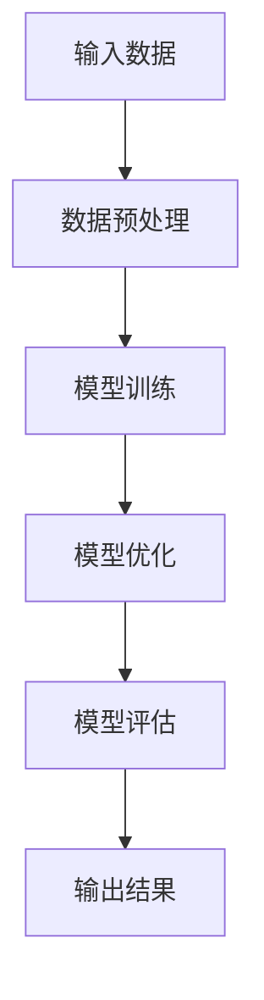

                 

### AI大模型创业：如何应对未来价格战？

> **关键词：** AI大模型、创业、价格战、技术创新、策略制定、市场竞争、法律伦理、融资与投资

**摘要：**本文将深入探讨AI大模型创业领域的核心问题——如何应对未来可能出现的激烈价格战。通过分析AI大模型的基本概念、技术原理、创业环境，以及策略与实践，本文旨在为创业者提供一套系统、实用的应对策略。文章还涉及法律伦理、融资投资等关键环节，帮助创业者全面理解并应对未来市场竞争的挑战。

### 第一部分: AI大模型基础与创业环境分析

#### 第1章: AI大模型概述与创业背景

AI大模型（Large-scale AI Models）是近年来人工智能领域的重要突破，其在自然语言处理、计算机视觉、语音识别等多个领域展现出了强大的应用潜力。随着技术的不断进步，AI大模型在商业应用中逐渐成为热点，吸引了大量创业者的关注。

**1.1 AI大模型的基本概念**

AI大模型是指通过对海量数据的学习和训练，构建出具有高度复杂性和强大泛化能力的神经网络模型。这些模型通常具有数十亿甚至千亿个参数，能够处理复杂的任务，例如文本生成、图像识别、语音合成等。

**1.2 AI大模型的发展历程**

AI大模型的发展历程可以分为三个阶段：早期模型、大规模模型和当前的高性能模型。早期模型以简单的神经网络结构为主，如感知机、BP网络等。大规模模型则引入了深度学习和分布式计算技术，使得模型规模和性能得到显著提升。当前的高性能模型则通过优化算法、硬件加速等技术，使得模型的训练速度和效果达到了新的高度。

**1.3 AI大模型在创业中的应用**

AI大模型在创业中的应用场景广泛，包括但不限于：智能客服、智能推荐、智能医疗、智能金融等。创业者可以利用AI大模型的技术优势，提供创新的产品和服务，满足市场需求。

#### 第2章: AI大模型技术原理与架构

AI大模型的技术原理和架构是其核心组成部分，理解这些原理和架构对于创业者和技术人员至关重要。

**2.1 AI大模型的核心算法**

AI大模型的核心算法包括深度学习（Deep Learning）、神经网络（Neural Networks）和预训练（Pre-training）等。深度学习是AI大模型的基础，它通过多层神经网络结构对数据进行层次化的特征提取。神经网络则是深度学习的主要实现方式，通过神经元之间的连接和激活函数来实现数据的非线性变换。预训练则是通过在大规模数据集上预先训练模型，然后针对具体任务进行微调，以提高模型的泛化能力。

**2.2 AI大模型的技术挑战与解决方案**

AI大模型在技术实现过程中面临着诸多挑战，包括计算资源管理、模型优化和数据隐私等。计算资源管理要求高效地利用分布式计算资源，以降低模型训练成本。模型优化则需要通过算法优化、架构改进等方式，提高模型的训练效率和效果。数据隐私则是保障用户数据安全和隐私的重要问题，需要采用加密、去标识化等技术手段进行保护。

**2.3 AI大模型的技术原理讲解与流程图**

为了更好地理解AI大模型的技术原理，下面通过一个简单的Mermaid流程图来展示其基本架构：



在该流程图中，输入数据经过预处理后进入模型训练阶段，通过迭代训练优化模型参数，然后对模型进行评估，最后输出预测结果。这个过程体现了AI大模型从数据输入到最终输出结果的全过程。

**2.4 伪代码示例**

为了更深入地了解AI大模型的训练过程，以下是一个简单的伪代码示例，展示了如何使用神经网络进行模型训练：

```python
# 初始化神经网络结构
network = NeuralNetwork()

# 预处理输入数据
processed_data = preprocess_data(input_data)

# 训练神经网络
for epoch in range(num_epochs):
    for data in processed_data:
        output = network.forward_pass(data)
        loss = compute_loss(output, target)
        network.backward_pass(loss)

# 评估模型
test_loss = network.evaluate(test_data)

# 输出模型参数
print(network.params)
```

在该伪代码中，`NeuralNetwork`代表一个神经网络类，`forward_pass`方法用于前向传播计算输出，`backward_pass`方法用于后向传播计算梯度，`compute_loss`方法用于计算损失函数，`evaluate`方法用于评估模型性能。

通过以上讲解和示例，我们可以看到AI大模型的技术原理和架构是如何实现的，以及其在创业中的重要性。接下来，我们将进一步探讨AI大模型创业策略与案例分析。

#### 第3章: AI大模型创业策略与案例分析

AI大模型创业的核心在于如何制定有效的策略，以在激烈的市场竞争中脱颖而出。本章节将分析AI大模型的创业环境，探讨创业策略的制定，并通过成功案例分享，为创业者提供实用的经验和启示。

**3.1 创业环境分析**

当前，AI大模型创业环境呈现出以下几个显著特点：

1. **市场趋势**：随着AI技术的快速发展和应用的普及，AI大模型在多个领域的应用需求日益增加。特别是在自然语言处理、计算机视觉和语音识别等领域，AI大模型已经成为解决复杂问题的重要工具。

2. **竞争对手分析**：当前，市场上已有一些领先的AI大模型创业公司，它们在技术积累、市场份额和用户基础等方面具有一定的优势。同时，也不断有新的创业公司加入，市场竞争日益激烈。

3. **技术进步**：AI大模型技术不断迭代更新，新的算法和架构不断涌现。创业者需要紧跟技术发展趋势，不断进行技术创新，以提高自身竞争力。

**3.2 创业策略制定**

为了在AI大模型创业中取得成功，创业者需要制定一套全面的创业策略。以下是一些关键策略：

1. **定位与差异化**：创业者需要明确自身的市场定位，找到与其他竞争对手不同的差异化点。例如，通过专注于特定领域或提供定制化服务来吸引客户。

2. **业务模式与盈利策略**：创业者需要设计一个可行的业务模式，确保项目的可持续发展和盈利能力。例如，通过提供API服务、企业合作或培训课程等方式实现商业化。

3. **团队构建与人才引进**：创业者需要组建一支具有强大技术实力和业务能力的人才团队。通过吸引顶尖人才，提高团队的创新能力和执行力。

**3.3 成功案例分享**

以下分享两个AI大模型创业的成功案例，以供创业者借鉴：

**案例一：公司A的AI大模型创业之路**

公司A成立于2015年，专注于自然语言处理领域。公司通过自主研发的AI大模型，提供智能客服和智能问答服务。在创业初期，公司通过紧密关注市场需求，不断优化产品功能，逐渐赢得了大量客户。此外，公司还注重团队建设，吸引了多位自然语言处理领域的顶尖专家加入。通过多年的努力，公司已经成为行业领先者，并在多个领域取得了显著的市场份额。

**案例二：公司B的创新AI大模型应用**

公司B成立于2017年，专注于计算机视觉领域。公司通过自主研发的AI大模型，提供智能图像识别和视频分析服务。公司在其技术基础上，推出了多个应用场景，如智能安防、智慧交通和智能制造等。通过创新的应用场景和优质的服务，公司迅速在市场上获得了认可，并吸引了多家大型企业的合作。目前，公司已经成为计算机视觉领域的佼佼者。

**3.4 创业者经验与启示**

通过以上两个案例，我们可以得出以下经验和启示：

1. **紧密关注市场需求**：创业公司需要紧密关注市场需求，根据客户需求不断优化产品功能，提高产品竞争力。

2. **技术创新是关键**：在AI大模型创业中，技术创新是核心竞争力。创业者需要持续投入研发，不断推动技术进步。

3. **团队建设至关重要**：创业者需要重视团队建设，吸引和留住顶尖人才，提高团队的创新能力和执行力。

通过以上分析，我们可以看到AI大模型创业策略的制定和实施对于创业者的成功至关重要。接下来，我们将进一步探讨AI大模型创业实践的具体方法和步骤。

### 第4章: AI大模型创业实践

AI大模型创业实践是创业者从理论到实践的转化过程，涉及项目规划、执行、风险管理等多个方面。本章节将详细阐述AI大模型创业实践的各个环节，帮助创业者顺利推进项目，应对挑战。

**4.1 创业项目规划与执行**

创业项目规划是创业实践的第一步，也是至关重要的一步。一个详细、可行的项目规划可以帮助创业者明确项目目标、任务分工和资源分配，确保项目的顺利推进。

**4.1.1 项目策划与资源分配**

在项目策划阶段，创业者需要明确项目的目标、范围和预期成果。具体包括：

1. **项目目标**：明确项目要解决的问题和目标市场。
2. **项目范围**：确定项目的工作内容和可交付成果。
3. **预期成果**：设定项目的关键里程碑和预期成果。

在明确项目目标后，创业者需要根据项目需求进行资源分配。资源包括人力、资金、技术设备等。创业者需要根据资源情况，制定合理的预算和资源利用计划，以确保项目的可持续性。

**4.1.2 技术路线图与里程碑**

技术路线图是项目规划中的重要组成部分，它描述了项目从开始到完成的技术发展路径。创业者需要根据项目目标和资源情况，制定一个合理的技术路线图。技术路线图包括以下几个关键组成部分：

1. **核心算法和模型**：确定项目所需的核心算法和模型，并明确其实现方式。
2. **技术路线**：描述项目从原型设计到产品化的技术发展路径。
3. **里程碑**：设定项目的关键里程碑，如原型设计完成、模型训练完成、产品上线等。

**4.1.3 团队协作与项目进度管理**

在项目执行过程中，团队协作和项目进度管理至关重要。创业者需要建立一套高效的团队协作机制，确保团队成员之间的沟通畅通、任务明确。具体措施包括：

1. **明确职责分工**：根据团队成员的技能和专长，明确各自的职责和任务。
2. **定期会议和沟通**：定期召开团队会议，分享项目进展和遇到的问题，确保团队成员之间的信息同步。
3. **项目进度监控**：通过项目进度表或项目管理工具，实时监控项目进度，确保项目按计划推进。

**4.2 风险评估与应对策略**

在AI大模型创业过程中，风险是不可避免的。创业者需要对项目进行全面的风险评估，并制定相应的应对策略，以降低风险对项目的影响。

**4.2.1 技术风险**

技术风险是AI大模型创业中最为常见和重要的风险。技术风险包括：

1. **算法和模型风险**：算法和模型的实现可能存在错误或缺陷，导致项目无法达到预期效果。
2. **计算资源风险**：模型训练和优化需要大量计算资源，计算资源不足可能导致项目延误或失败。

应对技术风险的方法包括：

1. **技术验证和测试**：在项目启动前，对算法和模型进行充分验证和测试，确保其稳定性和可靠性。
2. **资源优化和调度**：合理规划计算资源，利用分布式计算和云计算技术，提高计算资源的利用效率。

**4.2.2 市场风险**

市场风险包括市场需求波动、竞争对手压力等。创业者需要对市场进行持续监控，及时调整产品策略和市场定位。

1. **市场调研和预测**：定期进行市场调研，了解市场需求和竞争态势，预测市场变化趋势。
2. **产品差异化**：通过技术创新和产品差异化，提高产品的市场竞争力，降低市场风险。

**4.2.3 财务风险**

财务风险包括资金不足、投资回报周期长等。创业者需要制定详细的财务计划和风险管理策略。

1. **预算管理和监控**：制定合理的预算计划，实时监控项目支出，确保项目资金充足。
2. **多元化融资**：通过多种融资渠道，降低财务风险，确保项目的可持续性。

**4.3 持续创新与迭代**

在AI大模型创业中，持续创新和迭代是推动项目成功的关键。创业者需要不断关注技术发展动态，调整产品方向，以满足市场需求。

1. **技术积累和储备**：持续进行技术研究和开发，积累技术储备，为后续项目提供支持。
2. **用户反馈和迭代**：积极收集用户反馈，根据用户需求进行产品迭代和优化，提高用户满意度。

通过以上分析和探讨，我们可以看到AI大模型创业实践的复杂性和挑战性。创业者需要全面了解项目各个环节，制定合理的规划和策略，持续创新和迭代，以应对市场和技术变革的挑战。接下来，我们将进一步探讨AI大模型创业中的法律与伦理问题。

### 第5章: AI大模型创业中的法律与伦理问题

随着AI大模型在各个领域的广泛应用，创业者不仅需要关注技术创新和市场拓展，还必须面对法律与伦理问题，以确保企业的可持续发展。本章节将深入探讨AI大模型创业中的法律法规、伦理问题以及企业应承担的社会责任。

**5.1 法律法规与合规要求**

AI大模型创业涉及多个法律法规和合规要求，包括数据隐私保护、知识产权保护和竞争法规遵守等。

**5.1.1 数据隐私保护**

数据隐私保护是AI大模型创业中最重要的法律问题之一。创业者必须遵守相关法律法规，确保用户数据的收集、存储和使用符合法律规定。以下是一些关键点：

1. **数据收集与使用**：在收集和使用用户数据时，必须明确告知用户数据收集的目的、范围和用途，并获得用户的明确同意。
2. **数据存储与安全**：创业者需要采取有效的安全措施，保护用户数据不被未经授权的访问、泄露或篡改。例如，使用加密技术、访问控制和数据备份等手段。
3. **数据删除与追溯**：用户有权要求删除其个人信息，创业者应确保能够及时、彻底地删除用户数据，并保留相应的删除记录。

**5.1.2 知识产权保护**

AI大模型涉及大量的知识产权，包括专利、版权和商标等。创业者需要充分了解并遵守知识产权相关法律法规，以保护自身的技术和创新成果。

1. **专利保护**：创业者可以通过申请专利来保护其AI大模型的核心技术和创新点。在申请专利时，需要详细描述技术方案、应用场景和实施效果。
2. **版权保护**：对于AI大模型的软件代码、算法描述等，创业者应申请版权保护，防止他人未经授权的使用和复制。
3. **商标保护**：对于企业的品牌名称、标志和服务特点，创业者应申请商标注册，以防止他人恶意使用和侵犯。

**5.1.3 竞争法规遵守**

在AI大模型创业中，创业者需要遵守反垄断法、反不正当竞争法等竞争法规，避免从事反竞争行为。

1. **反垄断法**：创业者不得从事垄断行为，如滥用市场支配地位、限制竞争等。
2. **反不正当竞争法**：创业者不得从事虚假宣传、商业诋毁、侵犯商业秘密等不正当竞争行为。

**5.2 伦理问题与责任担当**

AI大模型不仅是一个技术工具，也涉及到伦理和社会责任问题。创业者需要树立正确的伦理观念，承担相应的社会责任。

**5.2.1 伦理标准制定**

创业者应制定一套符合伦理标准的准则，指导企业在AI大模型开发和使用过程中的行为。以下是一些关键伦理标准：

1. **公正与公平**：AI大模型不应歧视任何特定群体，应确保所有人都能公平地获得技术服务。
2. **透明与可解释性**：AI大模型应具备较高的透明度和可解释性，使人们能够理解模型的决策过程。
3. **隐私保护**：在数据收集和使用过程中，必须严格遵守隐私保护原则，确保用户数据不被滥用。

**5.2.2 公众信任建设**

建立公众信任是AI大模型创业的关键。创业者应通过以下措施，提升公众对AI大模型的信任度：

1. **信息披露**：及时、透明地披露AI大模型的技术细节和应用情况，增强公众的信任。
2. **用户参与**：鼓励用户参与AI大模型的设计和改进过程，听取用户的意见和建议。
3. **社会贡献**：通过公益活动、公益项目等方式，回报社会，提升企业的社会责任形象。

**5.2.3 社会责任与可持续发展**

创业者应承担社会责任，推动AI大模型技术的社会可持续发展。以下是一些具体措施：

1. **教育普及**：通过教育和培训项目，提高公众对AI大模型的认知和理解。
2. **技术创新**：持续进行技术研究和创新，推动AI大模型技术在各个领域的应用。
3. **环境保护**：在AI大模型开发和使用过程中，注重环境保护和资源节约，减少对环境的影响。

通过以上探讨，我们可以看到AI大模型创业中的法律与伦理问题的重要性和复杂性。创业者不仅需要遵守法律法规，保护知识产权，还需要承担社会责任，树立正确的伦理观念。只有在法律和伦理的双重约束下，AI大模型创业才能实现可持续发展，为人类社会带来更多积极影响。

### 第6章: AI大模型创业融资与投资

融资与投资是AI大模型创业中至关重要的环节，它决定了企业能否获得足够的资源支持，以实现技术和市场的快速发展。本章节将详细介绍AI大模型创业的融资渠道、投资者分析、融资策略以及投资谈判与合同签订等内容，帮助创业者更好地应对融资挑战。

**6.1 融资渠道与策略**

AI大模型创业公司通常需要通过多种融资渠道获取资金，以满足技术研发、市场拓展和团队建设的需求。以下是一些常见的融资渠道和策略：

**6.1.1 种子轮融资**

种子轮融资是创业公司在早期阶段获取的第一笔资金，通常用于产品原型开发、市场调研和团队组建。种子轮融资的主要渠道包括：

1. **天使投资**：天使投资人是个人投资者，通常对初创项目有较高的风险承受能力，并愿意在早期阶段提供资金支持。
2. **风险投资（VC）**：风险投资公司专注于投资处于成长阶段的创业公司，通过提供资金和管理建议，帮助企业快速发展。

**6.1.2 A轮与B轮融资**

A轮和B轮融资是创业公司发展的重要阶段，通常用于产品优化、市场推广和团队扩展。以下是一些融资策略：

1. **风险投资（VC）**：A轮和B轮融资主要依赖于风险投资公司，这些投资者对创业公司有较高的风险承受能力，并希望通过投资获得高额回报。
2. **战略投资**：战略投资者是那些希望在特定领域建立或巩固其市场地位的成熟企业或机构。通过战略投资，创业公司可以获得资金、技术支持和市场资源。
3. **众筹**：众筹是一种通过互联网平台向广大投资者融资的方式，适用于早期项目的资金需求。众筹不仅能筹集资金，还能提高产品的市场知名度和用户参与度。

**6.1.3 后续融资规划**

随着创业公司的发展和成熟，后续融资规划成为确保企业持续发展的关键。后续融资的主要策略包括：

1. **C轮及以后融资**：C轮及以后的融资通常用于企业的规模化扩张和市场扩展。此时，企业需要证明其业务模式的可行性和盈利能力。
2. **融资轮次规划**：创业者应根据企业的发展阶段和资金需求，合理规划融资轮次，确保在不同阶段获得足够的资金支持。
3. **多元化融资**：通过多元化融资渠道，降低融资风险，确保企业在不同阶段都能获得所需的资金支持。

**6.2 投资者分析与选择**

选择合适的投资者是融资成功的关键。以下是对不同类型投资者的分析：

**6.2.1 天使投资者**

天使投资者通常具有丰富的创业经验和行业资源，能够为创业公司提供宝贵的建议和指导。在选择天使投资者时，创业者应考虑以下因素：

1. **投资领域**：天使投资者的投资领域应与创业公司的业务方向相匹配，以确保双方在战略和资源上能够形成互补。
2. **行业经验**：天使投资者在相关行业具有丰富的经验，能够为创业公司提供有价值的商业建议和资源。
3. **投资额度**：天使投资者的投资额度应满足创业公司的资金需求，同时不宜过高，以免影响公司的独立性和决策权。

**6.2.2 风险投资公司**

风险投资公司是创业公司获取资金的重要渠道，以下是对不同类型风险投资公司的分析：

1. **早期风险投资（VC）**：早期风险投资公司专注于投资初创和成长阶段的公司，投资额度较低，但能够提供资金和管理支持。
2. **后期风险投资（VC）**：后期风险投资公司通常投资于成熟且具备盈利能力的公司，投资额度较高，但要求公司有明确的商业模型和盈利模式。

**6.2.3 战略投资者**

战略投资者是那些希望在特定领域建立或巩固其市场地位的成熟企业或机构。以下是对战略投资者的分析：

1. **协同效应**：战略投资者能够为创业公司带来技术、市场、资源和渠道等方面的支持，形成协同效应。
2. **投资目的**：战略投资者的投资目的通常不是为了获得高额回报，而是为了实现其战略布局和业务拓展。
3. **决策权**：战略投资者在投资后通常会要求一定程度的决策权，这可能影响创业公司的独立性。

**6.3 投资谈判与合同签订**

投资谈判和合同签订是融资过程中的关键环节，以下是一些关键要点：

**6.3.1 投资条款**

投资条款是投资谈判的核心内容，包括投资金额、投资比例、权益分配、董事会席位等。创业者应仔细评估投资条款，确保自身的利益得到保障。

**6.3.2 投资协议**

投资协议是双方达成投资意向后签署的法律文件，详细规定了投资的具体细节、双方的权利和义务。以下是一些关键条款：

1. **保密条款**：双方应约定在投资谈判和协议签署过程中，对商业秘密和敏感信息进行保密。
2. **排他性条款**：投资协议通常要求创业公司在一定期限内不得寻求其他投资者的资金支持，以确保投资方的权益。
3. **反稀释条款**：该条款用于保护现有投资者的股权比例，防止因后续融资导致股权被稀释。
4. **优先购买权**：投资者享有优先购买权，即在其他股东出售股份时，投资者有权按照约定的价格和比例优先购买。
5. **优先分红权**：投资者享有优先分红权，即在公司分红时，投资者有权获得优先分配的分红。

**6.3.3 合同签订与履行**

合同签订后，双方应按照协议约定履行各自的义务。以下是一些关键步骤：

1. **尽职调查**：在合同签订前，投资者通常会进行尽职调查，以了解创业公司的财务状况、业务模式、市场前景等，确保投资决策的合理性。
2. **签署合同**：双方应在尽职调查结束后签署正式的投资协议。
3. **资金到位**：投资者应在协议签署后的一定时间内，按照协议约定将资金划拨到创业公司的账户。
4. **后续履行**：双方应按照协议约定的条款，履行各自的权利和义务，确保投资项目的顺利实施。

通过以上分析和探讨，我们可以看到AI大模型创业融资与投资的重要性和复杂性。创业者需要了解不同的融资渠道和策略，选择合适的投资者，并在投资谈判和合同签订过程中确保自身的权益。只有在科学的融资策略和有效的投资管理下，AI大模型创业才能实现可持续发展，为企业和投资者带来丰厚的回报。

### 第7章: AI大模型创业的未来趋势与展望

随着AI技术的不断进步，AI大模型创业将面临新的机遇和挑战。本章节将探讨AI大模型创业的未来趋势，分析创业环境的变化，以及如何通过技术创新应对市场竞争。

**7.1 技术发展趋势**

**7.1.1 大模型与领域特定模型的融合**

未来，AI大模型将与领域特定模型（Domain-specific Models）相结合，实现更加精细和高效的智能应用。领域特定模型通过针对特定领域的知识库和算法优化，能够在特定场景下提供更精准的解决方案。

**7.1.2 AI大模型商业化路径拓展**

AI大模型的商业化路径将不断拓展，从传统的API服务、云计算平台，向更多的应用场景和商业模式延伸。例如，AI大模型将在智慧城市、智能医疗、智能制造等领域发挥重要作用，推动产业的数字化转型。

**7.1.3 开源生态与商业闭环**

开源生态将为AI大模型创业提供丰富的技术资源和创新空间。同时，企业通过构建商业闭环，将开源技术与商业应用相结合，实现商业价值和用户价值的最大化。

**7.2 创业环境变化与应对**

**7.2.1 法规政策影响**

随着AI技术的快速发展，各国政府将加强监管，出台更加严格的法律法规。创业者需要密切关注政策动态，确保企业合规运营。

**7.2.2 市场竞争态势**

AI大模型市场竞争将愈发激烈，创业者需要通过技术创新、产品差异化和市场营销策略，提升竞争力。

**7.2.3 技术创新驱动创业**

技术创新将是创业公司脱颖而出的关键。创业者应持续关注技术发展趋势，推动技术突破，为市场提供创新解决方案。

**7.3 创新创业实践**

**7.3.1 技术创新与商业模式创新**

创业者应结合技术创新和商业模式创新，实现商业价值和社会价值的双赢。例如，通过构建数据驱动型的商业模式，实现精准营销和用户增长。

**7.3.2 跨界合作与生态构建**

创业者应积极寻求跨界合作，构建跨界生态，实现资源共享和优势互补。例如，与科研机构、高校和企业合作，共同推动AI大模型技术的发展和应用。

**7.3.3 持续迭代与快速响应**

创业者应具备快速迭代和灵活调整的能力，以适应市场变化和技术创新。通过持续优化产品和服务，提高用户满意度和市场竞争力。

通过以上分析和探讨，我们可以看到AI大模型创业的未来充满机遇和挑战。创业者需要紧跟技术发展趋势，积极应对环境变化，通过持续创新和优化，推动AI大模型创业的可持续发展。

### 附录

#### 附录A: AI大模型创业资源与工具汇总

**A.1 开源框架与工具**

在AI大模型创业中，开源框架和工具是不可或缺的资源。以下是一些常用的开源框架和工具：

1. **TensorFlow**：由谷歌开发的开源机器学习框架，适用于大规模深度学习模型的训练和部署。
2. **PyTorch**：由Facebook开发的开源深度学习框架，提供灵活的动态计算图，便于模型研究和开发。
3. **Keras**：基于Theano和TensorFlow的高层神经网络API，简化了深度学习模型的构建和训练。
4. **Hugging Face**：提供大量的预训练模型和工具，方便开发者进行自然语言处理任务。
5. **Transformers**：用于实现基于Transformer架构的深度学习模型，是PyTorch的一个扩展库。

**A.2 商业化案例库**

以下是一些AI大模型商业化的成功案例，供创业者参考：

1. **OpenAI**：通过开源模型GPT-3，提供强大的自然语言处理能力，为企业提供API服务。
2. **DeepMind**：利用AI技术提供智能游戏解决方案，如AlphaGo，取得了显著的市场成功。
3. **SenseTime**：利用计算机视觉技术提供智能监控和安防解决方案，与多个城市和企业达成合作。

**A.3 相关法律法规与标准指南**

创业者需要关注与AI大模型相关的法律法规和标准指南，以确保合规运营。以下是一些重要的法律法规和标准指南：

1. **《欧洲通用数据保护条例》（GDPR）**：规定了个人数据的收集、存储和使用标准，对AI大模型企业具有重要影响。
2. **《人工智能伦理准则》**：由中国国家标准化管理委员会发布的标准，为AI大模型企业提供伦理指导。
3. **《人工智能安全标准》**：针对人工智能系统的安全性和可靠性进行规定，有助于确保AI大模型的安全和稳定。

#### 附录B: 大模型创业者访谈记录与建议

**B.1 创业者A的经验分享**

创业者A是一位在AI大模型领域有着丰富经验的创业者，他分享了以下几点创业经验：

1. **技术创新是关键**：在AI大模型创业中，技术创新是核心竞争力。创业者应持续关注技术发展趋势，推动技术突破。
2. **团队建设至关重要**：创业者应重视团队建设，吸引和留住顶尖人才。团队的多样性和互补性对创业成功至关重要。
3. **市场需求导向**：创业者的产品和服务应紧密关注市场需求，不断优化产品功能，提升用户体验。

**B.2 创业者B的成功要素**

创业者B是一家专注于自然语言处理领域的公司创始人，他认为以下要素是其成功的关键：

1. **专注与聚焦**：创业者应选择一个明确的细分市场，专注于提供创新解决方案，避免分散精力。
2. **客户关系管理**：创业者应重视与客户的沟通，了解客户需求，提供定制化服务，提升客户满意度。
3. **合作伙伴关系**：与科研机构、高校和企业建立紧密的合作关系，共享资源，推动技术进步和市场拓展。

**B.3 创业者C的反思与展望**

创业者C回顾了自己的创业历程，提出以下几点反思与展望：

1. **风险管理**：创业者在项目启动前应进行全面的风险评估，制定应对策略，降低风险对项目的影响。
2. **持续学习与进步**：创业者应保持学习心态，持续关注技术发展和市场变化，不断提升自身能力和竞争力。
3. **社会责任与伦理**：创业者应树立正确的伦理观念，关注社会责任，推动AI技术的可持续发展，为人类社会带来积极影响。

通过以上访谈记录和经验分享，创业者可以从中获得宝贵的启示，为自身的创业之路提供参考和指导。在AI大模型创业的道路上，不断学习和实践，才能在激烈的竞争中脱颖而出，实现企业的可持续发展。

