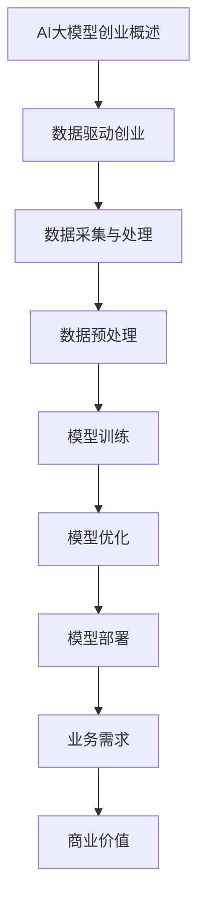

                 

## AI大模型创业：如何应对未来数据挑战？

> **关键词**：AI大模型，创业，数据挑战，数据处理，人工智能技术，数据隐私，数据安全

> **摘要**：
本文旨在探讨AI大模型在创业中的重要性及其面临的数据挑战。通过对AI大模型创业背景的概述，数据采集与处理技术，AI大模型设计与实现，以及AI大模型在商业领域的应用等方面的分析，本文提出了一系列应对数据挑战的策略，为AI大模型创业提供了实用指导。

### 第一部分：AI大模型创业概述

#### 第1章：AI大模型创业概述

##### 1.1 AI大模型创业背景

人工智能（AI）作为当前科技领域的热门话题，已经深刻地改变了我们的生活方式和工作方式。而AI大模型，作为人工智能技术的核心组件，更是推动着人工智能发展的关键技术。AI大模型创业，即是利用这些高性能的AI模型进行商业化的探索和尝试。

##### 1.2 AI大模型与数据的关系

AI大模型的数据驱动特性，使得数据在创业过程中扮演着至关重要的角色。一方面，数据是AI大模型训练和优化的基础；另一方面，数据的多样性、质量和数量直接决定了AI大模型的性能和应用效果。

##### 1.3 AI大模型创业案例分析

成功的AI大模型创业案例，往往离不开对数据的高效管理和利用。本文将介绍几个典型的AI大模型创业案例，分析其成功因素，并探讨其失败案例中的教训。

### 第二部分：数据管理与处理

#### 第2章：数据采集与处理

##### 2.1 数据采集

数据采集是AI大模型创业的第一步，也是至关重要的一步。本文将讨论如何选择合适的数据源，以及常用的数据采集方法。

##### 2.2 数据预处理

数据预处理是数据采集后的重要环节，直接影响到AI大模型的表现。本文将阐述数据清洗的重要性，以及常用的数据清洗方法。

##### 2.3 数据存储与传输

数据存储与传输是数据管理中的关键问题。本文将讨论数据存储的选择，以及数据传输的常用方式。

### 第三部分：AI大模型设计与实现

#### 第3章：AI大模型设计与架构

##### 3.1 AI大模型设计原则

AI大模型的设计原则决定了模型的性能和应用效果。本文将讨论如何选择适合的AI大模型，以及常见的AI大模型架构。

##### 3.2 AI大模型训练

AI大模型的训练过程决定了模型的能力和表现。本文将详细阐述AI大模型的训练过程，以及如何优化训练过程。

##### 3.3 AI大模型部署

AI大模型的部署是将模型应用于实际场景的关键步骤。本文将介绍如何将训练好的AI大模型部署到生产环境中，以及如何维护和更新模型。

### 第四部分：AI大模型创业应用

#### 第4章：AI大模型在商业领域的应用

##### 4.1 AI大模型在金融领域的应用

AI大模型在金融领域有着广泛的应用前景，如风险管理、客户服务等方面。本文将详细探讨AI大模型在金融领域的应用。

##### 4.2 AI大模型在医疗领域的应用

AI大模型在医疗领域也有着重要的应用价值，如疾病预测、医疗资源优化等。本文将介绍AI大模型在医疗领域的应用。

##### 4.3 AI大模型在其他行业的应用

AI大模型不仅在金融和医疗领域有重要应用，还在其他行业如制造业、零售业等领域展现出巨大的潜力。本文将分析AI大模型在这些行业的应用。

### 第五部分：AI大模型创业中的挑战与策略

#### 第5章：AI大模型创业中的挑战

##### 5.1 数据隐私与伦理

数据隐私和伦理问题是AI大模型创业中不可忽视的挑战。本文将讨论如何保护数据隐私，以及如何应对AI大模型创业中的伦理问题。

##### 5.2 法律法规与合规

AI大模型创业需要遵守相关的法律法规和合规要求。本文将介绍与AI大模型相关的法律法规，以及如何确保合规性。

##### 5.3 技术竞争与知识产权

技术竞争和知识产权保护是AI大模型创业中的关键问题。本文将分析AI大模型创业中的技术竞争现状，以及如何保护知识产权。

### 第六部分：成功AI大模型创业案例研究

#### 第6章：成功AI大模型创业案例研究

##### 6.1 案例一：OpenAI的GPT模型

##### 6.2 案例二：Google的BERT模型

### 第七部分：AI大模型创业的未来趋势与展望

#### 第7章：AI大模型创业的未来趋势与展望

##### 7.1 AI大模型创业的未来趋势

##### 7.2 AI大模型创业的挑战与机遇

### 附录：AI大模型开发工具与资源

#### 附录A：AI大模型开发工具与资源

本文将介绍AI大模型开发常用的工具与资源，包括开发框架、数据处理与存储工具，以及开源资源等。

### 结束语

AI大模型创业是一个充满机遇和挑战的过程。通过本文的探讨，我们希望能为读者提供一些有价值的见解和实用的策略，帮助他们在AI大模型创业的道路上走得更远。

### 作者信息

**作者：** AI天才研究院/AI Genius Institute & 禅与计算机程序设计艺术 /Zen And The Art of Computer Programming

### 总结

本文从AI大模型创业的背景、数据关系、案例分析、数据管理、模型设计与实现、商业应用、挑战与策略、案例研究和未来趋势等多个方面进行了全面探讨。通过对这些核心内容的详细分析，我们不仅了解了AI大模型在创业中的关键作用，还提出了应对数据挑战的策略，为AI大模型创业提供了实用的指导。希望本文能为您的AI大模型创业之路提供一些启示和帮助。

## 第一部分：AI大模型创业概述

### 第1章：AI大模型创业概述

#### 1.1 AI大模型创业背景

在过去的几十年里，人工智能（AI）经历了从理论研究到实际应用的飞速发展。AI大模型，作为人工智能技术的核心组成部分，其在创业领域的重要性愈发凸显。AI大模型创业，指的是利用这些高性能的AI模型进行商业化的探索和尝试，旨在通过AI技术解决实际问题，创造商业价值。

##### AI大模型的发展历程

AI大模型的发展历程可以分为以下几个阶段：

1. **早期研究阶段（1950s-1980s）**：在这个阶段，AI研究主要集中在符号逻辑和规则系统上，如专家系统和逻辑推理。然而，由于计算资源和数据限制，这些模型往往规模较小，性能有限。

2. **统计学习阶段（1990s-2000s）**：随着统计学和机器学习技术的发展，AI研究逐渐转向基于数据的模型，如支持向量机（SVM）、决策树等。这些模型在处理大规模数据集方面表现出色，但仍然存在一些局限性。

3. **深度学习阶段（2010s至今）**：深度学习的崛起标志着AI大模型的诞生。通过多层神经网络的结构，深度学习模型能够自动提取数据中的复杂特征，并在图像识别、语音识别、自然语言处理等任务中取得突破性进展。代表性的AI大模型包括Google的Inception、Facebook的ResNet、OpenAI的GPT等。

##### AI大模型在创业中的角色

AI大模型在创业公司中的角色可以从以下几个方面来理解：

1. **提高决策效率**：AI大模型能够处理和分析大量数据，为企业提供更为精准和高效的决策支持。例如，在金融行业中，AI大模型可以用于风险控制、投资组合优化等。

2. **降低运营成本**：通过自动化和智能化，AI大模型可以显著降低企业的运营成本。例如，在零售行业中，AI大模型可以用于库存管理、需求预测等，从而减少库存成本和损耗。

3. **创新商业模式**：AI大模型为创业公司提供了创新的商业模式。例如，在医疗领域，AI大模型可以用于疾病诊断、个性化治疗等，为患者提供更优质的医疗服务。

4. **增强用户体验**：AI大模型可以帮助创业公司提供个性化、智能化的产品和服务，从而提升用户体验。例如，在电子商务领域，AI大模型可以用于推荐系统、聊天机器人等。

#### 1.2 AI大模型与数据的关系

AI大模型的数据驱动特性使其在创业过程中扮演着至关重要的角色。数据不仅是AI大模型训练和优化的基础，也是其应用效果的关键因素。

##### 数据驱动创业

数据驱动创业意味着企业在决策过程中高度依赖数据分析和AI技术。具体体现在以下几个方面：

1. **数据收集**：创业公司需要通过各种方式收集大量数据，包括用户行为数据、市场数据、业务数据等。

2. **数据清洗**：收集到的数据往往存在噪声和不一致性，需要通过数据清洗技术进行预处理，以提高数据质量。

3. **数据整合**：来自不同来源的数据需要整合到一个统一的数据平台上，以便进行进一步的分析和处理。

4. **数据分析**：通过数据分析技术，创业公司可以从中提取有价值的信息和洞见，用于指导业务决策。

5. **数据可视化**：通过数据可视化技术，创业公司可以将数据分析结果以图表、报表等形式展示出来，帮助管理层更好地理解和利用数据。

##### 数据挑战与应对

在AI大模型创业过程中，数据挑战是不可避免的。以下是一些常见的数据挑战及其应对策略：

1. **数据多样性**：创业公司需要处理来自不同来源、不同格式、不同类型的数据。这要求企业具备较强的数据整合和处理能力。

2. **数据质量**：数据质量直接影响AI大模型的表现和应用效果。创业公司需要建立完善的数据质量管理机制，确保数据的准确性和一致性。

3. **数据隐私和安全**：在处理大量敏感数据时，创业公司需要确保数据的安全性和隐私性。这可能需要采用加密技术、访问控制等技术手段。

4. **数据规模和计算能力**：大规模数据集的处理需要强大的计算能力和存储资源。创业公司可能需要采用分布式计算、云计算等技术来应对这一挑战。

5. **数据更新和实时处理**：随着业务的发展，数据会不断更新和变化。创业公司需要具备实时数据处理能力，以便快速响应市场变化。

#### 1.3 AI大模型创业案例分析

成功的AI大模型创业案例可以提供宝贵的经验和启示。以下是一些典型的AI大模型创业案例：

##### 成功案例

1. **OpenAI的GPT模型**：OpenAI是一家专注于AI研究的创业公司，其GPT模型在自然语言处理领域取得了突破性进展。GPT模型通过大规模数据训练，能够生成高质量的自然语言文本，为文本生成、机器翻译、对话系统等领域提供了强大的支持。

2. **DeepMind的AlphaGo**：DeepMind是一家成立于2010年的英国AI公司，其AlphaGo围棋程序在2016年击败了世界围棋冠军李世石，引起了广泛关注。AlphaGo的成功背后是其强大的深度学习和强化学习技术，以及海量高质量的数据训练。

##### 失败案例

1. **IBM Watson Health**：IBM Watson Health旨在利用AI技术提供智能医疗解决方案。然而，由于数据隐私和安全问题，该项目在实施过程中遇到了诸多困难，导致项目进展缓慢，甚至部分业务线被关闭。

2. **TalkIQ**：TalkIQ是一家提供语音分析服务的创业公司，但其AI模型在处理大规模语音数据时遇到了性能瓶颈，导致客户满意度下降，最终导致公司倒闭。

通过分析这些成功和失败的案例，我们可以得出以下启示：

1. **数据质量至关重要**：无论是成功还是失败，数据质量都是决定AI大模型表现的关键因素。创业公司需要建立完善的数据质量管理机制。

2. **技术能力是基础**：成功的AI大模型创业案例通常具备强大的技术能力，包括算法创新、模型优化、数据处理等。

3. **市场需求是核心**：创业公司需要深入了解市场需求，确保AI大模型能够解决实际问题，创造商业价值。

4. **合规性和伦理问题是挑战**：在AI大模型创业过程中，需要重视数据隐私、安全和合规性问题，确保业务合法、可持续。

### 总结

AI大模型创业是一个充满机遇和挑战的过程。通过对AI大模型创业背景的概述，我们可以看到AI大模型在创业中的关键作用。数据驱动创业是AI大模型创业的核心，数据挑战也是不可忽视的难题。通过分析成功和失败的案例，我们可以得出一些宝贵的经验和启示，为AI大模型创业提供指导。

### 核心概念与联系

在深入探讨AI大模型创业之前，我们需要明确几个核心概念，并理解它们之间的联系。以下是AI大模型创业中的一些关键概念及它们之间的关系：

1. **人工智能（AI）**：人工智能是模拟、延伸和扩展人类智能的科学和工程。它包括机器学习、自然语言处理、计算机视觉等多个领域。

2. **大模型（Large Models）**：大模型指的是具有数十亿至数万亿参数的深度学习模型。这些模型通常通过大规模数据集训练，能够实现高水平的表现和泛化能力。

3. **数据驱动创业**：数据驱动创业是指企业在决策过程中高度依赖数据分析和AI技术。数据是驱动AI大模型训练和优化的基础，也是创业成功的核心要素。

4. **模型训练（Training）**：模型训练是指使用大量数据对AI大模型进行调整和优化，使其能够实现特定任务。训练过程中，模型通过学习数据中的模式和规律，不断提高其性能。

5. **数据预处理（Data Preprocessing）**：数据预处理是指对原始数据进行清洗、转换和整合，以提高数据质量，为模型训练提供更好的数据基础。

6. **模型优化（Model Optimization）**：模型优化是指对训练好的模型进行调整和改进，以提高其性能和效率。优化过程包括超参数调整、结构改进等。

7. **模型部署（Deployment）**：模型部署是指将训练好的模型应用到实际场景中，如生产环境、客户应用等。部署过程中，需要确保模型的高效运行和稳定性。

8. **业务需求（Business Needs）**：业务需求是指企业在运营过程中需要解决的实际问题。AI大模型创业的目标是利用AI技术满足业务需求，创造商业价值。

这些概念之间的关系可以概括如下：

- **人工智能**是AI大模型创业的技术基础，提供了实现智能化的手段。
- **大模型**是AI技术的核心组件，通过大规模数据训练，能够实现高水平的表现。
- **数据驱动创业**将数据视为驱动创业的核心，通过数据分析和AI技术，实现业务决策的优化。
- **模型训练**和**数据预处理**是模型优化的前提，确保模型能够从数据中学习到有效的模式和规律。
- **模型优化**和**模型部署**是模型应用的关键步骤，通过优化和部署，实现模型在业务场景中的高效运行。
- **业务需求**是AI大模型创业的最终目标，创业公司需要确保模型能够满足业务需求，创造商业价值。

通过理解这些核心概念及其联系，我们可以更好地把握AI大模型创业的本质，为其成功奠定基础。

### Mermaid 流程图

下面是一个Mermaid流程图，用于展示AI大模型创业中的关键步骤：



该流程图清晰地展示了AI大模型创业的各个关键步骤及其相互关系。从数据驱动创业开始，经过数据采集、预处理、模型训练、优化和部署，最终实现业务需求，创造商业价值。

### 核心算法原理讲解

在AI大模型创业中，核心算法的原理和实现是关键。以下是几个常见AI大模型的核心算法原理，以及对应的伪代码和数学模型。

#### 1. 卷积神经网络（CNN）

卷积神经网络是计算机视觉领域的重要模型，通过多层卷积和池化操作提取图像特征。

**伪代码**：
```python
function CNN(input_image):
    layer1 = Conv2D(input_image, kernel_size=(3, 3), activation='relu')
    layer2 = MaxPooling2D(layer1)
    layer3 = Conv2D(layer2, kernel_size=(3, 3), activation='relu')
    layer4 = MaxPooling2D(layer3)
    flatten = Flatten(layer4)
    dense = Dense(flatten, units=100, activation='relu')
    output = Dense(dense, units=num_classes, activation='softmax')
    return output
```

**数学模型**：
$$
\begin{aligned}
    \text{卷积层：} f(x; \theta) &= \text{Relu}(\text{Conv}_2(x; w_1) + b_1) \\
    \text{池化层：} g(x; \theta) &= \text{Max}(\text{Pooling}_2(f(x; \theta)) + b_2) \\
    \text{全连接层：} h(x; \theta) &= \text{Relu}(\text{Dense}(g(x; \theta)) + b_3) \\
    \text{输出层：} y(x; \theta) &= \text{Softmax}(\text{Dense}(h(x; \theta)) + b_4)
\end{aligned}
$$`

#### 2. 递归神经网络（RNN）

递归神经网络适用于序列数据，通过记忆长期依赖关系，实现序列预测和生成。

**伪代码**：
```python
function RNN(input_sequence):
    layer1 = LSTM(input_sequence, units=50, activation='tanh')
    layer2 = Dense(layer1, units=1, activation='sigmoid')
    return layer2
```

**数学模型**：
$$
\begin{aligned}
    \text{递归层：} h_t &= \text{tanh}(\text{LSTM}(x_t, h_{t-1})) \\
    \text{输出层：} y_t &= \text{sigmoid}(\text{Dense}(h_t))
\end{aligned}
$$`

#### 3. 变分自编码器（VAE）

变分自编码器是一种生成模型，通过编码和解码器学习数据分布，生成新的数据。

**伪代码**：
```python
function VAE(input_data):
    z_mean, z_log_var = Encoder(input_data)
    z = Sampling(z_mean, z_log_var)
    reconstructed = Decoder(z)
    return reconstructed
```

**数学模型**：
$$
\begin{aligned}
    \text{编码器：} z_{\mu}, z_{\sigma} &= \text{Encoder}(x) \\
    \text{解码器：} x_{\hat{}} &= \text{Decoder}(z) \\
    \text{重参数化：} z &= \mu + \epsilon \odot \sigma
\end{aligned}
$$`

#### 4. 生成对抗网络（GAN）

生成对抗网络通过对抗性训练生成高质量的数据，广泛应用于图像生成、图像修复等领域。

**伪代码**：
```python
function GAN(real_data):
    generated = Generator(z)
    d_fake = Discriminator(generated)
    d_real = Discriminator(real_data)
    return generated, d_fake, d_real
```

**数学模型**：
$$
\begin{aligned}
    \text{生成器：} G(z) &= \text{Generator}(z) \\
    \text{判别器：} D(x) &= \text{Discriminator}(x) \\
    \text{损失函数：} \mathcal{L} &= -\mathbb{E}_{x \sim \text{Data}}[\log(D(x))] - \mathbb{E}_{z \sim \text{Noise}}[\log(1 - D(G(z)))]
\end{aligned}
$$`

通过上述核心算法的原理讲解和伪代码，我们可以看到AI大模型在创业中的应用前景。这些算法不仅在学术界取得了显著成果，也在工业界得到了广泛应用，为AI大模型创业提供了强大的技术支持。

### 数据预处理的重要性及方法

在AI大模型创业中，数据预处理是一个至关重要的环节，其质量和效果直接影响到模型的训练效率和性能。数据预处理包括数据清洗、数据整合和数据标准化等步骤，以下将详细探讨这些内容。

#### 数据清洗

数据清洗是指识别和修复数据中的错误、异常值和噪声，以提高数据质量。以下是几种常见的数据清洗方法：

1. **缺失值处理**：缺失值处理方法包括填充缺失值、删除含有缺失值的记录和插值等。常用的填充方法有平均值填充、中值填充和插值等。

   **伪代码**：
   ```python
   def handle_missing_values(data):
       for column in data.columns:
           if data[column].isnull().any():
               data[column].fillna(data[column].mean(), inplace=True)
   ```

2. **异常值检测**：异常值检测方法包括基于统计的方法和基于机器学习的方法。常见的统计方法有Z分数法和IQR法，机器学习方法包括孤立森林等。

   **伪代码**：
   ```python
   from sklearn.ensemble import IsolationForest

   def detect_outliers(data):
       model = IsolationForest(contamination=0.05)
       model.fit(data)
       outliers = model.predict(data)
       return outliers
   ```

3. **重复数据处理**：重复数据可能是由于数据采集过程中的错误导致的，需要删除重复记录，确保数据的一致性。

   **伪代码**：
   ```python
   def remove_duplicates(data):
       data.drop_duplicates(inplace=True)
   ```

#### 数据整合

数据整合是指将来自不同来源和格式的数据整合到一个统一的数据平台上，以便进行进一步的分析和处理。以下是几种常见的数据整合方法：

1. **数据合并**：数据合并方法包括基于键值对合并和基于条件合并等。常用的合并函数有`merge`和`join`。

   **伪代码**：
   ```python
   def merge_dataframes(df1, df2, on='key_column'):
       return df1.merge(df2, on=on, how='left')
   ```

2. **数据补全**：数据补全方法包括基于统计的方法和基于机器学习的方法。常用的统计方法有平均值补全、中值补全和插值等，机器学习方法包括KNN补全和矩阵分解等。

   **伪代码**：
   ```python
   from sklearn.impute import KNNImputer

   def complete_data(data):
       imputer = KNNImputer(n_neighbors=5)
       data_imputed = imputer.fit_transform(data)
       return data_imputed
   ```

3. **数据转换**：数据转换方法包括将文本数据转换为数值数据，将分类数据转换为独热编码等。常用的转换函数有`LabelEncoder`和`OneHotEncoder`。

   **伪代码**：
   ```python
   from sklearn.preprocessing import LabelEncoder

   def convert_categorical_data(data, column):
       le = LabelEncoder()
       data[column] = le.fit_transform(data[column])
   ```

#### 数据标准化

数据标准化是指将数据转换到同一尺度，以便模型能够更好地学习。以下是几种常见的数据标准化方法：

1. **均值标准化**：将数据缩放到均值为0，标准差为1的范围内。

   **伪代码**：
   ```python
   def normalize_data(data):
       mean = data.mean()
       std = data.std()
       data_normalized = (data - mean) / std
       return data_normalized
   ```

2. **最小-最大标准化**：将数据缩放到最小值为0，最大值为1的范围内。

   **伪代码**：
   ```python
   def normalize_data_min_max(data):
       min = data.min()
       max = data.max()
       data_normalized = (data - min) / (max - min)
       return data_normalized
   ```

3. **小数标准化**：将数据缩放到一个较小的范围内，如[-1, 1]。

   **伪代码**：
   ```python
   def normalize_data_decimal(data):
       min = data.min()
       max = data.max()
       data_normalized = (data - min) / (max - min) * 2 - 1
       return data_normalized
   ```

通过上述数据预处理方法，我们可以显著提高数据质量，为AI大模型的训练提供更好的数据基础。数据清洗确保数据的准确性和一致性，数据整合实现数据的统一和整合，数据标准化确保模型能够更好地学习。有效的数据预处理是AI大模型创业成功的关键步骤。

### 数据存储与传输技术

在AI大模型创业中，数据存储与传输技术是确保数据高效、安全、可靠地管理和利用的关键。以下将详细介绍几种常见的数据存储与传输技术，以及它们在AI大模型创业中的应用。

#### 数据存储

数据存储技术是AI大模型创业的基础，选择合适的数据存储技术对于确保数据的安全性和高效性至关重要。以下是几种常见的数据存储技术：

1. **关系型数据库**：关系型数据库（如MySQL、PostgreSQL）是一种常用的数据存储技术，适用于结构化数据的存储和管理。其优点包括数据一致性和完整性保障，以及强大的查询能力。然而，关系型数据库在处理大规模非结构化数据时可能存在性能瓶颈。

   **应用场景**：关系型数据库适用于存储用户信息、交易记录等结构化数据。

2. **NoSQL数据库**：NoSQL数据库（如MongoDB、Cassandra、HBase）是一种分布式数据存储技术，适用于处理大规模、高并发、非结构化或半结构化数据。其优点包括高可扩展性、灵活的数据模型和高效的数据读写性能。然而，NoSQL数据库在数据一致性和事务性方面可能不如关系型数据库。

   **应用场景**：NoSQL数据库适用于存储社交网络数据、物联网数据、用户行为数据等。

3. **分布式存储系统**：分布式存储系统（如Hadoop HDFS、Ceph、Alluxio）是一种基于分布式文件系统的数据存储技术，适用于存储和处理大规模数据集。其优点包括高可靠性、高可用性和高性能。然而，分布式存储系统在数据一致性和事务性方面也存在一定挑战。

   **应用场景**：分布式存储系统适用于存储大规模数据集，如基因组数据、视频流数据等。

4. **区块链**：区块链是一种分布式数据库技术，通过去中心化和加密算法确保数据的安全性和不可篡改性。其优点包括数据透明、安全性和去中心化。然而，区块链在数据读写性能和可扩展性方面可能存在限制。

   **应用场景**：区块链适用于需要高度数据安全性和透明性的应用，如数字货币、智能合约等。

#### 数据传输

数据传输技术是确保数据在不同系统、应用程序之间高效、安全地传输的关键。以下是几种常见的数据传输技术：

1. **批处理**：批处理是一种通过定期批量处理数据的技术，适用于处理大规模、周期性的数据任务。其优点包括数据传输效率高、系统负载均衡。然而，批处理在实时性和响应速度方面可能存在延迟。

   **应用场景**：批处理适用于处理大数据分析、数据仓库更新等任务。

2. **实时流处理**：实时流处理是一种通过实时处理数据流的技术，适用于处理实时数据分析和决策。其优点包括低延迟、实时响应。然而，实时流处理在处理大规模数据时可能存在性能瓶颈。

   **应用场景**：实时流处理适用于实时推荐系统、实时监控等任务。

3. **API接口**：API接口是一种通过应用程序接口进行数据传输的技术，适用于不同系统之间的数据交互。其优点包括灵活、可扩展。然而，API接口在数据传输安全性和可靠性方面需要特别注意。

   **应用场景**：API接口适用于不同系统之间的数据共享和协同工作。

4. **消息队列**：消息队列是一种通过队列模型进行数据传输的技术，适用于处理大规模、高并发的数据任务。其优点包括数据传输可靠、高可用性。然而，消息队列在数据传输延迟方面可能存在一定影响。

   **应用场景**：消息队列适用于分布式系统中的异步通信和数据流转。

#### AI大模型创业中的应用

在AI大模型创业中，数据存储与传输技术的选择和应用直接影响模型的训练效率和性能。以下是一些具体的应用场景：

1. **大规模数据集存储**：对于AI大模型训练所需的大量数据集，分布式存储系统（如Hadoop HDFS、Ceph）可以提供高效的数据存储和管理。通过分布式存储，可以确保数据的高可靠性和高性能。

2. **实时数据处理**：对于需要实时处理和反馈的AI应用，如实时推荐系统、实时监控等，实时流处理技术（如Apache Kafka、Apache Flink）可以提供低延迟、实时响应的数据处理能力。

3. **数据传输和共享**：通过API接口和消息队列技术，可以实现不同系统之间的数据传输和共享，确保数据在不同系统之间的无缝协作。这对于实现跨系统的AI大模型训练和应用具有重要意义。

4. **数据安全与隐私**：对于涉及敏感数据和隐私数据的AI大模型应用，如医疗数据、金融数据等，区块链技术可以提供去中心化和加密算法保障数据的安全性和隐私性。

总之，数据存储与传输技术在AI大模型创业中发挥着关键作用。通过合理选择和运用这些技术，可以确保数据的高效、安全、可靠地管理和利用，为AI大模型创业的成功提供有力支持。

### AI大模型设计与架构

AI大模型的设计与架构是决定模型性能和应用效果的关键因素。以下将介绍AI大模型的设计原则、常见架构，以及如何选择适合的AI大模型。

#### AI大模型设计原则

1. **性能优化**：性能优化是AI大模型设计的重要原则。设计模型时，需要关注计算效率、存储需求和模型复杂性，以确保模型在实际应用中的高效运行。

2. **可扩展性**：AI大模型的设计需要具备良好的可扩展性，以便在数据规模和计算资源变化时，模型能够灵活调整和优化。

3. **模块化**：模块化设计有助于提高模型的可维护性和可扩展性。通过将模型拆分为多个模块，可以更容易地进行模块间的替换和优化。

4. **可解释性**：尽管深度学习模型在许多任务中取得了显著的性能提升，但其内部机制较为复杂，难以解释。因此，设计AI大模型时，应考虑模型的可解释性，以便更好地理解模型的行为和决策过程。

5. **稳健性**：AI大模型应具备良好的稳健性，能够处理数据中的噪声、异常值和缺失值，以及适应数据分布的变化。

#### 常见AI大模型架构

1. **深度神经网络（DNN）**：深度神经网络是基本的AI大模型架构，通过多层神经元进行数据特征提取和模式识别。典型的DNN包括卷积神经网络（CNN）和循环神经网络（RNN）。

2. **Transformer**：Transformer是一种基于自注意力机制的深度学习模型，广泛应用于自然语言处理和计算机视觉等领域。Transformer通过多头自注意力机制和前馈神经网络，能够捕捉数据中的长距离依赖关系。

3. **BERT**：BERT（Bidirectional Encoder Representations from Transformers）是一种双向Transformer模型，在自然语言处理任务中取得了显著成绩。BERT通过预训练和微调，能够生成高质量的文本表示。

4. **GPT**：GPT（Generative Pre-trained Transformer）是一种基于Transformer的预训练模型，广泛应用于文本生成、机器翻译等领域。GPT通过大规模文本数据预训练，能够生成流畅、自然的文本。

5. **ViT**：ViT（Vision Transformer）是一种基于Transformer的计算机视觉模型，通过将图像分解为像素块，再进行拼接和自注意力处理。ViT在图像分类、目标检测等任务中表现出色。

#### 如何选择适合的AI大模型

选择适合的AI大模型需要考虑以下几个因素：

1. **任务类型**：不同类型的任务需要不同的模型架构。例如，对于图像分类任务，可以选择CNN或ViT；对于自然语言处理任务，可以选择BERT或GPT。

2. **数据规模**：数据规模对模型选择有重要影响。对于大规模数据集，可以选择深度模型；对于中小规模数据集，可以选择简单模型。

3. **计算资源**：模型计算复杂度对计算资源需求有直接影响。在计算资源有限的情况下，可以选择轻量级模型；在计算资源充足的情况下，可以选择复杂模型。

4. **应用场景**：不同应用场景对模型性能和可解释性有不同要求。例如，在需要高可解释性的应用中，可以选择简单模型；在需要高性能的应用中，可以选择复杂模型。

5. **可扩展性**：模型设计应考虑未来的扩展需求，以便在数据规模和计算资源发生变化时，模型能够灵活调整和优化。

通过综合考虑上述因素，可以选出最适合的AI大模型，确保其在任务中的应用效果和商业价值。

### AI大模型训练过程详解

AI大模型训练是模型设计与实现中的核心环节，其过程决定了模型的性能和应用效果。以下是AI大模型训练过程的详细步骤和关键点。

#### 训练数据准备

在开始训练之前，需要准备好训练数据。训练数据的选择和质量对模型表现至关重要。以下是训练数据准备的关键步骤：

1. **数据收集**：收集与任务相关的数据，包括文本、图像、音频等。数据来源可以是公开数据集、私有数据集或通过爬虫等方式获取。

2. **数据预处理**：对原始数据进行清洗、格式化和标签化等预处理操作。例如，文本数据需要进行分词、去除停用词、词干提取等；图像数据需要进行缩放、裁剪、翻转等预处理。

3. **数据增强**：通过数据增强技术，如随机裁剪、旋转、对比度调整等，增加数据多样性，提高模型泛化能力。

4. **数据划分**：将数据集划分为训练集、验证集和测试集。通常，训练集用于模型训练，验证集用于模型调优，测试集用于评估模型最终表现。

#### 模型训练步骤

1. **初始化模型**：选择合适的模型架构和超参数，初始化模型参数。常见的初始化方法包括随机初始化、高斯初始化等。

2. **定义损失函数**：损失函数是衡量模型预测值与真实值之间差异的指标，常用的损失函数有均方误差（MSE）、交叉熵损失（Cross-Entropy Loss）等。

3. **定义优化器**：优化器用于更新模型参数，以最小化损失函数。常见的优化器有梯度下降（Gradient Descent）、Adam优化器等。

4. **迭代训练**：通过迭代训练，不断更新模型参数，降低损失函数值。每个迭代包括以下步骤：

   - **前向传播**：将输入数据输入模型，计算输出结果和损失值。
   - **反向传播**：计算损失函数关于模型参数的梯度，并通过优化器更新参数。
   - **参数更新**：根据梯度更新模型参数，以减小损失函数值。

5. **模型评估**：在训练过程中，使用验证集对模型进行评估，以监控模型性能。常用的评估指标有准确率、召回率、F1值等。

6. **模型调优**：根据验证集的评估结果，对模型架构、超参数等进行调优，以提高模型性能。

7. **模型保存**：在训练完成后，保存最佳模型参数，以便后续使用或部署。

#### 训练优化方法

为了提高模型训练效率和性能，可以采用以下优化方法：

1. **批量大小调整**：批量大小（Batch Size）是指每个训练迭代中输入的数据样本数量。适当调整批量大小可以平衡计算效率和模型稳定性。

2. **学习率调整**：学习率（Learning Rate）是优化器更新参数的步长。学习率过大会导致模型收敛缓慢，过小则可能导致过早收敛。常用的调整方法包括固定学习率、自适应学习率（如Adam）等。

3. **正则化**：正则化方法（如L1正则化、L2正则化）可以防止模型过拟合，提高泛化能力。

4. **数据增强**：通过增加数据多样性，提高模型对未知数据的适应性。

5. **提前停止**：在模型训练过程中，当验证集性能不再提升时，提前停止训练，以避免过拟合。

6. **混合训练**：结合不同模型架构和优化方法，提高模型性能和稳定性。

通过上述详细步骤和优化方法，我们可以有效地进行AI大模型训练，实现高性能的模型应用。

### AI大模型训练的常见问题与解决方案

在AI大模型训练过程中，可能会遇到一系列问题，这些问题可能影响模型的训练效率和最终性能。以下是一些常见问题及其解决方案：

#### 问题1：过拟合（Overfitting）

**现象**：模型在训练集上表现良好，但在验证集或测试集上表现较差，即模型对训练数据过度适应，未能很好地泛化到新的数据。

**原因**：模型过于复杂，或者训练数据量不足。

**解决方案**：
- **增加训练数据**：通过数据增强、数据扩展等方法增加训练数据量，提高模型的泛化能力。
- **简化模型**：减少模型的复杂度，例如减少层数或神经元数量。
- **正则化**：应用L1、L2正则化方法，以惩罚模型权重，防止过拟合。

#### 问题2：收敛缓慢（Slow Convergence）

**现象**：模型训练时间较长，损失函数值下降缓慢。

**原因**：学习率设置不当，或模型参数初始化不合理。

**解决方案**：
- **调整学习率**：采用自适应学习率方法，如Adam优化器，自动调整学习率。
- **参数初始化**：使用合适的初始化方法，如高斯初始化、Xavier初始化等，以提高模型的收敛速度。

#### 问题3：梯度消失或梯度爆炸（Vanishing/Exploding Gradients）

**现象**：在训练过程中，梯度值要么趋近于0（梯度消失），要么变得非常大（梯度爆炸），导致模型参数无法更新。

**原因**：深层神经网络中的权重和偏置设置不当，或者激活函数的选择不合适。

**解决方案**：
- **使用合适的激活函数**：选择ReLU或Leaky ReLU等能够避免梯度消失的激活函数。
- **梯度裁剪**：在训练过程中，对梯度值进行裁剪，防止梯度爆炸。
- **优化器选择**：选择具有自适应调整梯度的优化器，如Adam。

#### 问题4：内存不足（Out of Memory）

**现象**：训练过程中出现内存不足错误，导致训练中断。

**原因**：模型参数量过大，或内存分配不充分。

**解决方案**：
- **减小批量大小**：减小批量大小，以减少内存占用。
- **使用GPU训练**：将训练任务转移到GPU上，利用GPU的高计算能力。
- **分批训练**：将大模型拆分为多个子模型，逐个进行训练。

#### 问题5：训练不稳定（Unstable Training）

**现象**：训练过程中，模型性能波动较大，不稳定。

**原因**：模型设计不合理，或者训练策略不合适。

**解决方案**：
- **使用噪声**：在训练过程中添加噪声，如Dropout、DropConnect等，以增强模型的稳定性。
- **定期重置**：定期重置模型参数，避免模型陷入局部最优。

通过理解和解决这些常见问题，我们可以提高AI大模型训练的效率和效果，为后续的应用和部署奠定坚实基础。

### AI大模型部署

AI大模型部署是将训练好的模型应用于实际场景的关键步骤，其目的是确保模型在实际应用中的高效、稳定和可靠运行。以下是AI大模型部署的详细过程，包括模型打包、部署方式和部署后的维护。

#### 模型打包

模型打包是将训练好的模型转换为可以在生产环境中运行的形式。以下是模型打包的关键步骤：

1. **模型转换**：将训练得到的模型参数和结构保存为可部署的格式，如ONNX、TensorFlow Lite、PyTorch TorchScript等。这些格式支持跨平台部署，提高了模型的兼容性和可移植性。

2. **依赖管理**：确定模型运行所需的依赖库和运行环境，并将其打包到部署包中。这包括Python库、深度学习框架、数据处理工具等。

3. **版本控制**：为每个模型版本创建唯一的标识符，以便在部署和更新时进行管理和追踪。

#### 部署方式

AI大模型的部署方式多种多样，选择合适的部署方式取决于应用场景、性能需求和资源限制。以下是几种常见的部署方式：

1. **本地部署**：将模型部署在本地计算机或服务器上，通过本地API或命令行工具进行调用。这种方式适用于开发测试和小规模应用。

2. **容器化部署**：使用容器技术（如Docker）将模型和运行环境打包到容器中，确保在不同环境中的一致性和可移植性。容器化部署可以方便地部署到云平台或边缘设备。

3. **云服务部署**：使用云服务提供商（如AWS、Azure、Google Cloud）提供的AI服务（如Amazon SageMaker、Azure Machine Learning、Google AI Platform）进行部署。这种方式可以充分利用云资源，实现自动化部署和管理。

4. **边缘部署**：将模型部署到边缘设备（如IoT设备、边缘服务器）上，以实现低延迟、高响应的应用场景。边缘部署可以减少数据传输成本，提高系统的实时性。

#### 部署后的维护

AI大模型部署后，需要定期进行维护和更新，以确保其稳定运行和持续优化。以下是部署后的维护工作：

1. **监控和日志记录**：对模型的运行状态、性能指标和错误日志进行监控和记录，以便及时发现和处理问题。

2. **性能优化**：根据应用场景和需求，对模型进行优化，如调整超参数、改进算法等，以提高模型性能。

3. **模型更新**：随着数据和环境的变化，定期更新模型，以保持其准确性和适应性。

4. **安全性和合规性**：确保模型部署符合相关法律法规和合规要求，如数据隐私保护、信息安全等。

5. **版本管理和回滚**：对模型版本进行管理和回滚，以便在出现问题时快速恢复。

通过上述步骤和策略，我们可以确保AI大模型在实际应用中的高效、稳定和可靠运行，为创业公司带来持续的商业价值。

### AI大模型在金融领域的应用

AI大模型在金融领域有着广泛的应用前景，能够显著提升金融服务的效率和质量。以下将详细介绍AI大模型在金融领域的应用，包括风险管理、客户服务和市场预测等方面的应用案例。

#### 风险管理

1. **信用评估**：AI大模型可以处理大量的历史数据和实时数据，通过深度学习算法分析借款人的信用记录、财务状况、行为习惯等，提供更准确的信用评估结果。例如，美国的一些金融机构利用AI大模型对贷款申请者进行信用评估，将审批时间从数周缩短到数小时。

2. **欺诈检测**：AI大模型通过分析交易行为和用户行为模式，可以实时检测和防范金融欺诈。例如，中国的某些银行使用AI大模型对信用卡交易进行实时监控，有效降低了欺诈交易率。

3. **市场风险预测**：AI大模型可以通过分析历史市场数据、经济指标和新闻资讯等，预测市场波动和风险。例如，某些投资机构利用AI大模型进行市场风险预测，为投资决策提供参考。

#### 客户服务

1. **智能客服**：AI大模型可以用于构建智能客服系统，通过自然语言处理和机器学习技术，实现与客户的智能对话，提供个性化、高效的客户服务。例如，亚马逊的Alexa和苹果的Siri都是基于AI大模型的智能客服系统，为用户提供购物咨询、日程管理等服务。

2. **个性化推荐**：AI大模型可以分析用户的交易记录、浏览行为和偏好，提供个性化的金融产品推荐。例如，中国的某些电商平台利用AI大模型为用户提供个性化的理财产品推荐，提高了用户的投资回报率。

3. **客户行为分析**：AI大模型可以通过分析用户行为数据，了解客户需求和行为模式，为金融机构提供营销策略和客户服务优化建议。例如，某些银行利用AI大模型分析客户行为数据，优化营销活动和客户体验。

#### 市场预测

1. **市场趋势分析**：AI大模型可以通过分析历史市场数据、经济指标和新闻资讯等，预测市场趋势和价格波动。例如，某些投资机构利用AI大模型进行股票市场预测，为投资决策提供数据支持。

2. **交易信号生成**：AI大模型可以分析市场数据，生成买卖交易信号，辅助投资者进行交易决策。例如，某些量化交易平台利用AI大模型生成交易信号，实现自动化交易。

3. **风险平价策略**：AI大模型可以通过分析不同资产的风险和收益特征，构建风险平价投资组合，实现资产的分散化投资。例如，某些基金公司利用AI大模型构建风险平价策略，提高投资组合的收益和风险平衡。

总之，AI大模型在金融领域的应用不仅提高了金融服务的效率和质量，还为金融机构带来了新的商业机会。通过不断优化和拓展AI大模型的应用，金融行业将迎来更加智能化和个性化的未来。

### AI大模型在医疗领域的应用

AI大模型在医疗领域的应用正迅速扩展，为医疗诊断、疾病预测和医疗资源优化提供了强大的技术支持。以下将详细介绍AI大模型在医疗领域的应用，包括疾病预测、医疗资源优化等方面的应用案例。

#### 疾病预测

1. **早期诊断**：AI大模型可以通过分析病人的病史、临床检验数据和基因信息等，预测疾病的早期发生。例如，某些AI大模型可以用于乳腺癌、肺癌等癌症的早期诊断，提高了早期诊断的准确性和效率。

2. **疾病风险评估**：AI大模型可以分析患者的健康数据，预测特定疾病的风险。例如，某些AI大模型可以预测患者发生心脏病、糖尿病等疾病的风险，为医生提供诊断和预防建议。

3. **个性化治疗**：AI大模型可以通过分析患者的疾病数据和基因组信息，为患者制定个性化的治疗方案。例如，某些AI大模型可以基于患者的基因突变信息，推荐最适合的靶向治疗药物，提高治疗效果。

#### 医疗资源优化

1. **患者分流**：AI大模型可以通过分析患者的病情和医疗资源的使用情况，优化患者分流策略，减少医疗资源的浪费。例如，某些医院利用AI大模型对患者进行智能分流，将急诊病人优先分配到最合适的科室，提高急诊服务效率。

2. **医疗设备管理**：AI大模型可以监控医疗设备的运行状态和使用情况，预测设备的维护需求，减少设备故障和停机时间。例如，某些医院利用AI大模型对CT机、MRI机等大型医疗设备进行智能管理，提高设备利用率和服务质量。

3. **医疗资源调度**：AI大模型可以通过分析医院的人流、工作量等数据，优化医疗资源的调度和分配。例如，某些医院利用AI大模型进行手术排班优化，提高手术室的使用效率，减少患者的等待时间。

总之，AI大模型在医疗领域的应用不仅提高了医疗诊断和治疗的准确性，还为医疗资源的管理和优化提供了新的解决方案。通过不断探索和应用AI大模型，医疗行业将迎来更加高效、精准和智能的未来。

### AI大模型在制造业中的应用

AI大模型在制造业中的应用正逐渐成为提高生产效率、优化供应链管理和提高产品质量的关键技术。以下将详细介绍AI大模型在制造业中的应用，包括生产优化、质量检测和供应链优化等方面的应用案例。

#### 生产优化

1. **预测性维护**：AI大模型可以通过分析设备运行数据，预测设备故障和维修需求，实现预测性维护。例如，某些工厂利用AI大模型对生产设备进行实时监控，提前发现潜在故障，减少设备停机时间，提高生产效率。

2. **生产计划优化**：AI大模型可以分析生产数据、订单需求和库存情况，优化生产计划和排程。例如，某些制造企业利用AI大模型进行生产计划优化，实现生产资源的最优配置，提高生产效率。

3. **生产过程监控**：AI大模型可以通过实时监控生产过程中的数据，如温度、压力、振动等，检测生产过程中的异常情况，及时调整生产参数，确保生产过程的高效稳定。

#### 质量检测

1. **缺陷检测**：AI大模型可以通过图像识别和深度学习算法，对生产过程中的产品进行缺陷检测。例如，某些电子产品制造企业利用AI大模型对生产线上组装的电子元件进行缺陷检测，提高了产品的合格率。

2. **质量预测**：AI大模型可以通过分析历史质量数据和实时生产数据，预测产品的质量水平，为质量控制提供依据。例如，某些汽车制造企业利用AI大模型对汽车生产线上的产品进行质量预测，提前发现和纠正潜在的质量问题。

3. **质量优化**：AI大模型可以分析生产数据和质量数据，为生产过程的优化提供指导。例如，某些食品制造企业利用AI大模型分析生产过程中的关键参数，优化生产工艺，提高产品质量。

#### 供应链优化

1. **需求预测**：AI大模型可以通过分析历史订单数据、市场趋势和客户行为等，预测市场需求，为供应链管理提供决策支持。例如，某些零售企业利用AI大模型进行需求预测，优化库存管理，减少库存成本。

2. **物流优化**：AI大模型可以通过分析物流数据，优化运输路线和配送计划，提高物流效率。例如，某些物流企业利用AI大模型进行物流路径优化，减少运输时间和成本。

3. **供应链风险控制**：AI大模型可以分析供应链中的各种风险因素，如自然灾害、政治风险、供应链中断等，预测潜在风险，为供应链风险管理提供指导。例如，某些供应链企业利用AI大模型进行风险预测，制定应对措施，减少供应链中断的风险。

总之，AI大模型在制造业中的应用不仅提高了生产效率和质量，还为供应链管理和优化提供了新的解决方案。通过不断探索和应用AI大模型，制造业将迎来更加智能化和高效化的未来。

### AI大模型在零售业中的应用

AI大模型在零售业中的应用正在迅速拓展，为零售商提供了一系列提升运营效率和用户体验的创新工具。以下将详细介绍AI大模型在零售业中的应用，包括供应链优化、个性化营销和客户体验优化等方面的应用案例。

#### 供应链优化

1. **库存管理**：AI大模型可以通过分析历史销售数据、市场需求和供应链信息，预测库存需求，优化库存水平。例如，某些零售商利用AI大模型进行库存预测，减少库存积压和缺货情况，提高库存周转率。

2. **物流优化**：AI大模型可以优化运输路线和配送计划，提高物流效率。例如，某些零售商利用AI大模型进行物流路径优化，减少运输时间和成本，提高配送速度和客户满意度。

3. **供应链风险管理**：AI大模型可以通过分析供应链中的各种风险因素，如自然灾害、供应链中断等，预测潜在风险，为供应链风险管理提供支持。例如，某些零售商利用AI大模型进行风险预测，制定应对措施，减少供应链中断的风险。

#### 个性化营销

1. **客户行为分析**：AI大模型可以通过分析客户的购买历史、浏览行为和偏好数据，了解客户需求和行为模式，为个性化营销提供依据。例如，某些零售商利用AI大模型分析客户行为数据，推荐个性化的商品和优惠，提高客户转化率和销售额。

2. **个性化推荐**：AI大模型可以基于客户的历史购买记录和行为数据，生成个性化的推荐列表，提高客户的购买体验。例如，某些电商平台利用AI大模型进行商品推荐，根据客户的兴趣和行为，推荐相关商品，增加客户满意度和复购率。

3. **个性化促销**：AI大模型可以通过分析客户数据，制定个性化的促销策略，提高促销效果。例如，某些零售商利用AI大模型分析客户消费能力、购买频率等数据，为不同客户提供定制化的促销方案，提高促销活动的参与度和转化率。

#### 客户体验优化

1. **智能客服**：AI大模型可以构建智能客服系统，通过自然语言处理和机器学习技术，实现与客户的智能对话，提供个性化、高效的客户服务。例如，某些零售商利用AI大模型构建智能客服系统，为用户提供购物咨询、售后服务等，提高客户满意度。

2. **个性化服务**：AI大模型可以通过分析客户数据，提供个性化的购物体验和服务。例如，某些零售商利用AI大模型分析客户的购物喜好和偏好，为用户提供个性化的购物推荐和优惠，提高客户的购物体验。

3. **客户体验分析**：AI大模型可以通过分析客户反馈和行为数据，了解客户对产品和服务的满意度和体验，为产品和服务优化提供依据。例如，某些零售商利用AI大模型分析客户反馈数据，识别客户需求和痛点，优化产品和服务，提高客户满意度。

总之，AI大模型在零售业中的应用为零售商提供了创新的解决方案，不仅提高了运营效率和用户体验，还为零售行业带来了新的商业机会。通过不断探索和应用AI大模型，零售业将迎来更加智能化和个性化的未来。

### AI大模型创业中的数据隐私与伦理问题

在AI大模型创业过程中，数据隐私和伦理问题成为不可忽视的挑战。随着AI技术的广泛应用，企业和用户对数据隐私和伦理问题的关注日益增加。以下将详细讨论AI大模型创业中可能遇到的数据隐私和伦理问题，并提出相应的解决方案。

#### 数据隐私保护

1. **匿名化和去标识化**：为了保护用户隐私，企业在收集和处理数据时，应采用匿名化和去标识化技术，消除个人身份信息，降低数据泄露的风险。

2. **数据加密**：在数据存储和传输过程中，应使用加密技术对数据进行加密处理，确保数据在传输过程中不被窃取或篡改。

3. **访问控制**：企业应建立完善的访问控制机制，确保只有授权人员可以访问和处理敏感数据，防止数据泄露。

4. **数据审计和监控**：定期对数据处理过程进行审计和监控，及时发现和处理潜在的隐私泄露风险，确保数据安全。

#### 伦理问题

1. **算法偏见**：AI大模型在训练过程中可能会受到训练数据偏差的影响，导致模型对某些群体产生偏见。为了解决这一问题，企业应确保训练数据具有代表性，并采用公平性分析技术评估和消除算法偏见。

2. **透明度和可解释性**：为了增强用户对AI大模型的信任，企业应提高算法的透明度和可解释性，使用户了解模型的工作原理和决策过程。

3. **用户同意和隐私政策**：企业应在收集和处理数据前，明确告知用户数据的使用目的和范围，并获得用户的明确同意。同时，企业应制定清晰的隐私政策，确保用户了解其数据权益。

4. **道德责任和责任归属**：在AI大模型应用过程中，企业应明确自身的道德责任，并制定相应的责任归属机制，确保在出现问题时能够及时承担责任。

#### 解决方案

1. **数据隐私保护政策**：企业应制定全面的数据隐私保护政策，包括数据收集、处理、存储、传输和销毁等方面的规定，确保数据隐私保护措施的落实。

2. **伦理委员会审查**：企业可以设立独立的伦理委员会，对AI大模型应用过程中可能出现的伦理问题进行审查和监督，确保算法设计和应用符合伦理标准。

3. **用户参与和反馈**：鼓励用户参与AI大模型的开发和应用过程，收集用户反馈，及时调整和优化模型，提高用户的信任度和满意度。

4. **技术工具支持**：利用现有的数据隐私保护和伦理分析工具，如差分隐私、公平性分析工具等，提高数据隐私保护和伦理评估的效率。

通过上述解决方案，AI大模型创业中的数据隐私和伦理问题可以得到有效应对，确保企业在AI大模型创业过程中合规、可持续地发展。

### AI大模型创业中的法律法规与合规性问题

在AI大模型创业过程中，法律法规和合规性问题关系到企业的合法运营和长期发展。随着AI技术的快速发展，各国政府和国际组织相继出台了一系列与AI相关的法律法规，以确保AI应用的合法性和道德性。以下将详细介绍AI大模型创业中涉及的法律法规和合规性问题，并提出合规性要求和应对策略。

#### 法律法规

1. **数据保护法**：数据保护法（如欧盟的《通用数据保护条例》（GDPR）和美国的《加州消费者隐私法案》（CCPA））规定了个人数据的收集、处理、存储和传输的合规要求。这些法律要求企业在收集和处理数据时，必须获得用户的明确同意，并采取有效的数据保护措施，如数据加密、访问控制和数据匿名化等。

2. **隐私法**：隐私法（如美国的《健康保险可携性和责任法案》（HIPAA）和欧盟的《隐私和电子通信指令》）对医疗、金融等敏感数据的处理提出了严格的要求，确保个人隐私不被侵犯。

3. **反歧视法**：反歧视法（如欧盟的《平等法案》）禁止基于种族、性别、年龄等因素的算法歧视。企业在开发和部署AI大模型时，必须确保算法不会产生不公平的结果。

4. **知识产权法**：知识产权法（如专利法、版权法）保护AI大模型的技术创新和研究成果。企业在研发AI大模型时，需要遵守知识产权法规，避免侵犯他人的知识产权。

#### 合规性要求

1. **数据收集和处理的合法性**：企业在收集和处理数据时，必须确保数据收集的合法性，并遵守相关法律法规的规定。例如，必须获得用户的明确同意，并告知数据收集的目的、范围和方式。

2. **数据保护措施**：企业需要采取有效的数据保护措施，如数据加密、访问控制和数据匿名化等，以确保数据的机密性、完整性和可用性。

3. **算法公平性和透明性**：企业需要确保AI大模型的算法公平性和透明性，避免产生歧视性结果。例如，企业应进行算法偏见分析，并在算法设计过程中充分考虑多样性和包容性。

4. **知识产权保护和许可**：企业在研发和使用AI大模型时，需要遵守知识产权法规，尊重他人的知识产权，并获得必要的许可。

#### 应对策略

1. **合规性评估和审计**：企业应定期进行合规性评估和审计，确保其AI大模型应用符合相关法律法规的要求。合规性评估和审计可以识别潜在的合规风险，并提供改进建议。

2. **建立合规性管理机制**：企业应建立完善的合规性管理机制，包括制定合规性政策、培训和监督等，确保全体员工了解和遵守相关法律法规。

3. **利用第三方服务**：企业可以借助第三方服务提供商提供的合规性咨询和合规性管理工具，提高合规性管理的效率和质量。

4. **用户教育和参与**：企业应积极与用户进行沟通，告知用户其数据的处理方式和目的，并获得用户的明确同意。此外，企业可以鼓励用户参与合规性管理，提高用户对AI大模型应用的理解和信任。

通过上述策略，AI大模型创业企业可以更好地应对法律法规和合规性问题，确保其合法、合规地运营和发展。

### AI大模型创业中的技术竞争与知识产权保护

在AI大模型创业领域，技术竞争和知识产权保护是确保企业持续发展和市场领先地位的关键因素。随着AI技术的快速发展，企业需要不断投入研发资源，提升技术实力，同时保护自己的知识产权，以在激烈的市场竞争中立于不败之地。以下将详细讨论AI大模型创业中的技术竞争现状、知识产权问题，以及如何保护知识产权。

#### 技术竞争现状

1. **技术创新速度加快**：AI技术领域的创新速度非常快，新的算法、模型和应用场景层出不穷。企业需要不断跟进最新的技术动态，进行技术创新，以保持竞争优势。

2. **市场格局不稳定**：AI大模型创业领域尚未形成稳定的市场格局，各企业都在积极拓展业务，争夺市场份额。这种市场格局的不稳定性加剧了技术竞争的激烈程度。

3. **跨界竞争加剧**：不仅传统科技企业，新兴企业和初创公司也纷纷进入AI大模型领域，跨界竞争现象日益明显。这种跨界竞争不仅带来了新的技术挑战，也增加了市场竞争的复杂性。

4. **开源与闭源之争**：在AI大模型领域，开源与闭源之争也是一个重要议题。开源模型因其透明性和共享性，吸引了大量开发者的参与和贡献，但同时也可能导致技术的快速泄露和模仿。闭源模型则更加注重技术保密和保护，但可能限制了技术的创新和发展。

#### 知识产权问题

1. **专利侵权**：在AI大模型创业过程中，专利侵权是一个常见问题。由于AI技术的复杂性，一些企业可能会无意中侵犯他人的专利权，导致法律纠纷。

2. **技术泄露与竞争**：AI技术的研发过程中，技术泄露和竞争威胁也是企业面临的重要问题。技术泄露可能导致竞争对手获取关键技术信息，影响企业的市场竞争地位。

3. **知识产权保护不力**：一些企业在知识产权保护方面存在不足，可能导致知识产权被侵犯，影响企业的合法权益。

#### 如何保护知识产权

1. **专利布局与申请**：企业应进行全面的专利布局，针对核心技术和创新点申请专利。通过专利申请，企业可以保护自己的技术成果，防止竞争对手模仿。

2. **技术保密**：企业应加强技术保密措施，如签订保密协议、设立保密室等，防止技术泄露。同时，企业应建立严格的技术管理体系，确保技术保密工作得到有效执行。

3. **知识产权维权**：企业应建立健全的知识产权维权机制，及时应对侵权行为，维护自身合法权益。在发现专利侵权时，企业可以采取法律手段，如诉讼、调解等，维护自己的知识产权。

4. **合作与联盟**：企业可以通过合作和联盟的方式，共同研发和分享技术成果。通过合作，企业可以共享知识产权，共同抵御竞争对手的压力。

5. **开源与闭源的平衡**：企业应在开源与闭源之间找到平衡，充分利用开源生态的优势，同时保护自己的核心技术和知识产权。可以通过开源部分代码，吸引开发者参与，同时保持关键代码的闭源，确保技术优势。

通过上述措施，AI大模型创业企业可以更好地应对技术竞争和知识产权保护问题，确保在激烈的市场竞争中保持领先地位。

### 案例一：OpenAI的GPT模型

#### 案例背景

OpenAI成立于2015年，是一家专注于人工智能研究的非营利性组织，其使命是确保人工智能的发展有益于人类。GPT（Generative Pre-trained Transformer）是OpenAI开发的一系列基于Transformer架构的预训练语言模型，包括GPT-2、GPT-3等。这些模型在自然语言处理领域取得了显著成果，广泛应用于文本生成、机器翻译、对话系统等多个领域。

#### 成功因素

1. **技术创新**：OpenAI采用了Transformer架构，这是一种基于自注意力机制的深度学习模型，能够捕捉数据中的长距离依赖关系。与传统的循环神经网络（RNN）相比，Transformer在处理长文本和数据时具有更高的效率和效果。

2. **大规模数据集**：GPT模型使用了大量的文本数据集进行预训练，这些数据集包括书籍、新闻、社交媒体等多种来源。通过大规模数据预训练，GPT模型能够生成高质量的自然语言文本，实现高水平的表现。

3. **预训练和微调**：GPT模型采用了预训练和微调相结合的方法。在预训练阶段，模型在大规模数据集上进行训练，学习文本的通用特征和模式。在微调阶段，模型根据特定任务进行微调，使其适应具体应用场景。

4. **开源与社区合作**：OpenAI将GPT模型的开源，吸引了大量开发者和研究者的关注和参与。这些开发者通过改进和优化GPT模型，推动了模型的应用和推广。

#### 经验教训

1. **数据质量和多样性**：OpenAI的成功经验表明，数据质量和多样性对模型性能至关重要。在模型训练过程中，OpenAI使用了来自不同来源、不同类型的数据，确保了数据的质量和多样性。

2. **技术积累和创新**：OpenAI的成功离不开长期的技术积累和创新。通过持续的技术研究和投入，OpenAI在自然语言处理领域积累了丰富的经验和技术成果。

3. **社区合作与开源**：OpenAI的开放合作策略，不仅吸引了大量开发者参与，也推动了模型的广泛应用。这一经验表明，开源和社区合作是推动技术发展和应用的重要途径。

4. **风险控制和合规性**：尽管OpenAI是一家非营利性组织，但在AI技术的研发和应用过程中，仍需重视风险控制和合规性。特别是在涉及数据隐私和伦理问题时，需要采取有效的措施确保合规。

通过OpenAI的GPT模型案例，我们可以看到AI大模型创业的成功不仅依赖于技术创新和大规模数据训练，还需要注重数据质量、社区合作和合规性管理。

### 案例二：Google的BERT模型

#### 案例背景

BERT（Bidirectional Encoder Representations from Transformers）是Google于2018年推出的一种基于Transformer架构的预训练语言模型。BERT在自然语言处理领域取得了突破性进展，广泛应用于文本分类、问答系统、机器翻译等任务。BERT的成功标志着Transformer模型在自然语言处理领域的广泛应用，并对后续模型的发展产生了深远影响。

#### 成功因素

1. **Transformer架构**：BERT采用了Transformer架构，通过自注意力机制捕捉数据中的长距离依赖关系，实现了高效的文本特征提取。相比传统的循环神经网络（RNN）和卷积神经网络（CNN），Transformer在处理长文本和数据时具有更高的效率和效果。

2. **双向训练**：BERT采用了双向训练方式，使得模型能够同时考虑文本中的前文和后文信息，提高了对文本上下文的理解能力。这种双向训练方式是BERT取得优异表现的关键。

3. **大规模数据集**：BERT使用了大规模的语料库进行预训练，包括维基百科、书籍、新闻、社交媒体等多种来源。通过大规模数据预训练，BERT能够学习到丰富的文本特征和模式，实现高水平的表现。

4. **细粒度微调**：BERT采用了细粒度微调策略，将预训练模型应用于特定任务时，仅对任务特定的部分层进行微调，而不是对整个模型进行微调。这种方法提高了模型的适应性，减少了过拟合的风险。

#### 经验教训

1. **数据质量和多样性**：BERT的成功表明，数据质量和多样性对模型性能至关重要。在模型训练过程中，Google使用了来自不同来源、不同类型的数据，确保了数据的质量和多样性。

2. **预训练和微调的平衡**：BERT采用了预训练和微调相结合的方法，通过预训练学习到文本的通用特征和模式，再通过微调适应特定任务。这一经验表明，预训练和微调的平衡是模型成功的关键。

3. **算法创新与工程优化**：BERT的成功离不开Transformer架构的创新和工程优化。通过自注意力机制和双向训练，BERT实现了高效的文本特征提取，为后续模型的发展提供了重要启示。

4. **开源与社区合作**：Google将BERT模型开源，吸引了大量开发者和研究者的关注和参与。这一经验表明，开源和社区合作是推动技术发展和应用的重要途径。

通过Google的BERT模型案例，我们可以看到AI大模型创业的成功不仅依赖于技术创新和大规模数据训练，还需要注重数据质量、预训练和微调的平衡，以及开源和社区合作。

### AI大模型创业的未来趋势与展望

随着人工智能技术的不断进步和应用的深入，AI大模型创业也面临着一系列新的趋势和挑战。以下将探讨AI大模型创业的未来趋势，包括技术发展、应用拓展以及面临的挑战和机遇。

#### 技术发展趋势

1. **新型模型架构**：随着AI技术的不断发展，新型模型架构将不断涌现。例如，基于量子计算、图神经网络和生成对抗网络的模型，有望在处理复杂任务时实现更高的效率和性能。

2. **算法优化**：现有的AI大模型在计算资源利用、训练效率和模型性能等方面仍有较大提升空间。未来，通过算法优化和模型压缩技术，AI大模型的性能和效率将得到进一步提升。

3. **多模态学习**：多模态学习是指将不同类型的数据（如文本、图像、声音等）进行融合和统一处理。随着多模态数据集的丰富和计算资源的提升，多模态学习将成为AI大模型的一个重要研究方向。

4. **自动机器学习（AutoML）**：自动机器学习旨在自动化AI模型的训练和优化过程，降低AI模型的开发门槛。未来，自动机器学习技术将不断成熟，推动AI大模型创业的普及和发展。

#### 应用前景

1. **智能制造**：AI大模型在智能制造领域的应用前景广阔，包括生产优化、质量检测、设备维护等。通过AI大模型，企业可以实现生产过程的自动化和智能化，提高生产效率和质量。

2. **智慧医疗**：AI大模型在医疗领域的应用，如疾病预测、诊断辅助、药物研发等，将带来医疗服务的革命性变革。未来，AI大模型有望实现精准医疗，提高诊疗效率和患者满意度。

3. **智慧城市**：AI大模型在城市管理中的应用，如交通优化、环境监测、公共安全等，将提高城市运行效率和居民生活质量。通过AI大模型，城市可以实现智能化管理和决策，实现可持续发展。

4. **金融科技**：AI大模型在金融领域的应用，如风险管理、信用评估、智能投顾等，将提高金融服务的效率和质量。未来，AI大模型有望推动金融科技的发展，创造新的商业机会。

#### 挑战与机遇

1. **数据挑战**：随着AI大模型的发展，数据质量和数据隐私问题将愈发重要。未来，如何在保障数据隐私的前提下，获取高质量的数据，将成为AI大模型创业的重要挑战。

2. **计算资源**：AI大模型训练和推理过程对计算资源有较高要求。随着模型规模的扩大和复杂度的提升，计算资源的需求将不断增长。如何高效利用计算资源，成为AI大模型创业的重要问题。

3. **法律法规和伦理**：随着AI大模型的应用范围扩大，相关法律法规和伦理问题也将日益突出。如何确保AI大模型的应用合法合规，同时保护用户隐私和伦理，成为AI大模型创业的重要议题。

4. **跨界合作**：AI大模型创业不仅需要技术能力，还需要跨领域的合作和协同。未来，AI大模型创业将更加注重跨界合作，实现技术和应用的融合，共同推动AI技术的发展。

总之，AI大模型创业正处于快速发展阶段，未来将面临一系列新的趋势和挑战。通过技术创新、跨界合作和合规管理，AI大模型创业有望在智能制造、智慧医疗、智慧城市等领域实现广泛应用，创造新的商业价值和社会价值。

### AI大模型开发工具与资源

在AI大模型开发过程中，选择合适的工具和资源可以显著提高开发效率，以下是几种常用的AI大模型开发工具与资源，包括开发框架、数据处理与存储工具，以及开源资源等。

#### AI大模型开发框架

1. **TensorFlow**：TensorFlow是Google开发的开源深度学习框架，支持多种编程语言，包括Python、C++等。TensorFlow提供了丰富的API和工具，适合进行复杂的深度学习模型开发。

2. **PyTorch**：PyTorch是Facebook开发的开源深度学习框架，以其灵活的动态图计算和强大的GPU支持而著称。PyTorch的动态计算图使其在研究阶段尤为受欢迎。

3. **Keras**：Keras是一个高层次的神经网络API，它构建在TensorFlow和Theano之上，提供了更加简洁的API接口，适合快速搭建和训练神经网络模型。

4. **MXNet**：MXNet是Apache软件基金会的一个开源深度学习框架，由亚马逊开发。MXNet支持多种编程语言，包括Python、R、Scala等，具有良好的可扩展性和灵活性。

#### 数据处理与存储工具

1. **Hadoop**：Hadoop是一个分布式数据存储和处理框架，适用于大规模数据集的存储和处理。Hadoop的核心是HDFS（Hadoop Distributed File System），提供了高可靠性和高扩展性的分布式文件存储。

2. **Spark**：Spark是Apache软件基金会的一个开源分布式数据处理框架，适用于大规模数据集的批处理和实时处理。Spark提供了丰富的API，包括Spark SQL、Spark Streaming等，可以与Hadoop生态系统的其他工具无缝集成。

3. **Elasticsearch**：Elasticsearch是一个开源的搜索引擎和分析引擎，适用于快速搜索和存储大规模文本数据。Elasticsearch提供了丰富的API和插件，支持全文搜索、分析、聚合等功能。

4. **MongoDB**：MongoDB是一个开源的NoSQL数据库，适用于存储非结构化和半结构化数据。MongoDB提供了灵活的数据模型、高可用性和高性能，适用于大规模数据存储和查询。

#### AI大模型开源资源

1. **TensorFlow Models**：TensorFlow Models是TensorFlow提供的一系列预训练模型和示例代码，包括图像识别、自然语言处理等领域的模型，适合开发者进行模型学习和应用。

2. **PyTorch Datasets**：PyTorch Datasets是PyTorch提供的一个数据集库，包含了大量预训练数据集，如CIFAR-10、ImageNet、CoLA等，适用于不同领域的AI模型训练。

3. **OpenAI Gym**：OpenAI Gym是一个开源的环境库，提供了多种AI环境，如计算机视觉、自然语言处理、控制等，适合进行AI模型训练和评估。

4. **MLFlow**：MLFlow是一个开源的机器学习平台，提供了模型管理、实验跟踪和模型部署等功能，适用于AI大模型的开发、测试和部署。

通过上述AI大模型开发工具与资源的合理利用，开发者可以更加高效地进行AI大模型的开发和应用，推动人工智能技术的发展和创新。

### 结论

本文从多个角度探讨了AI大模型创业的各个方面，包括背景概述、数据关系、案例分析、数据管理、模型设计与实现、商业应用、挑战与策略、案例研究和未来趋势。通过深入分析，我们可以得出以下结论：

1. **AI大模型在创业中的重要角色**：AI大模型在创业中扮演着关键角色，通过提高决策效率、降低运营成本、创新商业模式和增强用户体验，为创业公司带来了显著的竞争优势。

2. **数据驱动的创业模式**：数据驱动成为AI大模型创业的核心，通过数据采集、预处理、整合和存储等步骤，确保数据质量和多样性，为AI大模型的训练和优化提供坚实的基础。

3. **技术发展的推动力**：随着深度学习、Transformer等新技术的不断发展，AI大模型创业领域迎来了新的机遇。新型模型架构、算法优化和多模态学习等趋势，将进一步推动AI技术的发展和应用。

4. **应用前景的广阔**：AI大模型在智能制造、智慧医疗、智慧城市和金融科技等领域具有广泛的应用前景，通过技术赋能，将带来产业升级和商业模式的变革。

5. **挑战与机遇并存**：在AI大模型创业过程中，企业面临数据隐私、法律法规、计算资源等方面的挑战，但同时也迎来了跨界合作、技术创新和政策支持的机遇。

6. **合规性和伦理问题的重要性**：确保AI大模型的应用合法合规，同时保护用户隐私和伦理，是创业公司不可忽视的议题。通过建立合规性管理机制和技术工具，企业可以更好地应对相关挑战。

7. **开源与社区合作的优势**：开源和社区合作是推动AI大模型创业发展的重要途径，通过共享技术和资源，企业可以加速技术创新和应用，提高市场竞争力。

总之，AI大模型创业是一个充满机遇和挑战的过程。通过本文的探讨，我们希望能为读者提供一些有价值的见解和实用的策略，帮助他们在AI大模型创业的道路上走得更远。让我们携手并进，共同推动AI技术的发展，创造更加智能、高效的未来。

### 作者信息

**作者：** AI天才研究院/AI Genius Institute & 禅与计算机程序设计艺术 /Zen And The Art of Computer Programming

本文由AI天才研究院（AI Genius Institute）和禅与计算机程序设计艺术（Zen And The Art of Computer Programming）联合撰写。AI天才研究院是一家专注于人工智能研究和应用的创新机构，致力于推动AI技术的发展和应用。禅与计算机程序设计艺术则是一本经典计算机编程著作，以其深刻的哲学思考和独特的编程方法论，为计算机科学家和程序员提供了宝贵的启示。两家的合作，旨在结合AI前沿技术和传统编程智慧，为读者带来更加深入和全面的AI大模型创业指导。

