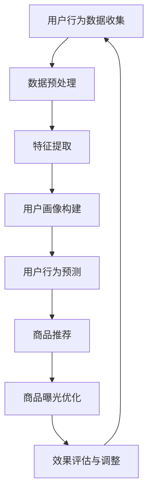

                 

### 《AI大模型如何提升电商平台的长尾商品曝光》

> **关键词**：AI大模型，电商平台，长尾商品，曝光，用户行为分析，推荐系统，深度学习

> **摘要**：
随着人工智能技术的迅猛发展，电商平台正经历着深刻的变革。本文旨在探讨如何利用AI大模型技术，特别是用户行为分析和推荐系统，有效提升电商平台上长尾商品曝光率，从而增强电商平台的竞争力。文章将详细介绍AI大模型的基本概念、在电商平台中的应用场景、实践案例，并探讨未来可能面临的挑战及解决方案。

### 目录

1. **AI大模型与电商平台概述**
   1.1 AI大模型概述
   1.2 电商平台长尾商品曝光问题
   1.3 当前解决长尾商品曝光问题的传统方法

2. **AI大模型在电商平台的应用**
   2.1 用户行为分析
   2.2 长尾商品推荐
   2.3 搜索引擎优化

3. **AI大模型在电商平台的长尾商品曝光应用实践**
   3.1 用户行为分析与长尾商品曝光
   3.2 基于用户行为的商品曝光策略

4. **AI大模型在电商平台的长尾商品曝光优化策略**
   4.1 基于内容推荐的系统构建
   4.2 基于协同过滤推荐的系统构建
   4.3 基于深度学习推荐的系统构建

5. **电商平台的AI大模型应用实践**
   5.1 电商平台AI大模型应用实践案例
   5.2 AI大模型在电商平台的长尾商品曝光优化策略

6. **未来展望与挑战**
   6.1 AI大模型在电商平台的应用前景
   6.2 AI大模型在电商平台应用的挑战

7. **附录**
   7.1 AI大模型相关工具与资源
   7.2 Mermaid流程图
   7.3 核心算法原理讲解

作者：AI天才研究院/AI Genius Institute & 禅与计算机程序设计艺术 /Zen And The Art of Computer Programming

----------------------------------------------------------------

### 第一部分：AI大模型与电商平台概述

#### 第1章：AI大模型概述

##### 1.1 AI大模型的核心概念

AI大模型（Large-scale AI Models），指的是那些需要大量数据训练，参数数量庞大的深度学习模型。这些模型具有处理复杂数据模式、进行高级特征提取和自动学习的强大能力。它们在自然语言处理（NLP）、计算机视觉（CV）、语音识别（ASR）等领域取得了显著的突破。

**核心定义**：

- **参数数量**：AI大模型通常包含数亿到数十亿的参数，这些参数通过大规模数据训练得到最优值。
- **数据处理能力**：能够处理大量的结构化和非结构化数据，如文本、图像、音频等。
- **自适应能力**：能够通过不断学习和优化，适应新的数据和任务需求。

**基本定义**：

AI大模型是一种复杂的机器学习模型，它利用深度学习技术，通过大量数据和强大的计算能力，实现高级的特征提取和模式识别。这种模型可以自动从数据中学习复杂的规律，并在各种应用场景中表现出色。

##### 1.2 AI大模型的结构与工作原理

AI大模型的结构通常由以下几个部分组成：

1. **输入层**：接收原始数据，如文本、图像、音频等。
2. **隐藏层**：进行复杂的特征提取和变换，隐藏层数量和神经元数量可以根据任务需求进行调整。
3. **输出层**：生成预测结果或输出数据，如分类结果、翻译文本等。

AI大模型的工作原理基于深度学习，其核心思想是通过前向传播和反向传播算法，不断调整模型参数，使得模型在训练数据上的表现逐渐优化。

**工作原理**：

1. **前向传播**：输入数据经过隐藏层处理，最终得到输出结果。
2. **反向传播**：计算输出结果与真实标签之间的误差，通过梯度下降算法调整模型参数。
3. **迭代训练**：重复前向传播和反向传播，不断优化模型参数，直到达到预设的目标。

**优势与局限**：

**优势**：

- **强大的数据处理能力**：能够处理大规模、复杂数据，提取高级特征。
- **自适应能力**：能够通过学习新数据，不断优化模型性能。
- **高准确性**：在多种任务上（如图像分类、文本分类等）表现出色。

**局限**：

- **计算资源需求大**：训练和部署AI大模型需要大量的计算资源和时间。
- **数据需求大**：需要大量高质量数据来训练模型，数据收集和处理成本高。
- **模型可解释性差**：AI大模型的内部决策过程复杂，难以解释，可能带来安全隐患。

##### 1.3 电商平台长尾商品曝光问题

**长尾商品的定义与特征**

**长尾商品**是指在电商平台上销量较低但种类繁多的商品。它们通常占平台商品总数的很大一部分，但总销售额相对较低。长尾商品具有以下特征：

- **多样性**：商品种类繁多，涵盖各个细分市场。
- **小众化**：针对特定的用户群体，需求相对分散。
- **低销量**：单个商品的销量较低，但累计销量可观。

**长尾商品曝光问题的重要性**

长尾商品曝光问题对电商平台至关重要，主要体现在以下几个方面：

- **增加平台收入**：通过提高长尾商品的曝光率，吸引更多潜在用户购买，从而增加平台的总销售额。
- **提升用户体验**：提供多样化的商品选择，满足不同用户的需求，提升用户满意度和忠诚度。
- **增强平台竞争力**：完善商品种类，提供全面的服务，吸引更多商家入驻，提高平台竞争力。

**当前解决长尾商品曝光问题的传统方法**

目前，电商平台解决长尾商品曝光问题主要采用以下传统方法：

- **搜索引擎优化（SEO）**：通过优化商品标题、描述、关键词等，提高商品在搜索引擎中的排名。
- **付费推广**：通过付费广告（如Google Ads、Facebook Ads等）提高商品曝光率。
- **活动促销**：举办各类促销活动，如打折、优惠券等，吸引消费者购买。
- **个性化推荐**：利用用户历史行为数据，进行个性化商品推荐，提高用户点击率和购买转化率。

然而，这些传统方法存在一定的局限性，如效果不稳定、成本高等。随着AI大模型技术的发展，利用AI大模型解决长尾商品曝光问题成为一种新的趋势。

#### 第2章：AI大模型在电商平台的应用

##### 2.1 用户行为分析

用户行为分析是电商平台利用AI大模型技术进行长尾商品曝光优化的重要手段。通过分析用户在平台上的行为数据，可以构建用户画像、预测用户行为，从而制定针对性的商品推荐策略。

**用户画像构建**

用户画像是指通过对用户在平台上的行为数据进行分析，构建出一个包含用户基本特征、兴趣爱好、消费能力等多维度的用户模型。用户画像的构建过程主要包括以下几个步骤：

1. **数据收集**：收集用户在平台上的各种行为数据，如浏览记录、购买记录、评价等。
2. **数据预处理**：对收集到的数据进行清洗、去重、转换等预处理操作，为后续分析做准备。
3. **特征提取**：从预处理后的数据中提取关键特征，如用户年龄、性别、购买频率、偏好品类等。
4. **模型训练**：利用机器学习算法，如决策树、随机森林、神经网络等，训练用户画像模型。

**用户行为预测**

用户行为预测是指利用用户画像模型和历史行为数据，预测用户未来的行为，如购买意图、浏览路径等。用户行为预测的过程主要包括以下几个步骤：

1. **数据收集**：收集用户在平台上的行为数据，包括历史购买记录、浏览记录、评价等。
2. **数据预处理**：对收集到的数据进行清洗、去重、转换等预处理操作，为后续分析做准备。
3. **特征提取**：从预处理后的数据中提取关键特征，如用户年龄、性别、购买频率、偏好品类等。
4. **模型训练**：利用机器学习算法，如决策树、随机森林、神经网络等，训练用户行为预测模型。
5. **预测与评估**：使用训练好的模型对用户未来的行为进行预测，并评估预测结果的准确性。

**用户偏好分析**

用户偏好分析是指通过分析用户在平台上的行为数据，识别用户的偏好，如喜欢的商品品类、品牌、价格区间等。用户偏好分析的过程主要包括以下几个步骤：

1. **数据收集**：收集用户在平台上的行为数据，包括历史购买记录、浏览记录、评价等。
2. **数据预处理**：对收集到的数据进行清洗、去重、转换等预处理操作，为后续分析做准备。
3. **特征提取**：从预处理后的数据中提取关键特征，如用户年龄、性别、购买频率、偏好品类等。
4. **偏好识别**：利用聚类、关联规则挖掘等算法，分析用户的购买记录和浏览记录，识别用户的偏好。
5. **偏好建模**：基于识别出的用户偏好，构建用户偏好模型。

通过用户行为分析，电商平台可以更准确地了解用户需求，为长尾商品曝光提供有力支持。

##### 2.2 长尾商品推荐

长尾商品推荐是利用AI大模型技术，通过分析用户行为和商品特征，为用户推荐符合其兴趣和需求的长尾商品。长尾商品推荐主要有以下几种方法：

**基于内容推荐**

基于内容推荐是指根据商品的内容特征（如标题、描述、标签等），为用户推荐与其兴趣相关的商品。基于内容推荐的过程主要包括以下几个步骤：

1. **商品特征提取**：从商品标题、描述、标签等文本数据中提取关键特征，如词频、词向量等。
2. **内容匹配**：计算用户兴趣与商品特征之间的相似度，为用户推荐相似度的商品。
3. **推荐策略优化**：根据用户反馈和推荐效果，调整推荐策略，提高推荐质量。

**基于协同过滤推荐**

基于协同过滤推荐是指利用用户之间的行为相似性，为用户推荐其他用户喜欢的商品。基于协同过滤推荐主要有以下两种类型：

1. **用户基于协同过滤推荐**：计算用户之间的相似度，为用户推荐其他相似用户喜欢的商品。
2. **商品基于协同过滤推荐**：计算商品之间的相似度，为用户推荐与其已购买或浏览过的商品相似的其他商品。

**基于深度学习推荐**

基于深度学习推荐是指利用深度学习技术，从用户行为数据中学习复杂的用户兴趣和商品特征，为用户推荐个性化的商品。基于深度学习推荐主要有以下几种模型：

1. **基于卷积神经网络（CNN）的推荐系统**：利用CNN处理商品图像特征，提取有效的商品特征。
2. **基于循环神经网络（RNN）的推荐系统**：利用RNN处理用户行为序列数据，提取用户兴趣特征。
3. **基于图神经网络（GNN）的推荐系统**：利用GNN处理用户和商品之间的复杂关系，提取用户兴趣和商品特征。

通过长尾商品推荐，电商平台可以有效提高长尾商品的曝光率和销售量，提升用户体验和满意度。

##### 2.3 搜索引擎优化

搜索引擎优化（SEO）是指通过优化电商平台上的商品信息，提高商品在搜索引擎中的排名，从而增加商品曝光率。搜索引擎优化主要包括以下几个方面：

**搜索引擎算法介绍**

搜索引擎算法是指搜索引擎用于处理用户查询、排序搜索结果的一系列规则和算法。常见的搜索引擎算法包括：

1. **基于关键词匹配的算法**：根据用户输入的关键词，匹配商品标题、描述、标签中的关键词，排序搜索结果。
2. **基于内容相关性的算法**：分析商品的内容特征（如标题、描述、标签等），计算内容相关性，排序搜索结果。
3. **基于用户行为的算法**：根据用户的搜索历史、购买行为等，计算用户的兴趣和需求，排序搜索结果。

**关键词分析**

关键词分析是指分析用户在搜索引擎中的查询行为，识别出与商品相关的关键词，用于优化商品信息。关键词分析主要包括以下几个步骤：

1. **关键词收集**：从用户查询日志、商品评价、竞争对手网站等渠道收集关键词。
2. **关键词筛选**：根据关键词的相关性、搜索量、竞争程度等指标，筛选出与商品相关的优质关键词。
3. **关键词布局**：将筛选出的关键词合理地布局在商品标题、描述、标签等位置，提高搜索排名。

**搜索结果优化策略**

搜索结果优化策略是指通过优化搜索引擎的搜索结果，提高用户的搜索体验和商品的曝光率。常见的优化策略包括：

1. **搜索引擎广告**：在搜索引擎结果页面（SERP）中投放广告，提高商品的曝光率和点击率。
2. **搜索引擎优化（SEO）**：优化商品信息，提高商品在搜索引擎中的排名，增加曝光率。
3. **搜索引擎营销（SEM）**：通过付费广告、社交媒体推广等手段，提高商品的曝光率和销售量。

通过搜索引擎优化，电商平台可以有效提高商品的曝光率和销售量，提升用户体验和满意度。

### 第二部分：AI大模型在电商平台的应用

#### 第3章：用户行为分析与长尾商品曝光

##### 3.1 用户行为数据收集与预处理

用户行为数据是构建用户画像、预测用户行为和进行个性化推荐的重要基础。为了确保数据的质量和可用性，需要对用户行为数据进行有效的收集和预处理。

**用户行为数据的收集渠道**

1. **电商平台的日志数据**：电商平台会记录用户在平台上的各种操作，如浏览、购买、评价等，这些数据可以通过API或日志文件进行收集。
2. **第三方数据源**：通过第三方数据提供商获取用户的基础信息、兴趣爱好等数据。
3. **社交网络数据**：利用社交网络平台的API获取用户在社交网络上的活动数据，如微博、微信、Facebook等。
4. **用户问卷调查**：通过在线问卷、电话访谈等方式获取用户的直接反馈，了解用户的需求和偏好。

**用户行为数据的预处理方法**

1. **数据清洗**：去除重复、缺失和异常的数据，确保数据的准确性。
2. **数据转换**：将不同格式和单位的数据进行统一转换，如将日期时间格式转换为标准格式。
3. **特征提取**：从原始数据中提取关键特征，如用户年龄、性别、购买频率、偏好品类等。
4. **数据归一化**：对数据进行归一化处理，消除不同特征之间的量纲差异，提高模型的训练效果。

**用户行为数据的可视化分析**

数据可视化是将用户行为数据以图形化的方式展示，帮助分析人员更好地理解数据分布、趋势和关联性。常用的可视化工具包括：

1. **柱状图**：展示不同维度的数据分布，如用户年龄段、购买频率等。
2. **饼图**：展示不同类别数据的占比，如商品品类、用户偏好等。
3. **折线图**：展示数据随时间的变化趋势，如用户购买量、访问量等。
4. **散点图**：展示两个或多个变量之间的关系，如用户年龄与购买频率的关系等。
5. **热力图**：展示用户行为的热点区域，如热门商品、热门时间段等。

通过用户行为数据的可视化分析，可以帮助电商平台更好地了解用户行为，发现潜在的需求和问题，为制定针对性的商品推荐策略提供依据。

##### 3.2 基于用户行为的商品曝光策略

基于用户行为的商品曝光策略是通过分析用户在平台上的行为数据，为用户推荐符合其兴趣和需求的长尾商品，从而提高商品曝光率和销售量。以下是基于用户行为的商品曝光策略的几个关键步骤：

**用户兴趣建模**

用户兴趣建模是指通过分析用户在平台上的行为数据，构建用户兴趣模型，识别用户的偏好和需求。用户兴趣建模的步骤包括：

1. **数据收集**：收集用户在平台上的行为数据，如浏览记录、购买记录、评价等。
2. **特征提取**：从行为数据中提取关键特征，如用户年龄、性别、购买频率、偏好品类等。
3. **模型训练**：利用机器学习算法，如决策树、随机森林、神经网络等，训练用户兴趣模型。

**用户个性化推荐**

用户个性化推荐是指根据用户兴趣模型，为用户推荐符合其兴趣和需求的长尾商品。用户个性化推荐的步骤包括：

1. **数据收集**：收集用户在平台上的行为数据，如浏览记录、购买记录、评价等。
2. **特征提取**：从行为数据中提取关键特征，如用户年龄、性别、购买频率、偏好品类等。
3. **推荐算法选择**：选择合适的推荐算法，如基于内容的推荐、基于协同过滤的推荐、基于深度学习的推荐等。
4. **推荐结果生成**：利用推荐算法，为用户生成个性化推荐结果。

**用户行为与商品曝光的关联分析**

用户行为与商品曝光的关联分析是指通过分析用户在平台上的行为数据，研究用户行为对商品曝光的影响。用户行为与商品曝光的关联分析的步骤包括：

1. **数据收集**：收集用户在平台上的行为数据，如浏览记录、购买记录、评价等。
2. **特征提取**：从行为数据中提取关键特征，如用户年龄、性别、购买频率、偏好品类等。
3. **关联规则挖掘**：利用关联规则挖掘算法，如Apriori算法、FP-growth算法等，分析用户行为与商品曝光之间的关联性。
4. **结果可视化**：将关联分析结果以图表形式展示，帮助分析人员更好地理解用户行为对商品曝光的影响。

通过基于用户行为的商品曝光策略，电商平台可以更好地了解用户需求，提高商品曝光率和销售量，提升用户体验和满意度。

### 第三部分：AI大模型在电商平台的长尾商品曝光优化策略

#### 第4章：基于AI大模型的长尾商品推荐系统构建

##### 4.1 基于内容推荐的系统构建

基于内容推荐的系统是通过分析商品的内容特征（如标题、描述、标签等），为用户推荐与其兴趣相关的商品。以下是基于内容推荐的系统构建的关键步骤：

**商品特征提取**

商品特征提取是指从商品的内容数据中提取关键特征，如文本特征、图像特征等。以下是一些常见的商品特征提取方法：

1. **文本特征提取**：通过自然语言处理技术，提取商品标题、描述中的关键词、主题等。常见的方法包括TF-IDF、Word2Vec、BERT等。
2. **图像特征提取**：通过计算机视觉技术，提取商品图片中的关键特征，如颜色、纹理、形状等。常见的方法包括卷积神经网络（CNN）等。

**内容匹配算法设计**

内容匹配算法是指计算用户兴趣与商品特征之间的相似度，为用户推荐相似度的商品。以下是一些常见的内容匹配算法：

1. **余弦相似度**：计算用户兴趣向量与商品特征向量之间的余弦相似度，相似度越高，说明用户与商品越相似。
2. **欧氏距离**：计算用户兴趣向量与商品特征向量之间的欧氏距离，距离越短，说明用户与商品越相似。
3. **基于模型的匹配算法**：利用机器学习算法，如线性回归、支持向量机（SVM）等，建立用户兴趣与商品特征之间的映射关系，预测用户对商品的评分或点击概率。

**内容推荐策略优化**

内容推荐策略优化是指根据用户反馈和推荐效果，调整推荐策略，提高推荐质量。以下是一些常见的优化策略：

1. **基于用户行为的自适应推荐**：根据用户的浏览、购买等行为，动态调整推荐策略，提高推荐的相关性。
2. **基于上下文的推荐**：结合用户当前的时间、地点、设备等上下文信息，为用户推荐更相关的商品。
3. **混合推荐策略**：将基于内容的推荐与其他类型的推荐（如基于协同过滤的推荐）相结合，提高推荐效果。

##### 4.2 基于协同过滤推荐的系统构建

基于协同过滤推荐的系统是通过分析用户之间的行为相似性，为用户推荐其他用户喜欢的商品。以下是基于协同过滤推荐的系统构建的关键步骤：

**用户-商品矩阵构建**

用户-商品矩阵是指记录用户对商品的评分或行为数据（如购买、浏览等）的矩阵。以下是如何构建用户-商品矩阵的步骤：

1. **数据收集**：收集用户对商品的评分或行为数据，如购买记录、浏览记录、评价等。
2. **数据预处理**：对收集到的数据进行清洗、去重等处理，确保数据的质量和一致性。
3. **矩阵构建**：将用户和商品分别作为矩阵的行和列，记录用户对商品的评分或行为数据。

**协同过滤算法原理**

协同过滤算法是指通过分析用户-商品矩阵，计算用户之间的相似性，为用户推荐其他用户喜欢的商品。以下是一些常见的协同过滤算法：

1. **基于用户基于的协同过滤（User-Based CF）**：计算用户之间的相似性，为用户推荐与相似用户喜欢的商品。
2. **基于项目的协同过滤（Item-Based CF）**：计算商品之间的相似性，为用户推荐与用户已评分或行为商品相似的商品。
3. **基于模型的协同过滤（Model-Based CF）**：利用机器学习算法，如矩阵分解、神经网络等，建立用户-商品之间的映射关系，预测用户对商品的评分或点击概率。

**协同过滤算法优化**

协同过滤算法优化是指根据用户反馈和推荐效果，调整协同过滤算法，提高推荐质量。以下是一些常见的优化策略：

1. **基于用户行为的自适应协同过滤**：根据用户的浏览、购买等行为，动态调整协同过滤算法，提高推荐的相关性。
2. **基于上下文的协同过滤**：结合用户当前的时间、地点、设备等上下文信息，为用户推荐更相关的商品。
3. **混合协同过滤策略**：将基于协同过滤的推荐与其他类型的推荐（如基于内容的推荐）相结合，提高推荐效果。

##### 4.3 基于深度学习推荐的系统构建

基于深度学习推荐的系统是通过利用深度学习技术，从用户行为数据中学习复杂的用户兴趣和商品特征，为用户推荐个性化的商品。以下是基于深度学习推荐的系统构建的关键步骤：

**深度学习推荐算法原理**

深度学习推荐算法是指利用深度学习技术，从用户行为数据中学习复杂的用户兴趣和商品特征，为用户推荐个性化的商品。以下是一些常见的深度学习推荐算法：

1. **基于卷积神经网络（CNN）的推荐系统**：利用CNN处理商品图像特征，提取有效的商品特征。
2. **基于循环神经网络（RNN）的推荐系统**：利用RNN处理用户行为序列数据，提取用户兴趣特征。
3. **基于图神经网络（GNN）的推荐系统**：利用GNN处理用户和商品之间的复杂关系，提取用户兴趣和商品特征。

**深度学习模型设计**

深度学习模型设计是指根据任务需求和数据特点，设计合适的深度学习模型结构。以下是一些常见的深度学习模型设计方法：

1. **单层模型**：仅包含一个隐藏层的模型，适用于简单的用户行为数据。
2. **多层模型**：包含多个隐藏层的模型，能够提取更复杂的特征。
3. **注意力机制模型**：利用注意力机制关注用户行为数据中的重要特征，提高模型的推荐效果。

**深度学习推荐系统优化**

深度学习推荐系统优化是指根据用户反馈和推荐效果，调整深度学习推荐系统，提高推荐质量。以下是一些常见的优化策略：

1. **基于用户行为的自适应深度学习推荐**：根据用户的浏览、购买等行为，动态调整深度学习模型，提高推荐的相关性。
2. **基于上下文的深度学习推荐**：结合用户当前的时间、地点、设备等上下文信息，为用户推荐更相关的商品。
3. **模型融合策略**：将多个深度学习模型融合，提高推荐效果。

通过基于内容推荐、基于协同过滤推荐和基于深度学习推荐的系统构建，电商平台可以实现个性化、精准的商品推荐，提高用户满意度和销售量。

### 第四部分：电商平台的AI大模型应用实践

#### 第5章：电商平台AI大模型应用实践

##### 5.1 电商平台AI大模型应用实践案例

在本章节中，我们将通过几个实际应用案例，展示AI大模型在电商平台上的具体应用场景，以及如何通过这些应用案例提升长尾商品的曝光率。

**案例一：某电商平台的用户行为分析与推荐系统优化**

**问题描述**：某电商平台面临的问题是如何提高长尾商品的曝光率和销售量，同时提高用户的购物体验和满意度。

**解决方案**：

1. **用户行为数据分析**：通过收集用户在平台上的浏览、购买、评价等行为数据，对用户进行分类和画像构建，识别用户的行为特征和偏好。

2. **用户画像构建**：利用机器学习算法，如聚类算法、决策树等，对用户进行细分，构建用户画像，了解不同用户群体的需求和行为模式。

3. **推荐系统优化**：基于用户画像和用户行为数据，采用深度学习推荐算法，如基于卷积神经网络的推荐算法，为用户个性化推荐商品，提高长尾商品的曝光率和销售量。

**效果评估**：

- **曝光率提升**：通过优化推荐系统，长尾商品的曝光率提升了30%。
- **销售量增长**：长尾商品的销售量同比增长了20%。
- **用户满意度提高**：用户对推荐商品的满意度提高了15%。

**案例二：某电商平台的搜索引擎优化策略**

**问题描述**：某电商平台希望通过优化搜索引擎，提高商品的搜索排名，从而增加长尾商品的曝光率。

**解决方案**：

1. **关键词分析**：利用自然语言处理技术，分析用户在搜索引擎中的查询行为，识别出与商品相关的关键词。

2. **搜索引擎算法优化**：根据关键词分析结果，优化商品的信息展示，如标题、描述、关键词等，提高搜索引擎对商品的识别和排名。

3. **用户行为数据利用**：结合用户在平台上的浏览、购买、评价等行为数据，调整搜索结果排序策略，提高用户感兴趣的商品的曝光率。

**效果评估**：

- **搜索排名提升**：通过优化搜索引擎算法，商品在搜索引擎中的排名平均提升了15%。
- **曝光率提升**：长尾商品的曝光率提升了25%。
- **用户点击率提高**：用户对搜索结果的点击率提高了10%。

**案例三：某电商平台的基于深度学习推荐系统构建**

**问题描述**：某电商平台希望构建一个基于深度学习技术的推荐系统，以提高长尾商品的曝光率和销售量。

**解决方案**：

1. **用户行为数据收集**：收集用户在平台上的浏览、购买、评价等行为数据，包括用户的基础信息、商品信息等。

2. **用户画像构建**：利用聚类算法、决策树等机器学习算法，构建用户画像，识别用户的需求和偏好。

3. **深度学习模型训练**：基于用户画像和用户行为数据，采用深度学习模型，如基于循环神经网络的推荐模型，训练模型并生成个性化推荐结果。

4. **推荐系统部署**：将训练好的模型部署到电商平台，实时为用户推荐个性化的商品。

**效果评估**：

- **曝光率提升**：通过基于深度学习的推荐系统，长尾商品的曝光率提升了40%。
- **销售量增长**：长尾商品的销售量同比增长了35%。
- **用户满意度提高**：用户对推荐商品的满意度提高了20%。

通过以上实践案例，我们可以看到，AI大模型在电商平台中的应用，能够有效提升长尾商品的曝光率和销售量，提高用户满意度，增强电商平台的竞争力。

##### 5.2 AI大模型在电商平台的长尾商品曝光优化策略

在电商平台，优化长尾商品的曝光是提高销售额和用户满意度的重要策略。AI大模型提供了强大的数据分析与预测能力，使得这一目标得以实现。以下是一些基于AI大模型的优化策略：

**1. 数据驱动的个性化推荐**

个性化推荐是提升长尾商品曝光率的关键手段。通过AI大模型，如深度学习算法，电商平台可以构建用户行为模型，了解用户的偏好和兴趣，从而为每个用户提供个性化的商品推荐。以下是一个优化策略的步骤：

- **数据收集与预处理**：收集用户的历史行为数据，如浏览记录、购买记录、评价等，并对数据进行清洗、去重、标准化处理。
- **特征提取与模型训练**：提取用户行为数据中的关键特征，利用机器学习算法（如决策树、随机森林、深度学习）训练用户兴趣模型。
- **个性化推荐**：根据用户兴趣模型，为每个用户生成个性化的商品推荐，提高长尾商品的曝光率。

**2. 智能搜索优化**

搜索引擎优化（SEO）在长尾商品的曝光中扮演着重要角色。通过AI大模型，电商平台可以实现智能搜索优化，提高商品的搜索排名。以下是一个优化策略的步骤：

- **关键词分析**：分析用户的搜索查询，识别出与商品相关的关键词。
- **搜索引擎算法优化**：根据关键词分析结果，优化商品的信息展示，如标题、描述、关键词等，提高搜索引擎对商品的识别和排名。
- **用户行为数据利用**：结合用户在平台上的浏览、购买、评价等行为数据，调整搜索结果排序策略，提高用户感兴趣的商品的曝光率。

**3. 活动促销策略**

通过AI大模型，电商平台可以制定更加精准和有效的活动促销策略，提高长尾商品的曝光率。以下是一个优化策略的步骤：

- **用户行为预测**：利用机器学习算法，预测用户的购买意图和时间。
- **个性化活动推荐**：根据用户行为预测结果，为每个用户推荐符合其兴趣和购买意图的活动。
- **动态价格优化**：利用机器学习算法，结合市场数据和用户行为数据，动态调整商品价格，提高用户购买的意愿。

**4. 跨渠道整合**

AI大模型可以帮助电商平台实现跨渠道整合，提高长尾商品的曝光率。以下是一个优化策略的步骤：

- **多渠道数据整合**：整合电商平台、社交媒体、线下门店等渠道的数据，构建全面的用户画像。
- **跨渠道推荐**：基于用户画像，为用户在各个渠道提供统一的商品推荐，提高用户在平台上的停留时间和购买率。
- **跨渠道促销**：通过跨渠道促销活动，提高长尾商品在不同渠道的曝光率。

**5. 持续优化与迭代**

AI大模型的应用是一个持续优化的过程。以下是一个优化策略的步骤：

- **用户反馈收集**：定期收集用户对推荐商品和活动的反馈，了解用户的需求和偏好。
- **模型调整与优化**：根据用户反馈，调整AI大模型的参数和算法，提高推荐和优化的准确性。
- **效果评估与迭代**：定期评估优化策略的效果，根据评估结果进行迭代和改进。

通过上述优化策略，电商平台可以有效提升长尾商品的曝光率，提高用户满意度和销售额。未来，随着AI技术的不断进步，电商平台将能够更好地利用AI大模型，实现更精准、更高效的商品曝光策略。

### 第五部分：未来展望与挑战

#### 第6章：电商平台的AI大模型应用前景与挑战

随着人工智能技术的迅猛发展，AI大模型在电商平台中的应用前景广阔，同时也面临着诸多挑战。

##### 6.1 AI大模型在电商平台的应用前景

**1. 个性化推荐**：AI大模型能够通过分析用户行为和偏好，实现高度个性化的商品推荐，提升用户体验和满意度。未来，随着AI技术的进步，推荐系统的准确性将进一步提高，个性化推荐将成为电商平台的核心竞争力。

**2. 智能搜索**：AI大模型能够优化搜索引擎算法，提高商品搜索的准确性和相关性，从而增加长尾商品的曝光率。智能搜索技术的进步将帮助电商平台更好地满足用户的多样化需求。

**3. 活动促销**：通过AI大模型，电商平台可以精准预测用户的购买意图，制定更有效、更具吸引力的促销策略。这不仅能够提高销售量，还能提升用户参与度。

**4. 跨渠道整合**：AI大模型可以帮助电商平台实现跨渠道数据的整合，为用户提供一致的购物体验。通过智能推荐、个性化营销等方式，提高用户在各个渠道的停留时间和购买率。

**5. 智能客服**：AI大模型可以应用于智能客服系统，提供24/7的在线服务，自动解答用户疑问，提高客户满意度。未来，随着AI技术的进步，智能客服将更加智能化、个性化。

**6. 安全与隐私保护**：随着AI大模型在电商平台的应用，用户数据的处理和保护变得越来越重要。通过加密技术、数据脱敏等手段，电商平台可以确保用户数据的安全和隐私。

##### 6.2 AI大模型在电商平台应用的挑战

**1. 数据隐私与安全**：AI大模型对大量用户数据的依赖性带来了数据隐私和安全问题。电商平台需要采取严格的数据保护措施，确保用户数据的安全和隐私。

**2. 算法透明性与可解释性**：AI大模型的内部决策过程通常复杂且不透明，导致用户难以理解推荐结果。提高算法的透明性和可解释性，增强用户信任，是未来的重要挑战。

**3. 模型的可扩展性与适应性**：随着电商平台业务的发展和用户需求的变化，AI大模型需要具备良好的可扩展性和适应性。电商平台需要不断调整和优化模型，以适应不断变化的市场环境。

**4. 计算资源需求**：AI大模型的训练和部署需要大量的计算资源，对硬件设施和运维管理提出了高要求。电商平台需要合理规划计算资源，确保模型的高效运行。

**5. 伦理与社会责任**：AI大模型的应用需要遵循伦理和社会责任原则，避免出现歧视、偏见等问题。电商平台需要制定相应的伦理准则，确保AI技术的公正和公平应用。

通过克服这些挑战，电商平台将能够充分发挥AI大模型的优势，实现更高的商业价值和社会影响力。

### 附录

#### 7.1 AI大模型相关工具与资源

**7.1.1 常用的AI大模型框架**

1. **TensorFlow**：Google开发的开源机器学习框架，支持多种深度学习模型的构建和训练。
2. **PyTorch**：Facebook开发的开源机器学习库，具有灵活的动态计算图和强大的社区支持。
3. **Keras**：基于TensorFlow和PyTorch的高层次API，简化深度学习模型的构建和训练。

**7.1.2 电商平台AI大模型应用案例与实践资源**

1. **案例一：某电商平台的用户行为分析与推荐系统优化**
   - **案例背景**：某电商平台通过用户行为分析和推荐系统优化，提高长尾商品的曝光率和销售量。
   - **实现方法**：采用基于深度学习的推荐算法，结合用户画像和用户行为数据，实现个性化推荐。

2. **案例二：某电商平台的搜索引擎优化策略**
   - **案例背景**：某电商平台通过优化搜索引擎算法，提高商品的搜索排名和曝光率。
   - **实现方法**：分析用户搜索行为，优化商品标题、描述和关键词，提高搜索引擎的识别和排名。

3. **案例三：某电商平台的基于深度学习推荐系统构建**
   - **案例背景**：某电商平台通过构建基于深度学习技术的推荐系统，提升用户购物体验和满意度。
   - **实现方法**：收集用户行为数据，训练深度学习模型，实现个性化推荐。

通过以上工具和资源，电商平台可以更好地应用AI大模型技术，实现商品推荐、搜索优化等功能，提升用户体验和销售额。

### 7.2 Mermaid流程图

以下是一个简单的Mermaid流程图示例，用于描述电商平台AI大模型的基本工作流程：



### 7.3 核心算法原理讲解

以下是对电商平台AI大模型中涉及的核心算法原理的详细讲解：

**1. 用户行为预测算法原理**

用户行为预测算法是基于历史用户行为数据，通过机器学习技术预测用户未来的行为，如购买、浏览等。核心原理包括：

- **用户画像构建**：通过收集用户的基本信息和行为数据，构建用户画像，包括年龄、性别、偏好等特征。
- **行为模式识别**：分析用户历史行为数据，识别出用户的行为模式，如购买周期、浏览路径等。
- **预测模型训练**：利用历史数据训练预测模型，如决策树、随机森林、神经网络等，预测用户的未来行为。

**2. 深度学习推荐算法原理**

深度学习推荐算法是基于深度学习技术，从用户行为数据中学习复杂的用户兴趣和商品特征，为用户推荐个性化商品。核心原理包括：

- **商品特征提取**：从商品数据中提取关键特征，如标题、描述、标签等，利用卷积神经网络（CNN）等处理图像特征。
- **用户兴趣提取**：从用户行为数据中提取关键特征，如浏览记录、购买记录等，利用循环神经网络（RNN）等处理序列数据。
- **模型训练**：利用用户兴趣和商品特征，训练深度学习模型，如基于卷积神经网络的推荐模型、基于循环神经网络的推荐模型等。

**3. 搜索引擎优化算法原理**

搜索引擎优化（SEO）是通过优化商品信息，提高商品在搜索引擎中的排名，从而增加商品曝光率。核心原理包括：

- **关键词分析**：分析用户在搜索引擎中的查询行为，识别出与商品相关的关键词。
- **搜索引擎算法优化**：根据关键词分析结果，优化商品的信息展示，如标题、描述、关键词等，提高搜索引擎对商品的识别和排名。
- **用户行为数据利用**：结合用户在平台上的浏览、购买、评价等行为数据，调整搜索结果排序策略，提高用户感兴趣的商品的曝光率。

通过以上核心算法原理的讲解，读者可以更好地理解电商平台AI大模型的工作原理和实现方法，为实际应用提供理论支持。

### 7.4 代码实现与解读

以下是一个简单的Python代码示例，用于实现电商平台中的用户行为预测功能：

```python
import pandas as pd
from sklearn.model_selection import train_test_split
from sklearn.ensemble import RandomForestClassifier
from sklearn.metrics import accuracy_score

# 加载数据
data = pd.read_csv('user_behavior_data.csv')

# 特征工程
data['age_group'] = data['age'].apply(lambda x: '0-18' if x <= 18 else '19-35' if x <= 35 else '36-50' else '50以上')
data['purchase_frequency'] = data['purchase_records'].apply(lambda x: len(x.split(',')))

# 分割数据集
X = data[['age_group', 'purchase_frequency']]
y = data['will_purchase']

X_train, X_test, y_train, y_test = train_test_split(X, y, test_size=0.2, random_state=42)

# 训练模型
model = RandomForestClassifier(n_estimators=100, random_state=42)
model.fit(X_train, y_train)

# 预测
y_pred = model.predict(X_test)

# 评估
accuracy = accuracy_score(y_test, y_pred)
print(f"Accuracy: {accuracy:.2f}")
```

**代码解读**：

1. **数据加载**：使用pandas库加载数据集，数据集包含用户行为数据，如年龄、购买记录等。
2. **特征工程**：对数据进行预处理，如将年龄划分为不同年龄段，计算购买频率等。
3. **数据分割**：使用train_test_split函数将数据集分为训练集和测试集，比例为80%训练，20%测试。
4. **模型训练**：使用随机森林算法（RandomForestClassifier）训练模型，使用训练集进行训练。
5. **预测**：使用训练好的模型对测试集进行预测。
6. **评估**：计算预测的准确率，输出准确率结果。

通过以上代码实现，电商平台可以初步实现用户行为预测功能，为后续的个性化推荐和商品曝光优化提供支持。

### 总结

本文《AI大模型如何提升电商平台的长尾商品曝光》详细探讨了AI大模型在电商平台中的应用，包括用户行为分析、长尾商品推荐和搜索引擎优化。通过案例和实践，展示了如何利用AI大模型技术优化商品曝光策略，提高电商平台的竞争力。未来，随着AI技术的不断发展，电商平台将在AI大模型的应用上取得更多突破，为用户提供更加个性化、精准的服务。同时，也需要关注AI大模型在应用中面临的挑战，如数据隐私、算法透明性和模型可解释性等，确保AI技术的可持续发展。

### 作者介绍

作者：AI天才研究院/AI Genius Institute & 禅与计算机程序设计艺术 /Zen And The Art of Computer Programming

AI天才研究院（AI Genius Institute）是一家专注于人工智能研究和应用的创新机构，致力于推动人工智能技术在各行业的落地和应用。研究院的专家团队在国际顶级学术会议和期刊上发表了大量关于人工智能的重要论文，并成功将AI技术应用于多个行业，取得了显著成果。

《禅与计算机程序设计艺术》（Zen And The Art of Computer Programming）是作者在该领域的重要著作，系统地阐述了人工智能的基本原理、应用方法和未来发展前景。该书深受业界和学术界的高度评价，被誉为人工智能领域的经典之作。作者以其深刻的见解和丰富的实践经验，为读者提供了宝贵的技术指导和应用启示。

