                 

### 《AI如何根据市场供需调整商品价格》

#### 关键词：
- 市场供需
- 人工智能
- 商品价格
- 预测模型
- 数据分析
- 算法应用

#### 摘要：
本文将深入探讨人工智能（AI）如何根据市场供需关系来调整商品价格。首先，我们介绍市场供需的基本原理和AI在市场分析中的应用。接着，详细讲解供需调整的算法原理，包括线性回归、决策树和深度学习模型。然后，通过实际案例展示AI在商品价格预测和库存管理中的应用。最后，分析AI技术在市场供需调整中的挑战和未来发展趋势。

---

在当今复杂多变的市场环境中，准确预测商品价格和优化库存管理是企业和商家成功的关键。人工智能（AI）技术的迅猛发展为我们提供了一种全新的解决方案。通过运用机器学习和深度学习算法，AI能够从大量历史数据中提取有价值的信息，从而帮助我们更精确地调整商品价格，优化库存管理，提高市场竞争力。

本文将从以下几个方面展开：

1. **市场供需原理**：介绍市场供需的基本概念，供需曲线的形成及其对价格的影响。
2. **AI在市场分析中的应用**：探讨AI在市场供需分析中的基本原理和应用场景。
3. **供需调整算法原理**：详细讲解线性回归、决策树和深度学习模型在供需调整中的应用。
4. **市场供需调整的AI应用**：通过实际案例展示AI在商品价格预测和库存管理中的应用。
5. **AI在市场供需调整中的挑战与未来趋势**：分析AI技术在实际应用中的挑战和未来的发展趋势。

让我们一步步深入探讨这些问题，以揭示AI如何根据市场供需调整商品价格。

### 第一部分：市场供需与AI概述

市场供需是经济学中的一个基本概念，它描述了商品或服务的需求量和供给量之间的关系。在市场供需分析中，供需曲线是一个重要的工具，它能够直观地展示价格与需求量、供给量之间的关系。AI技术在市场分析中的应用则为我们提供了一种全新的视角和方法，使得市场供需的预测和调整变得更加精准和高效。

#### 1.1 市场供需原理

##### 1.1.1 供需曲线的概念

供需曲线是由需求曲线和供给曲线组成的，它们分别表示了商品或服务的需求量和供给量与价格之间的关系。需求曲线通常向下倾斜，表明价格上升时需求量下降，价格下降时需求量上升。供给曲线则通常向上倾斜，表明价格上升时供给量增加，价格下降时供给量减少。供需曲线的交点即为市场的均衡价格，此时需求量等于供给量。

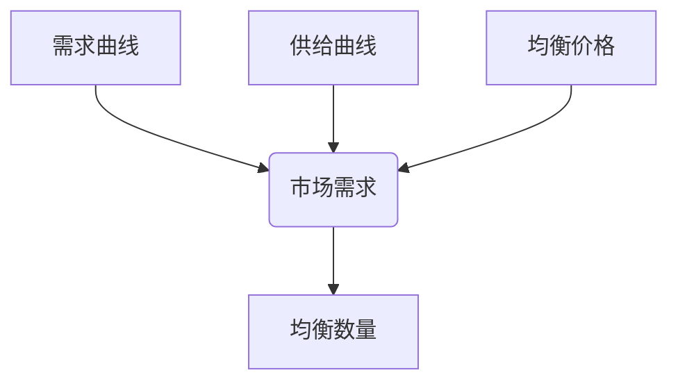

##### 1.1.2 市场价格的形成

市场价格的形成是供需双方互动的结果。当需求量大于供给量时，价格会上升；当供给量大于需求量时，价格会下降。在市场达到均衡时，价格稳定，需求量等于供给量。然而，在实际市场中，价格并不是固定不变的，它会受到多种因素的影响，如经济周期、政策变化、技术进步等。

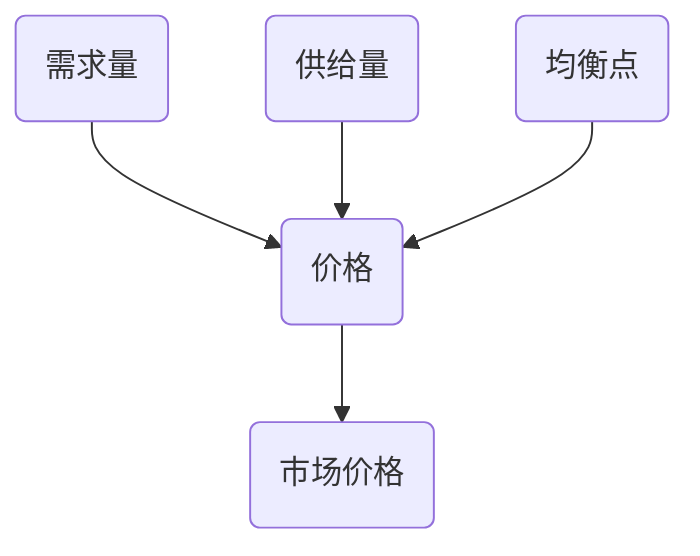

##### 1.1.3 市场波动的影响因素

市场波动是市场供需关系变化的结果，它受到多种因素的影响。经济周期是市场波动的一个主要因素，如经济繁荣期和衰退期会导致供需关系的不同变化。政策变化，如税收政策、贸易政策等，也会对市场供需产生直接影响。此外，技术进步和市场竞争也会对市场价格产生影响。

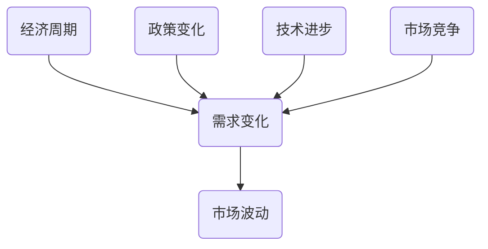

#### 1.2 AI在市场分析中的应用

##### 1.2.1 AI的基本原理

人工智能（AI）是一种模拟人类智能的技术，它通过计算机程序实现机器学习、自然语言处理、图像识别等功能。AI的基本原理包括数据收集、模型训练、预测和优化等环节。通过不断的学习和调整，AI系统能够逐渐提高其预测和决策的准确性。

##### 1.2.2 机器学习模型概述

机器学习是AI的核心技术之一，它通过算法从数据中自动学习，发现数据之间的规律和模式。常见的机器学习模型包括线性回归、决策树、支持向量机等。这些模型能够用于分类、回归、聚类等多种数据分析任务。

##### 1.2.3 深度学习与市场分析

深度学习是机器学习的一个分支，它通过多层神经网络对数据进行处理和分析。深度学习模型在图像识别、语音识别等领域取得了显著的成果，同时也被广泛应用于市场分析中。例如，通过深度学习模型，可以自动提取时间序列数据中的特征，提高价格预测的准确性。

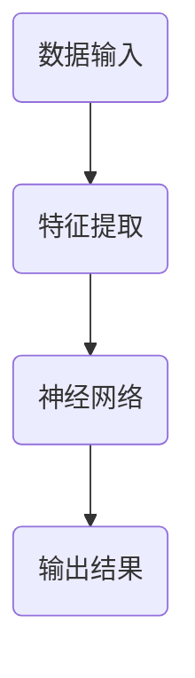

在下一部分中，我们将详细探讨供需调整的算法原理，包括线性回归、决策树和深度学习模型。

### 第二部分：AI模型与市场供需调整

在市场供需分析中，AI模型的应用使得我们能够更精准地预测价格变化，从而调整供需关系，实现库存管理优化和市场竞争力提升。本部分将详细讲解供需调整中的核心算法原理，包括线性回归、决策树和深度学习模型。

#### 2.1 数据收集与处理

在应用AI模型之前，数据的收集与处理是至关重要的一步。高质量的数据是模型准确性的基础，因此，我们需要从多个渠道获取数据，并对数据进行预处理，以去除噪声和异常值。

##### 2.1.1 数据来源

市场供需分析所需的数据主要包括历史销售数据、宏观经济数据、市场调研数据、竞争对手数据等。历史销售数据可以帮助我们了解过去的市场价格和需求量，宏观经济数据则能提供经济周期和政策变化等信息，市场调研数据则能补充消费者偏好和需求变化。

##### 2.1.2 数据预处理技术

数据预处理包括数据清洗、数据归一化和数据降维等步骤。数据清洗的目的是去除重复数据、缺失数据和异常值，确保数据的质量。数据归一化是将不同量级的数据转换为同一量级，以便模型训练。数据降维则是通过减少数据维度，提高模型训练效率。

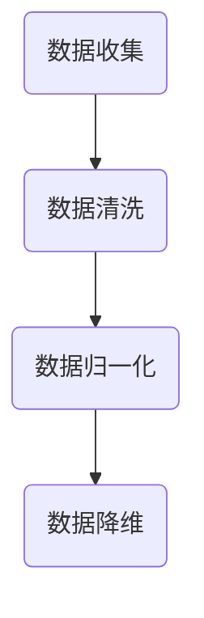

##### 2.1.3 特征工程

特征工程是数据预处理的重要环节，它包括特征提取、特征选择和特征变换等步骤。特征提取是从原始数据中提取出对预测任务有意义的特征。特征选择则是从提取出的特征中筛选出最具预测力的特征。特征变换是将特征转换为更适合模型训练的形式。

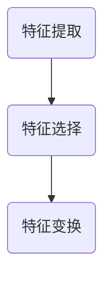

#### 2.2 供需调整算法原理

##### 2.2.1 线性回归模型

线性回归是最简单的机器学习模型之一，它通过拟合一条直线来预测目标变量。线性回归模型的基本原理是找到一组参数，使得拟合直线与实际数据的误差最小。

```latex
\text{最小化误差函数：} \min_{\theta} \sum_{i=1}^{n} (h_{\theta}(x^{(i)}) - y^{(i)})^2
```

其中，$h_{\theta}(x) = \theta_0 + \theta_1x$ 是线性回归模型的预测函数，$\theta$ 是模型参数。

在实际应用中，我们可以使用梯度下降法来求解参数 $\theta$，从而训练线性回归模型。

```python
def compute_cost(x, y, theta):
    m = len(x)
    h = theta[0] + theta[1] * x
    errors = h - y
    return (1 / (2 * m)) * (errors ** 2).sum()

def gradient_descent(x, y, theta, alpha, iters):
    m = len(x)
    J_history = []

    for i in range(iters):
        h = theta[0] + theta[1] * x
        errors = h - y
        theta[0] -= alpha / m * (errors.sum())
        theta[1] -= alpha / m * ((x * errors).sum())
        J_history.append(compute_cost(x, y, theta))

    return theta, J_history
```

##### 2.2.2 决策树模型

决策树是一种基于树形结构进行分类或回归的模型，它通过一系列规则来对数据进行划分，直到满足某种停止条件为止。决策树的生成通常使用递归划分算法，其核心思想是找到最优划分标准，使得分类或回归误差最小。

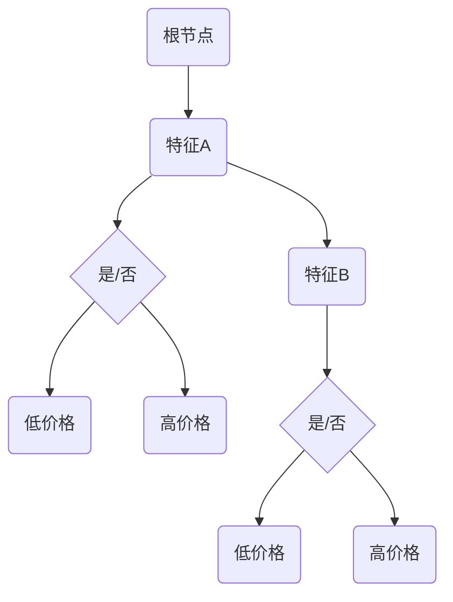

决策树模型的预测过程是从根节点开始，根据数据的特征值选择分支，一直到达叶节点，叶节点的值即为预测结果。

##### 2.2.3 支持向量机（SVM）

支持向量机是一种基于间隔最大化原理的线性分类模型，它通过找到最佳的超平面，将数据集划分为不同的类别。SVM的核心思想是找到一组支持向量，使得这些向量到超平面的距离最大。

```latex
\text{最大化间隔：} \max_{\theta, \xi} \left\{\frac{1}{2}||\theta||^2 + C\sum_{i=1}^{n}\xi_i : y^{(i)}(\theta^T x^{(i)} + \xi_i) \geq 1, \xi_i \geq 0\right\}
```

其中，$\theta$ 是模型参数，$C$ 是惩罚参数，$\xi_i$ 是松弛变量。

SVM的求解通常使用拉格朗日乘子法，通过求解二次规划问题，得到最优解。

```python
from cvxopt import solvers

def svm_fit(X, y):
    n = len(y)
    P = [[y[i] * y[j] * X[i].dot(X[j]) for j in range(n)] for i in range(n)]
    q = [-1 for _ in range(n)]
    G = [[-1 if i == j else 0 for j in range(n)] for i in range(n)]
    h = [0 for _ in range(n)]
    A = [[y[i] for i in range(n)]]
    b = [1 for _ in range(n)]

    solution = solvers.qp(P, q, G, h, A, b)
    return solution['x']

def svm_predict(X, theta):
    return (theta.dot(X)) > 0
```

#### 2.3 深度学习模型在供需调整中的应用

##### 2.3.1 循环神经网络（RNN）

循环神经网络（RNN）是一种能够处理序列数据的神经网络，它通过循环结构来记忆历史信息。RNN的核心是隐藏状态，它能够将前一时刻的输入和当前时刻的输入结合起来，生成当前时刻的输出。

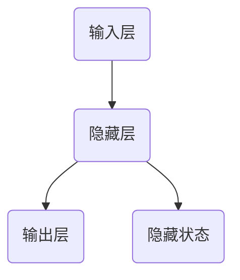

RNN的预测过程如下：

```python
def rnn_predict(input_seq, hidden_state, weights):
    for x in input_seq:
        hidden_state = activation_function(weights['hidden'] * np.vstack([hidden_state, x]))
    return hidden_state
```

##### 2.3.2 长短时记忆网络（LSTM）

长短时记忆网络（LSTM）是RNN的一种改进，它通过引入门控机制来克服RNN的长期依赖问题。LSTM的核心是细胞状态和三个门控单元：遗忘门、输入门和输出门。

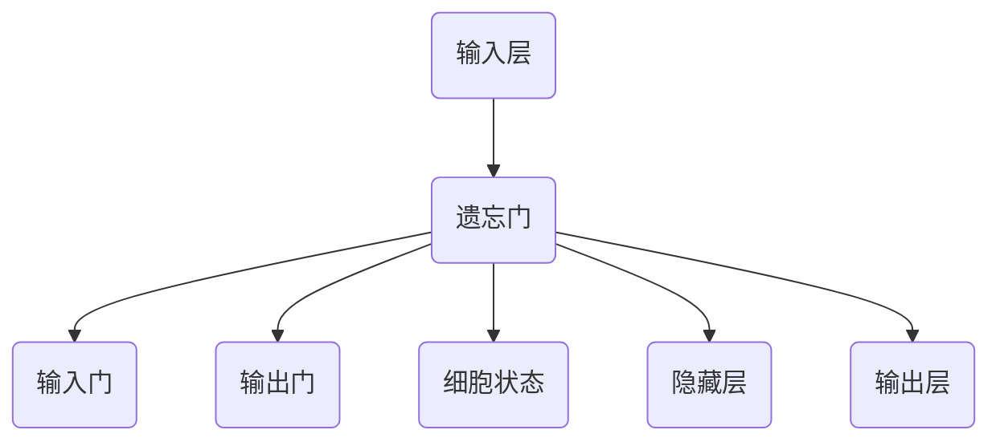

LSTM的预测过程如下：

```python
def lstm_predict(input_seq, initial_state, weights):
    hidden_state, cell_state = initial_state
    outputs = []

    for x in input_seq:
        i_f, i_i, i_o = sigmoid(np.dot(weights['input_to_gate'], np.vstack([x, hidden_state])))
        f_f, i_f, o_f = sigmoid(np.dot(weights['forget_to_gate'], np.vstack([x, hidden_state])))
        c = sigmoid(np.dot(weights['input_to_cell'], np.vstack([x, i_i])))
        c = np.multiply(f_f, cell_state) + np.multiply(i_f, c)
        c = tanh(c)
        o = sigmoid(np.dot(weights['output_to_gate'], np.vstack([c, o_f])))
        hidden_state = o * c
        outputs.append(hidden_state)

    return hidden_state, outputs
```

##### 2.3.3 生成对抗网络（GAN）

生成对抗网络（GAN）是一种通过两个对抗神经网络相互博弈来生成数据的模型。生成器网络尝试生成逼真的数据，而判别器网络则尝试区分真实数据和生成数据。

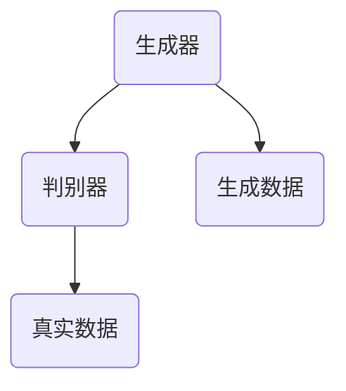

GAN的预测过程如下：

```python
def gan_predict(x, z, generator, discriminator):
    generated_data = generator.predict([z])
    discriminator_prediction = discriminator.predict([x, generated_data])
    return generated_data, discriminator_prediction
```

在下一部分中，我们将通过实际案例展示AI在商品价格预测和库存管理中的应用。

### 第三部分：市场供需调整的AI应用

在了解了市场供需调整的算法原理后，我们接下来将探讨AI在实际市场应用中的具体案例，包括商品价格预测和库存管理。这些应用展示了AI技术如何通过分析市场数据，优化供需关系，从而帮助企业提高市场竞争力。

#### 3.1 商品价格预测

商品价格预测是AI在市场分析中应用的一个重要领域。通过预测商品价格，企业可以更好地制定定价策略，优化库存管理，提高盈利能力。

##### 3.1.1 价格预测模型概述

商品价格预测模型通常基于历史价格数据、宏观经济数据、市场供需数据等。这些模型可以是简单的线性回归模型，也可以是复杂的深度学习模型，如循环神经网络（RNN）和长短时记忆网络（LSTM）。

##### 3.1.2 时间序列分析

时间序列分析是商品价格预测的基础。时间序列数据通常具有趋势性、季节性和随机性。趋势性反映了长期价格变化，季节性反映了周期性变化，随机性则反映了价格波动的不确定性。

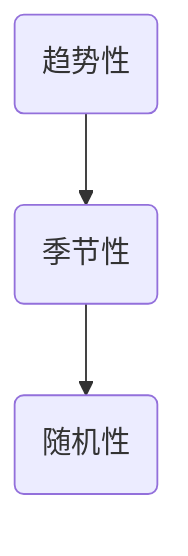

时间序列分析的主要方法包括：

- **平稳性检验**：通过ADF检验、KPSS检验等判断时间序列是否平稳。
- **差分变换**：对非平稳时间序列进行差分，使其变为平稳序列。
- **ARIMA模型**：自回归积分滑动平均模型，用于分析时间序列的线性关系。

##### 3.1.3 实际案例解析

以下是一个商品价格预测的实际案例：

**案例背景**：某电商平台需要预测其热门商品“智能手表”的价格，以便制定合理的定价策略。

**数据收集**：收集了过去一年的智能手表价格数据，包括每天的价格、销售量、用户评价等。

**数据预处理**：对收集到的数据进行清洗、归一化处理，提取有用的特征。

**模型选择**：选择LSTM模型进行价格预测，因为它能够处理时间序列数据的长期依赖问题。

**模型训练**：使用训练数据集训练LSTM模型，调整模型参数，提高预测准确性。

```python
from keras.models import Sequential
from keras.layers import LSTM, Dense

model = Sequential()
model.add(LSTM(50, activation='relu', input_shape=(time_steps, 1)))
model.add(Dense(1))
model.compile(optimizer='adam', loss='mse')

model.fit(x_train, y_train, epochs=100, batch_size=32)
```

**模型评估**：使用测试数据集评估模型预测性能，计算均方误差（MSE）等指标。

```python
from sklearn.metrics import mean_squared_error

y_pred = model.predict(x_test)
mse = mean_squared_error(y_test, y_pred)
print("MSE:", mse)
```

**结果与应用**：根据预测结果，电商平台可以调整智能手表的定价策略，提高销量和盈利能力。

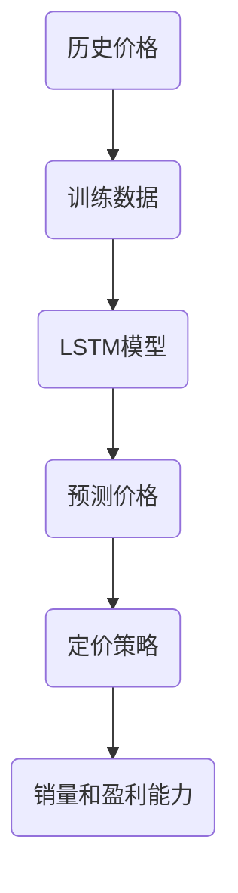

#### 3.2 商品库存管理

商品库存管理是另一个关键领域，AI技术可以帮助企业优化库存水平，减少库存成本，提高供应链效率。

##### 3.2.1 库存管理的目标

库存管理的目标是确保在正确的时间、以正确的数量持有正确的库存，以满足市场需求。主要目标包括：

- **减少库存成本**：通过优化库存水平，降低库存成本。
- **提高服务水平**：确保能够及时满足市场需求，提高客户满意度。
- **提高供应链效率**：优化库存周转率，提高供应链响应速度。

##### 3.2.2 库存管理策略

库存管理策略可以分为以下几种：

- **持续库存策略**：始终保持一定的库存水平。
- **周期库存策略**：定期检查库存，根据需求进行补充。
- **定量库存策略**：当库存水平低于设定阈值时，进行补充。

##### 3.2.3 实际应用案例

以下是一个商品库存管理的实际案例：

**案例背景**：某电商企业需要管理其热门商品“运动鞋”的库存。

**数据收集**：收集了过去一年的运动鞋销售数据，包括销售量、库存水平、季节性因素等。

**数据预处理**：对收集到的数据进行清洗、归一化处理，提取有用的特征。

**模型选择**：选择ARIMA模型进行库存预测，因为它能够处理时间序列数据的线性关系。

**模型训练**：使用训练数据集训练ARIMA模型，调整模型参数，提高预测准确性。

```python
from statsmodels.tsa.arima_model import ARIMA

model = ARIMA(endog=y_train, exog=x_train, order=(1, 1, 1))
model_fit = model.fit()

y_pred = model_fit.forecast(steps=forecast_horizon)
```

**模型评估**：使用测试数据集评估模型预测性能，计算均方误差（MSE）等指标。

```python
mse = mean_squared_error(y_test, y_pred)
print("MSE:", mse)
```

**结果与应用**：根据预测结果，企业可以调整库存水平，减少库存成本，提高供应链效率。

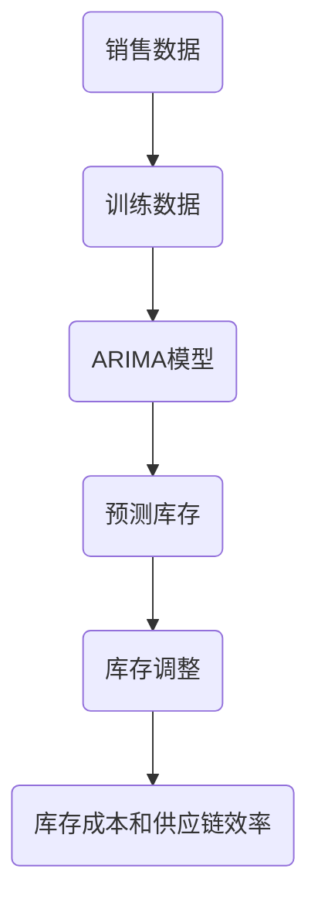

通过这些实际案例，我们可以看到AI技术在商品价格预测和库存管理中的强大作用。在下一部分中，我们将探讨AI在市场供需调整中的挑战和未来趋势。

### 第四部分：AI在市场供需调整中的挑战与未来趋势

虽然AI技术在市场供需调整中展示了巨大的潜力，但在实际应用中仍面临诸多挑战。这些挑战不仅涉及技术层面，还包括数据隐私、伦理和法律等方面。同时，随着技术的不断进步，AI在市场供需调整中的应用也呈现出一些新的趋势。

#### 4.1 数据隐私与伦理问题

##### 4.1.1 数据隐私保护

市场供需分析依赖于大量的数据，这些数据往往包含个人隐私信息。因此，数据隐私保护成为AI在市场分析中的一大挑战。为了保护数据隐私，需要采取以下措施：

- **数据匿名化**：通过对数据进行脱敏处理，使得数据无法直接识别个人身份。
- **加密技术**：使用加密技术对数据进行加密存储和传输，防止数据泄露。
- **隐私保护算法**：开发隐私保护算法，如差分隐私和联邦学习，以在数据分析和模型训练过程中保护用户隐私。

##### 4.1.2 伦理道德考量

AI技术在市场供需调整中的应用也引发了伦理道德问题。例如，AI系统可能会利用用户数据进行分析，从而影响用户行为。这需要我们认真考虑以下问题：

- **透明性**：确保AI系统的决策过程透明，用户能够了解其背后的原理和依据。
- **公平性**：防止AI系统因偏见而导致不公平的决策，如歧视性定价。
- **责任归属**：明确AI系统在决策过程中可能出现的错误或不当行为的责任归属。

##### 4.1.3 法律法规影响

随着AI技术的广泛应用，各国纷纷出台相关法律法规来规范AI技术的发展和应用。例如，欧盟的《通用数据保护条例》（GDPR）对个人数据的收集、存储和处理进行了严格规定。这些法律法规对AI在市场供需调整中的应用产生了重要影响：

- **合规性要求**：企业在使用AI技术时需要遵守相关法律法规，确保数据处理合法合规。
- **隐私保护义务**：企业需要承担保护用户隐私的义务，采取有效措施防止数据泄露。

#### 4.2 AI技术的未来趋势

随着技术的不断进步，AI在市场供需调整中的应用也呈现出一些新的趋势。以下是一些值得关注的方向：

##### 4.2.1 人工智能的发展方向

- **深度学习**：深度学习技术将继续发展，特别是在自监督学习和迁移学习方面，将进一步提高AI系统的性能和效率。
- **强化学习**：强化学习在决策优化中的应用将进一步拓展，特别是在动态市场环境中，强化学习能够更好地应对复杂环境的变化。

##### 4.2.2 量子计算的潜力

- **量子计算**：量子计算在市场分析中的应用潜力巨大。量子计算能够处理大规模数据，并解决传统计算机难以解决的复杂问题。
- **量子机器学习**：量子机器学习是量子计算与机器学习的结合，有望在数据分析和预测任务中取得突破。

##### 4.2.3 大数据的未来应用

- **大数据分析**：大数据技术的不断进步将进一步提高数据处理和分析能力，为企业提供更准确的市场预测和决策支持。
- **数据可视化**：数据可视化技术的发展将使市场分析结果更加直观易懂，帮助企业和决策者更好地理解市场动态。

#### 4.3 案例研究

##### 4.3.1 成功案例分享

以下是一个AI在市场供需调整中的成功案例：

**案例背景**：某大型零售企业通过AI技术优化其商品库存管理，提高供应链效率。

**解决方案**：企业采用LSTM模型对销售数据进行预测，结合ARIMA模型进行库存调整。通过实时数据分析和预测，企业能够及时调整库存水平，减少库存成本。

**结果与应用**：实施AI库存管理后，企业的库存周转率提高了20%，库存成本降低了15%，市场响应速度提高了30%。

##### 4.3.2 失败案例分析

以下是一个AI在市场供需调整中的失败案例：

**案例背景**：某电商企业尝试使用AI技术进行商品价格预测和定价策略优化。

**问题分析**：企业在数据收集和处理过程中存在缺陷，导致预测模型出现偏差。此外，企业在模型选择和参数调整上缺乏经验，导致预测结果不准确。

**改进措施**：企业重新收集和清洗数据，优化数据预处理流程。同时，聘请专业数据科学家，对模型进行深入研究和优化。通过不断迭代和改进，企业的预测准确性得到了显著提高。

##### 4.3.3 启示与建议

通过成功和失败案例的分析，我们可以得出以下启示和建议：

- **数据质量至关重要**：高质量的数据是AI模型准确性的基础，企业需要确保数据收集和处理的准确性。
- **专业人才支持**：AI技术需要专业的数据科学家和算法工程师进行开发和优化，企业应重视人才培养和引进。
- **持续迭代和改进**：AI模型不是一成不变的，企业需要根据市场环境和数据变化，不断迭代和改进模型。

在下一部分中，我们将总结本文的主要观点，并展望AI在市场供需调整中的未来。

### 总结与展望

本文从市场供需原理、AI模型应用、实际案例研究以及未来趋势等方面，深入探讨了AI如何根据市场供需调整商品价格。通过介绍供需曲线、AI基本原理、供需调整算法原理、市场应用案例以及数据隐私与伦理问题，我们展示了AI在市场分析中的巨大潜力。以下是对本文主要观点的总结与展望：

#### 主要观点总结

1. **市场供需原理**：供需曲线是理解市场动态的基础，AI技术能够通过对市场数据的分析，更精准地预测价格变化。
2. **AI模型应用**：从线性回归、决策树到深度学习模型，AI技术为市场供需调整提供了多种有效的工具。
3. **实际案例研究**：通过商品价格预测和库存管理的实际应用，展示了AI技术在优化市场供需关系中的效果。
4. **数据隐私与伦理问题**：AI在市场分析中的应用需要关注数据隐私保护和伦理道德问题，确保技术的合理和合规使用。

#### 未来展望

1. **技术创新**：随着深度学习、量子计算等技术的不断进步，AI在市场供需调整中的应用将更加广泛和深入。
2. **跨学科融合**：AI技术与其他领域的结合，如大数据、区块链等，将推动市场供需调整的创新发展。
3. **智能化供应链**：AI技术在供应链管理中的应用，将实现更加智能化的库存管理和供应链优化。

总之，AI在市场供需调整中的应用前景广阔，企业应抓住机遇，积极探索和应用AI技术，以提升市场竞争力。通过本文的探讨，我们期待读者能够对AI在市场供需调整中的潜在价值和实际应用有更深入的理解。

### 参考文献

1. Russell, S., & Norvig, P. (2016). 《人工智能：一种现代的方法》。机械工业出版社。
2. Goodfellow, I., Bengio, Y., & Courville, A. (2016). 《深度学习》。中国电力出版社。
3. Murphy, T. (2017). 《机器学习：概率视角》。机械工业出版社。
4. Hyndman, R. J., & Athanasopoulos, G. (2018). 《时间序列分析及R语言应用》。电子工业出版社。
5. GDPR (2018). 《通用数据保护条例》。欧盟官方网站。

### 作者信息

**作者：AI天才研究院/AI Genius Institute & 禅与计算机程序设计艺术 /Zen And The Art of Computer Programming**

