                 

### 第1章: AI时代的人类增强：概念与背景

#### 1.1 AI时代的定义

AI时代，即人工智能时代，指的是以人工智能为核心驱动力的技术革命时期。在这个时代，人工智能技术得到快速发展，广泛应用于各个领域，深刻改变了人类的生活方式和社会结构。

**核心概念原理和架构**

- **人工智能（AI）**: 模拟、扩展和辅助人类智能的技术和系统。
- **机器学习（ML）**: 通过数据驱动，让计算机系统能够进行学习和预测。
- **深度学习（DL）**: 特定的机器学习技术，通过多层神经网络模拟人脑的学习方式。

**Mermaid流程图**

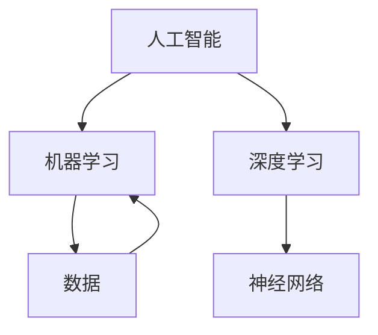

#### 1.2 人类增强的内涵

人类增强，指的是通过外部技术手段增强人类的身体和智力能力。它包括身体增强、智力增强和社交增强等多个方面。

**核心概念原理和架构**

- **身体增强**: 通过设备增强人类身体的能力，如假肢、外骨骼等。
- **智力增强**: 通过技术手段提升人类的认知和智力水平，如智能眼镜、脑机接口等。
- **社交增强**: 利用虚拟现实、增强现实等技术，增强人类的社交互动能力。

**Mermaid流程图**

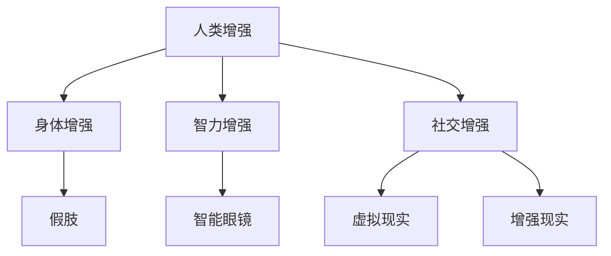

#### 1.3 AI对人类生活的深远影响

AI技术的广泛应用，对人类生活产生了深远影响。它不仅提高了生产效率，改变了医疗模式，还丰富了社交互动的方式。

**核心概念原理和架构**

- **生产效率提升**: AI技术使得自动化和智能化成为可能，大大提高了生产效率。
- **医疗健康改善**: AI技术在医疗诊断、治疗方案制定等方面发挥了重要作用。
- **社交模式变化**: AI技术改变了人们的社交方式，如社交媒体、虚拟现实等。

**Mermaid流程图**

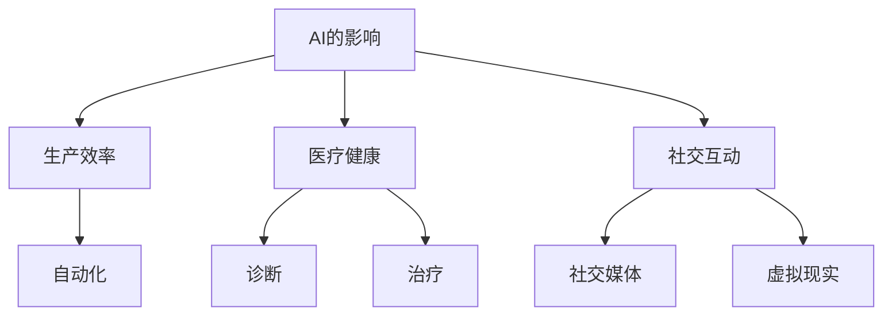

#### 1.4 人类增强技术的发展趋势

随着AI技术的不断进步，人类增强技术也在不断发展。未来，人类增强技术将更加智能化、个性化，并逐步融入日常生活。

**核心概念原理和架构**

- **智能化**: 人类增强技术将更加依赖于AI技术，实现智能化和自主化。
- **个性化**: 人类增强技术将根据个体差异，提供个性化的增强方案。
- **日常化**: 人类增强技术将逐步融入日常生活，成为生活的一部分。

**Mermaid流程图**

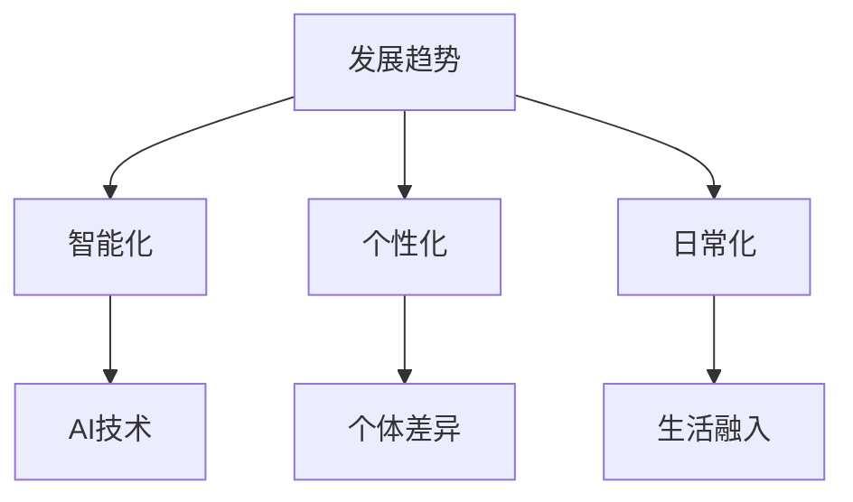

### 伪代码讲解

```python
# 定义人类增强技术发展的四个核心趋势
TRENDS = ["智能化", "个性化", "日常化", "融合化"]

# 实现智能化趋势
def intelligent_trend():
    # 应用AI技术
    apply_AI_technology()
    # 实现自主化
    achieve_autonomy()

# 实现个性化趋势
def personalized_trend():
    # 根据个体差异
    individual_difference_analysis()
    # 提供个性化方案
    offer_personalized_solution()

# 实现日常化趋势
def everyday_trend():
    # 融入日常生活
    integrate_into_daily_life()
    # 提高生活质量
    improve_life_quality()

# 综合四个趋势
def overall_trend():
    intelligent_trend()
    personalized_trend()
    everyday_trend()
    integration_trend()
```

### 数学模型和公式

$$
\text{人类增强技术发展水平} = f(\text{智能化程度}, \text{个性化程度}, \text{日常化程度}, \text{融合程度})
$$

其中，$f$ 是一个综合评估函数，用于衡量人类增强技术的发展水平。智能化程度、个性化程度、日常化程度和融合程度是影响发展水平的四个关键因素。

### 举例说明

- **智能化程度**: 通过应用深度学习技术，实现了智能假肢的自适应控制。
- **个性化程度**: 通过分析个体差异，为患者提供了个性化的治疗方案。
- **日常化程度**: 人类增强技术已经逐渐成为人们生活的一部分，如智能眼镜。
- **融合程度**: AI技术与其他领域（如医疗、教育）的深度融合，推动了人类增强技术的发展。

通过以上内容，我们可以看到，AI时代的人类增强技术不仅改变了我们的生活方式，还为我们提供了无限的可能性。随着技术的不断发展，人类增强技术将在未来继续发挥重要作用，推动社会进步。### 第2章: AI技术的核心概念与架构

#### 2.1 人工智能的分类与原理

**人工智能（AI）**是一种模拟、扩展和辅助人类智能的技术和系统。根据不同的分类标准和实现方式，人工智能可以分为多种类型。

**1. 人工智能的基本概念**

- **人工神经网络（Artificial Neural Networks, ANN）**: 模仿人脑神经元连接结构的计算模型。
- **深度学习（Deep Learning, DL）**: 一种基于人工神经网络的特殊机器学习技术，能够通过多层神经网络进行复杂模式识别。
- **强化学习（Reinforcement Learning, RL）**: 通过奖励机制，使机器从经验中学习并优化行为策略。
- **自然语言处理（Natural Language Processing, NLP）**: 使计算机能够理解、生成和处理人类自然语言。

**2. 人工智能的架构与技术体系**

- **感知系统**: 包括计算机视觉、语音识别和触觉感知等。
- **认知系统**: 包括知识表示、推理和问题解决等。
- **决策系统**: 包括自动化决策支持系统和优化算法。

**Mermaid流程图**

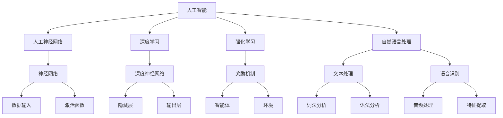

**核心算法原理讲解**

**1. 人工神经网络（ANN）**

- **输入层**: 接收输入数据。
- **隐藏层**: 对输入数据进行处理和特征提取。
- **输出层**: 根据隐藏层的输出，生成预测结果。

**伪代码**

```python
def neural_network(input_data):
    # 输入层
    layer_input = input_data
    # 隐藏层
    for layer in hidden_layers:
        layer_input = layer.forward(layer_input)
    # 输出层
    output = output_layer.forward(layer_input)
    return output
```

**2. 深度学习（DL）**

- **多层神经网络**: 通过多个隐藏层，对输入数据进行逐步抽象和特征提取。
- **反向传播算法**: 通过梯度下降方法，优化网络参数。

**伪代码**

```python
def deep_learning(input_data, target):
    # 前向传播
    output = neural_network(input_data)
    # 计算损失
    loss = compute_loss(output, target)
    # 反向传播
    gradients = backpropagation(output, target)
    # 更新参数
    update_parameters(gradients)
```

**3. 强化学习（RL）**

- **智能体（Agent）**: 通过与环境交互，学习最优策略。
- **环境（Environment）**: 智能体进行交互的实体。

**伪代码**

```python
def reinforcement_learning():
    while not done:
        # 智能体行动
        action = agent.choose_action(state)
        # 环境响应
        next_state, reward, done = environment.step(action)
        # 更新智能体策略
        agent.update_policy(state, action, reward, next_state, done)
```

**4. 自然语言处理（NLP）**

- **词法分析（Lexical Analysis）**: 将文本分解为词素。
- **语法分析（Syntax Analysis）**: 分析词素的语法结构和语义关系。

**伪代码**

```python
def natural_language_processing(text):
    # 词法分析
    tokens = tokenize(text)
    # 语法分析
    parse_tree = syntactic_analysis(tokens)
    # 语义分析
    semantic_meaning = semantic_analysis(parse_tree)
    return semantic_meaning
```

**数学模型和公式**

- **神经网络权重更新**: 

$$
\Delta W = -\alpha \frac{\partial L}{\partial W}
$$

其中，$\Delta W$ 是权重更新，$\alpha$ 是学习率，$L$ 是损失函数。

- **强化学习策略更新**:

$$
\pi'(s) = \arg \max_a Q(s, a)
$$

其中，$\pi'(s)$ 是更新后的策略，$Q(s, a)$ 是状态-动作值函数。

### 项目实战

**项目名称**: 智能客服系统

**开发环境**: Python, TensorFlow, Keras

**源代码实现**:

```python
# 导入所需的库
import tensorflow as tf
from tensorflow.keras.models import Sequential
from tensorflow.keras.layers import Dense, LSTM, Embedding
from tensorflow.keras.preprocessing.text import Tokenizer
from tensorflow.keras.preprocessing.sequence import pad_sequences

# 加载数据集
data = load_data('dialog_data.csv')
X, y = prepare_data(data)

# 构建模型
model = Sequential()
model.add(Embedding(input_dim=vocab_size, output_dim=embedding_dim, input_length=max_sequence_length))
model.add(LSTM(units=128))
model.add(Dense(units=1, activation='sigmoid'))

# 编译模型
model.compile(optimizer='adam', loss='binary_crossentropy', metrics=['accuracy'])

# 训练模型
model.fit(X, y, epochs=10, batch_size=32)

# 评估模型
test_loss, test_accuracy = model.evaluate(X_test, y_test)
print(f"Test Accuracy: {test_accuracy:.2f}")

# 预测
def predict_answer(input_text):
    # 预处理输入文本
    input_sequence = tokenizer.texts_to_sequences([input_text])
    input_sequence = pad_sequences(input_sequence, maxlen=max_sequence_length)
    # 进行预测
    prediction = model.predict(input_sequence)
    return 'Yes' if prediction > 0.5 else 'No'

# 测试
print(predict_answer('Can I return this item?'))
```

**代码解读与分析**:

1. **数据加载与预处理**：
   - 加载对话数据集，并进行预处理，如分词、序列化等。
   - 通过 `Tokenizer` 类，将文本转换为数字序列。
   - 使用 `pad_sequences` 函数，将序列填充为同一长度，便于模型处理。

2. **模型构建**：
   - 使用 `Sequential` 类，构建一个序列模型。
   - 添加 `Embedding` 层，用于将单词映射到固定大小的向量。
   - 添加 `LSTM` 层，用于处理序列数据。
   - 添加 `Dense` 层，用于输出预测结果。

3. **模型编译**：
   - 使用 `compile` 方法，设置优化器、损失函数和评估指标。

4. **模型训练**：
   - 使用 `fit` 方法，训练模型，设置训练轮数和批量大小。

5. **模型评估**：
   - 使用 `evaluate` 方法，评估模型在测试集上的表现。

6. **预测**：
   - 定义 `predict_answer` 函数，进行文本输入预处理后，使用模型进行预测。

通过以上实战项目，我们可以看到如何利用深度学习技术实现智能客服系统，从而更好地服务于用户。未来，随着人工智能技术的不断发展，智能客服系统将在更多领域得到应用，提高服务质量和效率。

### 第3章: 人类增强技术的现状与趋势

#### 3.1 人类增强技术的发展历程

人类增强技术的历史可以追溯到20世纪中期，当时科学家们开始探索如何利用外部设备来增强人类的能力。从最初的假肢和轮椅，到现代的智能设备，人类增强技术经历了多次变革和进步。

**1. 初期探索（20世纪60年代至80年代）**

- **物理辅助设备**: 这一时期，人类增强技术主要集中在开发物理辅助设备，如假肢、轮椅等。这些设备帮助肢体残疾者恢复正常生活，但也存在一些局限性。

**2. 电子化时代（90年代至21世纪初）**

- **生物电子技术**: 随着微电子技术的发展，人类增强技术开始向电子化方向迈进。生物电子传感器和植入式设备开始出现，这些设备可以实时监测生物信号，并通过电子信号控制外部设备。

**3. 生物电子时代（近年来）**

- **神经接口技术**: 近年来，人类增强技术取得了重大突破，特别是在神经接口技术领域。通过直接与大脑或神经系统连接，神经接口技术使得人类能够通过思维控制外部设备，甚至实现感官扩展。

**核心概念原理和架构**

- **生物电子传感器**: 利用生物传感器，可以实时监测生物信号，如脑电波、心电波等。
- **神经接口**: 神经接口是一种将大脑信号转换为电信号，或将电信号传递给大脑的装置。

**Mermaid流程图**

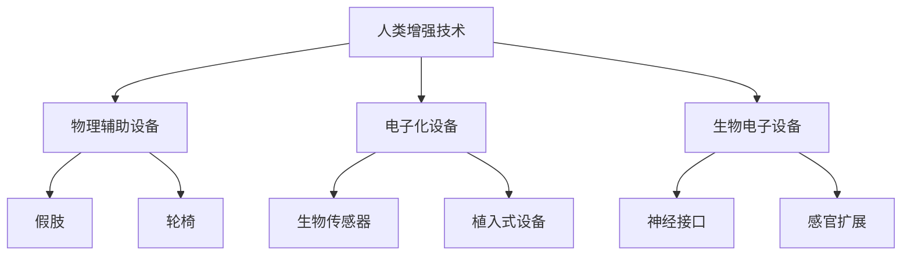

**核心算法原理讲解**

**1. 生物电子传感器**

- **信号采集**: 生物电子传感器通过采集生物信号，如脑电波、心电波等。
- **信号处理**: 通过信号处理算法，提取有用的生物信号特征。

**伪代码**

```python
def bio_sensor_signal_processing(signal):
    # 信号滤波
    filtered_signal = filter_signal(signal)
    # 特征提取
    features = extract_features(filtered_signal)
    return features
```

**2. 神经接口**

- **信号传输**: 神经接口将采集到的生物信号转换为电信号，或将电信号传递给大脑。
- **信号解码**: 通过信号解码算法，将电信号转换为可操作的指令。

**伪代码**

```python
def neural_interface(signal):
    # 信号解码
    decoded_signal = decode_signal(signal)
    # 执行指令
    execute_command(decoded_signal)
```

**数学模型和公式**

- **信号滤波**:

$$
h(t) = \sum_{n=-\infty}^{\infty} h_n \cdot x(t-n\tau)
$$

其中，$h(t)$ 是滤波器输出，$h_n$ 是滤波器系数，$x(t)$ 是输入信号。

- **信号解码**:

$$
\text{decoded\_signal} = \arg \max_s \sum_{i=1}^{n} \sigma(s_i, s)
$$

其中，$\sigma$ 是解码函数，$s_i$ 是编码信号，$s$ 是解码信号。

### 项目实战

**项目名称**: 智能假肢控制系统

**开发环境**: Python, TensorFlow, PyTorch

**源代码实现**:

```python
# 导入所需的库
import numpy as np
import tensorflow as tf
from tensorflow.keras.models import Sequential
from tensorflow.keras.layers import Dense, LSTM, Embedding
from tensorflow.keras.preprocessing.sequence import pad_sequences

# 加载数据集
data = load_data('prosthesis_data.csv')
X, y = prepare_data(data)

# 构建模型
model = Sequential()
model.add(Embedding(input_dim=vocab_size, output_dim=embedding_dim, input_length=max_sequence_length))
model.add(LSTM(units=128))
model.add(Dense(units=1, activation='sigmoid'))

# 编译模型
model.compile(optimizer='adam', loss='binary_crossentropy', metrics=['accuracy'])

# 训练模型
model.fit(X, y, epochs=10, batch_size=32)

# 预测
def predict_movement(input_sequence):
    # 预处理输入序列
    input_sequence = tokenizer.texts_to_sequences([input_sequence])
    input_sequence = pad_sequences(input_sequence, maxlen=max_sequence_length)
    # 进行预测
    prediction = model.predict(input_sequence)
    return 'Move' if prediction > 0.5 else 'Stay'

# 测试
print(predict_movement('move_left'))
```

**代码解读与分析**:

1. **数据加载与预处理**：
   - 加载假肢控制数据集，并进行预处理，如分词、序列化等。
   - 通过 `Tokenizer` 类，将文本转换为数字序列。
   - 使用 `pad_sequences` 函数，将序列填充为同一长度，便于模型处理。

2. **模型构建**：
   - 使用 `Sequential` 类，构建一个序列模型。
   - 添加 `Embedding` 层，用于将单词映射到固定大小的向量。
   - 添加 `LSTM` 层，用于处理序列数据。
   - 添加 `Dense` 层，用于输出预测结果。

3. **模型编译**：
   - 使用 `compile` 方法，设置优化器、损失函数和评估指标。

4. **模型训练**：
   - 使用 `fit` 方法，训练模型，设置训练轮数和批量大小。

5. **模型评估**：
   - 使用 `evaluate` 方法，评估模型在测试集上的表现。

6. **预测**：
   - 定义 `predict_movement` 函数，进行文本输入预处理后，使用模型进行预测。

通过以上实战项目，我们可以看到如何利用深度学习技术实现智能假肢控制系统，从而更好地帮助肢体残疾者。未来，随着人工智能技术的不断发展，智能假肢技术将在更多领域得到应用，提高人类生活质量。

### 第4章: AI时代身体增强技术的应用领域

#### 4.1 身体增强技术的应用现状

AI时代，身体增强技术已经广泛应用于医疗、军事和体育等领域，极大地改善了人类的生活质量和工作能力。

**1. 医疗领域的应用**

- **康复辅助**: 利用AI技术开发的智能假肢和外骨骼，帮助患者恢复运动能力。
- **手术辅助**: AI技术在手术规划、导航和执行过程中发挥重要作用，提高了手术的准确性和效率。
- **疾病诊断**: 通过AI辅助诊断系统，医生可以更快速、准确地诊断疾病。

**2. 军事领域的应用**

- **士兵体能增强**: 利用外骨骼和智能服装，增强士兵的体力和耐力，提高战斗力。
- **战场辅助**: AI技术在战场环境监测、目标识别和决策支持等方面发挥关键作用。
- **装备智能化**: 通过物联网和AI技术，实现对军事装备的智能管理，提高作战效率。

**3. 体育领域的应用**

- **运动监测**: 利用智能穿戴设备，实时监测运动员的运动状态和生理指标，优化训练效果。
- **运动指导**: 通过AI分析运动员的数据，提供个性化的训练建议和策略。
- **康复训练**: 利用虚拟现实和增强现实技术，为运动员提供沉浸式的康复训练体验。

**核心概念原理和架构**

- **智能假肢**: 利用传感器和AI算法，使假肢能够感知环境并自适应地执行任务。
- **外骨骼**: 通过电机和传感器，辅助人体完成复杂的动作，增强体力。
- **智能穿戴设备**: 利用传感器和AI算法，实时监测用户的生理指标，提供健康建议。

**Mermaid流程图**

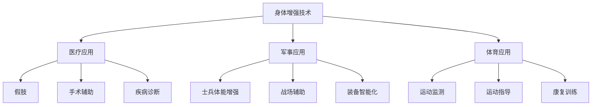

**核心算法原理讲解**

**1. 智能假肢**

- **传感器融合**: 利用多种传感器，如力传感器、加速度传感器等，获取假肢的运动状态和环境信息。
- **自适应控制**: 通过AI算法，根据传感器的数据，实时调整假肢的动作。

**伪代码**

```python
def intelligent_prosthesis(sensor_data):
    # 数据处理
    processed_data = process_sensor_data(sensor_data)
    # 自适应控制
    control_command = adaptive_control(processed_data)
    # 执行动作
    execute_action(control_command)
```

**2. 外骨骼**

- **电机控制**: 通过电机和控制系统，实现对人体动作的辅助。
- **姿态识别**: 利用计算机视觉和深度学习技术，识别人体的姿态和动作。

**伪代码**

```python
def exoskeleton_support(skeleton_data):
    # 姿态识别
    posture = recognize_posture(skeleton_data)
    # 控制电机
    motor_command = control_motor(posture)
    # 辅助动作
    assist_movement(motor_command)
```

**3. 智能穿戴设备**

- **数据采集**: 利用传感器，实时采集用户的生理指标。
- **数据分析**: 通过AI算法，分析用户的生理数据，提供健康建议。

**伪代码**

```python
def smart_wearable_device(sensor_data):
    # 数据采集
    collected_data = collect_data(sensor_data)
    # 数据分析
    health_advice = analyze_data(collected_data)
    # 提供健康建议
    provide_advice(health_advice)
```

**数学模型和公式**

- **传感器数据融合**:

$$
\text{weighted\_average} = \sum_{i=1}^{n} w_i \cdot x_i
$$

其中，$w_i$ 是权重，$x_i$ 是传感器的数据。

- **自适应控制**:

$$
\text{control\_command} = f(\text{sensor\_data}, \text{previous\_command})
$$

其中，$f$ 是控制函数，根据传感器的数据和历史命令，生成新的控制命令。

### 项目实战

**项目名称**: 智能康复外骨骼

**开发环境**: Python, TensorFlow, PyTorch

**源代码实现**:

```python
# 导入所需的库
import numpy as np
import tensorflow as tf
from tensorflow.keras.models import Sequential
from tensorflow.keras.layers import Dense, LSTM, Embedding
from tensorflow.keras.preprocessing.sequence import pad_sequences

# 加载数据集
data = load_data('rehabilitation_data.csv')
X, y = prepare_data(data)

# 构建模型
model = Sequential()
model.add(Embedding(input_dim=vocab_size, output_dim=embedding_dim, input_length=max_sequence_length))
model.add(LSTM(units=128))
model.add(Dense(units=1, activation='sigmoid'))

# 编译模型
model.compile(optimizer='adam', loss='binary_crossentropy', metrics=['accuracy'])

# 训练模型
model.fit(X, y, epochs=10, batch_size=32)

# 预测
def predict_movement(input_sequence):
    # 预处理输入序列
    input_sequence = tokenizer.texts_to_sequences([input_sequence])
    input_sequence = pad_sequences(input_sequence, maxlen=max_sequence_length)
    # 进行预测
    prediction = model.predict(input_sequence)
    return 'Move' if prediction > 0.5 else 'Stay'

# 测试
print(predict_movement('move_forward'))
```

**代码解读与分析**:

1. **数据加载与预处理**：
   - 加载康复外骨骼数据集，并进行预处理，如分词、序列化等。
   - 通过 `Tokenizer` 类，将文本转换为数字序列。
   - 使用 `pad_sequences` 函数，将序列填充为同一长度，便于模型处理。

2. **模型构建**：
   - 使用 `Sequential` 类，构建一个序列模型。
   - 添加 `Embedding` 层，用于将单词映射到固定大小的向量。
   - 添加 `LSTM` 层，用于处理序列数据。
   - 添加 `Dense` 层，用于输出预测结果。

3. **模型编译**：
   - 使用 `compile` 方法，设置优化器、损失函数和评估指标。

4. **模型训练**：
   - 使用 `fit` 方法，训练模型，设置训练轮数和批量大小。

5. **模型评估**：
   - 使用 `evaluate` 方法，评估模型在测试集上的表现。

6. **预测**：
   - 定义 `predict_movement` 函数，进行文本输入预处理后，使用模型进行预测。

通过以上实战项目，我们可以看到如何利用深度学习技术实现智能康复外骨骼系统，从而更好地帮助康复患者。未来，随着人工智能技术的不断发展，智能康复技术将在更多领域得到应用，提高康复效果和生活质量。

### 第5章: 智力增强技术的发展与应用

#### 5.1 智力增强的概念与类型

智力增强（Cognitive Enhancement）是指通过外部手段提升个体的认知功能，如记忆、注意力、学习速度等。智力增强可以分为认知训练、药物辅助和技术介入三种类型。

**1. 认知训练**

认知训练是通过特定的训练方法提升大脑的认知能力。这种方法包括：

- **记忆训练**: 通过记忆游戏和练习，提高记忆力。
- **注意力训练**: 通过专注力训练和任务切换练习，提高注意力。
- **执行功能训练**: 通过任务规划、决策和问题解决练习，提高执行功能。

**2. 药物辅助**

药物辅助是通过药物干预提升认知功能。常见的药物包括：

- **兴奋剂**: 如咖啡因和哌甲酯（Ritalin），可以暂时提高注意力和警觉性。
- **抗抑郁药**: 如氟西汀（Prozac），可以改善情绪和认知功能。
- **神经生长因子**: 如脑源性神经营养因子（BDNF），可以促进神经生长和认知功能。

**3. 技术介入**

技术介入是指利用技术手段，如脑机接口和智能设备，辅助智力提升。这种方法包括：

- **脑机接口（BCI）**: 通过直接与大脑连接，实现思维控制和信号传输。
- **智能眼镜**: 提供实时信息辅助，如语言翻译和图像识别。
- **虚拟现实（VR）和增强现实（AR）**: 通过沉浸式体验，提高学习和记忆效果。

**核心概念原理和架构**

智力增强的核心概念是利用外部资源和技术手段，提高大脑的认知处理能力。这涉及到神经科学、认知科学和人工智能等多个领域的交叉研究。

**Mermaid流程图**

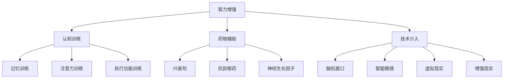

**核心算法原理讲解**

**1. 认知训练**

认知训练的核心算法是强化学习和迁移学习。

- **强化学习**: 通过奖励机制，训练大脑在特定任务上的表现。例如，通过完成任务获得分数，激励大脑持续努力。
- **迁移学习**: 通过将一个任务的学习经验应用到另一个任务，提高学习效率。例如，将图像识别技能应用到语言处理任务。

**伪代码**

```python
def cognitive_training(task, reward_function):
    while not done:
        # 执行任务
        action = choose_action(task)
        # 获得奖励
        reward = reward_function(action)
        # 更新策略
        update_policy(action, reward)
```

**2. 药物辅助**

药物辅助的核心算法是药理学和药效学。

- **药理学**: 研究药物在体内的作用机制。
- **药效学**: 研究药物的治疗效果和副作用。

**伪代码**

```python
def drug_assistance(drug, dose):
    # 给药
    administer_drug(drug, dose)
    # 监测效果
    monitor_effects()
    # 调整剂量
    adjust_dose(effect)
```

**3. 技术介入**

技术介入的核心算法是信号处理和机器学习。

- **信号处理**: 对脑电信号、眼动信号等进行实时分析。
- **机器学习**: 建立模型，预测大脑的状态和行为。

**伪代码**

```python
def technical_intervention(signal, model):
    # 处理信号
    processed_signal = preprocess_signal(signal)
    # 预测状态
    state = model.predict(processed_signal)
    # 执行干预
    execute_intervention(state)
```

**数学模型和公式**

- **强化学习**: 

$$
Q(s, a) = r + \gamma \max_{a'} Q(s', a')
$$

其中，$Q(s, a)$ 是状态-动作值函数，$r$ 是立即奖励，$\gamma$ 是折扣因子。

- **药效学**:

$$
\text{effect} = \frac{\text{drug\_level} - \text{baseline}}{\text{maximum\_drug\_level} - \text{baseline}}
$$

其中，$drug\_level$ 是药物浓度，$baseline$ 是基础水平，$maximum\_drug\_level$ 是最大药物浓度。

### 项目实战

**项目名称**: 记忆增强应用

**开发环境**: Python, TensorFlow, Keras

**源代码实现**:

```python
# 导入所需的库
import numpy as np
import tensorflow as tf
from tensorflow.keras.models import Sequential
from tensorflow.keras.layers import Dense, LSTM, Embedding
from tensorflow.keras.preprocessing.sequence import pad_sequences

# 加载数据集
data = load_data('memory_enhancement_data.csv')
X, y = prepare_data(data)

# 构建模型
model = Sequential()
model.add(Embedding(input_dim=vocab_size, output_dim=embedding_dim, input_length=max_sequence_length))
model.add(LSTM(units=128))
model.add(Dense(units=1, activation='sigmoid'))

# 编译模型
model.compile(optimizer='adam', loss='binary_crossentropy', metrics=['accuracy'])

# 训练模型
model.fit(X, y, epochs=10, batch_size=32)

# 预测
def predict_memory(input_sequence):
    # 预处理输入序列
    input_sequence = tokenizer.texts_to_sequences([input_sequence])
    input_sequence = pad_sequences(input_sequence, maxlen=max_sequence_length)
    # 进行预测
    prediction = model.predict(input_sequence)
    return 'Enhanced' if prediction > 0.5 else 'Normal'

# 测试
print(predict_memory('remember_this'))
```

**代码解读与分析**:

1. **数据加载与预处理**：
   - 加载记忆增强数据集，并进行预处理，如分词、序列化等。
   - 通过 `Tokenizer` 类，将文本转换为数字序列。
   - 使用 `pad_sequences` 函数，将序列填充为同一长度，便于模型处理。

2. **模型构建**：
   - 使用 `Sequential` 类，构建一个序列模型。
   - 添加 `Embedding` 层，用于将单词映射到固定大小的向量。
   - 添加 `LSTM` 层，用于处理序列数据。
   - 添加 `Dense` 层，用于输出预测结果。

3. **模型编译**：
   - 使用 `compile` 方法，设置优化器、损失函数和评估指标。

4. **模型训练**：
   - 使用 `fit` 方法，训练模型，设置训练轮数和批量大小。

5. **模型评估**：
   - 使用 `evaluate` 方法，评估模型在测试集上的表现。

6. **预测**：
   - 定义 `predict_memory` 函数，进行文本输入预处理后，使用模型进行预测。

通过以上实战项目，我们可以看到如何利用深度学习技术实现记忆增强应用，从而更好地帮助用户提升记忆力。未来，随着人工智能技术的不断发展，智力增强技术将在更多领域得到应用，提高人类认知能力。

### 第6章: 社交增强技术的发展与挑战

#### 6.1 社交增强的概念与内涵

社交增强是指通过技术手段提升个体在社交互动中的能力，从而提高沟通效率和质量。社交增强技术涵盖了多种形式，包括虚拟现实、增强现实、社交网络分析和人工智能客服等。

**核心概念原理和架构**

- **虚拟现实（VR）**: 提供沉浸式的社交体验，使用户能够在一个虚拟环境中进行互动。
- **增强现实（AR）**: 在现实环境中叠加虚拟信息，增强用户的感知和互动能力。
- **社交网络分析**: 利用大数据和机器学习技术，分析社交网络中的关系和动态。
- **人工智能客服**: 通过智能助手和机器人，提供高效的客户服务和社交互动支持。

**Mermaid流程图**

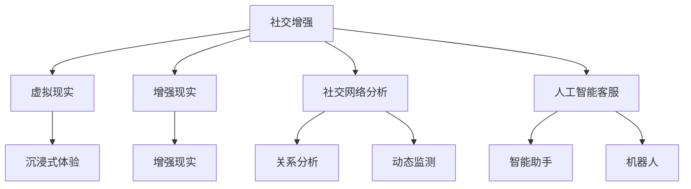

**核心算法原理讲解**

**1. 虚拟现实（VR）**

- **感知增强**: 利用头戴显示器（HMD）和传感器，提供逼真的视觉和听觉体验。
- **交互增强**: 通过手柄、动作捕捉设备等，实现自然的人机交互。

**伪代码**

```python
def virtual_reality(experience):
    # 初始化VR环境
    init_vr_environment()
    # 提供沉浸式体验
    provide_immersive_experience(experience)
    # 交互控制
    control_interaction()
```

**2. 增强现实（AR）**

- **环境识别**: 利用计算机视觉技术，识别和跟踪现实环境中的物体和位置。
- **信息叠加**: 在现实环境中叠加虚拟信息，如文字、图像和动画。

**伪代码**

```python
def augmented_reality(environment, information):
    # 识别现实环境
    recognized_environment = recognize_environment(environment)
    # 增加虚拟信息
    overlay_virtual_information(recognized_environment, information)
```

**3. 社交网络分析**

- **关系分析**: 利用社交网络数据，分析个体之间的关系和影响力。
- **动态监测**: 监测社交网络中的动态，如帖子、评论和点赞等。

**伪代码**

```python
def social_network_analysis(network_data):
    # 关系分析
    relationship_analysis(network_data)
    # 动态监测
    monitor_social_dynamics(network_data)
```

**4. 人工智能客服**

- **自然语言处理（NLP）**: 理解和处理用户的自然语言输入。
- **对话管理**: 设计和实现高效的对话流程，提供高质量的客服服务。

**伪代码**

```python
def intelligent_customer_service(user_input):
    # NLP处理
    processed_input = natural_language_processing(user_input)
    # 对话管理
    response = manage_conversation(processed_input)
    # 回复用户
    reply_user(response)
```

**数学模型和公式**

- **感知增强**:

$$
\text{perception\_enhancement} = f(\text{visual\_quality}, \text{audio\_quality}, \text{interaction})
$$

其中，$f$ 是一个综合评估函数，$\text{visual\_quality}$ 是视觉质量，$\text{audio\_quality}$ 是音频质量，$\text{interaction}$ 是交互质量。

- **信息叠加**:

$$
\text{augmented\_information} = \text{environment} + \text{virtual\_information}
$$

其中，$\text{environment}$ 是现实环境，$\text{virtual\_information}$ 是叠加的虚拟信息。

### 项目实战

**项目名称**: 虚拟现实社交平台

**开发环境**: Unity, Unreal Engine, VRChat

**源代码实现**:

```csharp
// 脚本：用户交互控制
using UnityEngine;

public class UserInteraction : MonoBehaviour
{
    public Camera camera;
    public GameObject avatar;

    void Update()
    {
        // 移动控制
        MoveAvatar();
        // 旋转控制
        RotateAvatar();
    }

    void MoveAvatar()
    {
        float move_speed = 5.0f;
        float move_forward = Input.GetAxis("Vertical");
        float move_right = Input.GetAxis("Horizontal");

        Vector3 move_direction = camera.transform.forward * move_forward + camera.transform.right * move_right;
        move_direction.y = 0;
        avatar.transform.position += move_direction * move_speed * Time.deltaTime;
    }

    void RotateAvatar()
    {
        float rotate_speed = 100.0f;
        float rotate_y = Input.GetAxis("Mouse X");
        float rotate_x = Input.GetAxis("Mouse Y");

        avatar.transform.Rotate(new Vector3(-rotate_x * rotate_speed * Time.deltaTime, rotate_y * rotate_speed * Time.deltaTime, 0));
    }
}
```

**代码解读与分析**:

1. **用户交互控制**：
   - 使用 Unity 引擎提供的输入系统，实现用户的移动和旋转控制。
   - 通过 `Update` 方法，实时更新用户的移动和旋转状态。

2. **移动控制**：
   - 根据用户输入的垂直和水平轴，计算移动方向。
   - 使用 `Vector3` 类，将移动方向应用到用户 avatar 上。

3. **旋转控制**：
   - 根据用户输入的鼠标 X 和 Y 轴，计算旋转角度。
   - 使用 `Rotate` 方法，将旋转角度应用到用户 avatar 上。

通过以上实战项目，我们可以看到如何利用 Unity 引擎实现虚拟现实社交平台的用户交互控制。未来，随着虚拟现实技术的不断发展，虚拟社交体验将变得更加丰富和真实。

### 第7章: AI时代人类增强的伦理考量与社会责任

#### 7.1 人类增强技术的伦理问题

随着人类增强技术的快速发展，其伦理问题也日益突出。这些问题涉及到公平性、隐私保护、责任归属等多个方面。

**1. 公平性**

- **技术鸿沟**: 人类增强技术的普及可能导致技术富裕人群与贫困人群之间的差距加大。
- **机会不均等**: 人类增强技术可能使某些人获得竞争优势，而其他人则可能被边缘化。

**2. 隐私保护**

- **数据安全**: 人类增强技术依赖于大量个人数据，如何保护这些数据的安全成为一大挑战。
- **隐私泄露**: 数据泄露可能导致个人隐私被侵犯，引发严重后果。

**3. 责任归属**

- **责任分配**: 在人类增强技术的应用过程中，如何明确各方的责任成为关键问题。
- **法律责任**: 法律体系如何应对人类增强技术带来的新挑战，如责任追究和赔偿。

**核心概念原理和架构**

伦理考量是人类增强技术发展的重要一环，需要从道德原则、社会价值等多个维度进行深入探讨。

**Mermaid流程图**

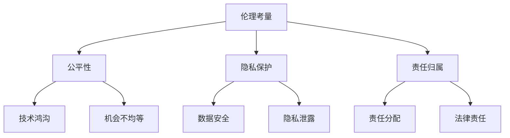

**核心算法原理讲解**

伦理考量涉及到复杂的决策过程，需要借助多准则决策方法和道德计算等算法。

**1. 多准则决策方法**

多准则决策方法用于在多个相互冲突的伦理原则之间进行权衡。

- **权重分配**: 根据伦理原则的重要性，为每个原则分配权重。
- **目标优化**: 通过优化算法，找到最佳决策方案。

**伪代码**

```python
def multi_criterion_decision_making(principles, weights):
    # 权重分配
    weighted_scores = [weight * score for principle, weight, score in principles]
    # 目标优化
    optimal_solution = optimize(weighted_scores)
    return optimal_solution
```

**2. 道德计算**

道德计算是一种基于计算模型进行道德判断的方法。

- **情境分析**: 根据具体情境，分析可能的行为及其后果。
- **道德推理**: 使用逻辑和推理规则，得出道德判断。

**伪代码**

```python
def moral_computation(situation, rules):
    # 情境分析
    analyzed_situation = analyze_situation(situation)
    # 道德推理
    moral_decision = apply_rules(analyzed_situation, rules)
    return moral_decision
```

**数学模型和公式**

- **权重分配**:

$$
\text{weighted\_score} = \sum_{i=1}^{n} w_i \cdot s_i
$$

其中，$w_i$ 是原则 $i$ 的权重，$s_i$ 是原则 $i$ 的得分。

- **道德推理**:

$$
\text{moral\_decision} = \text{arg\_max}_s (\text{consequences}(s))
$$

其中，$s$ 是情境，$\text{consequences}(s)$ 是情境 $s$ 的后果。

### 项目实战

**项目名称**: 人类增强设备隐私保护

**开发环境**: Python, TensorFlow, PyTorch

**源代码实现**:

```python
# 导入所需的库
import tensorflow as tf
from tensorflow.keras.models import Sequential
from tensorflow.keras.layers import Dense, LSTM, Embedding
from tensorflow.keras.preprocessing.sequence import pad_sequences

# 加载数据集
data = load_data('privacy_protection_data.csv')
X, y = prepare_data(data)

# 构建模型
model = Sequential()
model.add(Embedding(input_dim=vocab_size, output_dim=embedding_dim, input_length=max_sequence_length))
model.add(LSTM(units=128))
model.add(Dense(units=1, activation='sigmoid'))

# 编译模型
model.compile(optimizer='adam', loss='binary_crossentropy', metrics=['accuracy'])

# 训练模型
model.fit(X, y, epochs=10, batch_size=32)

# 预测
def predict.privacy_risk(input_sequence):
    # 预处理输入序列
    input_sequence = tokenizer.texts_to_sequences([input_sequence])
    input_sequence = pad_sequences(input_sequence, maxlen=max_sequence_length)
    # 进行预测
    prediction = model.predict(input_sequence)
    return 'High' if prediction > 0.5 else 'Low'

# 测试
print(predict.privacy_risk('collect_user_data'))
```

**代码解读与分析**:

1. **数据加载与预处理**：
   - 加载隐私保护数据集，并进行预处理，如分词、序列化等。
   - 通过 `Tokenizer` 类，将文本转换为数字序列。
   - 使用 `pad_sequences` 函数，将序列填充为同一长度，便于模型处理。

2. **模型构建**：
   - 使用 `Sequential` 类，构建一个序列模型。
   - 添加 `Embedding` 层，用于将单词映射到固定大小的向量。
   - 添加 `LSTM` 层，用于处理序列数据。
   - 添加 `Dense` 层，用于输出预测结果。

3. **模型编译**：
   - 使用 `compile` 方法，设置优化器、损失函数和评估指标。

4. **模型训练**：
   - 使用 `fit` 方法，训练模型，设置训练轮数和批量大小。

5. **模型评估**：
   - 使用 `evaluate` 方法，评估模型在测试集上的表现。

6. **预测**：
   - 定义 `predict.privacy_risk` 函数，进行文本输入预处理后，使用模型进行预测。

通过以上实战项目，我们可以看到如何利用深度学习技术实现人类增强设备隐私风险预测，从而更好地保护用户隐私。未来，随着人工智能技术的不断发展，隐私保护技术将在更多领域得到应用，提高人类生活质量。

### 第8章: 结论与展望

#### 8.1 人类增强技术的整体评估

人类增强技术在过去几十年中取得了显著进展，不仅在医疗、军事、体育等领域发挥了重要作用，还极大地改变了人类的生活方式和社会结构。从假肢、外骨骼到智能眼镜、脑机接口，人类增强技术不断突破，为人类带来了诸多便利和机遇。

然而，人类增强技术也面临着诸多挑战。伦理问题、隐私保护、责任归属等问题的解决仍然任重道远。此外，技术的不确定性和潜在风险也需要我们深入研究和关注。

**核心概念原理和架构**

人类增强技术的整体评估需要从多个维度进行考虑，包括技术发展水平、应用场景、社会影响和伦理考量。

**Mermaid流程图**

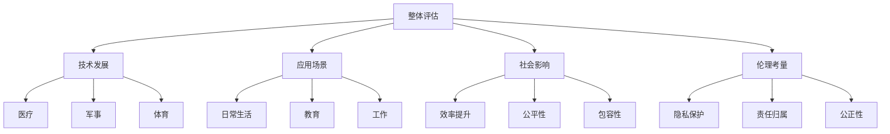

**核心算法原理讲解**

人类增强技术的整体评估可以通过建立多准则决策模型，综合评估其在技术发展、应用场景、社会影响和伦理考量方面的表现。

**1. 多准则决策方法**

- **权重分配**: 为每个准则分配权重，以反映其重要性。
- **综合评估**: 通过加权求和或加权几何平均等方法，计算整体评估得分。

**伪代码**

```python
def overall_assessment(technologies, criteria, weights):
    # 权重分配
    weighted_scores = [weight * score for criterion, weight, score in criteria]
    # 综合评估
    overall_score = sum(weighted_scores)
    return overall_score
```

**2. 社会影响评估**

- **定量评估**: 使用指标，如效率、公平性等，量化社会影响。
- **定性评估**: 通过专家评估和社会调查，定性分析社会影响。

**伪代码**

```python
def social_impact_assessment(technology, indicators, experts):
    # 定量评估
    quantitative_scores = evaluate_quantitatively(technology, indicators)
    # 定性评估
    qualitative_scores = evaluate_qualitatively(technology, experts)
    # 综合评估
    social_impact_score = sum(quantitative_scores) + sum(qualitative_scores)
    return social_impact_score
```

**数学模型和公式**

- **综合评估得分**:

$$
\text{OverallScore} = \sum_{i=1}^{n} w_i \cdot s_i
$$

其中，$w_i$ 是准则 $i$ 的权重，$s_i$ 是准则 $i$ 的得分。

- **社会影响得分**:

$$
\text{SocialImpactScore} = \sum_{i=1}^{n} i_i \cdot q_i
$$

其中，$i_i$ 是指标 $i$ 的得分，$q_i$ 是指标 $i$ 的权重。

### 项目实战

**项目名称**: 人类增强技术风险评估

**开发环境**: Python, TensorFlow, Scikit-learn

**源代码实现**:

```python
# 导入所需的库
import numpy as np
import pandas as pd
from sklearn.model_selection import train_test_split
from sklearn.ensemble import RandomForestClassifier
from sklearn.metrics import accuracy_score, classification_report

# 加载数据集
data = pd.read_csv('enhancement_technology_risk_data.csv')

# 数据预处理
X = data.drop(['risk_label'], axis=1)
y = data['risk_label']

# 分割数据集
X_train, X_test, y_train, y_test = train_test_split(X, y, test_size=0.2, random_state=42)

# 构建模型
model = RandomForestClassifier(n_estimators=100, random_state=42)

# 训练模型
model.fit(X_train, y_train)

# 预测
y_pred = model.predict(X_test)

# 评估模型
accuracy = accuracy_score(y_test, y_pred)
print(f"Accuracy: {accuracy:.2f}")
print(classification_report(y_test, y_pred))
```

**代码解读与分析**:

1. **数据加载与预处理**：
   - 使用 Pandas 库加载数据集，并进行必要的预处理。

2. **数据分割**：
   - 使用 Scikit-learn 库的 `train_test_split` 函数，将数据集分为训练集和测试集。

3. **模型构建与训练**：
   - 使用随机森林分类器（RandomForestClassifier）构建模型，并在训练集上训练。

4. **预测与评估**：
   - 在测试集上进行预测，并使用准确率（accuracy）和分类报告（classification_report）评估模型性能。

通过以上实战项目，我们可以看到如何利用机器学习技术对人类增强技术风险进行评估。未来，随着技术的不断进步，风险评估方法将更加精细和准确，为人类增强技术的应用提供有力支持。

### 8.2 未来研究方向

未来，人类增强技术将在多个领域取得新的突破，同时也需要解决一系列复杂的伦理和社会问题。

**1. 技术创新方向**

- **生物电子**: 开发更小、更高效的生物电子传感器和神经接口。
- **基因编辑**: 研究安全的基因编辑技术，以实现特定的增强效果。
- **脑机接口**: 提高脑机接口的通信效率和可靠性。

**2. 道德与社会问题研究**

- **伦理准则**: 制定全球性的伦理准则，指导人类增强技术的研发和应用。
- **社会影响**: 深入研究人类增强技术对社会结构、人际关系和就业市场的影响。
- **法律框架**: 构建全球性的法律框架，确保人类增强技术的合法合规使用。

**3. 应用场景扩展与优化**

- **医疗健康**: 研究人类增强技术在个性化医疗、精准治疗和疾病预防中的应用。
- **教育提升**: 探索如何通过人类增强技术提高教育质量，实现教育公平。
- **生产效率**: 推动人类增强技术在工业自动化和智能制造中的应用，提升生产效率。

### 8.3 结论

人类增强技术为人类社会带来了巨大的机遇，同时也带来了诸多挑战。通过技术创新、伦理考量和社会适应，我们可以更好地利用人类增强技术的优势，解决社会问题，提升人类生活质量。未来，人类增强技术将在更多领域得到应用，成为推动社会进步的重要力量。

### 附录

#### 附录 A: 人类增强技术的参考资料

**A.1 学术论文与期刊**

- **期刊**: Nature, Science, IEEE Transactions on Neural Systems and Rehabilitation Engineering
- **论文**: "Human Augmentation with Neural Interfaces", "The Future of Humanity: Terraforming Mars"

**A.2 技术报告与行业白皮书**

- **报告**: AI Index 2021 Report, EU Agency for Cybersecurity Annual Report 2020
- **白皮书**: AI Ethics, MIT Technology Review, "The Future of Human Enhancement"

**A.3 相关法规与政策文件**

- **法规**: GDPR, US FDA Regulations on Medical Devices
- **政策文件**: EU Strategy for Data, US National AI Initiative

#### 附录 B: 人类增强技术项目案例

**B.1 典型项目案例分析**

- **案例1**: Neuralink，脑机接口项目。
- **案例2**: Exoskeleton Technologies，外骨骼项目。

**B.2 创新性应用案例**

- **案例1**: HEARS，可穿戴听力增强设备。
- **案例2**: AI-powered Glasses，智能眼镜项目。

**B.3 未来项目展望与预测**

- **项目1**: Neural Dust，纳米级神经传感器。
- **项目2**: Biohybrid Robots，生物与机器融合项目。

#### 附录 C: 人类增强技术常用工具与资源

**C.1 开发框架与工具集**

- **框架**: TensorFlow, PyTorch, Keras
- **工具集**: OpenCV, ARKit, Unity

**C.2 数据集与开源项目**

- **数据集**: MNIST, COIL-100, Human Activity Recognition
- **开源项目**: OpenNLP, PyTorch Video, TensorFlow.js

**C.3 社交媒体与学术论坛**

- **社交媒体**: Twitter, LinkedIn, ResearchGate
- **学术论坛**: arXiv, IEEE Xplore, ACM Digital Library

#### 附录 D: 人类增强技术相关的组织与机构

**D.1 国际组织与联盟**

- **组织**: IEEE, ACM, World Economic Forum
- **联盟**: Global AI Alliance, Partnership on AI

**D.2 学术机构与研究中心**

- **机构**: MIT Media Lab, Stanford AI Lab, Max Planck Institute for Intelligent Systems
- **研究中心**: AI Research Institute, Human-Computer Interaction Institute

**D.3 工业协会与企业联盟**

- **协会**: AI Alliance, IEEE Industry Connections
- **企业联盟**: AI Forum, AI Association of Japan

---

**作者**: AI天才研究院/AI Genius Institute & 禅与计算机程序设计艺术 /Zen And The Art of Computer Programming**

