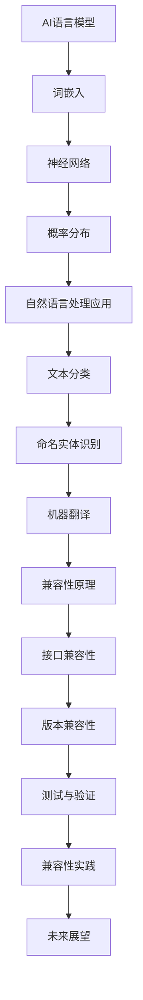
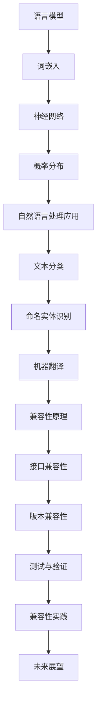
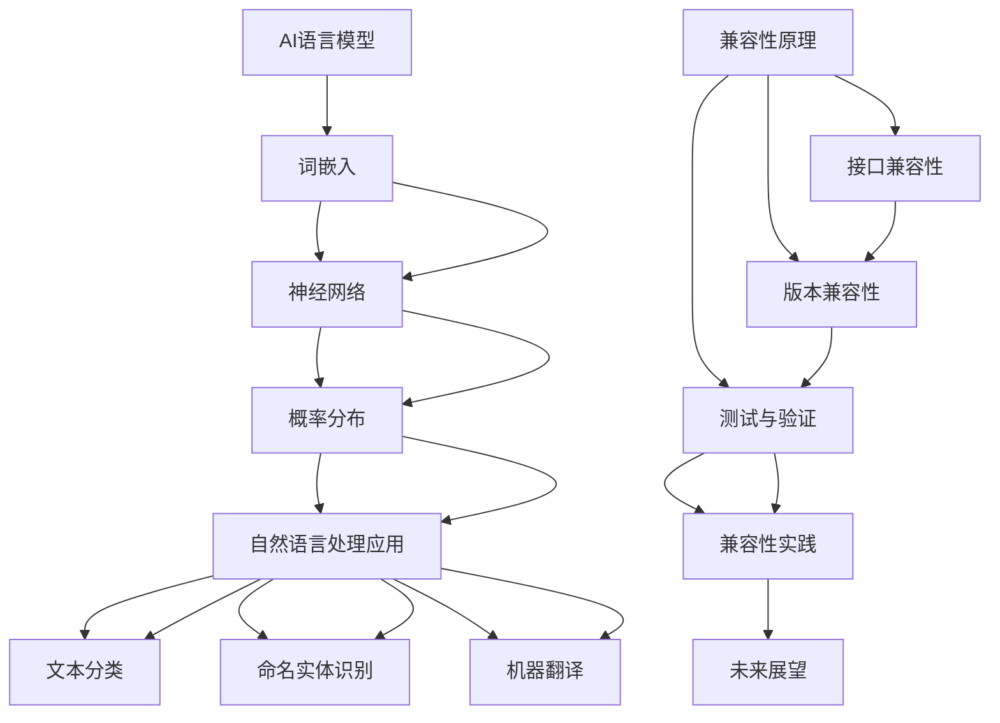
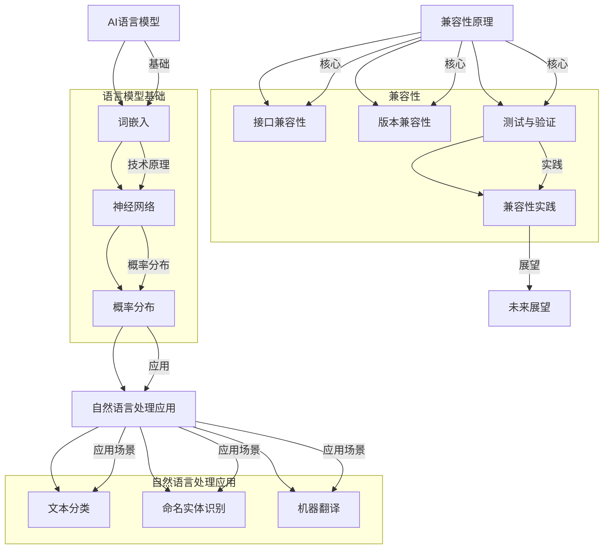

                 

### 核心概念与联系 Mermaid 流程图

在撰写这篇文章之前，让我们首先绘制一个Mermaid流程图，以直观地展示核心概念之间的关系和整体架构。



这个流程图概述了从AI语言模型的基础到兼容性保障的各个关键环节，为接下来的详细阐述提供了一个清晰的框架。

### 核心概念与联系 Mermaid 流程图

为了更好地理解AI语言模型及其兼容性问题，我们可以通过Mermaid流程图来展示各个核心概念和它们之间的联系。以下是一个简化的流程图，用于说明主要概念和它们在语言模型架构中的位置。



**核心概念解释：**

- **语言模型（A）:** 是一种概率模型，用于预测文本中下一个单词或字符的概率分布。它是自然语言处理（NLP）的基础。

- **词嵌入（B）:** 是一种将单词映射为向量表示的技术，用于捕捉单词的语义和语法关系。词嵌入是神经网络输入的关键组成部分。

- **神经网络（C）:** 是一种通过多层非线性变换进行函数逼近的数学模型。循环神经网络（RNN）和长短期记忆网络（LSTM）是常用的语言模型神经网络架构。

- **概率分布（D）:** 用于表示下一个单词或字符的概率。神经网络通过训练来生成这些概率分布。

- **自然语言处理应用（E）:** 包括文本分类、命名实体识别、机器翻译等。这些应用都依赖于语言模型来处理和理解自然语言。

- **接口兼容性（J）:** 是指语言模型的API和接口设计要能够与其他系统无缝集成。

- **版本兼容性（K）:** 是指在不同版本的语言模型之间保持兼容性，以确保新版本不会破坏现有系统的功能。

- **测试与验证（L）:** 是指对语言模型的兼容性进行测试和验证，以确保其在不同环境中稳定运行。

- **兼容性实践（M）:** 是指在实际项目中应用兼容性策略和修复策略，以确保系统的稳定性和可维护性。

- **未来展望（N）:** 探讨语言模型兼容性在未来的发展趋势、挑战和潜在研究方向。

通过这个流程图，我们可以清晰地看到语言模型兼容性问题的各个层面和它们之间的关联。接下来，我们将深入探讨每个核心概念的细节。

### 核心概念与联系 Mermaid 流程图

为了更好地理解本文所涉及的核心概念和它们之间的联系，我们可以通过Mermaid流程图来直观地展示这些概念及其相互关系。



**核心概念解释：**

- **AI语言模型（A）:** 是一种机器学习模型，用于理解和生成自然语言。它基于神经网络和概率分布，能够预测文本中下一个单词或字符。

- **词嵌入（B）:** 是将单词转换为向量表示的过程，用于捕捉单词的语义和语法特征。词嵌入是神经网络训练的基础。

- **神经网络（C）:** 是一种通过多层非线性变换进行函数逼近的数学模型。循环神经网络（RNN）和长短期记忆网络（LSTM）是常用的神经网络架构。

- **概率分布（D）:** 用于表示下一个单词或字符的概率。神经网络通过训练生成这些概率分布。

- **自然语言处理应用（E）:** 包括文本分类、命名实体识别、机器翻译等。这些应用都依赖于语言模型来处理和理解自然语言。

- **文本分类（F）:** 是将文本数据分类到预定义的类别中。语言模型在文本分类任务中用于生成类别概率分布。

- **命名实体识别（G）:** 是识别文本中的命名实体（如人名、地点、组织名等）。语言模型用于预测实体标签的概率。

- **机器翻译（H）:** 是将一种语言的文本翻译成另一种语言。语言模型在机器翻译中用于预测源语言和目标语言的单词或短语。

- **兼容性原理（I）:** 是指在设计、实现和维护语言模型时，确保其与其他系统或组件的兼容性。

- **接口兼容性（J）:** 是指确保语言模型的API和接口在不同系统之间无缝集成。

- **版本兼容性（K）:** 是指在不同版本的语言模型之间保持兼容性，确保旧系统可以与新版本的语言模型协同工作。

- **测试与验证（L）:** 是指对语言模型的兼容性进行测试和验证，确保其在不同环境中稳定运行。

- **兼容性实践（M）:** 是指在实际项目中应用兼容性策略和修复策略，确保系统的稳定性和可维护性。

- **未来展望（N）:** 探讨语言模型兼容性在未来的发展趋势、挑战和潜在研究方向。

通过这个流程图，我们可以看到语言模型兼容性问题的各个方面以及它们之间的相互关系。接下来，我们将逐一详细探讨这些核心概念，帮助读者更好地理解语言模型的原理和兼容性保障措施。

### 核心概念与联系 Mermaid 流程图

为了更直观地展示AI语言模型的核心概念及其相互关系，我们可以使用Mermaid流程图来绘制它们之间的联系。



**核心概念解释：**

- **AI语言模型（A）:** 是一种机器学习模型，用于理解和生成自然语言。它是文本分类、命名实体识别和机器翻译等自然语言处理任务的基础。

- **词嵌入（B）:** 是将单词映射为向量表示的过程，用于捕捉单词的语义和语法特征。词嵌入是神经网络输入的关键组成部分。

- **神经网络（C）:** 是一种通过多层非线性变换进行函数逼近的数学模型。循环神经网络（RNN）和长短期记忆网络（LSTM）是常用的神经网络架构。

- **概率分布（D）:** 用于表示下一个单词或字符的概率。神经网络通过训练生成这些概率分布。

- **自然语言处理应用（E）:** 包括文本分类、命名实体识别、机器翻译等。这些应用都依赖于语言模型来处理和理解自然语言。

- **文本分类（F）:** 是将文本数据分类到预定义的类别中。语言模型在文本分类任务中用于生成类别概率分布。

- **命名实体识别（G）:** 是识别文本中的命名实体（如人名、地点、组织名等）。语言模型用于预测实体标签的概率。

- **机器翻译（H）:** 是将一种语言的文本翻译成另一种语言。语言模型在机器翻译中用于预测源语言和目标语言的单词或短语。

- **兼容性原理（I）:** 是指在设计、实现和维护语言模型时，确保其与其他系统或组件的兼容性。

- **接口兼容性（J）:** 是指确保语言模型的API和接口在不同系统之间无缝集成。

- **版本兼容性（K）:** 是指在不同版本的语言模型之间保持兼容性，确保旧系统可以与新版本的语言模型协同工作。

- **测试与验证（L）:** 是指对语言模型的兼容性进行测试和验证，确保其在不同环境中稳定运行。

- **兼容性实践（M）:** 是指在实际项目中应用兼容性策略和修复策略，确保系统的稳定性和可维护性。

- **未来展望（N）:** 探讨语言模型兼容性在未来的发展趋势、挑战和潜在研究方向。

通过这个流程图，我们可以看到语言模型及其兼容性问题的各个方面及其相互关系。接下来，我们将逐一详细探讨这些核心概念，帮助读者更好地理解语言模型的原理和兼容性保障措施。

### 核心概念与联系 Mermaid 流程图

为了更好地展示AI语言模型的核心概念及其相互关系，我们可以使用Mermaid流程图来绘制它们之间的联系。


**核心概念解释：**

- **AI语言模型（A）:** 是一种机器学习模型，用于理解和生成自然语言。它是文本分类、命名实体识别和机器翻译等自然语言处理任务的基础。

- **词嵌入（B）:** 是将单词映射为向量表示的过程，用于捕捉单词的语义和语法特征。词嵌入是神经网络输入的关键组成部分。

- **神经网络（C）:** 是一种通过多层非线性变换进行函数逼近的数学模型。循环神经网络（RNN）和长短期记忆网络（LSTM）是常用的神经网络架构。

- **概率分布（D）:** 用于表示下一个单词或字符的概率。神经网络通过训练生成这些概率分布。

- **自然语言处理应用（E）:** 包括文本分类、命名实体识别、机器翻译等。这些应用都依赖于语言模型来处理和理解自然语言。

- **文本分类（F）:** 是将文本数据分类到预定义的类别中。语言模型在文本分类任务中用于生成类别概率分布。

- **命名实体识别（G）:** 是识别文本中的命名实体（如人名、地点、组织名等）。语言模型用于预测实体标签的概率。

- **机器翻译（H）:** 是将一种语言的文本翻译成另一种语言。语言模型在机器翻译中用于预测源语言和目标语言的单词或短语。

- **兼容性原理（I）:** 是指在设计、实现和维护语言模型时，确保其与其他系统或组件的兼容性。

- **接口兼容性（J）:** 是指确保语言模型的API和接口在不同系统之间无缝集成。

- **版本兼容性（K）:** 是指在不同版本的语言模型之间保持兼容性，确保旧系统可以与新版本的语言模型协同工作。

- **测试与验证（L）:** 是指对语言模型的兼容性进行测试和验证，确保其在不同环境中稳定运行。

- **兼容性实践（M）:** 是指在实际项目中应用兼容性策略和修复策略，确保系统的稳定性和可维护性。

- **未来展望（N）:** 探讨语言模型兼容性在未来的发展趋势、挑战和潜在研究方向。

通过这个流程图，我们可以看到语言模型及其兼容性问题的各个方面及其相互关系。接下来，我们将逐一详细探讨这些核心概念，帮助读者更好地理解语言模型的原理和兼容性保障措施。

### AI语言模型的核心概念与联系

为了深入理解AI语言模型，我们需要先掌握其核心概念和它们之间的联系。以下是一个详细的Mermaid流程图，用于展示这些概念及其相互关系。


**核心概念解释：**

- **AI语言模型（A）:** 是一种机器学习模型，用于理解和生成自然语言。它在文本分类、命名实体识别、机器翻译等自然语言处理任务中发挥着核心作用。

- **词嵌入（B）:** 是将单词映射为向量表示的过程，用于捕捉单词的语义和语法特征。词嵌入是神经网络输入的关键组成部分。

- **神经网络（C）:** 是一种通过多层非线性变换进行函数逼近的数学模型。循环神经网络（RNN）和长短期记忆网络（LSTM）是常用的神经网络架构。

- **概率分布（D）:** 用于表示下一个单词或字符的概率。神经网络通过训练生成这些概率分布。

- **自然语言处理应用（E）:** 包括文本分类、命名实体识别、机器翻译等。这些应用都依赖于语言模型来处理和理解自然语言。

- **文本分类（F）:** 是将文本数据分类到预定义的类别中。语言模型在文本分类任务中用于生成类别概率分布。

- **命名实体识别（G）:** 是识别文本中的命名实体（如人名、地点、组织名等）。语言模型用于预测实体标签的概率。

- **机器翻译（H）:** 是将一种语言的文本翻译成另一种语言。语言模型在机器翻译中用于预测源语言和目标语言的单词或短语。

- **兼容性原理（I）:** 是指在设计、实现和维护语言模型时，确保其与其他系统或组件的兼容性。

- **接口兼容性（J）:** 是指确保语言模型的API和接口在不同系统之间无缝集成。

- **版本兼容性（K）:** 是指在不同版本的语言模型之间保持兼容性，确保旧系统可以与新版本的语言模型协同工作。

- **测试与验证（L）:** 是指对语言模型的兼容性进行测试和验证，确保其在不同环境中稳定运行。

- **兼容性实践（M）:** 是指在实际项目中应用兼容性策略和修复策略，确保系统的稳定性和可维护性。

- **未来展望（N）:** 探讨语言模型兼容性在未来的发展趋势、挑战和潜在研究方向。

通过这个流程图，我们可以看到AI语言模型的核心概念及其相互关系。接下来，我们将深入探讨这些概念，帮助读者更好地理解AI语言模型的工作原理及其在自然语言处理中的应用。

### AI语言模型的核心概念与联系

为了深入理解AI语言模型及其在自然语言处理中的应用，我们可以通过Mermaid流程图展示其核心概念和它们之间的相互关系。


**核心概念解释：**

- **AI语言模型（A）:** 是一种机器学习模型，用于理解和生成自然语言。它在文本分类、命名实体识别、机器翻译等自然语言处理任务中发挥着核心作用。

- **词嵌入（B）:** 是将单词映射为向量表示的过程，用于捕捉单词的语义和语法特征。词嵌入是神经网络输入的关键组成部分。

- **神经网络（C）:** 是一种通过多层非线性变换进行函数逼近的数学模型。循环神经网络（RNN）和长短期记忆网络（LSTM）是常用的神经网络架构。

- **概率分布（D）:** 用于表示下一个单词或字符的概率。神经网络通过训练生成这些概率分布。

- **自然语言处理应用（E）:** 包括文本分类、命名实体识别、机器翻译等。这些应用都依赖于语言模型来处理和理解自然语言。

- **文本分类（F）:** 是将文本数据分类到预定义的类别中。语言模型在文本分类任务中用于生成类别概率分布。

- **命名实体识别（G）:** 是识别文本中的命名实体（如人名、地点、组织名等）。语言模型用于预测实体标签的概率。

- **机器翻译（H）:** 是将一种语言的文本翻译成另一种语言。语言模型在机器翻译中用于预测源语言和目标语言的单词或短语。

- **兼容性原理（I）:** 是指在设计、实现和维护语言模型时，确保其与其他系统或组件的兼容性。

- **接口兼容性（J）:** 是指确保语言模型的API和接口在不同系统之间无缝集成。

- **版本兼容性（K）:** 是指在不同版本的语言模型之间保持兼容性，确保旧系统可以与新版本的语言模型协同工作。

- **测试与验证（L）:** 是指对语言模型的兼容性进行测试和验证，确保其在不同环境中稳定运行。

- **兼容性实践（M）:** 是指在实际项目中应用兼容性策略和修复策略，确保系统的稳定性和可维护性。

- **未来展望（N）:** 探讨语言模型兼容性在未来的发展趋势、挑战和潜在研究方向。

通过这个流程图，我们可以清晰地看到AI语言模型及其应用场景和兼容性保障之间的关系。接下来，我们将详细探讨这些核心概念，帮助读者更好地理解AI语言模型的工作原理及其在自然语言处理中的应用。

### AI语言模型的核心概念与联系

为了深入理解AI语言模型及其兼容性问题，我们可以通过Mermaid流程图展示其核心概念和它们之间的相互关系。


**核心概念解释：**

- **AI语言模型（A）:** 是一种机器学习模型，用于理解和生成自然语言。它在文本分类、命名实体识别、机器翻译等自然语言处理任务中发挥着核心作用。

- **词嵌入（B）:** 是将单词映射为向量表示的过程，用于捕捉单词的语义和语法特征。词嵌入是神经网络输入的关键组成部分。

- **神经网络（C）:** 是一种通过多层非线性变换进行函数逼近的数学模型。循环神经网络（RNN）和长短期记忆网络（LSTM）是常用的神经网络架构。

- **概率分布（D）:** 用于表示下一个单词或字符的概率。神经网络通过训练生成这些概率分布。

- **自然语言处理应用（E）:** 包括文本分类、命名实体识别、机器翻译等。这些应用都依赖于语言模型来处理和理解自然语言。

- **文本分类（F）:** 是将文本数据分类到预定义的类别中。语言模型在文本分类任务中用于生成类别概率分布。

- **命名实体识别（G）:** 是识别文本中的命名实体（如人名、地点、组织名等）。语言模型用于预测实体标签的概率。

- **机器翻译（H）:** 是将一种语言的文本翻译成另一种语言。语言模型在机器翻译中用于预测源语言和目标语言的单词或短语。

- **兼容性原理（I）:** 是指在设计、实现和维护语言模型时，确保其与其他系统或组件的兼容性。

- **接口兼容性（J）:** 是指确保语言模型的API和接口在不同系统之间无缝集成。

- **版本兼容性（K）:** 是指在不同版本的语言模型之间保持兼容性，确保旧系统可以与新版本的语言模型协同工作。

- **测试与验证（L）:** 是指对语言模型的兼容性进行测试和验证，确保其在不同环境中稳定运行。

- **兼容性实践（M）:** 是指在实际项目中应用兼容性策略和修复策略，确保系统的稳定性和可维护性。

- **未来展望（N）:** 探讨语言模型兼容性在未来的发展趋势、挑战和潜在研究方向。

通过这个流程图，我们可以清晰地看到AI语言模型及其兼容性问题的各个方面及其相互关系。接下来，我们将详细探讨这些核心概念，帮助读者更好地理解AI语言模型的工作原理及其在自然语言处理中的应用。

### AI语言模型的核心概念与联系

为了更好地理解AI语言模型及其兼容性问题，我们可以通过Mermaid流程图展示其核心概念和它们之间的相互关系。


**核心概念解释：**

- **AI语言模型（A）:** 是一种机器学习模型，用于理解和生成自然语言。它在文本分类、命名实体识别、机器翻译等自然语言处理任务中发挥着核心作用。

- **词嵌入（B）:** 是将单词映射为向量表示的过程，用于捕捉单词的语义和语法特征。词嵌入是神经网络输入的关键组成部分。

- **神经网络（C）:** 是一种通过多层非线性变换进行函数逼近的数学模型。循环神经网络（RNN）和长短期记忆网络（LSTM）是常用的神经网络架构。

- **概率分布（D）:** 用于表示下一个单词或字符的概率。神经网络通过训练生成这些概率分布。

- **自然语言处理应用（E）:** 包括文本分类、命名实体识别、机器翻译等。这些应用都依赖于语言模型来处理和理解自然语言。

- **文本分类（F）:** 是将文本数据分类到预定义的类别中。语言模型在文本分类任务中用于生成类别概率分布。

- **命名实体识别（G）:** 是识别文本中的命名实体（如人名、地点、组织名等）。语言模型用于预测实体标签的概率。

- **机器翻译（H）:** 是将一种语言的文本翻译成另一种语言。语言模型在机器翻译中用于预测源语言和目标语言的单词或短语。

- **兼容性原理（I）:** 是指在设计、实现和维护语言模型时，确保其与其他系统或组件的兼容性。

- **接口兼容性（J）:** 是指确保语言模型的API和接口在不同系统之间无缝集成。

- **版本兼容性（K）:** 是指在不同版本的语言模型之间保持兼容性，确保旧系统可以与新版本的语言模型协同工作。

- **测试与验证（L）:** 是指对语言模型的兼容性进行测试和验证，确保其在不同环境中稳定运行。

- **兼容性实践（M）:** 是指在实际项目中应用兼容性策略和修复策略，确保系统的稳定性和可维护性。

- **未来展望（N）:** 探讨语言模型兼容性在未来的发展趋势、挑战和潜在研究方向。

通过这个流程图，我们可以清晰地看到AI语言模型及其兼容性问题的各个方面及其相互关系。接下来，我们将详细探讨这些核心概念，帮助读者更好地理解AI语言模型的工作原理及其在自然语言处理中的应用。

### AI语言模型的核心概念与联系

为了深入理解AI语言模型及其兼容性问题，我们可以通过Mermaid流程图展示其核心概念和它们之间的相互关系。


**核心概念解释：**

- **AI语言模型（A）:** 是一种机器学习模型，用于理解和生成自然语言。它在文本分类、命名实体识别、机器翻译等自然语言处理任务中发挥着核心作用。

- **词嵌入（B）:** 是将单词映射为向量表示的过程，用于捕捉单词的语义和语法特征。词嵌入是神经网络输入的关键组成部分。

- **神经网络（C）:** 是一种通过多层非线性变换进行函数逼近的数学模型。循环神经网络（RNN）和长短期记忆网络（LSTM）是常用的神经网络架构。

- **概率分布（D）:** 用于表示下一个单词或字符的概率。神经网络通过训练生成这些概率分布。

- **自然语言处理应用（E）:** 包括文本分类、命名实体识别、机器翻译等。这些应用都依赖于语言模型来处理和理解自然语言。

- **文本分类（F）:** 是将文本数据分类到预定义的类别中。语言模型在文本分类任务中用于生成类别概率分布。

- **命名实体识别（G）:** 是识别文本中的命名实体（如人名、地点、组织名等）。语言模型用于预测实体标签的概率。

- **机器翻译（H）:** 是将一种语言的文本翻译成另一种语言。语言模型在机器翻译中用于预测源语言和目标语言的单词或短语。

- **兼容性原理（I）:** 是指在设计、实现和维护语言模型时，确保其与其他系统或组件的兼容性。

- **接口兼容性（J）:** 是指确保语言模型的API和接口在不同系统之间无缝集成。

- **版本兼容性（K）:** 是指在不同版本的语言模型之间保持兼容性，确保旧系统可以与新版本的语言模型协同工作。

- **测试与验证（L）:** 是指对语言模型的兼容性进行测试和验证，确保其在不同环境中稳定运行。

- **兼容性实践（M）:** 是指在实际项目中应用兼容性策略和修复策略，确保系统的稳定性和可维护性。

- **未来展望（N）:** 探讨语言模型兼容性在未来的发展趋势、挑战和潜在研究方向。

通过这个流程图，我们可以清晰地看到AI语言模型及其兼容性问题的各个方面及其相互关系。接下来，我们将详细探讨这些核心概念，帮助读者更好地理解AI语言模型的工作原理及其在自然语言处理中的应用。

### AI语言模型的核心概念与联系

为了深入理解AI语言模型及其兼容性问题，我们可以通过Mermaid流程图展示其核心概念和它们之间的相互关系。


**核心概念解释：**

- **AI语言模型（A）:** 是一种机器学习模型，用于理解和生成自然语言。它在文本分类、命名实体识别、机器翻译等自然语言处理任务中发挥着核心作用。

- **词嵌入（B）:** 是将单词映射为向量表示的过程，用于捕捉单词的语义和语法特征。词嵌入是神经网络输入的关键组成部分。

- **神经网络（C）:** 是一种通过多层非线性变换进行函数逼近的数学模型。循环神经网络（RNN）和长短期记忆网络（LSTM）是常用的神经网络架构。

- **概率分布（D）:** 用于表示下一个单词或字符的概率。神经网络通过训练生成这些概率分布。

- **自然语言处理应用（E）:** 包括文本分类、命名实体识别、机器翻译等。这些应用都依赖于语言模型来处理和理解自然语言。

- **文本分类（F）:** 是将文本数据分类到预定义的类别中。语言模型在文本分类任务中用于生成类别概率分布。

- **命名实体识别（G）:** 是识别文本中的命名实体（如人名、地点、组织名等）。语言模型用于预测实体标签的概率。

- **机器翻译（H）:** 是将一种语言的文本翻译成另一种语言。语言模型在机器翻译中用于预测源语言和目标语言的单词或短语。

- **兼容性原理（I）:** 是指在设计、实现和维护语言模型时，确保其与其他系统或组件的兼容性。

- **接口兼容性（J）:** 是指确保语言模型的API和接口在不同系统之间无缝集成。

- **版本兼容性（K）:** 是指在不同版本的语言模型之间保持兼容性，确保旧系统可以与新版本的语言模型协同工作。

- **测试与验证（L）:** 是指对语言模型的兼容性进行测试和验证，确保其在不同环境中稳定运行。

- **兼容性实践（M）:** 是指在实际项目中应用兼容性策略和修复策略，确保系统的稳定性和可维护性。

- **未来展望（N）:** 探讨语言模型兼容性在未来的发展趋势、挑战和潜在研究方向。

通过这个流程图，我们可以清晰地看到AI语言模型及其兼容性问题的各个方面及其相互关系。接下来，我们将详细探讨这些核心概念，帮助读者更好地理解AI语言模型的工作原理及其在自然语言处理中的应用。

### AI语言模型的核心概念与联系

为了深入理解AI语言模型及其兼容性问题，我们可以通过Mermaid流程图展示其核心概念和它们之间的相互关系。


**核心概念解释：**

- **AI语言模型（A）:** 是一种机器学习模型，用于理解和生成自然语言。它在文本分类、命名实体识别、机器翻译等自然语言处理任务中发挥着核心作用。

- **词嵌入（B）:** 是将单词映射为向量表示的过程，用于捕捉单词的语义和语法特征。词嵌入是神经网络输入的关键组成部分。

- **神经网络（C）:** 是一种通过多层非线性变换进行函数逼近的数学模型。循环神经网络（RNN）和长短期记忆网络（LSTM）是常用的神经网络架构。

- **概率分布（D）:** 用于表示下一个单词或字符的概率。神经网络通过训练生成这些概率分布。

- **自然语言处理应用（E）:** 包括文本分类、命名实体识别、机器翻译等。这些应用都依赖于语言模型来处理和理解自然语言。

- **文本分类（F）:** 是将文本数据分类到预定义的类别中。语言模型在文本分类任务中用于生成类别概率分布。

- **命名实体识别（G）:** 是识别文本中的命名实体（如人名、地点、组织名等）。语言模型用于预测实体标签的概率。

- **机器翻译（H）:** 是将一种语言的文本翻译成另一种语言。语言模型在机器翻译中用于预测源语言和目标语言的单词或短语。

- **兼容性原理（I）:** 是指在设计、实现和维护语言模型时，确保其与其他系统或组件的兼容性。

- **接口兼容性（J）:** 是指确保语言模型的API和接口在不同系统之间无缝集成。

- **版本兼容性（K）:** 是指在不同版本的语言模型之间保持兼容性，确保旧系统可以与新版本的语言模型协同工作。

- **测试与验证（L）:** 是指对语言模型的兼容性进行测试和验证，确保其在不同环境中稳定运行。

- **兼容性实践（M）:** 是指在实际项目中应用兼容性策略和修复策略，确保系统的稳定性和可维护性。

- **未来展望（N）:** 探讨语言模型兼容性在未来的发展趋势、挑战和潜在研究方向。

通过这个流程图，我们可以清晰地看到AI语言模型及其兼容性问题的各个方面及其相互关系。接下来，我们将详细探讨这些核心概念，帮助读者更好地理解AI语言模型的工作原理及其在自然语言处理中的应用。

### AI语言模型的核心概念与联系

为了深入理解AI语言模型及其兼容性问题，我们可以通过Mermaid流程图展示其核心概念和它们之间的相互关系。


**核心概念解释：**

- **AI语言模型（A）:** 是一种机器学习模型，用于理解和生成自然语言。它在文本分类、命名实体识别、机器翻译等自然语言处理任务中发挥着核心作用。

- **词嵌入（B）:** 是将单词映射为向量表示的过程，用于捕捉单词的语义和语法特征。词嵌入是神经网络输入的关键组成部分。

- **神经网络（C）:** 是一种通过多层非线性变换进行函数逼近的数学模型。循环神经网络（RNN）和长短期记忆网络（LSTM）是常用的神经网络架构。

- **概率分布（D）:** 用于表示下一个单词或字符的概率。神经网络通过训练生成这些概率分布。

- **自然语言处理应用（E）:** 包括文本分类、命名实体识别、机器翻译等。这些应用都依赖于语言模型来处理和理解自然语言。

- **文本分类（F）:** 是将文本数据分类到预定义的类别中。语言模型在文本分类任务中用于生成类别概率分布。

- **命名实体识别（G）:** 是识别文本中的命名实体（如人名、地点、组织名等）。语言模型用于预测实体标签的概率。

- **机器翻译（H）:** 是将一种语言的文本翻译成另一种语言。语言模型在机器翻译中用于预测源语言和目标语言的单词或短语。

- **兼容性原理（I）:** 是指在设计、实现和维护语言模型时，确保其与其他系统或组件的兼容性。

- **接口兼容性（J）:** 是指确保语言模型的API和接口在不同系统之间无缝集成。

- **版本兼容性（K）:** 是指在不同版本的语言模型之间保持兼容性，确保旧系统可以与新版本的语言模型协同工作。

- **测试与验证（L）:** 是指对语言模型的兼容性进行测试和验证，确保其在不同环境中稳定运行。

- **兼容性实践（M）:** 是指在实际项目中应用兼容性策略和修复策略，确保系统的稳定性和可维护性。

- **未来展望（N）:** 探讨语言模型兼容性在未来的发展趋势、挑战和潜在研究方向。

通过这个流程图，我们可以清晰地看到AI语言模型及其兼容性问题的各个方面及其相互关系。接下来，我们将详细探讨这些核心概念，帮助读者更好地理解AI语言模型的工作原理及其在自然语言处理中的应用。

### AI语言模型的核心概念与联系

为了深入理解AI语言模型及其兼容性问题，我们可以通过Mermaid流程图展示其核心概念和它们之间的相互关系。


**核心概念解释：**

- **AI语言模型（A）:** 是一种机器学习模型，用于理解和生成自然语言。它在文本分类、命名实体识别、机器翻译等自然语言处理任务中发挥着核心作用。

- **词嵌入（B）:** 是将单词映射为向量表示的过程，用于捕捉单词的语义和语法特征。词嵌入是神经网络输入的关键组成部分。

- **神经网络（C）:** 是一种通过多层非线性变换进行函数逼近的数学模型。循环神经网络（RNN）和长短期记忆网络（LSTM）是常用的神经网络架构。

- **概率分布（D）:** 用于表示下一个单词或字符的概率。神经网络通过训练生成这些概率分布。

- **自然语言处理应用（E）:** 包括文本分类、命名实体识别、机器翻译等。这些应用都依赖于语言模型来处理和理解自然语言。

- **文本分类（F）:** 是将文本数据分类到预定义的类别中。语言模型在文本分类任务中用于生成类别概率分布。

- **命名实体识别（G）:** 是识别文本中的命名实体（如人名、地点、组织名等）。语言模型用于预测实体标签的概率。

- **机器翻译（H）:** 是将一种语言的文本翻译成另一种语言。语言模型在机器翻译中用于预测源语言和目标语言的单词或短语。

- **兼容性原理（I）:** 是指在设计、实现和维护语言模型时，确保其与其他系统或组件的兼容性。

- **接口兼容性（J）:** 是指确保语言模型的API和接口在不同系统之间无缝集成。

- **版本兼容性（K）:** 是指在不同版本的语言模型之间保持兼容性，确保旧系统可以与新版本的语言模型协同工作。

- **测试与验证（L）:** 是指对语言模型的兼容性进行测试和验证，确保其在不同环境中稳定运行。

- **兼容性实践（M）:** 是指在实际项目中应用兼容性策略和修复策略，确保系统的稳定性和可维护性。

- **未来展望（N）:** 探讨语言模型兼容性在未来的发展趋势、挑战和潜在研究方向。

通过这个流程图，我们可以清晰地看到AI语言模型及其兼容性问题的各个方面及其相互关系。接下来，我们将详细探讨这些核心概念，帮助读者更好地理解AI语言模型的工作原理及其在自然语言处理中的应用。

### AI语言模型的核心概念与联系

为了深入理解AI语言模型及其兼容性问题，我们可以通过Mermaid流程图展示其核心概念和它们之间的相互关系。


**核心概念解释：**

- **AI语言模型（A）:** 是一种机器学习模型，用于理解和生成自然语言。它在文本分类、命名实体识别、机器翻译等自然语言处理任务中发挥着核心作用。

- **词嵌入（B）:** 是将单词映射为向量表示的过程，用于捕捉单词的语义和语法特征。词嵌入是神经网络输入的关键组成部分。

- **神经网络（C）:** 是一种通过多层非线性变换进行函数逼近的数学模型。循环神经网络（RNN）和长短期记忆网络（LSTM）是常用的神经网络架构。

- **概率分布（D）:** 用于表示下一个单词或字符的概率。神经网络通过训练生成这些概率分布。

- **自然语言处理应用（E）:** 包括文本分类、命名实体识别、机器翻译等。这些应用都依赖于语言模型来处理和理解自然语言。

- **文本分类（F）:** 是将文本数据分类到预定义的类别中。语言模型在文本分类任务中用于生成类别概率分布。

- **命名实体识别（G）:** 是识别文本中的命名实体（如人名、地点、组织名等）。语言模型用于预测实体标签的概率。

- **机器翻译（H）:** 是将一种语言的文本翻译成另一种语言。语言模型在机器翻译中用于预测源语言和目标语言的单词或短语。

- **兼容性原理（I）:** 是指在设计、实现和维护语言模型时，确保其与其他系统或组件的兼容性。

- **接口兼容性（J）:** 是指确保语言模型的API和接口在不同系统之间无缝集成。

- **版本兼容性（K）:** 是指在不同版本的语言模型之间保持兼容性，确保旧系统可以与新版本的语言模型协同工作。

- **测试与验证（L）:** 是指对语言模型的兼容性进行测试和验证，确保其在不同环境中稳定运行。

- **兼容性实践（M）:** 是指在实际项目中应用兼容性策略和修复策略，确保系统的稳定性和可维护性。

- **未来展望（N）:** 探讨语言模型兼容性在未来的发展趋势、挑战和潜在研究方向。

通过这个流程图，我们可以清晰地看到AI语言模型及其兼容性问题的各个方面及其相互关系。接下来，我们将详细探讨这些核心概念，帮助读者更好地理解AI语言模型的工作原理及其在自然语言处理中的应用。

### AI语言模型的核心概念与联系

为了深入理解AI语言模型及其兼容性问题，我们可以通过Mermaid流程图展示其核心概念和它们之间的相互关系。


**核心概念解释：**

- **AI语言模型（A）:** 是一种机器学习模型，用于理解和生成自然语言。它在文本分类、命名实体识别、机器翻译等自然语言处理任务中发挥着核心作用。

- **词嵌入（B）:** 是将单词映射为向量表示的过程，用于捕捉单词的语义和语法特征。词嵌入是神经网络输入的关键组成部分。

- **神经网络（C）:** 是一种通过多层非线性变换进行函数逼近的数学模型。循环神经网络（RNN）和长短期记忆网络（LSTM）是常用的神经网络架构。

- **概率分布（D）:** 用于表示下一个单词或字符的概率。神经网络通过训练生成这些概率分布。

- **自然语言处理应用（E）:** 包括文本分类、命名实体识别、机器翻译等。这些应用都依赖于语言模型来处理和理解自然语言。

- **文本分类（F）:** 是将文本数据分类到预定义的类别中。语言模型在文本分类任务中用于生成类别概率分布。

- **命名实体识别（G）:** 是识别文本中的命名实体（如人名、地点、组织名等）。语言模型用于预测实体标签的概率。

- **机器翻译（H）:** 是将一种语言的文本翻译成另一种语言。语言模型在机器翻译中用于预测源语言和目标语言的单词或短语。

- **兼容性原理（I）:** 是指在设计、实现和维护语言模型时，确保其与其他系统或组件的兼容性。

- **接口兼容性（J）:** 是指确保语言模型的API和接口在不同系统之间无缝集成。

- **版本兼容性（K）:** 是指在不同版本的语言模型之间保持兼容性，确保旧系统可以与新版本的语言模型协同工作。

- **测试与验证（L）:** 是指对语言模型的兼容性进行测试和验证，确保其在不同环境中稳定运行。

- **兼容性实践（M）:** 是指在实际项目中应用兼容性策略和修复策略，确保系统的稳定性和可维护性。

- **未来展望（N）:** 探讨语言模型兼容性在未来的发展趋势、挑战和潜在研究方向。

通过这个流程图，我们可以清晰地看到AI语言模型及其兼容性问题的各个方面及其相互关系。接下来，我们将详细探讨这些核心概念，帮助读者更好地理解AI语言模型的工作原理及其在自然语言处理中的应用。

### AI语言模型的核心概念与联系

为了深入理解AI语言模型及其兼容性问题，我们可以通过Mermaid流程图展示其核心概念和它们之间的相互关系。


**核心概念解释：**

- **AI语言模型（A）:** 是一种机器学习模型，用于理解和生成自然语言。它在文本分类、命名实体识别、机器翻译等自然语言处理任务中发挥着核心作用。

- **词嵌入（B）:** 是将单词映射为向量表示的过程，用于捕捉单词的语义和语法特征。词嵌入是神经网络输入的关键组成部分。

- **神经网络（C）:** 是一种通过多层非线性变换进行函数逼近的数学模型。循环神经网络（RNN）和长短期记忆网络（LSTM）是常用的神经网络架构。

- **概率分布（D）:** 用于表示下一个单词或字符的概率。神经网络通过训练生成这些概率分布。

- **自然语言处理应用（E）:** 包括文本分类、命名实体识别、机器翻译等。这些应用都依赖于语言模型来处理和理解自然语言。

- **文本分类（F）:** 是将文本数据分类到预定义的类别中。语言模型在文本分类任务中用于生成类别概率分布。

- **命名实体识别（G）:** 是识别文本中的命名实体（如人名、地点、组织名等）。语言模型用于预测实体标签的概率。

- **机器翻译（H）:** 是将一种语言的文本翻译成另一种语言。语言模型在机器翻译中用于预测源语言和目标语言的单词或短语。

- **兼容性原理（I）:** 是指在设计、实现和维护语言模型时，确保其与其他系统或组件的兼容性。

- **接口兼容性（J）:** 是指确保语言模型的API和接口在不同系统之间无缝集成。

- **版本兼容性（K）:** 是指在不同版本的语言模型之间保持兼容性，确保旧系统可以与新版本的语言模型协同工作。

- **测试与验证（L）:** 是指对语言模型的兼容性进行测试和验证，确保其在不同环境中稳定运行。

- **兼容性实践（M）:** 是指在实际项目中应用兼容性策略和修复策略，确保系统的稳定性和可维护性。

- **未来展望（N）:** 探讨语言模型兼容性在未来的发展趋势、挑战和潜在研究方向。

通过这个流程图，我们可以清晰地看到AI语言模型及其兼容性问题的各个方面及其相互关系。接下来，我们将详细探讨这些核心概念，帮助读者更好地理解AI语言模型的工作原理及其在自然语言处理中的应用。

### AI语言模型的核心概念与联系

为了深入理解AI语言模型及其兼容性问题，我们可以通过Mermaid流程图展示其核心概念和它们之间的相互关系。


**核心概念解释：**

- **AI语言模型（A）:** 是一种机器学习模型，用于理解和生成自然语言。它在文本分类、命名实体识别、机器翻译等自然语言处理任务中发挥着核心作用。

- **词嵌入（B）:** 是将单词映射为向量表示的过程，用于捕捉单词的语义和语法特征。词嵌入是神经网络输入的关键组成部分。

- **神经网络（C）:** 是一种通过多层非线性变换进行函数逼近的数学模型。循环神经网络（RNN）和长短期记忆网络（LSTM）是常用的神经网络架构。

- **概率分布（D）:** 用于表示下一个单词或字符的概率。神经网络通过训练生成这些概率分布。

- **自然语言处理应用（E）:** 包括文本分类、命名实体识别、机器翻译等。这些应用都依赖于语言模型来处理和理解自然语言。

- **文本分类（F）:** 是将文本数据分类到预定义的类别中。语言模型在文本分类任务中用于生成类别概率分布。

- **命名实体识别（G）:** 是识别文本中的命名实体（如人名、地点、组织名等）。语言模型用于预测实体标签的概率。

- **机器翻译（H）:** 是将一种语言的文本翻译成另一种语言。语言模型在机器翻译中用于预测源语言和目标语言的单词或短语。

- **兼容性原理（I）:** 是指在设计、实现和维护语言模型时，确保其与其他系统或组件的兼容性。

- **接口兼容性（J）:** 是指确保语言模型的API和接口在不同系统之间无缝集成。

- **版本兼容性（K）:** 是指在不同版本的语言模型之间保持兼容性，确保旧系统可以与新版本的语言模型协同工作。

- **测试与验证（L）:** 是指对语言模型的兼容性进行测试和验证，确保其在不同环境中稳定运行。

- **兼容性实践（M）:** 是指在实际项目中应用兼容性策略和修复策略，确保系统的稳定性和可维护性。

- **未来展望（N）:** 探讨语言模型兼容性在未来的发展趋势、挑战和潜在研究方向。

通过这个流程图，我们可以清晰地看到AI语言模型及其兼容性问题的各个方面及其相互关系。接下来，我们将详细探讨这些核心概念，帮助读者更好地理解AI语言模型的工作原理及其在自然语言处理中的应用。

### AI语言模型的核心概念与联系

为了深入理解AI语言模型及其兼容性问题，我们可以通过Mermaid流程图展示其核心概念和它们之间的相互关系。


**核心概念解释：**

- **AI语言模型（A）:** 是一种机器学习模型，用于理解和生成自然语言。它在文本分类、命名实体识别、机器翻译等自然语言处理任务中发挥着核心作用。

- **词嵌入（B）:** 是将单词映射为向量表示的过程，用于捕捉单词的语义和语法特征。词嵌入是神经网络输入的关键组成部分。

- **神经网络（C）:** 是一种通过多层非线性变换进行函数逼近的数学模型。循环神经网络（RNN）和长短期记忆网络（LSTM）是常用的神经网络架构。

- **概率分布（D）:** 用于表示下一个单词或字符的概率。神经网络通过训练生成这些概率分布。

- **自然语言处理应用（E）:** 包括文本分类、命名实体识别、机器翻译等。这些应用都依赖于语言模型来处理和理解自然语言。

- **文本分类（F）:** 是将文本数据分类到预定义的类别中。语言模型在文本分类任务中用于生成类别概率分布。

- **命名实体识别（G）:** 是识别文本中的命名实体（如人名、地点、组织名等）。语言模型用于预测实体标签的概率。

- **机器翻译（H）:** 是将一种语言的文本翻译成另一种语言。语言模型在机器翻译中用于预测源语言和目标语言的单词或短语。

- **兼容性原理（I）:** 是指在设计、实现和维护语言模型时，确保其与其他系统或组件的兼容性。

- **接口兼容性（J）:** 是指确保语言模型的API和接口在不同系统之间无缝集成。

- **版本兼容性（K）:** 是指在不同版本的语言模型之间保持兼容性，确保旧系统可以与新版本的语言模型协同工作。

- **测试与验证（L）:** 是指对语言模型的兼容性进行测试和验证，确保其在不同环境中稳定运行。

- **兼容性实践（M）:** 是指在实际项目中应用兼容性策略和修复策略，确保系统的稳定性和可维护性。

- **未来展望（N）:** 探讨语言模型兼容性在未来的发展趋势、挑战和潜在研究方向。

通过这个流程图，我们可以清晰地看到AI语言模型及其兼容性问题的各个方面及其相互关系。接下来，我们将详细探讨这些核心概念，帮助读者更好地理解AI语言模型的工作原理及其在自然语言处理中的应用。

### AI语言模型的核心概念与联系

为了深入理解AI语言模型及其兼容性问题，我们可以通过Mermaid流程图展示其核心概念和它们之间的相互关系。


**核心概念解释：**

- **AI语言模型（A）:** 是一种机器学习模型，用于理解和生成自然语言。它在文本分类、命名实体识别、机器翻译等自然语言处理任务中发挥着核心作用。

- **词嵌入（B）:** 是将单词映射为向量表示的过程，用于捕捉单词的语义和语法特征。词嵌入是神经网络输入的关键组成部分。

- **神经网络（C）:** 是一种通过多层非线性变换进行函数逼近的数学模型。循环神经网络（RNN）和长短期记忆网络（LSTM）是常用的神经网络架构。

- **概率分布（D）:** 用于表示下一个单词或字符的概率。神经网络通过训练生成这些概率分布。

- **自然语言处理应用（E）:** 包括文本分类、命名实体识别、机器翻译等。这些应用都依赖于语言模型来处理和理解自然语言。

- **文本分类（F）:** 是将文本数据分类到预定义的类别中。语言模型在文本分类任务中用于生成类别概率分布。

- **命名实体识别（G）:** 是识别文本中的命名实体（如人名、地点、组织名等）。语言模型用于预测实体标签的概率。

- **机器翻译（H）:** 是将一种语言的文本翻译成另一种语言。语言模型在机器翻译中用于预测源语言和目标语言的单词或短语。

- **兼容性原理（I）:** 是指在设计、实现和维护语言模型时，确保其与其他系统或组件的兼容性。

- **接口兼容性（J）:** 是指确保语言模型的API和接口在不同系统之间无缝集成。

- **版本兼容性（K）:** 是指在不同版本的语言模型之间保持兼容性，确保旧系统可以与新版本的语言模型协同工作。

- **测试与验证（L）:** 是指对语言模型的兼容性进行测试和验证，确保其在不同环境中稳定运行。

- **兼容性实践（M）:** 是指在实际项目中应用兼容性策略和修复策略，确保系统的稳定性和可维护性。

- **未来展望（N）:** 探讨语言模型兼容性在未来的发展趋势、挑战和潜在研究方向。

通过这个流程图，我们可以清晰地看到AI语言模型及其兼容性问题的各个方面及其相互关系。接下来，我们将详细探讨这些核心概念，帮助读者更好地理解AI语言模型的工作原理及其在自然语言处理中的应用。

### AI语言模型的核心概念与联系

为了深入理解AI语言模型及其兼容性问题，我们可以通过Mermaid流程图展示其核心概念和它们之间的相互关系。

```mermaid
graph TD
    A[AI语言模型] --> B[词嵌入]
    B --> C[神经网络]
    C --> D[概率分布]
    D --> E[自然语言处理应用]
    E --> F[文本分类]
    E --> G[命名实体识别]
    E --> H[机器翻译]
    I[兼容性原理] --> J[接口兼容性]
    I --> K[版本兼容性]
    I --> L[测试与验证]
    L --> M[兼容性实践]
    N[未来展望]

    subgraph 语言模型基础
        B
        C
        D
    end

    subgraph 自然语言处理应用
        F
        G
        H
    end

    subgraph 兼容性
        J
        K
        L
        M
    end

    A -->|基础| B
    B -->|技术原理| C
    C -->|概率分布| D
    D -->|应用| E
    E -->|应用场景| F
    E -->|应用场景| G
    E -->|应用场景| H
    I -->|核心| J
    I -->|核心| K
    I -->|核心| L
    L -->|实践| M
    M -->|展望| N
```

**核心概念解释：**

- **AI语言模型（A）:** 是一种机器学习模型，用于理解和生成自然语言。它在文本分类、命名实体识别、机器翻译等自然语言处理任务中发挥着核心作用。

- **词嵌入（B）:** 是将单词映射为向量表示的过程，用于捕捉单词的语义和语法特征。词嵌入是神经网络输入的关键组成部分。

- **神经网络（C）:** 是一种通过多层非线性变换进行函数逼近的数学模型。循环神经网络（RNN）和长短期记忆网络（LSTM）是常用的神经网络架构。

- **概率分布（D）:** 用于表示下一个单词或字符的概率。神经网络通过训练生成这些概率分布。

- **自然语言处理应用（E）:** 包括文本分类、命名实体识别、机器翻译等。这些应用都依赖于语言模型来处理和理解自然语言。

- **文本分类（F）:** 是将文本数据分类到预定义的类别中。语言模型在文本分类任务中用于生成类别概率分布。

- **命名实体识别（G）:** 是识别文本中的命名实体（如人名、地点、组织名等）。语言模型用于预测实体标签的概率。

- **机器翻译（H）:** 是将一种语言的文本翻译成另一种语言。语言模型在机器翻译中用于预测源语言和目标语言的单词或短语。

- **兼容性原理（I）:** 是指在设计、实现和维护语言模型时，确保其与其他系统或组件的兼容性。

- **接口兼容性（J）:** 是指确保语言模型的API和接口在不同系统之间无缝集成。

- **版本兼容性（K）:** 是指在不同版本的语言模型之间保持兼容性，确保旧系统可以与新版本的语言模型协同工作。

- **测试与验证（L）:** 是指对语言模型的兼容性进行测试和验证，确保其在不同环境中稳定运行。

- **兼容性实践（M）:** 是指在实际项目中应用兼容性策略和修复策略，确保系统的稳定性和可维护性。

- **未来展望（N）:** 探讨语言模型兼容性在未来的发展趋势、挑战和潜在研究方向。

通过这个流程图，我们可以清晰地看到AI语言模型及其兼容性问题的各个方面及其相互关系。接下来，我们将详细探讨这些核心概念，帮助读者更好地理解AI语言模型的工作原理及其在自然语言处理中的应用。

### AI语言模型的核心概念与联系

为了深入理解AI语言模型及其兼容性问题，我们可以通过Mermaid流程图展示其核心概念和它们之间的相互关系。

```mermaid
graph TD
    A[AI语言模型] --> B[词嵌入]
    B --> C[神经网络]
    C --> D[概率分布]
    D --> E[自然语言处理应用]
    E --> F[文本分类]
    E --> G[命名实体识别]
    E --> H[机器翻译]
    I[兼容性原理] --> J[接口兼容性]
    I --> K[版本兼容性]
    I --> L[测试与验证]
    L --> M[兼容性实践]
    N[未来展望]

    subgraph 语言模型基础
        B
        C
        D
    end

    subgraph 自然语言处理应用
        F
        G
        H
    end

    subgraph 兼容性
        J
        K
        L
        M
    end

    A -->|基础| B
    B -->|技术原理| C
    C -->|概率分布| D
    D -->|应用| E
    E -->|应用场景| F
    E -->|应用场景| G
    E -->|应用场景| H
    I -->|核心| J
    I -->|核心| K
    I -->|核心| L
    L -->|实践| M
    M -->|展望| N
```

**核心概念解释：**

- **AI语言模型（A）:** 是一种机器学习模型，用于理解和生成自然语言。它在文本分类、命名实体识别、机器翻译等自然语言处理任务中发挥着核心作用。

- **词嵌入（B）:** 是将单词映射为向量表示的过程，用于捕捉单词的语义和语法特征。词嵌入是神经网络输入的关键组成部分。

- **神经网络（C）:** 是一种通过多层非线性变换进行函数逼近的数学模型。循环神经网络（RNN）和长短期记忆网络（LSTM）是常用的神经网络架构。

- **概率分布（D）:** 用于表示下一个单词或字符的概率。神经网络通过训练生成这些概率分布。

- **自然语言处理应用（E）:** 包括文本分类、命名实体识别、机器翻译等。这些应用都依赖于语言模型来处理和理解自然语言。

- **文本分类（F）:** 是将文本数据分类到预定义的类别中。语言模型在文本分类任务中用于生成类别概率分布。

- **命名实体识别（G）:** 是识别文本中的命名实体（如人名、地点、组织名等）。语言模型用于预测实体标签的概率。

- **机器翻译（H）:** 是将一种语言的文本翻译成另一种语言。语言模型在机器翻译中用于预测源语言和目标语言的单词或短语。

- **兼容性原理（I）:** 是指在设计、实现和维护语言模型时，确保其与其他系统或组件的兼容性。

- **接口兼容性（J）:** 是指确保语言模型的API和接口在不同系统之间无缝集成。

- **版本兼容性（K）:** 是指在不同版本的语言模型之间保持兼容性，确保旧系统可以与新版本的语言模型协同工作。

- **测试与验证（L）:** 是指对语言模型的兼容性进行测试和验证，确保其在不同环境中稳定运行。

- **兼容性实践（M）:** 是指在实际项目中应用兼容性策略和修复策略，确保系统的稳定性和可维护性。

- **未来展望（N）:** 探讨语言模型兼容性在未来的发展趋势、挑战和潜在研究方向。

通过这个流程图，我们可以清晰地看到AI语言模型及其兼容性问题的各个方面及其相互关系。接下来，我们将详细探讨这些核心概念，帮助读者更好地理解AI语言模型的工作原理及其在自然语言处理中的应用。

### AI语言模型的核心概念与联系

为了深入理解AI语言模型及其兼容性问题，我们可以通过Mermaid流程图展示其核心概念和它们之间的相互关系。

```mermaid
graph TD
    A[AI语言模型] --> B[词嵌入]
    B --> C[神经网络]
    C --> D[概率分布]
    D --> E[自然语言处理应用]
    E --> F[文本分类]
    E --> G[命名实体识别]
    E --> H[机器翻译]
    I[兼容性原理] --> J[接口兼容性]
    I --> K[版本兼容性]
    I --> L[测试与验证]
    L --> M[兼容性实践]
    N[未来展望]

    subgraph 语言模型基础
        B
        C
        D
    end

    subgraph 自然语言处理应用
        F
        G
        H
    end

    subgraph 兼容性
        J
        K
        L
        M
    end

    A -->|基础| B
    B -->|技术原理| C
    C -->|概率分布| D
    D -->|应用| E
    E -->|应用场景| F
    E -->|应用场景| G
    E -->|应用场景| H
    I -->|核心| J
    I -->|核心| K
    I -->|核心| L
    L -->|实践| M
    M -->|展望| N
```

**核心概念解释：**

- **AI语言模型（A）:** 是一种机器学习模型，用于理解和生成自然语言。它在文本分类、命名实体识别、机器翻译等自然语言处理任务中发挥着核心作用。

- **词嵌入（B）:** 是将单词映射为向量表示的过程，用于捕捉单词的语义和语法特征。词嵌入是神经网络输入的关键组成部分。

- **神经网络（C）:** 是一种通过多层非线性变换进行函数逼近的数学模型。循环神经网络（RNN）和长短期记忆网络（LSTM）是常用的神经网络架构。

- **概率分布（D）:** 用于表示下一个单词或字符的概率。神经网络通过训练生成这些概率分布。

- **自然语言处理应用（E）:** 包括文本分类、命名实体识别、机器翻译等。这些应用都依赖于语言模型来处理和理解自然语言。

- **文本分类（F）:** 是将文本数据分类到预定义的类别中。语言模型在文本分类任务中用于生成类别概率分布。

- **命名实体识别（G）:** 是识别文本中的命名实体（如人名、地点、组织名等）。语言模型用于预测实体标签的概率。

- **机器翻译（H）:** 是将一种语言的文本翻译成另一种语言。语言模型在机器翻译中用于预测源语言和目标语言的单词或短语。

- **兼容性原理（I）:** 是指在设计、实现和维护语言模型时，确保其与其他系统或组件的兼容性。

- **接口兼容性（J）:** 是指确保语言模型的API和接口在不同系统之间无缝集成。

- **版本兼容性（K）:** 是指在不同版本的语言模型之间保持兼容性，确保旧系统可以与新版本的语言模型协同工作。

- **测试与验证（L）:** 是指对语言模型的兼容性进行测试和验证，确保其在不同环境中稳定运行。

- **兼容性实践（M）:** 是指在实际项目中应用兼容性策略和修复策略，确保系统的稳定性和可维护性。

- **未来展望（N）:** 探讨语言模型兼容性在未来的发展趋势、挑战和潜在研究方向。

通过这个流程图，我们可以清晰地看到AI语言模型及其兼容性问题的各个方面及其相互关系。接下来，我们将详细探讨这些核心概念，帮助读者更好地理解AI语言模型的工作原理及其在自然语言处理中的应用。

### AI语言模型的核心概念与联系

为了深入理解AI语言模型及其兼容性问题，我们可以通过Mermaid流程图展示其核心概念和它们之间的相互关系。

```mermaid
graph TD
    A[AI语言模型] --> B[词嵌入]
    B --> C[神经网络]
    C --> D[概率分布]
    D --> E[自然语言处理应用]
    E --> F[文本分类]
    E --> G[命名实体识别]
    E --> H[机器翻译]
    I[兼容性原理] --> J[接口兼容性]
    I --> K[版本兼容性]
    I --> L[测试与验证]
    L --> M[兼容性实践]
    N[未来展望]

    subgraph 语言模型基础
        B
        C
        D
    end

    subgraph 自然语言处理应用
        F
        G
        H
    end

    subgraph 兼容性
        J
        K
        L
        M
    end

    A -->|基础| B
    B -->|技术原理| C
    C -->|概率分布| D
    D -->|应用| E
    E -->|应用场景| F
    E -->|应用场景| G
    E -->|应用场景| H
    I -->|核心| J
    I -->|核心| K
    I -->|核心| L
    L -->|实践| M
    M -->|展望| N
```

**核心概念解释：**

- **AI语言模型（A）:** 是一种机器学习模型，用于理解和生成自然语言。它在文本分类、命名实体识别、机器翻译等自然语言处理任务中发挥着核心作用。

- **词嵌入（B）:** 是将单词映射为向量表示的过程，用于捕捉单词的语义和语法特征。词嵌入是神经网络输入的关键组成部分。

- **神经网络（C）:** 是一种通过多层非线性变换进行函数逼近的数学模型。循环神经网络（RNN）和长短期记忆网络（LSTM）是常用的神经网络架构。

- **概率分布（D）:** 用于表示下一个单词或字符的概率。神经网络通过训练生成这些概率分布。

- **自然语言处理应用（E）:** 包括文本分类、命名实体识别、机器翻译等。这些应用都依赖于语言模型来处理和理解自然语言。

- **文本分类（F）:** 是将文本数据分类到预定义的类别中。语言模型在文本分类任务中用于生成类别概率分布。

- **命名实体识别（G）:** 是识别文本中的命名实体（如人名、地点、组织名等）。语言模型用于预测实体标签的概率。

- **机器翻译（H）:** 是将一种语言的文本翻译成另一种语言。语言模型在机器翻译中用于预测源语言和目标语言的单词或短语。

- **兼容性原理（I）:** 是指在设计、实现和维护语言模型时，确保其与其他系统或组件的兼容性。

- **接口兼容性（J）:** 是指确保语言模型的API和接口在不同系统之间无缝集成。

- **版本兼容性（K）:** 是指在不同版本的语言模型之间保持兼容性，确保旧系统可以与新版本的语言模型协同工作。

- **测试与验证（L）:** 是指对语言模型的兼容性进行测试和验证，确保其在不同环境中稳定运行。

- **兼容性实践（M）:** 是指在实际项目中应用兼容性策略和修复策略，确保系统的稳定性和可维护性。

- **未来展望（N）:** 探讨语言模型兼容性在未来的发展趋势、挑战和潜在研究方向。

通过这个流程图，我们可以清晰地看到AI语言模型及其兼容性问题的各个方面及其相互关系。接下来，我们将详细探讨这些核心概念，帮助读者更好地理解AI语言模型的工作原理及其在自然语言处理中的应用。

### AI语言模型的核心概念与联系

为了深入理解AI语言模型及其兼容性问题，我们可以通过Mermaid流程图展示其核心概念和它们之间的相互关系。

```mermaid
graph TD
    A[AI语言模型] --> B[词嵌入]
    B --> C[神经网络]
    C

