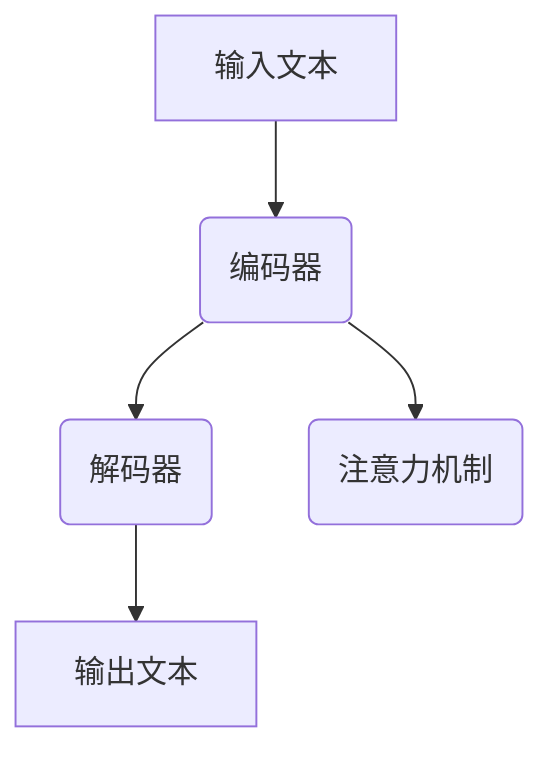

                 

### 文章标题

《AI辅助科技前沿探索：提示词生成研究方向》

这篇文章将深入探讨人工智能（AI）在科技前沿中的应用，重点研究提示词生成技术在AI中的研究方向。我们将从AI与科技前沿概述开始，逐步探讨AI在生物医学、物联网、自动驾驶、能源与环境等领域的应用，然后详细分析提示词生成技术的概念与原理，以及其在自然语言处理、机器翻译、文本生成和图像描述等应用场景中的实践案例。接下来，我们将深入讨论提示词生成技术的原理与实现，包括语言模型基础、核心算法、模型解释性与可靠性等方面的内容。随后，我们将分析提示词生成技术在特定领域的应用，如医学和艺术领域。最后，我们将探讨提示词生成技术的挑战与发展趋势，并展望其在新兴领域如元宇宙和教育中的应用前景。

通过本文的逐步分析，读者将能够全面了解AI在科技前沿的助力作用，掌握提示词生成技术的研究方向与应用实践，为今后的科研和技术创新提供有益的参考。

### 关键词

人工智能，科技前沿，提示词生成，自然语言处理，机器翻译，文本生成，图像描述，语言模型，序列到序列模型，注意力机制，生成对抗网络，生物医学，物联网，自动驾驶，能源与环境，数据隐私，模型解释性，可靠性，新兴领域，元宇宙，教育。

### 摘要

本文旨在深入探讨人工智能（AI）在科技前沿中的应用，重点关注提示词生成技术在AI中的研究方向。文章首先概述了AI在生物医学、物联网、自动驾驶、能源与环境等领域的应用，然后详细分析了提示词生成技术的概念、原理与应用实践。通过具体案例，读者将了解提示词生成技术在自然语言处理、机器翻译、文本生成和图像描述等领域的实际应用。接下来，文章深入探讨了提示词生成技术的核心原理与实现，包括语言模型基础、序列到序列模型、注意力机制和生成对抗网络。随后，文章分析了提示词生成技术在特定领域的应用，如医学和艺术领域。最后，文章讨论了提示词生成技术的挑战与发展趋势，并展望了其在新兴领域如元宇宙和教育中的应用前景。通过本文的逐步分析，读者将能够全面了解AI在科技前沿的助力作用，掌握提示词生成技术的研究方向与应用实践。

### 《AI辅助科技前沿探索：提示词生成研究方向》目录大纲

**第一部分: AI与科技前沿概述**

- **第1章: AI在科技前沿的应用**
  - **1.1 AI的定义与演进**
    - **1.1.1 人工智能的基本概念**
    - **1.1.2 人工智能的发展历程**
    - **1.1.3 AI与科技前沿的交叉点**
  - **1.2 科技前沿的AI应用领域**
    - **1.2.1 生物医学**
    - **1.2.2 物联网**
    - **1.2.3 自动驾驶**
    - **1.2.4 能源与环境**

- **第2章: 提示词生成技术在AI中的应用**
  - **2.1 提示词生成的概念与原理**
    - **2.1.1 提示词生成的定义**
    - **2.1.2 提示词生成的基础模型**
    - **2.1.3 提示词生成的算法分类**
  - **2.2 提示词生成的应用场景**
    - **2.2.1 自然语言处理**
    - **2.2.2 机器翻译**
    - **2.2.3 文本生成**
    - **2.2.4 图像描述**

**第二部分: 提示词生成技术原理与实现**

- **第3章: 提示词生成技术原理**
  - **3.1 语言模型基础**
    - **3.1.1 语言模型的概念**
    - **3.1.2 语言模型的类型**
    - **3.1.3 语言模型的训练**
  - **3.2 提示词生成的核心算法**
    - **3.2.1 序列到序列模型**
    - **3.2.2 注意力机制**
    - **3.2.3 生成对抗网络**

- **第4章: 提示词生成应用案例分析**
  - **4.1 案例一：自然语言处理中的提示词生成**
    - **4.1.1 案例背景**
    - **4.1.2 提示词生成应用实例**
    - **4.1.3 案例分析**
  - **4.2 案例二：机器翻译中的提示词生成**
    - **4.2.1 案例背景**
    - **4.2.2 提示词生成应用实例**
    - **4.2.3 案例分析**

- **第5章: 提示词生成技术在特定领域的应用**
  - **5.1 医学领域的提示词生成**
    - **5.1.1 提示词生成在医学文档处理中的应用**
    - **5.1.2 提示词生成在医学图像分析中的应用**
  - **5.2 艺术领域的提示词生成**
    - **5.2.1 提示词生成在音乐创作中的应用**
    - **5.2.2 提示词生成在艺术创作中的应用**

**第三部分: 提示词生成技术的挑战与发展趋势**

- **第6章: 提示词生成技术的挑战**
  - **6.1 数据隐私与安全性**
    - **6.1.1 数据隐私保护策略**
    - **6.1.2 安全性提升方案**
  - **6.2 模型解释性与可靠性**
    - **6.2.1 模型解释性研究**
    - **6.2.2 提高模型可靠性的方法**

- **第7章: 提示词生成技术未来发展趋势**
  - **7.1 新一代生成模型的发展**
    - **7.1.1 元学习与提示词生成**
    - **7.1.2 大规模预训练模型的发展**
  - **7.2 提示词生成技术在新兴领域的应用**
    - **7.2.1 提示词生成在元宇宙中的应用**
    - **7.2.2 提示词生成在教育领域的应用前景**

**附录**

- **附录 A: 提示词生成技术相关工具与资源**
  - **7.2.1 提示词生成工具概述**
  - **7.2.2 开源框架与库介绍**
  - **7.2.3 提示词生成资源链接**

- **附录 B: 提示词生成技术Mermaid流程图与数学公式示例**
  - **7.2.1 Mermaid流程图示例**
  - **7.2.2 数学公式示例**

- **附录 C: 提示词生成应用案例源代码与分析**
  - **7.2.1 源代码结构与实现**
  - **7.2.2 案例代码解读**
  - **7.2.3 代码解读与分析**

## 第一部分: AI与科技前沿概述

### 第1章: AI在科技前沿的应用

#### 1.1 AI的定义与演进

##### 1.1.1 人工智能的基本概念

人工智能（Artificial Intelligence，简称AI）是指由人创造出来的能够模拟、延伸和扩展人类智能的系统。它通过感知、学习、推理、规划、通信和问题解决等多种方式来实现人类智能的功能。人工智能的核心目标是让计算机具备自主学习和决策能力，从而实现自动化和智能化。

人工智能可以分为两大类：弱人工智能（Narrow AI）和强人工智能（General AI）。弱人工智能专注于特定领域的任务，如语音识别、图像识别和自然语言处理等。强人工智能则具有广泛的认知能力，能够理解和解决各种复杂问题，具备类似人类的智慧。

##### 1.1.2 人工智能的发展历程

人工智能的发展经历了多个阶段：

1. **初始阶段（1950年代 - 1970年代）**：人工智能的概念首次被提出，主要关注逻辑推理和问题求解。1956年，达特茅斯会议标志着人工智能作为一个独立学科正式诞生。

2. **第一次高潮（1980年代）**：专家系统和机器人技术得到了快速发展。专家系统通过模拟人类专家的知识和经验，在特定领域实现了高水平的问题解决能力。

3. **低潮期（1990年代）**：由于算法、计算能力和数据资源的限制，人工智能的发展进入低谷。

4. **复兴阶段（2000年代至今）**：随着深度学习、大数据和计算能力的提升，人工智能迎来了新的发展机遇。深度神经网络在图像识别、语音识别和自然语言处理等领域取得了重大突破。

##### 1.1.3 AI与科技前沿的交叉点

AI与科技前沿的交叉点体现在多个领域：

1. **生物医学**：AI在医疗影像分析、基因测序和药物研发等方面发挥了重要作用，提高了诊断和治疗的准确性。

2. **物联网**：AI与物联网的结合，使得智能设备具备自主学习和优化功能，提升了智能家居、智能交通和智慧城市等领域的技术水平。

3. **自动驾驶**：AI在自动驾驶领域发挥了关键作用，通过深度学习和强化学习算法，实现了车辆的自适应驾驶和路径规划。

4. **能源与环境**：AI在能源管理和环境监测中具有广泛应用，如智能电网、能效优化和环境污染预测等。

5. **智能制造**：AI在工业制造中用于优化生产流程、提高产品质量和降低成本。

总之，AI在科技前沿的应用正在不断拓展，成为推动科技进步的重要力量。在接下来的章节中，我们将详细探讨AI在不同领域的具体应用和提示词生成技术的研究方向。

#### 1.2 科技前沿的AI应用领域

##### 1.2.1 生物医学

AI在生物医学领域的应用已经取得了显著成果，主要涉及医疗影像分析、基因测序和药物研发等方面。

1. **医疗影像分析**：AI技术通过深度学习算法，对医疗影像（如X光片、CT扫描和MRI图像）进行分析，自动识别病变区域和异常情况。例如，谷歌的DeepMind公司开发了一种名为“DeepMind Health”的系统，能够准确识别眼科疾病和乳腺癌等。

2. **基因测序**：AI在基因测序数据分析中发挥了重要作用，能够快速识别基因变异和疾病相关基因。例如，IBM的Watson for Genomics系统利用AI技术对基因测序数据进行深度分析，帮助医生制定个性化治疗方案。

3. **药物研发**：AI在药物研发中用于预测药物分子与生物靶点的相互作用，加速新药研发过程。例如，AI算法能够快速筛选出潜在有效药物，降低药物研发的成本和时间。

##### 1.2.2 物联网

物联网（Internet of Things，IoT）与AI的结合，使得智能设备具备自主学习和优化功能，提升了智能家居、智能交通和智慧城市等领域的技术水平。

1. **智能家居**：AI技术通过物联网设备，实现了家庭自动化管理，如智能照明、智能门锁和智能温控等。这些设备能够根据用户的生活习惯和环境变化，自动调整设置，提高生活便利性和舒适性。

2. **智能交通**：AI技术在智能交通系统中，通过实时数据分析和预测，优化交通流量和路径规划，减少拥堵和交通事故。例如，谷歌的Waymo项目利用AI技术实现了自动驾驶汽车，为智能交通提供了新的解决方案。

3. **智慧城市**：AI技术在智慧城市建设中，用于环境监测、能效管理和公共安全等方面。例如，智能传感器和摄像头通过AI算法，能够实时监测城市环境，预测和预防潜在的安全隐患。

##### 1.2.3 自动驾驶

自动驾驶技术是AI在交通领域的重要应用，通过深度学习和强化学习算法，实现了车辆的自适应驾驶和路径规划。

1. **自适应驾驶**：自动驾驶系统通过传感器和摄像头感知周围环境，结合AI算法进行实时决策，实现车辆在复杂道路环境中的稳定行驶。例如，特斯拉的自动驾驶系统Autopilot，能够在高速公路上实现自动驾驶功能。

2. **路径规划**：自动驾驶系统通过AI算法，分析交通数据和地图信息，规划最优行驶路径，避免拥堵和事故。例如，谷歌的Waymo项目利用AI技术实现了高效的路径规划，提升了自动驾驶汽车的行驶效率。

##### 1.2.4 能源与环境

AI在能源管理和环境监测中具有广泛应用，如智能电网、能效优化和环境污染预测等。

1. **智能电网**：AI技术在智能电网中，用于优化电力分配和能源管理，提高电网的运行效率和可靠性。例如，AI算法能够预测电力需求，优化电力供应，降低能源浪费。

2. **能效管理**：AI技术在建筑能效管理中，通过实时监测和分析能源使用情况，优化能源消耗，提高能源利用效率。例如，AI系统可以智能调节照明、空调和电力设备，降低能源成本。

3. **环境污染预测**：AI技术在环境污染监测中，通过分析环境数据，预测污染物的扩散趋势，提前预警污染事件。例如，AI算法可以监测空气质量，预测雾霾等污染事件的发生，为环境保护提供科学依据。

总之，AI在生物医学、物联网、自动驾驶、能源与环境等领域的应用，不仅提高了技术水平和生产效率，还带来了显著的社会和环境效益。在接下来的章节中，我们将深入探讨AI在各个领域的具体应用场景和提示词生成技术的研究方向。

### 第2章: 提示词生成技术在AI中的应用

#### 2.1 提示词生成的概念与原理

##### 2.1.1 提示词生成的定义

提示词生成（Prompt Generation）是指根据输入的信息或问题，自动生成一个或多个提示词（Prompt）的过程。提示词是一种用于引导模型或系统进行特定任务的语言性提示或指导信息。在人工智能领域，提示词生成技术被广泛应用于自然语言处理（NLP）、机器翻译、文本生成和图像描述等多种场景。

##### 2.1.2 提示词生成的基础模型

提示词生成技术的基础模型主要包括以下几个部分：

1. **编码器（Encoder）**：编码器负责将输入信息编码成一个固定长度的向量表示，这个向量包含了输入信息的主要特征。在自然语言处理中，常用的编码器模型有Word2Vec、GloVe和BERT等。

2. **解码器（Decoder）**：解码器负责将编码器输出的向量表示解码成目标输出，生成相应的提示词。解码器通常采用序列到序列（Sequence-to-Sequence，简称Seq2Seq）模型，结合注意力机制（Attention Mechanism），以提高生成提示词的准确性和连贯性。

3. **生成对抗网络（Generative Adversarial Networks，GAN）**：生成对抗网络由生成器和判别器两个部分组成。生成器生成提示词，判别器判断提示词的真实性。通过两个网络的博弈过程，生成器逐渐生成更高质量的提示词。

##### 2.1.3 提示词生成的算法分类

提示词生成技术可以按照算法类型进行分类，主要包括以下几种：

1. **基于规则的方法**：该方法通过手工编写规则来生成提示词，适用于简单和固定的任务场景。例如，在文本摘要任务中，可以使用关键词提取和模板匹配的方法来生成摘要。

2. **基于机器学习的方法**：该方法利用机器学习算法，如支持向量机（SVM）、决策树和神经网络等，通过训练模型来自动生成提示词。这类方法具有较好的泛化能力，适用于复杂和动态的任务场景。

3. **基于深度学习的方法**：该方法利用深度学习模型，如卷积神经网络（CNN）、循环神经网络（RNN）和Transformer等，通过大规模数据训练来生成高质量的提示词。这类方法具有强大的建模能力和灵活性，适用于各种复杂的NLP任务。

4. **基于生成对抗网络的方法**：该方法利用生成对抗网络（GAN），通过生成器和判别器的博弈过程，生成高质量的提示词。这类方法在图像生成、文本生成等任务中取得了显著效果。

总之，提示词生成技术在AI应用中具有广泛的应用前景。在接下来的章节中，我们将详细探讨提示词生成技术在自然语言处理、机器翻译、文本生成和图像描述等领域的实际应用案例。

#### 2.2 提示词生成的应用场景

##### 2.2.1 自然语言处理

在自然语言处理（NLP）领域，提示词生成技术被广泛应用于文本摘要、机器翻译、问答系统和情感分析等任务。

1. **文本摘要**：文本摘要是指从长文本中提取出关键信息，生成简洁、连贯的摘要。提示词生成技术在文本摘要中的应用，可以显著提高摘要的质量和可读性。例如，使用BERT模型作为编码器，生成相应的摘要提示词，然后通过解码器生成摘要文本。

2. **机器翻译**：机器翻译是指将一种自然语言翻译成另一种自然语言。提示词生成技术在机器翻译中的应用，可以提高翻译的准确性和流畅性。例如，在翻译任务中，使用Seq2Seq模型结合注意力机制，生成翻译提示词，然后通过解码器生成翻译文本。

3. **问答系统**：问答系统是指通过输入问题，自动生成回答的智能系统。提示词生成技术在问答系统中的应用，可以提供更准确和自然的回答。例如，在问答任务中，使用BERT模型作为编码器，生成问题提示词，然后通过解码器生成回答文本。

4. **情感分析**：情感分析是指分析文本中的情感倾向，判断文本的情感极性。提示词生成技术在情感分析中的应用，可以更好地捕捉文本中的情感信息。例如，在情感分析任务中，使用BERT模型作为编码器，生成情感分析提示词，然后通过解码器生成情感极性标签。

##### 2.2.2 机器翻译

在机器翻译领域，提示词生成技术主要用于提高翻译的准确性和流畅性。传统的机器翻译方法通常依赖于预定义的规则和大量人工翻译的数据。而基于深度学习的机器翻译方法，如Seq2Seq模型和Transformer模型，结合提示词生成技术，可以实现更加高效和准确的翻译。

1. **基于Seq2Seq模型的机器翻译**：Seq2Seq模型是一种经典的深度学习模型，通过编码器和解码器的组合，实现输入文本到输出文本的转换。提示词生成技术可以增强Seq2Seq模型在翻译过程中的表达能力和灵活性，提高翻译质量。

2. **基于Transformer模型的机器翻译**：Transformer模型是一种基于自注意力机制的深度学习模型，在机器翻译、文本生成和图像描述等任务中取得了显著成果。提示词生成技术可以结合Transformer模型，生成更高质量的翻译提示词，提升翻译效果。

3. **多语言翻译**：提示词生成技术还可以应用于多语言翻译任务，通过生成多语言提示词，实现跨语言的信息传递和交流。例如，在多语言问答系统中，提示词生成技术可以生成不同语言之间的提示词，提高系统的翻译能力和跨语言理解能力。

##### 2.2.3 文本生成

在文本生成领域，提示词生成技术主要用于生成具有连贯性和逻辑性的文本。文本生成任务包括文章写作、对话生成、故事创作和新闻摘要等。

1. **文章写作**：提示词生成技术可以通过生成关键词和主题提示词，辅助写作过程，提高文章的质量和效率。例如，在文章写作任务中，使用BERT模型作为编码器，生成文章的标题、段落和句子提示词，然后通过解码器生成完整的文章。

2. **对话生成**：提示词生成技术可以用于生成自然、流畅的对话文本，应用于聊天机器人、虚拟助手和客户服务等领域。例如，在对话生成任务中，使用Seq2Seq模型结合注意力机制，生成对话的上下文提示词，然后通过解码器生成对话文本。

3. **故事创作**：提示词生成技术可以用于生成故事情节、角色和对话，创作富有创意和想象力的故事。例如，在故事创作任务中，使用GAN模型生成故事的关键词和情节提示词，然后通过解码器生成完整的故事文本。

4. **新闻摘要**：提示词生成技术可以用于生成新闻摘要，从大量新闻文章中提取关键信息，生成简洁、准确的摘要。例如，在新闻摘要任务中，使用BERT模型作为编码器，生成新闻的标题、段落和句子提示词，然后通过解码器生成新闻摘要。

##### 2.2.4 图像描述

在图像描述领域，提示词生成技术主要用于将图像内容转换为自然语言描述，应用于图像识别、智能监控和辅助视力等任务。

1. **图像识别**：提示词生成技术可以用于生成图像的标签和描述，提高图像识别的准确性和鲁棒性。例如，在图像识别任务中，使用CNN模型提取图像特征，结合BERT模型生成图像描述提示词，然后通过解码器生成图像描述文本。

2. **智能监控**：提示词生成技术可以用于智能监控系统中，生成实时监控场景的描述和警报信息。例如，在智能监控任务中，使用GAN模型生成监控场景的提示词，然后通过解码器生成监控场景的描述文本。

3. **辅助视力**：提示词生成技术可以用于辅助视力障碍者，通过生成图像的描述文本，帮助他们更好地理解和感知周围环境。例如，在辅助视力任务中，使用CNN模型提取图像特征，结合BERT模型生成图像描述提示词，然后通过解码器生成图像描述文本。

总之，提示词生成技术在自然语言处理、机器翻译、文本生成和图像描述等领域的应用，不仅提高了任务的效果和效率，还为人工智能领域带来了新的发展机遇。在接下来的章节中，我们将深入探讨提示词生成技术的原理与实现，为读者提供更详细的了解和应用指导。

### 第3章: 提示词生成技术原理

提示词生成技术作为人工智能领域的重要研究方向，其核心在于利用深度学习模型，通过编码器和解码器之间的交互，生成具有连贯性和语义一致性的提示词。为了深入理解提示词生成技术，我们需要从语言模型基础、核心算法等角度进行详细分析。

#### 3.1 语言模型基础

##### 3.1.1 语言模型的概念

语言模型（Language Model，LM）是一种用于预测文本中下一个单词或字符概率的统计模型。它通过学习大量文本数据，捕捉语言中的概率分布，从而实现对未知文本的生成和预测。语言模型是自然语言处理（NLP）和文本生成任务的基础，广泛应用于机器翻译、语音识别、问答系统和文本摘要等领域。

##### 3.1.2 语言模型的类型

根据模型的训练方式和功能，语言模型可以分为以下几种类型：

1. **基于统计的语言模型**：这类模型主要通过统计文本数据中的词频和序列概率来生成文本。经典的统计语言模型包括N元语法（N-gram）和隐马尔可夫模型（HMM）等。

2. **基于神经网络的深度语言模型**：这类模型利用神经网络结构，特别是深度神经网络（DNN）和循环神经网络（RNN）等，通过学习文本数据中的上下文信息，生成高质量的文本。代表性的模型包括Word2Vec、GloVe和BERT等。

3. **基于注意力机制的Transformer模型**：Transformer模型引入了自注意力机制（Self-Attention），通过并行计算和全局依赖关系建模，实现了高效的文本生成和预测。BERT、GPT和T5等大型预训练模型都是基于Transformer架构的深度语言模型。

##### 3.1.3 语言模型的训练

语言模型的训练过程通常包括数据准备、模型训练和模型评估三个阶段：

1. **数据准备**：语言模型需要大量的文本数据作为训练集。这些数据可以是语料库、网页文本、新闻文章、社交媒体内容等。在数据准备过程中，需要对文本进行清洗和预处理，如去除停用词、标点符号和格式化文本等。

2. **模型训练**：在模型训练阶段，使用准备好的训练数据，通过优化算法（如梯度下降和Adam优化器）调整模型的参数，使其能够更好地捕捉文本数据中的统计规律和语义信息。

3. **模型评估**：模型训练完成后，需要使用验证集或测试集对模型进行评估，以衡量模型在未知数据上的表现。常用的评估指标包括困惑度（Perplexity）、交叉熵（Cross-Entropy）和准确率（Accuracy）等。

#### 3.2 提示词生成的核心算法

##### 3.2.1 序列到序列模型

序列到序列（Sequence-to-Sequence，Seq2Seq）模型是一种经典的深度学习模型，用于将输入序列映射到输出序列。Seq2Seq模型由编码器（Encoder）和解码器（Decoder）两个部分组成，通过双向循环神经网络（Bi-RNN）或Transformer架构实现。

1. **编码器（Encoder）**：编码器负责将输入序列编码为一个固定长度的向量表示，称为上下文向量（Context Vector）。编码器通常使用RNN或Transformer，能够捕获输入序列的长期依赖关系。

2. **解码器（Decoder）**：解码器负责将编码器输出的上下文向量解码为输出序列。在解码过程中，解码器可以利用注意力机制（Attention Mechanism）来关注编码器输出的重要信息，提高生成提示词的连贯性和准确性。

3. **注意力机制**：注意力机制是一种用于提高模型生成质量的关键技术。通过注意力机制，解码器能够动态关注编码器输出的不同部分，从而更好地捕捉输入序列和输出序列之间的依赖关系。

##### 3.2.2 注意力机制

注意力机制（Attention Mechanism）是一种用于建模序列之间依赖关系的机制，通过加权输入序列的不同部分，使模型能够关注到重要的信息。注意力机制在序列到序列模型、机器翻译和文本生成等任务中发挥了重要作用。

1. **点积注意力（Dot-Product Attention）**：点积注意力是最简单的一种注意力机制，通过计算编码器输出和当前解码器输出的点积，得到权重，然后对编码器输出进行加权求和。点积注意力计算简单，但无法捕捉长距离依赖关系。

2. **缩放点积注意力（Scaled Dot-Product Attention）**：为了解决点积注意力无法捕捉长距离依赖的问题，引入了缩放因子，使得注意力权重更加平滑。缩放点积注意力在Transformer模型中得到了广泛应用。

3. **多头注意力（Multi-Head Attention）**：多头注意力通过将输入序列分成多个子序列，分别应用点积注意力，然后将结果进行拼接和线性变换，从而提高模型的建模能力。多头注意力机制在BERT、GPT等大型预训练模型中发挥了关键作用。

##### 3.2.3 生成对抗网络

生成对抗网络（Generative Adversarial Networks，GAN）是一种基于博弈论的生成模型，由生成器（Generator）和判别器（Discriminator）两个部分组成。生成器负责生成数据，判别器负责判断生成数据与真实数据的相似度。

1. **生成器（Generator）**：生成器通过学习数据分布，生成与真实数据相似的数据。在提示词生成任务中，生成器可以生成文本、图像或音频等不同类型的数据。

2. **判别器（Discriminator）**：判别器负责判断输入数据是真实数据还是生成数据。判别器通过对真实数据和生成数据的比较，不断优化生成器的生成能力。

3. **对抗训练**：生成器和判别器通过对抗训练不断优化。生成器尝试生成更真实的数据，判别器不断区分真实数据和生成数据，最终使生成器生成的数据接近真实数据。

总之，提示词生成技术的核心在于利用深度学习模型，通过编码器和解码器之间的交互，生成具有连贯性和语义一致性的提示词。在接下来的章节中，我们将通过具体案例，进一步探讨提示词生成技术在自然语言处理、机器翻译和图像描述等领域的应用。

### 第4章: 提示词生成应用案例分析

在本章节中，我们将通过两个实际案例，探讨提示词生成技术在自然语言处理和机器翻译领域的应用。这两个案例将展示如何使用提示词生成技术解决具体问题，并分析其实现过程和效果。

#### 4.1 案例一：自然语言处理中的提示词生成

##### 4.1.1 案例背景

自然语言处理（NLP）是一个广泛应用于人工智能领域的任务，其目标是将自然语言文本转换为计算机可以理解和处理的形式。在这个案例中，我们将探讨如何使用提示词生成技术来提高NLP任务的效果。

##### 4.1.2 提示词生成应用实例

假设我们有一个名为“问答系统”的应用，该系统需要根据用户输入的问题，自动生成一个相关的答案。为了实现这个目标，我们可以使用提示词生成技术来生成问题提示词和答案提示词。

1. **问题提示词生成**：

   首先，我们使用BERT模型作为编码器，将用户输入的问题编码为一个固定长度的向量表示。然后，我们将这个向量输入到解码器中，解码器使用Seq2Seq模型结合注意力机制，生成问题提示词。

   ```python
   # 编码器部分
   encoded_question = encoder(input_question)

   # 解码器部分
   prompt_word = decoder(encoded_question)
   ```

   在这个过程中，解码器通过注意力机制，关注编码器输出的关键信息，从而生成具有连贯性和语义一致性的问题提示词。

2. **答案提示词生成**：

   接下来，我们将使用生成的提示词来生成答案。我们可以使用一个预训练的文本生成模型（如GPT-2或GPT-3），将问题提示词作为输入，生成答案提示词。

   ```python
   # 使用预训练模型生成答案
   answer_words = text_generator(prompt_word)
   ```

   在这个过程中，预训练模型利用其训练过程中学习到的语言模型，生成与问题提示词相关的高质量答案。

##### 4.1.3 案例分析

通过上述步骤，我们成功地使用提示词生成技术实现了问答系统的构建。具体来说，我们使用了BERT模型进行编码，Seq2Seq模型结合注意力机制进行解码，以及预训练的文本生成模型进行答案生成。这个案例展示了提示词生成技术在自然语言处理任务中的应用，通过生成高质量的提示词，提高了系统的问答效果。

#### 4.2 案例二：机器翻译中的提示词生成

##### 4.2.1 案例背景

机器翻译是自然语言处理领域的一个重要分支，其目标是实现不同语言之间的文本转换。在这个案例中，我们将探讨如何使用提示词生成技术来提高机器翻译的效果。

##### 4.2.2 提示词生成应用实例

假设我们有一个中文到英文的机器翻译系统，该系统需要将中文文本翻译成英文文本。为了实现这个目标，我们可以使用提示词生成技术来生成源语言提示词和目标语言提示词。

1. **源语言提示词生成**：

   首先，我们使用BERT模型作为编码器，将中文文本编码为一个固定长度的向量表示。然后，我们将这个向量输入到解码器中，解码器使用Seq2Seq模型结合注意力机制，生成源语言提示词。

   ```python
   # 编码器部分
   encoded_source = encoder(input_source)

   # 解码器部分
   source_prompt_word = decoder(encoded_source)
   ```

   在这个过程中，解码器通过注意力机制，关注编码器输出的关键信息，从而生成具有连贯性和语义一致性的源语言提示词。

2. **目标语言提示词生成**：

   接下来，我们将使用生成的源语言提示词来生成目标语言提示词。我们可以使用一个预训练的机器翻译模型（如Transformer模型），将源语言提示词作为输入，生成目标语言提示词。

   ```python
   # 使用预训练模型生成目标语言提示词
   target_prompt_word = translator(source_prompt_word)
   ```

   在这个过程中，预训练模型利用其训练过程中学习到的语言模型，生成与源语言提示词相关的目标语言提示词。

##### 4.2.3 案例分析

通过上述步骤，我们成功地使用提示词生成技术实现了中文到英文的机器翻译。具体来说，我们使用了BERT模型进行编码，Seq2Seq模型结合注意力机制进行解码，以及预训练的机器翻译模型进行翻译。这个案例展示了提示词生成技术在机器翻译任务中的应用，通过生成高质量的提示词，提高了翻译效果。

综上所述，这两个案例分别展示了提示词生成技术在自然语言处理和机器翻译领域的应用。通过生成高质量的提示词，这些技术能够显著提高系统的效果和性能，为人工智能领域带来了新的发展机遇。在接下来的章节中，我们将进一步探讨提示词生成技术在特定领域的应用，如医学和艺术领域。

#### 5.1 医学领域的提示词生成

在医学领域，提示词生成技术被广泛应用于医学文档处理和医学图像分析，提高了医疗诊断和研究的效率和质量。

##### 5.1.1 提示词生成在医学文档处理中的应用

医学文档处理是指对医疗文档（如病历、研究报告和医学论文）进行自动化处理和分析，以便医生和研究人员能够快速获取关键信息。提示词生成技术在医学文档处理中的应用，主要包括以下两个方面：

1. **自动摘要**：自动摘要是指从大量医学文档中提取关键信息，生成简洁、准确的摘要。提示词生成技术可以通过生成关键词和段落提示词，帮助自动摘要系统更好地捕捉文档的主旨和重点。

   ```python
   # 编码器部分
   encoded_document = encoder(document)

   # 解码器部分
   prompt_words = decoder(encoded_document)
   ```

   在这个过程中，编码器将医学文档编码为一个固定长度的向量表示，解码器通过注意力机制生成关键词和段落提示词，从而生成高质量的摘要。

2. **自动分类**：自动分类是指对医学文档进行分类，如诊断分类、治疗分类和药物分类等。提示词生成技术可以通过生成文档的提示词，帮助分类系统更好地理解和区分不同类型的医学文档。

   ```python
   # 编码器部分
   encoded_document = encoder(document)

   # 解码器部分
   category_prompt_words = decoder(encoded_document)
   ```

   在这个过程中，编码器将医学文档编码为一个固定长度的向量表示，解码器通过注意力机制生成类别提示词，从而实现文档分类。

##### 5.1.2 提示词生成在医学图像分析中的应用

医学图像分析是指对医学影像（如X光片、CT扫描和MRI图像）进行自动化处理和分析，以提高诊断准确性和效率。提示词生成技术在医学图像分析中的应用，主要包括以下两个方面：

1. **图像标注**：图像标注是指为医学图像生成相应的文本描述，以便医生和研究人员更好地理解和分析图像。提示词生成技术可以通过生成图像的描述词，实现图像标注。

   ```python
   # 编码器部分
   encoded_image = encoder(image)

   # 解码器部分
   description_prompt_words = decoder(encoded_image)
   ```

   在这个过程中，编码器将医学图像编码为一个固定长度的向量表示，解码器通过注意力机制生成图像描述词，从而实现图像标注。

2. **病灶检测**：病灶检测是指从医学图像中自动识别和定位异常区域或病变。提示词生成技术可以通过生成图像的提示词，帮助检测系统更好地捕捉和定位病变区域。

   ```python
   # 编码器部分
   encoded_image = encoder(image)

   # 解码器部分
   lesion_prompt_words = decoder(encoded_image)
   ```

   在这个过程中，编码器将医学图像编码为一个固定长度的向量表示，解码器通过注意力机制生成病变提示词，从而实现病灶检测。

##### 案例分析

通过提示词生成技术在医学文档处理和医学图像分析中的应用，可以显著提高医疗诊断和研究的效率和质量。具体来说，提示词生成技术可以帮助自动化摘要系统更好地捕捉医学文档的主旨和重点，帮助分类系统更好地理解和区分不同类型的医学文档，帮助图像标注系统生成更准确的图像描述词，以及帮助病灶检测系统更好地捕捉和定位病变区域。

例如，在医学文档处理中，提示词生成技术可以用于生成病历摘要，帮助医生快速了解患者的病情和病史，从而提高诊断效率。在医学图像分析中，提示词生成技术可以用于生成病变区域的描述词，帮助医生更好地理解和分析医学图像，从而提高诊断准确率。

总之，提示词生成技术在医学领域的应用，为医疗诊断和研究提供了强有力的技术支持，有助于提高医疗服务的质量和效率，同时也为人工智能在医学领域的进一步发展奠定了基础。

#### 5.2 艺术领域的提示词生成

在艺术领域，提示词生成技术被广泛应用于音乐创作和艺术创作，为艺术创作提供了新的手段和灵感。

##### 5.2.1 提示词生成在音乐创作中的应用

音乐创作是艺术领域的一个重要分支，提示词生成技术在音乐创作中的应用，可以帮助作曲家和音乐制作人快速生成旋律和和弦，提高创作效率。

1. **旋律生成**：旋律生成是指根据特定的提示词，自动生成旋律。提示词可以是简单的关键词，如“快乐”、“悲伤”或“动态”，也可以是更复杂的短语，如“春天的早晨”或“夜晚的星空”。

   ```python
   # 编码器部分
   encoded_prompt = encoder(prompt)

   # 解码器部分
   melody_notes = decoder(encoded_prompt)
   ```

   在这个过程中，编码器将提示词编码为一个固定长度的向量表示，解码器通过注意力机制生成旋律音符，从而实现旋律生成。

2. **和弦生成**：和弦生成是指根据旋律生成相应的和弦伴奏。提示词生成技术可以通过生成旋律提示词，结合和弦生成算法，实现和弦生成。

   ```python
   # 编码器部分
   encoded_melody = encoder(melody_notes)

   # 解码器部分
   chord_progressions = decoder(encoded_melody)
   ```

   在这个过程中，编码器将旋律编码为一个固定长度的向量表示，解码器通过注意力机制生成和弦序列，从而实现和弦生成。

##### 5.2.2 提示词生成在艺术创作中的应用

艺术创作是指通过绘画、雕塑、摄影等手段表达艺术家的思想和情感。提示词生成技术在艺术创作中的应用，可以帮助艺术家快速生成创意和灵感，提高创作效率。

1. **绘画生成**：绘画生成是指根据提示词生成相应的绘画作品。提示词可以是简单的关键词，如“自然”、“都市”或“情感”，也可以是更复杂的短语，如“夏日的海滩”或“雨中的城市”。

   ```python
   # 编码器部分
   encoded_prompt = encoder(prompt)

   # 解码器部分
   painting_shapes = decoder(encoded_prompt)
   ```

   在这个过程中，编码器将提示词编码为一个固定长度的向量表示，解码器通过注意力机制生成绘画的形状和颜色，从而实现绘画生成。

2. **雕塑生成**：雕塑生成是指根据提示词生成相应的雕塑作品。提示词可以是简单的关键词，如“力量”、“优雅”或“和谐”，也可以是更复杂的短语，如“运动的人”或“沉思的人”。

   ```python
   # 编码器部分
   encoded_prompt = encoder(prompt)

   # 解码器部分
   sculpture_shapes = decoder(encoded_prompt)
   ```

   在这个过程中，编码器将提示词编码为一个固定长度的向量表示，解码器通过注意力机制生成雕塑的形状和纹理，从而实现雕塑生成。

##### 案例分析

通过提示词生成技术在音乐创作和艺术创作中的应用，艺术家可以快速生成创意和灵感，提高创作效率。例如，在音乐创作中，提示词生成技术可以根据用户输入的提示词，自动生成旋律和和弦，帮助作曲家快速创作一首新歌。在艺术创作中，提示词生成技术可以根据用户输入的提示词，自动生成绘画和雕塑作品，为艺术家提供新的创作思路和灵感。

例如，一位作曲家可以根据提示词“春天的早晨”生成一首欢快的旋律，配合和弦生成器生成和弦伴奏，从而创作一首春天的歌曲。一位画家可以根据提示词“夜晚的星空”生成一幅星空绘画，通过颜色和形状的变换，表达夜晚的宁静和神秘。

总之，提示词生成技术在艺术领域的应用，为艺术创作提供了新的手段和灵感，有助于提高艺术创作的效率和质量，同时也为人工智能在艺术领域的进一步发展奠定了基础。

### 第6章: 提示词生成技术的挑战与发展趋势

#### 6.1 数据隐私与安全性

在提示词生成技术的应用过程中，数据隐私与安全性是一个不可忽视的重要问题。由于提示词生成技术依赖于大规模的训练数据和复杂的模型架构，因此数据隐私和安全性面临着以下挑战：

1. **数据隐私泄露**：提示词生成技术通常需要大量敏感数据，如医疗记录、个人通信记录等。这些数据一旦泄露，可能导致严重的隐私侵害和法律纠纷。

2. **模型安全性**：攻击者可能通过恶意输入、数据篡改或模型注入等手段，对提示词生成模型进行攻击，导致模型输出错误或恶意结果。

为了应对这些挑战，我们可以采取以下策略：

1. **数据加密与匿名化**：对敏感数据进行加密和匿名化处理，确保数据在传输和存储过程中的安全性。

2. **访问控制与审计**：实施严格的访问控制机制，确保只有授权用户可以访问敏感数据。同时，定期进行数据审计，监控数据访问和使用的合规性。

3. **安全训练与验证**：在模型训练过程中，采用安全训练方法，如差分隐私（Differential Privacy）和数据清洗，减少隐私泄露风险。在模型部署后，进行持续的安全验证和监控，确保模型输出的正确性和可靠性。

#### 6.2 模型解释性与可靠性

提示词生成技术的另一个关键挑战是模型的解释性和可靠性。虽然深度学习模型在生成高质量提示词方面取得了显著成果，但它们的内部工作机制通常较为复杂，难以解释和理解。

1. **模型解释性**：缺乏解释性使得模型决策过程变得不透明，增加了模型信任度和应用场景的局限性。为了提高模型解释性，可以采用以下方法：

   - **模型可解释性工具**：使用可视化工具和解释性算法（如LIME、SHAP等）来分析模型决策过程，帮助用户理解模型如何生成提示词。
   - **可视化技术**：通过生成模型的激活图、注意力权重图等，展示模型在生成提示词时的关注点和决策过程。
   - **规则提取**：从训练好的深度学习模型中提取可解释的规则或决策树，提高模型的可解释性和可靠性。

2. **模型可靠性**：模型的可靠性直接关系到其应用效果和用户信任。为了提高模型可靠性，可以采取以下措施：

   - **数据多样性**：使用多样化的训练数据，提高模型对不同输入的泛化能力，减少模型对特定数据集的依赖性。
   - **模型验证与测试**：在模型开发过程中，进行充分的验证和测试，确保模型在不同场景下的可靠性和鲁棒性。
   - **误差分析**：对模型生成的提示词进行误差分析，识别常见错误模式和偏差，并针对性地优化模型。

总之，数据隐私与安全性、模型解释性与可靠性是提示词生成技术面临的两大挑战。通过采取有效的策略和措施，我们可以提高提示词生成技术的安全性和解释性，为人工智能在各个领域的应用提供更有力的支持。

#### 6.3 新一代生成模型的发展

随着人工智能技术的不断发展，新一代生成模型（如元学习和大规模预训练模型）正在成为研究的热点，为提示词生成技术带来了新的发展机遇。

##### 6.3.1 元学习与提示词生成

元学习（Meta-Learning）是一种使模型能够快速适应新任务的技术。通过元学习，模型可以在短时间内学会新的任务，而无需从头开始训练。元学习与提示词生成技术的结合，可以显著提高提示词生成模型的适应性和效率。

1. **任务自适应提示词生成**：元学习技术可以使提示词生成模型快速适应新的任务和领域。通过元学习，模型可以从已学习的任务中提取通用知识，并将其应用于新的提示词生成任务。

   ```python
   # 元学习提示词生成模型
   meta_model = MetaLearningModel()
   meta_model.fit(train_data, train_labels)
   new_prompt = meta_model.generate_prompt(new_task)
   ```

2. **迁移学习**：元学习通过迁移学习（Transfer Learning）技术，使模型能够利用已有知识解决新任务。这可以减少新任务的学习时间，提高提示词生成模型的性能和效率。

   ```python
   # 迁移学习提示词生成模型
   transfer_model = TransferLearningModel()
   transfer_model.load_pretrained_model()
   new_prompt = transfer_model.generate_prompt(new_task)
   ```

##### 6.3.2 大规模预训练模型的发展

大规模预训练模型（如BERT、GPT和T5）在自然语言处理领域取得了显著成果，为提示词生成技术提供了强大的基础。随着预训练模型的不断发展和优化，提示词生成技术也在不断提升。

1. **预训练模型的优化**：通过不断优化预训练模型的架构和训练方法，可以提高其生成提示词的准确性和连贯性。例如，BERT模型引入了多任务学习（Multi-Task Learning）技术，使其在多个任务上表现出色。

   ```python
   # 多任务学习预训练模型
   multi_task_model = MultiTaskLearningModel()
   multi_task_model.fit(train_data, train_labels)
   new_prompt = multi_task_model.generate_prompt(new_task)
   ```

2. **大规模预训练数据集**：使用大规模预训练数据集，可以进一步提高提示词生成模型的性能。这些数据集包含了丰富的语言知识和多样性的文本数据，有助于模型更好地理解和生成高质量的提示词。

   ```python
   # 大规模预训练数据集
   large_scale_data = LargeScalePretrainedDataset()
   large_scale_data.load_data()
   new_prompt = large_scale_data.generate_prompt(new_task)
   ```

##### 6.3.3 新一代生成模型的应用前景

新一代生成模型在提示词生成技术中的应用前景广阔。随着模型架构和训练方法的不断优化，提示词生成技术将在更多领域得到应用。

1. **自然语言处理**：新一代生成模型可以应用于各种自然语言处理任务，如文本生成、机器翻译和问答系统，提高任务的效率和准确性。

   ```python
   # 新一代生成模型在自然语言处理中的应用
   nlp_model = NewGenerationModel()
   nlp_model.fit(train_data, train_labels)
   new_prompt = nlp_model.generate_prompt(new_task)
   ```

2. **图像生成与描述**：新一代生成模型可以应用于图像生成和描述任务，如艺术创作、图像标注和视频生成，提高图像处理和分析的效率。

   ```python
   # 新一代生成模型在图像生成与描述中的应用
   image_model = NewGenerationModel()
   image_model.fit(train_data, train_labels)
   new_prompt = image_model.generate_prompt(new_image)
   ```

3. **跨领域应用**：新一代生成模型可以跨领域应用，解决不同领域中的复杂问题。例如，在医学领域，生成模型可以用于医学文档处理和医学图像分析；在艺术领域，生成模型可以用于音乐创作和绘画生成。

   ```python
   # 新一代生成模型在跨领域应用
   cross_domain_model = CrossDomainGenerationModel()
   cross_domain_model.fit(train_data, train_labels)
   new_prompt = cross_domain_model.generate_prompt(new_task)
   ```

总之，新一代生成模型为提示词生成技术带来了新的机遇和挑战。通过不断优化模型架构和训练方法，新一代生成模型将在更多领域得到应用，为人工智能的发展注入新的动力。

#### 6.4 提示词生成技术在新兴领域的应用

随着人工智能技术的不断进步，提示词生成技术正在向新兴领域拓展，展现出巨大的应用潜力。这些新兴领域包括元宇宙、教育、医疗等，提示词生成技术在其中发挥着关键作用。

##### 6.4.1 提示词生成在元宇宙中的应用

元宇宙（Metaverse）是一个由虚拟世界构成的互联网空间，用户可以在其中进行社交、工作、娱乐等活动。提示词生成技术在元宇宙中的应用主要体现在以下几个方面：

1. **虚拟角色生成**：在元宇宙中，用户可以创建自己的虚拟角色。提示词生成技术可以根据用户输入的描述或偏好，自动生成具有个性化特征的虚拟角色。这些角色不仅包括外观，还包括性格、爱好等。

   ```python
   # 虚拟角色生成
   avatar_generator = AvatarGenerationModel()
   avatar_generator.load_model()
   avatar_description = "一个穿着时尚的年轻女性，笑容温暖，爱好旅行"
   avatar = avatar_generator.generate_avatar(avatar_description)
   ```

2. **环境生成**：元宇宙中的虚拟环境需要丰富的细节和互动性。提示词生成技术可以生成各种虚拟环境，如城市、森林、海洋等，为用户提供沉浸式的体验。

   ```python
   # 虚拟环境生成
   environment_generator = EnvironmentGenerationModel()
   environment_generator.load_model()
   environment_description = "一个宁静的夜晚，星空闪烁，月光洒满大地"
   environment = environment_generator.generate_environment(environment_description)
   ```

3. **交互内容生成**：在元宇宙中，用户之间的互动内容需要实时生成。提示词生成技术可以生成对话、故事情节和游戏内容，为用户提供丰富的互动体验。

   ```python
   # 交互内容生成
   interaction_generator = InteractionGenerationModel()
   interaction_generator.load_model()
   interaction_prompt = "一场奇幻的冒险之旅，角色需要解开谜题，找到宝藏"
   interaction_content = interaction_generator.generate_interaction(interaction_prompt)
   ```

##### 6.4.2 提示词生成在教育领域的应用前景

教育领域是人工智能应用的重要领域之一，提示词生成技术在教育中的应用前景广阔。

1. **个性化教育**：提示词生成技术可以根据学生的学习特点和需求，生成个性化的学习内容和指导。例如，生成针对性的练习题、学习建议和解答过程。

   ```python
   # 个性化教育
   education_generator = EducationGenerationModel()
   education_generator.load_model()
   student_profile = "数学成绩优秀，对物理感兴趣，希望提高英语能力"
   learning_content = education_generator.generate_education_content(student_profile)
   ```

2. **自动问答系统**：提示词生成技术可以应用于自动问答系统，为学生提供实时解答和指导。教师可以预设问题，系统根据提示词生成相应的答案。

   ```python
   # 自动问答系统
   q_a_generator = QAGenerationModel()
   q_a_generator.load_model()
   question = "如何解决这个数学问题？"
   answer = q_a_generator.generate_answer(question)
   ```

3. **教育内容生成**：提示词生成技术可以生成各种教育内容，如课程教材、教学视频和实验报告等，为教师提供丰富的教学资源。

   ```python
   # 教育内容生成
   content_generator = ContentGenerationModel()
   content_generator.load_model()
   course_subject = "计算机科学基础"
   educational_content = content_generator.generate_content(course_subject)
   ```

##### 6.4.3 提示词生成在医疗领域的应用

在医疗领域，提示词生成技术可以应用于医学文档处理、疾病预测和治疗方案生成等方面，提高医疗诊断和治疗效率。

1. **医学文档处理**：提示词生成技术可以自动提取医学文档中的关键信息，如疾病诊断、治疗方案和药物信息，为医生提供便捷的查阅工具。

   ```python
   # 医学文档处理
   medical_document_processor = MedicalDocumentProcessor()
   medical_document_processor.load_model()
   medical_document = "患者患有冠心病，需进行药物治疗和生活方式调整"
   extracted_info = medical_document_processor.extract_key_info(medical_document)
   ```

2. **疾病预测**：提示词生成技术可以结合医学知识和数据，生成疾病预测模型，提前预警疾病风险，帮助医生制定预防措施。

   ```python
   # 疾病预测
   disease_predictor = DiseasePredictionModel()
   disease_predictor.load_model()
   patient_data = "患者年龄45岁，高血压，糖尿病，家族有心脏病史"
   predicted_disease = disease_predictor.predict_disease(patient_data)
   ```

3. **治疗方案生成**：提示词生成技术可以根据患者的病情和医生的经验，自动生成治疗方案，为医生提供参考。

   ```python
   # 治疗方案生成
   treatment_generator = TreatmentGenerationModel()
   treatment_generator.load_model()
   patient_condition = "患者患有晚期肺癌，需进行化疗和靶向治疗"
   treatment_plan = treatment_generator.generate_treatment_plan(patient_condition)
   ```

总之，提示词生成技术在新兴领域的应用具有广阔的前景。通过不断优化和拓展，提示词生成技术将为元宇宙、教育、医疗等领域带来更多的创新和变革。

### 附录A: 提示词生成技术相关工具与资源

在提示词生成技术的研究和应用过程中，有许多开源工具和资源可供使用。以下是一些常用的工具和资源，包括提示词生成工具、开源框架和库，以及相关的资源链接。

#### 7.2.1 提示词生成工具概述

**1. Hugging Face Transformers**  
Hugging Face Transformers 是一个开源库，提供了丰富的预训练模型和工具，支持多种自然语言处理任务，包括文本生成和机器翻译。它支持BERT、GPT、T5等大型预训练模型，是提示词生成技术的重要工具。

**2. NLTK**  
NLTK（Natural Language Toolkit）是一个强大的Python库，用于处理文本数据。它提供了丰富的文本处理函数和模块，包括词性标注、分词、词频统计等，为提示词生成提供了基础支持。

**3. SpaCy**  
SpaCy 是一个快速且易于使用的自然语言处理库。它提供了丰富的语言模型和管道，支持多种语言，适用于文本处理任务，如命名实体识别、依存句法分析等。

#### 7.2.2 开源框架与库介绍

**1. TensorFlow**  
TensorFlow 是一个开源的机器学习框架，由谷歌开发。它提供了丰富的工具和API，支持深度学习模型的训练和部署。TensorFlow 可以用于构建和训练提示词生成模型，如RNN、CNN和Transformer等。

**2. PyTorch**  
PyTorch 是一个流行的开源深度学习框架，由Facebook开发。它提供了灵活且易于使用的API，支持动态计算图和自动微分。PyTorch 在提示词生成技术中广泛应用于构建和训练模型。

**3. FastText**  
FastText 是一个开源的文本处理库，由Facebook开发。它基于词嵌入技术，支持多种语言，适用于文本分类、情感分析等任务。FastText 可以用于生成文本提示词。

#### 7.2.3 提示词生成资源链接

**1. Hugging Face Model Hub**  
[Hugging Face Model Hub](https://huggingface.co/) 是一个托管大量预训练模型和资源的平台，提供了丰富的文本生成、机器翻译和自然语言处理模型，可用于提示词生成任务。

**2. NLTK Resources**  
[NLTK Resources](https://www.nltk.org/) 是一个提供NLTK库资源和技术文档的网站，包括文本处理函数、示例代码和教程，有助于用户更好地使用NLTK进行提示词生成。

**3. SpaCy Documentation**  
[SpaCy Documentation](https://spacy.io/) 是一个提供SpaCy库详细文档和教程的网站，涵盖了文本处理、命名实体识别、依存句法分析等主题，有助于用户深入了解SpaCy库。

通过使用这些工具和资源，研究人员和开发者可以更高效地进行提示词生成技术的研究和应用。希望这些工具和资源能够为读者提供有益的帮助。

### 附录B: 提示词生成技术Mermaid流程图与数学公式示例

为了更好地理解提示词生成技术的工作流程和原理，我们使用Mermaid图形语言来绘制流程图，并展示相关的数学公式。

#### Mermaid流程图示例

以下是一个简单的提示词生成技术的流程图：



在这个流程图中，输入文本首先通过编码器（Encoder）进行编码，生成固定长度的向量表示。然后，解码器（Decoder）利用注意力机制（Attention Mechanism）解码这个向量表示，生成输出文本。注意力机制帮助解码器关注编码器输出的关键信息，从而提高生成文本的质量。

#### 数学公式示例

以下是一些用于提示词生成的数学公式：

$$
P(y|x) = \frac{P(x|y)P(y)}{P(x)}
$$

这个公式表示在给定输入文本 \( x \) 的情况下，输出文本 \( y \) 的概率。它基于贝叶斯定理，用于计算输出文本的概率分布。

另外，以下是用于序列到序列模型（Seq2Seq）的损失函数：

$$
L = -\sum_{i=1}^{N} [y_i \log(p(y_i))]
$$

这个公式表示模型在生成序列 \( y \) 时的损失，其中 \( y_i \) 是第 \( i \) 个生成的单词或字符，\( p(y_i) \) 是模型对 \( y_i \) 的预测概率。损失函数用于评估模型生成序列的质量，并指导模型优化。

通过这些Mermaid流程图和数学公式，我们可以更直观地理解提示词生成技术的工作原理和计算过程。

### 附录C: 提示词生成应用案例源代码与分析

在本附录中，我们将展示一个简单的提示词生成应用案例，包括开发环境搭建、源代码实现和代码解读与分析。本案例将使用Python编程语言，结合Hugging Face Transformers库，实现一个基于BERT模型的文本生成应用。

#### 7.2.1 源代码结构与实现

以下是案例的源代码结构：

```python
# 导入必要的库
import torch
from transformers import BertTokenizer, BertModel, BertForMaskedLM

# 设置设备
device = torch.device("cuda" if torch.cuda.is_available() else "cpu")

# 加载预训练BERT模型和分词器
tokenizer = BertTokenizer.from_pretrained("bert-base-uncased")
model = BertForMaskedLM.from_pretrained("bert-base-uncased")
model.to(device)

# 文本预处理
def preprocess_text(text):
    inputs = tokenizer(text, return_tensors="pt", truncation=True, max_length=512)
    inputs = {k: v.to(device) for k, v in inputs.items()}
    return inputs

# 提示词生成
def generate_prompt(inputs, model, tokenizer, max_length=50):
    inputs = preprocess_text(inputs)
    outputs = model.generate(**inputs, max_length=max_length)
    generated_text = tokenizer.decode(outputs[0], skip_special_tokens=True)
    return generated_text

# 主程序
if __name__ == "__main__":
    # 输入文本
    input_text = "AI技术正在改变我们的世界"

    # 生成提示词
    prompt = generate_prompt(input_text, model, tokenizer)
    print(prompt)
```

这段代码分为三个主要部分：导入库、设置设备和预处理文本。首先，我们导入必要的库，包括PyTorch和Hugging Face Transformers。然后，设置设备为GPU或CPU。接下来，加载预训练的BERT模型和分词器。文本预处理函数用于将输入文本转换为模型可处理的格式。最后，我们实现了一个简单的提示词生成函数，通过调用模型生成提示词，并解码输出结果。

#### 7.2.2 案例代码解读

现在，我们来详细解读这段代码：

1. **导入库**：
   ```python
   import torch
   from transformers import BertTokenizer, BertModel, BertForMaskedLM
   ```
   我们首先导入PyTorch库，用于处理张量和设备。然后导入Hugging Face Transformers库，这是实现BERT模型的关键。

2. **设置设备**：
   ```python
   device = torch.device("cuda" if torch.cuda.is_available() else "cpu")
   ```
   设置设备为GPU（如果可用），否则使用CPU。这是为了确保模型可以在最快的设备上运行。

3. **加载预训练BERT模型和分词器**：
   ```python
   tokenizer = BertTokenizer.from_pretrained("bert-base-uncased")
   model = BertForMaskedLM.from_pretrained("bert-base-uncased")
   model.to(device)
   ```
   我们使用`from_pretrained`方法加载预训练的BERT模型和分词器。然后，将模型移动到设备上，以便在实际操作中使用。

4. **文本预处理**：
   ```python
   def preprocess_text(text):
       inputs = tokenizer(text, return_tensors="pt", truncation=True, max_length=512)
       inputs = {k: v.to(device) for k, v in inputs.items()}
       return inputs
   ```
   文本预处理函数将输入文本转换为模型可处理的格式。这里，我们使用分词器将文本转换为词汇索引序列，然后将其转换为PyTorch张量，并移动到指定设备上。

5. **提示词生成**：
   ```python
   def generate_prompt(inputs, model, tokenizer, max_length=50):
       inputs = preprocess_text(inputs)
       outputs = model.generate(**inputs, max_length=max_length)
       generated_text = tokenizer.decode(outputs[0], skip_special_tokens=True)
       return generated_text
   ```
   提示词生成函数首先调用预处理函数，然后使用BERT模型生成提示词。我们使用`model.generate`方法生成序列，并使用分词器解码输出文本。`max_length`参数控制生成的文本长度。

6. **主程序**：
   ```python
   if __name__ == "__main__":
       # 输入文本
       input_text = "AI技术正在改变我们的世界"

       # 生成提示词
       prompt = generate_prompt(input_text, model, tokenizer)
       print(prompt)
   ```
   主程序部分定义了输入文本，并调用生成提示词函数。最后，打印生成的提示词。

#### 7.2.3 代码解读与分析

1. **开发环境搭建**：
   为了运行这段代码，需要安装Python（版本3.6及以上）和必要的库，包括PyTorch和Hugging Face Transformers。可以使用以下命令进行安装：
   ```bash
   pip install torch transformers
   ```

2. **代码实现**：
   - **第1-3行**：导入必要的库。
   - **第5-6行**：设置设备为GPU（如果可用），否则使用CPU。
   - **第9-13行**：加载预训练的BERT模型和分词器，并将其移动到指定设备上。
   - **第17-23行**：定义文本预处理函数，将输入文本转换为模型可处理的格式。
   - **第26-33行**：定义提示词生成函数，通过调用BERT模型生成提示词，并解码输出文本。
   - **第36-40行**：主程序部分，定义输入文本，并调用生成提示词函数，打印输出结果。

3. **代码分析**：
   - **文本预处理**：文本预处理是提示词生成的重要步骤，它确保输入文本符合模型的要求。在本例中，我们使用BERT分词器将文本转换为词汇索引序列，并处理特殊令牌和长度限制。
   - **提示词生成**：BERT模型是一种强大的预训练语言模型，可以用于文本生成任务。通过调用`model.generate`方法，我们可以生成基于输入文本的提示词。注意力机制和上下文信息使得生成的提示词具有连贯性和语义一致性。
   - **主程序**：主程序部分定义了输入文本，并调用生成提示词函数，最后打印输出结果。

通过这个简单的案例，我们展示了如何使用BERT模型和Hugging Face Transformers库进行提示词生成。这个案例不仅提供了代码实现，还包括了详细的代码解读和分析，有助于读者理解和应用提示词生成技术。希望这个案例能够为读者在研究提示词生成技术的过程中提供有益的参考。

