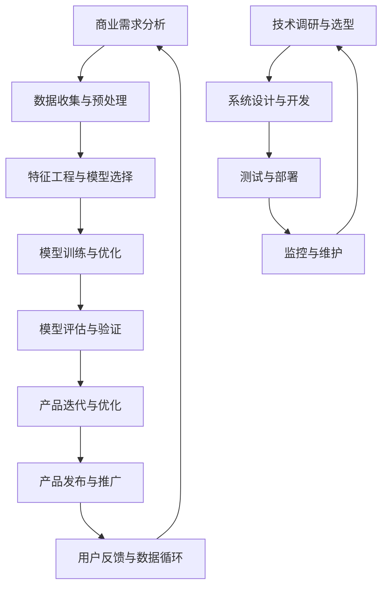

                 

### 引言

在当今快速发展的科技时代，人工智能（AI）已经成为推动商业创新的重要力量。AI技术的广泛应用不仅提升了企业的运营效率，还极大地改变了商业模式的形态。然而，随着AI在商业中的深入应用，一系列道德和社会问题也逐渐浮现。本文旨在探讨AI驱动的商业创新中，人类计算的角色以及与之相关的道德考虑因素和机遇。

首先，我们需要明确什么是AI驱动的商业创新。AI驱动的商业创新指的是利用人工智能技术来重塑业务流程、优化决策过程、开发新产品和服务。这种创新不仅依赖于先进的技术，还需要深入理解人类计算的优势和局限性。人类计算在商业中的角色不仅仅是操作和监控AI系统，更在于与AI系统协同工作，共同解决复杂问题。

接下来，我们将分三个部分对本文主题进行探讨。第一部分将介绍AI驱动的商业创新，包括AI在商业中的崛起、AI驱动的创新趋势以及商业道德的挑战。第二部分将深入探讨人类计算在商业中的角色，分析人类计算与AI的协同、道德考虑因素与风险管理以及AI伦理与社会影响。第三部分将展望未来，讨论AI驱动的创新实践、发展趋势以及商业模式创新，并探讨未来社会的可能性。

本文的关键词包括：人工智能、商业创新、人类计算、道德考虑、风险管理、AI伦理、社会影响。通过本文的深入分析，我们希望读者能够对AI驱动的商业创新有更加全面和深刻的理解，认识到人类计算在其中的重要性和道德责任。

### 目录大纲

**《AI驱动的创新：人类计算在商业中的道德考虑因素与机遇》目录大纲**

## 第一部分：AI驱动的商业创新

### 第1章：AI驱动的商业变革概述

- 1.1 AI在商业中的崛起
  - AI技术发展的背景
  - AI对商业模式的改变
- 1.2 AI驱动的创新趋势
  - 数据驱动的决策
  - 自动化和流程优化
  - 新兴技术的融合应用
- 1.3 商业道德的挑战
  - AI伦理问题
  - 数据隐私与安全
  - 人机关系的变化

### 第2章：AI技术的核心原理与架构

- 2.1 机器学习基础
  - 监督学习、无监督学习、强化学习
  - 特征工程与模型选择
  - 评估与优化
- 2.2 深度学习架构
  - 神经网络的基本结构
  - 卷积神经网络（CNN）
  - 循环神经网络（RNN）与长短时记忆网络（LSTM）
- 2.3 自然语言处理（NLP）
  - 词嵌入技术
  - 语言模型与文本生成
  - 问答系统与对话管理

### 第3章：AI驱动的商业应用场景

- 3.1 金融服务
  - 信用评分与风险评估
  - 财务预测与投资策略
  - 智能投顾与财富管理
- 3.2 医疗保健
  - 疾病预测与诊断
  - 医疗图像分析
  - 智能药物发现
- 3.3 零售与供应链
  - 个性化推荐系统
  - 库存管理优化
  - 物流与配送优化

## 第二部分：人类计算在商业中的角色

### 第4章：人类计算与AI的协同

- 4.1 人类计算的优势
  - 创造力与直觉
  - 适应性与灵活性
  - 情感智能与人际交往
- 4.2 AI的局限性
  - 数据偏差与偏见
  - 决策透明性与可解释性
  - 道德与伦理考量
- 4.3 人类计算与AI的融合
  - AI辅助人类决策
  - 人类主导与AI协同
  - 创新思维的激发

### 第5章：道德考虑因素与风险管理

- 5.1 道德考虑因素
  - 数据隐私保护
  - 避免歧视与偏见
  - 透明性与可解释性
- 5.2 风险管理
  - 数据安全与隐私保护
  - 法规遵从与合规性
  - 避免滥用与误用
- 5.3 道德责任与问责制
  - AI系统责任分配
  - 伦理审查与监督
  - 人类计算者的角色与责任

### 第6章：AI伦理与社会影响

- 6.1 AI伦理学框架
  - 公正性、透明性、可解释性
  - 参与性与包容性
  - 安全性与可持续性
- 6.2 社会影响
  - 劳动力市场变化
  - 社会不平等与歧视
  - 气候变化与环境保护
- 6.3 政策与监管
  - 国际法规与标准
  - 国家政策与行业规范
  - 企业社会责任（CSR）

## 第三部分：机遇与未来发展

### 第7章：AI驱动的创新实践

- 7.1 创新思维与方法
  - 设计思维与创新流程
  - 用户研究与需求挖掘
  - 原型设计与迭代测试
- 7.2 创新型企业文化建设
  - 创新导向的组织结构
  - 鼓励试错与快速迭代
  - 创新文化的培养
- 7.3 成功案例分析
  - 创新型企业的成长历程
  - 创新项目的成功要素
  - 创新成果的评估与转化

### 第8章：未来展望

- 8.1 AI技术发展趋势
  - 大模型与深度学习
  - 生成对抗网络（GAN）
  - 强化学习与自适应系统
- 8.2 商业模式创新
  - 新型商业模式
  - 生态系统的构建
  - 混合经济模式
- 8.3 未来社会的可能性
  - 智能化与自动化
  - 数字化转型
  - 人与机器的共生

## 附录

### 附录A：AI驱动的创新工具与资源

- 8.1 开发环境与工具
  - Python编程环境
  - 常用库与框架（如TensorFlow、PyTorch等）
  - 数据处理与可视化工具
- 8.2 资源与学习材料
  - 在线课程与讲座
  - 论文与研究报告
  - 行业报告与白皮书

- **附录B：AI驱动的创新流程图（Mermaid）**

  
  graph TD
  A[AI驱动的商业创新] --> B[AI技术的核心原理与架构]
  A --> C[人类计算在商业中的角色]
  A --> D[道德考虑因素与风险管理]
  A --> E[AI伦理与社会影响]
  B --> F[AI驱动的商业应用场景]
  C --> G[创新思维与方法]
  C --> H[创新型企业文化建设]
  C --> I[成功案例分析]
  D --> J[道德考虑因素]
  D --> K[风险管理]
  D --> L[道德责任与问责制]
  E --> M[AI伦理学框架]
  E --> N[社会影响]
  E --> O[政策与监管]
  F --> P[金融服务]
  F --> Q[医疗保健]
  F --> R[零售与供应链]
  G --> S[设计思维与创新流程]
  G --> T[用户研究与需求挖掘]
  G --> U[原型设计与迭代测试]
  H --> V[创新导向的组织结构]
  H --> W[鼓励试错与快速迭代]
  H --> X[创新文化的培养]
  I --> Y[创新型企业的成长历程]
  I --> Z[创新项目的成功要素]
  I --> AA[创新成果的评估与转化]
  

- **附录C：核心算法原理讲解（伪代码）**

  
  // 伪代码：线性回归算法
  function linear_regression(X, y):
      // 初始化权重和偏置
      w = 0
      b = 0
      
      // 梯度下降法迭代优化权重和偏置
      for i from 1 to max_iterations do:
          // 计算预测值
          y_pred = X * w + b
        
          // 计算损失函数
          loss = (y - y_pred)^2 / 2
        
          // 计算梯度
          dw = X^T * (y - y_pred)
          db = X^T * (y - y_pred)
          
          // 更新权重和偏置
          w = w - learning_rate * dw
          b = b - learning_rate * db
        
      return w, b
  

- **附录D：数学模型和公式详细讲解**

  $$
  y = wx + b
  $$

  其中，$y$ 是输出值，$w$ 是权重，$x$ 是输入特征，$b$ 是偏置。

  **举例说明：**

  假设我们有一个简单的线性回归模型，其中 $x$ 表示商品的价格，$y$ 表示销售量。我们可以通过调整权重 $w$ 和偏置 $b$ 来优化模型，使得预测值尽可能接近真实值。

- **附录E：项目实战案例**

  **实战案例：使用TensorFlow构建商品价格预测模型**

  - **开发环境搭建：**
    - 安装Python 3.8及以上版本
    - 安装TensorFlow库
    - 导入相关数据集

  - **源代码实现：**

    python
    import tensorflow as tf
    import numpy as np
    
    # 数据集准备
    X = np.array([[100], [200], [300]])  # 商品价格
    y = np.array([[20], [30], [40]])    # 销售量
    
    # 模型构建
    model = tf.keras.Sequential([
        tf.keras.layers.Dense(units=1, input_shape=[1])
    ])
    
    # 编译模型
    model.compile(optimizer='sgd', loss='mean_squared_error')
    
    # 训练模型
    model.fit(X, y, epochs=100)
    
    # 预测新数据
    new_price = np.array([[150]])
    predicted_sales = model.predict(new_price)
    print(predicted_sales)
    

  - **代码解读与分析：**
    - 首先，我们导入TensorFlow库和NumPy库，准备数据集。
    - 然后，我们构建一个简单的线性回归模型，使用`Sequential`模型堆叠一个`Dense`层，激活函数为线性。
    - 接着，我们编译模型，指定优化器和损失函数。
    - 使用`fit`方法训练模型，迭代100次。
    - 最后，使用训练好的模型对新数据进行预测，输出预测的销售量。

### 第1章：AI驱动的商业变革概述

#### 1.1 AI在商业中的崛起

人工智能（AI）技术的发展历程可以追溯到20世纪50年代，尽管当时的技术远不及现在成熟。然而，随着计算机性能的不断提升和大数据时代的到来，AI技术迎来了前所未有的发展机遇。近年来，深度学习、强化学习等前沿技术的突破，使得AI在图像识别、自然语言处理、自动驾驶等领域取得了显著进展。

AI在商业中的崛起，首先体现在其对传统商业模式的重塑。传统的商业模式往往依赖于经验和直觉，而AI的应用使得企业能够通过数据分析来驱动决策，从而提高效率和准确性。例如，在金融领域，AI技术被广泛应用于信用评分、风险控制和智能投顾等方面；在医疗领域，AI助力于疾病诊断、药物研发和个性化医疗；在零售和供应链管理中，AI技术帮助实现库存优化、精准营销和物流调度。

其次，AI驱动的创新趋势正在改变商业的方方面面。首先，数据驱动的决策成为主流。企业通过收集和分析大量数据，能够更准确地了解市场趋势和消费者需求，从而制定更加科学的商业策略。其次，自动化和流程优化成为提高效率的重要手段。通过AI技术，企业可以自动化许多重复性工作，减少人力成本，并优化业务流程。此外，新兴技术的融合应用也在推动商业创新。例如，物联网（IoT）与AI的结合，使得智能家居、智慧城市等应用得以实现；区块链与AI的结合，为供应链管理、数据安全提供了新的解决方案。

最后，商业道德的挑战在AI应用中变得愈发突出。AI技术在带来便利和效益的同时，也引发了一系列伦理和社会问题。例如，数据隐私和安全问题，如何确保个人数据不被滥用或泄露；算法偏见问题，即AI系统可能基于训练数据中的偏见做出不公平的决策；人机关系的变化，即随着AI技术的进步，人类在决策过程中的作用是否会被削弱。这些挑战要求企业在应用AI技术时，必须兼顾道德考量，确保技术发展的可持续性和社会责任。

#### 1.2 AI驱动的创新趋势

AI驱动的创新趋势正深刻地影响着各个行业，推动着商业模式的不断演变。以下是几个关键的AI驱动创新趋势：

**1. 数据驱动的决策**

数据驱动的决策已经成为现代企业的一种核心能力。通过大数据分析和机器学习算法，企业可以从大量数据中提取有价值的信息，以支持决策制定。例如，零售业利用消费者购物行为数据来优化库存管理和促销策略；金融行业通过分析历史交易数据来预测市场趋势和评估信用风险。数据驱动的决策不仅提高了决策的准确性，还显著提高了运营效率。

**2. 自动化和流程优化**

自动化和流程优化是AI驱动的另一大创新趋势。通过机器学习算法和自动化工具，企业可以自动化许多重复性、繁琐的工作，从而减少人力成本并提高工作效率。例如，客服机器人（聊天机器人）可以自动化客户服务流程，处理常见问题，提高客户满意度；生产制造领域的自动化机器人可以执行复杂的组装和检测任务，提高生产效率。流程优化则通过分析现有流程中的瓶颈和痛点，提出改进方案，从而进一步提升业务效率。

**3. 新兴技术的融合应用**

随着AI技术的发展，新兴技术不断涌现并与其他领域相结合，创造出新的商业机会。物联网（IoT）与AI的结合，使得智能家居、智慧城市等应用成为可能。通过物联网设备收集的数据，AI系统可以实时分析并做出相应决策，如智能照明、智能安防等。区块链与AI的结合，则带来了去中心化、透明化的供应链管理解决方案，提高了数据安全和信任度。此外，增强现实（AR）和虚拟现实（VR）与AI的结合，也为企业和消费者提供了全新的交互体验。

**4. 个性化和定制化服务**

AI技术的进步使得企业能够提供更加个性化和定制化的服务。通过自然语言处理（NLP）和机器学习算法，企业可以更好地理解客户需求，提供个性化的产品推荐和服务。例如，电商企业通过分析客户浏览和购买行为，提供个性化的商品推荐，提高销售额；金融企业通过分析客户财务数据，提供定制化的投资建议，提高客户满意度。

**5. 智能决策支持系统**

智能决策支持系统（DSS）利用AI技术为企业管理层提供强有力的决策支持。通过大数据分析和预测模型，DSS可以帮助企业预测市场趋势、评估风险和机会，并提供相应的决策建议。例如，在供应链管理中，DSS可以帮助企业预测需求变化，优化库存和采购策略；在项目管理中，DSS可以帮助项目经理预测项目进度和成本，优化资源分配。

**6. 智能自动化生产**

在制造业中，AI驱动的智能自动化生产已经成为提高生产效率和质量的重要手段。通过机器视觉、机器学习和自动化控制技术，企业可以实现生产过程的智能化和自动化。例如，智能机器人可以在生产线上执行精密的组装和检测任务，减少人为错误，提高生产效率；智能传感器和监控系统能够实时监测设备运行状态，预测故障并提前维护，减少停机时间。

综上所述，AI驱动的创新趋势正在推动商业模式的演变，为企业和消费者带来巨大的价值。通过数据驱动的决策、自动化和流程优化、新兴技术的融合应用等手段，企业不仅能够提高运营效率，还能够创造新的商业机会。然而，在享受AI带来的便利和效益的同时，企业也必须关注道德和社会责任，确保技术发展的可持续性和正当性。

#### 1.3 商业道德的挑战

随着人工智能（AI）在商业领域的广泛应用，商业道德问题也随之而来。这些挑战不仅影响企业的声誉和合法性，还关系到社会公共利益和人类福祉。以下是商业道德在AI应用中面临的主要挑战：

**1. AI伦理问题**

AI伦理问题主要集中在如何确保AI系统的公平性、透明性和可解释性。尽管AI技术在许多领域表现出色，但其决策过程通常是不透明的，这使得人们难以理解AI系统的决策依据。此外，AI系统可能会因为训练数据中的偏见而导致不公平的决策，例如在招聘、贷款审批等环节中，可能导致某些群体受到歧视。因此，如何确保AI系统的伦理标准，避免伦理风险，成为一个亟待解决的问题。

**2. 数据隐私与安全**

随着AI技术的发展，企业收集和处理的数据量不断增加，数据隐私和安全问题也日益突出。AI系统需要大量数据来进行训练和优化，这些数据往往包括个人敏感信息。如果数据泄露或被恶意使用，可能会对个人隐私造成严重侵害。此外，AI技术的普及也带来了数据滥用的风险，例如通过大数据分析进行精准营销，可能导致消费者被过度骚扰。因此，如何保护数据隐私和安全，防止数据滥用，是商业道德中的重要议题。

**3. 人机关系的变化**

随着AI技术的进步，人类在决策过程中的作用可能会逐渐减弱。例如，自动化系统和智能机器人可以在没有人类干预的情况下完成复杂的任务，甚至做出重要的决策。这种变化可能带来两方面的影响：一方面，可以提高工作效率和准确性；另一方面，也可能会导致人类失业和技能退化。此外，人机关系的变化还涉及到伦理问题，如如何确保AI系统在关键时刻能够做出符合人类伦理标准的决策。因此，如何在人机关系中找到平衡点，是商业道德需要考虑的重要问题。

**4. 道德责任与问责制**

在AI应用中，道德责任和问责制的确立是确保技术发展的可持续性和正当性的关键。当AI系统发生错误或造成损失时，责任归属问题往往复杂且模糊。例如，如果自动驾驶汽车发生事故，责任应该归咎于汽车制造商、软件开发商还是用户？同样，如果AI系统在招聘过程中歧视某些群体，责任又应该如何分配？这些问题需要明确的法律法规和道德准则来指导，以确保各方在AI应用中的责任和权利得到保障。

**5. 法律和监管框架的不足**

目前，全球范围内的法律和监管框架在应对AI伦理挑战方面尚不完善。不同国家和地区在数据保护、隐私权、责任分配等方面的法律法规存在差异，这使得企业在跨国应用AI技术时面临法律风险。此外，现有法律和监管框架往往难以跟上AI技术的发展速度，导致一些新兴的伦理问题无法得到及时解决。因此，构建全球统一的AI伦理和法律框架，是应对商业道德挑战的重要步骤。

**6. 社会公平与包容性**

AI技术的应用不应加剧社会不平等和歧视。然而，现实中AI系统可能会因为训练数据中的偏见而导致不公平的决策，例如在金融、医疗和教育等领域。这种不公平不仅会影响特定群体，还可能对社会整体造成负面影响。因此，如何在AI应用中确保公平性和包容性，是商业道德需要关注的重要问题。

综上所述，商业道德在AI应用中面临多重挑战。企业不仅需要在技术创新中遵循伦理标准，还要积极应对数据隐私、人机关系、责任归属等复杂问题。通过建立完善的法律法规和道德准则，企业和社会可以共同推动AI技术的健康发展，实现技术进步与道德责任的平衡。

### 第2章：AI技术的核心原理与架构

#### 2.1 机器学习基础

机器学习（Machine Learning，ML）是人工智能（AI）的核心技术之一，它使计算机系统能够从数据中学习并做出决策。以下是机器学习的一些基本概念和原理：

**监督学习（Supervised Learning）**

监督学习是最常见的机器学习类型，它需要一个标记的数据集来训练模型。在这个数据集中，每个样本都有一个对应的标签。监督学习的目标是通过学习输入和输出之间的映射关系，建立一个预测模型。

**无监督学习（Unsupervised Learning）**

无监督学习不需要标签数据，其目标是发现数据中的隐含结构和模式。常见的无监督学习方法包括聚类（Clustering）和降维（Dimensionality Reduction）。

**强化学习（Reinforcement Learning）**

强化学习是一种通过奖励机制来训练智能体（Agent）在特定环境中做出最佳决策的方法。智能体通过不断尝试和反馈，学习最优策略。

**特征工程（Feature Engineering）**

特征工程是机器学习过程中至关重要的一环，它涉及从原始数据中提取和构造特征，以提高模型的性能。特征工程包括数据预处理、特征选择和特征变换等步骤。

**模型选择与评估**

选择合适的机器学习模型是成功应用的关键。常见的模型包括线性回归、决策树、支持向量机（SVM）和神经网络等。评估模型性能的指标包括准确率、召回率、F1分数和均方误差等。

**评估与优化**

模型评估和优化是机器学习应用中的重要环节。通过交叉验证和超参数调整，可以评估模型的泛化能力并优化其性能。

#### 2.2 深度学习架构

深度学习（Deep Learning，DL）是机器学习的一个重要分支，它通过构建多层神经网络来模拟人类大脑的神经元结构，从而实现复杂的数据处理和模式识别。以下是深度学习的一些核心架构和算法：

**神经网络的基本结构**

神经网络（Neural Network，NN）是由多层神经元（节点）组成的网络，每层神经元通过权重（Weight）和偏置（Bias）相互连接。输入层接收外部数据，隐藏层负责特征提取和变换，输出层生成预测结果。

**卷积神经网络（CNN）**

卷积神经网络（Convolutional Neural Network，CNN）是用于图像识别和处理的常用架构。它通过卷积操作提取图像特征，并使用池化操作减少参数数量，提高模型的泛化能力。

**循环神经网络（RNN）与长短时记忆网络（LSTM）**

循环神经网络（Recurrent Neural Network，RNN）适用于处理序列数据，如文本和语音。然而，传统RNN存在梯度消失和梯度爆炸问题。长短时记忆网络（Long Short-Term Memory，LSTM）通过引入门控机制，解决了这些问题，并提高了模型的长期依赖性。

**生成对抗网络（GAN）**

生成对抗网络（Generative Adversarial Network，GAN）由生成器和判别器两个对抗性网络组成。生成器试图生成与真实数据相似的数据，而判别器则试图区分生成数据和真实数据。通过两个网络的博弈，生成器不断提高生成质量。

**变分自编码器（VAE）**

变分自编码器（Variational Autoencoder，VAE）是一种无监督学习算法，它通过引入变分推断方法，将编码和解码过程建模为概率分布，从而实现数据的降维和生成。

**自编码器（Autoencoder）**

自编码器是一种简单的深度学习模型，它由编码器和解码器两个部分组成。编码器将输入数据压缩为低维特征表示，解码器则试图重构原始数据。

#### 2.3 自然语言处理（NLP）

自然语言处理（Natural Language Processing，NLP）是深度学习在语言领域的重要应用，它旨在使计算机能够理解和处理人类语言。以下是NLP的一些关键技术和应用：

**词嵌入（Word Embedding）**

词嵌入是将单词映射到高维向量空间的过程，从而保留词的语义信息。常见的词嵌入方法包括Word2Vec、GloVe和BERT等。

**语言模型（Language Model）**

语言模型是一种用于预测下一个单词或字符的概率分布模型，它对于文本生成和理解至关重要。常用的语言模型包括n-gram模型、循环神经网络（RNN）和Transformer等。

**文本生成（Text Generation）**

文本生成技术可以生成连贯、有意义的文本，广泛应用于聊天机器人、自动写作和翻译等领域。常见的文本生成模型包括生成对抗网络（GAN）、变分自编码器（VAE）和GPT等。

**问答系统（Question Answering）**

问答系统是一种能够理解用户问题并给出准确答案的智能系统。它通常结合自然语言处理、知识图谱和机器学习技术来实现。

**对话管理（Dialogue Management）**

对话管理是一种控制对话流程的技术，它包括意图识别、实体识别和对话策略等步骤，以实现自然、流畅的人机对话。

综上所述，AI技术的核心原理与架构包括机器学习、深度学习和自然语言处理等多个方面。通过理解这些基本概念和架构，我们可以更好地应用AI技术解决实际问题，推动人工智能在商业和其他领域的创新与发展。

#### 3.1 金融服务

在金融服务领域，人工智能（AI）技术的应用极大地改变了传统的业务模式，提高了效率，降低了成本，并增强了用户体验。以下是AI在金融服务中的几个关键应用场景：

**1. 信用评分与风险评估**

信用评分是金融机构评估借款人信用风险的重要工具。传统上，信用评分依赖于借款人的信用历史、收入水平、负债情况等数据。然而，AI技术的引入，特别是机器学习和大数据分析，使得信用评分模型更加精准和全面。通过分析大量的非结构化数据，如社交媒体行为、购物习惯、在线搜索记录等，AI系统可以更准确地预测借款人的信用风险。

**2. 财务预测与投资策略**

在投资领域，AI技术被广泛应用于市场预测、风险评估和投资策略的优化。通过分析历史数据、宏观经济指标和市场情绪，AI模型可以预测市场走势，帮助投资者制定更科学、更优的投资策略。例如，机器学习算法可以识别市场中的潜在机会和风险，提高投资组合的收益率和稳定性。

**3. 智能投顾与财富管理**

智能投顾（Robo-Advisory）是AI技术在金融服务中的另一个重要应用。智能投顾利用AI算法为个人投资者提供个性化的投资建议和管理服务。通过分析投资者的财务状况、投资偏好和风险承受能力，智能投顾可以制定最优的投资组合，实现资产的最优化配置。此外，智能投顾还可以实时监控市场动态，提供及时的调整建议，帮助投资者在波动市场中保持稳定收益。

**4. 反欺诈检测**

金融欺诈是一个全球性的问题，对金融机构和个人投资者都造成严重损失。AI技术在反欺诈检测中发挥着重要作用。通过分析交易行为、账户活动等数据，AI模型可以识别异常行为，实时检测和预防欺诈行为。例如，机器学习算法可以识别信用卡交易中的欺诈模式，自动拦截可疑交易，降低欺诈风险。

**5. 自动化客户服务**

在客户服务领域，AI技术通过聊天机器人、虚拟客服等工具，实现了客户服务的自动化和个性化。这些智能客服系统能够实时响应客户的咨询和请求，提供快速、准确的解决方案。通过自然语言处理（NLP）和机器学习算法，AI系统可以理解客户的问题，自动生成回答，提高客户满意度和服务效率。

**6. 个性化推荐系统**

在零售和财富管理中，个性化推荐系统利用AI技术为投资者和消费者提供个性化的产品推荐。通过分析用户的历史交易记录、投资偏好和风险承受能力，推荐系统可以推荐最适合用户的产品和服务，提高用户满意度和忠诚度。

**7. 风险管理**

AI技术在金融风险管理中的应用日益广泛。通过分析市场数据、经济指标和风险事件，AI模型可以预测潜在的风险并制定相应的风险管理策略。例如，金融机构可以利用AI模型监控市场波动，预测信用违约风险，及时调整资产配置，降低风险。

总之，人工智能在金融服务中的应用不仅提高了效率和准确性，还大大改变了传统业务模式。随着AI技术的不断进步，金融服务行业将迎来更加智能化、个性化和高效的发展。

#### 3.2 医疗保健

在医疗保健领域，人工智能（AI）技术的应用正迅速扩展，为诊断、治疗、药物研发和患者护理带来了显著的创新和效率提升。以下是AI在医疗保健中的几个关键应用场景：

**1. 疾病预测与诊断**

AI技术在疾病预测与诊断中的应用是医疗领域的革命性进步。通过分析患者的电子健康记录、基因组数据和医疗影像，AI模型可以提前预测疾病的发生，提供更准确的诊断。例如，AI系统可以通过分析CT扫描图像，检测肺癌的早期迹象，提高诊断的准确率。此外，AI在传染病预测中也发挥着重要作用，通过实时分析大量数据，可以预测疫情的发展和传播趋势，帮助公共卫生机构采取及时的应对措施。

**2. 医疗图像分析**

医疗图像分析是AI技术在医疗保健中最重要的应用之一。通过深度学习算法，AI系统能够高效地分析医学影像，如X光片、CT扫描和MRI，辅助医生进行诊断。例如，AI可以自动识别和标记肺部病变，提高肺炎和其他疾病的检测率。此外，AI系统还可以分析皮肤病变图像，帮助医生快速诊断皮肤癌，提高诊断效率和准确性。

**3. 智能药物发现**

药物发现是一个复杂且耗时的过程，AI技术的引入大大加速了这一过程。通过机器学习算法，AI系统能够分析大量的化学结构和生物数据，预测哪些化合物可能成为有效的药物。这种智能药物发现方法不仅提高了药物研发的成功率，还减少了研发成本和时间。此外，AI还可以帮助研究人员设计更有效的药物组合，提高治疗效果。

**4. 智能药物配方**

AI技术在药物配方优化中的应用也显示出巨大潜力。通过分析大量的临床试验数据和患者反应，AI模型可以预测不同药物配方的效果和副作用，帮助医生制定个性化的治疗方案。这种个性化的药物管理不仅提高了患者的治疗效果，还减少了不必要的药物使用和副作用。

**5. 智能健康监测**

智能健康监测设备与AI技术的结合，使得实时监控患者的健康状况成为可能。通过可穿戴设备和移动应用程序，AI系统可以收集和分析患者的生理数据，如心率、血压和睡眠质量，提供个性化的健康建议和预警。例如，AI系统可以通过监测心率变化，及时发现心律不齐等健康问题，提醒患者就医。

**6. 患者护理与康复**

AI技术在患者护理和康复中的应用，大大提高了护理质量和效率。通过智能护理系统，护理人员可以实时监控患者的健康状况，及时调整护理计划。此外，AI系统还可以提供个性化的康复训练计划，根据患者的健康状况和恢复进度，调整训练方案，帮助患者更快康复。

**7. 预防性医疗**

AI技术在预防性医疗中的应用，使得个性化预防措施成为可能。通过分析患者的遗传信息、生活方式和健康数据，AI模型可以预测患者可能患有的疾病，提供个性化的预防建议。例如，AI系统可以通过分析家族病史和生活方式数据，预测患者患糖尿病的风险，建议进行生活方式调整和定期体检。

总之，人工智能在医疗保健领域的应用不仅提升了诊断和治疗效率，还为个性化医疗和预防性医疗提供了新的可能性。随着AI技术的不断进步，医疗保健行业将迎来更加智能化、个性化和高效的发展。

#### 3.3 零售与供应链

在零售和供应链管理中，人工智能（AI）技术的应用正逐渐成为提升运营效率、优化客户体验和降低成本的关键驱动力。以下是AI在这些领域的几个关键应用场景：

**1. 个性化推荐系统**

个性化推荐系统利用AI算法分析消费者行为数据，如购买历史、浏览记录和偏好，为用户提供个性化的商品推荐。这不仅提高了用户的购物体验，还显著提高了销售额和客户忠诚度。例如，电商平台可以利用深度学习算法，分析用户的行为模式，预测用户的兴趣和需求，从而推荐相关的商品。

**2. 库存管理优化**

AI技术通过大数据分析和机器学习算法，可以帮助企业优化库存管理，减少库存积压和缺货现象。通过分析历史销售数据、季节性变化和市场需求，AI系统可以预测未来销售趋势，制定合理的库存策略。例如，零售企业可以利用AI算法，动态调整库存水平，确保在销售高峰期有足够的商品供应。

**3. 物流与配送优化**

AI技术在物流与配送中的应用，显著提高了供应链的效率和灵活性。通过优化配送路线、预测运输延误和实时监控运输过程，AI系统可以减少运输成本和时间。例如，物流公司可以利用AI算法，分析交通流量和天气预报数据，优化配送路线，确保货物按时送达。

**4. 供应链可视化**

AI技术通过数据分析和可视化工具，帮助企业实时监控供应链的各个环节，提高供应链的透明度和可控性。通过物联网（IoT）设备和传感器收集的数据，AI系统可以实时分析供应链的状态，预测潜在的风险和问题，提前采取措施。例如，企业可以利用AI系统，监控原材料供应和产品生产进度，确保供应链的稳定运行。

**5. 零售自动化**

AI技术推动零售自动化，提升了购物体验和运营效率。例如，无人便利店和自助结账系统利用计算机视觉和自然语言处理技术，实现无人值守的购物体验。顾客只需通过手机应用扫描商品，自动结算支付，提高了购物效率和便利性。

**6. 供应链金融**

AI技术在供应链金融中的应用，为中小企业提供了融资支持。通过分析供应链上下游企业的交易数据，AI系统可以评估企业的信用风险和融资需求，提供个性化的金融服务。例如，供应链金融平台可以利用AI算法，分析订单数据和付款记录，为中小企业提供快速、便捷的融资服务，促进供应链的健康发展。

**7. 智能预测性维护**

在供应链管理中，AI技术通过预测性维护，帮助企业减少设备故障和停机时间。通过分析设备的运行数据和历史维修记录，AI系统可以预测设备可能出现的故障，提前安排维护，确保供应链的顺畅运行。

总之，AI技术在零售和供应链管理中的应用，不仅提高了运营效率和客户体验，还为行业带来了新的商业模式和发展机遇。随着AI技术的不断进步，零售和供应链行业将迎来更加智能化和高效的发展。

### 第4章：人类计算与AI的协同

#### 4.1 人类计算的优势

在AI技术迅猛发展的今天，人类计算仍然在商业中扮演着不可或缺的角色。人类计算具有独特的优势，这些优势主要体现在创造力与直觉、适应性与灵活性以及情感智能与人际交往等方面。

**1. 创造力与直觉**

人类具有强大的创造力，能够发现新问题、提出新解决方案。在复杂的问题解决过程中，人类能够进行横向思维和抽象思维，突破传统框架，提出创新的想法。例如，在产品设计阶段，人类设计师可以通过直觉和创造力，设计出独特的用户体验和外观设计。此外，人类在解决未遇到的问题时，能够利用经验和直觉进行推理和判断，找到解决问题的路径。

**2. 适应性与灵活性**

人类具有很强的适应性和灵活性，能够根据不同的环境和条件，灵活调整自己的行为和策略。在多变的市场环境中，人类可以快速适应新的变化，调整业务策略，应对不确定性。例如，在应对突发事件时，企业管理者可以通过灵活的决策和调整，确保企业的正常运营。此外，人类能够处理复杂的多任务，同时适应多种工作环境和场景，这是当前AI系统所难以做到的。

**3. 情感智能与人际交往**

人类具有情感智能，能够理解和表达情感，进行有效的人际交往。在商业活动中，情感智能有助于建立信任和合作关系，提升沟通效率。例如，销售人员在谈判过程中，通过情感智能，能够更好地理解客户的需求和情感，提供个性化的解决方案，从而促成交易。此外，人类在处理复杂的社交关系时，能够运用情感智能，建立和维护良好的人际网络，这是AI系统所不具备的。

#### 4.2 AI的局限性

尽管AI技术在许多领域取得了显著成就，但它们也存在一些局限性。了解AI的局限性有助于我们更好地发挥人类计算的优势，实现人与AI的协同工作。

**1. 数据偏差与偏见**

AI系统依赖于大量的数据进行训练，这些数据可能包含偏见和错误。如果训练数据存在偏差，AI系统也会继承这些偏差，导致不公平的决策。例如，如果AI系统的训练数据中存在性别、种族、年龄等偏见，那么AI系统可能会在招聘、贷款审批等环节中表现出性别歧视或种族偏见。因此，如何消除AI系统的数据偏差，确保其公平性和公正性，是一个亟待解决的问题。

**2. 决策透明性与可解释性**

AI系统的决策过程通常是不透明的，这使得人们难以理解AI系统的决策依据。在许多关键领域，如医疗诊断、金融风险评估等，透明性和可解释性至关重要。如果AI系统的决策无法解释，那么在出现问题时，人们很难找到责任归属。例如，如果AI系统在医疗诊断中做出错误决策，医生和患者可能无法理解原因，导致医疗纠纷。因此，提高AI系统的透明性和可解释性，是一个重要的研究方向。

**3. 道德与伦理考量**

AI技术在商业中的应用，引发了道德和伦理问题。例如，在自动驾驶领域，如果发生交通事故，责任归属问题复杂且模糊。此外，AI系统可能因为训练数据中的偏见，导致某些群体受到不公平对待。因此，如何在AI应用中确保道德和伦理考量，避免伦理风险，是一个重要的挑战。

#### 4.3 人类计算与AI的融合

为了充分发挥人类计算和AI的优势，实现协同工作，我们需要探索人类计算与AI的融合途径。以下是几个关键方面：

**1. AI辅助人类决策**

AI系统可以辅助人类进行决策，提供数据分析和预测结果，帮助人类更好地理解复杂问题。例如，在商业决策中，AI系统可以通过大数据分析，提供市场趋势、客户行为等方面的洞察，帮助管理者做出更科学的决策。此外，AI系统还可以为人类提供实时监控和预警，帮助管理者及时应对突发事件。

**2. 人类主导与AI协同**

在复杂的问题解决过程中，人类应发挥主导作用，利用自己的经验和直觉，与AI系统协同工作。例如，在医疗诊断中，医生可以通过AI系统的辅助，快速分析大量的医疗数据，但最终的诊断和治疗方案仍应由医生决定。这种人类主导与AI协同的模式，可以充分发挥人类和AI的优势，提高决策的准确性和效率。

**3. 创新思维的激发**

AI系统可以激发人类的创新思维，通过提供新的视角和解决方案，推动创新。例如，在产品设计过程中，AI系统可以分析大量的用户反馈和市场趋势，提出新的设计思路和方案，帮助设计师实现创新。此外，AI系统还可以通过模拟不同的场景和假设，帮助人类探索新的业务模式和市场机会。

总之，人类计算与AI的融合，是实现商业创新的重要途径。通过充分发挥人类计算的优势和AI的技术优势，我们可以更好地解决复杂问题，推动商业和社会的持续发展。

### 第5章：道德考虑因素与风险管理

#### 5.1 道德考虑因素

在AI驱动的商业创新中，道德考虑因素至关重要。这些因素不仅关乎企业的社会责任，也直接影响企业的声誉和合法性。以下是几个关键的道德考虑因素：

**1. 数据隐私保护**

数据隐私保护是AI应用中的核心问题。AI系统需要大量的个人数据来训练和优化模型，这包括用户的行为数据、生物特征数据等。如果这些数据泄露或被滥用，将对个人隐私造成严重侵害。企业必须采取严格的措施保护数据安全，包括加密存储、访问控制和数据匿名化等。此外，透明地告知用户数据的使用目的和范围，获取用户明确的同意，是确保数据隐私保护的重要步骤。

**2. 避免歧视与偏见**

AI系统可能基于训练数据中的偏见做出不公平的决策，这可能导致性别、种族、年龄等方面的歧视。例如，招聘系统可能会因为历史数据中的偏见，拒绝某些群体。为了避免这种情况，企业需要确保训练数据具有多样性，并采用公平性评估方法，如偏差校正和敏感性分析。此外，定期审计和评估AI系统的决策过程，确保其公平性和公正性，也是必要的措施。

**3. 透明性与可解释性**

AI系统的决策过程通常是不透明的，这使得人们难以理解AI系统的决策依据。在关键领域，如医疗诊断、金融风险评估等，透明性和可解释性至关重要。为了提高AI系统的透明性和可解释性，企业可以采用可解释性AI（XAI）技术，如注意力机制、可视化方法等，帮助用户理解AI系统的决策过程。此外，建立透明的决策流程和责任归属机制，也是确保AI系统道德应用的关键。

#### 5.2 风险管理

在AI驱动的商业创新中，风险管理是确保技术健康发展的关键。以下是几个关键的风险管理方面：

**1. 数据安全与隐私保护**

数据安全和隐私保护是风险管理的重要组成部分。企业需要建立完善的数据安全策略，包括数据加密、访问控制和数据备份等。此外，定期进行安全审计和漏洞扫描，确保数据安全。在处理敏感数据时，企业应遵循相应的法律法规，确保合规性。

**2. 法规遵从与合规性**

随着AI技术的广泛应用，各国政府和行业组织纷纷出台相关法规和标准，以规范AI应用。企业需要密切关注这些法规和标准的变化，确保其业务符合法规要求。例如，欧盟的《通用数据保护条例》（GDPR）和美国的《加州消费者隐私法案》（CCPA）等法规，对企业数据处理和行为提出了严格的要求。

**3. 避免滥用与误用**

AI技术具有强大的潜力，但也可能被滥用和误用。例如，恶意攻击者可能利用AI技术进行网络攻击、制造虚假信息等。企业需要建立相应的安全措施，防止AI系统被滥用。此外，教育员工和用户关于AI技术的风险和应对方法，也是减少误用和滥用的重要手段。

**4. 人类计算者的角色与责任**

在AI系统中，人类计算者的角色和责任不可忽视。人类计算者不仅需要确保AI系统的道德应用，还需要在AI系统的监督和评估中发挥作用。企业应建立明确的职责和责任归属机制，确保人类计算者能够在AI系统的使用过程中发挥积极作用。此外，提供必要的培训和教育，提高人类计算者的技能和意识，也是风险管理的重要一环。

总之，道德考虑因素和风险管理在AI驱动的商业创新中至关重要。通过关注数据隐私保护、避免歧视与偏见、确保透明性与可解释性，以及加强数据安全与隐私保护、法规遵从与合规性，企业可以确保AI技术的健康发展，为社会带来更多的价值。

### 第6章：AI伦理与社会影响

#### 6.1 AI伦理学框架

人工智能（AI）技术的快速发展带来了诸多伦理挑战，因此建立一套完整的AI伦理学框架至关重要。以下是AI伦理学框架中的几个核心原则：

**1. 公正性**

公正性是指AI系统在决策过程中应确保对所有个体的公平对待，避免歧视和偏见。在训练AI模型时，需要使用多样性和代表性的数据集，避免模型继承历史数据中的偏见。此外，企业应定期审计和评估AI系统的决策过程，确保其符合公正性原则。

**2. 透明性**

透明性是指AI系统的决策过程应清晰易懂，便于用户理解。为了提高AI系统的透明性，可以采用可解释性AI（XAI）技术，如注意力机制和可视化方法，帮助用户了解AI系统的决策依据。此外，企业应公开其AI系统的设计和应用过程，接受公众和学术界的监督。

**3. 可解释性**

可解释性是指AI系统的决策过程和结果应易于理解和解释。这不仅有助于用户信任AI系统，也有助于在出现问题时进行责任追究。为了提高AI系统的可解释性，可以采用解释性算法和可视化工具，如LIME（Local Interpretable Model-agnostic Explanations）和SHAP（SHapley Additive exPlanations）等。

**4. 参与性与包容性**

参与性与包容性是指AI系统的设计和应用应充分考虑不同群体的需求和利益。在开发AI系统时，企业应与受影响的利益相关者进行充分沟通和协作，确保AI系统的公平性和公正性。此外，企业应积极促进数据多样性和包容性，确保AI系统能够在不同文化和背景下有效运作。

**5. 安全性与可持续性**

安全性与可持续性是指AI系统在设计和应用过程中应确保系统的稳定性和安全性，避免对人类和社会造成危害。企业应建立完善的安全策略和风险管理机制，定期进行安全审计和评估。此外，AI系统的开发和应用应遵循可持续发展原则，减少对环境和社会的负面影响。

#### 6.2 社会影响

AI技术的应用对劳动力市场、社会不平等、歧视以及气候变化等方面产生了深远影响。以下是AI技术在社会影响中的几个关键方面：

**1. 劳动力市场变化**

AI技术的广泛应用改变了劳动力市场的结构，一方面，自动化和智能化的工作流程取代了部分传统岗位，导致部分职业的消失。例如，制造业中的机器人自动化取代了大量的生产线工人。另一方面，AI技术创造了新的就业机会，如数据科学家、AI系统工程师和AI产品经理等。企业需要关注这些变化，通过培训和技能提升，帮助员工适应新的工作环境。

**2. 社会不平等与歧视**

AI技术在某些情况下可能加剧社会不平等和歧视。例如，如果AI系统在招聘、贷款审批和医疗诊断等环节中存在偏见，可能会导致某些群体受到不公平对待。为了减少这种风险，企业应确保训练数据具有多样性和代表性，并采用公平性评估方法。此外，建立透明的决策流程和责任归属机制，也有助于减少社会不平等。

**3. 歧视**

AI系统的偏见问题引发了广泛的社会关注。AI系统可能基于历史数据中的偏见做出决策，导致性别、种族、年龄等方面的歧视。例如，某些招聘系统可能会对某些种族或性别的人产生偏见。为了解决这一问题，企业需要确保AI系统的训练数据具有多样性，并定期审计和评估AI系统的决策过程。

**4. 气候变化与环境保护**

AI技术在气候变化和环境保护中具有巨大的潜力。通过大数据分析和机器学习模型，AI系统可以帮助预测气候变化趋势、优化能源消耗和减少碳排放。例如，智能电网系统可以通过分析用电数据，优化电力分配，减少能源浪费。此外，AI系统还可以用于监测环境变化，预测自然灾害，帮助制定环境保护政策。

**5. 教育与医疗**

AI技术在教育和医疗领域的应用也为社会带来了新的机遇。在教育方面，AI系统可以通过个性化学习方案，提高教育质量和学习效果。在医疗领域，AI技术可以帮助医生进行疾病预测和诊断，提高医疗服务的效率和准确性。

总之，AI技术在社会影响中具有双重性，既带来了巨大的机遇，也引发了一系列伦理和社会问题。通过建立AI伦理学框架，关注社会影响，我们可以确保AI技术的健康发展，为社会带来更多的价值。

#### 6.3 政策与监管

随着人工智能（AI）技术的快速发展，全球各国和地区纷纷出台相关政策和监管措施，以规范AI的应用和发展。以下是国际法规与标准、国家政策与行业规范以及企业社会责任（CSR）在AI监管中的关键作用。

**1. 国际法规与标准**

在国际层面，多个组织和机构致力于制定AI相关的法规和标准，以促进全球AI技术的健康发展。例如，欧盟推出的《人工智能法案》旨在确保AI技术的伦理、透明和公平应用，并提出了具体的监管框架。此外，经济合作与发展组织（OECD）发布了《人工智能原则》，提出了尊重隐私、公平性和透明性的基本原则。国际电信联盟（ITU）也在制定相关的AI标准和指南，以推动全球AI技术的标准化和规范化。

**2. 国家政策与行业规范**

各国政府也在积极制定国家政策和行业规范，以应对AI技术带来的挑战和机遇。例如，美国推出了《美国人工智能倡议》，旨在加强AI研究和发展，确保AI技术的安全、可靠和可解释性。中国发布了《新一代人工智能发展规划》，提出了发展AI技术的具体目标和路径。此外，日本、韩国等亚洲国家也相继推出了相应的AI政策和规划，以推动本国AI产业的发展。

在行业层面，多个行业组织和企业联盟也发布了AI行业规范和指南，以促进AI技术的健康发展。例如，国际人工智能与机器人研究协会（IJCAI）发布了《AI伦理指南》，提出了AI系统的设计、开发和应用的伦理要求。此外，全球人工智能治理倡议（GAIT）和人工智能国际合作组织（AIIC）等也发布了相关规范和指南，以推动全球AI技术的合作和规范。

**3. 企业社会责任（CSR）**

企业在AI技术应用中扮演着重要角色，其社会责任（CSR）在AI监管中也具有关键作用。企业应积极履行社会责任，确保AI技术的伦理应用和可持续发展。具体措施包括：

- **数据隐私与安全**：企业应采取严格的数据隐私保护措施，确保用户数据的安全和隐私。例如，采用加密技术、访问控制和数据匿名化等方法，防止数据泄露和滥用。

- **公平性与透明性**：企业应确保AI系统的公平性和透明性，避免数据偏见和歧视。在AI系统的设计、开发和应用过程中，应充分考虑多样性、公平性和透明性，确保不同群体的利益得到尊重和保护。

- **伦理审查与监督**：企业应建立AI伦理审查和监督机制，对AI系统的伦理应用进行评估和监督。例如，设立独立的伦理委员会，定期审查和评估AI系统的伦理风险，确保其符合伦理要求。

- **透明披露与用户参与**：企业应公开其AI系统的设计和应用过程，接受公众和利益相关者的监督和反馈。通过透明的披露和用户参与，提高AI系统的可信度和透明度。

- **培训与教育**：企业应提供员工和用户的AI培训和教育，提高其对AI技术的理解和应用能力。通过培训和教育，帮助员工和用户正确、合理地使用AI技术，减少误解和滥用。

总之，国际法规与标准、国家政策与行业规范以及企业社会责任（CSR）在AI监管中发挥着重要作用。通过建立和完善AI监管体系，我们可以确保AI技术的健康发展，为社会带来更多的价值。

### 第7章：AI驱动的创新实践

#### 7.1 创新思维与方法

在AI驱动的商业环境中，创新思维和方法是推动企业持续发展和竞争优势的关键。以下是几种常见的创新思维和方法，以及它们在AI驱动的创新实践中的应用。

**1. 设计思维（Design Thinking）**

设计思维是一种以人为本的创新方法，强调用户需求、同理心和迭代改进。在AI驱动的创新中，设计思维可以帮助企业理解用户的需求和痛点，从而开发出更符合用户期望的产品和服务。

**应用步骤：**
- **同理心**：深入了解用户的需求和感受，建立对用户的同理心。
- **定义问题**：明确用户面临的问题和挑战。
- **创意生成**：通过头脑风暴和思维导图等方式，生成多种可能的解决方案。
- **原型设计**：快速构建可操作的模型，验证解决方案的有效性。
- **测试与迭代**：收集用户反馈，不断迭代优化产品和服务。

**案例：** 一家电商平台通过设计思维，了解了用户在购物过程中对商品推荐的不满。他们开发了一种基于用户行为和偏好的个性化推荐系统，显著提升了用户满意度和转化率。

**2. 用户研究与需求挖掘（User Research and Demand Mining）**

用户研究和需求挖掘是识别用户需求和市场机会的重要方法。通过分析用户行为数据和市场趋势，企业可以准确把握市场需求，为AI驱动的创新提供方向。

**应用步骤：**
- **用户访谈**：通过与目标用户进行面对面访谈，了解他们的需求和期望。
- **行为分析**：分析用户的行为数据，如点击率、浏览时长、购买路径等。
- **需求识别**：通过数据分析和用户反馈，识别用户的主要需求和痛点。
- **市场趋势分析**：研究市场趋势，了解未来可能的需求变化。

**案例：** 一家智能健康设备公司通过用户研究和需求挖掘，发现用户对健康监测设备的需求主要集中在便携性和易用性。他们开发了轻便、易用的智能手环，并取得了良好的市场反响。

**3. 原型设计与迭代测试（Prototyping and Iterative Testing）**

原型设计和迭代测试是快速验证和优化创新方案的方法。通过构建可操作的模型，企业可以在早期阶段发现和解决潜在问题，提高产品的市场适应性。

**应用步骤：**
- **需求确认**：明确产品的核心功能和用户需求。
- **原型设计**：快速构建产品的初步模型，可以是低成本的物理原型或数字原型。
- **用户测试**：将原型交给目标用户进行测试，收集反馈。
- **迭代优化**：根据用户反馈，对原型进行改进和优化。
- **再次测试**：重复测试和迭代，直到产品达到预期效果。

**案例：** 一家金融科技公司通过原型设计和迭代测试，开发了智能理财应用。他们在产品发布前进行了多次用户测试，并根据用户反馈不断优化功能，最终推出了一款深受用户欢迎的产品。

**4. 设计思维与创新流程（Design Thinking and Innovation Process）**

设计思维与创新流程结合了设计思维的方法论和创新管理的流程，帮助企业系统地推动创新项目。

**应用步骤：**
- **项目启动**：明确创新目标和团队结构。
- **同理心与需求分析**：理解用户需求和市场竞争状况。
- **创意生成与筛选**：通过头脑风暴和评估，选择最有潜力的创意。
- **原型设计与测试**：构建原型并进行用户测试。
- **迭代优化与发布**：根据用户反馈进行多次迭代，最终发布产品。

**案例：** 一家科技企业通过设计思维与创新流程，开发了一种智能家居控制系统。他们在项目启动阶段明确了用户对智能家居的需求，通过创意生成和原型测试，最终推出了一款功能齐全、用户喜爱的智能家居产品。

总之，通过设计思维、用户研究与需求挖掘、原型设计与迭代测试等创新思维和方法，企业可以更好地把握市场机遇，推动AI驱动的商业创新，实现持续发展和竞争优势。

#### 7.2 创新型企业文化建设

在AI驱动的商业环境中，创新型企业文化是推动企业持续创新和保持竞争力的关键。以下是几种关键的策略，用于构建和维持创新型企业文化。

**1. 创新导向的组织结构**

创新导向的组织结构有助于企业更好地激发员工的创新潜力。这种结构通常包括扁平化的管理体系、灵活的工作流程和跨部门协作机制。

**应用步骤：**
- **扁平化组织**：减少管理层次，缩短决策链，提高决策效率。
- **跨部门协作**：建立跨部门的创新团队，促进不同领域的知识交流。
- **项目驱动**：以项目为核心，鼓励员工参与创新项目，提供充分的资源和时间支持。

**案例：** 一家科技公司通过实施扁平化组织结构，取消了传统的层级管理，改为项目制管理。员工可以自由组建跨部门的创新团队，专注于解决特定问题，从而大幅提高了创新效率。

**2. 鼓励试错与快速迭代**

在创新过程中，试错和快速迭代是不可或缺的环节。创新型企业文化应鼓励员工敢于尝试新事物，接受失败，并从中学习。

**应用步骤：**
- **容错文化**：建立容错机制，允许员工在创新过程中犯错，并提供必要的支持和资源。
- **快速迭代**：通过快速迭代，及时调整和优化产品和服务，缩短从创意到市场的时间。
- **激励机制**：建立激励机制，奖励敢于尝试和成功的员工。

**案例：** 一家互联网公司建立了“创新日”制度，每周一天允许员工自由探索和实验新的项目。即使某些项目最终失败，公司也会给予一定的奖励和肯定，从而鼓励员工敢于尝试。

**3. 创新文化的培养**

创新文化的培养需要企业从多个方面着手，包括领导力、教育和培训等。

**应用步骤：**
- **领导力**：企业领导应树立创新榜样，通过自身行为激励员工追求创新。
- **教育和培训**：定期组织创新培训和研讨会，提高员工的创新意识和能力。
- **知识分享**：鼓励员工分享创新经验和知识，促进内部知识交流。

**案例：** 一家医疗科技公司在每次项目完成后，都会组织创新回顾会议，让团队成员分享经验和教训。公司还邀请外部专家进行讲座，帮助员工了解最新的创新趋势和技术。

**4. 跨界合作**

跨界合作可以帮助企业引入外部的新思路和新资源，加速创新进程。

**应用步骤：**
- **建立合作网络**：与其他行业和企业建立合作关系，共享资源和技术。
- **联合创新**：与合作伙伴共同开展创新项目，实现优势互补。
- **开放创新**：通过开放平台，吸引外部人才和创意参与企业创新。

**案例：** 一家汽车制造商与科技公司合作，共同开发智能网联汽车。双方通过跨界合作，整合各自的优势资源，加速了新产品的开发进程，并在市场上取得了成功。

总之，通过创新导向的组织结构、鼓励试错与快速迭代、创新文化的培养以及跨界合作，企业可以构建和维持一个充满活力的创新文化，推动AI驱动的商业创新，实现持续发展和竞争优势。

#### 7.3 成功案例分析

在AI驱动的商业创新领域，许多企业通过实践和探索，取得了显著的成功。以下是一些创新型企业的成长历程、成功要素以及创新成果的评估与转化，为其他企业提供借鉴和启示。

**1. 成长历程**

**案例：谷歌（Google）**

谷歌作为全球知名的科技公司，其成长历程堪称AI驱动的典范。谷歌的创始人拉里·佩奇和谢尔盖·布林在1998年推出了Google搜索引擎，随后通过不断的技术创新和商业模式变革，成为全球最大的互联网公司之一。

- **早期探索**：谷歌在成立初期便开始探索AI技术，特别是在搜索引擎优化和广告投放方面，通过机器学习和自然语言处理技术，提高了搜索的准确性和广告的投放效果。
- **扩展应用**：随着AI技术的发展，谷歌逐步将AI技术应用于更多领域，如自动驾驶汽车（Waymo）、智能家居（Google Home）和智能医疗等。
- **国际化发展**：谷歌在全球范围内建立了多个研发中心，吸引了顶尖的AI研究人员，推动了AI技术的全球应用和推广。

**2. 成功要素**

**案例：优步（Uber）**

优步作为共享经济的代表，通过AI技术实现了从传统出租车服务到智能出行平台的转型。

- **数据分析与预测**：优步利用大数据和机器学习算法，对乘客需求和司机供应进行实时分析，优化了路线规划和调度策略，提高了用户体验和运营效率。
- **个性化服务**：优步通过自然语言处理技术，开发了智能客服系统，能够理解乘客的个性化需求，提供定制化的出行服务。
- **技术创新**：优步不断推动AI技术在自动驾驶和智能交通管理方面的研究，为未来出行模式奠定了基础。

**3. 创新成果的评估与转化**

**案例：亚马逊（Amazon）**

亚马逊通过AI驱动的创新，实现了从电商平台到全方位服务提供商的转型。

- **评估过程**：亚马逊设立了专门的创新实验室，评估AI技术的潜力和可行性。通过实验和用户测试，评估AI系统在不同应用场景中的性能和效果。
- **商业化转化**：亚马逊将AI技术广泛应用于电商、物流、云计算等多个领域。例如，亚马逊的智能推荐系统通过对用户行为的分析，提供了个性化的商品推荐，提高了销售额和用户满意度。
- **持续迭代**：亚马逊不断优化AI系统，通过用户反馈和数据分析，持续改进和升级，确保技术成果的持续创新和转化。

**总结与启示**

这些成功案例表明，AI驱动的商业创新不仅需要技术上的突破，还需要在组织文化、商业模式和用户互动等多个方面进行系统性变革。以下是几点启示：

- **技术驱动与用户导向**：技术驱动是企业创新的根本，但用户需求是创新的出发点。企业应紧密关注用户需求和市场变化，将技术创新与用户需求相结合。
- **跨界合作与开放创新**：跨界合作和开放创新有助于企业引入外部的新思路和新资源，加速创新进程。通过与行业领先者合作，共享技术和资源，企业可以更快实现创新成果的转化。
- **持续评估与迭代**：创新是一个持续的过程，需要不断的评估和迭代。企业应建立完善的评估机制，对创新项目进行持续监测和优化，确保技术成果的持续创新和转化。

通过学习和借鉴这些成功案例，其他企业可以更好地把握AI驱动的商业创新机遇，实现持续发展和竞争优势。

### 第8章：未来展望

#### 8.1 AI技术发展趋势

在未来，人工智能（AI）技术将继续快速发展，推动各行业的技术进步和商业模式变革。以下是几个关键的AI技术发展趋势：

**1. 大模型与深度学习**

大模型（Large Models）是当前AI领域的研究热点之一。通过训练更大的神经网络模型，AI系统能够处理更复杂的数据集，提高模型的性能和泛化能力。例如，谷歌的Transformer模型BERT和GPT系列已经展示了在大规模数据处理和自然语言处理中的卓越表现。未来，随着计算能力的提升和数据量的增加，更大规模的模型将不断涌现，进一步推动AI技术的突破。

**2. 生成对抗网络（GAN）**

生成对抗网络（GAN）是近年来在图像生成和增强方面取得显著进展的一种AI技术。GAN由生成器和判别器两个神经网络组成，通过对抗性训练，生成器不断生成更加真实的数据，判别器则努力区分生成数据和真实数据。GAN在图像生成、视频合成和数据增强等领域具有广泛应用前景，未来有望在虚拟现实、游戏开发等领域实现更多创新。

**3. 强化学习与自适应系统**

强化学习（Reinforcement Learning，RL）是一种通过奖励机制训练智能体（Agent）在特定环境中做出最佳决策的方法。强化学习在自动驾驶、游戏AI和智能机器人等领域取得了显著成果。未来，随着算法的进步和硬件性能的提升，强化学习将在更多复杂动态环境中得到应用，推动自适应系统的智能化和自动化。

**4. 量子计算与AI结合**

量子计算（Quantum Computing）是未来计算技术的重要方向之一。量子计算机能够处理复杂的问题，具有巨大的计算潜力。将量子计算与AI技术相结合，有望解决当前AI系统面临的计算瓶颈问题。例如，量子机器学习（Quantum Machine Learning，QML）通过利用量子算法，可以显著提高机器学习模型的训练效率和准确性。

**5. 多模态AI**

多模态AI是指同时处理多种类型数据（如文本、图像、声音和传感器数据）的AI系统。随着多种传感器和设备的普及，多模态AI技术将广泛应用于智能医疗、智能家居和智能交通等领域。未来，多模态AI技术将推动跨领域的创新应用，实现更智能化和个性化的人机交互。

**6. 自动化与智能决策**

自动化和智能决策是未来AI技术的重要发展方向。通过自动化工具和智能决策系统，企业可以实现更高效的运营和更精准的决策。例如，在金融领域，自动化交易系统和高频交易（High-Frequency Trading）正在改变传统交易模式；在工业领域，智能决策系统通过分析生产数据和市场需求，优化生产计划和资源配置。

**7. AI伦理与监管**

随着AI技术的快速发展，伦理和监管问题日益凸显。未来，各国政府和国际组织将出台更多的AI伦理和监管政策，确保AI技术的安全和公正应用。AI伦理和监管的发展，将推动AI技术走向可持续和负责任的方向。

#### 8.2 商业模式创新

AI技术的进步不仅推动了技术变革，也为商业模式的创新提供了新的机遇。以下是几种新兴的商业模式创新：

**1. 平台化商业模式**

平台化商业模式通过建立共享平台，连接供需双方，创造新的商业生态。例如，电商平台通过整合商品供应和消费者需求，实现了跨界融合和资源优化。未来，平台化商业模式将继续拓展到更多领域，如智慧城市、健康医疗和金融科技等。

**2. 共享经济模式**

共享经济模式利用AI技术，提高了资源共享和利用效率。例如，共享单车和共享办公空间通过智能调度和管理，实现了资源的高效利用。未来，共享经济模式将在更多领域得到应用，如智能交通和共享医疗等。

**3. 服务即软件（SaaS）模式**

服务即软件（SaaS）模式通过云服务提供软件应用，降低了企业的运营成本和进入门槛。AI技术的引入，使得SaaS模式在数据分析、智能客服和自动化管理等方面具有更大的优势。未来，SaaS模式将在更多行业得到推广和应用。

**4. 数据驱动商业模式**

数据驱动商业模式通过收集、分析和利用数据，实现业务决策的智能化和精准化。例如，金融行业的风险管理、医疗行业的疾病预测和零售行业的个性化推荐等。未来，随着AI技术的进步，数据驱动商业模式将更加成熟和广泛应用。

**5. 生态系统的构建**

AI技术不仅改变了单个企业的商业模式，也推动了企业生态系统的构建。通过跨界合作和资源共享，企业生态系统能够实现协同创新和共同发展。例如，科技企业联盟和行业合作平台，通过共同研发和推广AI技术，实现了整体竞争力的提升。

**6. 混合经济模式**

混合经济模式结合了公有制和私有制的优势，通过引入市场机制和激励机制，实现资源的高效配置和利用。例如，共享经济中的共享单车和共享办公空间，通过市场化的运营模式，实现了资源的高效配置和运营成本的降低。未来，混合经济模式将在更多领域得到应用，如智慧城市和智能交通等。

#### 8.3 未来社会的可能性

随着AI技术的不断进步，未来社会将呈现出一系列新的可能性。以下是几个关键方面的未来展望：

**1. 智能化与自动化**

智能化和自动化将成为未来社会的核心特征。通过AI技术，各行各业将实现智能化升级和自动化转型。例如，智能制造、智能交通、智能医疗和智能城市等领域，将大幅提高生产效率和服务质量。未来，自动化系统将在更多领域得到应用，减少人力成本，提高工作效率。

**2. 数字化转型**

数字化转型是未来社会发展的必然趋势。随着AI技术的应用，越来越多的行业和企业将实现数字化转型，通过大数据、云计算和物联网等技术，实现业务流程的数字化和智能化。例如，零售行业的电子商务、金融行业的线上服务和制造业的智能制造等，都将通过数字化转型，实现业务模式的重构和升级。

**3. 人与机器的共生**

随着AI技术的进步，人类将与机器实现更紧密的共生关系。AI系统将成为人类的智能助手和延伸，帮助人类解决复杂问题，提高生活质量。例如，智能医疗系统将帮助医生进行疾病诊断和治疗，智能家居系统将提升人类的生活便利性。未来，人与机器的共生将推动社会向更加智能、高效和和谐的方向发展。

**4. 智慧城市的建设**

智慧城市是未来社会的重要形态。通过AI技术，智慧城市将实现智能化管理和高效服务。例如，智能交通系统将优化交通流量，减少拥堵和事故；智能环境监控系统将实时监测城市环境质量，提供环境保护措施；智能公共服务系统将提高城市居民的生活质量和服务水平。

**5. 新型就业与职业发展**

随着AI技术的发展，新型就业和职业发展模式将不断涌现。一些传统职业可能会被自动化取代，但同时也将创造新的就业机会。例如，数据分析师、AI工程师、智能系统设计师等新兴职业将应运而生。未来，教育体系和职业培训将更加注重人工智能相关技能的培养，帮助人们适应未来就业市场的变化。

**6. 全球治理与可持续发展**

AI技术在全球化治理和可持续发展中发挥着重要作用。通过AI技术，各国可以实现更高效的资源管理和环境保护。例如，智能农业技术将提高农作物产量和资源利用效率；智能监控系统将有效监控和预防自然灾害；智能物流系统将优化全球供应链管理。未来，AI技术将助力全球实现可持续发展目标，推动社会进步和人类福祉。

总之，未来社会将在AI技术的推动下，呈现出智能化、自动化、数字化和智慧化的发展趋势。通过不断创新和探索，我们可以共同构建一个更加智能、高效和和谐的未来社会。

### 附录

#### 附录A：AI驱动的创新工具与资源

为了在AI驱动的创新项目中取得成功，选择合适的开发环境、工具和资源至关重要。以下是几个关键的工具和资源，包括开发环境与工具、常用库与框架、数据处理与可视化工具以及相关资源与学习材料。

**1. 开发环境与工具**

- **Python编程环境**：Python是一种广泛用于AI开发的高级编程语言。安装Python和相关依赖库，可以轻松搭建AI开发环境。

- **Jupyter Notebook**：Jupyter Notebook是一种交互式开发环境，适合进行数据分析和模型训练。它支持多种编程语言，包括Python、R和Julia等。

- **Docker**：Docker是一个容器化平台，可以帮助开发者创建、运行和共享应用程序。通过Docker，可以快速搭建和部署AI模型。

- **GPU加速计算**：对于深度学习和复杂计算任务，NVIDIA的GPU加速计算具有显著优势。安装NVIDIA CUDA和cuDNN库，可以充分利用GPU的并行计算能力。

**2. 常用库与框架**

- **TensorFlow**：TensorFlow是Google开发的开源机器学习框架，支持各种深度学习模型和算法。TensorFlow适用于大规模数据处理和模型训练。

- **PyTorch**：PyTorch是一个由Facebook开发的开源深度学习框架，以其灵活性和动态计算图而受到欢迎。PyTorch适用于研究和开发各种深度学习应用。

- **Keras**：Keras是一个高级神经网络API，构建在TensorFlow和Theano之上。Keras简化了深度学习模型的构建和训练过程。

- **Scikit-learn**：Scikit-learn是一个开源的机器学习库，提供多种监督学习和无监督学习算法。Scikit-learn适用于中小规模的数据分析和模型训练。

**3. 数据处理与可视化工具**

- **Pandas**：Pandas是一个开源的数据分析库，提供强大的数据操作和分析功能。Pandas适用于数据清洗、转换和分析。

- **NumPy**：NumPy是一个开源的数学库，提供多维数组对象和丰富的数学运算功能。NumPy是进行数值计算和数据处理的基础工具。

- **Matplotlib**：Matplotlib是一个开源的绘图库，支持多种图形和可视化效果。Matplotlib适用于数据可视化、图表绘制和交互式分析。

- **Seaborn**：Seaborn是基于Matplotlib的统计图形库，提供精美的统计图表和可视化效果。Seaborn适用于数据可视化、统计分析和报告生成。

**4. 资源与学习材料**

- **在线课程与讲座**：许多在线教育平台提供AI相关的课程和讲座，如Coursera、edX和Udacity等。这些课程覆盖了从基础知识到高级应用的各种主题。

- **论文与研究报告**：研究论文和行业报告提供了最新的AI研究成果和应用案例。Google Research、Microsoft Research和IEEE等机构定期发布相关论文和报告。

- **行业报告与白皮书**：各行业组织和咨询公司发布的行业报告和白皮书，分析了AI技术的发展趋势和应用前景。如Gartner、IDC和CBInsights等。

- **开源社区和论坛**：开源社区和论坛（如GitHub、Stack Overflow和Reddit）是获取AI技术资源和交流的平台。开发者可以在这里分享代码、讨论问题和获取帮助。

总之，通过合理选择和利用这些工具和资源，开发者可以更有效地进行AI驱动的创新项目，推动技术的进步和应用的发展。

#### 附录B：AI驱动的创新流程图（Mermaid）

以下是一个使用Mermaid绘制的AI驱动的创新流程图，展示了从商业需求到技术实现的整个流程：



**详细说明：**

- **A. 商业需求分析**：了解市场需求和用户需求，确定项目目标和范围。
- **B. 数据收集与预处理**：收集相关数据，并进行清洗、转换和归一化等预处理步骤。
- **C. 特征工程与模型选择**：从数据中提取有用特征，选择适合的机器学习模型。
- **D. 模型训练与优化**：使用训练数据训练模型，并进行优化以提高性能。
- **E. 模型评估与验证**：评估模型性能，确保其准确性和稳定性。
- **F. 产品迭代与优化**：根据用户反馈和模型评估结果，进行产品迭代和优化。
- **G. 产品发布与推广**：将产品推向市场，并进行推广和营销。
- **H. 用户反馈与数据循环**：收集用户反馈，将数据回传用于模型优化和业务调整。
- **I. 技术调研与选型**：根据项目需求，调研和选择合适的技术和工具。
- **J. 系统设计与开发**：设计系统架构，进行开发工作。
- **K. 测试与部署**：进行系统测试，确保产品质量，然后部署到生产环境。
- **L. 监控与维护**：监控系统运行状况，进行维护和升级。

该流程图展示了AI驱动的创新项目从商业需求分析到技术实现和产品迭代的整个过程，强调了数据循环和技术选型的重要性。

#### 附录C：核心算法原理讲解（伪代码）

以下是线性回归算法的伪代码，详细展示了算法的基本原理和步骤：

```plaintext
// 线性回归算法
function linear_regression(X, y):
    // 初始化权重和偏置
    w = 0
    b = 0
    
    // 梯度下降法迭代优化权重和偏置
    for i from 1 to max_iterations do:
        // 计算预测值
        y_pred = X * w + b
        
        // 计算损失函数（均方误差）
        loss = (y - y_pred)^2 / 2
        
        // 计算梯度
        dw = X^T * (y - y_pred)
        db = 1/n * (y - y_pred)
        
        // 更新权重和偏置
        w = w - learning_rate * dw
        b = b - learning_rate * db
        
    return w, b
```

**详细解释：**

1. **初始化权重和偏置**：算法开始时，我们需要随机初始化模型的权重（w）和偏置（b）。

2. **预测值计算**：使用当前权重和偏置计算预测值（y_pred）。这是通过输入特征（X）与权重（w）的乘积加上偏置（b）来实现的。

3. **损失函数计算**：计算预测值与真实值之间的差异，使用均方误差（MSE）作为损失函数。MSE表示预测值与真实值之间平均差的平方。

4. **梯度计算**：计算损失函数关于权重和偏置的梯度。在梯度下降法中，梯度方向指示了损失函数增加最快的方向。

5. **权重和偏置更新**：根据梯度信息和学习率（learning_rate），更新权重和偏置。这一步是迭代优化模型参数的关键。

6. **迭代优化**：重复上述步骤，直到达到最大迭代次数或模型收敛。

**举例说明：**

假设我们有一个简单的线性回归模型，输入特征（x）是商品价格，真实值（y）是销售量。我们可以通过调整权重（w）和偏置（b）来优化模型，使得预测值尽可能接近真实值。

例如，给定一组输入输出数据：

```
输入 (x): [100, 200, 300]
真实值 (y): [20, 30, 40]
```

初始权重（w）和偏置（b）设置为0。通过多次迭代优化，最终得到权重（w = 0.1）和偏置（b = 10），使得预测值更接近真实值。

这个例子展示了线性回归算法的基本原理和步骤，通过迭代优化模型参数，提高预测准确性。

#### 附录D：数学模型和公式详细讲解

在人工智能（AI）和机器学习（ML）中，数学模型是理解和实现算法的核心。以下我们将详细讲解线性回归模型的基本数学公式，并通过一个具体案例来说明如何应用这个模型。

**1. 线性回归模型的基本公式**

线性回归模型是最基础的机器学习算法之一，其核心思想是通过拟合一条直线来描述输入变量（特征）和输出变量（目标变量）之间的关系。线性回归模型可以用以下数学公式表示：

\[ y = wx + b \]

其中：
- \( y \) 是输出值（目标变量）；
- \( x \) 是输入特征（自变量）；
- \( w \) 是权重（斜率）；
- \( b \) 是偏置（截距）。

**2. 公式的解释**

- **权重（w）**：权重是连接输入特征和输出值的系数，它决定了特征对输出的影响力。在图上，它对应于直线的斜率。
- **偏置（b）**：偏置是直线的截距，它决定了直线在y轴上的位置。
- **输入特征（x）**：输入特征是影响输出值的因素，可以是单个特征，也可以是多个特征组成的特征向量。

**3. 线性回归模型的推导**

线性回归模型的目标是找到一组权重和偏置，使得模型对新的输入特征 \( x \) 能做出准确的预测。在数学上，这可以通过最小化预测值与真实值之间的误差来实现。

假设我们有一组训练数据 \((x_i, y_i)\)，其中 \( i \) 从 1 到 \( n \)。我们的目标是找到一个权重 \( w \) 和偏置 \( b \)，使得预测值 \( \hat{y} \) 最接近真实值 \( y \)。

误差函数，即损失函数，通常使用均方误差（MSE）来衡量：

\[ \text{MSE} = \frac{1}{n} \sum_{i=1}^{n} (y_i - \hat{y}_i)^2 \]

其中，\(\hat{y}_i = wx_i + b\)。

为了最小化MSE，我们对权重 \( w \) 和偏置 \( b \) 求偏导数，并设置导数为0，得到以下两个方程：

\[ \frac{\partial \text{MSE}}{\partial w} = 0 \]
\[ \frac{\partial \text{MSE}}{\partial b} = 0 \]

通过对上述方程求解，可以得到最佳权重 \( w \) 和偏置 \( b \)：

\[ w = \frac{\sum_{i=1}^{n} (x_i - \bar{x})(y_i - \bar{y})}{\sum_{i=1}^{n} (x_i - \bar{x})^2} \]
\[ b = \bar{y} - w\bar{x} \]

其中，\(\bar{x}\) 和 \(\bar{y}\) 分别是输入特征和输出值的均值。

**4. 举例说明**

假设我们有一个简单的线性回归模型，输入特征 \( x \) 是商品的价格（单位：美元），输出值 \( y \) 是销售量（单位：件）。我们有一组数据：

```
输入（价格 x）：[100, 200, 300]
输出（销售量 y）：[20, 30, 40]
```

我们希望通过线性回归模型找到权重 \( w \) 和偏置 \( b \)，使得预测值尽可能接近真实值。

首先，计算输入特征和输出值的均值：

```
均值 \(\bar{x}\) = (100 + 200 + 300) / 3 = 200
均值 \(\bar{y}\) = (20 + 30 + 40) / 3 = 30
```

然后，使用上述公式计算权重 \( w \) 和偏置 \( b \)：

\[ w = \frac{(100-200)(20-30) + (200-200)(30-30) + (300-200)(40-30)}{(100-200)^2 + (200-200)^2 + (300-200)^2} \]
\[ w = \frac{(-100)(-10) + 0 + (100)(10)}{10000 + 0 + 10000} \]
\[ w = \frac{1000 + 0 + 1000}{20000} \]
\[ w = \frac{2000}{20000} \]
\[ w = 0.1 \]

\[ b = \bar{y} - w\bar{x} \]
\[ b = 30 - 0.1 \times 200 \]
\[ b = 30 - 20 \]
\[ b = 10 \]

最终，我们得到了权重 \( w = 0.1 \) 和偏置 \( b = 10 \)。使用这个线性回归模型，我们可以预测新价格下的销售量。

例如，如果商品价格为 150 美元，预测的销售量为：

\[ y = 0.1 \times 150 + 10 \]
\[ y = 15 + 10 \]
\[ y = 25 \]

通过这个例子，我们可以看到如何通过线性回归模型来预测销售量，并了解模型公式的应用和推导过程。

总之，线性回归模型是理解和实现机器学习算法的基础。通过上述公式和推导，我们可以更好地理解和应用线性回归模型，为实际问题提供有效的解决方案。

### 附录E：项目实战案例

**实战案例：使用TensorFlow构建商品价格预测模型**

**1. 开发环境搭建**

为了构建商品价格预测模型，我们需要安装Python、TensorFlow以及相关依赖库。以下是具体的步骤：

- **安装Python**：确保Python 3.8及以上版本已安装。可以从Python官网下载并安装。

- **安装TensorFlow**：在命令行中运行以下命令安装TensorFlow：
  ```
  pip install tensorflow
  ```

- **安装NumPy和Matplotlib**：NumPy用于数据处理，Matplotlib用于数据可视化。可以使用以下命令安装：
  ```
  pip install numpy matplotlib
  ```

**2. 源代码实现**

以下是使用TensorFlow构建商品价格预测模型的基本步骤和代码实现：

```python
import tensorflow as tf
import numpy as np
import matplotlib.pyplot as plt

# 数据集准备
# 假设有以下数据
X = np.array([[100], [200], [300]])  # 商品价格
y = np.array([[20], [30], [40]])    # 销售量

# 模型构建
model = tf.keras.Sequential([
    tf.keras.layers.Dense(units=1, input_shape=[1])
])

# 编译模型
model.compile(optimizer='sgd', loss='mean_squared_error')

# 训练模型
model.fit(X, y, epochs=100)

# 预测新数据
new_price = np.array([[150]])
predicted_sales = model.predict(new_price)
print(predicted_sales)
```

**3. 代码解读与分析**

- **导入库**：首先，我们导入TensorFlow、NumPy和Matplotlib库，用于模型构建、数据操作和结果可视化。

- **数据集准备**：我们创建一个简单的数据集，包括商品价格（输入特征）和销售量（输出值）。在这个例子中，数据集非常简单，但实际应用中会使用大量数据进行训练。

- **模型构建**：使用TensorFlow的`Sequential`模型堆叠一个`Dense`层，输入形状设置为[1]，表示模型接受单个特征。

- **编译模型**：选择随机梯度下降（SGD）作为优化器，均方误差（MSE）作为损失函数。

- **训练模型**：使用`fit`方法训练模型，迭代100次。每次迭代都会根据训练数据更新模型参数。

- **预测新数据**：使用训练好的模型对新数据进行预测。在这个例子中，我们预测价格为150美元时的销售量。

通过上述步骤，我们可以构建并训练一个简单的线性回归模型，用于商品价格的预测。实际应用中，我们可以使用更复杂的数据集和模型架构，提高预测的准确性和可靠性。

### 结束语

AI驱动的商业创新为企业和行业带来了前所未有的机遇，同时也伴随着一系列道德和社会挑战。本文从AI驱动的商业变革、AI技术的核心原理与架构、人类计算在商业中的角色以及道德考虑因素和风险管理等多个角度，探讨了AI在商业中的应用和影响。通过详细的分析和案例，我们认识到AI不仅改变了传统商业模式，还推动了技术创新和社会发展。然而，AI的应用也引发了数据隐私、伦理和社会公平等问题，需要企业和社会共同努力，建立完善的道德和监管框架，确保AI技术的健康发展。

在未来的发展中，AI将继续发挥重要作用，推动各行业的智能化和数字化转型。企业应积极拥抱AI技术，通过创新思维和方法，构建创新型企业文化，培养适应未来市场的核心能力。同时，关注AI伦理和社会影响，确保技术的公正、透明和安全应用，为社会带来更多价值。

让我们携手共进，迎接AI驱动的未来，共创智能、高效、和谐的社会。作者：AI天才研究院/AI Genius Institute & 禅与计算机程序设计艺术 /Zen And The Art of Computer Programming。

