                 

### 第1章：引言

#### 1.1 人工智能的历史回顾

人工智能（AI）的历史可以追溯到20世纪50年代。最初的设想是在机器中嵌入人类的智慧和思维过程，从而使机器能够模拟人类的智能行为。1956年，在达特茅斯会议上，人工智能作为一个研究领域正式提出。这次会议被认为是人工智能诞生的标志，许多著名的AI先驱，如约翰·麦卡锡（John McCarthy）和赫伯特·西蒙（Herbert Simon），都参与了此次会议。

在随后的几十年里，人工智能经历了几个重要的发展阶段。早期的AI研究主要集中在符号推理和逻辑推理上，试图通过编程实现类似于人类专家的智能系统。这一阶段被称为“符号主义”或“经典AI”阶段。

然而，这种基于规则的方法在处理复杂问题时遇到了挑战。为了解决这些问题，研究人员开始转向基于数据驱动的方法，特别是机器学习和深度学习。20世纪80年代，随着计算机性能的提升和数据量的增加，机器学习开始崭露头角。

深度学习的兴起可以追溯到2006年，当杰弗里·辛顿（Geoffrey Hinton）等人提出深度信念网络（Deep Belief Network）时。深度学习在图像识别、语音识别和自然语言处理等领域取得了突破性的成果，推动了人工智能的快速发展。

#### 1.2 Andrej Karpathy的贡献和观点

Andrej Karpathy是一位在人工智能领域具有影响力的研究者和开发者。他是深度学习领域的先驱之一，对自然语言处理（NLP）和计算机视觉（CV）的贡献尤为突出。

在NLP领域，Karpathy是著名的序列到序列（seq2seq）模型和注意力机制的早期开发者之一。他通过这些技术实现了高效的文本生成和机器翻译，并在许多顶级会议和期刊上发表了相关研究成果。

在CV领域，Karpathy的研究主要集中在生成对抗网络（GAN）上。GAN是一种能够生成逼真图像的深度学习模型，由伊恩·古德费洛（Ian Goodfellow）首次提出。Karpathy进一步扩展了GAN的应用，使其在图像修复、图像到图像翻译等领域表现出色。

除了理论研究，Karpathy在技术领域也有着显著的贡献。他是OpenAI的资深研究员，参与了Dota 2 AI挑战，并帮助团队开发出了一个能够战胜顶级人类玩家的AI系统。

#### 1.3 人工智能的当前状态与未来展望

目前，人工智能已经在多个领域取得了显著的进展。在计算机视觉领域，AI系统已经能够实现实时的物体检测、图像识别和面部识别。在自然语言处理领域，AI系统已经能够进行高效的文本分类、机器翻译和情感分析。

然而，尽管人工智能取得了巨大进展，但仍有许多挑战需要克服。首先，数据隐私和伦理问题引起了广泛关注。随着AI系统对大量数据的依赖，数据隐私的保护变得尤为重要。其次，人工智能的透明性和可解释性也是一个重要的研究方向，尤其是在法律和医疗等领域。

展望未来，人工智能的发展前景广阔。随着计算能力的提升和数据的不断积累，深度学习有望在更多领域实现突破。同时，随着人工智能与物联网、大数据等技术的结合，智能系统将更加普及和智能化。

在工业生产、金融服务、医疗和教育等领域，人工智能将发挥重要作用。例如，在医疗领域，AI系统可以用于疾病诊断、药物研发和医疗影像分析；在教育领域，AI系统可以提供个性化的学习方案和智能化的教学辅助。

总之，人工智能正逐步改变我们的生活和工作方式。随着技术的不断进步和应用的不断扩展，人工智能的未来发展前景将充满无限可能。

---

### 2.1 人工智能的核心概念

#### 2.1.1 神经网络基础

神经网络（Neural Networks，简称NN）是人工智能的核心组成部分之一。它受到人类大脑结构的启发，通过大量相互连接的节点（神经元）来处理和传递信息。每个神经元都可以接收来自其他神经元的输入信号，通过加权求和处理后产生输出。

一个简单的神经网络通常包括以下几个基本组成部分：

1. **输入层（Input Layer）**：接收外部输入的数据，例如图片、文本或声音等。
2. **隐藏层（Hidden Layers）**：一个或多个隐藏层，负责处理输入数据并通过权重进行变换。
3. **输出层（Output Layer）**：产生最终输出，例如分类结果、预测值或控制信号。

神经网络的基本工作原理是通过对输入数据进行前向传播（Forward Propagation）和反向传播（Back Propagation）来训练模型。

- **前向传播**：输入数据通过输入层传递到隐藏层，每一层神经元计算输入和权重的乘积并加上偏置（Bias），然后通过激活函数（Activation Function）产生输出。这个过程在每个隐藏层重复，直到输出层得到最终结果。

- **反向传播**：在输出层计算实际结果与期望结果的误差，然后通过反向传播算法将这些误差传播回每个神经元。在这个过程中，模型会根据误差调整每个神经元的权重和偏置，从而优化模型性能。

#### 2.1.2 前向传播与反向传播算法

前向传播和反向传播算法是神经网络训练的核心。下面简要介绍这两个过程。

**前向传播算法：**

1. **初始化权重和偏置**：随机初始化每个神经元的权重和偏置。
2. **输入数据**：将输入数据传递到输入层。
3. **计算输入和权重的乘积**：每个神经元计算其输入和权重的乘积，并加上偏置。
4. **应用激活函数**：对每个神经元的计算结果应用激活函数，如ReLU（Rectified Linear Unit）或Sigmoid函数。
5. **传递输出**：将每个隐藏层的输出传递到下一层。
6. **输出结果**：最终输出层得到模型预测结果。

**反向传播算法：**

1. **计算误差**：输出层计算预测结果与实际结果的误差。
2. **误差反向传播**：通过输出层将误差反向传播到每个隐藏层。
3. **梯度计算**：在每个神经元计算误差关于权重和偏置的梯度。
4. **权重更新**：使用梯度下降算法或其他优化算法更新权重和偏置，从而减小误差。
5. **重复训练**：重复前向传播和反向传播的过程，直到模型达到预定的性能。

#### 2.1.3 激活函数与优化器

激活函数是神经网络中的一个关键组成部分，它决定了神经元是否会被激活。常见的激活函数包括：

- **ReLU（Rectified Linear Unit）**：当输入小于0时，输出为0，否则输出为输入值。ReLU函数可以加速神经网络的训练，并且在实践中表现出色。
- **Sigmoid函数**：将输入映射到(0, 1)区间，常用于二分类问题。
- **Tanh函数**：将输入映射到(-1, 1)区间，类似于Sigmoid函数，但具有更好的性能。

优化器是用于调整模型参数的工具，其目标是减少损失函数（Loss Function）的值。常见的优化器包括：

- **随机梯度下降（SGD）**：每次更新权重时使用整个数据集的梯度平均值。
- **Adam优化器**：结合了SGD和动量（Momentum）的优点，通过计算一阶矩估计（均值）和二阶矩估计（方差）来调整学习率。
- **RMSprop**：基于梯度平方的指数加权移动平均值来调整学习率，可以减少噪声和加速收敛。

通过选择合适的激活函数和优化器，可以显著提高神经网络的训练效果和性能。

---

#### 2.2 深度学习架构

深度学习（Deep Learning，简称DL）是人工智能领域中的一种强大技术，其核心在于使用多层神经网络（Deep Neural Networks，简称DNN）来处理复杂数据。深度学习通过逐层提取特征，使得模型能够从原始数据中自动学习到高层次的概念，这在计算机视觉、自然语言处理和语音识别等领域取得了显著的成功。

下面，我们将详细探讨几种常见的深度学习架构，包括卷积神经网络（Convolutional Neural Networks，简称CNN）、循环神经网络（Recurrent Neural Networks，简称RNN）和长短时记忆网络（Long Short-Term Memory，简称LSTM）。

##### 2.2.1 卷积神经网络（CNN）

卷积神经网络是一种特别适合处理图像数据的深度学习架构。它的核心思想是通过卷积层提取图像中的局部特征，然后通过池化层减少数据的维度，从而提高模型的计算效率和鲁棒性。

**卷积层（Convolutional Layer）**：卷积层是CNN的核心组成部分，其作用是通过卷积操作提取图像的特征。卷积操作使用一组可学习的滤波器（也称为卷积核）对输入图像进行滑动，计算局部特征映射。每个滤波器都捕获了图像中的一个特定特征，如边缘、纹理等。

**池化层（Pooling Layer）**：池化层的作用是减少数据的维度，同时保留最重要的特征信息。常见的池化操作包括最大池化（Max Pooling）和平均池化（Average Pooling）。最大池化选择每个局部区域中的最大值，而平均池化则计算每个局部区域的平均值。这些操作可以帮助模型减少计算量和参数数量，从而提高模型的训练速度和泛化能力。

**全连接层（Fully Connected Layer）**：在卷积层和池化层之后，CNN通常包含一个或多个全连接层。全连接层将卷积层和池化层输出的特征映射到最终的输出，例如分类结果。

以下是一个简单的CNN架构的Mermaid流程图：

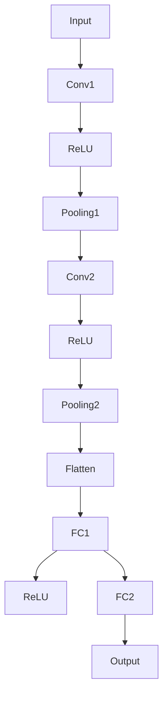

##### 2.2.2 循环神经网络（RNN）

循环神经网络是一种处理序列数据的深度学习架构。与传统的神经网络不同，RNN具有循环结构，使得模型能够保留之前的信息状态，从而处理变长序列。

**RNN的基本结构**：RNN由输入层、隐藏层和输出层组成。输入层接收序列中的每个元素，隐藏层通过递归连接保留状态信息，输出层生成最终的输出。

**递归连接（Recurrence Connection）**：RNN中的每个隐藏状态不仅依赖于当前输入，还依赖于之前的隐藏状态。这种递归连接使得模型能够捕捉序列中的长期依赖关系。

**门控机制（Gated Mechanism）**：为了解决RNN在训练过程中出现的梯度消失和梯度爆炸问题，引入了门控循环单元（Gated Recurrent Unit，简称GRU）和长短时记忆网络（LSTM）。这些门控机制通过调整信息的流动，使得模型能够更好地捕捉长期依赖关系。

以下是一个简单的RNN架构的Mermaid流程图：

```mermaid
graph TB
A[Input t] --> B[H_t]
B --> C[Output t]
C --> D[H_t]
D --> E[H_{t-1}]
E --> F[H_t]
```

##### 2.2.3 长短时记忆网络（LSTM）

长短时记忆网络是RNN的一种变体，它通过引入门控机制解决了传统RNN在处理长期依赖关系时的困难。

**LSTM的基本结构**：LSTM由输入门（Input Gate）、遗忘门（Forget Gate）和输出门（Output Gate）组成。这些门控机制通过调节信息的流动，使得模型能够有效地遗忘不重要的信息并保留重要的信息。

**输入门（Input Gate）**：输入门决定了当前输入信息中哪些部分将被更新到状态中。通过一个sigmoid函数，输入门控制每个候选值是否被引入到状态中。

**遗忘门（Forget Gate）**：遗忘门决定了哪些信息应该从状态中丢弃。它通过一个sigmoid函数控制每个值是否应该被遗忘。

**输出门（Output Gate）**：输出门决定了哪些信息应该被输出。通过一个sigmoid函数和tanh函数，输出门控制最终输出的值。

以下是一个简单的LSTM单元的Mermaid流程图：

```mermaid
graph TB
A[Input] --> B[Input Gate]
B --> C[~C_t]
C --> D[Forget Gate]
D --> E[~C_{t-1}]
E --> F[C_t]
F --> G[Output Gate]
G --> H[~H_t]
H --> I[H_t]
```

通过这些深度学习架构，人工智能在处理图像、文本和序列数据方面取得了显著的进展。随着技术的不断发展和优化，深度学习将在更多领域中发挥重要作用，推动人工智能的进一步发展。

---

#### 2.3 生成对抗网络（GAN）

生成对抗网络（Generative Adversarial Networks，简称GAN）是由伊恩·古德费洛（Ian Goodfellow）等人于2014年提出的一种深度学习框架。GAN的核心思想是通过两个对抗性神经网络——生成器（Generator）和判别器（Discriminator）之间的博弈，生成高质量的数据。

##### 2.3.1 GAN的基本原理

GAN由以下两个主要组件构成：

- **生成器（Generator）**：生成器网络的目标是生成类似于真实数据的假数据。它从随机噪声（Noise）中生成数据，并试图欺骗判别器，使其难以区分生成的数据与真实数据。
  
- **判别器（Discriminator）**：判别器网络的目标是区分真实数据和生成器生成的假数据。它接收真实数据和生成器生成的数据，并输出一个概率，表示输入数据的真实性。

GAN的训练过程可以看作是一场零和博弈：生成器和判别器相互对抗，生成器试图提高生成数据的质量，而判别器则试图更准确地判断数据来源。

GAN的训练过程通常分为以下几个步骤：

1. **初始化生成器和判别器**：通常使用随机初始化来初始化生成器和判别器的参数。
2. **生成假数据**：生成器生成一批假数据，这些数据从随机噪声中生成。
3. **训练判别器**：判别器接收一批真实数据和生成器生成的假数据，并更新其参数，使其能够更好地区分真实数据和假数据。
4. **训练生成器**：生成器根据判别器的损失函数（通常使用GAN损失函数）更新其参数，使其生成的假数据更接近真实数据。
5. **重复步骤2-4**：重复上述步骤，直到生成器的生成数据足够逼真，以至于判别器无法准确判断数据来源。

GAN的损失函数通常由两部分组成：判别器损失和生成器损失。判别器损失通常使用二元交叉熵（Binary Cross-Entropy）损失函数，生成器损失通常使用反二元交叉熵（Reverse Binary Cross-Entropy）损失函数。

##### 2.3.2 GAN的应用实例

GAN在多个领域都取得了显著的成果，以下是一些典型的应用实例：

1. **图像生成**：GAN可以生成高质量、逼真的图像。例如，深度学习公司DeepMind使用GAN生成逼真的动物图像，如图2-3所示。

2. **图像修复**：GAN可以用于图像修复任务，例如去除图像中的噪点和损坏部分。通过生成与图像中损坏部分相似的图像，GAN能够有效地修复图像。

3. **图像到图像翻译**：GAN可以用于图像到图像的翻译任务，例如将一张素描图转换为彩色图像，或者将一幅风景图像转换为艺术风格图像。

4. **视频生成**：GAN可以用于生成高质量的视频，例如通过生成视频中的连续帧来生成完整的视频序列。

5. **文本生成**：GAN可以用于生成文本，例如生成连贯、有逻辑的段落和文章。这种方法在自然语言处理领域有广泛的应用。

通过这些应用实例，可以看出GAN在图像和文本生成任务中具有巨大的潜力。随着GAN技术的不断发展和优化，它将在更多领域中发挥重要作用，推动人工智能的进一步发展。

---

### 3.1 计算机视觉

计算机视觉是人工智能领域的一个重要分支，它使计算机能够处理和解释视觉信息，如图像和视频。计算机视觉技术在图像识别、目标检测、图像分割和场景理解等方面取得了显著进展，并在工业、医疗、交通等多个领域得到了广泛应用。

##### 3.1.1 图像识别与分类

图像识别与分类是计算机视觉中最基本的问题之一。它的目标是将图像或视频帧中的对象分类到不同的类别中。图像识别与分类通常通过以下步骤实现：

1. **特征提取**：从图像中提取具有区分性的特征。这些特征可以是颜色、纹理、形状等。
2. **特征向量表示**：将提取到的特征转换为高维特征向量，以便用于后续的机器学习模型训练。
3. **模型训练**：使用训练数据集，通过机器学习算法（如支持向量机、神经网络等）训练分类模型。
4. **分类预测**：对新的图像或视频帧应用训练好的模型，预测图像中的对象类别。

在图像识别与分类任务中，深度学习模型，特别是卷积神经网络（CNN），表现出色。CNN通过多层卷积和池化操作，能够自动提取图像中的复杂特征，从而实现高精度的图像分类。

以下是一个简单的CNN架构的Mermaid流程图，用于图像识别与分类：


##### 3.1.2 目标检测与跟踪

目标检测与跟踪是计算机视觉中的重要应用，其目标是在图像或视频中检测和定位特定的对象。目标检测与跟踪通常通过以下步骤实现：

1. **检测**：在图像中检测对象的存在和位置。目标检测算法包括单阶段和双阶段方法。单阶段方法（如YOLO、SSD）直接预测每个像素点是否属于某个对象类别，而双阶段方法（如Faster R-CNN、Mask R-CNN）首先生成候选区域，然后在这些候选区域上进行分类和定位。
2. **跟踪**：在连续的视频帧中跟踪对象的位置。跟踪算法包括基于特征匹配的方法（如KCF、CSL）、基于粒子滤波的方法和基于深度学习的跟踪方法。

以下是一个简单的目标检测与跟踪的Mermaid流程图：

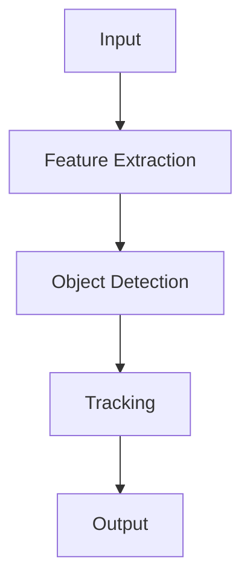

##### 3.1.3 3D重建与场景理解

3D重建与场景理解是计算机视觉中的高级任务，其目标是从二维图像或视频中重建三维场景，并理解场景中的物体和空间关系。3D重建与场景理解通常通过以下步骤实现：

1. **多视图立体匹配**：通过多个视角的图像，使用立体匹配算法重建场景的三维结构。
2. **语义分割**：对重建的三维场景进行语义分割，将场景中的不同对象分类为不同的类别。
3. **场景理解**：通过分析三维场景中的对象和空间关系，实现对场景的深入理解。

以下是一个简单的3D重建与场景理解的Mermaid流程图：

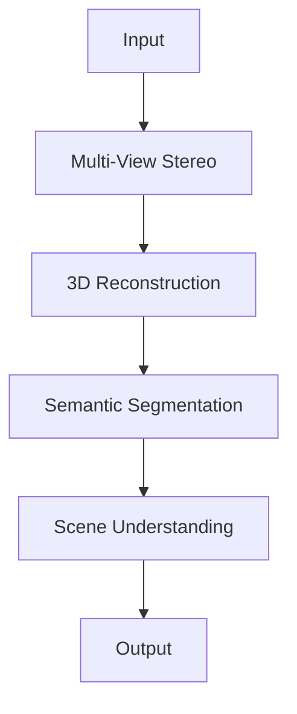

通过这些计算机视觉技术，人工智能系统能够更好地理解和处理视觉信息，从而在多个领域中实现自动化和智能化。

---

### 3.2 自然语言处理

自然语言处理（Natural Language Processing，简称NLP）是人工智能领域中一个重要分支，它致力于使计算机能够理解和处理人类语言。NLP技术在文本分类、情感分析、机器翻译和语音识别等方面取得了显著进展。

##### 3.2.1 文本分类与情感分析

文本分类是一种将文本数据分为预定义类别的方法。常见的文本分类任务包括垃圾邮件检测、新闻分类和情感分析。情感分析是文本分类的一种特殊形式，其目标是从文本中提取情感倾向，例如正面、负面或中性。

- **文本分类流程**：文本分类通常包括以下步骤：
  1. **数据预处理**：清洗和准备文本数据，包括去除停用词、标点符号和进行词干提取。
  2. **特征提取**：将文本转换为特征向量，常用的方法有词袋模型（Bag of Words，BoW）和词嵌入（Word Embeddings）。
  3. **模型训练**：使用训练数据集训练分类模型，如朴素贝叶斯、支持向量机（SVM）和深度学习模型。
  4. **预测**：对新的文本数据应用训练好的模型，预测其类别。

以下是一个简单的文本分类模型的Mermaid流程图：

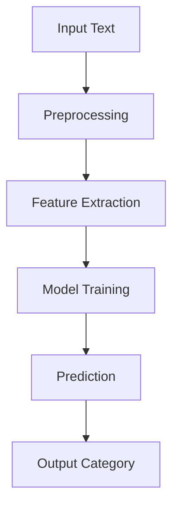

- **情感分析**：情感分析通常通过以下步骤实现：
  1. **情感词典**：构建一个包含情感词汇的词典，用于标记文本中的情感词。
  2. **情感计算**：计算文本中每个情感词的情感强度，并综合所有情感词的情感强度，得出文本的整体情感倾向。
  3. **情感分类**：使用机器学习模型（如SVM、随机森林等）将文本分类为不同的情感类别。

以下是一个简单的情感分析流程的Mermaid流程图：

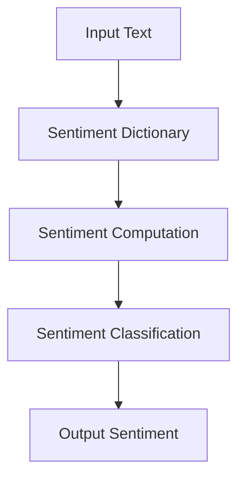

##### 3.2.2 机器翻译与文本生成

机器翻译是NLP领域的一个经典问题，其目标是将一种自然语言文本翻译成另一种自然语言文本。机器翻译通常分为基于规则的方法和基于统计的方法。近年来，基于神经网络的机器翻译（Neural Machine Translation，NMT）取得了显著进展，特别是在性能和效率方面。

- **机器翻译流程**：机器翻译通常包括以下步骤：
  1. **文本预处理**：对源语言和目标语言的文本进行预处理，包括分词、词性标注和去除停用词。
  2. **编码器-解码器模型**：使用编码器将源语言文本编码为连续的向量表示，解码器将这些向量解码为目标语言文本。
  3. **训练与预测**：使用大量双语语料库训练编码器-解码器模型，并对新的源语言文本进行翻译预测。

以下是一个简单的机器翻译模型的Mermaid流程图：

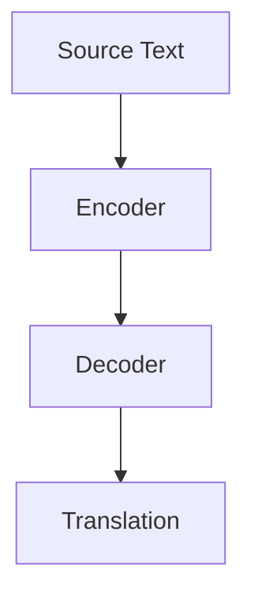

- **文本生成**：文本生成是一种生成自然语言文本的方法，其目标是从一个或多个输入序列生成新的文本序列。文本生成在创作、问答系统和对话系统中具有重要应用。

- **文本生成流程**：文本生成通常包括以下步骤：
  1. **序列建模**：使用序列建模模型（如RNN、Transformer）对文本序列进行建模。
  2. **文本编码**：将输入文本编码为连续的向量表示。
  3. **生成预测**：根据输入文本的编码表示，生成新的文本序列。

以下是一个简单的文本生成模型的Mermaid流程图：

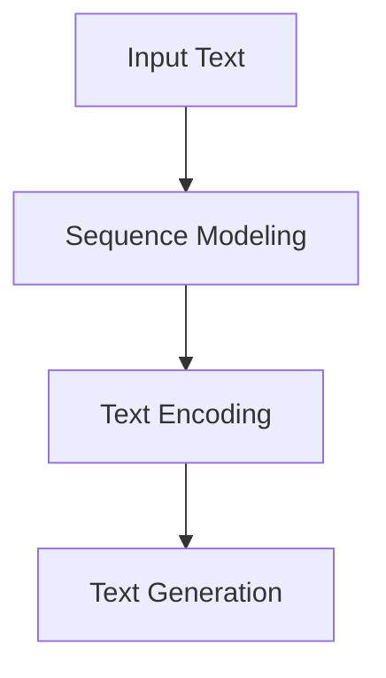

##### 3.2.3 语音识别与生成

语音识别是将语音信号转换为文本的过程，而语音生成则是生成自然流畅的语音信号。语音识别与生成在智能助手、语音交互系统和语音合成领域有广泛应用。

- **语音识别流程**：语音识别通常包括以下步骤：
  1. **音频预处理**：对语音信号进行预处理，包括噪声消除、音高提取和分帧加窗。
  2. **特征提取**：提取语音信号的特征，如梅尔频率倒谱系数（MFCC）。
  3. **声学模型**：使用声学模型将语音特征映射到声学空间。
  4. **语言模型**：使用语言模型预测文本序列。
  5. **解码**：通过解码器将声学空间中的特征序列解码为文本序列。

以下是一个简单的语音识别模型的Mermaid流程图：

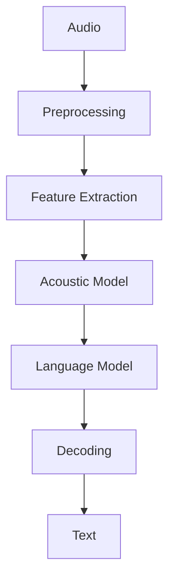

- **语音生成流程**：语音生成通常包括以下步骤：
  1. **文本到语音（Text-to-Speech，TTS）模型**：使用预训练的TTS模型将文本序列转换为语音信号。
  2. **语音合成**：通过合成器生成自然流畅的语音信号。

以下是一个简单的语音生成模型的Mermaid流程图：

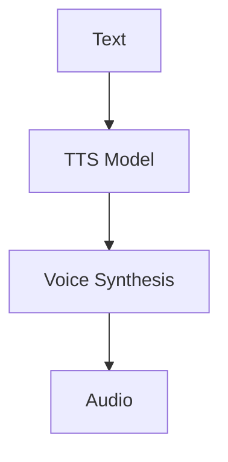

通过这些自然语言处理技术，人工智能系统能够更好地理解和生成人类语言，从而实现智能交互和自动化应用。

---

### 3.3 强化学习

强化学习（Reinforcement Learning，简称RL）是机器学习的一个重要分支，它通过智能体（Agent）与环境（Environment）的交互来学习最优策略。与传统的监督学习和无监督学习不同，强化学习关注的是决策过程和长期奖励，其核心思想是通过试错（Trial and Error）来获取最佳行为策略。

强化学习的定义可以描述为：智能体在某个环境中，通过选择动作（Action）来获取奖励（Reward），并学习最大化总奖励的过程。

强化学习的主要组成部分包括：

- **智能体（Agent）**：智能体是执行动作并从环境中接收反馈的实体。它可以是一个计算机程序或一个机器人。
- **环境（Environment）**：环境是智能体所处的实际场景，它可以提供状态（State）和奖励（Reward）。
- **状态（State）**：状态是描述智能体在某一时刻所处环境的信息集合。
- **动作（Action）**：动作是智能体在某一状态下可以执行的操作。
- **奖励（Reward）**：奖励是智能体执行某一动作后从环境中获得的即时反馈。

强化学习的基本流程如下：

1. **初始状态**：智能体在初始状态下开始交互。
2. **选择动作**：智能体根据当前状态和策略选择一个动作。
3. **执行动作**：智能体在环境中执行选定的动作。
4. **获取反馈**：执行动作后，环境返回下一个状态和奖励。
5. **更新策略**：基于新的状态和奖励，智能体更新其策略，以最大化长期奖励。
6. **重复过程**：智能体重复上述步骤，直到达到终止条件（如达到目标状态或达到最大步数）。

强化学习在多个领域都取得了显著的成果，以下是一些典型的应用实例：

- **游戏**：强化学习在游戏领域有着广泛的应用。例如，在经典的围棋、国际象棋和Dota 2游戏中，智能体通过强化学习策略能够达到或超过人类玩家的水平。
  
- **机器人控制**：强化学习在机器人控制领域具有重要应用。例如，在自主驾驶、无人机导航和机器人路径规划中，智能体通过强化学习策略能够自主决策并完成任务。

- **推荐系统**：强化学习在推荐系统中可以用于优化用户体验和提升推荐质量。例如，在电商平台上，智能体可以通过强化学习策略动态调整推荐算法，从而提高用户的购买意愿。

- **能源管理**：强化学习在能源管理领域可以用于优化能源分配和减少能源消耗。例如，在智能电网和能源存储系统中，智能体可以通过强化学习策略实现高效的能源管理和调度。

- **金融交易**：强化学习在金融交易中可以用于优化交易策略和风险管理。例如，在股票交易和量化投资中，智能体可以通过强化学习策略实现高收益和低风险的投资决策。

通过这些应用实例，可以看出强化学习在解决复杂决策问题方面具有巨大的潜力。随着强化学习技术的不断发展和优化，它将在更多领域中发挥重要作用，推动人工智能的进一步发展。

---

### 4.1 人工智能与大数据

人工智能（AI）与大数据（Big Data）的结合已经成为现代科技发展的重要趋势。大数据为人工智能提供了丰富的数据资源，而人工智能则为大数据的处理和分析提供了强大的计算能力。这种相互促进的关系推动了人工智能在各个领域的应用，并为未来的技术发展带来了新的机遇。

#### 4.1.1 大数据对人工智能的影响

大数据对人工智能的影响主要体现在以下几个方面：

1. **数据驱动学习**：传统的机器学习依赖于小规模数据集进行训练，而大数据的出现使得机器学习模型能够利用海量数据来进行训练。通过数据驱动学习，AI系统可以更准确地捕捉数据中的模式和规律，从而提高模型的性能和泛化能力。

2. **提升模型精度**：大数据提供了更多的训练样本，有助于机器学习模型学习到更复杂的特征和模式。这种多样性和丰富性使得模型能够更好地适应不同的场景和数据分布，从而提高模型的准确性和可靠性。

3. **增强实时性**：大数据的处理和分析需要高效的计算能力。随着人工智能技术的发展，深度学习模型在处理大数据时表现出更高的效率和实时性，使得AI系统能够更快速地响应和决策。

4. **跨领域应用**：大数据的丰富性使得人工智能能够在更多领域得到应用。例如，在医疗领域，大数据可以帮助AI系统进行疾病诊断和预测；在金融领域，大数据可以用于风险评估和欺诈检测。

#### 4.1.2 数据隐私与伦理问题

尽管大数据为人工智能带来了巨大价值，但同时也引发了一系列数据隐私和伦理问题：

1. **数据隐私**：大数据的收集和处理可能涉及到个人隐私。如何保护用户数据隐私，防止数据泄露和滥用，是当前AI领域面临的一个重要挑战。

2. **数据安全**：大数据中心的安全问题不容忽视。数据泄露、黑客攻击和网络攻击都可能对人工智能系统造成严重影响。

3. **算法偏见**：大数据驱动的AI模型可能会出现算法偏见。例如，如果训练数据存在偏见，模型在做出预测时可能会放大这些偏见，从而导致不公平的结果。

4. **透明度和可解释性**：大数据和复杂的机器学习模型使得AI系统的决策过程变得复杂和不可解释。如何提高算法的透明度和可解释性，让用户能够理解AI系统的决策逻辑，是当前的一个研究热点。

#### 4.1.3 数据治理与标准化

为了解决数据隐私和伦理问题，需要建立完善的数据治理和标准化体系：

1. **数据治理**：数据治理是指组织内部的数据管理策略、流程和规范。通过建立有效的数据治理体系，可以确保数据的安全、隐私和合规性。

2. **标准化**：建立统一的数据标准和规范，有助于提高数据的质量和互操作性。例如，国际标准化组织（ISO）和国际电工委员会（IEC）已经发布了多项与大数据和人工智能相关的标准。

3. **法规遵从**：遵守相关的法律法规，如《通用数据保护条例》（GDPR）和《加州消费者隐私法》（CCPA），是保护数据隐私和确保AI系统合规的必要条件。

通过大数据与人工智能的结合，我们可以在各个领域中实现更高效、更智能的决策和分析。然而，同时也要关注数据隐私和伦理问题，确保人工智能的发展能够造福社会，而非带来负面影响。

---

### 4.2 人工智能与社会

人工智能（AI）的快速发展正在深刻地改变我们的社会，从经济结构到日常生活，AI的影响无处不在。在这一节中，我们将探讨人工智能对社会的广泛影响，特别是在医疗、教育、交通等领域的应用，以及它可能带来的社会变革。

#### 4.2.1 人工智能对社会的影响

1. **经济结构变化**：人工智能的兴起正在推动传统产业的数字化转型，从而改变经济结构。制造业、金融服务和零售等行业正在通过AI技术实现自动化和智能化，提高生产效率和降低成本。然而，这也导致了部分劳动力市场的变化，一些重复性和低技能的工作可能会被自动化取代，而高技能的岗位需求将增加。

2. **生产力提升**：AI技术在提高生产力方面具有巨大潜力。通过智能优化和预测分析，企业可以更好地管理资源、降低运营成本并提高产品质量。例如，在制造业中，智能工厂和机器人可以24小时不间断地工作，提高生产效率和产品质量。

3. **教育变革**：人工智能正在改变教育模式，提供个性化的学习体验。智能教育平台可以根据学生的学习进度和学习风格，提供定制化的课程和学习路径。此外，AI辅助的教学工具可以帮助教师更好地分析学生的学习情况，从而提高教学质量。

4. **医疗进步**：人工智能在医疗领域的应用正在带来革命性的变化。AI可以辅助医生进行疾病诊断、影像分析和个性化治疗。通过大数据分析和机器学习模型，AI系统可以更准确地预测疾病风险，提高治疗效果。此外，AI还可以帮助研发新药，加速药物研发过程。

5. **交通优化**：自动驾驶技术和智能交通管理系统正在改变交通模式。通过AI技术，车辆可以更好地协同工作，减少交通事故，提高交通效率。智能交通系统可以实时监控和预测交通流量，优化道路使用，减少拥堵。

6. **社会服务改进**：人工智能在公共管理和社会服务中的应用也在不断扩展。智能城市系统可以优化资源分配、提升公共服务效率。例如，智能垃圾分类系统可以减少环境污染，智能安防系统可以提升城市安全水平。

#### 4.2.2 人工智能在医疗、教育、交通等领域的应用

1. **医疗领域**：
   - **疾病诊断与预测**：AI可以通过分析大量医学数据，辅助医生进行疾病诊断。例如，AI系统可以分析医学影像，识别早期肿瘤、心脏病等疾病。
   - **个性化治疗**：基于患者的基因数据、病史和生活习惯，AI系统可以制定个性化的治疗计划，提高治疗效果。
   - **药物研发**：AI可以加速药物研发过程，通过模拟药物分子与生物系统的相互作用，预测药物效果和副作用。

2. **教育领域**：
   - **个性化学习**：AI教育平台可以根据学生的学习进度和能力，提供个性化的学习内容和练习，帮助学生更好地掌握知识。
   - **在线教育**：AI技术可以帮助在线教育平台更好地管理课程内容、评估学生表现和提供即时反馈。
   - **智能教学辅助**：AI辅助工具可以帮助教师评估学生的学习情况、准备教学材料和进行课堂管理。

3. **交通领域**：
   - **自动驾驶**：自动驾驶技术可以通过传感器和AI算法，实现车辆的自动导航和驾驶，减少人为错误，提高交通安全性。
   - **智能交通管理**：AI系统可以实时监控交通状况，预测交通流量，优化信号灯控制，减少交通拥堵。
   - **物流优化**：AI可以优化物流路线和运输计划，提高物流效率，降低成本。

通过在医疗、教育、交通等领域的应用，人工智能正在深刻地改变我们的生活和工作方式。它不仅提高了生产力和服务质量，还为社会带来了新的机遇和挑战。随着AI技术的不断进步，我们期待它能够在未来发挥更大的作用，推动社会的持续进步和发展。

---

### 4.3 人工智能与未来

人工智能（AI）的快速发展正引领着科技的变革，其未来前景令人期待。在这一节中，我们将探讨人工智能的未来发展趋势、潜在影响以及面临的挑战。

#### 4.3.1 人工智能的未来发展前景

1. **更强大的模型和算法**：随着计算能力的提升和算法的优化，未来人工智能将能够处理更复杂的数据和任务。深度学习模型将进一步发展，如生成对抗网络（GAN）、变分自编码器（VAE）和Transformer等，将在更多领域得到应用。

2. **跨领域融合**：人工智能将与物联网（IoT）、大数据、区块链等技术深度融合，推动各行各业的数字化和智能化转型。例如，AI与IoT结合可以实现智能家居、智慧城市和智能工厂等应用。

3. **人机协作**：人工智能将在人机协作中发挥重要作用，辅助人类完成复杂任务。例如，在医疗领域，AI辅助医生进行诊断和治疗，提高医疗水平；在教育领域，AI为学生提供个性化学习体验，提高学习效果。

4. **自主决策**：未来的AI系统将具备更强的自主决策能力，能够在没有人类干预的情况下执行任务。例如，自主驾驶汽车和无人机将能够在复杂环境中自主导航和执行任务。

5. **个性化和定制化**：随着AI技术的发展，人工智能将能够更好地理解用户需求，提供个性化服务和解决方案。从个性化医疗方案到定制化产品，AI将在各个领域带来更加精准和高效的服务。

#### 4.3.2 人工智能对人类生活的影响

1. **提高生活质量**：人工智能将为人类带来更加便捷、舒适和高效的生活方式。智能家居系统将帮助人们更好地管理家庭生活，智能医疗系统将提高医疗服务的质量和可及性，智能交通系统将减少交通拥堵和时间浪费。

2. **改变就业结构**：人工智能的发展将导致某些传统职业的消失，同时也将创造新的就业机会。例如，数据科学家、机器学习工程师和AI产品经理等新职业将得到快速发展。然而，这也要求劳动力市场进行相应的调整和转型。

3. **增强人类能力**：人工智能将通过智能辅助设备和技术工具，增强人类在认知、体能和技能方面的能力。例如，智能眼镜可以帮助人们更好地理解和处理视觉信息，智能手写识别技术可以帮助有书写障碍的人更方便地记录信息。

4. **社会变革**：人工智能将推动社会结构和价值观念的变革。例如，智能城市系统将提高公共服务的效率和质量，人工智能伦理问题将引发对社会道德和法律制度的讨论。

#### 4.3.3 面临的挑战

1. **技术挑战**：人工智能技术仍面临许多挑战，如算法公平性、可解释性和安全性。如何确保AI系统在复杂环境中的稳定性和鲁棒性，是当前研究的重点。

2. **数据隐私和安全**：随着AI系统对大量数据的依赖，数据隐私和安全问题变得越来越重要。如何保护用户数据隐私，防止数据泄露和滥用，是AI领域需要解决的关键问题。

3. **伦理和社会问题**：人工智能的发展引发了关于伦理和社会影响的广泛讨论。如何确保AI系统的道德合规性，避免算法偏见和歧视，是AI领域面临的重要挑战。

4. **政策和法规**：随着人工智能技术的快速发展，需要建立完善的政策和法规体系，以规范AI的研发和应用。例如，制定相关的数据保护法规、算法公平性标准和行业规范。

总之，人工智能的未来发展前景广阔，将对人类社会产生深远的影响。然而，这也带来了许多挑战，需要各方共同努力，确保人工智能的健康、可持续和负责任的发展。

---

### 第5章：人工智能的应用与挑战

#### 5.1 人工智能在工业生产中的应用

人工智能（AI）在工业生产中的应用正迅速扩展，成为提高生产效率、优化资源利用和提升产品质量的重要工具。以下是一些主要的应用场景：

##### 5.1.1 智能制造与自动化

智能制造是工业4.0的核心概念之一，它通过AI技术实现生产线的智能化和自动化。以下是智能制造与自动化的几个关键应用：

1. **生产计划优化**：AI系统可以通过分析历史生产数据和市场趋势，预测生产需求并优化生产计划，从而避免生产过剩或短缺。

2. **设备预测维护**：通过传感器和机器学习模型，AI系统可以实时监控设备的运行状态，预测潜在故障并提前进行维护，减少停机时间和维护成本。

3. **质量监控**：AI系统可以对生产过程中的产品质量进行实时监控，通过图像识别和数据分析技术，检测不合格产品并及时采取措施，提高产品合格率。

4. **自动化控制**：机器人技术和自动化系统在制造业中广泛应用，如自动装配线、自动焊接和自动搬运等，这些技术提高了生产效率和产品质量。

以下是一个智能制造流程的Mermaid流程图：

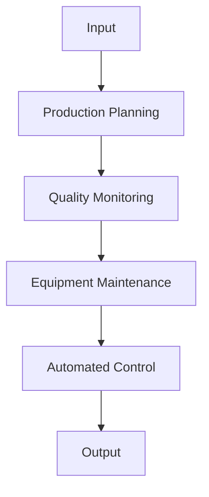

##### 5.1.2 质量控制与故障诊断

质量控制是确保产品符合预定标准和客户要求的关键环节，AI技术在质量控制中的应用显著提升了效率和准确性：

1. **图像识别**：AI系统可以通过图像识别技术对生产过程中的产品质量进行实时检测，如检查产品表面是否有缺陷、尺寸是否达标等。

2. **机器学习模型**：通过训练机器学习模型，AI系统可以识别生产过程中的异常模式和潜在故障，从而提前预警并采取措施。

3. **数据分析**：AI系统可以对生产过程中的大量数据进行实时分析，如温度、压力和振动等参数，识别可能导致产品质量问题的因素。

4. **自适应控制**：AI系统可以根据分析结果自动调整生产参数，确保产品质量的稳定性和一致性。

以下是一个质量控制与故障诊断流程的Mermaid流程图：

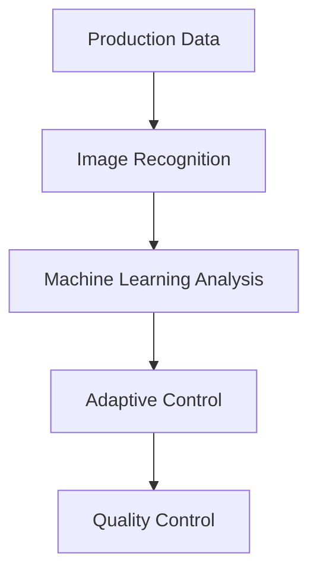

#### 5.2 人工智能在金融领域的应用

人工智能在金融领域的应用正在不断深化，从风险控制到客户服务，AI技术正在提升金融行业的效率和精准度。

##### 5.2.1 风险评估与投资策略

1. **风险评估**：AI系统可以通过大数据分析和机器学习算法，实时监控和分析市场风险，预测潜在的投资风险。

2. **投资策略优化**：AI系统可以根据市场数据和投资者偏好，制定个性化的投资策略，提高投资收益。

3. **信用评分**：通过分析借款人的信用历史、财务状况和社交行为等数据，AI系统可以更准确地评估借款人的信用风险。

4. **欺诈检测**：AI系统可以实时监控交易行为，通过异常检测技术识别和防范金融欺诈行为。

以下是一个风险评估与投资策略优化的Mermaid流程图：

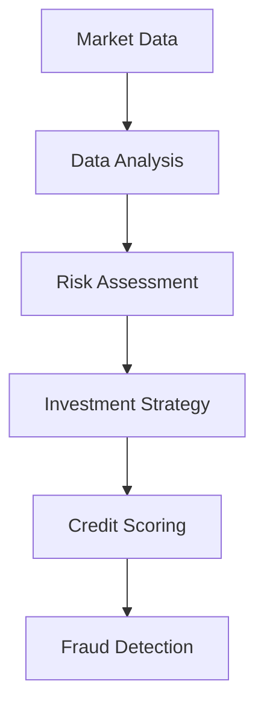

##### 5.2.2 金融服务与客户体验

1. **智能客服**：AI系统可以通过自然语言处理（NLP）和机器学习技术，提供24/7的智能客服服务，回答客户的问题并解决常见问题。

2. **个性化推荐**：AI系统可以根据客户的历史交易行为和偏好，提供个性化的金融产品和服务推荐，提升客户满意度。

3. **风险管理**：AI系统可以帮助金融机构更好地管理风险，如通过分析市场数据预测市场波动，调整投资组合。

4. **智能投顾**：智能投顾系统可以通过算法模型和数据分析，为投资者提供投资建议和资产管理服务。

以下是一个金融服务与客户体验优化的Mermaid流程图：

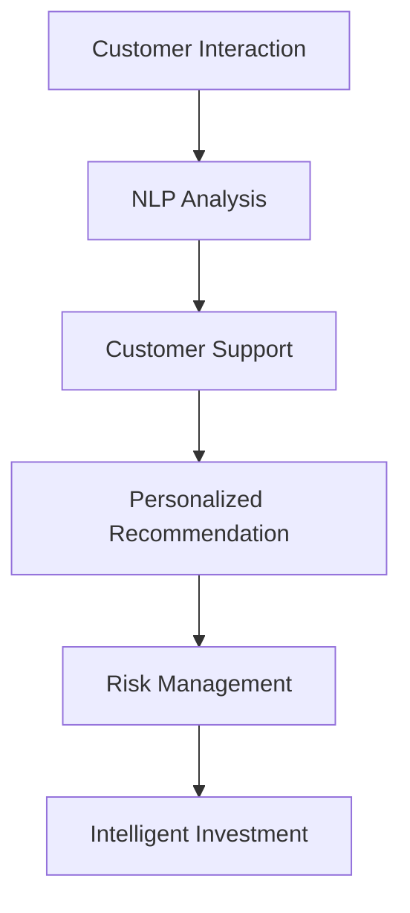

通过在工业生产和金融领域的广泛应用，人工智能正在为各行业带来巨大的变革和创新，推动了生产效率的提升和服务的优化。然而，AI技术也面临一系列挑战，如数据隐私、安全性和伦理问题，这些挑战需要我们在推动技术发展的同时，加强监管和规范，确保人工智能的健康、可持续和负责任的发展。

---

### 6.1 人工智能的法律法规

随着人工智能技术的迅猛发展，相关法律法规的制定和实施变得尤为重要。人工智能的法律法规旨在规范人工智能的研发、应用和监管，确保技术发展的合法、公正和透明。

#### 6.1.1 全球人工智能法规概览

全球范围内，许多国家和地区已经出台了针对人工智能的法律法规。以下是一些典型国家和地区的法规概述：

1. **欧盟**：《通用数据保护条例》（GDPR）是欧盟在数据隐私保护方面的一项重要法规。GDPR要求企业在收集、处理和存储个人数据时，必须遵循一系列严格的规定，如用户同意、数据最小化和数据匿名化等。

2. **美国**：美国尚未出台统一的联邦人工智能法规，但各州和行业组织已经制定了多项与AI相关的法案和指导原则。例如，加州通过了《消费者隐私法》（CCPA），要求企业在收集和使用消费者数据时，提供透明度和用户控制权。

3. **中国**：中国正在加快人工智能法律法规的制定。2017年，中国发布了《新一代人工智能发展规划》，提出了人工智能发展的目标和战略。此外，中国还制定了《网络安全法》和《数据安全法》，以规范人工智能的数据处理和安全问题。

4. **日本**：日本通过了《人工智能战略》，明确了人工智能发展的目标、政策和措施。日本政府还制定了一系列与AI相关的法律法规，如《机器人伦理指导原则》和《自动驾驶汽车安全法规》。

#### 6.1.2 中国的人工智能法律法规

中国在人工智能领域的法律法规建设方面取得了显著进展，以下是中国在人工智能领域的一些主要法律法规：

1. **《新一代人工智能发展规划》**：这是中国首个针对人工智能的国家级规划，提出了到2030年成为全球人工智能创新中心的目标。规划明确了人工智能发展的战略布局、重点领域和政策措施。

2. **《网络安全法》**：该法律于2017年6月1日正式实施，旨在加强网络安全保护，规范网络运营者的行为。网络安全法对涉及人工智能的数据处理、存储、传输和使用等方面提出了具体要求。

3. **《数据安全法》**：该法律于2021年9月1日正式实施，是对网络安全法的补充和扩展。数据安全法强调了数据的安全保护，规定了数据处理者在数据处理过程中的责任和义务。

4. **《人工智能伦理指导原则》**：这是中国发布的第一个针对人工智能伦理的指导性文件，旨在规范人工智能的研发和应用，保障人的尊严、安全、隐私和其他基本权利。

5. **《个人信息保护法》**：该法律于2021年11月1日正式实施，旨在加强个人信息保护，规范个人信息处理活动。个人信息保护法对个人信息处理者的数据处理行为提出了严格的规范，如最小化处理原则、明示同意原则等。

通过这些法律法规的制定和实施，中国旨在确保人工智能技术的健康发展，保护公民的隐私和权益，同时推动人工智能技术的创新和应用。

---

### 6.2 人工智能的社会责任

人工智能（AI）作为一项快速发展的技术，对社会产生了深远的影响。在推动科技进步和经济发展的同时，人工智能也带来了一系列伦理和社会责任问题。如何确保人工智能的发展能够造福社会，而非造成负面影响，是当前亟待解决的问题。

#### 6.2.1 人工智能伦理问题

1. **算法公平性**：算法公平性是人工智能伦理中的一个重要问题。如果AI系统在训练数据中存在偏见，可能会导致算法对某些群体产生不公平的对待。例如，在招聘、贷款审批和司法判决中，算法偏见可能导致某些群体受到歧视。为了解决这一问题，需要确保训练数据的多样性和代表性，并在算法设计和实施过程中进行公平性评估。

2. **数据隐私**：人工智能依赖于大量数据的收集和处理，这引发了数据隐私问题。如何保护个人隐私，防止数据泄露和滥用，是当前的一个关键挑战。相关法律法规的制定和实施，如《通用数据保护条例》（GDPR）和《个人信息保护法》，旨在加强对数据隐私的保护。

3. **透明度和可解释性**：传统的机器学习模型，尤其是深度学习模型，通常被认为是不透明的“黑箱”。这意味着用户和监管者很难理解AI系统如何做出决策。为了提高AI系统的透明度和可解释性，需要开发可解释的AI模型和工具，使决策过程更加透明和可追溯。

4. **责任归属**：当人工智能系统发生错误或造成损害时，如何确定责任归属是一个复杂的问题。例如，在自动驾驶事故中，如果AI系统出现故障，责任应归属于汽车制造商、AI开发者还是用户？明确责任归属有助于促进AI技术的健康发展。

#### 6.2.2 人工智能对就业的影响

1. **劳动力市场的变化**：人工智能的广泛应用可能会导致某些传统职业的消失，尤其是那些重复性和低技能的工作。例如，自动化和机器人技术正在取代制造业和物流业中的大量工作岗位。然而，这也创造了新的就业机会，如数据科学家、机器学习工程师和AI产品经理等。

2. **技能要求的提升**：随着人工智能的发展，对劳动力市场的技能要求也在提升。未来，那些具有高技能和创造力的人才将更有竞争力。为了应对这一变化，教育体系需要不断更新和改进，以培养具备创新能力和适应能力的新一代劳动力。

3. **再培训和职业转型**：为了帮助那些因人工智能技术而失业的人，政府和企业需要提供再培训和职业转型支持。例如，可以通过职业培训计划、在线课程和工作坊，帮助劳动者掌握新技能，从而适应新的就业市场。

4. **就业平等的挑战**：人工智能在就业市场中的应用可能加剧就业不平等。例如，一些地区和企业可能更容易采用先进的人工智能技术，从而占据竞争优势。为了确保就业平等，需要采取措施，如提供资金支持、技术培训和就业机会，以帮助弱势群体。

通过关注人工智能的伦理问题和就业影响，我们可以确保人工智能技术的健康发展，使其成为推动社会进步和改善人类生活的重要力量。同时，也需要社会各界共同努力，制定和实施相关政策和措施，以应对人工智能带来的挑战。

---

### 7.1 人工智能与人类智能

人工智能（AI）与人类智能的关系是当今科技领域中的一个热门话题。随着AI技术的不断进步，人们越来越关注AI是否能够达到或超越人类智能。在这个部分，我们将探讨AI与人类智能的对比、协同发展以及未来可能的融合方向。

#### 7.1.1 AI与人类智能的关系

AI与人类智能虽然都是智能的表现形式，但它们在本质上有很大的差异。人类智能具有以下特点：

1. **情感与意识**：人类智能具备情感和意识，能够体验愉悦、悲伤等情感，并具有自我意识。
2. **创造力与想象力**：人类智能能够进行创造性思维，创造出全新的概念和艺术作品。
3. **语言能力**：人类智能具有出色的语言理解、表达和沟通能力，能够进行复杂的社会交流和情感表达。
4. **适应性与灵活性**：人类智能能够适应复杂和多变的情境，灵活地调整行为和策略。

相比之下，AI技术在某些方面已经取得了显著进步：

1. **数据处理能力**：AI系统可以处理和分析大量数据，发现人类难以察觉的模式和规律。
2. **计算速度与精确性**：AI系统具有极高的计算速度和精确性，能够在短时间内完成复杂的计算任务。
3. **记忆与存储**：AI系统具有强大的记忆和存储能力，可以保存和处理大量的信息。
4. **自动化任务**：AI系统可以执行重复性高、风险低的任务，提高工作效率。

然而，AI在某些方面仍然无法与人类智能相比：

1. **情感与意识**：目前的AI系统缺乏情感和意识，无法体验情感和产生自我意识。
2. **创造力与想象力**：AI系统主要依赖于已有数据和算法，缺乏真正的创造力和想象力。
3. **适应性与灵活性**：AI系统在处理复杂和不确定的情境时，通常不如人类智能灵活和适应。
4. **社会沟通**：AI系统在自然语言理解和复杂社会交流方面仍有很大提升空间。

#### 7.1.2 人类智能与人工智能的协同发展

尽管AI在某些方面具有优势，但人类智能在某些领域仍然具有独特的价值。因此，人类智能与人工智能的协同发展是未来智能技术的一个重要方向。以下是可能的协同发展方式：

1. **知识互补**：人类智能和人工智能可以相互补充知识。人类智能可以提供丰富的背景知识和创造力，而AI可以处理和分析大量数据，发现新的知识。
2. **任务分工**：人类智能和人工智能可以分工合作，各自发挥优势。例如，人类智能可以专注于创造性和决策性任务，而AI可以处理重复性和计算性任务。
3. **协同创新**：通过人类智能和人工智能的协同合作，可以激发新的创新思维和解决方案。人类智能可以提出创意和设想，而AI可以快速验证和实现这些设想。
4. **人机交互**：未来的人机交互系统将更加智能和自然，使人类和AI能够无缝协作。例如，智能助手和虚拟代理可以帮助人类处理日常任务，提供个性化服务。

#### 7.1.3 人工智能的未来趋势

随着AI技术的不断进步，未来人工智能有望在更多领域实现突破，进一步与人类智能融合：

1. **认知增强**：通过脑机接口（Brain-Computer Interface，BCI）技术，人工智能可以增强人类的认知能力，如记忆、注意力等。
2. **智能协作**：人工智能系统将能够更好地理解人类的意图和需求，实现智能协作和自动化。
3. **情感计算**：随着情感计算技术的发展，人工智能将能够识别和理解人类的情感，提供更加个性化、情感化的服务。
4. **智能社会**：人工智能将在未来智能社会中发挥重要作用，推动社会向更高效、更智能的方向发展。

总之，人工智能与人类智能的关系是互补与合作的关系。通过人类智能与人工智能的协同发展，我们可以共同推动科技进步和社会进步，创造更加美好的未来。

---

### 7.2 人工智能的未来趋势

人工智能（AI）作为一项快速发展的技术，正逐渐改变我们的生活、工作和社会。在未来，人工智能将继续在多个领域取得重大突破，并深刻影响全球经济和社会结构。以下是对人工智能未来趋势的预测和分析。

#### 7.2.1 人工智能的未来发展预测

1. **深度学习和自监督学习的普及**：随着计算能力的提升和数据的积累，深度学习和自监督学习将在更多领域得到应用。深度学习模型将变得更加高效和强大，而自监督学习将使AI系统能够从未标注的数据中自动学习。

2. **通用人工智能（AGI）的实现**：尽管目前的人工智能技术已经取得了很多突破，但仍然缺乏通用性。未来，研究人员将致力于开发通用人工智能，使其能够在各种复杂任务中表现出人类级别的智能。

3. **多模态人工智能的发展**：随着语音识别、图像识别和自然语言处理等技术的进步，人工智能将能够更好地处理和整合多种类型的数据，实现多模态感知和理解。

4. **边缘计算的兴起**：随着物联网设备的普及，边缘计算将成为人工智能发展的重要方向。通过在设备端进行数据处理和分析，边缘计算将降低延迟，提高响应速度，并减少对中心服务器的依赖。

5. **人工智能伦理和安全的强化**：随着人工智能应用的扩大，伦理和安全问题将得到更多关注。未来，将出现更多针对人工智能伦理和安全的法律、规范和标准，以保障人工智能的健康发展。

6. **人工智能与生物技术的融合**：人工智能与生物技术的结合将为医疗、农业和生物工程等领域带来革命性的变化。例如，通过人工智能算法优化基因编辑，提高药物研发效率。

#### 7.2.2 人工智能对社会和经济的潜在影响

1. **生产力提升**：人工智能将在各个行业推动生产力的提升，特别是在制造业、物流和金融服务等领域。通过自动化和智能优化，企业将能够提高效率、降低成本并提升产品质量。

2. **就业结构的变革**：尽管人工智能将创造新的就业机会，但也会导致部分传统职业的消失。这要求劳动力市场进行转型，提供再培训和职业转型支持，以适应新的就业需求。

3. **经济模式的变化**：人工智能将推动全球经济模式的变化，从以劳动力为中心转向以数据和算法为中心。大数据和人工智能将推动数据驱动的决策和创新，改变企业竞争格局。

4. **社会服务的提升**：人工智能在医疗、教育和社会保障等公共服务领域的应用将显著提升服务质量。智能医疗系统将提高疾病诊断和治疗效果，智能教育平台将提供个性化的学习体验，智能社会保障系统将提高公共服务的效率和可及性。

5. **社会问题的解决**：人工智能将有助于解决许多社会问题，如环境保护、资源分配和社会治理。通过智能监测和预测，人工智能可以在自然灾害预警、环境保护和公共安全等方面发挥重要作用。

总之，人工智能的未来发展前景广阔，将对社会和经济产生深远的影响。随着技术的不断进步和应用场景的扩展，人工智能将成为推动社会进步和经济发展的关键力量。然而，这也带来了许多挑战，需要社会各界共同努力，确保人工智能的健康、可持续和负责任的发展。

---

### 8.1 人工智能的发展历程与现状

人工智能（AI）作为一门交叉学科，经历了从理论研究到实际应用的漫长历程。其发展大致可以分为以下几个阶段：

#### 1. 早期探索（20世纪50年代-60年代）

人工智能的诞生可以追溯到1956年的达特茅斯会议，当时计算机科学家约翰·麦卡锡（John McCarthy）等提出了“人工智能”这一概念。早期的AI研究主要集中在符号主义方法，试图通过符号计算和逻辑推理来模拟人类的智能行为。这一阶段的主要成果包括逻辑推理系统、自然语言处理和专家系统的开发。

#### 2. 稳步发展（20世纪70年代-80年代）

随着计算机性能的提升和算法的优化，人工智能在20世纪70年代和80年代进入了稳步发展阶段。这一时期，机器学习开始崭露头角，研究人员提出了许多新的学习算法，如决策树、支持向量机和神经网络。同时，专家系统成为AI应用的一个重要领域，成功应用于医疗诊断、金融分析和工业自动化等领域。

#### 3. 突破性进展（20世纪90年代-21世纪初）

20世纪90年代，随着互联网的兴起和大数据的出现，人工智能迎来了新的突破。深度学习作为一种新的机器学习方法，在图像识别、语音识别和自然语言处理等领域取得了显著进展。2006年，杰弗里·辛顿（Geoffrey Hinton）等人提出了深度信念网络（Deep Belief Network），为深度学习的发展奠定了基础。

#### 4. 快速发展（2010年至今）

近年来，人工智能技术取得了飞速发展，特别是在深度学习、生成对抗网络（GAN）和强化学习等领域。随着计算能力的提升和大数据的积累，深度学习模型在计算机视觉、自然语言处理和语音识别等领域取得了突破性成果。人工智能开始广泛应用于工业生产、医疗健康、金融和交通等领域，成为推动社会进步和经济发展的重要力量。

目前，人工智能的发展现状如下：

1. **技术成熟度**：深度学习和生成对抗网络等算法已经相对成熟，并在多个领域取得了显著成果。

2. **应用广泛**：人工智能技术在计算机视觉、自然语言处理、语音识别和自动化等领域得到了广泛应用，推动了各行业的数字化转型。

3. **跨界融合**：人工智能与其他技术的融合，如物联网、大数据和区块链等，进一步拓展了其应用场景。

4. **社会影响**：人工智能对社会和经济产生了深远的影响，提高了生产效率、优化了资源利用并改变了就业结构。

5. **伦理问题**：随着人工智能技术的快速发展，数据隐私、算法公平性和伦理问题日益凸显，成为当前研究的重点和挑战。

总之，人工智能的发展历程经历了从理论到实践、从单一领域到多领域应用的转变。当前，人工智能正处于快速发展的阶段，未来将不断拓展其应用领域，并带来更多的机遇和挑战。

---

### 8.2 人工智能的未来前景与挑战

人工智能（AI）作为现代科技的瑰宝，其未来前景广阔，但也伴随着诸多挑战。随着技术的不断进步和应用场景的拓展，AI在推动社会发展和经济进步方面具有巨大的潜力。然而，AI的发展也带来了数据隐私、伦理和安全等一系列问题，需要我们深入思考并积极应对。

#### 8.2.1 人工智能的未来前景

1. **深度学习与自监督学习的普及**：随着计算能力的提升和数据资源的丰富，深度学习将继续在图像识别、自然语言处理和语音识别等领域取得突破。自监督学习作为一种无需大量标注数据的机器学习方法，将使AI系统能够更高效地学习和优化。

2. **通用人工智能（AGI）的实现**：虽然目前的人工智能技术已经取得了显著进步，但离实现通用人工智能还有很长的路要走。未来，研究人员将致力于开发能够处理各种复杂任务、具备人类级别智能的通用人工智能。

3. **多模态人工智能的发展**：随着多模态感知技术的进步，人工智能将能够更好地处理和整合多种类型的数据，如语音、图像和文本。这将有助于实现更智能化的人机交互和自动化系统。

4. **边缘计算与云计算的融合**：边缘计算将在物联网和智能城市等领域发挥重要作用，通过与云计算的融合，实现更高效的数据处理和实时响应。

5. **人工智能与生物技术的结合**：人工智能与生物技术的融合将带来医疗、农业和生物工程等领域的革命性变化，如通过人工智能优化基因编辑、提高药物研发效率。

6. **人工智能在社会服务中的应用**：人工智能将在医疗、教育、金融和社会保障等公共服务领域发挥重要作用，提供个性化的服务和解决方案，提高服务质量。

#### 8.2.2 人工智能面临的挑战

1. **数据隐私和安全**：随着人工智能技术的发展，数据隐私和安全问题日益突出。如何保护用户数据隐私，防止数据泄露和滥用，是当前的一个重要挑战。

2. **算法公平性与可解释性**：人工智能系统的算法可能存在偏见，导致不公平的对待。此外，深度学习模型通常被视为“黑箱”，缺乏透明度和可解释性。如何提高算法的公平性和可解释性，是当前研究的重点。

3. **就业影响**：人工智能的广泛应用可能导致某些传统职业的消失，对劳动力市场产生冲击。如何应对就业结构的变化，提供再培训和职业转型支持，是社会各界需要关注的问题。

4. **伦理问题**：人工智能在医疗、司法和军事等领域的应用引发了广泛的伦理讨论。如何确保人工智能的应用符合道德规范，避免滥用和伦理危机，是当前的一个重要挑战。

5. **技术标准和监管**：随着人工智能技术的快速发展，需要建立统一的技术标准和监管体系，以确保技术的健康、可持续和负责任的发展。

#### 8.2.3 未来展望

面对人工智能的未来前景和挑战，我们应持积极的态度，充分利用人工智能的潜力，推动社会进步。同时，也要关注潜在的风险和问题，采取有效的措施，确保人工智能的发展能够造福人类。

1. **加强技术研发**：继续加大对人工智能技术的研发投入，推动技术进步和突破，为各行各业提供更高效、更智能的解决方案。

2. **制定政策和法规**：建立完善的人工智能政策和法规体系，确保人工智能的安全、公平和透明。

3. **促进跨界合作**：推动人工智能与其他领域的深度融合，如生物技术、物联网和大数据等，共同推动科技进步和社会发展。

4. **提升教育水平**：加强人工智能相关的教育和培训，提高劳动者的技能和适应能力，为人工智能的发展提供人才支持。

5. **关注伦理问题**：在人工智能的研发和应用过程中，始终关注伦理问题，确保技术发展符合道德规范，造福人类。

总之，人工智能的未来前景充满机遇和挑战。通过技术研发、政策制定、跨界合作和教育提升，我们可以充分发挥人工智能的潜力，共同创造一个更加智能、和谐和繁荣的未来。

---

## 附录

### 附录 A：参考文献

1. **《深度学习》（Deep Learning）**，作者：Ian Goodfellow、Yoshua Bengio、Aaron Courville
2. **《神经网络与深度学习》**，作者：邱锡鹏
3. **《生成对抗网络：理论基础与应用》**，作者：刘志峰、李洪涛
4. **《强化学习》**，作者：理查德·S·萨拉迪金、大卫·锡伯
5. **《大数据时代：生活、工作与思维的大变革》**，作者：维克托·迈尔-舍恩伯格、肯尼斯·库克耶
6. **《人工智能：一种现代的方法》**，作者：Stuart Russell、Peter Norvig

### 附录 B：人工智能相关资源链接

1. **[Keras官方文档](https://keras.io/)**：提供Keras框架的详细文档和教程。
2. **[TensorFlow官方文档](https://www.tensorflow.org/tutorials)**：TensorFlow框架的官方教程和示例代码。
3. **[PyTorch官方文档](https://pytorch.org/tutorials/beginner/)**：PyTorch框架的官方教程和示例代码。
4. **[OpenAI](https://openai.com/research/)**：OpenAI的研究项目和论文。
5. **[GitHub](https://github.com/topics/deep-learning)**：深度学习和人工智能的GitHub项目。

### 附录 C：人工智能开发工具介绍

1. **TensorFlow**：由Google开发的开源深度学习框架，支持多种编程语言，如Python、C++和Java。
2. **PyTorch**：由Facebook开发的开源深度学习框架，以其动态计算图和灵活性著称。
3. **Keras**：一个高层次的神经网络API，用于快速构建和迭代深度学习模型。
4. **Scikit-learn**：一个基于Python的机器学习库，提供多种经典机器学习算法的实现。
5. **OpenCV**：一个开源计算机视觉库，用于图像处理和计算机视觉应用。
6. **NLTK**：一个用于自然语言处理的Python库，提供了丰富的文本处理和机器学习工具。

通过这些参考文献、资源链接和开发工具，读者可以深入了解人工智能的理论和实践，掌握相关技术和应用。

---

### 作者

**作者：AI天才研究院/AI Genius Institute & 禅与计算机程序设计艺术 /Zen And The Art of Computer Programming**

AI天才研究院（AI Genius Institute）是一支专注于人工智能前沿技术研究与创新的研究团队。我们的成员来自全球各地的顶尖学府和知名企业，具有丰富的学术和实践经验。我们致力于推动人工智能技术的发展，探索AI在各个领域的应用潜力，并为人工智能产业的可持续发展提供解决方案。

《禅与计算机程序设计艺术》（Zen And The Art of Computer Programming）是作者Donald E. Knuth的经典之作，它深刻揭示了编程艺术与哲学思想之间的内在联系。这本书为计算机科学和人工智能领域的研究者提供了宝贵的启示，帮助我们在技术追求的过程中保持内心的平静与智慧。

在此，我们感谢各位读者的关注与支持，期待与您共同探索人工智能的未来，共同推动科技与社会的进步。

