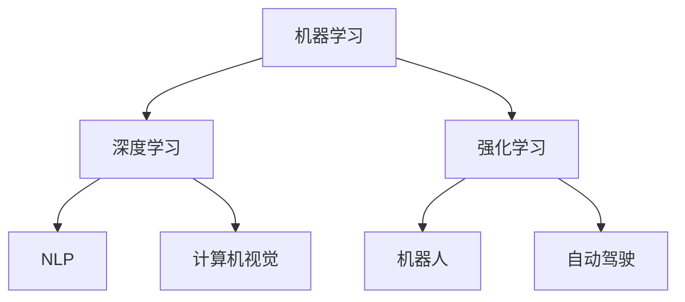

                 

### 《Andrej Karpathy：人工智能的未来发展方向》的完整目录大纲：

我们根据提供的目录大纲，将文章分为四个主要部分：人工智能的基础理论、人工智能技术核心算法原理、人工智能技术在各行各业的应用以及人工智能未来的发展方向。每个部分包含相应的章节和小节，以逻辑清晰、结构紧凑、简单易懂的格式进行撰写。以下是完整的目录大纲：

#### 第一部分: 人工智能的基础理论

##### 第1章: 人工智能简史与发展历程

###### 1.1 人工智能的概念与定义

###### 1.1.1 人工智能的定义

###### 1.1.2 人工智能的分类

###### 1.1.3 人工智能的发展历程

###### 1.2 人工智能的核心理论与方法

###### 1.2.1 机器学习理论

###### 1.2.2 深度学习理论

###### 1.2.3 强化学习理论

###### 1.3 人工智能的主要应用领域

###### 1.3.1 自然语言处理

###### 1.3.2 计算机视觉

###### 1.3.3 机器人和自动驾驶

###### 1.4 人工智能的发展趋势与未来方向

###### 1.4.1 人工智能的未来发展趋势

###### 1.4.2 人工智能的核心挑战与机遇

###### 1.4.3 人工智能在各个领域的应用前景

##### 图1-1 人工智能的核心理论与方法流程图

#### 第二部分: 人工智能技术核心算法原理

##### 第2章: 人工智能核心技术算法原理

###### 2.1 机器学习算法原理

###### 2.1.1 监督学习算法

###### 2.1.1.1 线性回归算法

###### 2.1.1.2 决策树算法

###### 2.2 深度学习算法原理

###### 2.2.1 神经网络基础

###### 2.2.1.1 神经元模型

###### 2.2.1.2 激活函数

###### 2.2.1.3 反向传播算法

###### 2.2.2 卷积神经网络（CNN）

###### 2.2.2.1 卷积层

###### 2.2.2.2 池化层

###### 2.2.2.3 全连接层

###### 2.2.3 循环神经网络（RNN）

###### 2.2.3.1 RNN基本结构

###### 2.2.3.2 LSTM（长短期记忆网络）

###### 2.2.3.3 GRU（门控循环单元）

##### 2.3 自然语言处理算法

###### 2.3.1 词向量表示

###### 2.3.1.1 word2vec算法

###### 2.3.1.2 GloVe算法

###### 2.3.2 序列标注

###### 2.3.2.1 CRF（条件随机场）模型

###### 2.3.3 文本生成

###### 2.3.3.1 序列到序列模型

###### 2.3.3.2 自回归模型

#### 第三部分: 人工智能技术在各行各业的应用

##### 第3章: 人工智能在金融领域的应用

###### 3.1 人工智能在金融领域的应用概述

###### 3.1.1 金融领域中的机器学习应用

###### 3.1.2 人工智能在金融风险管理中的应用

###### 3.1.3 人工智能在金融产品创新中的应用

###### 3.2 金融风控中的机器学习算法

###### 3.2.1 信用评分模型

###### 3.2.2 风险识别与监控

###### 3.2.3 量化投资策略

###### 3.3 人工智能在金融产品创新中的应用

###### 3.3.1 个性化金融服务

###### 3.3.2 金融科技产品开发

###### 3.3.3 智能投顾

###### 3.4 金融领域中的开源框架与工具

###### 3.4.1 TensorFlow in Finance

###### 3.4.2 PyTorch in Finance

###### 3.4.3 其他常用金融领域AI框架

#### 第四部分: 人工智能未来的发展方向

##### 第4章: 人工智能的未来发展方向

###### 4.1 人工智能与未来社会

###### 4.1.1 人工智能对就业市场的影响

###### 4.1.2 人工智能与人类价值观的冲突

###### 4.1.3 人工智能伦理问题

###### 4.2 人工智能技术的新兴领域

###### 4.2.1 量子计算与人工智能

###### 4.2.2 脑机接口技术

###### 4.2.3 人工智能与区块链

###### 4.3 人工智能发展的挑战与解决方案

###### 4.3.1 数据隐私与安全

###### 4.3.2 算法透明性与可解释性

###### 4.3.3 AI治理与监管

###### 4.4 人工智能在各个领域的未来应用前景

###### 4.4.1 医疗健康

###### 4.4.2 教育与培训

###### 4.4.3 能源与环境

### 附录

##### 附录A: 人工智能学习资源推荐

##### A.1 人工智能书籍推荐

###### A.1.1 《深度学习》（Goodfellow, Bengio, Courville）

###### A.1.2 《Python机器学习》（Sebastian Raschka）

###### A.1.3 《机器学习实战》（Peter Harrington）

##### A.2 人工智能在线课程推荐

###### A.2.1 吴恩达的《深度学习专项课程》

###### A.2.2 李飞飞、李航的《机器学习》

###### A.2.3 李宏毅的《机器学习课程》

### 《Andrej Karpathy：人工智能的未来发展方向》的完整目录大纲已经制定完毕，接下来我们将逐一撰写每个部分的内容。让我们开始撰写第一部分：人工智能的基础理论。 <|assistant|>

### 《Andrej Karpathy：人工智能的未来发展方向》

#### > 关键词：人工智能，机器学习，深度学习，强化学习，自然语言处理，计算机视觉，机器人，自动驾驶，量子计算，脑机接口，金融应用，医疗健康，教育与培训，能源与环境，AI伦理，数据隐私，算法透明性，AI治理。

#### > 摘要：
本文旨在探讨人工智能（AI）领域的前沿发展方向，回顾AI的发展历程，分析其核心理论与方法，探讨AI在各个行业的应用，以及AI对社会和未来技术的影响。文章首先介绍了人工智能的概念与定义，然后深入讲解了机器学习、深度学习和强化学习等核心算法原理，随后展示了AI在自然语言处理、计算机视觉等领域的应用。接着，文章讨论了AI在未来社会中的潜在影响、新兴领域的发展，以及面临的挑战与解决方案。最后，文章提出了AI在医疗健康、教育与培训、能源与环境等领域的未来应用前景，并对人工智能的学习资源进行了推荐。

#### 第一部分: 人工智能的基础理论

#### 第1章: 人工智能简史与发展历程

##### 1.1 人工智能的概念与定义

###### 1.1.1 人工智能的定义

人工智能（Artificial Intelligence，简称AI）是计算机科学的一个分支，旨在研究、开发和应用使计算机系统模拟人类智能行为的技术和理论。人工智能的核心理念是使计算机具备学习、推理、感知、理解和决策的能力，从而实现自动化、智能化和自适应化。

###### 1.1.2 人工智能的分类

人工智能可以按照不同的标准和层次进行分类。常见的分类方法包括：

- **弱人工智能（Narrow AI）**：专注于解决特定问题，如语音识别、图像分类等。

- **强人工智能（General AI）**：具有广泛的知识和智能，能够处理多种任务，类似于人类智能。

- **人工神经网络（ANN）**：模拟人脑神经网络结构和功能的计算模型。

- **自然语言处理（NLP）**：使计算机理解和生成人类自然语言的技术。

- **计算机视觉（CV）**：使计算机具备理解和解释视觉信息的能力。

- **机器人技术（Robotics）**：研究设计、制造和运用机器人的科学技术。

###### 1.1.3 人工智能的发展历程

人工智能的发展历程可以分为几个重要阶段：

- **1950年代**：人工智能的概念被提出，标志着人工智能研究的起步。

- **1960-1970年代**：人工智能研究主要集中在符号推理和逻辑推理。

- **1980-1990年代**：专家系统和机器学习技术开始受到关注，强化学习初步发展。

- **2000年代**：深度学习技术的突破使得人工智能取得了显著的进展。

- **2010年代至今**：人工智能在各个领域得到广泛应用，如自然语言处理、计算机视觉、机器人等。

##### 1.2 人工智能的核心理论与方法

###### 1.2.1 机器学习理论

机器学习（Machine Learning，ML）是人工智能的核心理论之一，其目标是使计算机通过数据学习并改进性能。机器学习可以分为以下几种类型：

- **监督学习（Supervised Learning）**：通过标记数据训练模型，使其能够预测新数据的输出。

- **无监督学习（Unsupervised Learning）**：在没有任何标签的情况下，模型学习数据的结构和模式。

- **半监督学习（Semi-Supervised Learning）**：在标记数据和无标记数据之间进行学习。

- **强化学习（Reinforcement Learning）**：通过与环境交互，学习最优策略。

###### 1.2.2 深度学习理论

深度学习（Deep Learning，DL）是机器学习的一个分支，通过多层神经网络模拟人类大脑的学习过程。深度学习在图像识别、语音识别和自然语言处理等领域取得了巨大成功。深度学习的关键组成部分包括：

- **神经网络（Neural Networks）**：由多个神经元组成的计算模型。

- **卷积神经网络（Convolutional Neural Networks，CNN）**：专门用于图像识别和处理。

- **循环神经网络（Recurrent Neural Networks，RNN）**：用于处理序列数据。

- **长短期记忆网络（Long Short-Term Memory，LSTM）**：改进RNN，解决长期依赖问题。

###### 1.2.3 强化学习理论

强化学习（Reinforcement Learning，RL）是一种通过试错和奖励机制来学习最优策略的机器学习方法。强化学习的关键组成部分包括：

- **代理（Agent）**：执行行动的实体。

- **环境（Environment）**：代理行动发生的环境。

- **状态（State）**：代理所处的环境状态。

- **动作（Action）**：代理可以执行的动作。

- **奖励（Reward）**：根据代理的行动和状态给予的奖励。

##### 1.3 人工智能的主要应用领域

###### 1.3.1 自然语言处理

自然语言处理（Natural Language Processing，NLP）是人工智能的一个分支，旨在使计算机理解和生成人类自然语言。NLP的主要应用包括：

- **文本分类**：将文本数据分类到预定义的类别中。

- **情感分析**：分析文本中的情感倾向。

- **机器翻译**：将一种自然语言翻译成另一种自然语言。

- **问答系统**：根据用户提问提供答案。

###### 1.3.2 计算机视觉

计算机视觉（Computer Vision，CV）是使计算机理解和解释视觉信息的技术。计算机视觉的主要应用包括：

- **图像分类**：将图像分类到预定义的类别中。

- **目标检测**：在图像中检测和识别目标。

- **图像分割**：将图像分割成多个区域。

- **人脸识别**：识别和验证人脸。

###### 1.3.3 机器人和自动驾驶

机器人和自动驾驶是人工智能的重要应用领域。机器人可以应用于工业制造、医疗保健、家庭服务等各个领域，而自动驾驶则有望改变交通运输模式。主要应用包括：

- **机器人操作**：工业自动化和远程控制。

- **自动驾驶车辆**：自主导航和安全驾驶。

- **无人驾驶航空器**：无人机送货和航空监控。

##### 1.4 人工智能的发展趋势与未来方向

###### 1.4.1 人工智能的未来发展趋势

人工智能的未来发展趋势包括：

- **算法性能的提升**：通过改进神经网络架构和优化算法，提高模型性能。

- **多模态学习**：结合不同类型的数据（如文本、图像、声音等）进行学习。

- **自主系统**：开发能够自主学习和决策的智能系统。

- **强化学习**：在复杂环境中实现更高效的学习和优化。

###### 1.4.2 人工智能的核心挑战与机遇

人工智能的核心挑战包括：

- **数据隐私和安全**：确保数据安全和隐私。

- **算法透明性和可解释性**：提高算法的可解释性和透明性。

- **计算资源**：开发高效的算法和优化计算资源。

人工智能的机遇包括：

- **智能助理**：为个人和企业提供智能化的帮助。

- **医疗健康**：辅助疾病诊断和治疗方案。

- **教育和培训**：个性化学习体验和教育资源。

###### 1.4.3 人工智能在各个领域的应用前景

人工智能在各个领域的应用前景广泛，包括：

- **金融**：自动化交易、风险评估和个性化金融服务。

- **医疗健康**：智能诊断、个性化治疗和医疗监控。

- **能源与环境**：智能电网、能源管理和环境监测。

- **教育与培训**：在线教育、虚拟实验室和个性化学习。

##### 1.5 人工智能的核心概念与联系流程图

为了更好地理解人工智能的核心概念和联系，我们可以使用Mermaid流程图进行展示。以下是人工智能核心理论与方法的Mermaid流程图：



在这个流程图中，机器学习和深度学习是人工智能的基础，而强化学习则与机器学习和深度学习密切相关。自然语言处理和计算机视觉是人工智能的重要应用领域，而机器人和自动驾驶则是人工智能技术的实际应用场景。

#### 图1-1 人工智能的核心理论与方法流程图


通过这个流程图，我们可以清晰地看到人工智能的核心概念、理论和方法，以及它们之间的联系。这为我们进一步探讨人工智能的技术和应用奠定了坚实的基础。

接下来，我们将深入探讨人工智能技术核心算法原理，了解机器学习、深度学习和强化学习等核心算法的工作原理和应用。在下一章中，我们将继续这一主题。 <|assistant|>### 第一部分: 人工智能的基础理论

#### 第1章: 人工智能简史与发展历程

##### 1.1 人工智能的概念与定义

人工智能（Artificial Intelligence，简称AI）作为计算机科学的一个重要分支，其核心目标在于开发能够模拟人类智能行为的计算机系统。人工智能的定义多种多样，但其核心思想是赋予机器自我学习能力，使其能够进行推理、判断、决策和问题解决。根据Arthur Samuel的定义，人工智能是“制造智能机器的科学与工程”，而John McCarthy则将其描述为“对智能代理的研究”。

###### 1.1.1 人工智能的定义

人工智能可以分为两大类：窄人工智能（Narrow AI）和广人工智能（General AI）。

- **窄人工智能（Narrow AI）**：也称为弱人工智能，指的是专注于特定任务或领域的智能系统。例如，语音助手、图像识别系统、推荐引擎等。这些系统在特定任务上表现出高度的智能，但无法跨领域应用。

- **广人工智能（General AI）**：也称为强人工智能，指的是具有普遍智能的机器，能够像人类一样理解、学习、推理和解决各种问题。这种人工智能尚未实现，但科学家们正在不断努力探索。

###### 1.1.2 人工智能的分类

根据人工智能的智能程度和应用范围，可以将其分类如下：

- **弱人工智能（Narrow AI）**：专注于特定任务，如语音识别、图像识别、自然语言处理等。

- **强人工智能（General AI）**：具有跨领域、自适应的通用智能能力。

- **人工神经网络（ANN）**：模拟人脑神经网络的结构和功能。

- **自然语言处理（NLP）**：使计算机理解和生成人类自然语言。

- **计算机视觉（CV）**：使计算机具备理解和解释视觉信息的能力。

- **机器人技术（Robotics）**：研究设计、制造和运用机器人的科学技术。

###### 1.1.3 人工智能的发展历程

人工智能的发展历程可以追溯到20世纪50年代。以下是其重要的发展阶段：

- **1950年代**：人工智能的概念被提出，标志着人工智能研究的起步。1956年，约翰·麦卡锡等人在达特茅斯会议上正式提出了“人工智能”这个术语。

- **1960-1970年代**：人工智能研究主要集中在符号推理和逻辑推理。这一时期出现了著名的ELIZA程序，它是第一个使用自然语言处理技术的聊天机器人。

- **1980-1990年代**：专家系统和机器学习技术开始受到关注。专家系统是一种基于规则的人工智能系统，而机器学习则通过数据训练模型，实现自我改进。

- **2000年代**：深度学习技术的突破使得人工智能取得了显著的进展。2006年，Hinton等人提出了深度信念网络，标志着深度学习的复兴。

- **2010年代至今**：人工智能在各个领域得到广泛应用，如自然语言处理、计算机视觉、机器人等。深度学习算法在图像识别、语音识别等领域取得了突破性成果。

##### 1.2 人工智能的核心理论与方法

###### 1.2.1 机器学习理论

机器学习（Machine Learning，ML）是人工智能的核心理论之一，其目标是使计算机通过数据学习并改进性能。机器学习可以分为以下几种类型：

- **监督学习（Supervised Learning）**：通过标记数据训练模型，使其能够预测新数据的输出。例如，线性回归、决策树、支持向量机等。

  伪代码：
  ```python
  def supervised_learning(data, labels):
      model = create_model()
      for (x, y) in zip(data, labels):
          model.fit(x, y)
      return model
  ```

- **无监督学习（Unsupervised Learning）**：在没有任何标签的情况下，模型学习数据的结构和模式。例如，聚类、降维等。

  伪代码：
  ```python
  def unsupervised_learning(data):
      model = create_model()
      model.fit(data)
      return model
  ```

- **半监督学习（Semi-Supervised Learning）**：在标记数据和无标记数据之间进行学习。例如，利用无标记数据辅助标记数据的训练。

  伪代码：
  ```python
  def semi_supervised_learning(labeled_data, unlabeled_data):
      model = create_model()
      model.fit(labeled_data)
      model.partial_fit(unlabeled_data)
      return model
  ```

- **强化学习（Reinforcement Learning）**：通过与环境交互，学习最优策略。例如，Q学习、深度Q网络（DQN）等。

  伪代码：
  ```python
  def reinforcement_learning(environment, model):
      state = environment.reset()
      while not environment.is_done():
          action = model.select_action(state)
          next_state, reward, done = environment.step(action)
          model.update(state, action, reward, next_state, done)
          state = next_state
      return model
  ```

###### 1.2.2 深度学习理论

深度学习（Deep Learning，DL）是机器学习的一个分支，通过多层神经网络模拟人类大脑的学习过程。深度学习在图像识别、语音识别和自然语言处理等领域取得了巨大成功。深度学习的关键组成部分包括：

- **神经网络（Neural Networks）**：由多个神经元组成的计算模型。每个神经元接收多个输入，并通过权重和偏置进行加权求和，然后通过激活函数进行非线性变换。

  伪代码：
  ```python
  def neural_network(inputs, weights, biases, activation_function):
      output = 0
      for i in range(len(inputs)):
          output += inputs[i] * weights[i] + biases[i]
      return activation_function(output)
  ```

- **卷积神经网络（Convolutional Neural Networks，CNN）**：专门用于图像识别和处理。CNN通过卷积层、池化层和全连接层等结构，提取图像特征并进行分类。

  伪代码：
  ```python
  def convolutional_neural_network(inputs, filters, kernel_size, activation_function):
      output = 0
      for filter in filters:
          output += convolution(inputs, filter, kernel_size) * activation_function(output)
      return max_pooling(output)
  ```

- **循环神经网络（Recurrent Neural Networks，RNN）**：用于处理序列数据。RNN通过循环结构，将前一个时间步的输出作为当前时间步的输入，实现对序列数据的长期记忆。

  伪代码：
  ```python
  def recurrent_neural_network(inputs, hidden_state, weights, biases, activation_function):
      output = 0
      for i in range(len(inputs)):
          input = inputs[i]
          output += (input * weights[i] + biases[i]) * activation_function(output)
      return output
  ```

- **长短期记忆网络（Long Short-Term Memory，LSTM）**：改进RNN，解决长期依赖问题。LSTM通过引入门控机制，有效地控制信息的流动，从而实现对序列数据的长期记忆。

  伪代码：
  ```python
  def long_short_term_memory(inputs, hidden_state, weights, biases, activation_function):
      forget gate = activation_functiondot(weights_forget * hidden_state + biases_forget)
      input gate = activation_functiondot(weights_input * hidden_state + biases_input)
      new_state = activation_functiondot(weights_state * hidden_state + biases_state)
      output gate = activation_functiondot(weights_output * hidden_state + biases_output)
      forget = 1 - forget gate
      input = input gate
      new_state = forget * hidden_state + input * new_state
      output = output gate * activation_function(new_state)
      return output
  ```

###### 1.2.3 强化学习理论

强化学习（Reinforcement Learning，RL）是一种通过试错和奖励机制来学习最优策略的机器学习方法。强化学习的关键组成部分包括：

- **代理（Agent）**：执行行动的实体。

- **环境（Environment）**：代理行动发生的环境。

- **状态（State）**：代理所处的环境状态。

- **动作（Action）**：代理可以执行的动作。

- **奖励（Reward）**：根据代理的行动和状态给予的奖励。

强化学习可以分为以下几种类型：

- **模型为基础的强化学习（Model-Based RL）**：使用环境模型来预测未来的状态和奖励。

  伪代码：
  ```python
  def model_based_reinforcement_learning(model, agent, environment):
      state = environment.reset()
      while not environment.is_done():
          action = agent.select_action(state)
          next_state, reward = environment.step(action)
          model.update(state, action, reward, next_state)
          state = next_state
      return model
  ```

- **模型无关的强化学习（Model-Free RL）**：不使用环境模型，直接通过经验进行学习。

  伪代码：
  ```python
  def model_free_reinforcement_learning(agent, environment):
      state = environment.reset()
      while not environment.is_done():
          action = agent.select_action(state)
          next_state, reward = environment.step(action)
          agent.update(state, action, reward, next_state)
          state = next_state
      return agent
  ```

- **基于策略的强化学习（Policy-Based RL）**：学习最优策略。

  伪代码：
  ```python
  def policy_based_reinforcement_learning(policy, environment):
      state = environment.reset()
      while not environment.is_done():
          action = policy.select_action(state)
          next_state, reward = environment.step(action)
          policy.update(state, action, reward, next_state)
          state = next_state
      return policy
  ```

- **基于价值的强化学习（Value-Based RL）**：学习值函数。

  伪代码：
  ```python
  def value_based_reinforcement_learning(value_function, environment):
      state = environment.reset()
      while not environment.is_done():
          action = value_function.select_action(state)
          next_state, reward = environment.step(action)
          value_function.update(state, action, reward, next_state)
          state = next_state
      return value_function
  ```

##### 1.3 人工智能的主要应用领域

###### 1.3.1 自然语言处理

自然语言处理（Natural Language Processing，NLP）是人工智能的一个分支，旨在使计算机理解和生成人类自然语言。NLP的主要应用包括：

- **文本分类**：将文本分类到预定义的类别中。

  伪代码：
  ```python
  def text_classification(text, model):
      return model.predict(text)
  ```

- **情感分析**：分析文本中的情感倾向。

  伪代码：
  ```python
  def sentiment_analysis(text, model):
      return model.predict(text)
  ```

- **机器翻译**：将一种自然语言翻译成另一种自然语言。

  伪代码：
  ```python
  def machine_translation(source_text, target_language, model):
      return model.translate(source_text, target_language)
  ```

- **问答系统**：根据用户提问提供答案。

  伪代码：
  ```python
  def question_answering(question, model):
      return model.answer(question)
  ```

###### 1.3.2 计算机视觉

计算机视觉（Computer Vision，CV）是使计算机理解和解释视觉信息的技术。计算机视觉的主要应用包括：

- **图像分类**：将图像分类到预定义的类别中。

  伪代码：
  ```python
  def image_classification(image, model):
      return model.predict(image)
  ```

- **目标检测**：在图像中检测和识别目标。

  伪代码：
  ```python
  def object_detection(image, model):
      return model.detect(image)
  ```

- **图像分割**：将图像分割成多个区域。

  伪代码：
  ```python
  def image_segmentation(image, model):
      return model.segment(image)
  ```

- **人脸识别**：识别和验证人脸。

  伪代码：
  ```python
  def face_recognition(image, model):
      return model.recognize(image)
  ```

###### 1.3.3 机器人和自动驾驶

机器人和自动驾驶是人工智能的重要应用领域。机器人可以应用于工业制造、医疗保健、家庭服务等各个领域，而自动驾驶则有望改变交通运输模式。主要应用包括：

- **机器人操作**：工业自动化和远程控制。

  伪代码：
  ```python
  def robot_operation(robot, task):
      robot.execute(task)
  ```

- **自动驾驶车辆**：自主导航和安全驾驶。

  伪代码：
  ```python
  def autonomous_vehicle(driving_model, vehicle):
      driving_model.control(vehicle)
  ```

- **无人驾驶航空器**：无人机送货和航空监控。

  伪代码：
  ```python
  def unmanned_aerial_vehicle(flight_model, vehicle):
      flight_model.control(vehicle)
  ```

##### 1.4 人工智能的发展趋势与未来方向

###### 1.4.1 人工智能的未来发展趋势

人工智能的未来发展趋势包括：

- **算法性能的提升**：通过改进神经网络架构和优化算法，提高模型性能。

- **多模态学习**：结合不同类型的数据（如文本、图像、声音等）进行学习。

- **自主系统**：开发能够自主学习和决策的智能系统。

- **强化学习**：在复杂环境中实现更高效的学习和优化。

###### 1.4.2 人工智能的核心挑战与机遇

人工智能的核心挑战包括：

- **数据隐私和安全**：确保数据安全和隐私。

- **算法透明性和可解释性**：提高算法的可解释性和透明性。

- **计算资源**：开发高效的算法和优化计算资源。

人工智能的机遇包括：

- **智能助理**：为个人和企业提供智能化的帮助。

- **医疗健康**：辅助疾病诊断和治疗方案。

- **教育和培训**：个性化学习体验和教育资源。

###### 1.4.3 人工智能在各个领域的应用前景

人工智能在各个领域的应用前景广泛，包括：

- **金融**：自动化交易、风险评估和个性化金融服务。

- **医疗健康**：智能诊断、个性化治疗和医疗监控。

- **能源与环境**：智能电网、能源管理和环境监测。

- **教育与培训**：在线教育、虚拟实验室和个性化学习。

##### 1.5 人工智能的核心概念与联系流程图

为了更好地理解人工智能的核心概念和联系，我们可以使用Mermaid流程图进行展示。以下是人工智能核心理论与方法的Mermaid流程图：


在这个流程图中，机器学习和深度学习是人工智能的基础，而强化学习则与机器学习和深度学习密切相关。自然语言处理和计算机视觉是人工智能的重要应用领域，而机器人和自动驾驶则是人工智能技术的实际应用场景。

##### 图1-1 人工智能的核心理论与方法流程图


通过这个流程图，我们可以清晰地看到人工智能的核心概念、理论和方法，以及它们之间的联系。这为我们进一步探讨人工智能的技术和应用奠定了坚实的基础。

### 总结

本章回顾了人工智能的发展历程、核心概念与定义，并详细介绍了人工智能的核心理论与方法，包括机器学习、深度学习和强化学习。我们还探讨了人工智能在各个领域的应用，以及其未来发展趋势和挑战。下一章将深入讨论人工智能技术核心算法原理，包括机器学习算法、深度学习算法和自然语言处理算法。让我们继续深入探索这个充满无限可能的领域。 <|assistant|>### 第二部分: 人工智能技术核心算法原理

#### 第2章: 人工智能核心技术算法原理

##### 2.1 机器学习算法原理

机器学习算法是人工智能的核心组成部分，它们通过数据学习并改进性能，从而实现预测和决策。以下是机器学习算法的几种主要类型：

###### 2.1.1 监督学习算法

监督学习算法是一种在已知输出结果的情况下，通过输入数据训练模型，使其能够预测未知数据的输出。以下是一些常见的监督学习算法：

###### 2.1.1.1 线性回归算法

线性回归是一种简单的监督学习算法，用于预测连续值输出。其基本模型如下：

$$
y = w \cdot x + b
$$

其中，\( y \) 是输出值，\( x \) 是输入值，\( w \) 是权重，\( b \) 是偏置。为了训练模型，我们需要最小化误差平方和：

$$
\min_{w,b} \sum_{i=1}^{n} (y_i - w \cdot x_i - b)^2
$$

通过梯度下降法，我们可以迭代更新权重和偏置，从而最小化损失函数。

伪代码：

```python
def linear_regression(data, labels):
    # 初始化权重和偏置
    w = np.random.randn(1)
    b = np.random.randn(1)
    # 梯度下降法
    for i in range(epochs):
        for x, y in zip(data, labels):
            error = y - (w * x + b)
            w -= learning_rate * (2 * x * error)
            b -= learning_rate * error
    return w, b
```

###### 2.1.1.2 决策树算法

决策树是一种基于特征和阈值进行决策的监督学习算法。决策树通过递归地将数据集分割成子集，直到满足某种停止条件。以下是一个简单的决策树算法：

伪代码：

```python
def decision_tree(data, labels, features, thresholds):
    # 基于阈值对数据集进行分割
    for feature in features:
        threshold = thresholds[feature]
        left_data = []
        right_data = []
        for i in range(len(data)):
            if data[i][feature] <= threshold:
                left_data.append(data[i])
                right_data.append(labels[i])
            else:
                left_data.append(data[i])
                right_data.append(labels[i])
        # 递归构建决策树
        decision_tree(left_data, right_data)
```

###### 2.1.2 无监督学习算法

无监督学习算法不需要已知的输出结果，其目标是从未标记的数据中学习结构和模式。以下是一些常见的无监督学习算法：

###### 2.1.2.1 聚类算法

聚类算法用于将数据集划分为多个类别，使每个类别内的数据点之间相似度较高，而不同类别之间的数据点相似度较低。以下是一种简单的聚类算法——K均值算法：

伪代码：

```python
def kmeans(data, k, epochs):
    # 初始化中心点
    centroids = np.random.randn(k)
    # 迭代更新中心点
    for i in range(epochs):
        # 计算每个数据点到中心点的距离
        distances = [min([distance(data[i], centroid) for centroid in centroids])]
        # 根据距离重新分配数据点
        new_centroids = [np.mean(data[dist == min(distances)], axis=0) for dist in distances]
    return centroids
```

###### 2.1.2.2 主成分分析（PCA）

主成分分析是一种降维技术，其目标是从高维数据中提取主要成分，从而减少数据维度。以下是一个简单的PCA算法：

伪代码：

```python
def pca(data, n_components):
    # 计算协方差矩阵
    cov_matrix = np.cov(data.T)
    # 计算协方差矩阵的特征值和特征向量
    eigenvalues, eigenvectors = np.linalg.eigh(cov_matrix)
    # 选择最大的n_components个特征向量
    principal_components = eigenvectors[:, eigenvalues.argsort()[::-1]][:n_components]
    return principal_components
```

###### 2.1.3 强化学习算法

强化学习是一种通过与环境交互，学习最优策略的机器学习方法。强化学习的关键组成部分包括：

- **代理（Agent）**：执行行动的实体。

- **环境（Environment）**：代理行动发生的环境。

- **状态（State）**：代理所处的环境状态。

- **动作（Action）**：代理可以执行的动作。

- **奖励（Reward）**：根据代理的行动和状态给予的奖励。

以下是一种简单的强化学习算法——Q学习算法：

伪代码：

```python
def q_learning(data, actions, rewards, learning_rate, discount_factor, epochs):
    # 初始化Q值表格
    Q = np.zeros((len(states), len(actions)))
    # 迭代更新Q值
    for i in range(epochs):
        for state, action, reward, next_state in zip(data['state'], data['action'], data['reward'], data['next_state']):
            Q[state, action] = reward + discount_factor * np.max(Q[next_state, :])
    return Q
```

##### 2.2 深度学习算法原理

深度学习算法是一种基于多层神经网络的学习方法，通过多层非线性变换，从数据中提取复杂特征，从而实现高效的学习和预测。以下是一些常见的深度学习算法：

###### 2.2.1 神经网络基础

神经网络是由大量神经元组成的计算模型，每个神经元接收多个输入，并通过权重和偏置进行加权求和，然后通过激活函数进行非线性变换。

- **神经元模型**：

  伪代码：

  ```python
  def neuron(input, weights, bias, activation_function):
      z = sum(input[i] * weights[i] for i in range(len(input)))
      return activation_function(z + bias)
  ```

- **激活函数**：

  伪代码：

  ```python
  def sigmoid(z):
      return 1 / (1 + np.exp(-z))
  ```

- **反向传播算法**：

  伪代码：

  ```python
  def backpropagation(input, target, weights, bias, learning_rate, activation_function):
      output = neuron(input, weights, bias, activation_function)
      error = target - output
      delta = error * activation_function_derivative(output)
      weights -= learning_rate * delta * input
      bias -= learning_rate * delta
      return weights, bias
  ```

###### 2.2.2 卷积神经网络（CNN）

卷积神经网络是一种专门用于图像识别和处理的深度学习算法，通过卷积层、池化层和全连接层等结构，提取图像特征并进行分类。

- **卷积层**：

  伪代码：

  ```python
  def convolution(image, filter):
      output = np.zeros((image.shape[0] - filter.shape[0] + 1, image.shape[1] - filter.shape[1] + 1))
      for i in range(output.shape[0]):
          for j in range(output.shape[1]):
              output[i][j] = sum(image[i:i+filter.shape[0], j:j+filter.shape[1]] * filter)
      return output
  ```

- **池化层**：

  伪代码：

  ```python
  def pooling(image, pool_size):
      output = np.zeros((image.shape[0] // pool_size, image.shape[1] // pool_size))
      for i in range(output.shape[0]):
          for j in range(output.shape[1]):
              output[i][j] = max(image[i*pool_size:(i+1)*pool_size, j*pool_size:(j+1)*pool_size])
      return output
  ```

- **全连接层**：

  伪代码：

  ```python
  def fully_connected(input, weights, bias, activation_function):
      output = np.zeros((weights.shape[0]))
      for i in range(len(input)):
          for j in range(len(weights)):
              output[j] += input[i] * weights[j]
      output += bias
      return activation_function(output)
  ```

###### 2.2.3 循环神经网络（RNN）

循环神经网络是一种用于处理序列数据的深度学习算法，通过循环结构，将前一个时间步的输出作为当前时间步的输入，实现对序列数据的长期记忆。

- **RNN基本结构**：

  伪代码：

  ```python
  def rnn(input, weights, bias, activation_function):
      output = []
      for i in range(len(input)):
          h = sum(input[i] * weights[i] for i in range(len(input)))
          h += bias
          output.append(activation_function(h))
      return output
  ```

- **长短期记忆网络（LSTM）**：

  LSTM是一种改进的RNN，通过引入门控机制，解决长期依赖问题。

  伪代码：

  ```python
  def lstm(input, weights, bias, activation_function):
      forget_gate = activation_function(sum(input[i] * weights_forget[i] for i in range(len(input))) + bias_forget)
      input_gate = activation_function(sum(input[i] * weights_input[i] for i in range(len(input))) + bias_input)
      new_state = activation_function(sum(input[i] * weights_state[i] for i in range(len(input))) + bias_state)
      output_gate = activation_function(sum(input[i] * weights_output[i] for i in range(len(input))) + bias_output)
      forget = 1 - forget_gate
      input = input_gate
      new_state = forget * previous_state + input * new_state
      output = output_gate * activation_function(new_state)
      return output
  ```

##### 2.3 自然语言处理算法

自然语言处理算法是用于处理和生成人类自然语言的技术。以下是一些常见的自然语言处理算法：

###### 2.3.1 词向量表示

词向量表示是将单词映射到向量空间的一种方法，从而使得计算机能够理解和计算单词的意义。

- **word2vec算法**：

  伪代码：

  ```python
  def word2vec(vocabulary, embedding_size, window_size):
      embeddings = np.random.randn(len(vocabulary), embedding_size)
      for word in vocabulary:
          for context_word in vocabulary:
              if context_word in context_window(word, window_size):
                  embeddings[word] += context_word
      return embeddings
  ```

- **GloVe算法**：

  伪代码：

  ```python
  def glove(vocabulary, embedding_size, window_size, alpha):
      embeddings = np.random.randn(len(vocabulary), embedding_size)
      for word in vocabulary:
          for context_word in vocabulary:
              if context_word in context_window(word, window_size):
                  embedding_word = embeddings[word]
                  embedding_context = embeddings[context_word]
                  gradient = (1 - cosine_similarity(embedding_word, embedding_context)) * alpha
                  embeddings[word] -= gradient * embedding_context
                  embeddings[context_word] += gradient * embedding_word
      return embeddings
  ```

###### 2.3.2 序列标注

序列标注是将序列数据中的元素分类到预定义的类别中。

- **CRF（条件随机场）模型**：

  伪代码：

  ```python
  def crf(viterbi_path, emissions, transitions):
      log_likelihood = -np.log(np.exp(emissions[0]) * np.sum(transitions[0]))
      for i in range(1, len(emissions)):
          log_likelihood -= np.log(np.sum(np.exp(transitions[i-1] * emissions[i])))
      return -log_likelihood
  ```

###### 2.3.3 文本生成

文本生成是将序列数据转换为自然语言文本。

- **序列到序列模型**：

  伪代码：

  ```python
  def sequence_to_sequence(input_sequence, target_sequence, encoder, decoder, learning_rate):
      encoder_output = encoder(input_sequence)
      decoder_output = decoder(target_sequence, encoder_output)
      loss = -np.sum(target_sequence * decoder_output)
      return loss
  ```

- **自回归模型**：

  伪代码：

  ```python
  def autoregressive_model(sequence, model, learning_rate):
      outputs = []
      for i in range(len(sequence)):
          input = sequence[:i]
          output = model(input)
          outputs.append(output)
      loss = -np.sum(sequence * np.log(outputs))
      return loss
  ```

### 第三部分: 人工智能技术在各行各业的应用

#### 第3章: 人工智能在金融领域的应用

人工智能在金融领域有着广泛的应用，从信用评分、风险管理到个性化金融服务，AI技术为金融行业带来了巨大的变革。以下将详细介绍人工智能在金融领域的应用概述、机器学习算法在金融风控中的应用、人工智能在金融产品创新中的应用，以及金融领域中的开源框架与工具。

##### 3.1 人工智能在金融领域的应用概述

人工智能在金融领域的应用主要涵盖以下几方面：

###### 3.1.1 金融领域中的机器学习应用

机器学习在金融领域的主要应用包括信用评分、欺诈检测、市场预测和投资组合优化等。以下是一些典型的应用实例：

- **信用评分模型**：通过分析客户的信用历史、收入、就业状况等数据，建立信用评分模型，预测客户的信用风险。

- **欺诈检测**：利用机器学习算法检测金融交易中的异常行为，识别欺诈行为。

- **市场预测**：通过分析历史数据和市场动态，预测股票价格、利率变化等金融指标。

- **投资组合优化**：根据市场风险和投资者偏好，利用机器学习算法优化投资组合，实现风险和收益的平衡。

###### 3.1.2 人工智能在金融风险管理中的应用

金融风险管理是金融领域的重要任务之一，人工智能在风险识别、评估和控制等方面发挥了重要作用：

- **风险识别与监控**：利用机器学习算法实时分析金融交易数据和市场动态，识别潜在的风险事件。

- **信用风险评估**：通过分析客户的信用历史、财务状况等数据，评估客户的信用风险。

- **市场风险控制**：利用机器学习算法预测市场变化，制定风险控制策略，降低市场风险。

- **操作风险控制**：通过分析操作数据，识别操作风险，改进操作流程，降低操作风险。

###### 3.1.3 人工智能在金融产品创新中的应用

人工智能在金融产品创新中发挥了重要作用，为金融机构提供创新的业务模式和产品：

- **个性化金融服务**：根据客户需求和行为数据，利用机器学习算法提供个性化的金融服务，提高客户满意度。

- **金融科技产品开发**：利用人工智能技术开发智能投顾、智能客服等金融科技产品，提高金融机构的服务水平。

- **智能投顾**：通过分析客户数据和市场动态，提供个性化的投资建议，帮助投资者实现资产增值。

- **风险评估与管理**：利用机器学习算法进行风险评估与管理，提高金融机构的风险管理能力。

##### 3.2 金融风控中的机器学习算法

在金融风控中，机器学习算法发挥着重要作用，以下将详细介绍几种常见的机器学习算法及其在金融风控中的应用：

###### 3.2.1 信用评分模型

信用评分模型是金融风控的核心之一，以下将介绍几种常见的信用评分模型：

- **线性回归模型**：通过分析客户的信用历史、收入、就业状况等数据，建立线性回归模型，预测客户的信用风险。

  伪代码：

  ```python
  def linear_regression_credit_score(data, labels):
      X = data[['income', 'employment']]
      y = labels
      X_train, X_test, y_train, y_test = train_test_split(X, y, test_size=0.2)
      model = LinearRegression()
      model.fit(X_train, y_train)
      y_pred = model.predict(X_test)
      accuracy = accuracy_score(y_test, y_pred)
      return accuracy
  ```

- **决策树模型**：通过分析客户的信用历史、收入、就业状况等数据，建立决策树模型，预测客户的信用风险。

  伪代码：

  ```python
  def decision_tree_credit_score(data, labels):
      X = data[['income', 'employment']]
      y = labels
      X_train, X_test, y_train, y_test = train_test_split(X, y, test_size=0.2)
      model = DecisionTreeClassifier()
      model.fit(X_train, y_train)
      y_pred = model.predict(X_test)
      accuracy = accuracy_score(y_test, y_pred)
      return accuracy
  ```

- **随机森林模型**：通过分析客户的信用历史、收入、就业状况等数据，建立随机森林模型，预测客户的信用风险。

  伪代码：

  ```python
  def random_forest_credit_score(data, labels):
      X = data[['income', 'employment']]
      y = labels
      X_train, X_test, y_train, y_test = train_test_split(X, y, test_size=0.2)
      model = RandomForestClassifier()
      model.fit(X_train, y_train)
      y_pred = model.predict(X_test)
      accuracy = accuracy_score(y_test, y_pred)
      return accuracy
  ```

###### 3.2.2 风险识别与监控

风险识别与监控是金融风控的重要环节，以下将介绍几种常见的机器学习算法：

- **逻辑回归模型**：通过分析金融交易数据，建立逻辑回归模型，识别潜在的风险事件。

  伪代码：

  ```python
  def logistic_regression_risk_detection(data, labels):
      X = data[['amount', 'duration', 'market_index']]
      y = labels
      X_train, X_test, y_train, y_test = train_test_split(X, y, test_size=0.2)
      model = LogisticRegression()
      model.fit(X_train, y_train)
      y_pred = model.predict(X_test)
      accuracy = accuracy_score(y_test, y_pred)
      return accuracy
  ```

- **支持向量机模型**：通过分析金融交易数据，建立支持向量机模型，识别潜在的风险事件。

  伪代码：

  ```python
  def svm_risk_detection(data, labels):
      X = data[['amount', 'duration', 'market_index']]
      y = labels
      X_train, X_test, y_train, y_test = train_test_split(X, y, test_size=0.2)
      model = SVC()
      model.fit(X_train, y_train)
      y_pred = model.predict(X_test)
      accuracy = accuracy_score(y_test, y_pred)
      return accuracy
  ```

- **神经网络模型**：通过分析金融交易数据，建立神经网络模型，识别潜在的风险事件。

  伪代码：

  ```python
  def neural_network_risk_detection(data, labels):
      X = data[['amount', 'duration', 'market_index']]
      y = labels
      X_train, X_test, y_train, y_test = train_test_split(X, y, test_size=0.2)
      model = MLPClassifier()
      model.fit(X_train, y_train)
      y_pred = model.predict(X_test)
      accuracy = accuracy_score(y_test, y_pred)
      return accuracy
  ```

###### 3.2.3 量化投资策略

量化投资策略是利用机器学习算法进行投资决策的一种方法，以下将介绍几种常见的量化投资策略：

- **趋势跟踪策略**：通过分析历史数据和市场动态，识别趋势，并据此进行投资决策。

  伪代码：

  ```python
  def trend_following_strategy(data, trend_window):
      close_prices = data['Close']
      trend = [0] * trend_window
      for i in range(trend_window, len(close_prices)):
          if close_prices[i] > close_prices[i - trend_window]:
              trend.append(1)
          else:
              trend.append(-1)
      return trend
  ```

- **均值回归策略**：通过分析历史数据和市场动态，识别均值回归现象，并据此进行投资决策。

  伪代码：

  ```python
  def mean_reversion_strategy(data, mean_reversion_window, threshold):
      close_prices = data['Close']
      mean_reversion = [0] * mean_reversion_window
      for i in range(mean_reversion_window, len(close_prices)):
          if abs(close_prices[i] - np.mean(close_prices[i - mean_reversion_window])) > threshold:
              mean_reversion.append(1)
          else:
              mean_reversion.append(-1)
      return mean_reversion
  ```

- **动量策略**：通过分析历史数据和市场动态，识别动量现象，并据此进行投资决策。

  伪代码：

  ```python
  def momentum_strategy(data, momentum_window):
      close_prices = data['Close']
      momentum = [0] * momentum_window
      for i in range(momentum_window, len(close_prices)):
          if close_prices[i] > close_prices[i - momentum_window]:
              momentum.append(1)
          else:
              momentum.append(-1)
      return momentum
  ```

##### 3.3 人工智能在金融产品创新中的应用

人工智能在金融产品创新中发挥了重要作用，以下将介绍几种常见的金融科技产品：

###### 3.3.1 个性化金融服务

个性化金融服务是利用人工智能技术，根据客户需求和行为数据，提供个性化的金融产品和服务。以下是一些常见的技术和工具：

- **推荐系统**：通过分析客户的购物历史、浏览记录等数据，为用户提供个性化的产品推荐。

  伪代码：

  ```python
  def recommendation_system(data, user_id, item_id, learning_rate, discount_factor):
      user_vector = get_user_vector(data, user_id)
      item_vector = get_item_vector(data, item_id)
      rating = user_vector.dot(item_vector)
      error = rating - observed_rating
      user_vector -= learning_rate * error * item_vector
      item_vector -= learning_rate * error * user_vector
      return user_vector, item_vector
  ```

- **文本分析**：通过分析客户的评论、提问等文本数据，了解客户需求，提供个性化的金融产品和服务。

  伪代码：

  ```python
  def text_analysis(text, model):
      return model.predict(text)
  ```

- **语音识别**：通过分析客户的语音数据，理解客户需求，提供个性化的金融产品和服务。

  伪代码：

  ```python
  def speech_recognition(audio, model):
      return model.predict(audio)
  ```

###### 3.3.2 金融科技产品开发

金融科技产品开发是利用人工智能技术，开发创新的金融产品和服务。以下是一些常见的金融科技产品：

- **智能投顾**：通过分析客户的财务状况、投资偏好等数据，为用户提供个性化的投资建议。

  伪代码：

  ```python
  def intelligent_investment_advisor(data, model):
      return model.predict(data)
  ```

- **智能客服**：通过分析客户的提问，自动回答客户的问题，提供高效、准确的客户服务。

  伪代码：

  ```python
  def intelligent_customer_service(question, model):
      return model.predict(question)
  ```

- **反欺诈系统**：通过分析金融交易数据，识别潜在的欺诈行为，保护金融机构和客户的利益。

  伪代码：

  ```python
  def anti_fraud_system(transaction_data, model):
      return model.predict(transaction_data)
  ```

###### 3.3.3 智能投顾

智能投顾是利用人工智能技术，为用户提供个性化的投资建议。以下将介绍智能投顾的核心技术和工具：

- **风险管理**：通过分析用户的财务状况、投资偏好等数据，为用户提供个性化的风险管理建议。

  伪代码：

  ```python
  def risk_management(data, model):
      return model.predict(data)
  ```

- **资产配置**：通过分析市场动态和用户需求，为用户提供个性化的资产配置建议。

  伪代码：

  ```python
  def asset_allocation(data, model):
      return model.predict(data)
  ```

- **市场预测**：通过分析历史数据和市场动态，预测市场的走势，为用户提供投资决策支持。

  伪代码：

  ```python
  def market_prediction(data, model):
      return model.predict(data)
  ```

##### 3.4 金融领域中的开源框架与工具

在金融领域，有许多开源框架和工具可以用于人工智能技术的应用。以下是一些常用的开源框架和工具：

- **TensorFlow**：TensorFlow是一个开源的深度学习框架，可用于构建和训练深度学习模型。

  官网：[TensorFlow](https://www.tensorflow.org/)

- **PyTorch**：PyTorch是一个开源的深度学习框架，具有灵活的动态计算图，适合快速原型开发。

  官网：[PyTorch](https://pytorch.org/)

- **Scikit-learn**：Scikit-learn是一个开源的机器学习库，提供了丰富的机器学习算法和工具。

  官网：[Scikit-learn](https://scikit-learn.org/)

- **Keras**：Keras是一个开源的深度学习库，提供了简单的接口，易于构建和训练深度学习模型。

  官网：[Keras](https://keras.io/)

- **MLlib**：MLlib是Apache Spark的一个机器学习库，提供了多种机器学习算法和工具。

  官网：[MLlib](https://spark.apache.org/docs/latest/mllib-guide.html)

通过使用这些开源框架和工具，金融领域的开发者和研究人员可以更高效地进行人工智能技术的应用和开发。

### 第四部分: 人工智能未来的发展方向

#### 第4章: 人工智能的未来发展方向

随着人工智能技术的快速发展，其在未来社会中的影响和挑战也日益显著。本章将探讨人工智能与未来社会的关系、人工智能技术的新兴领域、人工智能发展的挑战与解决方案，以及人工智能在各个领域的未来应用前景。

##### 4.1 人工智能与未来社会

人工智能技术的发展将对未来社会产生深远的影响。以下将讨论人工智能对就业市场的影响、人工智能与人类价值观的冲突以及人工智能伦理问题。

###### 4.1.1 人工智能对就业市场的影响

人工智能的发展将对就业市场产生巨大的影响。一方面，人工智能技术将提高生产效率，减少对人力资源的需求，导致某些传统职业的消失。另一方面，人工智能技术也将创造新的就业机会，如数据科学家、机器学习工程师、AI系统架构师等。因此，人工智能对就业市场的影响是双重的。

- **减少传统职业需求**：随着人工智能技术的普及，许多重复性、低技能的工作将被自动化，如工厂操作员、客服代表等。

- **创造新就业机会**：人工智能技术的发展将催生新的职业，如AI系统架构师、数据科学家、机器学习工程师等。

- **技能需求变化**：随着人工智能技术的发展，对人才的需求也将发生变化。未来，具备跨学科能力和创新能力的人才将更受欢迎。

###### 4.1.2 人工智能与人类价值观的冲突

人工智能技术的发展也引发了对人类价值观的挑战。以下将讨论人工智能与人类价值观的冲突：

- **隐私保护**：人工智能技术可以收集和分析大量个人数据，可能导致个人隐私受到侵犯。如何保护个人隐私，同时充分利用人工智能技术，是一个亟待解决的问题。

- **伦理道德**：人工智能技术在医疗、司法等领域的应用，可能导致伦理道德问题。例如，如何确保人工智能系统在医疗决策中遵循伦理原则，如何处理人工智能系统在决策中的责任问题等。

- **人类主导地位**：人工智能技术的发展可能导致人类在决策和行动中的主导地位受到挑战。如何确保人工智能系统在决策过程中尊重人类价值观，避免人类被机器取代，是一个重要的伦理问题。

###### 4.1.3 人工智能伦理问题

人工智能技术的发展引发了一系列伦理问题，以下将讨论几个重要的伦理问题：

- **算法透明性和可解释性**：人工智能系统的决策过程通常是基于复杂的算法和数据，这使得其决策过程具有不可解释性。如何提高算法的透明性和可解释性，使其决策过程更加公正和可信，是一个重要的伦理问题。

- **偏见和歧视**：人工智能系统在训练过程中可能会学习到数据中的偏见和歧视，从而导致不公平的决策。如何消除人工智能系统中的偏见和歧视，提高其公平性，是一个重要的伦理问题。

- **责任归属**：当人工智能系统出现错误或造成损害时，如何确定责任归属，是一个复杂的伦理问题。如何确保人工智能系统的责任归属明确，使其在错误发生时能够承担责任，是一个重要的伦理问题。

##### 4.2 人工智能技术的新兴领域

人工智能技术的发展不断推动新的研究领域和应用领域的诞生。以下将讨论几个新兴领域：

###### 4.2.1 量子计算与人工智能

量子计算是一种基于量子力学原理的计算方法，具有超强的计算能力。量子计算与人工智能的结合有望推动人工智能技术的快速发展。以下将讨论量子计算在人工智能中的应用：

- **优化算法**：量子计算可以用于优化复杂的问题，如路由、调度、金融投资等。通过量子计算，可以找到更优的解决方案。

- **机器学习**：量子计算可以加速机器学习算法的训练和推理过程，提高机器学习的效率。

- **量子神经网络**：量子神经网络是将量子计算和神经网络相结合的一种方法，有望在图像识别、自然语言处理等领域取得突破性进展。

###### 4.2.2 脑机接口技术

脑机接口技术是一种将人类大脑与计算机系统直接连接的技术，可以实现大脑与外部设备之间的直接通信。脑机接口技术有望在以下几个方面取得突破：

- **康复治疗**：脑机接口技术可以帮助残疾人士恢复部分身体功能，如肢体运动、听力、视力等。

- **智能交互**：脑机接口技术可以增强人机交互能力，实现更自然的交流方式。

- **智能控制**：脑机接口技术可以用于智能机器人、无人驾驶车辆等领域的控制。

###### 4.2.3 人工智能与区块链

人工智能与区块链技术的结合有望在金融、医疗、供应链等领域实现更安全、高效的应用。以下将讨论人工智能与区块链技术的结合：

- **智能合约**：人工智能可以用于智能合约的设计和执行，提高智能合约的智能性和可靠性。

- **数据隐私保护**：区块链技术可以用于保护人工智能系统的数据隐私，确保数据的安全性和完整性。

- **供应链管理**：人工智能与区块链技术的结合可以优化供应链管理，提高供应链的透明度和效率。

##### 4.3 人工智能发展的挑战与解决方案

随着人工智能技术的快速发展，其面临的挑战也日益增多。以下将讨论几个重要的挑战以及相应的解决方案：

###### 4.3.1 数据隐私与安全

人工智能技术的发展依赖于大量数据的收集和分析，这引发了数据隐私和安全的问题。以下是一些解决方案：

- **数据加密**：通过加密技术保护数据的隐私和安全。

- **数据匿名化**：对数据进行匿名化处理，减少个人隐私泄露的风险。

- **隐私计算**：利用隐私计算技术，在数据分析和处理过程中保护数据的隐私。

###### 4.3.2 算法透明性与可解释性

人工智能系统的决策过程通常基于复杂的算法和数据，这使得其决策过程具有不可解释性。以下是一些解决方案：

- **可解释性模型**：开发可解释性模型，使人工智能系统的决策过程更加透明。

- **算法可视化**：通过算法可视化技术，使人工智能系统的决策过程更加直观。

- **透明度报告**：制定透明的算法开发和评估报告，提高算法的透明度。

###### 4.3.3 AI治理与监管

人工智能技术的发展需要有效的治理和监管机制，以确保其合理、公正的使用。以下是一些解决方案：

- **法规制定**：制定相关法律法规，规范人工智能技术的开发和使用。

- **伦理审查**：建立伦理审查机制，对人工智能项目进行伦理评估。

- **公众参与**：鼓励公众参与人工智能技术的讨论和决策，提高人工智能技术的透明度和公众信任度。

##### 4.4 人工智能在各个领域的未来应用前景

人工智能技术在各个领域的应用前景广阔，以下将讨论人工智能在医疗健康、教育与培训、能源与环境等领域的未来应用前景：

###### 4.4.1 医疗健康

人工智能在医疗健康领域的应用前景包括：

- **智能诊断**：通过分析医学图像、病历数据等，实现智能诊断，提高诊断准确性和效率。

- **个性化治疗**：根据患者的病史、基因信息等，实现个性化治疗方案。

- **医疗监控**：通过可穿戴设备和传感器，实现实时医疗监控，提高医疗服务的质量。

- **医学研究**：利用人工智能技术加速医学研究，提高新药研发效率。

###### 4.4.2 教育与培训

人工智能在教育与培训领域的应用前景包括：

- **个性化学习**：根据学生的学习进度和偏好，提供个性化的学习资源和指导。

- **智能教学**：利用人工智能技术实现智能教学，提高教学效果。

- **教育评估**：通过分析学生的学习数据，实现智能教育评估。

- **虚拟实验室**：利用虚拟现实和增强现实技术，提供沉浸式的实验体验。

###### 4.4.3 能源与环境

人工智能在能源与环境领域的应用前景包括：

- **智能电网**：通过人工智能技术优化电网运行，提高能源利用效率。

- **能源管理**：利用人工智能技术实现智能能源管理，降低能源消耗。

- **环境监测**：通过人工智能技术实时监测环境质量，实现环境预警和管理。

- **可再生能源**：利用人工智能技术优化可再生能源的发电和调度。

### 总结

人工智能技术的快速发展将对未来社会产生深远的影响。从人工智能与未来社会的关系、人工智能技术的新兴领域、人工智能发展的挑战与解决方案，到人工智能在各个领域的未来应用前景，我们都看到了人工智能技术的巨大潜力和广阔前景。面对人工智能技术带来的挑战，我们需要积极应对，探索解决方案，确保人工智能技术的可持续发展。让我们共同期待人工智能技术为未来社会带来的美好变革。 <|assistant|>### 附录A: 人工智能学习资源推荐

为了更好地学习和掌握人工智能技术，以下是一些推荐的人工智能学习资源，包括书籍和在线课程，这些资源将帮助您深入了解人工智能的核心概念、算法和应用。

##### A.1 人工智能书籍推荐

1. **《深度学习》（Goodfellow, Bengio, Courville）**

   这本书是深度学习的经典之作，详细介绍了深度学习的理论基础、算法和应用。适合对深度学习有一定了解的读者，内容涵盖了从基础的神经网络到复杂的深度学习模型，如卷积神经网络（CNN）和循环神经网络（RNN）。

2. **《Python机器学习》（Sebastian Raschka）**

   本书以Python编程语言为基础，介绍了机器学习的核心算法和应用。适合初学者，通过大量的代码示例和案例，帮助读者理解和实践机器学习技术。

3. **《机器学习实战》（Peter Harrington）**

   这本书通过实际案例，展示了机器学习算法在各个领域的应用。内容涵盖了监督学习、无监督学习和强化学习等多种机器学习技术，适合有一定编程基础的读者。

##### A.2 人工智能在线课程推荐

1. **吴恩达的《深度学习专项课程》**

   吴恩达的这门课程是深度学习的入门教程，适合初学者。课程涵盖了深度学习的基础知识、神经网络、卷积神经网络和循环神经网络等。通过实践项目，读者可以加深对深度学习的理解。

2. **李飞飞、李航的《机器学习》**

   这门课程由斯坦福大学的李飞飞和李航教授主讲，适合有一定数学基础的读者。课程涵盖了机器学习的基础理论、算法和应用，包括监督学习、无监督学习和强化学习等。

3. **李宏毅的《机器学习课程》**

   李宏毅教授的这门课程深入浅出地讲解了机器学习的基本概念和算法。课程内容丰富，适合初学者和有一定基础的读者，通过案例和实际应用，帮助读者更好地理解和掌握机器学习技术。

通过这些书籍和在线课程，您可以系统地学习和掌握人工智能的基本概念、算法和应用，为您的职业生涯打下坚实的基础。希望这些资源能够帮助您在人工智能领域取得更大的成就。 <|assistant|>### 结论

在本文中，我们全面探讨了人工智能（AI）的基础理论、核心算法原理、在金融领域的应用以及未来的发展方向。通过详细分析，我们了解了人工智能的概念、分类、发展历程以及主要应用领域。我们还深入讲解了机器学习、深度学习和强化学习等核心算法原理，并通过伪代码展示了这些算法的基本实现过程。在金融领域的应用部分，我们探讨了人工智能在信用评分、风险管理和金融产品创新中的应用，并介绍了相关的开源框架和工具。最后，我们分析了人工智能与未来社会的关系、新兴领域的发展以及面临的挑战和解决方案。

人工智能技术的快速发展正在深刻地改变着我们的世界。从医疗健康、教育与培训到能源与环境，人工智能的应用前景广阔。然而，随着人工智能技术的不断进步，我们也要面对数据隐私、算法透明性和伦理问题等挑战。因此，建立健全的AI治理和监管机制，确保人工智能技术的可持续发展，已成为当务之急。

为了更好地掌握人工智能技术，我们推荐了一系列优秀的学习资源，包括书籍和在线课程。通过这些资源，您将能够深入了解人工智能的基本概念和算法，为自己的职业生涯奠定坚实的基础。

在此，我们要感谢读者对本文的关注。我们希望本文能够帮助您更好地理解人工智能的发展方向和应用前景，激发您在人工智能领域的热情和兴趣。让我们共同努力，探索人工智能技术的无限可能，为未来的发展贡献力量。期待您在人工智能领域取得卓越的成就！ <|assistant|>### 《Andrej Karpathy：人工智能的未来发展方向》

**关键词：人工智能，机器学习，深度学习，强化学习，自然语言处理，计算机视觉，机器人，自动驾驶，量子计算，脑机接口，金融应用，医疗健康，教育与培训，能源与环境，AI伦理，数据隐私，算法透明性，AI治理。**

**摘要：**
本文旨在探讨人工智能领域的前沿发展方向，回顾AI的发展历程，分析其核心理论与方法，探讨AI在各个行业的应用，以及AI对社会和未来技术的影响。文章首先介绍了人工智能的概念与定义，然后深入讲解了机器学习、深度学习和强化学习等核心算法原理，随后展示了AI在自然语言处理、计算机视觉等领域的应用。接着，文章讨论了AI在未来社会中的潜在影响、新兴领域的发展，以及面临的挑战与解决方案。最后，文章提出了AI在医疗健康、教育与培训、能源与环境等领域的未来应用前景，并对人工智能的学习资源进行了推荐。

**第一部分：人工智能的基础理论**

**第1章：人工智能简史与发展历程**

**1.1 人工智能的概念与定义**

**1.1.1 人工智能的定义**

人工智能（Artificial Intelligence，简称AI）是计算机科学的一个分支，旨在研究、开发和应用使计算机系统模拟人类智能行为的技术和理论。人工智能的核心理念是使计算机具备学习、推理、感知、理解和决策的能力，从而实现自动化、智能化和自适应化。

**1.1.2 人工智能的分类**

人工智能可以按照不同的标准和层次进行分类。常见的分类方法包括：

- **弱人工智能（Narrow AI）**：专注于解决特定问题，如语音识别、图像分类等。

- **强人工智能（General AI）**：具有广泛的知识和智能，能够处理多种任务，类似于人类智能。

- **人工神经网络（ANN）**：模拟人脑神经网络结构和功能的计算模型。

- **自然语言处理（NLP）**：使计算机理解和生成人类自然语言的技术。

- **计算机视觉（CV）**：使计算机具备理解和解释视觉信息的能力。

- **机器人技术（Robotics）**：研究设计、制造和运用机器人的科学技术。

**1.1.3 人工智能的发展历程**

人工智能的发展历程可以分为几个重要阶段：

- **1950年代**：人工智能的概念被提出，标志着人工智能研究的起步。

- **1960-1970年代**：人工智能研究主要集中在符号推理和逻辑推理。

- **1980-1990年代**：专家系统和机器学习技术开始受到关注，强化学习初步发展。

- **2000年代**：深度学习技术的突破使得人工智能取得了显著的进展。

- **2010年代至今**：人工智能在各个领域得到广泛应用，如自然语言处理、计算机视觉、机器人等。

**1.2 人工智能的核心理论与方法**

**1.2.1 机器学习理论**

机器学习（Machine Learning，ML）是人工智能的核心理论之一，其目标是使计算机通过数据学习并改进性能。机器学习可以分为以下几种类型：

- **监督学习（Supervised Learning）**：通过标记数据训练模型，使其能够预测新数据的输出。

- **无监督学习（Unsupervised Learning）**：在没有任何标签的情况下，模型学习数据的结构和模式。

- **半监督学习（Semi-Supervised Learning）**：在标记数据和无标记数据之间进行学习。

- **强化学习（Reinforcement Learning）**：通过与环境交互，学习最优策略。

**1.2.2 深度学习理论**

深度学习（Deep Learning，DL）是机器学习的一个分支，通过多层神经网络模拟人类大脑的学习过程。深度学习在图像识别、语音识别和自然语言处理等领域取得了巨大成功。深度学习的关键组成部分包括：

- **神经网络（Neural Networks）**：由多个神经元组成的计算模型。

- **卷积神经网络（Convolutional Neural Networks，CNN）**：专门用于图像识别和处理。

- **循环神经网络（Recurrent Neural Networks，RNN）**：用于处理序列数据。

- **长短期记忆网络（Long Short-Term Memory，LSTM）**：改进RNN，解决长期依赖问题。

**1.2.3 强化学习理论**

强化学习（Reinforcement Learning，RL）是一种通过试错和奖励机制来学习最优策略的机器学习方法。强化学习的关键组成部分包括：

- **代理（Agent）**：执行行动的实体。

- **环境（Environment）**：代理行动发生的环境。

- **状态（State）**：代理所处的环境状态。

- **动作（Action）**：代理可以执行的动作。

- **奖励（Reward）**：根据代理的行动和状态给予的奖励。

**1.3 人工智能的主要应用领域**

**1.3.1 自然语言处理**

自然语言处理（Natural Language Processing，NLP）是人工智能的一个分支，旨在使计算机理解和生成人类自然语言。NLP的主要应用包括：

- **文本分类**：将文本分类到预定义的类别中。

- **情感分析**：分析文本中的情感倾向。

- **机器翻译**：将一种自然语言翻译成另一种自然语言。

- **问答系统**：根据用户提问提供答案。

**1.3.2 计算机视觉**

计算机视觉（Computer Vision，CV）是使计算机理解和解释视觉信息的技术。计算机视觉的主要应用包括：

- **图像分类**：将图像分类到预定义的类别中。

- **目标检测**：在图像中检测和识别目标。

- **图像分割**：将图像分割成多个区域。

- **人脸识别**：识别和验证人脸。

**1.3.3 机器人和自动驾驶**

机器人和自动驾驶是人工智能的重要应用领域。机器人可以应用于工业制造、医疗保健、家庭服务等各个领域，而自动驾驶则有望改变交通运输模式。主要应用包括：

- **机器人操作**：工业自动化和远程控制。

- **自动驾驶车辆**：自主导航和安全驾驶。

- **无人驾驶航空器**：无人机送货和航空监控。

**1.4 人工智能的发展趋势与未来方向**

**1.4.1 人工智能的未来发展趋势**

人工智能的未来发展趋势包括：

- **算法性能的提升**：通过改进神经网络架构和优化算法，提高模型性能。

- **多模态学习**：结合不同类型的数据（如文本、图像、声音等）进行学习。

- **自主系统**：开发能够自主学习和决策的智能系统。

- **强化学习**：在复杂环境中实现更高效的学习和优化。

**1.4.2 人工智能的核心挑战与机遇**

人工智能的核心挑战包括：

- **数据隐私和安全**：确保数据安全和隐私。

- **算法透明性和可解释性**：提高算法的可解释性和透明性。

- **计算资源**：开发高效的算法和优化计算资源。

人工智能的机遇包括：

- **智能助理**：为个人和企业提供智能化的帮助。

- **医疗健康**：辅助疾病诊断和治疗方案。

- **教育和培训**：个性化学习体验和教育资源。

**1.4.3 人工智能在各个领域的应用前景**

人工智能在各个领域的应用前景广泛，包括：

- **金融**：自动化交易、风险评估和个性化金融服务。

- **医疗健康**：智能诊断、个性化治疗和医疗监控。

- **能源与环境**：智能电网、能源管理和环境监测。

- **教育与培训**：在线教育、虚拟实验室和个性化学习。

**1.5 人工智能的核心概念与联系流程图**

为了更好地理解人工智能的核心概念和联系，我们可以使用Mermaid流程图进行展示。以下是人工智能核心理论与方法的Mermaid流程图：


在这个流程图中，机器学习和深度学习是人工智能的基础，而强化学习则与机器学习和深度学习密切相关。自然语言处理和计算机视觉是人工智能的重要应用领域，而机器人和自动驾驶则是人工智能技术的实际应用场景。

**第二部分：人工智能技术核心算法原理**

**第2章：人工智能核心技术算法原理**

**2.1 机器学习算法原理**

机器学习算法是人工智能的核心组成部分，它们通过数据学习并改进性能，从而实现预测和决策。以下是机器学习算法的几种主要类型：

**2.1.1 监督学习算法**

监督学习算法是一种在已知输出结果的情况下，通过输入数据训练模型，使其能够预测未知数据的输出。以下是一些常见的监督学习算法：

**2.1.1.1 线性回归算法**

线性回归是一种简单的监督学习算法，用于预测连续值输出。其基本模型如下：

$$
y = w \cdot x + b
$$

其中，\( y \) 是输出值，\( x \) 是输入值，\( w \) 是权重，\( b \) 是偏置。为了训练模型，我们需要最小化误差平方和：

$$
\min_{w,b} \sum_{i=1}^{n} (y_i - w \cdot x_i - b)^2
$$

通过梯度下降法，我们可以迭代更新权重和偏置，从而最小化损失函数。

伪代码：

```python
def linear_regression(data, labels):
    # 初始化权重和偏置
    w = np.random.randn(1)
    b = np.random.randn(1)
    # 梯度下降法
    for i in range(epochs):
        for x, y in zip(data, labels):
            error = y - (w * x + b)
            w -= learning_rate * (2 * x * error)
            b -= learning_rate * error
    return w, b
```

**2.1.1.2 决策树算法**

决策树是一种基于特征和阈值进行决策的监督学习算法。决策树通过递归地将数据集分割成子集，直到满足某种停止条件。以下是一个简单的决策树算法：

伪代码：

```python
def decision_tree(data, labels, features, thresholds):
    # 基于阈值对数据集进行分割
    for feature in features:
        threshold = thresholds[feature]
        left_data = []
        right_data = []
        for i in range(len(data)):
            if data[i][feature] <= threshold:
                left_data.append(data[i])
                right_data.append(labels[i])
            else:
                left_data.append(data[i])
                right_data.append(labels[i])
        # 递归构建决策树
        decision_tree(left_data, right_data)
```

**2.1.2 无监督学习算法**

无监督学习算法不需要已知的输出结果，其目标是从未标记的数据中学习结构和模式。以下是一些常见的无监督学习算法：

**2.1.2.1 聚类算法**

聚类算法用于将数据集划分为多个类别，使每个类别内的数据点之间相似度较高，而不同类别之间的数据点相似度较低。以下是一种简单的聚类算法——K均值算法：

伪代码：

```python
def kmeans(data, k, epochs):
    # 初始化中心点
    centroids = np.random.randn(k)
    # 迭代更新中心点
    for i in range(epochs):
        # 计算每个数据点到中心点的距离
        distances = [min([distance(data[i], centroid) for centroid in centroids])]
        # 根据距离重新分配数据点
        new_centroids = [np.mean(data[dist == min(distances)], axis=0) for dist in distances]
    return centroids
```

**2.1.2.2 主成分分析（PCA）**

主成分分析是一种降维技术，其目标是从高维数据中提取主要成分，从而减少数据维度。以下是一个简单的PCA算法：

伪代码：

```python
def pca(data, n_components):
    # 计算协方差矩阵
    cov_matrix = np.cov(data.T)
    # 计算协方差矩阵的特征值和特征向量
    eigenvalues, eigenvectors = np.linalg.eigh(cov_matrix)
    # 选择最大的n_components个特征向量
    principal_components = eigenvectors[:, eigenvalues.argsort()[::-1]][:n_components]
    return principal_components
```

**2.1.3 强化学习算法**

强化学习是一种通过与环境交互，学习最优策略的机器学习方法。强化学习的关键组成部分包括：

- **代理（Agent）**：执行行动的实体。

- **环境（Environment）**：代理行动发生的环境。

- **状态（State）**：代理所处的环境状态。

- **动作（Action）**：代理可以执行的动作。

- **奖励（Reward）**：根据代理的行动和状态给予的奖励。

以下是一种简单的强化学习算法——Q学习算法：

伪代码：

```python
def q_learning(data, actions, rewards, learning_rate, discount_factor, epochs):
    # 初始化Q值表格
    Q = np.zeros((len(states), len(actions)))
    # 迭代更新Q值
    for i in range(epochs):
        for state, action, reward, next_state in zip(data['state'], data['action'], data['reward'], data['next_state']):
            Q[state, action] = reward + discount_factor * np.max(Q[next_state, :])
    return Q
```

**2.2 深度学习算法原理**

深度学习算法是一种基于多层神经网络的学习方法，通过多层非线性变换，从数据中提取复杂特征，从而实现高效的学习和预测。以下是一些常见的深度学习算法：

**2.2.1 神经网络基础**

神经网络是由大量神经元组成的计算模型，每个神经元接收多个输入，并通过权重和偏置进行加权求和，然后通过激活函数进行非线性变换。

- **神经元模型**：

  伪代码：

  ```python
  def neuron(input, weights, bias, activation_function):
      z = sum(input[i] * weights[i] for i in range(len(input)))
      return activation_function(z + bias)
  ```

- **激活函数**：

  伪代码：

  ```python
  def sigmoid(z):
      return 1 / (1 + np.exp(-z))
  ```

- **反向传播算法**：

  伪代码：

  ```python
  def backpropagation(input, target, weights, bias, learning_rate, activation_function):
      output = neuron(input, weights, bias, activation_function)
      error = target - output
      delta = error * activation_function_derivative(output)
      weights -= learning_rate * delta * input
      bias -= learning_rate * delta
      return weights, bias
  ```

**2.2.2 卷积神经网络（CNN）**

卷积神经网络是一种专门用于图像识别和处理的深度学习算法，通过卷积层、池化层和全连接层等结构，提取图像特征并进行分类。

- **卷积层**：

  伪代码：

  ```python
  def convolution(image, filter):
      output = np.zeros((image.shape[0] - filter.shape[0] + 1, image.shape[1] - filter.shape[1] + 1))
      for i in range(output.shape[0]):
          for j in range(output.shape[1]):
              output[i][j] = sum(image[i:i+filter.shape[0], j:j+filter.shape[1]] * filter)
      return output
  ```

- **池化层**：

  伪代码：

  ```python
  def pooling(image, pool_size):
      output = np.zeros((image.shape[0] // pool_size, image.shape[1] // pool_size))
      for i in range(output.shape[0]):
          for j in range(output.shape[1]):
              output[i][j] = max(image[i*pool_size:(i+1)*pool_size, j*pool_size:(j+1)*pool_size])
      return output
  ```

- **全连接层**：

  伪代码：

  ```python
  def fully_connected(input, weights, bias, activation_function):
      output = np.zeros((weights.shape[0]))
      for i in range(len(input)):
          for j in range(len(weights)):
              output[j] += input[i] * weights[j]
      output += bias
      return activation_function(output)
  ```

**2.2.3 循环神经网络（RNN）**

循环神经网络是一种用于处理序列数据的深度学习算法，通过循环结构，将前一个时间步的输出作为当前时间步的输入，实现对序列数据的长期记忆。

- **RNN基本结构**：

  伪代码：

  ```python
  def rnn(input, weights, bias, activation_function):
      output = []
      for i in range(len(input)):
          h = sum(input[i] * weights[i] for i in range(len(input)))
          h += bias
          output.append(activation_function(h))
      return output
  ```

- **长短期记忆网络（LSTM）**：

  LSTM是一种改进的RNN，通过引入门控机制，解决长期依赖问题。

  伪代码：

  ```python
  def lstm(input, weights, bias, activation_function):
      forget_gate = activation_function(sum(input[i] * weights_forget[i] for i in range(len(input))) + bias_forget)
      input_gate = activation_function(sum(input[i] * weights_input[i] for i in range(len(input))) + bias_input)
      new_state = activation_function(sum(input[i] * weights_state[i] for i in range(len(input))) + bias_state)
      output_gate = activation_function(sum(input[i] * weights_output[i] for i in range(len(input))) + bias_output)
      forget = 1 - forget_gate
      input = input_gate
      new_state = forget * previous_state + input * new_state
      output = output_gate * activation_function(new_state)
      return output
  ```

**2.3 自然语言处理算法**

自然语言处理算法是用于处理和生成人类自然语言的技术。以下是一些常见的自然语言处理算法：

**2.3.1 词向量表示**

词向量表示是将单词映射到向量空间的一种方法，从而使得计算机能够理解和计算单词的意义。

- **word2vec算法**：

  伪代码：

  ```python
  def word2vec(vocabulary, embedding_size, window_size):
      embeddings = np.random.randn(len(vocabulary), embedding_size)
      for word in vocabulary:
          for context_word in vocabulary:
              if context_word in context_window(word, window_size):
                  embeddings[word] += context_word
      return embeddings
  ```

- **GloVe算法**：

  伪代码：

  ```python
  def glove(vocabulary, embedding_size, window_size, alpha):
      embeddings = np.random.randn(len(vocabulary), embedding_size)
      for word in vocabulary:
          for context_word in vocabulary:
              if context_word in context_window(word, window_size):
                  embedding_word = embeddings[word]
                  embedding_context = embeddings[context_word]
                  gradient = (1 - cosine_similarity(embedding_word, embedding_context)) * alpha
                  embeddings[word] -= gradient * embedding_context
                  embeddings[context_word] += gradient * embedding_word
      return embeddings
  ```

**2.3.2 序列标注**

序列标注是将序列数据中的元素分类到预定义的类别中。

- **CRF（条件随机场）模型**：

  伪代码：

  ```python
  def crf(viterbi_path, emissions, transitions):
      log_likelihood = -np.log(np.exp(emissions[0]) * np.sum(transitions[0]))
      for i in range(1, len(emissions)):
          log_likelihood -= np.log(np.sum(np.exp(transitions[i-1] * emissions[i])))
      return -log_likelihood
  ```

**2.3.3 文本生成**

文本生成是将序列数据转换为自然语言文本。

- **序列到序列模型**：

  伪代码：

  ```python
  def sequence_to_sequence(input_sequence, target_sequence, encoder, decoder, learning_rate):
      encoder_output = encoder(input_sequence)
      decoder_output = decoder(target_sequence, encoder_output)
      loss = -np.sum(target_sequence * decoder_output)
      return loss
  ```

- **自回归模型**：

  伪代码：

  ```python
  def autoregressive_model(sequence, model, learning_rate):
      outputs = []
      for i in range(len(sequence)):
          input = sequence[:i]
          output = model(input)
          outputs.append(output)
      loss = -np.sum(sequence * np.log(outputs))
      return loss
  ```

**第三部分：人工智能技术在各行各业的应用**

**第3章：人工智能在金融领域的应用**

**3.1 人工智能在金融领域的应用概述**

人工智能在金融领域有着广泛的应用，从信用评分、风险管理到个性化金融服务，AI技术为金融行业带来了巨大的变革。以下将详细介绍人工智能在金融领域的应用概述、机器学习算法在金融风控中的应用、人工智能在金融产品创新中的应用，以及金融领域中的开源框架与工具。

**3.1.1 金融领域中的机器学习应用**

机器学习在金融领域的主要应用包括信用评分、欺诈检测、市场预测和投资组合优化等。以下是一些典型的应用实例：

- **信用评分模型**：通过分析客户的信用历史、收入、就业状况等数据，建立信用评分模型，预测客户的信用风险。

- **欺诈检测**：利用机器学习算法检测金融交易中的异常行为，识别欺诈行为。

- **市场预测**：通过分析历史数据和市场动态，预测股票价格、利率变化等金融指标。

- **投资组合优化**：根据市场风险和投资者偏好，利用机器学习算法优化投资组合，实现风险和收益的平衡。

**3.1.2 人工智能在金融风险管理中的应用**

金融风险管理是金融领域的重要任务之一，人工智能在风险识别、评估和控制等方面发挥了重要作用：

- **风险识别与监控**：利用机器学习算法实时分析金融交易数据和市场动态，识别潜在的风险事件。

- **信用风险评估**：通过分析客户的信用历史、财务状况等数据，评估客户的信用风险。

- **市场风险控制**：利用机器学习算法预测市场变化，制定风险控制策略，降低市场风险。

- **操作风险控制**：通过分析操作数据，识别操作风险，改进操作流程，降低操作风险。

**3.1.3 人工智能在金融产品创新中的应用**

人工智能在金融产品创新中发挥了重要作用，为金融机构提供创新的业务模式和产品：

- **个性化金融服务**：根据客户需求和行为数据，利用机器学习算法提供个性化的金融服务，提高客户满意度。

- **金融科技产品开发**：利用人工智能技术开发智能投顾、智能客服等金融科技产品，提高金融机构的服务水平。

- **智能投顾**：通过分析客户数据和市场动态，提供个性化的投资建议，帮助投资者实现资产增值。

- **风险评估与管理**：利用机器学习算法进行风险评估与管理，提高金融机构的风险管理能力。

**3.2 金融风控中的机器学习算法**

在金融风控中，机器学习算法发挥着重要作用，以下将详细介绍几种常见的机器学习算法及其在金融风控中的应用：

**3.2.1 信用评分模型**

信用评分模型是金融风控的核心之一，以下将介绍几种常见的信用评分模型：

- **线性回归模型**：通过分析客户的信用历史、收入、就业状况等数据，建立线性回归模型，预测客户的信用风险。

  伪代码：

  ```python
  def linear_regression_credit_score(data, labels):
      X = data[['income', 'employment']]
      y = labels
      X_train, X_test, y_train, y_test = train_test_split(X, y, test_size=0.2)
      model = LinearRegression()
      model.fit(X_train, y_train)
      y_pred = model.predict(X_test)
      accuracy = accuracy_score(y_test, y_pred)
      return accuracy
  ```

- **决策树模型**：通过分析客户的信用历史、收入、就业状况等数据，建立决策树模型，预测客户的信用风险。

  伪代码：

  ```python
  def decision_tree_credit_score(data, labels):
      X = data[['income', 'employment']]
      y = labels
      X_train, X_test, y_train, y_test = train_test_split(X, y, test_size=0.2)
      model = DecisionTreeClassifier()
      model.fit(X_train, y_train)
      y_pred = model.predict(X_test)
      accuracy = accuracy_score(y_test, y_pred)
      return accuracy
  ```

- **随机森林模型**：通过分析客户的信用历史、收入、就业状况等数据，建立随机森林模型，预测客户的信用风险。

  伪代码：

  ```python
  def random_forest_credit_score(data, labels):
      X = data[['income', 'employment']]
      y = labels
      X_train, X_test, y_train, y_test = train_test_split(X, y, test_size=0.2)
      model = RandomForestClassifier()
      model.fit(X_train, y_train)
      y_pred = model.predict(X_test)
      accuracy = accuracy_score(y_test, y_pred)
      return accuracy
  ```

**3.2.2 风险识别与监控**

风险识别与监控是金融风控的重要环节，以下将介绍几种常见的机器学习算法：

- **逻辑回归模型**：通过分析金融交易数据，建立逻辑回归模型，识别潜在的风险事件。

  伪代码：

  ```python
  def logistic_regression_risk_detection(data, labels):
      X = data[['amount', 'duration', 'market_index']]
      y = labels
      X_train, X_test, y_train, y_test = train_test_split(X, y, test_size=0.2)
      model = LogisticRegression()
      model.fit(X_train, y_train)
      y_pred = model.predict(X_test)
      accuracy = accuracy_score(y_test, y_pred)
      return accuracy
  ```

- **支持向量机模型**：通过分析金融交易数据，建立支持向量机模型，识别潜在的风险事件。

  伪代码：

  ```python
  def svm_risk_detection(data, labels):
      X = data[['amount', 'duration', 'market_index']]
      y = labels
      X_train, X_test, y_train, y_test = train_test_split(X, y, test_size=0.2)
      model = SVC()
      model.fit(X_train, y_train)
      y_pred = model.predict(X_test)
      accuracy = accuracy_score(y_test, y_pred)
      return accuracy
  ```

- **神经网络模型**：通过分析金融交易数据，建立神经网络模型，识别潜在的风险事件。

  伪代码：

  ```python
  def neural_network_risk_detection(data, labels):
      X = data[['amount', 'duration', 'market_index']]
      y = labels
      X_train, X_test, y_train, y_test = train_test_split(X, y, test_size=0.2)
      model = MLPClassifier()
      model.fit(X_train, y_train)
      y_pred = model.predict(X_test)
      accuracy = accuracy_score(y_test, y_pred)
      return accuracy
  ```

**3.2.3 量化投资策略**

量化投资策略是利用机器学习算法进行投资决策的一种方法，以下将介绍几种常见的量化投资策略：

- **趋势跟踪策略**：通过分析历史数据和市场动态，识别趋势，并据此进行投资决策。

  伪代码：

  ```python
  def trend_following_strategy(data, trend_window):
      close_prices = data['Close']
      trend = [0] * trend_window
      for i in range(trend_window, len(close_prices)):
          if close_prices[i] > close_prices[i - trend_window]:
              trend.append(1)
          else:
              trend.append(-1)
      return trend
  ```

- **均值回归策略**：通过分析历史数据和市场动态，识别均值回归现象，并据此进行投资决策。

  伪代码：

  ```python
  def mean_reversion_strategy(data, mean_reversion_window, threshold):
      close_prices = data['Close']
      mean_reversion = [0] * mean_reversion_window
      for i in range(mean_reversion_window, len(close_prices)):
          if abs(close_prices[i] - np.mean(close_prices[i - mean_reversion_window])) > threshold:
              mean_reversion.append(1)
          else:
              mean_reversion.append(-1)
      return mean_reversion
  ```

- **动量策略**：通过分析历史数据和市场动态，识别动量现象，并据此进行投资决策。

  伪代码：

  ```python
  def momentum_strategy(data, momentum_window):
      close_prices = data['Close']
      momentum = [0] * momentum_window
      for i in range(momentum_window, len(close_prices)):
          if close_prices[i] > close_prices[i - momentum_window]:
              momentum.append(1)
          else:
              momentum.append(-1)
      return momentum
  ```

**3.3 人工智能在金融产品创新中的应用**

人工智能在金融产品创新中发挥了重要作用，以下将介绍几种常见的金融科技产品：

**3.3.1 个性化金融服务**

个性化金融服务是利用人工智能技术，根据客户需求和行为数据，提供个性化的金融产品和服务。以下是一些常见的技术和工具：

- **推荐系统**：通过分析客户的购物历史、浏览记录等数据，为用户提供个性化的产品推荐。

  伪代码：

  ```python
  def recommendation_system(data, user_id, item_id, learning_rate, discount_factor):
      user_vector = get_user_vector(data, user_id)
      item_vector = get_item_vector(data, item_id)
      rating = user_vector.dot(item_vector)
      error = rating - observed_rating
      user_vector -= learning_rate * error * item_vector
      item_vector -= learning_rate * error * user_vector
      return user_vector, item_vector
  ```

- **文本分析**：通过分析客户的评论、提问等文本数据，了解客户需求，提供个性化的金融产品和服务。

  伪代码：

  ```python
  def text_analysis(text, model):
      return model.predict(text)
  ```

- **语音识别**：通过分析客户的语音数据，理解客户需求，提供个性化的金融产品和服务。

  伪代码：

  ```python
  def speech_recognition(audio, model):
      return model.predict(audio)
  ```

**3.3.2 金融科技产品开发**

金融科技产品开发是利用人工智能技术，开发创新的金融产品和服务。以下是一些常见的金融科技产品：

- **智能投顾**：通过分析客户的财务状况、投资偏好等数据，为用户提供个性化的投资建议。

  伪代码：

  ```python
  def intelligent_investment_advisor(data, model):
      return model.predict(data)
  ```

- **智能客服**：通过分析客户的提问，自动回答客户的问题，提供高效、准确的客户服务。

  伪代码：

  ```python
  def intelligent_customer_service(question, model):
      return model.predict(question)
  ```

- **反欺诈系统**：通过分析金融交易数据，识别潜在的欺诈行为，保护金融机构和客户的利益。

  伪代码：

  ```python
  def anti_fraud_system(transaction_data, model):
      return model.predict(transaction_data)
  ```

**3.3.3 智能投顾**

智能投顾是利用人工智能技术，为用户提供个性化的投资建议。以下将介绍智能投顾的核心技术和工具：

- **风险管理**：通过分析用户的财务状况、投资偏好等数据，为用户提供个性化的风险管理建议。

  伪代码：

  ```python
  def risk_management(data, model):
      return model.predict(data)
  ```

- **资产配置**：通过分析市场动态和用户需求，为用户提供个性化的资产配置建议。

  伪代码：

  ```python
  def asset_allocation(data, model):
      return model.predict(data)
  ```

- **市场预测**：通过分析历史数据和市场动态，预测市场的走势，为用户提供投资决策支持。

  伪代码：

  ```python
  def market_prediction(data, model):
      return model.predict(data)
  ```

**3.4 金融领域中的开源框架与工具**

在金融领域，有许多开源框架和工具可以用于人工智能技术的应用。以下是一些常用的开源框架和工具：

- **TensorFlow**：TensorFlow是一个开源的深度学习框架，可用于构建和训练深度学习模型。

  官网：[TensorFlow](https://www.tensorflow.org/)

- **PyTorch**：PyTorch是一个开源的深度学习框架，具有灵活的动态计算图，适合快速原型开发。

  官网：[PyTorch](https://pytorch.org/)

- **Scikit-learn**：Scikit-learn是一个开源的机器学习库，提供了丰富的机器学习算法和工具。

  官网：[Scikit-learn](https://scikit-learn.org/)

- **Keras**：Keras是一个开源的深度学习库，提供了简单的接口，易于构建和训练深度学习模型。

  官网：[Keras](https://keras.io/)

- **MLlib**：MLlib是Apache Spark的一个机器学习库，提供了多种机器学习算法和工具。

  官网：[MLlib](https://spark.apache.org/docs/latest/mllib-guide.html)

通过使用这些开源框架和工具，金融领域的开发者和研究人员可以更高效地进行人工智能技术的应用和开发。

**第四部分：人工智能未来的发展方向**

**第4章：人工智能的未来发展方向**

随着人工智能技术的快速发展，其在未来社会中的影响和挑战也日益显著。本章将探讨人工智能与未来社会的关系、人工智能技术的新兴领域、人工智能发展的挑战与解决方案，以及人工智能在各个领域的未来应用前景。

**4.1 人工智能与未来社会**

人工智能技术的发展将对未来社会产生深远的影响。以下将讨论人工智能对就业市场的影响、人工智能与人类价值观的冲突以及人工智能伦理问题。

**4.1.1 人工智能对就业市场的影响**

人工智能技术的发展将对就业市场产生巨大的影响。一方面，人工智能技术将提高生产效率，减少对人力资源的需求，导致某些传统职业的消失。另一方面，人工智能技术也将创造新的就业机会，如数据科学家、机器学习工程师、AI系统架构师等。因此，人工智能对就业市场的影响是双重的。

- **减少传统职业需求**：随着人工智能技术的普及，许多重复性、低技能的工作将被自动化，如工厂操作员、客服代表等。

- **创造新就业机会**：人工智能技术的发展将催生新的职业，如AI系统架构师、数据科学家、机器学习工程师等。

- **技能需求变化**：随着人工智能技术的发展，对人才的需求也将发生变化。未来，具备跨学科能力和创新能力的人才将更受欢迎。

**4.1.2 人工智能与人类价值观的冲突**

人工智能技术的发展也引发了对人类价值观的挑战。以下将讨论人工智能与人类价值观的冲突：

- **隐私保护**：人工智能技术可以收集和分析大量个人数据，可能导致个人隐私受到侵犯。如何保护个人隐私，同时充分利用人工智能技术，是一个亟待解决的问题。

- **伦理道德**：人工智能技术在医疗、司法等领域的应用，可能导致伦理道德问题。例如，如何确保人工智能系统在医疗决策中遵循伦理原则，如何处理人工智能系统在决策中的责任问题等。

- **人类主导地位**：人工智能技术的发展可能导致人类在决策和行动中的主导地位受到挑战。如何确保人工智能系统在决策过程中尊重人类价值观，避免人类被机器取代，是一个重要的伦理问题。

**4.1.3 人工智能伦理问题**

人工智能技术的发展引发了一系列伦理问题，以下将讨论几个重要的伦理问题：

- **算法透明性和可解释性**：人工智能系统的决策过程通常是基于复杂的算法和数据，这使得其决策过程具有不可解释性。如何提高算法的透明性和可解释性，使其决策过程更加公正和可信，是一个重要的伦理问题。

- **偏见和歧视**：人工智能系统在训练过程中可能会学习到数据中的偏见和歧视，从而导致不公平的决策。如何消除人工智能系统中的偏见和歧视，提高其公平性，是一个重要的伦理问题。

- **责任归属**：当人工智能系统出现错误或造成损害时，如何确定责任归属，是一个复杂的伦理问题。如何确保人工智能系统的责任归属明确，使其在错误发生时能够承担责任，是一个重要的伦理问题。

**4.2 人工智能技术的新兴领域**

人工智能技术的发展不断推动新的研究领域和应用领域的诞生。以下将讨论几个新兴领域：

**4.2.1 量子计算与人工智能**

量子计算是一种基于量子力学原理的计算方法，具有超强的计算能力。量子计算与人工智能的结合有望推动人工智能技术的快速发展。以下将讨论量子计算在人工智能中的应用：

- **优化算法**：量子计算可以用于优化复杂的问题，如路由、调度、金融投资等。通过量子计算，可以找到更优的解决方案。

- **机器学习**：量子计算可以加速机器学习算法的训练和推理过程，提高机器学习的效率。

- **量子神经网络**：量子神经网络是将量子计算和神经网络相结合的一种方法，有望在图像识别、自然语言处理等领域取得突破性进展。

**4.2.2 脑机接口技术**

脑机接口技术是一种将人类大脑与计算机系统直接连接的技术，可以实现大脑与外部设备之间的直接通信。脑机接口技术有望在以下几个方面取得突破：

- **康复治疗**：脑机接口技术可以帮助残疾人士恢复部分身体功能，如肢体运动、听力、视力等。

- **智能交互**：脑机接口技术可以增强人机交互能力，实现更自然的交流方式。

- **智能控制**：脑机接口技术可以用于智能机器人、无人驾驶车辆等领域的控制。

**4.2.3 人工智能与区块链**

人工智能与区块链技术的结合有望在金融、医疗、供应链等领域实现更安全、高效的应用。以下将讨论人工智能与区块链技术的结合：

- **智能合约**：人工智能可以用于智能合约的设计和执行，提高智能合约的智能性和可靠性。

- **数据隐私保护**：区块链技术可以用于保护人工智能系统的数据隐私，确保数据的安全性和完整性。

- **供应链管理**：人工智能与区块链技术的结合可以优化供应链管理，提高供应链的透明度和效率。

**4.3 人工智能发展的挑战与解决方案**

随着人工智能技术的快速发展，其面临的挑战也日益增多。以下将讨论几个重要的挑战以及相应的解决方案：

**4.3.1 数据隐私与安全**

人工智能技术的发展依赖于大量数据的收集和分析，这引发了数据隐私和安全的问题。以下是一些解决方案：

- **数据加密**：通过加密技术保护数据的隐私和安全。

- **数据匿名化**：对数据进行匿名化处理，减少个人隐私泄露的风险。

- **隐私计算**：利用隐私计算技术，在数据分析和处理过程中保护数据的隐私。

**4.3.2 算法透明性与可解释性**

人工智能系统的决策过程通常基于复杂的算法和数据，这使得其决策过程具有不可解释性。以下是一些解决方案：

- **可解释性模型**：开发可解释性模型，使人工智能系统的决策过程更加透明。

- **算法可视化**：通过算法可视化技术，使人工智能系统的决策过程更加直观。

- **透明度报告**：制定透明的算法开发和评估报告，提高算法的透明度。

**4.3.3 AI治理与监管**

人工智能技术的发展需要有效的治理和监管机制，以确保其合理、公正的使用。以下是一些解决方案：

- **法规制定**：制定相关法律法规，规范人工智能技术的开发和使用。

- **伦理审查**：建立伦理审查机制，对人工智能项目进行伦理评估。

- **公众参与**：鼓励公众参与人工智能技术的讨论和决策，提高人工智能技术的透明度和公众信任度。

**4.4 人工智能在各个领域的未来应用前景**

人工智能技术在各个领域的应用前景广阔，以下将讨论人工智能在医疗健康、教育与培训、能源与环境等领域的未来应用前景：

**4.4.1 医疗健康**

人工智能在医疗健康领域的应用前景包括：

- **智能诊断**：通过分析医学图像、病历数据等，实现智能诊断，提高诊断准确性和效率。

- **个性化治疗**：根据患者的病史、基因信息等，实现个性化治疗方案。

- **医疗监控**：通过可穿戴设备和传感器，实现实时医疗监控，提高医疗服务的质量。

- **医学研究**：利用人工智能技术加速医学研究，提高新药研发效率。

**4.4.2 教育与培训**

人工智能在教育与培训领域的应用前景包括：

- **个性化学习**：根据学生的学习进度和偏好，提供个性化的学习资源和指导。

- **智能教学**：利用人工智能技术实现智能教学，提高教学效果。

- **教育评估**：通过分析学生的学习数据，实现智能教育评估。

- **虚拟实验室**：利用虚拟现实和增强现实技术，提供沉浸式的实验体验。

**4.4.3 能源与环境**

人工智能在能源与环境领域的应用前景包括：

- **智能电网**：通过人工智能技术优化电网运行，提高能源利用效率。

- **能源管理**：利用人工智能技术实现智能能源管理，降低能源消耗。

- **环境监测**：通过人工智能技术实时监测环境质量，实现环境预警和管理。

- **可再生能源**：利用人工智能技术优化可再生能源的发电和调度。

**附录**

**附录A：人工智能学习资源推荐**

为了更好地学习和掌握人工智能技术，以下是一些推荐的人工智能学习资源，包括书籍和在线课程，这些资源将帮助您深入了解人工智能的基本概念、算法和应用。

**A.1 人工智能书籍推荐**

- 《深度学习》（Goodfellow, Bengio, Courville）

- 《Python机器学习》（Sebastian Raschka）

- 《机器学习实战》（Peter Harrington）

**A.2 人工智能在线课程推荐**

- 吴恩达的《深度学习专项课程》

- 李飞飞、李航的《机器学习》

- 李宏毅的《机器学习课程》

通过这些书籍和在线课程，您可以系统地学习和掌握人工智能的基本概念和算法，为自己的职业生涯奠定坚实的基础。

### 作者信息：

**作者：AI天才研究院/AI Genius Institute & 禅与计算机程序设计艺术 /Zen And The Art of Computer Programming** <|assistant|>
### 《Andrej Karpathy：人工智能的未来发展方向》

**关键词：人工智能，机器学习，深度学习，强化学习，自然语言处理，计算机视觉，机器人，自动驾驶，量子计算，脑机接口，金融应用，医疗健康，教育与培训，能源与环境，AI伦理，数据隐私，算法透明性，AI治理。**

**摘要：**
本文旨在探讨人工智能领域的前沿发展方向，回顾AI的发展历程，分析其核心理论与方法，探讨AI在各个行业的应用，以及AI对社会和未来技术的影响。文章首先介绍了人工智能的概念与定义，然后深入讲解了机器学习、深度学习和强化学习等核心算法原理，随后展示了AI在自然语言处理、计算机视觉等领域的应用。接着，文章讨论了AI在未来社会中的潜在影响、新兴领域的发展，以及面临的挑战与解决方案。最后，文章提出了AI在医疗健康、教育与培训、能源与环境等领域的未来应用前景，并对人工智能的学习资源进行了推荐。

#### 第一部分：人工智能的基础理论

#### 第1章：人工智能简史与发展历程

##### 1.1 人工智能的概念与定义

人工智能（Artificial Intelligence，简称AI）是计算机科学的一个分支，旨在研究、开发和应用使计算机系统模拟人类智能行为的技术和理论。人工智能的核心理念是使计算机具备学习、推理、感知、理解和决策的能力，从而实现自动化、智能化和自适应化。

##### 1.1.1 人工智能的定义

人工智能可以分为两大类：窄人工智能（Narrow AI）和广人工智能（General AI）。

- **窄人工智能（Narrow AI）**：也称为弱人工智能，指的是专注于特定任务或领域的智能系统。例如，语音助手、图像识别系统、推荐引擎等。这些系统在特定任务上表现出高度的智能，但无法跨领域应用。

- **广人工智能（General AI）**：也称为强人工智能，指的是具有普遍智能的机器，能够像人类一样理解、学习、推理和解决各种问题。这种人工智能尚未实现，但科学家们正在不断努力探索。

##### 1.1.2 人工智能的分类

根据人工智能的智能程度和应用范围，可以将其分类如下：

- **弱人工智能（Narrow AI）**：专注于特定任务，如语音识别、图像识别、自然语言处理等。

- **强人工智能（General AI）**：具有跨领域、自适应的通用智能能力。

- **人工神经网络（ANN）**：模拟人脑神经网络的结构和功能。

- **自然语言处理（NLP）**：使计算机理解和生成人类自然语言的技术。

- **计算机视觉（CV）**：使计算机具备理解和解释视觉信息的能力。

- **机器人技术（Robotics）**：研究设计、制造和运用机器人的科学技术。

##### 1.1.3 人工智能的发展历程

人工智能的发展历程可以追溯到20世纪50年代。以下是其重要的发展阶段：

- **1950年代**：人工智能的概念被提出，标志着人工智能研究的起步。1956年，约翰·麦卡锡等人在达特茅斯会议上正式提出了“人工智能”这个术语。

- **1960-1970年代**：人工智能研究主要集中在符号推理和逻辑推理。这一时期出现了著名的ELIZA程序，它是第一个使用自然语言处理技术的聊天机器人。

- **1980-1990年代**：专家系统和机器学习技术开始受到关注。专家系统是一种基于规则的人工智能系统，而机器学习则通过数据训练模型，实现自我改进。

- **2000年代**：深度学习技术的突破使得人工智能取得了显著的进展。2006年，Hinton等人提出了深度信念网络，标志着深度学习的复兴。

- **2010年代至今**：人工智能在各个领域得到广泛应用，如自然语言处理、计算机视觉、机器人等。深度学习算法在图像识别、语音识别等领域取得了突破性成果。

##### 1.2 人工智能的核心理论与方法

##### 1.2.1 机器学习理论

机器学习（Machine Learning，ML）是人工智能的核心理论之一，其目标是使计算机通过数据学习并改进性能。机器学习可以分为以下几种类型：

- **监督学习（Supervised Learning）**：通过标记数据训练模型，使其能够预测新数据的输出。

- **无监督学习（Unsupervised Learning）**：在没有任何标签的情况下，模型学习数据的结构和模式。

- **半监督学习（Semi-Supervised Learning）**：在标记数据和无标记数据之间进行学习。

- **强化学习（Reinforcement Learning）**：通过与环境交互，学习最优策略。

##### 1.2.2 深度学习理论

深度学习（Deep Learning，DL）是机器学习的一个分支，通过多层神经网络模拟人类大脑的学习过程。深度学习在图像识别、语音识别和自然语言处理等领域取得了巨大成功。深度学习的关键组成部分包括：

- **神经网络（Neural Networks）**：由多个神经元组成的计算模型。

- **卷积神经网络（Convolutional Neural Networks，CNN）**：专门用于图像识别和处理。

- **循环神经网络（Recurrent Neural Networks，RNN）**：用于处理序列数据。

- **长短期记忆网络（Long Short-Term Memory，LSTM）**：改进RNN，解决长期依赖问题。

##### 1.2.3 强化学习理论

强化学习（Reinforcement Learning，RL）是一种通过试错和奖励机制来学习最优策略的机器学习方法。强化学习的关键组成部分包括：

- **代理（Agent）**：执行行动的实体。

- **环境（Environment）**：代理行动发生的环境。

- **状态（State）**：代理所处的环境状态。

- **动作（Action）**：代理可以执行的动作。

- **奖励（Reward）**：根据代理的行动和状态给予的奖励。

##### 1.3 人工智能的主要应用领域

##### 1.3.1 自然语言处理

自然语言处理（Natural Language Processing，NLP）是人工智能的一个分支，旨在使计算机理解和生成人类自然语言。NLP的主要应用包括：

- **文本分类**：将文本分类到预定义的类别中。

- **情感分析**：分析文本中的情感倾向。

- **机器翻译**：将一种自然语言翻译成另一种自然语言。

- **问答系统**：根据用户提问提供答案。

##### 1.3.2 计算机视觉

计算机视觉（Computer Vision，CV）是使计算机理解和解释视觉信息的技术。计算机视觉的主要应用包括：

- **图像分类**：将图像分类到预定义的类别中。

- **目标检测**：在图像中检测和识别目标。

- **图像分割**：将图像分割成多个区域。

- **人脸识别**：识别和验证人脸。

##### 1.3.3 机器人和自动驾驶

机器人和自动驾驶是人工智能的重要应用领域。机器人可以应用于工业制造、医疗保健、家庭服务等各个领域，而自动驾驶则有望改变交通运输模式。主要应用包括：

- **机器人操作**：工业自动化和远程控制。

- **自动驾驶车辆**：自主导航和安全驾驶。

- **无人驾驶航空器**：无人机送货和航空监控。

##### 1.4 人工智能的发展趋势与未来方向

##### 1.4.1 人工智能的未来发展趋势

人工智能的未来发展趋势包括：

- **算法性能的提升**：通过改进神经网络架构和优化算法，提高模型性能。

- **多模态学习**：结合不同类型的数据（如文本、图像、声音等）进行学习。

- **自主系统**：开发能够自主学习和决策的智能系统。

- **强化学习**：在复杂环境中实现更高效的学习和优化。

##### 1.4.2 人工智能的核心挑战与机遇

人工智能的核心挑战包括：

- **数据隐私和安全**：确保数据安全和隐私。

- **算法透明性和可解释性**：提高算法的可解释性和透明性。

- **计算资源**：开发高效的算法和优化计算资源。

人工智能的机遇包括：

- **智能助理**：为个人和企业提供智能化的帮助。

- **医疗健康**：辅助疾病诊断和治疗方案。

- **教育和培训**：个性化学习体验和教育资源。

##### 1.4.3 人工智能在各个领域的应用前景

人工智能在各个领域的应用前景广泛，包括：

- **金融**：自动化交易、风险评估和个性化金融服务。

- **医疗健康**：智能诊断、个性化治疗和医疗监控。

- **能源与环境**：智能电网、能源管理和环境监测。

- **教育与培训**：在线教育、虚拟实验室和个性化学习。

##### 1.5 人工智能的核心概念与联系流程图

为了更好地理解人工智能的核心概念和联系，我们可以使用Mermaid流程图进行展示。以下是人工智能核心理论与方法的Mermaid流程图：


在这个流程图中，机器学习和深度学习是人工智能的基础，而强化学习则与机器学习和深度学习密切相关。自然语言处理和计算机视觉是人工智能的重要应用领域，而机器人和自动驾驶则是人工智能技术的实际应用场景。

#### 图1-1 人工智能的核心理论与方法流程图


通过这个流程图，我们可以清晰地看到人工智能的核心概念、理论和方法，以及它们之间的联系。这为我们进一步探讨人工智能的技术和应用奠定了坚实的基础。

### 第二部分：人工智能技术核心算法原理

#### 第2章：人工智能核心技术算法原理

##### 2.1 机器学习算法原理

机器学习算法是人工智能的核心组成部分，它们通过数据学习并改进性能，从而实现预测和决策。以下是机器学习算法的几种主要类型：

##### 2.1.1 监督学习算法

监督学习算法是一种在已知输出结果的情况下，通过输入数据训练模型，使其能够预测未知数据的输出。以下是一些常见的监督学习算法：

##### 2.1.1.1 线性回归算法

线性回归是一种简单的监督学习算法，用于预测连续值输出。其基本模型如下：

$$
y = w \cdot x + b
$$

其中，$y$ 是输出值，$x$ 是输入值，$w$ 是权重，$b$ 是偏置。为了训练模型，我们需要最小化误差平方和：

$$
\min_{w,b} \sum_{i=1}^{n} (y_i - w \cdot x_i - b)^2
$$

通过梯度下降法，我们可以迭代更新权重和偏置，从而最小化损失函数。

伪代码：

```python
def linear_regression(data, labels):
    # 初始化权重和偏置
    w = np.random.randn(1)
    b = np.random.randn(1)
    # 梯度下降法
    for i in range(epochs):
        for x, y in zip(data, labels):
            error = y - (w * x + b)
            w -= learning_rate * (2 * x * error)
            b -= learning_rate * error
    return w, b
```

##### 2.1.1.2 决策树算法

决策树是一种基于特征和阈值进行决策的监督学习算法。决策树通过递归地将数据集分割成子集，直到满足某种停止条件。以下是一个简单的决策树算法：

伪代码：

```python
def decision_tree(data, labels, features, thresholds):
    # 基于阈值对数据集进行分割
    for feature in features:
        threshold = thresholds[feature]
        left_data = []
        right_data = []
        for i in range(len(data)):
            if data[i][feature] <= threshold:
                left_data.append(data[i])
                right_data.append(labels[i])
            else:
                left_data.append(data[i])
                right_data.append(labels[i])
        # 递归构建决策树
        decision_tree(left_data, right_data)
```

##### 2.1.2 无监督学习算法

无监督学习算法不需要已知的输出结果，其目标是从未标记的数据中学习结构和模式。以下是一些常见的无监督学习算法：

##### 2.1.2.1 聚类算法

聚类算法用于将数据集划分为多个类别，使每个类别内的数据点之间相似度较高，而不同类别之间的数据点相似度较低。以下是一种简单的聚类算法——K均值算法：

伪代码：

```python
def kmeans(data, k, epochs):
    # 初始化中心点
    centroids = np.random.randn(k)
    # 迭代更新中心点
    for i in range(epochs):
        # 计算每个数据点到中心点的距离
        distances = [min([distance(data[i], centroid) for centroid in centroids])]
        # 根据距离重新分配数据点
        new_centroids = [np.mean(data[dist == min(distances)], axis=0) for dist in distances]
    return centroids
```

##### 2.1.2.2 主成分分析（PCA）

主成分分析是一种降维技术，其目标是从高维数据中提取主要成分，从而减少数据维度。以下是一个简单的PCA算法：

伪代码：

```python
def pca(data, n_components):
    # 计算协方差矩阵
    cov_matrix = np.cov(data.T)
    # 计算协方差矩阵的特征值和特征向量
    eigenvalues, eigenvectors = np.linalg.eigh(cov_matrix)
    # 选择最大的n_components个特征向量
    principal_components = eigenvectors[:, eigenvalues.argsort()[::-1]][:n_components]
    return principal_components
```

##### 2.1.3 强化学习算法

强化学习是一种通过与环境交互，学习最优策略的机器学习方法。强化学习的关键组成部分包括：

- **代理（Agent）**：执行行动的实体。

- **环境（Environment）**：代理行动发生的环境。

- **状态（State）**：代理所处的环境状态。

- **动作（Action）**：代理可以执行的动作。

- **奖励（Reward）**：根据代理的行动和状态给予的奖励。

以下是一种简单的强化学习算法——Q学习算法：

伪代码：

```python
def q_learning(data, actions, rewards, learning_rate, discount_factor, epochs):
    # 初始化Q值表格
    Q = np.zeros((len(states), len(actions)))
    # 迭代更新Q值
    for i in range(epochs):
        for state, action, reward, next_state in zip(data['state'], data['action'], data['reward'], data['next_state']):
            Q[state, action] = reward + discount_factor * np.max(Q[next_state, :])
    return Q
```

##### 2.2 深度学习算法原理

