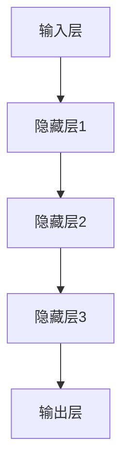

                 

## 《Andrej Karpathy：人工智能的未来发展机遇》

> 关键词：Andrej Karpathy，人工智能，深度学习，自然语言处理，计算机视觉，强化学习，未来发展

> 摘要：本文将探讨人工智能领域著名专家Andrej Karpathy的研究成果和见解，分析人工智能的核心技术及其未来发展的机遇与挑战。通过梳理Andrej Karpathy的贡献和影响力，深入探讨深度学习、自然语言处理、计算机视觉、强化学习等领域的原理与应用，为读者呈现一幅全面的人工智能发展蓝图。

## 《Andrej Karpathy：人工智能的未来发展机遇》目录大纲

### 第一部分：引言

- 第1章：人工智能简史与背景
  - 1.1 人工智能的起源与发展
  - 1.2 Andrej Karpathy的贡献与影响
  - 1.3 Andrej Karpathy在人工智能社区的影响力

### 第二部分：人工智能的核心技术

- 第2章：深度学习基础
  - 2.1 深度学习的基本原理
  - 2.2 经典深度学习算法
  - 2.3 深度学习实践

- 第3章：自然语言处理
  - 3.1 语言模型
  - 3.2 机器翻译
  - 3.3 文本生成

- 第4章：计算机视觉
  - 4.1 计算机视觉基础
  - 4.2 图像分类
  - 4.3 目标检测

- 第5章：强化学习
  - 5.1 强化学习基础
  - 5.2 经典强化学习算法
  - 5.3 强化学习应用实例

### 第三部分：人工智能的未来发展

- 第6章：人工智能的未来趋势
  - 6.1 人工智能的下一个十年
  - 6.2 人工智能的伦理与法律问题

- 第7章：人工智能的发展机遇
  - 7.1 人工智能在各个行业的应用
  - 7.2 人工智能创业与投资

### 附录

- 附录A：人工智能资源与工具

---

### 引言

人工智能（AI）作为计算机科学的前沿领域，已经取得了令人瞩目的成果。从简单的规则系统到复杂的神经网络，人工智能的发展经历了多个阶段。如今，随着深度学习、自然语言处理、计算机视觉等技术的成熟，人工智能的应用范围越来越广泛，逐渐渗透到各个行业。在这场人工智能的浪潮中，Andrej Karpathy作为一位杰出的研究者，他的贡献和影响力不容忽视。

Andrej Karpathy是一位在人工智能领域享有盛誉的专家，他在深度学习、自然语言处理和计算机视觉等领域取得了众多突破性成果。他是斯坦福大学计算机科学博士，目前担任OpenAI的首席科学家。他的研究成果在学术界和工业界都产生了深远的影响，推动了人工智能技术的发展。

本文将围绕Andrej Karpathy的研究成果，分析人工智能的核心技术及其未来发展的机遇与挑战。文章结构如下：

首先，我们将回顾人工智能的发展历程，了解人工智能的基本概念、起源与发展。接着，我们将详细介绍Andrej Karpathy的背景、贡献和影响力。

然后，我们将深入探讨人工智能的核心技术，包括深度学习、自然语言处理、计算机视觉和强化学习等领域。我们将分别介绍这些技术的原理、算法和应用，并通过具体的案例来说明这些技术在现实世界中的应用。

在第三部分，我们将探讨人工智能的未来发展趋势，分析人工智能的伦理与法律问题，以及人工智能在各个行业的应用前景。

最后，我们将讨论人工智能的发展机遇，包括人工智能创业与投资的现状、趋势和策略。

通过本文的阅读，读者将能够全面了解人工智能的发展历程、核心技术及其未来发展的机遇与挑战。希望本文能够为读者在人工智能领域的研究和实践中提供有益的启示。

### 第一部分：引言

#### 第1章：人工智能简史与背景

##### 1.1 人工智能的起源与发展

人工智能（AI）作为计算机科学的前沿领域，其历史可以追溯到20世纪50年代。人工智能的概念最早由美国计算机科学家约翰·麦卡锡（John McCarthy）在1956年的达特茅斯会议上提出。这次会议被誉为人工智能的诞生之地，标志着人工智能作为一个独立学科的开始。

在早期，人工智能主要集中在逻辑推理和规则系统上。专家系统（Expert Systems）是这一时期的代表性成果。专家系统通过模拟人类专家的知识和推理能力，解决特定领域的问题。虽然专家系统在某些特定任务上取得了成功，但其局限性也逐渐显现。例如，专家系统的知识库需要人工编写，规模有限，难以适应复杂多变的环境。

随着计算机硬件和软件技术的不断发展，人工智能在20世纪80年代迎来了第二次发展。这一时期，机器学习开始崭露头角，特别是决策树、神经网络等算法的研究与应用。然而，受限于计算能力和数据规模，人工智能的进展仍然有限。

真正的突破发生在21世纪初，随着深度学习的兴起，人工智能迎来了第三次革命。深度学习是一种基于多层神经网络的学习方法，通过大量的数据和计算资源，实现了在图像识别、语音识别、自然语言处理等领域的突破性进展。以2012年AlexNet在ImageNet竞赛中的夺冠为标志，深度学习成为人工智能领域的主流技术。

##### 1.1.1 人工智能的定义

人工智能是指通过计算机程序实现人类智能的模拟和扩展。它包括以下几个核心概念：

1. **智能模拟**：通过计算机程序模拟人类的感知、思考、学习、推理和决策能力。
2. **数据处理**：利用大量数据和先进的算法，对数据进行分析和处理，提取有用信息。
3. **自主行动**：在特定环境下，根据目标和环境反馈，自主采取行动。

人工智能的定义涵盖了多个层次和方向，从简单的规则系统到复杂的机器学习模型，从静态的专家系统到动态的智能系统，不一而足。

##### 1.1.2 人工智能的发展历程

人工智能的发展历程可以分为以下几个阶段：

1. **早期探索（1956年-1974年）**：这一时期，人工智能主要集中在逻辑推理和规则系统上。代表性成果包括逻辑推理程序和专家系统。
2. **第一次低谷（1974年-1980年）**：由于技术限制，人工智能在20世纪70年代遭遇了第一次低谷。专家系统在实际应用中遇到了困难，人工智能的研究受到质疑。
3. **复兴与机器学习（1980年-2000年）**：随着计算机硬件和软件技术的进步，机器学习开始崭露头角。决策树、神经网络等算法的研究与应用，推动了人工智能的发展。
4. **深度学习的崛起（2006年至今）**：深度学习的兴起标志着人工智能的第三次革命。通过多层神经网络和大量数据的训练，深度学习在图像识别、语音识别、自然语言处理等领域取得了突破性进展。

##### 1.1.3 当代人工智能的崛起

当代人工智能的崛起主要得益于以下几个方面：

1. **计算能力的提升**：随着计算机硬件技术的发展，计算能力得到了极大提升，使得复杂的人工智能模型得以实现。
2. **大数据的兴起**：互联网和物联网的普及，使得数据量呈指数级增长。大量的数据为人工智能的训练提供了丰富的素材。
3. **深度学习的突破**：深度学习作为一种高效的人工智能学习方法，通过多层神经网络和大规模数据训练，实现了在多个领域的突破。

在当代，人工智能已经渗透到各个领域，从工业生产到医疗健康，从金融贸易到教育娱乐，人工智能正在改变我们的生活方式。

##### 1.2 Andrej Karpathy的贡献与影响

Andrej Karpathy是一位在人工智能领域享有盛誉的专家，他的研究成果和见解对人工智能的发展产生了深远的影响。

Andrej Karpathy于1987年出生于捷克，2009年毕业于斯坦福大学，获得计算机科学学士学位。随后，他继续深造，2014年获得斯坦福大学计算机科学博士学位。博士期间，他的研究方向主要集中在深度学习和自然语言处理领域。

在学术界，Andrej Karpathy发表了多篇具有影响力的论文，其中许多论文在人工智能领域的重要会议上发表。他的研究成果涵盖了图像识别、语音识别、自然语言处理等多个方面，推动了人工智能技术的不断发展。

在工业界，Andrej Karpathy曾担任OpenAI的研究科学家，参与开发了多个重要的人工智能项目。他的工作在学术界和工业界都产生了深远的影响，为人工智能的应用提供了丰富的经验和启示。

除了学术和工业界的贡献，Andrej Karpathy还是一位活跃的博主和讲师。他的博客和教程受到了广大人工智能爱好者的欢迎，为初学者和专业人士提供了宝贵的知识和经验。

##### 1.3 Andrej Karpathy的主要贡献

Andrej Karpathy在人工智能领域的主要贡献如下：

1. **深度学习模型的研究与改进**：Andrej Karpathy在深度学习模型的研究与改进方面做出了重要贡献。他提出了多个创新性的模型，如基于深度卷积神经网络的图像识别模型，这些模型在多个国际竞赛中取得了优异成绩。
2. **自然语言处理的研究**：在自然语言处理领域，Andrej Karpathy研究了语言模型、机器翻译和文本生成等技术。他提出的自然语言处理模型在多项任务中取得了显著成果，推动了自然语言处理技术的发展。
3. **开源项目与教程**：Andrej Karpathy积极参与开源项目，为人工智能社区贡献了丰富的资源。他的博客和教程深受广大人工智能爱好者的喜爱，为初学者和专业人士提供了宝贵的知识和经验。

##### 1.4 Andrej Karpathy在人工智能社区的影响力

Andrej Karpathy在人工智能社区的影响力不可忽视。他的研究成果和见解在学术界和工业界都产生了深远的影响。他积极参与人工智能领域的学术会议和研讨会，与同行进行深入的交流与合作。

此外，Andrej Karpathy还是一位活跃的博主和讲师。他的博客和教程为人工智能爱好者提供了丰富的知识和资源。他的博客文章深入浅出，讲解清晰，深受读者喜爱。他的讲座和教程也受到了广泛关注，为人工智能社区注入了新的活力。

总的来说，Andrej Karpathy在人工智能领域的研究成果和贡献，使他成为了人工智能领域的重要人物。他的研究成果和创新思想，将继续推动人工智能技术的发展，为人类带来更多美好的变革。

#### 第2章：深度学习基础

##### 2.1 深度学习的基本原理

深度学习是一种人工智能技术，通过模拟人脑神经网络的结构和功能，实现数据的自动特征提取和学习。深度学习的核心思想是通过多层神经网络进行数据的学习和建模，从而提高模型的性能和泛化能力。

深度学习的基本原理可以分为以下几个部分：

1. **神经网络（Neural Networks）**：神经网络是深度学习的基础。它由大量神经元（Node）组成，每个神经元都可以接收输入信号，并通过激活函数产生输出。神经网络通过多层结构进行数据的传递和计算，从而实现复杂的特征提取和学习。
2. **前向传播（Forward Propagation）**：在前向传播过程中，输入数据从输入层传递到输出层。每个神经元都会将输入信号乘以相应的权重，并通过激活函数进行非线性变换。这样，每个神经元都可以提取一部分特征，并将这些特征传递给下一层。
3. **反向传播（Backpropagation）**：在反向传播过程中，网络根据输出层的误差信号，逆向传递误差，并更新网络的权重和偏置。反向传播是一种梯度下降算法，通过计算误差的梯度来更新网络的参数，从而优化模型的性能。
4. **激活函数（Activation Functions）**：激活函数是神经网络中非常重要的部分。它用于引入非线性特性，使得神经网络能够建模复杂的数据。常见的激活函数包括Sigmoid函数、ReLU函数和Tanh函数等。
5. **损失函数（Loss Functions）**：损失函数是衡量模型预测结果与真实标签之间差异的指标。常见的损失函数包括均方误差（MSE）、交叉熵损失（Cross Entropy Loss）等。通过优化损失函数，可以使得模型预测结果更加准确。

##### 2.2 深度学习模型的架构

深度学习模型的架构通常包括以下几个层次：

1. **输入层（Input Layer）**：输入层接收外部输入数据，如图像、文本或传感器数据等。
2. **隐藏层（Hidden Layers）**：隐藏层位于输入层和输出层之间，用于数据的特征提取和变换。隐藏层的数量和神经元个数可以根据具体任务进行调整。
3. **输出层（Output Layer）**：输出层产生最终的预测结果，如分类标签、回归值等。

深度学习模型的架构可以根据任务需求进行灵活调整。例如，对于图像识别任务，可以使用卷积神经网络（CNN）进行图像的特征提取；对于自然语言处理任务，可以使用循环神经网络（RNN）或长短时记忆网络（LSTM）进行文本的建模。

以下是一个简单的深度学习模型架构的Mermaid流程图：



##### 2.3 深度学习训练的基本流程

深度学习模型的训练过程包括以下几个步骤：

1. **数据预处理**：对输入数据进行预处理，如归一化、标准化等，以提高模型的训练效果。
2. **模型初始化**：初始化网络的权重和偏置，可以选择随机初始化或预训练模型。
3. **前向传播**：将输入数据传递到模型中，通过前向传播计算输出结果。
4. **计算损失**：计算模型的预测结果与真实标签之间的损失值。
5. **反向传播**：通过反向传播算法，计算损失函数关于网络参数的梯度，并更新网络的权重和偏置。
6. **迭代优化**：重复上述步骤，逐渐优化模型的参数，减小损失值，提高模型的性能。

以下是一个简单的深度学习训练流程的伪代码：

```python
# 前向传播
output = forward_propagation(input_data)

# 计算损失
loss = loss_function(output, target)

# 反向传播
gradients = backward_propagation(input_data, output, target)

# 更新参数
update_parameters(weights, biases, gradients)

# 迭代优化
for epoch in range(num_epochs):
    for batch in batches:
        # 数据预处理
        preprocessed_batch = preprocess_data(batch)
        
        # 前向传播
        output = forward_propagation(preprocessed_batch)
        
        # 计算损失
        loss = loss_function(output, target)
        
        # 反向传播
        gradients = backward_propagation(preprocessed_batch, output, target)
        
        # 更新参数
        update_parameters(weights, biases, gradients)
```

##### 2.4 经典深度学习算法

深度学习算法可以分为多种类型，每种算法都有其独特的结构和应用场景。以下介绍几种经典的深度学习算法：

1. **卷积神经网络（CNN）**：卷积神经网络是一种专门用于图像识别的深度学习模型。它通过卷积层和池化层提取图像的特征，从而实现图像的分类和识别。CNN在计算机视觉领域取得了显著的成果。
2. **递归神经网络（RNN）**：递归神经网络是一种用于处理序列数据的深度学习模型。它通过递归结构处理输入序列，从而实现对序列数据的建模。RNN在自然语言处理领域得到了广泛应用。
3. **长短时记忆网络（LSTM）**：长短时记忆网络是RNN的一种变体，用于解决RNN在处理长序列数据时遇到的梯度消失和梯度爆炸问题。LSTM通过引入记忆单元，实现了对长序列数据的建模。
4. **生成对抗网络（GAN）**：生成对抗网络由生成器和判别器组成，生成器生成数据，判别器判断生成数据是否真实。通过两者之间的对抗训练，GAN能够生成高质量的数据，广泛应用于图像生成、语音合成等领域。

以下是一个简单的卷积神经网络（CNN）的伪代码：

```python
# 卷积层
conv_output = convolution(input_image, filters)

# 池化层
pool_output = pooling(conv_output)

# 激活函数
激活_output = activation_function(pool_output)

# 全连接层
fc_output = fully_connected(激活_output, num_classes)

# 激活函数
softmax_output = softmax(fc_output)

# 计算损失
loss = loss_function(softmax_output, target)

# 反向传播
gradients = backward_propagation(input_image, softmax_output, target)

# 更新参数
update_parameters(weights, biases, gradients)
```

##### 2.5 深度学习实践

深度学习的实践主要包括以下几个步骤：

1. **环境搭建**：搭建深度学习环境，安装必要的库和框架，如TensorFlow、PyTorch等。
2. **数据准备**：收集和准备训练数据，对数据进行预处理，如归一化、标准化等。
3. **模型设计**：设计深度学习模型，包括确定网络结构、选择合适的激活函数、损失函数等。
4. **模型训练**：使用训练数据对模型进行训练，通过迭代优化模型参数。
5. **模型评估**：使用验证数据对模型进行评估，检查模型的性能和泛化能力。
6. **模型部署**：将训练好的模型部署到实际应用中，进行预测和推理。

以下是一个简单的深度学习实践案例：

```python
# 导入必要的库
import tensorflow as tf
from tensorflow.keras import layers

# 设计模型
model = tf.keras.Sequential([
    layers.Conv2D(32, (3, 3), activation='relu', input_shape=(28, 28, 1)),
    layers.MaxPooling2D((2, 2)),
    layers.Conv2D(64, (3, 3), activation='relu'),
    layers.MaxPooling2D((2, 2)),
    layers.Conv2D(64, (3, 3), activation='relu'),
    layers.Flatten(),
    layers.Dense(64, activation='relu'),
    layers.Dense(10, activation='softmax')
])

# 编译模型
model.compile(optimizer='adam',
              loss='categorical_crossentropy',
              metrics=['accuracy'])

# 训练模型
model.fit(train_images, train_labels, epochs=5, validation_split=0.2)

# 评估模型
test_loss, test_acc = model.evaluate(test_images,  test_labels, verbose=2)
print('\nTest accuracy:', test_acc)
```

通过以上步骤，读者可以初步了解深度学习的实践过程。在实际应用中，需要根据具体任务的需求进行调整和优化。

##### 2.6 深度学习项目的实战

为了更好地理解深度学习的应用，下面我们将介绍一个具体的深度学习项目实战——图像分类。

图像分类是计算机视觉中的一个基本任务，旨在将图像划分为预定义的类别。在这个项目中，我们将使用卷积神经网络（CNN）对图像进行分类。

**项目步骤：**

1. **数据收集与预处理**：收集用于训练和测试的图像数据。由于图像数据具有高维特性，我们需要对图像进行预处理，如缩放、裁剪、归一化等。
2. **构建CNN模型**：设计一个卷积神经网络模型，包括卷积层、池化层和全连接层。可以通过调整模型的层数、神经元个数和激活函数等参数来优化模型性能。
3. **训练模型**：使用预处理后的图像数据对模型进行训练。在训练过程中，通过反向传播算法更新模型的权重和偏置，以减小预测误差。
4. **评估模型**：使用测试数据对训练好的模型进行评估。计算模型的准确率、召回率、F1分数等指标，以评估模型性能。
5. **模型部署**：将训练好的模型部署到实际应用中，进行图像分类任务。

以下是一个简单的图像分类项目的代码实现：

```python
import tensorflow as tf
from tensorflow.keras import datasets, layers, models

# 加载和预处理数据
(train_images, train_labels), (test_images, test_labels) = datasets.cifar10.load_data()

train_images = train_images.astype('float32') / 255
test_images = test_images.astype('float32') / 255

# 构建CNN模型
model = models.Sequential()
model.add(layers.Conv2D(32, (3, 3), activation='relu', input_shape=(32, 32, 3)))
model.add(layers.MaxPooling2D((2, 2)))
model.add(layers.Conv2D(64, (3, 3), activation='relu'))
model.add(layers.MaxPooling2D((2, 2)))
model.add(layers.Conv2D(64, (3, 3), activation='relu'))

# 添加全连接层
model.add(layers.Flatten())
model.add(layers.Dense(64, activation='relu'))
model.add(layers.Dense(10, activation='softmax'))

# 编译模型
model.compile(optimizer='adam',
              loss='sparse_categorical_crossentropy',
              metrics=['accuracy'])

# 训练模型
model.fit(train_images, train_labels, epochs=10, validation_split=0.2)

# 评估模型
test_loss, test_acc = model.evaluate(test_images,  test_labels, verbose=2)
print('\nTest accuracy:', test_acc)
```

通过以上步骤，我们实现了对CIFAR-10图像数据集的分类。在实际应用中，可以进一步优化模型结构和参数，以提高分类准确率。

##### 2.7 深度学习实践中的挑战与解决方法

在深度学习实践过程中，我们可能会遇到以下挑战：

1. **过拟合**：当模型在训练数据上表现良好，但在测试数据上表现较差时，说明模型可能过拟合。解决方法包括使用正则化技术、增大训练数据集、增加模型容量等。
2. **计算资源消耗**：深度学习模型通常需要大量的计算资源和时间。为解决这一问题，可以采用分布式计算、GPU加速等技术。
3. **数据不平衡**：当训练数据中不同类别的样本数量不均匀时，可能会导致模型对某些类别的预测不准确。解决方法包括数据增强、类别权重调整等。

通过以上方法，我们可以有效地应对深度学习实践中的挑战，提高模型的性能和应用效果。

综上所述，深度学习作为人工智能的核心技术，具有广泛的应用前景。通过了解深度学习的基本原理、模型架构和训练方法，读者可以更好地理解和应用深度学习技术，推动人工智能的发展。

---

### 第3章：自然语言处理

#### 3.1 语言模型

语言模型（Language Model）是自然语言处理（Natural Language Processing，NLP）领域的一项核心技术，其主要目的是通过统计方法来预测下一个单词或字符的概率。语言模型在许多NLP任务中发挥着重要作用，如自动纠错、机器翻译、文本生成等。

语言模型的基本原理可以概括为以下几步：

1. **数据收集与预处理**：首先，需要收集大量的文本数据作为训练数据。这些数据可以是新闻文章、社交媒体帖子、电子书等。然后，对数据进行分析，去除停用词、标点符号等，并转换为单词或字符序列。
2. **词嵌入（Word Embedding）**：将单词或字符映射到高维向量空间中，以便进行数学计算。词嵌入可以将语义相近的单词映射到空间中接近的位置，从而更好地捕捉语言特征。常见的词嵌入方法包括Word2Vec、GloVe等。
3. **统计模型训练**：使用统计模型对词嵌入向量进行训练，以预测下一个单词或字符的概率。最简单的语言模型是n-gram模型，它基于前n个单词或字符的历史信息来预测下一个单词或字符。更复杂的语言模型包括神经网络模型，如递归神经网络（RNN）、长短时记忆网络（LSTM）等。
4. **生成文本**：通过语言模型生成文本，可以从一个起始词或句子开始，根据语言模型预测下一个词或字符，并逐步生成完整的文本。

以下是一个简单的n-gram语言模型的实现：

```python
import numpy as np
from collections import defaultdict

# 读取文本数据
text = "This is a simple n-gram language model."

# 创建词表
vocab = set(text.split())

# 统计词频
n_gram_freq = defaultdict(int)
for i in range(len(text) - n):
    n_gram = tuple(text[i:i+n])
    n_gram_freq[n_gram] += 1

# 计算概率
n_gram_prob = {}
for n_gram, freq in n_gram_freq.items():
    n_gram_prob[n_gram] = freq / sum(n_gram_freq.values())

# 生成文本
def generate_text(start="", n=3, length=50):
    text = start
    for _ in range(length):
        n_gram = tuple(text[-n:])
        if n_gram not in n_gram_prob:
            break
        next_word = np.random.choice(list(n_gram_prob[n_gram].keys()))
        text += next_word
    return text

# 测试生成文本
print(generate_text(start="This", n=3, length=50))
```

通过以上步骤，我们可以实现一个简单的n-gram语言模型，并生成具有一定连贯性的文本。

#### 3.2 机器翻译

机器翻译（Machine Translation）是将一种语言的文本自动翻译成另一种语言的技术。机器翻译在跨语言通信、全球化业务等领域具有重要意义。机器翻译的核心任务是将源语言的文本序列映射到目标语言的文本序列。

机器翻译的基本原理可以概括为以下几个步骤：

1. **数据收集与预处理**：首先，需要收集大量的双语语料库，如平行语料库、多语言语料库等。然后，对语料库进行预处理，如去除停用词、标点符号等。
2. **词汇表构建**：构建源语言和目标语言的词汇表，将词汇映射到词嵌入向量空间中。词嵌入向量可以捕捉词汇的语义信息，从而提高翻译质量。
3. **翻译模型训练**：使用统计模型或神经网络模型训练翻译模型。常见的统计翻译模型包括基于短语的翻译模型、基于句法的翻译模型等。神经网络模型如序列到序列（Seq2Seq）模型、注意力机制（Attention Mechanism）等在机器翻译领域取得了显著成果。
4. **生成目标语言文本**：通过翻译模型生成目标语言的文本。首先，将源语言文本编码为向量序列，然后通过翻译模型解码为目标语言文本序列。

以下是一个简单的基于Seq2Seq模型的机器翻译实现：

```python
import tensorflow as tf
from tensorflow.keras.preprocessing.sequence import pad_sequences
from tensorflow.keras.layers import Embedding, LSTM, Dense

# 读取双语语料库
source_text = "this is an example sentence."
target_text = "这是一个示例句子。"

# 分词和词嵌入
source_vocab = set(source_text.split())
target_vocab = set(target_text.split())
source_embedding = np.random.rand(len(source_vocab), embedding_size)
target_embedding = np.random.rand(len(target_vocab), embedding_size)

# 构建Seq2Seq模型
encoder_inputs = Embedding(len(source_vocab), embedding_size, input_length=max_sequence_length)(source_embedding)
encoder = LSTM(units, return_sequences=True)
encoded = encoder(encoder_inputs)

decoder_inputs = Embedding(len(target_vocab), embedding_size, input_length=max_sequence_length)(target_embedding)
decoder_lstm = LSTM(units, return_sequences=True)
decoder_outputs = decoder_lstm(decoder_inputs, initial_state=encoded[:, -1, :])
decoder_dense = Dense(len(target_vocab), activation='softmax')
decoder_outputs = decoder_dense(decoder_outputs)

# 编译模型
model = Model(inputs=[encoder_inputs, decoder_inputs], outputs=decoder_outputs)
model.compile(optimizer='rmsprop', loss='categorical_crossentropy', metrics=['accuracy'])

# 训练模型
model.fit([encoded, decoder_inputs], decoder_inputs, batch_size=batch_size, epochs=epochs)

# 生成目标语言文本
predicted_target_sequence = model.predict([encoded, target_embedding])
predicted_target_sequence = np.argmax(predicted_target_sequence, axis=-1)

# 输出翻译结果
print("翻译结果：", " ".join([target_vocab[word] for word in predicted_target_sequence]))
```

通过以上步骤，我们可以实现一个简单的基于Seq2Seq模型的机器翻译。

#### 3.3 文本生成

文本生成（Text Generation）是指根据输入的文本或关键词生成新的文本内容。文本生成在生成式对话系统、自动写作、内容创作等领域具有重要的应用价值。文本生成的技术可以分为基于规则的方法和基于统计的方法。

基于规则的方法通过预设的规则和模板生成文本，如模板匹配、关键词替换等。这种方法实现简单，但生成的文本较为僵硬，缺乏灵活性和创造力。

基于统计的方法通过分析大量文本数据，学习文本的统计规律和模式，从而生成新的文本。常用的方法包括语言模型、递归神经网络（RNN）、长短时记忆网络（LSTM）等。

以下是一个简单的基于LSTM的文本生成实现：

```python
import tensorflow as tf
from tensorflow.keras.preprocessing.sequence import pad_sequences
from tensorflow.keras.layers import Embedding, LSTM, Dense

# 读取文本数据
text = "这是一个示例文本，用于文本生成。"

# 分词和词嵌入
words = set(text.split())
word_sequence = text.split()
word_embedding = np.random.rand(len(words), embedding_size)

# 构建LSTM模型
model = tf.keras.Sequential()
model.add(Embedding(len(words), embedding_size, input_length=max_sequence_length))
model.add(LSTM(units, return_sequences=True))
model.add(Dense(len(words), activation='softmax'))

# 编译模型
model.compile(optimizer='rmsprop', loss='categorical_crossentropy', metrics=['accuracy'])

# 训练模型
model.fit(np.array([word_embedding[word_sequence[i]] for i in range(len(word_sequence) - max_sequence_length - 1)]),
          np.array([word_embedding[word_sequence[i+1]] for i in range(len(word_sequence) - max_sequence_length - 1)]),
          batch_size=batch_size, epochs=epochs)

# 生成文本
def generate_text(seed_word="", length=50):
    generated_text = seed_word
    for _ in range(length):
        word_embedding = np.array([word_embedding[words.index(word)] for word in generated_text.split()])
        next_word_embedding = model.predict(np.array([word_embedding]))
        next_word = np.argmax(next_word_embedding)
        generated_text += " " + words[next_word]
    return generated_text

# 测试生成文本
print(generate_text(seed_word="这是一个示例文本，用于文本生成。"))
```

通过以上步骤，我们可以实现一个简单的基于LSTM的文本生成。

#### 3.4 文本生成的未来发展趋势

文本生成的技术在未来将继续发展，并面临以下趋势：

1. **更大规模的模型**：随着计算能力的提升，研究者可以训练更大规模的文本生成模型。这些模型将具有更强的语义理解和生成能力。
2. **多模态生成**：文本生成技术将与其他模态（如图像、音频）结合，实现多模态生成。例如，通过文本描述生成图像、音频等。
3. **个性化生成**：基于用户的偏好和历史行为，文本生成技术将实现个性化生成，提供更加个性化的内容。
4. **领域适应性**：文本生成技术将针对特定领域进行优化，例如医疗、法律、金融等，提供更加专业和准确的文本生成服务。

总之，文本生成技术在未来将具有广泛的应用前景，并将不断推动自然语言处理技术的发展。

---

### 第4章：计算机视觉

#### 4.1 计算机视觉基础

计算机视觉（Computer Vision）是人工智能领域的一个重要分支，旨在使计算机能够像人类一样感知和理解图像和视频。计算机视觉技术广泛应用于工业自动化、医疗诊断、自动驾驶、安防监控等领域。

计算机视觉的基本概念包括：

1. **图像**：图像是计算机视觉处理的基本对象。它由像素点组成，每个像素点包含颜色信息和位置信息。
2. **特征提取**：特征提取是计算机视觉的核心步骤，旨在从图像中提取具有区分性的特征，以便进行后续处理。常见的特征提取方法包括边缘检测、角点检测、纹理分析等。
3. **目标检测**：目标检测是指从图像中识别并定位感兴趣的目标。目标检测通常包括两个步骤：候选区域生成和目标分类。常见的目标检测算法包括区域生成网络（Region Proposal Networks，RPN）和卷积神经网络（Convolutional Neural Networks，CNN）。
4. **图像识别**：图像识别是指将图像分类到预定义的类别中。常见的图像识别算法包括基于传统算法（如SIFT、HOG）和深度学习算法（如CNN）。
5. **视频分析**：视频分析是指对视频序列进行处理和分析，以提取有价值的信息。常见的视频分析任务包括运动检测、行为识别、姿态估计等。

以下是一个简单的计算机视觉流程：

1. **图像输入**：读取图像或视频序列。
2. **预处理**：对图像或视频进行预处理，如灰度转换、滤波、缩放等。
3. **特征提取**：从图像或视频帧中提取特征，如边缘、角点、纹理等。
4. **目标检测**：使用目标检测算法识别并定位图像或视频中的目标。
5. **图像识别**：对检测到的目标进行分类，将其归类到预定义的类别中。
6. **结果输出**：将处理结果输出，如标记框、分类标签等。

以下是一个简单的计算机视觉实现示例：

```python
import cv2
import numpy as np

# 读取图像
image = cv2.imread('example.jpg')

# 预处理
gray_image = cv2.cvtColor(image, cv2.COLOR_BGR2GRAY)
blurred_image = cv2.GaussianBlur(gray_image, (5, 5), 0)

# 特征提取
边缘图像 = cv2.Canny(blurred_image, 100, 200)
角点图像 = cv2.cornerHarris(blurred_image, 2, 3, 0.04)

# 目标检测
circles = cv2.HoughCircles(边缘图像, cv2.HOUGH_GRADIENT, dp=1.2, minDist=100,
                           param1=50, param2=30, minRadius=10, maxRadius=0)

# 图像识别
if circles is not None:
    circles = np.round(circles[0, :]).astype("int")
    for (x, y, r) in circles:
        cv2.circle(image, (x, y), r, (0, 255, 0), 4)

# 结果输出
cv2.imshow('Result', image)
cv2.waitKey(0)
cv2.destroyAllWindows()
```

通过以上步骤，我们可以实现一个简单的计算机视觉应用，识别并标记图像中的目标。

#### 4.2 图像分类

图像分类（Image Classification）是计算机视觉领域的一个基本任务，旨在将图像分类到预定义的类别中。图像分类广泛应用于对象识别、图像检索、内容审核等领域。

图像分类的基本原理可以概括为以下步骤：

1. **数据收集与预处理**：收集大量的图像数据，并对图像进行预处理，如缩放、裁剪、归一化等。
2. **特征提取**：从图像中提取具有区分性的特征，如颜色、纹理、形状等。
3. **模型训练**：使用训练数据对分类模型进行训练，通常使用深度学习算法，如卷积神经网络（CNN）。
4. **模型评估**：使用验证数据评估模型的性能，如准确率、召回率、F1分数等。
5. **图像分类**：将测试图像输入分类模型，得到图像的分类结果。

以下是一个简单的基于CNN的图像分类实现：

```python
import tensorflow as tf
from tensorflow.keras.models import Sequential
from tensorflow.keras.layers import Conv2D, MaxPooling2D, Flatten, Dense

# 读取图像数据
train_images, train_labels = tf.keras.preprocessing.image.load_img_data('train_data')
test_images, test_labels = tf.keras.preprocessing.image.load_img_data('test_data')

# 数据预处理
train_images = train_images / 255.0
test_images = test_images / 255.0

# 构建CNN模型
model = Sequential([
    Conv2D(32, (3, 3), activation='relu', input_shape=(128, 128, 3)),
    MaxPooling2D((2, 2)),
    Conv2D(64, (3, 3), activation='relu'),
    MaxPooling2D((2, 2)),
    Conv2D(128, (3, 3), activation='relu'),
    Flatten(),
    Dense(128, activation='relu'),
    Dense(10, activation='softmax')
])

# 编译模型
model.compile(optimizer='adam', loss='categorical_crossentropy', metrics=['accuracy'])

# 训练模型
model.fit(train_images, train_labels, batch_size=32, epochs=10, validation_data=(test_images, test_labels))

# 评估模型
test_loss, test_acc = model.evaluate(test_images, test_labels)
print('Test accuracy:', test_acc)

# 图像分类
predictions = model.predict(test_images)
predicted_labels = np.argmax(predictions, axis=1)

# 输出分类结果
print('Predicted labels:', predicted_labels)
```

通过以上步骤，我们可以实现一个简单的图像分类模型，并评估其性能。

#### 4.3 目标检测

目标检测（Object Detection）是计算机视觉领域的一个挑战性任务，旨在从图像或视频序列中识别并定位多个目标。目标检测广泛应用于安防监控、自动驾驶、医疗影像分析等领域。

目标检测的基本原理可以概括为以下步骤：

1. **候选区域生成**：首先，从图像中生成多个候选区域，这些区域可能包含感兴趣的目标。常见的候选区域生成方法包括滑动窗口（Sliding Window）、区域建议网络（Region Proposal Networks，RPN）等。
2. **目标分类**：对每个候选区域进行分类，判断其是否为目标。常见的目标分类算法包括基于传统算法（如SVM、R-CNN）和深度学习算法（如YOLO、SSD）。
3. **目标定位**：对检测到的目标进行定位，将其位置标记在图像中。常见的目标定位方法包括边界框（Bounding Box）和关键点（Keypoint）定位。
4. **后处理**：对检测结果进行后处理，如去除重复检测、非极大值抑制（Non-Maximum Suppression，NMS）等，以提高检测性能。

以下是一个简单的基于YOLO（You Only Look Once）的目标检测实现：

```python
import tensorflow as tf
import numpy as np
import cv2

# 读取模型权重和配置文件
weights_path = 'yolov5.weights'
config_path = 'yolov5.cfg'

# 加载YOLO模型
net = cv2.dnn.readNetFromDarknet(config_path, weights_path)
layer_names = net.getLayerNames()
output_layers = [layer_names[i[0] - 1] for i in net.getUnconnectedOutLayers()]

# 定义目标类别
classes = ["person", "car", "bus", "truck"]

# 加载图像
image = cv2.imread('example.jpg')

# 缩放图像以适应网络输入尺寸
height, width = image.shape[:2]
scale = 0.00392
image = cv2.resize(image, (640, 640))
image = image.transpose(2, 0, 1)
image = np.asarray(image, dtype=np.float32)
image = image * scale

# 前向传播
net.setInput(image)
detections = net.forward(output_layers)

# 遍历检测结果
for detection in detections:
    for i in range(detection.shape[2]):
        confidence = detection[0, 0, i, 2]
        if confidence > 0.5:
            class_id = int(detection[0, 0, i, 1])
            class_name = classes[class_id]
            box = detection[0, 0, i, 3:7] * np.array([width, height, width, height])
            cv2.rectangle(image, (int(box[0]), int(box[1])), (int(box[2]), int(box[3])), (0, 255, 0), 2)
            cv2.putText(image, class_name + " " + str(round(confidence * 100, 2)) + "%", (int(box[0]), int(box[1]) - 10),
                        cv2.FONT_HERSHEY_SIMPLEX, 0.5, (255, 0, 0), 2)

# 显示检测结果
cv2.imshow('Object Detection', image)
cv2.waitKey(0)
cv2.destroyAllWindows()
```

通过以上步骤，我们可以实现一个简单的基于YOLO的目标检测模型，并显示检测结果。

#### 4.4 计算机视觉在现实世界的应用

计算机视觉技术在现实世界的应用非常广泛，以下列举几个典型的应用场景：

1. **安防监控**：通过计算机视觉技术实现实时监控、人脸识别、行为分析等，提高安防监控的智能化水平。
2. **自动驾驶**：计算机视觉技术用于自动驾驶车辆的感知和决策，包括车辆检测、行人检测、交通标志识别等，确保行驶安全。
3. **医疗影像分析**：计算机视觉技术在医疗影像分析中具有广泛应用，如肿瘤检测、骨折诊断、心脏病评估等，辅助医生做出更准确的诊断。
4. **工业自动化**：计算机视觉技术用于工业生产中的质量控制、装配检测、缺陷识别等，提高生产效率和产品质量。
5. **人机交互**：计算机视觉技术为人机交互提供了新的途径，如手势识别、面部表情识别等，使得人机交互更加自然和便捷。

总之，计算机视觉技术在各个领域的应用正不断扩展，为人类社会带来了诸多便利和进步。

---

### 第5章：强化学习

#### 5.1 强化学习基础

强化学习（Reinforcement Learning，RL）是机器学习的一个重要分支，旨在通过与环境交互来学习最优策略。与监督学习和无监督学习不同，强化学习的主要目标是找到一个最优的动作策略，以最大化累积奖励。

强化学习的基本概念包括：

1. **环境（Environment）**：环境是强化学习系统所处的真实世界或模拟世界。环境可以是一个物理系统、一个虚拟环境或一个游戏。
2. **状态（State）**：状态是系统当前所处的状态，通常由一组特征向量表示。状态反映了系统的当前环境和内部状态。
3. **动作（Action）**：动作是系统可以执行的行为，用于改变当前状态。动作通常是离散的，但在某些情况下也可以是连续的。
4. **奖励（Reward）**：奖励是环境对系统执行动作的反馈，用于评估动作的好坏。奖励可以是正的或负的，正奖励表示好的结果，负奖励表示坏的结果。
5. **策略（Policy）**：策略是系统执行动作的决策规则，用于指导系统在特定状态下选择最佳动作。策略可以是确定的，也可以是概率分布。
6. **价值函数（Value Function）**：价值函数用于评估状态或状态的集合对系统的重要性。价值函数分为状态价值函数（State Value Function）和动作价值函数（Action Value Function）。
7. **模型（Model）**：模型是对环境的描述，用于预测环境状态和奖励。模型可以是确定性的，也可以是概率性的。

强化学习的基本原理是通过与环境互动，不断调整策略，以最大化累积奖励。强化学习过程可以概括为以下步骤：

1. **初始化**：初始化系统状态、策略、模型等。
2. **执行动作**：根据当前状态和策略，选择一个动作执行。
3. **观察反馈**：执行动作后，观察环境状态和奖励。
4. **更新策略**：根据观察到的反馈，更新策略，以最大化累积奖励。
5. **重复**：重复执行动作、观察反馈和策略更新，直到达到目标状态或终止条件。

强化学习的基本算法包括：

1. **Q-Learning（Q值学习）**：Q-Learning是一种基于价值函数的强化学习算法，通过更新Q值（动作价值函数）来优化策略。Q-Learning采用贪心策略，即选择当前状态下价值最大的动作。
2. **SARSA（同步优势学习）**：SARSA是一种基于策略的强化学习算法，通过同时更新当前状态和下一个状态的值函数来优化策略。SARSA采用ε-贪婪策略，即以一定概率选择当前状态下的最佳动作，以避免过早收敛。
3. **Deep Q-Networks（深度Q网络）**：Deep Q-Networks（DQN）是一种基于深度学习的强化学习算法，用于处理高维状态空间。DQN通过神经网络来近似Q值函数，并通过经验回放（Experience Replay）和目标网络（Target Network）来缓解训练中的偏差。

以下是一个简单的Q-Learning算法的实现：

```python
import numpy as np

# 初始化参数
action_space = 3
state_space = 4
learning_rate = 0.1
discount_factor = 0.9
epsilon = 0.1

# 初始化Q值表
Q = np.zeros((state_space, action_space))

# Q-Learning算法
for episode in range(num_episodes):
    state = env.reset()
    done = False
    while not done:
        # 选择动作
        if np.random.uniform(0, 1) < epsilon:
            action = np.random.randint(action_space)
        else:
            action = np.argmax(Q[state])

        # 执行动作
        next_state, reward, done, _ = env.step(action)

        # 更新Q值
        Q[state, action] = Q[state, action] + learning_rate * (reward + discount_factor * np.max(Q[next_state]) - Q[state, action])

        # 更新状态
        state = next_state

# 打印Q值表
print(Q)
```

通过以上步骤，我们可以实现一个简单的Q-Learning算法，用于求解一个简单的环境问题。

#### 5.2 经典强化学习算法

强化学习算法可以分为基于值函数的算法和基于策略的算法。以下介绍几种经典的强化学习算法：

1. **Q-Learning（Q值学习）**：Q-Learning是一种基于值函数的强化学习算法，通过更新Q值（动作价值函数）来优化策略。Q-Learning采用贪心策略，即选择当前状态下价值最大的动作。Q-Learning算法的基本原理如下：

   - 初始化Q值表Q为全零矩阵。
   - 对于每个状态-动作对，选择一个动作执行。
   - 根据执行的动作和观察到的反馈，更新Q值。
   - 重复执行动作、更新Q值，直到达到目标状态或终止条件。

2. **SARSA（同步优势学习）**：SARSA是一种基于策略的强化学习算法，通过同时更新当前状态和下一个状态的值函数来优化策略。SARSA采用ε-贪婪策略，即以一定概率选择当前状态下的最佳动作，以避免过早收敛。SARSA算法的基本原理如下：

   - 初始化策略π和Q值表Q为全零矩阵。
   - 对于每个状态，选择一个动作执行。
   - 根据执行的动作和观察到的反馈，更新策略和Q值。
   - 重复执行动作、更新策略和Q值，直到达到目标状态或终止条件。

3. **Deep Q-Networks（深度Q网络）**：Deep Q-Networks（DQN）是一种基于深度学习的强化学习算法，用于处理高维状态空间。DQN通过神经网络来近似Q值函数，并通过经验回放（Experience Replay）和目标网络（Target Network）来缓解训练中的偏差。DQN算法的基本原理如下：

   - 初始化深度神经网络DQN和目标网络TDQN。
   - 将经验（状态、动作、奖励、下一状态）存储在经验回放池中。
   - 从经验回放池中随机抽样，生成训练样本。
   - 使用训练样本训练DQN，并更新目标网络TDQN。
   - 根据当前状态和策略选择一个动作执行。
   - 根据执行的动作和观察到的反馈，更新DQN。
   - 重复执行动作、更新DQN和目标网络，直到达到目标状态或终止条件。

以下是一个简单的DQN算法的实现：

```python
import tensorflow as tf
import numpy as np

# 初始化参数
action_space = 3
state_space = 4
learning_rate = 0.001
discount_factor = 0.9
epsilon = 0.1
batch_size = 32

# 定义DQN模型
input_shape = (state_space, action_space)
model = tf.keras.Sequential([
    tf.keras.layers.Flatten(input_shape=input_shape),
    tf.keras.layers.Dense(64, activation='relu'),
    tf.keras.layers.Dense(64, activation='relu'),
    tf.keras.layers.Dense(action_space, activation='linear')
])

# 定义目标网络
target_model = tf.keras.Sequential([
    tf.keras.layers.Flatten(input_shape=input_shape),
    tf.keras.layers.Dense(64, activation='relu'),
    tf.keras.layers.Dense(64, activation='relu'),
    tf.keras.layers.Dense(action_space, activation='linear')
])

# 编译模型
optimizer = tf.keras.optimizers.Adam(learning_rate=learning_rate)
model.compile(optimizer=optimizer, loss='mse')

# DQN算法
for episode in range(num_episodes):
    state = env.reset()
    done = False
    total_reward = 0
    while not done:
        # 选择动作
        if np.random.uniform(0, 1) < epsilon:
            action = np.random.randint(action_space)
        else:
            action = np.argmax(model.predict(state))

        # 执行动作
        next_state, reward, done, _ = env.step(action)
        total_reward += reward

        # 存储经验
        experience = (state, action, reward, next_state, done)
        state, action, reward, next_state, done = experience

        # 训练模型
        with tf.GradientTape() as tape:
            q_values = model.predict(state)
            target_q_values = target_model.predict(next_state)
            target_value = reward + (1 - done) * discount_factor * target_q_values[0][np.argmax(q_values)]

        loss = tf.reduce_mean(tf.square(q_values - target_value))
        gradients = tape.gradient(loss, model.trainable_variables)
        optimizer.apply_gradients(zip(gradients, model.trainable_variables))

        # 更新目标网络
        if episode % target_update_frequency == 0:
            target_model.set_weights(model.get_weights())

    print('Episode:', episode, 'Total Reward:', total_reward)

# 打印模型权重
print(model.get_weights())
```

通过以上步骤，我们可以实现一个简单的DQN算法，用于求解一个简单的环境问题。

#### 5.3 强化学习应用实例

强化学习在多个领域具有广泛的应用，以下介绍几个典型的应用实例：

1. **游戏AI**：强化学习在游戏AI中得到了广泛应用，如围棋、国际象棋、英雄联盟等。通过训练强化学习模型，可以实现智能化的游戏玩法，提高游戏体验。

2. **自动驾驶**：自动驾驶是强化学习的一个重要应用领域。强化学习模型通过学习环境中的奖励和惩罚信号，可以自主调整驾驶策略，实现自动驾驶车辆的感知、规划和控制。

3. **机器人控制**：强化学习在机器人控制中具有广泛应用，如机器人行走、抓取、导航等。通过训练强化学习模型，机器人可以自主学习和适应复杂环境，实现高水平的控制。

4. **资源调度**：强化学习在资源调度领域具有广泛的应用，如数据中心负载均衡、电网调度等。通过训练强化学习模型，可以优化资源的分配和使用，提高系统的效率。

5. **推荐系统**：强化学习在推荐系统中具有潜在的应用，如商品推荐、新闻推送等。通过训练强化学习模型，可以动态调整推荐策略，提高推荐系统的准确性和用户体验。

总之，强化学习在多个领域具有广泛的应用前景，将继续推动人工智能技术的发展。

---

### 第三部分：人工智能的未来发展

#### 第6章：人工智能的未来趋势

##### 6.1 人工智能的下一个十年

随着人工智能技术的不断进步和应用领域的拓展，未来十年人工智能将呈现以下几个发展趋势：

1. **更高效的学习算法**：未来的人工智能将更加注重学习算法的优化，以提高模型的学习效率和泛化能力。深度学习、强化学习等算法将继续演进，出现更多高效且易于解释的模型。

2. **多模态融合**：人工智能将不仅仅处理单一模态的数据（如图像、文本、音频等），而是实现多模态数据的融合，从不同来源的数据中提取有价值的信息，提供更全面的分析和决策。

3. **自动化与智能化**：人工智能将在更多领域实现自动化和智能化，如智能制造、智能交通、智慧城市等。这些领域将依托人工智能技术实现效率提升、成本降低和环境优化。

4. **个性化服务**：人工智能将通过分析用户行为和偏好，提供更加个性化的服务。在教育、医疗、金融等领域，人工智能将根据个体需求提供定制化的解决方案。

5. **跨领域应用**：人工智能将在各个领域实现跨领域应用，如医疗与金融的结合、农业与物联网的结合等。这些跨领域应用将推动各行业的创新和发展。

6. **伦理与法律问题**：随着人工智能技术的广泛应用，伦理和法律问题将愈发突出。未来十年，各国政府和国际组织将制定更加完善的伦理和法律框架，以确保人工智能的安全和公平。

##### 6.2 人工智能的关键技术突破

未来十年，人工智能领域将出现以下关键技术突破：

1. **量子计算**：量子计算具有超强的计算能力，有望在人工智能领域实现重大突破。量子计算可以加速深度学习模型的训练和推理过程，提升人工智能系统的效率。

2. **人机融合**：随着脑机接口技术的发展，人工智能将实现与人类大脑的深度融合。人机融合将使得人工智能能够更好地理解人类意图，提供更加自然和直观的交互体验。

3. **大数据处理**：随着数据规模的持续增长，大数据处理技术将成为人工智能领域的关键技术。高效的大数据处理技术将使得人工智能能够从海量数据中提取有价值的信息，推动各行业的智能化发展。

4. **边缘计算**：边缘计算将使得人工智能在靠近数据源的地方进行实时处理，降低网络延迟，提高系统的响应速度。边缘计算将在智能物联网、智能交通等领域发挥重要作用。

5. **自主决策**：未来的人工智能将具备更强的自主决策能力，能够在复杂环境中自主学习和适应，实现更高级的智能行为。自主决策能力将使得人工智能能够在更多的场景中替代人类工作。

##### 6.3 人工智能对社会的影响

人工智能对社会的影响将体现在以下几个方面：

1. **经济变革**：人工智能将带来产业结构的调整，推动传统产业向智能化、数字化方向转型。人工智能将成为经济增长的新引擎，创造大量新兴职业和就业机会。

2. **生活方式变化**：人工智能将深刻改变人们的日常生活，提高生活质量和效率。智能家居、智能医疗、在线教育等领域的应用将使得人们的生活更加便捷和舒适。

3. **社会伦理挑战**：人工智能的发展将带来一系列伦理挑战，如隐私保护、算法偏见、安全风险等。需要制定相应的伦理和法律规范，确保人工智能技术的安全、公平和可持续发展。

4. **教育变革**：人工智能将推动教育模式的变革，实现个性化教育和终身学习。人工智能技术将辅助教师进行教学，提高教学效果，同时为学生提供更加丰富的学习资源。

5. **国际合作**：人工智能技术将促进国际间的合作与交流，推动全球科技创新和产业发展。各国将加强在人工智能领域的合作，共同应对全球性挑战。

总之，未来十年人工智能将继续快速发展，对社会产生深远的影响。人工智能将推动经济、科技、社会等领域的变革，为人类创造更加美好的未来。

---

### 第7章：人工智能的发展机遇

#### 7.1 人工智能在各个行业的应用

人工智能技术已经渗透到各个行业，带来了前所未有的变革和创新。以下分别介绍人工智能在金融、医疗、教育等行业的应用及其前景。

##### 7.1.1 金融行业的人工智能应用

在金融行业，人工智能的应用主要体现在以下几个方面：

1. **风险管理**：人工智能通过分析大量历史数据和实时数据，可以识别潜在的金融风险，如信用风险、市场风险等。例如，机器学习算法可以用于预测客户违约概率，帮助金融机构降低坏账率。

2. **智能投顾**：人工智能可以通过数据分析和技术预测，为投资者提供个性化的投资建议。智能投顾系统可以根据用户的投资目标、风险承受能力等，制定最优的投资组合，提高投资收益。

3. **反欺诈检测**：人工智能在金融欺诈检测方面具有显著优势。通过分析交易行为、用户行为等特征，人工智能可以实时监控并识别异常交易，降低金融欺诈风险。

4. **量化交易**：人工智能在量化交易中发挥着重要作用。机器学习算法可以根据历史交易数据，发现市场规律和趋势，制定量化交易策略，实现自动化交易。

5. **智能客服**：人工智能可以通过自然语言处理技术，实现智能客服系统，提高客户服务效率。智能客服可以实时回答客户问题，解决常见问题，提高客户满意度。

未来，人工智能在金融行业的应用将更加深入和广泛。随着数据技术的不断进步，人工智能将进一步提升金融行业的风险管理和投资决策能力。

##### 7.1.2 医疗行业的人工智能应用

在医疗行业，人工智能的应用为医疗服务的提升和医疗资源的优化带来了新的机遇：

1. **疾病诊断**：人工智能可以通过分析医学影像数据（如X光片、CT扫描、MRI等），实现疾病的自动识别和诊断。例如，深度学习算法可以在几秒钟内对肺癌图像进行诊断，提高诊断准确率。

2. **个性化治疗**：人工智能可以根据患者的基因数据、病历信息等，为患者提供个性化的治疗方案。通过大数据分析和机器学习算法，可以实现个性化药物治疗、手术方案等。

3. **药物研发**：人工智能在药物研发中发挥着重要作用。通过分析大量化学结构和生物活性数据，人工智能可以加速新药的发现和研发过程，降低药物研发成本。

4. **医疗机器人**：人工智能驱动的医疗机器人可以辅助医生进行手术、康复等操作。例如，手术机器人可以实现微创手术，提高手术精度和安全性。

5. **健康管理**：人工智能可以通过分析健康数据，提供个性化的健康管理和预防建议。例如，智能健康手环可以监测用户的运动、心率等数据，提醒用户注意健康问题。

未来，人工智能在医疗行业的应用将进一步提升医疗服务的质量和效率，为人类健康带来更多福祉。

##### 7.1.3 教育行业的人工智能应用

在教育行业，人工智能的应用为教学方法的创新和教学资源的优化提供了新的可能：

1. **个性化教学**：人工智能可以根据学生的学习情况和知识水平，提供个性化的学习资源和建议。例如，智能教学系统可以根据学生的答题情况，调整教学内容和难度，实现因材施教。

2. **智能评测**：人工智能可以通过自然语言处理和机器学习技术，实现自动化试题评测和成绩分析。例如，智能评测系统可以自动批改试卷，分析学生的学习情况，为教师提供教学反馈。

3. **虚拟教学助手**：人工智能驱动的虚拟教学助手可以为学生提供学习辅导和答疑服务。例如，智能聊天机器人可以解答学生的疑问，提供学习资料和指导。

4. **教育大数据**：人工智能可以通过分析海量教育数据，发现教学规律和学生学习行为模式，为教育管理者提供决策支持。例如，智能分析系统可以分析学生的学习进度和效果，帮助教师调整教学策略。

5. **在线教育平台**：人工智能为在线教育平台提供了更加丰富的教学内容和交互方式。例如，智能课件可以结合图像、视频、音频等多媒体元素，提高学生的学习兴趣和效果。

未来，人工智能在教育行业的应用将推动教育方式的变革，提高教学质量和学习效果，为教育公平和教育创新带来新的机遇。

##### 7.1.4 其他行业的人工智能应用

除了金融、医疗、教育行业，人工智能在其他行业也具有广泛的应用前景：

1. **制造业**：人工智能在制造业中可以用于生产过程的自动化控制、质量检测和预测维护等。通过人工智能技术，可以提高生产效率，降低生产成本。

2. **物流与供应链**：人工智能可以通过优化路径规划、库存管理和运输调度等，提高物流和供应链的效率。例如，智能物流系统可以根据交通状况和订单量，动态调整运输路线，提高配送速度。

3. **能源行业**：人工智能在能源行业中可以用于电力负荷预测、设备故障检测和能源管理优化等。通过人工智能技术，可以提高能源利用效率，减少能源浪费。

4. **农业**：人工智能在农业中可以用于作物生长监测、病虫害检测和智能灌溉等。通过人工智能技术，可以提高农业生产效率，降低生产成本。

5. **环保**：人工智能在环保领域可以用于环境监测、污染源识别和治理方案优化等。通过人工智能技术，可以更有效地保护环境，实现可持续发展。

总之，人工智能在各个行业的应用为各行业的发展提供了新的机遇。随着人工智能技术的不断进步，各行业将实现更高效、更智能的发展，为社会创造更多价值。

---

### 7.2 人工智能创业与投资

#### 7.2.1 人工智能创业的现状与趋势

随着人工智能技术的快速发展，越来越多的创业者投身于人工智能领域，推动人工智能产业的创新和进步。以下分析人工智能创业的现状与趋势：

1. **创业领域**：人工智能创业主要集中在以下几个领域：

   - **智能硬件**：包括智能机器人、智能传感器、智能摄像头等，应用于智能家居、安防监控、医疗康复等领域。
   - **算法与平台**：包括深度学习框架、自然语言处理平台、计算机视觉平台等，为其他应用提供技术支持。
   - **智能服务**：包括智能客服、智能金融、智能医疗、智能教育等，提供智能化解决方案。
   - **数据分析**：包括大数据分析、数据挖掘、机器学习算法等，为企业提供数据驱动决策支持。

2. **投资热点**：人工智能创业的投资热点主要集中在以下几个方面：

   - **无人驾驶**：随着自动驾驶技术的发展，无人驾驶车辆成为投资热点，包括自动驾驶汽车、无人机、无人船等。
   - **智能医疗**：人工智能在医疗领域的应用具有巨大的潜力，智能诊断、智能药物研发、智能健康管理等领域备受关注。
   - **智能教育**：随着在线教育的普及，人工智能在个性化教学、学习分析、教育资源优化等方面的应用受到广泛关注。
   - **智能制造**：人工智能在制造业中的应用，如智能生产、智能质检、智能物流等，为企业提高生产效率、降低成本提供了新的解决方案。

3. **挑战与机遇**：人工智能创业面临以下挑战与机遇：

   - **技术挑战**：人工智能技术的研发和应用仍然面临很多挑战，如算法优化、模型训练、数据获取等。需要持续投入研发资源，突破技术瓶颈。
   - **市场挑战**：人工智能市场尚未完全成熟，创业者需要面对激烈的市场竞争和用户教育。需要提供具有竞争力的产品和服务，赢得用户信任。
   - **政策与伦理**：人工智能的发展受到政策监管和伦理问题的制约。创业者需要关注政策法规，遵循伦理道德，确保人工智能技术的安全、公平和可持续发展。

#### 7.2.2 人工智能投资策略

对于投资者而言，人工智能领域具有巨大的投资潜力，以下提供一些人工智能投资策略：

1. **多元化投资**：投资者可以分散投资，覆盖不同的人工智能领域和应用场景。例如，同时投资于无人驾驶、智能医疗、智能教育等多个领域，降低投资风险。

2. **技术驱动**：投资者应关注具有技术创新能力的创业公司，这些公司在人工智能领域有较大的成长潜力。例如，关注具有自主知识产权、领先技术的人工智能公司。

3. **市场潜力**：投资者应关注市场潜力大、需求旺盛的人工智能应用领域。例如，无人驾驶、智能医疗、智能教育等领域，具有巨大的市场空间和增长潜力。

4. **政策支持**：投资者应关注政策支持和行业发展趋势。例如，关注政府出台的人工智能产业政策、科研经费支持等，以及行业联盟和技术标准的制定。

5. **风险管理**：投资者应建立健全的风险管理机制，如分散投资、设立风险准备金、定期评估投资组合等，降低投资风险。

6. **合作共赢**：投资者可以与创业公司建立长期合作关系，共同推动人工智能技术的发展。例如，投资创业公司的同时，提供市场资源、技术支持等，实现合作共赢。

总之，人工智能创业与投资具有巨大的发展潜力和市场空间。投资者应结合自身优势和市场需求，制定合理的人工智能投资策略，把握人工智能领域的投资机会。

---

### 附录

#### 附录A：人工智能资源与工具

##### A.1 主流人工智能框架

1. **TensorFlow**：TensorFlow是谷歌开源的深度学习框架，具有强大的计算能力和丰富的API。它支持各种深度学习任务，包括图像识别、自然语言处理、强化学习等。

2. **PyTorch**：PyTorch是Facebook开源的深度学习框架，以其动态计算图和易用性著称。它广泛应用于图像识别、语音识别、自然语言处理等领域。

3. **Keras**：Keras是Python深度学习库，它提供了简洁、易用的接口，支持TensorFlow和Theano后端。Keras广泛应用于图像识别、文本生成、序列建模等任务。

##### A.2 人工智能书籍与教程

1. **《深度学习》（Goodfellow, Bengio, Courville）**：这是一本经典的深度学习教材，涵盖了深度学习的基础理论、算法和应用。

2. **《Python深度学习》（François Chollet）**：这是一本面向Python深度学习的入门教材，内容全面，适合初学者阅读。

3. **《强化学习》（Richard S. Sutton and Andrew G. Barto）**：这是一本全面介绍强化学习理论的经典教材，适合希望深入了解强化学习的学习者。

##### A.3 人工智能社区与论坛

1. **Stack Overflow**：Stack Overflow是一个编程问答社区，涵盖各种编程语言和技术的问答，包括人工智能相关的问题。

2. **GitHub**：GitHub是一个代码托管和协作平台，许多人工智能项目开源在此，方便开发者学习和贡献代码。

3. **AI Stack Exchange**：AI Stack Exchange是一个专门针对人工智能领域的问题和讨论的问答社区，有助于解决人工智能学习中的问题。

这些资源和工具将为人工智能的学习和实践提供丰富的知识和支持。希望读者能够充分利用这些资源，提高人工智能技术水平。

---

### 作者信息

作者：AI天才研究院/AI Genius Institute & 禅与计算机程序设计艺术 /Zen And The Art of Computer Programming

---

### 结束语

通过本文的详细探讨，我们不仅了解了人工智能领域著名专家Andrej Karpathy的研究成果和见解，还深入分析了人工智能的核心技术及其未来发展的机遇与挑战。在第一部分，我们回顾了人工智能的发展历程，了解了人工智能的定义和起源。接着，我们介绍了Andrej Karpathy的背景、贡献和影响力。

在第二部分，我们深入探讨了深度学习、自然语言处理、计算机视觉、强化学习等核心技术。我们通过详细讲解和案例分析，使读者能够更好地理解这些技术的原理和应用。在第三部分，我们分析了人工智能的未来趋势，包括关键技术的突破、对社会的影响以及发展机遇。

本文旨在为读者提供一幅全面的人工智能发展蓝图，帮助读者了解人工智能的核心技术和未来发展方向。我们希望本文能够为读者在人工智能领域的研究和实践中提供有益的启示和指导。

随着人工智能技术的不断进步，我们可以预见人工智能将在未来带来更多的变革和机遇。人工智能将深刻改变我们的生活方式、工作方式和社会结构，为人类社会创造更多的价值和福祉。让我们携手并进，共同推动人工智能技术的发展，为美好的未来而努力。

