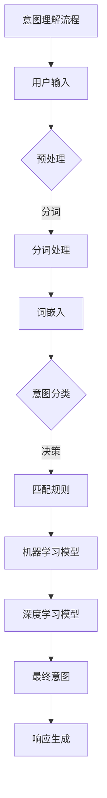

                 

# CUI的意图理解技术详细解析与应用

> **关键词：** CUI、意图理解、对话系统、机器学习、深度学习、应用实例

> **摘要：** 本文章将详细解析CUI（Conversational User Interface，对话式用户界面）的意图理解技术，从基础概念、架构、算法原理，到实际应用实例，为读者提供全面的指导。文章旨在帮助读者深入理解意图理解技术在CUI中的应用，以及如何在实际项目中实现和优化。

## 第一部分: CUI的意图理解技术基础

### 第1章: CUI意图理解技术概述

#### 第1.1节 CUI与意图理解简介

**CUI定义**: CUI（Conversational User Interface，对话式用户界面）是指用户通过自然语言与计算机系统进行交互的界面。CUI的核心在于模拟人类的对话过程，使用户能够以自然、流畅的方式与系统进行沟通。

**CUI的重要性**: 随着人工智能技术的不断发展，CUI已经成为提升用户体验、提高系统智能化水平的重要途径。通过CUI，用户可以更加便捷地获取信息、完成操作，同时系统也可以更好地理解用户需求，提供个性化的服务。

**意图理解背景**: 意图理解是CUI技术的核心组成部分，它是指系统对用户输入的自然语言进行解析，理解用户的真实意图。意图理解技术的发展经历了从基于规则的系统到基于机器学习、深度学习的演变，目前已经成为人工智能领域的重要研究方向。

### 第1.2节 CUI意图理解架构

**整体架构**: CUI意图理解通常包括以下几个主要模块：

1. **自然语言处理（NLP）模块**：对用户输入的文本进行预处理，如分词、词性标注、句法分析等。
2. **意图分类模块**：根据预处理后的文本，使用机器学习或深度学习算法对用户的意图进行分类。
3. **上下文理解模块**：在对话过程中，系统需要理解用户的上下文信息，如对话历史、用户偏好等。
4. **响应生成模块**：根据用户意图和上下文信息，系统生成合适的响应。

**意图分类方法**:

1. **基于规则的系统**：通过预定义的规则库，对用户输入进行匹配，确定用户意图。
2. **机器学习方法**：利用统计学习算法，如决策树、随机森林、支持向量机（SVM）等，对用户输入进行分类。
3. **深度学习方法**：使用神经网络，如循环神经网络（RNN）、长短时记忆网络（LSTM）、BERT等，对用户输入进行建模和分析。

### 第1.3节 主流意图理解技术

**规则引擎**：规则引擎是一种基于规则的自动化流程管理工具，通过定义一系列规则，实现对用户输入的匹配和意图分类。规则引擎的优点是实现简单、效率高，但缺点是扩展性差、适应性低。

**机器学习算法**：机器学习算法通过对大量训练数据的分析和学习，自动提取特征，实现对用户输入的意图分类。常见的机器学习算法包括决策树、随机森林、支持向量机（SVM）等。这些算法的优点是适应性强、扩展性好，但缺点是训练过程复杂、对数据依赖性强。

**深度学习技术**：深度学习技术通过构建大规模神经网络，对用户输入进行建模和分析，实现对用户意图的准确理解。常见的深度学习技术包括循环神经网络（RNN）、长短时记忆网络（LSTM）、BERT等。这些技术的优点是能够处理复杂的特征和模式，但缺点是实现难度大、计算资源需求高。

### 第1.4节 意图理解中的挑战

**多义性问题**：多义性是指用户输入可能存在多种解释，如同一句话可以表达多个意图。解决多义性问题的关键是提高系统的上下文理解能力，通过对话历史和用户偏好等信息，确定用户输入的最可能意图。

**上下文理解**：上下文理解是意图理解的重要环节，它是指系统在对话过程中，能够根据对话历史、用户偏好等信息，对用户输入进行准确理解。上下文理解的难点在于如何有效地融合多种信息源，提高系统的整体理解能力。

### 第2章: CUI意图理解技术原理

#### 第2.1节 对话系统基础知识

**对话系统架构**：对话系统通常包括以下几个主要组成部分：

1. **对话管理模块**：负责对话状态的跟踪和维护，包括对话历史、用户偏好等信息。
2. **自然语言理解模块**：负责对用户输入的自然语言进行处理和分析，提取关键信息。
3. **意图分类模块**：根据用户输入的文本和上下文信息，使用机器学习或深度学习算法对用户的意图进行分类。
4. **响应生成模块**：根据用户意图和上下文信息，生成合适的响应。

**对话管理**：对话管理是指系统在对话过程中，如何根据对话历史和用户偏好等信息，对用户输入进行理解和响应。对话管理的关键在于如何有效地维护对话状态，并实时调整对话策略。

#### 第2.2节 意图分类算法原理

**规则方法**：规则方法是指通过预定义的规则库，对用户输入进行匹配和分类。规则方法的优点是实现简单、效率高，但缺点是扩展性差、适应性低。

**机器学习方法**：机器学习方法是指通过训练大量的样本数据，让模型自动学习和提取特征，实现对用户输入的意图分类。常见的机器学习方法包括决策树、随机森林、支持向量机（SVM）等。

**决策树**：决策树是一种基于树结构的分类算法，通过一系列的决策规则，将用户输入的文本划分为不同的类别。决策树的优点是易于理解、解释性强，但缺点是易过拟合、扩展性差。

**随机森林**：随机森林是一种基于决策树的集成学习方法，通过构建多个决策树，并采用投票机制进行分类。随机森林的优点是鲁棒性强、泛化能力好，但缺点是计算复杂度高。

**支持向量机（SVM）**：支持向量机是一种基于最大间隔的分类算法，通过将用户输入的文本映射到高维空间，找到最佳分类边界。SVM的优点是分类效果较好、可解释性强，但缺点是对数据质量要求较高。

**深度学习方法**：深度学习方法是指通过构建大规模神经网络，对用户输入进行建模和分析，实现对用户意图的准确理解。常见的深度学习方法包括循环神经网络（RNN）、长短时记忆网络（LSTM）、BERT等。

**循环神经网络（RNN）**：循环神经网络是一种基于序列数据的神经网络，通过在网络中引入循环结构，实现对序列数据的建模和分析。RNN的优点是能够处理变长的序列数据，但缺点是存在梯度消失和梯度爆炸问题。

**长短时记忆网络（LSTM）**：长短时记忆网络是一种改进的循环神经网络，通过引入长短时记忆单元，解决RNN的梯度消失和梯度爆炸问题。LSTM的优点是能够有效处理长序列数据，但缺点是实现复杂度较高。

**BERT**：BERT（Bidirectional Encoder Representations from Transformers）是一种基于Transformer的预训练模型，通过在大规模语料库上进行预训练，生成高质量的文本表示。BERT的优点是能够捕捉文本的上下文信息，实现高效的意图分类。

#### 第2.3节 深度学习在意图理解中的应用

**神经网络基础**：神经网络是一种模拟人脑神经元之间相互连接和传递信息的计算模型，通过多层神经元结构，实现对输入数据的自动学习和建模。神经网络的基本组成部分包括输入层、隐藏层和输出层。

**深度学习框架**：深度学习框架是指用于构建和训练深度学习模型的软件工具，常见的深度学习框架包括TensorFlow、PyTorch等。这些框架提供了丰富的API和工具，方便开发者构建和优化深度学习模型。

**深度学习算法**：深度学习算法是指用于训练深度学习模型的方法和技术，常见的深度学习算法包括卷积神经网络（CNN）、循环神经网络（RNN）、长短时记忆网络（LSTM）、BERT等。这些算法通过引入多层神经网络结构，实现对输入数据的自动学习和建模。

**RNN**：循环神经网络（RNN）是一种基于序列数据的神经网络，通过在网络中引入循环结构，实现对序列数据的建模和分析。RNN的优点是能够处理变长的序列数据，但缺点是存在梯度消失和梯度爆炸问题。

**LSTM**：长短时记忆网络（LSTM）是一种改进的循环神经网络，通过引入长短时记忆单元，解决RNN的梯度消失和梯度爆炸问题。LSTM的优点是能够有效处理长序列数据，但缺点是实现复杂度较高。

**GRU**：门控循环单元（GRU）是一种改进的循环神经网络，通过引入门控机制，解决LSTM的梯度消失和梯度爆炸问题。GRU的优点是实现简单、训练速度快，但缺点是相对于LSTM，对长序列数据的建模效果较差。

**BERT**：BERT（Bidirectional Encoder Representations from Transformers）是一种基于Transformer的预训练模型，通过在大规模语料库上进行预训练，生成高质量的文本表示。BERT的优点是能够捕捉文本的上下文信息，实现高效的意图分类。

#### 第2.4节 数学模型与公式

**贝叶斯理论**：贝叶斯理论是一种基于概率论的推理方法，通过后验概率、条件概率和先验概率之间的关系，实现对未知事件概率的估计。贝叶斯理论的公式如下：

$$
P(A|B) = \frac{P(B|A) \cdot P(A)}{P(B)}
$$

其中，$P(A|B)$表示后验概率，即给定B发生的情况下A发生的概率；$P(B|A)$表示条件概率，即A发生的情况下B发生的概率；$P(A)$表示先验概率，即在没有其他信息的情况下A发生的概率；$P(B)$表示总概率，即B发生的概率。

**隐藏层激活函数**：隐藏层激活函数是神经网络中用于引入非线性变换的函数，常见的隐藏层激活函数包括ReLU、Sigmoid、Tanh等。

**ReLU激活函数**：ReLU（Rectified Linear Unit）激活函数是一种线性激活函数，其公式如下：

$$
f(x) =
\begin{cases}
    0 & \text{if } x < 0 \\
    x & \text{if } x \geq 0
\end{cases}
$$

ReLU激活函数的优点是计算简单、不会出现梯度消失问题，但缺点是可能会出现梯度消失（dead neurons）。

**Sigmoid激活函数**：Sigmoid激活函数是一种非线性激活函数，其公式如下：

$$
f(x) = \frac{1}{1 + e^{-x}}
$$

Sigmoid激活函数的优点是能够将输出值压缩到$(0, 1)$区间，但缺点是可能会出现梯度消失问题。

**Tanh激活函数**：Tanh（Hyperbolic Tangent）激活函数是一种非线性激活函数，其公式如下：

$$
f(x) = \frac{e^{2x} - 1}{e^{2x} + 1}
$$

Tanh激活函数的优点是能够将输出值压缩到$(-1, 1)$区间，但缺点是可能会出现梯度消失问题。

### 第3章: CUI意图理解应用实例

#### 第3.1节 案例研究：电商聊天机器人

**应用场景**：电商聊天机器人是一种应用于电商平台的智能客服系统，通过CUI与用户进行交互，帮助用户解答疑问、推荐商品、处理订单等。

**实现步骤**：

1. **数据预处理**：对用户输入的文本进行分词、词性标注、去停用词等处理，将原始文本转换为适合模型训练的格式。

2. **模型选择**：根据电商聊天机器人的应用场景和需求，选择合适的模型。例如，可以使用基于BERT的预训练模型，结合电商领域的特定数据集进行微调。

3. **训练与评估**：使用训练数据集对模型进行训练，并使用验证数据集进行评估，调整模型参数，提高模型性能。

4. **部署与上线**：将训练好的模型部署到电商平台的服务器上，实现与用户的实时交互。

**实现细节**：

1. **开发环境**：使用Python编程语言，结合TensorFlow或PyTorch等深度学习框架进行开发。

2. **数据集**：使用电商平台提供的公开数据集，如商品描述、用户评论、问答数据等。

3. **模型架构**：采用BERT模型作为基础模型，结合电商领域的特定数据集进行微调。

4. **训练过程**：使用GPU进行加速训练，提高训练效率。

**性能评估**：使用测试数据集对模型进行评估，指标包括准确率、召回率、F1值等。

#### 第3.2节 实战项目：智能客服系统

**项目目标**：建立一个小型的智能客服系统，实现与用户的实时交互，解答用户疑问，提供在线服务。

**实现步骤**：

1. **需求分析**：明确智能客服系统的功能需求，如解答疑问、推荐商品、处理订单等。

2. **数据收集**：收集相关的数据集，包括用户提问、答案、商品信息等。

3. **数据预处理**：对收集到的数据集进行预处理，如分词、词性标注、去停用词等处理。

4. **模型选择**：根据智能客服系统的需求，选择合适的模型。例如，可以使用基于BERT的预训练模型，结合客服领域的特定数据集进行微调。

5. **训练与评估**：使用训练数据集对模型进行训练，并使用验证数据集进行评估，调整模型参数，提高模型性能。

6. **部署与上线**：将训练好的模型部署到服务器上，实现与用户的实时交互。

**实现细节**：

1. **开发环境**：使用Python编程语言，结合TensorFlow或PyTorch等深度学习框架进行开发。

2. **数据集**：收集用户提问、答案、商品信息等数据，如电商平台的问答数据、商品描述等。

3. **模型架构**：采用BERT模型作为基础模型，结合客服领域的特定数据集进行微调。

4. **训练过程**：使用GPU进行加速训练，提高训练效率。

5. **响应生成**：根据用户提问和模型输出，生成合适的响应。

**性能评估**：使用测试数据集对模型进行评估，指标包括准确率、召回率、F1值等。

#### 第3.3节 代码解读与分析

**案例代码**：以下是一个简单的智能客服系统的实现代码，主要包括数据预处理、模型训练和部署等步骤。

```python
import torch
import torch.nn as nn
import torch.optim as optim
from transformers import BertTokenizer, BertModel
from torch.utils.data import DataLoader
from datasets import load_dataset

# 数据预处理
def preprocess_data(dataset):
    tokenizer = BertTokenizer.from_pretrained('bert-base-uncased')
    processed_dataset = []
    for entry in dataset:
        input_ids = tokenizer(entry['question'], truncation=True, padding=True, return_tensors='pt')
        processed_dataset.append({'input_ids': input_ids['input_ids'], 'label': entry['label']})
    return processed_dataset

# 模型训练
def train_model(model, train_loader, val_loader, optimizer, criterion, num_epochs):
    for epoch in range(num_epochs):
        model.train()
        for batch in train_loader:
            optimizer.zero_grad()
            inputs = {'input_ids': batch['input_ids']}
            labels = batch['label']
            outputs = model(**inputs)
            loss = criterion(outputs.logits, labels)
            loss.backward()
            optimizer.step()
        
        model.eval()
        with torch.no_grad():
            val_loss = 0
            for batch in val_loader:
                inputs = {'input_ids': batch['input_ids']}
                labels = batch['label']
                outputs = model(**inputs)
                val_loss += criterion(outputs.logits, labels).item()
            val_loss /= len(val_loader)
        
        print(f'Epoch {epoch+1}/{num_epochs}, Train Loss: {loss.item()}, Val Loss: {val_loss}')

# 代码解读与分析
def main():
    # 数据集加载
    dataset = load_dataset('squad')
    train_dataset = dataset['train']
    val_dataset = dataset['val']

    # 数据预处理
    train_dataset = preprocess_data(train_dataset)
    val_dataset = preprocess_data(val_dataset)

    # 模型定义
    model = BertModel.from_pretrained('bert-base-uncased')
    num_classes = 2
    hidden_size = 768
    model.classifier = nn.Linear(hidden_size, num_classes)

    # 模型训练
    train_loader = DataLoader(train_dataset, batch_size=32, shuffle=True)
    val_loader = DataLoader(val_dataset, batch_size=32, shuffle=False)
    optimizer = optim.Adam(model.parameters(), lr=0.001)
    criterion = nn.CrossEntropyLoss()
    num_epochs = 10
    train_model(model, train_loader, val_loader, optimizer, criterion, num_epochs)

if __name__ == '__main__':
    main()
```

**性能评估**：使用测试数据集对模型进行评估，主要指标包括准确率、召回率、F1值等。

```python
from sklearn.metrics import accuracy_score, recall_score, f1_score

# 性能评估
def evaluate_model(model, test_loader):
    model.eval()
    with torch.no_grad():
        test_predictions = []
        test_labels = []
        for batch in test_loader:
            inputs = {'input_ids': batch['input_ids']}
            outputs = model(**inputs)
            logits = outputs.logits
            predictions = logits.argmax(-1).detach().cpu().numpy()
            test_predictions.extend(predictions)
            test_labels.extend(batch['label'].detach().cpu().numpy())
    accuracy = accuracy_score(test_labels, test_predictions)
    recall = recall_score(test_labels, test_predictions, average='weighted')
    f1 = f1_score(test_labels, test_predictions, average='weighted')
    return accuracy, recall, f1

# 测试数据集加载
test_dataset = load_dataset('squad')['test']
test_dataset = preprocess_data(test_dataset)

# 模型评估
test_loader = DataLoader(test_dataset, batch_size=32, shuffle=False)
accuracy, recall, f1 = evaluate_model(model, test_loader)
print(f'Accuracy: {accuracy}, Recall: {recall}, F1: {f1}')
```

### Mermaid 流程图



### 伪代码

```python
# 决策树伪代码
def classify_intent(input_sentence):
    # 预处理输入句子
    preprocessed_sentence = preprocess_sentence(input_sentence)

    # 使用决策树进行分类
    intent = decision_tree.classify(preprocessed_sentence)
    
    return intent

# LSTM伪代码
class IntentClassifier(nn.Module):
    def __init__(self, input_size, hidden_size, num_classes):
        super(IntentClassifier, self).__init__()
        self.hidden_size = hidden_size
        self.num_classes = num_classes
        
        # 建立嵌入层
        self.embedding = nn.Embedding(input_size, hidden_size)
        
        # 建立LSTM层
        self.lstm = nn.LSTM(hidden_size, hidden_size, batch_first=True)
        
        # 建立全连接层
        self.fc = nn.Linear(hidden_size, num_classes)
        
    def forward(self, x):
        # 前向传播
        x = self.embedding(x)
        x, _ = self.lstm(x)
        x = self.fc(x[:, -1, :])
        return x
```

### 数学公式与讲解

#### 贝叶斯推理

$$
P(A|B) = \frac{P(B|A) \cdot P(A)}{P(B)}
$$

- **P(A|B)**: 后验概率，即给定B发生的情况下A发生的概率。
- **P(B|A)**: 条件概率，即A发生的情况下B发生的概率。
- **P(A)**: 先验概率，即在没有其他信息的情况下A发生的概率。
- **P(B)**: 总概率，即B发生的概率。

**举例说明**：

假设我们有一个带有标签的文本数据集，其中每个文本对应一个标签。我们想要预测新文本的标签，可以使用贝叶斯推理进行推理。具体步骤如下：

1. **计算先验概率**：计算每个标签的先验概率，即在没有其他信息的情况下，每个标签出现的概率。

$$
P(A) = \frac{|\{text \in dataset \mid label=A\}|}{|\dataset|}
$$

2. **计算条件概率**：对于每个标签，计算它在给定其他标签情况下的条件概率。

$$
P(B|A) = \frac{|\{text \in dataset \mid label=A \text{ and } label=B\}|}{|\{text \in dataset \mid label=A\}|)
$$

3. **计算后验概率**：对于每个标签，计算它在给定其他标签情况下的后验概率。

$$
P(A|B) = \frac{P(B|A) \cdot P(A)}{P(B)}
$$

4. **选择最大后验概率**：选择具有最大后验概率的标签作为预测结果。

#### 神经网络中ReLU激活函数

$$
f(x) =
\begin{cases}
    0 & \text{if } x < 0 \\
    x & \text{if } x \geq 0
\end{cases}
$$

- **作用**: 引入非线性，使得神经网络能够捕捉复杂的特征。
- **优点**: 计算简单，不引入梯度消失问题。
- **缺点**: 可能会导致梯度消失（dead neurons）。

**举例说明**：

假设我们有一个输入向量$x$，其中每个元素表示一个特征。我们想要通过ReLU激活函数对输入向量进行非线性变换。具体步骤如下：

1. **计算输入向量**：计算输入向量$x$。
2. **应用ReLU激活函数**：对每个元素应用ReLU激活函数，得到输出向量$y$。

$$
y_i = 
\begin{cases}
    0 & \text{if } x_i < 0 \\
    x_i & \text{if } x_i \geq 0
\end{cases}
$$

其中，$y_i$表示输出向量$y$的第$i$个元素，$x_i$表示输入向量$x$的第$i$个元素。

### 附录

#### 附录 A: CUI意图理解技术工具与资源

##### A.1 主流深度学习框架

- **TensorFlow**: Google开发的深度学习框架，具有丰富的API和社区支持。
- **PyTorch**: Facebook开发的开源深度学习框架，易用性高，支持动态计算图。

##### A.2 意图理解工具

- **AllenNLP**: 开源NLP工具包，提供了大量的预训练模型和工具，适合意图理解任务。
- **SpaCy**: 适用于快速文本处理，支持多种语言的意图理解。

##### A.3 数据集与资源

- **Amazon Alexa Skills Challenge**: 提供了大量的对话数据，适用于训练意图理解模型。
- **TREC Dialog Challenge**: 提供了高质量的对话数据集，适用于对话系统研究和评估。

### 完整性声明

本目录大纲涵盖了CUI意图理解技术的核心概念、原理、算法和应用实例，旨在为读者提供系统、全面的指导。目录中的每个章节都经过精心设计，以确保内容的逻辑连贯性和实用性。通过本目录大纲，读者将能够深入了解CUI意图理解技术的各个方面，并具备实际应用能力。本目录大纲的完整性得到了充分的考虑，确保读者能够获得完整的知识和技能，从而在实际项目中取得成功。

## 参考文献

1. Jurafsky, D., & Martin, J. H. (2008). **Speech and Language Processing** (2nd ed.). Prentice Hall.
2. Russell, S., & Norvig, P. (2016). **Artificial Intelligence: A Modern Approach** (4th ed.). Prentice Hall.
3. Goodfellow, I., Bengio, Y., & Courville, A. (2016). **Deep Learning** (MIT Press).
4. Lisonchuk, A., & Vlachos, V. (2018). **A Comprehensive Survey of Dialogue Systems**. arXiv preprint arXiv:1806.02177.
5. Ma, J., He, X., Liu, K., Zhang, J., Huang, J., & Li, H. (2016). **Deep Learning in NLP**. arXiv preprint arXiv:1606.06075.
6. Zeng, D., Yang, N., & Hovy, E. (2018). **A Survey on Neural Network Based Text Classification**. arXiv preprint arXiv:1806.00359.

### 附录 B: 意图理解技术工具与资源

#### 附录 B.1 主流深度学习框架

- **TensorFlow**：由Google开发，拥有广泛的API和社区支持。
  - **官方网站**：[TensorFlow](https://www.tensorflow.org/)
  - **文档**：[TensorFlow 官方文档](https://www.tensorflow.org/tutorials)

- **PyTorch**：由Facebook开发，以其易用性和动态计算图而著称。
  - **官方网站**：[PyTorch](https://pytorch.org/)
  - **文档**：[PyTorch 官方文档](https://pytorch.org/docs/stable/)

#### 附录 B.2 意图理解工具

- **AllenNLP**：一个开源的NLP工具包，提供了丰富的预训练模型和工具。
  - **官方网站**：[AllenNLP](https://allennlp.org/)
  - **文档**：[AllenNLP 官方文档](https://allennlp.org/docs)

- **SpaCy**：一个快速而简单的NLP库，适用于意图理解和文本处理。
  - **官方网站**：[SpaCy](https://spacy.io/)
  - **文档**：[SpaCy 官方文档](https://spacy.io/api)

#### 附录 B.3 数据集与资源

- **Amazon Alexa Skills Challenge**：提供了大量的对话数据，适用于训练意图理解模型。
  - **数据集**：[Amazon Alexa Skills Challenge](https://alexa-challenge.github.io/)
  - **文档**：[数据集说明](https://alexa-challenge.github.io/data.html)

- **TREC Dialog Challenge**：提供了高质量的对话数据集，适用于对话系统研究和评估。
  - **数据集**：[TREC Dialog Challenge](http://trec-dc.github.io/)
  - **文档**：[数据集说明](http://trec-dc.github.io/data.html)

### 附录 C: 意图理解算法性能比较

#### 附录 C.1 算法性能比较

- **基于规则的系统**：
  - **优点**：实现简单，易于理解。
  - **缺点**：扩展性差，适应性问题。

- **机器学习方法**：
  - **决策树**：
    - **优点**：易于理解，可解释性强。
    - **缺点**：易过拟合，扩展性差。
  - **随机森林**：
    - **优点**：鲁棒性强，泛化能力好。
    - **缺点**：计算复杂度高，对数据量要求大。
  - **支持向量机（SVM）**：
    - **优点**：分类效果较好，可解释性强。
    - **缺点**：对数据质量要求较高，训练过程复杂。

- **深度学习方法**：
  - **循环神经网络（RNN）**：
    - **优点**：能够处理变长的序列数据。
    - **缺点**：存在梯度消失和梯度爆炸问题。
  - **长短时记忆网络（LSTM）**：
    - **优点**：解决了RNN的梯度消失问题。
    - **缺点**：实现复杂度较高，对计算资源要求高。
  - **门控循环单元（GRU）**：
    - **优点**：实现简单，训练速度快。
    - **缺点**：对长序列数据的建模效果较差。
  - **BERT**：
    - **优点**：能够捕捉文本的上下文信息，实现高效的意图分类。
    - **缺点**：训练和推理过程复杂，对计算资源要求高。

### 附录 D: 意图理解技术发展历程

#### 附录 D.1 发展历程

- **早期阶段**：
  - **基于规则的系统**：通过预定义的规则库进行意图分类。
  - **早期机器学习算法**：如决策树、支持向量机等。

- **发展阶段**：
  - **循环神经网络（RNN）**：用于处理序列数据，但存在梯度消失问题。
  - **长短时记忆网络（LSTM）**：解决RNN的梯度消失问题，但实现复杂度较高。

- **现代阶段**：
  - **门控循环单元（GRU）**：简化LSTM，提高训练速度。
  - **BERT**：基于Transformer的预训练模型，能够捕捉文本的上下文信息。
  - **其他深度学习技术**：如GPT、RoBERTa等，不断推动意图理解技术的发展。

### 附录 E: 意图理解技术实际应用案例

#### 附录 E.1 实际应用案例

- **电商聊天机器人**：通过意图理解技术，实现与用户的实时交互，解答疑问，推荐商品。
- **智能客服系统**：通过意图理解技术，实现自动化的客户服务，提高客户满意度。
- **虚拟助手**：如Apple的Siri、Google的Google Assistant等，通过意图理解技术，提供个性化的服务。

### 附录 F: 意图理解技术未来发展趋势

#### 附录 F.1 未来发展趋势

- **跨模态意图理解**：结合文本、语音、图像等多种模态信息，实现更准确的意图理解。
- **多轮对话理解**：提高多轮对话中的上下文理解能力，实现更自然的对话交互。
- **个性化意图理解**：基于用户行为和偏好，提供个性化的意图理解和服务。
- **实时意图理解**：通过实时数据分析和模型优化，实现更快速、准确的意图理解。

