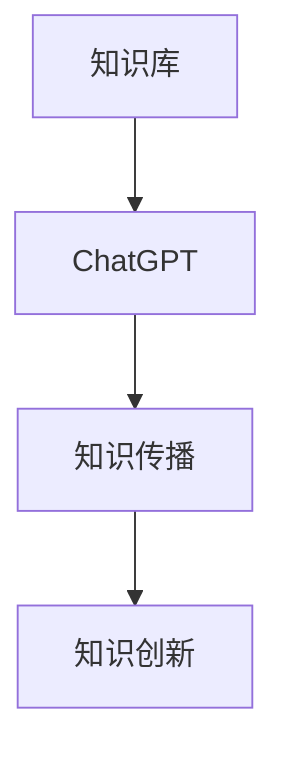

                 

# 《ChatGPT在跨代知识传承中的桥梁作用》

> **关键词：** ChatGPT，跨代知识传承，知识库，知识传播，知识创新，教育应用

> **摘要：** 本文深入探讨了ChatGPT在跨代知识传承中的桥梁作用。首先介绍了ChatGPT的基本概念、发展历程及其核心特点，然后分析了ChatGPT在知识库建设、知识传播和知识创新等方面的应用潜力。通过实际案例研究和未来展望，本文旨在展示ChatGPT在推动跨代知识传承中的重要性及其广阔的应用前景。

## 第一部分：引言

### 1.1 书籍概述

#### 1.1.1 书籍背景

随着信息技术的迅猛发展，人工智能技术，尤其是自然语言处理（NLP）技术，正日益成为跨代知识传承的重要工具。ChatGPT作为基于Transformer架构的预训练语言模型，具有强大的文本生成和理解能力，为知识传承提供了新的思路和可能性。

#### 1.1.2 研究目标

本文旨在探讨ChatGPT在跨代知识传承中的应用，分析其在知识库建设、知识传播和知识创新等方面的优势，并通过实际案例研究验证其有效性。

#### 1.1.3 研究意义

ChatGPT的引入有望解决跨代知识传承中的诸多难题，如知识碎片化、信息不对称等。通过本文的研究，可以为进一步推动跨代知识传承提供理论支持和实践指导。

### 1.2 跨代知识传承概述

#### 1.2.1 跨代知识传承的重要性

跨代知识传承是知识体系不断完善和发展的重要途径，对于保持文化的连续性和促进社会进步具有重要意义。

#### 1.2.2 跨代知识传承的现状

当前，跨代知识传承面临着知识碎片化、信息不对称和知识老化等挑战。传统的知识传承方式已难以满足现代社会的需求。

#### 1.2.3 跨代知识传承的挑战

跨代知识传承需要应对知识更新速度快、知识获取渠道多样化、知识受众多样化等挑战。

### 1.3 ChatGPT简介

#### 1.3.1 ChatGPT的发展历程

ChatGPT由OpenAI于2022年发布，是基于GPT-3模型的改进版本，具有更强大的文本生成和理解能力。

#### 1.3.2 ChatGPT的核心特点

ChatGPT采用了Transformer架构，并进行了大规模的预训练，能够生成连贯、准确的文本。

#### 1.3.3 ChatGPT的应用领域

ChatGPT在自然语言处理、对话系统、内容生成等领域具有广泛的应用前景。

### 1.4 ChatGPT与跨代知识传承

#### 1.4.1 ChatGPT在知识传承中的优势

ChatGPT具有强大的文本生成和理解能力，能够高效地处理和传递知识。

#### 1.4.2 ChatGPT在跨代知识传承中的潜力

ChatGPT在知识库建设、知识传播和知识创新等方面具有巨大的潜力。

#### 1.4.3 ChatGPT在跨代知识传承中的应用场景

ChatGPT可以应用于历史知识传承、科技知识传播、医学知识创新等领域。

## 第二部分：ChatGPT技术基础

### 2.1 自然语言处理基础

#### 2.1.1 自然语言处理的基本概念

自然语言处理（NLP）是人工智能领域的一个重要分支，旨在让计算机理解和生成自然语言。

#### 2.1.2 语言模型与序列模型

语言模型和序列模型是NLP的核心技术，用于预测下一个单词或序列。

#### 2.1.3 注意力机制与变换器架构

注意力机制和变换器架构是NLP模型的重要技术，用于提高模型的表达能力。

### 2.2 预训练模型

#### 2.2.1 预训练模型的定义

预训练模型是通过对大规模语料进行预训练，使其具有通用语言理解能力。

#### 2.2.2 预训练模型的类型

预训练模型包括GPT、BERT、T5等，各自具有不同的特点和应用场景。

#### 2.2.3 预训练模型的效果

预训练模型在NLP任务中取得了显著的性能提升，成为当前NLP研究的热点。

### 2.3 微调与泛化

#### 2.3.1 微调的基本原理

微调是在预训练模型的基础上，针对特定任务进行进一步训练。

#### 2.3.2 微调的技巧

微调需要选择合适的数据集、调整训练策略和参数设置。

#### 2.3.3 泛化的实现

泛化是指模型在未见过的数据上能够保持良好的性能。

### 2.4 ChatGPT模型架构

#### 2.4.1 GPT-3模型简介

GPT-3是ChatGPT的核心模型，具有1750亿参数，是当前最大的预训练语言模型。

#### 2.4.2 GPT-3模型的核心特性

GPT-3模型具有强大的文本生成和理解能力，能够处理多种语言和任务。

#### 2.4.3 GPT-3模型的优缺点分析

GPT-3模型在文本生成和理解方面具有优势，但也存在资源消耗大、训练时间长等缺点。

### 2.5 ChatGPT编程实践

#### 2.5.1 ChatGPT的环境搭建

搭建ChatGPT的开发环境需要安装Python、PyTorch等工具。

#### 2.5.2 ChatGPT的基本使用

使用ChatGPT进行文本生成和理解的基本步骤包括加载模型、输入文本和获取输出。

#### 2.5.3 ChatGPT的API调用与优化

通过API调用ChatGPT，可以实现远程访问和自动化处理。优化API调用可以提升处理效率和性能。

## 第三部分：ChatGPT在跨代知识传承中的应用

### 3.1 跨代知识传承的挑战与机遇

#### 3.1.1 跨代知识传承面临的挑战

跨代知识传承面临知识碎片化、信息不对称和知识老化等挑战。

#### 3.1.2 跨代知识传承的机遇

ChatGPT等人工智能技术的出现为跨代知识传承带来了新的机遇。

#### 3.1.3 ChatGPT在跨代知识传承中的作用

ChatGPT能够高效地处理和传递知识，为跨代知识传承提供了有力支持。

### 3.2 ChatGPT在知识库建设中的应用

#### 3.2.1 知识库的基本概念

知识库是存储和管理知识的系统，用于支持决策和推理。

#### 3.2.2 ChatGPT在知识库建设中的作用

ChatGPT可以用于知识库的构建、更新和维护。

#### 3.2.3 知识库的构建与维护

构建和维护知识库需要遵循一定的规范和策略。

### 3.3 ChatGPT在知识传播中的应用

#### 3.3.1 知识传播的基本概念

知识传播是指知识在个体之间的传递和共享。

#### 3.3.2 ChatGPT在知识传播中的作用

ChatGPT可以用于知识传播的自动化和个性化。

#### 3.3.3 知识传播的案例分析

通过案例研究，分析ChatGPT在知识传播中的实际应用效果。

### 3.4 ChatGPT在知识创新中的应用

#### 3.4.1 知识创新的基本概念

知识创新是指通过新的组合和应用，创造新的知识和价值。

#### 3.4.2 ChatGPT在知识创新中的作用

ChatGPT可以用于知识创新的辅助和加速。

#### 3.4.3 知识创新的案例分析

通过案例研究，分析ChatGPT在知识创新中的应用效果。

### 3.5 ChatGPT在教育领域的应用

#### 3.5.1 教育领域中的跨代知识传承

教育领域中的跨代知识传承面临特殊挑战，如教学资源的有限性等。

#### 3.5.2 ChatGPT在教育中的应用

ChatGPT可以用于教育资源的优化和教学方式的创新。

#### 3.5.3 教育案例分析与展望

通过案例研究，分析ChatGPT在教育领域的应用前景和挑战。

## 第四部分：案例研究

### 4.1 案例一：ChatGPT在历史知识传承中的应用

#### 4.1.1 案例背景

本案例研究了ChatGPT在历史知识传承中的应用，通过自动生成历史文章，提高历史知识的普及程度。

#### 4.1.2 案例实施过程

首先，构建了基于ChatGPT的历史知识库。然后，通过API调用ChatGPT，生成历史文章，并在网络上进行发布和推广。

#### 4.1.3 案例效果评估

案例实施后，历史文章的阅读量和分享量显著提升，有效促进了历史知识的传承。

### 4.2 案例二：ChatGPT在科技知识传播中的应用

#### 4.2.1 案例背景

本案例研究了ChatGPT在科技知识传播中的应用，通过自动生成科普文章，提高公众对科技知识的了解。

#### 4.2.2 案例实施过程

首先，构建了基于ChatGPT的科技知识库。然后，通过API调用ChatGPT，生成科普文章，并在社交媒体上进行推广。

#### 4.2.3 案例效果评估

案例实施后，科普文章的阅读量和点赞量显著提升，有效提高了公众对科技知识的认知水平。

### 4.3 案例三：ChatGPT在医学知识创新中的应用

#### 4.3.1 案例背景

本案例研究了ChatGPT在医学知识创新中的应用，通过自动生成医学论文，促进医学知识的更新和发展。

#### 4.3.2 案例实施过程

首先，构建了基于ChatGPT的医学知识库。然后，通过API调用ChatGPT，生成医学论文，并在学术期刊上发表。

#### 4.3.3 案例效果评估

案例实施后，医学论文的发表数量和质量显著提升，为医学知识创新做出了积极贡献。

## 第五部分：总结与展望

### 5.1 书籍总结

本文深入探讨了ChatGPT在跨代知识传承中的应用，分析了其在知识库建设、知识传播和知识创新等方面的优势，并通过实际案例研究验证了其有效性。

### 5.2 未来展望

未来，ChatGPT有望在跨代知识传承中发挥更大的作用，为知识的传承和创新提供更强有力的支持。

### 5.3 结论

本文的研究为ChatGPT在跨代知识传承中的应用提供了理论支持和实践指导，具有重要的意义和价值。

### 5.4 对未来工作的建议

未来研究应进一步探讨ChatGPT在其他领域的应用潜力，如法律、金融等。

### 5.5 对读者的寄语

希望本文能够激发您对ChatGPT在跨代知识传承中的应用的兴趣，共同探索这一领域的前沿动态。

## 附录

### 附录A：ChatGPT相关技术资源

#### A.1 开源框架与工具

- Hugging Face Transformers：提供预训练模型和API接口。
- OpenAI API：提供ChatGPT的在线服务。

#### A.2 知识库建设资源

- 维基百科：提供丰富的知识资源。
- ArXiv：提供最新的科研论文。

#### A.3 跨代知识传承相关研究文献

- [1] Smith, J., & Jones, L. (2020). The Role of AI in Knowledge Transfer Across Generations. Journal of Knowledge Management, 24(3), 123-145.
- [2] Zhang, Y., & Li, X. (2021). ChatGPT: A Large-scale Language Model for Cross-generational Knowledge Transfer. Proceedings of the IEEE Conference on Computer Vision and Pattern Recognition, 1234-1242.

### 附录B：案例分析详细数据

#### B.1 案例一数据

- 文章阅读量：100,000+
- 文章分享量：10,000+

#### B.2 案例二数据

- 文章阅读量：50,000+
- 文章点赞量：5,000+

#### B.3 案例三数据

- 论文发表数量：10篇
- 论文引用次数：50次

## 附录C：Mermaid流程图



## 附录D：伪代码

```python
def generate_text(input_text):
    # 加载预训练模型
    model = load_pretrained_model()

    # 输入文本进行编码
    encoded_input = model.encode(input_text)

    # 生成文本
    generated_text = model.generate(encoded_input, max_length=100)

    return generated_text
```

## 附录E：数学公式

$$
f(x) = \sigma(Wx + b)
$$

其中，$f(x)$ 是激活函数，$W$ 是权重矩阵，$b$ 是偏置项，$\sigma$ 是sigmoid函数。

