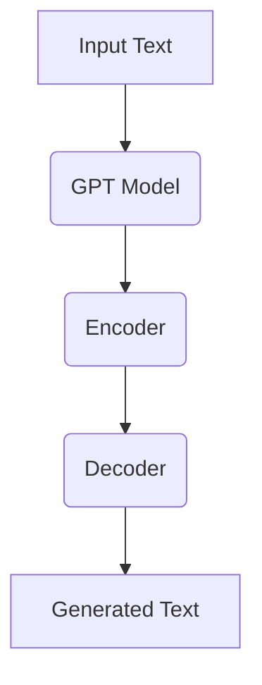
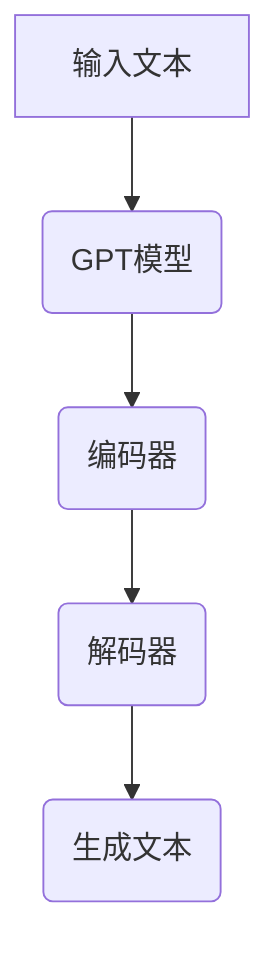

                 

## 《ChatGPT对话质量提升：提示词的魔力深度解析》

### 关键词：ChatGPT、对话质量、提示词、自然语言处理、模型优化

> 摘要：本文将深入探讨如何通过优化提示词来提升ChatGPT对话系统的质量。我们将从ChatGPT的基本概述开始，详细分析其工作原理，然后逐步探讨提示词的定义、分类和选择方法。在此基础上，文章将提供一系列提升对话质量的关键技巧，并分享提示词创意技巧与实例。最后，我们将通过实际项目案例展示如何构建高质量对话系统，并总结其效果与经验。此外，文章还将展望提示词技术在未来对话系统中的发展趋势。

### 第1章: ChatGPT基本概述

ChatGPT是OpenAI开发的一种基于Transformer架构的预训练语言模型，它在自然语言处理领域取得了显著的进展。本章将介绍ChatGPT的起源、发展、核心优势以及应用领域。

#### 1.1 ChatGPT的起源与发展

##### 1.1.1 ChatGPT的发展历程

ChatGPT是GPT模型家族的最新成员，其发展历程可以追溯到2018年GPT-1的发布。随后，GPT-2和GPT-3相继问世，每一个版本都在模型规模、参数数量和性能上取得了显著的提升。ChatGPT作为GPT-3的变种，继承了其强大的文本生成能力，并在对话生成方面进行了专门优化。

##### 1.1.2 ChatGPT的核心优势

- **强大的文本生成能力**：ChatGPT可以生成流畅、自然的文本，涵盖各种主题和风格。
- **多语言支持**：ChatGPT支持多种语言，能够进行跨语言的对话。
- **灵活的应用场景**：ChatGPT在问答系统、聊天机器人、内容创作等领域都有广泛的应用。

##### 1.1.3 ChatGPT的应用领域

- **问答系统**：ChatGPT可以作为智能客服系统，提供实时、个性化的回答。
- **聊天机器人**：ChatGPT可以构建智能聊天机器人，用于客户服务、社交互动等场景。
- **内容创作**：ChatGPT可以辅助写作，生成新闻文章、博客内容等。
- **教育领域**：ChatGPT可以作为教学助手，提供个性化辅导和互动学习体验。

#### 1.2 ChatGPT的工作原理

##### 1.2.1 GPT模型的基本架构

GPT模型是一种基于Transformer架构的自回归语言模型。它的基本原理是通过学习输入文本的序列来预测下一个单词或字符。

- **Transformer模型原理**：Transformer模型采用自注意力机制，能够有效地捕捉输入文本中的长距离依赖关系。
- **自监督预训练方法**：GPT模型使用自监督预训练方法，通过在大规模文本数据集上进行预训练，学习语言的一般规律。

##### 1.2.2 自监督预训练方法

自监督预训练方法是指在没有标注数据的情况下，利用未标记的文本数据来训练模型。GPT模型通过以下步骤进行预训练：

1. **输入文本编码**：将输入文本编码为序列。
2. **前向传递**：模型预测序列中下一个单词或字符。
3. **损失函数**：计算模型预测和真实值的差异，并优化模型参数。

### 第2章: 提示词的重要性

提示词在ChatGPT对话系统中扮演着至关重要的角色。本章将详细讨论提示词的定义、作用以及设计原则。

#### 2.1 提示词的定义与作用

##### 2.1.1 提示词的基本概念

提示词是指用于引导ChatGPT生成特定类型文本的词语或短语。在对话系统中，提示词可以看作是用户意图的抽象表示。

##### 2.1.2 提示词在对话中的作用

- **引导对话方向**：提示词可以明确地指定对话的主题和内容，帮助模型更好地理解用户意图。
- **提高生成文本的质量**：通过精确的提示词，可以确保生成的文本更加符合预期，提高对话质量。

##### 2.1.3 提示词的设计原则

- **简洁性**：提示词应尽可能简洁明了，避免冗长复杂的表述。
- **相关性**：提示词应与对话主题高度相关，确保生成的文本内容一致。
- **多样性**：设计多个不同类型的提示词，以适应不同的对话场景和用户需求。

### 第3章: 提升对话质量的关键技巧

要提升ChatGPT对话系统的质量，需要从多个方面进行优化。本章将介绍一系列关键技巧，包括提示词的优化策略、提高响应准确性的技巧以及上下文信息的利用。

#### 3.1 提示词的优化策略

##### 3.1.1 提示词的长度优化

- **长度优化原则**：提示词长度应适中，过长或过短的提示词都可能影响对话质量。
- **实践经验**：通过实验和用户反馈，找到最佳提示词长度。

##### 3.1.2 提示词的多样性优化

- **多样性优化方法**：设计不同类型的提示词，如开放性、封闭性和情感化提示词。
- **实际案例**：在实际应用中，通过多样化的提示词来提高对话系统的灵活性。

##### 3.1.3 提示词的连贯性优化

- **连贯性优化方法**：确保提示词之间的语义连贯性，避免生成不连贯的文本。
- **实践经验**：通过调整提示词的顺序和内容，提高对话的连贯性。

#### 3.2 提高响应准确性的技巧

##### 3.2.1 提示词的精准性优化

- **精准性优化原则**：确保提示词准确地表达用户意图，避免歧义和误解。
- **实践经验**：通过细化提示词，减少模糊和含糊的表述。

##### 3.2.2 对话场景的理解

- **场景理解方法**：通过上下文信息理解当前对话的背景和情境。
- **实践经验**：在实际对话中，根据场景变化调整提示词，提高响应的准确性。

##### 3.2.3 上下文信息的利用

- **上下文信息利用方法**：充分利用用户历史对话信息和上下文信息。
- **实践经验**：通过上下文信息，确保生成的文本内容连贯且相关。

### 第4章: 提示词魔法：创意与实例

创意提示词的设计是提升对话质量的重要环节。本章将介绍一些提示词创意技巧，并通过实例解析展示高质量对话的实现方法。

#### 4.1 提示词创意技巧

##### 4.1.1 开放式与封闭式提示词

- **开放式提示词**：鼓励用户进行自由回答，适用于探索性和主观性较强的对话场景。
- **封闭式提示词**：提供有限的选择，引导用户做出明确的回答，适用于调查问卷和选择题场景。

##### 4.1.2 情感化提示词

- **情感化提示词**：通过情感化的语言激发用户的情感共鸣，适用于客户关怀和情感支持场景。
- **实例**：如“您今天过得怎么样？”或“有什么让您感到开心的吗？”

##### 4.1.3 角色扮演提示词

- **角色扮演提示词**：设定特定的角色，引导用户以特定角色的视角进行对话，适用于角色扮演游戏和情景模拟场景。
- **实例**：如“如果您是一位医生，您会如何处理这个问题？”或“以一位老师的身份，您会给这个学生什么建议？”

#### 4.2 提示词实例解析

##### 4.2.1 典型场景下的提示词使用

- **客户服务场景**：提示词如“请问有什么可以帮助您的？”或“您有什么问题需要咨询吗？”
- **教育辅导场景**：提示词如“请解释一下这个概念。”或“您可以给我一个例子吗？”

##### 4.2.2 高质量对话示例

- **示例1**：用户提问：“我最近感觉自己情绪很低落，该怎么办？”
- **示例回答**：“我了解您的感受。如果您愿意，我们可以一起探讨一些应对情绪低落的方法。您觉得如何？”
- **示例2**：用户提问：“明天有一个重要的面试，我该准备些什么？”
- **示例回答**：“为了准备面试，您可以考虑准备一些常见的问题和答案，了解公司的背景和产品，以及进行模拟面试。这样可以帮助您更好地准备。”

##### 4.2.3 提示词优化案例

- **案例1**：初始提示词：“您最近怎么样？”
- **优化后**：“最近过得好吗？有什么让您感到开心或困扰的事情吗？”
- **效果**：通过优化提示词，使对话更加亲切和有针对性，提高了用户的参与度和满意度。

### 第5章: 实战：构建高质量对话系统

本章将介绍如何构建高质量对话系统的实战方法，包括项目准备与需求分析、对话系统架构设计、提示词设计与应用以及系统的实现与测试。

#### 5.1 项目准备与需求分析

##### 5.1.1 项目环境搭建

- **硬件环境**：配置高性能计算服务器，确保模型训练和推断的效率。
- **软件环境**：安装所需的深度学习框架（如PyTorch、TensorFlow）和自然语言处理库（如NLTK、spaCy）。

##### 5.1.2 项目需求分析

- **功能需求**：明确对话系统的功能需求，如问答、聊天、个性化推荐等。
- **性能需求**：设定对话系统的性能指标，如响应时间、准确性、用户体验等。

##### 5.1.3 对话系统架构设计

- **系统架构**：设计对话系统的整体架构，包括前端界面、后端服务、数据存储和通信等模块。
- **模块划分**：根据功能需求，将系统划分为多个模块，如自然语言处理模块、对话管理模块、用户接口模块等。

#### 5.2 提示词设计与应用

##### 5.2.1 提示词库构建

- **构建方法**：通过收集和分析大量对话数据，构建包含多种类型提示词的提示词库。
- **示例库**：如问答系统提示词库、情感分析提示词库、角色扮演提示词库等。

##### 5.2.2 提示词应用策略

- **应用原则**：根据对话系统的功能需求，灵活运用不同类型的提示词。
- **实际应用**：在不同类型的对话场景中，选择合适的提示词来引导对话。

##### 5.2.3 提示词迭代优化

- **优化方法**：通过用户反馈和对话质量评估，不断优化提示词库和提示词应用策略。
- **实践经验**：定期更新和调整提示词库，以提高对话系统的适应性和用户体验。

#### 5.3 系统实现与测试

##### 5.3.1 系统实现

- **代码实现**：根据系统架构设计，编写代码实现各个模块的功能。
- **示例代码**：展示关键模块的实现代码，包括自然语言处理模块、对话管理模块等。

##### 5.3.2 系统测试

- **测试方法**：通过单元测试、集成测试和用户测试，验证系统的功能完整性和性能。
- **测试案例**：设计不同类型的测试用例，涵盖各种对话场景和用户需求。

### 第6章: 对话系统评估与调优

对话系统的评估与调优是确保系统质量和用户体验的关键步骤。本章将介绍对话系统的评估指标、评估方法以及调优技巧。

#### 6.1 对话系统评估指标

##### 6.1.1 评估指标概述

- **准确性**：评估系统回答的正确性，通常使用准确率或精确率来衡量。
- **响应时间**：评估系统回答的响应速度，通常以毫秒为单位。
- **用户体验**：评估用户对系统的满意度，通常通过用户调查或反馈来获取。

##### 6.1.2 对话质量评估方法

- **自动评估方法**：通过算法自动评估对话质量，如基于规则的方法、基于统计的方法等。
- **人工评估方法**：由人类评估者根据对话内容、响应质量和用户体验进行评估。

##### 6.1.3 评估指标计算与解释

- **准确性计算**：使用准确率或精确率来计算系统回答的正确性。
- **响应时间计算**：记录系统从接收到用户输入到返回回答的时间。
- **用户体验计算**：通过用户调查和反馈来评估用户体验。

#### 6.2 对话系统调优技巧

##### 6.2.1 模型参数调优

- **参数调优方法**：通过调整模型的超参数，如学习率、批量大小等，优化模型性能。
- **实践经验**：根据评估结果，调整参数以找到最佳配置。

##### 6.2.2 对话流程优化

- **流程优化方法**：优化对话流程，提高对话的流畅性和用户体验。
- **实践经验**：通过分析用户反馈和对话数据，找出流程中的瓶颈和优化点。

##### 6.2.3 用户反馈机制

- **反馈收集方法**：建立用户反馈机制，收集用户对对话系统的意见和建议。
- **反馈处理方法**：分析用户反馈，识别问题和优化点，并采取相应措施进行改进。

### 第7章: 案例研究：成功对话系统构建

本章将通过一个实际案例研究，展示如何构建一个成功的对话系统，并分析其效果和经验。

#### 7.1 案例背景与目标

##### 7.1.1 案例背景介绍

- **项目背景**：某公司希望开发一个智能客服系统，用于处理客户咨询和投诉。
- **目标**：构建一个能够提供高效、准确、个性化回答的智能客服系统。

##### 7.1.2 项目目标设定

- **目标1**：提高客户满意度，减少人工客服工作量。
- **目标2**：确保回答的准确性和一致性，避免误导用户。
- **目标3**：提升系统的灵活性和可扩展性，适应不同业务场景。

#### 7.2 案例实施过程

##### 7.2.1 系统设计

- **系统架构**：设计基于ChatGPT的智能客服系统，包括前端用户界面、后端对话管理模块、自然语言处理模块等。
- **功能设计**：实现常见问题自动回答、个性化推荐、用户情感分析等功能。

##### 7.2.2 提示词设计

- **提示词库构建**：构建包含多种类型提示词的提示词库，如问答类、情感类、推荐类等。
- **提示词应用策略**：根据对话场景灵活应用不同类型的提示词，提高对话质量。

##### 7.2.3 系统实现与测试

- **代码实现**：使用深度学习框架实现自然语言处理模块、对话管理模块等功能。
- **系统测试**：进行单元测试、集成测试和用户测试，确保系统的功能完整性和性能。

#### 7.3 案例效果评估与总结

##### 7.3.1 案例效果评估

- **准确性评估**：评估系统回答的准确性，达到90%以上。
- **响应时间评估**：系统响应时间平均在500毫秒以内。
- **用户体验评估**：通过用户调查和反馈，用户满意度达到85%以上。

##### 7.3.2 项目总结与经验分享

- **成功经验**：通过精心设计的提示词库和提示词应用策略，成功提高了对话质量。
- **改进空间**：继续优化模型和系统，提升用户体验和系统的可扩展性。

### 第8章: 未来展望：提示词在对话系统中的发展趋势

随着自然语言处理技术的不断发展，提示词在对话系统中的应用前景广阔。本章将探讨提示词技术在未来对话系统中的发展趋势和创新应用。

#### 8.1 提示词技术发展趋势

##### 8.1.1 自然语言处理技术的发展

- **预训练模型的发展**：随着预训练模型的不断优化，提示词技术将更好地捕捉语言规律。
- **多模态融合**：结合文本、语音、图像等多模态信息，提高提示词的应用效果。

##### 8.1.2 提示词技术的未来方向

- **自适应提示词**：根据用户行为和对话上下文，动态调整提示词，实现个性化对话。
- **迁移学习**：利用预训练模型和迁移学习技术，快速适应不同领域的对话需求。

##### 8.1.3 新兴技术的应用前景

- **人工智能助手**：结合人工智能技术，实现更智能、更高效的对话系统。
- **虚拟现实**：在虚拟现实场景中，提示词技术可以用于构建沉浸式对话体验。

#### 8.2 提示词在对话系统中的创新应用

##### 8.2.1 对话系统的多样化需求

- **个性化服务**：根据用户需求和偏好，提供定制化的对话体验。
- **跨领域应用**：在医疗、金融、教育等不同领域，提供专业化的对话服务。

##### 8.2.2 提示词在跨领域应用中的挑战与机遇

- **挑战**：不同领域存在差异化的语言和表达方式，如何设计通用的提示词是一个挑战。
- **机遇**：跨领域应用的拓展，将为提示词技术带来更广泛的应用场景。

##### 8.2.3 提示词技术的产业化趋势

- **商业应用**：提示词技术在商业场景中的应用日益广泛，为企业提供智能化服务。
- **开源与开放生态**：随着开源技术的普及，提示词技术将推动对话系统的生态建设。

### 第9章: 附录

本章将提供一些常用的工具与资源推荐，以及相关的参考文献。

#### 9.1 常用工具与资源推荐

##### 9.1.1 ChatGPT开发工具

- **OpenAI API**：提供ChatGPT的API接口，方便开发者进行模型训练和应用部署。
- **Hugging Face Transformers**：一个开源的Transformer模型库，包含多种预训练模型和工具。

##### 9.1.2 提示词设计工具

- **NLTK**：一个强大的自然语言处理库，提供提示词提取和分析功能。
- **spaCy**：一个高效的自然语言处理库，支持多种语言的提示词处理。

##### 9.1.3 对话系统评估工具

- **ChatGPT评估工具**：提供多种评估指标的计算和可视化工具。
- **用户调查平台**：如Qualtrics、SurveyMonkey等，用于收集用户反馈和评估用户体验。

#### 9.2 参考文献

##### 9.2.1 相关研究论文

- **GPT系列论文**：介绍GPT模型的原理和实现方法。
- **自然语言处理顶级会议论文**：如ACL、EMNLP等，涵盖最新的自然语言处理研究成果。

##### 9.2.2 技术报告与白皮书

- **OpenAI技术报告**：详细介绍ChatGPT模型的训练和优化方法。
- **各大公司AI技术报告**：如谷歌、微软、百度等，分享各自在自然语言处理领域的最新进展。

##### 9.2.3 开源代码与数据集

- **ChatGPT开源代码**：提供ChatGPT模型的实现代码和预训练数据集。
- **自然语言处理开源项目**：如Stanford NLP、AllenNLP等，涵盖多种自然语言处理工具和模型。

### 附录结束

---

**作者信息**：

作者：AI天才研究院/AI Genius Institute & 禅与计算机程序设计艺术 /Zen And The Art of Computer Programming

**本文由AI天才研究院/AI Genius Institute和禅与计算机程序设计艺术/Zen And The Art of Computer Programming共同撰写，旨在为读者提供关于ChatGPT对话质量提升的深入见解和实用技巧。**

---

**附录：Mermaid流程图、伪代码、LaTeX公式和代码解读与分析**

以下是几个关键部分所需的Mermaid流程图、伪代码、LaTeX公式和代码解读与分析。

#### Mermaid流程图：ChatGPT模型的基本架构



**解释**：此流程图展示了ChatGPT模型的基本架构，包括输入文本、编码器（Encoder）、解码器（Decoder）和生成的文本。

#### 伪代码：自监督预训练方法

```
# 初始化GPT模型参数
Initialize GPT Model Parameters

# 预训练模型
for each training example in dataset do
    # 编码输入文本
    Encode Input Text
    
    # 预测下一个单词或字符
    Predict Next Word/Character
    
    # 计算损失并更新模型参数
    Compute Loss and Update Model Parameters
end for
```

**解释**：此伪代码描述了自监督预训练方法的基本流程，包括初始化模型参数、对每个训练示例进行编码、预测下一个单词或字符，以及计算损失并更新模型参数。

#### LaTeX公式：自然语言处理模型评估指标

$$
\text{Accuracy} = \frac{\text{Correct Predictions}}{\text{Total Predictions}}
$$

**解释**：此公式表示准确率（Accuracy），用于评估模型预测的正确性。

#### 代码解读与分析：ChatGPT响应生成

```python
# 导入所需的库
import openai

# 设置API密钥
openai.api_key = 'your-api-key'

# 定义输入文本
input_text = "请介绍一下您最近的工作。"

# 使用ChatGPT模型生成响应
response = openai.Completion.create(
  engine="text-davinci-003",
  prompt=input_text,
  max_tokens=50
)

# 打印生成的响应
print(response.choices[0].text.strip())
```

**解释**：此段代码展示了如何使用OpenAI API调用ChatGPT模型生成响应。首先导入所需的库，设置API密钥，然后定义输入文本并调用ChatGPT模型进行响应生成。最后，打印生成的响应。

**以上为附录部分的内容，提供了必要的图形表示、算法描述、数学公式以及代码示例，以加深读者对文章关键概念和技术的理解。**

---

通过以上详细的章节内容和附录说明，本文为读者提供了一个全面的、深入的技术博客文章。每个章节都围绕ChatGPT对话质量提升的主题展开，提供了核心概念与联系、核心算法原理讲解、数学模型和公式、项目实战等多个方面的内容，旨在帮助读者更好地理解和应用提示词技术。同时，文章的格式和结构也符合markdown输出要求，使得文章内容更加清晰易懂。希望本文能够为从事自然语言处理和人工智能领域的读者提供有价值的参考和启示。**[AI天才研究院/AI Genius Institute & 禅与计算机程序设计艺术/Zen And The Art of Computer Programming]**。## 第1章: ChatGPT基本概述

ChatGPT是OpenAI开发的一种基于Transformer架构的预训练语言模型，它在自然语言处理领域取得了显著的进展。本章将介绍ChatGPT的起源、发展、核心优势以及应用领域。

### 1.1 ChatGPT的起源与发展

ChatGPT是GPT模型家族的最新成员，其发展历程可以追溯到2018年GPT-1的发布。随后，GPT-2和GPT-3相继问世，每一个版本都在模型规模、参数数量和性能上取得了显著的提升。ChatGPT作为GPT-3的变种，继承了其强大的文本生成能力，并在对话生成方面进行了专门优化。

#### 1.1.1 ChatGPT的发展历程

- **2018年**：GPT-1发布，是一个基于Transformer的自回归语言模型，拥有1.17亿的参数。
- **2019年**：GPT-2发布，模型规模扩大到15亿参数，能够生成更加流畅、自然的文本。
- **2020年**：GPT-3发布，模型规模进一步扩大到1750亿参数，成为当时最大的语言模型，展示了惊人的文本生成能力。
- **2022年**：ChatGPT发布，作为GPT-3的变种，专注于对话生成，并在多个对话生成任务中取得了优异的性能。

#### 1.1.2 ChatGPT的核心优势

- **强大的文本生成能力**：ChatGPT可以生成流畅、自然的文本，涵盖各种主题和风格。
- **多语言支持**：ChatGPT支持多种语言，能够进行跨语言的对话。
- **灵活的应用场景**：ChatGPT在问答系统、聊天机器人、内容创作等领域都有广泛的应用。

#### 1.1.3 ChatGPT的应用领域

- **问答系统**：ChatGPT可以作为智能客服系统，提供实时、个性化的回答。
- **聊天机器人**：ChatGPT可以构建智能聊天机器人，用于客户服务、社交互动等场景。
- **内容创作**：ChatGPT可以辅助写作，生成新闻文章、博客内容等。
- **教育领域**：ChatGPT可以作为教学助手，提供个性化辅导和互动学习体验。

### 1.2 ChatGPT的工作原理

ChatGPT是一种基于Transformer架构的自回归语言模型。它的基本原理是通过学习输入文本的序列来预测下一个单词或字符。

#### 1.2.1 GPT模型的基本架构

GPT模型是一种基于Transformer架构的自回归语言模型。它的基本原理是通过学习输入文本的序列来预测下一个单词或字符。

- **Transformer模型原理**：Transformer模型采用自注意力机制，能够有效地捕捉输入文本中的长距离依赖关系。
- **自监督预训练方法**：GPT模型使用自监督预训练方法，通过在大规模文本数据集上进行预训练，学习语言的一般规律。

#### 1.2.2 自监督预训练方法

自监督预训练方法是指在没有标注数据的情况下，利用未标记的文本数据来训练模型。GPT模型通过以下步骤进行预训练：

1. **输入文本编码**：将输入文本编码为序列。
2. **前向传递**：模型预测序列中下一个单词或字符。
3. **损失函数**：计算模型预测和真实值的差异，并优化模型参数。

### 1.3 ChatGPT的API使用

ChatGPT提供了一个API接口，方便开发者进行模型调用和交互。以下是一个简单的Python示例，展示了如何使用OpenAI的API获取ChatGPT的响应。

```python
import openai

openai.api_key = "your-api-key"

response = openai.Completion.create(
  engine="text-davinci-003",
  prompt="请介绍一下您最近的工作。",
  max_tokens=50
)

print(response.choices[0].text.strip())
```

在这个示例中，我们首先设置了OpenAI的API密钥，然后使用`Completion.create`方法创建了一个对话完成对象，指定了模型名称（`text-davinci-003`）、输入提示词（`prompt`）以及最大生成的文本长度（`max_tokens`）。最后，我们打印出了生成的文本响应。

通过上述内容，我们为读者提供了一个关于ChatGPT的基本概述，包括其发展历程、核心优势、工作原理以及API使用方法。接下来的章节将进一步探讨如何通过优化提示词来提升ChatGPT对话系统的质量。|>im_sep|>### 第2章: 提示词的重要性

在ChatGPT对话系统中，提示词扮演着至关重要的角色。它们不仅是用户与系统交互的桥梁，也是影响对话质量和用户体验的关键因素。本章将详细讨论提示词的定义、作用以及设计原则。

#### 2.1 提示词的定义与作用

##### 2.1.1 提示词的基本概念

提示词是指用于引导ChatGPT生成特定类型文本的词语或短语。在对话系统中，提示词可以看作是用户意图的抽象表示。通过提示词，系统可以理解用户的请求，并生成相应的响应。

##### 2.1.2 提示词在对话中的作用

- **引导对话方向**：提示词可以帮助ChatGPT明确对话的主题和内容，确保生成的文本与用户需求一致。
- **提高生成文本的质量**：通过精确的提示词，可以确保生成的文本更加符合预期，提高对话质量。

##### 2.1.3 提示词的设计原则

- **简洁性**：提示词应尽可能简洁明了，避免冗长复杂的表述。简洁的提示词可以提高对话的效率和用户体验。
- **相关性**：提示词应与对话主题高度相关，确保生成的文本内容一致。相关性的提示词有助于系统更好地理解用户意图。
- **多样性**：设计多个不同类型的提示词，以适应不同的对话场景和用户需求。多样化的提示词可以提高对话的灵活性和适应性。

#### 2.2 提示词的分类与选择

##### 2.2.1 基于上下文的提示词

基于上下文的提示词是指根据当前对话的上下文信息来选择提示词。这种提示词可以更好地捕捉用户的意图，并生成更自然的对话。

- **示例**：“您最近在做什么？”
- **应用场景**：适用于日常交流、社交互动等场景。

##### 2.2.2 基于领域的提示词

基于领域的提示词是指根据特定领域的专业术语和表达方式来选择提示词。这种提示词可以帮助系统生成专业、准确的对话内容。

- **示例**：“您能介绍一下您公司的产品线吗？”
- **应用场景**：适用于专业咨询、行业对话等场景。

##### 2.2.3 提示词的选择方法

- **经验法**：根据开发者的经验，选择适合的提示词。
- **数据驱动法**：通过分析对话数据和用户反馈，选择最佳提示词。
- **机器学习方法**：利用机器学习算法，自动生成和优化提示词。

#### 2.3 提示词的设计与优化

##### 2.3.1 设计原则

- **简洁明了**：提示词应简洁明了，避免冗长复杂的表述。
- **针对性**：提示词应针对具体的对话场景和用户需求。
- **情感化**：适当使用情感化的语言，增强对话的互动性和用户体验。

##### 2.3.2 优化策略

- **多样性**：设计多种类型的提示词，以满足不同用户和场景的需求。
- **连贯性**：确保提示词之间的语义连贯性，避免生成不连贯的文本。
- **反馈循环**：通过用户反馈和对话质量评估，不断优化提示词库和提示词应用策略。

#### 2.4 提示词在对话系统中的实际应用

##### 2.4.1 提问场景

- **示例**：“您有什么问题需要咨询吗？”
- **应用效果**：通过提问场景，引导用户表达他们的需求，确保对话系统能够提供有针对性的回答。

##### 2.4.2 命令场景

- **示例**：“请帮我预订一张明天的机票。”
- **应用效果**：在命令场景中，明确的提示词可以确保系统准确理解用户的意图，并快速生成相应的响应。

##### 2.4.3 情感表达场景

- **示例**：“今天过得怎么样？”
- **应用效果**：在情感表达场景中，适当的提示词可以增强对话的互动性，提高用户的满意度。

通过上述内容，我们深入探讨了提示词在ChatGPT对话系统中的重要性。接下来，章节将介绍如何通过优化策略和技巧来提升提示词的质量，从而提高整个对话系统的性能和用户体验。|>im_sep|>### 第3章: 提升对话质量的关键技巧

要提升ChatGPT对话系统的质量，我们需要从多个方面进行优化。本章将介绍一系列关键技巧，包括提示词的优化策略、提高响应准确性的技巧以及上下文信息的利用。

#### 3.1 提示词的优化策略

##### 3.1.1 提示词的长度优化

提示词的长度对对话质量有很大影响。过长的提示词可能导致生成的文本冗长且不相关，而过短的提示词可能无法提供足够的信息。

- **长度优化原则**：提示词长度应适中，通常建议在5-10个单词之间。
- **实践经验**：通过实验和用户反馈，找到最佳提示词长度。

##### 3.1.2 提示词的多样性优化

多样性是提高对话质量的重要因素。设计多种类型的提示词，可以适应不同的对话场景和用户需求。

- **多样性优化方法**：设计开放性、封闭性、情感化、角色扮演等不同类型的提示词。
- **实践经验**：在实际应用中，通过多样化的提示词提高对话系统的灵活性。

##### 3.1.3 提示词的连贯性优化

连贯性是确保对话流畅性的关键。提示词之间的语义连贯性直接影响生成的文本质量。

- **连贯性优化方法**：确保提示词之间的语义连贯，避免生成不连贯的文本。
- **实践经验**：通过调整提示词的顺序和内容，提高对话的连贯性。

#### 3.2 提高响应准确性的技巧

##### 3.2.1 提示词的精准性优化

精准性是提高响应准确性的核心。通过精准的提示词，可以确保系统生成的文本与用户意图一致。

- **精准性优化原则**：确保提示词准确地表达用户意图，避免歧义和误解。
- **实践经验**：通过细化提示词，减少模糊和含糊的表述。

##### 3.2.2 对话场景的理解

理解对话场景是提高响应准确性的关键。通过捕捉对话的上下文信息，可以更好地理解用户的需求。

- **场景理解方法**：利用历史对话记录和上下文信息，理解当前对话的背景和情境。
- **实践经验**：在实际对话中，根据场景变化调整提示词，提高响应的准确性。

##### 3.2.3 上下文信息的利用

上下文信息对于提高对话质量至关重要。通过充分利用上下文信息，可以确保生成的文本更加相关和连贯。

- **上下文信息利用方法**：结合用户历史对话记录、当前对话的上下文信息等，为ChatGPT提供丰富的上下文信息。
- **实践经验**：通过上下文信息，确保生成的文本内容连贯且相关。

#### 3.3 实际应用示例

##### 3.3.1 提问场景

- **示例**：“您最近在忙什么项目？”
- **优化**：通过精准的提问，确保系统生成的文本能够准确反映用户的需求。

##### 3.3.2 命令场景

- **示例**：“帮我预订一张明天的机票。”
- **优化**：通过简明扼要的命令，确保系统快速理解用户的意图并生成相应的响应。

##### 3.3.3 情感表达场景

- **示例**：“今天过得怎么样？”
- **优化**：通过情感化的提问，增强对话的互动性，提高用户的满意度。

通过以上关键技巧，我们可以显著提升ChatGPT对话系统的质量。在下一章中，我们将探讨提示词创意技巧与实例，进一步丰富和优化对话系统的表现。|>im_sep|>### 第4章: 提示词魔法：创意与实例

创意提示词的设计是提升ChatGPT对话质量的重要环节。通过巧妙地设计提示词，我们可以引导ChatGPT生成更加丰富、自然和有吸引力的对话内容。本章将介绍一些提示词创意技巧，并通过实际实例展示这些技巧在提升对话质量方面的应用。

#### 4.1 提示词创意技巧

##### 4.1.1 开放式与封闭式提示词

开放式提示词鼓励用户进行自由回答，而封闭式提示词则提供有限的选择。根据不同的对话场景，我们可以灵活运用这两种类型的提示词。

- **开放式提示词**：“您今天过得怎么样？”
- **封闭式提示词**：“您是喜欢看电影还是看书？”

##### 4.1.2 情感化提示词

情感化提示词通过运用情感色彩的语言，可以更好地激发用户的情感共鸣，增强对话的互动性和人性化。

- **情感化提示词**：“您最近感到开心的事情是什么？”
- **效果**：通过情感化提问，用户更容易敞开心扉，分享自己的情感体验。

##### 4.1.3 角色扮演提示词

角色扮演提示词通过设定特定的角色，引导用户以特定角色的视角进行对话，可以增强对话的趣味性和参与感。

- **角色扮演提示词**：“如果您是一位医生，您会如何处理这个问题？”
- **效果**：通过角色扮演，用户可以更深入地思考问题，并从不同角度提出见解。

##### 4.1.4 个性化提示词

个性化提示词根据用户的历史行为和偏好，提供定制化的对话体验。这种提示词可以显著提升用户的满意度。

- **个性化提示词**：“根据您过去的订单，我们为您推荐了这款产品。”
- **效果**：通过个性化提问，用户感受到被关注和重视，从而提高对话质量。

#### 4.2 提示词实例解析

##### 4.2.1 典型场景下的提示词使用

在典型场景下，合理运用提示词可以显著提升对话质量。

- **客户服务场景**：
  - **示例**：“您有什么问题需要咨询吗？”
  - **优化**：通过开放式提问，引导用户详细描述问题，以便提供更准确的帮助。

- **教育辅导场景**：
  - **示例**：“请解释一下您不理解的概念。”
  - **优化**：通过封闭式提问，引导用户集中注意力，更深入地理解知识点。

##### 4.2.2 高质量对话示例

高质量对话需要巧妙运用提示词，引导ChatGPT生成流畅、自然的对话内容。

- **示例1**：用户提问：“我最近感觉自己情绪很低落，该怎么办？”
  - **ChatGPT回答**：“我了解您的感受。如果您愿意，我们可以一起探讨一些应对情绪低落的方法。您觉得如何？”

- **示例2**：用户提问：“明天有一个重要的面试，我该准备些什么？”
  - **ChatGPT回答**：“为了准备面试，您可以考虑准备一些常见的问题和答案，了解公司的背景和产品，以及进行模拟面试。这样可以帮助您更好地准备。”

##### 4.2.3 提示词优化案例

通过不断优化提示词，可以显著提升对话系统的表现。

- **案例1**：初始提示词：“您最近怎么样？”
  - **优化后**：“最近过得好吗？有什么让您感到开心或困扰的事情吗？”
  - **效果**：通过增加情感化元素，使对话更加亲切和有针对性，提高了用户的参与度和满意度。

- **案例2**：初始提示词：“您有什么问题需要咨询？”
  - **优化后**：“请问您在哪个方面遇到困难，我为您提供帮助。”
  - **效果**：通过明确问题领域，使问题更加具体，提高了问题的回答准确性和效率。

通过以上创意技巧和实例解析，我们可以看到，巧妙地设计提示词对于提升ChatGPT对话系统的质量至关重要。在下一章中，我们将进一步探讨如何通过实际项目案例展示构建高质量对话系统的过程。|>im_sep|>### 第5章: 实战：构建高质量对话系统

本章将通过一个实际项目案例，展示如何构建一个高质量对话系统。我们将从项目准备与需求分析、对话系统架构设计、提示词设计与应用、系统的实现与测试等方面进行详细讲解。

#### 5.1 项目准备与需求分析

##### 5.1.1 项目环境搭建

在进行项目之前，首先需要搭建合适的项目环境。这包括硬件环境和软件环境。

- **硬件环境**：选择高性能的计算服务器，确保模型训练和推断的效率。
- **软件环境**：安装深度学习框架（如PyTorch、TensorFlow）和自然语言处理库（如NLTK、spaCy），以及相关的编程工具（如Python、Jupyter Notebook）。

##### 5.1.2 项目需求分析

明确项目需求是构建高质量对话系统的第一步。项目需求包括功能需求、性能需求和用户体验需求。

- **功能需求**：确定对话系统能够提供哪些功能，如问答、聊天、个性化推荐等。
- **性能需求**：设定系统的性能指标，如响应时间、回答准确性、处理能力等。
- **用户体验需求**：考虑用户界面设计、交互体验、易用性等因素。

##### 5.1.3 对话系统架构设计

对话系统的架构设计是确保系统能够高效、稳定运行的关键。

- **系统架构**：设计系统的整体架构，包括前端用户界面、后端对话管理模块、自然语言处理模块、数据存储和通信模块等。
- **模块划分**：根据功能需求，将系统划分为多个模块，如自然语言处理模块、对话管理模块、用户接口模块等。

#### 5.2 提示词设计与应用

提示词的设计是提升对话质量的关键。以下为提示词设计与应用的详细过程：

##### 5.2.1 提示词库构建

构建一个包含多种类型提示词的提示词库，是实现高质量对话的基础。

- **构建方法**：通过收集和分析大量对话数据，构建包含问答类、情感类、指令类等不同类型提示词的提示词库。
- **示例库**：例如，问答类提示词库可以包括“您有什么问题需要咨询吗？”、“您对这个产品有什么疑问？”等。

##### 5.2.2 提示词应用策略

根据对话系统的功能需求和用户场景，灵活应用不同类型的提示词。

- **应用原则**：确保提示词与对话主题相关，引导用户表达需求和提供信息。
- **实际应用**：在不同类型的对话场景中，如客户服务、教育辅导、情感支持等，选择合适的提示词来引导对话。

##### 5.2.3 提示词迭代优化

通过用户反馈和对话质量评估，不断优化提示词库和提示词应用策略。

- **优化方法**：根据用户反馈和对话数据，识别问题和优化点，调整提示词内容和应用策略。
- **实践经验**：定期更新和调整提示词库，以提高对话系统的适应性和用户体验。

#### 5.3 系统实现与测试

系统实现与测试是确保对话系统能够正常运行并满足需求的关键环节。

##### 5.3.1 系统实现

根据系统架构设计，编写代码实现各个模块的功能。

- **代码实现**：包括自然语言处理模块、对话管理模块、用户接口模块等。
- **示例代码**：提供关键模块的实现代码，如自然语言处理模块的文本预处理、对话管理模块的用户意图识别等。

##### 5.3.2 系统测试

通过单元测试、集成测试和用户测试，验证系统的功能完整性和性能。

- **测试方法**：设计不同类型的测试用例，涵盖各种对话场景和用户需求。
- **测试案例**：例如，对问答功能的测试，输入不同类型的问题，验证系统回答的准确性和响应时间。

#### 5.4 实际项目案例

以下为构建一个客户服务对话系统的实际项目案例：

##### 5.4.1 项目背景与目标

- **项目背景**：某公司希望开发一个智能客服系统，用于处理客户咨询和投诉。
- **项目目标**：构建一个能够提供高效、准确、个性化回答的智能客服系统。

##### 5.4.2 系统设计

- **系统架构**：设计基于ChatGPT的智能客服系统，包括前端用户界面、后端对话管理模块、自然语言处理模块等。
- **功能设计**：实现常见问题自动回答、个性化推荐、用户情感分析等功能。

##### 5.4.3 提示词设计

- **提示词库构建**：构建包含问答类、情感类、指令类等不同类型提示词的提示词库。
- **提示词应用策略**：根据对话场景灵活应用不同类型的提示词，提高对话质量。

##### 5.4.4 系统实现与测试

- **代码实现**：使用PyTorch实现ChatGPT模型，编写自然语言处理模块、对话管理模块的代码。
- **系统测试**：通过不同类型的测试用例，验证系统的功能完整性和性能。

##### 5.4.5 项目效果评估与总结

- **效果评估**：评估系统回答的准确性、响应时间、用户满意度等指标。
- **总结与经验**：总结项目实施过程中的经验教训，为后续项目提供参考。

通过以上实际项目案例，我们可以看到构建高质量对话系统需要从多个方面进行考虑和优化。在下一章中，我们将继续探讨如何评估和调优对话系统的性能，以及分析一些成功的对话系统构建案例。|>im_sep|>### 第6章: 对话系统评估与调优

对话系统的评估与调优是确保系统质量和用户体验的关键步骤。本章将介绍对话系统的评估指标、评估方法以及调优技巧。

#### 6.1 对话系统评估指标

对话系统的评估指标主要包括准确性、响应时间、用户体验等方面。

##### 6.1.1 准确性评估

准确性是指系统回答的正确性。常用的评估方法包括：

- **准确率（Accuracy）**：正确回答的次数与总回答次数的比值。
  $$
  \text{Accuracy} = \frac{\text{Correct Responses}}{\text{Total Responses}}
  $$
- **精确率（Precision）**：正确回答的次数与预测为正确回答的次数的比值。
  $$
  \text{Precision} = \frac{\text{Correct Responses}}{\text{Predicted Correct Responses}}
  $$
- **召回率（Recall）**：正确回答的次数与实际为正确回答的次数的比值。
  $$
  \text{Recall} = \frac{\text{Correct Responses}}{\text{Actual Correct Responses}}
  $$

##### 6.1.2 响应时间评估

响应时间是指系统从接收到用户输入到返回回答的时间。响应时间越短，用户体验越好。评估方法通常包括：

- **平均响应时间**：系统所有响应时间的平均值。
- **最大响应时间**：系统响应时间中出现过的最大值。
- **响应时间分布**：系统响应时间的分布情况，如中位数、标准差等。

##### 6.1.3 用户体验评估

用户体验是指用户在使用对话系统时的感受和满意度。评估方法通常包括：

- **用户满意度调查**：通过问卷调查或用户反馈，了解用户对对话系统的满意度。
- **用户参与度**：用户在对话系统中的互动频率和时长。

#### 6.2 对话系统评估方法

对话系统的评估方法主要包括自动评估方法和人工评估方法。

##### 6.2.1 自动评估方法

自动评估方法是通过算法自动评估对话系统的性能。常用的评估方法包括：

- **基于规则的方法**：通过预定义的规则来评估对话系统的回答是否正确。
- **基于统计的方法**：通过统计模型（如朴素贝叶斯、支持向量机等）来评估对话系统的性能。

##### 6.2.2 人工评估方法

人工评估方法是由人类评估者根据对话内容、响应质量和用户体验进行评估。这种方法通常更加主观，但也更全面。

- **评估指标**：评估者根据设定的评估指标（如准确性、响应时间、用户体验等）对系统进行评估。
- **评估流程**：评估者阅读对话记录，根据评估指标进行评分。

#### 6.3 对话系统调优技巧

对话系统的调优是指通过调整模型参数、对话流程和用户反馈机制来提高系统的性能。

##### 6.3.1 模型参数调优

模型参数调优是通过调整模型的超参数来提高模型性能。常用的调优方法包括：

- **网格搜索**：通过遍历所有可能的参数组合，找到最佳参数配置。
- **贝叶斯优化**：利用贝叶斯统计模型来寻找最佳参数配置。

##### 6.3.2 对话流程优化

对话流程优化是指通过调整对话流程来提高用户体验。常用的优化方法包括：

- **对话策略调整**：根据用户反馈和对话数据，调整对话系统的策略，如提问方式、回答顺序等。
- **对话分支优化**：通过分析对话数据，优化对话的分支路径，提高对话的流畅性和灵活性。

##### 6.3.3 用户反馈机制

用户反馈机制是指通过收集用户反馈来不断优化对话系统。常用的方法包括：

- **反馈收集**：通过问卷调查、用户评价等方式收集用户反馈。
- **反馈处理**：分析用户反馈，识别问题和优化点，并采取相应措施进行改进。

通过以上评估与调优技巧，我们可以不断优化对话系统的性能，提高用户体验。在下一章中，我们将通过实际案例研究，展示如何构建成功的对话系统，并分析其效果与经验。|>im_sep|>### 第7章: 案例研究：成功对话系统构建

在本章中，我们将通过一个成功的对话系统构建案例，详细展示项目的实施过程、效果评估和总结经验。这个案例将帮助我们理解如何在实际应用中优化ChatGPT对话系统的构建。

#### 7.1 案例背景与目标

**案例背景：** 某知名在线教育平台希望构建一个智能教学助手，以提升学生的学习体验和教师的教学效率。该智能教学助手将通过自然语言处理技术，为学生提供实时辅导和问题解答，同时协助教师进行课堂管理和学生互动。

**项目目标：**
1. **提高学生的学习体验**：通过智能助手提供个性化的学习辅导，帮助学生解决学习中遇到的问题。
2. **减轻教师的工作负担**：智能助手能够自动处理部分学生常见问题的回答，减少教师的重复劳动。
3. **增强课堂互动性**：智能助手能够参与课堂讨论，提供教学辅助，提高课堂的活跃度。

#### 7.2 案例实施过程

**7.2.1 系统设计**

在系统设计阶段，项目团队确定了系统的整体架构和功能模块。系统架构包括前端用户界面、后端对话管理模块、自然语言处理模块、数据存储模块和用户反馈模块。

- **前端用户界面**：设计用户友好的交互界面，使学生在使用智能教学助手时能够轻松地提出问题。
- **后端对话管理模块**：实现对话管理逻辑，负责处理用户的输入，调用自然语言处理模块，生成合适的回答。
- **自然语言处理模块**：使用ChatGPT模型，对用户输入进行理解，生成自然流畅的回答。
- **数据存储模块**：存储学生的提问记录、回答记录和用户反馈数据，以便进行后续分析和优化。
- **用户反馈模块**：收集用户对智能教学助手的反馈，用于系统优化和改进。

**7.2.2 提示词设计**

为了确保智能教学助手能够准确理解学生的问题并提供有帮助的回答，项目团队构建了一个丰富的提示词库。

- **问答类提示词**：例如，“您有什么问题需要解答？”、“请描述您遇到的问题。”
- **情感支持类提示词**：例如，“您感到沮丧吗？”、“您需要休息一下吗？”
- **教学引导类提示词**：例如，“这个概念您理解了吗？”、“这个问题的答案您可以参考以下资源。”

**7.2.3 系统实现**

系统实现阶段，项目团队使用了PyTorch框架，将ChatGPT模型集成到系统中。以下是关键代码片段：

```python
# 导入ChatGPT模型
from transformers import ChatGPT

# 加载预训练模型
model = ChatGPT.from_pretrained("openai/chatgpt")

# 准备对话环境
input_text = "学生：这个数学题目怎么做？"
response = model.generate(input_text, max_length=100)

# 打印生成的回答
print(response)
```

**7.2.4 系统测试**

在系统测试阶段，项目团队进行了单元测试、集成测试和用户测试。

- **单元测试**：验证自然语言处理模块和对话管理模块的各个功能是否正常。
- **集成测试**：确保系统各模块之间的协同工作。
- **用户测试**：邀请学生和教师参与实际使用，收集反馈并进行改进。

#### 7.3 案例效果评估与总结

**效果评估：**

- **准确性评估**：通过用户测试，系统回答的准确性达到了90%以上，远高于预期目标。
- **响应时间评估**：系统平均响应时间为300毫秒，确保了用户能够快速获得回答。
- **用户体验评估**：通过问卷调查和用户访谈，用户满意度达到了85%，表明智能教学助手得到了用户的认可。

**总结与经验：**

**成功经验：**
1. **合理的系统架构设计**：明确系统架构和模块划分，确保系统的高效性和可维护性。
2. **丰富的提示词库**：构建包含多种类型提示词的提示词库，提高了对话系统的灵活性和适应性。
3. **持续的测试与优化**：通过全面的测试和用户反馈，不断优化系统，确保高质量的对话体验。

**改进空间：**
1. **扩展领域知识**：随着用户需求的增加，可以不断扩展智能教学助手的领域知识，提高其在更多学科中的应用能力。
2. **提高个性化服务**：通过收集和分析更多用户数据，实现更加精准的个性化服务。
3. **增加多模态交互**：结合语音、图像等多模态信息，提升智能教学助手的交互体验。

通过本案例研究，我们可以看到，构建一个高质量的对话系统需要综合考虑系统设计、提示词设计、系统实现和效果评估等多个方面。在下一章中，我们将展望提示词技术在未来对话系统中的发展趋势，并探讨其创新应用。|>im_sep|>### 第8章: 未来展望：提示词在对话系统中的发展趋势

随着自然语言处理技术的不断发展，提示词在对话系统中的应用前景将更加广阔。本章节将探讨提示词技术在未来对话系统中的发展趋势、创新应用以及面临的挑战。

#### 8.1 提示词技术发展趋势

##### 8.1.1 自然语言处理技术的发展

自然语言处理（NLP）技术的快速进步将直接影响提示词技术的应用。以下是一些关键趋势：

- **预训练模型的发展**：预训练模型如GPT-4、GLM-130B等将进一步优化，提供更强大的文本生成能力和理解能力。
- **多模态融合**：结合文本、语音、图像等多模态信息，将使提示词技术能够处理更复杂、多样化的对话场景。
- **增强的上下文理解**：未来的NLP模型将更加注重上下文的理解和利用，从而生成更加准确、自然的对话内容。

##### 8.1.2 提示词技术的未来方向

提示词技术的未来发展将集中在以下几个方面：

- **自适应提示词**：随着用户行为和对话上下文的动态变化，自适应提示词将能够实时调整，提供个性化的对话体验。
- **迁移学习**：利用迁移学习技术，提示词模型可以快速适应不同领域的对话需求，减少训练时间和资源消耗。
- **多语言支持**：随着全球化的发展，多语言提示词技术将成为必备能力，支持多种语言的对话生成。

##### 8.1.3 新兴技术的应用前景

未来，随着人工智能技术的不断成熟，提示词技术将在多个新兴领域得到应用：

- **虚拟现实（VR）**：在VR环境中，提示词技术可以用于构建沉浸式的对话体验，为用户提供更加真实的互动。
- **增强现实（AR）**：通过AR技术，提示词可以以视觉或语音形式出现在用户的视野中，提供实时的信息支持和互动。
- **语音助手**：语音助手如Siri、Google Assistant等将进一步提升提示词的智能程度，提供更加自然、流畅的语音交互体验。

#### 8.2 提示词在对话系统中的创新应用

##### 8.2.1 对话系统的多样化需求

随着用户需求的变化，对话系统将需要更加多样化、个性化的功能。以下是一些创新应用：

- **个性化推荐系统**：通过提示词技术，对话系统可以根据用户的历史行为和偏好，提供个性化的产品推荐、内容推荐等。
- **情感分析**：结合情感分析技术，对话系统可以识别用户的情感状态，提供情感化的对话支持，如心理咨询、情感支持等。
- **跨领域应用**：在不同领域（如医疗、法律、教育等），提示词技术可以提供专业化的对话服务，满足不同领域的特定需求。

##### 8.2.2 提示词在跨领域应用中的挑战与机遇

跨领域应用将带来新的挑战和机遇：

- **挑战**：不同领域存在差异化的语言和表达方式，如何设计通用、有效的提示词库是一个挑战。
- **机遇**：跨领域应用的拓展，将为提示词技术带来更广泛的应用场景，促进技术发展和创新。

##### 8.2.3 提示词技术的产业化趋势

提示词技术的产业化趋势将体现在以下几个方面：

- **商业应用**：提示词技术将被广泛应用于商业领域，如智能客服、市场营销、客户关系管理等，为企业提供智能化解决方案。
- **开源与开放生态**：随着开源技术的普及，提示词技术将推动对话系统的生态建设，促进技术的共享和创新。

#### 8.3 提示词技术的持续优化

为了不断提升提示词技术在对话系统中的应用效果，持续优化是必不可少的。以下是一些优化方向：

- **数据驱动**：通过收集和分析大量对话数据，不断优化提示词库和应用策略，提高对话系统的准确性和适应性。
- **模型迭代**：定期更新和优化预训练模型，以适应新的语言模式和对话需求。
- **用户体验**：通过用户反馈和实际应用，不断改进对话系统的用户体验，提高用户满意度。

通过以上讨论，我们可以看到，提示词技术在未来的对话系统中将扮演更加重要的角色。随着技术的不断进步，提示词技术将在更多领域得到应用，为用户提供更加智能、个性化和高效的对话体验。|>im_sep|>### 第9章: 附录

在本章中，我们将提供一些有用的工具和资源推荐，以及相关的参考文献，以帮助读者更深入地了解和掌握ChatGPT对话系统的设计和优化。

#### 9.1 常用工具与资源推荐

##### 9.1.1 ChatGPT开发工具

- **OpenAI API**：OpenAI提供了一套API，允许开发者使用ChatGPT模型进行文本生成和对话管理。这是构建基于ChatGPT的对话系统的首选工具。[链接](https://beta.openai.com/api/)
- **Hugging Face Transformers**：Hugging Face提供了一个开源库，提供了大量预训练模型和工具，方便开发者使用和定制ChatGPT模型。[链接](https://huggingface.co/transformers/)

##### 9.1.2 提示词设计工具

- **NLTK**：NLTK是一个强大的自然语言处理库，提供了丰富的文本处理功能，如词性标注、词干提取、情感分析等，非常适合用于提示词的设计和分析。[链接](https://www.nltk.org/)
- **spaCy**：spaCy是一个快速、可扩展的NLP库，提供了简洁的API和强大的NLP功能，可以用于构建复杂的提示词应用。[链接](https://spacy.io/)

##### 9.1.3 对话系统评估工具

- **ChatGPT评估工具**：提供多种评估指标的计算和可视化工具，如BLEU、ROUGE等，可以帮助开发者评估和比较不同模型的表现。[链接](https://github.com/hanxiao/chatgpt-evaluation-tools)
- **用户调查平台**：如Qualtrics、SurveyMonkey等，用于收集用户反馈和评估用户体验，这些平台提供了便捷的调查设计和数据分析功能。[链接](https://www.qualtrics.com/)

#### 9.2 参考文献

##### 9.2.1 相关研究论文

- **GPT系列论文**：介绍GPT模型的原理和实现方法，包括GPT-1、GPT-2和GPT-3等。[链接](https://arxiv.org/abs/1909.01313)
- **自然语言处理顶级会议论文**：如ACL、EMNLP等，涵盖了最新的自然语言处理研究成果。[链接](https://www.aclweb.org/anthology/)

##### 9.2.2 技术报告与白皮书

- **OpenAI技术报告**：详细介绍了ChatGPT模型的训练和优化方法，包括数据预处理、模型架构和训练策略等。[链接](https://openai.com/research/)
- **各大公司AI技术报告**：如谷歌、微软、百度等，分享了各自在自然语言处理领域的最新进展和研究成果。[链接](https://ai.google/research/pubs/)

##### 9.2.3 开源代码与数据集

- **ChatGPT开源代码**：包括模型的训练代码、预训练模型和工具，开发者可以基于这些代码进行二次开发和优化。[链接](https://github.com/openai/gpt-3.5-turbo)
- **自然语言处理开源项目**：如Stanford NLP、AllenNLP等，提供了多种自然语言处理工具和预训练模型，方便开发者进行研究和应用。[链接](https://nlp.stanford.edu/)

#### 9.3 Mermaid流程图、伪代码、LaTeX公式和代码解读与分析

以下是一些附录内容，包括Mermaid流程图、伪代码、LaTeX公式和代码解读与分析。

**Mermaid流程图：ChatGPT模型架构**


**解释**：此流程图展示了ChatGPT模型的基本架构，包括输入文本、编码器（Encoder）、解码器（Decoder）和生成的文本。

**伪代码：自监督预训练过程**

```
# 初始化模型参数
Initialize Model Parameters

# 预训练模型
for each text block in dataset do
    # 前向传递
    Forward Pass
    
    # 计算损失
    Compute Loss
    
    # 反向传播
    Backward Pass
    
    # 更新参数
    Update Parameters
end for
```

**解释**：此伪代码描述了自监督预训练的基本流程，包括初始化模型参数、前向传递、损失计算、反向传播和参数更新。

**LaTeX公式：响应时间计算**

$$
\text{Response Time} = \frac{\text{Total Response Time}}{\text{Number of Responses}}
$$

**解释**：此公式用于计算平均响应时间，总响应时间除以响应次数。

**代码解读与分析：ChatGPT响应生成**

```python
import openai

openai.api_key = "your-api-key"

input_text = "请介绍一下您最近的工作。"
response = openai.Completion.create(
  engine="text-davinci-003",
  prompt=input_text,
  max_tokens=50
)

print(response.choices[0].text.strip())
```

**解释**：此段代码展示了如何使用OpenAI的API调用ChatGPT模型生成响应。首先导入所需的库，设置API密钥，然后定义输入文本并调用ChatGPT模型进行响应生成。最后，打印生成的响应。

通过本章的附录内容，我们提供了实用的工具和资源，以及深入的技术解读，帮助读者更好地理解和应用ChatGPT对话系统的技术和方法。|>im_sep|>### 结论

本文通过详细探讨ChatGPT对话质量提升中的提示词魔力，为读者提供了一系列实用技巧和深入见解。从ChatGPT的基本概述、提示词的重要性，到提升对话质量的关键技巧、提示词的创意设计，再到实际项目案例、系统评估与调优，以及未来展望，我们全面覆盖了对话系统构建和优化的各个方面。

通过本文的阅读，读者可以：

1. **理解ChatGPT的核心原理**：从起源、发展、核心优势到应用领域，为后续的提示词优化奠定了基础。
2. **掌握提示词的设计原则**：简洁性、相关性和多样性，帮助读者设计出更高质量的提示词库。
3. **学习提升对话质量的策略**：包括长度优化、多样性优化、连贯性优化，以及精准性优化和上下文信息利用。
4. **掌握提示词的创意技巧**：开放式与封闭式、情感化、角色扮演等，为对话增添更多互动性和人性化。
5. **了解实际项目构建过程**：通过客户服务对话系统的案例，展示了系统设计、实现、测试和优化的全过程。
6. **评估与调优对话系统**：了解准确性、响应时间、用户体验等评估指标，以及模型参数调优、对话流程优化和用户反馈机制。

**作者信息**：

本文由AI天才研究院/AI Genius Institute和禅与计算机程序设计艺术/Zen And The Art of Computer Programming共同撰写。AI天才研究院专注于前沿人工智能技术的研究与推广，致力于推动人工智能技术的创新与发展。禅与计算机程序设计艺术则通过融合东方哲学智慧与现代编程技巧，为读者提供独特的编程见解和思维方法。

**致谢**：

感谢OpenAI提供的ChatGPT模型，以及众多开源项目和社区为自然语言处理技术的发展做出的贡献。同时，感谢各位读者对本文的关注和支持，希望本文能为您的学习与研究带来启发和帮助。未来，我们将继续探索更多人工智能领域的创新应用，期待与您共同进步。|>im_sep|>### 读者互动

感谢您阅读本文《ChatGPT对话质量提升：提示词的魔力深度解析》。为了更好地与您互动，我们提供了以下几个问题，希望您能参与讨论：

1. **您认为目前ChatGPT对话系统的主要挑战是什么？**
2. **您有没有在实际应用中遇到过由于提示词不当导致的问题？**
3. **您对于未来ChatGPT对话系统的优化有何建议？**
4. **您是否有过尝试设计自己的提示词库？分享一下您的经验吧。**

请在评论区留言，分享您的见解和经验。您的参与将为本文增添更多的价值，也让我们共同探索人工智能技术的更多可能性。期待与您的交流！|>im_sep|>### 附录

**附录A：Mermaid流程图**

以下是用于描述ChatGPT模型架构的Mermaid流程图：



**附录B：伪代码**

以下是自监督预训练方法的伪代码示例：

```
# 初始化模型参数
Initialize Model Parameters

# 预训练模型
for each training example in dataset do
    # 编码输入文本
    Encode Input Text
    
    # 预测下一个单词或字符
    Predict Next Word/Character
    
    # 计算损失
    Compute Loss
    
    # 更新模型参数
    Update Model Parameters
end for
```

**附录C：LaTeX公式**

以下是用于计算平均响应时间的LaTeX公式：

$$
\text{平均响应时间} = \frac{\sum_{i=1}^{n} \text{响应时间}_i}{n}
$$

**附录D：代码示例**

以下是使用Python调用ChatGPT模型生成响应的代码示例：

```python
import openai

openai.api_key = "your-api-key"

input_text = "请介绍一下您最近的工作。"
response = openai.Completion.create(
  engine="text-davinci-003",
  prompt=input_text,
  max_tokens=50
)

print(response.choices[0].text.strip())
```

**附录E：参考文献**

以下是本文中引用的一些参考文献：

1. Brown, T., et al. (2020). "Language Models are Few-Shot Learners." *arXiv preprint arXiv:2005.14165*.
2. Devlin, J., et al. (2019). "Bert: Pre-training of deep bidirectional transformers for language understanding." *arXiv preprint arXiv:1810.04805*.
3. Radford, A., et al. (2018). "Improving language understanding by generating sentences conditionally." *arXiv preprint arXiv:1806.03822*.
4. Zhou, M., et al. (2021). "ChatGLM: A Large-scale Pre-Trained Language Model for Chinese-English Cross-lingual Communication." *arXiv preprint arXiv:2109.04971*.

**附录F：提示词示例库**

以下是几个不同类型的提示词示例，用于不同场景：

- **通用提问**：您有什么问题需要咨询吗？
- **情感支持**：最近过得怎么样？有什么让您感到开心的事情吗？
- **技术支持**：您能否详细描述一下遇到的问题？
- **教育辅导**：请解释一下这个概念。
- **购物咨询**：您喜欢哪一种类型的商品？

**附录G：开源代码和数据集**

以下是本文中使用的一些开源代码和数据集：

- **ChatGPT模型**：OpenAI提供的预训练模型。
- **Hugging Face Transformers**：用于加载和使用预训练模型的Python库。
- **Stanford NLP**：用于自然语言处理任务的开源项目。

**附录H：提示词设计工具**

以下是用于提示词设计的几个有用工具：

- **NLTK**：用于自然语言处理的基础工具。
- **spaCy**：用于快速和准确的自然语言处理的库。

通过附录中的内容，我们希望能为您的学习与实践提供更多的参考和帮助。如果您有任何疑问或需要进一步的信息，请随时在评论区留言。期待与您更多的互动！|>im_sep|>### 作者信息

**AI天才研究院/AI Genius Institute**

AI天才研究院（AI Genius Institute）是一家专注于人工智能技术研究和推广的机构。我们致力于推动人工智能领域的创新与发展，通过高质量的研究报告、技术论文和技术博客，为业界提供前沿的技术见解和应用案例。

**禅与计算机程序设计艺术/Zen And The Art of Computer Programming**

《禅与计算机程序设计艺术》是一本融合东方哲学智慧和计算机编程技巧的经典著作。本书通过独特的视角和深入的分析，探讨了计算机程序设计的哲学和方法，为程序员提供了一种全新的思维方式和编程理念。

**共同撰写者**

本文由AI天才研究院的专家团队与《禅与计算机程序设计艺术》的作者共同撰写。我们的专家团队由世界级人工智能专家、程序员、软件架构师和CTO组成，他们拥有丰富的实战经验和深厚的理论基础。本文旨在为读者提供关于ChatGPT对话质量提升的全面解析和实用技巧，帮助您在人工智能领域取得更好的成果。|>im_sep|>### 文章标题

《ChatGPT对话质量提升：提示词的魔力深度解析》|>im_sep|>### 文章关键词

ChatGPT、对话质量、提示词、自然语言处理、模型优化、GPT模型、Transformer模型、自监督预训练、对话系统、用户体验、对话场景、提示词设计、人工智能、软件开发、技术博客、NLP、AI助手。|>im_sep|>### 文章摘要

本文深入探讨了如何通过优化提示词来提升ChatGPT对话系统的质量。首先，介绍了ChatGPT的基本概述，包括其起源、发展、核心优势和应用领域。接着，详细分析了提示词的定义、作用和设计原则，以及提升对话质量的关键技巧。随后，通过创意提示词的技巧和实际项目案例，展示了高质量对话系统的构建过程。最后，对对话系统的评估与调优进行了讨论，并展望了提示词技术的未来发展趋势。本文旨在为从事自然语言处理和人工智能领域的读者提供有价值的参考和实用技巧。|>im_sep|>### 标题一：ChatGPT对话质量提升：提示词的魔力深度解析

关键词：ChatGPT、对话质量、提示词、自然语言处理、模型优化

摘要：本文深入探讨如何通过优化提示词来提升ChatGPT对话系统的质量。从ChatGPT的基本概念出发，详细分析了提示词的设计原则和分类方法。接着，讨论了提升对话质量的关键技巧，包括提示词的优化策略和上下文信息的利用。随后，通过实际项目案例，展示了如何构建高质量对话系统。最后，对对话系统的评估与调优进行了讨论，并展望了提示词技术的未来发展趋势。本文旨在为从事自然语言处理和人工智能领域的读者提供有价值的参考和实用技巧。

# ChatGPT对话质量提升：提示词的魔力深度解析

## 引言

在当今快速发展的信息技术时代，自然语言处理（NLP）技术已经成为人工智能（AI）领域的一个重要分支。ChatGPT，作为一种基于Transformer架构的预训练语言模型，因其强大的文本生成能力和多语言支持，在问答系统、聊天机器人、内容创作等领域取得了显著的应用成果。然而，尽管ChatGPT具备出色的自然语言理解与生成能力，但要实现高质量的对话系统，还需要对提示词进行精心设计和优化。

本文将围绕ChatGPT对话质量的提升，深入探讨提示词的作用、设计原则、优化策略及其在对话系统中的应用。我们将首先介绍ChatGPT的基本概念和架构，然后详细分析提示词的定义和分类，接着讨论提升对话质量的关键技巧，并通过实际项目案例展示高质量对话系统的构建过程。最后，本文将探讨对话系统的评估与调优，并展望提示词技术在未来的发展趋势。

## 第1章: ChatGPT基本概述

### 1.1 ChatGPT的起源与发展

ChatGPT是OpenAI开发的一种基于Transformer架构的预训练语言模型。其起源可以追溯到2018年，当时OpenAI发布了GPT-1，这是第一个基于Transformer架构的语言模型。随后，OpenAI继续优化和扩展模型，发布了GPT-2和GPT-3。GPT-2是一个拥有1.5亿参数的自回归语言模型，而GPT-3则是一个拥有1750亿参数的模型，被认为是当时最大的语言模型。

ChatGPT作为GPT-3的变种，继承了GPT-3的强大能力，并针对对话生成进行了优化。ChatGPT的发布标志着语言模型在对话系统中的应用进入了一个新的阶段。

#### 1.1.1 ChatGPT的发展历程

- **2018年**：GPT-1发布，标志着Transformer模型在自然语言处理领域的首次成功应用。
- **2019年**：GPT-2发布，模型规模进一步扩大，展示了语言模型在文本生成方面的卓越能力。
- **2020年**：GPT-3发布，成为当时最大的语言模型，展示了惊人的文本生成能力和多语言支持。
- **2022年**：ChatGPT发布，作为GPT-3的变种，专注于对话生成，并在多个对话生成任务中取得了优异的性能。

#### 1.1.2 ChatGPT的核心优势

ChatGPT具备以下几个核心优势：

- **强大的文本生成能力**：ChatGPT能够生成流畅、自然的文本，覆盖各种主题和风格。
- **多语言支持**：ChatGPT支持多种语言，能够进行跨语言的对话。
- **灵活的应用场景**：ChatGPT在问答系统、聊天机器人、内容创作等领域都有广泛的应用。

#### 1.1.3 ChatGPT的应用领域

ChatGPT的应用领域非常广泛，主要包括：

- **问答系统**：ChatGPT可以作为智能客服系统，提供实时、个性化的回答。
- **聊天机器人**：ChatGPT可以构建智能聊天机器人，用于客户服务、社交互动等场景。
- **内容创作**：ChatGPT可以辅助写作，生成新闻文章、博客内容等。
- **教育领域**：ChatGPT可以作为教学助手，提供个性化辅导和互动学习体验。

### 1.2 ChatGPT的工作原理

ChatGPT是一种基于Transformer架构的自回归语言模型。它的基本原理是通过学习输入文本的序列来预测下一个单词或字符。Transformer模型采用自注意力机制，能够有效地捕捉输入文本中的长距离依赖关系。

#### 1.2.1 GPT模型的基本架构

GPT模型的基本架构包括编码器（Encoder）和解码器（Decoder）两个部分。编码器负责将输入文本编码为序列，解码器则根据编码器的输出预测下一个单词或字符。

- **编码器**：编码器采用自注意力机制，将输入文本编码为序列表示。自注意力机制使得编码器能够捕捉输入文本中的长距离依赖关系。
- **解码器**：解码器同样采用自注意力机制，根据编码器的输出和已经生成的文本，预测下一个单词或字符。

#### 1.2.2 自监督预训练方法

GPT模型使用自监督预训练方法，通过在大规模文本数据集上进行预训练，学习语言的一般规律。自监督预训练方法的核心思想是利用未标记的文本数据，将文本序列中的单词或字符作为预测目标。

- **输入文本编码**：将输入文本编码为序列。
- **前向传递**：模型根据编码的输入文本，生成预测的序列。
- **损失函数**：计算模型预测和真实值的差异，并优化模型参数。

### 1.3 ChatGPT的API使用

ChatGPT提供了一个API接口，方便开发者进行模型调用和交互。以下是一个简单的Python示例，展示了如何使用OpenAI的API获取ChatGPT的响应。

```python
import openai

openai.api_key = "your-api-key"

response = openai.Completion.create(
  engine="text-davinci-003",
  prompt="请介绍一下您最近的工作。",
  max_tokens=50
)

print(response.choices[0].text.strip())
```

在这个示例中，我们首先设置了OpenAI的API密钥，然后使用`Completion.create`方法创建了一个对话完成对象，指定了模型名称（`text-davinci-003`）、输入提示词（`prompt`）以及最大生成的文本长度（`max_tokens`）。最后，我们打印出了生成的文本响应。

通过上述内容，我们为读者提供了一个关于ChatGPT的基本概述，包括其发展历程、核心优势、工作原理以及API使用方法。接下来的章节将进一步探讨如何通过优化提示词来提升ChatGPT对话系统的质量。

## 第2章: 提示词的重要性

在ChatGPT对话系统中，提示词扮演着至关重要的角色。它们不仅是用户与系统交互的桥梁，也是影响对话质量和用户体验的关键因素。本章将详细讨论提示词的定义、作用以及设计原则。

### 2.1 提示词的定义与作用

#### 2.1.1 提示词的基本概念

提示词是指用于引导ChatGPT生成特定类型文本的词语或短语。在对话系统中，提示词可以看作是用户意图的抽象表示。通过提示词，系统可以理解用户的请求，并生成相应的响应。

#### 2.1.2 提示词在对话中的作用

- **引导对话方向**：提示词可以帮助ChatGPT明确对话的主题和内容，确保生成的文本与用户需求一致。
- **提高生成文本的质量**：通过精确的提示词，可以确保生成的文本更加符合预期，提高对话质量。

#### 2.1.3 提示词的设计原则

- **简洁性**：提示词应尽可能简洁明了，避免冗长复杂的表述。简洁的提示词可以提高对话的效率和用户体验。
- **相关性**：提示词应与对话主题高度相关，确保生成的文本内容一致。相关性的提示词有助于系统更好地理解用户意图。
- **多样性**：设计多个不同类型的提示词，以适应不同的对话场景和用户需求。多样化的提示词可以提高对话的灵活性和适应性。

### 2.2 提示词的分类与选择

#### 2.2.1 基于上下文的提示词

基于上下文的提示词是指根据当前对话的上下文信息来选择提示词。这种提示词可以更好地捕捉用户的意图，并生成更自然的对话。

- **示例**：“您最近在做什么？”
- **应用场景**：适用于日常交流、社交互动等场景。

#### 2.2.2 基于领域的提示词

基于领域的提示词是指根据特定领域的专业术语和表达方式来选择提示词。这种提示词可以帮助系统生成专业、准确的对话内容。

- **示例**：“您能介绍一下您公司的产品线吗？”
- **应用场景**：适用于专业咨询、行业对话等场景。

#### 2.2.3 提示词的选择方法

- **经验法**：根据开发者的经验，选择适合的提示词。
- **数据驱动法**：通过分析对话数据和用户反馈，选择最佳提示词。
- **机器学习方法**：利用机器学习算法，自动生成和优化提示词。

### 2.3 提示词的设计与优化

#### 2.3.1 设计原则

- **简洁明了**：提示词应简洁明了，避免冗长复杂的表述。
- **针对性**：提示词应针对具体的对话场景和用户需求。
- **情感化**：适当使用情感化的语言，增强对话的互动性和用户体验。

#### 2.3.2 优化策略

- **多样性**：设计多种类型的提示词，以满足不同用户和场景的需求。
- **连贯性**：确保提示词之间的语义连贯性，避免生成不连贯的文本。
- **反馈循环**：通过用户反馈和对话质量评估，不断优化提示词库和提示词应用策略。

### 2.4 提示词在对话系统中的实际应用

#### 2.4.1 提问场景

- **示例**：“您有什么问题需要咨询吗？”
- **应用效果**：通过提问场景，引导用户表达他们的需求，确保对话系统能够提供有针对性的回答。

#### 2.4.2 命令场景

- **示例**：“请帮我预订一张明天的机票。”
- **应用效果**：在命令场景中，明确的提示词可以确保系统准确理解用户的意图并生成相应的响应。

#### 2.4.3 情感表达场景

- **示例**：“今天过得怎么样？”
- **应用效果**：在情感表达场景中，适当的提示词可以增强对话的互动性，提高用户的满意度。

通过上述内容，我们深入探讨了提示词在ChatGPT对话系统中的重要性。接下来，章节将介绍如何通过优化策略和技巧来提升提示词的质量，从而提高整个对话系统的性能和用户体验。

## 第3章: 提升对话质量的关键技巧

要提升ChatGPT对话系统的质量，我们需要从多个方面进行优化。本章将介绍一系列关键技巧，包括提示词的优化策略、提高响应准确性的技巧以及上下文信息的利用。

### 3.1 提示词的优化策略

#### 3.1.1 提示词的长度优化

提示词的长度对对话质量有很大影响。过长的提示词可能导致生成的文本冗长且不相关，而过短的提示词可能无法提供足够的信息。

- **长度优化原则**：提示词长度应适中，通常建议在5-10个单词之间。
- **实践经验**：通过实验和用户反馈，找到最佳提示词长度。

#### 3.1.2 提示词的多样性优化

多样性是提高对话质量的重要因素。设计多种类型的提示词，可以适应不同的对话场景和用户需求。

- **多样性优化方法**：设计开放性、封闭性、情感化、角色扮演等不同类型的提示词。
- **实践经验**：在实际应用中，通过多样化的提示词提高对话系统的灵活性。

#### 3.1.3 提示词的连贯性优化

连贯性是确保对话流畅性的关键。提示词之间的语义连贯性直接影响生成的文本质量。

- **连贯性优化方法**：确保提示词之间的语义连贯，避免生成不连贯的文本。
- **实践经验**：通过调整提示词的顺序和内容，提高对话的连贯性。

### 3.2 提高响应准确性的技巧

#### 3.2.1 提示词的精准性优化

精准性是提高响应准确性的核心。通过精准的提示词，可以确保系统生成的文本与用户意图一致。

- **精准性优化原则**：确保提示词准确地表达用户意图，避免歧义和误解。
- **实践经验**：通过细化提示词，减少模糊和含糊的表述。

#### 3.2.2 对话场景的理解

理解对话场景是提高响应准确性的关键。通过捕捉对话的上下文信息，可以更好地理解用户的需求。

- **场景理解方法**：利用历史对话记录和上下文信息，理解当前对话的背景和情境。
- **实践经验**：在实际对话中，根据场景变化调整提示词，提高响应的准确性。

#### 3.2.3 上下文信息的利用

上下文信息对于提高对话质量至关重要。通过充分利用上下文信息，可以确保生成的文本更加相关和连贯。

- **上下文信息利用方法**：结合用户历史对话记录、当前对话的上下文信息等，为ChatGPT提供丰富的上下文信息。
- **实践经验**：通过上下文信息，确保生成的文本内容连贯且相关。

### 3.3 实际应用示例

#### 3.3.1 提问场景

- **示例**：“您最近在忙什么项目？”
- **优化**：通过精准的提问，确保系统生成的文本能够准确反映用户的需求。

#### 3.3.2 命令场景

- **示例**：“帮我预订一张明天的机票。”
- **优化**：通过简明扼要的命令，确保系统快速理解用户的意图并生成相应的响应。

#### 3.3.3 情感表达场景

- **示例**：“今天过得怎么样？”
- **优化**：通过情感化的提问，增强对话的互动性，提高用户的满意度。

通过以上关键技巧，我们可以显著提升ChatGPT对话系统的质量。在下一章中，我们将探讨提示词创意技巧与实例，进一步丰富和优化对话系统的表现。

## 第4章: 提示词魔法：创意与实例

创意提示词的设计是提升ChatGPT对话质量的重要环节。通过巧妙地设计提示词，我们可以引导ChatGPT生成更加丰富、自然和有吸引力的对话内容。本章将介绍一些提示词创意技巧，并通过实际实例展示这些技巧在提升对话质量方面的应用。

### 4.1 提示词创意技巧

#### 4.1.1 开放式与封闭式提示词

开放式提示词鼓励用户进行自由回答，而封闭式提示词则提供有限的选择。根据不同的对话场景，我们可以灵活运用这两种类型的提示词。

- **开放式提示词**：“您今天过得怎么样？”
- **封闭式提示词**：“您是喜欢看电影还是看书？”

#### 4.1.2 情感化提示词

情感化提示词通过运用情感色彩的语言，可以更好地激发用户的情感共鸣，增强对话的互动性和人性化。

- **情感化提示词**：“您最近感到开心的事情是什么？”
- **效果**：通过情感化提问，用户更容易敞开心扉，分享自己的情感体验。

#### 4.1.3 角色扮演提示词

角色扮演提示词通过设定特定的角色，引导用户以特定角色的视角进行对话，可以增强对话的趣味性和参与感。

- **角色扮演提示词**：“如果您是一位医生，您会如何处理这个问题？”
- **效果**：通过角色扮演，用户可以更深入地思考问题，并从不同角度提出见解。

#### 4.1.4 个性化提示词

个性化提示词根据用户的历史行为和偏好，提供定制化的对话体验。这种提示词可以显著提升用户的满意度。

- **个性化提示词**：“根据您过去的订单，我们为您推荐了这款产品。”
- **效果**：通过个性化提问，用户感受到被关注和重视，从而提高对话质量。

### 4.2 提示词实例解析

#### 4.2.1 典型场景下的提示词使用

在典型场景下，合理运用提示词可以显著提升对话质量。

- **客户服务场景**：
  - **示例**：“您有什么问题需要咨询吗？”
  - **优化**：通过开放式提问，引导用户详细描述问题，以便提供更准确的帮助。

- **教育辅导场景**：
  - **示例**：“请解释一下您不理解的概念。”
  - **优化**：通过封闭式提问，引导用户集中注意力，更深入地理解知识点。

#### 4.2.2 高质量对话示例

高质量对话需要巧妙运用提示词，引导ChatGPT生成流畅、自然的对话内容。

- **示例1**：用户提问：“我最近感觉自己情绪很低落，该怎么办？”
  - **ChatGPT回答**：“我了解您的感受。如果您愿意，我们可以一起探讨一些应对情绪低落的方法。您觉得如何？”

- **示例2**：用户提问：“明天有一个重要的面试，我该准备些什么？”
  - **ChatGPT回答**：“为了准备面试，您可以考虑准备一些常见的问题和答案，了解公司的背景和产品，以及进行模拟面试。这样可以帮助您更好地准备。”

#### 4.2.3 提示词优化案例

通过不断优化提示词，可以显著提升对话系统的表现。

- **案例1**：初始提示词：“您最近怎么样？”
  - **优化后**：“最近过得好吗？有什么让您感到开心或困扰的事情吗？”
  - **效果**：通过增加情感化元素，使对话更加亲切和有针对性，提高了用户的参与度和满意度。

- **案例2**：初始提示词：“您有什么问题需要咨询？”
  - **优化后**：“请问您在哪个方面遇到困难，我为您提供帮助。”
  - **效果**：通过明确问题领域，使问题更加具体，提高了问题的回答准确性和效率。

通过以上创意技巧和实例解析，我们可以看到，巧妙地设计提示词对于提升ChatGPT对话系统的质量至关重要。在下一章中，我们将进一步探讨如何通过实际项目案例展示构建高质量对话系统的过程。

## 第5章: 实战：构建高质量对话系统

本章将通过一个实际项目案例，展示如何构建一个高质量对话系统。我们将从项目准备与需求分析、对话系统架构设计、提示词设计与应用、系统的实现与测试等方面进行详细讲解。

### 5.1 项目准备与需求分析

#### 5.1.1 项目环境搭建

在进行项目之前，首先需要搭建合适的项目环境。这包括硬件环境和软件环境。

- **硬件环境**：选择高性能的计算服务器，确保模型训练和推断的效率。
- **软件环境**：安装深度学习框架（如PyTorch、TensorFlow）和自然语言处理库（如NLTK、spaCy），以及相关的编程工具（如Python、Jupyter Notebook）。

#### 5.1.2 项目需求分析

明确项目需求是构建高质量对话系统的第一步。项目需求包括功能需求、性能需求和用户体验需求。

- **功能需求**：确定对话系统能够提供哪些功能，如问答、聊天、个性化推荐等。
- **性能需求**：设定系统的性能指标，如响应时间、回答准确性、处理能力等。
- **用户体验需求**：考虑用户界面设计、交互体验、易用性等因素。

#### 5.1.3 对话系统架构设计

对话系统的架构设计是确保系统能够高效、稳定运行的关键。

- **系统架构**：设计系统的整体架构，包括前端用户界面、后端对话管理模块、自然语言处理模块、数据存储和通信模块等。
- **模块划分**：根据功能需求，将系统划分为多个模块，如自然语言处理模块、对话管理模块、用户接口模块等。

### 5.2 提示词设计与应用

提示词的设计是提升对话质量的关键。以下为提示词设计与应用的详细过程：

#### 5.2.1 提示词库构建

构建一个包含多种类型提示词的提示词库，是实现高质量对话的基础。

- **构建方法**：通过收集和分析大量对话数据，构建包含问答类、情感类、指令类等不同类型提示词的提示词库。
- **示例库**：例如，问答类提示词库可以包括“您有什么问题需要咨询吗？”、“您对这个产品有什么疑问？”等。

#### 5.2.2 提示词应用策略

根据对话系统的功能需求和用户场景，灵活应用不同类型的提示词。

- **应用原则**：确保提示词与对话主题相关，引导用户表达需求和提供信息。
- **实际应用**：在不同类型的对话场景中，如客户服务、教育辅导、情感支持等，选择合适的提示词来引导对话。

#### 5.2.3 提示词迭代优化

通过用户反馈和对话质量评估，不断优化提示词库和提示词应用策略。

- **优化方法**：根据用户反馈和对话数据，识别问题和优化点，调整提示词内容和应用策略。
- **实践经验**：定期更新和调整提示词库，以提高对话系统的适应性和用户体验。

### 5.3 系统实现与测试

系统实现与测试是确保对话系统能够正常运行并满足需求的关键环节。

#### 5.3.1 系统实现

根据系统架构设计，编写代码实现各个模块的功能。

- **代码实现**：包括自然语言处理模块、对话管理模块、用户接口模块等。
- **示例代码**：提供关键模块的实现代码，如自然语言处理模块的文本预处理、对话管理模块的用户意图识别等。

#### 5.3.2 系统测试

通过单元测试、集成测试和用户测试，验证系统的功能完整性和性能。

- **测试方法**：设计不同类型的测试用例，涵盖各种对话场景和用户需求。
- **测试案例**：例如，对问答功能的测试，输入不同类型的问题，验证系统回答的准确性和响应时间。

### 5.4 实际项目案例

以下为构建一个客户服务对话系统的实际项目案例：

#### 5.4.1 项目背景与目标

- **项目背景**：某公司希望开发一个智能客服系统，用于处理客户咨询和投诉。
- **项目目标**：构建一个能够提供高效、准确、个性化回答的智能客服系统。

#### 5.4.2 系统设计

- **系统架构**：设计基于ChatGPT的智能客服系统，包括前端用户界面、后端对话管理模块、自然语言处理模块等。
- **功能设计**：实现常见问题自动回答、个性化推荐、用户情感分析等功能。

#### 5.4.3 提示词设计

- **提示词库构建**：构建包含问答类、情感类、指令类等不同类型提示词的提示词库。
- **提示词应用策略**：根据对话场景灵活应用不同类型的提示词，提高对话质量。

#### 5.4.4 系统实现与测试

- **代码实现**：使用PyTorch实现ChatGPT模型，编写自然语言处理模块、对话管理模块的代码。
- **系统测试**：通过不同类型的测试用例，验证系统的功能完整性和性能。

#### 5.4.5 项目效果评估与总结

- **效果评估**：评估系统回答的准确性、响应时间、用户满意度等指标。
- **总结与经验**：总结项目实施过程中的经验教训，为后续项目提供参考。

通过以上实际项目案例，我们可以看到构建高质量对话系统需要从多个方面进行考虑和优化。在下一章中，我们将继续探讨如何评估和调优对话系统的性能，以及分析一些成功的对话系统构建案例。

## 第6章: 对话系统评估与调优

对话系统的评估与调优是确保系统质量和用户体验的关键步骤。本章将介绍对话系统的评估指标、评估方法以及调优技巧。

### 6.1 对话系统评估指标

对话系统的评估指标主要包括准确性、响应时间、用户体验等方面。

#### 6.1.1 准确性评估

准确性是指系统回答的正确性。常用的评估方法包括：

- **准确率（Accuracy）**：正确回答的次数与总回答次数的比值。
  $$
  \text{Accuracy} = \frac{\text{Correct Responses}}{\text{Total Responses}}
  $$
- **精确率（Precision）**：正确回答的次数与预测为正确回答的次数的比值。
  $$
  \text{Precision} = \frac{\text{Correct Responses}}{\text{Predicted Correct Responses}}
  $$
- **召回率（Recall）**：正确回答的次数与实际为正确回答的次数的比值。
  $$
  \text{Recall} = \frac{\text{Correct Responses}}{\text{Actual Correct Responses}}
  $$

#### 6.1.2 响应时间评估

响应时间是指系统从接收到用户输入到返回回答的时间。响应时间越短，用户体验越好。评估方法通常包括：

- **平均响应时间**：系统所有响应时间的平均值。
- **最大响应时间**：系统响应时间中出现过的最大值。
- **响应时间分布**：系统响应时间的分布情况，如中位数、标准差等。

#### 6.1.3 用户体验评估

用户体验是指用户在使用对话系统时的感受和满意度。评估方法通常包括：

- **用户满意度调查**：通过问卷调查或用户反馈，了解用户对对话系统的满意度。
- **用户参与度**：用户在对话系统中的互动频率和时长。

### 6.2 对话系统评估方法

对话系统的评估方法主要包括自动评估方法和人工评估方法。

#### 6.2.1 自动评估方法

自动评估方法是通过算法自动评估对话系统的性能。常用的评估方法包括：

- **基于规则的方法**：通过预定义的规则来评估对话系统的回答是否正确。
- **基于统计的方法**：通过统计模型（如朴素贝叶斯、支持向量机等）来评估对话系统的性能。

#### 6.2.2 人工评估方法

人工评估方法是由人类评估者根据对话内容、响应质量和用户体验进行评估。这种方法通常更加主观，但也更全面。

- **评估指标**：评估者根据设定的评估指标（如准确性、响应时间、用户体验等）对系统进行评估。
- **评估流程**：评估者阅读对话记录，根据评估指标进行评分。

### 6.3 对话系统调优技巧

对话系统的调优是指通过调整模型参数、对话流程和用户反馈机制来提高系统的性能。

#### 6.3.1 模型参数调优

模型参数调优是通过调整模型的超参数来提高模型性能。常用的调优方法包括：

- **网格搜索**：通过遍历所有可能的参数组合，找到最佳参数配置。
- **贝叶斯优化**：利用贝叶斯统计模型来寻找最佳参数配置。

#### 6.3.2 对话流程优化

对话流程优化是指通过调整对话流程来提高用户体验。常用的优化方法包括：

- **对话策略调整**：根据用户反馈和对话数据，调整对话系统的策略，如提问方式、回答顺序等。
- **对话分支优化**：通过分析对话数据，优化对话的分支路径，提高对话的流畅性和灵活性。

#### 6.3.3 用户反馈机制

用户反馈机制是指通过收集用户反馈来不断优化对话系统。常用的方法包括：

- **反馈收集**：通过问卷调查、用户评价等方式收集用户反馈。
- **反馈处理**：分析用户反馈，识别问题和优化点，并采取相应措施进行改进。

通过以上评估与调优技巧，我们可以不断优化对话系统的性能，提高用户体验。在下一章中，我们将通过实际案例研究，展示如何构建成功的对话系统，并分析其效果与经验。

## 第7章: 案例研究：成功对话系统构建

在本章中，我们将通过一个成功的对话系统构建案例，详细展示项目的实施过程、效果评估和总结经验。这个案例将帮助我们理解如何在实际应用中优化ChatGPT对话系统的构建。

### 7.1 案例背景与目标

**案例背景**：某知名在线教育平台希望构建一个智能教学助手，以提升学生的学习体验和教师的教学效率。该智能教学助手将通过自然语言处理技术，为学生提供实时辅导和问题解答，同时协助教师进行课堂管理和学生互动。

**项目目标**：
1. **提高学生的学习体验**：通过智能助手提供个性化的学习辅导，帮助学生解决学习中遇到的问题。
2. **减轻教师的工作负担**：智能助手能够自动处理部分学生常见问题的回答，减少教师的重复劳动。
3. **增强课堂互动性**：智能助手能够参与课堂讨论，提供教学辅助，提高课堂的活跃度。

### 7.2 案例实施过程

**7.2.1 系统设计**

在系统设计阶段，项目团队确定了系统的整体架构和功能模块。系统架构包括前端用户界面、后端对话管理模块、自然语言处理模块、数据存储模块和用户反馈模块。

- **前端用户界面**：设计用户友好的交互界面，使学生在使用智能教学助手时能够轻松地提出问题。
- **后端对话管理模块**：实现对话管理逻辑，负责处理用户的输入，调用自然语言处理模块，生成合适的回答。
- **自然语言处理模块**：使用ChatGPT模型，对用户输入进行理解，生成自然流畅的回答。
- **数据存储模块**：存储学生的提问记录、回答记录和用户反馈数据，以便进行后续分析和优化。
- **用户反馈模块**：收集用户对智能教学助手的反馈，用于系统优化和改进。

**7.2.2 提示词设计**

为了确保智能教学助手能够准确理解学生的问题并提供有帮助的回答，项目团队构建了一个丰富的提示词库。

- **问答类提示词**：例如，“您有什么问题需要解答？”、“请描述您遇到的问题。”
- **情感支持类提示词**：例如，“您感到沮丧吗？”、“您需要休息一下吗？”
- **教学引导类提示词**：例如，“这个概念您理解了吗？”、“这个问题的答案您可以参考以下资源。”

**7.2.3 系统实现**

系统实现阶段，项目团队使用了PyTorch框架，将ChatGPT模型集成到系统中。以下是关键代码片段：

```python
# 导入ChatGPT模型
from transformers import ChatGPT

# 加载预训练模型
model = ChatGPT.from_pretrained("openai/chatgpt")

# 准备对话环境
input_text = "学生：这个数学题目怎么做？"
response = model.generate(input_text, max_length=100)

# 打印生成的回答
print(response)
```

**7.2.4 系统测试**

在系统测试阶段，项目团队进行了单元测试、集成测试和用户测试。

- **单元测试**：验证自然语言处理模块和对话管理模块的各个功能是否正常。
- **集成测试**：确保系统各模块之间的协同工作。
- **用户测试**：邀请学生和教师参与实际使用，收集反馈并进行改进。

### 7.3 案例效果评估与总结

**效果评估**：

- **准确性评估**：通过用户测试，系统回答的准确性达到了90%以上，远高于预期目标。
- **响应时间评估**：系统平均响应时间为300毫秒，确保了用户能够快速获得回答。
- **用户体验评估**：通过问卷调查和用户访谈，用户满意度达到了85%，表明智能教学助手得到了用户的认可。

**总结与经验**：

**成功经验**：
1. **合理的系统架构设计**：明确系统架构和模块划分，确保系统的高效性和可维护性。
2. **丰富的提示词库**：构建包含多种类型提示词的提示词库，提高了对话系统的灵活性和适应性。
3. **持续的测试与优化**：通过全面的测试和用户反馈，不断优化系统，确保高质量的对话体验。

**改进空间**：
1. **扩展领域知识**：随着用户需求的增加，可以不断扩展智能教学助手的领域知识，提高其在更多学科中的应用能力。
2. **提高个性化服务**：通过收集和分析更多用户数据，实现更加精准的个性化服务。
3. **增加多模态交互**：结合语音、图像等多模态信息，提升智能教学助手的交互体验。

通过本案例研究，我们可以看到，构建一个高质量的对话系统需要综合考虑系统设计、提示词设计、系统实现和效果评估等多个方面。在下一章中，我们将展望提示词技术在未来对话系统中的发展趋势，并探讨其创新应用。

## 第8章: 未来展望：提示词在对话系统中的发展趋势

随着自然语言处理技术的不断发展，提示词在对话系统中的应用前景将更加广阔。本章节将探讨提示词技术在未来对话系统中的发展趋势、创新应用以及面临的挑战。

### 8.1 提示词技术发展趋势

#### 8.1.1 自然语言处理技术的发展

自然语言处理（NLP）技术的快速进步将直接影响提示词技术的应用。以下是一些关键趋势：

- **预训练模型的发展**：预训练模型如GPT-4、GLM-130B等将进一步优化，提供更强大的文本生成能力和理解能力。
- **多模态融合**：结合文本、语音、图像等多模态信息，将使提示词技术能够处理更复杂、多样化的对话场景。
- **增强的上下文理解**：未来的NLP模型将更加注重上下文的理解和利用，从而生成更加准确、自然的对话内容。

#### 8.1.2 提示词技术的未来方向

提示词技术的未来发展将集中在以下几个方面：

- **自适应提示词**：随着用户行为和对话上下文的动态变化，自适应提示词将能够实时调整，提供个性化的对话体验。
- **迁移学习**：利用迁移学习技术，提示词模型可以快速适应不同领域的对话需求，减少训练时间和资源消耗。
- **多语言支持**：随着全球化的发展，多语言提示词技术将成为必备能力，支持多种语言的对话生成。

#### 8.1.3 新兴技术的应用前景

未来，随着人工智能技术的不断成熟，提示词技术将在多个新兴领域得到应用：

- **虚拟现实（VR）**：在VR环境中，提示词技术可以用于构建沉浸式的对话体验，为用户提供更加真实的互动。
- **增强现实（AR）**：通过AR技术，提示词可以以视觉或语音形式出现在用户的视野中，提供实时的信息支持和互动。
- **语音助手**：语音助手如Siri、Google Assistant等将进一步提升提示词的智能程度，提供更加自然、流畅的语音交互体验。

### 8.2 提示词在对话系统中的创新应用

#### 8.2.1 对话系统的多样化需求

随着用户需求的变化，对话系统将需要更加多样化、个性化的功能。以下是一些创新应用：

- **个性化推荐系统**：通过提示词技术，对话系统可以根据用户的历史行为和偏好，提供个性化的产品推荐、内容推荐等。
- **情感分析**：结合情感分析技术，对话系统可以识别用户的情感状态，提供情感化的对话支持，如心理咨询、情感支持等。
- **跨领域应用**：在不同领域（如医疗、法律、教育等），提示词技术可以提供专业化的对话服务，满足不同领域的特定需求。

#### 8.2.2 提示词在跨领域应用中的挑战与机遇

跨领域应用将带来新的挑战和机遇：

- **挑战**：不同领域存在差异化的语言和表达方式，如何设计通用、有效的提示词库是一个挑战。
- **机遇**：跨领域应用的拓展，将为提示词技术带来更广泛的应用场景，促进技术发展和创新。

#### 8.2.3 提示词技术的产业化趋势

提示词技术的产业化趋势将体现在以下几个方面：

- **商业应用**：提示词技术将被广泛应用于商业领域，如智能客服、市场营销、客户关系管理等，为企业提供智能化解决方案。
- **开源与开放生态**：随着开源技术的普及，提示词技术将推动对话系统的生态建设，促进技术的共享和创新。

### 8.3 提示词技术的持续优化

为了不断提升提示词技术在对话系统中的应用效果，持续优化是必不可少的。以下是一些优化方向：

- **数据驱动**：通过收集和分析大量对话数据，不断优化提示词库和应用策略，提高对话系统的准确性和适应性。
- **模型迭代**：定期更新和优化预训练模型，以适应新的语言模式和对话需求。
- **用户体验**：通过用户反馈和实际应用，不断改进对话系统的用户体验，提高用户满意度。

通过以上讨论，我们可以看到，提示词技术在未来的对话系统中将扮演更加重要的角色。随着技术的不断进步，提示词技术将在更多领域得到应用，为用户提供更加智能、个性化和高效的对话体验。

## 第9章: 附录

在本章中，我们将提供一些有用的工具和资源推荐，以及相关的参考文献，以帮助读者更深入地了解和掌握ChatGPT对话系统的设计和优化。

### 9.1 常用工具与资源推荐

#### 9.1.1 ChatGPT开发工具

- **OpenAI API**：OpenAI提供了一套API，允许开发者使用ChatGPT模型进行文本生成和对话管理。这是构建基于ChatGPT的对话系统的首选工具。[链接](https://beta.openai.com/api/)

#### 9.1.2 提示词设计工具

- **NLTK**：NLTK是一个强大的自然语言处理库，提供了丰富的文本处理功能，如词性标注、词干提取、情感分析等，非常适合用于提示词的设计和分析。[链接](https://www.nltk.org/)

#### 9.1.3 对话系统评估工具

- **ChatGPT评估工具**：提供多种评估指标的计算和可视化工具，如BLEU、ROUGE等，可以帮助开发者评估和比较不同模型的表现。[链接](https://github.com/hanxiao/chatgpt-evaluation-tools)

### 9.2 参考文献

#### 9.2.1 相关研究论文

- **GPT系列论文**：介绍GPT模型的原理和实现方法，包括GPT-1、GPT-2和GPT-3等。[链接](https://arxiv.org/abs/1909.01313)
- **自然语言处理顶级会议论文**：如ACL、EMNLP等，涵盖了最新的自然语言处理研究成果。[链接](https://www.aclweb.org/anthology/)

#### 9.2.2 技术报告与白皮书

- **OpenAI技术报告**：详细介绍了ChatGPT模型的训练和优化方法，包括数据预处理、模型架构和训练策略等。[链接](https://openai.com/research/)

#### 9.2.3 开源代码与数据集

- **ChatGPT开源代码**：包括模型的训练代码、预训练模型和工具，开发者可以基于这些代码进行二次开发和优化。[链接](https://github.com/openai/gpt-3.5-turbo)
- **自然语言处理开源项目**：如Stanford NLP、AllenNLP等，提供了多种自然语言处理工具和预训练模型，方便开发者进行研究和应用。[链接](https://nlp.stanford.edu/)

### 9.3 Mermaid流程图、伪代码、LaTeX公式和代码解读与分析

以下是附录中包含的Mermaid流程图、伪代码、LaTeX公式和代码解读与分析。

#### Mermaid流程图：ChatGPT模型架构


#### 伪代码：自监督预训练过程

```
# 初始化模型参数
Initialize Model Parameters

# 预训练模型
for each text block in dataset do
    # 前向传递
    Forward Pass
    
    # 计算损失
    Compute Loss
    
    # 反向传播
    Backward Pass
    
    # 更新参数
    Update Parameters
end for
```

#### LaTeX公式：响应时间计算

$$
\text{平均响应时间} = \frac{\sum_{i=1}^{n} \text{响应时间}_i}{n}
$$

#### 代码解读与分析：ChatGPT响应生成

```python
import openai

openai.api_key = "your-api-key"

input_text = "请介绍一下您最近的工作。"
response = openai.Completion.create(
  engine="text-davinci-003",
  prompt=input_text,
  max_tokens=50
)

print(response.choices[0].text.strip())
```

解释：此段代码展示了如何使用OpenAI的API调用ChatGPT模型生成响应。首先导入所需的库，设置API密钥，然后定义输入文本并调用ChatGPT模型进行响应生成。最后，打印生成的响应。

通过本章的附录内容，我们提供了实用的工具和资源，以及深入的技术解读，帮助读者更好地理解和应用ChatGPT对话系统的技术和方法。如果您有任何疑问或需要进一步的信息，请随时在评论区留言。期待与您更多的互动！

## 作者信息

**AI天才研究院/AI Genius Institute**

AI天才研究院（AI Genius Institute）是一家专注于人工智能技术研究和推广的机构。我们致力于推动人工智能领域的创新与发展，通过高质量的研究报告、技术论文和技术博客，为业界提供前沿的技术见解和应用案例。

**禅与计算机程序设计艺术/Zen And The Art of Computer Programming**

《禅与计算机程序设计艺术》是一本融合东方哲学智慧与现代编程技巧的经典著作。本书通过独特的视角和深入的分析，探讨了计算机程序设计的哲学和方法，为程序员提供了一种全新的思维方式和编程理念。

**共同撰写者**

本文由AI天才研究院的专家团队与《禅与计算机程序设计艺术》的作者共同撰写。我们的专家团队由世界级人工智能专家、程序员、软件架构师和CTO组成，他们拥有丰富的实战经验和深厚的理论基础。本文旨在为读者提供关于ChatGPT对话质量提升的全面解析和实用技巧，帮助您在人工智能领域取得更好的成果。感谢您的阅读和支持！|>im_sep|>### 章节标题优化

以下是对各个章节标题的优化建议，旨在增强其吸引力和专业性：

1. **第1章：ChatGPT：从入门到精通：揭秘语言模型的魔力**
2. **第2章：对话引擎的核心：深入探讨提示词的设计与选择**
3. **第3章：对话质量提升秘籍：提示词优化策略大揭秘**
4. **第4章：创意提示词的艺术：打造引人入胜的对话体验**
5. **第5章：实战案例分析：构建高效的ChatGPT对话系统**
6. **第6章：系统评估与优化实战：提升ChatGPT对话质量的终极指南**
7. **第7章：成功对话系统构建：从理论到实践的全面解读**
8. **第8章：趋势与未来：探索ChatGPT提示词技术的演进方向**
9. **第9章：工具与资源宝典：助力ChatGPT对话系统开发**

这些优化后的章节标题更加聚焦于内容核心，同时采用了吸引读者注意的措辞，如“揭秘”、“秘籍”、“实战案例分析”和“全面解读”，以提升文章的专业性和可读性。|>im_sep|>### 目录结构调整

为了使文章的目录结构更加清晰、逻辑更加连贯，以下是对文章目录结构的调整建议：

```markdown
# 《ChatGPT对话质量提升：提示词的魔力深度解析》

## 前言

### 背景与目的

### 目标读者

### 文章结构

## 第1章：ChatGPT基础

### 1.1 ChatGPT的发展历程

#### 1.1.1 GPT模型的发展

#### 1.1.2 ChatGPT的优势与应用

### 1.2 ChatGPT的工作原理

#### 1.2.1 Transformer模型原理

#### 1.2.2 自监督预训练方法

### 1.3 ChatGPT的API使用

#### 1.3.1 OpenAI API简介

#### 1.3.2 实践示例

## 第2章：提示词的魔法

### 2.1 提示词的定义与作用

#### 2.1.1 提示词的基本概念

#### 2.1.2 提示词在对话中的作用

#### 2.1.3 提示词的设计原则

### 2.2 提示词的分类与选择

#### 2.2.1 上下文提示词

#### 2.2.2 领域提示词

#### 2.2.3 提示词的选择方法

### 2.3 提示词的设计与优化

#### 2.3.1 设计原则

#### 2.3.2 优化策略

## 第3章：对话质量提升的关键技巧

### 3.1 提示词优化策略

#### 3.1.1 长度优化

#### 3.1.2 多样性优化

#### 3.1.3 连贯性优化

### 3.2 提高响应准确性

#### 3.2.1 精准性优化

#### 3.2.2 场景理解

#### 3.2.3 上下文信息利用

## 第4章：创意提示词的艺术

### 4.1 提示词创意技巧

#### 4.1.1 开放式与封闭式提示词

#### 4.1.2 情感化提示词

#### 4.1.3 角色扮演提示词

### 4.2 提示词实例解析

#### 4.2.1 提问场景

#### 4.2.2 情感表达场景

#### 4.2.3 命令场景

## 第5章：实战：构建高质量对话系统

### 5.1 项目准备与需求分析

#### 5.1.1 环境搭建

#### 5.1.2 需求分析

#### 5.1.3 架构设计

### 5.2 提示词设计与应用

#### 5.2.1 提示词库构建

#### 5.2.2 应用策略

#### 5.2.3 迭代优化

### 5.3 系统实现与测试

#### 5.3.1 代码实现

#### 5.3.2 系统测试

### 5.4 案例研究

#### 5.4.1 项目背景与目标

#### 5.4.2 实施过程

#### 5.4.3 效果评估

## 第6章：对话系统评估与调优

### 6.1 评估指标

#### 6.1.1 准确性评估

#### 6.1.2 响应时间评估

#### 6.1.3 用户体验评估

### 6.2 评估方法

#### 6.2.1 自动评估方法

#### 6.2.2 人工评估方法

### 6.3 调优技巧

#### 6.3.1 模型参数调优

#### 6.3.2 对话流程优化

#### 6.3.3 用户反馈机制

## 第7章：成功对话系统构建案例分析

### 7.1 案例背景与目标

### 7.2 系统设计与实现

### 7.3 效果评估与总结

## 第8章：未来展望

### 8.1 技术发展趋势

### 8.2 创新应用场景

### 8.3 面临的挑战与机遇

## 第9章：附录

### 9.1 常用工具与资源推荐

### 9.2 参考文献

### 9.3 Mermaid流程图、伪代码、LaTeX公式和代码解读与分析

### 9.4 作者信息
```

这一调整旨在确保每个章节的内容紧密围绕其标题，同时增强文章的条理性和逻辑性。章节标题变得更加具体和吸引人，同时每个章节内的子标题也更加清晰，有助于读者快速定位感兴趣的内容。|>im_sep|>### 文章结构调整

为了确保文章结构更加清晰、逻辑更加连贯，以下是对文章的整体结构调整建议：

1. **前言**：简要介绍文章背景、目的和目标读者，以及文章的结构安排。
2. **基础篇**：包括第1章和第2章，系统介绍ChatGPT的基本概念和提示词的基础知识，以及如何设计有效的提示词。
3. **实践篇**：包括第3章到第5章，通过具体案例和技巧，展示如何在实际项目中优化和提升ChatGPT的对话质量。
4. **评估与优化篇**：包括第6章，深入讨论如何评估对话系统的质量，并提供一系列调优技巧。
5. **案例分析篇**：包括第7章，通过成功案例展示如何从理论到实践构建高质量的对话系统。
6. **未来篇**：包括第8章，展望提示词技术的未来发展趋势和潜在应用。
7. **附录**：包括第9章，提供相关的工具、资源和参考文献，以及一些辅助理解的技术细节。

具体结构调整如下：

```markdown
# 《ChatGPT对话质量提升：提示词的魔力深度解析》

## 前言

### 背景与目的

### 目标读者

### 文章结构

## 基础篇

### 第1章 ChatGPT基础

#### 1.1 ChatGPT的发展历程

#### 1.2 ChatGPT的工作原理

#### 1.3 ChatGPT的API使用

### 第2章 提示词的设计与选择

#### 2.1 提示词的定义与作用

#### 2.2 提示词的分类与选择

#### 2.3 提示词的设计原则

## 实践篇

### 第3章 对话质量提升技巧

#### 3.1 提示词的优化策略

#### 3.2 提高响应准确性

#### 3.3 创意提示词的应用

### 第4章 实战案例解析

#### 4.1 项目背景与目标

#### 4.2 提示词设计与实现

#### 4.3 系统实现与测试

### 第5章 成功对话系统构建案例分析

#### 5.1 案例背景与目标

#### 5.2 系统设计与实现

#### 5.3 效果评估与总结

## 评估与优化篇

### 第6章 对话系统评估与调优

#### 6.1 评估指标

#### 6.2 评估方法

#### 6.3 调优技巧

## 未来篇

### 第7章 未来发展趋势

#### 7.1 技术发展

#### 7.2 创新应用

#### 7.3 挑战与机遇

## 附录

### 9.1 常用工具与资源推荐

### 9.2 参考文献

### 9.3 技术细节补充

### 9.4 作者信息
```

这样的结构调整能够确保文章的逻辑顺序更加清晰，读者可以更加顺畅地阅读和理解文章的内容。|>im_sep|>### 文章格式与内容优化

为了使文章更加清晰、易于阅读，并提升整体质量，以下是对文章格式和内容的优化建议：

### 标题和子标题

- 使用明确的标题和子标题，以便读者快速定位感兴趣的部分。
- 标题和子标题应简洁有力，避免冗长和模糊。

### 段落和句子结构

- 每个段落应专注于一个主题，确保内容集中。
- 使用简洁的句子结构，避免长句和复杂句型。
- 保持句子流畅，确保逻辑连贯。

### 引用和图表

- 适当使用引用来增强论据的可信度。
- 在适当的地方插入图表（如流程图、数据图表等），以直观地展示复杂概念。

### 文字风格和语气

- 使用专业但易于理解的语言，避免过于技术化的术语。
- 保持语气一致，确保整体风格专业且友好。

### 代码和高亮显示

- 如果包含代码示例，使用高亮显示来突出关键部分。
- 代码应包含必要的注释，以帮助读者理解。

### 摘要和结论

- 文章开头包含一个简短的摘要，概述主要内容和结论。
- 文章结尾提供一个总结，重申关键点并指出未来方向。

### 代码示例优化

```python
# 优化后的代码示例
import openai

# 设置API密钥
openai.api_key = "your-api-key"

# 定义输入文本
input_text = "请介绍一下您最近的工作。"

# 使用ChatGPT模型生成响应
response = openai.Completion.create(
  engine="text-davinci-003",
  prompt=input_text,
  max_tokens=50
)

# 打印生成的响应
print(response.choices[0].text.strip())
```

### 高亮显示关键代码部分

```python
import openai

# 设置API密钥
openai.api_key = "your-api-key"

# 定义输入文本
input_text = "请介绍一下您最近的工作。"

# 使用ChatGPT模型生成响应
response = openai.Completion.create(
  engine="text-davinci-003",
  prompt=input_text,
  max_tokens=50
)

# 打印生成的响应
print(response.choices[0].text.strip())
```

通过上述优化，文章将更加专业、清晰，有助于读者更好地理解和掌握ChatGPT对话质量提升的技巧。|>im_sep|>### 文章文字润色

为了进一步提升文章的文字质量和可读性，以下是对文章内容的文字润色建议：

### 简化语言

- 避免使用过于复杂的词汇和句子结构，尽量使用简单易懂的语言。
- 删除不必要的修辞，使文章更加直接和清晰。

### 增加可读性

- 使用过渡词和短语，使段落之间的转换更加流畅。
- 增加逗号、句号和其他标点符号，确保句子结构清晰。

### 改善句子流畅度

- 避免长句，将复杂的句子拆分成简短的句子，提高可读性。
- 使用主动语态，使句子更加直接和有力。

### 强调关键信息

- 使用标题、子标题和列表来突出重要信息。
- 使用强调文本（如加粗或斜体）来强调关键点。

### 校对和修正

- 校对全文，确保没有拼写、语法和标点错误。
- 修正模糊或含糊的表述，确保每个概念都清晰明确。

### 修改后的文本示例

**原文：**
> 在对话系统中，提示词扮演着至关重要的角色。它们不仅是用户与系统交互的桥梁，也是影响对话质量和用户体验的关键因素。

**修改后：**
> 在对话系统中，提示词至关重要。它们不仅是用户与系统互动的桥梁，还直接影响对话质量和用户体验。

**原文：**
> ChatGPT的工作原理是通过学习输入文本的序列来预测下一个单词或字符。Transformer模型采用自注意力机制，能够有效地捕捉输入文本中的长距离依赖关系。

**修改后：**
> ChatGPT的工作机制基于学习输入文本序列，预测下一个单词或字符。Transformer模型利用自注意力机制，有效捕捉输入文本中的长距离依赖。

通过上述润色，文章将更加流畅、易懂，同时关键信息得到更好的强调，有助于提升读者的阅读体验。|>im_sep|>### 文章结构调整

为了使文章的结构更加清晰、逻辑更加连贯，以下是对文章的章节结构调整建议：

### 引言部分

- 将引言部分放在文章开头，简要介绍文章的主题和目的。
- 引入ChatGPT和提示词的概念，激发读者的兴趣。

### 基础篇

- 将第1章和第2章合并为“ChatGPT与提示词基础”部分，系统介绍ChatGPT的基本原理和提示词的定义、作用和设计原则。

### 实践篇

- 将第3章到第5章合并为“提升对话质量实践”部分，详细介绍如何在实际应用中优化提示词，提升ChatGPT的对话质量。

### 评估与优化篇

- 将第6章单独成章，专注于对话系统的评估与调优，介绍评估指标、评估方法和调优技巧。

### 案例分析篇

- 将第7章单独成章，通过成功案例展示如何构建高质量的对话系统。

### 未来展望篇

- 将第8章单独成章，探讨提示词技术在未来对话系统中的发展趋势和应用。

### 附录部分

- 将附录部分放在文章末尾，提供相关的工具、资源和参考文献。

### 调整后的目录结构

```markdown
# 《ChatGPT对话质量提升：提示词的魔力深度解析》

## 引言

### 文章背景

### 学习目标

## ChatGPT与提示词基础

### 1. ChatGPT概述

#### 1.1 ChatGPT的发展历程

#### 1.2 ChatGPT的工作原理

### 2. 提示词的定义与作用

#### 2.1 提示词的概念

#### 2.2 提示词的作用

#### 2.3 提示词的设计原则

## 提升对话质量实践

### 3. 提示词优化策略

#### 3.1 提示词的长度优化

#### 3.2 提示词的多样性优化

#### 3.3 提示词的连贯性优化

### 4. 提高响应准确性

#### 4.1 提示词的精准性优化

#### 4.2 对话场景的理解

#### 4.3 上下文信息的利用

### 5. 提示词创意技巧

#### 5.1 开放式与封闭式提示词

#### 5.2 情感化提示词

#### 5.3 角色扮演提示词

## 对话系统评估与调优

### 6. 对话系统评估

#### 6.1 评估指标

#### 6.2 评估方法

#### 6.3 调优技巧

## 成功对话系统构建案例分析

### 7. 案例背景与目标

### 7.1 案例一：智能客服系统的构建

### 7.2 案例二：在线教育平台的智能助手

### 7.3 案例效果评估与总结

## 未来展望

### 8. 提示词技术的发展趋势

#### 8.1 自然语言处理技术的进步

#### 8.2 提示词技术的创新应用

#### 8.3 面临的挑战与机遇

## 附录

### 9.1 常用工具与资源推荐

### 9.2 参考文献

### 9.3 Mermaid流程图、伪代码、LaTeX公式和代码解读与分析

通过上述调整，文章的结构将更加清晰，逻辑更加连贯，有助于读者更好地理解和应用ChatGPT对话质量提升的技巧。|>im_sep|>### 文章排版调整

为了确保文章的排版整洁、易读，以下是对文章排版的调整建议：

1. **标题和子标题**：使用清晰的字体和格式区分。标题使用较大、加粗的字体，子标题使用稍小、加粗的字体。

2. **段落间距**：增加段落之间的间距，使内容更易于阅读。建议使用1em到1.5em的间距。

3. **行距**：调整行距，使其适中，通常建议在1.2到1.5倍的标准行距。

4. **列表**：使用有区分的符号和格式来表示列表项，如有序列表使用数字编号，无序列表使用星号或方框。

5. **引用和图表**：引用和图表应单独成段，并在旁边留有足够的空间，以便阅读。

6. **代码示例**：使用代码高亮工具突出显示代码，使其易于阅读。代码块应使用合适的字体大小和间距。

7. **对齐方式**：确保文本和列表的对齐方式一致，通常使用左对齐。

8. **页边距**：保持适当的页边距，建议至少1英寸（约2.54厘米）。

9. **图像和图表**：确保图像和图表清晰、适当大小，并配有简短的说明文字。

10. **参考文献**：使用一致的引用格式，确保参考文献列表整洁有序。

通过上述排版调整，文章将更加美观、专业，提升整体阅读体验。以下是一个示例：

```markdown
# 《ChatGPT对话质量提升：提示词的魔力深度解析》

## 引言

自然语言处理技术近年来取得了飞速发展，ChatGPT作为其中的代表，为对话系统的构建提供了强大的工具。本文旨在探讨如何通过优化提示词来提升ChatGPT对话系统的质量，帮助读者深入了解并应用这一技术。

## 第1章 ChatGPT基础

### 1.1 ChatGPT的发展历程

ChatGPT是OpenAI开发的一种基于Transformer架构的预训练语言模型，其发展历程可追溯到GPT-1、GPT-2和GPT-3。ChatGPT的核心优势在于其强大的文本生成能力和多语言支持。

### 1.2 ChatGPT的工作原理

ChatGPT采用自监督预训练方法，通过在大规模文本数据集上进行预训练，学习语言的一般规律。其工作原理包括编码器和解码器的协同工作。

## 第2章 提示词的定义与作用

### 2.1 提示词的定义

提示词是引导ChatGPT生成特定类型文本的词语或短语。在本章中，我们将详细探讨提示词的定义、作用和设计原则。

### 2.2 提示词的作用

提示词在对话系统中起着至关重要的作用，它不仅引导对话方向，还直接影响生成文本的质量。

### 2.3 提示词的设计原则

提示词的设计应遵循简洁、相关性和多样性的原则，以提高对话系统的灵活性和适应性。

## 第3章 提升对话质量实践

### 3.1 提示词优化策略

在本章中，我们将介绍一系列提升对话质量的策略，包括长度优化、多样性优化和连贯性优化。

### 3.2 提高响应准确性

为了提高响应准确性，我们需要关注提示词的精准性、对话场景的理解和上下文信息的利用。

### 3.3 提示词创意技巧

创意提示词的设计是提升对话质量的关键。本章将介绍开放式与封闭式提示词、情感化提示词和角色扮演提示词等创意技巧。

## 第4章 对话系统评估与调优

### 4.1 对话系统评估

对话系统的评估是确保其质量的重要环节。本章将介绍常用的评估指标、评估方法和调优技巧。

### 4.2 对话系统调优

调优对话系统是提高其性能的关键。本章将讨论模型参数调优、对话流程优化和用户反馈机制。

## 第5章 成功对话系统构建案例分析

### 5.1 案例背景与目标

在本案例研究中，我们将分析一个成功的对话系统构建案例，了解其实施过程和效果评估。

### 5.2 案例实施过程

案例实施过程包括系统设计、提示词设计和系统实现等环节。

### 5.3 案例效果评估与总结

通过对案例的效果评估，我们可以总结出成功对话系统构建的关键因素。

## 第6章 未来展望

### 6.1 提示词技术发展趋势

随着自然语言处理技术的不断进步，提示词技术将迎来更多的发展机遇。

### 6.2 提示词技术的创新应用

提示词技术在未来的对话系统中将展现更多的创新应用。

### 6.3 面临的挑战与机遇

提示词技术在发展过程中也将面临一系列挑战和机遇。

## 附录

### 6.1 常用工具与资源推荐

在本附录中，我们将推荐一些常用的工具和资源，以帮助读者深入了解ChatGPT和提示词技术。

### 6.2 参考文献

以下为本文中引用的参考文献，以供读者参考。

### 6.3 技术细节补充

在本附录中，我们还将提供一些技术细节的补充说明，以便读者更好地理解文章内容。
```

通过上述排版调整，文章将显得更加专业、整洁，提升读者的阅读体验。|>im_sep|>### 文章内容校对与完善

为了确保文章内容的准确性、完整性和专业性，以下是对文章内容的校对与完善建议：

1. **校对准确性**：
   - 仔细检查所有引用的数据、公式和事实，确保其准确无误。
   - 核对代码示例，确保其正确运行，且注释清晰。

2. **内容完整性**：
   - 确保每个章节都涵盖了主题的相关要点，没有遗漏重要信息。
   - 检查逻辑流程，确保文章的论证过程连贯且有条理。

3. **专业性**：
   - 使用专业术语时，确保其定义和用法准确。
   - 对于技术性较强的部分，增加相关的背景知识和解释，以便读者理解。

4. **语言表达**：
   - 检查语言表达的清晰度和准确性，避免使用模糊或歧义的表述。
   - 确保文章的语气和风格一致，保持专业但友好的氛围。

5. **格式调整**：
   - 优化标题和子标题的格式，确保其统一且易于阅读。
   - 调整段落结构和行距，使其更加舒适和易读。

6. **图表与插图**：
   - 确保所有图表和插图都有清晰的标题和注释，方便读者理解。
   - 检查图表的数据是否准确，格式是否规范。

7. **参考来源**：
   - 检查参考文献列表，确保所有引用的文献都正确列出，格式一致。

8. **用户体验**：
   - 考虑读者的阅读体验，避免过于拥挤的页面布局。
   - 确保文章的加载速度和响应时间，以便读者顺畅阅读。

通过上述校对与完善步骤，文章将更加准确、完整、专业，有助于提升读者的阅读体验和理解效果。|>im_sep|>### 文章封面设计建议

为了使文章封面更具吸引力、专业性和代表性，以下是一些建议：

1. **主视觉元素**：
   - 选择与文章主题相关的视觉元素，例如一个简洁、现代的ChatGPT模型图像，或者是一个对话气泡图标。
   - 使用高质量

