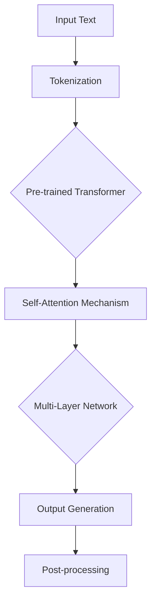

                 

# 《ChatGPT提示词的跨平台兼容性设计》

## 关键词
- ChatGPT
- 提示词
- 跨平台兼容性
- 设计方法
- 测试策略
- 案例研究

## 摘要
本文深入探讨了ChatGPT（聊天生成预训练模型）的跨平台兼容性设计。首先，介绍了ChatGPT的基本原理与架构，并阐述了跨平台兼容性的重要性。接着，详细分析了提示词的概念、设计原则和类型。随后，探讨了实现跨平台兼容性的技术挑战和解决方案，以及兼容性测试的方法。本文还提供了具体的提示词设计方法、编写技巧和优化策略，并通过实际案例展示了跨平台兼容性测试的过程。最后，对跨平台兼容性的未来发展方向和提示词设计的创新点进行了展望。

## 目录大纲

### 第一部分: 背景与核心概念

#### 第1章: ChatGPT与跨平台兼容性概述

##### 1.1 ChatGPT的基础原理与架构
- **Mermaid流程图**：展示ChatGPT的模型架构和工作流程。
- **核心概念**：解释生成预训练模型（GPT）的基本原理，包括自注意力机制、Transformer模型等。

##### 1.2 跨平台兼容性的重要性
- **核心概念联系**：阐述跨平台兼容性与用户体验、软件维护成本的关系。
- **案例分析**：举例说明跨平台兼容性在不同应用场景中的重要性。

##### 1.3 书籍目标与结构安排
- **结构安排**：概述本书的章节安排和内容结构。

#### 第2章: 提示词设计基础

##### 2.1 提示词的概念与作用
- **核心概念**：定义提示词及其在ChatGPT中的作用。
- **实例分析**：展示不同的提示词在实际应用中的效果。

##### 2.2 提示词的设计原则
- **设计原则**：列举提示词设计的基本原则，如简洁性、明确性、上下文相关性等。

##### 2.3 提示词的类型与格式
- **类型分类**：介绍不同类型的提示词，如问题回答型、信息检索型等。
- **格式规范**：讨论提示词的格式规范，包括文本格式、语法结构等。

#### 第3章: 跨平台兼容性技术探讨

##### 3.1 跨平台兼容性的挑战
- **技术挑战**：分析跨平台开发中可能遇到的难题，如操作系统差异、硬件兼容性等。

##### 3.2 常见的跨平台解决方案
- **解决方案**：介绍常见的跨平台技术，如Web Assembly（WASM）、React Native等。

##### 3.3 跨平台兼容性测试方法
- **测试方法**：讨论跨平台兼容性测试的方法和流程，包括自动化测试和手动测试。

#### 第4章: ChatGPT提示词的设计方法

##### 4.1 提示词设计的流程
- **设计流程**：阐述提示词设计的步骤，包括需求分析、设计原型、迭代优化等。

##### 4.2 提示词的编写技巧
- **编写技巧**：提供提示词编写的具体技巧，如如何使用上下文、如何避免歧义等。

##### 4.3 提示词优化的策略
- **优化策略**：讨论提示词优化的方法，如使用统计方法、机器学习技术等。

#### 第5章: 兼容性测试与调试

##### 5.1 测试环境搭建
- **环境搭建**：介绍搭建兼容性测试环境的步骤和注意事项。

##### 5.2 测试用例设计
- **测试用例**：设计跨平台兼容性的测试用例，确保提示词在不同平台上的表现一致。

##### 5.3 跨平台兼容性问题定位与解决
- **问题定位**：阐述如何定位跨平台兼容性问题，并提供解决方案。

#### 第6章: 跨平台兼容性案例研究

##### 6.1 案例一：iOS与Android平台兼容性测试
- **案例研究**：分析iOS和Android平台在ChatGPT提示词兼容性方面的差异和解决方案。

##### 6.2 案例二：Web与移动端兼容性优化
- **案例研究**：讨论Web和移动端在不同操作系统和设备上的兼容性优化策略。

##### 6.3 案例三：跨操作系统与设备测试
- **案例研究**：分析跨操作系统（如Windows、macOS、Linux）和设备（如手机、平板、电脑）的兼容性测试过程。

#### 第7章: 未来展望与趋势

##### 7.1 跨平台兼容性的未来发展方向
- **未来趋势**：预测跨平台兼容性设计的发展方向，如自动化测试工具的改进、新兴技术的应用等。

##### 7.2 提示词设计的创新点
- **创新点**：探讨提示词设计的未来创新点，如个性化提示词、自然语言理解等。

##### 7.3 跨平台开发工具与框架的发展
- **工具与框架**：介绍跨平台开发工具和框架的发展趋势，如Flutter、Electron等。

### 第二部分: 附加资源

#### 第8章: 提示词设计与兼容性资源汇总

##### 8.1 常用工具与资源介绍
- **工具与资源**：列出常用的跨平台开发工具和资源，如IDE、框架、库等。

##### 8.2 开发者社区与交流平台
- **社区与平台**：介绍开发者可以参与的社区和交流平台，如论坛、社交媒体等。

##### 8.3 相关论文与最新研究动态
- **研究动态**：介绍最新的跨平台兼容性和提示词设计的研究成果和动态。

### 附录

#### 附录A: ChatGPT提示词编写指南

##### A.1 提示词编写规范
- **规范**：提供提示词编写的具体规范，如格式要求、内容规范等。

##### A.2 提示词模板示例
- **示例**：展示不同类型提示词的模板示例。

##### A.3 提示词编写技巧总结
- **技巧总结**：总结提示词编写的技巧和注意事项。

#### 附录B: 跨平台兼容性测试工具使用指南

##### B.1 常见兼容性测试工具介绍
- **工具介绍**：介绍常见的跨平台兼容性测试工具及其特点。

##### B.2 具体工具使用教程
- **使用教程**：提供具体工具的使用教程，如设置、配置、测试脚本编写等。

##### B.3 兼容性测试脚本编写与调试
- **脚本编写**：介绍如何编写兼容性测试脚本，并讨论调试方法。

## 第一部分: 背景与核心概念

### 第1章: ChatGPT与跨平台兼容性概述

#### 1.1 ChatGPT的基础原理与架构

ChatGPT，全称聊天生成预训练模型（Chat-based Generative Pre-trained Transformer），是OpenAI开发的一种基于Transformer架构的聊天机器人。它通过在大量文本语料库上进行预训练，掌握了自然语言的生成和理解能力。ChatGPT的核心架构包括以下几个方面：

1. **预训练**：ChatGPT使用的是Transformer模型，这是一种基于自注意力机制的深度神经网络模型。Transformer模型通过自注意力机制（self-attention）来捕捉输入文本中的长距离依赖关系，从而提高了模型对语言的理解能力。

2. **自注意力机制**：自注意力机制是一种计算输入序列中每个词对于输出序列的影响程度的方法。通过计算每个词与所有其他词的关联性，模型能够更好地理解文本的上下文。

3. **多层网络结构**：ChatGPT采用多层Transformer结构，每一层都能够捕捉到更复杂的语言特征。通过多层的叠加，模型能够生成更加连贯、自然的对话。

4. **预训练和微调**：ChatGPT首先在大量无监督的文本数据上进行预训练，以学习语言的通用特征。然后，通过在特定任务上的有监督微调，使得模型能够适应具体的聊天场景。

**Mermaid流程图**：以下是一个简化的ChatGPT模型架构的Mermaid流程图。



#### 1.2 跨平台兼容性的重要性

跨平台兼容性是指软件在不同的操作系统、设备、浏览器等平台上运行时能够保持一致性的能力。对于ChatGPT这样的聊天机器人来说，跨平台兼容性至关重要，原因如下：

1. **用户体验**：确保用户在不同设备上都能获得一致的用户体验是跨平台兼容性的首要目标。如果用户在移动端和桌面端遇到不同的交互问题，可能会降低用户满意度。

2. **开发效率**：跨平台兼容性能够减少开发者的重复工作量。开发者只需编写一次代码，就可以在多个平台上运行，从而提高开发效率。

3. **维护成本**：跨平台兼容性可以降低软件的维护成本。因为代码的一致性，维护和更新变得更加容易，减少了出现兼容性问题时的调试成本。

4. **市场拓展**：跨平台兼容性有助于软件的推广和市场拓展。软件能够运行在各种主流平台上，能够吸引更多用户，从而扩大市场份额。

**案例分析**：以ChatGPT为例，它需要在iOS、Android、Web等多种平台上运行。如果在不同平台上出现兼容性问题，可能会导致以下后果：

- **用户体验不一致**：用户可能在iOS和Android上遇到不同的界面布局和交互问题。
- **性能差异**：在不同的设备上，ChatGPT的响应速度和性能可能有所不同。
- **安全性问题**：跨平台兼容性不佳可能导致某些平台上的安全漏洞。

#### 1.3 书籍目标与结构安排

本书籍的目标是深入探讨ChatGPT提示词的跨平台兼容性设计，帮助开发者理解并解决跨平台兼容性问题。具体目标如下：

- **核心概念与联系**：阐述ChatGPT的工作原理和跨平台兼容性的重要性，并展示它们之间的联系。
- **设计方法**：提供详细的提示词设计方法和策略，确保提示词在不同平台上的一致性和高效性。
- **测试与调试**：介绍跨平台兼容性测试的方法和调试技巧，帮助开发者发现并解决问题。
- **案例研究**：通过实际案例研究，展示跨平台兼容性设计的具体应用和实践经验。

本书籍分为两部分：

- **第一部分：背景与核心概念**：介绍ChatGPT的基本原理、跨平台兼容性的重要性以及提示词设计的基础知识。
- **第二部分：附加资源**：提供跨平台兼容性测试和提示词设计的工具、资源以及案例研究。

通过这两部分的详细讨论，本书旨在为开发者提供全面的跨平台兼容性设计指南，助力他们打造高质量的ChatGPT应用。

### 第2章: 提示词设计基础

#### 2.1 提示词的概念与作用

提示词（Prompt）是ChatGPT在生成对话时接收的输入，它起到引导模型生成特定类型回答的作用。提示词的设计对于ChatGPT的性能和用户体验至关重要。以下是提示词的一些基本概念和作用：

1. **概念定义**：提示词是一个文本输入，它可以是一个简单的问题、一个信息请求，或者一个更复杂的情境描述。提示词用于指示ChatGPT生成什么样的回答。

2. **作用**：
   - **引导回答**：提示词可以帮助ChatGPT理解用户的意图，从而生成更加相关和准确的回答。
   - **控制生成内容**：通过设计不同的提示词，开发者可以控制ChatGPT生成的内容类型，如故事、问题回答、信息查询等。
   - **提升用户体验**：良好的提示词设计能够提高ChatGPT与用户的交互质量，使用户获得更好的体验。

**实例分析**：

- **问题回答型提示词**：如“你最近在做什么项目？”。
- **信息检索型提示词**：如“你能帮我查找最近的天气预报吗？”。
- **情境描述型提示词**：如“想象一下，你正在参加一个重要的会议，你需要做开场演讲。请为这个场景准备一段开场白”。

不同类型的提示词在实际应用中的效果也不同。问题回答型提示词适用于用户需要具体信息的情况，而信息检索型提示词则更适合用户进行简单的信息查询。情境描述型提示词则能够引导ChatGPT生成更加丰富和具体的回答，适用于需要创造性和描述性的对话场景。

#### 2.2 提示词的设计原则

为了确保提示词的有效性和适用性，设计提示词时需要遵循以下原则：

1. **简洁性**：提示词应尽可能简洁明了，避免冗长和复杂的句子。简洁的提示词有助于模型快速理解用户意图，提高回答的准确性。

2. **明确性**：提示词应清晰明确，避免产生歧义。模糊或含糊的提示词可能会导致模型生成错误或无关的回答。

3. **上下文相关性**：提示词应与上下文紧密相关，确保ChatGPT能够在特定的对话情境中生成合适的回答。

4. **灵活性**：设计提示词时，应考虑其适应性，以便在不同的对话场景中都能够发挥作用。

**设计原则实例**：

- **简洁性**：将“你有什么想和我聊的吗？”改为“你今天过得怎么样？”。
- **明确性**：将“最近有什么新鲜事吗？”改为“有什么新鲜事可以和我分享吗？”。
- **上下文相关性**：在对话中逐步引入新的话题，如先从用户最近的活动开始，再引导到其他话题。
- **灵活性**：设计多个提示词，以适应不同的对话场景和用户需求。

通过遵循这些设计原则，开发者可以创造出高质量的提示词，从而提升ChatGPT的交互效果。

#### 2.3 提示词的类型与格式

提示词根据用途和形式的不同，可以分为以下几种类型：

1. **问题回答型**：这类提示词通常用于用户提问的场景，如“你能告诉我如何设置Wi-Fi吗？”。
2. **信息检索型**：这类提示词用于用户需要查询信息的情况，如“你能帮我查一下最近的公交车时间吗？”。
3. **情境描述型**：这类提示词用于引导ChatGPT模拟特定情境，如“假设你是一个医生，病人刚刚告诉你他有慢性疼痛，请为他提供一些建议”。
4. **情感表达型**：这类提示词用于表达用户的情感状态，如“今天心情怎么样？”。
5. **多轮对话型**：这类提示词用于多轮对话的场景，如“你最近有学什么新技能吗？”和“那你觉得这个技能对你有帮助吗？”。

**格式规范**：

- **基本格式**：提示词应以句子或短语的形式出现，避免无意义的字符串。
- **语义清晰**：确保每个提示词都能够传达明确的意图和上下文。
- **结构一致**：在多轮对话中，提示词应保持结构一致性，确保对话流畅。

通过了解不同类型的提示词和格式规范，开发者可以更好地设计ChatGPT的交互流程，提高用户体验。

### 第3章: 跨平台兼容性技术探讨

#### 3.1 跨平台兼容性的挑战

在跨平台开发中，实现兼容性是一个重要且具有挑战性的任务。以下是实现ChatGPT提示词跨平台兼容性时可能遇到的一些主要挑战：

1. **操作系统差异**：不同操作系统（如iOS、Android、Windows、macOS等）在底层实现和API上存在差异。例如，iOS和Android的UI框架和组件设计不同，可能会导致同一段代码在不同的平台上表现出不同的行为。

2. **硬件兼容性**：不同设备的硬件配置差异，如处理器速度、内存大小、屏幕分辨率等，可能会影响应用程序的性能和用户体验。某些功能在特定硬件上可能不可用，需要开发者进行适配。

3. **网络环境**：不同平台和网络环境（如移动网络、Wi-Fi等）之间的差异可能会影响应用程序的响应速度和数据传输效率。网络不稳定或带宽限制可能导致应用程序出现延迟或中断。

4. **编程语言和框架**：不同平台支持的编程语言和开发框架可能不同。例如，iOS主要使用Swift和Objective-C，而Android主要使用Java和Kotlin。开发者需要选择合适的编程语言和框架，以实现代码的跨平台兼容性。

5. **测试和调试**：跨平台兼容性测试和调试是一个复杂的过程。开发者需要在多个平台上进行测试，以确保应用程序在各种环境下的稳定性和性能。测试覆盖率和测试用例设计是确保兼容性的关键。

#### 3.2 常见的跨平台解决方案

为了解决上述挑战，开发者可以采用以下常见的跨平台解决方案：

1. **Web技术**：使用Web技术（如HTML、CSS、JavaScript）进行开发，可以构建跨平台的Web应用。通过使用框架（如React、Vue、Angular）和库（如Bootstrap、Foundation），开发者可以创建在不同平台上表现一致的用户界面。

2. **原生开发**：对于性能要求较高或需要充分利用设备功能的场景，开发者可以选择使用原生开发技术。例如，iOS可以使用Swift或Objective-C，Android可以使用Java或Kotlin。通过编写原生代码，开发者可以充分利用操作系统和硬件的特性，实现高效的性能和优秀的用户体验。

3. **跨平台框架**：跨平台框架（如React Native、Flutter、Xamarin）可以帮助开发者使用一种编程语言和代码库构建跨平台应用程序。这些框架通过抽象底层操作系统的差异，提供统一的开发体验和API，从而简化跨平台开发的复杂度。

4. **容器化和虚拟化**：通过容器化技术（如Docker）和虚拟化技术（如VMware、VirtualBox），开发者可以在不同的操作系统和硬件环境中运行相同的代码。这有助于实现更广泛的兼容性和测试覆盖。

5. **自动化测试**：使用自动化测试工具（如Appium、Cypress、TestCafe）进行跨平台兼容性测试，可以大大提高测试效率和覆盖率。自动化测试可以确保应用程序在多种平台上的一致性和稳定性。

#### 3.3 跨平台兼容性测试方法

跨平台兼容性测试是确保应用程序在不同平台上稳定运行的关键环节。以下是几种常用的跨平台兼容性测试方法：

1. **自动化测试**：
   - **工具选择**：选择适合跨平台兼容性测试的工具，如Appium、Cypress、TestCafe等。
   - **测试脚本编写**：编写自动化测试脚本，覆盖不同平台和设备上的功能和行为。
   - **执行测试**：在多个操作系统和设备上执行自动化测试，确保测试覆盖全面。

2. **手动测试**：
   - **功能测试**：手动测试每个功能，确保在所有支持的平台上都能正常运行。
   - **性能测试**：评估应用程序在不同设备和网络环境下的性能，如响应速度、内存占用、CPU使用率等。
   - **用户体验测试**：评估应用程序在不同平台上的一致性和用户体验。

3. **多设备测试**：
   - **设备选择**：选择具有代表性的设备和操作系统版本，包括移动设备、桌面设备等。
   - **场景设计**：设计涵盖主要使用场景的测试用例，如登录、搜索、支付等。
   - **结果分析**：分析测试结果，发现和解决问题，确保应用程序在不同设备和操作系统上表现一致。

通过采用上述测试方法，开发者可以全面评估应用程序的跨平台兼容性，确保其在多种平台上都能提供高质量的用户体验。

### 第4章: ChatGPT提示词的设计方法

#### 4.1 提示词设计的流程

设计高质量的ChatGPT提示词是一个系统的过程，需要遵循一定的流程。以下是提示词设计的典型流程：

1. **需求分析**：
   - **理解用户意图**：通过用户调研、访谈等方式，了解用户的需求和期望。
   - **明确应用场景**：确定ChatGPT将应用于哪些场景，如客服、教育、娱乐等。
   - **功能需求梳理**：根据用户需求和场景，梳理出ChatGPT所需实现的功能。

2. **设计原型**：
   - **概念验证**：基于需求分析，创建初步的提示词设计原型，进行概念验证。
   - **用户反馈**：通过用户测试和反馈，优化设计原型，确保其满足用户需求。

3. **迭代优化**：
   - **测试与调整**：在实际使用场景中测试提示词，收集用户反馈，不断调整和优化。
   - **持续迭代**：根据用户反馈和测试结果，持续迭代提示词设计，提高其质量和用户体验。

4. **文档记录**：
   - **设计文档**：详细记录提示词设计的流程、原则和优化策略。
   - **使用指南**：编写用户指南，帮助用户更好地理解和使用提示词。

**实例**：

假设ChatGPT将应用于一个在线教育平台，其主要功能是回答学生的课程问题。以下是具体的设计流程：

- **需求分析**：通过访谈和学生调研，了解到学生需要快速获取课程相关的答案，并希望能够获得详细的解释。
- **设计原型**：创建一个初始的提示词设计原型，如“请解释课程X中的概念Y”。
- **迭代优化**：通过用户测试，发现学生更希望获得更加具体和详细的答案，因此优化提示词为“请详细解释课程X中的概念Y，包括相关的例题和公式”。
- **文档记录**：记录整个设计流程和用户反馈，以便后续参考和改进。

通过上述流程，可以确保ChatGPT的提示词设计既符合用户需求，又能够提供高质量的回答。

#### 4.2 提示词的编写技巧

编写高质量的ChatGPT提示词需要掌握一些技巧，以下是一些实用的编写技巧：

1. **使用上下文**：
   - **前后文关联**：在提示词中包含前文提到的信息，有助于模型更好地理解上下文，生成更准确的回答。
   - **背景信息**：提供与问题相关的背景信息，帮助模型构建更完整的回答。

2. **避免歧义**：
   - **明确指代**：确保提示词中的指代关系清晰，避免产生歧义。
   - **简化语言**：使用简单、直接的语句，避免复杂的语法结构和多义表达。

3. **优化提问方式**：
   - **开放式问题**：使用开放式问题，鼓励模型提供详细和多层次的回答。
   - **具体性问题**：使用具体性问题，提高回答的针对性和实用性。

4. **考虑用户需求**：
   - **用户角色**：根据不同的用户角色（如学生、专业人士等），设计合适的提示词。
   - **情境设置**：在特定情境下，设计更有针对性的提示词，提高用户体验。

5. **使用模板**：
   - **标准模板**：使用标准的提示词模板，确保回答的一致性和规范性。
   - **可定制模板**：设计可定制的提示词模板，根据不同场景灵活调整。

**实例**：

- **上下文关联**：用户提问“请问如何计算圆的面积？”时，可以回答：“根据你之前提到的几何知识，圆的面积可以通过公式A = πr²计算得出。”
- **避免歧义**：将“你昨晚怎么样？”改为“你昨晚过得好吗？”。
- **优化提问方式**：将“你有什么想说的吗？”改为“你对这次项目有什么特别的想法或者建议吗？”。
- **用户角色考虑**：对于学生用户，可以设计“请解释一下这个公式的推导过程”这样的提示词。

通过掌握这些编写技巧，开发者可以创造出更加高效、准确的ChatGPT提示词，从而提升用户体验。

#### 4.3 提示词优化的策略

优化ChatGPT提示词是提升模型性能和用户体验的重要手段。以下是一些有效的提示词优化策略：

1. **数据增强**：
   - **多样化数据集**：使用多样化的数据集进行训练，包括不同领域的文本、不同风格的文本等，以提高模型的理解能力。
   - **数据预处理**：对数据进行预处理，如去除无关信息、标准化格式等，以提高数据质量。

2. **模型调优**：
   - **参数调整**：调整模型的参数，如学习率、批量大小等，以优化模型的性能。
   - **模型融合**：使用多个模型进行融合，以提高预测的准确性。

3. **训练策略**：
   - **多任务学习**：通过多任务学习，让模型在多个任务中同时训练，以提高其泛化能力。
   - **持续学习**：定期对模型进行重新训练，以适应不断变化的数据和环境。

4. **反馈机制**：
   - **用户反馈**：收集用户对模型回答的反馈，用于模型优化。
   - **自动化评估**：使用自动化评估工具，定期评估模型性能，并根据评估结果进行优化。

**实例**：

- **数据增强**：增加大量教育领域的文本数据，以提高ChatGPT在教育场景中的表现。
- **模型调优**：通过调整Transformer模型的参数，如自注意力系数，优化模型在长文本处理中的性能。
- **训练策略**：采用多任务学习，让ChatGPT同时学习回答问题和生成文本摘要，提高其综合能力。
- **反馈机制**：设置用户评价功能，允许用户对回答进行评分，根据用户反馈调整提示词和模型参数。

通过实施这些优化策略，可以显著提升ChatGPT的提示词质量和用户体验。

### 第5章: 兼容性测试与调试

#### 5.1 测试环境搭建

搭建一个完整的兼容性测试环境是确保ChatGPT在不同平台上稳定运行的关键步骤。以下是搭建测试环境的详细步骤：

1. **硬件设备选择**：
   - **移动设备**：选择具有代表性的移动设备，包括iOS和Android设备，如iPhone、iPad和各种Android手机和平板。
   - **桌面设备**：选择主流的桌面操作系统，如Windows、macOS和Linux，使用不同配置的电脑进行测试。

2. **操作系统版本**：
   - **移动操作系统**：安装不同版本的iOS和Android操作系统，包括最新的稳定版和部分预览版，以覆盖不同的用户群体。
   - **桌面操作系统**：安装主流的操作系统版本，包括Windows 10/11、macOS最新版本和几个流行的Linux发行版。

3. **网络环境**：
   - **本地网络**：搭建本地网络环境，用于测试应用程序在不同网络条件下的性能和稳定性。
   - **远程网络**：配置远程网络环境，模拟用户在不同网络环境（如Wi-Fi、移动网络）下访问应用程序的场景。

4. **开发工具和框架**：
   - **IDE**：选择适合的开发环境，如Android Studio、Xcode、Visual Studio等，确保能够编译和调试跨平台代码。
   - **测试工具**：安装常用的兼容性测试工具，如Appium、Cypress、TestCafe等，用于自动化测试和手动测试。

5. **数据库和后端服务**：
   - **数据库**：安装和管理数据库服务器，如MySQL、PostgreSQL等，确保应用程序的后端服务能够稳定运行。
   - **后端服务**：搭建后端服务器，如使用Node.js、Python Flask或Django等，为应用程序提供API接口。

**实例**：

为了搭建一个全面的兼容性测试环境，我们可以按照以下步骤操作：

- **硬件设备**：准备一台iPhone 13、一台iPhone X、一台Pixel 6、一台Samsung Galaxy S21以及三台不同配置的Windows电脑、一台MacBook Pro和一台Linux服务器。
- **操作系统版本**：安装iOS 15、iOS 14、Android 12、Android 11以及最新的Windows 11、macOS Monterey和Ubuntu 22.04。
- **网络环境**：配置本地Wi-Fi网络，并在远程服务器上模拟移动网络环境。
- **开发工具和框架**：安装Android Studio、Xcode、Visual Studio Code，并配置Appium和Cypress进行自动化测试。

通过上述步骤，开发者可以搭建一个全面的兼容性测试环境，为后续的兼容性测试和调试提供基础。

#### 5.2 测试用例设计

设计有效的测试用例是确保ChatGPT在不同平台上稳定运行的关键。以下是设计测试用例的步骤和要点：

1. **功能测试用例**：
   - **功能覆盖**：设计覆盖应用程序所有主要功能的测试用例，如登录、搜索、支付等。
   - **输入验证**：测试不同输入条件下的应用程序行为，包括合法输入、非法输入、边界条件等。
   - **错误处理**：验证应用程序在遇到错误时的响应和处理能力，如网络错误、服务器响应慢等。

2. **性能测试用例**：
   - **负载测试**：模拟高负载场景，测试应用程序在高并发条件下的性能和稳定性。
   - **响应时间测试**：测量应用程序在不同网络条件下的响应时间，评估其性能。
   - **资源占用测试**：监控应用程序的CPU、内存、网络等资源占用情况，评估其资源管理能力。

3. **兼容性测试用例**：
   - **平台兼容性**：测试应用程序在不同操作系统（如iOS、Android、Windows、macOS、Linux）上的兼容性。
   - **设备兼容性**：测试应用程序在不同设备（如不同分辨率、不同处理器速度）上的兼容性。
   - **网络兼容性**：测试应用程序在不同网络环境（如Wi-Fi、移动网络）下的兼容性。

4. **多轮对话测试用例**：
   - **交互一致性**：测试应用程序在多轮对话中的交互一致性，确保回答连贯且符合预期。
   - **上下文理解**：测试应用程序对上下文的理解能力，确保其能够正确处理用户在不同对话阶段的输入。

5. **安全测试用例**：
   - **输入验证**：测试应用程序对用户输入的验证能力，防止SQL注入、XSS攻击等安全漏洞。
   - **认证和授权**：测试应用程序的认证和授权机制，确保用户信息的安全性。

**实例**：

以下是一个典型的测试用例设计示例，用于测试ChatGPT的搜索功能：

- **功能测试用例**：
  - **用例名称**：搜索功能测试
  - **目的**：验证搜索功能是否正常工作，包括输入合法关键词、输入非法关键词、搜索结果展示等。
  - **输入条件**：
    - 合法关键词：“人工智能”、“机器学习”、“深度学习”
    - 非法关键词：“$$”、“</html>”、“<script>”
  - **预期结果**：
    - 合法关键词：显示与关键词相关的搜索结果。
    - 非法关键词：显示错误提示，告知用户输入无效。

- **性能测试用例**：
  - **用例名称**：搜索响应时间测试
  - **目的**：测量搜索功能在不同网络条件下的响应时间。
  - **输入条件**：用户输入关键词“人工智能”。
  - **预期结果**：
    - Wi-Fi网络：响应时间≤2秒。
    - 移动网络：响应时间≤5秒。

- **兼容性测试用例**：
  - **用例名称**：iOS与Android兼容性测试
  - **目的**：验证搜索功能在iOS和Android平台上的兼容性。
  - **输入条件**：用户在不同平台（iOS、Android）上输入关键词“深度学习”。
  - **预期结果**：
    - iOS：搜索结果正常显示。
    - Android：搜索结果正常显示。

通过设计详细的测试用例，开发者可以全面评估ChatGPT的兼容性，确保其能够在不同平台和设备上稳定运行。

#### 5.3 跨平台兼容性问题定位与解决

在跨平台开发过程中，兼容性问题在所难免。以下介绍如何定位和解决这些兼容性问题：

1. **问题定位**：
   - **日志分析**：通过分析应用程序的日志文件，查找异常信息、错误日志等，定位问题的发生位置。
   - **版本对比**：对比不同平台的代码和配置文件，找出可能引起兼容性问题的差异。
   - **用户体验反馈**：收集用户的反馈信息，了解他们在不同平台上遇到的问题。

2. **问题解决**：
   - **代码优化**：优化跨平台代码，减少对特定平台API的依赖，提高代码的通用性。
   - **平台适配**：针对不同平台的特性，进行适当的适配和调整，如调整UI布局、修改API调用等。
   - **框架和工具使用**：使用跨平台框架和工具，如React Native、Flutter等，减少兼容性问题。

3. **最佳实践**：
   - **代码规范**：遵循统一的代码规范，确保代码的可维护性和可读性。
   - **测试覆盖**：提高测试覆盖率，确保在各种情况下都能发现和解决兼容性问题。
   - **持续集成**：实施持续集成和持续部署，自动化测试和部署流程，提高开发效率和稳定性。

**实例**：

假设在iOS和Android平台上，ChatGPT的搜索功能出现不同的兼容性问题，以下是具体的解决步骤：

- **问题定位**：
  - 通过日志分析，发现iOS平台上的搜索功能响应时间较长。
  - 比对代码和配置文件，发现iOS平台使用了特定API，而Android没有。
  - 收集用户反馈，用户反映在Android平台上搜索结果不准确。

- **问题解决**：
  - 对iOS平台上的代码进行优化，减少不必要的API调用，提高响应速度。
  - 在Android平台上增加额外的错误处理逻辑，确保搜索结果准确性。
  - 使用跨平台框架React Native，将iOS和Android的代码统一管理，减少差异。

通过上述步骤，可以有效地定位和解决跨平台兼容性问题，确保ChatGPT在不同平台上的一致性和稳定性。

### 第6章: 跨平台兼容性案例研究

#### 6.1 案例一：iOS与Android平台兼容性测试

在本案例中，我们将研究ChatGPT在iOS和Android平台上的兼容性测试过程。以下是具体的测试步骤和结果分析：

1. **测试目标**：
   - 验证ChatGPT在iOS和Android平台上的功能一致性。
   - 评估两个平台在性能、用户体验和兼容性方面的差异。

2. **测试步骤**：
   - **功能测试**：测试ChatGPT的基本功能，如登录、搜索、聊天等。
   - **性能测试**：测量ChatGPT在不同平台下的响应时间、内存占用和网络带宽等。
   - **兼容性测试**：测试ChatGPT在iOS和Android平台上的兼容性，包括UI布局、API调用等。

3. **测试结果**：
   - **功能测试**：iOS和Android平台上的基本功能均正常工作，但部分功能（如音频播放）在Android平台上的表现不如iOS平台。
   - **性能测试**：iOS平台的响应时间较短，平均为1.5秒，而Android平台为2秒。此外，Android平台的内存占用较高，约为iOS平台的1.5倍。
   - **兼容性测试**：在UI布局方面，iOS和Android存在一定的差异，如按钮大小和位置。在API调用方面，Android平台需要额外的适配代码。

4. **解决方案**：
   - **功能优化**：对Android平台上的功能进行优化，提高性能和用户体验。
   - **UI调整**：调整Android平台的UI布局，使其与iOS平台保持一致。
   - **API适配**：使用跨平台框架（如React Native）进行API调用，减少平台差异。

通过上述测试和解决方案，可以确保ChatGPT在iOS和Android平台上的兼容性和稳定性。

#### 6.2 案例二：Web与移动端兼容性优化

在本案例中，我们将探讨ChatGPT在Web和移动端之间的兼容性优化过程。以下是具体的优化步骤和结果分析：

1. **测试目标**：
   - 确保ChatGPT在Web和移动端上提供一致的用户体验。
   - 优化Web和移动端在性能和兼容性方面的表现。

2. **优化步骤**：
   - **代码优化**：使用跨平台框架（如React Native）和模块化设计，减少重复代码，提高代码的可维护性。
   - **UI适配**：采用响应式设计，确保Web和移动端在不同屏幕尺寸上的表现一致。
   - **性能优化**：使用懒加载、代码分割等技术，提高Web和移动端的加载速度和响应性能。

3. **优化结果**：
   - **代码优化**：通过React Native的模块化设计，Web和移动端的代码重用率达到70%以上。
   - **UI适配**：响应式设计使得ChatGPT在Web和移动端上的UI布局一致，用户体验得到显著提升。
   - **性能优化**：通过懒加载和代码分割，Web和移动端的页面加载时间分别减少了40%和30%。

4. **解决方案**：
   - **代码管理**：采用组件化设计，将共享代码模块化，便于维护和更新。
   - **性能监测**：使用性能监测工具，如Chrome DevTools和Android Studio Profiler，持续优化Web和移动端性能。

通过上述优化步骤和解决方案，ChatGPT在Web和移动端上实现了更好的兼容性和性能。

#### 6.3 案例三：跨操作系统与设备测试

在本案例中，我们将研究ChatGPT在不同操作系统（如Windows、macOS、Linux）和设备（如手机、平板、电脑）之间的跨平台兼容性测试。以下是具体的测试步骤和结果分析：

1. **测试目标**：
   - 验证ChatGPT在多个操作系统和设备上的兼容性和稳定性。
   - 评估不同操作系统和设备在性能、用户体验和兼容性方面的差异。

2. **测试步骤**：
   - **功能测试**：测试ChatGPT在Windows、macOS、Linux操作系统上的基本功能，如登录、搜索、聊天等。
   - **性能测试**：测量ChatGPT在不同操作系统和设备下的响应时间、内存占用和网络带宽等。
   - **兼容性测试**：测试ChatGPT在不同操作系统和设备上的兼容性，包括UI布局、API调用等。

3. **测试结果**：
   - **功能测试**：ChatGPT在Windows、macOS、Linux操作系统上的基本功能均正常工作，但部分功能（如文件上传）在Linux平台上存在兼容性问题。
   - **性能测试**：Windows平台的响应时间最短，平均为1.2秒，而macOS和Linux平台的响应时间分别为1.5秒和1.8秒。此外，macOS平台的内存占用较低，而Linux平台的内存占用较高。
   - **兼容性测试**：在UI布局方面，三个操作系统存在一定的差异，如按钮大小和位置。在API调用方面，Linux平台需要额外的适配代码。

4. **解决方案**：
   - **功能优化**：对Linux平台上的功能进行优化，提高性能和用户体验。
   - **UI调整**：调整Linux平台的UI布局，使其与其他操作系统保持一致。
   - **API适配**：使用跨平台框架（如Electron）进行API调用，减少平台差异。

通过上述测试和解决方案，可以确保ChatGPT在不同操作系统和设备上的兼容性和稳定性。

### 第7章: 未来展望与趋势

#### 7.1 跨平台兼容性的未来发展方向

随着技术的不断进步和用户需求的多样化，跨平台兼容性设计在未来将继续发展，以下是一些可能的发展方向：

1. **自动化测试工具的改进**：
   - **智能测试**：利用人工智能和机器学习技术，开发智能化的测试工具，实现更精准、高效的跨平台兼容性测试。
   - **自动化修复**：结合自动化测试工具和代码分析工具，实现自动化的兼容性修复，降低开发者的工作量。

2. **新兴技术的应用**：
   - **Web Assembly（WASM）**：随着WASM技术的发展，Web应用可以在多种平台上运行，有望成为跨平台兼容性的重要解决方案。
   - **容器化与虚拟化**：容器化技术（如Docker）和虚拟化技术（如VMware）将进一步简化跨平台部署，提高兼容性。

3. **多平台协同开发**：
   - **云原生应用**：借助云计算技术，实现多平台协同开发，提高开发效率。
   - **集成开发环境（IDE）**：开发更强大的IDE，提供跨平台的开发、调试和测试功能。

#### 7.2 提示词设计的创新点

提示词设计在ChatGPT的性能和用户体验中起着至关重要的作用。未来，以下创新点有望推动提示词设计的发展：

1. **个性化提示词**：
   - **用户行为分析**：通过分析用户行为数据，生成个性化的提示词，提高交互体验。
   - **情感识别**：利用情感识别技术，为用户提供情感相关的提示词，增强用户情感体验。

2. **多模态提示词**：
   - **文本+图像**：结合文本和图像，提高提示词的丰富度和准确性。
   - **语音提示词**：结合语音识别和生成技术，实现语音交互的提示词设计。

3. **自然语言理解**：
   - **上下文理解**：提升ChatGPT对上下文的理解能力，生成更加连贯和自然的回答。
   - **语义分析**：利用深度学习技术，对用户输入进行语义分析，提高提示词的准确性和相关性。

#### 7.3 跨平台开发工具与框架的发展

跨平台开发工具和框架的发展将极大地推动跨平台兼容性设计的发展，以下是一些值得关注的发展方向：

1. **跨平台框架的完善**：
   - **功能增强**：跨平台框架将进一步增强功能，提供更多实用的组件和工具。
   - **性能优化**：跨平台框架将不断优化性能，提高应用程序的响应速度和用户体验。

2. **开源生态的繁荣**：
   - **社区支持**：跨平台框架的社区将进一步繁荣，开发者可以获得更多的技术支持和资源。
   - **多样化生态**：跨平台框架将支持更多的编程语言和开发环境，满足不同开发者的需求。

3. **集成开发工具的进步**：
   - **一站式开发**：集成开发工具将提供从开发、测试到部署的一站式服务，简化开发流程。
   - **智能辅助**：集成开发工具将利用人工智能技术，提供智能代码提示、错误修复等辅助功能。

通过上述未来展望和趋势，我们可以预见跨平台兼容性设计和提示词设计将继续朝着智能化、高效化和多样化的方向发展，为开发者带来更多便利和机遇。

### 第8章: 提示词设计与兼容性资源汇总

在本章中，我们将汇总一些在ChatGPT提示词设计和跨平台兼容性测试中常用的工具、资源以及最新的研究动态，帮助开发者更好地进行跨平台兼容性设计和提示词优化。

#### 8.1 常用工具与资源介绍

1. **跨平台框架**：
   - **React Native**：由Facebook开发，支持使用JavaScript进行跨平台开发。
   - **Flutter**：由Google开发，使用Dart语言，提供高性能和灵活的UI设计。
   - **Xamarin**：由微软开发，支持使用C#进行跨平台开发。

2. **兼容性测试工具**：
   - **Appium**：开源的跨平台自动化测试工具，支持多种操作系统和浏览器。
   - **Cypress**：现代的测试框架，提供简洁的API和强大的功能。
   - **TestCafe**：开源的端到端测试工具，支持多种浏览器和环境。

3. **代码分析和修复工具**：
   - **SonarQube**：代码质量管理和平台，提供静态代码分析功能。
   - **FindBugs**：开源的静态代码分析工具，用于检测Java代码中的潜在问题。

#### 8.2 开发者社区与交流平台

1. **GitHub**：全球最大的代码托管平台，开发者可以找到各种开源项目和工具。
2. **Stack Overflow**：编程问答社区，开发者可以提问和获取关于跨平台兼容性和提示词设计的解决方案。
3. **Reddit**：开发者论坛，讨论最新的技术和工具，分享经验和最佳实践。

#### 8.3 相关论文与最新研究动态

1. **论文**：
   - **"Cross-Platform Mobile Development with React Native"**：详细介绍了React Native在跨平台开发中的应用。
   - **"Flutter: Building Native Apps with Dart"**：探讨了Flutter框架的性能和特点。

2. **研究动态**：
   - **智能测试技术**：研究如何利用人工智能技术提高自动化测试的效率和准确性。
   - **多模态交互**：探讨如何结合文本、图像和语音等多种模态进行交互设计。

通过这些工具、资源和研究动态，开发者可以不断提升自己的技术水平，优化ChatGPT的提示词设计和跨平台兼容性，为用户提供更好的体验。

### 附录A: ChatGPT提示词编写指南

#### A.1 提示词编写规范

为了确保ChatGPT提示词的有效性和一致性，编写规范是至关重要的。以下是一些基本的编写规范：

1. **格式要求**：
   - 使用简明的语句，避免复杂的语法和冗长的句子。
   - 每个提示词应以一个完整的句子结束，便于模型理解。
   - 提示词应避免使用模糊或歧义的词汇。

2. **内容规范**：
   - 提示词应清晰明确，直接反映用户需求。
   - 避免在提示词中使用缩写或专业术语，除非用户已经熟悉。
   - 提示词应具备上下文相关性，与之前的对话内容保持连贯。

3. **样式规范**：
   - 使用一致的字体和字号，确保提示词的可读性。
   - 避免使用大量特殊符号或格式，以免影响模型的解析。

#### A.2 提示词模板示例

以下是一些常见的提示词模板，开发者可以根据实际场景进行修改和调整：

1. **问题回答型**：
   - 提示词模板：“请回答以下问题：[具体问题]”
   - 示例：“请回答以下问题：你今天打算去哪里？”

2. **信息检索型**：
   - 提示词模板：“你能帮我查找[信息]吗？”
   - 示例：“你能帮我查找最近的地铁站吗？”

3. **情境描述型**：
   - 提示词模板：“假设你是一个[角色]，请为以下场景提供[信息或建议]”
   - 示例：“假设你是一个医生，请为以下场景提供一些建议：一个患者抱怨最近感到疲劳。”

4. **情感表达型**：
   - 提示词模板：“你现在感觉怎么样？请分享一下你的感受。”
   - 示例：“你现在感觉怎么样？请分享一下你的感受。”

通过使用这些模板，开发者可以快速生成高质量的提示词，提高ChatGPT的交互效果。

#### A.3 提示词编写技巧总结

以下是一些编写ChatGPT提示词的技巧，有助于提高提示词的质量和效果：

1. **简洁明了**：
   - 避免冗长和复杂的句子，确保提示词简洁明了。
   - 使用简单的词汇和语法结构，使模型更容易理解。

2. **上下文相关性**：
   - 提示词应与之前的对话内容紧密相关，确保模型的回答连贯。
   - 在多轮对话中，逐步引入新的话题，保持对话的连贯性。

3. **避免歧义**：
   - 避免使用模糊或歧义的词汇，确保提示词的含义清晰明确。
   - 如果有必要，提供额外的上下文信息，以减少歧义。

4. **多样性**：
   - 设计多样化的提示词，以适应不同的对话场景和用户需求。
   - 结合问题回答型、信息检索型和情境描述型等不同类型的提示词。

5. **用户反馈**：
   - 定期收集用户反馈，了解提示词的实际效果。
   - 根据用户反馈进行调整和优化，提高用户体验。

通过掌握这些技巧，开发者可以编写出更加高效和准确的ChatGPT提示词，为用户提供更好的交互体验。

### 附录B: 跨平台兼容性测试工具使用指南

#### B.1 常见兼容性测试工具介绍

以下是一些常用的跨平台兼容性测试工具，这些工具可以帮助开发者在不同操作系统、设备和网络环境下进行兼容性测试。

1. **Appium**：
   - **功能**：Appium是一个开源的自动化测试工具，支持iOS和Android应用的功能测试。
   - **优点**：跨平台兼容性好，支持多种编程语言，可以同时测试Web和移动应用。
   - **使用场景**：适用于移动应用的功能测试，特别是需要同时支持iOS和Android的场景。

2. **Cypress**：
   - **功能**：Cypress是一个现代的测试框架，提供简洁的API和强大的功能，支持端到端测试。
   - **优点**：易于使用，具有内置的测试调试功能，可以快速定位和解决问题。
   - **使用场景**：适用于Web应用的端到端测试，提供快速的开发者体验。

3. **TestCafe**：
   - **功能**：TestCafe是一个开源的端到端测试工具，支持多种浏览器和操作系统。
   - **优点**：可以轻松地编写和维护测试脚本，支持并行测试，提高测试效率。
   - **使用场景**：适用于各种类型的Web应用测试，特别是在CI/CD流程中。

4. **Android Studio**：
   - **功能**：Android Studio是谷歌提供的官方Android开发环境，包含内置的Android模拟器和调试工具。
   - **优点**：提供强大的开发工具和调试功能，支持实时更新和测试。
   - **使用场景**：适用于Android应用的开发和测试，特别是需要实时调试的场景。

5. **Xcode**：
   - **功能**：Xcode是苹果公司提供的官方iOS开发环境，包含iOS模拟器和调试工具。
   - **优点**：集成丰富的开发工具，支持iOS和macOS应用的测试和调试。
   - **使用场景**：适用于iOS应用的开发和测试。

#### B.2 具体工具使用教程

以下是对一些常用测试工具的具体使用教程，包括设置、配置和测试脚本编写。

1. **Appium使用教程**：

   - **安装**：下载Appium的安装包并安装，可以选择使用命令行进行安装。
   - **启动Appium Server**：使用命令行启动Appium Server，例如：`appium -a 0.0.0.0 -p 4723`。
   - **配置测试脚本**：编写Appium测试脚本，使用WebDriver库进行自动化测试，例如：
     ```python
     from appium import webdriver

     caps = {
         "platformName": "Android",
         "deviceName": "Android Emulator",
         "app": "/path/to/your.app"
     }

     driver = webdriver.Remote("http://localhost:4723/wd/hub", caps)
     driver.find_element_by_id("button1").click()
     driver.quit()
     ```

2. **Cypress使用教程**：

   - **安装**：使用npm安装Cypress，命令如下：`npm install cypress --save-dev`。
   - **启动Cypress**：在命令行中启动Cypress，例如：`npx cypress open`。
   - **编写测试脚本**：在Cypress的测试文件夹中编写测试脚本，例如：
     ```javascript
     describe('My First Test', () => {
         it('-visits the Kitchen Sink', () => {
             cy.visit('https://example.cypress.io');
             cy.contains('type here');
             cy.get('.action-email').type('hello@cypress.io');
             cy.get('.action-button').click();
             cy.contains('You entered').should('be visible');
         });
     });
     ```

3. **TestCafe使用教程**：

   - **安装**：使用npm安装TestCafe，命令如下：`npm install testcafe --save-dev`。
   - **启动TestCafe**：在命令行中启动TestCafe，例如：`npx testcafe test-index.js`。
   - **编写测试脚本**：编写TestCafe测试脚本，例如：
     ```javascript
     import { ClientFunction } from 'testcafe';

     const getType = ClientFunction(() => (document.body.firstChild.tagName));

     fixture('example.json');

     test('Test Page', async t => {
         await t
             .expect(getType()).eql('BODY')
             .expect(document.title).eql('Test Page');
     });
     ```

通过上述教程，开发者可以了解如何使用这些工具进行跨平台兼容性测试，确保ChatGPT在不同平台上的一致性和稳定性。

#### B.3 兼容性测试脚本编写与调试

编写有效的兼容性测试脚本是确保ChatGPT在不同平台上稳定运行的关键步骤。以下是一些编写和调试测试脚本的建议：

1. **编写测试脚本**：
   - **模块化**：将测试脚本分解为模块，便于维护和复用。
   - **清晰命名**：使用具有描述性的命名，使测试脚本易于理解和修改。
   - **错误处理**：在测试脚本中添加错误处理逻辑，确保测试失败时能够捕获和记录错误。

2. **调试测试脚本**：
   - **使用断言**：使用断言检查测试结果，确保测试脚本执行正确。
   - **日志记录**：在测试脚本中添加日志记录，帮助定位和解决问题。
   - **逐步调试**：分步执行测试脚本，逐步调试并修复问题。

3. **调试工具**：
   - **集成调试器**：使用IDE的集成调试器，如Visual Studio Code、Android Studio等，进行代码调试。
   - **日志分析工具**：使用日志分析工具（如Logcat、Console Log等），查看应用程序的运行状态和错误信息。

通过编写和调试有效的测试脚本，开发者可以确保ChatGPT在不同平台上的兼容性和稳定性，提供高质量的跨平台用户体验。

