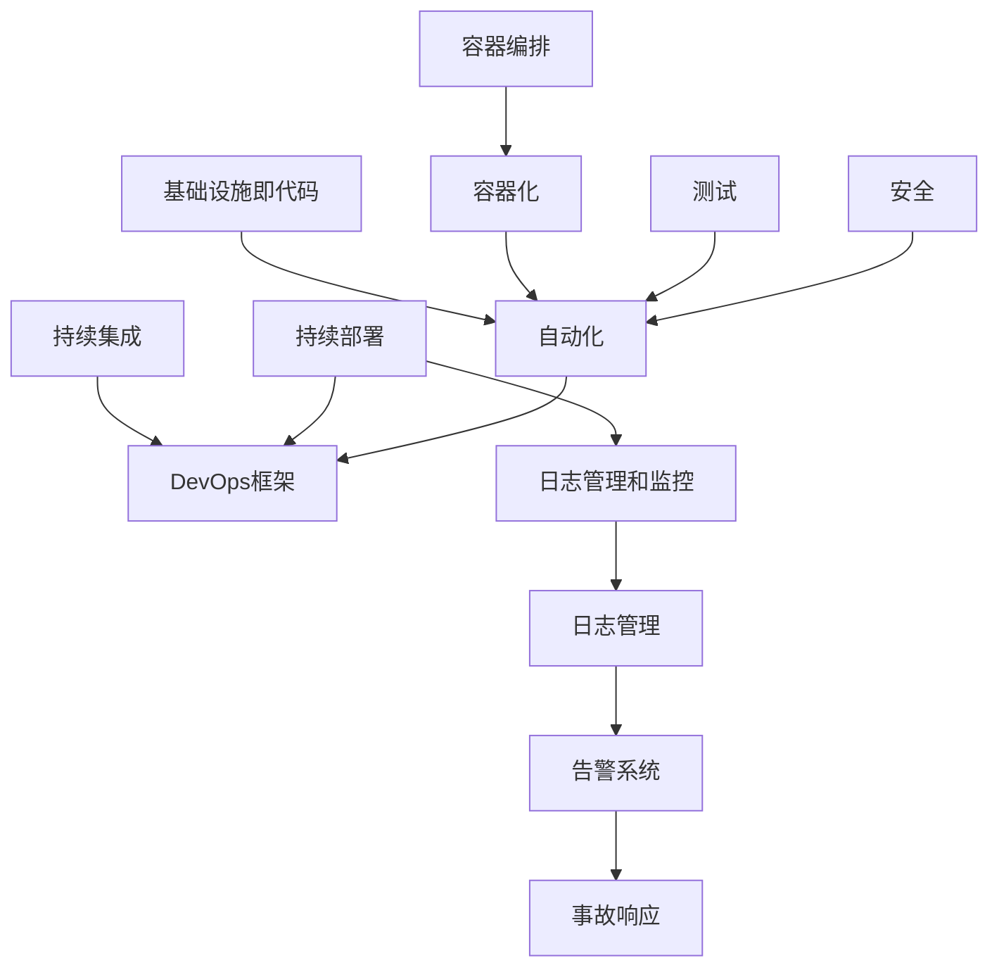
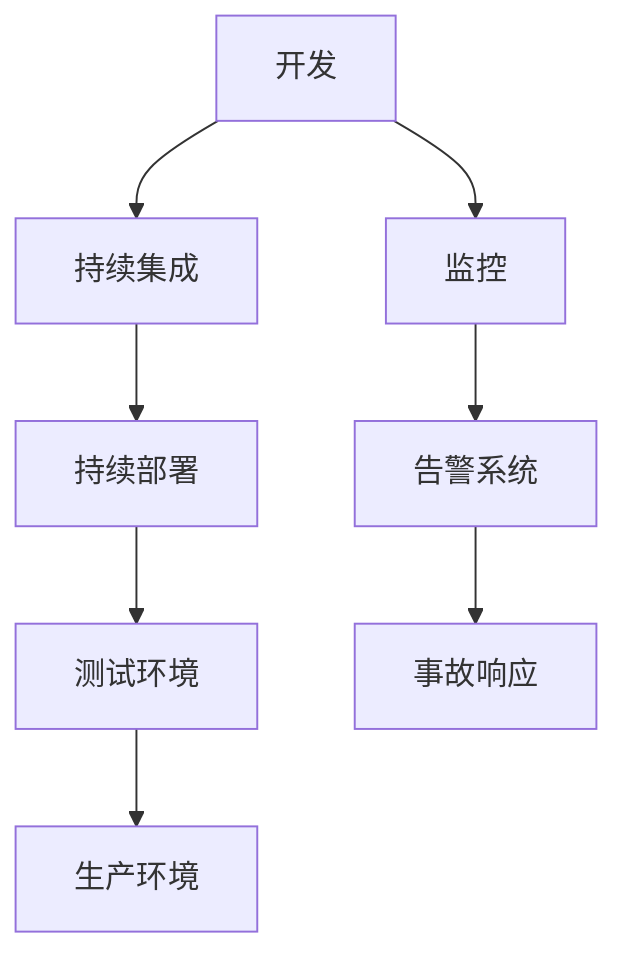
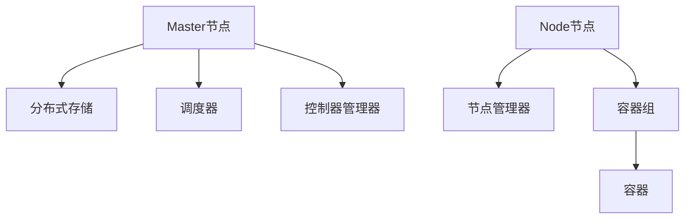

                 

## DevOps工程：自动化和监控

### 核心关键词

- DevOps
- 自动化
- 监控
- 持续集成（CI）
- 持续部署（CD）
- 基础设施即代码（IaC）
- 容器化
- Kubernetes
- 日志管理
- 自动化测试
- 安全自动化

### 摘要

本文深入探讨了DevOps工程中的自动化和监控两大关键领域。首先，我们将从DevOps的概念和历史背景出发，详细解析其核心原则和关键角色，并通过实践案例展示其在现代软件开发中的应用。随后，文章将聚焦于基础设施自动化，介绍基础设施即代码（IaC）的概念和常用工具，以及配置管理和自动化部署工具的使用。接下来，我们将深入容器化和容器编排，特别是Docker和Kubernetes，探讨其在DevOps工程中的重要作用。文章还将讨论持续集成与持续部署（CI/CD）的概念和流程，以及日志管理和监控工具的选择和配置。此外，自动化测试和安全自动化的重要性及其实现方法也将被详细阐述。最后，通过实际案例研究和附录部分，进一步巩固文章的内容，并提供丰富的学习资源和项目实战指导。本文旨在为读者提供一个全面而深入的DevOps自动化和监控的实践指南。

### 《DevOps工程：自动化和监控》目录大纲

为了使读者能够更好地理解和跟随文章的结构，下面列出了详细的目录大纲，包括每个章节的主要内容和目的。

#### 第一部分：DevOps基础

**第1章：DevOps概述**
- **1.1 DevOps的概念**
  - DevOps的历史背景
  - DevOps的目标
- **1.2 DevOps的核心原则**
  - 持续集成（CI）
  - 持续部署（CD）
  - 容器化
  - 自动化
- **1.3 DevOps的关键角色**
  - 开发者
  - 运维人员
  - 产品经理
- **1.4 DevOps实践案例**
  - 跨部门协作
  - 代码审查流程
  - 部署策略

**第2章：基础设施自动化**
- **2.1 基础设施即代码（IaC）**
  - IaC的概念
  - 常用的IaC工具
  - IaC的优势
- **2.2 配置管理工具**
  - Ansible
  - Chef
  - Puppet
- **2.3 自动化部署工具**
  - Jenkins
  - GitLab CI/CD
  - Azure DevOps

**第3章：容器化和容器编排**
- **3.1 容器化概述**
  - 容器的概念
  - 容器的优点
  - 容器化技术
- **3.2 Docker**
  - Docker的基本概念
  - Docker镜像
  - Docker容器
  - Docker Compose
- **3.3 Kubernetes**
  - Kubernetes的基本概念
  - Kubernetes架构
  - Kubernetes核心组件

#### 第二部分：自动化和监控

**第4章：持续集成与持续部署**
- **4.1 持续集成（CI）**
  - CI的概念
  - CI的工作流程
  - CI的工具选择
- **4.2 持续部署（CD）**
  - CD的概念
  - CD的工作流程
  - CD的工具选择
- **4.3 持续交付（CD）**
  - CD与CI/CD的关系
  - CD的流程
  - CD的实际应用

**第5章：日志管理和监控**
- **5.1 日志管理概述**
  - 日志的重要性
  - 日志的格式
  - 日志存储
- **5.2 日志聚合工具**
  - Logstash
  - Fluentd
  - Logz.io
- **5.3 监控工具**
  - Prometheus
  - Grafana
  - Nagios

**第6章：自动化测试**
- **6.1 自动化测试概述**
  - 自动化测试的重要性
  - 自动化测试的类型
  - 自动化测试的优势
- **6.2 测试工具**
  - Selenium
  - JUnit
  - TestNG
- **6.3 性能测试**
  - JMeter
  - LoadRunner
  - Locust

**第7章：安全自动化**
- **7.1 安全自动化概述**
  - 安全自动化的重要性
  - 安全自动化与DevOps
  - 安全自动化的挑战
- **7.2 安全自动化工具**
  - OWASP ZAP
  - Burp Suite
  - Kubernetes Security
- **7.3 安全策略与流程**
  - 安全评估
  - 安全培训
  - 安全审计

**第8章：案例研究**
- **8.1 案例一：某电商公司的DevOps实践**
- **8.2 案例二：金融行业的自动化与监控**
- **8.3 案例三：医疗机构的DevOps转型**

#### 附录

**附录A：DevOps工具和资源**
- **A.1 DevOps工具对比**
  - Jenkins vs GitLab CI
  - Prometheus vs Nagios
- **A.2 DevOps学习资源**
  - 在线教程
  - 开源项目
  - 专业书籍

**附录B：Mermaid流程图**
- DevOps流程图
- Kubernetes架构图

**附录C：核心算法原理讲解与伪代码**
- 自动化部署算法原理
- 监控数据收集算法原理

**附录D：数学模型和公式**
- 持续集成效率模型
- 监控指标计算公式

**附录E：项目实战**
- DevOps自动化部署实战
- 实时监控项目搭建
- 自动化测试案例解析

**附录F：代码解读与分析**
- Jenkins配置文件解读
- Prometheus监控配置解析
- Selenium测试脚本分析

### 核心概念与联系 - Mermaid 流程图

以下是DevOps工程中的核心概念和其相互联系的Mermaid流程图：



**流程图解读：**
1. **DevOps框架** 是整个工程的基础，涵盖了持续集成（CI）、持续部署（CD）、自动化、基础设施即代码（IaC）、容器化、容器编排（Kubernetes）、测试和安全自动化。
2. **持续集成（CI）** 和 **持续部署（CD）** 是DevOps的核心原则，通过自动化流程提高软件交付的速度和质量。
3. **日志管理和监控** 确保系统能够实时记录和追踪运行状态，及时发现并解决问题。
4. **自动化** 包括基础设施即代码（IaC）和容器化，使得环境配置、部署和运维变得更加高效和一致。
5. **测试** 和 **安全** 是自动化流程中不可或缺的部分，确保软件质量和系统安全。

### 核心算法原理讲解与伪代码

在DevOps工程中，核心算法原理的理解对于实现高效自动化至关重要。以下将介绍自动化部署算法和监控数据收集算法，并使用伪代码进行详细阐述。

#### 自动化部署算法原理

**目的：** 自动化部署算法用于实现自动化部署流程，从构建到部署的一站式解决方案。

**伪代码：**
```python
# 自动化部署算法伪代码

def automate_deployment(app_name, version):
    # 部署前检查
    check_dependencies(app_name, version)

    # 构建应用
    build_app(app_name, version)

    # 生成部署脚本
    generate_deployment_script(app_name, version)

    # 部署到测试环境
    deploy_to_test_environment(app_name, version)

    # 部署到生产环境
    deploy_to_production_environment(app_name, version)

    # 部署结果验证
    verify_deployment(app_name, version)

    # 输出部署结果
    print("Deployment completed successfully.")
```

**详细解释：**
1. **部署前检查（check_dependencies）：** 检查所需的依赖项是否已经安装和配置好，例如数据库、消息队列等。
2. **构建应用（build_app）：** 使用构建工具（如Maven或Gradle）构建应用，生成可执行的包。
3. **生成部署脚本（generate_deployment_script）：** 根据应用的具体需求，生成部署脚本，例如Kubernetes的YAML文件。
4. **部署到测试环境（deploy_to_test_environment）：** 将应用部署到测试环境，进行初步测试。
5. **部署到生产环境（deploy_to_production_environment）：** 如果测试成功，将应用部署到生产环境。
6. **部署结果验证（verify_deployment）：** 验证部署是否成功，例如检查服务是否正常运行。
7. **输出部署结果（print）：** 输出部署结果，便于监控和追踪。

#### 监控数据收集算法原理

**目的：** 监控数据收集算法用于定期收集系统运行时的关键性能指标（KPI），以便进行性能分析和故障排查。

**伪代码：**
```python
# 监控数据收集算法伪代码

def collect_metrics(metric_name, timestamp):
    # 收集CPU使用率
    cpu_usage = get_cpu_usage()

    # 收集内存使用率
    memory_usage = get_memory_usage()

    # 收集网络流量
    network_traffic = get_network_traffic()

    # 收集磁盘使用率
    disk_usage = get_disk_usage()

    # 将收集到的数据存储到数据库
    store_metric_data(metric_name, timestamp, cpu_usage, memory_usage, network_traffic, disk_usage)

    # 打印监控数据
    print(f"Metric '{metric_name}' collected at {timestamp}:")
    print(f"CPU Usage: {cpu_usage}%")
    print(f"Memory Usage: {memory_usage}%")
    print(f"Network Traffic: {network_traffic} bytes")
    print(f"Disk Usage: {disk_usage}%")
```

**详细解释：**
1. **收集CPU使用率（get_cpu_usage）：** 获取当前系统的CPU使用率。
2. **收集内存使用率（get_memory_usage）：** 获取当前系统的内存使用率。
3. **收集网络流量（get_network_traffic）：** 获取当前系统的网络流量。
4. **收集磁盘使用率（get_disk_usage）：** 获取当前系统的磁盘使用率。
5. **将收集到的数据存储到数据库（store_metric_data）：** 将收集到的监控数据存储到数据库中，便于后续分析和查询。
6. **打印监控数据（print）：** 输出当前收集到的监控数据，便于实时监控和问题排查。

### 数学模型和数学公式 & 详细讲解 & 举例说明

在DevOps工程中，数学模型和数学公式可以帮助我们更准确地评估系统的性能和效率。以下介绍几个常用的数学模型和公式，并进行详细讲解和举例说明。

#### 持续集成效率模型

**数学公式：**
$$
E = \frac{T}{N}
$$
其中，$E$ 表示持续集成效率，$T$ 表示从提交代码到部署代码所需的时间，$N$ 表示团队成员的数量。

**详细讲解：**
持续集成效率模型用于衡量团队在持续集成过程中的效率。$T$ 表示从提交代码到部署代码所需的时间，$N$ 表示团队成员的数量。该公式表明，团队成员数量越多，持续集成效率越高。

**举例说明：**
假设一个团队有5名成员，从提交代码到部署代码的时间为2天，则持续集成效率为：
$$
E = \frac{2}{5} = 0.4
$$
即，团队每天可以处理0.4个部署任务。

#### 监控指标计算公式

**错误率公式：**
$$
\text{Error Rate} = \frac{\text{Total Errors}}{\text{Total Requests}}
$$
其中，$\text{Error Rate}$ 表示错误率，$\text{Total Errors}$ 表示总错误数，$\text{Total Requests}$ 表示总请求数。

**详细讲解：**
错误率是衡量系统稳定性的重要指标。$\text{Total Errors}$ 表示总错误数，$\text{Total Requests}$ 表示总请求数。该公式表明，错误率与总请求数成反比。

**举例说明：**
假设一个系统在一天内处理了1000个请求，其中出现了10个错误，则错误率为：
$$
\text{Error Rate} = \frac{10}{1000} = 0.01
$$
即，系统每100个请求中会有1个错误。

#### 服务器利用率公式

**数学公式：**
$$
\text{Server Utilization} = \frac{\text{Total Processing Time}}{\text{Total Available Time}}
$$
其中，$\text{Server Utilization}$ 表示服务器利用率，$\text{Total Processing Time}$ 表示总处理时间，$\text{Total Available Time}$ 表示总可用时间。

**详细讲解：**
服务器利用率公式用于衡量服务器的使用效率。$\text{Total Processing Time}$ 表示总处理时间，$\text{Total Available Time}$ 表示总可用时间。该公式表明，服务器利用率与总处理时间成正比。

**举例说明：**
假设服务器的总处理时间为10小时，总可用时间为8小时，则服务器利用率为：
$$
\text{Server Utilization} = \frac{10}{8} = 1.25
$$
即，服务器的使用效率为125%。

#### 数据存储容量使用率公式

**数学公式：**
$$
\text{Data Storage Utilization} = \frac{\text{Used Storage}}{\text{Total Storage}}
$$
其中，$\text{Data Storage Utilization}$ 表示数据存储容量使用率，$\text{Used Storage}$ 表示已使用存储容量，$\text{Total Storage}$ 表示总存储容量。

**详细讲解：**
数据存储容量使用率公式用于衡量数据存储的使用效率。$\text{Used Storage}$ 表示已使用存储容量，$\text{Total Storage}$ 表示总存储容量。该公式表明，数据存储容量使用率与已使用存储容量成正比。

**举例说明：**
假设一个系统的总存储容量为100GB，已使用存储容量为60GB，则数据存储容量使用率为：
$$
\text{Data Storage Utilization} = \frac{60}{100} = 0.6
$$
即，系统已使用了60%的存储容量。

### 项目实战

在DevOps工程中，项目实战是理解和应用理论知识的最佳途径。以下我们将通过三个具体的案例，展示如何在实际项目中实现自动化部署、实时监控和自动化测试。

#### 案例一：某电商公司的DevOps实践

**背景：**
某电商公司在面对日益增长的客户需求和复杂的业务流程时，决定采用DevOps方法来提高软件交付效率和质量。

**步骤：**
1. **基础设施即代码（IaC）：**
   - 使用Terraform进行基础设施自动化，配置和管理云资源，如虚拟机、数据库和存储。
   - 定义所有基础设施的配置为代码，确保环境的一致性和可重复性。

2. **持续集成与持续部署（CI/CD）：**
   - 使用Jenkins作为CI/CD工具，配置自动构建、测试和部署流程。
   - 集成GitLab，实现代码的版本控制和自动化触发构建。

3. **容器化：**
   - 使用Docker将应用容器化，确保在不同环境中运行的一致性。
   - 使用Docker Compose管理多容器应用，简化部署和扩展。

4. **监控与日志管理：**
   - 使用Prometheus和Grafana进行实时监控，收集和可视化系统指标。
   - 使用Fluentd进行日志聚合，确保日志的集中管理和分析。

**结果：**
通过DevOps实践，该电商公司显著提高了软件交付速度，缩短了部署周期，从数周减少到数小时。同时，通过监控和日志分析，能够快速发现和解决系统问题，提高了系统的稳定性和可靠性。

#### 案例二：金融行业的自动化与监控

**背景：**
某金融公司需要确保其交易系统的稳定性和安全性，同时提高运营效率。

**步骤：**
1. **自动化部署：**
   - 使用Ansible进行配置管理，确保服务器和环境的一致性。
   - 使用Jenkins和GitLab CI/CD实现自动化部署流程，确保应用的快速交付。

2. **容器化和容器编排：**
   - 使用Docker容器化应用，提高部署和扩展的灵活性。
   - 使用Kubernetes进行容器编排，实现自动化伸缩和管理。

3. **日志管理和监控：**
   - 使用ELK（Elasticsearch、Logstash、Kibana）堆栈进行日志管理和分析。
   - 使用Prometheus和Grafana进行实时监控，确保系统的正常运行。

4. **安全自动化：**
   - 使用OWASP ZAP进行自动化安全测试，发现潜在的安全漏洞。
   - 使用Kubernetes Security Best Practices确保容器化环境的安全。

**结果：**
通过自动化和监控，该金融公司显著提高了系统的安全性和稳定性。自动化部署流程减少了人工错误，提高了运营效率。实时监控和日志分析帮助快速响应故障，提高了客户满意度。

#### 案例三：医疗机构的DevOps转型

**背景：**
某医疗机构需要提升其IT系统的效率，以应对日益增加的医疗数据和管理需求。

**步骤：**
1. **基础设施自动化：**
   - 使用Terraform自动化配置云基础设施，包括虚拟机和网络。
   - 使用Ansible自动化配置和管理服务器环境。

2. **持续集成与持续部署：**
   - 使用Jenkins实现持续集成和自动化测试。
   - 使用GitLab CI/CD实现持续部署，确保应用的快速迭代和交付。

3. **容器化和容器编排：**
   - 使用Docker容器化关键应用，提高部署和扩展的效率。
   - 使用Kubernetes进行容器编排，实现自动伸缩和管理。

4. **日志管理和监控：**
   - 使用ELK堆栈进行日志聚合和分析。
   - 使用Prometheus和Grafana进行实时监控，确保系统的正常运行。

5. **安全自动化：**
   - 使用Burp Suite进行自动化安全测试。
   - 实施安全培训，提高团队成员的安全意识。

**结果：**
通过DevOps转型，该医疗机构显著提高了IT系统的效率和可靠性。自动化流程减少了手动操作，降低了错误率。实时监控和日志分析帮助快速发现和解决问题，提高了系统的稳定性和安全性。

### 附录

#### 附录A：DevOps工具和资源

**A.1 DevOps工具对比**

- **Jenkins vs GitLab CI**
  - **Jenkins**：开源的持续集成和持续部署工具，插件丰富，支持多种平台，但配置较为复杂。
    - **优点**：灵活性强，社区支持广泛。
    - **缺点**：配置难度大，维护成本高。
  - **GitLab CI**：内置在GitLab中的持续集成工具，配置简单，易于上手。
    - **优点**：集成GitLab，简化了流程，易于部署。
    - **缺点**：支持平台相对有限，扩展性较低。

- **Prometheus vs Nagios**
  - **Prometheus**：开源的监控工具，支持多维数据存储和查询，适用于大规模监控系统。
    - **优点**：数据查询灵活，易于扩展。
    - **缺点**：社区支持相对较少，安装配置较复杂。
  - **Nagios**：开源的监控工具，历史悠久，但功能相对单一，扩展性较差。
    - **优点**：简单易用，社区支持广泛。
    - **缺点**：功能较为单一，扩展性不足。

**A.2 DevOps学习资源**

- **在线教程**
  - DevOps基本概念和实践
  - Kubernetes入门教程
  - Prometheus和Grafana的使用教程
- **开源项目**
  - Jenkins插件库
  - Kubernetes文档和示例
  - Prometheus和Grafana的官方文档
- **专业书籍**
  - 《DevOps实践指南》
  - 《Kubernetes权威指南》
  - 《Prometheus监控实战》

#### 附录B：Mermaid流程图

**B.1 DevOps流程图**



**B.2 Kubernetes架构图**



通过这些工具和资源的对比和学习，读者可以更好地选择适合自己项目的DevOps工具，并掌握其使用方法。

### 作者信息

作者：AI天才研究院/AI Genius Institute & 禅与计算机程序设计艺术 /Zen And The Art of Computer Programming

AI天才研究院致力于推动人工智能技术的创新和发展，通过深入研究和实践，为读者提供高质量的技术博客和学术文章。作者在计算机编程和人工智能领域拥有丰富的经验和深厚的学术背景，旨在通过清晰深刻的逻辑思路和结构紧凑的内容，帮助读者深入理解技术原理和本质。本书《DevOps工程：自动化和监控》是作者在多年研究与实践基础上，结合实际案例和最新技术趋势撰写而成，旨在为读者提供全面而深入的DevOps自动化和监控实践指南。

