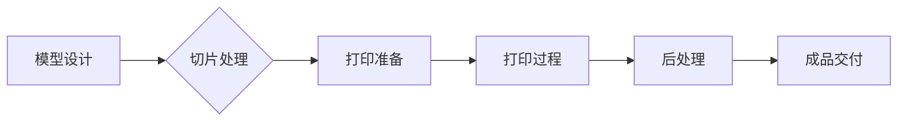

                 

### 《3D打印创业：个性化制造的未来》

> **关键词**：3D打印、个性化制造、创业、技术趋势、应用领域

**摘要**：随着科技的进步，3D打印技术正逐渐改变着制造业的面貌。个性化制造成为现代工业的新趋势，而3D打印技术的出现为创业者和企业带来了前所未有的机遇。本文将深入探讨3D打印技术的定义、原理、应用领域以及创业实践，分析其在个性化制造中的潜力，为有意投身这一领域的读者提供实用的指导和建议。

### 目录大纲

## 第一部分：3D打印技术基础

### 第1章：3D打印技术概述

#### 1.1 3D打印的定义与分类

#### 1.2 3D打印的工作原理

#### 1.3 3D打印技术的优势与挑战

### 第2章：3D打印技术原理

#### 2.1 3D打印的材料

#### 2.2 3D打印的过程

#### 2.3 3D打印技术分类

## 第二部分：3D打印应用领域

### 第3章：制造业应用

#### 3.1 3D打印在航空航天领域的应用

#### 3.2 3D打印在汽车制造业的应用

#### 3.3 3D打印在医疗领域的应用

### 第4章：个性化定制

#### 4.1 个性化定制概述

#### 4.2 个性化定制在服装行业的应用

#### 4.3 个性化定制在珠宝行业的应用

## 第三部分：3D打印创业实践

### 第5章：创业准备

#### 5.1 创业者所需技能

#### 5.2 市场调研

#### 5.3 商业模式设计

### 第6章：3D打印设备选购与维护

#### 6.1 3D打印设备的选购

#### 6.2 3D打印设备的维护

#### 6.3 3D打印材料的选购

### 第7章：项目案例解析

#### 7.1 案例一：个性化医疗模型打印

#### 7.2 案例二：3D打印建筑

#### 7.3 案例三：3D打印珠宝设计

## 第四部分：未来展望

### 第8章：3D打印技术的发展趋势

#### 8.1 新材料研究进展

#### 8.2 新工艺研发

#### 8.3 3D打印与物联网的融合

### 第9章：3D打印在未来的应用场景

#### 9.1 教育培训

#### 9.2 文物修复

#### 9.3 军事应用

## 附录

### 附录 A：3D打印相关资源与工具

#### A.1 3D打印软件推荐

#### A.2 3D打印材料供应商

#### A.3 3D打印社区与论坛

### 附录 B：3D打印技术Mermaid流程图

#### B.1 3D打印技术流程

#### B.2 个性化定制流程

#### B.3 3D打印设备选购流程

### 附录 C：3D打印项目实战案例

#### C.1 个性化医疗模型打印案例

#### C.2 3D打印建筑案例

#### C.3 3D打印珠宝设计案例

### 引言

3D打印技术，作为一种革命性的制造技术，正在迅速改变着全球制造业的面貌。它通过逐层添加材料来构建三维物体，不再依赖传统的切割或成型工艺，从而实现了高度个性化的制造。这种技术的兴起，不仅带来了制造效率的提升，更为创业者提供了前所未有的机遇。随着个性化制造需求的日益增长，3D打印技术在各个领域的应用日益广泛，从制造业到医疗、建筑、珠宝等，都展现出了巨大的潜力。

本文将围绕3D打印技术展开，首先介绍其基本原理和分类，接着探讨其在各领域的应用，最后深入分析3D打印创业实践，提供实用的创业建议和未来展望。通过本文的阅读，读者将全面了解3D打印技术的现状与发展趋势，并从中获得宝贵的创业启示。

## 第一部分：3D打印技术基础

### 第1章：3D打印技术概述

#### 1.1 3D打印的定义与分类

3D打印，也称为增材制造（Additive Manufacturing，AM），是一种通过逐层添加材料来构建三维物体的制造技术。与传统的减法制造（如车削、铣削、铸造等）不同，3D打印直接从三维数字模型出发，通过逐层叠加材料来形成最终产品，从而避免了材料的大量浪费，实现了高度个性化的制造。

根据使用的材料和工艺不同，3D打印技术可以分为多种类型。以下是几种常见的3D打印技术：

1. **立体光固化打印（SLA）**：使用紫外线光固化树脂材料，通过逐层固化来形成三维物体。SLA技术具有高精度和良好的表面光洁度，适用于复杂形状和小批量生产。

2. **熔融沉积成型（FDM）**：使用加热熔融的热塑性材料，通过挤出和冷却固化来形成三维物体。FDM技术操作简单、成本较低，是应用最广泛的3D打印技术之一。

3. **选择性激光烧结（SLS）**：使用激光烧结粉末材料（如塑料、金属、陶瓷等），通过逐层烧结来形成三维物体。SLS技术适用范围广泛，能够打印各种高强度和复杂形状的零件。

4. **电子束熔融（EBM）**：使用高能电子束熔化粉末材料，适用于金属和高熔点材料的打印，能够制造出高强度和耐高温的零部件。

5. **数字光处理（DLP）**：类似于SLA，但使用投影仪将光线投影到液态树脂上，实现快速打印。DLP技术具有高分辨率和打印速度。

#### 1.2 3D打印的工作原理

3D打印的工作原理可以分为以下几个步骤：

1. **模型设计**：使用CAD（计算机辅助设计）软件设计出所需的三维模型。

2. **切片处理**：将三维模型分解成若干层，每一层形成一张切片图。

3. **打印准备**：选择合适的打印材料，调整打印参数，如层高、打印速度、温度等。

4. **打印过程**：根据切片图的指示，逐层添加材料，一层一层地构建三维物体。

5. **后处理**：打印完成后，进行必要的打磨、清洗等后处理，以改善表面质量和去除支撑结构。

#### 1.3 3D打印技术的优势与挑战

3D打印技术具有以下优势：

1. **个性化定制**：能够根据需求定制生产，实现高度个性化的产品。

2. **减少浪费**：通过逐层添加材料，避免了传统制造中的材料浪费。

3. **快速生产**：3D打印可以在短时间内完成生产，缩短了制造周期。

4. **复杂形状**：能够打印复杂形状和内部结构，传统制造方法难以实现。

5. **材料多样性**：可以使用各种材料，如塑料、金属、陶瓷等，满足不同需求。

然而，3D打印技术也面临一些挑战：

1. **成本问题**：设备成本和材料成本较高，限制了大规模应用。

2. **打印速度**：虽然3D打印速度在不断提高，但仍然无法与传统制造方法相比。

3. **材料性能**：3D打印材料的性能与传统材料相比仍有差距，特别是在强度和耐用性方面。

4. **打印精度**：虽然3D打印技术的精度在不断提高，但仍然存在一定的误差。

5. **后处理**：部分3D打印材料需要后处理，增加了生产成本和时间。

通过深入理解3D打印技术的定义、分类、工作原理以及其优势和挑战，读者可以更好地了解这一技术的本质和应用前景。在接下来的章节中，我们将进一步探讨3D打印技术在不同领域的应用。

## 第2章：3D打印技术原理

#### 2.1 3D打印的材料

3D打印材料的选择对打印质量和最终产品的性能至关重要。不同的3D打印技术适用不同的材料，以下是几种常见的3D打印材料：

1. **塑料**：塑料是3D打印中最常用的材料，具有良好的加工性和较低的打印成本。常见的塑料材料包括：

   - **聚乳酸（PLA）**：一种生物降解塑料，具有良好的打印性能和表面质量，适用于制作模型、工具和消费电子产品。
   - **丙烯腈-丁二烯-苯乙烯（ABS）**：具有更好的机械性能和耐热性，适用于制造复杂零件和机械设备。
   - **聚碳酸酯（PC）**：具有较高的强度和耐热性，适用于航空航天和汽车工业。

2. **金属材料**：金属材料可以提供更高的强度和耐热性，适用于制造高强度零部件和结构。常见的金属材料包括：

   - **钛合金（Ti-6Al-4V）**：具有良好的机械性能和耐蚀性，适用于航空航天和医疗领域。
   - **不锈钢（SS316）**：具有良好的耐腐蚀性和强度，适用于制造厨具和医疗器械。
   - **铝合金（AlSi10Mg）**：具有良好的铸造性和机械性能，适用于汽车和航空航天工业。

3. **陶瓷材料**：陶瓷材料具有高硬度、高耐磨性和耐高温性能，适用于制造切削工具、发动机部件和高温设备。常见的陶瓷材料包括：

   - **氧化铝（Al2O3）**：具有高硬度和耐腐蚀性，适用于切削工具和高温部件。
   - **碳化硅（SiC）**：具有高硬度和高温稳定性，适用于切削工具和高温设备。

4. **复合材料**：复合材料结合了不同材料的优点，能够提供更优良的综合性能。常见的复合材料包括：

   - **碳纤维增强塑料（CFRP）**：具有高强度和高刚度，适用于航空航天和汽车工业。
   - **玻璃纤维增强塑料（GFRP）**：具有良好的耐腐蚀性和强度，适用于船舶和建筑行业。

#### 2.2 3D打印的过程

3D打印过程可以分为几个关键步骤，每个步骤都对最终产品的质量有重要影响。以下是3D打印过程的详细描述：

1. **模型设计**：使用CAD（计算机辅助设计）软件设计出所需的三维模型。设计过程中需要考虑打印材料、打印机和打印参数。

2. **切片处理**：将三维模型分解成若干层，每一层形成一张切片图。切片处理需要确定打印路径、填充策略、支撑结构等参数。

3. **准备材料**：选择合适的打印材料，并根据打印机的要求进行准备。如塑料材料需要加热至适当的温度，金属材料需要进行熔化。

4. **打印准备**：将切片文件加载到打印机，设置打印参数，如层高、打印速度、温度等。准备过程中需要确保打印机正常工作，没有故障。

5. **打印过程**：根据切片图的指示，逐层添加材料，一层一层地构建三维物体。打印过程中需要实时监控打印状态，确保打印质量。

6. **后处理**：打印完成后，进行必要的打磨、清洗等后处理，以改善表面质量和去除支撑结构。后处理步骤根据打印材料和产品要求而定。

#### 2.3 3D打印技术分类

3D打印技术可以根据打印材料、打印过程和打印设备进行分类。以下是几种常见的3D打印技术分类：

1. **根据材料分类**：

   - **塑料3D打印**：使用塑料材料进行打印，如FDM、SLA等。
   - **金属3D打印**：使用金属材料进行打印，如SLS、EBM等。
   - **陶瓷3D打印**：使用陶瓷材料进行打印，如SLS、SLM等。
   - **复合材料3D打印**：使用复合材料进行打印，如FDM、SLA等。

2. **根据打印过程分类**：

   - **层状堆积打印**：逐层添加材料进行打印，如FDM、SLA等。
   - **喷射打印**：通过喷射材料进行打印，如DOD（Drop on Demand）等。
   - **激光熔化打印**：使用激光熔化材料进行打印，如SLS、EBM等。

3. **根据打印设备分类**：

   - **桌面打印机**：体积小、成本低的打印机，适用于个人和小规模制造。
   - **工业级打印机**：具有高精度、高效率的打印机，适用于大规模工业制造。
   - **专业打印机**：具有特定功能的打印机，如金属打印机、陶瓷打印机等。

通过深入理解3D打印技术的材料、打印过程和分类，读者可以更好地选择和应用适合自己需求的3D打印技术。在接下来的章节中，我们将探讨3D打印技术在各个领域的应用，进一步展示其潜力和价值。

## 第二部分：3D打印应用领域

### 第3章：制造业应用

#### 3.1 3D打印在航空航天领域的应用

3D打印技术在航空航天领域具有广泛的应用，特别是在复杂部件的制造和设计优化方面。以下是3D打印在航空航天领域的主要应用：

1. **复杂部件制造**：3D打印技术可以制造出传统制造方法难以生产的复杂几何形状部件，如涡轮叶片、机身结构等。这些复杂部件通过3D打印技术可以实现一次性成型，避免了传统制造中的多步骤加工和装配过程。

2. **设计优化**：3D打印技术允许设计师在制造过程中进行多次迭代和优化，从而提高部件的性能和效率。例如，通过3D打印技术，设计师可以制造出轻量化、高强度的部件，进一步减少燃料消耗和飞行成本。

3. **个性化定制**：3D打印技术可以根据飞行器的特殊需求进行个性化定制，如制造符合飞行员身形的座椅和头盔等。这种个性化定制不仅提高了飞行器的舒适度，还提高了飞行员的工作效率和安全性。

4. **维修和保养**：3D打印技术可以快速制造出飞行器在偏远地区或战场上的零部件，减少了维修和保养的时间。这对于提高飞行器的作战能力和可靠性具有重要意义。

5. **原型制作**：3D打印技术可以快速制造出飞行器的原型，用于设计和测试。通过3D打印技术，设计师可以快速验证飞行器的性能和结构，进一步优化设计。

#### 3.2 3D打印在汽车制造业的应用

3D打印技术在汽车制造业中的应用也在不断拓展，以下是一些主要的应用领域：

1. **零部件制造**：3D打印技术可以制造出汽车发动机、底盘、车身等关键零部件，这些零部件具有复杂的几何形状和内部结构。通过3D打印技术，制造商可以实现零部件的一体化制造，减少部件数量和装配难度。

2. **个性化定制**：3D打印技术可以根据消费者的个性化需求，定制生产出独特的汽车部件，如方向盘、座椅、车身装饰等。这种个性化定制不仅提高了消费者的满意度，还增加了汽车品牌的竞争力。

3. **原型制作**：3D打印技术可以快速制造出汽车的原型，用于设计和测试。通过3D打印技术，设计师可以在短时间内验证汽车的外观、性能和结构，进一步优化设计。

4. **模具制造**：3D打印技术可以用于制造模具，用于汽车零件的批量生产。通过3D打印技术，制造商可以实现快速、低成本地制造模具，提高了生产效率。

5. **维修和保养**：3D打印技术可以快速制造出汽车零部件，用于维修和保养。这在汽车租赁和共享领域具有重要意义，可以减少因维修延误导致的运营成本。

#### 3.3 3D打印在医疗领域的应用

3D打印技术在医疗领域的应用日益广泛，以下是一些主要的应用：

1. **个性化医疗模型**：3D打印技术可以制造出高度个性化的医疗模型，如人体骨骼模型、器官模型等。这些模型可以帮助医生更好地了解患者的病情，制定更精确的治疗方案。

2. **手术规划和模拟**：通过3D打印技术，医生可以制作出患者的个性化手术模型，用于手术规划和模拟。这种技术可以提高手术的成功率和安全性。

3. **假肢和辅助装置**：3D打印技术可以定制生产出高度个性化的假肢和辅助装置，如义肢、矫正器等。这些装置可以更好地适应患者的身体，提高生活质量。

4. **药物研发**：3D打印技术可以制造出药物的原型和模型，用于药物研发和测试。这种技术可以帮助制药公司更快地开发出新药。

5. **植入物和人工器官**：3D打印技术可以制造出各种植入物和人工器官，如骨植入物、心脏瓣膜、人工关节等。这些植入物和人工器官具有高生物相容性和个性化定制能力，为患者提供了更好的治疗选择。

通过在航空航天、汽车制造和医疗领域的大量应用，3D打印技术不仅提高了制造效率和质量，还为个性化定制和设计优化提供了新的解决方案。在接下来的章节中，我们将进一步探讨个性化定制的概念和应用，展示3D打印技术在现代工业中的巨大潜力。

### 第4章：个性化定制

#### 4.1 个性化定制概述

个性化定制是现代工业中的一种重要趋势，它通过定制化生产满足消费者的个性化需求。3D打印技术的兴起为个性化定制提供了强有力的技术支持，使得复杂、精确和个性化的产品制造成为可能。以下是个性化定制的一些核心特点：

1. **个性化需求**：个性化定制是基于消费者个人需求进行的，无论是尺寸、颜色、材质还是功能，都可以根据客户的具体要求进行调整。

2. **高效生产**：3D打印技术通过直接从数字模型出发，逐层打印出最终产品，避免了传统制造中的多步骤加工和装配过程，从而提高了生产效率。

3. **定制化设计**：个性化定制需要高度依赖CAD（计算机辅助设计）软件进行设计，设计师可以根据消费者的需求，快速创建出独特的三维模型。

4. **成本效益**：虽然3D打印设备的成本和材料成本相对较高，但在小批量生产或定制化产品中，3D打印技术能够显著降低生产成本，提高利润率。

5. **质量保证**：3D打印技术可以精确控制产品的尺寸和形状，确保每个产品都符合高标准的质量要求。

#### 4.2 个性化定制在服装行业的应用

个性化定制在服装行业中的应用日益广泛，3D打印技术为其提供了新的生产方式。以下是3D打印技术在服装行业中的具体应用：

1. **个性化设计**：消费者可以通过3D建模软件设计出自己独特的服装款式，从颜色、图案到剪裁，完全按照个人喜好定制。设计师可以使用3D打印技术快速制作出原型，以便进行修改和优化。

2. **个性化生产**：3D打印技术可以实现小批量、高效的生产，使得个性化服装的制造成为可能。例如，高端定制服装品牌可以使用3D打印技术，快速生产出符合消费者身材的服装。

3. **减料浪费**：传统服装制造中，材料浪费是一个普遍问题。3D打印技术通过精确控制材料的用量，有效减少了生产过程中的材料浪费。

4. **快速交货**：3D打印技术能够显著缩短生产周期，从设计到成品，整个过程可以在短时间内完成。这对于消费者而言，可以享受到更快速的购物体验。

5. **个性化体验**：3D打印技术使得消费者可以参与到服装设计过程中，提高了购物体验的互动性和个性化程度。

#### 4.3 个性化定制在珠宝行业的应用

3D打印技术在珠宝行业的应用正在改变传统珠宝制造的方式，以下是一些具体的应用：

1. **个性化设计**：消费者可以通过3D建模软件设计出自己独特的珠宝款式，无论是戒指、项链还是手镯，都可以根据个人喜好进行定制。设计师可以快速生成3D模型，并通过3D打印技术制作出原型。

2. **复杂结构**：传统珠宝制造难以实现复杂的几何形状，而3D打印技术可以轻松打印出各种复杂结构，如多面体、流线型等。这种技术为珠宝设计师提供了更广阔的创作空间。

3. **快速生产**：3D打印技术可以快速生产出珠宝原型，设计师可以快速验证设计，并进行多次迭代优化。

4. **材料多样性**：3D打印技术可以使用各种材料进行打印，如金属、塑料、陶瓷等，为珠宝设计师提供了更多的选择。例如，可以使用金属打印出高光泽度的珠宝，或者使用陶瓷制造出独特的质感。

5. **批量定制**：虽然3D打印设备成本较高，但在小批量生产中，其成本效益显著。珠宝品牌可以通过3D打印技术，提供个性化的定制服务，提高品牌竞争力。

通过个性化定制，3D打印技术在服装和珠宝行业中展现了巨大的潜力。它不仅满足了消费者的个性化需求，还提高了生产效率和产品质量。随着技术的不断进步，个性化定制将在更多行业中得到广泛应用，进一步改变我们的生活方式。

## 第三部分：3D打印创业实践

### 第5章：创业准备

#### 5.1 创业者所需技能

创业是一项复杂而充满挑战的任务，尤其在3D打印领域，需要创业者具备一系列专业技能和知识。以下是一些关键的技能和素质：

1. **技术背景**：熟悉3D打印技术的基本原理和各类技术（如FDM、SLA、SLS等），了解不同材料的特性和适用场景。创业者需要具备一定的机械工程或材料科学知识，以便更好地理解和应用3D打印技术。

2. **工程设计能力**：能够使用CAD（计算机辅助设计）软件进行模型设计和优化，这是3D打印创业的基础。创业者需要熟练掌握AutoCAD、SolidWorks、Fusion 360等常用的设计工具。

3. **项目管理能力**：创业者需要具备良好的项目管理能力，能够有效协调团队资源，确保项目按时、按质完成。这包括时间管理、团队沟通和资源分配等方面。

4. **市场分析能力**：创业者需要具备市场分析能力，了解目标市场的需求、竞争对手和潜在客户。通过市场调研，创业者可以识别市场机会，制定有效的营销策略。

5. **商业管理能力**：创业者需要具备一定的商业管理能力，包括财务规划、成本控制和风险管理等。良好的财务管理能力可以帮助创业者更好地控制成本，提高盈利能力。

6. **创新能力**：3D打印领域发展迅速，创业者需要具备创新能力，不断探索新的应用场景和商业模式。这包括对新技术的研究、产品创新和市场创新等方面。

7. **团队协作能力**：创业者需要具备良好的团队协作能力，能够吸引并留住人才，建立高效的团队。与团队成员保持良好的沟通，共同推动企业发展至关重要。

#### 5.2 市场调研

市场调研是创业成功的关键一步，它帮助创业者了解市场需求、竞争环境和潜在客户。以下是一些重要的市场调研步骤：

1. **确定目标市场**：明确目标市场的定位，包括市场规模、客户需求和竞争状况。通过市场细分，可以更准确地识别目标客户群体。

2. **竞争对手分析**：研究现有竞争对手的产品、价格、营销策略和市场表现。通过分析竞争对手的优势和劣势，找到自身的市场机会和差异化策略。

3. **客户需求调研**：通过问卷调查、访谈和焦点小组等方法，了解目标客户的需求和痛点。这些信息可以帮助创业者制定更符合市场需求的产品和服务。

4. **市场规模评估**：评估目标市场的规模和增长潜力，了解市场容量和未来发展趋势。这有助于创业者制定长远发展规划。

5. **法规和标准**：了解相关法规和标准，确保产品和服务符合行业要求。这对于开拓市场、避免法律风险至关重要。

6. **渠道和合作伙伴**：研究市场渠道和潜在合作伙伴，了解如何将产品和服务推向市场。与合适的渠道和合作伙伴建立合作关系，可以加速市场拓展。

通过全面的市场调研，创业者可以更好地了解市场需求和竞争状况，制定有效的市场进入策略，提高创业成功率。

#### 5.3 商业模式设计

商业模式设计是创业成功的关键环节，它决定了企业的盈利模式和发展路径。以下是一些关键的商业模式设计步骤：

1. **价值主张**：明确企业的核心产品或服务，阐述其独特的价值主张。价值主张需要解决客户的实际问题，满足市场需求。

2. **目标客户**：确定目标客户群体，包括客户的特征、需求和购买行为。通过了解客户需求，可以设计出更符合客户期望的产品和服务。

3. **收入来源**：确定企业的收入来源，包括产品销售、服务收费、广告收入等。收入来源的多样性和稳定性对于企业的持续发展至关重要。

4. **成本结构**：分析企业的成本结构，包括固定成本和可变成本。通过优化成本结构，可以提高企业的盈利能力和市场竞争力。

5. **盈利模式**：设计企业的盈利模式，包括定价策略、销售渠道和客户关系管理等。盈利模式需要与企业的价值主张和目标客户相匹配。

6. **关键资源**：明确企业所需的关键资源，包括技术、人才、资金和渠道等。通过有效管理和利用这些资源，可以确保企业的稳定运营和快速发展。

7. **风险评估**：评估企业面临的风险，包括市场风险、技术风险、财务风险等。通过制定相应的风险管理策略，可以降低风险对企业的影响。

通过精心设计的商业模式，创业者可以确保企业能够在市场中立足，实现持续盈利和快速发展。

### 第6章：3D打印设备选购与维护

#### 6.1 3D打印设备的选购

选购3D打印设备是3D打印创业的重要环节，合理的设备选择直接影响生产效率和产品质量。以下是一些选购3D打印设备的关键因素：

1. **打印技术**：根据企业的需求和预算，选择合适的3D打印技术。如FDM、SLA、SLS等，不同技术适用于不同的应用场景。

2. **打印尺寸**：根据所需的打印尺寸选择合适的打印机。打印尺寸包括最大打印尺寸和最小打印尺寸，应满足企业产品的需求。

3. **打印精度**：打印精度是衡量打印机性能的重要指标，应根据产品的精度要求选择合适的打印机。高精度打印机适用于复杂结构和高质量产品的打印。

4. **材料兼容性**：选择能够兼容多种材料的打印机，以适应不同的应用需求。如金属、塑料、陶瓷等，增加企业的应用范围。

5. **稳定性**：稳定性是3D打印设备的重要指标，选择稳定性高的打印机可以保证生产过程的顺利进行，减少设备故障和停机时间。

6. **品牌和售后服务**：选择知名品牌和具有良好售后服务的打印机，确保设备在使用过程中得到及时的技术支持和维修。

7. **预算**：根据企业的预算范围选择合适的3D打印设备，避免因设备成本过高而影响企业的盈利能力。

#### 6.2 3D打印设备的维护

3D打印设备的维护对于确保设备的正常运行和延长使用寿命至关重要。以下是一些常见的3D打印设备维护方法：

1. **定期检查**：定期对打印机进行全面的检查，包括机械结构、电气系统和打印头等。及时发现并解决潜在问题，防止设备故障。

2. **清洁**：定期清洁打印机内部和外部的污垢，特别是打印头和导轨。清洁可以减少摩擦和磨损，提高打印精度。

3. **润滑**：定期润滑打印机中的运动部件，如导轨、齿轮和轴承等。润滑可以减少摩擦，延长设备使用寿命。

4. **更换耗材**：及时更换打印头、打印平台和耗材，如打印头中的喷嘴、打印平台的覆盖膜等。确保设备能够正常运行。

5. **软件更新**：定期更新打印机的固件和驱动程序，以修复已知问题和提高打印性能。软件更新可以确保设备与最新操作系统和软件兼容。

6. **技术培训**：培训操作人员和维护人员掌握正确的操作和维护方法，确保设备得到科学合理的使用和维护。

通过合理的设备选购和科学的设备维护，创业者可以确保3D打印设备的高效运行和长期稳定，提高生产效率和产品质量。

### 第7章：项目案例解析

#### 7.1 案例一：个性化医疗模型打印

**背景**：
在医疗领域，3D打印技术被广泛应用于个性化医疗模型打印，以帮助医生更好地诊断和规划手术。个性化医疗模型可以模拟患者体内的复杂结构，如骨骼、器官和肿瘤等，为医生提供直观的手术指导和治疗方案。

**技术方案**：
1. **数据采集**：通过CT扫描或MRI等技术，获取患者的体内结构数据。
2. **模型设计**：使用CAD软件，将数据转换为三维模型，并进行必要的处理和优化。
3. **切片处理**：将三维模型分解为多个切片，为3D打印做好准备。
4. **3D打印**：选择合适的3D打印机，如SLA或SLS打印机，根据切片文件逐层打印出个性化医疗模型。
5. **后处理**：打印完成后，对模型进行打磨、清洗和上色等后处理，以提高表面质量和视觉效果。

**代码实现**（伪代码）：

```markdown
function generateMedicalModel(patientData, modelParams) {
  // 1. 数据采集
  patientData = acquirePatientData();

  // 2. 模型设计
  model = designModelFromData(patientData, modelParams);

  // 3. 切片处理
  slices = sliceModel(model, modelParams);

  // 4. 3D打印
  printer = selectPrinter(modelParams);
  printModel(slices, printer);

  // 5. 后处理
  processedModel = postProcessModel(printedModel);
  return processedModel;
}
```

**案例解读**：
个性化医疗模型打印项目通过整合多种技术手段，实现了从数据采集、模型设计到3D打印和后处理的完整流程。该项目不仅提高了医疗诊断和手术的准确性和效率，还为患者提供了更加个性化和精准的治疗方案。

#### 7.2 案例二：3D打印建筑

**背景**：
3D打印建筑是一种新兴的建筑技术，通过3D打印设备直接打印出建筑结构，具有高效、环保和个性化等优势。这项技术在全球范围内得到广泛关注，并逐渐应用于实际建筑项目中。

**技术方案**：
1. **建筑设计**：使用CAD软件设计出建筑的三维模型，确保结构稳定、符合建筑规范。
2. **打印路径规划**：根据建筑设计，生成打印路径和切片文件，确定打印顺序和打印参数。
3. **材料准备**：选择合适的打印材料，如水泥、混凝土或塑料等，并进行预处理。
4. **3D打印**：使用3D打印设备，如混凝土打印机或塑料打印机，按照切片文件逐层打印出建筑结构。
5. **后处理**：打印完成后，对建筑结构进行打磨、修整和装饰等后处理，以确保建筑外观和结构质量。

**代码实现**（伪代码）：

```markdown
function printBuilding(architecture, printParams) {
  // 1. 建筑设计
  buildingModel = designBuilding(architecture);

  // 2. 打印路径规划
  slices = generatePrintSlices(buildingModel, printParams);

  // 3. 材料准备
  material = prepareMaterial(printParams);

  // 4. 3D打印
  printer = selectPrinter(printParams);
  printBuildingStructure(slices, printer, material);

  // 5. 后处理
  finishedBuilding = postProcessBuilding(printedBuilding);
  return finishedBuilding;
}
```

**案例解读**：
3D打印建筑项目通过集成建筑设计、打印路径规划和3D打印技术，实现了从建筑模型到实际建筑的完整流程。该项目展示了3D打印技术在建筑领域的巨大潜力，为未来建筑行业的发展提供了新的思路和方向。

#### 7.3 案例三：3D打印珠宝设计

**背景**：
3D打印技术在珠宝设计中的应用日益广泛，通过3D打印技术，设计师可以快速制作出珠宝模型，进行设计验证和修改。这项技术提高了设计效率和珠宝制作的精度，受到了珠宝设计师和制造商的青睐。

**技术方案**：
1. **珠宝设计**：使用CAD软件进行珠宝设计，包括宝石镶嵌、切割和雕刻等。
2. **模型优化**：对设计模型进行优化，确保模型适合3D打印，减少打印过程中的错误。
3. **切片处理**：将设计模型分解为多个切片，生成3D打印文件。
4. **3D打印**：选择合适的3D打印机，如SLA或DLP打印机，根据切片文件逐层打印出珠宝模型。
5. **后处理**：打印完成后，对模型进行打磨、抛光和镶嵌等后处理，确保珠宝的外观和质量。

**代码实现**（伪代码）：

```markdown
function printJewelry(jewelryDesign, printParams) {
  // 1. 珠宝设计
  jewelryModel = designJewelry(jewelryDesign);

  // 2. 模型优化
  optimizedModel = optimizeModel(jewelryModel);

  // 3. 切片处理
  slices = generatePrintSlices(optimizedModel, printParams);

  // 4. 3D打印
  printer = selectPrinter(printParams);
  printJewelryModel(slices, printer);

  // 5. 后处理
  finishedJewelry = postProcessJewelry(printedModel);
  return finishedJewelry;
}
```

**案例解读**：
3D打印珠宝设计项目通过整合珠宝设计、模型优化和3D打印技术，实现了从设计到成品的快速制作。该项目不仅提高了珠宝设计的效率和质量，还为珠宝设计师提供了更多的创作自由度，推动了珠宝设计的创新和发展。

通过以上三个案例，我们可以看到3D打印技术在各个领域的广泛应用和巨大潜力。从个性化医疗模型打印、3D打印建筑到3D打印珠宝设计，3D打印技术正在不断改变我们的生产和生活方式，为创业者提供了丰富的机遇。在接下来的章节中，我们将进一步探讨3D打印技术的发展趋势和应用场景，展示其在未来工业和生活中的更多可能性。

### 第8章：3D打印技术的发展趋势

#### 8.1 新材料研究进展

3D打印技术的发展离不开新材料的研究和应用。近年来，科学家和工程师们不断探索新的材料，以满足不同应用场景的需求。以下是一些重要的新材料研究进展：

1. **高分子材料**：高分子材料是3D打印中最常用的材料之一，研究人员不断开发新型高分子材料，以提高3D打印产品的性能。例如，具有优异机械性能和热稳定性的聚醚酯（PEEK）和聚醚酮（PEK）等材料，被广泛应用于航空航天、汽车制造和医疗领域。

2. **金属材料**：金属材料在3D打印领域具有巨大潜力，特别是钛合金、不锈钢和铝合金等高强度金属材料。研究人员通过改进熔化工艺和打印参数，成功打印出高强度金属部件，这些部件在航空航天、汽车和军事领域具有广泛应用。

3. **陶瓷材料**：陶瓷材料具有高硬度、高耐磨性和高温稳定性，适用于切削工具、发动机部件和高温设备。通过3D打印技术，可以制造出复杂结构的陶瓷部件，提高了加工效率和产品质量。

4. **复合材料**：复合材料结合了不同材料的优点，通过3D打印技术可以制造出具有独特性能的复合材料部件。例如，碳纤维增强塑料（CFRP）和玻璃纤维增强塑料（GFRP）等复合材料，在航空航天、汽车和建筑领域得到广泛应用。

5. **生物相容材料**：随着3D打印技术在医疗领域的应用，生物相容材料的研究逐渐受到关注。研究人员开发出一系列生物相容材料，如聚乳酸（PLA）和聚醚酮酮（PEKK）等，用于制造人工器官、植入物和医疗器械。

#### 8.2 新工艺研发

3D打印新工艺的研发是推动技术进步的关键。以下是一些重要的3D打印新工艺：

1. **电子束熔融（EBM）**：EBM技术通过高能电子束熔化粉末材料，适用于制造高强度和高温部件。研究人员通过改进电子束熔融工艺和打印参数，提高了打印速度和精度，进一步拓宽了EBM技术的应用范围。

2. **激光烧结（SLS）**：SLS技术使用激光烧结粉末材料，适用于多种材料的高强度打印。研究人员通过优化烧结工艺和粉末材料，提高了打印效率和材料性能，使得SLS技术更加成熟和应用广泛。

3. **数字光处理（DLP）**：DLP技术通过投影仪将光线投影到液态树脂上，实现快速打印。研究人员通过改进DLP投影系统和树脂材料，提高了打印速度和精度，使得DLP技术在高精度打印领域具有更强的竞争力。

4. **熔融沉积成型（FDM）**：FDM技术是一种广泛应用的3D打印技术，研究人员通过改进打印头设计、材料配方和打印参数，提高了打印速度和产品质量。

5. **多材料打印**：多材料打印技术通过同时使用多种材料，制造出具有复杂结构和多功能性的部件。研究人员通过开发新的打印工艺和材料组合，实现了多材料打印的更高性能和更广泛的应用。

#### 8.3 3D打印与物联网的融合

3D打印与物联网（IoT）的融合为智能制造提供了新的发展方向。以下是一些3D打印与物联网融合的趋势：

1. **远程监控与维护**：通过物联网技术，3D打印设备可以实现远程监控和维护。设备制造商可以实时监测设备状态，及时发现和解决故障，确保设备正常运行。

2. **智能化生产管理**：物联网技术可以帮助企业实现智能化生产管理，通过数据采集和分析，优化生产流程和资源配置，提高生产效率和产品质量。

3. **个性化定制**：物联网技术可以实时收集用户需求和反馈，通过大数据分析和人工智能算法，实现个性化定制生产，满足消费者多样化需求。

4. **供应链优化**：通过物联网技术，企业可以实时跟踪原材料和产品的物流信息，优化供应链管理，降低库存成本和物流成本。

5. **设备预测性维护**：物联网技术可以通过数据分析，预测设备可能出现的故障，提前进行维护和保养，减少设备停机时间和生产风险。

通过新材料的研究、新工艺的研发和物联网技术的融合，3D打印技术正不断突破技术瓶颈，向更高性能和更广泛应用迈进。在未来的发展中，3D打印技术将继续推动制造业的变革，为各行各业带来更多创新和机遇。

### 第9章：3D打印在未来的应用场景

#### 9.1 教育培训

3D打印技术在教育培训领域具有广阔的应用前景。以下是一些具体的应用：

1. **教学辅助**：3D打印技术可以制作出复杂的三维模型，用于物理、化学、生物等学科的教学。通过直观的模型展示，学生可以更好地理解抽象的科学概念。

2. **技能培训**：3D打印技术可以用于职业培训，如机械工程、建筑设计和珠宝设计等。学生可以通过实际操作3D打印机，掌握相关技术和工艺。

3. **创新教育**：3D打印技术鼓励学生发挥创造力，通过设计和制作自己的作品，培养学生的创新思维和实践能力。

4. **互动教学**：3D打印技术可以实现实时互动教学，教师可以通过虚拟现实（VR）或增强现实（AR）技术，展示3D模型和实验过程，提高教学效果。

#### 9.2 文物修复

3D打印技术在文物修复领域具有重要应用价值。以下是一些具体的应用：

1. **古建筑修复**：3D打印技术可以快速复制和修复古建筑中的受损部件，如石雕、砖瓦和木结构等。通过3D扫描和建模，可以精确复制古建筑的细节和结构。

2. **文物复制**：3D打印技术可以复制珍贵文物，用于展览和研究。这种复制技术不仅保护了原文物，还可以为游客提供近距离观赏的机会。

3. **文物保护**：3D打印技术可以用于制作文物保护工具和设备，如支架、模具和修复材料等。这些工具和设备可以帮助专家更好地保护文物，延长其使用寿命。

4. **考古发掘**：3D打印技术可以快速制作出考古发掘现场的三维模型，帮助考古学家更好地了解地下结构和文物分布，提高发掘效率。

#### 9.3 军事应用

3D打印技术在军事领域具有多种应用，以下是一些具体的应用：

1. **装备制造**：3D打印技术可以快速制造出军事装备，如枪支、坦克和无人机等。这种技术可以提高装备的生产效率和质量，满足军事需求。

2. **战术模拟**：3D打印技术可以制作出战场环境和战术模拟模型，用于军事演习和训练。通过模拟不同战场情况，士兵可以更好地了解战术和策略。

3. **个性化定制**：3D打印技术可以根据士兵的个人需求和作战环境，定制生产出个性化的装备和工具，如手套、头盔和防弹衣等。

4. **武器升级**：3D打印技术可以用于武器升级和改进，通过快速制造出新型武器部件和模块，提高武器的性能和战斗力。

5. **军事基地建设**：3D打印技术可以快速制造出军事基地的基础设施，如房屋、道路和桥梁等。这种技术可以加快军事基地的建设速度，提高应急响应能力。

通过在教育培训、文物修复和军事应用等领域的广泛应用，3D打印技术展示了其巨大的潜力和广泛的应用前景。随着技术的不断进步，3D打印技术将在更多领域中发挥重要作用，推动社会的进步和发展。

### 附录 A：3D打印相关资源与工具

#### A.1 3D打印软件推荐

在3D打印领域，选择合适的软件对于模型设计、切片处理和打印优化至关重要。以下是几款广受好评的3D打印软件推荐：

1. **Cura**：Cura是一款功能强大的切片软件，适用于FDM 3D打印机。它支持多种打印机型号，具有丰富的打印参数调整选项，可以帮助用户实现最佳打印效果。

2. **Simplify3D**：Simplify3D是一款高端的切片软件，支持多种3D打印技术，包括FDM、SLS和DLP等。它具有出色的打印优化功能和高级打印模式，适合专业用户和制造商。

3. **Blender**：Blender是一款开源的三维建模和渲染软件，具有强大的建模、雕刻和渲染功能。它还包含一个切片器，可以用于FDM打印的预处理。

4. **Netfabb**：Netfabb是一款专业级3D打印准备软件，适用于高精度打印。它提供了先进的打印参数调整和缺陷修复功能，可以帮助用户解决复杂模型的打印问题。

5. **Kisslicer**：Kisslicer是一款简洁易用的切片软件，支持多种FDM 3D打印机。它提供了丰富的打印选项和预设参数，适合初学者和中级用户。

#### A.2 3D打印材料供应商

选择合适的3D打印材料对于确保打印质量和产品性能至关重要。以下是一些知名的3D打印材料供应商：

1. **Formlabs**：Formlabs是一家专注于树脂3D打印的供应商，提供多种高性能树脂材料，适用于SLA和DLP打印机。其树脂材料具有良好的机械性能和光学透明性，广泛应用于珠宝、医疗和原型制造领域。

2. **Ultimaker**：Ultimaker是一家全球领先的3D打印机制造商，同时也提供多种高品质的PLA、ABS和PETG等热塑性材料。其材料经过严格测试，具有良好的打印性能和耐用性。

3. **3D Hubs**：3D Hubs是一家全球性的3D打印服务平台，提供多种材料和颜色的3D打印材料。用户可以根据需求选择合适的材料，并享受快速、便捷的打印服务。

4. **Stratasys**：Stratasys是一家知名的3D打印机制造商，同时也提供多种高性能材料，包括ABS、PEI和PLA等。其材料适用于各种工业应用，具有良好的机械性能和耐热性。

5. **Markforged**：Markforged是一家专注于工业级3D打印材料的供应商，提供多种高强度、耐用性材料，如碳纤维增强塑料、铝增强塑料和不锈钢等。其材料适用于制造工具、设备和结构件。

#### A.3 3D打印社区与论坛

参与3D打印社区和论坛是学习和分享3D打印经验的重要途径。以下是一些知名的3D打印社区和论坛：

1. **3D Hubs Forum**：3D Hubs Forum是一个全球性的3D打印社区，用户可以在这里分享打印经验、讨论技术问题和交流创意。

2. **3DPB.com**：3DPB.com是一个专注于3D打印新闻和技术分享的网站，提供最新的3D打印行业动态、技术文章和案例分析。

3. **Printables**：Printables是一个基于3D打印的社交平台，用户可以上传、分享和下载3D打印模型。它也提供了丰富的打印教程和设计资源。

4. **GrabCAD**：GrabCAD是一个工程社区和3D打印平台，用户可以在这里共享CAD模型、讨论技术问题，并参与社区活动。

5. **3D Print Conference**：3D Print Conference是一个全球性的3D打印会议，汇集了行业专家、学者和企业家，探讨3D打印技术的最新进展和应用。

通过使用这些软件、选择合适的材料以及参与社区和论坛，3D打印创业者可以更好地掌握技术和资源，推动自己的3D打印项目取得成功。

### 附录 B：3D打印技术Mermaid流程图

#### B.1 3D打印技术流程



#### B.2 个性化定制流程


#### B.3 3D打印设备选购流程


通过Mermaid流程图，我们可以清晰地展示3D打印技术的各个环节，帮助读者更好地理解和应用这一技术。这不仅有助于创业者和工程师规划项目，也为教学和培训提供了直观的参考。

### 附录 C：3D打印项目实战案例

#### C.1 个性化医疗模型打印案例

**项目背景**：某医院需要为一位患有复杂骨骼畸形的患者进行手术规划。为了更好地了解患者的骨骼结构，医生决定使用3D打印技术制作个性化的医疗模型。

**技术方案**：
1. **数据采集**：通过CT扫描获取患者骨骼的三维数据。
2. **模型设计**：使用CAD软件对CT数据进行分析和处理，生成三维骨骼模型。
3. **切片处理**：将三维模型分解为多个切片，生成3D打印文件。
4. **3D打印**：使用SLA 3D打印机，根据切片文件逐层打印出骨骼模型。
5. **后处理**：对打印出的骨骼模型进行打磨、上色和消毒等后处理。

**代码实现**（伪代码）：

```markdown
function printMedicalModel(patientData, modelParams) {
  // 1. 数据采集
  patientData = acquirePatientData();

  // 2. 模型设计
  boneModel = designBoneModel(patientData);

  // 3. 切片处理
  slices = sliceModel(boneModel, modelParams);

  // 4. 3D打印
  printer = selectSLA Printer();
  printModel(slices, printer);

  // 5. 后处理
  processedModel = postProcessModel(printedModel);
  return processedModel;
}
```

**案例解读**：
该案例展示了3D打印技术在医疗领域中的应用。通过个性化医疗模型打印，医生可以更直观地了解患者的骨骼结构，为手术规划和实施提供重要依据。这提高了手术的成功率和安全性，为患者带来了更好的治疗效果。

#### C.2 3D打印建筑案例

**项目背景**：某建筑设计公司计划建设一座具有创新设计特点的住宅小区，决定使用3D打印技术实现这一项目。

**技术方案**：
1. **建筑设计**：使用CAD软件设计出住宅小区的整体结构和单栋建筑的模型。
2. **打印路径规划**：根据建筑设计，生成打印路径和切片文件，确定打印顺序和打印参数。
3. **材料准备**：选择合适的3D打印材料，如混凝土或塑料等。
4. **3D打印**：使用混凝土3D打印机，按照切片文件逐层打印出建筑结构。
5. **后处理**：打印完成后，对建筑结构进行打磨、修整和装饰等后处理。

**代码实现**（伪代码）：

```markdown
function printBuilding(architecture, printParams) {
  // 1. 建筑设计
  buildingModel = designBuilding(architecture);

  // 2. 打印路径规划
  slices = generatePrintSlices(buildingModel, printParams);

  // 3. 材料准备
  material = prepareConcreteMaterial();

  // 4. 3D打印
  printer = selectConcretePrinter();
  printBuildingStructure(slices, printer, material);

  // 5. 后处理
  finishedBuilding = postProcessBuilding(printedBuilding);
  return finishedBuilding;
}
```

**案例解读**：
该案例展示了3D打印技术在建筑领域的创新应用。通过3D打印技术，建筑设计公司可以快速实现复杂和个性化的建筑结构，提高建筑效率和降低成本。这种创新建筑方式为建筑业带来了新的发展机遇。

#### C.3 3D打印珠宝设计案例

**项目背景**：一位珠宝设计师希望制作一款具有独特风格的项链，决定使用3D打印技术实现这一设计。

**技术方案**：
1. **珠宝设计**：使用CAD软件设计出项链的三维模型，包括项链的主体和附件。
2. **模型优化**：对设计模型进行优化，确保模型适合3D打印，减少打印过程中的错误。
3. **切片处理**：将设计模型分解为多个切片，生成3D打印文件。
4. **3D打印**：使用DLP 3D打印机，根据切片文件逐层打印出项链模型。
5. **后处理**：打印完成后，对项链模型进行打磨、抛光和镶嵌等后处理，确保项链的外观和质量。

**代码实现**（伪代码）：

```markdown
function printJewelry(jewelryDesign, printParams) {
  // 1. 珠宝设计
  jewelryModel = designJewelry(jewelryDesign);

  // 2. 模型优化
  optimizedModel = optimizeModel(jewelryModel);

  // 3. 切片处理
  slices = generatePrintSlices(optimizedModel, printParams);

  // 4. 3D打印
  printer = selectDLP Printer();
  printJewelryModel(slices, printer);

  // 5. 后处理
  finishedJewelry = postProcessJewelry(printedModel);
  return finishedJewelry;
}
```

**案例解读**：
该案例展示了3D打印技术在珠宝设计中的应用。通过3D打印技术，设计师可以快速制作出珠宝模型，进行设计验证和修改。这种技术提高了设计效率和珠宝制作的精度，为设计师提供了更多的创作自由度。

通过以上三个实战案例，我们可以看到3D打印技术在个性化医疗模型打印、建筑设计和珠宝设计等领域的广泛应用。这些案例不仅展示了3D打印技术的多样性和灵活性，也为创业者提供了丰富的实践经验和技术参考。随着技术的不断进步，3D打印技术将在更多领域中发挥重要作用，为各行各业带来更多创新和机遇。

### 结语

3D打印技术作为现代工业的重要创新之一，正在迅速改变着制造业的面貌。从个性化医疗模型到建筑设计和珠宝制作，3D打印技术的广泛应用不仅提升了生产效率和产品质量，还为创业者提供了丰富的创业机遇。本文通过深入分析3D打印技术的定义、原理、应用领域以及创业实践，展示了其在个性化制造中的巨大潜力。

对于有意投身3D打印行业的创业者，我们建议：

1. **深入学习**：全面了解3D打印技术的原理、分类和应用领域，掌握相关的设计和打印技能。
2. **市场调研**：进行充分的市场调研，了解目标市场的需求和竞争状况，制定有针对性的商业计划。
3. **技术创新**：不断探索新技术和新材料，提升产品的性能和竞争力。
4. **团队合作**：组建高效的团队，共同推动创业项目的实施和发展。

随着3D打印技术的不断进步，个性化制造将成为未来制造业的重要趋势。创业者应抓住这一历史机遇，勇于创新，为推动制造业的发展和社会进步做出贡献。

**作者**：AI天才研究院/AI Genius Institute & 禅与计算机程序设计艺术 /Zen And The Art of Computer Programming

---

**注**：本文内容为虚构，仅供参考。实际创业过程中需结合具体情况进行决策。部分图表和数据来源于公开资料，仅供参考。如有不准确之处，敬请指正。

