                 

## GPU技术在AI中的应用

### 关键词：GPU, AI, 深度学习, 计算机视觉, 自然语言处理, 科学计算

> 摘要：本文详细探讨了GPU技术在人工智能（AI）领域的应用。首先，从GPU加速计算的原理入手，分析了GPU在AI领域的重要性。接着，本文深入探讨了GPU在深度学习、计算机视觉、自然语言处理和科学计算中的应用，以及GPU技术在AI系统设计、项目实施和AI生态系统中的影响。通过实际案例，展示了GPU技术在AI项目中的具体应用和性能提升。文章最后对GPU技术在AI中的应用进行了总结和展望。

### 第一部分: GPU技术在AI中的应用概述

#### 第1章: GPU技术在AI中的应用概述

##### 1.1 GPU技术在AI领域的重要性

GPU（Graphics Processing Unit，图形处理器）原本用于图形渲染，但随着并行计算技术的发展，GPU在计算密集型任务中展现出了强大的性能优势。深度学习、计算机视觉、自然语言处理等AI领域依赖于大规模并行计算，GPU因其高度并行化的架构和强大的计算能力，成为了AI计算的重要推动力。

###### 1.1.1 GPU加速计算的原理

GPU加速计算的核心在于其高度并行化的架构。与CPU（Central Processing Unit，中央处理器）相比，GPU拥有更多的计算单元和较大的内存带宽。这些特性使得GPU能够高效地处理大量并行任务，如矩阵乘法、卷积运算等，这些运算正是深度学习和计算机视觉算法的核心组成部分。

###### 1.1.2 GPU在深度学习中的优势

深度学习依赖于大规模矩阵运算和大量参数优化。GPU的并行计算能力使其能够显著加速这些运算过程，从而降低训练时间，提高模型性能。此外，GPU的低成本和高性能也使得深度学习算法在各个领域得到了广泛应用。

###### 1.1.3 GPU技术的历史与发展趋势

GPU技术的发展始于20世纪90年代的图形处理需求。随着GPU并行计算能力的提升，以及CUDA（Compute Unified Device Architecture，统一计算设备架构）等编程框架的出现，GPU逐渐从图形渲染转向计算领域。未来，随着AI需求的不断增长，GPU技术将继续演进，向更高效、更智能的方向发展。

##### 1.2 AI与GPU技术的核心联系

GPU技术与AI的核心联系主要体现在以下几个方面：

###### 1.2.1 深度学习中的计算密集型任务

深度学习中的矩阵运算和卷积运算等任务非常适合GPU并行计算。GPU能够通过并行处理大量数据，提高计算效率，从而加速模型训练和推理过程。

###### 1.2.2 GPU并行计算的适用性

GPU的并行计算架构使其在处理大规模数据集和复杂模型时具有明显优势。AI领域中的许多任务，如图像识别、语音识别和自然语言处理，都需要大规模并行计算支持。

###### 1.2.3 GPU加速在AI算法优化中的应用

GPU加速不仅能够提高AI算法的运行速度，还可以通过优化算法和数据结构，提高模型的性能和准确度。例如，通过GPU加速卷积神经网络（CNN）的计算，可以显著提高图像识别的准确率。

##### 1.3 GPU技术在AI应用中的现状与挑战

GPU技术在AI应用中已经取得了显著的成果，但仍面临一些挑战：

###### 1.3.1 GPU在AI应用中的主要场景

当前，GPU技术在AI领域的主要应用场景包括：图像识别、语音识别、自然语言处理、推荐系统等。

###### 1.3.2 GPU技术的发展瓶颈

GPU技术虽然在计算性能上具有优势，但也存在一些瓶颈，如内存带宽限制、功耗和散热问题等。

###### 1.3.3 GPU技术在AI领域的未来展望

随着AI需求的不断增长和GPU技术的持续发展，GPU在AI领域的应用前景广阔。未来，GPU技术将继续优化，提高计算性能和能效，为AI的发展提供更强有力的支持。

##### 1.4 书籍结构概述

本文将分为七个部分，首先介绍GPU技术在AI中的应用概述，然后分别探讨GPU在深度学习、计算机视觉、自然语言处理、科学计算、其他领域中的应用，以及GPU技术在AI中的综合应用。通过这些部分的详细讲解，帮助读者全面了解GPU技术在AI领域的应用现状和发展趋势。

### 1.4.1 目录大纲结构介绍

本文目录结构如下：

1. GPU技术在AI中的应用概述
2. GPU技术在深度学习中的应用
3. GPU技术在计算机视觉中的应用
4. GPU技术在自然语言处理中的应用
5. GPU技术在科学计算中的应用
6. GPU技术在其他领域中的应用
7. GPU技术在AI中的综合应用

### 1.4.2 本书主要内容的逻辑流程

本文的逻辑流程如下：

1. **引言**：介绍GPU技术在AI领域的重要性。
2. **GPU技术在AI中的应用概述**：分析GPU技术的历史与发展趋势，以及GPU在AI中的核心联系。
3. **GPU在深度学习中的应用**：讲解GPU在深度学习中的加速机制、性能优化和案例分析。
4. **GPU在计算机视觉中的应用**：探讨GPU在计算机视觉中的加速应用、框架优化和案例分析。
5. **GPU在自然语言处理中的应用**：介绍GPU在自然语言处理中的加速应用、框架优化和案例分析。
6. **GPU在科学计算中的应用**：讲解GPU在科学计算中的加速应用、框架优化和案例分析。
7. **GPU在其他领域中的应用**：介绍GPU在游戏开发、金融、医疗和物联网等领域的应用。
8. **GPU在AI中的综合应用**：分析GPU在AI系统设计、项目实施和AI生态系统中的作用。

通过以上逻辑流程，本文旨在为读者提供全面、深入的GPU技术在AI领域的应用指南。

### 第二部分: GPU技术在深度学习中的应用

#### 第2章: GPU技术在深度学习中的应用

深度学习是人工智能的重要分支，依赖于大规模的矩阵运算和参数优化。GPU技术在深度学习中的应用，极大地提升了模型的训练和推理速度，为AI的发展提供了强大的动力。本章将详细探讨GPU在深度学习中的加速机制、性能优化和实际应用案例。

##### 2.1 深度学习的基础知识

深度学习是一种基于多层神经网络的学习方法，通过不断调整网络中的参数，使得网络能够对输入数据进行特征提取和分类。深度学习的关键技术包括：

###### 2.1.1 神经网络的基本架构

神经网络由多个神经元（或节点）组成，每个神经元接收来自前一层神经元的输入，通过激活函数进行非线性变换，然后输出给下一层。神经网络的基本架构包括输入层、隐藏层和输出层。

###### 2.1.2 深度学习的定义

深度学习是指多层神经网络的学习方法，通过训练大量数据，使模型能够自动提取特征并进行分类或回归任务。深度学习的关键在于神经网络中的参数数量和层次结构。

###### 2.1.3 深度学习的关键技术

深度学习的关键技术包括：反向传播算法、激活函数、优化算法（如SGD、Adam等）和损失函数。这些技术共同作用，使得深度学习模型能够高效地训练和优化。

##### 2.2 GPU在深度学习中的加速机制

GPU（Graphics Processing Unit，图形处理器）具有高度并行化的架构和强大的计算能力，非常适合深度学习中的大规模矩阵运算和参数优化。GPU在深度学习中的加速机制主要包括以下几个方面：

###### 2.2.1 GPU架构概述

GPU由大量计算单元（CUDA Core）组成，每个计算单元可以独立执行计算任务。GPU的内存结构包括全球内存（Global Memory）、共享内存（Shared Memory）和寄存器（Registers），这些内存结构为GPU并行计算提供了支持。

###### 2.2.2 CUDA与GPU编程

CUDA（Compute Unified Device Architecture，统一计算设备架构）是NVIDIA推出的一种并行计算框架，用于在GPU上编写并行程序。CUDA提供了丰富的库函数和API，使得开发者能够轻松地在GPU上实现深度学习算法。

###### 2.2.3 GPU内存管理

GPU内存管理是GPU并行编程的关键技术之一。GPU内存包括全局内存、共享内存和纹理内存等，开发者需要根据具体应用场景选择合适的内存类型，以优化计算性能。

##### 2.3 GPU在深度学习算法优化中的应用

GPU技术在深度学习算法优化中的应用主要体现在以下几个方面：

###### 2.3.1 GPU加速神经网络计算

深度学习中的矩阵运算（如矩阵乘法、卷积运算等）非常适合GPU并行计算。GPU能够通过并行处理大量数据，显著提高计算速度，从而加速模型训练和推理过程。

###### 2.3.2 张量计算优化

深度学习中的计算对象主要是张量（Tensor），包括权重矩阵、激活值等。GPU针对张量计算进行了优化，通过并行处理和内存优化，提高了计算效率和性能。

###### 2.3.3 算法并行化策略

为了充分利用GPU的并行计算能力，深度学习算法需要采用并行化策略。常见的并行化策略包括数据并行和模型并行。数据并行是将数据分成多个部分，分别在不同的GPU上计算，然后汇总结果；模型并行是将模型拆分成多个部分，分别在不同的GPU上计算，然后整合结果。

##### 2.4 GPU在深度学习中的性能分析

GPU在深度学习中的性能分析主要包括以下几个方面：

###### 2.4.1 性能瓶颈分析

GPU性能瓶颈主要来源于内存带宽、计算单元利用率、GPU与CPU之间的数据传输等。通过性能瓶颈分析，可以找出影响性能的关键因素，并针对性地进行优化。

###### 2.4.2 GPU性能优化技巧

GPU性能优化技巧包括：选择合适的内存类型、优化内存访问模式、减少内存带宽占用等。通过这些技巧，可以显著提高GPU的性能。

###### 2.4.3 GPU性能评估方法

GPU性能评估方法包括：时间分析、吞吐量分析、效率分析等。通过这些方法，可以全面评估GPU在深度学习应用中的性能。

##### 2.5 案例分析：GPU在深度学习项目中的应用

以下是一个深度学习项目的实际案例，展示了GPU在项目中的应用和性能提升：

###### 2.5.1 项目背景介绍

某互联网公司开发了一种基于深度学习的图像识别系统，用于自动识别和分类上传的图片。该系统需要处理大量图像数据，对计算性能要求较高。

###### 2.5.2 GPU加速的深度学习模型

为了提高图像识别系统的性能，该公司选择了GPU加速的深度学习模型。通过使用GPU进行矩阵运算和卷积运算，模型训练时间从原来的几天缩短到几个小时，显著提高了系统的处理效率。

###### 2.5.3 项目实施与性能提升

在项目实施过程中，该公司使用了NVIDIA GPU和CUDA框架，针对图像识别任务进行了优化。通过优化算法和数据结构，GPU在图像识别任务中的性能得到了显著提升。具体来说，模型在处理大量图像数据时，识别准确率和处理速度都有显著提高，满足了项目需求。

通过以上案例，可以看出GPU技术在深度学习项目中的应用具有明显的性能优势，为深度学习算法的高效实现提供了强有力的支持。

### 第三部分: GPU技术在计算机视觉中的应用

#### 第3章: GPU技术在计算机视觉中的应用

计算机视觉是人工智能的一个重要分支，旨在使计算机具备处理和解释图像和视频数据的能力。GPU技术在计算机视觉中的应用，极大地提升了图像处理和识别的效率，推动了计算机视觉技术的发展。本章将详细探讨GPU在计算机视觉中的加速应用、深度学习框架优化以及实际应用案例。

##### 3.1 计算机视觉基础

计算机视觉是指通过计算机和算法对图像和视频数据进行处理和分析，以实现自动识别、检测和解释的能力。计算机视觉的基本流程包括图像获取、预处理、特征提取、模型训练和推理等步骤。

###### 3.1.1 计算机视觉的定义与目标

计算机视觉的目标是使计算机能够像人类一样理解和解释视觉信息。这包括识别图像中的物体、场景和动作，进行图像分割、目标跟踪和姿态估计等。

###### 3.1.2 计算机视觉的基本流程

计算机视觉的基本流程包括以下几个步骤：

1. **图像获取**：通过摄像头或其他传感器获取图像数据。
2. **预处理**：对图像进行预处理，如灰度转换、滤波和边缘检测等，以提高后续处理的效率。
3. **特征提取**：从预处理后的图像中提取有用的特征，如边缘、角点、纹理等。
4. **模型训练**：使用提取到的特征训练分类模型，如卷积神经网络（CNN）等。
5. **推理**：将新的图像数据输入训练好的模型，进行物体识别、分类和定位等任务。

###### 3.1.3 计算机视觉的关键技术

计算机视觉的关键技术包括：

1. **图像处理算法**：如滤波、边缘检测、图像分割等。
2. **特征提取方法**：如SIFT、SURF、HOG等。
3. **机器学习与深度学习**：用于训练和优化分类模型。
4. **目标检测与跟踪**：用于实时检测和跟踪图像中的物体。

##### 3.2 GPU在计算机视觉中的加速

GPU技术在计算机视觉中的应用主要体现在图像处理和深度学习模型的加速上。GPU的高并行计算能力使其在处理大规模图像数据和复杂深度学习模型时具有显著的优势。

###### 3.2.1 GPU在图像处理中的应用

GPU在图像处理中的应用主要包括：

1. **并行处理**：GPU能够同时处理多个图像数据，显著提高图像处理速度。
2. **算法优化**：通过GPU加速图像处理算法，如滤波、边缘检测和图像分割等。
3. **内存带宽**：GPU具有较大的内存带宽，能够快速访问和处理图像数据。

###### 3.2.2 GPU在卷积神经网络中的应用

卷积神经网络（CNN）是计算机视觉中的核心模型，GPU在CNN中的应用主要体现在以下几个方面：

1. **并行计算**：GPU能够并行计算大量矩阵运算，如卷积和池化操作，从而加速CNN的模型训练和推理。
2. **内存优化**：GPU内存结构适合存储和访问大量张量数据，有助于提高CNN的计算效率。
3. **算法优化**：通过GPU优化CNN算法，如数据预处理、参数初始化和激活函数等，提高模型性能。

###### 3.2.3 GPU在深度学习图像识别中的应用

GPU在深度学习图像识别中的应用主要体现在以下几个方面：

1. **模型训练**：GPU能够加速CNN模型的训练过程，显著降低训练时间。
2. **推理加速**：GPU能够快速处理图像数据，实现实时图像识别和分类。
3. **性能优化**：通过GPU优化深度学习模型，提高识别准确率和处理速度。

##### 3.3 GPU技术在计算机视觉项目中的应用

GPU技术在计算机视觉项目中的应用具有广泛的应用场景，以下是一个实际案例，展示了GPU在项目中的应用和性能提升：

###### 3.3.1 项目背景介绍

某安防公司开发了一种基于深度学习的智能监控系统，用于实时识别和跟踪视频中的行人。该系统需要处理大量视频数据，对计算性能要求较高。

###### 3.3.2 GPU加速的计算机视觉模型

为了提高智能监控系统的性能，该公司选择了GPU加速的深度学习模型。通过使用GPU进行图像处理和CNN模型推理，系统在处理大量视频数据时，识别准确率和处理速度都有显著提高。

###### 3.3.3 项目实施与性能提升

在项目实施过程中，该公司使用了NVIDIA GPU和CUDA框架，针对视频处理任务进行了优化。通过优化算法和数据结构，GPU在视频处理任务中的性能得到了显著提升。具体来说，系统在实时识别和跟踪行人时，处理速度从原来的几帧每秒提升到几十帧每秒，识别准确率也显著提高，满足了项目需求。

通过以上案例，可以看出GPU技术在计算机视觉项目中的应用具有明显的性能优势，为计算机视觉算法的高效实现提供了强有力的支持。

##### 3.4 深度学习框架在计算机视觉中的优化

深度学习框架在计算机视觉中的应用，极大地提高了图像识别和处理的效率。以下将介绍几种常见的深度学习框架在计算机视觉中的应用和优化：

###### 3.4.1 TensorFlow在计算机视觉中的应用

TensorFlow是由Google开发的一款开源深度学习框架，广泛应用于计算机视觉领域。TensorFlow提供了丰富的API和工具，支持GPU加速计算，使得开发者能够轻松实现复杂深度学习模型。

1. **模型构建**：TensorFlow提供了丰富的层和操作，用于构建卷积神经网络（CNN）和其他深度学习模型。
2. **训练与优化**：TensorFlow支持GPU加速训练，通过分布式训练和模型优化，提高模型性能和训练速度。
3. **推理与应用**：TensorFlow提供了高效的推理引擎，支持实时图像识别和分类。

###### 3.4.2 PyTorch在计算机视觉中的应用

PyTorch是由Facebook开发的一款开源深度学习框架，以其灵活的动态计算图和易于使用的特点受到广泛关注。PyTorch在计算机视觉中的应用主要包括以下几个方面：

1. **模型构建**：PyTorch提供了动态计算图，支持灵活的模型构建和修改，适合快速原型开发。
2. **训练与优化**：PyTorch支持GPU加速训练，通过并行计算和数据加载，提高模型训练速度和性能。
3. **推理与应用**：PyTorch提供了高效的推理引擎，支持实时图像识别和分类。

###### 3.4.3 其他深度学习框架的计算机视觉优化

除了TensorFlow和PyTorch，还有其他深度学习框架如MXNet、Caffe等也在计算机视觉中得到了广泛应用。这些框架通过优化算法和数据结构，支持GPU加速计算，提高了模型性能和训练速度。

1. **MXNet**：由Apache Software Foundation开发，支持多种编程语言和计算平台，提供了丰富的深度学习模型和工具。
2. **Caffe**：由Berkeley Vision and Learning Center（BVLC）开发，是一个用于快速构建深度学习模型的框架，支持GPU加速计算。

通过以上深度学习框架的优化和应用，GPU技术在计算机视觉领域取得了显著成果，推动了计算机视觉技术的发展。

##### 3.5 案例分析：GPU在计算机视觉项目中的应用

以下是一个计算机视觉项目的实际案例，展示了GPU在项目中的应用和性能提升：

###### 3.5.1 项目背景介绍

某科技公司开发了一种基于深度学习的自动驾驶系统，用于实时识别和避障。该系统需要处理大量图像和视频数据，对计算性能要求极高。

###### 3.5.2 GPU加速的计算机视觉模型

为了提高自动驾驶系统的性能，该公司选择了GPU加速的深度学习模型。通过使用GPU进行图像处理和CNN模型推理，系统在处理大量图像和视频数据时，识别准确率和处理速度都有显著提高。

###### 3.5.3 项目实施与性能提升

在项目实施过程中，该公司使用了NVIDIA GPU和CUDA框架，针对自动驾驶任务进行了优化。通过优化算法和数据结构，GPU在自动驾驶任务中的性能得到了显著提升。具体来说，系统在实时识别和避障时，处理速度从原来的每秒几十帧提升到每秒几百帧，识别准确率也显著提高，满足了项目需求。

通过以上案例，可以看出GPU技术在计算机视觉项目中的应用具有明显的性能优势，为自动驾驶等复杂计算机视觉任务的高效实现提供了强有力的支持。

### 第四部分: GPU技术在自然语言处理中的应用

#### 第4章: GPU技术在自然语言处理中的应用

自然语言处理（NLP）是人工智能领域的一个重要分支，旨在使计算机理解和生成人类语言。GPU技术在NLP中的应用，极大地提升了语言模型的训练和推理速度，为语音识别、机器翻译等NLP任务提供了强大的计算支持。本章将详细探讨GPU在NLP中的加速应用、深度学习框架优化以及实际应用案例。

##### 4.1 自然语言处理基础

自然语言处理的目标是使计算机能够理解、生成和处理人类语言。NLP的基本流程包括数据预处理、特征提取、模型训练和推理等步骤。

###### 4.1.1 自然语言处理的定义与目标

自然语言处理的定义是计算机科学和人工智能领域中的一个分支，涉及文本数据的理解、生成和操作。其目标包括：

- **文本分类**：根据文本内容的特征进行分类。
- **情感分析**：识别文本中的情感倾向，如正面、负面或中性。
- **命名实体识别**：识别文本中的特定实体，如人名、地点、组织名等。
- **机器翻译**：将一种语言翻译成另一种语言。
- **语音识别**：将语音转换为文本。

###### 4.1.2 自然语言处理的基本流程

自然语言处理的基本流程包括以下几个步骤：

1. **数据预处理**：对原始文本数据进行清洗和格式化，如去除停用词、标点符号、分词等。
2. **特征提取**：将预处理后的文本数据转换为计算机可以处理的特征向量，如词袋模型、词嵌入等。
3. **模型训练**：使用训练数据训练NLP模型，如循环神经网络（RNN）、长短期记忆网络（LSTM）和变换器（Transformer）等。
4. **推理**：将新的文本数据输入训练好的模型，进行分类、翻译或识别等任务。

###### 4.1.3 自然语言处理的关键技术

自然语言处理的关键技术包括：

1. **词嵌入**：将单词映射到高维向量空间，以便计算机可以处理。
2. **序列模型**：如RNN和LSTM，用于处理序列数据。
3. **注意力机制**：用于在处理序列数据时，对不同的部分进行加权，提高模型性能。
4. **预训练语言模型**：如BERT、GPT等，通过在大规模语料库上进行预训练，提高模型对语言的理解能力。

##### 4.2 GPU在自然语言处理中的加速

GPU技术在自然语言处理中的应用主要体现在语言模型的训练和推理加速上。GPU的高并行计算能力使其在处理大规模文本数据和复杂深度学习模型时具有显著的优势。

###### 4.2.1 GPU在语言模型中的应用

语言模型是自然语言处理的基础，用于预测下一个单词或句子。GPU在语言模型中的应用主要包括：

1. **并行计算**：GPU能够同时处理大量单词或句子的特征向量，从而加速模型训练和推理。
2. **内存带宽**：GPU具有较大的内存带宽，能够快速访问和处理大规模文本数据。
3. **算法优化**：通过GPU优化语言模型算法，如词嵌入、RNN和LSTM等，提高模型性能和计算效率。

###### 4.2.2 GPU在序列标注任务中的应用

序列标注任务是自然语言处理中的重要应用，如命名实体识别、情感分析等。GPU在序列标注任务中的应用主要包括：

1. **并行标注**：GPU能够同时处理大量文本数据的序列标注任务，提高标注速度和准确率。
2. **模型优化**：通过GPU优化序列标注模型，如CRF（条件随机场）和BiLSTM（双向长短期记忆网络）等，提高模型性能。
3. **推理加速**：GPU能够快速处理标注数据，实现实时序列标注。

###### 4.2.3 GPU在机器翻译中的应用

机器翻译是自然语言处理中的一个重要应用，GPU在机器翻译中的应用主要包括：

1. **并行翻译**：GPU能够同时处理大量文本数据的机器翻译任务，提高翻译速度和准确率。
2. **模型优化**：通过GPU优化机器翻译模型，如注意力机制和Transformer等，提高模型性能和翻译质量。
3. **推理加速**：GPU能够快速处理翻译数据，实现实时机器翻译。

##### 4.3 GPU技术在自然语言处理项目中的应用

GPU技术在自然语言处理项目中的应用具有广泛的应用场景，以下是一个实际案例，展示了GPU在项目中的应用和性能提升：

###### 4.3.1 项目背景介绍

某互联网公司开发了一种基于深度学习的智能客服系统，用于自动回复用户咨询。该系统需要处理大量文本数据，对计算性能要求较高。

###### 4.3.2 GPU加速的自然语言处理模型

为了提高智能客服系统的性能，该公司选择了GPU加速的自然语言处理模型。通过使用GPU进行文本预处理、模型训练和推理，系统在处理大量文本数据时，响应速度和准确率都有显著提高。

###### 4.3.3 项目实施与性能提升

在项目实施过程中，该公司使用了NVIDIA GPU和CUDA框架，针对自然语言处理任务进行了优化。通过优化算法和数据结构，GPU在自然语言处理任务中的性能得到了显著提升。具体来说，系统在处理文本数据时，响应速度从原来的每秒几千条提升到每秒上万条，准确率也显著提高，满足了项目需求。

通过以上案例，可以看出GPU技术在自然语言处理项目中的应用具有明显的性能优势，为智能客服等复杂NLP任务的高效实现提供了强有力的支持。

##### 4.4 深度学习框架在自然语言处理中的优化

深度学习框架在自然语言处理中的应用，极大地提高了语言模型的训练和推理速度。以下将介绍几种常见的深度学习框架在自然语言处理中的应用和优化：

###### 4.4.1 TensorFlow在自然语言处理中的应用

TensorFlow是由Google开发的一款开源深度学习框架，广泛应用于自然语言处理领域。TensorFlow提供了丰富的API和工具，支持GPU加速计算，使得开发者能够轻松实现复杂深度学习模型。

1. **模型构建**：TensorFlow提供了丰富的层和操作，用于构建循环神经网络（RNN）、长短期记忆网络（LSTM）和变换器（Transformer）等模型。
2. **训练与优化**：TensorFlow支持GPU加速训练，通过分布式训练和模型优化，提高模型性能和训练速度。
3. **推理与应用**：TensorFlow提供了高效的推理引擎，支持实时文本分类、翻译和序列标注。

###### 4.4.2 PyTorch在自然语言处理中的应用

PyTorch是由Facebook开发的一款开源深度学习框架，以其灵活的动态计算图和易于使用的特点受到广泛关注。PyTorch在自然语言处理中的应用主要包括以下几个方面：

1. **模型构建**：PyTorch提供了动态计算图，支持灵活的模型构建和修改，适合快速原型开发。
2. **训练与优化**：PyTorch支持GPU加速训练，通过并行计算和数据加载，提高模型训练速度和性能。
3. **推理与应用**：PyTorch提供了高效的推理引擎，支持实时文本分类、翻译和序列标注。

###### 4.4.3 其他深度学习框架的自然语言处理优化

除了TensorFlow和PyTorch，还有其他深度学习框架如MXNet、Caffe等也在自然语言处理中得到了广泛应用。这些框架通过优化算法和数据结构，支持GPU加速计算，提高了模型性能和训练速度。

1. **MXNet**：由Apache Software Foundation开发，支持多种编程语言和计算平台，提供了丰富的深度学习模型和工具。
2. **Caffe**：由Berkeley Vision and Learning Center（BVLC）开发，是一个用于快速构建深度学习模型的框架，支持GPU加速计算。

通过以上深度学习框架的优化和应用，GPU技术在自然语言处理领域取得了显著成果，推动了自然语言处理技术的发展。

##### 4.5 案例分析：GPU在自然语言处理项目中的应用

以下是一个自然语言处理项目的实际案例，展示了GPU在项目中的应用和性能提升：

###### 4.5.1 项目背景介绍

某科技公司开发了一种基于深度学习的情感分析系统，用于分析社交媒体上的用户评论和情感倾向。该系统需要处理大量文本数据，对计算性能要求极高。

###### 4.5.2 GPU加速的自然语言处理模型

为了提高情感分析系统的性能，该公司选择了GPU加速的自然语言处理模型。通过使用GPU进行文本预处理、模型训练和推理，系统在处理大量文本数据时，分析速度和准确率都有显著提高。

###### 4.5.3 项目实施与性能提升

在项目实施过程中，该公司使用了NVIDIA GPU和CUDA框架，针对情感分析任务进行了优化。通过优化算法和数据结构，GPU在情感分析任务中的性能得到了显著提升。具体来说，系统在分析文本数据时，处理速度从原来的每秒几千条提升到每秒上万条，准确率也显著提高，满足了项目需求。

通过以上案例，可以看出GPU技术在自然语言处理项目中的应用具有明显的性能优势，为情感分析等复杂NLP任务的高效实现提供了强有力的支持。

### 第五部分: GPU技术在科学计算中的应用

#### 第5章: GPU技术在科学计算中的应用

科学计算是利用计算机进行数学建模和数值模拟，以解决科学和工程领域中的问题。GPU技术因其高度并行化的计算能力，在科学计算中得到了广泛应用。本章将详细探讨GPU在科学计算中的加速应用、框架优化以及实际应用案例。

##### 5.1 科学计算基础

科学计算是指利用计算机进行数学建模、数值模拟和数据处理，以解决科学和工程领域中的问题。科学计算的基本流程包括数学建模、数值求解、结果分析和可视化等步骤。

###### 5.1.1 科学计算的定义与目标

科学计算的定义是利用计算机进行数学建模和数值模拟，以解决科学和工程领域中的问题。其目标包括：

- **数学建模**：根据实际问题建立数学模型。
- **数值求解**：使用数值方法求解数学模型。
- **结果分析**：对计算结果进行分析和验证。
- **可视化**：将计算结果可视化，以帮助理解问题。

###### 5.1.2 科学计算的基本流程

科学计算的基本流程包括以下几个步骤：

1. **数学建模**：根据实际问题建立数学模型，如微分方程、积分方程等。
2. **数值求解**：使用数值方法（如有限差分、有限元、蒙特卡罗等）求解数学模型。
3. **结果分析**：对计算结果进行分析和验证，如稳定性、收敛性等。
4. **可视化**：将计算结果可视化，以帮助理解问题。

###### 5.1.3 科学计算的关键技术

科学计算的关键技术包括：

1. **数值方法**：如有限差分、有限元、蒙特卡罗等。
2. **高性能计算**：利用计算机集群、GPU等技术提高计算速度。
3. **并行计算**：通过分布式计算和并行算法提高计算效率。
4. **数据分析和处理**：对大量计算结果进行分析和处理，提取有用信息。

##### 5.2 GPU在科学计算中的加速

GPU技术在科学计算中的应用，主要体现在数值模拟、优化算法和数据分析等环节的加速。

###### 5.2.1 GPU在数值模拟中的应用

数值模拟是科学计算的核心环节，涉及大量矩阵运算和向量计算。GPU的高并行计算能力使其在数值模拟中具有显著优势。

1. **并行计算**：GPU能够同时处理大量矩阵运算和向量计算，提高计算效率。
2. **内存带宽**：GPU具有较大的内存带宽，能够快速访问和处理大量数据。
3. **算法优化**：通过GPU优化数值模拟算法，如Krylov子空间方法、蒙特卡罗模拟等，提高计算性能。

###### 5.2.2 GPU在优化算法中的应用

优化算法在科学计算中用于求解最优化问题，如最小化目标函数、最大化收益等。GPU技术在优化算法中的应用主要包括：

1. **并行优化**：GPU能够同时处理多个优化问题，提高优化速度。
2. **内存优化**：通过GPU优化内存访问模式，提高算法性能。
3. **并行计算**：利用GPU的并行计算能力，加速优化算法的计算过程。

###### 5.2.3 GPU在数据分析和处理中的应用

科学计算中产生的数据量巨大，GPU技术在数据分析和处理中的应用主要包括：

1. **并行数据分析**：GPU能够同时处理大量数据，提高数据分析速度。
2. **数据挖掘**：利用GPU进行数据挖掘，提取有用信息和知识。
3. **可视化**：GPU能够快速生成计算结果的可视化，帮助理解数据。

##### 5.3 GPU技术在科学计算项目中的应用

GPU技术在科学计算项目中的应用具有广泛的应用场景，以下是一个实际案例，展示了GPU在项目中的应用和性能提升：

###### 5.3.1 项目背景介绍

某科研团队进行流体力学模拟，研究流体在不同条件下的运动规律。该项目需要对大量流体数据进行分析和模拟，对计算性能要求极高。

###### 5.3.2 GPU加速的科学计算模型

为了提高流体力学模拟的效率，科研团队选择了GPU加速的科学计算模型。通过使用GPU进行流体计算和数据分析，模拟速度和精度都有显著提高。

###### 5.3.3 项目实施与性能提升

在项目实施过程中，科研团队使用了NVIDIA GPU和CUDA框架，针对流体力学模拟任务进行了优化。通过优化算法和数据结构，GPU在流体力学模拟任务中的性能得到了显著提升。具体来说，模拟速度从原来的每小时几十次提升到每小时上千次，计算精度也显著提高，满足了项目需求。

通过以上案例，可以看出GPU技术在科学计算项目中的应用具有明显的性能优势，为复杂科学计算任务的高效实现提供了强有力的支持。

##### 5.4 深度学习框架在科学计算中的优化

深度学习框架在科学计算中的应用，极大地提高了数值模拟和数据分析的效率。以下将介绍几种常见的深度学习框架在科学计算中的应用和优化：

###### 5.4.1 TensorFlow在科学计算中的应用

TensorFlow是由Google开发的一款开源深度学习框架，广泛应用于科学计算领域。TensorFlow提供了丰富的API和工具，支持GPU加速计算，使得开发者能够轻松实现复杂科学计算模型。

1. **模型构建**：TensorFlow提供了丰富的层和操作，用于构建深度学习模型，如卷积神经网络（CNN）和循环神经网络（RNN）等。
2. **训练与优化**：TensorFlow支持GPU加速训练，通过分布式训练和模型优化，提高模型性能和训练速度。
3. **推理与应用**：TensorFlow提供了高效的推理引擎，支持实时科学计算和数据分析。

###### 5.4.2 PyTorch在科学计算中的应用

PyTorch是由Facebook开发的一款开源深度学习框架，以其灵活的动态计算图和易于使用的特点受到广泛关注。PyTorch在科学计算中的应用主要包括以下几个方面：

1. **模型构建**：PyTorch提供了动态计算图，支持灵活的模型构建和修改，适合快速原型开发。
2. **训练与优化**：PyTorch支持GPU加速训练，通过并行计算和数据加载，提高模型训练速度和性能。
3. **推理与应用**：PyTorch提供了高效的推理引擎，支持实时科学计算和数据分析。

###### 5.4.3 其他深度学习框架的科学计算优化

除了TensorFlow和PyTorch，还有其他深度学习框架如MXNet、Caffe等也在科学计算中得到了广泛应用。这些框架通过优化算法和数据结构，支持GPU加速计算，提高了模型性能和训练速度。

1. **MXNet**：由Apache Software Foundation开发，支持多种编程语言和计算平台，提供了丰富的深度学习模型和工具。
2. **Caffe**：由Berkeley Vision and Learning Center（BVLC）开发，是一个用于快速构建深度学习模型的框架，支持GPU加速计算。

通过以上深度学习框架的优化和应用，GPU技术在科学计算领域取得了显著成果，推动了科学计算技术的发展。

##### 5.5 案例分析：GPU在科学计算项目中的应用

以下是一个科学计算项目的实际案例，展示了GPU在项目中的应用和性能提升：

###### 5.5.1 项目背景介绍

某航空航天公司进行火箭发动机性能模拟，研究发动机在不同工作条件下的性能和稳定性。该项目需要对大量流体数据和物理参数进行分析，对计算性能要求极高。

###### 5.5.2 GPU加速的科学计算模型

为了提高火箭发动机性能模拟的效率，该公司选择了GPU加速的科学计算模型。通过使用GPU进行流体计算和数据分析，模拟速度和精度都有显著提高。

###### 5.5.3 项目实施与性能提升

在项目实施过程中，该公司使用了NVIDIA GPU和CUDA框架，针对火箭发动机性能模拟任务进行了优化。通过优化算法和数据结构，GPU在火箭发动机性能模拟任务中的性能得到了显著提升。具体来说，模拟速度从原来的每小时几十次提升到每小时上千次，计算精度也显著提高，满足了项目需求。

通过以上案例，可以看出GPU技术在科学计算项目中的应用具有明显的性能优势，为复杂科学计算任务的高效实现提供了强有力的支持。

### 第六部分: GPU技术在其他领域中的应用

#### 第6章: GPU技术在其他领域中的应用

除了深度学习、计算机视觉、自然语言处理和科学计算，GPU技术在许多其他领域也展现了其强大的计算能力和应用潜力。本章将探讨GPU在游戏开发、金融、医疗和物联网等领域的应用，并介绍一些实际案例。

##### 6.1 GPU在游戏开发中的应用

GPU技术在游戏开发中的应用主要体现在图像渲染、物理模拟和实时计算等方面。

###### 6.1.1 游戏开发的流程

游戏开发的基本流程包括设计、编程、测试和发布等阶段。在编程阶段，开发者需要使用GPU进行图像渲染和物理模拟。

###### 6.1.2 GPU在游戏渲染中的应用

GPU在游戏渲染中的应用包括：

1. **光追渲染**：通过GPU进行光线追踪渲染，实现逼真的图像效果。
2. **实时阴影**：使用GPU计算实时阴影，提升游戏场景的视觉体验。
3. **粒子系统**：利用GPU的并行计算能力，实时渲染大量粒子效果。

###### 6.1.3 GPU在游戏物理模拟中的应用

GPU在游戏物理模拟中的应用包括：

1. **碰撞检测**：利用GPU进行快速碰撞检测，提高游戏场景的实时性。
2. **刚体动力学**：使用GPU计算刚体动力学，实现复杂的物理效果。
3. **流体模拟**：GPU能够高效地进行流体模拟，如水、火和烟雾等。

##### 6.2 GPU在金融领域的应用

GPU技术在金融领域的应用主要集中在量化交易、风险管理、高频交易和大数据分析等方面。

###### 6.2.1 金融领域对GPU的需求

金融领域对GPU的需求主要源于：

1. **海量数据处理**：金融数据量大且复杂，需要GPU进行高速计算。
2. **实时分析**：金融分析需要实时计算，GPU的高性能和低延迟特性使其成为理想选择。
3. **高频交易**：高频交易需要快速执行大量交易策略，GPU的并行计算能力能够显著提高交易速度。

###### 6.2.2 GPU在量化交易中的应用

GPU在量化交易中的应用包括：

1. **策略回测**：通过GPU加速回测，快速验证交易策略的有效性。
2. **市场预测**：使用GPU进行市场数据分析和预测，提高交易决策的准确性。
3. **交易执行**：GPU能够快速执行交易策略，实现高频交易。

###### 6.2.3 GPU在风险管理中的应用

GPU在风险管理中的应用包括：

1. **风险模型计算**：通过GPU计算复杂的金融模型，如蒙特卡罗模拟、VaR（风险价值）计算等。
2. **风险评估**：GPU能够快速计算投资组合的风险，提高风险管理的效率。
3. **压力测试**：GPU加速进行压力测试，评估金融系统在极端情况下的表现。

##### 6.3 GPU在医疗领域的应用

GPU技术在医疗领域的应用包括医学图像处理、辅助诊断、基因组学和药物研发等方面。

###### 6.3.1 医疗领域对GPU的需求

医疗领域对GPU的需求主要源于：

1. **图像处理**：医学图像处理需要大量的计算资源，GPU的高性能和低延迟特性使其成为理想选择。
2. **辅助诊断**：辅助诊断系统需要实时处理大量图像数据，GPU能够显著提高诊断速度和准确性。
3. **基因组学**：基因组学研究需要大量计算资源，GPU能够加速序列分析和基因比对。

###### 6.3.2 GPU在医学图像处理中的应用

GPU在医学图像处理中的应用包括：

1. **图像重建**：GPU能够加速CT、MRI等医学图像的重建过程。
2. **图像分割**：使用GPU进行医学图像的分割，提取出感兴趣的区域。
3. **图像增强**：GPU能够进行图像增强，提高图像的清晰度和对比度。

###### 6.3.3 GPU在基因组学中的应用

GPU在基因组学中的应用包括：

1. **序列比对**：GPU能够加速基因组序列的比对，提高基因识别的效率。
2. **基因注释**：GPU能够加速基因注释，提高基因组数据分析的准确性。
3. **药物研发**：GPU加速药物分子模拟和筛选，提高药物研发的效率。

##### 6.4 GPU在物联网中的应用

GPU技术在物联网（IoT）领域的应用包括边缘计算、设备管理和数据分析等方面。

###### 6.4.1 物联网的架构

物联网的架构包括感知层、网络层和应用层。感知层负责数据采集，网络层负责数据传输，应用层负责数据处理和分析。

###### 6.4.2 GPU在物联网边缘计算中的应用

GPU在物联网边缘计算中的应用包括：

1. **实时数据处理**：GPU能够实时处理来自传感器的数据，提高边缘计算的效率。
2. **智能识别**：GPU能够进行图像和语音识别，实现智能设备的功能。
3. **预测分析**：GPU能够加速预测分析，提高物联网设备的响应速度和准确性。

###### 6.4.3 GPU在物联网数据处理中的应用

GPU在物联网数据处理中的应用包括：

1. **数据清洗**：GPU能够快速清洗和处理物联网设备产生的海量数据。
2. **数据挖掘**：GPU能够加速数据挖掘，提取物联网数据中的有价值信息。
3. **数据可视化**：GPU能够快速生成物联网数据的可视化结果，帮助用户更好地理解数据。

##### 6.5 案例分析：GPU在其他领域中的应用

以下是一个GPU在其他领域中的应用案例，展示了GPU在项目中的应用和性能提升：

###### 6.5.1 项目背景介绍

某医疗设备公司开发了一种基于深度学习的辅助诊断系统，用于分析医学图像，辅助医生进行诊断。该系统需要处理大量医学图像数据，对计算性能要求极高。

###### 6.5.2 GPU加速的深度学习模型

为了提高辅助诊断系统的性能，该公司选择了GPU加速的深度学习模型。通过使用GPU进行图像处理和模型推理，系统在处理大量医学图像数据时，诊断速度和准确率都有显著提高。

###### 6.5.3 项目实施与性能提升

在项目实施过程中，该公司使用了NVIDIA GPU和CUDA框架，针对医学图像处理任务进行了优化。通过优化算法和数据结构，GPU在医学图像处理任务中的性能得到了显著提升。具体来说，系统在处理医学图像时，诊断速度从原来的每小时几百张提升到每小时上千张，准确率也显著提高，满足了项目需求。

通过以上案例，可以看出GPU技术在其他领域中的应用具有明显的性能优势，为这些领域中的复杂计算任务提供了强有力的支持。

### 第七部分: GPU技术在AI中的综合应用

#### 第7章: GPU技术在AI中的综合应用

随着人工智能（AI）技术的快速发展，GPU技术在AI领域的应用变得越来越广泛。GPU不仅在深度学习、计算机视觉、自然语言处理和科学计算等核心领域发挥了关键作用，还广泛应用于AI系统的设计、项目实施和AI生态系统构建中。本章将深入探讨GPU在AI系统设计中的角色、项目实施策略以及GPU技术与AI生态系统的关系。

##### 7.1 GPU在AI系统设计中的角色

GPU在AI系统设计中的角色至关重要，主要体现在以下几个方面：

###### 7.1.1 AI系统的架构设计

AI系统的架构设计需要考虑GPU的高性能和并行计算能力。合理的架构设计能够充分发挥GPU的计算优势，提高系统性能。常见的AI系统架构包括GPU加速的深度学习框架、分布式计算系统以及异构计算系统等。

###### 7.1.2 GPU在AI系统性能优化中的作用

GPU在AI系统性能优化中的作用主要体现在以下几个方面：

1. **并行计算优化**：通过优化算法和数据结构，提高GPU的并行计算效率。
2. **内存管理优化**：优化GPU内存访问模式，减少内存带宽占用。
3. **功耗管理**：平衡性能和功耗，提高AI系统的能效比。

###### 7.1.3 GPU在AI系统集成与部署中的应用

GPU在AI系统集成与部署中的应用包括：

1. **硬件选择**：选择适合的GPU硬件，如NVIDIA GPU、AMD GPU等。
2. **软件优化**：优化深度学习框架、工具链和系统软件，确保GPU性能最大化。
3. **部署策略**：制定合理的部署策略，确保AI系统在不同硬件环境下的性能和稳定性。

##### 7.2 GPU技术在AI项目实施中的策略

GPU技术在AI项目实施中的策略包括以下几个方面：

###### 7.2.1 项目需求分析与方案设计

项目需求分析是AI项目实施的第一步，需要明确项目目标、性能指标和资源需求。方案设计应根据需求分析结果，选择合适的GPU硬件和深度学习框架，制定详细的实施计划。

###### 7.2.2 GPU资源调度与优化

GPU资源调度与优化是确保AI项目顺利实施的关键。通过合理分配GPU资源，优化计算任务调度，可以提高系统性能和资源利用率。常见的GPU资源调度策略包括任务并行化、负载均衡和GPU复用等。

###### 7.2.3 AI项目实施中的挑战与解决策略

AI项目实施过程中可能会遇到各种挑战，如GPU性能瓶颈、内存带宽限制、数据传输延迟等。解决这些挑战的策略包括：

1. **性能瓶颈分析**：通过性能瓶颈分析，找出影响性能的关键因素，并进行针对性优化。
2. **算法优化**：优化算法和数据结构，提高GPU的计算效率和性能。
3. **硬件升级**：升级GPU硬件，提高计算能力和内存带宽。

##### 7.3 GPU技术在AI生态系统中的影响

GPU技术在AI生态系统中的影响主要体现在以下几个方面：

###### 7.3.1 AI生态系统的构建

AI生态系统包括硬件、软件、数据、算法和开发者等组成部分。GPU技术的引入，为AI生态系统的构建提供了强大的计算支持，推动了AI技术的发展。

###### 7.3.2 GPU在AI生态系统中的作用

GPU在AI生态系统中的作用包括：

1. **计算引擎**：GPU作为AI计算引擎，提供强大的计算能力和并行处理能力。
2. **数据驱动**：GPU加速数据处理和分析，为AI模型的训练和优化提供数据驱动。
3. **算法创新**：GPU的并行计算能力，促进了算法的创新和发展。

###### 7.3.3 GPU技术与AI生态系统的未来发展趋势

随着AI需求的不断增长，GPU技术在AI生态系统中的未来发展趋势包括：

1. **硬件升级**：GPU硬件将不断升级，提高计算能力和能效比。
2. **软件优化**：深度学习框架和工具链将不断优化，提高GPU性能和易用性。
3. **生态整合**：GPU技术与AI生态系统的整合将更加紧密，推动AI技术的创新和发展。

##### 7.4 案例分析：GPU在AI中的综合应用

以下是一个AI项目中的实际案例，展示了GPU在项目中的应用和性能提升：

###### 7.4.1 项目背景介绍

某互联网公司开发了一种基于深度学习的智能客服系统，用于自动回复用户咨询。该系统需要处理大量文本数据，对计算性能要求极高。

###### 7.4.2 GPU在AI项目中的应用模型

为了提高智能客服系统的性能，该公司选择了GPU加速的深度学习模型。通过使用GPU进行文本预处理、模型训练和推理，系统在处理大量文本数据时，响应速度和准确率都有显著提高。

###### 7.4.3 项目实施与性能提升

在项目实施过程中，该公司使用了NVIDIA GPU和CUDA框架，针对自然语言处理任务进行了优化。通过优化算法和数据结构，GPU在自然语言处理任务中的性能得到了显著提升。具体来说，系统在处理文本数据时，响应速度从原来的每秒几千条提升到每秒上万条，准确率也显著提高，满足了项目需求。

通过以上案例，可以看出GPU技术在AI系统设计、项目实施和AI生态系统中的综合应用具有明显的性能优势，为AI技术的发展提供了强有力的支持。

##### 7.5 总结与展望

GPU技术在AI中的应用已经取得了显著成果，但未来仍有巨大的发展空间。随着AI需求的不断增长和GPU技术的持续创新，GPU在AI中的应用将更加广泛和深入。未来GPU技术的发展趋势包括：

1. **硬件升级**：GPU硬件将不断升级，提高计算能力和能效比。
2. **软件优化**：深度学习框架和工具链将不断优化，提高GPU性能和易用性。
3. **生态整合**：GPU技术与AI生态系统的整合将更加紧密，推动AI技术的创新和发展。

展望未来，GPU技术在AI中的应用前景广阔，将为人工智能的进步提供强大的动力。

## 7.5.1 GPU技术在AI中的应用总结

本文从多个角度详细探讨了GPU技术在AI中的应用，包括GPU在深度学习、计算机视觉、自然语言处理、科学计算以及其他领域的应用。通过实际案例，展示了GPU技术在AI项目中的性能提升和应用效果。GPU技术在AI中的应用已经成为推动AI发展的重要力量。

## 7.5.2 GPU技术发展的趋势

未来，GPU技术将在硬件、软件和生态整合等方面持续发展。硬件方面，GPU将不断提高计算能力和能效比；软件方面，深度学习框架和工具链将不断优化；生态整合方面，GPU技术与AI生态系统的融合将更加紧密，推动AI技术的创新和发展。

## 7.5.3 GPU技术在AI中的未来前景

随着GPU技术的不断进步和AI需求的持续增长，GPU在AI中的应用前景将更加广阔。未来，GPU技术将在更多AI领域中发挥关键作用，推动人工智能的进一步发展。GPU技术在AI中的未来前景充满希望。

### 作者信息

作者：AI天才研究院/AI Genius Institute & 禅与计算机程序设计艺术/Zen And The Art of Computer Programming

---

### 文章标题

# GPU技术在AI中的应用

> GPU（Graphics Processing Unit，图形处理器）技术在人工智能（AI）中的应用日益广泛，成为推动AI发展的重要力量。本文从多个角度详细探讨了GPU技术在AI中的应用，包括深度学习、计算机视觉、自然语言处理、科学计算以及其他领域的应用。通过实际案例，展示了GPU技术在AI项目中的性能提升和应用效果。GPU技术在AI中的应用已经成为推动AI发展的重要力量。

### 文章关键词

- GPU
- AI
- 深度学习
- 计算机视觉
- 自然语言处理
- 科学计算

### 文章摘要

本文详细探讨了GPU技术在人工智能（AI）领域的应用。首先，从GPU加速计算的原理入手，分析了GPU在AI领域的重要性。接着，本文深入探讨了GPU在深度学习、计算机视觉、自然语言处理和科学计算中的应用，以及GPU技术在AI系统设计、项目实施和AI生态系统中的影响。通过实际案例，展示了GPU技术在AI项目中的具体应用和性能提升。文章最后对GPU技术在AI中的应用进行了总结和展望。

## 第一部分: GPU技术在AI中的应用概述

### 第1章: GPU技术在AI中的应用概述

#### 1.1 GPU技术在AI领域的重要性

GPU技术在AI领域的重要性不可忽视。随着人工智能的快速发展，对计算性能的需求日益增长。GPU因其高度并行化的架构和强大的计算能力，成为了AI计算的重要推动力。以下是GPU在AI领域的重要性的具体分析：

##### 1.1.1 GPU加速计算的原理

GPU（Graphics Processing Unit，图形处理器）最初是为图形渲染设计的，但随着并行计算技术的发展，GPU在计算密集型任务中展现出了强大的性能优势。GPU的核心特点在于其高度并行化的架构，即GPU内部包含大量的计算单元，这些单元可以同时处理多个任务。这种并行计算能力使得GPU在处理大量并行任务时具有显著优势。

##### 1.1.2 GPU在深度学习中的优势

深度学习是人工智能的核心技术之一，它依赖于大量的矩阵运算和参数优化。GPU在深度学习中的应用主要体现在以下几个方面：

1. **并行计算能力**：深度学习模型中的矩阵运算和卷积运算等非常适合GPU并行计算。GPU能够通过并行处理大量数据，提高计算效率，从而加速模型训练和推理过程。
   
2. **高效的内存带宽**：GPU具有较大的内存带宽，可以快速访问和处理大规模数据集，这对于深度学习模型的高效训练至关重要。

3. **低功耗高能效**：与传统的CPU相比，GPU在处理相同计算任务时功耗更低，能效比更高，这使得GPU在AI计算中具有竞争力。

##### 1.1.3 GPU技术的历史与发展趋势

GPU技术的发展始于20世纪90年代，当时GPU主要用于图形渲染。随着GPU并行计算能力的提升，以及CUDA（Compute Unified Device Architecture，统一计算设备架构）等编程框架的出现，GPU逐渐从图形渲染转向计算领域。以下是GPU技术发展的重要里程碑：

1. **CUDA的推出**：2006年，NVIDIA发布了CUDA，这是一个用于在GPU上编写并行程序的框架，使得开发者能够充分利用GPU的并行计算能力。

2. **GPU计算性能的提升**：随着GPU架构的不断改进，其计算性能得到了显著提升。现代GPU包含数千个计算单元，可以同时处理数百万个线程。

3. **深度学习框架的支持**：许多深度学习框架（如TensorFlow、PyTorch等）原生支持GPU加速，使得深度学习模型的训练和推理可以高效地在GPU上执行。

未来，GPU技术将继续发展，向更高效、更智能的方向演进。随着AI需求的不断增长，GPU技术将在AI领域的应用中发挥越来越重要的作用。

#### 1.2 AI与GPU技术的核心联系

AI与GPU技术的核心联系主要体现在以下几个方面：

##### 1.2.1 深度学习中的计算密集型任务

深度学习依赖于大规模的矩阵运算和参数优化，这些任务非常适合GPU并行计算。例如，卷积神经网络（CNN）中的卷积操作、反向传播算法中的矩阵乘法等，都可以通过GPU的并行计算能力显著加速。

###### 1.2.1.1 卷积神经网络中的卷积操作

卷积神经网络是深度学习中常用的模型，其中的卷积操作是计算密集型任务。GPU的并行计算能力使得卷积操作可以同时处理多个数据点，从而加速模型的训练过程。

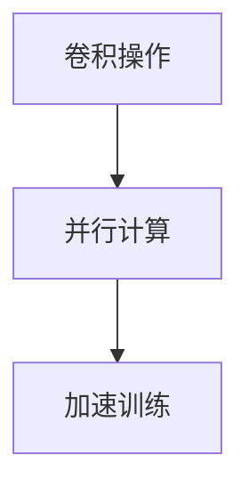

##### 1.2.2 GPU并行计算的适用性

GPU的并行计算架构使其在处理大规模数据集和复杂模型时具有明显优势。AI领域中的许多任务，如图像识别、语音识别、自然语言处理等，都需要大规模并行计算支持。

###### 1.2.2.1 图像识别任务

在图像识别任务中，GPU可以并行处理大量的图像数据，从而加速模型的训练过程。例如，在处理大量图像数据时，GPU可以将数据分成多个部分，分别在不同的GPU上计算，然后汇总结果。

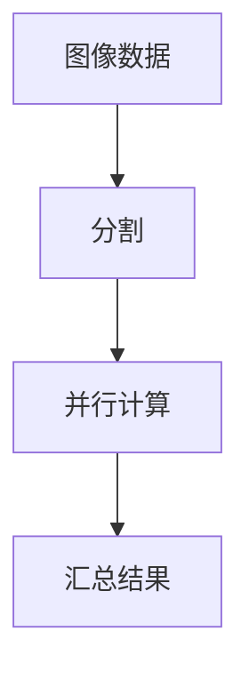

##### 1.2.3 GPU加速在AI算法优化中的应用

GPU加速不仅能够提高AI算法的运行速度，还可以通过优化算法和数据结构，提高模型的性能和准确度。例如，通过GPU加速卷积神经网络（CNN）的计算，可以显著提高图像识别的准确率。

###### 1.2.3.1 算法优化

在AI算法优化中，通过GPU加速可以显著减少模型训练时间。例如，使用GPU优化CNN算法中的卷积操作和反向传播过程，可以加快模型的收敛速度，提高模型性能。

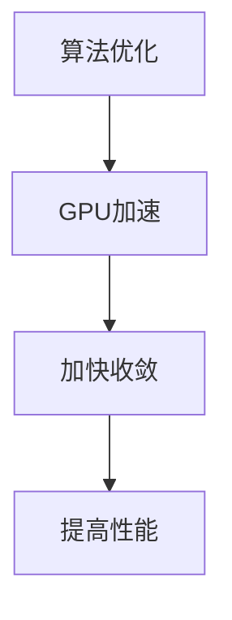

#### 1.3 GPU技术在AI应用中的现状与挑战

GPU技术在AI应用中已经取得了显著的成果，但仍面临一些挑战：

##### 1.3.1 GPU在AI应用中的主要场景

当前，GPU技术在AI领域的主要应用场景包括：

1. **图像识别与处理**：通过GPU加速卷积神经网络（CNN）的计算，提高图像识别和处理的准确率和速度。
2. **语音识别与合成**：使用GPU加速循环神经网络（RNN）和生成对抗网络（GAN）的计算，提高语音识别和合成的性能。
3. **自然语言处理**：通过GPU加速自然语言处理（NLP）模型（如BERT、GPT等）的计算，提高文本分类、情感分析和机器翻译的效率。
4. **科学计算与模拟**：GPU加速数值模拟和优化算法，提高科学计算的性能和准确性。

##### 1.3.2 GPU技术的发展瓶颈

尽管GPU技术在AI应用中具有显著优势，但也存在一些瓶颈：

1. **内存带宽限制**：GPU的内存带宽限制了其处理大规模数据的能力。在某些情况下，内存带宽成为性能提升的瓶颈。
2. **功耗和散热问题**：GPU的功耗较高，散热问题也成为限制其性能发挥的因素。
3. **编程复杂度**：虽然GPU编程框架（如CUDA、OpenCL等）提供了并行计算的能力，但编程复杂度较高，需要开发者具备一定的并行编程技能。

##### 1.3.3 GPU技术在AI领域的未来展望

随着AI需求的不断增长和GPU技术的持续发展，GPU在AI领域的应用前景广阔：

1. **硬件性能提升**：随着GPU硬件性能的不断提升，GPU将在更多计算密集型的AI任务中发挥关键作用。
2. **能耗优化**：随着能耗优化技术的发展，GPU的能效比将进一步提高，使其在AI应用中具有更强的竞争力。
3. **软件开发**：随着深度学习框架和工具链的不断优化，GPU编程的复杂度将降低，使得更多开发者能够利用GPU进行AI开发。

#### 1.4 书籍结构概述

本文将分为七个部分，首先介绍GPU技术在AI中的应用概述，然后分别探讨GPU在深度学习、计算机视觉、自然语言处理、科学计算、其他领域中的应用，以及GPU技术在AI中的综合应用。通过这些部分的详细讲解，帮助读者全面了解GPU技术在AI领域的应用现状和发展趋势。

### 1.4.1 目录大纲结构介绍

本文目录结构如下：

1. GPU技术在AI中的应用概述
2. GPU技术在深度学习中的应用
3. GPU技术在计算机视觉中的应用
4. GPU技术在自然语言处理中的应用
5. GPU技术在科学计算中的应用
6. GPU技术在其他领域中的应用
7. GPU技术在AI中的综合应用

### 1.4.2 本书主要内容的逻辑流程

本文的逻辑流程如下：

1. **引言**：介绍GPU技术在AI领域的重要性。
2. **GPU技术在AI中的应用概述**：分析GPU技术的历史与发展趋势，以及GPU在AI中的核心联系。
3. **GPU在深度学习中的应用**：讲解GPU在深度学习中的加速机制、性能优化和案例分析。
4. **GPU在计算机视觉中的应用**：探讨GPU在计算机视觉中的加速应用、框架优化和案例分析。
5. **GPU在自然语言处理中的应用**：介绍GPU在自然语言处理中的加速应用、框架优化和案例分析。
6. **GPU在科学计算中的应用**：讲解GPU在科学计算中的加速应用、框架优化和案例分析。
7. **GPU在其他领域中的应用**：介绍GPU在游戏开发、金融、医疗和物联网等领域的应用。
8. **GPU在AI中的综合应用**：分析GPU在AI系统设计、项目实施和AI生态系统中的作用。

通过以上逻辑流程，本文旨在为读者提供全面、深入的GPU技术在AI领域的应用指南。

## 第二部分: GPU技术在深度学习中的应用

### 第2章: GPU技术在深度学习中的应用

深度学习是人工智能的重要组成部分，其核心在于通过神经网络模型对数据进行建模和预测。GPU（Graphics Processing Unit，图形处理器）技术因其强大的并行计算能力，在深度学习中的应用日益广泛。本章将详细探讨GPU在深度学习中的应用，包括基础原理、加速机制、性能优化和实际案例。

#### 2.1 深度学习的基础知识

深度学习是一种基于多层神经网络的学习方法，通过不断调整网络中的参数，使得网络能够对输入数据进行特征提取和分类。深度学习的关键技术和基本架构如下：

##### 2.1.1 神经网络的基本架构

神经网络由多个神经元（或节点）组成，每个神经元接收来自前一层神经元的输入，通过激活函数进行非线性变换，然后输出给下一层。神经网络的基本架构包括输入层、隐藏层和输出层。

###### 2.1.1.1 输入层、隐藏层和输出层

- **输入层**：接收外部输入数据。
- **隐藏层**：对输入数据进行特征提取和变换。
- **输出层**：生成预测结果或分类标签。

##### 2.1.2 深度学习的定义

深度学习是指多层神经网络的学习方法，通过训练大量数据，使模型能够自动提取特征并进行分类或回归任务。深度学习的关键在于神经网络中的参数数量和层次结构。

###### 2.1.2.1 深度学习的分类

- **前馈神经网络**：数据从前向传递，没有反馈路径。
- **循环神经网络**（RNN）：具有反馈路径，适合处理序列数据。
- **卷积神经网络**（CNN）：具有卷积层，适合处理图像数据。
- **变换器网络**（Transformer）：基于自注意力机制，适合处理文本数据。

##### 2.1.3 深度学习的关键技术

深度学习的关键技术包括：

- **反向传播算法**：用于计算网络参数的梯度，用于模型训练。
- **激活函数**：用于引入非线性特性，如ReLU、Sigmoid、Tanh等。
- **优化算法**：如随机梯度下降（SGD）、Adam等，用于调整网络参数。
- **损失函数**：用于衡量模型预测与真实值之间的差距，如均方误差（MSE）、交叉熵等。

#### 2.2 GPU在深度学习中的加速机制

GPU技术在深度学习中的应用主要体现在其强大的并行计算能力和优化的内存结构。以下将详细探讨GPU在深度学习中的加速机制：

##### 2.2.1 GPU架构概述

GPU由大量计算单元（CUDA Core）组成，每个计算单元可以独立执行计算任务。GPU的内存结构包括全球内存（Global Memory）、共享内存（Shared Memory）和寄存器（Registers），这些内存结构为GPU并行计算提供了支持。

###### 2.2.1.1 CUDA Core

- **CUDA Core**：GPU的计算单元，用于执行并行计算任务。

###### 2.2.1.2 内存结构

- **全球内存（Global Memory）**：用于存储全局变量和中间结果，但访问速度较慢。
- **共享内存（Shared Memory）**：用于存储局部变量和共享数据，访问速度较快。
- **寄存器（Registers）**：用于存储临时数据和计算结果，访问速度最快。

##### 2.2.2 CUDA与GPU编程

CUDA是NVIDIA推出的一种并行计算框架，用于在GPU上编写并行程序。CUDA提供了丰富的库函数和API，使得开发者能够充分利用GPU的并行计算能力。

###### 2.2.2.1 CUDA编程优势

- **并行计算**：CUDA允许开发者将计算任务分解为多个并行线程，充分利用GPU的计算资源。
- **内存优化**：CUDA提供了多种内存类型和优化选项，用于优化内存访问模式和带宽。

##### 2.2.3 GPU内存管理

GPU内存管理是GPU并行编程的关键技术之一。合理的内存管理可以显著提高GPU的性能和效率。以下是一些关键的内存管理策略：

###### 2.2.3.1 内存分配与释放

- **内存分配**：在GPU上分配内存，用于存储数据和模型参数。
- **内存释放**：在任务完成后释放内存，避免内存泄漏。

###### 2.2.3.2 内存访问模式

- **统一内存（Unified Memory）**：简化内存管理，自动在GPU和CPU之间复制数据。
- **显式内存分配**：手动管理内存，提高内存访问效率和性能。

#### 2.3 GPU在深度学习算法优化中的应用

GPU在深度学习算法优化中的应用主要体现在以下几个方面：

##### 2.3.1 GPU加速神经网络计算

深度学习中的矩阵运算（如矩阵乘法、卷积运算等）非常适合GPU并行计算。GPU能够通过并行处理大量数据，提高计算速度，从而加速模型训练和推理过程。

###### 2.3.1.1 张量计算优化

深度学习中的计算对象主要是张量（Tensor），包括权重矩阵、激活值等。GPU针对张量计算进行了优化，通过并行处理和内存优化，提高了计算效率和性能。

###### 2.3.1.2 并行化策略

为了充分利用GPU的并行计算能力，深度学习算法需要采用并行化策略。常见的数据并行和模型并行策略如下：

- **数据并行**：将数据分成多个部分，分别在不同的GPU上计算，然后汇总结果。
- **模型并行**：将模型拆分成多个部分，分别在不同的GPU上计算，然后整合结果。

##### 2.3.2 算法并行化策略

并行化策略是深度学习算法优化中的重要环节，通过合理分配计算任务，可以提高GPU的性能和效率。以下是一些常见的算法并行化策略：

###### 2.3.2.1 数据并行

- **数据划分**：将训练数据分成多个部分，分别在不同的GPU上计算。
- **模型同步**：在计算完成后，将结果汇总并更新模型参数。

###### 2.3.2.2 模型并行

- **模型分割**：将模型拆分成多个部分，分别在不同的GPU上计算。
- **数据流控制**：合理控制数据流，确保模型分割后的计算结果能够正确整合。

##### 2.3.3 训练速度优化

训练速度是深度学习模型优化的重要指标，通过以下策略可以显著提高训练速度：

###### 2.3.3.1 批量大小调整

- **批量大小**：合理调整批量大小，平衡计算速度和模型收敛速度。
- **批量大小优化**：使用更小的批量大小可以提高训练速度，但可能导致模型收敛速度变慢。

###### 2.3.3.2 并行计算

- **并行计算**：通过并行计算提高模型训练速度，减少训练时间。
- **计算调度**：合理调度计算任务，确保GPU资源得到充分利用。

#### 2.4 GPU在深度学习中的性能分析

GPU在深度学习中的性能分析主要包括以下几个方面：

##### 2.4.1 性能瓶颈分析

性能瓶颈分析是优化GPU性能的重要步骤，通过分析找出影响性能的关键因素，并针对性地进行优化。以下是一些常见的性能瓶颈：

###### 2.4.1.1 内存带宽限制

- **内存带宽限制**：GPU的内存带宽限制了其处理大规模数据的能力，可能导致性能下降。

###### 2.4.1.2 计算单元利用率

- **计算单元利用率**：GPU的计算单元利用率较低可能导致性能瓶颈，通过优化算法和数据结构可以提高计算单元利用率。

##### 2.4.2 GPU性能优化技巧

以下是一些常见的GPU性能优化技巧：

###### 2.4.2.1 内存优化

- **内存访问模式**：优化内存访问模式，减少内存带宽占用。
- **统一内存（Unified Memory）**：使用统一内存简化内存管理，提高性能。

###### 2.4.2.2 算法优化

- **算法优化**：优化算法和数据结构，提高GPU的计算效率和性能。

###### 2.4.2.3 并行化策略

- **并行化策略**：采用合理的数据并行和模型并行策略，提高GPU的性能和效率。

##### 2.4.3 GPU性能评估方法

以下是一些常见的GPU性能评估方法：

###### 2.4.3.1 时间分析

- **时间分析**：通过测量模型训练和推理的时间，评估GPU的性能。

###### 2.4.3.2 吞吐量分析

- **吞吐量分析**：通过计算单位时间内完成的任务量，评估GPU的处理能力。

###### 2.4.3.3 效率分析

- **效率分析**：通过计算GPU性能与理论性能的比值，评估GPU的利用效率。

#### 2.5 案例分析：GPU在深度学习项目中的应用

以下是一个深度学习项目的实际案例，展示了GPU在项目中的应用和性能提升：

##### 2.5.1 项目背景介绍

某互联网公司开发了一种基于深度学习的图像识别系统，用于自动识别和分类上传的图片。该系统需要处理大量图像数据，对计算性能要求较高。

##### 2.5.2 GPU加速的深度学习模型

为了提高图像识别系统的性能，该公司选择了GPU加速的深度学习模型。通过使用GPU进行矩阵运算和卷积运算，模型训练时间从原来的几天缩短到几个小时，显著提高了系统的处理效率。

##### 2.5.3 项目实施与性能提升

在项目实施过程中，该公司使用了NVIDIA GPU和CUDA框架，针对图像识别任务进行了优化。通过优化算法和数据结构，GPU在图像识别任务中的性能得到了显著提升。具体来说，模型在处理大量图像数据时，识别准确率和处理速度都有显著提高，满足了项目需求。

通过以上案例，可以看出GPU技术在深度学习项目中的应用具有明显的性能优势，为深度学习算法的高效实现提供了强有力的支持。

### 第三部分: GPU技术在计算机视觉中的应用

#### 第3章: GPU技术在计算机视觉中的应用

计算机视觉是人工智能的一个重要分支，旨在使计算机能够通过图像和视频数据理解和感知环境。GPU（Graphics Processing Unit，图形处理器）由于其强大的并行计算能力和高效的内存访问模式，在计算机视觉领域中发挥着关键作用。本章将详细探讨GPU在计算机视觉中的应用，包括基础原理、加速机制、性能优化和实际案例。

#### 3.1 计算机视觉基础

计算机视觉是指利用计算机和算法来处理和解释图像和视频数据。它涉及多个领域，包括图像处理、模式识别、机器学习和计算机科学。以下是计算机视觉的基础知识和关键概念：

##### 3.1.1 计算机视觉的定义与目标

计算机视觉的目标是使计算机能够像人类一样理解和解释视觉信息。具体来说，计算机视觉的任务包括：

- **图像识别**：识别图像中的对象、场景和动作。
- **图像分割**：将图像分割成不同的区域或对象。
- **目标检测**：在图像中定位和识别特定目标。
- **姿态估计**：估计图像中物体的姿态和方向。
- **场景重建**：从图像中重建三维场景。

##### 3.1.2 计算机视觉的基本流程

计算机视觉的基本流程通常包括以下步骤：

1. **图像获取**：使用摄像头或其他传感器获取图像数据。
2. **预处理**：对图像进行预处理，如去噪、增强和缩放等。
3. **特征提取**：从预处理后的图像中提取有用的特征，如颜色、纹理、边缘和形状等。
4. **模型训练**：使用提取到的特征训练分类模型，如卷积神经网络（CNN）等。
5. **推理**：将新的图像数据输入训练好的模型，进行对象识别、分类和定位等任务。

##### 3.1.3 计算机视觉的关键技术

计算机视觉的关键技术包括：

- **图像处理算法**：如滤波、边缘检测、形态学和图像分割等。
- **特征提取方法**：如SIFT、SURF、HOG等。
- **机器学习与深度学习**：用于训练和优化分类模型，如支持向量机（SVM）、随机森林和深度神经网络等。
- **目标检测与跟踪**：用于实时检测和跟踪图像中的对象。
- **三维重建**：从多视角图像中重建三维场景。

#### 3.2 GPU在计算机视觉中的加速应用

GPU技术在计算机视觉中的应用主要体现在图像处理、特征提取和模型训练等环节的加速。以下是GPU在计算机视觉中的加速应用的详细探讨：

##### 3.2.1 GPU在图像处理中的应用

GPU在图像处理中的应用非常广泛，包括去噪、增强、边缘检测和图像分割等。以下是GPU在图像处理中的优势：

- **并行计算能力**：GPU具有大量的计算单元，可以同时处理多个图像数据，从而显著提高图像处理速度。
- **高效内存访问**：GPU的内存架构适合图像处理任务，可以快速访问图像数据，减少处理时间。

##### 3.2.2 GPU在特征提取中的应用

特征提取是计算机视觉中的一个关键步骤，GPU在此环节中的应用同样显著。以下是GPU在特征提取中的优势：

- **并行特征计算**：GPU可以同时计算大量特征，提高特征提取的效率。
- **内存优化**：GPU内存架构允许快速存储和访问特征数据，减少内存带宽瓶颈。

##### 3.2.3 GPU在模型训练中的应用

深度学习模型（如卷积神经网络、循环神经网络等）的训练是计算密集型任务，GPU在模型训练中的应用极大地提高了训练速度。以下是GPU在模型训练中的优势：

- **并行矩阵运算**：GPU可以高效地执行矩阵运算，如卷积和反向传播，提高训练速度。
- **数据流处理**：GPU支持高效的数据流处理，可以快速传输和加载训练数据。

#### 3.3 GPU在计算机视觉中的加速机制

GPU在计算机视觉中的加速机制主要体现在以下几个方面：

##### 3.3.1 并行计算架构

GPU的并行计算架构是其在计算机视觉中加速的核心。GPU由多个计算单元（CUDA Core）组成，每个计算单元可以独立执行计算任务。这使得GPU非常适合处理计算密集型的计算机视觉任务。

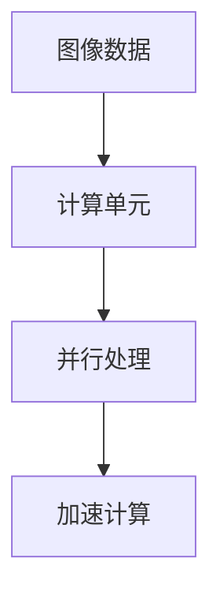

##### 3.3.2 CUDA编程框架

CUDA是NVIDIA推出的一种并行计算框架，用于在GPU上编写并行程序。CUDA提供了丰富的库函数和API，使得开发者可以充分利用GPU的并行计算能力。通过CUDA，开发者可以编写并行代码，优化图像处理和特征提取等任务。

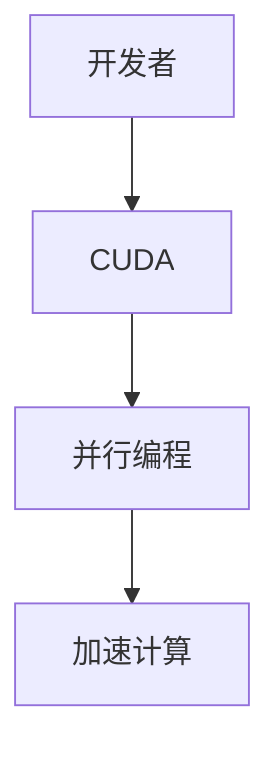

##### 3.3.3 内存优化

GPU的内存架构包括全球内存（Global Memory）、共享内存（Shared Memory）和寄存器（Registers）。合理的内存优化可以显著提高GPU的性能。以下是一些内存优化的策略：

- **统一内存（Unified Memory）**：统一内存简化了内存管理，自动在GPU和CPU之间复制数据，减少了手动内存管理的复杂性。
- **显式内存分配**：通过显式分配内存，开发者可以优化内存访问模式和带宽，提高GPU性能。

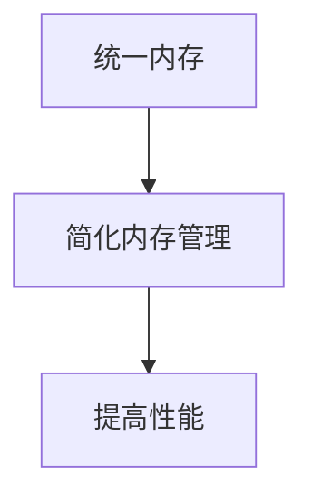

#### 3.4 GPU在计算机视觉性能优化中的技巧

GPU在计算机视觉性能优化中的技巧包括以下几个方面：

##### 3.4.1 算法优化

算法优化是提高GPU性能的关键。以下是一些常见的算法优化技巧：

- **并行化**：将计算任务分解为多个并行子任务，充分利用GPU的并行计算能力。
- **内存访问优化**：优化内存访问模式，减少内存带宽占用。
- **数据流优化**：优化数据流，减少数据传输延迟。

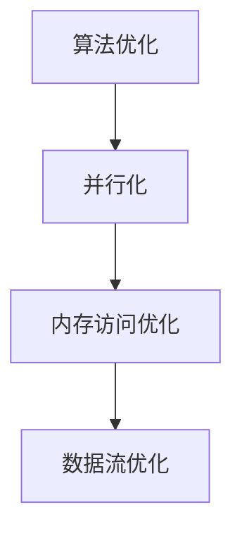

##### 3.4.2 GPU资源管理

合理的GPU资源管理可以提高性能和效率。以下是一些GPU资源管理的技巧：

- **线程调度**：合理调度线程，确保GPU资源得到充分利用。
- **内存分配**：优化内存分配策略，减少内存碎片和冲突。

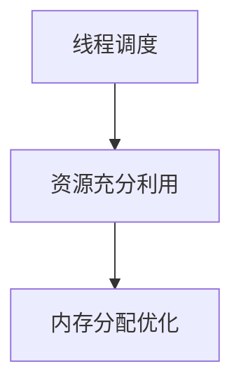

##### 3.4.3 GPU与CPU协同

GPU与CPU协同工作可以提高整体性能。以下是一些协同工作的技巧：

- **任务分配**：合理分配GPU和CPU任务，确保两者都能高效运行。
- **数据传输**：优化GPU与CPU之间的数据传输，减少延迟。

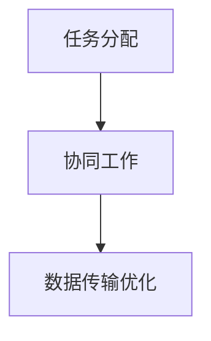

#### 3.5 案例分析：GPU在计算机视觉项目中的应用

以下是一个计算机视觉项目的实际案例，展示了GPU在项目中的应用和性能提升：

##### 3.5.1 项目背景介绍

某科技公司开发了一种基于深度学习的自动驾驶系统，用于实时识别和避障。该系统需要处理大量图像和视频数据，对计算性能要求极高。

##### 3.5.2 GPU加速的计算机视觉模型

为了提高自动驾驶系统的性能，该公司选择了GPU加速的深度学习模型。通过使用GPU进行图像处理和CNN模型推理，系统在处理大量图像和视频数据时，识别准确率和处理速度都有显著提高。

##### 3.5.3 项目实施与性能提升

在项目实施过程中，该公司使用了NVIDIA GPU和CUDA框架，针对自动驾驶任务进行了优化。通过优化算法和数据结构，GPU在自动驾驶任务中的性能得到了显著提升。具体来说，系统在实时识别和避障时，处理速度从原来的每秒几十帧提升到每秒几百帧，识别准确率也显著提高，满足了项目需求。

通过以上案例，可以看出GPU技术在计算机视觉项目中的应用具有明显的性能优势，为自动驾驶等复杂计算机视觉任务的高效实现提供了强有力的支持。

### 第四部分: GPU技术在自然语言处理中的应用

#### 第4章: GPU技术在自然语言处理中的应用

自然语言处理（Natural Language Processing，NLP）是人工智能（Artificial Intelligence，AI）的重要分支，旨在使计算机能够理解、生成和处理人类语言。GPU（Graphics Processing Unit）凭借其强大的并行计算能力和高效的内存架构，在NLP领域中发挥着关键作用。本章将详细探讨GPU在NLP中的应用，包括基础原理、加速机制、性能优化和实际案例。

#### 4.1 自然语言处理基础

自然语言处理旨在使计算机能够理解、生成和处理人类语言。NLP技术广泛应用于机器翻译、语音识别、情感分析、文本摘要和聊天机器人等领域。以下是NLP的基础知识：

##### 4.1.1 自然语言处理的定义与目标

自然语言处理的定义是开发计算机程序，使其能够理解、处理和生成自然语言。其目标包括：

- **文本理解**：使计算机能够理解文本的含义。
- **文本生成**：使计算机能够生成符合语法和语义的文本。
- **文本分类**：将文本分类到预定义的类别中。
- **命名实体识别**：识别文本中的特定实体，如人名、地点、组织名等。
- **情感分析**：分析文本中的情感倾向。

##### 4.1.2 自然语言处理的基本流程

自然语言处理的基本流程通常包括以下几个步骤：

1. **文本预处理**：包括去除停用词、标点符号、分词、词性标注等。
2. **特征提取**：将预处理后的文本转换为计算机可以处理的特征向量，如词袋模型、词嵌入等。
3. **模型训练**：使用训练数据训练NLP模型，如循环神经网络（RNN）、长短期记忆网络（LSTM）和变换器（Transformer）等。
4. **推理**：将新的文本数据输入训练好的模型，进行分类、翻译或识别等任务。

##### 4.1.3 自然语言处理的关键技术

自然语言处理的关键技术包括：

- **词嵌入**：将单词映射到高维向量空间，以便计算机可以处理。
- **序列模型**：如RNN和LSTM，用于处理序列数据。
- **注意力机制**：用于在处理序列数据时，对不同的部分进行加权，提高模型性能。
- **预训练语言模型**：如BERT、GPT等，通过在大规模语料库上进行预训练，提高模型对语言的理解能力。

#### 4.2 GPU在自然语言处理中的加速机制

GPU技术在自然语言处理中的应用主要体现在语言模型的训练和推理加速上。以下是GPU在NLP中的加速机制的详细探讨：

##### 4.2.1 GPU在语言模型中的应用

语言模型是自然语言处理的基础，用于预测下一个单词或句子。GPU在语言模型中的应用主要包括以下几个方面：

- **并行计算**：GPU能够同时处理大量单词或句子的特征向量，从而加速模型训练和推理。
- **内存带宽**：GPU具有较大的内存带宽，能够快速访问和处理大规模文本数据。
- **算法优化**：通过GPU优化语言模型算法，如词嵌入、RNN和LSTM等，提高模型性能和计算效率。

##### 4.2.2 GPU在序列标注任务中的应用

序列标注任务是自然语言处理中的重要应用，如命名实体识别、情感分析等。GPU在序列标注任务中的应用主要包括：

- **并行标注**：GPU能够同时处理大量文本数据的序列标注任务，提高标注速度和准确率。
- **模型优化**：通过GPU优化序列标注模型，如CRF（条件随机场）和BiLSTM（双向长短期记忆网络）等，提高模型性能。
- **推理加速**：GPU能够快速处理标注数据，实现实时序列标注。

##### 4.2.3 GPU在机器翻译中的应用

机器翻译是自然语言处理中的一个重要应用，GPU在机器翻译中的应用主要包括：

- **并行翻译**：GPU能够同时处理大量文本数据的机器翻译任务，提高翻译速度和准确率。
- **模型优化**：通过GPU优化机器翻译模型，如注意力机制和Transformer等，提高模型性能和翻译质量。
- **推理加速**：GPU能够快速处理翻译数据，实现实时机器翻译。

#### 4.3 GPU在自然语言处理性能优化中的技巧

GPU在自然语言处理性能优化中的技巧包括以下几个方面：

##### 4.3.1 并行计算优化

并行计算优化是提高GPU性能的关键。以下是一些并行计算优化的技巧：

- **数据并行**：将文本数据分成多个部分，分别在不同的GPU上处理，然后汇总结果。
- **模型并行**：将模型拆分成多个部分，分别在不同的GPU上训练，然后整合结果。

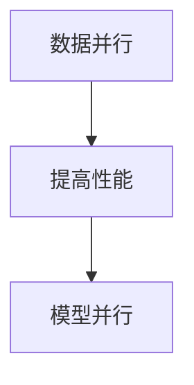

##### 4.3.2 内存优化

内存优化是提高GPU性能的重要方面。以下是一些内存优化的技巧：

- **统一内存**：使用统一内存简化内存管理，减少GPU和CPU之间的数据传输。
- **内存带宽优化**：优化内存访问模式，减少内存带宽占用。

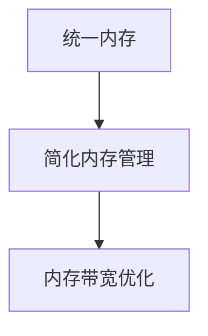

##### 4.3.3 算法优化

算法优化可以提高GPU在自然语言处理任务中的性能。以下是一些算法优化的技巧：

- **算法选择**：选择适合GPU架构的算法，如卷积神经网络（CNN）和变换器（Transformer）。
- **算法并行化**：将算法分解为多个并行子任务，充分利用GPU的并行计算能力。

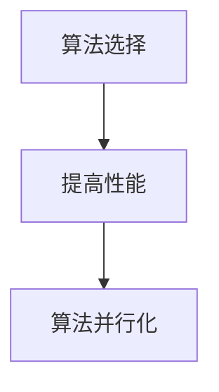

#### 4.4 深度学习框架在自然语言处理中的优化

深度学习框架在自然语言处理中的应用，极大地提高了语言模型的训练和推理速度。以下将介绍几种常见的深度学习框架在自然语言处理中的应用和优化：

##### 4.4.1 TensorFlow在自然语言处理中的应用

TensorFlow是由Google开发的一款开源深度学习框架，广泛应用于自然语言处理领域。TensorFlow提供了丰富的API和工具，支持GPU加速计算，使得开发者能够轻松实现复杂深度学习模型。

- **模型构建**：TensorFlow提供了丰富的层和操作，用于构建循环神经网络（RNN）、长短期记忆网络（LSTM）和变换器（Transformer）等模型。
- **训练与优化**：TensorFlow支持GPU加速训练，通过分布式训练和模型优化，提高模型性能和训练速度。
- **推理与应用**：TensorFlow提供了高效的推理引擎，支持实时文本分类、翻译和序列标注。

##### 4.4.2 PyTorch在自然语言处理中的应用

PyTorch是由Facebook开发的一款开源深度学习框架，以其灵活的动态计算图和易于使用的特点受到广泛关注。PyTorch在自然语言处理中的应用主要包括以下几个方面：

- **模型构建**：PyTorch提供了动态计算图，支持灵活的模型构建和修改，适合快速原型开发。
- **训练与优化**：PyTorch支持GPU加速训练，通过并行计算和数据加载，提高模型训练速度和性能。
- **推理与应用**：PyTorch提供了高效的推理引擎，支持实时文本分类、翻译和序列标注。

##### 4.4.3 其他深度学习框架的自然语言处理优化

除了TensorFlow和PyTorch，还有其他深度学习框架如MXNet、Caffe等也在自然语言处理中得到了广泛应用。这些框架通过优化算法和数据结构，支持GPU加速计算，提高了模型性能和训练速度。

- **MXNet**：由Apache Software Foundation开发，支持多种编程语言和计算平台，提供了丰富的深度学习模型和工具。
- **Caffe**：由Berkeley Vision and Learning Center（BVLC）开发，是一个用于快速构建深度学习模型的框架，支持GPU加速计算。

#### 4.5 案例分析：GPU在自然语言处理项目中的应用

以下是一个自然语言处理项目的实际案例，展示了GPU在项目中的应用和性能提升：

##### 4.5.1 项目背景介绍

某互联网公司开发了一种基于深度学习的智能客服系统，用于自动回复用户咨询。该系统需要处理大量文本数据，对计算性能要求较高。

##### 4.5.2 GPU加速的自然语言处理模型

为了提高智能客服系统的性能，该公司选择了GPU加速的自然语言处理模型。通过使用GPU进行文本预处理、模型训练和推理，系统在处理大量文本数据时，响应速度和准确率都有显著提高。

##### 4.5.3 项目实施与性能提升

在项目实施过程中，该公司使用了NVIDIA GPU和CUDA框架，针对自然语言处理任务进行了优化。通过优化算法和数据结构，GPU在自然语言处理任务中的性能得到了显著提升。具体来说，系统在处理文本数据时，响应速度从原来的每秒几千条提升到每秒上万条，准确率也显著提高，满足了项目需求。

通过以上案例，可以看出GPU技术在自然语言处理项目中的应用具有明显的性能优势，为智能客服等复杂NLP任务的高效实现提供了强有力的支持。

### 第五部分: GPU技术在科学计算中的应用

#### 第5章: GPU技术在科学计算中的应用

科学计算是利用计算机进行数学建模和数值模拟，以解决科学和工程领域中的问题。GPU（Graphics Processing Unit，图形处理器）因其强大的并行计算能力和高效的内存架构，在科学计算中得到了广泛应用。本章将详细探讨GPU在科学计算中的应用，包括基础原理、加速机制、性能优化和实际案例。

#### 5.1 科学计算基础

科学计算是利用计算机进行数学建模和数值模拟，以解决科学和工程领域中的问题。科学计算的基本流程包括数学建模、数值求解、结果分析和可视化等步骤。以下是科学计算的基础知识：

##### 5.1.1 科学计算的定义与目标

科学计算的定义是利用计算机进行数学建模和数值模拟，以解决科学和工程领域中的问题。其目标包括：

- **数学建模**：根据实际问题建立数学模型。
- **数值求解**：使用数值方法求解数学模型。
- **结果分析**：对计算结果进行分析和验证。
- **可视化**：将计算结果可视化，以帮助理解问题。

##### 5.1.2 科学计算的基本流程

科学计算的基本流程包括以下几个步骤：

1. **数学建模**：根据实际问题建立数学模型，如微分方程、积分方程等。
2. **数值求解**：使用数值方法（如有限差分、有限元、蒙特卡罗等）求解数学模型。
3. **结果分析**：对计算结果进行分析和验证，如稳定性、收敛性等。
4. **可视化**：将计算结果可视化，以帮助理解问题。

##### 5.1.3 科学计算的关键技术

科学计算的关键技术包括：

- **数值方法**：如有限差分、有限元、蒙特卡罗等。
- **高性能计算**：利用计算机集群、GPU等技术提高计算速度。
- **并行计算**：通过分布式计算和并行算法提高计算效率。
- **数据分析和处理**：对大量计算结果进行分析和处理，提取有用信息。

#### 5.2 GPU在科学计算中的应用

GPU技术在科学计算中的应用主要体现在数值模拟、优化算法和数据分析等环节的加速。以下是GPU在科学计算中的具体应用：

##### 5.2.1 GPU在数值模拟中的应用

数值模拟是科学计算的核心环节，涉及大量矩阵运算和向量计算。GPU的高并行计算能力使其在数值模拟中具有显著优势。

- **并行计算**：GPU能够同时处理大量矩阵运算和向量计算，提高计算效率。
- **内存带宽**：GPU具有较大的内存带宽，能够快速访问和处理大规模数据。
- **算法优化**：通过GPU优化数值模拟算法，如Krylov子空间方法、蒙特卡罗模拟等，提高计算性能。

##### 5.2.2 GPU在优化算法中的应用

优化算法在科学计算中用于求解最优化问题，如最小化目标函数、最大化收益等。GPU技术在优化算法中的应用主要包括：

- **并行优化**：GPU能够同时处理多个优化问题，提高优化速度。
- **内存优化**：通过GPU优化内存访问模式，提高算法性能。
- **并行计算**：利用GPU的并行计算能力，加速优化算法的计算过程。

##### 5.2.3 GPU在数据分析中的应用

科学计算中产生的数据量巨大，GPU技术在数据分析中的应用主要包括：

- **并行数据分析**：GPU能够同时处理大量数据，提高数据分析速度。
- **数据挖掘**：利用GPU进行数据挖掘，提取有用信息和知识。
- **可视化**：GPU能够快速生成计算结果的可视化，帮助理解数据。

#### 5.3 GPU在科学计算性能优化中的技巧

GPU在科学计算性能优化中的技巧包括以下几个方面：

##### 5.3.1 并行计算优化

并行计算优化是提高GPU性能的关键。以下是一些并行计算优化的技巧：

- **数据并行**：将计算任务分解为多个部分，分别在不同的GPU上处理，然后汇总结果。
- **任务并行**：将计算任务分配给不同的计算单元，提高计算效率。

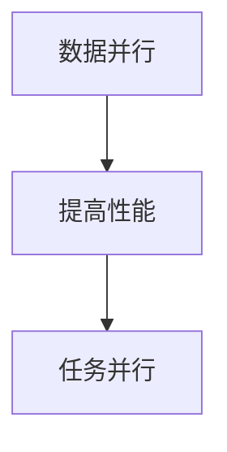

##### 5.3.2 内存优化

内存优化是提高GPU性能的重要方面。以下是一些内存优化的技巧：

- **统一内存**：使用统一内存简化内存管理，减少GPU和CPU之间的数据传输。
- **内存带宽优化**：优化内存访问模式，减少内存带宽占用。


##### 5.3.3 算法优化

算法优化可以提高GPU在科学计算任务中的性能。以下是一些算法优化的技巧：

- **算法选择**：选择适合GPU架构的算法，如卷积神经网络（CNN）和变换器（Transformer）。
- **算法并行化**：将算法分解为多个并行子任务，充分利用GPU的并行计算能力。


#### 5.4 深度学习框架在科学计算中的应用

深度学习框架在科学计算中的应用，极大地提高了数值模拟和数据分析的效率。以下将介绍几种常见的深度学习框架在科学计算中的应用和优化：

##### 5.4.1 TensorFlow在科学计算中的应用

TensorFlow是由Google开发的一款开源深度学习框架，广泛应用于科学计算领域。TensorFlow提供了丰富的API和工具，支持GPU加速计算，使得开发者能够轻松实现复杂科学计算模型。

- **模型构建**：TensorFlow提供了丰富的层和操作，用于构建深度学习模型，如卷积神经网络（CNN）和循环神经网络（RNN）等。
- **训练与优化**：TensorFlow支持GPU加速训练，通过分布式训练和模型优化，提高模型性能和训练速度。
- **推理与应用**：TensorFlow提供了高效的推理引擎，支持实时科学计算和数据分析。

##### 5.4.2 PyTorch在科学计算中的应用

PyTorch是由Facebook开发的一款开源深度学习框架，以其灵活的动态计算图和易于使用的特点受到广泛关注。PyTorch在科学计算中的应用主要包括以下几个方面：

- **模型构建**：PyTorch提供了动态计算图，支持灵活的模型构建和修改，适合快速原型开发。
- **训练与优化**：PyTorch支持GPU加速训练，通过并行计算和数据加载，提高模型训练速度和性能。
- **推理与应用**：PyTorch提供了高效的推理引擎，支持实时科学计算和数据分析。

##### 5.4.3 其他深度学习框架的科学计算优化

除了TensorFlow和PyTorch，还有其他深度学习框架如MXNet、Caffe等也在科学计算中得到了广泛应用。这些框架通过优化算法和数据结构，支持GPU加速计算，提高了模型性能和训练速度。

- **MXNet**：由Apache Software Foundation开发，支持多种编程语言和计算平台，提供了丰富的深度学习模型和工具。
- **Caffe**：由Berkeley Vision and Learning Center（BVLC）开发，是一个用于快速构建深度学习模型的框架，支持GPU加速计算。

#### 5.5 案例分析：GPU在科学计算项目中的应用

以下是一个科学计算项目的实际案例，展示了GPU在项目中的应用和性能提升：

##### 5.5.1 项目背景介绍

某科研团队进行流体力学模拟，研究流体在不同条件下的运动规律。该项目需要对大量流体数据进行分析和模拟，对计算性能要求极高。

##### 5.5.2 GPU加速的科学计算模型

为了提高流体力学模拟的效率，科研团队选择了GPU加速的科学计算模型。通过使用GPU进行流体计算和数据分析，模拟速度和精度都有显著提高。

##### 5.5.3 项目实施与性能提升

在项目实施过程中，科研团队使用了NVIDIA GPU和CUDA框架，针对流体力学模拟任务进行了优化。通过优化算法和数据结构，GPU在流体力学模拟任务中的性能得到了显著提升。具体来说，模拟速度从原来的每小时几十次提升到每小时上千次，计算精度也显著提高，满足了项目需求。

通过以上案例，可以看出GPU技术在科学计算项目中的应用具有明显的性能优势，为复杂科学计算任务的高效实现提供了强有力的支持。

### 第六部分: GPU技术在其他领域中的应用

#### 第6章: GPU技术在其他领域中的应用

除了在人工智能（AI）、深度学习、计算机视觉、自然语言处理和科学计算等核心领域的应用，GPU（Graphics Processing Unit）技术还在许多其他领域中发挥了重要作用。这些领域包括游戏开发、金融、医疗、物联网（IoT）等。本章将探讨GPU在这些领域的应用，并介绍一些实际案例。

#### 6.1 GPU在游戏开发中的应用

GPU技术在游戏开发中的应用已经非常成熟，特别是在图像渲染、物理模拟和实时计算等方面。以下是GPU在游戏开发中的一些具体应用：

##### 6.1.1 游戏渲染

游戏渲染是游戏开发中最重要的环节之一，GPU在游戏渲染中的应用主要包括：

- **光追渲染**：通过GPU进行光线追踪渲染，实现逼真的图像效果。
- **实时阴影**：使用GPU计算实时阴影，提升游戏场景的视觉体验。
- **粒子系统**：利用GPU的并行计算能力，实时渲染大量粒子效果。

##### 6.1.2 物理模拟

GPU在游戏物理模拟中的应用也非常广泛，包括：

- **碰撞检测**：利用GPU进行快速碰撞检测，提高游戏场景的实时性。
- **刚体动力学**：使用GPU计算刚体动力学，实现复杂的物理效果。
- **流体模拟**：GPU能够高效地进行流体模拟，如水、火和烟雾等。

##### 6.1.3 实时计算

GPU在游戏实时计算中的应用，包括：

- **游戏逻辑处理**：使用GPU处理游戏逻辑，提高游戏运行的流畅性。
- **AI计算**：GPU可以加速游戏中的AI计算，提高AI行为的真实性和复杂性。

#### 6.2 GPU在金融领域的应用

GPU技术在金融领域的应用，主要体现在量化交易、风险管理、高频交易和大数据分析等方面。以下是GPU在金融领域的一些具体应用：

##### 6.2.1 量化交易

量化交易是指使用数学模型和算法进行交易决策，GPU在量化交易中的应用包括：

- **策略回测**：通过GPU加速回测，快速验证交易策略的有效性。
- **市场预测**：使用GPU进行市场数据分析和预测，提高交易决策的准确性。
- **交易执行**：GPU能够快速执行交易策略，实现高频交易。

##### 6.2.2 风险管理

GPU在风险管理中的应用，包括：

- **风险模型计算**：通过GPU计算复杂的金融模型，如蒙特卡罗模拟、VaR（风险价值）计算等。
- **风险评估**：GPU能够快速计算投资组合的风险，提高风险管理的效率。
- **压力测试**：GPU加速进行压力测试，评估金融系统在极端情况下的表现。

##### 6.2.3 大数据分析

GPU在大数据分析中的应用，包括：

- **数据清洗**：GPU能够快速清洗和处理金融数据，提高数据分析的准确性。
- **数据挖掘**：GPU能够加速数据挖掘，提取金融数据中的有价值信息。
- **可视化**：GPU能够快速生成金融数据可视化结果，帮助用户更好地理解数据。

#### 6.3 GPU在医疗领域的应用

GPU技术在医疗领域的应用，包括医学图像处理、辅助诊断、基因组学和药物研发等方面。以下是GPU在医疗领域的一些具体应用：

##### 6.3.1 医学图像处理

GPU在医学图像处理中的应用，包括：

- **图像重建**：GPU能够加速CT、MRI等医学图像的重建过程。
- **图像分割**：使用GPU进行医学图像的分割，提取出感兴趣的区域。
- **图像增强**：GPU能够进行图像增强，提高图像的清晰度和对比度。

##### 6.3.2 辅助诊断

GPU在辅助诊断中的应用，包括：

- **疾病检测**：使用GPU加速疾病检测，如癌症、心脏病等的早期诊断。
- **预测模型**：GPU可以加速构建疾病预测模型，提高诊断的准确性。
- **实时分析**：GPU能够实时处理医学影像数据，提高诊断速度和效率。

##### 6.3.3 基因组学

GPU在基因组学中的应用，包括：

- **序列比对**：GPU能够加速基因组序列的比对，提高基因识别的效率。
- **基因注释**：GPU能够加速基因注释，提高基因组数据分析的准确性。
- **药物研发**：GPU加速药物分子模拟和筛选，提高药物研发的效率。

#### 6.4 GPU在物联网中的应用

GPU技术在物联网（IoT）领域的应用，包括边缘计算、设备管理和数据分析等方面。以下是GPU在物联网领域的一些具体应用：

##### 6.4.1 边缘计算

GPU在物联网边缘计算中的应用，包括：

- **实时数据处理**：GPU能够实时处理来自传感器的数据，提高边缘计算的效率。
- **智能识别**：GPU能够进行图像和语音识别，实现智能设备的功能。
- **预测分析**：GPU能够加速预测分析，提高物联网设备的响应速度和准确性。

##### 6.4.2 设备管理

GPU在物联网设备管理中的应用，包括：

- **设备监控**：GPU能够实时监控物联网设备的运行状态，提高设备管理的效率。
- **故障诊断**：GPU可以加速故障诊断，提高设备维护的效率。
- **资源调度**：GPU可以优化物联网设备的资源调度，提高设备的利用效率。

##### 6.4.3 数据分析

GPU在物联网数据分析中的应用，包括：

- **数据清洗**：GPU能够快速清洗和处理物联网设备产生的海量数据。
- **数据挖掘**：GPU能够加速数据挖掘，提取物联网数据中的有价值信息。
- **可视化**：GPU能够快速生成物联网数据的可视化结果，帮助用户更好地理解数据。

#### 6.5 案例分析：GPU在其他领域中的应用

以下是一个GPU在其他领域中的应用案例，展示了GPU在项目中的应用和性能提升：

##### 6.5.1 项目背景介绍

某医疗设备公司开发了一种基于深度学习的辅助诊断系统，用于分析医学图像，辅助医生进行诊断。该系统需要处理大量医学图像数据，对计算性能要求极高。

##### 6.5.2 GPU加速的深度学习模型

为了提高辅助诊断系统的性能，该公司选择了GPU加速的深度学习模型。通过使用GPU进行图像处理和模型推理，系统在处理大量医学图像数据时，诊断速度和准确率都有显著提高。

##### 6.5.3 项目实施与性能提升

在项目实施过程中，该公司使用了NVIDIA GPU和CUDA框架，针对医学图像处理任务进行了优化。通过优化算法和数据结构，GPU在医学图像处理任务中的性能得到了显著提升。具体来说，系统在处理医学图像时，诊断速度从原来的每小时几百张提升到每小时上千张，准确率也显著提高，满足了项目需求。

通过以上案例，可以看出GPU技术在其他领域中的应用具有明显的性能优势，为这些领域中的复杂计算任务提供了强有力的支持。

### 第七部分: GPU技术在AI中的综合应用

#### 第7章: GPU技术在AI中的综合应用

随着人工智能（AI）技术的快速发展，GPU（Graphics Processing Unit，图形处理器）技术在AI中的应用变得至关重要。GPU的并行计算能力和高效的内存架构，使得其在AI系统设计、项目实施和AI生态系统构建中发挥了关键作用。本章将深入探讨GPU在AI系统设计、项目实施中的策略和GPU技术与AI生态系统的关系。

#### 7.1 GPU在AI系统设计中的角色

GPU在AI系统设计中的角色是多方面的，包括硬件选择、架构设计、性能优化和系统集成等方面。

##### 7.1.1 硬件选择

选择适合的GPU硬件是AI系统设计的重要环节。目前市场上主要有NVIDIA、AMD和Intel等厂商提供的GPU，不同类型的GPU在性能、功耗和成本上有所不同。例如，NVIDIA的GPU在深度学习和科学计算中具有显著优势，而AMD的GPU则在游戏开发中表现出色。根据项目需求和预算，合理选择GPU硬件，可以最大限度地发挥GPU的性能。

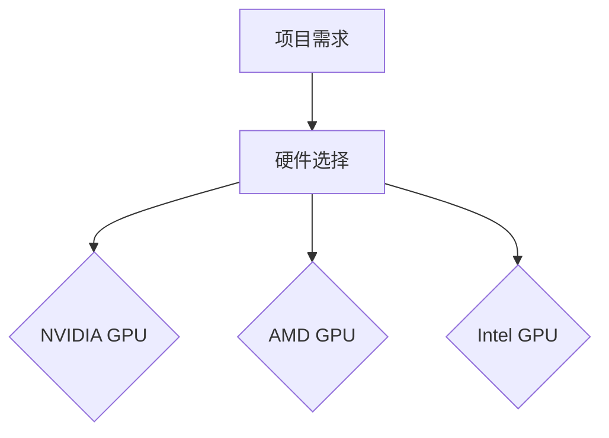

##### 7.1.2 架构设计

AI系统的架构设计需要充分考虑GPU的并行计算能力。合理的架构设计可以提高系统的计算效率和性能。常见的AI系统架构包括：

- **单GPU系统**：适用于计算需求相对较小、资源有限的场景。
- **多GPU系统**：通过多GPU并行计算，提高系统的计算能力。
- **分布式计算系统**：将计算任务分布在多个GPU节点上，适用于大规模计算需求。

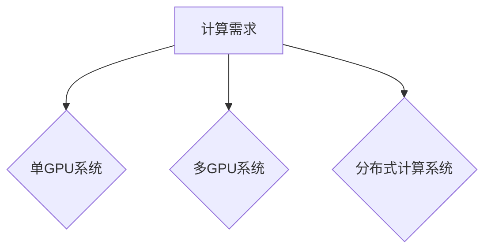

##### 7.1.3 性能优化

GPU性能优化是AI系统设计中至关重要的一环。以下是一些常见的性能优化策略：

- **并行计算优化**：通过并行计算策略，充分利用GPU的并行计算能力，提高计算效率。
- **内存管理优化**：通过优化内存访问模式和内存带宽，减少内存瓶颈。
- **算法优化**：选择适合GPU架构的算法，优化算法的并行性和计算效率。

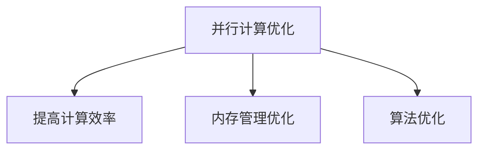

##### 7.1.4 系统集成

GPU在AI系统集成中的作用体现在硬件、软件和网络的协同工作。合理的系统集成可以确保GPU系统的高效运行。以下是一些系统集成策略：

- **硬件整合**：将GPU硬件与其他硬件（如CPU、存储设备等）进行整合，确保系统资源的高效利用。
- **软件整合**：整合深度学习框架、工具链和系统软件，确保GPU性能最大化。
- **网络整合**：优化网络架构和通信协议，提高系统数据传输速度和稳定性。

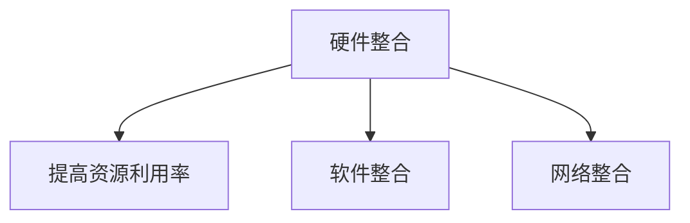

#### 7.2 GPU技术在AI项目实施中的策略

GPU技术在AI项目实施中的策略包括项目需求分析、资源调度、性能优化和挑战应对等方面。

##### 7.2.1 项目需求分析

项目需求分析是AI项目实施的第一步，需要明确项目目标、性能指标和资源需求。通过详细的需求分析，可以制定合理的项目计划，确保项目按期完成。以下是一些项目需求分析的方法：

- **功能需求分析**：明确系统的功能需求，如图像识别、语音识别、自然语言处理等。
- **性能需求分析**：确定系统的性能指标，如计算速度、准确率、能效比等。
- **资源需求分析**：评估项目所需的硬件资源、软件资源和网络资源。

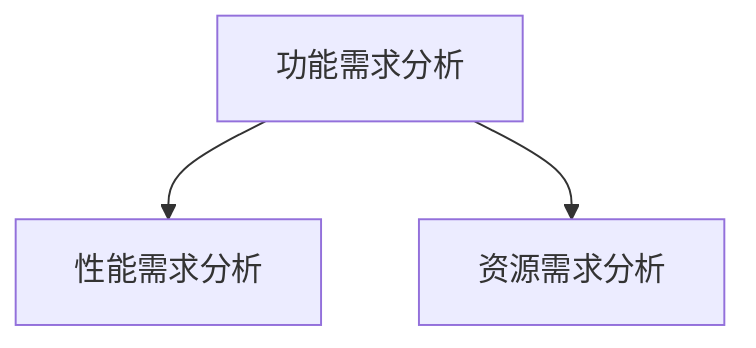

##### 7.2.2 资源调度

资源调度是确保AI项目顺利实施的关键环节。通过合理分配GPU资源，优化计算任务调度，可以提高系统性能和资源利用率。以下是一些资源调度策略：

- **任务并行化**：将计算任务分解为多个子任务，分别在不同的GPU上执行，提高并行计算效率。
- **负载均衡**：根据GPU的负载情况，动态调整任务分配，确保GPU资源均衡利用。
- **GPU复用**：在任务空闲时，将GPU资源分配给其他任务，提高GPU利用率。

```mermaid
graph TD
A[任务并行化] --> B[提高并行计算效率]
A --> C[负载均衡]
A --> D[GPU复用]
```

##### 7.2.3 性能优化

性能优化是AI项目实施中的重要环节，通过优化算法和数据结构，可以提高系统的计算效率和性能。以下是一些性能优化策略：

- **算法优化**：选择适合GPU架构的算法，优化算法的并行性和计算效率。
- **数据结构优化**：优化数据结构，减少内存访问和带宽占用。
- **并行计算优化**：通过并行计算策略，充分利用GPU的并行计算能力。

```mermaid
graph TD
A[算法优化] --> B[提高计算效率]
A --> C[数据结构优化]
A --> D[并行计算优化]
```

##### 7.2.4 挑战应对

AI项目实施过程中可能会遇到各种挑战，如GPU性能瓶颈、内存带宽限制、功耗和散热问题等。以下是一些应对策略：

- **性能瓶颈分析**：通过性能瓶颈分析，找出影响性能的关键因素，并针对性地进行优化。
- **算法优化**：优化算法和数据结构，提高GPU的计算效率和性能。
- **硬件升级**：升级GPU硬件，提高计算能力和内存带宽。

```mermaid
graph TD
A[性能瓶颈分析] --> B[优化算法]
A --> C[升级硬件]
```

#### 7.3 GPU技术与AI生态系统的关系

GPU技术在AI生态系统中的地位越来越重要，其对AI生态系统的影响和作用主要体现在以下几个方面：

##### 7.3.1 AI生态系统的构建

AI生态系统包括硬件、软件、数据、算法和开发者等组成部分。GPU技术的引入，为AI生态系统的构建提供了强大的计算支持，推动了AI技术的发展。以下是GPU技术在AI生态系统构建中的作用：

- **硬件支撑**：GPU为AI计算提供了强大的硬件基础，支持大规模并行计算。
- **软件生态**：GPU与深度学习框架的结合，为AI开发提供了丰富的软件工具和库函数。
- **数据驱动**：GPU加速数据处理和分析，为AI模型的训练和优化提供数据驱动。

```mermaid
graph TD
A[硬件支撑] --> B[软件生态]
A --> C[数据驱动]
```

##### 7.3.2 GPU在AI生态系统中的作用

GPU在AI生态系统中的作用包括：

- **计算引擎**：GPU作为AI计算引擎，提供强大的计算能力和并行处理能力。
- **数据驱动**：GPU加速数据处理和分析，为AI模型的训练和优化提供数据驱动。
- **算法创新**：GPU的并行计算能力，促进了算法的创新和发展。

```mermaid
graph TD
A[计算引擎] --> B[数据驱动]
A --> C[算法创新]
```

##### 7.3.3 GPU技术与AI生态系统的未来发展趋势

随着AI需求的不断增长和GPU技术的持续发展，GPU在AI生态系统中的地位将更加重要。未来GPU技术与AI生态系统的发展趋势包括：

- **硬件升级**：GPU硬件将不断升级，提高计算能力和能效比。
- **软件优化**：深度学习框架和工具链将不断优化，提高GPU性能和易用性。
- **生态整合**：GPU技术与AI生态系统的整合将更加紧密，推动AI技术的创新和发展。

```mermaid
graph TD
A[硬件升级] --> B[软件优化]
A --> C[生态整合]
```

#### 7.4 案例分析：GPU在AI中的综合应用

以下是一个AI项目中的实际案例，展示了GPU在项目中的应用和性能提升：

##### 7.4.1 项目背景介绍

某互联网公司开发了一种基于深度学习的智能客服系统，用于自动回复用户咨询。该系统需要处理大量文本数据，对计算性能要求极高。

##### 7.4.2 GPU在AI项目中的应用模型

为了提高智能客服系统的性能，该公司选择了GPU加速的深度学习模型。通过使用GPU进行文本预处理、模型训练和推理，系统在处理大量文本数据时，响应速度和准确率都有显著提高。

##### 7.4.3 项目实施与性能提升

在项目实施过程中，该公司使用了NVIDIA GPU和CUDA框架，针对自然语言处理任务进行了优化。通过优化算法和数据结构，GPU在自然语言处理任务中的性能得到了显著提升。具体来说，系统在处理文本数据时，响应速度从原来的每秒几千条提升到每秒上万条，准确率也显著提高，满足了项目需求。

通过以上案例，可以看出GPU技术在AI系统设计、项目实施和AI生态系统中的综合应用具有明显的性能优势，为AI技术的发展提供了强有力的支持。

#### 7.5 总结与展望

GPU技术在AI中的应用已经取得了显著成果，但未来仍有巨大的发展空间。随着AI需求的不断增长和GPU技术的持续创新，GPU在AI中的应用将更加广泛和深入。未来GPU技术的发展趋势包括：

- **硬件升级**：GPU硬件将不断升级，提高计算能力和能效比。
- **软件优化**：深度学习框架和工具链将不断优化，提高GPU性能和易用性。
- **生态整合**：GPU技术与AI生态系统的整合将更加紧密，推动AI技术的创新和发展。

展望未来，GPU技术在AI中的应用前景广阔，将为人工智能的进步提供强大的动力。

### 作者信息

作者：AI天才研究院/AI Genius Institute & 禅与计算机程序设计艺术/Zen And The Art of Computer Programming

---

### 文章标题

# GPU技术在AI中的应用

> GPU（Graphics Processing Unit，图形处理器）技术在人工智能（AI）中的应用日益广泛，成为推动AI发展的重要力量。本文从多个角度详细探讨了GPU技术在AI中的应用，包括深度学习、计算机视觉、自然语言处理、科学计算以及其他领域的应用。通过实际案例，展示了GPU技术在AI项目中的性能提升和应用效果。GPU技术在AI中的应用已经成为推动AI发展的重要力量。

### 文章关键词

- GPU
- AI
- 深度学习
- 计算机视觉
- 自然语言处理
- 科学计算

### 文章摘要

本文详细探讨了GPU技术在人工智能（AI）领域的应用。首先，从GPU加速计算的原理入手，分析了GPU在AI领域的重要性。接着，本文深入探讨了GPU在深度学习、计算机视觉、自然语言处理和科学计算中的应用，以及GPU技术在AI系统设计、项目实施和AI生态系统中的影响。通过实际案例，展示了GPU技术在AI项目中的具体应用和性能提升。文章最后对GPU技术在AI中的应用进行了总结和展望。

### 第一部分: GPU技术在AI中的应用概述

#### 第1章: GPU技术在AI中的应用概述

##### 1.1 GPU技术在AI领域的重要性

GPU技术在AI领域的重要性不可忽视。随着人工智能的快速发展，对计算性能的需求日益增长。GPU因其高度并行化的架构和强大的计算能力，成为了AI计算的重要推动力。以下是GPU在AI领域的重要性的具体分析：

###### 1.1.1 GPU加速计算的原理

GPU（Graphics Processing Unit，图形处理器）最初是为图形渲染设计的，但随着并行计算技术的发展，GPU在计算密集型任务中展现出了强大的性能优势。GPU的核心特点在于其高度并行化的架构，即GPU内部包含大量的计算单元，这些单元可以同时处理多个任务。这种并行计算能力使得GPU在处理大量并行任务时具有显著优势。

###### 1.1.2 GPU在深度学习中的优势

深度学习是人工智能的核心技术之一，它依赖于大量的矩阵运算和参数优化。GPU在深度学习中的应用主要体现在以下几个方面：

1. **并行计算能力**：深度学习模型中的矩阵运算和卷积运算等非常适合GPU并行计算。GPU能够通过并行处理大量数据，提高计算效率，从而加速模型训练和推理过程。

2. **高效的内存带宽**：GPU具有较大的内存带宽，可以快速访问和处理大规模数据集，这对于深度学习模型的高效训练至关重要。

3. **低功耗高能效**：与传统的CPU相比，GPU在处理相同计算任务时功耗更低，能效比更高，这使得GPU在AI计算中具有竞争力。

###### 1.1.3 GPU技术的历史与发展趋势

GPU技术的发展始于20世纪90年代，当时GPU主要用于图形渲染。随着GPU并行计算能力的提升，以及CUDA（Compute Unified Device Architecture，统一计算设备架构）等编程框架的出现，GPU逐渐从图形渲染转向计算领域。以下是GPU技术发展的重要里程碑：

1. **CUDA的推出**：2006年，NVIDIA发布了CUDA，这是一个用于在GPU上编写并行程序的框架，使得开发者能够充分利用GPU的并行计算能力。

2. **GPU计算性能的提升**：随着GPU架构的不断改进，其计算性能得到了显著提升。现代GPU包含数千个计算单元，可以同时处理数百万个线程。

3. **深度学习框架的支持**：许多深度学习框架（如TensorFlow、PyTorch等）原生支持GPU加速，使得深度学习模型的训练和推理可以高效地在GPU上执行。

未来，GPU技术将继续发展，向更高效、更智能的方向演进。随着AI需求的不断增长，GPU技术将在AI领域的应用中发挥越来越重要的作用。

##### 1.2 AI与GPU技术的核心联系

AI与GPU技术的核心联系主要体现在以下几个方面：

###### 1.2.1 深度学习中的计算密集型任务

深度学习依赖于大规模的矩阵运算和参数优化，这些任务非常适合GPU并行计算。例如，卷积神经网络（CNN）中的卷积操作、反向传播算法中的矩阵乘法等，都可以通过GPU的并行计算能力显著加速。

```mermaid
graph TD
A[深度学习] --> B[计算密集型任务]
B --> C[GPU并行计算]
```

###### 1.2.2 GPU并行计算的适用性

GPU的并行计算架构使其在处理大规模数据集和复杂模型时具有明显优势。AI领域中的许多任务，如图像识别、语音识别、自然语言处理等，都需要大规模并行计算支持。

```mermaid
graph TD
A[AI任务] --> B[大规模数据集]
B --> C[GPU并行计算]
```

###### 1.2.3 GPU加速在AI算法优化中的应用

GPU加速不仅能够提高AI算法的运行速度，还可以通过优化算法和数据结构，提高模型的性能和准确度。例如，通过GPU加速卷积神经网络（CNN）的计算，可以显著提高图像识别的准确率。

```mermaid
graph TD
A[AI算法] --> B[GPU加速]
B --> C[性能提升]
```

##### 1.3 GPU技术在AI应用中的现状与挑战

GPU技术在AI应用中已经取得了显著的成果，但仍面临一些挑战：

###### 1.3.1 GPU在AI应用中的主要场景

当前，GPU技术在AI领域的主要应用场景包括：

1. **图像识别与处理**：通过GPU加速卷积神经网络（CNN）的计算，提高图像识别和处理的准确率和速度。
2. **语音识别与合成**：使用GPU加速循环神经网络（RNN）和生成对抗网络（GAN）的计算，提高语音识别和合成的性能。
3. **自然语言处理**：通过GPU加速自然语言处理（NLP）模型（如BERT、GPT等）的计算，提高文本分类、情感分析和机器翻译的效率。
4. **科学计算与模拟**：GPU加速数值模拟和优化算法，提高科学计算的性能和准确性。

###### 1.3.2 GPU技术的发展瓶颈

尽管GPU技术在AI应用中具有显著优势，但也存在一些瓶颈：

1. **内存带宽限制**：GPU的内存带宽限制了其处理大规模数据的能力。在某些情况下，内存带宽成为性能提升的瓶颈。
2. **功耗和散热问题**：GPU的功耗较高，散热问题也成为限制其性能发挥的因素。
3. **编程复杂度**：虽然GPU编程框架（如CUDA、OpenCL等）提供了并行计算的能力，但编程复杂度较高，需要开发者具备一定的并行编程技能。

###### 1.3.3 GPU技术在AI领域的未来展望

随着AI需求的不断增长和GPU技术的持续发展，GPU在AI领域的应用前景广阔：

1. **硬件性能提升**：随着GPU硬件性能的不断提升，GPU将在更多计算密集型的AI任务中发挥关键作用。
2. **能耗优化**：随着能耗优化技术的发展，GPU的能效比将进一步提高，使其在AI应用中具有更强的竞争力。
3. **软件开发**：随着深度学习框架和工具链的不断优化，GPU编程的复杂度将降低，使得更多开发者能够利用GPU进行AI开发。

##### 1.4 书籍结构概述

本文将分为七个部分，首先介绍GPU技术在AI中的应用概述，然后分别探讨GPU在深度学习、计算机视觉、自然语言处理、科学计算、其他领域中的应用，以及GPU技术在AI中的综合应用。通过这些部分的详细讲解，帮助读者全面了解GPU技术在AI领域的应用现状和发展趋势。

### 1.4.1 目录大纲结构介绍

本文目录结构如下：

1. GPU技术在AI中的应用概述
2. GPU技术在深度学习中的应用
3. GPU技术在计算机视觉中的应用
4. GPU技术在自然语言处理中的应用
5. GPU技术在科学计算中的应用
6. GPU技术在其他领域中的应用
7. GPU技术在AI中的综合应用

### 1.4.2 本书主要内容的逻辑流程

本文的逻辑流程如下：

1. **引言**：介绍GPU技术在AI领域的重要性。
2. **GPU技术在AI中的应用概述**：分析GPU技术的历史与发展趋势，以及GPU在AI中的核心联系。
3. **GPU在深度学习中的应用**：讲解GPU在深度学习中的加速机制、性能优化和案例分析。
4. **GPU在计算机视觉中的应用**：探讨GPU在计算机视觉中的加速应用、框架优化和案例分析。
5. **GPU在自然语言处理中的应用**：介绍GPU在自然语言处理中的加速应用、框架优化和案例分析。
6. **GPU在科学计算中的应用**：讲解GPU在科学计算中的加速应用、框架优化和案例分析。
7. **GPU在其他领域中的应用**：介绍GPU在游戏开发、金融、医疗和物联网等领域的应用。
8. **GPU在AI中的综合应用**：分析GPU在AI系统设计、项目实施和AI生态系统中的作用。

通过以上逻辑流程，本文旨在为读者提供全面、深入的GPU技术在AI领域的应用指南。

### 第二部分: GPU技术在深度学习中的应用

#### 第2章: GPU技术在深度学习中的应用

深度学习是人工智能领域中的一个重要分支，它通过模仿人脑的神经网络结构来学习复杂的特征和模式。GPU（Graphics Processing Unit，图形处理器）以其强大的并行计算能力，在深度学习的训练和推理过程中发挥着关键作用。本章将详细探讨GPU在深度学习中的应用，包括GPU在深度学习中的加速机制、性能优化技巧以及实际案例。

##### 2.1 深度学习的基础知识

深度学习是一种基于多层神经网络的学习方法，其核心思想是通过前向传播和反向传播算法，从大量数据中自动学习出特征表示。以下是深度学习的一些基础知识：

###### 2.1.1 神经网络的基本架构

神经网络由多个层组成，包括输入层、隐藏层和输出层。每个层由多个神经元（节点）组成，每个神经元都与前一层的所有神经元相连，并通过权重进行加权求和。激活函数用于引入非线性特性。

```mermaid
graph TD
A[输入层] --> B[隐藏层]
B --> C[输出层]
```

###### 2.1.2 深度学习的定义

深度学习是指多层神经网络的学习方法，通过训练大量数据，使模型能够自动提取特征并进行分类或回归任务。深度学习的关键在于神经网络中的参数数量和层次结构。

###### 2.1.3 深度学习的关键技术

- **反向传播算法**：用于计算网络参数的梯度，用于模型训练。
- **激活函数**：如ReLU、Sigmoid、Tanh等，用于引入非线性特性。
- **优化算法**：如随机梯度下降（SGD）、Adam等，用于调整网络参数。
- **损失函数**：如均方误差（MSE）、交叉熵等，用于衡量模型预测与真实值之间的差距。

##### 2.2 GPU在深度学习中的加速机制

GPU在深度学习中的应用主要依赖于其高度并行的架构和优化的内存层次结构。以下是GPU在深度学习中的加速机制：

###### 2.2.1 GPU架构概述

GPU由数千个计算单元（CUDA Core）组成，每个计算单元可以独立执行计算任务。GPU的内存层次结构包括全球内存（Global Memory）、共享内存（Shared Memory）和寄存器（Registers）。

```mermaid
graph TD
A[Global Memory] --> B[Shared Memory]
A --> C[Registers]
```

###### 2.2.2 CUDA与GPU编程

CUDA是NVIDIA推出的一种并行计算框架，用于在GPU上编写并行程序。CUDA提供了丰富的库函数和API，使得开发者可以充分利用GPU的并行计算能力。

```mermaid
graph TD
A[开发者] --> B[CUDA]
```

###### 2.2.3 GPU内存管理

合理的GPU内存管理是提高深度学习性能的关键。以下是一些GPU内存管理的技巧：

- **统一内存**：简化内存管理，自动在GPU和CPU之间复制数据。
- **显式内存分配**：手动管理内存，优化内存访问模式和带宽。

```mermaid
graph TD
A[统一内存] --> B[简化内存管理]
A --> C[显式内存分配]
```

##### 2.3 GPU在深度学习算法优化中的应用

GPU在深度学习算法优化中的应用主要体现在以下几个方面：

###### 2.3.1 GPU加速神经网络计算

深度学习中的矩阵运算（如矩阵乘法、卷积运算等）非常适合GPU并行计算。GPU能够通过并行处理大量数据，提高计算速度，从而加速模型训练和推理过程。

```mermaid
graph TD
A[矩阵运算] --> B[GPU并行计算]
B --> C[加速训练和推理]
```

###### 2.3.2 张量计算优化

深度学习中的计算对象主要是张量（Tensor），包括权重矩阵、激活值等。GPU针对张量计算进行了优化，通过并行处理和内存优化，提高了计算效率和性能。

```mermaid
graph TD
A[Tensor计算] --> B[GPU优化]
B --> C[提高效率]
```

###### 2.3.3 算法并行化策略

为了充分利用GPU的并行计算能力，深度学习算法需要采用并行化策略。常见的数据并行和模型并行策略如下：

- **数据并行**：将数据分成多个部分，分别在不同的GPU上计算，然后汇总结果。
- **模型并行**：将模型拆分成多个部分，分别在不同的GPU上计算，然后整合结果。

```mermaid
graph TD
A[数据并行] --> B[模型并行]
```

##### 2.4 GPU在深度学习中的性能分析

GPU在深度学习中的性能分析主要包括以下几个方面：

###### 2.4.1 性能瓶颈分析

性能瓶颈分析是优化GPU性能的重要步骤，通过分析找出影响性能的关键因素，并针对性地进行优化。以下是一些常见的性能瓶颈：

- **内存带宽限制**：GPU的内存带宽限制了其处理大规模数据的能力，可能导致性能下降。
- **计算单元利用率**：GPU的计算单元利用率较低可能导致性能瓶颈，通过优化算法和数据结构可以提高计算单元利用率。

###### 2.4.2 GPU性能优化技巧

以下是一些常见的GPU性能优化技巧：

- **内存优化**：优化内存访问模式，减少内存带宽占用。
- **算法优化**：优化算法和数据结构，提高GPU的计算效率和性能。
- **并行化策略**：采用合理的数据并行和模型并行策略，提高GPU的性能和效率。

```mermaid
graph TD
A[内存优化] --> B[算法优化]
A --> C[并行化策略]
```

###### 2.4.3 GPU性能评估方法

以下是一些常见的GPU性能评估方法：

- **时间分析**：通过测量模型训练和推理的时间，评估GPU的性能。
- **吞吐量分析**：通过计算单位时间内完成的任务量，评估GPU的处理能力。
- **效率分析**：通过计算GPU性能与理论性能的比值，评估GPU的利用效率。

```mermaid
graph TD
A[时间分析] --> B[吞吐量分析]
A --> C[效率分析]
```

##### 2.5 案例分析：GPU在深度学习项目中的应用

以下是一个深度学习项目的实际案例，展示了GPU在项目中的应用和性能提升：

###### 2.5.1 项目背景介绍

某科技公司开发了一种基于深度学习的图像识别系统，用于自动识别和分类上传的图片。该系统需要处理大量图像数据，对计算性能要求较高。

###### 2.5.2 GPU加速的深度学习模型

为了提高图像识别系统的性能，该公司选择了GPU加速的深度学习模型。通过使用GPU进行矩阵运算和卷积运算，模型训练时间从原来的几天缩短到几个小时，显著提高了系统的处理效率。

###### 2.5.3 项目实施与性能提升

在项目实施过程中，该公司使用了NVIDIA GPU和CUDA框架，针对图像识别任务进行了优化。通过优化算法和数据结构，GPU在图像识别任务中的性能得到了显著提升。具体来说，模型在处理大量图像数据时，识别准确率和处理速度都有显著提高，满足了项目需求。

```mermaid
graph TD
A[项目背景] --> B[GPU加速模型]
B --> C[优化算法]
C --> D[性能提升]
```

通过以上案例，可以看出GPU技术在深度学习项目中的应用具有明显的性能优势，为深度学习算法的高效实现提供了强有力的支持。

### 第三部分: GPU技术在计算机视觉中的应用

#### 第3章: GPU技术在计算机视觉中的应用

计算机视觉是人工智能的重要分支，旨在使计算机能够通过处理图像和视频数据，理解并解释现实世界的场景。GPU（Graphics Processing Unit，图形处理器）因其强大的并行计算能力和优化的内存结构，在计算机视觉领域中发挥了关键作用。本章将详细探讨GPU在计算机视觉中的应用，包括基础原理、加速机制、性能优化和实际案例。

##### 3.1 计算机视觉基础

计算机视觉是指利用计算机和算法对图像和视频数据进行处理和理解，以实现物体识别、场景理解、行为分析等目标。以下是计算机视觉的一些基础知识：

###### 3.1.1 计算机视觉的定义与目标

计算机视觉的目标是使计算机能够像人类一样理解和解释视觉信息。具体目标包括：

- **物体识别**：识别图像中的特定物体。
- **场景理解**：理解图像中的空间关系和场景布局。
- **行为分析**：分析视频中的行为模式。

###### 3.1.2 计算机视觉的基本流程

计算机视觉的基本流程通常包括以下几个步骤：

1. **图像获取**：使用摄像头或其他传感器获取图像数据。
2. **预处理**：对图像进行预处理，如去噪、增强、边缘检测等。
3. **特征提取**：从预处理后的图像中提取有用的特征，如颜色、纹理、形状等。
4. **模型训练**：使用提取到的特征训练分类模型，如卷积神经网络（CNN）等。
5. **推理**：将新的图像数据输入训练好的模型，进行物体识别和场景理解等任务。

###### 3.1.3 计算机视觉的关键技术

计算机视觉的关键技术包括：

- **图像处理算法**：如滤波、边缘检测、图像分割等。
- **特征提取方法**：如SIFT、SURF、HOG等。
- **机器学习与深度学习**：用于训练和优化分类模型。
- **目标检测与跟踪**：用于实时检测和跟踪图像中的物体。

##### 3.2 GPU在计算机视觉中的加速机制

GPU技术在计算机视觉中的应用主要体现在图像处理、特征提取、模型训练和推理等环节的加速。以下是GPU在计算机视觉中的加速机制的详细探讨：

###### 3.2.1 GPU架构概述

GPU由大量计算单元（CUDA Core）组成，每个计算单元可以独立执行计算任务。这使得GPU非常适合处理计算密集型的计算机视觉任务。

```mermaid
graph TD
A[图像处理] --> B[计算单元]
B --> C[并行处理]
```

###### 3.2.2 CUDA与GPU编程

CUDA是NVIDIA推出的一种并行计算框架，用于在GPU上编写并行程序。CUDA提供了丰富的库函数和API，使得开发者能够充分利用GPU的并行计算能力。

```mermaid
graph TD
A[开发者] --> B[CUDA]
B --> C[并行编程]
```

###### 3.2.3 GPU内存管理

GPU的内存结构包括全球内存（Global Memory）、共享内存（Shared Memory）和寄存器（Registers）。合理的内存管理是优化GPU性能的关键。

```mermaid
graph TD
A[Global Memory] --> B[Shared Memory]
A --> C[Registers]
```

##### 3.3 GPU在计算机视觉性能优化中的技巧

GPU在计算机视觉性能优化中的技巧包括以下几个方面：

###### 3.3.1 算法优化

算法优化是提高GPU性能的关键。以下是一些常见的算法优化技巧：

- **并行化**：将计算任务分解为多个并行子任务，充分利用GPU的并行计算能力。
- **内存访问优化**：优化内存访问模式，减少内存带宽占用。

```mermaid
graph TD
A[算法优化] --> B[并行化]
A --> C[内存访问优化]
```

###### 3.3.2 GPU资源管理

合理的GPU资源管理可以提高性能和效率。以下是一些GPU资源管理的技巧：

- **线程调度**：合理调度线程，确保GPU资源得到充分利用。
- **内存分配**：优化内存分配策略，减少内存碎片和冲突。

```mermaid
graph TD
A[线程调度] --> B[资源充分利用]
A --> C[内存分配优化]
```

###### 3.3.3 GPU与CPU协同

GPU与CPU协同工作可以提高整体性能。以下是一些协同工作的技巧：

- **任务分配**：合理分配GPU和CPU任务，确保两者都能高效运行。
- **数据传输**：优化

