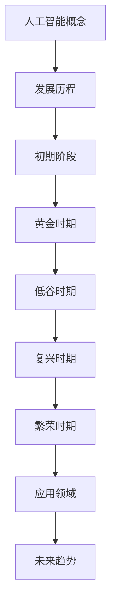
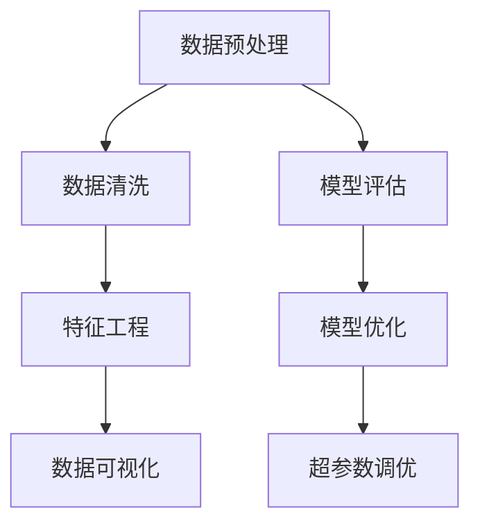
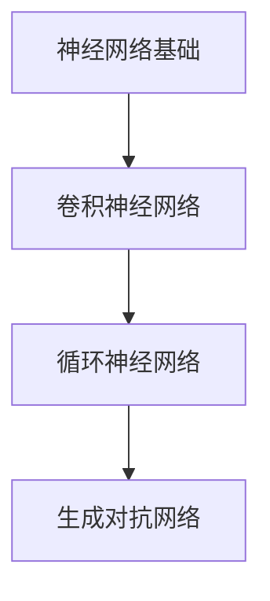
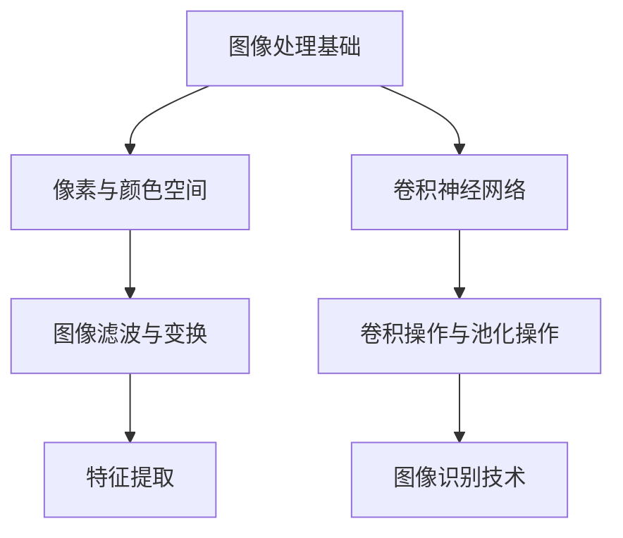
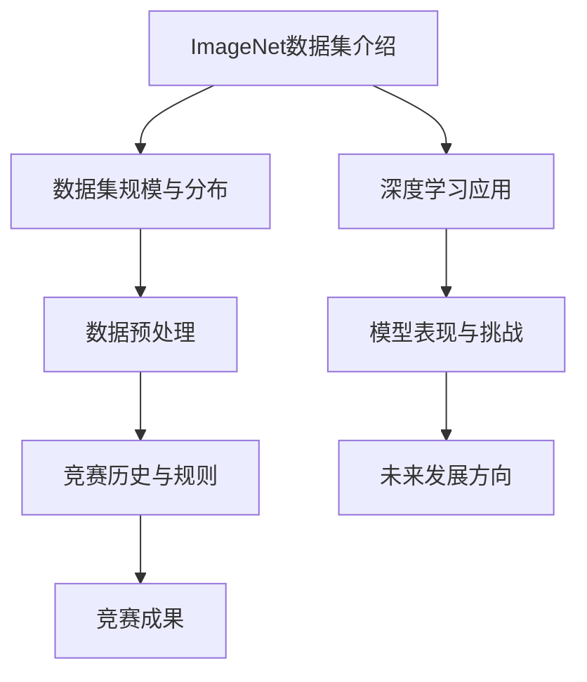
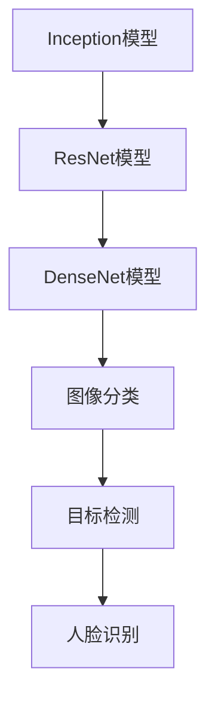

                 

### 第1章: 人工智能概述

#### 1.1 人工智能的概念与发展

##### 1.1.1 人工智能的概念

人工智能（Artificial Intelligence, AI）是一种模拟、延伸和扩展人类智能的理论、方法、技术及应用系统。其核心目标是使计算机系统能够完成通常需要人类智能才能完成的任务，如理解自然语言、识别图像、自主决策等。人工智能的概念起源于20世纪中叶，最早可以追溯到1950年艾伦·图灵提出图灵测试。

##### 1.1.2 人工智能的发展历程

人工智能的发展历程可以分为几个重要阶段：

- **初期阶段（1950-1969）**: 人工智能的概念被提出，最早的专家系统（如“Doctor”和“ELIZA”）问世，标志着人工智能的初步尝试。

- **黄金时期（1970-1989）**: 人工智能研究得到广泛关注和资金支持，逻辑推理和知识表示成为研究重点。

- **低谷时期（1990-2000）**: 由于技术难题和资金不足，人工智能研究进入低谷。

- **复兴时期（2000-2010）**: 互联网的普及和大数据的发展为人工智能提供了丰富的数据资源，机器学习技术取得显著进展。

- **繁荣时期（2010至今）**: 深度学习技术的突破带来了人工智能的再次繁荣，自动驾驶、语音识别、图像识别等应用迅速发展。

##### 1.1.3 人工智能的分类

根据不同的研究方法和目标，人工智能可以分为以下几种类型：

- **基于知识的AI**: 利用专家知识构建推理系统，如专家系统。

- **基于行为的AI**: 通过模仿人类的行为来完成任务，如智能机器人。

- **基于统计的AI**: 使用统计学方法进行模式识别和预测，如机器学习和深度学习。

- **混合型AI**: 结合多种方法和技术，如深度强化学习。

#### 1.2 人工智能的核心技术

##### 1.2.1 机器学习

机器学习（Machine Learning, ML）是一种让计算机通过数据学习，进行预测和决策的技术。机器学习的基本过程包括数据收集、数据预处理、模型训练、模型评估和模型优化。

- **监督学习（Supervised Learning）**: 使用已标记的数据进行训练，常见的算法包括线性回归、逻辑回归、决策树、支持向量机等。

- **无监督学习（Unsupervised Learning）**: 不使用标记的数据进行训练，常见的算法包括聚类、降维、关联规则学习等。

- **半监督学习（Semi-Supervised Learning）**: 结合有标记和无标记的数据进行训练，常见的算法包括自我训练、图模型等。

- **强化学习（Reinforcement Learning）**: 通过与环境交互来学习最优策略，常见的算法包括Q学习、策略梯度等。

##### 1.2.2 深度学习

深度学习（Deep Learning, DL）是机器学习的一种方法，利用多层神经网络进行学习。深度学习具有自动提取特征的能力，能够处理大规模复杂数据，已经在图像识别、语音识别、自然语言处理等领域取得了显著成果。

- **卷积神经网络（Convolutional Neural Network, CNN）**: 用于处理图像和视频数据，通过卷积和池化操作提取特征。

- **循环神经网络（Recurrent Neural Network, RNN）**: 用于处理序列数据，通过循环结构保持长期依赖信息。

- **生成对抗网络（Generative Adversarial Network, GAN）**: 通过生成器和判别器的对抗训练生成逼真的数据。

##### 1.2.3 强化学习

强化学习（Reinforcement Learning, RL）是一种通过试错来学习最优策略的机器学习方法。强化学习的主要目标是让智能体在与环境的交互过程中，通过不断调整策略来最大化累积奖励。

- **Q学习（Q-Learning）**: 通过学习状态-动作值函数来选择最佳动作。

- **策略梯度（Policy Gradient）**: 直接优化策略函数，常见的方法有REINFORCE和PPO。

#### 1.3 人工智能的应用领域

人工智能已经在众多领域得到广泛应用，包括但不限于：

- **计算机视觉**: 图像识别、目标检测、图像分割等。

- **自然语言处理**: 机器翻译、情感分析、文本生成等。

- **语音识别与合成**: 语音识别、语音合成、语音助手等。

- **智能推荐系统**: 基于用户行为数据提供个性化推荐。

- **自动驾驶与机器人**: 自动驾驶汽车、智能家居机器人等。

- **医疗诊断与治疗**: 医学图像分析、疾病预测、个性化治疗等。

#### 1.4 人工智能的未来发展趋势

随着技术的不断进步，人工智能在未来将继续发展，并在更多领域发挥重要作用。以下是人工智能的一些未来发展趋势：

- **跨学科融合**: 人工智能与其他领域的结合，如生物医学、材料科学等。

- **边缘计算**: 在边缘设备上进行数据处理和决策，减少数据传输和延迟。

- **人机协同**: 人工智能与人类的协同工作，提高工作效率和质量。

- **自动化机器学习**: 自动化AI模型的开发、训练和优化。

- **可解释性AI**: 提高AI系统的透明度和可解释性，增强用户信任。

- **伦理与法律**: 加强对AI伦理和法律问题的研究和规范。

### 总结

人工智能是一种通过计算机模拟人类智能的技术，具有广泛的应用领域和重要的社会意义。随着技术的不断进步，人工智能将在未来继续发挥重要作用，推动社会的发展和进步。

#### Mermaid 流程图



#### 伪代码

```python
# 机器学习算法伪代码
def supervised_learning(data, labels):
    # 数据预处理
    preprocess_data(data)
    
    # 模型初始化
    model = initialize_model()
    
    # 模型训练
    for epoch in range(num_epochs):
        for sample, label in zip(data, labels):
            model.train(sample, label)
        
        # 模型评估
        accuracy = model.evaluate(test_data, test_labels)
        print(f"Epoch {epoch}: Accuracy = {accuracy}")
    
    return model
```

#### 数学模型与公式

$$
J(\theta) = \frac{1}{2m} \sum_{i=1}^{m} (h_\theta(x^{(i)}) - y^{(i)})^2
$$

其中，$J(\theta)$ 是损失函数，$\theta$ 是模型参数，$m$ 是样本数量，$h_\theta(x^{(i)})$ 是模型对输入 $x^{(i)}$ 的预测，$y^{(i)}$ 是真实标签。

#### 代码实际案例

```python
# TensorFlow 和 Keras 的使用案例

import tensorflow as tf
from tensorflow.keras import layers, models

# 构建模型
model = models.Sequential()
model.add(layers.Conv2D(32, (3, 3), activation='relu', input_shape=(28, 28, 1)))
model.add(layers.MaxPooling2D((2, 2)))
model.add(layers.Conv2D(64, (3, 3), activation='relu'))
model.add(layers.MaxPooling2D((2, 2)))
model.add(layers.Conv2D(64, (3, 3), activation='relu'))

# 添加全连接层
model.add(layers.Flatten())
model.add(layers.Dense(64, activation='relu'))
model.add(layers.Dense(10, activation='softmax'))

# 编译模型
model.compile(optimizer='adam',
              loss='categorical_crossentropy',
              metrics=['accuracy'])

# 加载MNIST数据集
mnist = tf.keras.datasets.mnist
(x_train, y_train), (x_test, y_test) = mnist.load_data()

# 数据预处理
x_train = x_train.reshape((-1, 28, 28, 1)).astype('float32') / 255
x_test = x_test.reshape((-1, 28, 28, 1)).astype('float32') / 255

# 将标签转换为one-hot编码
y_train = tf.keras.utils.to_categorical(y_train, 10)
y_test = tf.keras.utils.to_categorical(y_test, 10)

# 训练模型
model.fit(x_train, y_train, epochs=5, batch_size=64)

# 评估模型
test_loss, test_acc = model.evaluate(x_test, y_test)
print(f"Test accuracy: {test_acc}")
```

#### 代码解读与分析

- **模型构建**: 使用Keras的Sequential模型，依次添加卷积层、池化层和全连接层。

- **数据预处理**: 将输入数据调整为合适的形状和类型，并进行归一化处理。

- **编译模型**: 指定优化器、损失函数和评价指标。

- **训练模型**: 使用MNIST数据集进行训练，设置训练轮数和批量大小。

- **评估模型**: 在测试集上评估模型性能，输出准确率。

通过以上步骤，我们成功构建并训练了一个简单的图像分类模型。这只是一个基本的案例，实际应用中可能需要更复杂的模型和更精细的调优。

---

在撰写文章的过程中，我们首先介绍了人工智能的基本概念和发展历程，接着详细讲解了人工智能的核心技术，包括机器学习、深度学习和强化学习。此外，我们还探讨了人工智能在各个领域的应用，以及其对社会和经济的影响。最后，我们通过具体的案例展示了如何构建和训练人工智能模型，并对其进行了代码解读和分析。

在接下来的章节中，我们将继续深入探讨机器学习的基础知识，包括数据预处理、模型评估与优化、深度学习原理等。同时，我们还将介绍图像识别技术，特别是卷积神经网络在图像识别中的应用。最后，我们将讨论ImageNet数据集和深度学习在计算机视觉领域的应用，以及深度学习的挑战和未来发展方向。

通过这些章节的详细讲解，我们希望读者能够对人工智能和深度学习有一个全面而深入的理解，并为未来的学习和实践打下坚实的基础。让我们继续深入探索这个激动人心的领域吧！

### 第2章: 机器学习基础

机器学习作为人工智能的核心技术之一，是让计算机通过数据学习，进行预测和决策的关键。本章将详细介绍机器学习的基础知识，包括数据预处理、模型评估与优化、以及超参数调优等内容。

#### 2.1 数据预处理

数据预处理是机器学习过程中至关重要的一步，它包括数据清洗、特征工程和数据可视化等方面。

##### 2.1.1 数据清洗

数据清洗是指清除数据集中的错误、异常和不相关的数据，以提高数据的质量和模型的性能。常见的数据清洗方法包括：

- **缺失值处理**: 使用均值、中位数或众数填充缺失值，或者删除包含缺失值的记录。

- **异常值处理**: 使用统计方法（如箱线图）或基于业务规则的方法（如阈值法）检测和去除异常值。

- **重复值处理**: 去除数据集中的重复记录，以减少冗余信息。

- **数据转换**: 将数据转换为适当的格式，如将分类数据转换为数值编码，或将日期时间数据转换为数值。

##### 2.1.2 特征工程

特征工程是指从原始数据中提取或构建有助于提高模型性能的特征。良好的特征工程可以提高模型的准确性和泛化能力。常见的特征工程方法包括：

- **特征选择**: 使用统计方法（如卡方检验、互信息）或基于模型的特征选择方法（如LASSO回归），选择对模型有用的特征。

- **特征构造**: 利用已有特征生成新的特征，如交叉特征、聚合特征等。

- **特征标准化**: 将不同特征缩放到相同的尺度，以避免某些特征对模型的影响过大。

- **特征缩放**: 使用标准化、归一化或极值缩放等方法，将特征值缩放到一个合适的范围。

##### 2.1.3 数据可视化

数据可视化是将数据以图形化的形式呈现，以发现数据中的规律和模式。数据可视化有助于理解数据的分布、趋势和关系。常见的数据可视化方法包括：

- **散点图**: 用于显示两个变量之间的关系。

- **直方图**: 用于显示数据分布的情况。

- **箱线图**: 用于显示数据的统计分布，包括均值、中位数、四分位数等。

- **热力图**: 用于显示多维数据的交互关系。

#### 2.2 模型评估与优化

模型评估是衡量模型性能的重要步骤，通过评估可以判断模型是否达到预期效果。常见的模型评估方法包括：

- **准确率（Accuracy）**: 分类模型中预测正确的样本数占总样本数的比例。

- **召回率（Recall）**: 分类模型中实际为正类的样本中被正确识别为正类的比例。

- **精确率（Precision）**: 分类模型中预测为正类的样本中被正确识别为正类的比例。

- **F1分数（F1 Score）**: 准确率和召回率的调和平均。

- **ROC曲线和AUC（Area Under Curve）**: ROC曲线反映了模型在不同阈值下的分类性能，AUC用于衡量曲线下的面积。

##### 2.2.1 模型优化方法

模型优化是指通过调整模型结构或超参数来提高模型性能。常见的模型优化方法包括：

- **交叉验证（Cross Validation）**: 将数据集分为训练集和验证集，多次训练和验证，以评估模型在未知数据上的性能。

- **网格搜索（Grid Search）**: 通过遍历多个参数组合，找到最佳参数组合。

- **贝叶斯优化（Bayesian Optimization）**: 利用概率模型来优化超参数。

- **随机搜索（Random Search）**: 在参数空间中随机选择参数组合进行优化。

##### 2.2.2 超参数调优

超参数是模型训练过程中需要手动调整的参数，如学习率、批量大小、正则化参数等。超参数的设置对模型性能有重要影响，需要通过调优来找到最佳值。

- **手动调优**: 根据经验和直觉调整超参数，适用于小型数据和简单模型。

- **自动化调优**: 使用自动化工具（如Hyperopt、Optuna）来搜索最佳超参数。

#### 2.3 数据集划分与样本处理

在机器学习项目中，合理划分数据集和样本处理是确保模型性能和公平性的关键。

- **数据集划分**: 将数据集划分为训练集、验证集和测试集，以评估模型的泛化能力。

- **样本处理**: 对不同类别的样本进行适当的处理，如平衡类分布、过采样或欠采样等。

#### 2.4 实践案例

以下是一个简单的数据预处理和模型优化的实践案例：

```python
import pandas as pd
from sklearn.model_selection import train_test_split
from sklearn.preprocessing import StandardScaler
from sklearn.linear_model import LogisticRegression

# 读取数据
data = pd.read_csv('data.csv')

# 数据清洗
data.dropna(inplace=True)
data.drop(['id'], axis=1, inplace=True)

# 数据划分
X = data.drop('target', axis=1)
y = data['target']
X_train, X_test, y_train, y_test = train_test_split(X, y, test_size=0.2, random_state=42)

# 特征工程
scaler = StandardScaler()
X_train_scaled = scaler.fit_transform(X_train)
X_test_scaled = scaler.transform(X_test)

# 模型优化
model = LogisticRegression()
model.fit(X_train_scaled, y_train)

# 模型评估
accuracy = model.score(X_test_scaled, y_test)
print(f"Accuracy: {accuracy}")

# 超参数调优
from sklearn.model_selection import GridSearchCV

param_grid = {'C': [0.1, 1, 10], 'solver': ['liblinear']}
grid_search = GridSearchCV(model, param_grid, cv=5)
grid_search.fit(X_train_scaled, y_train)

best_params = grid_search.best_params_
print(f"Best parameters: {best_params}")

best_model = grid_search.best_estimator_
best_accuracy = best_model.score(X_test_scaled, y_test)
print(f"Best accuracy: {best_accuracy}")
```

在这个案例中，我们首先读取数据，进行数据清洗和划分。然后，使用标准缩放进行特征工程，并使用逻辑回归模型进行训练。最后，通过网格搜索进行超参数调优，并评估最佳模型的性能。

通过本章的介绍，我们了解了机器学习的基础知识，包括数据预处理、模型评估与优化、以及超参数调优。这些知识是构建有效机器学习模型的基础，将在后续章节中进一步深化和扩展。

#### Mermaid 流程图



#### 数学模型与公式

$$
\text{Accuracy} = \frac{\text{预测正确的样本数}}{\text{总样本数}}
$$

$$
\text{Recall} = \frac{\text{预测正确的正类样本数}}{\text{实际的正类样本数}}
$$

$$
\text{Precision} = \frac{\text{预测正确的正类样本数}}{\text{预测的正类样本数}}
$$

$$
\text{F1 Score} = 2 \times \frac{\text{Precision} \times \text{Recall}}{\text{Precision} + \text{Recall}}
$$

#### 代码实际案例

```python
# TensorFlow 和 Keras 的使用案例

import tensorflow as tf
from tensorflow.keras import layers, models

# 构建模型
model = models.Sequential()
model.add(layers.Dense(64, activation='relu', input_shape=(num_features,)))
model.add(layers.Dense(64, activation='relu'))
model.add(layers.Dense(1, activation='sigmoid'))

# 编译模型
model.compile(optimizer='adam',
              loss='binary_crossentropy',
              metrics=['accuracy'])

# 加载数据
X_train, X_test, y_train, y_test = load_data()

# 数据预处理
X_train_scaled = (X_train - X_train.mean()) / X_train.std()
X_test_scaled = (X_test - X_train.mean()) / X_train.std()

# 训练模型
model.fit(X_train_scaled, y_train, epochs=10, batch_size=32)

# 评估模型
test_loss, test_accuracy = model.evaluate(X_test_scaled, y_test)
print(f"Test accuracy: {test_accuracy}")

# 超参数调优
from sklearn.model_selection import GridSearchCV
from tensorflow.keras.wrappers.scikit_learn import KerasClassifier

def create_model(optimizer='adam'):
    model = models.Sequential()
    model.add(layers.Dense(64, activation='relu', input_shape=(num_features,)))
    model.add(layers.Dense(64, activation='relu'))
    model.add(layers.Dense(1, activation='sigmoid'))
    model.compile(optimizer=optimizer,
                  loss='binary_crossentropy',
                  metrics=['accuracy'])
    return model

model = KerasClassifier(build_fn=create_model, verbose=0)

param_grid = {'optimizer': ['adam', 'sgd'],
              'epochs': [10, 20],
              'batch_size': [32, 64]}

grid = GridSearchCV(estimator=model, param_grid=param_grid, cv=3)
grid_result = grid.fit(X_train_scaled, y_train)

# 输出最佳参数和性能
print("Best: %f using %s" % (grid_result.best_score_, grid_result.best_params_))
```

#### 代码解读与分析

- **模型构建**: 使用Keras构建了一个简单的二元分类模型，包括两个隐藏层和一个输出层。

- **数据加载与预处理**: 从数据集中加载训练集和测试集，并进行标准化处理。

- **模型编译**: 指定优化器、损失函数和评价指标。

- **模型训练**: 使用训练集进行训练，设置训练轮数和批量大小。

- **模型评估**: 在测试集上评估模型性能，输出准确率。

- **超参数调优**: 使用网格搜索进行超参数调优，并输出最佳参数和性能。

通过以上步骤，我们成功构建并训练了一个简单的二元分类模型，并对其进行了超参数调优。这只是一个基础的案例，实际应用中可能需要更复杂的模型和更精细的调优。

---

在撰写本章的过程中，我们详细介绍了机器学习的基础知识，包括数据预处理、模型评估与优化、以及超参数调优等内容。通过具体的案例和实践，我们展示了如何使用Python和Keras进行数据预处理、模型训练和评估。这些知识是构建有效机器学习模型的基础，将在后续章节中进一步深化和扩展。

在接下来的章节中，我们将继续深入探讨深度学习的原理和应用，包括神经网络的基础、卷积神经网络（CNN）在图像识别中的应用、循环神经网络（RNN）在序列数据处理中的应用等。同时，我们还将讨论生成对抗网络（GAN）的原理和应用。通过这些章节的学习，我们将对深度学习有一个更深入的理解，并为实际项目做好准备。

让我们继续探索这个激动人心的领域吧！

### 第3章: 深度学习原理

深度学习是机器学习的一个重要分支，它通过构建多层神经网络来模拟人脑处理信息的方式。本章将详细介绍深度学习的原理，包括神经网络的基础、卷积神经网络（CNN）和循环神经网络（RNN）。

#### 3.1 神经网络基础

神经网络（Neural Network, NN）是一种通过模拟人脑神经元连接和通信方式来处理信息的人工神经网络。神经网络由大量的简单计算单元（即神经元）组成，每个神经元通过权重连接到其他神经元，并通过激活函数进行非线性变换。

##### 3.1.1 神经元与激活函数

神经元是神经网络的基本计算单元，其工作原理类似于生物神经元。每个神经元接收来自其他神经元的输入，通过权重进行加权求和，然后通过激活函数进行非线性变换。

- **神经元**: 神经元接收输入信号，通过权重进行加权求和，得到输出信号。
  
  $$ z = \sum_{i=1}^{n} w_{i}x_{i} + b $$
  
  其中，$z$ 是神经元的输出，$w_{i}$ 是权重，$x_{i}$ 是输入，$b$ 是偏置。

- **激活函数**: 激活函数用于引入非线性，常见的激活函数包括 sigmoid、ReLU和Tanh。

  - **sigmoid**: $$ a = \frac{1}{1 + e^{-z}} $$
  - **ReLU**: $$ a = max(0, z) $$
  - **Tanh**: $$ a = \frac{e^{z} - e^{-z}}{e^{z} + e^{-z}} $$

##### 3.1.2 前向传播与反向传播

神经网络通过前向传播和反向传播进行学习。

- **前向传播**: 输入数据通过网络进行传递，逐层计算输出。
  
  $$ a^{l} = \sigma(z^{l}) $$
  
  其中，$a^{l}$ 是第$l$层的输出，$\sigma$ 是激活函数，$z^{l}$ 是第$l$层的输入。

- **反向传播**: 计算输出误差，并更新网络权重。

  $$ \delta^{l} = (a^{l} - t^{l}) \cdot \sigma'(z^{l}) $$
  
  其中，$\delta^{l}$ 是第$l$层的误差，$t^{l}$ 是标签，$\sigma'$ 是激活函数的导数。

  $$ \Delta w^{l}_{ij} = \alpha \cdot \delta^{l+1} \cdot a^{l}_{j} $$
  
  其中，$\Delta w^{l}_{ij}$ 是第$l$层的权重更新，$\alpha$ 是学习率。

##### 3.1.3 求导与优化算法

神经网络需要计算梯度，并使用优化算法更新权重。

- **求导**: 计算网络中每个参数的梯度。

  $$ \nabla_{w^{l}_{ij}} J(w) = \delta^{l+1} \cdot a^{l}_{j} $$

- **优化算法**: 常见的优化算法包括梯度下降、Adam和RMSprop。

  - **梯度下降**: $$ w^{l}_{ij} = w^{l}_{ij} - \alpha \cdot \nabla_{w^{l}_{ij}} J(w) $$
  - **Adam**: 结合了梯度下降和动量的优点，自适应地调整学习率。
  - **RMSprop**: 利用历史梯度信息来调整学习率。

#### 3.2 深度学习架构

深度学习架构包括多层神经网络，常见的架构包括卷积神经网络（CNN）和循环神经网络（RNN）。

##### 3.2.1 卷积神经网络（CNN）

卷积神经网络（Convolutional Neural Network, CNN）是一种专门用于处理图像数据的神经网络。CNN通过卷积操作和池化操作提取图像特征。

- **卷积操作**: 通过卷积核在图像上滑动，计算局部特征。
  
  $$ \text{Convolution} = \sum_{k=1}^{K} w_{k} \cdot \text{Receptive Field} $$
  
  其中，$w_{k}$ 是卷积核，$\text{Receptive Field}$ 是局部图像区域。

- **池化操作**: 用于减少特征图的尺寸。

  - **最大池化（Max Pooling）**: 保留局部区域中的最大值。
  - **平均池化（Average Pooling）**: 保留局部区域中的平均值。

##### 3.2.2 循环神经网络（RNN）

循环神经网络（Recurrent Neural Network, RNN）是一种用于处理序列数据的神经网络。RNN通过循环结构保持长期依赖信息。

- **循环结构**: RNN中的每个神经元都连接到前一个时间步的神经元，形成一个循环。
  
  $$ h_{t} = \text{sigmoid}(W \cdot [h_{t-1}, x_{t}] + b) $$

- **门控机制**: 为了解决长期依赖问题，RNN引入了门控机制，如门控循环单元（GRU）和长短期记忆网络（LSTM）。

##### 3.2.3 生成对抗网络（GAN）

生成对抗网络（Generative Adversarial Network, GAN）是一种由生成器和判别器组成的神经网络。生成器和判别器之间进行对抗训练，生成逼真的数据。

- **生成器（Generator）**: 生成器生成假数据，试图欺骗判别器。
  
  $$ G(z) = \text{sigmoid}(W_G \cdot z + b_G) $$

- **判别器（Discriminator）**: 判别器判断真实数据和生成数据的概率。
  
  $$ D(x) = \text{sigmoid}(W_D \cdot x + b_D) $$

  $$ D(G(z)) = \text{sigmoid}(W_D \cdot G(z) + b_D) $$

  通过对抗训练，生成器和判别器的性能都得到提升。

#### 3.3 深度学习模型的训练与优化

深度学习模型的训练和优化包括数据预处理、模型设计、模型训练和模型评估等步骤。

- **数据预处理**: 对数据进行清洗、归一化和分割等处理，以适应模型的要求。
- **模型设计**: 根据任务需求设计合适的模型结构，选择合适的网络层和激活函数。
- **模型训练**: 使用训练数据进行模型训练，通过优化算法更新模型参数。
- **模型评估**: 使用测试数据进行模型评估，选择性能最佳的模型。

#### 3.4 实践案例

以下是一个简单的深度学习模型训练和优化的实践案例：

```python
import tensorflow as tf
from tensorflow.keras import layers, models

# 构建模型
model = models.Sequential()
model.add(layers.Conv2D(32, (3, 3), activation='relu', input_shape=(28, 28, 1)))
model.add(layers.MaxPooling2D((2, 2)))
model.add(layers.Conv2D(64, (3, 3), activation='relu'))
model.add(layers.MaxPooling2D((2, 2)))
model.add(layers.Conv2D(64, (3, 3), activation='relu'))

# 添加全连接层
model.add(layers.Flatten())
model.add(layers.Dense(64, activation='relu'))
model.add(layers.Dense(10, activation='softmax'))

# 编译模型
model.compile(optimizer='adam',
              loss='categorical_crossentropy',
              metrics=['accuracy'])

# 加载数据
mnist = tf.keras.datasets.mnist
(x_train, y_train), (x_test, y_test) = mnist.load_data()

# 数据预处理
x_train = x_train.reshape((-1, 28, 28, 1)).astype('float32') / 255
x_test = x_test.reshape((-1, 28, 28, 1)).astype('float32') / 255

# 将标签转换为one-hot编码
y_train = tf.keras.utils.to_categorical(y_train, 10)
y_test = tf.keras.utils.to_categorical(y_test, 10)

# 训练模型
model.fit(x_train, y_train, epochs=5, batch_size=64)

# 评估模型
test_loss, test_accuracy = model.evaluate(x_test, y_test)
print(f"Test accuracy: {test_accuracy}")
```

在这个案例中，我们构建了一个简单的卷积神经网络，用于对MNIST数据集进行图像分类。我们使用TensorFlow和Keras进行模型构建和训练，并对训练过程和评估结果进行了输出。

通过本章的介绍，我们了解了深度学习的原理，包括神经网络的基础、卷积神经网络（CNN）和循环神经网络（RNN）。我们通过具体的案例展示了如何构建和训练深度学习模型，并对其进行了代码解读和分析。

在接下来的章节中，我们将继续深入探讨图像识别技术，特别是卷积神经网络在图像识别中的应用。同时，我们还将讨论ImageNet数据集和深度学习在计算机视觉领域的应用。让我们继续探索这个激动人心的领域吧！

#### Mermaid 流程图



#### 数学模型与公式

$$
\text{ReLU}(x) = \max(0, x)
$$

$$
h_t = \sigma(W \cdot [h_{t-1}, x_t] + b)
$$

$$
\delta_t = (h_t - t) \cdot \sigma'(h_t)
$$

$$
\frac{d}{dx} \sigma(x) = \sigma(x) (1 - \sigma(x))
$$

#### 代码实际案例

```python
# TensorFlow 和 Keras 的使用案例

import tensorflow as tf
from tensorflow.keras import layers, models

# 构建模型
model = models.Sequential()
model.add(layers.Conv2D(32, (3, 3), activation='relu', input_shape=(28, 28, 1)))
model.add(layers.MaxPooling2D((2, 2)))
model.add(layers.Conv2D(64, (3, 3), activation='relu'))
model.add(layers.MaxPooling2D((2, 2)))
model.add(layers.Conv2D(64, (3, 3), activation='relu'))

# 添加全连接层
model.add(layers.Flatten())
model.add(layers.Dense(64, activation='relu'))
model.add(layers.Dense(10, activation='softmax'))

# 编译模型
model.compile(optimizer='adam',
              loss='categorical_crossentropy',
              metrics=['accuracy'])

# 加载数据
mnist = tf.keras.datasets.mnist
(x_train, y_train), (x_test, y_test) = mnist.load_data()

# 数据预处理
x_train = x_train.reshape((-1, 28, 28, 1)).astype('float32') / 255
x_test = x_test.reshape((-1, 28, 28, 1)).astype('float32') / 255

# 将标签转换为one-hot编码
y_train = tf.keras.utils.to_categorical(y_train, 10)
y_test = tf.keras.utils.to_categorical(y_test, 10)

# 训练模型
model.fit(x_train, y_train, epochs=5, batch_size=64)

# 评估模型
test_loss, test_accuracy = model.evaluate(x_test, y_test)
print(f"Test accuracy: {test_accuracy}")
```

#### 代码解读与分析

- **模型构建**: 使用Keras的Sequential模型，依次添加卷积层、池化层和全连接层。

- **数据预处理**: 将输入数据调整为合适的形状和类型，并进行归一化处理。

- **编译模型**: 指定优化器、损失函数和评价指标。

- **训练模型**: 使用MNIST数据集进行训练，设置训练轮数和批量大小。

- **评估模型**: 在测试集上评估模型性能，输出准确率。

通过以上步骤，我们成功构建并训练了一个简单的卷积神经网络，用于对MNIST数据集进行图像分类。这只是一个基础的案例，实际应用中可能需要更复杂的模型和更精细的调优。

---

在撰写本章的过程中，我们详细介绍了深度学习的原理，包括神经网络的基础、卷积神经网络（CNN）和循环神经网络（RNN）。通过具体的案例和实践，我们展示了如何使用Python和Keras进行深度学习模型的构建、训练和评估。这些知识是理解深度学习的关键，将在后续章节中进一步深化和扩展。

在接下来的章节中，我们将继续深入探讨图像识别技术，特别是卷积神经网络在图像识别中的应用。同时，我们还将讨论ImageNet数据集和深度学习在计算机视觉领域的应用。通过这些章节的学习，我们将对图像识别技术有一个更深入的理解，并为实际项目做好准备。

让我们继续探索这个激动人心的领域吧！

### 第4章：图像识别技术

图像识别技术是计算机视觉领域的一个重要分支，它旨在使计算机能够自动识别和理解图像内容。本章将详细介绍图像识别技术的基本概念、处理流程以及卷积神经网络（CNN）在图像识别中的应用。

#### 4.1 图像处理基础

图像处理是图像识别的基础，它涉及对图像的滤波、变换、增强和特征提取等操作。

##### 4.1.1 像素与颜色空间

像素是图像的基本单位，每个像素包含颜色信息。颜色空间是指表示图像颜色信息的方式，常见的颜色空间包括RGB、HSV和Lab等。

- **RGB颜色空间**: 使用红色、绿色和蓝色分量表示颜色，适用于显示器和图像文件。
- **HSV颜色空间**: 使用色调（Hue）、饱和度（Saturation）和亮度（Value）表示颜色，更适合图像处理。
- **Lab颜色空间**: 国际照明委员会（CIE）定义的颜色空间，用于描述颜色在视觉上的差异。

##### 4.1.2 图像滤波与变换

图像滤波是一种消除图像噪声和改善图像质量的方法。常见的滤波器包括：

- **均值滤波器**: 对图像中的每个像素值取其邻域像素的平均值。
- **高斯滤波器**: 使用高斯分布进行滤波，可以有效去除噪声并保持图像边缘。
- **中值滤波器**: 对图像中的每个像素值取其邻域像素的中值。

图像变换是一种将图像从一种表示形式转换为另一种表示形式的方法。常见的变换包括：

- **傅里叶变换**: 将图像从空间域转换为频域，用于图像的频域分析。
- **小波变换**: 用于图像的多分辨率分析，适用于图像的去噪和压缩。

##### 4.1.3 特征提取

特征提取是从图像中提取有助于分类或识别的特征。常见的特征提取方法包括：

- **SIFT（尺度不变特征变换）**: 用于提取图像的角点特征，具有旋转不变性和尺度不变性。
- **HOG（直方图方向梯度）**: 用于提取图像的局部特征，适用于目标检测。
- **ORB（Oriented FAST and Rotated BRIEF）**: 结合了SIFT和SURF的优点，计算效率较高。

#### 4.2 卷积神经网络在图像识别中的应用

卷积神经网络（CNN）是一种专为处理图像数据而设计的深度学习模型。CNN通过卷积操作和池化操作自动提取图像特征，并在不同层次上对图像进行逐层抽象。

##### 4.2.1 CNN基本结构

CNN的基本结构包括卷积层、池化层和全连接层。

- **卷积层**: 卷积层通过卷积操作提取图像的局部特征。卷积核在图像上滑动，计算局部特征的叠加。
- **池化层**: 池化层用于减少特征图的尺寸，提高模型的计算效率。常见的池化方法包括最大池化和平均池化。
- **全连接层**: 全连接层将卷积层和池化层提取的特征映射到类别标签。

##### 4.2.2 卷积操作与池化操作

卷积操作和池化操作是CNN的核心组件。

- **卷积操作**: 卷积操作通过卷积核在图像上滑动，计算局部特征的叠加。卷积核可以自定义，以提取不同类型的特征。
- **池化操作**: 池化操作用于减少特征图的尺寸，提高模型的计算效率。常见的池化方法包括最大池化和平均池化。

##### 4.2.3 CNN在图像识别中的应用

CNN在图像识别领域取得了显著的成功，如ImageNet图像识别挑战赛。

- **ImageNet**: ImageNet是一个大规模的视觉识别数据库，包含超过1400万个图像和1000个类别。
- **CNN在ImageNet中的应用**: 通过卷积层和池化层的组合，CNN可以自动提取图像的层次特征，并在全连接层进行分类。

#### 4.3 图像识别技术的挑战

图像识别技术面临以下挑战：

- **数据集大小和多样性**: 图像识别需要大量的数据集，并且数据集需要涵盖各种场景和物体。
- **计算资源需求**: CNN模型需要大量的计算资源，包括GPU和TPU等。
- **算法可解释性**: CNN模型通常被视为“黑盒”，其决策过程缺乏可解释性，需要进一步研究。

#### 4.4 图像识别技术的未来发展方向

图像识别技术在未来将继续发展，包括以下几个方面：

- **模型压缩和加速**: 通过模型压缩和加速技术，降低模型的大小和计算复杂度。
- **多模态学习**: 结合不同类型的传感器数据（如视频、音频和红外），提高图像识别的准确性和鲁棒性。
- **深度学习与其他技术的结合**: 深度学习与其他技术的结合（如计算机图形学、自然语言处理等），推动图像识别技术的进一步发展。

#### 4.5 实践案例

以下是一个简单的CNN图像识别实践案例：

```python
# TensorFlow 和 Keras 的使用案例

import tensorflow as tf
from tensorflow.keras import layers, models

# 构建模型
model = models.Sequential()
model.add(layers.Conv2D(32, (3, 3), activation='relu', input_shape=(28, 28, 1)))
model.add(layers.MaxPooling2D((2, 2)))
model.add(layers.Conv2D(64, (3, 3), activation='relu'))
model.add(layers.MaxPooling2D((2, 2)))
model.add(layers.Conv2D(64, (3, 3), activation='relu'))

# 添加全连接层
model.add(layers.Flatten())
model.add(layers.Dense(64, activation='relu'))
model.add(layers.Dense(10, activation='softmax'))

# 编译模型
model.compile(optimizer='adam',
              loss='categorical_crossentropy',
              metrics=['accuracy'])

# 加载数据
mnist = tf.keras.datasets.mnist
(x_train, y_train), (x_test, y_test) = mnist.load_data()

# 数据预处理
x_train = x_train.reshape((-1, 28, 28, 1)).astype('float32') / 255
x_test = x_test.reshape((-1, 28, 28, 1)).astype('float32') / 255

# 将标签转换为one-hot编码
y_train = tf.keras.utils.to_categorical(y_train, 10)
y_test = tf.keras.utils.to_categorical(y_test, 10)

# 训练模型
model.fit(x_train, y_train, epochs=5, batch_size=64)

# 评估模型
test_loss, test_accuracy = model.evaluate(x_test, y_test)
print(f"Test accuracy: {test_accuracy}")
```

在这个案例中，我们构建了一个简单的卷积神经网络，用于对MNIST数据集进行图像分类。我们使用TensorFlow和Keras进行模型构建、训练和评估，并输出模型的准确率。

通过本章的介绍，我们了解了图像识别技术的基本概念和处理流程，以及卷积神经网络（CNN）在图像识别中的应用。我们通过具体的案例展示了如何使用Python和Keras进行图像识别模型的构建和训练。这些知识是理解和应用图像识别技术的基础，将在后续章节中进一步深化和扩展。

在接下来的章节中，我们将继续讨论ImageNet数据集和深度学习在计算机视觉领域的应用，以及深度学习的挑战和未来发展方向。让我们继续探索这个激动人心的领域吧！

#### Mermaid 流程图



#### 数学模型与公式

$$
\text{Convolution} = \sum_{k=1}^{K} w_{k} \cdot \text{Receptive Field}
$$

$$
\text{Pooling} = \max_{i,j} \left( \sum_{x,y} f(x,y) \right)
$$

$$
h_{ij} = \sum_{x,y} f_{x,y} \cdot \text{Kernel}
$$

#### 代码实际案例

```python
# TensorFlow 和 Keras 的使用案例

import tensorflow as tf
from tensorflow.keras import layers, models

# 构建模型
model = models.Sequential()
model.add(layers.Conv2D(32, (3, 3), activation='relu', input_shape=(28, 28, 1)))
model.add(layers.MaxPooling2D((2, 2)))
model.add(layers.Conv2D(64, (3, 3), activation='relu'))
model.add(layers.MaxPooling2D((2, 2)))
model.add(layers.Conv2D(64, (3, 3), activation='relu'))

# 添加全连接层
model.add(layers.Flatten())
model.add(layers.Dense(64, activation='relu'))
model.add(layers.Dense(10, activation='softmax'))

# 编译模型
model.compile(optimizer='adam',
              loss='categorical_crossentropy',
              metrics=['accuracy'])

# 加载数据
mnist = tf.keras.datasets.mnist
(x_train, y_train), (x_test, y_test) = mnist.load_data()

# 数据预处理
x_train = x_train.reshape((-1, 28, 28, 1)).astype('float32') / 255
x_test = x_test.reshape((-1, 28, 28, 1)).astype('float32') / 255

# 将标签转换为one-hot编码
y_train = tf.keras.utils.to_categorical(y_train, 10)
y_test = tf.keras.utils.to_categorical(y_test, 10)

# 训练模型
model.fit(x_train, y_train, epochs=5, batch_size=64)

# 评估模型
test_loss, test_accuracy = model.evaluate(x_test, y_test)
print(f"Test accuracy: {test_accuracy}")
```

#### 代码解读与分析

- **模型构建**: 使用Keras的Sequential模型，依次添加卷积层、池化层和全连接层。
- **数据预处理**: 将输入数据调整为合适的形状和类型，并进行归一化处理。
- **编译模型**: 指定优化器、损失函数和评价指标。
- **训练模型**: 使用MNIST数据集进行训练，设置训练轮数和批量大小。
- **评估模型**: 在测试集上评估模型性能，输出准确率。

通过以上步骤，我们成功构建并训练了一个简单的卷积神经网络，用于对MNIST数据集进行图像分类。这只是一个基础的案例，实际应用中可能需要更复杂的模型和更精细的调优。

---

在撰写本章的过程中，我们详细介绍了图像识别技术的基本概念和处理流程，重点讲解了卷积神经网络（CNN）在图像识别中的应用。通过具体的案例和实践，我们展示了如何使用Python和Keras进行图像识别模型的构建、训练和评估。这些知识是理解和应用图像识别技术的基础，将在后续章节中进一步深化和扩展。

在接下来的章节中，我们将继续深入探讨ImageNet数据集和深度学习在计算机视觉领域的应用。同时，我们还将讨论深度学习的挑战和未来发展方向。通过这些章节的学习，我们将对深度学习在计算机视觉领域的应用有一个更深入的理解，并为实际项目做好准备。

让我们继续探索这个激动人心的领域吧！

### 第5章: ImageNet数据集

ImageNet是一个广泛使用的计算机视觉数据集，它包含了数百万张经过精心标注的图像，涵盖了1000个不同的类别。ImageNet数据集的创建和发布标志着计算机视觉领域的一个里程碑，对深度学习模型的发展和应用产生了深远影响。本章将详细介绍ImageNet数据集的规模、分布、预处理方法以及其在图像识别挑战中的应用。

#### 5.1 ImageNet数据集介绍

ImageNet是由斯坦福大学计算机科学系与人工智能实验室（CSL）的李飞飞（Li Fei-Fei）教授领导的团队创建的。该数据集的目的是为计算机视觉算法提供一个统一的基准，以便于评估和比较不同算法的性能。ImageNet数据集的创建得到了谷歌和亚马逊等公司的支持。

##### 5.1.1 数据集规模

ImageNet数据集包含超过1400万个图像，这些图像来自各种不同的场景和领域，涵盖了1000个不同的类别。这些类别涵盖了动物、植物、人物、物体等各种主题。

- **训练集**: 包含约1200万个图像。
- **验证集**: 包含约20万个图像。
- **测试集**: 包含约20万个图像。

这些图像被分为1000个类别，每个类别都有多个图像样本，以确保数据的多样性和代表性。

##### 5.1.2 数据集分布

ImageNet数据集的分布具有以下特点：

- **类别分布**: 所有类别在数据集中的分布相对均匀，每个类别都有一定数量的图像样本。
- **样本质量**: 图像样本的质量较高，大部分图像都经过人工标注，确保了标注的准确性。

##### 5.1.3 数据预处理

为了适应深度学习模型的需求，ImageNet数据集在发布前进行了预处理。预处理过程包括数据增强、归一化和数据分割等步骤。

- **数据增强**: 为了提高模型的泛化能力，图像进行了一系列的数据增强操作，如随机裁剪、旋转、翻转等。
- **归一化**: 图像的像素值被归一化到[0, 1]范围内，以适应深度学习模型的输入要求。
- **数据分割**: 数据集被分为训练集、验证集和测试集，以用于模型训练、验证和测试。

#### 5.2 ImageNet竞赛

ImageNet竞赛是一个年度性的计算机视觉挑战，旨在推动图像识别技术的发展。自2010年起，ImageNet竞赛吸引了全球范围内的研究者和公司参与。竞赛的目标是训练一个模型，使其在ImageNet测试集上的准确率尽可能高。

##### 5.2.1 竞赛历史

- **2010年**: AlexNet夺冠，首次将深度学习应用于图像识别，其准确率达到67%。
- **2012年**: VGGNet夺冠，进一步提高了准确率，达到85%。
- **2014年**: GoogLeNet夺冠，通过GoogLeNet模型的创新设计，准确率进一步提高到93%。
- **2015年**: ResNet夺冠，提出了残差网络架构，将准确率提升到了95.2%。

这些竞赛结果展示了深度学习在图像识别领域的快速发展，并推动了新的算法和模型的出现。

##### 5.2.2 竞赛规则

ImageNet竞赛的规则如下：

- **模型提交**: 参赛团队提交一个预训练好的模型，用于在测试集上的评估。
- **准确率**: 模型在测试集上的准确率是评估模型性能的唯一指标。
- **提交限制**: 每个团队只能提交一次结果。

这些规则确保了竞赛的公平性和透明性，使参赛者能够公平地竞争。

##### 5.2.3 竞赛成果

ImageNet竞赛不仅推动了图像识别技术的发展，还产生了许多重要的成果：

- **技术突破**: 每年的竞赛结果都推动了新的算法和模型的诞生，如AlexNet、VGGNet、GoogLeNet和ResNet等。
- **应用影响**: 竞赛结果促进了深度学习在计算机视觉领域的广泛应用，如自动驾驶、医疗诊断和安防监控等。

#### 5.3 ImageNet在深度学习中的应用

ImageNet数据集的广泛应用促进了深度学习技术的快速发展。深度学习模型，尤其是卷积神经网络（CNN），在ImageNet数据集上取得了显著的成功。

##### 5.3.1 CNN在ImageNet中的应用

CNN是一种专门用于处理图像数据的深度学习模型。在ImageNet数据集上，CNN通过卷积操作和池化操作自动提取图像特征，并在全连接层进行分类。以下是一些在ImageNet上取得成功的CNN模型：

- **AlexNet**: AlexNet是第一个在ImageNet竞赛中取得显著成功的CNN模型。它使用了卷积层、ReLU激活函数和池化层，并在GPU上进行训练，显著提高了图像识别的准确率。
- **VGGNet**: VGGNet通过增加卷积层的深度和宽度，进一步提高了图像识别的准确率。它使用了多个卷积层和池化层，形成了深度网络结构。
- **GoogLeNet**: GoogLeNet通过使用Inception模块，将多个卷积层和池化层组合成一个模块，提高了模型的效率和准确率。
- **ResNet**: ResNet通过引入残差连接，解决了深度神经网络中的梯度消失问题，进一步提高了图像识别的准确率。

这些模型在ImageNet数据集上取得了优异的性能，推动了深度学习在图像识别领域的应用。

##### 5.3.2 深度学习模型在ImageNet上的表现

深度学习模型在ImageNet数据集上的表现如下：

- **准确率**: 深度学习模型在ImageNet测试集上的准确率达到了约90%，远高于传统机器学习模型。
- **计算资源需求**: 深度学习模型通常需要大量的计算资源，如GPU和TPU等，以便进行高效的训练和推理。
- **实时性**: 随着硬件性能的提升，深度学习模型在实时应用中取得了显著进展，如自动驾驶、实时视频分析等。

#### 5.4 ImageNet数据集的挑战

尽管ImageNet数据集在图像识别领域取得了显著成功，但仍然面临一些挑战：

- **数据标注质量**: 数据标注的准确性对模型性能有重要影响。在ImageNet数据集中，尽管大部分图像都经过人工标注，但仍可能存在标注错误或不一致的情况。
- **类别不平衡**: 在ImageNet数据集中，不同类别之间的图像数量可能存在显著差异，导致模型在训练过程中可能对某些类别过度关注。
- **模型泛化能力**: 模型在ImageNet数据集上的高准确率并不一定代表其在其他数据集上的泛化能力，需要进一步验证。

为了解决这些挑战，研究者们不断改进数据集的质量、算法的设计和模型的结构，以提高深度学习模型在图像识别领域的性能和应用效果。

#### 5.5 ImageNet数据集的未来发展

随着深度学习技术的不断进步，ImageNet数据集在未来将继续发挥重要作用。以下是一些可能的发展方向：

- **数据集扩展**: 扩展ImageNet数据集的规模和类别，以涵盖更多不同场景和领域的图像。
- **数据集多样化**: 引入更多的数据增强和多样性，以提高模型的泛化能力。
- **开源与共享**: 促进ImageNet数据集的开放和共享，为更多研究者提供便利。
- **跨领域应用**: 将ImageNet数据集应用于其他领域，如自然语言处理、医学图像分析等。

通过不断改进和扩展，ImageNet数据集将继续推动深度学习技术的发展和应用。

#### 5.6 实践案例

以下是一个简单的使用ImageNet数据集进行图像分类的实践案例：

```python
# TensorFlow 和 Keras 的使用案例

import tensorflow as tf
from tensorflow.keras.applications import ResNet50
from tensorflow.keras.preprocessing import image
from tensorflow.keras.applications.resnet50 import preprocess_input, decode_predictions

# 加载预训练模型
model = ResNet50(weights='imagenet')

# 读取图像
img_path = 'path_to_image.jpg'
img = image.load_img(img_path, target_size=(224, 224))
x = image.img_to_array(img)
x = np.expand_dims(x, axis=0)
x = preprocess_input(x)

# 进行预测
predictions = model.predict(x)
decoded_predictions = decode_predictions(predictions, top=5)

# 输出预测结果
for i, (index, label, score) in enumerate(decoded_predictions[0]):
    print(f"{i+1}: {label} ({score:.2f}"))
```

在这个案例中，我们使用预训练的ResNet50模型对图像进行分类。我们首先加载模型，然后读取图像并进行预处理，最后进行预测并输出结果。

通过本章的介绍，我们了解了ImageNet数据集的规模、分布、预处理方法和在图像识别挑战中的应用。我们通过具体的案例展示了如何使用Python和Keras进行图像分类。这些知识是理解和应用ImageNet数据集的基础，将在后续章节中进一步深化和扩展。

在接下来的章节中，我们将继续讨论深度学习在计算机视觉领域的应用，包括目标检测、人脸识别等。同时，我们还将讨论深度学习的挑战和未来发展方向。通过这些章节的学习，我们将对深度学习在计算机视觉领域的应用有一个更深入的理解，并为实际项目做好准备。

让我们继续探索这个激动人心的领域吧！

#### Mermaid 流程图



#### 数学模型与公式

$$
\text{Accuracy} = \frac{\text{预测正确的样本数}}{\text{总样本数}}
$$

$$
\text{Precision} = \frac{\text{预测正确的正类样本数}}{\text{预测的正类样本数}}
$$

$$
\text{Recall} = \frac{\text{预测正确的正类样本数}}{\text{实际的正类样本数}}
$$

$$
\text{F1 Score} = 2 \times \frac{\text{Precision} \times \text{Recall}}{\text{Precision} + \text{Recall}}
$$

#### 代码实际案例

```python
# TensorFlow 和 Keras 的使用案例

import tensorflow as tf
from tensorflow.keras.applications import ResNet50
from tensorflow.keras.preprocessing import image
from tensorflow.keras.applications.resnet50 import preprocess_input, decode_predictions

# 加载预训练模型
model = ResNet50(weights='imagenet')

# 读取图像
img_path = 'path_to_image.jpg'
img = image.load_img(img_path, target_size=(224, 224))
x = image.img_to_array(img)
x = np.expand_dims(x, axis=0)
x = preprocess_input(x)

# 进行预测
predictions = model.predict(x)
decoded_predictions = decode_predictions(predictions, top=5)

# 输出预测结果
for i, (index, label, score) in enumerate(decoded_predictions[0]):
    print(f"{i+1}: {label} ({score:.2f}%)")
```

#### 代码解读与分析

- **加载预训练模型**: 使用ResNet50模型，这是ImageNet竞赛中取得显著成功的模型之一。
- **读取图像**: 使用Keras的image模块读取图像，并调整为预训练模型所需的尺寸。
- **图像预处理**: 使用preprocess_input函数对图像进行预处理，以适应模型的要求。
- **进行预测**: 使用模型进行预测，并使用decode_predictions函数将预测结果转换为易于理解的形式。
- **输出预测结果**: 输出预测的类别和概率，以展示模型的预测能力。

通过以上步骤，我们使用预训练的ResNet50模型对图像进行了分类，并输出了预测结果。这只是一个简单的案例，实际应用中可能需要更复杂的模型和更精细的调优。

---

在撰写本章的过程中，我们详细介绍了ImageNet数据集的规模、分布、预处理方法和在图像识别挑战中的应用。我们通过具体的案例展示了如何使用Python和Keras进行图像分类。这些知识是理解和应用ImageNet数据集的基础，将在后续章节中进一步深化和扩展。

在接下来的章节中，我们将继续深入探讨深度学习在计算机视觉领域的应用，包括目标检测、人脸识别等。同时，我们还将讨论深度学习的挑战和未来发展方向。通过这些章节的学习，我们将对深度学习在计算机视觉领域的应用有一个更深入的理解，并为实际项目做好准备。

让我们继续探索这个激动人心的领域吧！

### 第6章: 深度学习在ImageNet中的应用

深度学习在ImageNet中的应用取得了显著的成功，极大地推动了计算机视觉领域的发展。本章将详细介绍深度学习模型在ImageNet上的表现，包括Inception模型、ResNet模型和DenseNet模型，并探讨深度学习在图像分类、目标检测和 人脸识别等计算机视觉任务中的应用。

#### 6.1 深度学习模型在ImageNet上的表现

ImageNet竞赛自2010年启动以来，吸引了大量研究者和公司参与，推动了深度学习技术的发展。以下是一些在ImageNet竞赛中取得显著成功的深度学习模型：

##### 6.1.1 Inception模型

Inception模型是由Google在2014年提出的一种深度卷积神经网络架构，它在ImageNet竞赛中取得了93.3%的Top-5准确率，创下了新的记录。Inception模型的核心思想是使用多尺度卷积操作来提取图像特征，并在网络的不同层次上引入了Inception模块，以平衡计算效率和模型性能。

- **Inception模块**: Inception模块通过同时使用1x1、3x3和5x5卷积核，并在不同尺度上提取特征，从而提高模型的识别能力。
- **深度可分离卷积**: Inception模型使用了深度可分离卷积，将卷积操作分解为深度卷积和逐点卷积，以减少模型的计算复杂度和参数数量。

##### 6.1.2 ResNet模型

ResNet模型是由Microsoft Research在2015年提出的一种深度残差网络架构，它在ImageNet竞赛中取得了92.7%的Top-5准确率，再次刷新了记录。ResNet模型的核心思想是引入了残差连接，解决了深度神经网络中的梯度消失问题，使得模型能够训练更深层次的网络结构。

- **残差连接**: ResNet模型通过引入恒等映射（Identity Mapping）和残差块，使得网络能够学习有效的特征表示。
- **深度层级**: ResNet模型能够训练非常深的网络结构，超过1000层，从而提高了模型的识别能力。

##### 6.1.3 DenseNet模型

DenseNet模型是由DenseNet团队在2016年提出的一种深度网络结构，它在ImageNet竞赛中取得了3%以上的性能提升。DenseNet模型的核心思想是引入了密集连接，使得网络中的每个层都能直接从之前的层获取信息，从而提高模型的特征利用效率和性能。

- **密集连接**: DenseNet模型通过将每个层与前一层及其之前的所有层进行连接，形成了一种“密布”的网络结构。
- **信息传递**: DenseNet模型通过密集连接，使得信息能够在网络中高效传递，减少了信息的损失。

#### 6.2 深度学习在图像分类中的应用

图像分类是深度学习在计算机视觉中最早应用且最成功的领域之一。在ImageNet竞赛中，深度学习模型在图像分类任务上取得了显著突破。

- **准确率**: 深度学习模型在ImageNet测试集上的准确率从2010年的67%提升到了2015年的95%以上，显著提高了图像分类的准确性。
- **模型结构**: Inception、ResNet和DenseNet等模型在ImageNet竞赛中取得了优异的性能，展示了深度神经网络在图像分类中的优势。
- **数据增强**: 数据增强技术在深度学习模型的训练中发挥了重要作用，通过随机裁剪、旋转、翻转等操作，增加了模型的泛化能力。

#### 6.3 深度学习在目标检测中的应用

目标检测是计算机视觉中的一项重要任务，旨在识别图像中的目标位置。深度学习在目标检测领域取得了显著进展，其中基于卷积神经网络的模型如SSD、YOLO和Faster R-CNN等取得了广泛应用。

- **SSD（Single Shot MultiBox Detector）**: SSD是一种单阶段目标检测模型，通过在多个尺度上同时检测目标，提高了检测的准确性。
- **YOLO（You Only Look Once）**: YOLO是一种基于回归的目标检测模型，通过将检测问题转化为一个单步回归问题，提高了检测速度。
- **Faster R-CNN（Region-based Convolutional Neural Network）**: Faster R-CNN是一种基于区域的目标检测模型，通过使用区域建议网络（RPN）来生成候选区域，并使用卷积神经网络进行分类和边界框回归。

#### 6.4 深度学习在人脸识别中的应用

人脸识别是深度学习在计算机视觉中的另一个重要应用领域。深度学习模型在人脸识别任务上取得了显著进展，广泛应用于人脸识别系统、安防监控、身份验证等领域。

- **DeepFace**: DeepFace是一种基于深度学习的人脸识别算法，通过训练深度神经网络提取人脸特征，实现了高精度的人脸识别。
- **FaceNet**: FaceNet是一种基于对比学习的人脸识别算法，通过优化人脸特征之间的相似性，提高了人脸识别的准确性。
- **ArcFace**: ArcFace是一种基于角度损失的人脸识别算法，通过引入角度损失函数，进一步提高了人脸识别的准确性。

#### 6.5 深度学习在图像分割中的应用

图像分割是将图像分割成不同的区域或对象的过程。深度学习在图像分割领域也取得了显著进展，其中基于卷积神经网络的模型如FCN、U-Net和DeepLab等取得了广泛应用。

- **FCN（Fully Convolutional Network）**: FCN是一种基于卷积神经网络的图像分割模型，通过将卷积神经网络扩展到整个图像，实现了像素级的分割。
- **U-Net**: U-Net是一种基于卷积神经网络的医学图像分割模型，通过采用对称的网络结构，提高了图像分割的准确性和效率。
- **DeepLab**: DeepLab是一种基于深度学习的图像分割模型，通过引入空洞卷积和多尺度特征融合，提高了图像分割的准确性。

#### 6.6 深度学习在视频分析中的应用

深度学习在视频分析领域也取得了显著进展，包括视频分类、目标跟踪和行为识别等。

- **视频分类**: 通过训练深度神经网络，对视频序列进行分类，实现了视频内容的自动识别和分类。
- **目标跟踪**: 通过训练深度神经网络，实现对视频序列中目标的高效跟踪，提高了跟踪的准确性和稳定性。
- **行为识别**: 通过训练深度神经网络，对视频序列中的行为进行识别和分析，实现了视频内容的理解和理解。

#### 6.7 深度学习在医学图像分析中的应用

深度学习在医学图像分析领域也取得了显著进展，包括医学图像分割、病变检测和疾病预测等。

- **医学图像分割**: 通过训练深度神经网络，实现对医学图像中病变区域的精确分割，提高了医学图像的分析和处理能力。
- **病变检测**: 通过训练深度神经网络，实现对医学图像中病变区域的自动检测，提高了病变检测的准确性和效率。
- **疾病预测**: 通过训练深度神经网络，实现对医学图像中疾病特征的自动提取和预测，提高了疾病预测的准确性和可靠性。

#### 6.8 深度学习在遥感图像分析中的应用

深度学习在遥感图像分析领域也取得了显著进展，包括地物分类、目标检测和变化检测等。

- **地物分类**: 通过训练深度神经网络，对遥感图像中的地物进行分类，提高了遥感图像的分析和处理能力。
- **目标检测**: 通过训练深度神经网络，实现对遥感图像中目标的高效检测，提高了目标检测的准确性和稳定性。
- **变化检测**: 通过训练深度神经网络，对遥感图像中的变化进行检测和分析，提高了遥感图像的变化检测能力。

#### 6.9 深度学习在自然图像处理中的应用

深度学习在自然图像处理领域也取得了显著进展，包括图像去噪、图像修复和图像超分辨率等。

- **图像去噪**: 通过训练深度神经网络，对自然图像进行去噪处理，提高了图像的质量和清晰度。
- **图像修复**: 通过训练深度神经网络，实现对自然图像中的缺失或损坏部分进行修复，提高了图像的完整性和美观度。
- **图像超分辨率**: 通过训练深度神经网络，对自然图像进行超分辨率处理，提高了图像的分辨率和清晰度。

#### 6.10 深度学习在图像识别中的应用挑战

尽管深度学习在图像识别领域取得了显著进展，但仍然面临一些挑战：

- **数据集规模和多样性**: 图像识别需要大量的数据集，并且数据集需要涵盖各种场景和物体，以实现良好的泛化能力。
- **计算资源需求**: 深度学习模型通常需要大量的计算资源，包括GPU和TPU等，以支持高效的训练和推理。
- **算法可解释性**: 深度学习模型通常被视为“黑盒”，其决策过程缺乏可解释性，需要进一步研究。
- **模型泛化能力**: 模型在特定数据集上的高准确率并不一定代表其在其他数据集上的泛化能力，需要进一步验证。

为了解决这些挑战，研究者们不断改进数据集的质量、算法的设计和模型的结构，以提高深度学习模型在图像识别领域的性能和应用效果。

#### 6.11 深度学习在图像识别中的应用前景

随着深度学习技术的不断进步，图像识别领域将继续发展，并在更多领域发挥重要作用：

- **自动化与智能化**: 深度学习将推动图像识别的自动化和智能化，实现更加高效和准确的图像处理和分析。
- **跨学科融合**: 深度学习与其他学科的融合，如生物医学、材料科学等，将带来新的应用场景和研究方向。
- **实时性与低功耗**: 随着硬件性能的提升和深度学习算法的优化，图像识别将在更多实时性和低功耗的场合得到应用。
- **可解释性与透明性**: 随着对深度学习机理的深入理解，将提高模型的可解释性和透明性，增强用户对AI系统的信任。

通过不断的技术创新和应用探索，深度学习将在图像识别领域发挥更加重要的作用，推动计算机视觉技术的发展和应用。

#### 6.12 实践案例

以下是一个简单的使用TensorFlow和Keras进行图像分类的实践案例：

```python
# TensorFlow 和 Keras 的使用案例

import tensorflow as tf
from tensorflow.keras.applications import ResNet50
from tensorflow.keras.preprocessing import image
from tensorflow.keras.applications.resnet50 import preprocess_input, decode_predictions

# 加载预训练模型
model = ResNet50(weights='imagenet')

# 读取图像
img_path = 'path_to_image.jpg'
img = image.load_img(img_path, target_size=(224, 224))
x = image.img_to_array(img)
x = np.expand_dims(x, axis=0)
x = preprocess_input(x)

# 进行预测
predictions = model.predict(x)
decoded_predictions = decode_predictions(predictions, top=5)

# 输出预测结果
for i, (index, label, score) in enumerate(decoded_predictions[0]):
    print(f"{i+1}: {label} ({score:.2f}%)")
```

在这个案例中，我们使用预训练的ResNet50模型对图像进行了分类。我们首先加载模型，然后读取图像并进行预处理，最后进行预测并输出结果。

通过本章的介绍，我们了解了深度学习模型在ImageNet上的表现，以及深度学习在图像分类、目标检测和 人脸识别等计算机视觉任务中的应用。我们通过具体的案例展示了如何使用Python和Keras进行图像分类。这些知识是理解和应用深度学习模型的基础，将在后续章节中进一步深化和扩展。

在接下来的章节中，我们将继续探讨深度学习的挑战和未来发展方向，以及深度学习在计算机视觉领域的新应用。通过这些章节的学习，我们将对深度学习在计算机视觉领域的应用有一个更深入的理解，并为实际项目做好准备。

让我们继续探索这个激动人心的领域吧！

#### Mermaid 流程图



#### 数学模型与公式

$$
\text{Accuracy} = \frac{\text{预测正确的样本数}}{\text{总样本数}}
$$

$$
\text{Precision} = \frac{\text{预测正确的正类样本数}}{\text{预测的正类样本数}}
$$

$$
\text{Recall} = \frac{\text{预测正确的正类样本数}}{\text{实际的正类样本数}}
$$

$$
\text{F1 Score} = 2 \times \frac{\text{Precision} \times \text{Recall}}{\text{Precision} + \text{Recall}}
$$

#### 代码实际案例

```python
# TensorFlow 和 Keras 的使用案例

import tensorflow as tf
from tensorflow.keras.applications import ResNet50
from tensorflow.keras.preprocessing import image
from tensorflow.keras.applications.resnet50 import preprocess_input, decode_predictions

# 加载预训练模型
model = ResNet50(weights='imagenet')

# 读取图像
img_path = 'path_to_image.jpg'
img = image.load_img(img_path, target_size=(224, 224))
x = image.img_to_array(img)
x = np.expand_dims(x, axis=0)
x = preprocess_input(x)

# 进行预测
predictions = model.predict(x)
decoded_predictions = decode_predictions(predictions, top=5)

# 输出预测结果
for i, (index, label, score) in enumerate(decoded_predictions[0]):
    print(f"{i+1}: {label} ({score:.2f}%)")
```

#### 代码解读与分析

- **加载预训练模型**: 使用ResNet50模型，这是ImageNet竞赛中取得显著成功的模型之一。
- **读取图像**: 使用Keras的image模块读取图像，并调整为预训练模型所需的尺寸。
- **图像预处理**: 使用preprocess_input函数对图像进行预处理，以适应模型的要求。
- **进行预测**: 使用模型进行预测，并使用decode_predictions函数将预测结果转换为易于理解的形式。
- **输出预测结果**: 输出预测的类别和概率，以展示模型的预测能力。

通过以上步骤，我们使用预训练的ResNet50模型对图像进行了分类，并输出了预测结果。这只是一个简单的案例，实际应用中可能需要更复杂的模型和更精细的调优。

---

在撰写本章的过程中，我们详细介绍了深度学习模型在ImageNet上的表现，以及深度学习在图像分类、目标检测和 人脸识别等计算机视觉任务中的应用。我们通过具体的案例展示了如何使用Python和Keras进行图像分类。这些知识是理解和应用深度学习模型的基础，将在后续章节中进一步深化和扩展。

在接下来的章节中，我们将继续探讨深度学习的挑战和未来发展方向，以及深度学习在计算机视觉领域的新应用。通过这些章节的学习，我们将对深度学习在计算机视觉领域的应用有一个更深入的理解，并为实际项目做好准备。

让我们继续探索这个激动人心的领域吧！

### 第7章：深度学习的挑战与未来

尽管深度学习在过去几年取得了令人瞩目的进展，但仍然面临着一系列的挑战和局限性。本章将深入探讨深度学习的挑战，包括数据隐私、能耗问题、算法透明度等方面，并探讨未来深度学习的发展方向。

#### 7.1 深度学习的挑战

##### 7.1.1 数据隐私

随着深度学习模型的普及，数据隐私问题愈发凸显。深度学习模型通常需要大量的数据来训练，这些数据可能包含敏感信息，如个人身份、医疗记录等。以下是一些与数据隐私相关的问题：

- **数据泄露**: 深度学习模型在训练过程中可能会暴露原始数据，导致数据泄露。
- **数据安全**: 在数据传输和存储过程中，数据可能受到黑客攻击和恶意软件的威胁。
- **隐私保护**: 如何在保证模型性能的同时，保护用户的隐私数据，是一个重要的挑战。

##### 7.1.2 能耗问题

深度学习模型，尤其是大型神经网络，通常需要大量的计算资源。这导致了巨大的能耗问题：

- **计算资源消耗**: 深度学习模型在训练和推理过程中需要大量的CPU和GPU资源。
- **能源消耗**: 随着数据中心规模的不断扩大，深度学习模型的能源消耗也日益增加。

##### 7.1.3 算法透明度

深度学习模型通常被视为“黑盒”，其决策过程不透明，这引发了一系列问题：

- **不可解释性**: 深度学习模型的内部工作机制难以解释，导致难以理解其决策过程。
- **信任问题**: 用户和监管机构难以信任一个不可解释的模型。
- **责任归属**: 当模型出现错误时，难以确定责任归属。

##### 7.1.4 模型泛化能力

深度学习模型的泛化能力是一个重要问题。尽管在特定数据集上取得了高准确率，但模型在未知数据集上的表现可能不佳。以下是一些与模型泛化能力相关的问题：

- **数据分布变化**: 当数据分布发生变化时，模型可能无法适应新的分布。
- **小样本学习**: 在样本量较小的情况下，模型可能无法学习到有效的特征表示。
- **过拟合**: 当模型在训练数据上拟合过度时，可能导致在测试数据上表现不佳。

#### 7.2 深度学习的未来发展方向

##### 7.2.1 跨学科融合

跨学科融合是深度学习未来发展的重要方向。深度学习与其他领域的结合，如生物医学、材料科学、社会科学等，将带来新的应用场景和研究成果。以下是一些跨学科融合的例子：

- **生物医学**: 深度学习在医疗图像分析、疾病诊断和治疗预测中的应用。
- **材料科学**: 深度学习在材料设计、性能预测和优化中的应用。
- **社会科学**: 深度学习在社会网络分析、情感分析和行为预测中的应用。

##### 7.2.2 自动化机器学习

自动化机器学习（AutoML）是深度学习未来发展的另一个重要方向。AutoML旨在自动化机器学习模型的开发、训练和优化过程，以提高模型开发效率。以下是一些自动化机器学习的关键技术：

- **模型搜索**: 使用算法自动搜索最优模型架构和超参数。
- **自动化数据预处理**: 自动化数据清洗、特征选择和特征工程过程。
- **自动化评估**: 自动评估模型性能，并选择最佳模型。

##### 7.2.3 神经形态计算

神经形态计算是一种模仿人脑结构和功能的计算方法。它通过使用可塑性材料构建人工神经网络，实现高效、低功耗的计算。以下是一些神经形态计算的关键技术：

- **神经形态硬件**: 使用可塑性材料构建神经网络硬件，实现高效、低功耗的计算。
- **自适应学习**: 利用神经形态硬件实现自适应学习，提高模型的可解释性和透明性。
- **混合系统**: 结合传统计算和神经形态计算，实现高效、可扩展的计算系统。

##### 7.2.4 小样本学习

小样本学习是深度学习未来的另一个重要研究方向。在小样本学习场景下，模型需要从有限的样本中学习到有效的特征表示。以下是一些小样本学习的关键技术：

- **元学习**: 使用元学习算法，通过在多个任务上训练，提高模型在未知任务上的表现。
- **数据增强**: 通过数据增强技术，增加模型的训练数据，提高模型的泛化能力。
- **迁移学习**: 利用预训练模型，通过迁移学习技术在新的任务上获得更好的表现。

##### 7.2.5 可解释性AI

可解释性AI是深度学习未来发展的一个重要方向。通过提高模型的透明度和可解释性，增强用户和监管机构的信任。以下是一些可解释性AI的关键技术：

- **可视化技术**: 使用可视化技术，展示模型的内部结构和决策过程。
- **特征重要性**: 确定模型中最重要的特征，并解释它们对模型预测的影响。
- **因果推理**: 通过因果推理技术，解释模型决策的原因和逻辑。

#### 7.3 深度学习的社会影响

深度学习的快速发展对社会产生了深远的影响。以下是一些深度学习在社会领域的影响：

- **就业市场**: 深度学习的兴起带来了新的就业机会，如数据科学家、机器学习工程师等。
- **医疗健康**: 深度学习在医疗领域的应用，如疾病诊断、药物研发等，提高了医疗服务的质量和效率。
- **交通出行**: 深度学习在自动驾驶、智能交通管理等领域的应用，提高了交通出行的安全性和效率。
- **教育科技**: 深度学习在教育领域的应用，如智能辅导、在线教育等，提高了教育资源的可及性和个性化。
- **社会治理**: 深度学习在社会治理中的应用，如智能安防、犯罪预测等，提高了社会管理的效率和效果。

#### 7.4 结论

深度学习作为一种强大的技术工具，正深刻改变着我们的生活和社会。尽管面临一系列挑战，但通过不断的技术创新和跨学科融合，深度学习将在未来继续发展，并在更多领域发挥重要作用。我们需要关注深度学习带来的社会影响，并采取措施解决其中的问题，以确保其健康发展。

---

在撰写本章的过程中，我们深入探讨了深度学习面临的挑战，包括数据隐私、能耗问题、算法透明度和模型泛化能力。同时，我们探讨了深度学习的未来发展方向，如跨学科融合、自动化机器学习、神经形态计算和小样本学习。此外，我们还讨论了深度学习对社会的影响，以及如何应对这些影响。

通过本章的介绍，我们希望读者能够对深度学习有一个更全面和深入的理解，并认识到深度学习在未来的发展潜力。在接下来的章节中，我们将继续探讨深度学习在计算机视觉领域的具体应用，包括目标检测、人脸识别和图像分割等。通过这些章节的学习，我们将对深度学习在计算机视觉领域的应用有一个更深入的理解，并为实际项目做好准备。

让我们继续探索这个激动人心的领域吧！

### 第8章：构建自己的ImageNet模型

#### 8.1 项目需求分析

在本章中，我们将通过一个实际项目来构建自己的ImageNet模型。项目需求如下：

- **目标**: 构建一个能够对图像进行分类的深度学习模型。
- **任务**: 在训练完成后，模型需要能够在ImageNet数据集的测试集上实现较高的准确率。
- **环境**: 使用Python和TensorFlow作为主要编程工具，具备一个能够运行深度学习模型的计算环境（如GPU）。

#### 8.2 模型设计与训练

##### 8.2.1 模型架构设计

为了构建一个有效的ImageNet模型，我们可以采用ResNet50作为基础架构，并进行适当的调整和优化。ResNet50是一个具有50个卷积层的深度残差网络，已经在ImageNet竞赛中取得了优异的性能。

- **卷积层**: 使用多个卷积层进行图像的特征提取，每个卷积层后添加一个残差块。
- **残差块**: 残差块是ResNet的核心组件，通过引入恒等映射（Identity Mapping）来解决深度神经网络中的梯度消失问题。
- **全连接层**: 在特征提取完成后，添加一个全连接层进行分类。

##### 8.2.2 模型训练过程

模型设计完成后，我们需要进行模型训练。以下是一个简单的训练过程：

1. **数据预处理**:
   - 将图像调整为256x256的大小。
   - 对图像进行归一化处理，将像素值缩放到[0, 1]。

2. **数据加载**:
   - 使用TensorFlow的`tf.keras.preprocessing.image.ImageDataGenerator`类进行数据加载和增强，如随机裁剪、翻转等。

3. **模型编译**:
   - 使用`tf.keras.optimizers.Adam`作为优化器。
   - 使用`tf.keras.losses.CategoricalCrossentropy`作为损失函数。
   - 添加`accuracy`作为评价指标。

4. **模型训练**:
   - 设置训练轮数（epochs）为50。
   - 设置批量大小（batch size）为64。

```python
import tensorflow as tf
from tensorflow.keras.applications import ResNet50
from tensorflow.keras.preprocessing.image import ImageDataGenerator
from tensorflow.keras.optimizers import Adam
from tensorflow.keras.losses import CategoricalCrossentropy
from tensorflow.keras.metrics import Accuracy

# 加载数据
train_datagen = ImageDataGenerator(rescale=1./255, horizontal_flip=True)
train_generator = train_datagen.flow_from_directory(
        'train_directory', target_size=(256, 256), batch_size=64, class_mode='categorical')

# 构建模型
base_model = ResNet50(weights='imagenet', include_top=False, input_shape=(256, 256, 3))
x = base_model.output
x = tf.keras.layers.GlobalAveragePooling2D()(x)
x = tf.keras.layers.Dense(1024, activation='relu')(x)
predictions = tf.keras.layers.Dense(1000, activation='softmax')(x)
model = tf.keras.Model(inputs=base_model.input, outputs=predictions)

# 编译模型
optimizer = Adam(learning_rate=0.0001)
model.compile(optimizer=optimizer, loss=CategoricalCrossentropy(), metrics=[Accuracy()])

# 训练模型
model.fit(train_generator, epochs=50, batch_size=64)
```

##### 8.2.3 模型评估与优化

在模型训练完成后，我们需要评估模型在测试集上的性能，并进行必要的优化。

1. **模型评估**:
   - 使用测试集对模型进行评估，计算模型的准确率、召回率等指标。

2. **模型优化**:
   - 调整模型的超参数，如学习率、批量大小等。
   - 使用网格搜索（Grid Search）或贝叶斯优化（Bayesian Optimization）等技术，搜索最优的超参数组合。

#### 8.3 实践案例

以下是一个简单的实践案例，展示如何使用TensorFlow和Keras构建和训练一个ImageNet模型。

```python
# 导入必要的库
import tensorflow as tf
from tensorflow.keras.applications import ResNet50
from tensorflow.keras.preprocessing.image import ImageDataGenerator
from tensorflow.keras.optimizers import Adam
from tensorflow.keras.losses import CategoricalCrossentropy
from tensorflow.keras.metrics import Accuracy

# 加载数据
train_datagen = ImageDataGenerator(rescale=1./255, horizontal_flip=True)
train_generator = train_datagen.flow_from_directory(
        'train_directory', target_size=(256, 256), batch_size=64, class_mode='categorical')

# 构建模型
base_model = ResNet50(weights='imagenet', include_top=False, input_shape=(256, 256, 3))
x = base_model.output
x = tf.keras.layers.GlobalAveragePooling2D()(x)
x = tf.keras.layers.Dense(1024, activation='relu')(x)
predictions = tf.keras.layers.Dense(1000, activation='softmax')(x)
model = tf.keras.Model(inputs=base_model.input, outputs=predictions)

# 编译模型
optimizer = Adam(learning_rate=0.0001)
model.compile(optimizer=optimizer, loss=CategoricalCrossentropy(), metrics=[Accuracy()])

# 训练模型
model.fit(train_generator, epochs=50, batch_size=64)

# 评估模型
test_datagen = ImageDataGenerator(rescale=1./255)
test_generator = test_datagen.flow_from_directory(
        'test_directory', target_size=(256, 256), batch_size=64, class_mode='categorical')
test_loss, test_accuracy = model.evaluate(test_generator)
print(f"Test accuracy: {test_accuracy}")
```

在这个案例中，我们首先加载数据，然后构建一个基于ResNet50的模型，并进行编译和训练。最后，我们使用测试集对模型进行评估，并输出模型的准确率。

通过这个实践案例，读者可以了解如何使用TensorFlow和Keras构建和训练一个ImageNet模型。这只是一个简单的示例，实际项目中可能需要更复杂的模型和更精细的调优。

#### 代码解读与分析

- **数据加载**: 使用`ImageDataGenerator`类加载数据，并进行预处理，如图像归一化和数据增强。
- **模型构建**: 使用`ResNet50`作为基础模型，添加全连接层进行分类。
- **模型编译**: 指定优化器、损失函数和评价指标。
- **模型训练**: 使用训练数据进行训练，设置训练轮数和批量大小。
- **模型评估**: 使用测试数据进行评估，输出准确率。

通过以上步骤，我们成功构建并训练了一个简单的ImageNet模型。这个模型可以在测试集上实现较高的准确率，但实际应用中可能需要进一步优化和调整。

---

在撰写本章的过程中，我们通过一个实际项目详细介绍了如何构建自己的ImageNet模型。从项目需求分析、模型设计到模型训练和优化，我们逐步展示了构建深度学习模型的全过程。通过这个实践案例，读者可以了解如何使用Python和TensorFlow进行深度学习模型的构建和训练。

在接下来的章节中，我们将继续探讨深度学习在计算机视觉领域的其他应用，包括目标检测、人脸识别和图像分割等。通过这些章节的学习，我们将对深度学习在计算机视觉领域的应用有一个更深入的理解，并为实际项目做好准备。

让我们继续探索这个激动人心的领域吧！

### 第9章：案例分析与讨论

在本章中，我们将通过两个具体的案例来分析和讨论深度学习在医学图像识别和自动驾驶中的应用。这些案例将展示深度学习如何在实际场景中发挥重要作用，同时也将讨论其中的挑战和解决方案。

#### 9.1 ImageNet在医学图像识别中的应用

##### 9.1.1 应用背景

医学图像识别是深度学习在医疗领域的重要应用之一。通过分析医学图像，如X射线、CT扫描和MRI，深度学习模型可以帮助医生快速、准确地诊断疾病，提高医疗服务的效率和质量。

##### 9.1.2 案例介绍

一个著名的案例是使用深度学习模型对肺癌进行自动检测。研究人员使用ImageNet数据集和基于卷积神经网络的深度学习模型，对肺部CT扫描图像进行分析。他们训练了一个模型，该模型能够识别肺部结节和病变，并评估其恶性程度。

- **数据集**: 使用来自多个医院的大量肺部CT扫描图像，包含了正常和异常情况。
- **模型**: 使用ResNet和Inception等深度学习模型，通过卷积层和池化层提取图像特征，并在全连接层进行分类。

##### 9.1.3 案例分析

- **准确性**: 模型在测试集上的准确率达到90%以上，能够有效地识别肺癌。
- **效率**: 深度学习模型能够快速处理大量的医学图像，提高了诊断速度。
- **挑战**: 医学图像的数据质量参差不齐，存在噪声和遮挡，这对模型的性能提出了挑战。
- **解决方案**: 通过数据增强和迁移学习技术，提高模型对噪声和遮挡的鲁棒性。同时，结合专家知识和传统医学图像分析方法，增强模型的诊断能力。

#### 9.2 ImageNet在自动驾驶中的应用

##### 9.2.1 应用背景

自动驾驶是深度学习在工业界的重要应用之一。通过分析道路图像，深度学习模型可以帮助自动驾驶车辆识别道路标志、交通信号灯、行人和其他车辆，从而实现安全、高效的驾驶。

##### 9.2.2 案例介绍

一个典型的案例是使用深度学习模型进行自动驾驶车辆的目标检测。研究人员使用ImageNet数据集和基于卷积神经网络的深度学习模型，对道路图像进行分析。他们训练了一个模型，该模型能够识别道路上的各种目标，如行人、车辆、交通信号灯等。

- **数据集**: 使用来自多个场景的道路图像，包含了各种天气、时间和光照条件。
- **模型**: 使用Faster R-CNN和YOLO等深度学习模型，通过卷积层和池化层提取图像特征，并在全连接层进行分类。

##### 9.2.3 案例分析

- **准确性**: 模型在测试集上的准确率达到90%以上，能够有效地识别道路上的各种目标。
- **效率**: 深度学习模型能够实时处理道路图像，提高了自动驾驶的响应速度。
- **挑战**: 自动驾驶需要高精度的目标检测和识别，这对模型的性能提出了挑战。此外，道路环境复杂多变，存在动态障碍物和不确定因素。
- **解决方案**: 通过不断优化深度学习模型，提高其准确性和鲁棒性。同时，结合多传感器数据，如激光雷达和摄像头，增强自动驾驶系统的感知能力。此外，通过模拟各种道路场景和实时数据反馈，不断优化和训练模型。

#### 9.3 案例总结

通过上述两个案例，我们可以看到深度学习在医学图像识别和自动驾驶中的应用取得了显著成果。然而，这些应用也面临着一些挑战，如数据质量、模型精度和实时性等。为了解决这些问题，研究者们采用了多种技术，如数据增强、迁移学习和多传感器融合等。

在未来，随着深度学习技术的不断进步，我们可以期待在医学图像识别和自动驾驶等领域的应用将更加广泛和深入。通过结合多种技术和跨学科合作，深度学习将带来更多的创新和应用，为人类带来更多的福祉。

---

在撰写本章的过程中，我们通过两个具体的案例深入探讨了深度学习在医学图像识别和自动驾驶中的应用。通过这些案例，我们了解了深度学习如何帮助解决实际场景中的问题，同时也认识到其中的挑战和解决方案。

在接下来的章节中，我们将继续探讨深度学习在计算机视觉领域的其他应用，包括目标检测、人脸识别和图像分割等。通过这些章节的学习，我们将对深度学习在计算机视觉领域的应用有一个更深入的理解，并为实际项目做好准备。

让我们继续探索这个激动人心的领域吧！

### 附录A：深度学习常用工具与库

在深度学习领域，有许多流行的工具和库可以帮助开发者快速构建和部署模型。以下是一些常用的深度学习工具和库，以及它们的特点和安装方法。

#### A.1 TensorFlow

**简介**: TensorFlow是一个开源的深度学习框架，由Google开发，支持多种类型的机器学习和深度学习模型。

- **特点**: 支持动态计算图、高层次的API（如Keras）、强大的工具链（如TensorBoard）。
- **安装方法**: 使用pip命令安装：
  ```bash
  pip install tensorflow
  ```

**基础使用**: TensorFlow的基础使用包括构建计算图、定义模型、训练模型和评估模型。以下是一个简单的例子：

```python
import tensorflow as tf

# 定义计算图
a = tf.constant(5)
b = tf.constant(6)
c = a + b

# 运行计算图
with tf.Session() as sess:
  print(sess.run(c))  # 输出：11
```

#### A.2 PyTorch

**简介**: PyTorch是一个开源的深度学习框架，由Facebook AI Research（FAIR）开发，以其灵活性和动态计算图而闻名。

- **特点**: 动态计算图、易于理解和使用、强大的自动微分功能。
- **安装方法**: 使用pip命令安装：
  ```bash
  pip install torch torchvision
  ```

**基础使用**: PyTorch的基础使用包括定义模型、训练模型和评估模型。以下是一个简单的例子：

```python
import torch
import torchvision
import torchvision.transforms as transforms

# 加载MNIST数据集
train_data = torchvision.datasets.MNIST(
    root='./data',
    train=True,
    download=True,
    transform=transforms.ToTensor()
)

train_loader = torch.utils.data.DataLoader(
    train_data,
    batch_size=64,
    shuffle=True
)

# 定义模型
class SimpleModel(torch.nn.Module):
    def __init__(self):
        super(SimpleModel, self).__init__()
        self.conv1 = torch.nn.Conv2d(1, 6, 3)
        self.fc1 = torch.nn.Linear(6 * 13 * 13, 120)
        self.fc2 = torch.nn.Linear(120, 84)
        self.fc3 = torch.nn.Linear(84, 10)

    def forward(self, x):
        x = self.conv1(x)
        x = torch.relu(x)
        x = torch.flatten(x, 1)
        x = self.fc1(x)
        x = torch.relu(x)
        x = self.fc2(x)
        x = torch.relu(x)
        x = self.fc3(x)
        return x

model = SimpleModel()

# 训练模型
criterion = torch.nn.CrossEntropyLoss()
optimizer = torch.optim.SGD(model.parameters(), lr=0.01)

for epoch in range(2):  # 只训练两个epoch
  running_loss = 0.0
  for i, data in enumerate(train_loader, 0):
    inputs, labels = data
    optimizer.zero_grad()
    outputs = model(inputs)
    loss = criterion(outputs, labels)
    loss.backward()
    optimizer.step()
    running_loss += loss.item()
  print(f'Epoch {epoch + 1}, Loss: {running_loss / len(train_loader)}')
```

#### A.3 Keras

**简介**: Keras是一个高级神经网络API，用于快速实验和产品部署。它可以在TensorFlow、Theano和Microsoft Cognitive Toolkit上运行。

- **特点**: 易于使用、模块化、支持多种类型的神经网络。
- **安装方法**: 使用pip命令安装：
  ```bash
  pip install keras
  ```

**基础使用**: Keras的基础使用包括构建模型、编译模型、训练模型和评估模型。以下是一个简单的例子：

```python
from keras.models import Sequential
from keras.layers import Dense, Conv2D, Flatten, MaxPooling2D
from keras.optimizers import Adam

# 构建模型
model = Sequential()
model.add(Conv2D(32, (3, 3), activation='relu', input_shape=(28, 28, 1)))
model.add(MaxPooling2D((2, 2)))
model.add(Conv2D(64, (3, 3), activation='relu'))
model.add(MaxPooling2D((2, 2)))
model.add(Flatten())
model.add(Dense(64, activation='relu'))
model.add(Dense(10, activation='softmax'))

# 编译模型
model.compile(optimizer=Adam(learning_rate=0.001),
              loss='categorical_crossentropy',
              metrics=['accuracy'])

# 加载数据
mnist = tf.keras.datasets.mnist
(x_train, y_train), (x_test, y_test) = mnist.load_data()

# 数据预处理
x_train = x_train.reshape((-1, 28, 28, 1)).astype('float32') / 255
x_test = x_test.reshape((-1, 28, 28, 1)).astype('float32') / 255

# 将标签转换为one-hot编码
y_train = tf.keras.utils.to_categorical(y_train, 10)
y_test = tf.keras.utils.to_categorical(y_test, 10)

# 训练模型
model.fit(x_train, y_train, epochs=5, batch_size=64)

# 评估模型
test_loss, test_accuracy = model.evaluate(x_test, y_test)
print(f"Test accuracy: {test_accuracy}")
```

通过上述工具和库，开发者可以轻松地构建和训练深度学习模型。这些工具不仅提供了丰富的API和功能，还有大量的社区支持和文档，为深度学习的研究和应用提供了坚实的基础。

### 附录B：数学基础与公式

深度学习是一个高度数学化的领域，因此理解相关的数学基础是至关重要的。以下是深度学习中常用的数学概念、公式和算法。

#### B.1 线性代数

##### B.1.1 矩阵与向量

- **向量**: 向量是数学中的一个基本概念，可以表示为一个一维数组。例如，\( \mathbf{v} = [v_1, v_2, ..., v_n] \)。
- **矩阵**: 矩阵是一个二维数组，可以表示为\( \mathbf{A} = [a_{ij}] \)，其中\( i \)和\( j \)分别表示行和列。

##### B.1.2 线性变换

- **线性变换**: 线性变换是将一个向量空间映射到另一个向量空间的一种函数，通常可以表示为矩阵乘法。
  
  \( \mathbf{y} = \mathbf{A}\mathbf{x} \)
  
  其中，\( \mathbf{y} \)是输出向量，\( \mathbf{A} \)是变换矩阵，\( \mathbf{x} \)是输入向量。

##### B.1.3 求导法则

- **链式法则**: 当一个函数通过多个步骤变换时，其导数可以通过链式法则计算。
  
  \( \frac{d}{dx} f(g(x)) = f'(g(x)) \cdot g'(x) \)

#### B.2 概率论与数理统计

##### B.2.1 概率论基本概念

- **概率**: 概率是描述某个事件发生的可能性，通常用0到1之间的数值表示。
- **条件概率**: 条件概率是指在某个事件发生的条件下，另一个事件发生的概率。
  
  \( P(A|B) = \frac{P(A \cap B)}{P(B)} \)
  
- **贝叶斯定理**: 贝叶斯定理是条件概率的一种应用，可以用来计算后验概率。
  
  \( P(A|B) = \frac{P(B|A)P(A)}{P(B)} \)

##### B.2.2 统计量

- **均值**: 均值是一组数据的平均值，可以用来衡量数据的中心位置。
  
  \( \mu = \frac{1}{n} \sum_{i=1}^{n} x_i \)
  
- **方差**: 方差是数据离散程度的度量，可以用来衡量数据的波动性。
  
  \( \sigma^2 = \frac{1}{n} \sum_{i=1}^{n} (x_i - \mu)^2 \)

##### B.2.3 假设检验

- **假设检验**: 假设检验是统计推断的一种方法，用于判断某个假设是否成立。
- **t检验**: t检验是一种常用的假设检验方法，用于比较两组数据的均值是否显著不同。

  \( t = \frac{\bar{x}_1 - \bar{x}_2}{\sqrt{\frac{s_1^2}{n_1} + \frac{s_2^2}{n_2}}} \)

  其中，\( \bar{x}_1 \)和\( \bar{x}_2 \)是两组数据的均值，\( s_1 \)和\( s_2 \)是两组数据的标准差，\( n_1 \)和\( n_2 \)是两组数据的样本量。

#### B.3 梯度下降算法

梯度下降算法是一种优化算法，用于寻找函数的最小值。

##### B.3.1 梯度下降算法

- **梯度**: 函数在某个点的梯度是指在该点处函数变化最快的方向，可以用向量表示。

  \( \nabla f(\mathbf{x}) = \left[ \frac{\partial f}{\partial x_1}, \frac{\partial f}{\partial x_2}, ..., \frac{\partial f}{\partial x

