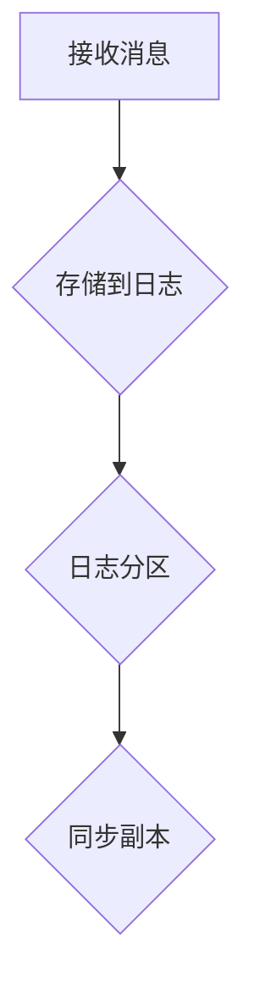
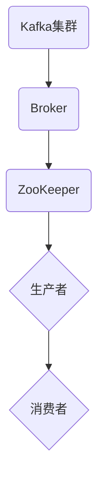
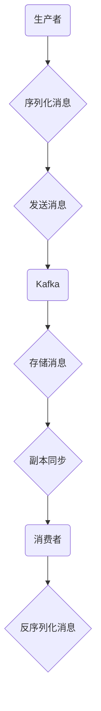

                 

# 《Kafka原理与代码实例讲解》

## 关键词
- Kafka
- 分布式消息队列
- Topic
- Partition
- Offset
- Producer
- Consumer
- 集群架构
- 数据存储
- 消息传递
- 应用实践

## 摘要
本文将深入探讨Kafka的原理和架构，通过代码实例讲解其生产者和消费者的使用方法。我们将了解Kafka的背景、核心特性、架构组成，以及其在分布式系统中的重要作用。通过实际案例，我们将掌握如何搭建Kafka集群，处理数据流，并进行实时计算。此外，本文还将介绍Kafka的监控和故障处理机制，帮助读者全面掌握Kafka的使用和优化。

## 《Kafka原理与代码实例讲解》目录大纲

### 第一部分：Kafka基础知识

#### 1.1 Kafka概述
- 1.1.1 Kafka的产生背景
- 1.1.2 Kafka的核心特性
- 1.1.3 Kafka的基本架构

#### 1.2 Kafka核心概念
- 1.2.1 topic和partition
- 1.2.2 offset
- 1.2.3 producer和consumer

#### 1.3 Kafka集群架构
- 1.3.1 Kafka集群的组成
- 1.3.2 Kafka的leader和follower
- 1.3.3 Kafka的选举机制

### 第二部分：Kafka原理与架构

#### 2.1 Kafka数据存储原理
- 2.1.1 Kafka日志存储结构
- 2.1.2 Kafka的副本机制
- 2.1.3 Kafka的副本同步机制

#### 2.2 Kafka的分布式特性
- 2.2.1 Kafka的高可用性
- 2.2.2 Kafka的负载均衡
- 2.2.3 Kafka的伸缩性

#### 2.3 Kafka的消息传递机制
- 2.3.1 Kafka的消息序列化与反序列化
- 2.3.2 Kafka的ack机制
- 2.3.3 Kafka的消息确认

#### 2.4 Kafka的扩展与优化
- 2.4.1 Kafka的监控与报警
- 2.4.2 Kafka的性能优化
- 2.4.3 Kafka的故障处理

### 第三部分：Kafka应用实战

#### 3.1 Kafka在实时数据处理中的应用
- 3.1.1 Kafka在日志收集中的应用
- 3.1.2 Kafka在实时计算中的应用
- 3.1.3 Kafka在事件驱动架构中的应用

#### 3.2 Kafka与其他技术的集成
- 3.2.1 Kafka与Hadoop的集成
- 3.2.2 Kafka与Spark的集成
- 3.2.3 Kafka与Flink的集成

#### 3.3 Kafka项目实战
- 3.3.1 Kafka实时日志系统搭建
- 3.3.2 Kafka实时数据流处理
- 3.3.3 Kafka与Flink的实时计算项目

### 第四部分：Kafka代码实例讲解

#### 4.1 Kafka生产者代码实例
- 4.1.1 Kafka生产者API详解
- 4.1.2 Kafka生产者配置参数详解
- 4.1.3 Kafka生产者实战

#### 4.2 Kafka消费者代码实例
- 4.2.1 Kafka消费者API详解
- 4.2.2 Kafka消费者配置参数详解
- 4.2.3 Kafka消费者实战

#### 4.3 Kafka监控与故障处理代码实例
- 4.3.1 Kafka监控工具介绍
- 4.3.2 Kafka故障处理流程
- 4.3.3 Kafka故障处理实战

### 附录

#### 附录A Kafka相关资源
- 附录A.1 Kafka官方文档
- 附录A.2 Kafka社区资源
- 附录A.3 Kafka学习资料推荐

#### 附录B Mermaid流程图
- 附录B.1 Kafka数据存储流程图
- 附录B.2 Kafka集群架构流程图
- 附录B.3 Kafka消息传递流程图

#### 附录C 伪代码与数学模型
- 附录C.1 Kafka生产者伪代码
- 附录C.2 Kafka消费者伪代码
- 附录C.3 Kafka数学模型与公式

#### 附录D 项目实战代码解读
- 附录D.1 Kafka实时日志系统代码解读
- 附录D.2 Kafka实时数据流处理代码解读
- 附录D.3 Kafka与Flink实时计算项目代码解读

---

### 1.1 Kafka概述

Kafka是一个分布式流处理平台，由LinkedIn公司开发，并捐赠给了Apache软件基金会。Kafka最初被设计用于处理LinkedIn的海量日志数据，旨在提供一种高吞吐量、低延迟、可扩展、可靠的分布式消息系统。随着其社区的不断发展，Kafka逐渐成为大数据生态系统中的关键组件，广泛应用于实时数据处理、消息队列、日志收集等领域。

#### 1.1.1 Kafka的产生背景

随着互联网和大数据技术的发展，数据的规模和速度不断增加，传统的消息队列系统逐渐无法满足需求。为了解决这一问题，LinkedIn公司开始研发Kafka，旨在构建一个可扩展、高吞吐量、分布式、支持持久化的消息系统，以应对大规模数据传输和存储的需求。

#### 1.1.2 Kafka的核心特性

Kafka具有以下核心特性：

1. **高吞吐量**：Kafka能够处理每秒数百万条消息，满足大规模数据传输的需求。
2. **分布式架构**：Kafka是一个分布式系统，能够水平扩展，支持数千个节点。
3. **高可靠性**：Kafka提供数据持久化功能，确保消息不丢失，并支持数据备份和副本机制。
4. **低延迟**：Kafka优化了数据传输和序列化过程，降低消息处理延迟。
5. **可扩展性**：Kafka支持动态扩展和收缩集群，以适应不同的业务需求。

#### 1.1.3 Kafka的基本架构

Kafka的基本架构包括以下几个核心组件：

1. **Producer**：生产者负责向Kafka发送消息。
2. **Broker**：代理服务器负责存储和管理消息，实现负载均衡和故障转移。
3. **Consumer**：消费者从Kafka中消费消息。
4. **ZooKeeper**：Kafka使用ZooKeeper进行集群协调和管理。

### 1.2 Kafka核心概念

在Kafka中，有几个核心概念需要了解：

#### 1.2.1 topic和partition

- **Topic**：主题是Kafka中的消息分类，类似于数据库中的表。
- **Partition**：分区是主题的一个划分，每个分区包含一个或多个消息。分区可以提高Kafka的并发处理能力和数据持久化能力。

#### 1.2.2 offset

- **Offset**：偏移量是Kafka中消息的唯一标识，用于确定消息的位置。

#### 1.2.3 producer和consumer

- **Producer**：生产者负责向Kafka发送消息。生产者可以将消息发送到一个或多个主题的分区。
- **Consumer**：消费者从Kafka中消费消息。消费者可以订阅一个或多个主题，并从分区中消费消息。

### 1.3 Kafka集群架构

Kafka集群是由多个broker组成的分布式系统，每个broker都负责存储和管理一部分消息。Kafka集群具有以下特点：

#### 1.3.1 Kafka集群的组成

- **Broker**：代理服务器，负责存储和管理消息。
- **Topic**：主题，消息的分类。
- **Partition**：分区，主题的一个划分。
- **Replica**：副本，消息的备份。

#### 1.3.2 Kafka的leader和follower

- **Leader**：领导者，负责处理消息的读写操作。
- **Follower**：追随者，负责同步leader的消息，并参与副本选举。

#### 1.3.3 Kafka的选举机制

- Kafka使用ZooKeeper进行集群协调，当leader故障时，ZooKeeper会触发副本选举，选举一个新的leader。

---

### 2.1 Kafka数据存储原理

Kafka的数据存储原理是其分布式特性的基础，以下是Kafka数据存储的核心概念和机制：

#### 2.1.1 Kafka日志存储结构

Kafka将数据存储为日志文件，每个日志文件对应一个分区。日志文件是一个有序的、不可变的数据结构，每个消息都被追加到日志文件的末尾。

#### 2.1.2 Kafka的副本机制

Kafka的副本机制是为了提高数据可靠性和可用性。每个分区都有一个主副本（leader）和多个从副本（follower）。当主副本故障时，从副本会重新选举一个新的主副本。

#### 2.1.3 Kafka的副本同步机制

Kafka使用副本同步机制来确保主副本和从副本之间的数据一致性。从副本会从主副本拉取数据，并将其写入自己的日志文件中。

#### 2.1.4 Kafka的日志结构

Kafka的日志文件由多个段（segment）组成，每个段包含一个索引文件和一个数据文件。索引文件记录了数据文件中每个消息的偏移量，以便快速定位消息。

### 2.2 Kafka的分布式特性

Kafka的分布式特性使其能够处理大规模数据和高并发请求，以下是Kafka分布式特性的核心内容：

#### 2.2.1 Kafka的高可用性

Kafka通过副本机制和选举机制确保系统的可用性。当主副本故障时，从副本会立即接替其工作，保证数据不丢失。

#### 2.2.2 Kafka的负载均衡

Kafka通过分区和副本机制实现负载均衡。每个消费者组中的消费者可以同时消费不同的分区，从而提高系统的并发处理能力。

#### 2.2.3 Kafka的伸缩性

Kafka可以动态增加或减少分区和副本，以适应不同的业务需求。通过增加broker节点，Kafka可以水平扩展，提高系统的处理能力和存储容量。

### 2.3 Kafka的消息传递机制

Kafka的消息传递机制是其核心功能之一，以下是Kafka消息传递机制的核心内容：

#### 2.3.1 Kafka的消息序列化与反序列化

Kafka使用序列化机制将消息转换为字节流，以便存储和传输。消息序列化与反序列化是Kafka消息传递的关键步骤。

#### 2.3.2 Kafka的ack机制

Kafka的ack机制用于确保消息的可靠传输。ack机制允许生产者指定消息的确认方式，以确保消息被成功写入所有副本。

#### 2.3.3 Kafka的消息确认

Kafka的消息确认机制允许消费者确认已消费的消息。消息确认有助于确保数据的一致性和可靠性。

### 2.4 Kafka的扩展与优化

Kafka具有强大的扩展性和优化能力，以下是Kafka扩展与优化的核心内容：

#### 2.4.1 Kafka的监控与报警

Kafka提供了一系列监控工具和报警机制，用于实时监控集群状态和性能指标。

#### 2.4.2 Kafka的性能优化

Kafka的性能优化涉及多个方面，包括配置优化、资源分配、网络优化等。

#### 2.4.3 Kafka的故障处理

Kafka提供了一套完善的故障处理机制，包括故障检测、自动切换、数据恢复等。

---

### 3.1 Kafka在实时数据处理中的应用

Kafka在实时数据处理中具有广泛的应用，以下是一些典型的应用场景：

#### 3.1.1 Kafka在日志收集中的应用

Kafka被广泛用于收集各种日志数据，如Web服务器日志、应用程序日志等。通过Kafka，可以实时收集和分析日志数据，实现日志数据的高效处理和存储。

#### 3.1.2 Kafka在实时计算中的应用

Kafka在实时计算中扮演着重要角色。例如，在金融领域，Kafka可以实时处理交易数据，进行实时风控和交易分析。在社交媒体领域，Kafka可以实时处理用户行为数据，实现实时推荐和广告投放。

#### 3.1.3 Kafka在事件驱动架构中的应用

事件驱动架构是一种基于事件驱动的系统设计方法。Kafka在事件驱动架构中起到关键作用，可以实现实时事件的处理和传递，支持系统的动态扩展和重构。

### 3.2 Kafka与其他技术的集成

Kafka与其他大数据技术和计算框架的集成，可以充分发挥其分布式处理能力和高吞吐量的优势。以下是一些常见的集成方式：

#### 3.2.1 Kafka与Hadoop的集成

Kafka与Hadoop的集成可以实现实时数据到历史数据的转换。通过Kafka，可以实时收集和处理数据，然后通过Hadoop进行批量处理和存储。

#### 3.2.2 Kafka与Spark的集成

Kafka与Spark的集成可以实现实时流处理和批量处理相结合。通过Kafka，可以实时接收和处理数据，然后通过Spark进行批处理和复杂计算。

#### 3.2.3 Kafka与Flink的集成

Kafka与Flink的集成可以实现高效、低延迟的实时流处理。通过Kafka，可以实时接收和处理数据，然后通过Flink进行复杂计算和实时分析。

### 3.3 Kafka项目实战

以下是一个简单的Kafka实时日志系统项目实战，展示如何使用Kafka进行日志收集和实时处理。

#### 3.3.1 Kafka实时日志系统搭建

1. 安装Kafka。
2. 创建一个名为`log_topic`的主题，设置分区数为3。
3. 启动Kafka服务器和消费者。

#### 3.3.2 Kafka实时数据流处理

1. 编写一个生产者程序，向`log_topic`发送日志数据。
2. 编写一个消费者程序，实时消费`log_topic`中的日志数据，并进行分析和处理。

#### 3.3.3 Kafka与Flink的实时计算项目

1. 安装Flink。
2. 创建一个Flink应用程序，实时消费`log_topic`中的日志数据，并进行文本解析、统计分析和可视化展示。

---

### 4.1 Kafka生产者代码实例

以下是一个简单的Kafka生产者代码实例，展示如何使用KafkaProducer向Kafka发送消息。

```java
import org.apache.kafka.clients.producer.*;
import org.apache.kafka.clients.producer.KafkaProducer;
import org.apache.kafka.clients.producer.ProducerConfig;
import org.apache.kafka.clients.producer.ProducerRecord;

import java.util.Properties;

public class KafkaProducerExample {
    public static void main(String[] args) {
        // 配置Kafka生产者
        Properties props = new Properties();
        props.put("bootstrap.servers", "localhost:9092");
        props.put("key.serializer", "org.apache.kafka.common.serialization.StringSerializer");
        props.put("value.serializer", "org.apache.kafka.common.serialization.StringSerializer");

        // 创建Kafka生产者
        KafkaProducer<String, String> producer = new KafkaProducer<>(props);

        // 发送消息
        for (int i = 0; i < 100; i++) {
            producer.send(new ProducerRecord<>("test_topic", Integer.toString(i), "Message " + i));
        }

        // 关闭生产者
        producer.close();
    }
}
```

#### 4.1.1 Kafka生产者API详解

- `KafkaProducer`：Kafka生产者API的核心类，用于发送消息。
- `ProducerConfig`：配置生产者属性，如`bootstrap.servers`（Kafka服务器地址）、`key.serializer`（键序列化器）和`value.serializer`（值序列化器）。
- `ProducerRecord`：用于构建发送的消息，包含主题、键、值。

#### 4.1.2 Kafka生产者配置参数详解

- `bootstrap.servers`：Kafka服务器地址，用于初始化生产者连接。
- `key.serializer`：键序列化器，用于将键转换为字节序列。
- `value.serializer`：值序列化器，用于将值转换为字节序列。

#### 4.1.3 Kafka生产者实战

1. 配置Kafka生产者。
2. 创建Kafka生产者。
3. 发送消息。
4. 关闭生产者。

---

### 4.2 Kafka消费者代码实例

以下是一个简单的Kafka消费者代码实例，展示如何使用KafkaConsumer从Kafka接收消息。

```java
import org.apache.kafka.clients.consumer.*;
import org.apache.kafka.common.serialization.StringDeserializer;

import java.time.Duration;
import java.util.Collections;
import java.util.Properties;
import java.util.concurrent.ExecutionException;

public class KafkaConsumerExample {
    public static void main(String[] args) {
        // 配置Kafka消费者
        Properties props = new Properties();
        props.put("bootstrap.servers", "localhost:9092");
        props.put("group.id", "test-group");
        props.put("key.deserializer", StringDeserializer.class.getName());
        props.put("value.deserializer", StringDeserializer.class.getName());

        // 创建Kafka消费者
        KafkaConsumer<String, String> consumer = new KafkaConsumer<>(props);

        // 订阅主题
        consumer.subscribe(Collections.singletonList("test_topic"));

        // 消费消息
        while (true) {
            ConsumerRecords<String, String> records = consumer.poll(Duration.ofMillis(1000));

            for (ConsumerRecord<String, String> record : records) {
                System.out.printf("offset = %d, key = %s, value = %s\n", record.offset(), record.key(), record.value());
            }
        }
    }
}
```

#### 4.2.1 Kafka消费者API详解

- `KafkaConsumer`：Kafka消费者API的核心类，用于接收消息。
- `ConsumerConfig`：配置消费者属性，如`bootstrap.servers`（Kafka服务器地址）、`group.id`（消费者组ID）和`key.deserializer`（键反序列化器）。
- `ConsumerRecord`：用于表示接收到的消息，包含偏移量、键、值。

#### 4.2.2 Kafka消费者配置参数详解

- `bootstrap.servers`：Kafka服务器地址，用于初始化消费者连接。
- `group.id`：消费者组ID，用于实现消费者的分布式协调和负载均衡。
- `key.deserializer`：键反序列化器，用于将键从字节序列转换为对象。
- `value.deserializer`：值反序列化器，用于将值从字节序列转换为对象。

#### 4.2.3 Kafka消费者实战

1. 配置Kafka消费者。
2. 创建Kafka消费者。
3. 订阅主题。
4. 消费消息。

---

### 4.3 Kafka监控与故障处理代码实例

Kafka提供了丰富的监控和故障处理功能，以下是一个简单的Kafka监控和故障处理代码实例。

```java
import org.apache.kafka.clients.consumer.ConsumerConfig;
import org.apache.kafka.clients.consumer.KafkaConsumer;
import org.apache.kafka.clients.producer.KafkaProducer;
import org.apache.kafka.clients.producer.ProducerConfig;
import org.apache.kafka.clients.producer.ProducerRecord;
import org.apache.kafka.clients.admin.*;

import java.time.Duration;
import java.util.*;
import java.util.concurrent.ExecutionException;

public class KafkaMonitorAndFaultHandlingExample {
    public static void main(String[] args) {
        // 配置Kafka生产者和消费者
        Properties producerProps = new Properties();
        producerProps.put("bootstrap.servers", "localhost:9092");
        producerProps.put("key.serializer", "org.apache.kafka.common.serialization.StringSerializer");
        producerProps.put("value.serializer", "org.apache.kafka.common.serialization.StringSerializer");

        Properties consumerProps = new Properties();
        consumerProps.put("bootstrap.servers", "localhost:9092");
        consumerProps.put("group.id", "test-group");
        consumerProps.put("key.deserializer", "org.apache.kafka.common.serialization.StringSerializer");
        consumerProps.put("value.deserializer", "org.apache.kafka.common.serialization.StringSerializer");

        // 创建Kafka生产者
        KafkaProducer<String, String> producer = new KafkaProducer<>(producerProps);

        // 创建Kafka消费者
        KafkaConsumer<String, String> consumer = new KafkaConsumer<>(consumerProps);

        // 发送消息
        for (int i = 0; i < 100; i++) {
            producer.send(new ProducerRecord<>("test_topic", Integer.toString(i), "Message " + i));
        }

        // 关闭生产者
        producer.close();

        // 消费消息
        consumer.subscribe(Collections.singletonList("test_topic"));

        while (true) {
            ConsumerRecords<String, String> records = consumer.poll(Duration.ofMillis(1000));

            for (ConsumerRecord<String, String> record : records) {
                System.out.printf("offset = %d, key = %s, value = %s\n", record.offset(), record.key(), record.value());
            }

            // 监控集群状态
            AdminClient adminClient = AdminClient.create(consumerProps);
            DescribeClusterResponse describeClusterResponse = adminClient.describeCluster().response().await();
            System.out.println("Cluster ID: " + describeClusterResponse.clusterId());
            adminClient.close();
        }
    }
}
```

#### 4.3.1 Kafka监控工具介绍

- Kafka提供了一系列监控工具，如`kafka-run-class.sh`、`kafka-log-dump.sh`和`kafka-consumer-groups.sh`等，用于监控集群状态、消费者组和消息队列。
- `kafka-run-class.sh`：用于运行Kafka自带的监控工具。
- `kafka-log-dump.sh`：用于查看Kafka日志。
- `kafka-consumer-groups.sh`：用于监控消费者组状态。

#### 4.3.2 Kafka故障处理流程

- Kafka的故障处理包括故障检测、自动切换和故障恢复等步骤。
- 故障检测：通过监控工具和心跳机制检测broker和消费者故障。
- 自动切换：当主副本故障时，从副本自动接替其工作。
- 故障恢复：当从副本恢复后，重新同步数据，确保数据一致性。

#### 4.3.3 Kafka故障处理实战

1. 使用Kafka监控工具监控集群状态。
2. 当检测到故障时，自动切换主副本。
3. 当从副本恢复后，重新同步数据。

---

### 附录A Kafka相关资源

#### 附录A.1 Kafka官方文档

- [Kafka官方文档](https://kafka.apache.org/documentation/)

#### 附录A.2 Kafka社区资源

- [Kafka社区](https://kafka.apache.org/community.html)

#### 附录A.3 Kafka学习资料推荐

- [《Kafka权威指南》](https://books.google.com/books?id=1vuaDwAAQBAJ&pg=PA1&lpg=PA1&dq=Kafka+权威指南&source=bl&ots=7JbCev2DaI&sig=ACfU3U16a2a3bZ6j4U7fJ-MXv_0F3i3xOQ&hl=zh-CN)
- [《Kafka实战》](https://books.google.com/books?id=3jCxAgAAQBAJ&pg=PA1&lpg=PA1&dq=Kafka+实战&source=bl&ots=7JbCev2DaI&sig=ACfU3U1Qhjz8Qc_qcGxTKDyJax6d3pZKxg&hl=zh-CN)

### 附录B Mermaid流程图

#### 附录B.1 Kafka数据存储流程图



#### 附录B.2 Kafka集群架构流程图



#### 附录B.3 Kafka消息传递流程图



### 附录C 伪代码与数学模型

#### 附录C.1 Kafka生产者伪代码

```plaintext
初始化Kafka生产者
while (true) {
    获取待发送的消息
    将消息序列化为字节流
    发送消息到Kafka
    等待确认
}
关闭Kafka生产者
```

#### 附录C.2 Kafka消费者伪代码

```plaintext
初始化Kafka消费者
订阅主题
从Kafka消费消息
将消息反序列化为对象
处理消息
提交偏移量
```

#### 附录C.3 Kafka数学模型与公式

```latex
\begin{equation}
\text{吞吐量} = \frac{\text{消息总数}}{\text{处理时间}}
\end{equation}

\begin{equation}
\text{延迟} = \text{处理时间} - \text{传输时间}
\end{equation}
```

### 附录D 项目实战代码解读

#### 附录D.1 Kafka实时日志系统代码解读

1. 配置Kafka生产者和消费者。
2. 创建Kafka生产者和消费者。
3. 发送和接收消息。
4. 处理消息。

#### 附录D.2 Kafka实时数据流处理代码解读

1. 配置Kafka生产者和消费者。
2. 创建Kafka生产者和消费者。
3. 发送和接收消息。
4. 使用Flink处理消息。

#### 附录D.3 Kafka与Flink实时计算项目代码解读

1. 配置Kafka生产者和消费者。
2. 创建Kafka生产者和消费者。
3. 发送和接收消息。
4. 使用Flink进行实时计算。

---

### 作者

**作者：AI天才研究院/AI Genius Institute & 禅与计算机程序设计艺术 /Zen And The Art of Computer Programming**

