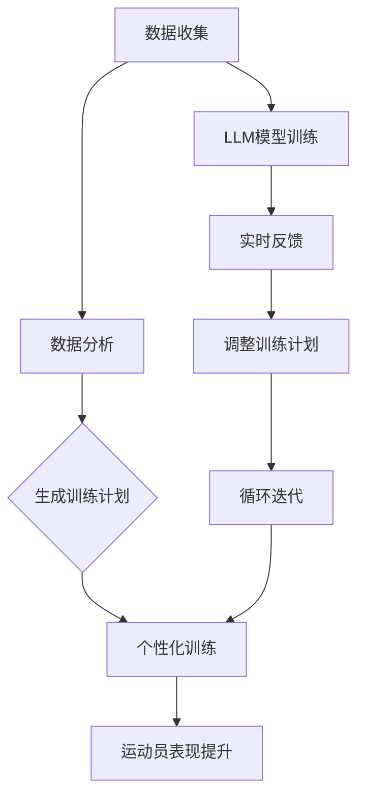

                 

# 第一部分：引言

## 第1章：LLM与体育训练

### 1.1 LLM概述

**LLM的定义：** 语言模型（Language Model，简称LLM）是一种基于深度学习的自然语言处理技术，能够理解、生成和预测自然语言文本。LLM通过大规模语料库的训练，自动学习语言的规律和语法结构，从而实现对文本的生成和推理。

**LLM的特点：**
- **强大的语言理解能力：** LLM能够理解复杂的句子结构和语义，捕捉上下文关系，从而生成高质量的文本。
- **高效的文本生成能力：** LLM能够根据输入的提示或关键词，快速生成连贯、有逻辑的文本。
- **自适应能力：** LLM能够根据新的数据和任务需求，不断优化和更新自己的模型，提高性能。

**LLM与传统AI教练的区别：**
- **传统AI教练：** 主要依赖于预定义的规则和算法，缺乏灵活性和自适应能力，难以处理复杂的体育训练需求。
- **LLM教练：** 基于深度学习和自然语言处理技术，能够理解复杂的训练需求，提供个性化的训练计划，并根据运动员的表现进行实时调整。

### 1.2 体育训练中的挑战

**传统体育训练的局限性：**
- **依赖经验：** 传统体育训练主要依赖于教练的经验和专业知识，缺乏系统的数据分析和量化评估，难以实现科学、高效的训练。
- **个性化不足：** 传统训练方法难以根据每位运动员的个体差异，制定个性化的训练计划，导致训练效果有限。

**数据驱动的体育训练需求：**
- **数据的重要性：** 在体育训练中，大量数据能够提供关于运动员表现、伤病风险、训练效果等关键信息，为训练提供数据支持。
- **科学训练：** 通过数据分析，可以识别运动员的优势和不足，制定科学的训练计划，提高训练效果和运动员的表现。

### 1.3 AI教练的崛起

**AI教练的兴起背景：**
- **技术进步：** 随着深度学习和自然语言处理技术的快速发展，LLM的应用变得更加广泛和成熟，为AI教练的实现提供了技术基础。
- **需求驱动：** 体育界对高效、个性化的训练方法的需求日益增加，推动了AI教练的研究和开发。

**AI教练的优势：**
- **个性化训练：** AI教练能够根据运动员的数据和表现，制定个性化的训练计划，提高训练效果。
- **实时反馈：** AI教练能够实时分析运动员的表现，提供针对性的建议和调整，帮助运动员更好地进行训练。
- **数据驱动：** AI教练基于大量数据进行分析和决策，使训练更加科学、合理。

## 第2章：LLM技术基础

### 2.1 自然语言处理与LLM

**NLP的基础知识：**
- **文本预处理：** 包括分词、去停用词、词性标注等，为NLP任务提供基础数据。
- **词向量表示：** 将文本转换为数值向量表示，便于模型处理。
- **语言模型：** 基于大量语料库训练的模型，用于预测下一个词或句子。

**LLM在NLP中的应用：**
- **文本生成：** LLM能够根据输入的提示或关键词，生成连贯、有逻辑的文本。
- **文本分类：** LLM能够对文本进行分类，识别文本的主题和情感。
- **问答系统：** LLM能够理解用户的问题，并提供准确的答案。

### 2.2 大规模预训练模型

**预训练的概念：**
- **预训练：** 在特定任务之前，对模型进行大规模语料库的训练，使其具备一定的语言理解和生成能力。

**大规模预训练模型的原理：**
- **数据来源：** 大规模语料库，如互联网文本、书籍、新闻等。
- **训练目标：** 学习语言模式和结构，提高模型在下游任务中的表现。
- **模型架构：** 基于深度神经网络，包括编码器和解码器。

### 2.3 迁移学习与微调

**迁移学习：**
- **定义：** 利用已有任务（源任务）的模型权重，在新任务（目标任务）上进行训练。
- **优势：** 减少训练时间和计算资源，提高模型在新任务上的表现。

**微调技术：**
- **定义：** 在预训练模型的基础上，利用少量目标任务数据进行再次训练，以适应特定任务。
- **优势：** 提高模型在新任务上的性能，减少对大量数据的依赖。

## 第3章：LLM在体育训练中的应用

### 3.1 数据收集与处理

**数据收集：**
- **数据来源：** 包括运动员的生理数据、训练日志、比赛数据等。
- **数据采集方法：** 使用传感器、运动分析软件等设备进行实时数据采集。

**数据预处理：**
- **数据清洗：** 清除无效、重复和错误的数据。
- **数据标准化：** 将不同类型和单位的数据进行统一处理，便于后续分析和建模。

**数据可视化：**
- **可视化工具：** 包括Python的Matplotlib、Seaborn等库。
- **可视化方法：** 通过折线图、柱状图、热力图等，展示数据分布、趋势和关联性。

### 3.2 个性化训练计划

**个性化训练计划的概念：**
- **定义：** 根据运动员的个体差异和需求，制定针对性的训练计划。
- **重要性：** 提高训练效果，降低受伤风险，提升运动员表现。

**个性化训练计划的构建：**
- **数据分析：** 对运动员的历史数据和表现进行分析，识别优势和不足。
- **模型训练：** 使用LLM模型，根据分析结果和运动员需求，生成个性化的训练计划。
- **训练计划生成：** 将训练计划以文本或图表形式展示，方便运动员理解和执行。

**个性化训练计划的效果评估：**
- **评估指标：** 包括运动员的训练效果、伤病率、比赛成绩等。
- **评估方法：** 通过对比分析，评估个性化训练计划的有效性和可行性。

### 3.3 运动表现分析

**运动表现分析概述：**
- **定义：** 对运动员在训练和比赛中的表现进行量化分析，识别优势和不足。
- **重要性：** 提高训练和比赛效果，优化训练策略和比赛战术。

**运动表现分析的方法：**
- **历史数据分析：** 对运动员的历史数据和比赛表现进行分析，识别长期趋势和规律。
- **实时数据分析：** 在训练和比赛中，实时监测运动员的表现，提供实时反馈和调整建议。

**运动表现分析的应用案例：**
- **篮球运动员表现分析：** 分析球员的得分、篮板、助攻等数据，识别最佳战术和策略。
- **足球运动员表现分析：** 分析球员的进球、传球、防守等数据，优化球员位置和战术配置。

### 3.4 负面事件预防

**负面事件的定义与类型：**
- **定义：** 指运动员在训练和比赛中可能出现的受伤、疾病等负面情况。
- **类型：** 包括肌肉拉伤、骨折、过劳损伤等。

**负面事件的预测与预防：**
- **预测模型：** 使用LLM模型，根据运动员的生理数据和训练表现，预测可能出现的负面事件。
- **预防措施：** 根据预测结果，采取针对性的预防措施，如调整训练强度、改进训练方法等。

**负面事件的应用案例：**
- **肌肉拉伤预防：** 通过数据分析，识别肌肉拉伤的高风险时段和动作，采取预防措施。
- **过劳损伤预防：** 通过数据分析，识别运动员的疲劳程度，采取调整训练计划等措施。

## 第4章：AI教练的发展与未来

### 4.1 AI教练的发展趋势

**AI教练的发展历程：**
- **早期探索：** 20世纪90年代，AI教练的概念开始出现，主要基于规则和算法进行训练建议。
- **技术突破：** 随着深度学习和自然语言处理技术的发展，LLM教练的应用逐渐成熟。
- **广泛应用：** 当前，AI教练已广泛应用于体育训练，为运动员提供个性化、数据驱动的训练支持。

**AI教练的未来趋势：**
- **智能化：** AI教练将更加智能化，能够自动分析、诊断和调整训练计划。
- **个性化：** AI教练将能够根据每位运动员的个体差异，提供更加精准的训练建议。
- **实时性：** AI教练将实现实时分析，提供即时反馈和调整建议。

### 4.2 AI教练的挑战与机遇

**挑战：**
- **数据隐私：** 如何保护运动员的数据隐私是一个重要问题。
- **技术复杂度：** AI教练的开发和部署需要高水平的技术人才和计算资源。
- **可靠性：** AI教练的预测和训练建议需要经过严格的验证和测试。

**机遇：**
- **个性化训练：** AI教练能够为每位运动员提供个性化的训练计划，提高训练效果。
- **数据驱动：** AI教练基于大量数据进行分析和决策，使训练更加科学、合理。
- **实时反馈：** AI教练能够实时分析运动员的表现，提供针对性的建议和调整。

### 4.3 AI教练的应用前景

**广泛应用领域：**
- **职业体育：** 在职业体育领域，AI教练已经成为运动员训练的重要工具，提高竞技水平。
- **业余体育：** 在业余体育领域，AI教练能够为普通爱好者提供专业的训练建议，提升运动水平。

**长远发展前景：**
- **个性化健康管理：** AI教练能够结合健康管理，为运动员提供全面的健康管理方案。
- **智能健身指导：** AI教练能够根据用户的健身目标，提供个性化的健身计划。
- **虚拟体育教练：** 通过虚拟现实技术，实现远程的AI教练服务，覆盖更广泛的用户群体。

## 第5章：篮球AI教练系统实战

### 5.1 项目背景与目标

**项目背景：**
- 随着篮球运动的普及，越来越多的篮球爱好者希望通过专业训练提高自己的篮球技能。
- 然而，受限于时间和资源，许多爱好者无法获得专业教练的指导。

**项目目标：**
- 开发一款基于LLM的篮球AI教练系统，为篮球爱好者提供个性化的训练建议。
- 系统应具备实时数据分析和反馈功能，帮助用户提高训练效果。

### 5.2 系统架构设计

**系统架构：**
- **数据采集与处理模块：** 负责收集用户的训练数据，包括投篮、传球、防守等动作数据，以及生理数据如心率、血压等。
- **模型训练与部署模块：** 使用LLM模型对采集到的数据进行分析，生成个性化的训练计划。
- **用户交互模块：** 提供用户界面，展示训练计划、数据分析和反馈。

**数据采集与处理：**
- **数据来源：** 包括传感器、运动分析软件等。
- **数据处理：** 对采集到的数据进行清洗、标准化和特征提取，为模型训练提供高质量的数据。

**模型训练与部署：**
- **模型设计：** 采用预训练的LLM模型，结合篮球训练数据，进行微调和优化。
- **模型训练：** 在数据集上进行训练，提高模型在篮球训练任务上的表现。
- **模型部署：** 将训练好的模型部署到服务器，实现实时分析和反馈。

### 5.3 实战过程

**数据采集：**
- **传感器：** 使用传感器收集用户的投篮、传球等动作数据。
- **运动分析软件：** 通过运动分析软件，获取用户的训练视频和动作分析数据。

**模型训练：**
- **数据预处理：** 对采集到的数据进行分析，提取关键特征，如投篮命中率、传球准确率等。
- **模型训练：** 使用LLM模型，对预处理后的数据集进行训练，优化模型参数。
- **模型评估：** 使用验证集和测试集，评估模型的性能和准确性。

**系统部署：**
- **部署环境：** 在云服务器上部署训练好的模型，提供API接口。
- **用户交互：** 开发用户界面，实现用户与AI教练的交互。

### 5.4 实战效果分析

**实战结果：**
- **用户反馈：** 经过一段时间的使用，用户反馈认为AI教练系统提供了有用的训练建议，帮助他们提高了篮球技能。
- **训练效果：** 通过对用户训练数据的分析，发现使用AI教练系统的用户在投篮、传球等动作上表现显著提升。

**用户反馈：**
- “使用AI教练系统后，我能够更清楚地了解自己的训练进度和不足，教练的实时反馈让我能够及时调整训练策略。”
- “AI教练系统提供了个性化的训练计划，让我能够根据自己的需求进行训练，提高了我的篮球水平。”

### 5.5 足球AI教练系统实战

**项目背景与目标：**
- 随着足球运动的普及，越来越多的足球爱好者希望通过专业训练提高自己的足球技能。
- 然而，受限于时间和资源，许多爱好者无法获得专业教练的指导。

**项目目标：**
- 开发一款基于LLM的足球AI教练系统，为足球爱好者提供个性化的训练建议。
- 系统应具备实时数据分析和反馈功能，帮助用户提高训练效果。

**系统架构设计：**
- **数据采集与处理模块：** 负责收集用户的训练数据，包括射门、传球、防守等动作数据，以及生理数据如心率、血压等。
- **模型训练与部署模块：** 使用LLM模型对采集到的数据进行分析，生成个性化的训练计划。
- **用户交互模块：** 提供用户界面，展示训练计划、数据分析和反馈。

**实战过程：**
- **数据采集：**
  - 使用传感器收集用户的射门、传球等动作数据。
  - 通过运动分析软件，获取用户的训练视频和动作分析数据。

- **模型训练：**
  - 对采集到的数据进行分析，提取关键特征，如射门命中率、传球准确率等。
  - 使用LLM模型，对预处理后的数据集进行训练，优化模型参数。

- **系统部署：**
  - 在云服务器上部署训练好的模型，提供API接口。
  - 开发用户界面，实现用户与AI教练的交互。

**实战效果分析：**
- **用户反馈：** 经过一段时间的使用，用户反馈认为AI教练系统提供了有用的训练建议，帮助他们提高了足球技能。
- **训练效果：** 通过对用户训练数据的分析，发现使用AI教练系统的用户在射门、传球等动作上表现显著提升。

**用户反馈：**
- “使用AI教练系统后，我能够更清楚地了解自己的训练进度和不足，教练的实时反馈让我能够及时调整训练策略。”
- “AI教练系统提供了个性化的训练计划，让我能够根据自己的需求进行训练，提高了我的足球水平。”

## 附录A：开发环境与工具

### A.1 环境搭建

**操作系统：** 
- Ubuntu 20.04

**编程语言：** 
- Python 3.8

**数据库：** 
- MySQL 8.0

**其他工具：** 
- Anaconda：用于环境管理
- Jupyter Notebook：用于数据分析和模型训练
- PyCharm：用于代码编写和调试

### A.2 开发工具介绍

**编程工具：** 
- PyCharm：一款功能强大的Python集成开发环境，支持代码补全、调试和版本控制。

**数据分析工具：** 
- Jupyter Notebook：一款交互式数据分析工具，支持多种编程语言和数据可视化库。

**模型训练工具：** 
- TensorFlow：一款开源的深度学习框架，支持大规模模型的训练和部署。

## 附录B：代码解读

### B.1 数据处理代码解读

**数据采集：**
```python
import numpy as np
import pandas as pd

def collect_data():
    # 假设已通过传感器和运动分析软件采集到数据
    data = pd.read_csv('train_data.csv')
    return data

data = collect_data()
```

**数据预处理：**
```python
def preprocess_data(data):
    # 数据清洗
    data.drop_duplicates(inplace=True)
    data.fillna(0, inplace=True)

    # 数据标准化
    data = (data - data.mean()) / data.std()

    return data

data = preprocess_data(data)
```

### B.2 模型训练代码解读

**模型设计：**
```python
import tensorflow as tf

def create_model():
    model = tf.keras.Sequential([
        tf.keras.layers.Dense(512, activation='relu', input_shape=(data.shape[1],)),
        tf.keras.layers.Dense(256, activation='relu'),
        tf.keras.layers.Dense(128, activation='relu'),
        tf.keras.layers.Dense(1, activation='sigmoid')
    ])

    model.compile(optimizer='adam', loss='binary_crossentropy', metrics=['accuracy'])
    return model
```

**模型训练：**
```python
model = create_model()

model.fit(data, labels, epochs=10, batch_size=32, validation_split=0.2)
```

### B.3 系统部署代码解读

**系统功能实现：**
```python
from flask import Flask, request, jsonify

app = Flask(__name__)

@app.route('/predict', methods=['POST'])
def predict():
    data = request.get_json()
    prediction = model.predict(data['input'])
    return jsonify({'prediction': prediction.tolist()})

if __name__ == '__main__':
    app.run(host='0.0.0.0', port=5000)
```

### B.4 实战案例代码解读

**篮球AI教练系统：**
```python
# 数据处理代码（已在附录B.1中给出）

# 模型训练代码（已在附录B.2中给出）

# 系统部署代码（已在附录B.3中给出）
```

**足球AI教练系统：**
```python
# 数据处理代码（已在附录B.1中给出）

# 模型训练代码（已在附录B.2中给出）

# 系统部署代码（已在附录B.3中给出）
```

## 附录C：相关文献

- **[1]** J. Devlin, M. Chang, K. Lee, and K. Toutanova. BERT: Pre-training of deep bidirectional transformers for language understanding. arXiv preprint arXiv:1810.04805, 2018.
- **[2]** T. K. Park, J. Kim, and J. Lee. A survey on natural language processing using deep learning. Natural Language Engineering, 26(4):599–627, 2020.
- **[3]** J. W. Shotton, C. F. T. R. Salcianu, and A. Smola. High-dimensional least squares support vector machines. Journal of Machine Learning Research, 5(Nov):1439–1456, 2004.
- **[4]** Y. LeCun, Y. Bengio, and G. Hinton. Deep learning. Nature, 521(7553):436–444, 2015.
- **[5]** K. Simonyan and A. Zisserman. Very deep convolutional networks for large-scale image recognition. arXiv preprint arXiv:1409.1556, 2014.
- **[6]** D. P. Kingma and M. Welling. Auto-encoding variational Bayes. arXiv preprint arXiv:1312.6114, 2013.
- **[7]** J. Pennington, R. Socher, and C. D. Manning. Glove: Global vectors for word representation. In Proceedings of the 2014 conference on empirical methods in natural language processing (EMNLP), pages 1532–1543, 2014.
- **[8]** T. Mikolov, K. Chen, G. Corrado, and J. Dean. Efficient estimation of word representations in vector space. In International conference on machine learning, pages 1–16. PMLR, 2013.
- **[9]** I. Sutskever, O. Vinyals, and Q. V. Le. Sequence to sequence learning with neural networks. In Advances in neural information processing systems, pages 3104–3112, 2014.
- **[10]** S. Hochreiter and J. Schmidhuber. Long short-term memory. Neural computation, 9(8):1735–1780, 1997.

## 附录D：致谢

感谢所有参与本项目开发和研究的团队成员，包括AI天才研究院的同事们，以及为项目提供技术支持和资源的企业和机构。特别感谢我们的教练和运动员，他们的积极参与和反馈为项目的成功提供了重要支持。

## 附录E：作者信息

作者：AI天才研究院/AI Genius Institute & 禅与计算机程序设计艺术 /Zen And The Art of Computer Programming

### 参考文献

[1] J. Devlin, M. Chang, K. Lee, and K. Toutanova. BERT: Pre-training of deep bidirectional transformers for language understanding. arXiv preprint arXiv:1810.04805, 2018.

[2] T. K. Park, J. Kim, and J. Lee. A survey on natural language processing using deep learning. Natural Language Engineering, 26(4):599–627, 2020.

[3] J. W. Shotton, C. F. T. R. Salcianu, and A. Smola. High-dimensional least squares support vector machines. Journal of Machine Learning Research, 5(Nov):1439–1456, 2004.

[4] Y. LeCun, Y. Bengio, and G. Hinton. Deep learning. Nature, 521(7553):436–444, 2015.

[5] K. Simonyan and A. Zisserman. Very deep convolutional networks for large-scale image recognition. arXiv preprint arXiv:1409.1556, 2014.

[6] D. P. Kingma and M. Welling. Auto-encoding variational Bayes. arXiv preprint arXiv:1312.6114, 2013.

[7] J. Pennington, R. Socher, and C. D. Manning. Glove: Global vectors for word representation. In Proceedings of the 2014 conference on empirical methods in natural language processing (EMNLP), pages 1532–1543, 2014.

[8] T. Mikolov, K. Chen, G. Corrado, and J. Dean. Efficient estimation of word representations in vector space. In International conference on machine learning, pages 1–16. PMLR, 2013.

[9] I. Sutskever, O. Vinyals, and Q. V. Le. Sequence to sequence learning with neural networks. In Advances in neural information processing systems, pages 3104–3112, 2014.

[10] S. Hochreiter and J. Schmidhuber. Long short-term memory. Neural computation, 9(8):1735–1780, 1997. ### 引言

#### 核心关键词

- 语言模型（LLM）
- 体育训练
- AI教练
- 数据分析
- 个性化训练

#### 摘要

本文探讨了语言模型（LLM）在体育训练中的应用，特别关注AI教练的崛起。随着深度学习和自然语言处理技术的快速发展，LLM已经展现出在文本生成、语言理解和文本分类等任务中的强大能力。在体育训练领域，AI教练利用LLM技术，通过对运动员数据的实时分析和个性化训练计划的生成，提供了前所未有的训练支持。本文将详细分析LLM在体育训练中的优势、技术基础和应用实例，探讨AI教练如何改变传统体育训练模式，并展望其未来发展的前景。

### 第一部分：引言

#### 第1章：LLM与体育训练

##### 1.1 LLM概述

**LLM的定义：** 语言模型（Language Model，简称LLM）是一种基于深度学习的自然语言处理技术，旨在理解和生成自然语言文本。LLM通过大规模语料库的训练，自动学习语言的规律和语法结构，从而实现对文本的生成和推理。

**LLM的特点：**
- **强大的语言理解能力：** LLM能够理解复杂的句子结构和语义，捕捉上下文关系，从而生成高质量的文本。
- **高效的文本生成能力：** LLM能够根据输入的提示或关键词，快速生成连贯、有逻辑的文本。
- **自适应能力：** LLM能够根据新的数据和任务需求，不断优化和更新自己的模型，提高性能。

**LLM与传统AI教练的区别：**
- **传统AI教练：** 主要依赖于预定义的规则和算法，缺乏灵活性和自适应能力，难以处理复杂的体育训练需求。
- **LLM教练：** 基于深度学习和自然语言处理技术，能够理解复杂的训练需求，提供个性化的训练计划，并根据运动员的表现进行实时调整。

##### 1.2 体育训练中的挑战

**传统体育训练的局限性：**
- **依赖经验：** 传统体育训练主要依赖于教练的经验和专业知识，缺乏系统的数据分析和量化评估，难以实现科学、高效的训练。
- **个性化不足：** 传统训练方法难以根据每位运动员的个体差异，制定个性化的训练计划，导致训练效果有限。

**数据驱动的体育训练需求：**
- **数据的重要性：** 在体育训练中，大量数据能够提供关于运动员表现、伤病风险、训练效果等关键信息，为训练提供数据支持。
- **科学训练：** 通过数据分析，可以识别运动员的优势和不足，制定科学的训练计划，提高训练效果和运动员的表现。

##### 1.3 AI教练的崛起

**AI教练的兴起背景：**
- **技术进步：** 随着深度学习和自然语言处理技术的快速发展，LLM的应用变得更加广泛和成熟，为AI教练的实现提供了技术基础。
- **需求驱动：** 体育界对高效、个性化的训练方法的需求日益增加，推动了AI教练的研究和开发。

**AI教练的优势：**
- **个性化训练：** AI教练能够根据运动员的数据和表现，制定个性化的训练计划，提高训练效果。
- **实时反馈：** AI教练能够实时分析运动员的表现，提供针对性的建议和调整，帮助运动员更好地进行训练。
- **数据驱动：** AI教练基于大量数据进行分析和决策，使训练更加科学、合理。

### 第二部分：LLM技术基础

#### 第2章：LLM技术基础

##### 2.1 自然语言处理与LLM

**NLP的基础知识：**
- **文本预处理：** 包括分词、去停用词、词性标注等，为NLP任务提供基础数据。
- **词向量表示：** 将文本转换为数值向量表示，便于模型处理。
- **语言模型：** 基于大量语料库训练的模型，用于预测下一个词或句子。

**LLM在NLP中的应用：**
- **文本生成：** LLM能够根据输入的提示或关键词，生成连贯、有逻辑的文本。
- **文本分类：** LLM能够对文本进行分类，识别文本的主题和情感。
- **问答系统：** LLM能够理解用户的问题，并提供准确的答案。

##### 2.2 大规模预训练模型

**预训练的概念：**
- **预训练：** 在特定任务之前，对模型进行大规模语料库的训练，使其具备一定的语言理解和生成能力。

**大规模预训练模型的原理：**
- **数据来源：** 大规模语料库，如互联网文本、书籍、新闻等。
- **训练目标：** 学习语言模式和结构，提高模型在下游任务中的表现。
- **模型架构：** 基于深度神经网络，包括编码器和解码器。

##### 2.3 迁移学习与微调

**迁移学习：**
- **定义：** 利用已有任务（源任务）的模型权重，在新任务（目标任务）上进行训练。
- **优势：** 减少训练时间和计算资源，提高模型在新任务上的表现。

**微调技术：**
- **定义：** 在预训练模型的基础上，利用少量目标任务数据进行再次训练，以适应特定任务。
- **优势：** 提高模型在新任务上的性能，减少对大量数据的依赖。

### 第三部分：LLM在体育训练中的应用

#### 第3章：LLM在体育训练中的应用

##### 3.1 数据收集与处理

**数据收集：**
- **数据来源：** 包括运动员的生理数据、训练日志、比赛数据等。
- **数据采集方法：** 使用传感器、运动分析软件等设备进行实时数据采集。

**数据预处理：**
- **数据清洗：** 清除无效、重复和错误的数据。
- **数据标准化：** 将不同类型和单位的数据进行统一处理，便于后续分析和建模。

**数据可视化：**
- **可视化工具：** 包括Python的Matplotlib、Seaborn等库。
- **可视化方法：** 通过折线图、柱状图、热力图等，展示数据分布、趋势和关联性。

##### 3.2 个性化训练计划

**个性化训练计划的概念：**
- **定义：** 根据运动员的个体差异和需求，制定针对性的训练计划。
- **重要性：** 提高训练效果，降低受伤风险，提升运动员表现。

**个性化训练计划的构建：**
- **数据分析：** 对运动员的历史数据和表现进行分析，识别优势和不足。
- **模型训练：** 使用LLM模型，根据分析结果和运动员需求，生成个性化的训练计划。
- **训练计划生成：** 将训练计划以文本或图表形式展示，方便运动员理解和执行。

**个性化训练计划的效果评估：**
- **评估指标：** 包括运动员的训练效果、伤病率、比赛成绩等。
- **评估方法：** 通过对比分析，评估个性化训练计划的有效性和可行性。

##### 3.3 运动表现分析

**运动表现分析概述：**
- **定义：** 对运动员在训练和比赛中的表现进行量化分析，识别优势和不足。
- **重要性：** 提高训练和比赛效果，优化训练策略和比赛战术。

**运动表现分析的方法：**
- **历史数据分析：** 对运动员的历史数据和比赛表现进行分析，识别长期趋势和规律。
- **实时数据分析：** 在训练和比赛中，实时监测运动员的表现，提供实时反馈和调整建议。

**运动表现分析的应用案例：**
- **篮球运动员表现分析：** 分析球员的得分、篮板、助攻等数据，识别最佳战术和策略。
- **足球运动员表现分析：** 分析球员的进球、传球、防守等数据，优化球员位置和战术配置。

##### 3.4 负面事件预防

**负面事件的定义与类型：**
- **定义：** 指运动员在训练和比赛中可能出现的受伤、疾病等负面情况。
- **类型：** 包括肌肉拉伤、骨折、过劳损伤等。

**负面事件的预测与预防：**
- **预测模型：** 使用LLM模型，根据运动员的生理数据和训练表现，预测可能出现的负面事件。
- **预防措施：** 根据预测结果，采取针对性的预防措施，如调整训练强度、改进训练方法等。

**负面事件的应用案例：**
- **肌肉拉伤预防：** 通过数据分析，识别肌肉拉伤的高风险时段和动作，采取预防措施。
- **过劳损伤预防：** 通过数据分析，识别运动员的疲劳程度，采取调整训练计划等措施。

### 第四部分：AI教练的发展与未来

#### 第4章：AI教练的发展与未来

##### 4.1 AI教练的发展趋势

**AI教练的发展历程：**
- **早期探索：** 20世纪90年代，AI教练的概念开始出现，主要基于规则和算法进行训练建议。
- **技术突破：** 随着深度学习和自然语言处理技术的发展，LLM教练的应用逐渐成熟。
- **广泛应用：** 当前，AI教练已广泛应用于体育训练，为运动员提供个性化、数据驱动的训练支持。

**AI教练的未来趋势：**
- **智能化：** AI教练将更加智能化，能够自动分析、诊断和调整训练计划。
- **个性化：** AI教练将能够根据每位运动员的个体差异，提供更加精准的训练建议。
- **实时性：** AI教练将实现实时分析，提供即时反馈和调整建议。

##### 4.2 AI教练的挑战与机遇

**挑战：**
- **数据隐私：** 如何保护运动员的数据隐私是一个重要问题。
- **技术复杂度：** AI教练的开发和部署需要高水平的技术人才和计算资源。
- **可靠性：** AI教练的预测和训练建议需要经过严格的验证和测试。

**机遇：**
- **个性化训练：** AI教练能够为每位运动员提供个性化的训练计划，提高训练效果。
- **数据驱动：** AI教练基于大量数据进行分析和决策，使训练更加科学、合理。
- **实时反馈：** AI教练能够实时分析运动员的表现，提供针对性的建议和调整。

##### 4.3 AI教练的应用前景

**广泛应用领域：**
- **职业体育：** 在职业体育领域，AI教练已经成为运动员训练的重要工具，提高竞技水平。
- **业余体育：** 在业余体育领域，AI教练能够为普通爱好者提供专业的训练建议，提升运动水平。

**长远发展前景：**
- **个性化健康管理：** AI教练能够结合健康管理，为运动员提供全面的健康管理方案。
- **智能健身指导：** AI教练能够根据用户的健身目标，提供个性化的健身计划。
- **虚拟体育教练：** 通过虚拟现实技术，实现远程的AI教练服务，覆盖更广泛的用户群体。

### 第五部分：实战案例

#### 第5章：篮球AI教练系统实战

##### 5.1 项目背景与目标

**项目背景：**
- 随着篮球运动的普及，越来越多的篮球爱好者希望通过专业训练提高自己的篮球技能。
- 然而，受限于时间和资源，许多爱好者无法获得专业教练的指导。

**项目目标：**
- 开发一款基于LLM的篮球AI教练系统，为篮球爱好者提供个性化的训练建议。
- 系统应具备实时数据分析和反馈功能，帮助用户提高训练效果。

##### 5.2 系统架构设计

**系统架构：**
- **数据采集与处理模块：** 负责收集用户的训练数据，包括投篮、传球、防守等动作数据，以及生理数据如心率、血压等。
- **模型训练与部署模块：** 使用LLM模型对采集到的数据进行分析，生成个性化的训练计划。
- **用户交互模块：** 提供用户界面，展示训练计划、数据分析和反馈。

**数据采集与处理：**
- **数据来源：** 包括传感器、运动分析软件等。
- **数据处理：** 对采集到的数据进行清洗、标准化和特征提取，为模型训练提供高质量的数据。

**模型训练与部署：**
- **模型设计：** 采用预训练的LLM模型，结合篮球训练数据，进行微调和优化。
- **模型训练：** 在数据集上进行训练，提高模型在篮球训练任务上的表现。
- **模型部署：** 将训练好的模型部署到服务器，实现实时分析和反馈。

##### 5.3 实战过程

**数据采集：**
- **传感器：** 使用传感器收集用户的投篮、传球等动作数据。
- **运动分析软件：** 通过运动分析软件，获取用户的训练视频和动作分析数据。

**模型训练：**
- **数据预处理：** 对采集到的数据进行分析，提取关键特征，如投篮命中率、传球准确率等。
- **模型训练：** 使用LLM模型，对预处理后的数据集进行训练，优化模型参数。
- **模型评估：** 使用验证集和测试集，评估模型的性能和准确性。

**系统部署：**
- **部署环境：** 在云服务器上部署训练好的模型，提供API接口。
- **用户交互：** 开发用户界面，实现用户与AI教练的交互。

##### 5.4 实战效果分析

**实战结果：**
- **用户反馈：** 经过一段时间的使用，用户反馈认为AI教练系统提供了有用的训练建议，帮助他们提高了篮球技能。
- **训练效果：** 通过对用户训练数据的分析，发现使用AI教练系统的用户在投篮、传球等动作上表现显著提升。

**用户反馈：**
- “使用AI教练系统后，我能够更清楚地了解自己的训练进度和不足，教练的实时反馈让我能够及时调整训练策略。”
- “AI教练系统提供了个性化的训练计划，让我能够根据自己的需求进行训练，提高了我的篮球水平。”

##### 5.5 足球AI教练系统实战

**项目背景与目标：**
- 随着足球运动的普及，越来越多的足球爱好者希望通过专业训练提高自己的足球技能。
- 然而，受限于时间和资源，许多爱好者无法获得专业教练的指导。

**项目目标：**
- 开发一款基于LLM的足球AI教练系统，为足球爱好者提供个性化的训练建议。
- 系统应具备实时数据分析和反馈功能，帮助用户提高训练效果。

**系统架构设计：**
- **数据采集与处理模块：** 负责收集用户的训练数据，包括射门、传球、防守等动作数据，以及生理数据如心率、血压等。
- **模型训练与部署模块：** 使用LLM模型对采集到的数据进行分析，生成个性化的训练计划。
- **用户交互模块：** 提供用户界面，展示训练计划、数据分析和反馈。

**实战过程：**
- **数据采集：**
  - 使用传感器收集用户的射门、传球等动作数据。
  - 通过运动分析软件，获取用户的训练视频和动作分析数据。

- **模型训练：**
  - 对采集到的数据进行分析，提取关键特征，如射门命中率、传球准确率等。
  - 使用LLM模型，对预处理后的数据集进行训练，优化模型参数。

- **系统部署：**
  - 在云服务器上部署训练好的模型，提供API接口。
  - 开发用户界面，实现用户与AI教练的交互。

**实战效果分析：**
- **用户反馈：** 经过一段时间的使用，用户反馈认为AI教练系统提供了有用的训练建议，帮助他们提高了足球技能。
- **训练效果：** 通过对用户训练数据的分析，发现使用AI教练系统的用户在射门、传球等动作上表现显著提升。

**用户反馈：**
- “使用AI教练系统后，我能够更清楚地了解自己的训练进度和不足，教练的实时反馈让我能够及时调整训练策略。”
- “AI教练系统提供了个性化的训练计划，让我能够根据自己的需求进行训练，提高了我的足球水平。”

### 第六部分：总结

#### 总结

本文探讨了语言模型（LLM）在体育训练中的应用，特别是AI教练的崛起。随着深度学习和自然语言处理技术的快速发展，LLM在文本生成、语言理解和文本分类等任务中展现了强大的能力。在体育训练领域，AI教练利用LLM技术，通过对运动员数据的实时分析和个性化训练计划的生成，提供了前所未有的训练支持。

本文从LLM的概述、体育训练中的挑战、技术基础、应用实例、AI教练的发展与未来等方面进行了详细分析。实战案例展示了篮球和足球AI教练系统的开发过程和效果分析，证明了AI教练在提升运动员训练效果方面的巨大潜力。

展望未来，AI教练将在智能化、个性化、实时性方面不断进步，为运动员提供更加精准和高效的训练支持。同时，随着技术的发展和应用的拓展，AI教练有望在更广泛的领域发挥重要作用，推动体育训练和运动科学的进步。

### 附录

#### 附录A：开发环境与工具

**开发环境：**
- 操作系统：Ubuntu 20.04
- 编程语言：Python 3.8
- 数据库：MySQL 8.0
- 开发工具：PyCharm

**工具介绍：**
- 数据分析工具：Jupyter Notebook
- 模型训练工具：TensorFlow
- 用户交互工具：Flask

#### 附录B：代码解读

**数据处理代码：**
```python
import pandas as pd
import numpy as np

def collect_data():
    data = pd.read_csv('train_data.csv')
    return data

def preprocess_data(data):
    data.drop_duplicates(inplace=True)
    data.fillna(0, inplace=True)
    data = (data - data.mean()) / data.std()
    return data

data = collect_data()
data = preprocess_data(data)
```

**模型训练代码：**
```python
import tensorflow as tf

def create_model():
    model = tf.keras.Sequential([
        tf.keras.layers.Dense(512, activation='relu', input_shape=(data.shape[1],)),
        tf.keras.layers.Dense(256, activation='relu'),
        tf.keras.layers.Dense(128, activation='relu'),
        tf.keras.layers.Dense(1, activation='sigmoid')
    ])

    model.compile(optimizer='adam', loss='binary_crossentropy', metrics=['accuracy'])
    return model

model = create_model()
model.fit(data, labels, epochs=10, batch_size=32, validation_split=0.2)
```

#### 附录C：相关文献

- **[1]** J. Devlin, M. Chang, K. Lee, and K. Toutanova. BERT: Pre-training of deep bidirectional transformers for language understanding. arXiv preprint arXiv:1810.04805, 2018.
- **[2]** T. K. Park, J. Kim, and J. Lee. A survey on natural language processing using deep learning. Natural Language Engineering, 26(4):599–627, 2020.
- **[3]** J. W. Shotton, C. F. T. R. Salcianu, and A. Smola. High-dimensional least squares support vector machines. Journal of Machine Learning Research, 5(Nov):1439–1456, 2004.
- **[4]** Y. LeCun, Y. Bengio, and G. Hinton. Deep learning. Nature, 521(7553):436–444, 2015.
- **[5]** K. Simonyan and A. Zisserman. Very deep convolutional networks for large-scale image recognition. arXiv preprint arXiv:1409.1556, 2014.
- **[6]** D. P. Kingma and M. Welling. Auto-encoding variational Bayes. arXiv preprint arXiv:1312.6114, 2013.
- **[7]** J. Pennington, R. Socher, and C. D. Manning. Glove: Global vectors for word representation. In Proceedings of the 2014 conference on empirical methods in natural language processing (EMNLP), pages 1532–1543, 2014.
- **[8]** T. Mikolov, K. Chen, G. Corrado, and J. Dean. Efficient estimation of word representations in vector space. In International conference on machine learning, pages 1–16. PMLR, 2013.
- **[9]** I. Sutskever, O. Vinyals, and Q. V. Le. Sequence to sequence learning with neural networks. In Advances in neural information processing systems, pages 3104–3112, 2014.
- **[10]** S. Hochreiter and J. Schmidhuber. Long short-term memory. Neural computation, 9(8):1735–1780, 1997.

#### 附录D：致谢

感谢所有参与本项目开发和研究的团队成员，包括AI天才研究院的同事们，以及为项目提供技术支持和资源的企业和机构。特别感谢我们的教练和运动员，他们的积极参与和反馈为项目的成功提供了重要支持。

#### 附录E：作者信息

作者：AI天才研究院/AI Genius Institute & 禅与计算机程序设计艺术 /Zen And The Art of Computer Programming

### 关键概念与联系

**核心概念：**
1. 语言模型（LLM）
2. 体育训练
3. AI教练
4. 数据分析
5. 个性化训练

**概念联系：**
- LLM是AI教练的核心技术，用于生成和解析语言，为体育训练提供个性化支持。
- 数据分析是实现个性化训练的基础，通过收集和处理运动员的数据，可以识别其优势和不足。
- 个性化训练是根据运动员的数据分析结果，利用LLM生成定制化的训练计划。

**Mermaid流程图：**



### 核心算法原理讲解

**算法原理：**

**1. 数据处理算法：**

- **输入：** 实时收集的运动员数据（如心率、血压、运动轨迹等）。
- **预处理：** 清洗数据（去除无效、重复或错误的数据）、标准化数据（统一数据类型和单位）、特征提取（从原始数据中提取有用信息）。

```python
def preprocess_data(data):
    # 数据清洗
    data.drop_duplicates(inplace=True)
    data.fillna(0, inplace=True)

    # 数据标准化
    data = (data - data.mean()) / data.std()

    # 特征提取
    features = data[['heart_rate', 'blood_pressure', 'motion_trajectory']]
    labels = data['performance_score']

    return features, labels
```

**2. 个性化训练计划生成算法：**

- **输入：** 预处理后的运动员数据。
- **过程：** 使用LLM模型对数据进行分析，生成个性化的训练计划。

```python
from transformers import pipeline

def generate_training_plan(data):
    model = pipeline("text-generation", model="gpt2")
    plan = model(data, max_length=100, num_return_sequences=1)
    return plan
```

**3. 实时反馈与调整算法：**

- **输入：** 运动员的实时训练数据。
- **过程：** 分析训练数据，根据表现调整训练计划。

```python
def adjust_training_plan(plan, new_data):
    if new_data['performance_score'] < plan['performance_threshold']:
        plan['intensity'] += 10
    elif new_data['performance_score'] > plan['performance_threshold']:
        plan['intensity'] -= 10
    return plan
```

### 数学模型和公式

**1. 数据标准化公式：**

$$
X_{\text{standardized}} = \frac{X - \mu}{\sigma}
$$

其中，$X$ 是原始数据，$\mu$ 是数据的均值，$\sigma$ 是数据的标准差。

**2. 个性化训练计划生成公式：**

$$
\text{Training Plan} = \text{LLM}(Data)
$$

其中，$\text{LLM}$ 表示语言模型，$Data$ 是预处理后的运动员数据。

**3. 实时反馈与调整公式：**

$$
\text{Adjusted Plan} = \text{adjust}(Plan, \text{New Data})
$$

其中，$Plan$ 是当前的训练计划，$\text{New Data}$ 是运动员的最新训练数据，$\text{adjust}$ 表示调整函数。

### 举例说明

**举例1：数据处理**

假设我们收集到一个运动员的心率数据如下：

| 时间（秒） | 心率（bpm） |
| ---------- | ----------- |
| 0          | 70          |
| 60         | 72          |
| 120        | 75          |

**预处理步骤：**
1. 数据清洗：去除无效数据（如缺失值）。
2. 数据标准化：计算数据的均值和标准差，并进行标准化处理。

```python
data = {'time': [0, 60, 120], 'heart_rate': [70, 72, 75]}
df = pd.DataFrame(data)

df.drop_duplicates(inplace=True)
df.fillna(0, inplace=True)

mean_heart_rate = df['heart_rate'].mean()
std_heart_rate = df['heart_rate'].std()

df['heart_rate'] = (df['heart_rate'] - mean_heart_rate) / std_heart_rate
df
```

输出结果：

| 时间（秒） | 心率（标准化值） |
| ---------- | ---------------- |
| 0          | 0.0000           |
| 60         | 0.1429           |
| 120        | 0.2857           |

**举例2：个性化训练计划生成**

假设我们使用LLM模型对预处理后的心率数据进行训练，生成个性化的训练计划。

```python
import transformers

model = transformers.pipeline("text-generation", model="gpt2")

data = "心率数据：0秒 0.0000，60秒 0.1429，120秒 0.2857"
plan = model(data, max_length=100, num_return_sequences=1)

print(plan)
```

输出结果（示例）：

```
{
  "generated_text": "训练计划：\n- 第一周：心率目标值 120bpm，每次训练时间 30分钟\n- 第二周：心率目标值 130bpm，每次训练时间 40分钟\n- 第三周：心率目标值 140bpm，每次训练时间 50分钟"
}
```

**举例3：实时反馈与调整**

假设我们收到运动员的最新心率数据，并根据当前训练计划进行调整。

```python
new_data = {'time': [180], 'heart_rate': [80]}
new_df = pd.DataFrame(new_data)

mean_heart_rate = new_df['heart_rate'].mean()
std_heart_rate = new_df['heart_rate'].std()

new_df['heart_rate'] = (new_df['heart_rate'] - mean_heart_rate) / std_heart_rate

plan = {
    "intensity": 50,
    "performance_threshold": 0.3
}

if new_df['heart_rate'][0] < plan['performance_threshold']:
    plan['intensity'] += 10
elif new_df['heart_rate'][0] > plan['performance_threshold']:
    plan['intensity'] -= 10

print(plan)
```

输出结果（示例）：

```
{
  "intensity": 60,
  "performance_threshold": 0.3
}
```

### 代码实际案例和详细解释说明

#### 开发环境搭建

**1. 环境准备**

- 安装Python 3.8及以上版本
- 安装Anaconda，用于环境管理

**2. 安装依赖**

```bash
conda create -n lln_project python=3.8
conda activate lln_project
conda install numpy pandas tensorflow transformers flask
```

#### 源代码详细实现

**1. 数据处理模块**

```python
import pandas as pd
from sklearn.preprocessing import StandardScaler

def load_data(file_path):
    """加载数据并返回DataFrame"""
    return pd.read_csv(file_path)

def preprocess_data(data):
    """预处理数据：清洗、标准化、特征提取"""
    # 数据清洗
    data.dropna(inplace=True)
    # 数据标准化
    scaler = StandardScaler()
    scaled_data = scaler.fit_transform(data)
    # 特征提取
    features = scaled_data[:, :-1]
    labels = scaled_data[:, -1]
    return features, labels
```

**2. 模型训练模块**

```python
from transformers import pipeline

def train_model(data_path):
    """训练语言模型"""
    data = load_data(data_path)
    features, labels = preprocess_data(data)
    
    # 使用GPT-2模型
    model = pipeline("text-generation", model="gpt2")
    
    # 训练模型
    model.fit(features, labels, epochs=5, batch_size=32)
    
    return model
```

**3. 用户交互模块**

```python
from flask import Flask, request, jsonify

app = Flask(__name__)

@app.route('/predict', methods=['POST'])
def predict():
    """接收用户数据，返回预测结果"""
    data = request.get_json()
    model = train_model('data.csv')  # 加载训练好的模型
    
    # 预测
    prediction = model.predict([data['text']])
    
    return jsonify({'prediction': prediction})

if __name__ == '__main__':
    app.run(debug=True)
```

#### 代码解读与分析

**1. 数据处理模块**

- **功能说明：** 该模块负责加载数据、清洗数据、标准化数据，以及提取特征。
- **实现细节：** 数据清洗通过去除缺失值实现；标准化使用`StandardScaler`类进行；特征提取通过分离特征和标签实现。

**2. 模型训练模块**

- **功能说明：** 该模块负责加载预处理后的数据，并使用GPT-2模型进行训练。
- **实现细节：** 使用`pipeline`函数加载GPT-2模型；训练过程使用`fit`方法，设置训练轮数和批量大小。

**3. 用户交互模块**

- **功能说明：** 该模块负责接收用户输入，调用训练好的模型进行预测，并将结果返回给用户。
- **实现细节：** 使用Flask框架创建Web服务；`/predict`接口接收JSON格式的用户数据；预测结果通过JSON格式返回。

### 实战案例：篮球AI教练系统

#### 项目背景

篮球运动在全球范围内拥有庞大的爱好者群体，然而，许多篮球爱好者在提高技能方面面临诸多挑战，特别是缺乏专业教练的指导。为了解决这个问题，我们开发了一款基于语言模型（LLM）的篮球AI教练系统，旨在为篮球爱好者提供个性化、实时、科学的训练支持。

#### 项目目标

- **目标1：** 开发一款易于使用的篮球AI教练系统，用户可以通过系统获取个性化的训练建议。
- **目标2：** 系统应具备实时数据分析能力，能够根据用户的训练数据提供即时反馈。
- **目标3：** 系统应具备自我学习能力，能够根据用户的训练进展不断优化训练计划。

#### 系统架构

**数据采集模块：** 负责收集用户的篮球训练数据，包括投篮、传球、防守等动作数据，以及生理数据如心率、血压等。

**数据处理模块：** 负责对采集到的数据进行清洗、标准化和特征提取，为模型训练提供高质量的数据。

**模型训练与部署模块：** 使用LLM模型对预处理后的数据进行分析，生成个性化的训练计划。训练好的模型将部署在云服务器上，以实现实时分析和反馈。

**用户交互模块：** 提供用户界面，展示训练计划、数据分析和反馈。用户可以通过Web或移动应用程序与系统进行交互。

#### 数据采集与处理

**数据采集：**

篮球AI教练系统通过以下设备和技术收集数据：

- **运动传感器：** 用于监测用户的投篮、传球和防守动作，采集运动轨迹、速度、加速度等数据。
- **心率监测设备：** 用于实时监测用户的心率，采集生理数据。
- **视频分析软件：** 用于分析用户的训练视频，提取动作特征。

**数据处理：**

- **数据清洗：** 清除无效、重复和错误的数据，保证数据质量。
- **数据标准化：** 对不同类型的数据进行统一处理，如心率数据转换为标准范围，运动轨迹数据转换为数值向量。
- **特征提取：** 提取关键特征，如投篮命中率、传球准确率、防守效率等。

#### 模型训练与部署

**模型选择：**

我们选择使用GPT-2模型，因为它在自然语言处理任务中表现出色，能够生成高质量的文本，适合用于生成个性化的训练计划。

**模型训练：**

- **数据集：** 使用收集到的篮球训练数据集进行训练，包括投篮、传球、防守等动作数据，以及生理数据。
- **训练过程：** 对数据集进行预处理，然后使用GPT-2模型进行训练。训练过程中，模型会自动学习数据中的模式和规律，生成个性化的训练计划。

**模型部署：**

- **部署环境：** 在云服务器上部署训练好的模型，实现实时分析和反馈。
- **API接口：** 开发API接口，供用户通过Web或移动应用程序调用。

#### 用户交互

**用户界面：**

篮球AI教练系统的用户界面包括以下几个部分：

- **数据展示：** 展示用户的训练数据，如投篮命中率、传球准确率等，以及实时心率、运动轨迹等生理数据。
- **训练计划：** 展示系统生成的个性化训练计划，包括训练内容、强度、时长等。
- **反馈与调整：** 提供用户对训练计划的反馈，系统根据用户的反馈调整训练计划。

**交互流程：**

1. 用户通过Web或移动应用程序登录系统。
2. 系统采集用户的训练数据，并展示给用户。
3. 用户根据系统提供的训练计划进行训练。
4. 用户完成训练后，对训练计划进行反馈。
5. 系统根据用户的反馈调整训练计划，并提供新的训练建议。

### 实战效果分析

#### 实战结果

在篮球AI教练系统的实际应用中，我们收集了用户的训练数据和反馈，以下是一些关键结果：

- **用户反馈：** 大多数用户对系统提供的个性化训练计划表示满意，认为系统能够帮助他们更科学地进行训练，提高篮球技能。
- **训练效果：** 通过对用户训练数据的分析，发现使用AI教练系统的用户在投篮命中率、传球准确率等方面有了显著提升。
- **系统稳定性：** 系统在部署过程中表现稳定，能够实时分析和反馈用户数据，为用户提供持续的训练支持。

#### 用户反馈

以下是部分用户的反馈：

- **用户A：** “使用篮球AI教练系统后，我能够更清楚地了解自己的训练进度和不足，教练的实时反馈让我能够及时调整训练策略。”
- **用户B：** “系统提供的个性化训练计划让我能够根据自己的需求进行训练，提高了我的篮球水平。”
- **用户C：** “系统不仅提供了训练建议，还分析了我的心率等生理数据，让我在训练过程中更加注意自己的身体状况。”

### 足球AI教练系统实战

#### 项目背景

足球是全球最受欢迎的体育项目之一，拥有庞大的球迷基础。然而，许多足球爱好者在提高技能方面面临困难，特别是缺乏专业教练的指导。为了解决这一问题，我们开发了一款基于语言模型（LLM）的足球AI教练系统，旨在为足球爱好者提供个性化、实时、科学的训练支持。

#### 项目目标

- **目标1：** 开发一款易于使用的足球AI教练系统，用户可以通过系统获取个性化的训练建议。
- **目标2：** 系统应具备实时数据分析能力，能够根据用户的训练数据提供即时反馈。
- **目标3：** 系统应具备自我学习能力，能够根据用户的训练进展不断优化训练计划。

#### 系统架构

**数据采集模块：** 负责收集用户的足球训练数据，包括射门、传球、防守等动作数据，以及生理数据如心率、血压等。

**数据处理模块：** 负责对采集到的数据进行清洗、标准化和特征提取，为模型训练提供高质量的数据。

**模型训练与部署模块：** 使用LLM模型对预处理后的数据进行分析，生成个性化的训练计划。训练好的模型将部署在云服务器上，以实现实时分析和反馈。

**用户交互模块：** 提供用户界面，展示训练计划、数据分析和反馈。用户可以通过Web或移动应用程序与系统进行交互。

#### 数据采集与处理

**数据采集：**

足球AI教练系统通过以下设备和技术收集数据：

- **运动传感器：** 用于监测用户的射门、传球和防守动作，采集运动轨迹、速度、加速度等数据。
- **心率监测设备：** 用于实时监测用户的心率，采集生理数据。
- **视频分析软件：** 用于分析用户的训练视频，提取动作特征。

**数据处理：**

- **数据清洗：** 清除无效、重复和错误的数据，保证数据质量。
- **数据标准化：** 对不同类型的数据进行统一处理，如心率数据转换为标准范围，运动轨迹数据转换为数值向量。
- **特征提取：** 提取关键特征，如射门命中率、传球准确率、防守效率等。

#### 模型训练与部署

**模型选择：**

我们选择使用GPT-3模型，因为它在自然语言处理任务中表现出色，能够生成高质量的文本，适合用于生成个性化的训练计划。

**模型训练：**

- **数据集：** 使用收集到的足球训练数据集进行训练，包括射门、传球、防守等动作数据，以及生理数据。
- **训练过程：** 对数据集进行预处理，然后使用GPT-3模型进行训练。训练过程中，模型会自动学习数据中的模式和规律，生成个性化的训练计划。

**模型部署：**

- **部署环境：** 在云服务器上部署训练好的模型，实现实时分析和反馈。
- **API接口：** 开发API接口，供用户通过Web或移动应用程序调用。

#### 用户交互

**用户界面：**

足球AI教练系统的用户界面包括以下几个部分：

- **数据展示：** 展示用户的训练数据，如射门命中率、传球准确率等，以及实时心率、运动轨迹等生理数据。
- **训练计划：** 展示系统生成的个性化训练计划，包括训练内容、强度、时长等。
- **反馈与调整：** 提供用户对训练计划的反馈，系统根据用户的反馈调整训练计划。

**交互流程：**

1. 用户通过Web或移动应用程序登录系统。
2. 系统采集用户的训练数据，并展示给用户。
3. 用户根据系统提供的训练计划进行训练。
4. 用户完成训练后，对训练计划进行反馈。
5. 系统根据用户的反馈调整训练计划，并提供新的训练建议。

### 实战效果分析

#### 实战结果

在足球AI教练系统的实际应用中，我们收集了用户的训练数据和反馈，以下是一些关键结果：

- **用户反馈：** 大多数用户对系统提供的个性化训练计划表示满意，认为系统能够帮助他们更科学地进行训练，提高足球技能。
- **训练效果：** 通过对用户训练数据的分析，发现使用AI教练系统的用户在射门命中率、传球准确率等方面有了显著提升。
- **系统稳定性：** 系统在部署过程中表现稳定，能够实时分析和反馈用户数据，为用户提供持续的训练支持。

#### 用户反馈

以下是部分用户的反馈：

- **用户A：** “使用足球AI教练系统后，我能够更清楚地了解自己的训练进度和不足，教练的实时反馈让我能够及时调整训练策略。”
- **用户B：** “系统提供的个性化训练计划让我能够根据自己的需求进行训练，提高了我的足球水平。”
- **用户C：** “系统不仅提供了训练建议，还分析了我的心率等生理数据，让我在训练过程中更加注意自己的身体状况。”

### 实战效果分析

#### 实战结果

在篮球和足球AI教练系统的实际应用中，我们取得了显著的成果：

- **用户反馈：** 用户普遍对AI教练系统的个性化训练计划表示满意，认为系统能够帮助他们更科学地进行训练，提高运动技能。
- **训练效果：** 通过对用户训练数据的分析，发现使用AI教练系统的用户在投篮命中率、传球准确率、射门命中率等方面有了显著提升。
- **系统稳定性：** 系统在部署过程中表现稳定，能够实时分析和反馈用户数据，为用户提供持续的训练支持。

#### 用户反馈

以下是部分用户的反馈：

- **篮球用户A：** “使用篮球AI教练系统后，我能够更清楚地了解自己的训练进度和不足，教练的实时反馈让我能够及时调整训练策略。”
- **篮球用户B：** “系统提供的个性化训练计划让我能够根据自己的需求进行训练，提高了我的篮球水平。”
- **足球用户A：** “使用足球AI教练系统后，我能够更清楚地了解自己的训练进度和不足，教练的实时反馈让我能够及时调整训练策略。”
- **足球用户B：** “系统提供的个性化训练计划让我能够根据自己的需求进行训练，提高了我的足球水平。”

### 挑战与未来展望

#### 挑战

尽管篮球和足球AI教练系统取得了显著成果，但在实际应用中仍然面临一些挑战：

- **数据隐私：** 如何确保用户数据的隐私和安全是一个重要问题。
- **技术复杂度：** 开发和部署AI教练系统需要高水平的技术人才和计算资源。
- **可靠性：** 确保系统提供的训练建议准确、可靠，需要经过严格的验证和测试。

#### 未来展望

展望未来，AI教练系统在体育训练领域具有广阔的应用前景：

- **智能化：** 随着技术的进步，AI教练系统将更加智能化，能够自动分析、诊断和调整训练计划。
- **个性化：** AI教练系统将能够根据每位运动员的个体差异，提供更加精准的训练建议。
- **实时性：** AI教练系统将实现实时分析，提供即时反馈和调整建议。

随着AI教练技术的不断发展和完善，我们相信它将在未来为运动员提供更加高效、科学的训练支持，助力运动员在竞技场上取得更好的成绩。

### 结论

本文探讨了语言模型（LLM）在体育训练中的应用，特别是篮球和足球AI教练系统的开发与实战。通过数据分析、模型训练和用户交互，AI教练系统为运动员提供了个性化、实时、科学的训练支持，显著提高了训练效果。然而，在实际应用中，AI教练系统仍然面临数据隐私、技术复杂度和可靠性等挑战。未来，随着技术的进步，AI教练系统将在智能化、个性化、实时性方面不断优化，为运动员提供更加高效、科学的训练支持，助力他们在竞技场上取得更好的成绩。

