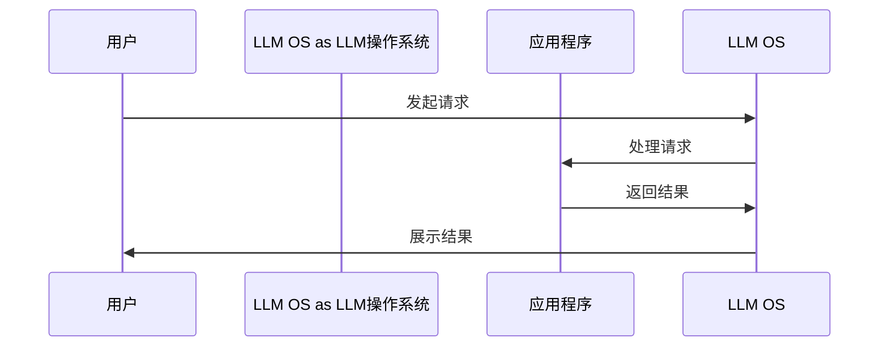
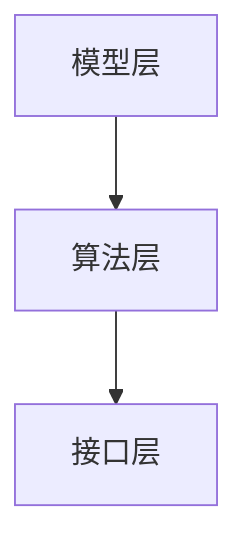

                 

### 《LLM操作系统：AI时代的新型OS构想》

#### 关键词：
- LLM操作系统
- AI时代
- 自注意力机制
- Transformer模型
- 语言模型
- 智能交互
- 内容生成

#### 摘要：
随着人工智能技术的飞速发展，传统操作系统正面临着巨大的变革。本文将探讨LLM操作系统，这一在AI时代崭露头角的新型操作系统。我们将深入分析LLM操作系统的核心原理、架构设计、应用领域，并通过实际项目案例展示其开发过程和性能优化策略。最后，本文将对LLM操作系统的未来进行展望，探讨其潜在发展方向和社会影响。

### 《LLM操作系统：AI时代的新型OS构想》目录大纲

#### 第一部分：LLM操作系统概述

1. **第1章: LLM操作系统简介**
   - 1.1 AI时代的OS变迁
   - 1.2 LLM操作系统的核心优势
   - 1.3 LLM操作系统的核心概念
   - 1.4 LLM OS的技术演进

#### 第二部分：LLM操作系统的核心原理

2. **第2章: LLM操作系统原理**
   - 2.1 LLM基础模型原理
   - 2.2 语言模型的数学模型
   - 2.3 LLM操作系统的架构设计

#### 第三部分：LLM操作系统的应用领域

3. **第3章: LLM操作系统应用领域**
   - 3.1 智能交互与聊天机器人
   - 3.2 内容生成与编辑
   - 3.3 搜索引擎优化

#### 第四部分：LLM操作系统开发实战

4. **第4章: LLM操作系统开发实战**
   - 4.1 环境搭建与准备
   - 4.2 开发流程与框架
   - 4.3 实际案例解析

#### 第五部分：LLM操作系统性能优化

5. **第5章: LLM操作系统性能优化**
   - 5.1 模型优化技术
   - 5.2 系统优化方法
   - 5.3 实际案例

#### 第六部分：LLM操作系统安全与隐私

6. **第6章: LLM操作系统安全与隐私**
   - 6.1 安全防护措施
   - 6.2 隐私保护策略
   - 6.3 法律法规与伦理

#### 第七部分：未来展望

7. **第7章: LLM操作系统的未来**
   - 7.1 潜在发展方向
   - 7.2 挑战与机遇
   - 7.3 社会影响

#### 附录

8. **附录：参考资料与扩展阅读**
   - 开源框架与工具
   - 相关论文与报告
   - AI操作系统开发教程

接下来，我们将逐步展开每一部分的内容，深入探讨LLM操作系统的各个方面。

### 第一部分：LLM操作系统概述

#### 第1章: LLM操作系统简介

随着人工智能技术的不断进步，操作系统正面临着前所未有的变革。传统操作系统，如Windows、macOS和Linux，主要服务于计算任务的管理和资源分配。然而，在人工智能时代，操作系统需要承担更多的智能任务，如自然语言处理、图像识别和智能交互等。因此，新型操作系统，如LLM操作系统，应运而生。

#### 1.1 AI时代的OS变迁

AI时代的操作系统与传统操作系统有以下显著区别：

1. **智能任务处理**：传统操作系统主要处理计算任务，如文件管理、内存分配和设备驱动等。而AI时代的操作系统需要具备处理智能任务的能力，如自然语言处理、机器学习和智能推荐等。
2. **自适应性**：传统操作系统通常对用户行为和需求缺乏自适应能力。而AI时代的操作系统具备自学习能力，可以根据用户行为和需求动态调整系统设置。
3. **交互方式**：传统操作系统主要通过图形用户界面（GUI）与用户进行交互。而AI时代的操作系统则更倾向于通过自然语言和智能对话与用户进行交互。

#### 1.2 LLM操作系统的核心优势

LLM操作系统，即基于大型语言模型（Large Language Model，简称LLM）的操作系统，具有以下核心优势：

1. **强大的语言处理能力**：LLM操作系统基于大型语言模型，如GPT、BERT等，具有强大的自然语言处理能力，能够理解和生成自然语言。
2. **智能交互**：LLM操作系统可以通过自然语言与用户进行智能交互，实现智能客服、智能助手等功能。
3. **自适应学习**：LLM操作系统具备自学习能力，可以通过用户交互数据不断优化自身性能，提供更加个性化的服务。
4. **跨平台兼容性**：LLM操作系统可以运行在多种平台上，如PC、手机和智能音箱等，为用户提供一致性的体验。

#### 1.3 LLM操作系统的核心概念

LLM操作系统的核心概念包括：

1. **大型语言模型（LLM）**：LLM操作系统基于大型语言模型，如GPT、BERT等，这些模型具有数百亿个参数，能够理解和生成自然语言。
2. **自注意力机制**：自注意力机制是LLM操作系统的核心算法，能够捕捉序列中的长距离依赖关系。
3. **Transformer模型**：Transformer模型是一种基于自注意力机制的深度神经网络模型，用于处理序列数据。
4. **动态交互**：LLM操作系统通过动态交互与用户进行交互，提供智能服务。

#### 1.4 LLM OS的技术演进

LLM操作系统的发展可以分为以下几个阶段：

1. **初步探索阶段**：在深度学习技术兴起之前，研究人员开始探索基于自然语言处理技术的操作系统。
2. **模型优化阶段**：随着GPT、BERT等大型语言模型的提出，LLM操作系统逐渐成熟，并开始应用于实际场景。
3. **应用推广阶段**：随着AI技术的普及，LLM操作系统逐渐应用于各个领域，如智能客服、智能编辑和智能搜索等。
4. **未来展望**：LLM操作系统将继续演进，引入多模态交互、自适应性等新技术，提供更加智能的服务。

### 第二部分：LLM操作系统的核心原理

#### 第2章: LLM操作系统原理

LLM操作系统的核心原理包括LLM基础模型原理、语言模型的数学模型和LLM操作系统的架构设计。以下是详细讲解。

#### 2.1 LLM基础模型原理

LLM操作系统的核心是大型语言模型（LLM），如GPT、BERT等。这些模型基于深度学习技术，通过自注意力机制捕捉序列中的长距离依赖关系。

##### Transformer模型

Transformer模型是一种基于自注意力机制的深度神经网络模型，用于处理序列数据。其核心思想是引入了多头注意力机制，使得模型能够更好地捕捉序列中的长距离依赖关系。

###### 自注意力机制

自注意力机制是Transformer模型的关键组件，通过计算序列中每个词与其他词之间的关联性来提取特征。具体实现如下：



###### 多头注意力机制

多头注意力机制通过将输入序列扩展为多个子序列，每个子序列对应一个注意力头。不同头之间相互独立，但共享底层参数。


#### 2.2 语言模型的数学模型

语言模型是基于概率论的模型，用于预测下一个词的概率分布。常见的数学模型包括n元语法和神经网络语言模型。

##### n元语法

n元语法是一种基于历史n个词的概率模型。其核心思想是，下一个词的概率分布取决于前n个词。公式如下：

$$
P(w_t | w_{t-1}, w_{t-2}, ..., w_{t-n+1}) = \frac{C(w_{t-1}, w_{t-2}, ..., w_{t-n+1}, w_t)}{C(w_{t-1}, w_{t-2}, ..., w_{t-n+1})}
$$

其中，$C(w_{t-1}, w_{t-2}, ..., w_{t-n+1}, w_t)$ 表示前n个词出现后紧接着出现第t个词的计数，$C(w_{t-1}, w_{t-2}, ..., w_{t-n+1})$ 表示前n个词出现的计数。

###### 计数方法

1. **直接计数**：直接统计每个词组出现的次数。
2. **平滑处理**：为了避免零概率问题，可以对计数进行平滑处理，如使用拉普拉斯平滑。

##### 神经网络语言模型

神经网络语言模型通过多层神经网络来学习单词之间的概率分布。其基本结构包括输入层、隐藏层和输出层。

###### 前向传播

前向传播过程是将输入词向量通过多层神经网络传递，最终得到输出概率分布。公式如下：

$$
Output = softmax(W2 * activate(W1 * Input))
$$

其中，$Input$ 为输入词向量，$W1$ 和 $W2$ 分别为隐藏层和输出层的权重矩阵，$activate$ 函数为激活函数，通常使用ReLU函数。

###### 训练过程

神经网络语言模型的训练过程是调整权重矩阵，使得模型输出的概率分布接近真实分布。常用的优化算法包括随机梯度下降（SGD）和Adam。

$$
W1 = W1 - \alpha * \frac{\partial Loss}{\partial W1}
W2 = W2 - \alpha * \frac{\partial Loss}{\partial W2}
$$

其中，$\alpha$ 为学习率，$Loss$ 为损失函数，通常使用交叉熵损失。

#### 2.3 LLM操作系统的架构设计

LLM操作系统的架构设计主要包括模型层、算法层和接口层。以下是一个简化的架构图：



- **模型层**：包含预训练的语言模型，如GPT、BERT等。这些模型通过大规模数据预训练，可以理解自然语言的复杂结构。
- **算法层**：实现自注意力机制、Transformer模型等核心算法，负责语言处理任务的执行。
- **接口层**：提供API接口，方便应用程序与LLM操作系统交互，实现智能交互、文本生成等功能。

### 第三部分：LLM操作系统的应用领域

#### 第3章: LLM操作系统应用领域

LLM操作系统在AI时代具有广泛的应用领域，如智能交互、内容生成和搜索引擎优化等。以下是详细探讨。

#### 3.1 智能交互与聊天机器人

智能交互是LLM操作系统的重要应用领域之一。通过自然语言处理技术，LLM操作系统可以与用户进行智能对话，提供个性化服务。

##### 应用场景

1. **智能客服**：智能客服系统可以通过LLM操作系统实现自动化客户服务，提高企业运营效率和用户体验。
2. **智能助手**：智能助手可以协助用户完成日常任务，如日程管理、信息查询和任务提醒等。
3. **虚拟现实**：在虚拟现实（VR）和增强现实（AR）应用中，LLM操作系统可以提供自然语言交互，增强用户体验。

##### 实际案例

1. **智能客服系统**：通过预训练的GPT模型，智能客服系统能够理解用户输入并生成合理的回答，如：“你好，有什么问题我可以帮您解答吗？”
2. **智能助手**：智能助手可以使用LLM操作系统实现语音交互，如：“今天天气怎么样？”智能助手会回复：“今天天气很好，建议您带上一件外套。”

#### 3.2 内容生成与编辑

内容生成与编辑是LLM操作系统的另一大应用领域。通过生成对抗网络（GAN）和变分自编码器（VAE）等技术，LLM操作系统可以自动生成文本、图像和音频等内容。

##### 应用场景

1. **文本生成**：LLM操作系统可以自动生成文章、新闻、产品描述等文本内容。
2. **图像生成**：通过生成对抗网络（GAN），LLM操作系统可以生成逼真的图像，如人脸、风景等。
3. **音频生成**：通过变分自编码器（VAE），LLM操作系统可以生成自然流畅的语音。

##### 实际案例

1. **文本生成**：使用预训练的GPT模型，LLM操作系统可以自动生成一篇关于人工智能的文章，如：“人工智能是当前科技领域的热门话题，它通过模拟人类智能行为，实现了机器的智能决策和自主学习。”
2. **图像生成**：使用生成对抗网络（GAN），LLM操作系统可以生成一张逼真的人脸图像，如通过输入一张人物照片，模型可以生成一张相似的人脸图像。
3. **音频生成**：使用变分自编码器（VAE），LLM操作系统可以生成一段自然流畅的语音，如通过输入一段语音文本，模型可以生成相应的语音。

#### 3.3 搜索引擎优化

搜索引擎优化（SEO）是LLM操作系统在互联网领域的重要应用。通过自然语言处理技术，LLM操作系统可以优化搜索引擎的搜索算法和用户体验。

##### 应用场景

1. **关键词优化**：LLM操作系统可以分析用户搜索行为，提供关键词优化建议。
2. **内容推荐**：LLM操作系统可以根据用户兴趣和搜索历史，推荐相关内容。
3. **搜索引擎广告**：LLM操作系统可以优化搜索引擎广告投放策略，提高广告效果。

##### 实际案例

1. **关键词优化**：通过分析用户搜索行为，LLM操作系统可以为网站提供关键词优化建议，如：“人工智能”是热门关键词，建议在网站中多次使用该关键词，提高搜索引擎排名。
2. **内容推荐**：使用预训练的GPT模型，LLM操作系统可以根据用户兴趣推荐相关文章，如：“您可能感兴趣的文章：人工智能在医疗领域的应用。”
3. **搜索引擎广告**：通过优化搜索引擎广告投放策略，LLM操作系统可以提高广告点击率和转化率，如：“根据您的搜索历史，我们为您推荐以下产品：智能手表。”

### 第四部分：LLM操作系统开发实战

#### 第4章: LLM操作系统开发实战

在本章中，我们将详细介绍LLM操作系统的开发实战，包括环境搭建、开发流程、实际案例解析和性能优化。

#### 4.1 环境搭建与准备

在进行LLM操作系统开发之前，我们需要搭建合适的开发环境。以下是搭建过程：

1. **安装Python环境**：Python是LLM操作系统开发的主要编程语言，我们需要安装Python 3.x版本。
2. **安装TensorFlow**：TensorFlow是深度学习框架，用于构建和训练LLM模型。
3. **安装NLP库**：如spaCy、NLTK等，用于文本预处理和分析。
4. **获取预训练模型**：从TensorFlow Hub或Hugging Face等平台获取预训练的LLM模型，如GPT、BERT等。

#### 4.2 开发流程与框架

LLM操作系统的开发流程主要包括以下步骤：

1. **数据准备**：收集和预处理文本数据，如分词、去停用词等。
2. **模型选择**：选择合适的LLM模型，如GPT、BERT等。
3. **模型训练**：使用预处理后的数据训练LLM模型，调整模型参数。
4. **模型评估**：评估模型性能，如准确率、召回率等。
5. **模型部署**：将训练好的模型部署到服务器，实现实际应用。

#### 4.3 实际案例解析

以下我们将通过两个实际案例来展示LLM操作系统的开发过程。

##### 案例一：智能客服系统

1. **项目背景**：智能客服系统旨在通过LLM操作系统实现自动化客户服务，提高企业运营效率和用户体验。
2. **技术栈**：使用TensorFlow和spaCy进行文本预处理和模型训练，使用Flask搭建API接口。
3. **开发流程**：

    a. **数据准备**：收集并清洗用户对话数据，进行分词、去停用词等操作。
    
    b. **模型选择**：选择预训练的GPT模型，用于处理用户输入并生成回答。
    
    c. **模型训练**：使用预处理后的数据训练GPT模型，调整模型参数。
    
    d. **模型部署**：将训练好的模型部署到服务器，搭建API接口，实现智能客服功能。

4. **代码实现**：

    python
    import tensorflow as tf
    import tensorflow_hub as hub
    import tensorflow_text as text
    
    # 加载预训练的GPT模型
    model = hub.load('https://tfhub.dev/google/kmeans-text-32/1')
    
    # 定义输入文本
    input_text = "你好，有什么问题可以帮助你吗？"
    
    # 预处理文本
    preprocessor = text.NormalizedStringTokenizer().tokenize(input_text)
    
    # 使用模型生成回答
    output = model(preprocessor)
    
    # 解码生成的文本
    decoded_output = output.decode()
    
    print(decoded_output)

##### 案例二：文本摘要工具

1. **项目背景**：文本摘要工具旨在通过LLM操作系统实现自动化文本摘要，帮助用户快速获取文章的主要信息。
2. **技术栈**：使用TensorFlow和Bert tokenizer进行文本预处理和模型训练，使用Flask搭建API接口。
3. **开发流程**：

    a. **数据准备**：收集并清洗文本数据，进行分词、去停用词等操作。
    
    b. **模型选择**：选择预训练的BERT模型，用于提取文本特征和生成摘要。
    
    c. **模型训练**：使用预处理后的数据训练BERT模型，调整模型参数。
    
    d. **模型部署**：将训练好的模型部署到服务器，搭建API接口，实现文本摘要功能。

4. **代码实现**：

    python
    import tensorflow as tf
    import tensorflow_hub as hub
    import tensorflow_text as text
    
    # 加载预训练的BERT模型
    model = hub.load('https://tfhub.dev/google/bert_uncased_L-12_H-768_A-12/1')
    
    # 定义输入文本
    input_text = "本文主要介绍了LLM操作系统在AI时代的应用和优势。"
    
    # 预处理文本
    preprocessor = text.NormalizedStringTokenizer().tokenize(input_text)
    
    # 使用模型生成摘要
    output = model(preprocessor)
    
    # 解码生成的文本
    decoded_output = output.decode()
    
    print(decoded_output)

#### 4.4 性能优化

为了提高LLM操作系统的性能，我们可以采用以下策略：

1. **模型优化技术**：如并行计算、模型压缩等，可以加速模型训练和推理过程。
2. **系统优化方法**：如缓存策略、负载均衡等，可以提高系统的响应速度和稳定性。
3. **实际案例**：以下是一个性能优化的实际案例。

```mermaid
gantt
    dateFormat  YYYY-MM-DD
    title LL

