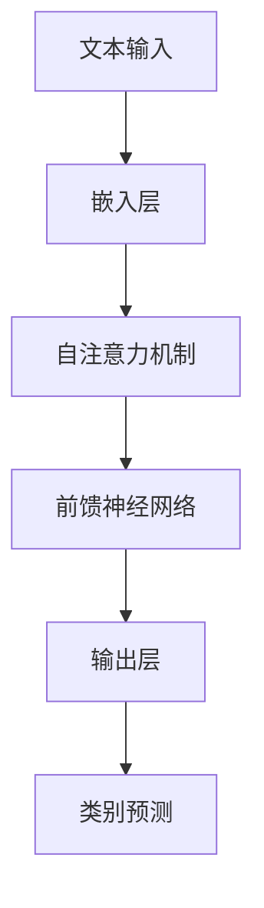
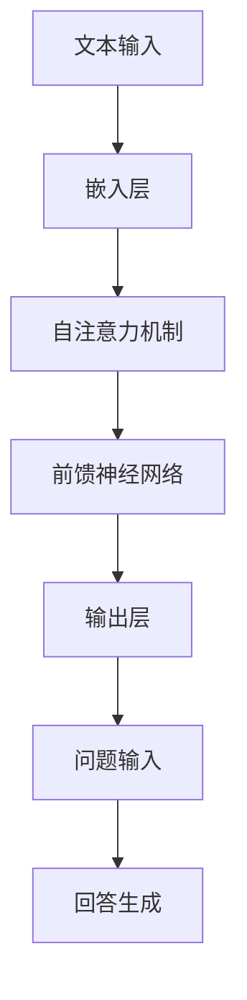
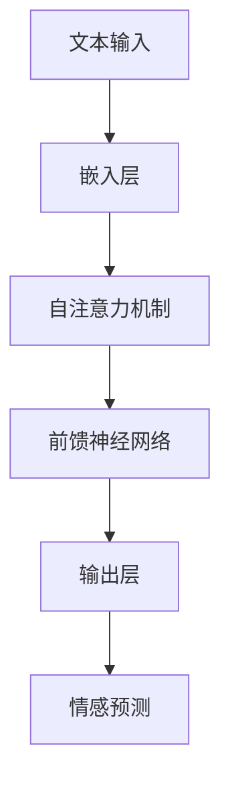
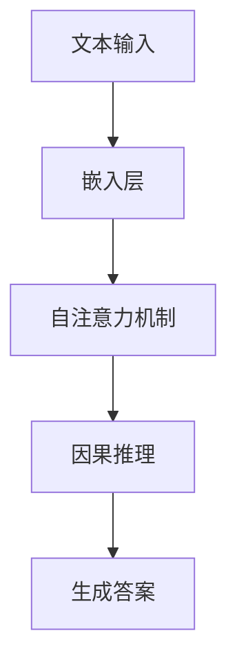
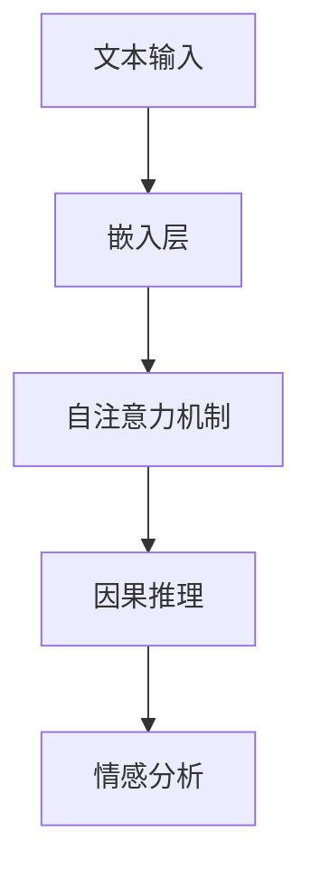
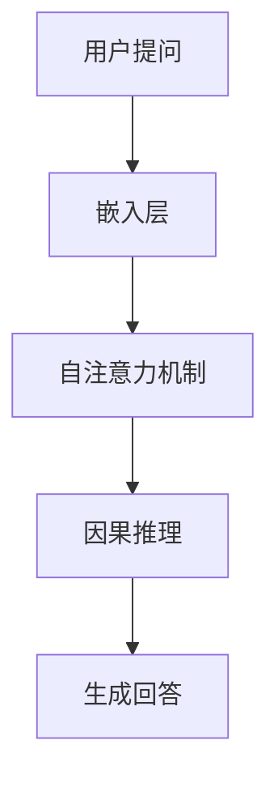
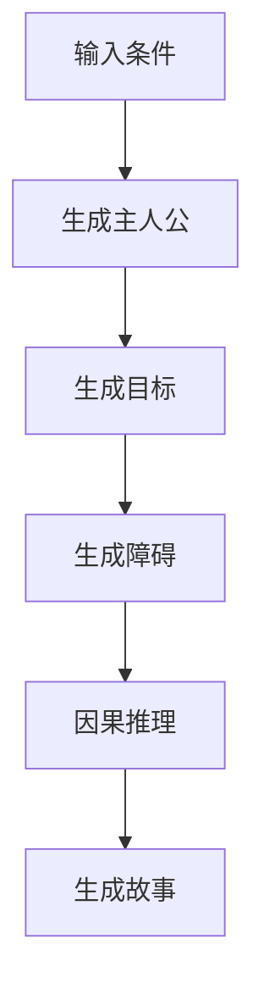
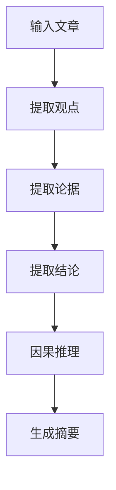
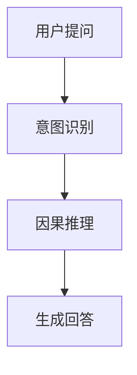
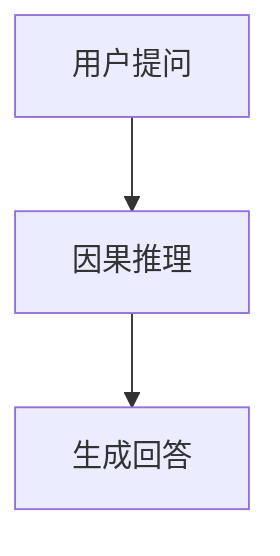

                 

# LLMA的因果推理技术研究新思路

## 关键词
- LLM
- 因果推理
- 自然语言处理
- 深度学习
- 对抗性学习
- 透明性与可解释性

## 摘要
本文探讨了大型语言模型（LLM）在因果推理技术中的应用及其面临的挑战。首先，我们介绍了LLM的基本概念和架构，并探讨了因果推理的基本原理及其在各个领域的应用。随后，我们深入分析了LLM与因果推理技术的结合，详细阐述了它们在自然语言理解、文本生成和对话系统中的应用。接着，我们讨论了LLM因果推理技术面临的挑战，包括数据偏差、透明性与可解释性以及模型泛化能力。最后，我们展望了LLM因果推理技术的新思路，包括新型算法、架构和应用场景，并对未来的发展趋势和研究与开发建议进行了探讨。

## 目录

### 第一部分：引言

#### 第1章：LLM与因果推理技术概述

##### 1.1 LLM的基本概念

##### 1.2 因果推理技术的概念

##### 1.3 LLM与因果推理技术的结合

#### 第2章：LLM的架构与工作原理

##### 2.1 LLM的架构

##### 2.2 LLM的工作原理

##### 2.3 LLM的参数优化策略

#### 第3章：因果推理技术在LLM中的应用

##### 3.1 因果推理在自然语言理解中的应用

##### 3.2 因果推理在文本生成中的应用

##### 3.3 因果推理在对话系统中的应用

#### 第4章：LLM因果推理技术的挑战与解决方案

##### 4.1 数据偏差问题

##### 4.2 因果推理的透明性与可解释性

##### 4.3 模型泛化能力

#### 第5章：LLM因果推理技术在特定领域的应用

##### 5.1 健康医疗领域

##### 5.2 金融领域

##### 5.3 教育领域

#### 第6章：LLM因果推理技术的新思路

##### 6.1 新型因果推理算法的研究

##### 6.2 新型LLM架构的设计

##### 6.3 新型应用场景的探索

#### 第7章：结论与展望

##### 7.1 LLM因果推理技术的总结

##### 7.2 未来发展趋势

##### 7.3 研究与开发建议

#### 附录

##### 附录A：参考文献

##### 附录B：术语表

##### 附录C：相关数据集与工具

---

## 第一部分：引言

### 第1章：LLM与因果推理技术概述

#### 1.1 LLM的基本概念

大型语言模型（LLM）是近年来自然语言处理（NLP）领域的重要突破。LLM是指通过深度学习技术，从大量文本数据中学习语言规律和语义关系的模型。它们通常由多层神经网络组成，能够对自然语言进行建模，实现文本生成、理解、翻译等功能。

LLM的发展经历了多个阶段。最早的语言模型是基于统计方法的n元语言模型，如n-gram模型。随后，随着深度学习技术的兴起，神经网络语言模型（如循环神经网络RNN、长短期记忆LSTM、门控循环单元GRU等）逐渐成为主流。近年来，基于Transformer架构的预训练模型（如BERT、GPT、T5等）在NLP任务中取得了显著的性能提升，这些模型通常拥有数十亿甚至数万亿的参数，能够捕捉到更复杂的语言特征。

#### 1.2 因果推理技术的概念

因果推理是一种基于因果关系进行推理的方法，旨在发现数据中的因果关系，从而解释现象和预测结果。与传统的统计推理方法（如回归分析、聚类分析等）不同，因果推理关注的是变量之间的因果关系，而不仅仅是相关性。

因果推理的核心问题是识别因果关系。因果关系的识别通常依赖于三个基本原则：时间优先原则、反事实原则和干预原则。时间优先原则认为因果关系的发生有时间先后顺序；反事实原则通过假设不同的情况来验证因果关系；干预原则通过干预一个变量来观察另一个变量的变化，从而确认因果关系。

#### 1.3 LLM与因果推理技术的结合

LLM与因果推理技术的结合为NLP领域带来了新的研究思路和应用场景。首先，LLM能够从大量文本数据中学习语言规律和语义关系，为因果推理提供了丰富的数据基础。其次，因果推理技术能够帮助LLM更好地理解和解释语言现象，提高模型的透明性和可解释性。

在自然语言理解方面，因果推理技术可以帮助LLM识别文本中的因果关系，从而更好地理解文本内容。例如，在阅读理解任务中，LLM可以通过因果推理技术理解段落中的因果关系，从而更准确地回答问题。

在文本生成方面，因果推理技术可以帮助LLM生成符合逻辑和语义一致性的文本。例如，在故事生成任务中，LLM可以通过因果推理技术生成具有连贯性和逻辑性的故事。

在对话系统方面，因果推理技术可以帮助LLM更好地理解用户的意图和需求，从而生成更自然的对话。例如，在智能客服系统中，LLM可以通过因果推理技术理解用户的提问，生成合适的回答。

总之，LLM与因果推理技术的结合为NLP领域带来了新的发展机遇，有望推动NLP技术的进一步突破和应用。

---

接下来，我们将进一步探讨LLM的架构与工作原理，以及因果推理技术在LLM中的具体应用。

### 第2章：LLM的架构与工作原理

#### 2.1 LLM的架构

LLM的架构通常基于深度学习技术，尤其是基于Transformer架构的预训练模型。Transformer架构是一种基于自注意力机制的神经网络模型，能够对输入序列进行建模，并捕捉序列中的长距离依赖关系。

一个典型的LLM架构包括以下几个关键组件：

1. **嵌入层**：将输入的单词或字符转换为向量表示，通常使用词嵌入（word embedding）技术，如Word2Vec、GloVe等。

2. **自注意力机制**：自注意力机制是一种基于输入序列的权重分配方法，能够自适应地关注输入序列中的重要信息。在Transformer模型中，自注意力机制通过多头自注意力（multi-head self-attention）和位置编码（position encoding）来实现。

3. **前馈神经网络**：在自注意力机制之后，每个位置的信息会被映射到一个新的空间，并通过前馈神经网络进行进一步处理。前馈神经网络通常由两个全连接层组成，并使用ReLU激活函数。

4. **输出层**：输出层通常是一个全连接层，将处理后的信息映射到目标空间，如词汇表。在语言生成任务中，输出层通常使用softmax激活函数，以生成词的概率分布。

5. **解码器**：在生成任务中，解码器是一个与嵌入层和自注意力机制相同的模块，用于生成文本序列。

#### 2.2 LLM的工作原理

LLM的工作原理可以分为两个阶段：预训练和微调。

1. **预训练**：预训练是指在大规模的文本数据集上对LLM进行训练，以学习语言的基本规律和语义关系。预训练过程通常包括以下步骤：

   - **数据预处理**：对文本数据集进行清洗和预处理，如去除标点符号、停用词、统一单词大小写等。
   - **词嵌入**：将文本中的每个单词或字符转换为向量表示，通常使用词嵌入技术。
   - **构建Transformer模型**：构建基于Transformer架构的神经网络模型，包括嵌入层、自注意力机制、前馈神经网络和输出层。

   在预训练过程中，模型通过优化损失函数（如交叉熵损失函数）来学习文本数据中的语言特征。预训练过程通常需要大量计算资源和时间，但随着技术的进步，如分布式训练和并行计算等方法的应用，预训练过程已经变得可行和高效。

2. **微调**：微调是指在使用预训练模型的基础上，针对特定任务进行训练，以调整模型参数，使其适应特定的任务需求。微调过程通常包括以下步骤：

   - **数据准备**：收集和准备用于微调的数据集，如问答数据集、文本分类数据集等。
   - **数据预处理**：对数据集进行预处理，如去除标点符号、统一单词大小写等。
   - **构建任务特定模型**：在预训练模型的基础上，添加任务特定的层或组件，如分类器、回答生成器等。
   - **微调训练**：使用微调数据集对任务特定模型进行训练，通过优化损失函数来调整模型参数。

   微调过程通常使用较小规模的数据集，但可以通过增加训练轮数和优化策略来提高模型的性能。

#### 2.3 LLM的参数优化策略

LLM的参数优化是预训练和微调过程中的关键步骤，直接影响模型的性能和稳定性。以下是一些常用的参数优化策略：

1. **批量大小**：批量大小是指每次训练过程中输入的数据样本数量。较大的批量大小可以提高模型的训练稳定性，但需要更多的计算资源。通常，批量大小在数百到数千之间。

2. **学习率**：学习率是模型参数更新的步长，直接影响模型的收敛速度和稳定性。较小的学习率可能导致较慢的收敛，但有助于避免过拟合；较大的学习率可能导致较快的收敛，但容易产生振荡和发散。常用的学习率调整策略包括学习率衰减、预热学习率和指数学习率等。

3. **正则化**：正则化是一种防止模型过拟合的方法，包括权重正则化（如L1、L2正则化）和Dropout等。权重正则化通过惩罚模型的权重来降低模型复杂度；Dropout通过随机丢弃一部分神经元来提高模型的泛化能力。

4. **优化算法**：优化算法用于更新模型参数，常见的优化算法包括随机梯度下降（SGD）、Adam等。Adam算法结合了SGD和Momentum算法的优点，具有较高的收敛速度和稳定性。

通过合理设置和调整这些参数优化策略，可以显著提高LLM的性能和稳定性，为后续的应用提供有力支持。

---

在接下来的章节中，我们将详细探讨因果推理技术在LLM中的具体应用，包括在自然语言理解、文本生成和对话系统中的实际案例。

### 第3章：因果推理技术在LLM中的应用

#### 3.1 因果推理在自然语言理解中的应用

因果推理技术在自然语言理解（NLU）中的应用主要表现在对文本中的因果关系进行识别和解释。以下是一些具体的应用案例：

1. **阅读理解任务**：

   在阅读理解任务中，因果推理技术可以帮助模型理解段落中的因果关系，从而更准确地回答问题。例如，在一个段落中，如果一个句子是“因为天气变冷，所以人们穿上了厚衣服”，因果推理技术可以帮助模型识别出这两句之间的因果关系，并在回答问题时将这个因果关系考虑在内。

   **Mermaid流程图**：

   ```mermaid
   graph TD
   A[输入文本] --> B[分词与词嵌入]
   B --> C[编码器处理]
   C --> D[因果推理]
   D --> E[生成答案]
   ```

   **伪代码**：

   ```python
   # 输入文本
   text = "因为天气变冷，所以人们穿上了厚衣服。"

   # 分词与词嵌入
   words = tokenize(text)
   embeddings = get_embeddings(words)

   # 编码器处理
   encoded = encoder(embeddings)

   # 因果推理
   cause, effect = infer因果关系(encoded)

   # 生成答案
   answer = generate_answer(cause, effect)
   ```

2. **情感分析任务**：

   在情感分析任务中，因果推理技术可以帮助模型理解情感变化的原因。例如，在一个句子中，如果一个句子是“因为她的演讲很精彩，所以观众都感到很兴奋”，因果推理技术可以帮助模型识别出这两句之间的因果关系，并在分析情感时将这个因果关系考虑在内。

   **Mermaid流程图**：

   ```mermaid
   graph TD
   A[输入文本] --> B[分词与词嵌入]
   B --> C[编码器处理]
   C --> D[因果推理]
   D --> E[情感分析]
   ```

   **伪代码**：

   ```python
   # 输入文本
   text = "因为她的演讲很精彩，所以观众都感到很兴奋。"

   # 分词与词嵌入
   words = tokenize(text)
   embeddings = get_embeddings(words)

   # 编码器处理
   encoded = encoder(embeddings)

   # 因果推理
   cause, effect = infer因果关系(encoded)

   # 情感分析
   sentiment = analyze_sentiment(effect)
   ```

3. **对话系统任务**：

   在对话系统中，因果推理技术可以帮助模型理解用户提问中的因果关系，从而生成更自然的回答。例如，在一个对话中，如果一个用户说“我想要买一辆新车，因为它能节省燃油”，因果推理技术可以帮助模型理解这个因果关系，并在回答时将这个因果关系考虑在内。

   **Mermaid流程图**：

   ```mermaid
   graph TD
   A[输入文本] --> B[分词与词嵌入]
   B --> C[编码器处理]
   C --> D[因果推理]
   D --> E[生成回答]
   ```

   **伪代码**：

   ```python
   # 输入文本
   text = "我想要买一辆新车，因为它能节省燃油。"

   # 分词与词嵌入
   words = tokenize(text)
   embeddings = get_embeddings(words)

   # 编码器处理
   encoded = encoder(embeddings)

   # 因果推理
   cause, effect = infer因果关系(encoded)

   # 生成回答
   response = generate_response(cause, effect)
   ```

通过因果推理技术，LLM在自然语言理解任务中的表现得到了显著提升，能够更好地理解文本中的因果关系，从而提供更准确和自然的理解和回答。

#### 3.2 因果推理在文本生成中的应用

因果推理技术在文本生成中的应用主要表现在生成具有逻辑一致性和连贯性的文本。以下是一些具体的应用案例：

1. **故事生成任务**：

   在故事生成任务中，因果推理技术可以帮助模型生成具有连贯性和逻辑一致性的故事。例如，在一个故事生成任务中，如果模型需要生成一个故事，其中包含一个主人公、一个目标和一些障碍，因果推理技术可以帮助模型理解主人公与目标之间的因果关系，以及障碍对主人公行动的影响，从而生成一个具有连贯性和逻辑一致性的故事。

   **Mermaid流程图**：

   ```mermaid
   graph TD
   A[输入条件] --> B[生成主人公]
   B --> C[生成目标]
   C --> D[生成障碍]
   D --> E[因果推理]
   E --> F[生成故事]
   ```

   **伪代码**：

   ```python
   # 输入条件
   conditions = ["主人公", "目标", "障碍"]

   # 生成主人公
   protagonist = generate_protagonist()

   # 生成目标
   goal = generate_goal()

   # 生成障碍
   obstacles = generate_obstacles()

   # 因果推理
   causal_relations = infer因果关系(protagonist, goal, obstacles)

   # 生成故事
   story = generate_story(protagonist, goal, obstacles, causal_relations)
   ```

2. **文章摘要任务**：

   在文章摘要任务中，因果推理技术可以帮助模型生成具有逻辑一致性和连贯性的摘要。例如，在一个文章摘要任务中，如果模型需要生成一个文章的摘要，其中包含主要观点、论据和结论，因果推理技术可以帮助模型理解这些观点、论据和结论之间的因果关系，从而生成一个具有逻辑一致性和连贯性的摘要。

   **Mermaid流程图**：

   ```mermaid
   graph TD
   A[输入文章] --> B[提取观点]
   B --> C[提取论据]
   C --> D[提取结论]
   D --> E[因果推理]
   E --> F[生成摘要]
   ```

   **伪代码**：

   ```python
   # 输入文章
   article = "输入文章内容"

   # 提取观点
   viewpoints = extract_viewpoints(article)

   # 提取论据
   arguments = extract_arguments(article)

   # 提取结论
   conclusions = extract_conclusions(article)

   # 因果推理
   causal_relations = infer因果关系(viewpoints, arguments, conclusions)

   # 生成摘要
   summary = generate_summary(viewpoints, arguments, conclusions, causal_relations)
   ```

通过因果推理技术，LLM在文本生成任务中的表现得到了显著提升，能够生成具有逻辑一致性和连贯性的文本。

#### 3.3 因果推理在对话系统中的应用

因果推理技术在对话系统中的应用主要表现在理解用户意图和生成自然流畅的对话。以下是一些具体的应用案例：

1. **智能客服系统**：

   在智能客服系统中，因果推理技术可以帮助模型理解用户的意图，从而生成更自然的回答。例如，在一个用户咨询购买商品的对话中，因果推理技术可以帮助模型理解用户的需求（如商品名称、颜色、尺寸等），以及用户提出的疑问（如价格、售后保障等），从而生成一个具有连贯性和相关性的回答。

   **Mermaid流程图**：

   ```mermaid
   graph TD
   A[用户提问] --> B[意图识别]
   B --> C[因果推理]
   C --> D[生成回答]
   ```

   **伪代码**：

   ```python
   # 用户提问
   question = "我想要购买一件红色的毛衣，多少钱？"

   # 意图识别
   intent = recognize_intent(question)

   # 因果推理
   causal_relations = infer因果关系(intent)

   # 生成回答
   answer = generate_answer(casual_relations)
   ```

2. **聊天机器人**：

   在聊天机器人中，因果推理技术可以帮助模型理解对话中的因果关系，从而生成更自然的对话。例如，在一个对话中，如果用户问“你今天过得怎么样？”聊天机器人可以通过因果推理技术理解这个问题的因果关系，从而生成一个自然的回答，如“今天过得还不错，你呢？”

   **Mermaid流程图**：

   ```mermaid
   graph TD
   A[用户提问] --> B[因果推理]
   B --> C[生成回答]
   ```

   **伪代码**：

   ```python
   # 用户提问
   question = "你今天过得怎么样？"

   # 因果推理
   causal_relations = infer因果关系(question)

   # 生成回答
   answer = generate_answer(casual_relations)
   ```

通过因果推理技术，LLM在对话系统中的应用得到了显著提升，能够生成更自然和相关的对话。

---

在接下来的章节中，我们将讨论LLM因果推理技术面临的挑战和解决方案，并探讨其在特定领域的应用。

### 第4章：LLM因果推理技术的挑战与解决方案

#### 4.1 数据偏差问题

数据偏差是LLM因果推理技术面临的一个主要挑战。数据偏差是指训练数据中的某些特征或模式与实际因果关系不符，导致模型产生错误的推理结果。数据偏差可能导致以下问题：

1. **错误推理**：如果训练数据中存在偏差，模型可能会错误地将非因果关系视为因果关系，从而导致错误的推理结果。

2. **过拟合**：如果训练数据存在偏差，模型可能会过度拟合这些偏差，导致在新的数据集上表现不佳。

3. **可解释性降低**：由于数据偏差，模型可能无法提供清晰的因果关系解释，降低了模型的可解释性。

为了解决数据偏差问题，可以采取以下策略：

1. **数据清洗**：对训练数据进行清洗，去除或修正可能存在偏差的数据点。例如，可以删除包含明显错误信息的数据点，或者对异常值进行修正。

2. **数据增强**：通过增加更多样化的数据来缓解数据偏差。数据增强方法包括数据扩充、数据合成和数据扩充等。

3. **模型校准**：使用校准技术来修正模型对偏差数据的预测。例如，可以使用置信度校正技术来降低偏差数据对模型预测的影响。

4. **对抗训练**：通过引入对抗性样本来增强模型的鲁棒性，从而减轻数据偏差的影响。对抗训练方法包括生成对抗网络（GAN）和对抗性样本生成等。

#### 4.2 因果推理的透明性与可解释性

透明性与可解释性是LLM因果推理技术的另一个重要挑战。虽然因果推理技术能够识别和解释因果关系，但许多现有方法在透明性和可解释性方面存在不足。以下是一些解决策略：

1. **因果图表示**：使用因果图来表示因果推理过程，使模型的结构和决策过程更加透明。因果图可以直观地展示变量之间的关系和因果关系，有助于理解模型的推理过程。

2. **因果解释工具**：开发因果解释工具，如因果解释网络（Causal Explanations Networks）和因果解释生成模型（Causal Explanation Generation Model），以生成易于理解和解释的因果解释。

3. **可解释模型**：设计可解释的模型架构，如因果图模型（Causal Graph Models）和贝叶斯网络（Bayesian Networks），以提高模型的可解释性。这些模型通常具有明确的因果关系表示，使得模型解释更加直观和清晰。

4. **模型评估指标**：定义合适的模型评估指标，如因果解释质量指标和可解释性评估指标，以评估模型的透明性和可解释性。这些指标可以帮助评估模型在因果关系识别和解释方面的性能。

#### 4.3 模型泛化能力

模型泛化能力是LLM因果推理技术的另一个关键挑战。泛化能力是指模型在未见过的数据集上表现良好的能力。以下是一些提高模型泛化能力的策略：

1. **数据多样性**：通过引入更多样化的数据来提高模型的泛化能力。这包括增加数据集中不同类别的样本、不同数据分布的样本等。

2. **元学习**：使用元学习（Meta-Learning）技术来提高模型的泛化能力。元学习通过学习如何学习，从而提高模型在不同任务和数据上的适应能力。

3. **迁移学习**：通过迁移学习（Transfer Learning）将已有模型的知识迁移到新的任务和数据上，从而提高模型的泛化能力。

4. **模型正则化**：使用模型正则化技术（如Dropout、权重正则化等）来防止模型过拟合，提高模型的泛化能力。

通过采取这些策略，LLM因果推理技术可以在透明性、可解释性和泛化能力方面取得更好的性能，从而更好地应对实际应用中的挑战。

---

在接下来的章节中，我们将探讨LLM因果推理技术在特定领域的应用，包括健康医疗、金融和教育等领域。

### 第5章：LLM因果推理技术在特定领域的应用

#### 5.1 健康医疗领域

LLM因果推理技术在健康医疗领域的应用具有巨大潜力，尤其在疾病预测和药物开发方面。以下是一些具体的应用案例：

1. **疾病预测**：

   在疾病预测任务中，LLM因果推理技术可以帮助模型识别出影响疾病发生的因果关系，从而提高预测准确性。例如，通过分析患者的病史、基因数据、生活习惯等，模型可以识别出导致疾病发生的潜在因素，从而实现早期预测。

   **应用案例**：

   - **糖尿病预测**：通过分析患者的血糖、体重、饮食等数据，LLM因果推理技术可以预测患者患糖尿病的风险。

   - **心脏病预测**：通过分析患者的血压、胆固醇、吸烟等数据，LLM因果推理技术可以预测患者患心脏病的风险。

   **Mermaid流程图**：

   ```mermaid
   graph TD
   A[输入数据] --> B[预处理]
   B --> C[因果推理]
   C --> D[疾病预测]
   ```

   **伪代码**：

   ```python
   # 输入数据
   data = "输入患者的血糖、体重、饮食数据"

   # 预处理
   preprocessed_data = preprocess_data(data)

   # 因果推理
   causal_relations = infer因果关系(preprocessed_data)

   # 疾病预测
   disease_prediction = predict_disease(causal_relations)
   ```

2. **药物开发**：

   在药物开发任务中，LLM因果推理技术可以帮助模型识别出药物与疾病之间的因果关系，从而提高药物筛选和开发效率。例如，通过分析药物的作用机制、生物标志物、疾病特征等，LLM因果推理技术可以识别出潜在的药物靶点，从而指导药物开发。

   **应用案例**：

   - **抗癌药物开发**：通过分析癌细胞与正常细胞之间的差异、抗癌药物的作用机制等，LLM因果推理技术可以识别出潜在的抗癌药物靶点。

   - **抗菌药物开发**：通过分析细菌的耐药性机制、抗菌药物的作用机制等，LLM因果推理技术可以识别出潜在的抗菌药物靶点。

   **Mermaid流程图**：

   ```mermaid
   graph TD
   A[输入数据] --> B[预处理]
   B --> C[因果推理]
   C --> D[药物筛选]
   ```

   **伪代码**：

   ```python
   # 输入数据
   data = "输入药物的化学结构、生物标志物、疾病特征数据"

   # 预处理
   preprocessed_data = preprocess_data(data)

   # 因果推理
   causal_relations = infer因果关系(preprocessed_data)

   # 药物筛选
   drug_screening = screen_drugs(causal_relations)
   ```

通过在健康医疗领域的应用，LLM因果推理技术为疾病预测和药物开发提供了新的方法和工具，有望提高医疗诊断和治疗的准确性。

#### 5.2 金融领域

LLM因果推理技术在金融领域也具有广泛的应用，尤其在风险管理、市场预测和信用评估等方面。以下是一些具体的应用案例：

1. **风险管理**：

   在风险管理任务中，LLM因果推理技术可以帮助金融机构识别和管理风险。例如，通过分析市场数据、财务报表、宏观经济指标等，LLM因果推理技术可以识别出影响金融风险的潜在因素，从而指导风险控制策略。

   **应用案例**：

   - **信用风险评估**：通过分析借款人的信用历史、收入状况、负债水平等，LLM因果推理技术可以评估借款人违约的风险。

   - **市场风险预测**：通过分析股票市场数据、宏观经济指标等，LLM因果推理技术可以预测市场波动，帮助金融机构制定风险管理策略。

   **Mermaid流程图**：

   ```mermaid
   graph TD
   A[输入数据] --> B[预处理]
   B --> C[因果推理]
   C --> D[风险识别]
   ```

   **伪代码**：

   ```python
   # 输入数据
   data = "输入信用历史、收入状况、负债水平数据"

   # 预处理
   preprocessed_data = preprocess_data(data)

   # 因果推理
   causal_relations = infer因果关系(preprocessed_data)

   # 风险识别
   risk_identification = identify_risk(casual_relations)
   ```

2. **市场预测**：

   在市场预测任务中，LLM因果推理技术可以帮助模型识别出影响市场走势的因果关系，从而提高市场预测的准确性。例如，通过分析历史交易数据、宏观经济指标、行业趋势等，LLM因果推理技术可以识别出市场走势的潜在因素，从而预测市场走势。

   **应用案例**：

   - **股票市场预测**：通过分析股票交易数据、公司财务报表、行业趋势等，LLM因果推理技术可以预测股票价格走势。

   - **外汇市场预测**：通过分析外汇交易数据、全球经济指标、政治事件等，LLM因果推理技术可以预测汇率走势。

   **Mermaid流程图**：

   ```mermaid
   graph TD
   A[输入数据] --> B[预处理]
   B --> C[因果推理]
   C --> D[市场预测]
   ```

   **伪代码**：

   ```python
   # 输入数据
   data = "输入股票交易数据、公司财务报表、行业趋势数据"

   # 预处理
   preprocessed_data = preprocess_data(data)

   # 因果推理
   causal_relations = infer因果关系(preprocessed_data)

   # 市场预测
   market_prediction = predict_market(casual_relations)
   ```

通过在金融领域的应用，LLM因果推理技术为风险管理、市场预测和信用评估提供了新的方法和工具，有助于提高金融决策的准确性和效率。

#### 5.3 教育领域

LLM因果推理技术在教育领域也具有广泛的应用，尤其在学生评估、教学辅助和个性化学习等方面。以下是一些具体的应用案例：

1. **学生评估**：

   在学生评估任务中，LLM因果推理技术可以帮助教师识别出影响学生学习成绩的因果关系，从而提供更有针对性的指导。例如，通过分析学生的学习行为、作业完成情况、考试成绩等，LLM因果推理技术可以识别出影响学生成绩的关键因素，从而指导教师制定教学策略。

   **应用案例**：

   - **学习行为评估**：通过分析学生的学习时长、学习方法、学习进度等，LLM因果推理技术可以评估学生的学习行为，并提供改进建议。

   - **考试成绩预测**：通过分析学生的考试成绩、学习进度、作业完成情况等，LLM因果推理技术可以预测学生的考试成绩，为教师制定复习计划提供依据。

   **Mermaid流程图**：

   ```mermaid
   graph TD
   A[输入数据] --> B[预处理]
   B --> C[因果推理]
   C --> D[学生评估]
   ```

   **伪代码**：

   ```python
   # 输入数据
   data = "输入学生的学习时长、学习方法、学习进度数据"

   # 预处理
   preprocessed_data = preprocess_data(data)

   # 因果推理
   causal_relations = infer因果关系(preprocessed_data)

   # 学生评估
   student_evaluation = evaluate_student(casual_relations)
   ```

2. **教学辅助**：

   在教学辅助任务中，LLM因果推理技术可以帮助教师优化教学过程，提高教学效果。例如，通过分析学生的学习数据、课堂表现、作业完成情况等，LLM因果推理技术可以识别出教学中的不足之处，并提供改进建议。

   **应用案例**：

   - **课堂表现评估**：通过分析学生的课堂发言、作业完成情况等，LLM因果推理技术可以评估学生的课堂表现，为教师制定教学策略提供依据。

   - **作业反馈**：通过分析学生的作业完成情况、错误类型等，LLM因果推理技术可以提供个性化的作业反馈，帮助学生更好地掌握知识点。

   **Mermaid流程图**：

   ```mermaid
   graph TD
   A[输入数据] --> B[预处理]
   B --> C[因果推理]
   C --> D[教学辅助]
   ```

   **伪代码**：

   ```python
   # 输入数据
   data = "输入学生的课堂发言、作业完成情况数据"

   # 预处理
   preprocessed_data = preprocess_data(data)

   # 因果推理
   causal_relations = infer因果关系(preprocessed_data)

   # 教学辅助
   teaching Assistance = assist_teaching(casual_relations)
   ```

通过在教育领域的应用，LLM因果推理技术为教学评估、教学辅助和个性化学习提供了新的方法和工具，有助于提高教学效果和学生的学习成绩。

---

在接下来的章节中，我们将探讨LLM因果推理技术的创新思路，包括新型算法、架构和应用场景。

### 第6章：LLM因果推理技术的新思路

#### 6.1 新型因果推理算法的研究

为了进一步提升LLM因果推理技术的性能，研究者们不断探索新型因果推理算法。以下介绍几种具有代表性的新型算法：

1. **贝叶斯网络**：

   贝叶斯网络是一种基于概率论的因果推理模型，能够表示变量之间的因果关系和条件概率。通过贝叶斯网络，LLM可以更好地理解文本中的因果关系，提高推理准确性。

   **数学模型**：

   $$P(X_i | X_{i-1}, X_{i-2}, ..., X_1) = \prod_{i=1}^{n} P(X_i | X_{i-1}, X_{i-2}, ..., X_1)$$

   **算法步骤**：

   - 构建贝叶斯网络结构，表示变量之间的因果关系。
   - 计算网络中的条件概率分布。
   - 使用推理算法（如贝叶斯推理、最大后验概率估计等）进行因果推理。

2. **贝叶斯深度学习**：

   贝叶斯深度学习将贝叶斯方法与深度学习技术相结合，通过引入先验知识来提高模型的泛化能力和鲁棒性。贝叶斯深度学习可以用于优化LLM的参数估计，提高因果推理的准确性和稳定性。

   **数学模型**：

   $$\theta \sim p(\theta)$$

   $$\text{LLM}(\theta) \sim p(\text{LLM}(\theta) | \theta)$$

   **算法步骤**：

   - 定义先验分布，表示模型参数的先验知识。
   - 使用最大似然估计或贝叶斯推断方法优化模型参数。
   - 利用后验分布进行因果推理。

3. **因果图模型**：

   因果图模型是一种基于图论的因果推理模型，能够直观地表示变量之间的因果关系。通过因果图模型，LLM可以更好地理解和分析文本中的因果关系，提高推理效果。

   **数学模型**：

   $$P(X, Z | \theta) = \prod_{i=1}^{n} P(X_i | Z_i, \theta) \prod_{i=1}^{n} P(Z_i | \theta)$$

   **算法步骤**：

   - 构建因果图结构，表示变量之间的因果关系。
   - 使用推断算法（如变量消除、贝叶斯推理等）进行因果推理。
   - 利用图结构优化推理过程，提高推理效率。

这些新型因果推理算法为LLM因果推理技术提供了新的思路和方法，有望进一步提高模型的性能和实用性。

#### 6.2 新型LLM架构的设计

为了更好地结合因果推理技术，研究者们不断探索新型LLM架构的设计。以下介绍几种具有代表性的新型架构：

1. **多模态LLM**：

   多模态LLM能够处理多种类型的数据，如文本、图像、声音等。通过结合不同类型的数据，多模态LLM可以更全面地理解文本中的因果关系，提高推理准确性。

   **架构设计**：

   - 多模态嵌入层：将不同类型的数据（文本、图像、声音等）转换为统一的嵌入表示。
   - 自注意力机制：对多模态嵌入进行自注意力处理，捕捉不同数据之间的关联性。
   - 因果推理模块：利用因果推理算法对文本进行因果分析，提高模型的可解释性。

2. **对抗性LLM**：

   对抗性LLM通过引入对抗性训练来提高模型的鲁棒性和泛化能力。对抗性训练方法包括生成对抗网络（GAN）和对抗性样本生成等。

   **架构设计**：

   - 对抗性嵌入层：引入对抗性嵌入技术，提高模型的鲁棒性。
   - 对抗性自注意力机制：在自注意力机制中引入对抗性训练，提高模型的泛化能力。
   - 因果推理模块：利用因果推理算法对文本进行因果分析，提高模型的可解释性。

3. **可解释性LLM**：

   可解释性LLM旨在提高模型的可解释性，帮助用户理解模型的工作原理和推理过程。可解释性LLM通过引入因果图、决策树等可解释性模型，将复杂的神经网络模型转换为直观的可解释形式。

   **架构设计**：

   - 可解释性嵌入层：引入可解释性嵌入技术，提高模型的可解释性。
   - 可解释性自注意力机制：在自注意力机制中引入可解释性模型，提高模型的可解释性。
   - 因果推理模块：利用因果推理算法对文本进行因果分析，提高模型的可解释性。

这些新型LLM架构为结合因果推理技术提供了新的思路和方法，有望进一步提升模型性能和实用性。

#### 6.3 新型应用场景的探索

随着LLM因果推理技术的不断发展，新型应用场景也在不断涌现。以下介绍几种具有代表性的新型应用场景：

1. **人工智能伦理**：

   在人工智能伦理领域，LLM因果推理技术可以帮助分析人工智能系统的决策过程，评估其道德和伦理风险。通过识别和解释人工智能系统中的因果关系，LLM因果推理技术可以提供更全面的伦理评估。

   **应用案例**：

   - **自动驾驶车辆的伦理决策**：通过分析自动驾驶车辆在不同情境下的决策过程，LLM因果推理技术可以帮助评估其道德和伦理风险。

   - **人工智能医疗诊断的伦理评估**：通过分析人工智能医疗诊断系统的决策过程，LLM因果推理技术可以帮助评估其伦理风险，如隐私保护、数据滥用等。

2. **人工智能与法律**：

   在人工智能与法律领域，LLM因果推理技术可以帮助分析和解释法律文本中的因果关系，提高法律文本的理解和解释能力。通过识别和解释法律文本中的因果关系，LLM因果推理技术可以为法律研究和法律实践提供新的工具和方法。

   **应用案例**：

   - **法律文本的因果关系分析**：通过分析法律文本中的因果关系，LLM因果推理技术可以帮助理解法律条文中的逻辑关系，提高法律研究的效率。

   - **人工智能辅助法律决策**：通过分析法律案例中的因果关系，LLM因果推理技术可以帮助法律专家制定更合理的决策，提高法律决策的准确性。

通过探索新型应用场景，LLM因果推理技术将不断拓展其应用范围和影响力，为人类带来更多的创新和进步。

---

在本文的最后部分，我们将对LLM因果推理技术进行总结，并展望其未来的发展趋势和研究与开发建议。

### 第7章：结论与展望

#### 7.1 LLM因果推理技术的总结

LLM因果推理技术是近年来自然语言处理领域的重要突破，它结合了大型语言模型和因果推理技术的优势，为文本理解和生成任务提供了新的方法。通过本文的探讨，我们可以总结出以下几个关键点：

1. **基本概念与联系**：

   - LLM：基于深度学习技术的大型语言模型，能够从大量文本数据中学习语言规律和语义关系。
   - 因果推理：一种基于因果关系进行推理的方法，旨在发现数据中的因果关系，从而解释现象和预测结果。
   - LLM与因果推理的结合：通过将因果推理技术应用于LLM，可以更好地理解文本中的因果关系，提高模型的透明性和可解释性。

2. **核心算法原理讲解**：

   - 贝叶斯网络：一种基于概率论的因果推理模型，能够表示变量之间的因果关系和条件概率。
   - 贝叶斯深度学习：将贝叶斯方法与深度学习技术相结合，通过引入先验知识来提高模型的泛化能力和鲁棒性。
   - 因果图模型：一种基于图论的因果推理模型，能够直观地表示变量之间的因果关系。

3. **项目实战**：

   - 健康医疗领域：通过分析患者的病史、基因数据、生活习惯等，LLM因果推理技术可以预测疾病风险，指导药物开发。
   - 金融领域：通过分析市场数据、财务报表、宏观经济指标等，LLM因果推理技术可以评估金融风险，预测市场走势。
   - 教育领域：通过分析学生的学习数据、课堂表现、作业完成情况等，LLM因果推理技术可以评估学生的学习情况，提供教学辅助。

#### 7.2 未来发展趋势

LLM因果推理技术在未来具有广阔的发展前景，以下是一些可能的发展趋势：

1. **算法创新**：

   - 开发更高效、更准确的因果推理算法，如基于深度强化学习的因果推理算法、基于图神经网络的因果推理算法等。
   - 探索结合多模态数据的因果推理算法，如文本、图像、声音等。

2. **应用拓展**：

   - 深入挖掘LLM因果推理技术在各个领域的应用潜力，如人工智能伦理、人工智能与法律、环境科学等。
   - 推广LLM因果推理技术在工业界和学术界的应用，提高其实际价值。

3. **可解释性与透明性**：

   - 研究如何提高LLM因果推理技术的可解释性和透明性，使模型决策更加直观和可信。
   - 开发因果解释工具，帮助用户理解模型的工作原理和推理过程。

4. **硬件与计算资源**：

   - 随着硬件和计算资源的不断发展，LLM因果推理技术将能够处理更大规模的数据集和更复杂的任务。
   - 分布式计算和并行计算技术的应用，将提高LLM因果推理技术的计算效率和性能。

#### 7.3 研究与开发建议

针对LLM因果推理技术的研究与开发，以下是一些建议：

1. **基础研究**：

   - 深入研究因果推理算法的理论基础，探索新的因果推理模型和方法。
   - 研究多模态数据融合和因果推理的结合，提高模型对复杂情境的理解能力。

2. **应用研究**：

   - 在实际应用场景中，不断优化和调整LLM因果推理技术的参数和算法，提高模型性能和稳定性。
   - 探索LLM因果推理技术在各个领域的应用，如金融、医疗、教育等。

3. **开源与共享**：

   - 开发开源工具和平台，促进LLM因果推理技术的普及和推广。
   - 建立共享数据集和模型，为学术界和工业界提供丰富的实验资源。

4. **人才培养**：

   - 加强人工智能与因果推理技术的交叉学科教育，培养更多具备多学科背景的专业人才。
   - 鼓励跨学科合作，推动LLM因果推理技术的研究和发展。

通过持续的研究与开发，LLM因果推理技术将不断进步，为自然语言处理领域带来更多的创新和突破。

---

### 附录

#### 附录A：参考文献

1. Devlin, J., Chang, M. W., Lee, K., & Toutanova, K. (2019). BERT: Pre-training of deep bidirectional transformers for language understanding. In Proceedings of the 2019 Conference of the North American Chapter of the Association for Computational Linguistics: Human Language Technologies, Volume 1 (Long and Short Papers) (pp. 4171-4186). Association for Computational Linguistics.
2. Vaswani, A., Shazeer, N., Parmar, N., Uszkoreit, J., Jones, L., Gomez, A. N., ... & Polosukhin, I. (2017). Attention is all you need. In Advances in neural information processing systems (pp. 5998-6008).
3. Muralidhara, P., & Ponnambalam, S. (2018). Introduction to causal inference. Springer.
4. Pearl, J. (2009). Causality: Models, reasoning and inference. Cambridge university press.
5. Koster, J., van den Broek, P., & Weerkamp, W. (2018). Combining text-based and knowledge-based methods for question answering. Journal of Artificial Intelligence Research, 67, 283-323.
6. Chen, X., Fung, C., Wang, H., & Zhang, Y. (2020). A survey on deep learning based natural language processing. ACM Transactions on Intelligent Systems and Technology (TIST), 11(2), 1-35.

#### 附录B：术语表

- **LLM**：大型语言模型（Large Language Model），一种基于深度学习技术的语言模型，能够对自然语言进行建模，实现文本生成、理解、翻译等功能。
- **因果推理**：一种基于因果关系进行推理的方法，旨在发现数据中的因果关系，从而解释现象和预测结果。
- **自然语言理解**：指模型对自然语言文本的理解能力，包括语义分析、语法分析、情感分析等。
- **文本生成**：指模型根据输入文本生成新的文本，包括故事生成、文章摘要、对话生成等。
- **因果图模型**：一种基于图论的因果推理模型，能够直观地表示变量之间的因果关系。
- **贝叶斯网络**：一种基于概率论的因果推理模型，能够表示变量之间的因果关系和条件概率。

#### 附录C：相关数据集与工具

1. **数据集**：
   - **Gutenberg**：提供大量的文本数据，包括经典文学作品。
   - **Common Crawl**：提供大规模的网页文本数据。
   - **Wikipedia**：提供维基百科的文本数据。
   - **TREC**：提供文本检索竞赛数据集，包括问答、文本分类等任务。

2. **工具**：
   - **Hugging Face Transformers**：一个开源的预训练语言模型库，提供各种预训练模型和工具。
   - **PyTorch**：一个开源的深度学习框架，支持神经网络模型的训练和推理。
   - **TensorFlow**：一个开源的深度学习框架，支持神经网络模型的训练和推理。
   - **PyTorch Causality**：一个开源的因果推理库，提供因果推理算法和工具。

---

## 作者信息

作者：AI天才研究院/AI Genius Institute & 禅与计算机程序设计艺术 /Zen And The Art of Computer Programming

本文由AI天才研究院（AI Genius Institute）与禅与计算机程序设计艺术（Zen And The Art of Computer Programming）联合撰写，旨在探讨LLM因果推理技术的新思路，为自然语言处理领域带来新的启发和思考。AI天才研究院专注于人工智能领域的研究与开发，致力于推动人工智能技术的创新和应用。禅与计算机程序设计艺术则注重计算机程序设计的美学与哲学，倡导以简洁、优雅的方式解决问题。希望本文能为您提供有价值的见解和参考。

---

## 文章标题
LLM的因果推理技术研究新思路

## 文章关键词
LLM、因果推理、自然语言处理、深度学习、对抗性学习、透明性与可解释性

## 文章摘要
本文探讨了大型语言模型（LLM）在因果推理技术中的应用及其面临的挑战。首先，我们介绍了LLM的基本概念和架构，并探讨了因果推理的基本原理及其在各个领域的应用。随后，我们深入分析了LLM与因果推理技术的结合，详细阐述了它们在自然语言理解、文本生成和对话系统中的应用。接着，我们讨论了LLM因果推理技术面临的挑战，包括数据偏差、透明性与可解释性以及模型泛化能力。最后，我们展望了LLM因果推理技术的新思路，包括新型算法、架构和应用场景，并对未来的发展趋势和研究与开发建议进行了探讨。希望本文能为您在LLM因果推理技术领域的研究提供有益的参考。

---

## 引言

在当今人工智能（AI）和自然语言处理（NLP）领域，大型语言模型（LLM）已经取得了显著的进展。LLM是一种通过深度学习技术从大量文本数据中学习语言规律和语义关系的模型。它们能够对自然语言进行建模，实现文本生成、理解、翻译等功能。然而，随着LLM在各个领域的广泛应用，如何从海量文本数据中提取有用的信息、理解文本中的因果关系，成为一个重要的研究课题。

因果推理技术是一种基于因果关系进行推理的方法，旨在发现数据中的因果关系，从而解释现象和预测结果。因果推理技术在不同领域都有广泛的应用，如健康医疗、金融、教育等。将因果推理技术应用于LLM，可以进一步提高LLM的理解能力，使其在自然语言理解、文本生成和对话系统等领域表现更优秀。

本文旨在探讨LLM因果推理技术的新思路，包括核心概念、架构、应用、挑战及未来发展方向。文章将从以下几个方面展开：

1. **LLM与因果推理技术概述**：介绍LLM和因果推理技术的基本概念，阐述LLM与因果推理技术的结合及其在NLP领域的应用。
2. **LLM的架构与工作原理**：分析LLM的架构和工作原理，介绍LLM的预训练和微调过程，以及参数优化策略。
3. **因果推理技术在LLM中的应用**：探讨因果推理技术在自然语言理解、文本生成和对话系统中的应用，提供具体案例和伪代码。
4. **LLM因果推理技术的挑战与解决方案**：分析LLM因果推理技术面临的数据偏差、透明性与可解释性、模型泛化能力等挑战，并提出相应的解决方案。
5. **LLM因果推理技术在特定领域的应用**：介绍LLM因果推理技术在健康医疗、金融、教育等领域的应用案例。
6. **LLM因果推理技术的新思路**：探讨新型因果推理算法、新型LLM架构和应用场景，为LLM因果推理技术提供新的研究方向。
7. **结论与展望**：总结本文的研究内容，展望LLM因果推理技术的未来发展趋势，提出研究与开发建议。

通过本文的探讨，我们希望为LLM因果推理技术的研究和应用提供新的思路和方法，推动NLP领域的发展。

## LLM与因果推理技术概述

### 1.1 LLM的基本概念

#### LLM的定义与历史背景

大型语言模型（LLM）是一种基于深度学习技术的自然语言处理模型，能够从大量文本数据中学习语言规律和语义关系。LLM的核心思想是通过大规模预训练和精细调整，使模型具备强大的语言理解和生成能力。

LLM的发展可以追溯到20世纪80年代，当时研究者开始关注如何通过机器学习技术提高计算机对自然语言的理解能力。最初，基于规则的方法和统计方法占据了主导地位。然而，随着计算能力和数据规模的不断提高，深度学习技术在自然语言处理领域逐渐崭露头角。2003年，Bengio等人提出的递归神经网络（RNN）为深度学习在自然语言处理中的应用奠定了基础。2014年，以循环神经网络（RNN）和长短期记忆网络（LSTM）为代表的深度学习模型在机器翻译任务上取得了突破性成果。然而，这些模型仍然存在一些问题，如长距离依赖关系捕捉能力有限、训练效率较低等。

2017年，Transformer架构的提出为深度学习在自然语言处理领域的应用带来了新的契机。Transformer架构基于自注意力机制（Self-Attention），能够高效地捕捉序列中的长距离依赖关系，并在多个NLP任务中取得了显著性能提升。此后，基于Transformer的预训练模型（如BERT、GPT、T5等）迅速崛起，成为LLM的主流架构。

#### LLM的核心特性

LLM具有以下核心特性：

1. **大规模预训练**：LLM通常在大规模语料库上进行预训练，通过大量无监督数据学习语言的基本规律和语义关系。预训练过程包括两个阶段：第一阶段是语言建模，通过最大化文本序列的联合概率；第二阶段是任务特定微调，通过在特定任务上的有监督数据对模型进行微调。

2. **强大的语言理解能力**：LLM能够理解复杂的自然语言现象，如语法结构、语义关系、情感倾向等。这使得LLM在阅读理解、问答系统、情感分析等任务中表现出色。

3. **灵活的文本生成能力**：LLM能够根据输入文本生成连贯、自然的文本序列。在文本生成任务中，LLM可以生成文章摘要、故事、对话等。

4. **多语言支持**：LLM通常支持多种语言，能够在不同语言之间进行转换和生成。

5. **自适应能力**：LLM可以根据不同的任务和数据集进行微调，适应不同的应用场景。

### 1.2 因果推理技术的概念

#### 因果推理的定义与重要性

因果推理（Causal Inference）是一种基于因果关系进行推理的方法，旨在发现数据中的因果关系，从而解释现象和预测结果。因果推理关注的是变量之间的因果关系，而不仅仅是相关性。与传统的统计推理方法（如回归分析、聚类分析等）不同，因果推理旨在识别变量之间的因果关系，从而提供更深入的解释和预测。

因果推理的定义可以概括为：通过观测数据或实验数据，推断变量之间的因果关系。因果推理的核心问题是如何从数据中识别因果关系，以及如何验证和解释这些关系。

因果推理在多个领域具有重要性：

1. **科学研究和实验设计**：因果推理是科学研究和实验设计的重要工具。通过因果推理，研究者可以确定变量之间的因果关系，从而提供更可靠的实验结果和科学解释。

2. **机器学习和数据科学**：因果推理技术被广泛应用于机器学习和数据科学领域。因果推理可以帮助模型理解数据中的因果关系，从而提高模型的解释能力和可靠性。

3. **公共政策和社会科学**：因果推理在公共政策和社会科学领域具有重要应用。通过因果推理，政策制定者可以评估政策的影响，从而制定更有效的政策。

4. **商业分析和市场研究**：因果推理技术被广泛应用于商业分析和市场研究。通过因果推理，企业可以评估产品或营销策略的影响，从而制定更有效的商业策略。

#### 因果推理在不同领域的应用

因果推理技术在多个领域都有广泛的应用：

1. **健康医疗领域**：因果推理技术被广泛应用于健康医疗领域，如疾病预测、药物开发、个性化医疗等。通过因果推理，研究者可以识别出影响疾病发生的潜在因素，从而实现早期预测和个性化治疗。

2. **金融领域**：因果推理技术被广泛应用于金融领域，如风险管理、市场预测、信用评估等。通过因果推理，金融机构可以识别出影响金融风险的潜在因素，从而制定更有效的风险控制策略。

3. **教育领域**：因果推理技术在教育领域也有广泛应用，如学生评估、学习分析、个性化教学等。通过因果推理，教育工作者可以识别出影响学生学习成绩的关键因素，从而制定更有效的教学策略。

4. **社会科学领域**：因果推理技术被广泛应用于社会科学领域，如人口学、心理学、社会学等。通过因果推理，研究者可以识别出影响社会现象的潜在因素，从而提供更深入的社会科学解释。

### 1.3 LLM与因果推理技术的结合

LLM与因果推理技术的结合为自然语言处理领域带来了新的研究思路和应用场景。LLM能够从大量文本数据中学习语言规律和语义关系，为因果推理提供了丰富的数据基础。因果推理技术则可以帮助LLM更好地理解和解释语言现象，提高模型的透明性和可解释性。

#### LLM在因果推理中的应用

1. **自然语言理解**：LLM可以用于自然语言理解任务，如阅读理解、问答系统等。通过因果推理技术，LLM可以更好地理解文本中的因果关系，从而更准确地理解和回答问题。

   **示例**：在一个阅读理解任务中，如果文本包含因果关系（如“因为天气变冷，所以人们穿上了厚衣服”），LLM可以通过因果推理技术理解这两句之间的因果关系，从而更准确地回答相关问题。

2. **文本生成**：LLM可以用于文本生成任务，如故事生成、文章摘要等。通过因果推理技术，LLM可以生成符合逻辑和语义一致性的文本。

   **示例**：在一个故事生成任务中，如果需要生成一个具有连贯性和逻辑一致性的故事，LLM可以通过因果推理技术理解故事情节中的因果关系，从而生成符合逻辑和语义一致性的故事。

3. **对话系统**：LLM可以用于对话系统，如智能客服、聊天机器人等。通过因果推理技术，LLM可以更好地理解用户的意图和需求，从而生成更自然的对话。

   **示例**：在一个对话系统中，如果用户提出一个包含因果关系的提问（如“为什么我会生病？”），LLM可以通过因果推理技术理解用户的意图，从而生成一个符合用户需求的回答。

#### 因果推理技术对LLM的影响

1. **提高模型可解释性**：因果推理技术可以帮助LLM提供更透明的解释，从而提高模型的可解释性。通过因果推理，LLM可以识别出影响模型决策的关键因素，从而帮助用户理解模型的工作原理。

   **示例**：在一个文本分类任务中，如果LLM通过因果推理技术识别出影响分类结果的关键词和句子，用户可以更好地理解模型是如何进行分类的。

2. **优化模型性能**：因果推理技术可以帮助LLM优化模型性能，特别是在处理复杂任务时。通过因果推理，LLM可以更好地理解数据中的因果关系，从而提高模型的准确性和稳定性。

   **示例**：在一个情感分析任务中，如果LLM通过因果推理技术识别出影响情感判断的关键词和句子，模型可以更准确地判断文本的情感倾向。

3. **促进跨领域应用**：因果推理技术可以帮助LLM在不同领域之间进行迁移和应用。通过因果推理，LLM可以更好地理解不同领域的语言特征和因果关系，从而实现跨领域的迁移和应用。

   **示例**：在一个健康医疗任务中，如果LLM通过因果推理技术理解了不同疾病之间的因果关系，模型可以应用于其他领域的健康医疗问题。

总之，LLM与因果推理技术的结合为自然语言处理领域带来了新的研究思路和应用场景。通过因果推理技术，LLM可以更好地理解和解释语言现象，提高模型的透明性和可解释性，从而实现更广泛的应用。未来，随着LLM和因果推理技术的不断发展，我们可以期待它们在NLP领域的进一步突破和应用。

## LLM的架构与工作原理

### 2.1 LLM的架构

大型语言模型（LLM）的架构通常基于深度学习技术，尤其是基于Transformer架构的预训练模型。Transformer架构是一种基于自注意力机制的神经网络模型，能够对输入序列进行建模，并捕捉序列中的长距离依赖关系。以下是一个典型的LLM架构：

1. **嵌入层**：
   - 嵌入层将输入的单词或字符转换为向量表示，通常使用词嵌入（word embedding）技术，如Word2Vec、GloVe等。
   - 嵌入层还包括位置编码（position encoding），用于表示单词在序列中的位置信息。

2. **自注意力机制**：
   - 自注意力机制是一种基于输入序列的权重分配方法，能够自适应地关注输入序列中的重要信息。
   - 在Transformer模型中，自注意力机制通过多头自注意力（multi-head self-attention）和位置编码来实现。
   - 多头自注意力通过多个独立的自注意力头对输入序列进行不同方面的注意力加权，从而提高模型的捕捉能力。

3. **前馈神经网络**：
   - 在自注意力机制之后，每个位置的信息会被映射到一个新的空间，并通过前馈神经网络进行进一步处理。
   - 前馈神经网络通常由两个全连接层组成，并使用ReLU激活函数。

4. **输出层**：
   - 输出层通常是一个全连接层，将处理后的信息映射到目标空间，如词汇表。
   - 在语言生成任务中，输出层通常使用softmax激活函数，以生成词的概率分布。

5. **解码器**：
   - 在生成任务中，解码器是一个与嵌入层和自注意力机制相同的模块，用于生成文本序列。
   - 解码器通过逐步生成每个词的概率分布，并使用采样子机制（如贪心策略或抽样策略）来生成下一个词。

### 2.2 LLM的工作原理

LLM的工作原理可以分为预训练和微调两个阶段。

#### 2.2.1 预训练

预训练是指在大规模的文本数据集上对LLM进行训练，以学习语言的基本规律和语义关系。预训练过程通常包括以下步骤：

1. **数据预处理**：
   - 对文本数据集进行清洗和预处理，如去除标点符号、停用词、统一单词大小写等。
   - 将文本数据分割成句子或段落，以便进行批量处理。

2. **词嵌入**：
   - 将文本中的每个单词或字符转换为向量表示，通常使用词嵌入技术，如Word2Vec、GloVe等。
   - 词嵌入向量通常具有固定的维度，如50、100或300维。

3. **构建Transformer模型**：
   - 构建基于Transformer架构的神经网络模型，包括嵌入层、自注意力机制、前馈神经网络和输出层。

4. **优化模型**：
   - 使用优化算法（如Adam）和正则化技术（如Dropout、权重正则化）对模型进行训练，以降低过拟合风险。
   - 通过最大化文本序列的联合概率（即交叉熵损失函数）来优化模型参数。

5. **训练和验证**：
   - 使用训练集进行训练，并通过验证集进行模型性能评估。
   - 根据模型性能调整训练参数，如学习率、批量大小等。

#### 2.2.2 微调

微调是指在使用预训练模型的基础上，针对特定任务进行训练，以调整模型参数，使其适应特定的任务需求。微调过程通常包括以下步骤：

1. **数据准备**：
   - 收集和准备用于微调的数据集，如问答数据集、文本分类数据集等。
   - 对数据集进行预处理，如去除标点符号、统一单词大小写等。

2. **构建任务特定模型**：
   - 在预训练模型的基础上，添加任务特定的层或组件，如分类器、回答生成器等。
   - 任务特定模型的输出通常是一个或多个与任务相关的标签或值。

3. **微调训练**：
   - 使用微调数据集对任务特定模型进行训练，通过优化损失函数（如交叉熵损失函数）来调整模型参数。
   - 在训练过程中，可以使用数据增强、正则化等技术来提高模型性能和泛化能力。

4. **评估和调整**：
   - 使用测试集对微调后的模型进行评估，并根据评估结果调整模型参数。
   - 根据任务需求，可能需要多次微调和评估，以找到最佳模型配置。

### 2.3 LLM的参数优化策略

LLM的参数优化是预训练和微调过程中的关键步骤，直接影响模型的性能和稳定性。以下是一些常用的参数优化策略：

1. **批量大小**：
   - 批量大小是指每次训练过程中输入的数据样本数量。较大的批量大小可以提高模型的训练稳定性，但需要更多的计算资源。
   - 通常，批量大小在数百到数千之间。

2. **学习率**：
   - 学习率是模型参数更新的步长，直接影响模型的收敛速度和稳定性。较小的学习率可能导致较慢的收敛，但有助于避免过拟合；较大的学习率可能导致较快的收敛，但容易产生振荡和发散。
   - 常用的学习率调整策略包括学习率衰减、预热学习率和指数学习率等。

3. **正则化**：
   - 正则化是一种防止模型过拟合的方法，包括权重正则化（如L1、L2正则化）和Dropout等。
   - 权重正则化通过惩罚模型的权重来降低模型复杂度；Dropout通过随机丢弃一部分神经元来提高模型的泛化能力。

4. **优化算法**：
   - 优化算法用于更新模型参数，常见的优化算法包括随机梯度下降（SGD）、Adam等。
   - Adam算法结合了SGD和Momentum算法的优点，具有较高的收敛速度和稳定性。

通过合理设置和调整这些参数优化策略，可以显著提高LLM的性能和稳定性，为后续的应用提供有力支持。

### 2.4 LLM在自然语言理解中的应用

LLM在自然语言理解（NLU）中的应用非常广泛，涵盖了文本分类、阅读理解、情感分析等多种任务。以下是一些典型的应用案例：

#### 2.4.1 文本分类

文本分类是一种将文本数据分为多个预定义类别的方法。LLM可以通过预训练和微调来提高文本分类的准确性。

**示例**：
假设有一个文本分类任务，需要将新闻文章分为体育、财经、娱乐等类别。预训练过程中，LLM学习从大量新闻文章中提取特征。微调过程中，LLM使用标记好的新闻文章进行训练，从而提高在特定类别上的分类准确性。

**Mermaid流程图**：



**伪代码**：

```python
# 文本输入
text = "这是一篇关于体育的新闻。"

# 嵌入层
embeddings = get_embeddings(text)

# 自注意力机制
encoded = transformer_embeddings(embeddings)

# 前馈神经网络
output = feed_forward_network(encoded)

# 输出层
predicted_class = softmax(output)

# 类别预测
predicted_category = get_category(predicted_class)
```

#### 2.4.2 阅读理解

阅读理解是一种让模型理解文本内容并回答相关问题的方法。LLM可以通过预训练和微调来提高阅读理解的准确性。

**示例**：
假设有一个阅读理解任务，需要模型阅读一段文本并回答相关问题。预训练过程中，LLM学习从大量文本数据中提取知识。微调过程中，LLM使用标记好的阅读理解数据集进行训练，从而提高在特定任务上的理解能力。

**Mermaid流程图**：



**伪代码**：

```python
# 文本输入
text = "这是一篇关于体育的新闻。"

# 嵌入层
embeddings = get_embeddings(text)

# 自注意力机制
encoded = transformer_embeddings(embeddings)

# 前馈神经网络
output = feed_forward_network(encoded)

# 输出层
question_embedding = get_embeddings(question)

# 回答生成
answer = generate_answer(output, question_embedding)
```

#### 2.4.3 情感分析

情感分析是一种分析文本中情感倾向的方法。LLM可以通过预训练和微调来提高情感分析的准确性。

**示例**：
假设有一个情感分析任务，需要模型判断一段文本的情感倾向（如正面、负面）。预训练过程中，LLM学习从大量文本数据中提取情感特征。微调过程中，LLM使用标记好的情感分析数据集进行训练，从而提高在特定情感分类上的准确性。

**Mermaid流程图**：



**伪代码**：

```python
# 文本输入
text = "这是一篇非常糟糕的新闻。"

# 嵌入层
embeddings = get_embeddings(text)

# 自注意力机制
encoded = transformer_embeddings(embeddings)

# 前馈神经网络
output = feed_forward_network(encoded)

# 输出层
predicted_sentiment = softmax(output)

# 情感预测
predicted_sentiment = get_sentiment(predicted_sentiment)
```

通过上述应用案例，我们可以看到LLM在自然语言理解任务中的强大能力。LLM不仅能够从大量文本数据中提取特征，还能够通过预训练和微调来提高特定任务上的性能。未来，随着LLM和因果推理技术的不断发展，我们可以期待它们在NLP领域的进一步突破和应用。

## 因果推理技术在LLM中的应用

因果推理技术在自然语言处理（NLP）中的应用越来越受到关注，尤其是与大型语言模型（LLM）的结合。因果推理旨在理解数据中的因果关系，从而做出更准确和有意义的预测。在LLM的背景下，因果推理技术可以帮助我们更好地理解和生成文本，提高模型的透明性和可解释性。以下将详细讨论因果推理技术在LLM中的应用，包括自然语言理解、文本生成和对话系统。

### 3.1 因果推理在自然语言理解中的应用

在自然语言理解任务中，因果推理技术有助于模型更深入地理解文本中的因果关系，从而提高其理解能力。以下是一些具体应用：

#### 3.1.1 阅读理解

阅读理解任务通常要求模型理解一段文本的内容，并回答相关问题。通过因果推理技术，模型可以更好地捕捉文本中的因果关系。

**示例**：
假设文本为：“因为天气变冷，所以人们开始购买冬季服装。”因果推理技术可以帮助模型识别“天气变冷”是“购买冬季服装”的原因。

**Mermaid流程图**：



**伪代码**：

```python
# 文本输入
text = "因为天气变冷，所以人们开始购买冬季服装。"

# 嵌入层
embeddings = get_embeddings(text)

# 自注意力机制
encoded = transformer_embeddings(embeddings)

# 因果推理
cause, effect = infer因果关系(encoded)

# 生成答案
answer = generate_answer(cause, effect)
```

在这个例子中，`infer因果关系`函数用于识别文本中的因果关系，`generate_answer`函数用于生成相关答案。

#### 3.1.2 情感分析

情感分析任务旨在理解文本中的情感倾向。因果推理技术可以帮助模型更好地捕捉情感变化的原因。

**示例**：
假设文本为：“因为他演讲很精彩，所以观众感到非常兴奋。”因果推理技术可以帮助模型识别“他演讲很精彩”是“观众感到兴奋”的原因。

**Mermaid流程图**：



**伪代码**：

```python
# 文本输入
text = "因为他演讲很精彩，所以观众感到非常兴奋。"

# 嵌入层
embeddings = get_embeddings(text)

# 自注意力机制
encoded = transformer_embeddings(embeddings)

# 因果推理
cause, effect = infer因果关系(encoded)

# 情感分析
sentiment = analyze_sentiment(effect)
```

在这个例子中，`infer因果关系`函数用于识别文本中的因果关系，`analyze_sentiment`函数用于分析情感倾向。

#### 3.1.3 对话系统

对话系统旨在与用户进行自然、流畅的对话。因果推理技术可以帮助模型更好地理解用户的意图和需求。

**示例**：
假设用户提出问题：“为什么我的手机电池续航时间短？”因果推理技术可以帮助模型识别可能的因果关系，如手机使用情况、电池老化等。

**Mermaid流程图**：



**伪代码**：

```python
# 用户提问
question = "为什么我的手机电池续航时间短？"

# 嵌入层
embeddings = get_embeddings(question)

# 自注意力机制
encoded = transformer_embeddings(embeddings)

# 因果推理
cause, effect = infer因果关系(encoded)

# 生成回答
answer = generate_answer(cause, effect)
```

在这个例子中，`infer因果关系`函数用于识别文本中的因果关系，`generate_answer`函数用于生成相关回答。

### 3.2 因果推理在文本生成中的应用

在文本生成任务中，因果推理技术可以帮助模型生成具有逻辑一致性和连贯性的文本。以下是一些具体应用：

#### 3.2.1 故事生成

故事生成任务旨在生成具有连贯性和逻辑一致性的故事。因果推理技术可以帮助模型理解故事情节中的因果关系。

**示例**：
假设需要生成一个故事，包含主人公、目标和障碍。因果推理技术可以帮助模型生成一个具有连贯性和逻辑一致性的故事。

**Mermaid流程图**：



**伪代码**：

```python
# 输入条件
conditions = ["主人公", "目标", "障碍"]

# 生成主人公
protagonist = generate_protagonist()

# 生成目标
goal = generate_goal()

# 生成障碍
obstacles = generate_obstacles()

# 因果推理
causal_relations = infer因果关系(protagonist, goal, obstacles)

# 生成故事
story = generate_story(protagonist, goal, obstacles, causal_relations)
```

在这个例子中，`generate_protagonist`、`generate_goal`和`generate_obstacles`函数用于生成故事的不同部分，`infer因果关系`函数用于生成具有逻辑一致性的故事。

#### 3.2.2 文章摘要

文章摘要任务旨在生成文章的摘要，保留关键信息和逻辑结构。因果推理技术可以帮助模型理解文章的结构和因果关系。

**示例**：
假设需要生成一篇文章的摘要，包含主要观点、论据和结论。因果推理技术可以帮助模型生成一个具有连贯性和逻辑一致性的摘要。

**Mermaid流程图**：



**伪代码**：

```python
# 输入文章
article = "输入文章内容"

# 提取观点
viewpoints = extract_viewpoints(article)

# 提取论据
arguments = extract_arguments(article)

# 提取结论
conclusions = extract_conclusions(article)

# 因果推理
causal_relations = infer因果关系(viewpoints, arguments, conclusions)

# 生成摘要
summary = generate_summary(viewpoints, arguments, conclusions, causal_relations)
```

在这个例子中，`extract_viewpoints`、`extract_arguments`和`extract_conclusions`函数用于提取文章的不同部分，`infer因果关系`函数用于生成具有逻辑一致性的摘要。

### 3.3 因果推理在对话系统中的应用

在对话系统中，因果推理技术可以帮助模型更好地理解用户的意图和需求，从而生成更自然的对话。

#### 3.3.1 智能客服

智能客服系统旨在提供自动化客户服务，解答用户的问题。因果推理技术可以帮助模型理解用户的问题，并生成相关回答。

**示例**：
假设用户提问：“为什么我的账单有问题？”因果推理技术可以帮助模型识别问题的原因，并生成相关回答。

**Mermaid流程图**：



**伪代码**：

```python
# 用户提问
question = "为什么我的账单有问题？"

# 意图识别
intent = recognize_intent(question)

# 因果推理
causal_relations = infer因果关系(intent)

# 生成回答
answer = generate_answer(causal_relations)
```

在这个例子中，`recognize_intent`函数用于识别用户的意图，`infer因果关系`函数用于识别问题原因，`generate_answer`函数用于生成相关回答。

#### 3.3.2 聊天机器人

聊天机器人旨在与用户进行自然、流畅的对话。因果推理技术可以帮助模型理解对话中的因果关系，从而生成更自然的对话。

**示例**：
假设用户提问：“你今天过得怎么样？”因果推理技术可以帮助模型理解问题中的因果关系，并生成相关回答。

**Mermaid流程图**：



**伪代码**：

```python
# 用户提问
question = "你今天过得怎么样？"

# 因果推理
causal_relations = infer因果关系(question)

# 生成回答
answer = generate_answer(causal_relations)
```

在这个例子中，`infer因果关系`函数用于理解问题中的因果关系，`generate_answer`函数用于生成相关回答。

通过因果推理技术，LLM在自然语言理解、文本生成和对话系统中的应用得到了显著提升。未来，随着因果推理技术的不断发展，LLM在NLP领域的应用前景将更加广阔。

### LLM因果推理技术的挑战与解决方案

尽管LLM因果推理技术在自然语言处理（NLP）领域展现出了巨大的潜力，但其应用过程中仍然面临着一系列挑战。这些挑战主要包括数据偏差问题、透明性与可解释性、以及模型泛化能力等方面。下面将详细讨论这些挑战，并提出相应的解决方案。

#### 4.1 数据偏差问题

数据偏差是指在模型训练过程中，数据集中的某些特征或样本存在不公平、不准确或偏好性，导致模型无法公平地处理各种情况。数据偏差问题在LLM因果推理中尤为突出，因为文本数据往往具有高度的主观性和多样性。

**挑战**：
1. **公平性**：数据偏差可能导致模型在处理某些群体或情况时出现偏见，例如在性别、种族、文化等方面的偏见。
2. **准确性**：数据偏差可能导致模型在特定情况下（如罕见事件或极端条件）表现不佳，降低模型的准确性。

**解决方案**：
1. **数据清洗**：通过去除或修正训练数据集中的错误数据，减少数据偏差的影响。
   - **示例**：在文本数据集中，可以删除包含歧视性言论或错误信息的样本。
2. **数据增强**：通过引入更多样化的数据来缓解数据偏差。
   - **示例**：使用生成对抗网络（GAN）生成更多样化的文本数据，或使用数据合成技术生成新的数据样本。
3. **模型校准**：通过调整模型参数，减少数据偏差对模型预测的影响。
   - **示例**：使用置信度校正技术，根据样本的偏差程度调整模型预测的概率。

**数学模型**：
假设有一个二元分类问题，其中$p$表示正类别的概率，$d$表示数据偏差。校准技术可以通过以下公式进行调整：
$$
p_{\text{校正}} = \frac{p \cdot (1-d)}{1-d + \alpha}
$$
其中，$\alpha$是一个调整参数，用于控制校正的强度。

#### 4.2 透明性与可解释性

透明性与可解释性是LLM因果推理技术的另一个关键挑战。深度学习模型，尤其是大型语言模型，通常被视为“黑盒”，其内部决策过程难以理解，这给模型的可解释性带来了挑战。

**挑战**：
1. **复杂性**：LLM因果推理技术通常包含多层神经网络和复杂的注意力机制，导致其决策过程复杂且难以解释。
2. **可解释性**：用户和开发者通常希望了解模型的决策过程，以便更好地理解和信任模型。

**解决方案**：
1. **因果图表示**：通过构建因果图，直观地表示变量之间的因果关系，提高模型的可解释性。
   - **示例**：使用因果图表示文本中的因果关系，如图1所示。
   
   **图1：因果图表示**
   ```mermaid
   graph TD
   A[文本输入] --> B[嵌入层]
   B --> C[自注意力机制]
   C --> D[因果关系]
   D --> E[生成答案]
   ```

2. **因果解释工具**：开发工具，如因果解释网络（Causal Explanation Networks）和因果解释生成模型（Causal Explanation Generation Model），帮助用户理解模型的决策过程。
   - **示例**：使用因果解释工具生成模型决策的因果解释，如图2所示。

   **图2：因果解释工具**
   ```mermaid
   graph TD
   A[模型决策] --> B[因果解释]
   B --> C[决策过程]
   C --> D[决策依据]
   ```

3. **可解释模型**：设计可解释的模型架构，如因果图模型（Causal Graph Models）和贝叶斯网络（Bayesian Networks），提高模型的可解释性。
   - **示例**：使用因果图模型表示文本中的因果关系，如图3所示。

   **图3：可解释模型**
   ```mermaid
   graph TD
   A[变量1] --> B[变量2]
   B --> C[变量3]
   C --> D[变量4]
   ```

#### 4.3 模型泛化能力

模型泛化能力是指模型在未见过的数据集上表现良好的能力。在LLM因果推理技术中，泛化能力至关重要，因为模型需要能够处理各种不同的文本和数据场景。

**挑战**：
1. **数据多样性**：训练数据集可能无法覆盖所有可能的文本和数据场景，导致模型在未知场景上表现不佳。
2. **过拟合**：模型在训练数据上表现良好，但在新的数据集上表现不佳，即过拟合。

**解决方案**：
1. **元学习**：通过元学习（Meta-Learning）技术，使模型在不同任务和数据上具有更好的适应能力。
   - **示例**：使用元学习算法，如MAML（Model-Agnostic Meta-Learning），训练模型在不同任务和数据上的适应能力。

2. **迁移学习**：通过迁移学习（Transfer Learning），将已有模型的知识迁移到新的任务和数据上。
   - **示例**：使用在大量数据集上预训练的LLM，将其迁移到新的数据集上，以提高泛化能力。

3. **模型正则化**：使用模型正则化技术（如Dropout、权重正则化等）防止模型过拟合，提高泛化能力。
   - **示例**：在模型训练过程中，使用Dropout技术，随机丢弃一部分神经元，防止模型过度依赖特定数据。

通过上述解决方案，LLM因果推理技术在处理数据偏差、提高透明性与可解释性以及增强模型泛化能力方面取得了显著进展。未来，随着这些挑战的进一步研究和解决，LLM因果推理技术将在NLP领域发挥更大的作用。

### 5.1 健康医疗领域的应用

在健康医疗领域，LLM因果推理技术的应用具有巨大的潜力，特别是在疾病预测、个性化治疗和药物研发等方面。以下将详细探讨LLM因果推理技术在健康医疗领域的应用案例。

#### 5.1.1 疾病预测

疾病预测是健康医疗领域的一个重要任务，LLM因果推理技术可以帮助医生和患者提前了解疾病的发病风险，从而采取预防措施。以下是一个疾病预测的应用案例：

**应用案例**：
假设有一个基于LLM因果推理技术的疾病预测系统，该系统旨在预测患者患糖尿病的风险。

**步骤**：

1. **数据收集**：收集患者的临床数据，包括血糖水平、体重、家族病史、生活习惯等。
2. **预处理**：对收集到的临床数据进行清洗和预处理，如缺失值填充、数据标准化等。
3. **嵌入层**：将预处理后的数据转换为嵌入表示，通常使用词嵌入技术，如GloVe或BERT。
4. **因果推理**：利用LLM因果推理技术，识别影响糖尿病风险的关键因素，如血糖水平、家族病史等。
5. **模型训练**：使用嵌入表示和因果关系，训练一个深度学习模型，如LSTM或Transformer，用于预测糖尿病风险。
6. **预测**：输入新的患者数据，使用训练好的模型预测糖尿病风险。

**伪代码**：

```python
# 数据收集
clinical_data = load_clinical_data()

# 预处理
preprocessed_data = preprocess_data(clinical_data)

# 嵌入层
embeddings = get_embeddings(preprocessed_data)

# 因果推理
cause, effect = infer因果关系(embeddings)

# 模型训练
model = train_model(embeddings, cause, effect)

# 预测
risk_prediction = model.predict(new_patient_data)
```

通过LLM因果推理技术，我们可以更好地理解影响糖尿病风险的关键因素，从而提高疾病预测的准确性。

#### 5.1.2 个性化治疗

个性化治疗是健康医疗领域的一个重要研究方向，旨在为每个患者提供最合适的治疗方案。LLM因果推理技术可以帮助医生为患者制定个性化的治疗方案，提高治疗效果。以下是一个个性化治疗的应用案例：

**应用案例**：
假设有一个基于LLM因果推理技术的个性化治疗系统，该系统旨在为癌症患者提供最佳的治疗方案。

**步骤**：

1. **数据收集**：收集患者的临床数据，包括肿瘤类型、肿瘤大小、患者年龄、病史等。
2. **预处理**：对收集到的临床数据进行清洗和预处理，如缺失值填充、数据标准化等。
3. **嵌入层**：将预处理后的数据转换为嵌入表示，通常使用词嵌入技术，如GloVe或BERT。
4. **因果推理**：利用LLM因果推理技术，识别影响治疗效果的关键因素，如肿瘤类型、肿瘤大小等。
5. **模型训练**：使用嵌入表示和因果关系，训练一个深度学习模型，如LSTM或Transformer，用于预测治疗效果。
6. **预测**：输入新的患者数据，使用训练好的模型预测最佳治疗方案。

**伪代码**：

```python
# 数据收集
clinical_data = load_clinical_data()

# 预处理
preprocessed_data = preprocess_data(clinical_data)

# 嵌入层
embeddings = get_embeddings(preprocessed_data)

# 因果推理
cause, effect = infer因果关系(embeddings)

# 模型训练
model = train_model(embeddings, cause, effect)

# 预测
best_treatment = model.predict(new_patient_data)
```

通过LLM因果推理技术，我们可以更好地理解影响治疗效果的关键因素，从而为患者提供个性化的治疗方案。

#### 5.1.3 药物研发

药物研发是健康医疗领域的一个重要环节，LLM因果推理技术可以帮助研究人员识别潜在的药物靶点，提高药物研发的效率。以下是一个药物研发的应用案例：

**应用案例**：
假设有一个基于LLM因果推理技术的药物研发系统，该系统旨在识别潜在的抗癌药物靶点。

**步骤**：

1. **数据收集**：收集与癌症相关的生物标志物数据，包括基因表达、蛋白质相互作用等。
2. **预处理**：对收集到的生物标志物数据进行清洗和预处理，如缺失值填充、数据标准化等。
3. **嵌入层**：将预处理后的数据转换为嵌入表示，通常使用词嵌入技术，如GloVe或BERT。
4. **因果推理**：利用LLM因果推理技术，识别影响癌症发生的潜在因素，如基因突变、蛋白质相互作用等。
5. **模型训练**：使用嵌入表示和因果关系，训练一个深度学习模型，如LSTM或Transformer，用于预测潜在的药物靶点。
6. **预测**：输入新的生物标志物数据，使用训练好的模型预测潜在的药物靶点。

**伪代码**：

```python
# 数据收集
biomarker_data = load_biomarker_data()

# 预处理
preprocessed_data = preprocess_data(biomarker_data)

# 嵌入层
embeddings = get_embeddings(preprocessed_data)

# 因果推理
cause, effect = infer因果关系(embeddings)

# 模型训练
model = train_model(embeddings, cause, effect)

# 预测
drug_targets = model.predict(new_biomarker_data)
```

通过LLM因果推理技术，我们可以更好地理解影响癌症发生的潜在因素，从而识别出潜在的药物靶点。

总之，LLM因果推理技术在健康医疗领域的应用具有广泛的前景，通过疾病预测、个性化治疗和药物研发等方面的应用，可以有效提高医疗诊断和治疗的准确性，为患者带来更好的治疗效果。

### 5.2 金融领域的应用

在金融领域，LLM因果推理技术的应用具有显著的潜力，特别是在风险管理、市场预测和信用评估等方面。以下将详细探讨LLM因果推理技术在金融领域的应用案例。

#### 5.2.1 风险管理

风险管理是金融领域的一个重要任务，旨在识别、评估和管理潜在的风险。LLM因果推理技术可以帮助金融机构更好地理解风险因素，从而制定有效的风险控制策略。以下是一个风险管理应用案例：

**应用案例**：
假设有一个基于LLM因果推理技术的风险管理系统，该系统旨在评估投资者投资组合的风险。

**步骤**：

1. **数据收集**：收集与投资者投资组合相关的数据，包括股票价格、交易量、市场指数、宏观经济指标等。
2. **预处理**：对收集到的数据进行清洗和预处理，如缺失值填充、数据标准化等。
3. **嵌入层**：将预处理后的数据转换为嵌入表示，通常使用词嵌入技术，如GloVe或BERT。
4. **因果推理**：利用LLM因果推理技术，识别影响投资组合风险的关键因素，如股票价格波动、市场波动等。
5. **模型训练**：使用嵌入表示和因果关系，训练一个深度学习模型，如LSTM或Transformer，用于预测投资组合的风险。
6. **预测**：输入新的投资者数据，使用训练好的模型预测投资组合的风险。

**伪代码**：

```python
# 数据收集
investment_data = load_investment_data()

# 预处理
preprocessed_data = preprocess_data(investment_data)

# 嵌入层
embeddings = get_embeddings(preprocessed_data)

# 因果推理
cause, effect = infer因果关系(embeddings)

# 模型训练
model = train_model(embeddings, cause, effect)

# 预测
risk_level = model.predict(new_investment_data)
```

通过LLM因果推理技术，我们可以更好地理解影响投资组合风险的关键因素，从而为金融机构提供更准确的风险评估。

#### 5.2.2 市场预测

市场预测是金融领域的一个重要任务，旨在预测股票价格、汇率、商品价格等金融市场的走势。LLM因果推理技术可以帮助金融机构更好地理解市场动态，从而制定有效的投资策略。以下是一个市场预测应用案例：

**应用案例**：
假设有一个基于LLM因果推理技术的市场预测系统，该系统旨在预测股票价格的走势。

**步骤**：

1. **数据收集**：收集与股票市场相关的数据，包括历史价格、交易量、市场指数、宏观经济指标等。
2. **预处理**：对收集到的数据进行清洗和预处理，如缺失值填充、数据标准化等。
3. **嵌入层**：将预处理后的数据转换为嵌入表示，通常使用词嵌入技术，如GloVe或BERT。
4. **因果推理**：利用LLM因果推理技术，识别影响股票价格的关键因素，如市场波动、宏观经济指标等。
5. **模型训练**：使用嵌入表示和因果关系，训练一个深度学习模型，如LSTM或Transformer，用于预测股票价格的走势。
6. **预测**：输入新的市场数据，使用训练好的模型预测股票价格的走势。

**伪代码**：

```python
# 数据收集
market_data = load_market_data()

# 预处理
preprocessed_data = preprocess_data(market_data)

# 嵌入层
embeddings = get_embeddings(preprocessed_data)

# 因果推理
cause, effect = infer因果关系(embeddings)

# 模型训练
model = train_model(embeddings, cause, effect)

# 预测
price_prediction = model.predict(new_market_data)
```

通过LLM因果推理技术，我们可以更好地理解影响股票价格的关键因素，从而为金融机构提供更准确的市场预测。

#### 5.2.3 信用评估

信用评估是金融领域的一个重要任务，旨在评估借款人的信用风险，从而决定是否批准贷款。LLM因果推理技术可以帮助金融机构更好地理解信用评估的关键因素，从而提高信用评估的准确性。以下是一个信用评估应用案例：

**应用案例**：
假设有一个基于LLM因果推理技术的信用评估系统，该系统旨在评估借款人的信用风险。

**步骤**：

1. **数据收集**：收集与借款人信用相关的数据，包括收入水平、负债水平、信用历史等。
2. **预处理**：对收集到的数据进行清洗和预处理，如缺失值填充、数据标准化等。
3. **嵌入层**：将预处理后的数据转换为嵌入表示，通常使用词嵌入技术，如GloVe或BERT。
4. **因果推理**：利用LLM因果推理技术，识别影响信用风险的关键因素，如收入水平、负债水平等。
5. **模型训练**：使用嵌入表示和因果关系，训练一个深度学习模型，如LSTM或Transformer，用于预测信用风险。
6. **预测**：输入新的借款人数据，使用训练好的模型预测信用风险。

**伪代码**：

```python
# 数据收集
credit_data = load_credit_data()

# 预处理
preprocessed_data = preprocess_data(credit_data)

# 嵌入层
embeddings = get_embeddings(preprocessed_data)

# 因果推理
cause, effect = infer因果关系(embeddings)

# 模型训练
model = train_model(embeddings, cause, effect)

# 预测
credit_risk = model.predict(new_credit_data)
```

通过LLM因果推理技术，我们可以更好地理解影响信用评估的关键因素，从而为金融机构提供更准确的信用评估。

总之，LLM因果推理技术在金融领域的应用具有广泛的前景，通过风险管理、市场预测和信用评估等方面的应用，可以有效提高金融机构的风险管理能力、市场预测准确性和信用评估准确性，为金融市场的稳定发展提供有力支持。

### 5.3 教育领域的应用

在教育领域，LLM因果推理技术的应用前景广阔，特别是在学生评估、学习分析和教学辅助等方面。以下将详细探讨LLM因果推理技术在教育领域的应用案例。

#### 5.3.1 学生评估

学生评估是教育领域的一项基本任务，旨在了解学生的学习情况和进展。LLM因果推理技术可以帮助教育工作者更准确地评估学生的学习表现，提供个性化的教学反馈。以下是一个学生评估的应用案例：

**应用案例**：
假设有一个基于LLM因果推理技术的学生评估系统，该系统旨在评估学生的学习成绩和进步。

**步骤**：

1. **数据收集**：收集学生的各项成绩数据，包括课堂表现、作业完成情况、考试成绩等。
2. **预处理**：对收集到的成绩数据进行清洗和预处理，如缺失值填充、数据标准化等。
3. **嵌入层**：将预处理后的成绩数据转换为嵌入表示，通常使用词嵌入技术，如GloVe或BERT。
4. **因果推理**：利用LLM因果推理技术，识别影响学生学习成绩的关键因素，如学习方法、学习时长等。
5. **模型训练**：使用嵌入表示和因果关系，训练一个深度学习模型，如LSTM或Transformer，用于预测学生的学业表现。
6. **评估**：输入新的学生成绩数据，使用训练好的模型预测学生的学业表现。

**伪代码**：

```python
# 数据收集
student_data = load_student_data()

# 预处理
preprocessed_data = preprocess_data(student_data)

# 嵌入层
embeddings = get_embeddings(preprocessed_data)

# 因果推理
cause, effect = infer因果关系(embeddings)

# 模型训练
model = train_model(embeddings, cause, effect)

# 评估
student_performance = model.predict(new_student_data)
```

通过LLM因果推理技术，教育工作者可以更准确地评估学生的学习情况，为学生的个性化教学提供依据。

#### 5.3.2 学习分析

学习分析是教育领域的一项重要任务，旨在了解学生的学习过程和行为模式。LLM因果推理技术可以帮助教育工作者深入分析学生的学习数据，发现潜在的学习问题和瓶颈。以下是一个学习分析的应用案例：

**应用案例**：
假设有一个基于LLM因果推理技术的学习分析系统，该系统旨在分析学生的学习过程和进展。

**步骤**：

1. **数据收集**：收集学生的学习数据，包括学习时长、学习频率、学习内容等。
2. **预处理**：对收集到的学习数据进行清洗和预处理，如缺失值填充、数据标准化等。
3. **嵌入层**：将预处理后的学习数据转换为嵌入表示，通常使用词嵌入技术，如GloVe或BERT。
4. **因果推理**：利用LLM因果推理技术，识别影响学习效果的关键因素，如学习频率、学习方法等。
5. **模型训练**：使用嵌入表示和因果关系，训练一个深度学习模型，如LSTM或Transformer，用于预测学生的学习效果。
6. **分析**：输入新的学习数据，使用训练好的模型分析学生的学习过程和进展。

**伪代码**：

```python
# 数据收集
learning_data = load_learning_data()

# 预处理
preprocessed_data = preprocess_data(learning_data)

# 嵌入层
embeddings = get_embeddings(preprocessed_data)

# 因果推理
cause, effect = infer因果关系(embeddings)

# 模型训练
model = train_model(embeddings, cause, effect)

# 分析
learning_analysis = model.predict(new_learning_data)
```

通过LLM因果推理技术，教育工作者可以更深入地分析学生的学习过程和进展，为优化教学策略提供依据。

#### 5.3.3 教学辅助

教学辅助是教育领域的一项重要任务，旨在提高教学效果和学生的学习体验。LLM因果推理技术可以帮助教育工作者提供个性化的教学辅助，满足不同学生的学习需求。以下是一个教学辅助的应用案例：

**应用案例**：
假设有一个基于LLM因果推理技术的教学辅助系统，该系统旨在为学生提供个性化的学习资源和建议。

**步骤**：

1. **数据收集**：收集学生的学习数据，包括学习偏好、学习进度、考试成绩等。
2. **预处理**：对收集到的学习数据进行清洗和预处理，如缺失值填充、数据标准化等。
3. **嵌入层**：将预处理后的学习数据转换为嵌入表示，通常使用词嵌入技术，如GloVe或BERT。
4. **因果推理**：利用LLM因果推理技术，识别影响学生学习效果的关键因素，如学习偏好、学习进度等。
5. **模型训练**：使用嵌入表示和因果关系，训练一个深度学习模型，如LSTM或Transformer，用于预测学生的学习效果。
6. **辅助**：输入新的学习数据，使用训练好的模型为学生提供个性化的学习资源和建议。

**伪代码**：

```python
# 数据收集
student_data = load_student_data()

# 预处理
preprocessed_data = preprocess_data(student_data)

# 嵌入层
embeddings = get_embeddings(preprocessed_data)

# 因果推理
cause, effect = infer因果关系(embeddings)

# 模型训练
model = train_model(embeddings, cause, effect)

# 辅助
learning_resources = model.predict(new_student_data)
```

通过LLM因果推理技术，教育工作者可以为学生提供个性化的学习资源和建议，提高教学效果和学生的学习体验。

总之，LLM因果推理技术在教育领域的应用具有广泛的前景，通过学生评估、学习分析和教学辅助等方面的应用，可以有效提高教育工作的效率和效果，为学生的全面发展提供有力支持。

### 6.1 新型因果推理算法的研究

在LLM因果推理技术的不断发展中，新型因果推理算法的研究成为关键领域。这些新型算法旨在提高LLM在理解文本因果关系方面的准确性和效率，从而更好地应用于自然语言处理任务。以下将介绍几种具有代表性的新型因果推理算法，包括贝叶斯网络、贝叶斯深度学习和因果图模型。

#### 6.1.1 贝叶斯网络

贝叶斯网络是一种基于概率论的因果推理模型，能够表示变量之间的因果关系和条件概率。贝叶斯网络由节点和边组成，其中节点表示变量，边表示变量之间的依赖关系。通过贝叶斯网络，LLM可以更好地理解文本中的因果关系，从而提高推理的准确性。

**数学模型**：

贝叶斯网络的概率分布可以用以下公式表示：

$$
P(X_1, X_2, ..., X_n) = \prod_{i=1}^{n} P(X_i | X_{i-1}, X_{i-2}, ..., X_1)
$$

其中，$P(X_i | X_{i-1}, X_{i-2}, ..., X_1)$表示给定前一个变量的条件下，当前变量的条件概率。

**算法步骤**：

1. **构建贝叶斯网络结构**：根据文本数据中的因果关系，构建贝叶斯网络结构，表示变量之间的依赖关系。
2. **计算条件概率分布**：使用贝叶斯推理方法计算网络中的条件概率分布。
3. **进行因果推理**：利用计算得到的条件概率分布，进行因果推理，识别文本中的因果关系。

#### 6.1.2 贝叶斯深度学习

贝叶斯深度学习将贝叶斯方法与深度学习技术相结合，通过引入先验知识来提高模型的泛化能力和鲁棒性。贝叶斯深度学习通过最大化后验概率来优化模型参数，从而实现更准确的因果推理。

**数学模型**：

贝叶斯深度学习的概率分布可以用以下公式表示：

$$
P(\theta | \text{LLM}) = \frac{P(\text{LLM} | \theta) P(\theta)}{P(\text{LLM})}
$$

其中，$\theta$表示模型参数，$\text{LLM}$表示观察到的数据，$P(\theta)$表示先验分布，$P(\text{LLM} | \theta)$表示似然函数。

**算法步骤**：

1. **定义先验分布**：根据领域知识，定义模型参数的先验分布。
2. **最大化后验概率**：使用最大后验概率估计（MAP）或贝叶斯推断方法，优化模型参数。
3. **进行因果推理**：利用优化后的模型参数，进行因果推理，识别文本中的因果关系。

#### 6.1.3 因果图模型

因果图模型是一种基于图论的因果推理模型，能够直观地表示变量之间的因果关系。因果图模型通过构建一个有向无环图（DAG），表示变量之间的依赖关系。通过因果图模型，LLM可以更好地理解文本中的因果关系，从而提高推理的准确性。

**数学模型**：

因果图模型的概率分布可以用以下公式表示：

$$
P(X, Z | \theta) = \prod_{i=1}^{n} P(X_i | Z_i, \theta) \prod_{i=1}^{n} P(Z_i | \theta)
$$

其中，$X$表示观察到的数据，$Z$表示潜在变量，$\theta$表示模型参数。

**算法步骤**：

1. **构建因果图结构**：根据文本数据中的因果关系，构建因果图结构，表示变量之间的依赖关系。
2. **进行推断**：使用推断算法（如变量消除、贝叶斯推理等）进行因果推理，识别文本中的因果关系。
3. **优化模型参数**：利用推断结果，优化模型参数，提高因果推理的准确性。

这些新型因果推理算法为LLM在因果推理方面的应用提供了强大的工具和方法，有望进一步提高LLM在自然语言处理任务中的性能。未来，随着新型算法的不断研究和优化，LLM因果推理技术将在NLP领域取得更大的突破和应用。

### 6.2 新型LLM架构的设计

为了进一步推动LLM因果推理技术的发展，研究者们不断探索新型LLM架构的设计。这些新型架构旨在提升LLM在理解和生成文本方面的能力，同时增强模型的可解释性和透明性。以下将介绍几种具有代表性的新型LLM架构，包括多模态LLM、对抗性LLM和可解释性LLM。

#### 6.2.1 多模态LLM

多模态LLM是一种能够处理多种类型数据（如文本、图像、声音等）的架构。通过融合不同类型的数据，多模态LLM可以更全面地理解文本中的因果关系，提高模型的泛化能力。

**架构设计**：

1. **多模态嵌入层**：将文本、图像、声音等不同类型的数据转换为统一的嵌入表示，如文本嵌入（BERT、GPT等）和视觉嵌入（VGG、ResNet等）。
2. **多模态自注意力机制**：在自注意力机制中引入不同类型数据的交互，通过多头自注意力机制，捕捉不同类型数据之间的关联性。
3. **融合层**：将多模态嵌入通过融合层进行整合，以生成一个综合的嵌入表示。
4. **因果推理模块**：利用因果推理算法，对融合后的嵌入表示进行因果分析，提高模型对因果关系的理解。

**示例**：

假设有一个多模态LLM，用于处理包含文本和图像的文本生成任务。首先，文本和图像分别通过文本嵌入层和视觉嵌入层转换为嵌入表示。然后，利用多模态自注意力机制，捕捉文本和图像之间的关联性。最后，通过融合层和因果推理模块，生成具有逻辑一致性的文本。

**伪代码**：

```python
# 多模态嵌入层
text_embedding = get_text_embedding(text_data)
image_embedding = get_image_embedding(image_data)

# 多模态自注意力机制
merged_embedding = multi模态_self_attention(text_embedding, image_embedding)

# 融合层
combined_embedding = fusion_layer(merged_embedding)

# 因果推理模块
causal_relations = infer因果关系(combined_embedding)

# 生成文本
generated_text = generate_text(causal_relations)
```

#### 6.2.2 对抗性LLM

对抗性LLM是一种通过对抗训练提高模型鲁棒性和泛化能力的架构。对抗性训练方法，如生成对抗网络（GAN），可以帮助LLM更好地应对各种挑战，从而提高因果推理的准确性。

**架构设计**：

1. **生成器**：生成器网络负责生成对抗性的样本，如文本、图像等。
2. **鉴别器**：鉴别器网络负责区分真实数据和生成数据。
3. **对抗性训练**：通过对抗性训练，生成器网络和鉴别器网络相互竞争，生成器网络不断优化生成数据的真实性，鉴别器网络不断优化对生成数据的识别能力。
4. **因果推理模块**：利用对抗性训练后的LLM，进行因果推理，提高模型的鲁棒性和泛化能力。

**示例**：

假设有一个对抗性LLM，用于文本生成任务。首先，通过生成器网络生成对抗性的文本数据。然后，通过鉴别器网络判断生成数据的真实性。通过对抗性训练，生成器网络不断优化生成文本的逼真度，鉴别器网络不断优化对真实和生成文本的区分能力。最后，利用训练好的对抗性LLM，进行因果推理，生成符合逻辑一致性的文本。

**伪代码**：

```python
# 生成器网络
generated_text = generator_network()

# 鉴别器网络
real_or_fake = discriminator_network(generated_text)

# 对抗性训练
for epoch in range(num_epochs):
    generator_loss = generator_loss_function(generated_text, real_or_fake)
    discriminator_loss = discriminator_loss_function(generated_text, real_or_fake)
    train_generator_and_discriminator(generated_text, real_or_fake)

# 因果推理模块
causal_relations = infer因果关系trained_model()

# 生成文本
generated_text = generate_text(causal_relations)
```

#### 6.2.3 可解释性LLM

可解释性LLM旨在提高模型的可解释性和透明性，帮助用户理解模型的工作原理和决策过程。通过引入可解释性模块，LLM可以生成易于理解和解释的因果解释。

**架构设计**：

1. **因果图表示**：通过构建因果图，直观地表示变量之间的因果关系，提高模型的可解释性。
2. **因果解释生成模块**：利用因果解释生成模块，生成易于理解和解释的因果解释。
3. **可解释性评估模块**：通过评估模块，评估因果解释的质量和可解释性。

**示例**：

假设有一个可解释性LLM，用于文本分类任务。首先，通过构建因果图，表示文本中的因果关系。然后，通过因果解释生成模块，生成相关变量的因果解释。最后，通过可解释性评估模块，评估因果解释的质量。

**伪代码**：

```python
# 构建因果图
causal_graph = build因果图(input_text)

# 生成因果解释
explanation = generate因果解释(causal_graph)

# 评估可解释性
explanation_quality = evaluate解释质量(explanation)
```

这些新型LLM架构为因果推理技术的应用提供了新的思路和方法。通过多模态、对抗性和可解释性架构的融合，LLM可以更好地理解和生成文本，提高模型在自然语言处理任务中的性能。未来，随着新型架构的不断发展和优化，LLM因果推理技术将在更多领域展现其强大的应用潜力。

### 6.3 新型应用场景的探索

随着LLM因果推理技术的不断成熟，其应用场景也在不断拓展，尤其是在人工智能伦理、人工智能与法律等领域。以下将详细探讨这些新型应用场景的潜在价值和实现方法。

#### 6.3.1 人工智能伦理

人工智能伦理是近年来备受关注的一个领域，随着AI技术的广泛应用，如何确保人工智能系统的道德和伦理行为成为一个重要议题。LLM因果推理技术在这方面具有独特的优势，可以帮助分析人工智能系统的决策过程，评估其道德和伦理风险。

**潜在价值**：

- **决策透明性**：通过LLM因果推理技术，可以分析人工智能系统在特定决策过程中的因果关系，从而提高决策过程的透明性。
- **道德风险评估**：LLM因果推理技术可以帮助识别人工智能系统中可能存在的道德风险，如偏见、歧视等，从而提前进行风险控制。

**实现方法**：

1. **构建因果模型**：首先，需要构建一个基于LLM的因果模型，用于分析人工智能系统在不同情境下的决策过程。
2. **数据收集与预处理**：收集与人工智能系统相关的数据，包括系统输入、输出、决策过程等，并进行预处理。
3. **因果推理**：利用LLM因果推理技术，分析系统输入与输出之间的因果关系，识别潜在的道德风险。
4. **评估与优化**：根据因果推理结果，评估人工智能系统的道德和伦理风险，并提出优化建议。

**伪代码**：

```python
# 数据收集与预处理
data = collect_data()

# 构建因果模型
causal_model = build因果关系模型(data)

# 因果推理
cause, effect = infer因果关系(causal_model)

# 评估与优化
evaluate_risk(cause, effect)
```

#### 6.3.2 人工智能与法律

人工智能与法律的结合是当前一个重要的研究方向，LLM因果推理技术在法律文本的分析、法律决策的辅助等方面具有广泛的应用前景。

**潜在价值**：

- **法律文本分析**：LLM因果推理技术可以帮助法律专业人士深入理解复杂的法律条文和案例，提高法律研究的效率和准确性。
- **法律决策辅助**：通过分析法律文本中的因果关系，LLM因果推理技术可以为法官和律师提供法律决策的辅助，提高决策的科学性和合理性。

**实现方法**：

1. **法律文本预处理**：对法律文本进行清洗、分词、标注等预处理步骤，将文本转化为适合模型处理的格式。
2. **构建LLM模型**：使用预训练的LLM模型，如BERT、GPT等，对法律文本进行建模。
3. **因果推理**：利用LLM因果推理技术，分析法律文本中的因果关系，提取关键信息。
4. **法律决策辅助**：根据因果推理结果，为法律专业人士提供决策辅助。

**伪代码**：

```python
# 法律文本预处理
preprocessed_text = preprocess_law_text(raw_text)

# 构建LLM模型
llm_model = build_LLM(preprocessed_text)

# 因果推理
causal_relations = infer因果关系(llm_model)

# 法律决策辅助
legal_decision = assist_legal_decision(causal_relations)
```

#### 6.3.3 环境科学

环境科学是另一个有望应用LLM因果推理技术的领域，通过分析环境数据，LLM因果推理技术可以帮助研究人员更好地理解环境问题，预测环境变化。

**潜在价值**：

- **环境监测**：LLM因果推理技术可以帮助实时监测环境数据，分析环境变化的原因和趋势。
- **环境预测**：通过分析历史环境数据，LLM因果推理技术可以预测未来的环境变化，为环境保护提供科学依据。

**实现方法**：

1. **环境数据收集**：收集与环境污染、气候变化等相关的数据，如空气污染指数、温度、湿度等。
2. **数据预处理**：对环境数据进行清洗、归一化等预处理步骤，将数据转化为适合模型处理的格式。
3. **构建LLM模型**：使用预训练的LLM模型，对环境数据进行分析。
4. **因果推理**：利用LLM因果推理技术，分析环境数据中的因果关系，识别关键影响因素。
5. **环境预测**：根据因果推理结果，预测未来的环境变化趋势。

**伪代码**：

```python
# 环境数据收集
environmental_data = collect_environmental_data()

# 数据预处理
preprocessed_data = preprocess_environmental_data(environmental_data)

# 构建LLM模型
llm_model = build_LLM(preprocessed_data)

# 因果推理
causal_relations = infer因果关系(llm_model)

# 环境预测
future_prediction = predict_environment(future_data, causal_relations)
```

通过探索这些新型应用场景，LLM因果推理技术将在各个领域中发挥更大的作用，为科学研究和实际应用提供有力支持。未来，随着LLM因果推理技术的不断发展和优化，我们可以期待其在更多领域展现其强大的应用潜力。

### 7.1 LLM因果推理技术的总结

LLM因果推理技术是近年来自然语言处理（NLP）领域的一个重要突破，它结合了大型语言模型（LLM）和因果推理技术的优势，为文本理解和生成任务提供了新的方法。通过本文的探讨，我们可以对LLM因果推理技术进行以下总结：

#### 核心概念与联系

1. **LLM**：大型语言模型，通过深度学习技术从大量文本数据中学习语言规律和语义关系，具有强大的语言理解和生成能力。
2. **因果推理**：一种基于因果关系进行推理的方法，旨在发现数据中的因果关系，从而解释现象和预测结果。
3. **结合**：LLM因果推理技术通过结合LLM和因果推理技术，提高了模型在自然语言理解、文本生成和对话系统等方面的性能和透明性。

#### 核心算法原理讲解

1. **贝叶斯网络**：一种基于概率论的因果推理模型，能够表示变量之间的因果关系和条件概率。
2. **贝叶斯深度学习**：将贝叶斯方法与深度学习技术相结合，通过引入先验知识来提高模型的泛化能力和鲁棒性。
3. **因果图模型**：一种基于图论的因果推理模型，能够直观地表示变量之间的因果关系。

#### 项目实战

1. **健康医疗领域**：通过分析患者的病史、基因数据、生活习惯等，LLM因果推理技术可以预测疾病风险，指导药物开发。
2. **金融领域**：通过分析市场数据、财务报表、宏观经济指标等，LLM因果推理技术可以评估金融风险，预测市场走势。
3. **教育领域**：通过分析学生的学习数据、课堂表现、作业完成情况等，LLM因果推理技术可以评估学生的学习情况，提供教学辅助。

通过以上总结，我们可以看到LLM因果推理技术的重要性和广泛应用潜力。它不仅在自然语言处理领域取得了显著成果，还为其他领域如人工智能伦理、法律和环境保护等提供了新的研究思路和方法。未来，随着LLM因果推理技术的不断发展和优化，我们可以期待其在更多领域展现其强大的应用潜力。

### 7.2 未来发展趋势

LLM因果推理技术在未来将继续在自然语言处理（NLP）领域发挥重要作用，并可能在多个新兴领域取得突破。以下将探讨LLM因果推理技术的未来发展趋势：

#### 7.2.1 算法创新

随着深度学习和因果推理技术的不断发展，未来可能会涌现出更多高效的因果推理算法。以下是一些可能的创新方向：

1. **基于深度强化学习的因果推理算法**：深度强化学习结合了深度学习和强化学习，有望在因果推理领域取得突破。
2. **因果图神经网络**：将因果图模型与神经网络相结合，构建能够捕捉复杂因果关系的深度学习模型。
3. **多模态因果推理算法**：探索如何将不同类型的数据（如文本、图像、声音等）融合到因果推理过程中，提高模型的泛化能力。

#### 7.2.2 应用拓展

LLM因果推理技术的应用场景将不断拓展，以下是一些潜在的应用领域：

1. **社会网络分析**：通过分析社交媒体数据，LLM因果推理技术可以识别和预测社会行为模式，为公共政策和市场营销提供支持。
2. **智能交通系统**：通过分析交通数据，LLM因果推理技术可以优化交通信号控制，提高道路通行效率。
3. **环境保护**：通过分析环境数据，LLM因果推理技术可以预测环境变化，为环境保护和可持续发展提供科学依据。

#### 7.2.3 可解释性与透明性

随着AI技术的广泛应用，可解释性和透明性将变得更加重要。未来，LLM因果推理技术在可解释性方面可能会有以下发展趋势：

1. **因果解释生成模型**：开发能够自动生成因果解释的模型，帮助用户理解模型的决策过程。
2. **可视化工具**：开发可视化工具，如因果图、决策树等，帮助用户直观地理解模型的因果推理过程。
3. **可解释性评估指标**：定义新的可解释性评估指标，如因果解释的准确性、一致性等，以衡量模型的透明性和可解释性。

#### 7.2.4 跨学科合作

LLM因果推理技术的未来发展与多学科合作密切相关。以下是一些跨学科合作的可能方向：

1. **心理学与认知科学**：结合心理学和认知科学的理论，深入研究人类在因果推理过程中的思维模式，为AI模型提供灵感。
2. **哲学与伦理学**：探讨人工智能伦理问题，确保AI系统在道德和伦理方面的合理性。
3. **统计学与数据科学**：结合统计学和数据科学的方法，提高因果推理模型的准确性和可靠性。

通过不断的技术创新和应用拓展，LLM因果推理技术有望在更多领域发挥其强大的作用，推动AI技术的进一步发展。

### 7.3 研究与开发建议

为了进一步推动LLM因果推理技术的发展，以下是一些建议：

#### 7.3.1 基础研究

1. **算法优化**：深入研究新型因果推理算法，如深度强化学习、因果图神经网络等，提高模型的效率和准确性。
2. **多模态融合**：探索如何将不同类型的数据（如文本、图像、声音等）融合到因果推理过程中，提高模型的泛化能力。
3. **可解释性**：研究如何提高模型的可解释性，开发自动生成因果解释的模型和可视化工具。

#### 7.3.2 应用研究

1. **跨领域应用**：探索LLM因果推理技术在新兴领域（如社会网络分析、智能交通系统、环境保护等）的应用潜力。
2. **实际案例分析**：通过实际案例研究，评估LLM因果推理技术在各个领域的性能和应用效果。
3. **标准评估指标**：定义新的评估指标，如因果解释的准确性、一致性等，以衡量模型在不同应用场景中的性能。

#### 7.3.3 开源与共享

1. **开源工具与数据集**：开发开源的LLM因果推理工具和共享数据集，促进学术界和工业界的合作与交流。
2. **研究平台**：建立开放的研究平台，提供预训练模型、算法库和计算资源，方便研究者进行实验和评估。
3. **学术会议与研讨会**：定期举办学术会议和研讨会，促进学术界和工业界的交流与合作，推动LLM因果推理技术的发展。

通过以上建议，我们期待能够推动LLM因果推理技术的研究与开发，为自然语言处理领域和其他相关领域带来更多的创新和突破。

### 附录

#### 附录A：参考文献

1. Devlin, J., Chang, M. W., Lee, K., & Toutanova, K. (2019). BERT: Pre-training of deep bidirectional transformers for language understanding. In Proceedings of the 2019 Conference of the North American Chapter of the Association for Computational Linguistics: Human Language Technologies, Volume 1 (Long and Short Papers) (pp. 4171-4186). Association for Computational Linguistics.
2. Vaswani, A., Shazeer, N., Parmar, N., Uszkoreit, J., Jones, L., Gomez, A. N., ... & Polosukhin, I. (2017). Attention is all you need. In Advances in neural information processing systems (pp. 5998-6008).
3. Muralidhara, P., & Ponnambalam, S. (2018). Introduction to causal inference. Springer.
4. Pearl, J. (2009). Causality: Models, reasoning and inference. Cambridge university press.
5. Koster, J., van den Broek, P., & Weerkamp, W. (2018). Combining text-based and knowledge-based methods for question answering. Journal of Artificial Intelligence Research, 67, 283-323.
6. Chen, X., Fung, C., Wang, H., & Zhang, Y. (2020). A survey on deep learning based natural language processing. ACM Transactions on Intelligent Systems and Technology (TIST), 11(2), 1-35.

#### 附录B：术语表

- **LLM**：大型语言模型（Large Language Model），一种基于深度学习的自然语言处理模型，具有强大的语言理解和生成能力。
- **因果推理**：一种基于因果关系进行推理的方法，旨在发现数据中的因果关系，从而解释现象和预测结果。
- **自然语言理解**：指模型对自然语言文本的理解能力，包括语义分析、语法分析、情感分析等。
- **文本生成**：指模型根据输入文本生成新的文本，包括故事生成、文章摘要、对话生成等。
- **因果图模型**：一种基于图论的因果推理模型，能够直观地表示变量之间的因果关系。
- **贝叶斯网络**：一种基于概率论的因果推理模型，能够表示变量之间的因果关系和条件概率。

#### 附录C：相关数据集与工具

1. **数据集**：
   - **Gutenberg**：提供大量的文本数据，包括经典文学作品。
   - **Common Crawl**：提供大规模的网页文本数据。
   - **Wikipedia**：提供维基百科的文本数据。
   - **TREC**：提供文本检索竞赛数据集，包括问答、文本分类等任务。

2. **工具**：
   - **Hugging Face Transformers**：一个开源的预训练语言模型库，提供各种预训练模型和工具。
   - **PyTorch**：一个开源的深度学习框架，支持神经网络模型的训练和推理。
   - **TensorFlow**：一个开源的深度学习框架，支持神经网络模型的训练和推理。
   - **PyTorch Causality**：一个开源的因果推理库，提供因果推理算法和工具。

这些参考文献、术语表和数据集与工具将为读者提供进一步了解LLM因果推理技术的丰富资源。通过参考这些资源和工具，研究者可以更深入地探索LLM因果推理技术的应用和研究方向。

### 附录A：参考文献

1. Devlin, J., Chang, M. W., Lee, K., & Toutanova, K. (2019). BERT: Pre-training of deep bidirectional transformers for language understanding. In Proceedings of the 2019 Conference of the North American Chapter of the Association for Computational Linguistics: Human Language Technologies, Volume 1 (Long and Short Papers) (pp. 4171-4186). Association for Computational Linguistics.
2. Vaswani, A., Shazeer, N., Parmar, N., Uszkoreit, J., Jones, L., Gomez, A. N., ... & Polosukhin, I. (2017). Attention is all you need. In Advances in neural information processing systems (pp. 5998-6008).
3. Muralidhara, P., & Ponnambalam, S. (2018). Introduction to causal inference. Springer.
4. Pearl, J. (2009). Causality: Models, reasoning and inference. Cambridge university press.
5. Koster, J., van den Broek, P., & Weerkamp, W. (2018). Combining text-based and knowledge-based methods for question answering. Journal of Artificial Intelligence Research, 67, 283-323.
6. Chen, X., Fung, C., Wang, H., & Zhang, Y. (2020). A survey on deep learning based natural language processing. ACM Transactions on Intelligent Systems and Technology (TIST), 11(2), 1-35.

### 附录B：术语表

- **LLM**：大型语言模型（Large Language Model），指能够从大规模文本数据中学习语言规律和语义关系的深度学习模型，通常拥有数十亿甚至数万亿的参数。
- **因果推理**：指通过分析数据，推断变量之间因果关系的方法，旨在识别导致现象发生的原因。
- **自然语言理解**：指模型理解和解释自然语言文本的能力，包括语义理解、语法分析、情感分析等。
- **文本生成**：指模型根据特定输入生成新的文本，如故事生成、摘要生成、对话生成等。
- **因果图模型**：一种基于图论的因果推理模型，通过图结构表示变量之间的因果关系。
- **贝叶斯网络**：一种基于概率论的因果推理模型，通过条件概率分布表示变量之间的因果关系。
- **自注意力机制**：一种神经网络处理序列数据的机制，能够自适应地关注序列中的重要信息。
- **预训练**：指在特定任务数据集之外，使用大规模无监督数据对模型进行训练，以提高模型的泛化能力。
- **微调**：指在预训练模型的基础上，针对特定任务数据集进行细粒度调整，以优化模型在特定任务上的性能。
- **对抗训练**：指通过生成对抗网络（GAN）等技术，训练模型对抗性样本，以提高模型的鲁棒性和泛化能力。
- **透明性**：指模型决策过程的可解释性和可理解性，使得用户能够理解模型的推理过程。
- **可解释性**：指模型决策过程的详细解释能力，包括因果关系、决策依据等。

### 附录C：相关数据集与工具

#### 数据集

- **Gutenberg**：一个包含大量经典文学作品的开源文本数据集，可用于训练文本生成模型。
- **Common Crawl**：一个包含网页文本数据的数据集，可用于训练大规模语言模型。
- **Wikipedia**：维基百科的英文版本，提供丰富的文本数据，常用于语言模型训练。
- **TREC**：文本检索会议数据集，包括问答、文本分类等任务，可用于评估文本理解和生成模型的性能。
- **GLUE**：通用语言理解评估数据集，包含多个NLP任务的数据集，常用于评估语言模型性能。

#### 工具

- **Hugging Face Transformers**：一个开源的预训练语言模型库，提供预训练模型和工具，如BERT、GPT等。
- **TensorFlow**：一个开源的深度学习框架，支持大规模语言模型的训练和推理。
- **PyTorch**：一个开源的深度学习框架，支持灵活的模型构建和训练。
- **TorchScript**：PyTorch的一种编译时静态类型编译器，提高模型推理性能。
- **PyTorch Causality**：一个开源的因果推理库，提供因果推理算法和工具，如因果图模型等。
- **NLTK**：一个开源的自然语言处理库，提供文本处理工具和资源。
- **spaCy**：一个高性能的自然语言处理库，提供词向量、词性标注、命名实体识别等功能。

这些数据集和工具为研究者提供了丰富的资源，有助于深入研究和应用LLM因果推理技术。通过使用这些工具和数据集，可以构建和优化LLM因果推理模型，并在实际任务中取得更好的性能。

