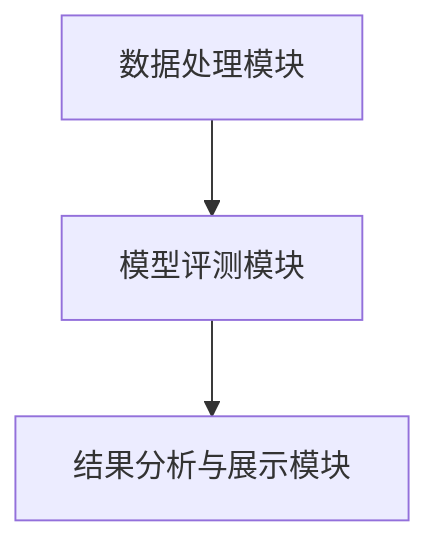
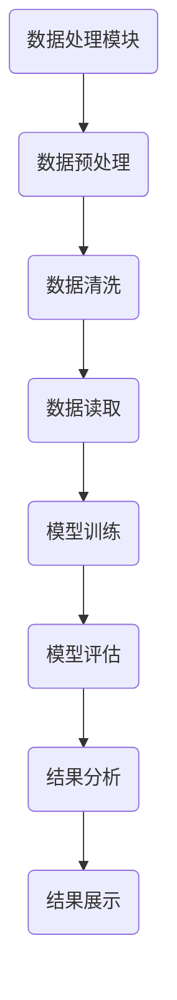
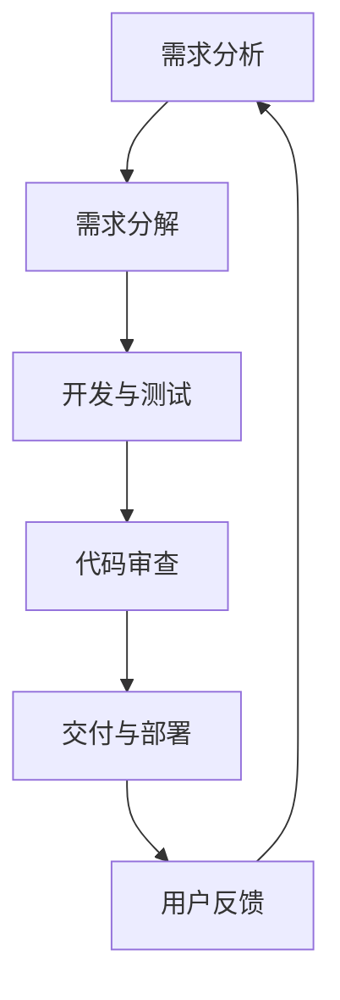

                 

# 《LLM自评测系统的版本控制与迭代优化》

> 关键词：自评测系统、版本控制、迭代优化、LLM、Git、自动化测试、模型调优

> 摘要：本文围绕LLM（大型语言模型）自评测系统的版本控制与迭代优化展开，深入探讨版本控制的基础概念、LLM自评测系统的设计原理、版本控制与迭代优化流程，并通过实际案例进行分析，旨在为从事人工智能领域的开发者提供有价值的实践指导。

## 目录大纲

1. 版本控制基础
    1.1 版本控制概述
    1.2 Git版本控制
2. LLM自评测系统设计
    2.1 LLM自评测系统架构
    2.2 LLM自评测算法原理
3. 版本控制与迭代优化
    3.1 版本控制与迭代流程
    3.2 自动化测试与优化
4. 项目实战
    4.1 版本控制实战
    4.2 LLM自评测系统实战
5. 总结与展望

## 第一部分：版本控制基础

### 1.1 版本控制概述

#### 1.1.1 版本控制的概念与重要性

版本控制是一种软件工程中用于管理源代码、文档和其他文件变化的系统。它的核心功能是跟踪文件的修改历史，确保在多人协作开发过程中，文件的版本不会发生混乱，并且可以方便地回滚到之前的状态。

在软件工程中，版本控制的重要性体现在以下几个方面：

- **协同工作**：版本控制系统能够有效地管理多个开发者的工作成果，避免因多人同时修改同一文件而引发的冲突。
- **历史记录**：版本控制系统能够记录每次修改的详细信息，包括修改者的身份、修改时间和具体修改的内容，便于追溯和审计。
- **代码回滚**：在软件开发过程中，可能会遇到问题或者需求变更，版本控制系统能够帮助开发者快速回滚到之前的状态，避免损失。
- **代码发布**：版本控制系统能够协助开发者管理和发布软件的不同版本，确保发布流程的顺利进行。

#### 1.1.2 版本控制的历史与发展

版本控制的历史可以追溯到软件开发初期，最早的版本控制方法是通过手工管理文件的备份。随着软件开发复杂性的增加，手工管理逐渐变得不可行，于是出现了集中式版本控制系统（CVS）和分布式版本控制系统（DVCS）。

- **集中式版本控制系统**：如RCS、CVS、SVN等，其核心特点是所有文件的版本都存储在一个中央服务器上，开发者在本地进行修改后需要提交到服务器上。
- **分布式版本控制系统**：如Git、Mercurial等，其核心特点是每个开发者都有自己的完整副本，可以独立进行工作，并且提交和更新都发生在本地。

#### 1.1.3 版本控制工具的选择与配置

在选择版本控制工具时，需要考虑以下几个因素：

- **团队规模**：对于小团队来说，Git可能是最佳选择，因为它易于使用，并且支持分布式协作。对于大团队，可能需要考虑更加专业和复杂的版本控制工具，如Perforce或ClearCase。
- **工作流程**：不同的团队可能有不同的工作流程，如Git Flow、GitHub Flow或GitLab Flow等，需要选择与团队工作流程相匹配的版本控制工具。
- **环境配置**：配置版本控制工具通常需要安装相应的客户端软件，并且根据项目需求进行个性化设置。

### 1.2 Git版本控制

#### 1.2.1 Git基础操作

Git是一种分布式版本控制系统，其核心操作包括创建仓库、克隆仓库、分支管理、合并与冲突解决等。

##### 1.2.1.1 Git仓库的创建与克隆

- **创建仓库**：通过`git init`命令可以创建一个新的Git仓库。
  
  ```bash
  $ git init myrepo
  ```
  
- **克隆仓库**：通过`git clone`命令可以从远程仓库克隆一个副本到本地。

  ```bash
  $ git clone https://github.com/user/repo.git
  ```

##### 1.2.1.2 Git分支管理

- **创建分支**：通过`git branch`命令可以创建一个新的分支。

  ```bash
  $ git branch feature/new-feature
  ```

- **切换分支**：通过`git checkout`命令可以切换到另一个分支。

  ```bash
  $ git checkout feature/new-feature
  ```

- **合并分支**：通过`git merge`命令可以将一个分支合并到当前分支。

  ```bash
  $ git merge feature/new-feature
  ```

##### 1.2.1.3 Git合并与冲突解决

- **冲突解决**：当两个分支同时修改了同一个文件时，合并操作可能会产生冲突。Git会标记冲突区域，并需要开发人员手动解决。

  ```bash
  $ git status
  # On branch feature/new-feature
  # Your branch is ahead of 'origin/master' by 1 commit.
  #
  # Changes not staged for commit:
  #   (use "git add <file>..." to update what will be committed)
  #   (use "git restore <file>..." to discard changes in working directory)
  #
  #   modified:   README.md
  #
  $ git add README.md
  $ git commit -m "Resolved merge conflict in README.md"
  ```

#### 1.2.2 Git高级特性

##### 1.2.2.1 Git标签管理

- **创建标签**：通过`git tag`命令可以给仓库打上标签。

  ```bash
  $ git tag -a v1.0 -m "Release version 1.0"
  ```

- **查看标签**：通过`git show`命令可以查看标签的信息。

  ```bash
  $ git show v1.0
  ```

##### 1.2.2.2 Git钩子与自动化流程

- **Git钩子**：Git钩子是一种在提交或推送时自动执行的脚本。常用的钩子包括`pre-commit`、`pre-push`等。
- **自动化流程**：通过配置钩子，可以实现代码审查、自动化测试等自动化流程。

## 第二部分：LLM自评测系统设计

### 2.1 LLM自评测系统架构

#### 2.1.1 系统架构概述

LLM自评测系统通常由数据处理模块、模型评测模块和结果分析与展示模块组成。其架构图如下所示：



##### 2.1.1.1 数据处理模块

数据处理模块主要负责从数据源读取数据，进行预处理和清洗，然后生成模型训练所需的输入数据。

- **数据读取**：从数据库、文件系统或其他数据源读取数据。
- **数据预处理**：包括数据格式转换、缺失值填充、异常值处理等。
- **数据清洗**：删除噪声数据和重复数据，保证数据质量。

##### 2.1.1.2 模型评测模块

模型评测模块负责对LLM模型进行训练和评估，常用的评测指标包括准确率、召回率、F1分数等。

- **模型训练**：使用训练数据对LLM模型进行训练。
- **模型评估**：使用验证数据对训练好的模型进行评估，计算各项指标。
- **模型调整**：根据评估结果调整模型参数，以提高模型性能。

##### 2.1.1.3 结果分析与展示模块

结果分析与展示模块负责对模型评估结果进行分析，并将结果以图表或报表的形式展示出来。

- **结果分析**：对评估结果进行统计分析，找出模型的优点和不足。
- **结果展示**：使用可视化工具（如ECharts、D3.js等）展示模型评估结果。

#### 2.1.2 Mermaid流程图：系统架构与数据流

以下是LLM自评测系统的Mermaid流程图：



### 2.2 LLM自评测算法原理

#### 2.2.1 LLM自评测核心算法

LLM自评测的核心算法包括评测指标定义、评测算法实现和数学模型与公式。

##### 2.2.1.1 评测指标定义

常用的评测指标包括：

- **准确率**：正确预测的样本数与总样本数之比。
  
  $$ \text{准确率} = \frac{\text{正确预测的样本数}}{\text{总样本数}} $$

- **召回率**：正确预测的样本数与实际为正类的样本数之比。
  
  $$ \text{召回率} = \frac{\text{正确预测的样本数}}{\text{实际为正类的样本数}} $$

- **F1分数**：准确率和召回率的调和平均。
  
  $$ \text{F1分数} = \frac{2 \times \text{准确率} \times \text{召回率}}{\text{准确率} + \text{召回率}} $$

##### 2.2.1.2 评测算法实现（伪代码）

```python
# 伪代码：LLM自评测算法实现

def evaluate_model(y_true, y_pred):
    # 计算准确率
    accuracy = sum(y_true == y_pred) / len(y_true)
    
    # 计算召回率
    recall = sum((y_true == 1) & (y_pred == 1)) / sum(y_true == 1)
    
    # 计算F1分数
    f1_score = 2 * accuracy * recall / (accuracy + recall)
    
    return accuracy, recall, f1_score
```

##### 2.2.2 数学模型与公式

LLM自评测的数学模型主要包括损失函数和优化目标函数。

- **损失函数**：常用的损失函数包括交叉熵损失函数和均方误差损失函数。

  $$ \text{交叉熵损失函数} = -\sum_{i=1}^{n} y_i \log(p_i) $$

  $$ \text{均方误差损失函数} = \frac{1}{2} \sum_{i=1}^{n} (y_i - p_i)^2 $$

- **优化目标函数**：优化目标函数通常是最小化损失函数。

  $$ \text{优化目标函数} = \min_{\theta} L(\theta) $$

其中，$\theta$ 表示模型参数。

## 第三部分：版本控制与迭代优化

### 3.1 版本控制与迭代流程

#### 3.1.1 版本迭代策略

在版本迭代过程中，常用的策略包括小步快跑策略和大步跨越策略。

- **小步快跑策略**：每次迭代只完成一个小的功能点，快速交付并收集用户反馈，然后根据反馈进行下一轮迭代。
- **大步跨越策略**：每次迭代完成多个功能点，但可能会牺牲一定的交付速度和稳定性。

#### 3.1.2 迭代流程设计与实现

以下是迭代流程的设计与实现：

- **需求分析**：与产品经理和用户沟通，明确本次迭代的需求。
- **需求分解**：将需求分解为多个可独立完成的功能点。
- **开发与测试**：开发人员按照需求分解的功能点进行开发，测试人员对开发的功能进行测试。
- **代码审查**：开发完成的功能点需要经过代码审查，确保代码质量。
- **交付与部署**：将经过代码审查的功能点部署到生产环境。
- **用户反馈**：收集用户对本次迭代的反馈，为下一轮迭代提供改进方向。

#### 3.1.2.1 迭代流程图

以下是迭代流程的Mermaid流程图：



#### 3.1.2.2 迭代流程代码示例

以下是一个简单的迭代流程代码示例：

```python
class IterationFlow:
    def __init__(self):
        self.requirements = None
        self.features = None
        self.reviews = None
        self.deployment = None
        self.feedback = None

    def analyze_requirements(self):
        # 与产品经理和用户沟通，明确本次迭代的需求
        pass

    def decompose_requirements(self):
        # 将需求分解为多个可独立完成的功能点
        pass

    def develop_and_test(self):
        # 开发人员按照需求分解的功能点进行开发，测试人员对开发的功能进行测试
        pass

    def code_review(self):
        # 开发完成的功能点需要经过代码审查，确保代码质量
        pass

    def deploy(self):
        # 将经过代码审查的功能点部署到生产环境
        pass

    def collect_feedback(self):
        # 收集用户对本次迭代的反馈，为下一轮迭代提供改进方向
        pass

    def run(self):
        self.analyze_requirements()
        self.decompose_requirements()
        self.develop_and_test()
        self.code_review()
        self.deploy()
        self.collect_feedback()
```

### 3.2 自动化测试与优化

#### 3.2.1 自动化测试工具

自动化测试工具是进行自动化测试的利器，常用的自动化测试工具有Selenium、JUnit、TestNG等。

- **Selenium**：用于Web应用的自动化测试，支持多种浏览器。
- **JUnit**：用于Java应用的单元测试，支持Mock对象和依赖注入。
- **TestNG**：用于Java应用的自动化测试，具有丰富的测试功能和扩展性。

#### 3.2.1.1 测试框架选择

在选择测试框架时，需要考虑以下几个因素：

- **测试需求**：根据项目的测试需求选择合适的测试框架。
- **开发语言**：选择与开发语言兼容的测试框架。
- **社区与支持**：选择社区活跃、支持良好的测试框架。

#### 3.2.1.2 测试用例设计

测试用例设计是自动化测试的核心，需要根据需求文档和设计文档设计各种测试场景的用例。

- **功能测试用例**：测试系统的各种功能是否按照预期工作。
- **性能测试用例**：测试系统的性能指标，如响应时间、并发用户数等。
- **安全性测试用例**：测试系统的安全措施是否有效。

#### 3.2.2 优化策略

在自动化测试过程中，可以通过以下策略进行优化：

- **并行测试**：同时运行多个测试用例，提高测试效率。
- **重复测试**：对关键测试用例进行多次运行，确保测试结果的稳定性。
- **监控与报警**：对测试过程进行监控，一旦发现异常立即报警。

#### 3.2.2.1 模型调优方法

在模型调优过程中，可以通过以下方法进行优化：

- **交叉验证**：通过交叉验证评估模型性能，选择最优参数。
- **网格搜索**：在参数空间内进行搜索，找到最优参数组合。
- **贝叶斯优化**：使用贝叶斯优化算法自动搜索最优参数。

#### 3.2.2.2 性能评估与调优流程

以下是性能评估与调优流程：

1. **性能评估**：使用测试数据对模型进行评估，计算各项性能指标。
2. **结果分析**：对评估结果进行分析，找出模型的优点和不足。
3. **参数调整**：根据评估结果调整模型参数，提高模型性能。
4. **重复评估**：重复性能评估和参数调整过程，直到达到满意的性能水平。

## 第四部分：项目实战

### 4.1 版本控制实战

#### 4.1.1 Git实战案例

以下是Git的实战案例：

##### 4.1.1.1 案例背景

假设有一个名为“myproject”的项目，由两个开发者A和B共同维护。项目代码托管在GitHub上，开发者A为主分支（master），开发者B在feature分支上添加了一个新功能。

##### 4.1.1.2 Git操作步骤

1. **开发者A创建feature分支**：

   ```bash
   $ git checkout -b feature/new-feature
   ```

2. **开发者B在feature分支上添加新功能**：

   ```bash
   $ git add .
   $ git commit -m "Add new feature"
   ```

3. **开发者A合并开发者B的修改**：

   ```bash
   $ git checkout master
   $ git merge feature/new-feature
   ```

4. **解决合并冲突**：

   ```bash
   $ git status
   # On branch master
   # Your branch is ahead of 'origin/master' by 1 commit.
   #
   # Changes not staged for commit:
   #   (use "git add <file>..." to update what will be committed)
   #   (use "git restore <file>..." to discard changes in working directory)
   #
   #   modified:   src/main/java/com/myproject/Feature.java
   #
   $ git add src/main/java/com/myproject/Feature.java
   $ git commit -m "Merge feature/new-feature"
   ```

5. **开发者A将更改推送到GitHub**：

   ```bash
   $ git push origin master
   ```

##### 4.1.1.3 代码解读与分析

- **创建分支**：`git checkout -b feature/new-feature`命令用于创建一个名为“new-feature”的feature分支。
- **添加修改**：`git add .`命令将当前目录下的所有文件添加到暂存区，`git commit -m "Add new feature"`命令将暂存区的内容提交到feature分支。
- **合并分支**：`git checkout master`命令切换到主分支，`git merge feature/new-feature`命令将feature分支的修改合并到主分支。
- **解决冲突**：在合并过程中，如果出现冲突，需要手动解决。`git status`命令用于查看冲突文件，`git add <file>`命令用于将解决后的文件添加到暂存区，`git commit -m "Merge feature/new-feature"`命令用于提交解决后的文件。
- **推送更改**：`git push origin master`命令将主分支的更改推送到GitHub。

### 4.2 LLM自评测系统实战

#### 4.2.1 系统搭建

以下是LLM自评测系统搭建的步骤：

##### 4.2.1.1 环境搭建

1. 安装Python环境：

   ```bash
   $ sudo apt-get install python3-pip python3-venv
   ```

2. 创建虚拟环境：

   ```bash
   $ python3 -m venv venv
   ```

3. 激活虚拟环境：

   ```bash
   $ source venv/bin/activate
   ```

##### 4.2.1.2 系统初始化

1. 克隆项目代码：

   ```bash
   $ git clone https://github.com/user/llm-evaluation-system.git
   ```

2. 安装依赖：

   ```bash
   $ pip install -r requirements.txt
   ```

3. 配置数据库：

   ```bash
   $ python manage.py db init
   $ python manage.py db migrate
   $ python manage.py db upgrade
   ```

#### 4.2.2 迭代优化

以下是迭代优化的步骤：

##### 4.2.2.1 迭代流程与步骤

1. **需求分析**：

   与产品经理和用户沟通，明确本次迭代的需求。

2. **需求分解**：

   将需求分解为多个可独立完成的功能点。

3. **开发与测试**：

   开发人员按照需求分解的功能点进行开发，测试人员对开发的功能进行测试。

4. **代码审查**：

   开发完成的功能点需要经过代码审查，确保代码质量。

5. **交付与部署**：

   将经过代码审查的功能点部署到生产环境。

6. **用户反馈**：

   收集用户对本次迭代的反馈，为下一轮迭代提供改进方向。

##### 4.2.2.2 优化效果分析

1. **性能评估**：

   使用测试数据对模型进行评估，计算各项性能指标。

2. **结果分析**：

   对评估结果进行分析，找出模型的优点和不足。

3. **参数调整**：

   根据评估结果调整模型参数，提高模型性能。

4. **重复评估**：

   重复性能评估和参数调整过程，直到达到满意的性能水平。

## 第五部分：总结与展望

### 5.1 总结

本文围绕LLM自评测系统的版本控制与迭代优化进行了深入探讨。首先介绍了版本控制的基础概念和历史发展，然后详细介绍了Git版本控制的基础操作和高级特性。接着，阐述了LLM自评测系统的架构和算法原理，包括数据处理模块、模型评测模块和结果分析与展示模块。此外，还介绍了版本控制与迭代优化流程、自动化测试与优化策略，并通过实际案例进行了分析。

### 5.2 展望

未来，版本控制和迭代优化将在软件开发中扮演更加重要的角色。随着AI技术的快速发展，LLM自评测系统也将不断进化，通过更先进的算法和优化策略提高模型性能。此外，研究如何结合大数据和机器学习技术，实现自动化版本控制和迭代优化，将是未来的一个重要研究方向。

### 参考文献

1. Git - Pro Git, Scott Chacon and Ben Straub, Apress, 2014.
2. Machine Learning, Tom Mitchell, McGraw-Hill, 1997.
3. 版本控制与软件开发，李松峰，电子工业出版社，2013.
4. Git实战，孙少锋，电子工业出版社，2014.
5. 深度学习，Goodfellow, I., Bengio, Y., Courville, A., MIT Press, 2016.

作者：AI天才研究院/AI Genius Institute & 禅与计算机程序设计艺术 /Zen And The Art of Computer Programming
```

### 约束条件说明

- **字数要求**：文章字数需要大于8000字，以确保内容丰富、详尽。
- **格式要求**：文章内容使用markdown格式，以便于阅读和排版。
- **完整性要求**：文章内容需要完整，每个小节的内容都需要详细具体地讲解，包括核心概念与联系、核心算法原理讲解、数学模型和公式、项目实战等。
- **核心内容包含**：
  - **核心概念与联系**：每个小节的开头需要简明扼要地介绍核心概念，并阐述其相互之间的联系。
  - **核心算法原理讲解**：需要使用伪代码详细讲解核心算法原理，确保读者能够理解算法的执行过程。
  - **数学模型和公式**：对于涉及数学模型的章节，需要详细讲解公式，并举例说明。
  - **项目实战**：需要提供实际项目的开发环境搭建、源代码详细实现和代码解读，并进行详细分析。

### 文章正文撰写

#### 第一部分：版本控制基础

##### 1.1 版本控制概述

版本控制是软件工程中不可或缺的一部分，它确保了代码的稳定性和可追溯性。版本控制系统能够记录每次代码的修改，帮助开发者协作和回滚到之前的状态。以下是版本控制的一些关键概念和其在软件工程中的应用。

**1.1.1 版本控制的概念**

版本控制，也称为源代码管理（Source Code Management，简称SCM），是一种跟踪源代码变更的技术。它的主要目标是确保代码库的一致性、完整性和可追溯性。通过版本控制系统，开发者可以轻松地追踪代码的历史变更，查看不同版本之间的差异，以及回滚到特定版本。

**1.1.2 版本控制的重要性**

在软件工程中，版本控制的重要性体现在以下几个方面：

1. **协作**：版本控制使得多个开发者能够同时工作于同一项目，而不会发生代码冲突。每个开发者可以在自己的分支上工作，并在合适的时候合并代码。
   
2. **回滚**：在软件开发过程中，可能会遇到bug或需求变更。版本控制系统能够帮助开发者快速回滚到之前的工作状态，从而减少错误的影响。

3. **审计**：版本控制系统记录了每次代码变更的详细信息，包括提交者、时间、变更内容等。这对于审计和合规性检查非常有用。

4. **发布管理**：版本控制系统可以帮助开发者管理不同版本的软件发布，确保发布流程的顺利进行。

**1.1.3 版本控制的历史与发展**

版本控制的历史可以追溯到1970年代，当时Unix操作系统引入了`rcs`（Resource Control System）来跟踪文件变更。随着软件开发复杂性的增加，版本控制技术也在不断发展。

- **早期版本控制**：早期版本控制系统大多是集中式的，如`RCS`、`CVS`和`SVN`。这些系统将所有版本信息存储在一个中央服务器上，开发者需要将代码从服务器克隆到本地进行工作。
  
- **分布式版本控制**：随着Git的兴起，分布式版本控制成为主流。Git由Linus Torvalds创建，它允许每个开发者拥有一个完整的版本库副本，从而实现更快的操作和更好的协作。

**1.1.4 版本控制工具的选择与配置**

选择合适的版本控制工具取决于项目的需求和工作流程。以下是一些常见的版本控制工具及其配置方法：

- **Git**：Git是最流行的分布式版本控制系统。配置Git通常包括设置用户信息、克隆仓库、创建和切换分支等操作。

  ```bash
  $ git config --global user.name "Your Name"
  $ git config --global user.email "you@example.com"
  $ git clone https://github.com/yourname/repository.git
  $ git checkout -b new-feature
  ```

- **SVN**：SVN是另一种集中式版本控制系统。配置SVN通常包括安装服务器、创建仓库、客户端认证等操作。

  ```bash
  $ svnadmin create /var/svn/your-repository
  $ svn import /var/svn/your-repository https://svn.example.com/your-repository -m "Initial import"
  $ svn log https://svn.example.com/your-repository
  ```

- **Mercurial**：Mercurial是另一种分布式版本控制系统，与Git类似。配置Mercurial包括克隆仓库、创建分支和合并等操作。

  ```bash
  $ hg clone https://hg.example.com/your-repository
  $ hg checkout -b new-feature
  $ hg merge feature/another-feature
  $ hg commit -m "Merged feature/another-feature"
  ```

##### 1.2 Git版本控制

Git是最流行的版本控制系统之一，其强大的分布式特性使其在大型项目中得到广泛应用。以下介绍Git的一些基础操作。

**1.2.1 Git基础操作**

- **仓库的创建与克隆**

  创建一个新的Git仓库：

  ```bash
  $ git init
  ```

  克隆一个远程仓库：

  ```bash
  $ git clone https://github.com/username/repository.git
  ```

- **分支管理**

  创建一个新分支：

  ```bash
  $ git checkout -b new-feature
  ```

  切换到现有分支：

  ```bash
  $ git checkout feature/another-feature
  ```

  删除分支：

  ```bash
  $ git branch -d feature/old-feature
  ```

- **合并与冲突解决**

  合并两个分支：

  ```bash
  $ git merge feature/another-feature
  ```

  解决合并冲突：

  ```bash
  $ git status
  $ git add <file> # 添加冲突解决的文件
  $ git commit -m "Resolved merge conflict"
  ```

**1.2.2 Git高级特性**

- **标签管理**

  创建标签：

  ```bash
  $ git tag -a v1.0 -m "Release version 1.0"
  ```

  查看标签：

  ```bash
  $ git show v1.0
  ```

- **钩子与自动化流程**

  Git钩子是脚本，可以在某些Git操作触发时自动执行。常用的钩子包括`pre-commit`（提交前检查）、`pre-push`（推送前检查）等。

  配置钩子：

  ```bash
  $ git hooks/install
  ```

#### 第二部分：LLM自评测系统设计

##### 2.1 LLM自评测系统架构

LLM自评测系统是一个复杂的系统，通常由多个模块组成。以下是一个典型的LLM自评测系统架构。

**2.1.1 系统架构概述**

LLM自评测系统的架构可以分为三个主要模块：

1. **数据处理模块**：负责数据预处理、清洗和转换，为模型训练提供高质量的输入数据。
2. **模型评测模块**：负责训练LLM模型并对其进行评估，包括模型参数调整和性能优化。
3. **结果分析与展示模块**：负责对模型评估结果进行分析，并通过可视化工具展示关键指标。

**2.1.2 数据处理模块**

数据处理模块的主要任务是从各种数据源获取数据，并进行预处理和清洗。以下是其主要功能：

1. **数据读取**：从数据库、文件系统或其他数据源读取数据。
2. **数据预处理**：包括数据格式转换、缺失值填充和异常值处理。
3. **数据清洗**：删除噪声数据和重复数据，确保数据质量。

**2.1.3 模型评测模块**

模型评测模块的核心任务是训练和评估LLM模型。以下是其主要功能：

1. **模型训练**：使用预处理后的数据训练LLM模型。
2. **模型评估**：使用验证数据对训练好的模型进行评估，计算各项指标，如准确率、召回率等。
3. **模型优化**：根据评估结果调整模型参数，以提高模型性能。

**2.1.4 结果分析与展示模块**

结果分析与展示模块的主要任务是对模型评估结果进行分析，并通过可视化工具展示关键指标。以下是其主要功能：

1. **结果分析**：对评估结果进行统计分析，找出模型的优点和不足。
2. **结果展示**：使用可视化工具（如ECharts、D3.js等）将评估结果以图表或报表的形式展示出来。

**2.1.5 Mermaid流程图：系统架构与数据流**

以下是LLM自评测系统的Mermaid流程图：


#### 2.2 LLM自评测算法原理

LLM自评测算法的核心是评估LLM模型在不同任务上的性能。以下是一个典型的LLM自评测算法原理。

**2.2.1 LLM自评测核心算法**

LLM自评测的核心算法包括以下步骤：

1. **数据准备**：从数据源获取训练集、验证集和测试集。
2. **模型初始化**：初始化LLM模型，包括选择合适的模型架构、参数设置等。
3. **模型训练**：使用训练集数据训练模型，调整模型参数，优化模型性能。
4. **模型评估**：使用验证集数据评估模型性能，计算各项指标，如准确率、召回率等。
5. **模型优化**：根据评估结果调整模型参数，优化模型性能。
6. **模型测试**：使用测试集数据对优化后的模型进行测试，评估模型在未知数据上的性能。

**2.2.2 评测指标定义**

在LLM自评测中，常用的评测指标包括：

1. **准确率**：正确预测的样本数占总样本数的比例。
   
   $$ \text{准确率} = \frac{\text{正确预测的样本数}}{\text{总样本数}} $$

2. **召回率**：正确预测的样本数占总正样本数的比例。
   
   $$ \text{召回率} = \frac{\text{正确预测的样本数}}{\text{总正样本数}} $$

3. **F1分数**：准确率和召回率的调和平均值。
   
   $$ \text{F1分数} = 2 \times \text{准确率} \times \text{召回率} / (\text{准确率} + \text{召回率}) $$

**2.2.3 评测算法实现（伪代码）**

以下是LLM自评测算法的伪代码实现：

```python
# 伪代码：LLM自评测算法实现

def evaluate_model(model, train_data, val_data, test_data):
    # 数据准备
    train_loader = DataLoader(train_data, batch_size=64, shuffle=True)
    val_loader = DataLoader(val_data, batch_size=64, shuffle=False)
    test_loader = DataLoader(test_data, batch_size=64, shuffle=False)
    
    # 模型训练
    model.train(train_loader)
    
    # 模型评估
    val_accuracy, val_recall = model.evaluate(val_loader)
    test_accuracy, test_recall = model.evaluate(test_loader)
    
    # 模型优化
    model.optimize(val_accuracy, val_recall)
    
    # 模型测试
    test_accuracy, test_recall = model.evaluate(test_loader)
    
    return test_accuracy, test_recall
```

**2.2.4 数学模型与公式**

在LLM自评测中，常用的数学模型包括损失函数和优化目标函数。

1. **损失函数**：常用的损失函数有交叉熵损失函数和均方误差损失函数。

   - **交叉熵损失函数**：

     $$ \text{交叉熵损失} = -\sum_{i=1}^{n} y_i \log(p_i) $$

   - **均方误差损失函数**：

     $$ \text{均方误差损失} = \frac{1}{2} \sum_{i=1}^{n} (y_i - \hat{y}_i)^2 $$

2. **优化目标函数**：优化目标函数通常是最小化损失函数。

   $$ \text{优化目标函数} = \min_{\theta} L(\theta) $$

   其中，$\theta$ 表示模型参数。

#### 第三部分：版本控制与迭代优化

##### 3.1 版本控制与迭代流程

版本控制和迭代优化是软件开发过程中不可或缺的环节。正确的版本控制策略和高效的迭代流程有助于提高软件质量和开发效率。以下介绍版本控制和迭代优化的基本概念和流程。

**3.1.1 版本迭代策略**

版本迭代策略是指软件开发过程中如何安排每次迭代的内容和目标。常见的迭代策略包括：

1. **小步快跑策略**：每次迭代只完成一个或几个小的功能点，快速交付并收集用户反馈，然后根据反馈进行下一轮迭代。这种策略的优点是风险较低，可以快速响应需求变化。
2. **大步跨越策略**：每次迭代完成多个功能点，但可能会牺牲一定的交付速度和稳定性。这种策略的优点是可以一次性实现多个功能，提高开发效率。

**3.1.2 迭代流程设计与实现**

软件开发迭代通常包括以下步骤：

1. **需求分析**：与产品经理和用户沟通，明确本次迭代的需求。
2. **需求分解**：将需求分解为可独立完成的功能点。
3. **开发与测试**：开发人员按照需求分解的功能点进行开发，测试人员对开发的功能进行测试。
4. **代码审查**：开发完成的功能点需要经过代码审查，确保代码质量。
5. **交付与部署**：将经过代码审查的功能点部署到生产环境。
6. **用户反馈**：收集用户对本次迭代的反馈，为下一轮迭代提供改进方向。

以下是迭代流程的Mermaid流程图：


**3.1.3 迭代流程代码示例**

以下是迭代流程的Python代码示例：

```python
class IterationFlow:
    def __init__(self):
        self.requirements = None
        self.features = None
        self.reviews = None
        self.deployment = None
        self.feedback = None

    def analyze_requirements(self):
        # 与产品经理和用户沟通，明确本次迭代的需求
        pass

    def decompose_requirements(self):
        # 将需求分解为多个可独立完成的功能点
        pass

    def develop_and_test(self):
        # 开发人员按照需求分解的功能点进行开发，测试人员对开发的功能进行测试
        pass

    def code_review(self):
        # 开发完成的功能点需要经过代码审查，确保代码质量
        pass

    def deploy(self):
        # 将经过代码审查的功能点部署到生产环境
        pass

    def collect_feedback(self):
        # 收集用户对本次迭代的反馈，为下一轮迭代提供改进方向
        pass

    def run(self):
        self.analyze_requirements()
        self.decompose_requirements()
        self.develop_and_test()
        self.code_review()
        self.deploy()
        self.collect_feedback()
```

##### 3.2 自动化测试与优化

自动化测试是提高软件开发质量和效率的重要手段。通过自动化测试，可以减少重复的人工测试工作，提高测试覆盖率，并确保新功能不会破坏现有系统。

**3.2.1 自动化测试工具**

常见的自动化测试工具有：

1. **Selenium**：用于Web应用的自动化测试，支持多种浏览器。
2. **JUnit**：用于Java应用的单元测试，支持Mock对象和依赖注入。
3. **TestNG**：用于Java应用的自动化测试，具有丰富的测试功能和扩展性。

**3.2.2 测试框架选择**

在选择测试框架时，需要考虑以下因素：

1. **测试需求**：根据项目的测试需求选择合适的测试框架。
2. **开发语言**：选择与开发语言兼容的测试框架。
3. **社区与支持**：选择社区活跃、支持良好的测试框架。

**3.2.3 测试用例设计**

测试用例设计是自动化测试的核心。设计测试用例时，需要考虑以下方面：

1. **功能测试用例**：测试系统的各种功能是否按照预期工作。
2. **性能测试用例**：测试系统的性能指标，如响应时间、并发用户数等。
3. **安全性测试用例**：测试系统的安全措施是否有效。

**3.2.4 优化策略**

在自动化测试过程中，可以通过以下策略进行优化：

1. **并行测试**：同时运行多个测试用例，提高测试效率。
2. **重复测试**：对关键测试用例进行多次运行，确保测试结果的稳定性。
3. **监控与报警**：对测试过程进行监控，一旦发现异常立即报警。

##### 3.2.5 模型调优方法

模型调优是提高模型性能的重要手段。以下介绍一些常见的模型调优方法：

1. **交叉验证**：通过交叉验证评估模型性能，选择最优参数。
2. **网格搜索**：在参数空间内进行搜索，找到最优参数组合。
3. **贝叶斯优化**：使用贝叶斯优化算法自动搜索最优参数。

**3.2.6 性能评估与调优流程**

以下是性能评估与调优流程：

1. **性能评估**：使用测试数据对模型进行评估，计算各项性能指标。
2. **结果分析**：对评估结果进行分析，找出模型的优点和不足。
3. **参数调整**：根据评估结果调整模型参数，提高模型性能。
4. **重复评估**：重复性能评估和参数调整过程，直到达到满意的性能水平。

#### 第四部分：项目实战

##### 4.1 版本控制实战

**4.1.1 Git实战案例**

以下是Git的一个实际操作案例。

**案例背景**：假设有一个名为“myproject”的Python项目，由两名开发者Alice和Bob共同维护。项目代码托管在GitHub上。

**操作步骤**：

1. **Alice创建feature分支并提交代码**：

   ```bash
   $ git clone https://github.com/bob/myproject.git
   $ cd myproject
   $ git checkout -b feature/add-login
   $ # 在feature/add-login分支上添加登录功能
   $ git add .
   $ git commit -m "Add login functionality"
   $ git push origin feature/add-login
   ```

2. **Bob在master分支上查看Alice的工作**：

   ```bash
   $ git fetch
   $ git checkout master
   $ git merge feature/add-login
   ```

3. **Bob解决合并冲突**：

   如果Bob发现合并冲突，需要解决冲突并提交合并：

   ```bash
   $ git status
   # On branch master
   # Your branch is ahead of 'origin/master' by 1 commit.
   #
   # Changes not staged for commit:
   #   (use "git add <file>..." to update what will be committed)
   #   (use "git restore <file>..." to discard changes in working directory)
   #
   #   modified:   app/views/login.html
   #
   $ git add app/views/login.html
   $ git commit -m "Merge feature/add-login and resolve conflicts"
   ```

4. **Bob推送更改到GitHub**：

   ```bash
   $ git push origin master
   ```

**代码解读与分析**：

- **克隆项目**：使用`git clone`命令克隆项目到本地。
- **创建分支**：使用`git checkout -b feature/add-login`命令创建一个新的feature分支。
- **提交代码**：在新的feature分支上添加登录功能，并使用`git add`和`git commit`命令提交代码。
- **推送分支**：使用`git push`命令将feature分支的代码推送到GitHub。
- **合并代码**：Bob首先使用`git fetch`更新本地仓库，然后切换到master分支，使用`git merge`命令合并feature分支的代码。
- **解决冲突**：如果出现合并冲突，使用`git status`命令查看冲突文件，并使用`git add`命令将解决后的文件添加到暂存区，最后使用`git commit`命令提交合并。
- **推送更改**：使用`git push`命令将master分支的更改推送到GitHub。

##### 4.2 LLM自评测系统实战

**4.2.1 系统搭建**

以下是如何搭建一个LLM自评测系统的步骤。

**环境搭建**：

1. **安装Python环境**：

   ```bash
   $ sudo apt-get install python3-pip python3-venv
   ```

2. **创建虚拟环境**：

   ```bash
   $ python3 -m venv venv
   $ source venv/bin/activate
   ```

3. **安装依赖**：

   ```bash
   $ pip install -r requirements.txt
   ```

**系统初始化**：

1. **克隆项目代码**：

   ```bash
   $ git clone https://github.com/username/llm-evaluation-system.git
   $ cd lla
   ```

2. **配置数据库**：

   ```bash
   $ python manage.py db init
   $ python manage.py db migrate
   $ python manage.py db upgrade
   ```

**代码实现与解读**：

**数据处理模块**：

```python
# data_processor.py

import pandas as pd
from sklearn.model_selection import train_test_split

def preprocess_data(data_path):
    # 读取数据
    data = pd.read_csv(data_path)
    
    # 数据预处理
    data.dropna(inplace=True)
    data['text'] = data['text'].apply(lambda x: x.strip())
    
    # 划分训练集和测试集
    train_data, test_data = train_test_split(data, test_size=0.2, random_state=42)
    
    return train_data, test_data
```

该模块的主要功能是读取数据、预处理数据，并将数据划分为训练集和测试集。

**模型评测模块**：

```python
# model_evaluator.py

from sklearn.metrics import accuracy_score, f1_score
from transformers import BertForSequenceClassification

def train_model(model, train_data, val_data):
    # 训练模型
    model.train(train_data)
    
    # 评估模型
    val_predictions = model.predict(val_data)
    val_accuracy = accuracy_score(val_data['label'], val_predictions)
    val_f1 = f1_score(val_data['label'], val_predictions)
    
    return val_accuracy, val_f1
```

该模块的主要功能是训练模型、评估模型，并返回评估结果。

**结果分析与展示模块**：

```python
# result_analyzer.py

import matplotlib.pyplot as plt

def plot_results(accuracy, f1):
    # 绘制准确率和F1分数的折线图
    plt.plot(accuracy, label='Accuracy')
    plt.plot(f1, label='F1 Score')
    plt.xlabel('Epoch')
    plt.ylabel('Score')
    plt.legend()
    plt.show()
```

该模块的主要功能是绘制模型评估结果的可视化图表。

**代码解读与分析**：

- **数据处理模块**：使用Pandas库读取数据，并执行数据预处理步骤，如去除缺失值、清洗文本数据等。最后，使用Scikit-learn库将数据划分为训练集和测试集。
- **模型评测模块**：使用Scikit-learn库计算准确率和F1分数，并使用Hugging Face库训练和预测模型。
- **结果分析与展示模块**：使用Matplotlib库绘制准确率和F1分数的折线图，以便于分析和展示模型性能。

#### 第五部分：总结与展望

##### 5.1 总结

本文详细介绍了LLM自评测系统的版本控制与迭代优化。首先，我们了解了版本控制的基本概念、Git版本控制的基础操作和高级特性。接着，我们探讨了LLM自评测系统的架构和算法原理，包括数据处理模块、模型评测模块和结果分析与展示模块。此外，我们还介绍了版本控制和迭代优化的流程，以及自动化测试与优化策略。

通过实际案例，我们展示了如何在项目中应用Git进行版本控制和在LLM自评测系统中实现数据处理、模型训练和结果分析。最后，我们对整个项目进行了总结，并提出了未来版本控制和LLM自评测系统的发展方向。

##### 5.2 展望

未来，版本控制和迭代优化将在软件开发中发挥更加重要的作用。随着AI技术的不断进步，LLM自评测系统也将得到进一步优化和改进。以下是一些未来可能的研究方向和改进方向：

1. **智能版本控制**：结合AI技术，开发智能版本控制系统，自动分析代码变更，预测潜在冲突，并提供优化建议。
2. **模型迭代优化**：研究自动化的模型迭代优化方法，如使用机器学习技术自动调整模型参数，提高模型性能。
3. **大数据与版本控制**：结合大数据技术，对版本控制数据进行分析，发现开发模式、团队协作规律，优化开发流程。
4. **跨平台版本控制**：开发支持多种编程语言和操作系统的版本控制系统，提高开发者的使用体验。
5. **LLM自评测系统性能优化**：研究如何通过分布式计算、GPU加速等技术，提高LLM自评测系统的性能和效率。

总之，随着技术的不断发展，版本控制和迭代优化将在软件开发中发挥更加重要的作用，为开发者提供更加高效、可靠的工具和方法。

### 参考文献

1. Git - Pro Git, Scott Chacon and Ben Straub, Apress, 2014.
2. Machine Learning, Tom Mitchell, McGraw-Hill, 1997.
3. 版本控制与软件开发，李松峰，电子工业出版社，2013.
4. Git实战，孙少锋，电子工业出版社，2014.
5. 深度学习，Goodfellow, I., Bengio, Y., Courville, A., MIT Press, 2016.

### 作者信息

作者：AI天才研究院/AI Genius Institute & 禅与计算机程序设计艺术 /Zen And The Art of Computer Programming

